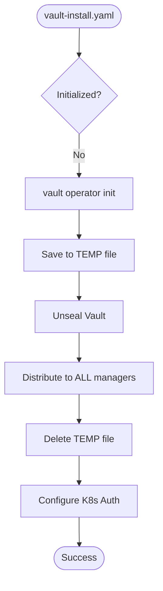
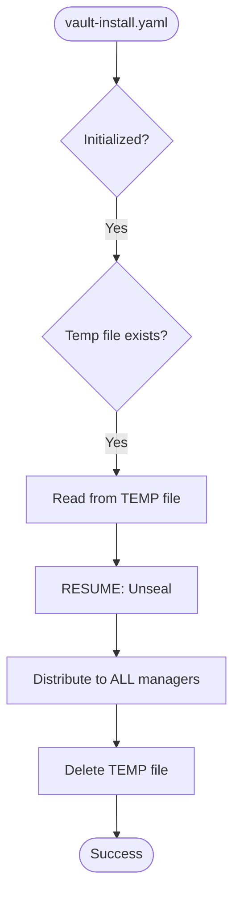
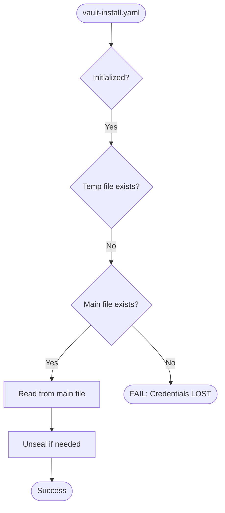
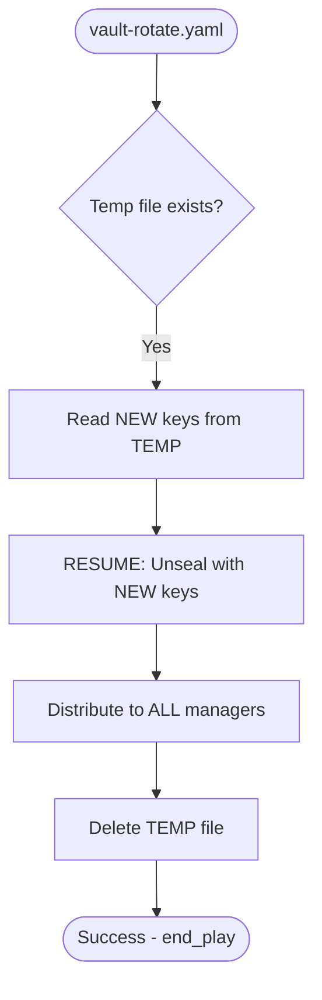
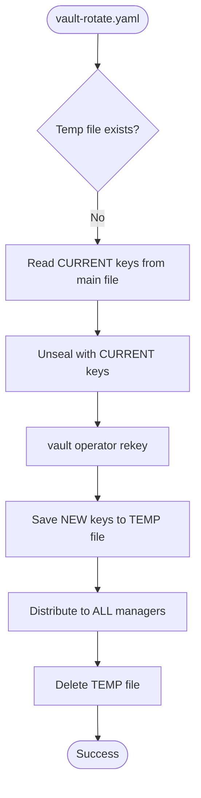
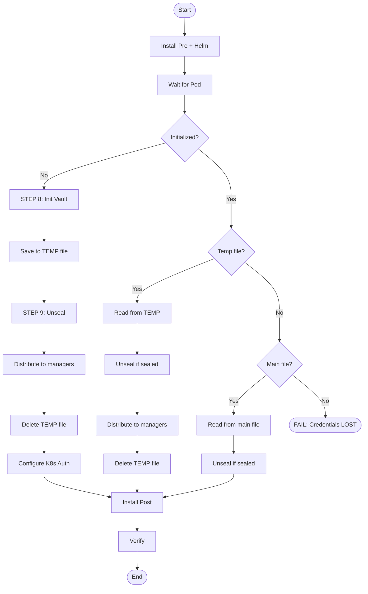

# Vault Fault Tolerance (Отказоустойчивость)

## Проблема

При работе с Vault есть критические операции, прерывание которых может привести к потере ключей:

### Сценарий 1: Прерывание vault-install.yaml

```
1. STEP 8: vault operator init → SUCCESS (ключи сгенерированы)
2. STEP 9: unseal → SUCCESS
3. STEP 10-11: configure → SUCCESS
4. Distribute credentials → FAIL (сеть, права, и т.д.)
5. Playbook завершается с ошибкой

Результат:
- Vault инициализирован
- Ключи были только в памяти playbook → ПОТЕРЯНЫ
- Файл credentials не создан
- Повторный запуск → FAIL "Credentials LOST"
```

### Сценарий 2: Прерывание vault-rotate.yaml

```
1. Rekey → SUCCESS (новые ключи сгенерированы)
2. Старые ключи теперь НЕВАЛИДНЫ
3. Distribute credentials → FAIL
4. Playbook завершается с ошибкой

Результат:
- Новые ключи потеряны
- Старые ключи невалидны
- Vault невозможно unseal → КРИТИЧЕСКИЙ ОТКАЗ
```

## Решение: Временные файлы (State Files)

Паттерн заимствован из `etcd-key-rotate.yaml`:

1. **ПЕРЕД** критической операцией → сохраняем ключи во временный файл
2. Выполняем операцию (unseal, configure)
3. Доставляем credentials на ВСЕ managers
4. **ПОСЛЕ** успешной доставки → удаляем временный файл
5. При повторном запуске → проверяем временный файл для resume

```
┌─────────────────────────────────────────────────────────────────┐
│                    FAULT TOLERANCE PATTERN                      │
├─────────────────────────────────────────────────────────────────┤
│                                                                 │
│  1. Generate keys                                               │
│        │                                                        │
│        ▼                                                        │
│  2. Save to TEMP file ←── checkpoint                            │
│        │                                                        │
│        ▼                                                        │
│  3. Unseal / Configure                                          │
│        │                                                        │
│        ▼                                                        │
│  4. Distribute to ALL managers                                  │
│        │                                                        │
│        ▼                                                        │
│  5. Delete TEMP file ←── success                                │
│                                                                 │
│  ═══════════════════════════════════════════════════════════    │
│                                                                 │
│  On FAILURE at any step:                                        │
│  - TEMP file still exists                                       │
│  - Re-run playbook → detects TEMP → resumes from step 3         │
│                                                                 │
└─────────────────────────────────────────────────────────────────┘
```

## Файлы и пути

| Файл | Путь | Назначение |
|------|------|------------|
| Основной | `/etc/kubernetes/vault-unseal.json` | Финальные credentials на всех managers |
| Temp (install) | `/etc/kubernetes/vault-creds-init.json.tmp` | Временный файл при первой инициализации |
| Temp (rotate) | `/etc/kubernetes/vault-creds-rotate.json.tmp` | Временный файл при ротации ключей |

### Формат файлов

```json
{
  "root_token": "hvs.xxxxxxxxxxxxx",
  "unseal_keys": [
    "key1_base64",
    "key2_base64",
    "key3_base64"
  ],
  "key_threshold": 2
}
```

**Permissions**: `0600` (root only)

## vault-install.yaml: Сценарии

### Сценарий 1: NOT INIT (первая установка)



**Порядок операций:**
1. `vault operator init` → получаем ключи
2. Сохраняем в temp файл (`vault-creds-init.json.tmp`)
3. Unseal
4. Distribute на все managers (записывает в `vault-unseal.json`)
5. Удаляем temp файл

### Сценарий 2: INIT + есть temp файл (прерванная установка)



**Порядок операций:**
1. Обнаружен temp файл → RESUME
2. Читаем ключи из temp файла
3. Unseal (если sealed)
4. Distribute на все managers
5. Удаляем temp файл

### Сценарий 3: INIT + нет temp файла (нормальный повторный запуск)



**Порядок операций:**
1. Нет temp файла → проверяем основной файл
2. Если основной файл есть → читаем, unseal если нужно
3. Если основного файла нет → **FAIL** (ключи потеряны)

## vault-rotate.yaml: Сценарии

### Сценарий 1: Есть temp файл (прерванная ротация)



**Порядок операций:**
1. Обнаружен temp файл → RESUME
2. Читаем НОВЫЕ ключи из temp файла
3. Unseal новыми ключами
4. Distribute на все managers
5. Удаляем temp файл
6. `meta: end_play` (пропускаем rekey)

### Сценарий 2: Нет temp файла (свежая ротация)



**Порядок операций:**
1. Читаем текущие ключи из основного файла
2. Unseal текущими ключами (если sealed)
3. `vault operator rekey` → получаем новые ключи
4. Сохраняем НОВЫЕ ключи в temp файл
5. Distribute на все managers
6. Удаляем temp файл

## Полная диаграмма vault-install.yaml



## Переменные в hosts.yaml

```yaml
# Path to credentials file on control-plane nodes
vault_creds_host_path: "/etc/kubernetes/vault-unseal.json"

# Temp file for interrupted init
vault_creds_init_tmp_path: "/etc/kubernetes/vault-creds-init.json.tmp"

# Temp file for interrupted rotate
vault_creds_rotate_tmp_path: "/etc/kubernetes/vault-creds-rotate.json.tmp"
```

## Проверка состояния

### Проверить наличие temp файлов

```bash
# На master manager
ls -la /etc/kubernetes/vault-creds-*.tmp

# Если temp файл существует - была прерванная операция
# Перезапустите playbook для завершения
```

### Проверить основной файл credentials

```bash
# На всех managers
ls -la /etc/kubernetes/vault-unseal.json
cat /etc/kubernetes/vault-unseal.json | jq .
```

## Recovery сценарии

### Temp файл существует

```bash
# Просто перезапустите playbook
ansible-playbook -i hosts.yaml playbook-app/vault-install.yaml --limit <master_manager>
# или
ansible-playbook -i hosts.yaml playbook-app/vault-rotate.yaml --limit <master_manager>
```

### Credentials полностью потеряны (нет ни temp, ни main файла)

```bash
# КРИТИЧЕСКАЯ СИТУАЦИЯ
# Vault инициализирован, но ключи потеряны
# Единственное решение - переинициализация:

# 1. Удалить PVC
kubectl delete pvc -n vault data-vault-0

# 2. Удалить pod (для пересоздания)
kubectl delete pod -n vault vault-0

# 3. Перезапустить установку
ansible-playbook -i hosts.yaml playbook-app/vault-install.yaml --limit <master_manager>

# ВНИМАНИЕ: Все секреты в Vault будут потеряны!
```
