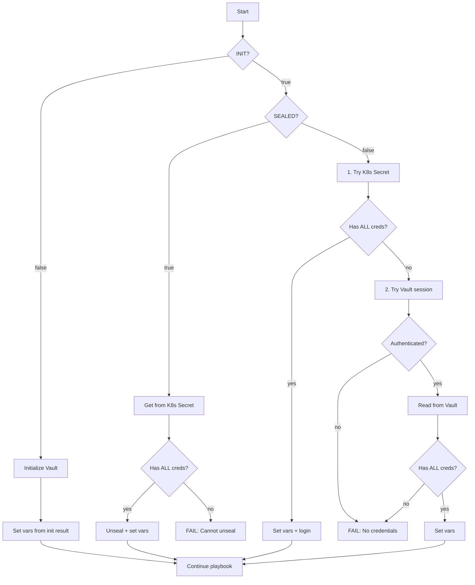

# Vault Installation Logic

## Структура Playbook

```
STEP 0:  Find master secret in vault_eso.secrets
STEP 1:  Install PRE (NetworkPolicies)
STEP 2:  Install Vault (Helm Chart)
STEP 4:  Wait for pod Running
STEP 5:  Check initialization status
  5.1:   Check seal status (if initialized)
  5.2:   Get credentials + Unseal (if SEALED)
  5.3:   Get credentials (if UNSEALED)
STEP 6:  Initialize Vault (if not initialized)
STEP 7:  Unseal Vault (after init)
STEP 8:  Configure Kubernetes auth (after init)
STEP 9:  Enable KV secrets engine (after init)
STEP 10: Save credentials to Vault (after init)
STEP 11: Sync policies and roles (ALWAYS)
STEP 12: Install POST (Ingress + ESO)
STEP 13: Verify and output
```

## Схема получения Credentials



## Таблица сценариев

| Состояние | K8s Secret | Vault Session | Vault Storage | Результат |
|-----------|------------|---------------|---------------|-----------|
| INIT=false | - | - | - | Init, получаем ВСЕ из результата |
| SEALED | есть (ALL) | - | - | Unseal + set vars |
| SEALED | неполный/нет | - | - | **FAIL** |
| UNSEALED | есть (ALL) | - | - | Set vars + login |
| UNSEALED | неполный/нет | есть | есть (ALL) | Fallback на Vault |
| UNSEALED | неполный/нет | есть | неполный/нет | **FAIL** |
| UNSEALED | неполный/нет | нет | - | **FAIL** |

**ALL = root_token + unseal_key_1 + unseal_key_2 + unseal_key_3**

## Приоритет источников credentials

1. **K8s Secret (ESO synced)** - проверяется первым, имеет приоритет
2. **Vault session** - fallback, только если K8s Secret не содержит credentials

## Детали по шагам

### STEP 0: Find Master Secret

```yaml
- name: "[vault] Find master secret in vault_eso.secrets"
  set_fact:
    vault_master_secret: "{{ vault_eso.secrets | selectattr('is_master', 'defined') | selectattr('is_master', 'equalto', true) | first }}"
```

Playbook находит секрет с `is_master: true` в массиве `vault_eso.secrets` из `hosts.yaml`.

### STEP 1-2: Install PRE и Vault

- **PRE**: NetworkPolicies для Vault namespace
- **Vault**: Official HashiCorp Helm chart со standalone Raft storage

### STEP 5: Check and Handle Vault State

#### 5.1: Check Seal Status

```bash
kubectl exec vault-0 -- vault status -format=json | jq -r '.sealed'
```

#### 5.2: Handle SEALED State

Если Vault sealed:
1. Получаем credentials из K8s Secret (synced by ESO)
2. Если нет credentials - **FAIL** (cannot unseal)
3. Unseal с recovered keys

#### 5.3: Handle UNSEALED State

Если Vault unsealed:
1. **Сначала**: Пробуем K8s Secret (ESO synced)
2. **Fallback**: Пробуем existing Vault session + read from Vault storage
3. Если ничего не работает - **FAIL**

### STEP 6-10: First-time Initialization

Запускается только если `vault_initialized.stdout == "false"`:

1. **Initialize**: Generate unseal keys и root token
2. **Unseal**: Use threshold keys to unseal
3. **Configure Kubernetes auth**: Enable и configure auth method
4. **Enable KV engine**: Create secret storage at `secret/` path
5. **Save credentials**: Store root_token и unseal_keys в Vault

### STEP 11: Sync Policies and Roles

**Запускается ВСЕГДА** - синхронизирует policies и roles из `hosts.yaml`:
- Creates/updates Vault policies
- Creates/updates Kubernetes auth roles

### STEP 12: Install POST

Устанавливает через Helm:
- Traefik Ingress для Vault UI
- ESO resources (ServiceAccount, SecretStore, ExternalSecret)

ESO синхронизирует credentials из Vault в K8s Secret.

### STEP 13: Verify

Показывает:
- Helm releases status
- Unseal keys (if available)
- Root token (if available)
- Vault UI URL

## Важные замечания

1. **unseal_keys ВСЕГДА обязательны** - без них Vault будет навсегда заблокирован после restart pod'а
2. **K8s Secret имеет приоритет** - ESO-synced secret проверяется перед Vault session
3. **Расположение credentials**:
   - Vault storage: `secret/<vault_path>` (из `vault_master_secret.vault_path`)
   - K8s Secret: `<target_secret>` в vault namespace (из `vault_master_secret.target_secret`)

## Конфигурация в hosts.yaml

```yaml
vault_eso:
  sa_name: "eso-vault-self"
  role_name: "eso-vault-self"
  secret_store_name: "eso-vault-self"
  secrets:
    - name: "eso-vault-self-creds"
      target_secret: "eso-vault-self-creds"
      vault_path: "ns-vault/vault-self/creds"
      is_master: true
```

## Сценарии ошибок

### Сценарий 1: Sealed Vault без K8s Secret

```
Vault is initialized and sealed, but no credentials found in K8s Secret.
Cannot unseal.
```

**Решение**: Вручную unseal с сохранёнными unseal keys или восстановить K8s Secret.

### Сценарий 2: Unsealed Vault без credentials

```
Vault is initialized and unsealed, but no credentials found.
Checked:
  1. K8s Secret: not found
  2. Vault session: not authenticated
  3. Vault storage: not found or not checked
```

**Решение**: Вручную login с root token и сохранить credentials в Vault.

## Связанные файлы

- Playbook: `playbooks/apps/vault-install.yaml`
- Policy Sync task: `playbooks/apps/tasks/tasks-vault-policy-sync.yaml`
- Pre chart: `playbooks/apps/charts/vault/pre/`
- Install chart: `playbooks/apps/charts/vault/install/`
- Post chart: `playbooks/apps/charts/vault/post/`
