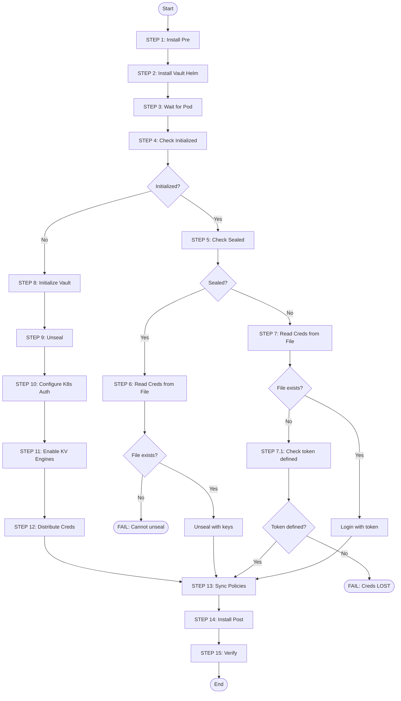

# Vault Installation and Initialization Process

## Overview

Playbook: `playbook-app/vault-install.yaml`

Процесс установки Vault состоит из 15 шагов и поддерживает 3 сценария:
1. **Первая установка** - Vault не initialized
2. **Повторный запуск (unsealed)** - Vault initialized и unsealed
3. **Повторный запуск (sealed)** - Vault initialized но sealed (после рестарта)

## Flow Diagram



## Step-by-Step Description

### STEP 1: Install Pre (NetworkPolicies)
- Устанавливает Helm chart `vault-pre` с NetworkPolicies
- **Ошибка**: Helm timeout, namespace creation failed

### STEP 2: Install Vault (Helm)
- Устанавливает официальный HashiCorp Vault Helm chart
- Конфигурация: standalone mode, Raft storage, UI enabled
- **Ошибка**: Helm timeout, PVC creation failed (storage class issues)

### STEP 3: Wait for Pod
- Ожидает пока pod `vault-0` перейдёт в статус Running
- **Ошибка**: Timeout если pod не стартует (image pull issues, resource limits)

### STEP 4: Check Initialized
- Проверяет статус инициализации через `vault status`
- Определяет дальнейший сценарий работы

### STEP 5: Check Seal Status (if initialized)
- Проверяет sealed/unsealed статус
- Определяет нужен ли unseal

### STEP 6: Get Credentials (if sealed)
- Читает credentials из файла `{{ vault_creds_host_path }}`
- Выполняет unseal используя ключи из файла
- **КРИТИЧЕСКАЯ ОШИБКА**: Если файл не найден - playbook падает с сообщением:
  ```
  Vault is initialized and sealed, but no credentials file found at '{{ vault_creds_host_path }}'. Cannot unseal.
  ```

### STEP 7: Get Credentials (if unsealed)
- Читает credentials из файла для login
- Выполняет `vault login` с root token

### STEP 7.1: Fail if Credentials Lost
- **КРИТИЧЕСКАЯ ОШИБКА**: Если Vault initialized, unsealed, но файл с credentials не найден:
  ```
  CRITICAL: Vault is initialized but credentials file not found!
  File expected at: {{ vault_creds_host_path }}
  This means unseal keys and root token are LOST.
  ```
- **Причина**: Первая установка упала ПОСЛЕ инициализации, но ДО сохранения credentials
- **Решение**: Требуется ручное восстановление или переинициализация Vault

### STEP 8: Initialize Vault (first time only)
- Выполняет `vault operator init`
- Параметры: `key-shares={{ vault_key_shares }}`, `key-threshold={{ vault_key_threshold }}`
- Получает: unseal keys + root token
- **Ошибка**: Уже initialized (не должно случиться из-за проверки в STEP 4)

### STEP 9: Unseal Vault (first time only)
- Применяет unseal keys (количество = key_threshold)
- **Ошибка**: Неверные ключи (не должно случиться при первой инициализации)

### STEP 10: Configure Kubernetes Auth
- Включает auth method `kubernetes`
- Конфигурирует kubernetes_host
- **Ошибка**: Auth method уже включён (игнорируется, `failed_when: false`)

### STEP 11: Enable KV Secrets Engines
- Включает KV-v2 engines из списка `vault_kv_engines`
- **Ошибка**: Engine уже существует (игнорируется, `failed_when: false`)

### STEP 12: Distribute Credentials
- Сохраняет credentials в JSON файл
- Распространяет на ВСЕ control-plane ноды (игнорирует `--limit`)
- Путь: `{{ vault_creds_host_path }}` (default: `/etc/kubernetes/vault-unseal.json`)
- **Условие**: Выполняется только если `vault_root_token` и `vault_unseal_keys` определены

### STEP 13: Sync Policies and Roles
- Синхронизирует policies и roles из `hosts.yaml`
- Выполняется только если Vault unsealed

### STEP 14: Install Post (Ingress + CronJob)
- Устанавливает:
  - Traefik IngressRoute для UI
  - SecretStore для ESO
  - CronJob для auto-unseal
- **Ошибка**: Helm timeout

### STEP 15: Verify
- Показывает Helm releases
- Выводит credentials (или ссылку на файл)

## Critical Failure Scenarios

### Scenario 1: First Install Fails After Init, Before Credential Save

```
Timeline:
1. STEP 8: Initialize → SUCCESS (keys generated)
2. STEP 9-11: Configure → SUCCESS
3. STEP 12: Distribute Credentials → FAIL (network issue, permission)
4. Playbook exits

Result:
- Vault is initialized and unsealed
- Credentials exist only in memory (lost after playbook exit)
- File {{ vault_creds_host_path }} does NOT exist

Next run:
- STEP 4: initialized=true
- STEP 5: sealed=false
- STEP 7: File not found
- STEP 7.1: FAIL - "Credentials LOST"
```

**Recovery**: Требуется переинициализация Vault (удалить PVC и переустановить)

### Scenario 2: Vault Restarted, No Credentials File

```
Timeline:
1. Vault pod restarts (node reboot, OOM, etc.)
2. Vault becomes sealed
3. Admin runs playbook

Result:
- STEP 6: File not found → FAIL "Cannot unseal"
```

**Recovery**: Восстановить файл credentials из backup или другой control-plane ноды

### Scenario 3: Credentials File Corrupted

```
Timeline:
1. File exists but JSON invalid
2. Parse fails

Result:
- Ansible error on JSON parsing
```

**Recovery**: Восстановить файл из backup

## Credentials File Format

Path: `{{ vault_creds_host_path }}` (default: `/etc/kubernetes/vault-unseal.json`)

```json
{
  "root_token": "hvs.xxxxxxxxxxxxx",
  "unseal_keys": [
    "key1_base64",
    "key2_base64",
    "key3_base64",
    "key4_base64",
    "key5_base64"
  ],
  "key_threshold": 2
}
```

**Permissions**: `0600` (root only)
**Location**: All control-plane nodes

## Auto-Unseal CronJob

После установки работает CronJob:
- Schedule: `{{ vault_auto_unseal_schedule }}` (default: `*/5 * * * *`)
- Runs on: control-plane nodes only
- Mounts: `{{ vault_creds_host_path }}` via hostPath
- Action: Checks seal status, unseals if needed

## Variables Reference

| Variable | Default | Description |
|----------|---------|-------------|
| `vault_namespace` | `ns-vault` | Kubernetes namespace |
| `vault_key_shares` | `5` | Number of unseal key shares |
| `vault_key_threshold` | `2` | Keys required to unseal |
| `vault_creds_host_path` | `/etc/kubernetes/vault-unseal.json` | Credentials file path |
| `vault_kv_engines` | `["secret"]` | KV-v2 engines to create |
| `vault_auto_unseal_schedule` | `*/5 * * * *` | CronJob schedule |
