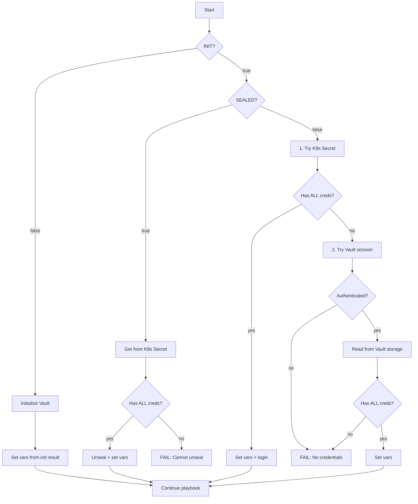

# Vault Installation Logic

## Overview

This document describes the complete logic of `vault-install.yaml` playbook.

## Playbook Structure

```
STEP 0:  Find master secret in vault_eso.secrets
STEP 1:  Install PRE (NetworkPolicies)
STEP 2:  Install Vault (Helm Chart)
STEP 4:  Wait for pod Running
STEP 5:  Check initialization status
  5.1:   Check seal status (if initialized)
  5.2:   Get credentials + Unseal (if SEALED)
  5.3:   Get credentials (if UNSEALED)
STEP 6:  Initialize Vault (if not initialized)
STEP 7:  Unseal Vault (after init)
STEP 8:  Configure Kubernetes auth (after init)
STEP 9:  Enable KV secrets engine (after init)
STEP 10: Save credentials to Vault (after init)
STEP 11: Sync policies and roles (ALWAYS)
STEP 12: Install POST (Ingress + ESO)
STEP 13: Verify and output
```

## Credentials Logic

### Required Credentials

For successful playbook execution, **BOTH** are required:

- `vault_root_token` - for Vault operations
- `vault_unseal_keys` - **ALWAYS** required (without them Vault will be permanently locked after restart)

**ALL creds = root_token + unseal_key_1 + unseal_key_2 + unseal_key_3**

### Credentials Flow



### Scenarios Table

| State | K8s Secret | Vault Session | Vault Storage | Result |
|-------|------------|---------------|---------------|--------|
| INIT=false | - | - | - | Init, get ALL from init result |
| SEALED | has ALL | - | - | Unseal + set vars |
| SEALED | missing/empty | - | - | **FAIL** |
| UNSEALED | has ALL | - | - | Set vars + login |
| UNSEALED | missing/empty | authenticated | has ALL | Fallback to Vault |
| UNSEALED | missing/empty | authenticated | missing/empty | **FAIL** |
| UNSEALED | missing/empty | not authenticated | - | **FAIL** |

## Priority Order

1. **K8s Secret (ESO synced)** - checked first, has priority
2. **Vault session** - fallback only if K8s Secret doesn't have credentials

## Step-by-Step Details

### STEP 0: Find Master Secret

```yaml
- name: "[vault] Find master secret in vault_eso.secrets"
  set_fact:
    vault_master_secret: "{{ vault_eso.secrets | selectattr('is_master', 'defined') | selectattr('is_master', 'equalto', true) | first }}"
```

The playbook finds the secret marked with `is_master: true` in `vault_eso.secrets` array from `hosts.yaml`.

### STEP 1-2: Install Pre and Vault

- **PRE**: NetworkPolicies for Vault namespace
- **Vault**: Official HashiCorp Helm chart with standalone Raft storage

### STEP 5: Check and Handle Vault State

#### 5.1: Check Seal Status
```bash
kubectl exec vault-0 -- vault status -format=json | jq -r '.sealed'
```

#### 5.2: Handle SEALED State
If Vault is sealed:
1. Get credentials from K8s Secret (synced by ESO)
2. If no credentials - **FAIL** (cannot unseal)
3. Unseal with recovered keys

#### 5.3: Handle UNSEALED State
If Vault is unsealed:
1. **First**: Try K8s Secret (ESO synced)
2. **Fallback**: Try existing Vault session + read from Vault storage
3. If neither works - **FAIL**

### STEP 6-10: First-time Initialization

Only runs if `vault_initialized.stdout == "false"`:

1. **Initialize**: Generate unseal keys and root token
2. **Unseal**: Use threshold keys to unseal
3. **Configure Kubernetes auth**: Enable and configure auth method
4. **Enable KV engine**: Create secret storage at `secret/` path
5. **Save credentials**: Store root_token and unseal_keys in Vault

### STEP 11: Sync Policies and Roles

**Always runs** - synchronizes policies and roles from `hosts.yaml`:
- Creates/updates Vault policies
- Creates/updates Kubernetes auth roles

### STEP 12: Install POST

Installs via Helm:
- Traefik Ingress for Vault UI
- ESO resources (ServiceAccount, SecretStore, ExternalSecret)

ESO will sync credentials from Vault to K8s Secret.

### STEP 13: Verify

Shows:
- Helm releases status
- Unseal keys (if available)
- Root token (if available)
- Vault UI URL

## Important Notes

1. **unseal_keys are ALWAYS required** - without them, Vault will be permanently locked after pod restart
2. **K8s Secret has priority** - ESO-synced secret is checked before Vault session
3. **Credentials location**:
   - Vault storage: `secret/<vault_path>` (from `vault_master_secret.vault_path`)
   - K8s Secret: `<target_secret>` in vault namespace (from `vault_master_secret.target_secret`)

## Configuration in hosts.yaml

```yaml
vault_eso:
  sa_name: "eso-vault-self"
  role_name: "eso-vault-self"
  secret_store_name: "eso-vault-self"
  secrets:
    - name: "eso-vault-self-creds"
      target_secret: "eso-vault-self-creds"
      vault_path: "ns-vault/vault-self/creds"
      is_master: true
```

## Failure Scenarios

### Scenario 1: Sealed Vault without K8s Secret
```
Vault is initialized and sealed, but no credentials found in K8s Secret.
Cannot unseal.
```
**Solution**: Manually unseal with saved unseal keys or restore K8s Secret.

### Scenario 2: Unsealed Vault without any credentials
```
Vault is initialized and unsealed, but no credentials found.
Checked:
  1. K8s Secret: not found
  2. Vault session: not authenticated
  3. Vault storage: not found or not checked
```
**Solution**: Manually login with root token and save credentials to Vault.

## Related Files

- Playbook: `playbooks/apps/vault-install.yaml`
- Sync task: `playbooks/apps/tasks/tasks-vault-sync.yaml`
- Pre chart: `playbooks/apps/charts/vault/pre/`
- Install chart: `playbooks/apps/charts/vault/install/`
- Post chart: `playbooks/apps/charts/vault/post/`

## Схема, как устанавливается VAULT

flowchart TD
    Start[Start] --> CheckInit{INIT?}
    
    CheckInit -->|false| DoInit[Initialize Vault]
    DoInit --> SetFromInit[Set vars from init result]
    SetFromInit --> Continue[Continue playbook]
    
    CheckInit -->|true| CheckSeal{SEALED?}
    
    CheckSeal -->|true| GetK8sSecretSealed[Get from K8s Secret]
    GetK8sSecretSealed --> HasK8sSealed{Has ALL creds?}
    HasK8sSealed -->|yes| UnsealWithK8s[Unseal + set vars]
    HasK8sSealed -->|no| FailSealed[FAIL: Cannot unseal]
    UnsealWithK8s --> Continue
    
    CheckSeal -->|false| GetK8sSecretUnsealed[1. Try K8s Secret]
    GetK8sSecretUnsealed --> HasK8sUnsealed{Has ALL creds?}
    HasK8sUnsealed -->|yes| SetFromK8s[Set vars + login]
    HasK8sUnsealed -->|no| CheckVaultSession[2. Try Vault session]
    SetFromK8s --> Continue
    
    CheckVaultSession --> HasSession{Authenticated?}
    HasSession -->|yes| ReadVault[Read from Vault]
    HasSession -->|no| FailUnsealed[FAIL: No credentials]
    
    ReadVault --> HasVaultCreds{Has ALL creds?}
    HasVaultCreds -->|yes| SetFromVault[Set vars]
    HasVaultCreds -->|no| FailUnsealed
    SetFromVault --> Continue

Итоговая таблица сценариев
| Состояние | K8s Secret | Vault Session | Vault Storage | Результат |

|-----------|------------|---------------|---------------|-----------|
| INIT=false | - | - | - | Init, получаем ВСЕ из результата |
| SEALED | есть (ALL) | - | - | Unseal + set vars |
| SEALED | неполный/нет | - | - | FAIL |
| UNSEALED | есть (ALL) | - | - | Set vars + login |
| UNSEALED | неполный/нет | есть | есть (ALL) | Fallback на Vault |
| UNSEALED | неполный/нет | есть | неполный/нет | FAIL |
| UNSEALED | неполный/нет | нет | - | FAIL |

ALL = root_token + unseal_key_1 + unseal_key_2 + unseal_key_3