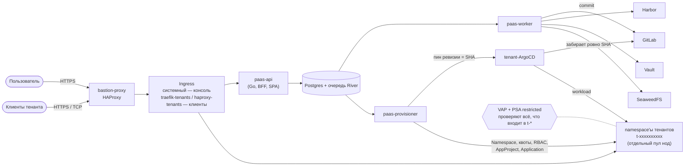

# 00. Executive summary — PaaS на одном bare-metal кластере

> Итог ночной проработки. Читается за 5 минут. Всё ниже раскрыто в документах `01…19`, навигация — [README.md](README.md).

## Что строим

Облачную платформу для клиентов поверх существующего кластера `1520-tech-prod-1`: пользователь через веб-консоль запускает контейнеры, подключает свои домены с автоматическими сертификатами, создаёт managed-базы (Postgres, Valkey/Redis, позже NATS), хранит образы в Harbor, секреты — в Vault, файлы — в S3 на SeaweedFS. Платит подпиской. Никакого доступа к Kubernetes у пользователя нет — всё делает Go-backend, а workload доставляется через GitLab и ArgoCD.

## Вердикт в семи пунктах

1. **Технически реализуемо, и ~70% кирпичей уже стоят.** ArgoCD, GitLab, Vault+ESO, Traefik, haproxy-ingress, bastion-proxy, cert-manager, SeaweedFS, Zitadel, мониторинг — всё переиспользуется. Новые компоненты: Harbor, CloudNativePG, отдельный tenant-ArgoCD, пакет политик, сам control plane.

2. **Идея «backend → GitLab → ArgoCD» хорошая, но только для workload.** Для управляющих объектов (namespace, квоты, RBAC) она невозможна: системный ArgoCD намеренно namespace-scoped и не может создать namespace. Решение — гибрид: `paas-provisioner` создаёт namespace и права напрямую через API, всё остальное идёт через git в **отдельный** tenant-ArgoCD. Бонус: AppProject, созданный через API, становится настоящей границей безопасности, чего нет в системном ArgoCD. → [06](06-delivery-pipeline.md)

3. **Главный риск безопасности — чужой код рядом с GitLab и Vault.** Ответ — эшелонирование, где каждый слой не доверяет предыдущему: backend генерирует харднутый манифест из allow-list-модели → встроенный `ValidatingAdmissionPolicy` + PSA `restricted` проверяют то же самое независимо от backend → отдельный пул нод для тенантов → user namespaces (stable в k8s 1.36; containerd и runc кластера уже подходят; нужно ядро ≥ 6.3 — прод на Ubuntu 24.04 с ядром 6.8, осталось подтвердить `uname -r`) → default-deny сеть → изоляция данных политиками Vault/Harbor/S3. Отдельно: **исходящий трафик тенантов светит реальные IP нод** и заносит их в блэклисты — нужен egress gateway с отдельными IP. → [03](03-security-model.md), [02](02-tenancy-and-isolation.md)

4. **«500 ₽ — трать сколько хочешь» буквально не работает.** Память нельзя оверкоммитить, один клиент съест ноду. Работающая версия — тариф с **жёсткой квотой**: внутри квоты «сколько хочешь» и без сюрпризов, сверх — только апгрейд. На текущем железе 500 ₽ — около безубыточности; нужна сетка из нескольких ступеней и аддоны (место в registry/S3, выделенный IP). → [13](13-billing-and-quotas.md)

5. **Главный блокер — не техника, а закон.** В РФ платформа, предоставляющая вычислительные мощности, — хостинг-провайдер: **реестр РКН (406-ФЗ), российское юрлицо, мощности в РФ, СОРМ (заявление в ФСБ за 45 дней), ГосСОПКА, идентификация клиентов, хранение данных год**. Плюс 152-ФЗ и 54-ФЗ. Bastion-proxy в Германии — открытый вопрос для юриста. Юридический трек может оказаться длиннее и дороже технического. → [16](16-legal-ru.md)

6. **Продавать на текущей топологии нельзя.** Один manager и один bastion-proxy — две единственные точки отказа. Оба закрываются средствами, уже имеющимися в репо (`manager-join`, группа `bastion_proxy` на N хостов). → [15](15-observability-and-operations.md)

7. **Срок — ~9-10 месяцев соло до первого платного клиента** (~41 человеко-неделя; «MVP-минимум» — ~20). → [17](17-roadmap.md)

## Что изменено относительно исходной идеи

| Идея владельца | В дизайне | Почему |
|---|---|---|
| Backend генерирует манифест → GitLab → ArgoCD | Да, для workload. Namespace/квоты/RBAC/AppProject/Application — напрямую через API | Системный ArgoCD by design не создаёт namespace; объекты из API не переписываются коммитом |
| ArgoCD (подразумевался существующий) | **Отдельный tenant-ArgoCD**, ревизия пинится на SHA коммита | Изоляция от системных ns, от утечки watch в cluster-cache, независимые апгрейды; отстающий git не откатывает приложения молча |
| Существующий Traefik | **Отдельные `traefik-tenants` / `haproxy-tenants`** на своём IP | Системный Traefik настроен доверчиво (`allowCrossNamespace`, insecure PROXY) — чужой код через него дотянется до системных сервисов; DDoS на домен клиента не должен ронять консоль и GitLab |
| Backend оборачивает манифест в securityContext | Да + **независимая проверка на admission** | Обёртка только в backend = один баг до пробития; VAP не зависит от backend |
| 500 ₽ и трать сколько хочешь | Тариф = жёсткая квота, несколько ступеней | Иначе убыток и OOM у соседей |
| Секреты через Vault | «Секреты» как фича; Vault под капотом, пользователь Vault не видит | Vault Namespaces — Enterprise; ограничения bank-vaults; меньше поверхность атаки |
| Если домен с Cloudflare — принимаем HTTP | Да, но только с IP-диапазонов Cloudflare; рекомендуемый режим — Full (strict) | Иначе любой обходит Cloudflare и подделывает заголовки |
| Выделю список IP для bastion | Да; bastion остаётся статичным, динамика только внутри кластера; выделенный IP — платный слот (фаза 2) | Bastion статически слушает весь L4-диапазон — новые порты тенантов его не трогают; ansible-прогон с reload на каждого тенанта недопустим |
| Managed Redis | **Valkey** | Лицензионная чистота (BSD) |
| Managed «и так далее» | Без MongoDB/Elasticsearch/Redpanda/CockroachDB | SSPL/BSL прямо запрещают продавать их как сервис |
| React или Next | **React SPA (Vite), отдаётся Go-бинарём** | Второй серверный рантайм не нужен; Go уже BFF; так устроены ArgoCD, Grafana, Kargo, Portainer |

## Упрощённая схема

## Топ-7 решений, которые нужны от владельца

Полный список с рекомендациями — [18-risks-and-owner-decisions.md](18-risks-and-owner-decisions.md).

1. **Где физически стоит кластер** (РФ или нет) — от этого зависит весь юридический путь.
2. **Готовность к юридическому треку**: юрлицо, реестр РКН, СОРМ, идентификация клиентов — и бюджет на это.
3. **Железо под tenant pool**: выделить 2 из 5 воркеров или докупить; плюс 2 manager'а и второй bastion.
4. **Два домена**: для консоли и отдельный для приложений клиентов (обязательно раздельные).
5. **Тарифная сетка и цены** — утвердить предложение из [13](13-billing-and-quotas.md) или дать свою себестоимость.
6. **IP для исходящего трафика тенантов** (egress gateway) — чтобы абьюз клиента не банил IP нод.
7. **S3 в MVP или фаза 2** — зависит от conformance-теста SeaweedFS против популярных клиентов.

## Что сделать в первую очередь (до написания кода)

1. Показать [16-legal-ru.md](16-legal-ru.md) юристу. Если ответ «нереально» — всё остальное не имеет смысла в текущей форме (варианты: B2B-договоры без публичной оферты, зарубежное юрлицо и зарубежная площадка, «внутренняя платформа» для своих проектов).
2. Три стенд-проверки, от которых зависит дизайн: user namespaces на ядре нод, barman-cloud × SeaweedFS, distribution S3-драйвер × SeaweedFS.
3. HA: 3 manager'а и второй bastion — полезно для текущего прода независимо от PaaS.

## Найдено попутно: проблемы текущего прода

При проработке всплыли проблемы, которые есть в кластере **уже сейчас**, независимо от PaaS: `vpn-only` на системном Traefik обходится поддельным PROXY-заголовком; у Vault нет снапшотов и HA, TLS выключен, порт 8200 открыт любому поду; межнодовый трафик идёт без шифрования; `seaweedfs-sync` удалит любой бакет, которого нет в инвентаре. Список из восьми пунктов и что делать — [18 §0](18-risks-and-owner-decisions.md).
