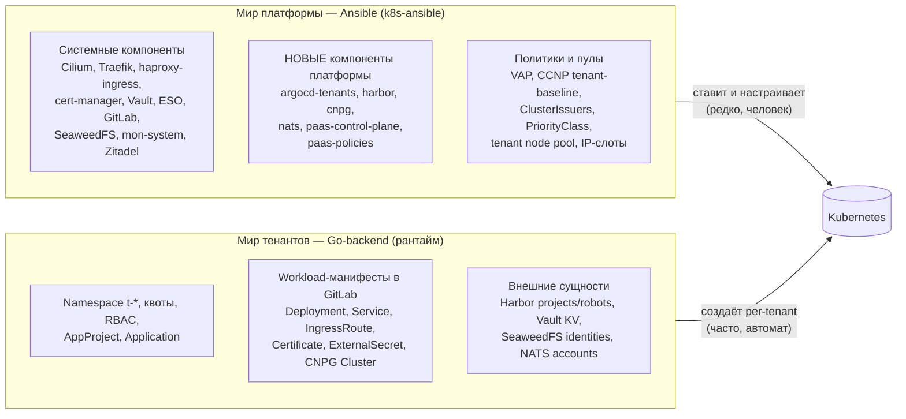
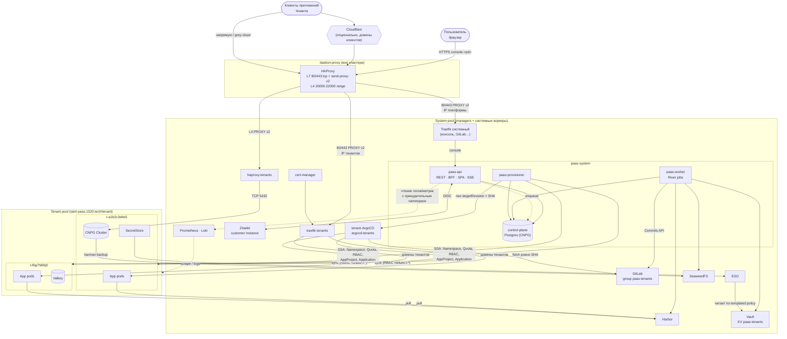
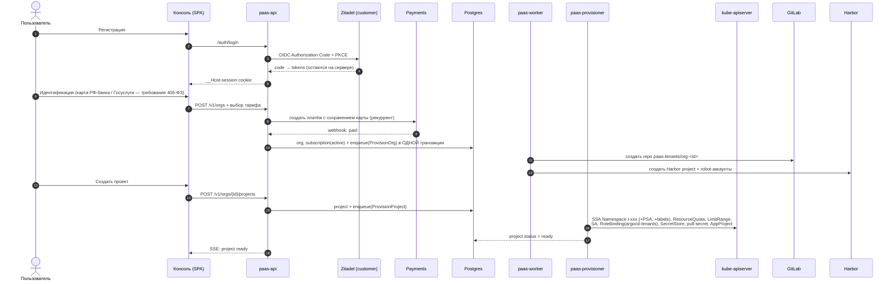
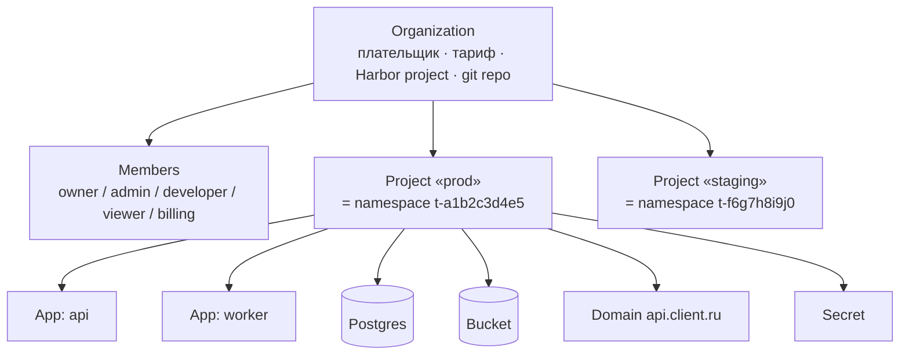
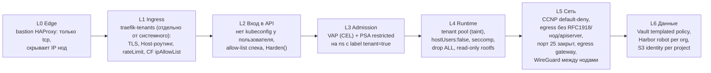
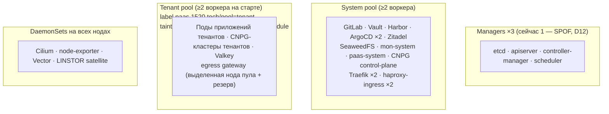

# 01. Архитектура платформы — общий вид

> Этот документ — «карта местности». Детали каждого слоя — в профильных документах (ссылки в тексте). Все решения здесь пронумерованы `D1…D15`; профильные документы их развивают, но не отменяют.

## TL;DR

- **Два мира с жёсткой границей.** Ansible (этот репозиторий) строит и держит *платформу*: системные компоненты, операторы, политики, пулы нод. Go-backend в рантайме управляет всем, что *принадлежит тенанту*. Ни один per-tenant объект не проходит через `hosts-vars*` и ansible-прогон (D1).
- **Тенант = Organization → Project → ресурсы.** Project — граница изоляции, ровно один namespace `t-<project_id>` (D2).
- **Git-ops владельца сохранён, но не для всего.** Workload-манифесты: backend → GitLab → **отдельный tenant-ArgoCD**, ревизия приложения пинится на SHA коммита (R-PIN). Управляющие объекты (Namespace, квоты, RBAC, AppProject, Application): отдельный процесс `paas-provisioner` напрямую через apiserver. Иначе нельзя — системный ArgoCD namespace-scoped и by design не создаёт namespace (D3).
- **Безопасность — два независимых слоя.** Backend генерирует харднутый манифест из allow-list-модели; встроенный `ValidatingAdmissionPolicy` + PSA `restricted` проверяют то же самое на входе в apiserver независимо от backend. Плюс отдельный пул нод для тенантов, user namespaces (stable в 1.36), default-deny сеть, egress через отдельный IP, WireGuard между нодами, отдельные ingress-инстансы для тенантов (D4, R-EGRESS, R-WG, R-INGRESS).
- **Data plane не зависит от control plane.** Упал backend, GitLab или tenant-ArgoCD — приложения клиентов продолжают работать; недоступны только изменения.
- **Два блокера до первого платного клиента:** (1) юридический — реестр провайдеров хостинга РКН, СОРМ, идентификация клиентов (D11, [16-legal-ru.md](16-legal-ru.md)); (2) технический — один manager = единственная точка отказа, нужно три (D12).

---

## 1. Два мира и граница между ними

Вся существующая инфраструктура декларативно-статическая: компонент описан в `hosts-vars/<c>.yaml`, применяется прогоном `ansible-playbook`, namespace'ы заводит `cluster-base` из списка. PaaS по определению динамический: namespace, домены, бакеты, базы появляются и исчезают по нажатию кнопки. Смешать эти миры — значит получить войну за объекты (helm ownership, ArgoCD prune, снос namespace при удалении элемента из `cluster_base_namespaces_list`).



**Правила границы** (обязательны для обеих сторон):

| Правило | Зачем |
|---|---|
| Всё, что создаёт backend, несёт `paas.1520.tech/managed-by=paas` и `paas.1520.tech/tenant-ns=<ns>` | Ansible-чарты и системный ArgoCD никогда не матчат эти объекты; audit и cleanup по label |
| Namespace тенанта создаёт **только** `paas-provisioner`, никогда `cluster-base` | Удаление элемента из статического списка сносит namespace с данными — для тенантов недопустимо |
| Ansible создаёт *классы* (ClusterRole, ClusterIssuer, VAP, CCNP с селектором по label), backend — *экземпляры* (RoleBinding, Certificate, namespace с label) | Правила меняет человек через ревью; экземпляры плодит автомат |
| Имена системных объектов в чужих namespace — с префиксом-маркером владельца (инвариант репо §0) | Уже существующее правило, распространяется на `paas-*` |
| Ansible-прогон на каждого тенанта **запрещён** (в т.ч. для bastion-proxy) | Прогон минуты, нужны секунды; прогон с ошибкой ломает всех |

---

## 2. Компоненты

| Компонент | Роль | Кто ставит | Namespace | Статус |
|---|---|---|---|---|
| **paas-api** | REST API + BFF + раздача SPA консоли, SSE (WebSocket — только будущий exec) | ansible `paas-control-plane` (образ), рантайм | `paas-system` | новый |
| **paas-worker** | Очередь River: GitLab, Harbor, Vault, SeaweedFS, NATS, платежи, метеринг | то же | `paas-system` | новый |
| **paas-provisioner** | Единственный с правом создавать Namespace/RoleBinding/AppProject/Application | то же | `paas-system` | новый |
| **paas-admin** | Админка владельца (отдельный домен, VPN-only, staff-SSO) | то же | `paas-admin` | новый |
| control-plane Postgres | Состояние платформы + очередь River | CNPG Cluster (ansible) | `paas-system` | новый |
| **argocd-tenants** | Отдельный ArgoCD только для tenant-workload | ansible (по образцу `argocd`) | `argocd-tenants` | новый |
| **harbor** | Registry тенантов + proxy-cache публичных реестров | ansible | `harbor` | новый |
| **cnpg** | Оператор CloudNativePG (managed Postgres тенантов и control-plane БД) | ansible | `cnpg-system` | новый |
| **nats** | Общий NATS JetStream-кластер, account на тенанта | ansible | `nats` | новый (фаза 2) |
| **paas-policies** | VAP + bindings, CCNP tenant-baseline, ClusterIssuer'ы, PriorityClass'ы, ClusterRole'ы для provisioner и tenant-ArgoCD | ansible (по образцу `cluster-base`) | `paas-policies` (только helm state) | новый |
| **seaweedfs-tenants** | Отдельный инстанс S3 для тенантов | ansible (второй инстанс `seaweedfs`) | `seaweedfs-tenants` | новый (к GA) |
| GitLab | Хранилище tenant-репо (группа `paas-tenants`) | существует | `gitlab` | переиспользуем |
| Vault + ESO | Секреты тенантов (один KV mount `paas-tenants`) | существует | `vault`, `external-secrets` | + конфиг |
| Traefik (системный) | L7 консоли и системных сервисов | существует | `traefik-lb` | без изменений |
| **traefik-tenants** | Отдельный L7-инстанс только для доменов тенантов: строгие `trustedIPs`, без `allowCrossNamespace`, свой IP на bastion | ansible (второй инстанс компонента `traefik`) | `traefik-tenants` | новый (R-INGRESS) |
| haproxy-ingress (системный) | L4 системных сервисов (gitlab-ssh, teleport) | существует | `haproxy-lb` | без изменений |
| **haproxy-tenants** | L4 к managed-БД тенантов, `accept_proxy`, anti-bypass на входе | ansible (второй инстанс `haproxy`) | `haproxy-tenants` | новый (R-INGRESS) |
| cert-manager | Сертификаты тенантов | существует | `cert-manager` | + ClusterIssuer'ы |
| Zitadel | Отдельный **виртуальный инстанс** для клиентов (staff-SSO не трогаем) | существует | `zitadel` | + инстанс |
| mon-system | Метрики/логи платформы и тенантов | существует | `mon-system` | + правила |
| bastion-proxy | Внешний edge: L7 passthrough 80/443, L4 range 20000-22000 (по `hosts-vars`; справочник `reference/bastion-proxy.md` устарел — там 10000-30000) | существует | вне кластера | + IP-слоты (фаза 2) |
| SeaweedFS (системный) | Бэкапы CNPG/Vault, хранилище Harbor, тенантский S3 в MVP | существует | `seaweedfs` | переиспользуем |

---

## 3. Главная схема



Ключевые наблюдения по схеме:

1. **В tenant-pool нет ничего системного.** Скомпрометированный под тенанта в худшем случае делит ядро с другими тенантами, но не с GitLab/Vault/etcd.
2. **`paas-api` — единственное, что смотрит в интернет со стороны control plane, и у него нет прав записи в k8s.** Всё опасное — через очередь в `paas-worker`/`paas-provisioner`.
3. **Стрелки в tenant-namespace рисуют ровно два субъекта:** `paas-provisioner` (управляющие объекты) и tenant-ArgoCD (workload). Третьего писателя нет.

---

## 4. Главные потоки

### 4.1. Регистрация → первый проект



### 4.2. Deploy приложения

Сокращённо (подробно — [06-delivery-pipeline.md](06-delivery-pipeline.md)):

1. UI → `POST /v1/projects/{id}/apps` с типизированной спекой (образ, порт, env, размер, health-check). Никакого YAML.
2. `paas-api` валидирует по allow-list, пишет иммутабельную `app_revision`, ставит задачу `DeployApp` в той же транзакции.
3. `paas-worker` рендерит манифесты типами `k8s.io/api`, прогоняет `Harden()`, коммитит одним атомарным коммитом через GitLab Commits API в `paas-tenants/org-<id>`, путь `projects/<pid>/apps/<aid>/`.
4. `paas-provisioner` создаёт `Application` в `argocd-tenants` (если его нет) и **пинит `spec.source.targetRevision` на полный SHA коммита** — merge-patch с предусловием `resourceVersion` и монотонным guard: SHA не сдвигается назад иначе, чем явным откатом (R-PIN).
5. tenant-ArgoCD видит изменение spec, забирает из GitLab ровно этот SHA и синхронизирует `t-<pid>`. Вебхук не нужен. VAP и PSA проверяют каждый объект.
6. `paas-worker` следит за `Application.status.sync.revision == SHA` и здоровьем rollout, шлёт шаги в SSE.
7. «Задеплоено» — только при совпадении ревизии **и** здоровом rollout.

Почему пин на SHA, а не отслеживание ветки: отстающий или восстановленный из бэкапа GitLab не может молча откатить приложение (известная ловушка «отстающий git = тихий откат»), кэш ревизий ветки не отдаёт устаревший SHA, коммит в одно приложение не рефрешит остальные Application репозитория. Подробно — [06](06-delivery-pipeline.md).

Бюджет: 5-40 с, доминирует pull образа.

### 4.3. Входящий запрос к приложению тенанта

```
клиент ──(Cloudflare, если proxied)──► bastion HAProxy :443 (mode tcp, send-proxy-v2)
       ──► NodePort системной ноды ──► traefik-tenants (снимает PROXY, видит реальный IP, терминирует TLS, роутит по SNI/Host)
       ──► Service t-xxx/app ──► Pod (tenant pool)
```

Детали, IP на каждом хопе, Cloudflare-режим и L4 — [08-svc-ingress-domains-ip.md](08-svc-ingress-domains-ip.md).

### 4.4. Секрет

UI → `paas-api` (значение в памяти, в лог не пишется) → очередь (зашифровано Transit) → `paas-worker` → Vault `paas-tenants/data/t-xxx/<name>` → ESO в `t-xxx` (SA `paas-eso`, templated policy) → k8s Secret → env/файл в поде. В git — только `ExternalSecret`-ссылка. Подробно — [12-svc-secrets.md](12-svc-secrets.md).

---

## 5. Модель тенантности



- **Почему граница — Project, а не Organization:** у клиента обычно prod и staging; разделять их по namespace — стандартная ожидаемая гарантия (сломанный staging не трогает prod, квоты раздельные).
- **Почему не namespace на App:** тысячи namespace на сотню клиентов, квота на App неудобна, приложения одного проекта должны видеть друг друга по DNS.
- **Почему не vcluster:** ~ сотни МБ RAM и отдельный apiserver на тенанта, отдельная точка отказа, отдельный апгрейд — соло не вытянет. Кандидат в «премиум-тариф» позже.
- Подробно — [02-tenancy-and-isolation.md](02-tenancy-and-isolation.md).

---

## 6. Слои безопасности



Принцип: **каждый слой считает, что предыдущий пробит.** VAP не доверяет backend. Сеть не доверяет runtime. Vault-политика не доверяет ESO-объекту в namespace.

Модель угроз, эталонные политики, сценарии компрометации — [03-security-model.md](03-security-model.md).

### 6.1. Исходящий трафик тенантов — через egress gateway

Без специальной настройки под тенанта выходит в интернет с SNAT на **IP ноды**. Это ломает два свойства сразу:

1. **Скрытие нод за bastion теряет смысл** — любой тенант узнаёт реальный IP ноды одной командой `curl ifconfig.me`, после чего может атаковать ноду в обход bastion.
2. **Абьюз тенанта банит платформу** — спам, сканирование, брутфорс с IP нод заносят в блэклисты те же IP, с которых ходят наружу GitLab, cert-manager, системные бэкапы.

Решение — **Cilium Egress Gateway** (`CiliumEgressGatewayPolicy`, есть в OSS; требует `kubeProxyReplacement` — уже включён — и `bpf.masquerade`): весь egress из namespace'ов с label `paas.1520.tech/tenant=true` направляется через выделенную egress-ноду и SNAT'ится на **отдельный публичный IP, используемый только тенантами**. Абьюз одного тенанта портит только этот IP; системный egress не страдает; IP нод не раскрываются.

Проверено по документации Cilium (1.20): функция есть в OSS; включение — `egressGateway.enabled=true` + `bpf.masquerade=true` + `kubeProxyReplacement=true`. **В текущих values кластера `bpf.masquerade` не задан** — это смена режима маскарадинга на живом кластере: сначала `test-1`, на проде — в окно обслуживания. Несовместимо с Cluster Mesh, CiliumEndpointSlice и kvstore-режимом identity (у нас не используются).

Оговорки: (1) первые пакеты только что стартовавшего пода могут уйти с IP ноды до применения политики — скрытие IP нод не абсолютное, но систематический абьюз идёт через egress-IP; (2) отказоустойчивость gateway в OSS ограничена (поле `egressGateways[]` есть в доках 1.20 — ⚠️ проверить в 1.19.5) → на MVP две ноды с разными IP и переключение по runbook. Решение владельца (покупка IP) — [18](18-risks-and-owner-decisions.md).

### 6.2. Отдельный домен для приложений тенантов

Приложения тенантов живут на **отдельном регистрируемом домене**, не на поддомене консоли (как `github.io` ≠ `github.com`, `herokuapp.com` ≠ `heroku.com`). Иначе код тенанта на `evil.apps.console-domain` может ставить cookie на родительский домен (cookie tossing / session fixation против консоли) и выглядеть как «официальный» ресурс для фишинга. Консоль: `console.<platform-domain>`. Приложения: `*.<apps-domain>`, где `<apps-domain>` — отдельный домен. Внесение `<apps-domain>` в Public Suffix List изолировало бы cookie тенантов друг от друга, но конфликтует с wildcard-сертификатом прямо под публичным суффиксом — выбор схемы имён вынесен в решения владельца ([08](08-svc-ingress-domains-ip.md)).

---

## 7. Процессы control plane и их права

| Процесс | Экспозиция | Права в k8s | Внешние креды | Если скомпрометирован |
|---|---|---|---|---|
| `paas-api` | интернет (через Traefik) | только **чтение** в `t-*`: ClusterRole `paas-api-tenant` (get/list/watch на pods, pods/log, events, deployments, replicasets, resourcequotas, persistentvolumeclaims), привязанный RoleBinding'ом в каждом `t-*` (его создаёт provisioner), плюс чтение Application в `argocd-tenants` ([03](03-security-model.md) §8.1) | Zitadel client secret, session key | читает статусы всех тенантов; **не** может ничего создать/удалить в k8s, не видит секретов Vault |
| `paas-worker` | только внутри кластера | нет (или только чтение Application) | GitLab-токен (только группа `paas-tenants`), Harbor-админ API, Vault-токен (только `paas-tenants/*`), SeaweedFS admin, NATS operator-ключ, платёжный API | пишет в tenant-репо (→ VAP всё равно не пропустит опасный манифест), читает секреты тенантов в Vault |
| `paas-provisioner` | только внутри кластера | create Namespace (VAP: имя `^t-[a-z0-9]{10}$` + обязательные labels), RoleBinding (глагол `bind` только на разрешённые ClusterRole), Quota, LimitRange, SA, SecretStore, AppProject/Application в `argocd-tenants` | нет | создаёт namespace'ы тенантов и даёт в них права tenant-ArgoCD — но не может выдать cluster-admin, не может создать namespace с чужим/системным именем |
| tenant-ArgoCD | только внутри | RoleBinding в каждом `t-*`, ноль cluster-scoped записей | read-токен GitLab группы `paas-tenants` | меняет workload тенантов в пределах того, что пропустит VAP |

Полные ClusterRole/VAP — [03-security-model.md](03-security-model.md).

---

## 8. Размещение по нодам



- Сегодня 5 воркеров с `resource-type=shared`. Предложение для старта: **2 воркера → tenant pool**, 3 → system pool. Метки и taint задаются в `hosts-vars-override/<cluster>/hosts.yaml` (`node_labels`) — механизм уже есть.
- **Ни один ingress не работает на tenant-нодах.** Ingress держит TLS-ключи всех доменов и токены на чтение секретов — ему не место рядом с кодом тенантов. Bastion шлёт трафик на NodePort системных нод (`externalTrafficPolicy: Local`).
- **Taint сам по себе не спасает**: у Traefik, haproxy-ingress, cilium-operator, linstor-controller стоит `tolerations: Exists`. Им нужен `nodeAffinity` с `NotIn tenant` — иначе они сядут на tenant-ноду вместе со своими токенами ([02](02-tenancy-and-isolation.md)).
- Managed-БД тенантов — на tenant pool и на **отдельном LINSTOR storage-пуле tenant-нод** (лучше — отдельный диск): их память бьётся с квотой тенанта, а переполнение тенантом thin-пула на корневой ФС не ломает запись DRBD-томам системных компонентов (R-SC).
- Egress gateway — выделенная нода **tenant-пула** (активная + резерв) с дополнительным публичным IP только для исходящего трафика тенантов (§6.1). Не системная: флуд исходящего трафика тенантов не должен забивать канал GitLab и Vault ([03](03-security-model.md)).

---

## 9. Новые ansible-компоненты

Все — по конвенциям репо ([`playbook-conventions.md`](../reference/playbook-conventions.md)): `playbook-app/<c>-install.yaml`, чарты в `playbook-app/charts/<c>/`, фазы `pre → install → post`, vars в `hosts-vars/<c>.yaml`, секреты через ESO.

| Компонент | Фазы / stage | Что внутри | Зависит от |
|---|---|---|---|
| `paas-policies` | stage `policies`, `network`, `issuers`, `rbac` (как `cluster-base`: без workload) | VAP + bindings, CCNP tenant-baseline, ClusterIssuer `paas-le-http01` / `paas-wildcard-dns01` / fallback, PriorityClass'ы, ClusterRole'ы `paas-provisioner`, `paas-provisioner-tenant`, `paas-api-tenant`, `paas-tenant-deployer` (имена — по [03](03-security-model.md) §8) | cilium, cert-manager |
| `argocd-tenants` | `crds`(skip — CRD уже от системного) → `pre` → `install` → `post` | Вендоренный `namespace-install.yaml`, namespace `argocd-tenants`, свой `argocd-secret` (пустой — инвариант §0), webhook-secret из Vault | argocd (CRD), gitlab |
| `cnpg` | `pre` → `install` → `barman-cloud` → `post` | Оператор CloudNativePG, barman-cloud plugin, PodMonitor и алерты тенантских БД | cert-manager |
| `harbor` | `pre` → `install` → `post` | upstream chart goharbor, S3-бэкенд или PVC, Trivy, proxy-cache проекты, ServiceMonitor | cnpg (БД Harbor), seaweedfs, traefik |
| `traefik-tenants` | как `traefik` | Второй инстанс Traefik только для доменов тенантов: строгие `proxyProtocol.trustedIPs` / `forwardedHeaders.trustedIPs` (только bastion и Cloudflare), без `allowCrossNamespace` и `allowExternalNameServices`; только системные ноды | cilium, cert-manager |
| `haproxy-tenants` | как `haproxy` | Второй инстанс haproxy-ingress для L4 к managed-БД; `accept_proxy`; anti-bypass (ipBlock bastion) на входе в инстанс | cilium |
| `paas-control-plane` | `pre` → `db` → `install` → `post` | CNPG Cluster control-plane, Deployments paas-api/worker/provisioner/admin, ESO-секреты, IngressRoute консоли и админки | все выше, zitadel, vault |
| `nats` | `pre` → `install` → `post` | upstream chart, operator-JWT, resolver | фаза 2 |
| `seaweedfs-tenants` | как `seaweedfs` | второй инстанс, требует параметризации компонента | к GA |

`traefik-tenants` и `haproxy-tenants` требуют параметризовать существующие компоненты `traefik`/`haproxy` под второй инстанс (сейчас один набор переменных на компонент).

Изменения **существующих** компонентов и плейбуков:

| Что | Изменение | Зачем |
|---|---|---|
| `cilium` | `egressGateway.enabled` + `bpf.masquerade` + `CiliumEgressGatewayPolicy`; WireGuard (`encryption.type: wireguard`); Bandwidth Manager | R-EGRESS, R-WG, шумные соседи |
| `linstor` | storage-пул на tenant-нодах (отдельный диск) + SC `lnstr-tenant-local` / `lnstr-tenant-multi-sync` с `reclaimPolicy: Delete` | R-SC |
| `hosts.yaml` + новый `node_taints` | label/taint tenant-пула; регистрация ноды сразу с taint (`--register-with-taints`) | D4 |
| новый системный плейбук `kubelet-config-update.yaml` (rolling, `serial: 1`) | `podPidsLimit`, `systemReserved` / `kubeReserved` | PID-бомбы, защита kubelet |
| CoreDNS Corefile | запрет PTR-перебора кластерных CIDR, `pods disabled` | перечисление всех Service кластера тенантом |
| `mon-system` | второй `Prometheus` CR `tenants`, лимиты Loki по тенантам | D14, кардинальность |
| `vault` | mount `paas-tenants`, auth-mount `kubernetes-paas`, templated policy, Transit-ключи | D9 |
| `zitadel` | виртуальный инстанс для клиентов | D13 |

Порядок установки — дополнение к [components.md §19](../reference/components.md):

```
L4  traefik  haproxy                       (есть)
L4+ traefik-tenants  haproxy-tenants       НОВОЕ
L5  mon-system  seaweedfs                  (есть)
L5+ paas-policies  cnpg                    НОВОЕ
L6  zitadel (+ customer instance)          (есть + конфиг)
L7  argocd  gitlab  ...                    (есть)
L7+ harbor  argocd-tenants                 НОВОЕ
L8+ paas-control-plane                     НОВОЕ
L9+ nats  seaweedfs-tenants                НОВОЕ, фаза 2
```

---

## 10. Новые namespace'ы

| Namespace | Кто создаёт | Содержимое |
|---|---|---|
| `paas-system` | `cluster-base` (статически — системный) | paas-api, paas-worker, paas-provisioner, control-plane Postgres |
| `paas-admin` | `cluster-base` | админка владельца |
| `paas-policies` | `cluster-base` | только helm-state компонента `paas-policies` |
| `argocd-tenants` | `cluster-base` | tenant-ArgoCD |
| `harbor` | `cluster-base` | Harbor |
| `traefik-tenants` | `cluster-base` | L7 ingress тенантов |
| `haproxy-tenants` | `cluster-base` | L4 ingress тенантов |
| `cnpg-system` | `cluster-base` | оператор CNPG |
| `nats` | `cluster-base` | общий NATS |
| `seaweedfs-tenants` | `cluster-base` | S3 тенантов (к GA) |
| `t-<project_id>` | **`paas-provisioner`**, динамически | всё, что принадлежит проекту тенанта |

---

## 11. Что происходит при отказах

| Отказал | Работающие приложения тенантов | Что недоступно | Самовосстановление |
|---|---|---|---|
| `paas-api` | работают | консоль, API | Deployment ≥2 реплики |
| `paas-worker` | работают | деплои, изменения; задачи копятся в очереди | River дочитает очередь после старта |
| `paas-provisioner` | работают | новые проекты, новые приложения | то же |
| control-plane Postgres | работают | весь control plane | CNPG failover (Standard-кластер) |
| GitLab | работают | деплои (коммит невозможен) | задачи ретраятся с backoff |
| tenant-ArgoCD | работают, без selfHeal | применение изменений | рестарт; синхронизирует накопленное |
| Vault | работают (Secret уже в etcd) | новые/изменённые секреты; ESO refresh падает | unseal (bank-vaults), Raft-снапшот |
| Harbor | работают, пока не нужен новый pull | новые поды с неклешированным образом | — |
| cert-manager | работают до истечения сертификатов (≥30 дней запаса) | новые домены | рестарт |
| traefik-tenants | домены тенантов недоступны; консоль и системные сервисы работают — у них свой инстанс | — | ≥2 реплики на разных системных нодах, health-check на bastion |
| egress gateway нода | исходящий трафик тенантов в интернет рвётся; входящий работает | — | переключение политики на вторую ноду по runbook (HA в OSS ограничен) |
| bastion-proxy | **недоступны извне** | всё внешнее | **SPOF** → второй bastion (Rule 1: N серверов) |
| manager (сейчас 1) | работают без изменений (kubelet держит поды) | **весь кластер read-only**: деплои, failover, эвикции | **нет** → 3 manager'а (D12) |
| нода tenant pool | поды переезжают (≥2 реплики — без простоя) | — | scheduler; RWO-тома ждут DRBD |

Два честных SPOF сегодня: **единственный manager** и **единственный bastion-proxy**. Оба закрываются средствами, которые в репо уже есть (manager-join, `bastion_proxy` группа на N хостов).

---

## 12. Индекс решений

| № | Решение | Где подробно |
|---|---|---|
| D1 | Граница Ansible ↔ PaaS, labels `paas.1520.tech/*` | §1 здесь |
| D2 | Organization → Project(=namespace `t-<id>`) → ресурсы; без vcluster | [02](02-tenancy-and-isolation.md) |
| D3 | Гибрид: provisioner через API + workload через GitLab → отдельный tenant-ArgoCD; репо на организацию; без ApplicationSet | [06](06-delivery-pipeline.md) |
| D4 | Harden() + VAP + PSA restricted; tenant pool; userns; CCNP default-deny; разделение прав backend на 3 процесса | [03](03-security-model.md), [02](02-tenancy-and-isolation.md) |
| D5 | Wildcard для платформенных поддоменов; TXT-верификация custom domain; CF-режим с ipAllowList; bastion статичен | [08](08-svc-ingress-domains-ip.md) |
| D6 | CNPG, Valkey без оператора, общий NATS с account на тенанта; лицензионная карта | [09](09-svc-databases.md) |
| D7 | Harbor: project на организацию, robot'ы, proxy-cache, квота = биллинг | [10](10-svc-registry-harbor.md) |
| D8 | S3 на SeaweedFS; к GA — отдельный инстанс; матрица совместимости до продажи | [11](11-svc-object-storage-s3.md) |
| D9 | «Секреты как фича», один KV-mount, templated policy по namespace, SecretStore на ns | [12](12-svc-secrets.md) |
| D10 | Тариф = жёсткая квота; метеринг информационный; state machine неоплаты | [13](13-billing-and-quotas.md) |
| D11 | Реестр хостинг-провайдеров РКН — гейт до первого клиента | [16](16-legal-ru.md) |
| D12 | 3 manager'а до продажи; бэкапы вне кластера | [15](15-observability-and-operations.md) |
| D13 | Go модульный монолит, 3 бинаря, OpenAPI, River, sqlc | [04](04-control-plane-go.md), [05](05-data-model.md) |
| D14 | Логи/метрики тенанта — только через backend с принудительным namespace-матчером | [15](15-observability-and-operations.md) |
| D15 | React SPA (Vite) из `embed.FS` Go-бинаря; BFF в Go; без Next.js | [14](14-frontend-console.md) |

### 12.1. Уточнения решений по итогам проработки (R-*)

Появились при детальной проработке разделов 02-16. **Имеют приоритет над исходной формулировкой D-решения.**

| № | Уточнение | Уточняет | Где подробно |
|---|---|---|---|
| R-SC | Все тома тенантов (PVC приложений и managed-БД) — на отдельном LINSTOR storage-пуле tenant-нод (лучше отдельный диск), SC `lnstr-tenant-local` / `lnstr-tenant-multi-sync`, `reclaimPolicy: Delete` + 7-дневная корзина у provisioner'а. `lnstr-worker-*` для тенантов не используются: вторая DRBD-реплика уехала бы на системную ноду (failover Hobby-БД ломается), а тенант, заполнивший fileThinPool на корневой ФС, ломает запись DRBD-томам соседей | D6 | [02](02-tenancy-and-isolation.md), [07](07-svc-compute.md), [09](09-svc-databases.md) |
| R-UID | User namespaces обязательны (stable в 1.36) → допустим любой ненулевой числовой UID ≤ 65535 из образа; root или нечисловой UID → `Harden()` ставит 10001 | D4 | [03](03-security-model.md), [07](07-svc-compute.md) |
| R-LOGS | Логи и статусы — SSE; WebSocket только для будущего exec | D13 | [04](04-control-plane-go.md), [14](14-frontend-console.md) |
| R-QUOTA | Память: request == limit; CPU: limit ≤ 4 × request, минимум 250m. PriorityClass: `paas-system` > `paas-control` > `tenant-paid` > `tenant-trial` | D10 | [02](02-tenancy-and-isolation.md), [07](07-svc-compute.md), [13](13-billing-and-quotas.md) |
| R-EGRESS | Egress тенантов — через Cilium Egress Gateway на отдельный IP (выделенная нода tenant-пула: активная + резерв; egress-IP не вносить ни в один allowlist); порт 25 закрыт | D4 | §6.1, [02](02-tenancy-and-isolation.md), [03](03-security-model.md) |
| R-INGRESS | Отдельные `traefik-tenants` и `haproxy-tenants` на отдельном IP bastion, только на системных нодах. У системного Traefik `allowCrossNamespace: true` и доверие PROXY/forwarded-заголовкам в режиме `insecure`: для чужого кода это «запутанный заместитель» (IngressRoute тенанта может проксировать в Vault/Grafana). Плюс DDoS на домен клиента не роняет консоль и GitLab | D5 | [08](08-svc-ingress-domains-ip.md), [02](02-tenancy-and-isolation.md) |
| R-PIN | `Application.spec.source.targetRevision` = полный SHA коммита; сдвигает provisioner (merge-patch, предусловие `resourceVersion`, монотонный guard); вебхук не нужен | D3 | [06](06-delivery-pipeline.md) |
| R-DIGEST | Образы в манифестах — только с `@sha256:`; backend резолвит тег в digest через Harbor API; VAP сверяет Harbor-проект образа с label namespace | D4, D7 | [10](10-svc-registry-harbor.md), [03](03-security-model.md) |
| R-OFFSITE | Все бэкапы (CNPG тенантов, control-plane БД, Vault Raft, etcd, Harbor) — с копией у другого провайдера в РФ: системный SeaweedFS в том же кластере потерю кластера не переживает | D6, D12 | [09](09-svc-databases.md), [12](12-svc-secrets.md), [15](15-observability-and-operations.md) |
| R-WG | Cilium WireGuard до первого платного клиента: межнодовый трафик (приложение → БД, DRBD, ingress → под) сейчас идёт открытым текстом по сети провайдера | D4 | [02](02-tenancy-and-isolation.md), [03](03-security-model.md) |
| R-INFLIGHT | `paas-api` шифрует значение секрета Transit-ключом до постановки в очередь — открытое значение не попадает в Postgres, WAL и бэкапы; путь `paas-tenants/data/<ns>/{u\|sys}/<id>`, отдельный auth-mount `kubernetes-paas` | D9 | [12](12-svc-secrets.md) |
| R-OPERATOR-PODS | Поды операторов в `t-*` (CNPG instance/job, solver'ы cert-manager) — исключения в VAP по requester и узкие CCNP (CNPG → apiserver, S3); без MutatingAdmissionPolicy в MVP; superuser Postgres тенантам не выдаётся (`COPY … TO PROGRAM` = shell с токеном SA) | D4 | [02](02-tenancy-and-isolation.md), [03](03-security-model.md), [09](09-svc-databases.md) |
| R-ARGO-SCALE | До ~300 namespace — tenant-ArgoCD в namespaced-режиме (список ns в cluster-Secret). Дальше число watch растёт как kinds × namespaces, а каждое изменение списка пересобирает кэш — путь известной утечки → переход на cluster-wide read-only watch по разрешённым kinds (без Secret) + namespaced write | D3 | [06](06-delivery-pipeline.md) |
| R-S3-GATE | Общий SeaweedFS для S3 тенантов — только закрытая бесплатная бета (≤ 20 бакетов); `seaweedfs-tenants` — до первого платного S3-клиента; identity — через IAM gRPC filer'а (`iam_pb`) | D8 | [11](11-svc-object-storage-s3.md) |
| R-PULL-PATH | kubelet тянет образы из Harbor не через bastion в Германии: статическая запись на нодах (ansible) на свой NodePort 443 — иначе рескедул подов зависит от внешнего звена | D5, D7 | [10](10-svc-registry-harbor.md) |
| R-L4 | L4-порты: 20000-20999 — владелец платформы, 21000-29999 — тенанты (CHECK в БД, VAP, аллокатор используют этот диапазон); сейчас bastion слушает 20000-22000 (base и prod), поэтому тенантам пока доступно 21000-22000 (1001 порт); расширение до 29999 (~10 000 listen-сокетов, ×2 на время reload) — только после замера reload на стенде | D5, D6 | [08](08-svc-ingress-domains-ip.md) |
| R-REVEAL | Значения секретов читаемы в UI: step-up MFA, по одному ключу, запись в аудит; у секрета есть необратимый флаг «только запись». Поэтому у `paas-worker` есть read на `paas-tenants/data/*` (reveal, откат версии, diff) — осознанное расширение радиуса компрометации worker'а (R21); строгий write-only для всех — опция владельца (Q23) | D9 | [12](12-svc-secrets.md), [03](03-security-model.md) |
| R-TARIFF | Тариф привязан к Project (квота = namespace = ResourceQuota — нативно и без обхода); Organization — плательщик: одна подписка с позициями на проекты (`subscription_items`). Схема 05 §5.8 требует дельта-миграции до первой миграции в прод | D2, D10 | [13](13-billing-and-quotas.md), [02](02-tenancy-and-isolation.md), [05](05-data-model.md) |
| R-ROLLBACK | Автооткат провалившейся выкатки — да: по `progressDeadlineSeconds` provisioner возвращает пин на предыдущий здоровый SHA и сообщает в UI (так решили 04, 07 и 14; позиция 06 «откат только кнопкой» пересмотрена) | D3 | [06](06-delivery-pipeline.md), [07](07-svc-compute.md) |
| R-QUARANTINE | В MVP — автоматический карантин L1: egress-deny namespace'а по сильным сигналам (попытки SMTP, сканирование, известные C2 и майнинг-пулы); приостановка и прочие меры — только человеком. Причина — правило 12 часов 406-ФЗ при соло-операторе | D4 | [03](03-security-model.md), [16](16-legal-ru.md), [13](13-billing-and-quotas.md) |

---

## 13. Что сознательно НЕ делаем

| Не делаем | Почему |
|---|---|
| kubeconfig / kubectl для пользователей | требование владельца; вся модель безопасности держится на том, что единственные писатели в `t-*` — provisioner и tenant-ArgoCD |
| Приём сырого YAML / Helm-чартов от пользователя | allow-list невозможен для произвольного YAML |
| Бесплатный тариф | магнит для майнеров и спамеров; триал — только после идентификации |
| Vault-токены пользователям, «Vault как сервис» | Vault Namespaces — Enterprise; ограничения bank-vaults |
| Сборка из исходников (buildpacks/kaniko) в MVP | сборка = выполнение недоверенного кода с сетью и кэшем; отдельный продукт со своей изоляцией. Пользователь пушит готовый образ (CI у себя) |
| exec/терминал в контейнер в MVP | ломает границу «нет прямого доступа»; позже — со step-up MFA и записью сессии |
| MongoDB, Elasticsearch, Redpanda, CockroachDB как managed | лицензии (SSPL/BSL/проприетарные) прямо запрещают такой сценарий |
| Multi-region, GPU, Windows-контейнеры | вне масштаба соло-оператора |
| vcluster / кластер на тенанта | ресурсная цена и эксплуатация |
| Динамическая конфигурация bastion-proxy | bastion статически слушает весь L4-диапазон и отдаёт его в кластер — новые порты тенантов его не касаются; правка bastion = ansible-прогон с reload, задевающим всех клиентов; вся динамика — внутри кластера |
