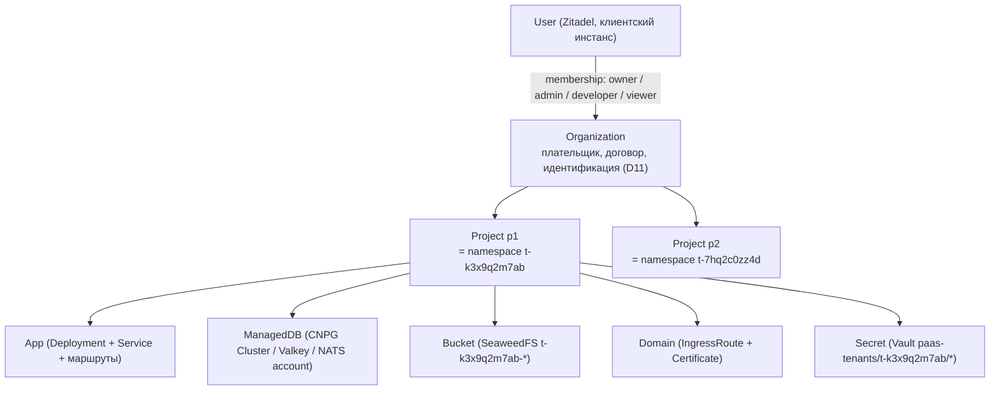
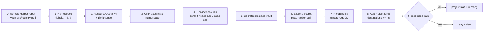
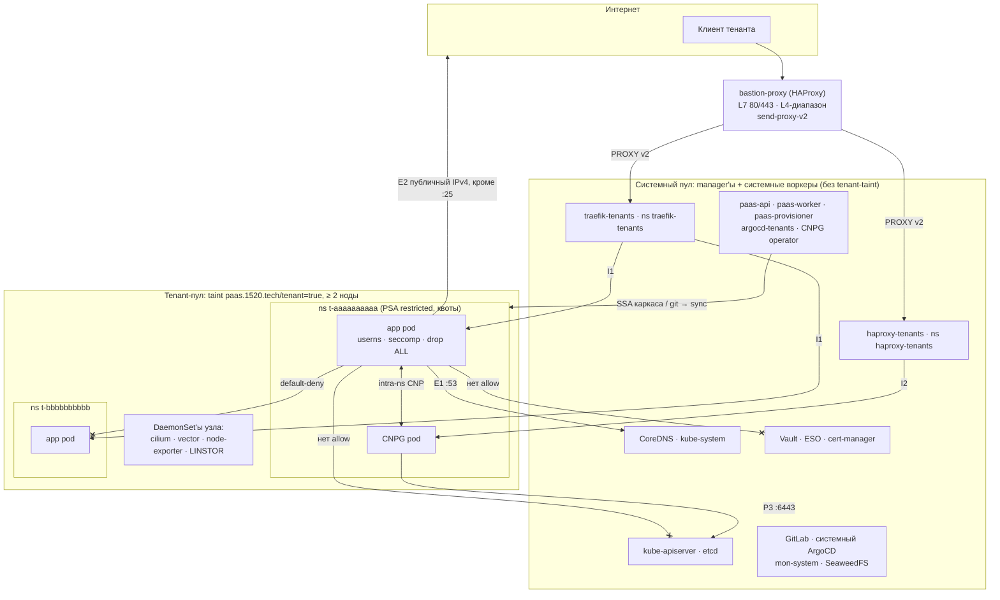
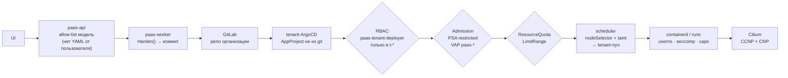

# 02. Тенантность и изоляция

> **TL;DR**
>
> - **Граница изоляции = Project = один namespace `t-<10 символов>`.** Organization — плательщик; тариф привязан к Project, поэтому квота нативная и не обходится. vcluster, Capsule/HNC, namespace на организацию или на приложение, кластер на тенанта отвергнуты (§1.3); выделенные ноды — апселл фазы 2.
> - **Каркас namespace создаёт только `paas-provisioner`** (SSA), в порядке «сначала ограничения, потом права»: Namespace (PSA `restricted`, закреплённая версия) → 4 ResourceQuota + LimitRange → CNP «свои ↔ свои» → ServiceAccount'ы → SecretStore → pull-секрет Harbor через ESO → RoleBinding tenant-ArgoCD → AppProject. Готовность подтверждает `SecretStore Ready` — сквозная проверка цепочки до Vault (§2).
> - **Удаление двухфазное**, защищено VAP (удалить можно только `t-*` с меткой `lifecycle=deleting`), с мягким окном 7 дней и финальным бэкапом. У LINSTOR SC `Retain` → нужен reaper PV либо тенантские SC с `Delete` (§2.5).
> - **Tenant-пул** (метка + taint) требует больше, чем метка: у Traefik, haproxy-ingress, cilium-operator и LINSTOR-controller стоит `tolerations: Exists` — без `nodeAffinity NotIn tenant` они сядут на tenant-ноды вместе со своими токенами. Рекомендация — пул из новых серверов с отдельным диском под LINSTOR и тенантскими SC, чьи реплики живут только в пуле: с SC `lnstr-worker-*` из D6 вторая реплика Hobby-БД уезжает на системную ноду, и failover не работает (§3).
> - **User namespaces**: stable в k8s 1.36 (проверено по kubernetes.io); containerd 2.3.1, runc 1.4.3 и ядро прода 6.8 (Ubuntu 24.04) требованиям соответствуют — подтвердить `uname -r` на нодах. UID в `Harden()` ≤ 65535, NFS/RWX не работает, поды операторов (CNPG, solver'ы cert-manager) остаются без userns — главный пробел (§4). gVisor — тариф trial по триггеру, не MVP (§5).
> - **Сеть**: CCNP `paas-tenant-baseline` — default-deny; вход только от Traefik/haproxy-ingress; выход — DNS в CoreDNS и публичный IPv4 без частных диапазонов; deny на порт 25, DNS в обход CoreDNS и RFC1918. Узкие CCNP для CNPG (apiserver, S3), NATS (по метке) и suspend. **Найдено в репо:** egress-политики Traefik (только 80/443) и haproxy-ingress (только apiserver) не пропустят трафик к подам тенантов; `allowCrossNamespace: true` у Traefik делает его «запутанным заместителем» — нужен VAP на IngressRoute; межнодовый трафик не шифруется — нужен WireGuard (§6).
> - **DNS**: kubeadm-овский CoreDNS отдаёт по PTR-перебору `10.4.0.0/18` имена всех Service кластера → патч Corefile (`pods disabled`, NXDOMAIN на PTR кластерных CIDR), `ndots:2` в `Harden()` (§7).
> - **Квоты**: память без burst (`limits == requests`), CPU ×4, ephemeral-storage, нули на системные SC, счётчики CRD как аддоны тарифа, квота-страж PriorityClass (§8). **PriorityClass**: `paas-system` (globalDefault, 1 000 000) > `paas-control` > `tenant-paid` > `tenant-trial` (`Never`) — без правки 25 чартов (§9).
> - **Шумные соседи**: в kubelet нет `podPidsLimit` и `system/kubeReserved`; самый опасный вектор именно этого кластера — LINSTOR `fileThinPool` на корневой ФС (переполнение диска тенантом = ошибки записи DRBD-томов соседей); conntrack/masquerade, Bandwidth Manager, APF для PaaS-контроллеров (§10).
> - **Честно**: root на tenant-ноде = все тенанты этой ноды и обход сетевых политик с неё. Модель — изоляция от соседа и от обычной атаки из контейнера, а не уровня VM; в оферте так и писать (§11).

---

## 1. Иерархия: Organization → Project → App → ресурсы

### 1.1 Модель



| Сущность | Физическое воплощение | Что это за граница |
|---|---|---|
| **Organization** | строка в Postgres control plane; Harbor project; GitLab-репозиторий `paas-tenants/<org>` ([06](06-delivery-pipeline.md)); `AppProject` в `argocd-tenants`; квоты аддонов | биллинг, договор, члены команды, registry-квота |
| **Project** | **ровно один namespace `t-<project_id>`** + ResourceQuota + LimitRange + сетевые политики + SecretStore; префикс Vault-пути; префикс бакетов; NATS account | **граница изоляции** (сеть, квота, секреты, RBAC) |
| **App** | Deployment/StatefulSet + Service + IngressRoute в namespace проекта; путь в git `projects/<project_id>/apps/<app_id>/`; одна `Application` в `argocd-tenants` | единица деплоя и отката |
| **ManagedDB** | CNPG `Cluster`, Valkey StatefulSet — **в том же namespace** (D2); NATS — account в общем кластере (D6) | покрыта квотой проекта |
| **Bucket** | бакет `t-<project_id>-<name>` + identity в SeaweedFS ([11](11-svc-object-storage-s3.md)) | префикс-изоляция |
| **Domain** | IngressRoute + Certificate в namespace проекта; UNIQUE в БД ([08](08-svc-ingress-domains-ip.md)) | глобально уникален |
| **Secret** | Vault KV `paas-tenants/data/t-<project_id>/<name>` + ExternalSecret ([12](12-svc-secrets.md)) | templated policy по namespace SA |

**Тариф привязан к Project, а не к Organization** (рекомендация). Одна подписка = один Project = один ResourceQuota. Organization держит N подписок и платит за все. Почему:

- `ResourceQuota` — объект namespace'а. Агрегатной квоты «на группу namespace'ов» в vanilla Kubernetes нет (у OpenShift есть `ClusterResourceQuota`, у Capsule — tenant-квота, но это ещё один оператор с webhook'ами на горячем пути). Привязка тарифа к Project делает квоту **нативной и не обходимой**.
- «Общий пул организации, который пользователь сам делит между проектами» реализуется позже чисто в backend: сумма квот проектов ≤ пул организации, инвариант держится одной транзакцией в Postgres при изменении любой квоты. Kubernetes при этом ничего не узнаёт — он по-прежнему видит квоты namespace'ов. Это фаза 2, в MVP не нужно.

Окружения (prod/staging) — это **разные Project**, а не метки внутри одного. Staging не может ходить в сеть prod (default-deny между namespace действует и внутри одной организации), не делит с ним квоту и не может его «съесть» OOM-каскадом.

Сетевой доступ между проектами одной организации в MVP **отсутствует**. Если понадобится («project peering»), provisioner создаёт пару namespaced `CiliumNetworkPolicy` в обоих namespace (явное разрешение конкретной пары, двустороннее согласие в UI). CCNP-базлайн это не ломает: deny-правила там только на внешние диапазоны (§6).

### 1.2 Почему граница изоляции = Project = один namespace

Все механизмы принуждения, которые у нас есть, работают на уровне namespace:

| Механизм | Scope | Что даёт при «проект = namespace» |
|---|---|---|
| RBAC `RoleBinding` | namespace | tenant-ArgoCD пишет только в `t-*`, куда provisioner выдал биндинг |
| `ResourceQuota` / `LimitRange` | namespace | тариф = квота, без агрегаций |
| Pod Security Admission | namespace (label) | `restricted` вешается одной меткой |
| ValidatingAdmissionPolicy | `namespaceSelector` | все tenant-правила привязаны к метке `paas.1520.tech/tenant=true` |
| Cilium-политики | namespace labels | CCNP выбирает все tenant-поды по метке namespace |
| ESO `SecretStore` | namespace | SecretStore в чужом namespace недоступен |
| Vault templated policy | namespace SA | `service_account_namespace` из JWT → путь `paas-tenants/data/<ns>/*` (D9) |
| Каскадное удаление | namespace | удалили namespace → ушло всё его содержимое |

Граница, совпадающая с namespace, получает все эти механизмы готовыми и не требует ни одной строчки кода «на изоляцию». Любая другая граница (группа namespace'ов, часть namespace'а) заставляет дописывать агрегацию или фильтрацию, и каждая такая дописка — место для бага.

### 1.3 Сравнение моделей

| Модель | Изоляция | Цена на тенанта | Нагрузка на соло-оператора | Совместимость с нашим стеком | Вердикт |
|---|---|---|---|---|---|
| **Namespace на Project** (выбрано) | ядро общее; сеть, квота, секреты, RBAC — нативно | ~10 объектов в etcd, 0 подов | минимальная: всё делает provisioner | полная (ESO, Vault templated policy, CCNP, VAP) | **MVP** |
| Namespace на Organization | та же, но prod и staging в одной сетевой зоне | меньше объектов | такая же | квоту между окружениями не разделить, имена сервисов разных проектов конфликтуют | отвергнуто: одна зона поражения на все окружения клиента |
| Namespace на App | та же | ×N объектов на тенанта | выше: N² сетевых разрешений между приложениями проекта | квоте нужна агрегация по namespace'ам (её нет), managed-БД непонятно куда класть | отвергнуто |
| vcluster на тенанта | **та же по ядру** — поды всё равно на общих нодах; плюс отдельный API | под control plane ~150–300 MiB RAM + CPU на тенанта ⚠️ измерить | высокая: апгрейды syncer'а, etcd/sqlite на тенанта, отладка двух API | ценность vcluster — дать тенанту kube API, а у нас пользователь работает только через UI | отвергнуто для MVP (D2); кандидат в премиум «Kubernetes API» |
| Capsule / HNC | та же, что namespace | оператор + webhook на горячем пути | ещё один компонент, который ломает создание подов, если лёг | ценность — self-service namespace'ы через kubectl, а у тенантов kubectl нет; иерархию держит БД backend'а | отвергнуто |
| Выделенная нода на тенанта | ядро своё, кластер общий | целая нода | низкая (taint + VAP) | полная: namespace тот же, меняется только nodeSelector/toleration | **апселл фазы 2** (тариф «dedicated», §3.5) |
| Кластер на тенанта | максимальная | целый control plane | неподъёмная соло | несовместимо с «один большой кластер» | отвергнуто |

Урок Zeabur (с 1 апреля 2026 перестал принимать новые сервисы в shared-кластеры) учтён так: shared-модель — это дешёвый тариф с жёсткими лимитами, а путь «вывести жирного клиента на выделенные ноды без переписывания платформы» заложен с первого дня (метка пула + VAP сравнивают org-id, §3.5).

### 1.4 Имена и метки

**Идентификаторы.** `project_id` — 10 символов `[a-z0-9]` из `crypto/rand` (36¹⁰ ≈ 3.7·10¹⁵ — коллизии исключены практически, но UNIQUE в БД всё равно стоит). Namespace = `t-<project_id>`, 12 символов, укладывается в DNS-label. Пользовательские названия («my-shop-prod») живут **только в БД**: они не попадают ни в имя namespace, ни в значения меток. Это закрывает три проблемы разом: коллизии имён между клиентами, утечку названий через DNS/PTR (§7), и допустимые символы в метках (кириллица, пробелы).

**Метки Namespace** (ставит только provisioner, VAP запрещает менять их кому-либо ещё):

| Метка | Значение | Кто читает |
|---|---|---|
| `paas.1520.tech/tenant` | `"true"` | VAP-биндинги, CCNP, Vault namespace-selector, мониторинг |
| `paas.1520.tech/managed-by` | `paas` | все объекты backend'а (D1) |
| `paas.1520.tech/tenant-ns` | `t-<project_id>` | все объекты backend'а (D1) |
| `paas.1520.tech/org-id` | `<org_id>` | VAP для dedicated-нод (§3.5), биллинг-метрики |
| `paas.1520.tech/project-id` | `<project_id>` | метрики, логи |
| `paas.1520.tech/tier` | `trial` / `starter` / `pro` / … | VAP (разрешённые PriorityClass, RuntimeClass) |
| `paas.1520.tech/lifecycle` | `active` / `suspended` / `deleting` | CCNP suspend (§6), VAP на удаление (§2.5) |
| `paas.1520.tech/svc-<name>` | `"true"` | label-gated CCNP для общих сервисов (NATS, §6) |
| `pod-security.kubernetes.io/enforce` | `restricted` | PSA |
| `pod-security.kubernetes.io/enforce-version` | `v1.36` | PSA — **закреплённая версия** |
| `pod-security.kubernetes.io/audit`, `/warn` | `restricted` | PSA |

`enforce-version` закреплён на версии кластера, а не `latest`: новая версия профиля `restricted` может запретить поле, которое `Harden()` сегодня выставляет, и после апгрейда кластера **все** rollout'ы тенантов начнут падать на admission одновременно. Поднятие версии PSA — отдельный шаг в чек-листе апгрейда k8s: сначала `audit`/`warn` на новую версию, чтение аудита, потом `enforce`.

**Метка `paas.1520.tech/tenant=true` — это и есть граница.** Все VAP-биндинги и CCNP выбирают tenant-namespace по ней. Кто может снять метку, тот выводит namespace из-под всех политик разом. Поэтому ([03](03-security-model.md) держит полный текст политики):

- VAP `paas-namespace-guard` на `CREATE`/`UPDATE` Namespace: имя соответствует `^t-[a-z0-9]{10}$` **тогда и только тогда, когда** `paas.1520.tech/tenant == "true"`; на UPDATE метки `paas.1520.tech/*` и `pod-security.kubernetes.io/*` может менять только SA `paas-provisioner`; значение `enforce` для tenant-namespace может быть только `restricted`.
- `update namespaces` в RBAC есть только у provisioner'а; у tenant-ArgoCD прав на Namespace нет вообще.

## 2. Жизненный цикл namespace тенанта

### 2.1 Кто и как создаёт

Namespace и весь его «каркас» создаёт **только `paas-provisioner`** (D3, D4), напрямую через apiserver, Server-Side Apply с `fieldManager: paas-provisioner` и `force: true`. Не ArgoCD (namespace-scoped ArgoCD не может создавать Namespace by design) и не `cluster-base` (статический список, удаление элемента сносит namespace — ground truth §2).

Правила provisioner'а:

1. **Каждый шаг — «привести к желаемому состоянию»**, а не «создать». Повтор шага после сбоя безопасен; SSA с неизменившимся объектом — no-op для apiserver и etcd.
2. **Сначала ограничения, потом права.** Квота, LimitRange и сетевая политика появляются раньше, чем tenant-ArgoCD получает право писать в namespace. Если provisioner упал посередине, недостроенный namespace закрыт, а не открыт.
3. **Желаемое состояние рендерится из БД целиком**, а не патчится дельтой. Особенно важно для `AppProject.spec.destinations`: список в CRD атомарный (не list-map), SSA заменяет его целиком, поэтому provisioner всегда отдаёт полный список проектов организации из Postgres.
4. **`force: true` — осознанно**: provisioner — единственный владелец этих полей. Конфликт полей (кто-то другой их менял) пишется в лог и метрику `paas_provisioner_field_conflicts_total` — это сигнал дрейфа или вмешательства руками.
5. Шаги выполняются задачей River (D13) как state machine: `project.status` = `provisioning` → `ready`; ошибка шага → retry с backoff, статус в UI «создаётся».

```go
// internal/provisioner/namespace.go — типизированно, без text/template (D13)
func (p *Provisioner) ensureNamespace(ctx context.Context, pr db.Project) error {
    ns := corev1ac.Namespace(pr.Namespace()).
        WithLabels(map[string]string{
            "paas.1520.tech/tenant":                        "true",
            "paas.1520.tech/managed-by":                    "paas",
            "paas.1520.tech/tenant-ns":                     pr.Namespace(),
            "paas.1520.tech/org-id":                        pr.OrgID,
            "paas.1520.tech/project-id":                    pr.ID,
            "paas.1520.tech/tier":                          string(pr.Tier),
            "paas.1520.tech/lifecycle":                     string(pr.Lifecycle),
            "pod-security.kubernetes.io/enforce":         "restricted",
            "pod-security.kubernetes.io/enforce-version": p.cfg.PSAVersion, // "v1.36"
            "pod-security.kubernetes.io/audit":           "restricted",
            "pod-security.kubernetes.io/warn":            "restricted",
        })
    _, err := p.kube.CoreV1().Namespaces().Apply(ctx, ns,
        metav1.ApplyOptions{FieldManager: "paas-provisioner", Force: true})
    return err
}
```

### 2.2 Порядок создания — полный список объектов



Платформенные предпосылки, которые ставит **ansible один раз** (D1) и которые provisioner только использует: `ClusterRole paas-tenant-deployer`, CCNP `paas-tenant-*` (§6), VAP-политики ([03](03-security-model.md)), PriorityClass'ы (§9), StorageClass'ы, Vault mount `paas-tenants` + Kubernetes-auth role + templated policy ([12](12-svc-secrets.md)), namespace `argocd-tenants` с tenant-ArgoCD.

**Шаг 0 — секрет pull'а в Vault (paas-worker).** Worker создаёт (или находит) pull-robot организации в Harbor ([10](10-svc-registry-harbor.md)) и пишет его в `paas-tenants/data/t-<project_id>/sys/registry-pull` (поля `username`, `password`). Префикс `sys/` скрыт в UI, пользовательские имена секретов с `_` не принимаются валидатором.

**Шаг 1 — Namespace.**

```yaml
apiVersion: v1
kind: Namespace
metadata:
  name: t-k3x9q2m7ab
  labels:
    paas.1520.tech/tenant: "true"
    paas.1520.tech/managed-by: paas
    paas.1520.tech/tenant-ns: t-k3x9q2m7ab
    paas.1520.tech/org-id: q8w2e4r6t1
    paas.1520.tech/project-id: k3x9q2m7ab
    paas.1520.tech/tier: starter
    paas.1520.tech/lifecycle: active
    pod-security.kubernetes.io/enforce: restricted
    pod-security.kubernetes.io/enforce-version: v1.36
    pod-security.kubernetes.io/audit: restricted
    pod-security.kubernetes.io/warn: restricted
```

**Шаг 2 — квоты и LimitRange.** Четыре `ResourceQuota` (`paas-compute`, `paas-storage`, `paas-objects`, `paas-priority-guard`) и один `LimitRange` `paas-limits`. Полный эталонный YAML и объяснение каждого ключа — §8. Идут вторыми, потому что без `LimitRange` любой под без requests будет отклонён квотой, а без квоты первый же под может съесть весь пул.

**Шаг 3 — внутринамеспейсная сетевая политика.** Всё межнамеспейсное и внешнее задано кластерными политиками (§6), которые подхватывают namespace **в момент появления метки** `paas.1520.tech/tenant=true` на шаге 1. Разрешить «свой namespace сам с собой» кластерная политика не может: в CCNP пустой селектор означает «весь кластер», а примитива «тот же namespace» нет. Поэтому один namespaced-объект:

```yaml
apiVersion: cilium.io/v2
kind: CiliumNetworkPolicy
metadata:
  name: paas-intra-namespace
  namespace: t-k3x9q2m7ab
  labels:
    paas.1520.tech/managed-by: paas
    paas.1520.tech/tenant-ns: t-k3x9q2m7ab
spec:
  description: "Поды проекта свободно общаются друг с другом, и только друг с другом"
  endpointSelector: {}          # все поды этого namespace
  ingress:
    - fromEndpoints:
        - {}                    # в namespaced-политике {} = поды этого же namespace
  egress:
    - toEndpoints:
        - {}
```

**Шаг 4 — ServiceAccount'ы.**

```yaml
# default создаёт контроллер SA; provisioner только отнимает у него автомонтирование токена
apiVersion: v1
kind: ServiceAccount
metadata:
  name: default
  namespace: t-k3x9q2m7ab
automountServiceAccountToken: false
---
# Под именем paas-app работают все поды приложений. Ни одного RoleBinding на него нет.
apiVersion: v1
kind: ServiceAccount
metadata:
  name: paas-app
  namespace: t-k3x9q2m7ab
  labels:
    paas.1520.tech/managed-by: paas
    paas.1520.tech/tenant-ns: t-k3x9q2m7ab
automountServiceAccountToken: false
imagePullSecrets:
  - name: paas-harbor-pull
---
# Идентичность ESO для Vault (D9). Токен этого SA ESO берёт через TokenRequest,
# в поды он не монтируется, RBAC-прав в k8s у него нет.
apiVersion: v1
kind: ServiceAccount
metadata:
  name: paas-eso
  namespace: t-k3x9q2m7ab
  labels:
    paas.1520.tech/managed-by: paas
    paas.1520.tech/tenant-ns: t-k3x9q2m7ab
automountServiceAccountToken: false
```

`imagePullSecrets` на `paas-app` — чтобы `Harden()` не вписывал pull-секрет в каждый под, а CNPG-поды получали его через `Cluster.spec.imagePullSecrets` ([09](09-svc-databases.md)). VAP разрешает в tenant-namespace только `serviceAccountName` из списка `paas-app` + SA, которые создаёт CNPG для своих `Cluster` ([03](03-security-model.md)).

**Шаг 5 — SecretStore** (форма повторяет существующий `mon-system/pre/templates/eso-secret-store.yaml`):

```yaml
apiVersion: external-secrets.io/v1
kind: SecretStore
metadata:
  name: paas-vault
  namespace: t-k3x9q2m7ab
  labels:
    paas.1520.tech/managed-by: paas
    paas.1520.tech/tenant-ns: t-k3x9q2m7ab
spec:
  refreshInterval: 300
  provider:
    vault:
      server: "http://vault.vault.svc:8200"   # ⚠️ взять фактический eso.vaultServerUrl из hosts-vars
      path: paas-tenants
      version: v2
      auth:
        kubernetes:
          mountPath: kubernetes
          role: paas-tenant                   # ОДНА роль на всех тенантов (D9)
          serviceAccountRef:
            name: paas-eso
```

Одна роль + одна templated policy означают, что создание тенанта **не требует ни одной операции в конфигурации Vault** — ни новой роли, ни новой политики, ни прогона bank-vaults. Изоляция держится на том, что Vault подставляет в путь namespace SA из проверенного JWT ([12](12-svc-secrets.md)).

**Шаг 6 — pull-секрет Harbor через ESO.**

```yaml
apiVersion: external-secrets.io/v1
kind: ExternalSecret
metadata:
  name: paas-harbor-pull
  namespace: t-k3x9q2m7ab
  labels:
    paas.1520.tech/managed-by: paas
    paas.1520.tech/tenant-ns: t-k3x9q2m7ab
spec:
  refreshInterval: 1h
  secretStoreRef:
    kind: SecretStore
    name: paas-vault
  target:
    name: paas-harbor-pull
    creationPolicy: Owner
    template:
      type: kubernetes.io/dockerconfigjson
      data:
        .dockerconfigjson: '{"auths":{"harbor.example.tech":{"auth":"{{ printf "%s:%s" .username .password | b64enc }}"}}}'
  data:
    - secretKey: username
      remoteRef: {key: t-k3x9q2m7ab/sys/registry-pull, property: username}
    - secretKey: password
      remoteRef: {key: t-k3x9q2m7ab/sys/registry-pull, property: password}
```

Почему через ESO, а не `Secret` напрямую от provisioner'а: (а) provisioner вообще не держит в памяти секретный материал; (б) ротация robot-токена = одна запись в Vault, ESO обновит Secret сам, kubelet читает pull-секрет в момент pull — рестарт подов не нужен; (в) единая модель с D9. Объект создаётся client-go, а не helm, поэтому ловушка «helm съедает `{{ }}` шаблона ESO» здесь не возникает.

**Шаг 7 — права tenant-ArgoCD в этом namespace.** Только после шагов 1–6.

```yaml
apiVersion: rbac.authorization.k8s.io/v1
kind: RoleBinding
metadata:
  name: paas-tenant-argocd-deployer
  namespace: t-k3x9q2m7ab
  labels:
    paas.1520.tech/managed-by: paas
    paas.1520.tech/tenant-ns: t-k3x9q2m7ab
roleRef:
  apiGroup: rbac.authorization.k8s.io
  kind: ClusterRole
  name: paas-tenant-deployer        # определение — в ansible (платформа, D1)
subjects:
  - kind: ServiceAccount
    name: argocd-application-controller
    namespace: argocd-tenants
```

Provisioner может создать этот биндинг только потому, что у него есть глагол `bind` на `clusterroles` с `resourceNames: [paas-tenant-deployer]` (D4): привязать другую роль, например `cluster-admin`, он не может даже при компрометации. Определение роли (ansible-чарт компонента tenant-ArgoCD, стадия `cfg` — по аналогии с `argocd_cfg_rbac_cluster_roles`):

```yaml
apiVersion: rbac.authorization.k8s.io/v1
kind: ClusterRole
metadata:
  name: paas-tenant-deployer
rules:
  - apiGroups: [""]
    resources: [services, configmaps, persistentvolumeclaims]
    verbs: [get, list, watch, create, update, patch, delete]
  - apiGroups: [""]
    resources: [pods, endpoints, events]
    verbs: [get, list, watch]                     # дерево ресурсов и health, без exec
  - apiGroups: [apps]
    resources: [deployments, statefulsets]
    verbs: [get, list, watch, create, update, patch, delete]
  - apiGroups: [apps]
    resources: [replicasets, controllerrevisions]
    verbs: [get, list, watch]
  - apiGroups: [batch]
    resources: [jobs, cronjobs]
    verbs: [get, list, watch, create, update, patch, delete]
  - apiGroups: [policy]
    resources: [poddisruptionbudgets]
    verbs: [get, list, watch, create, update, patch, delete]
  - apiGroups: [autoscaling]
    resources: [horizontalpodautoscalers]
    verbs: [get, list, watch, create, update, patch, delete]
  - apiGroups: [discovery.k8s.io]
    resources: [endpointslices]
    verbs: [get, list, watch]
  - apiGroups: [traefik.io]
    resources: [ingressroutes, middlewares]
    verbs: [get, list, watch, create, update, patch, delete]
  - apiGroups: [cert-manager.io]
    resources: [certificates]
    verbs: [get, list, watch, create, update, patch, delete]
  - apiGroups: [cert-manager.io]
    resources: [certificaterequests]
    verbs: [get, list, watch]
  - apiGroups: [external-secrets.io]
    resources: [externalsecrets]
    verbs: [get, list, watch, create, update, patch, delete]
  - apiGroups: [postgresql.cnpg.io]
    resources: [clusters, scheduledbackups]
    verbs: [get, list, watch, create, update, patch, delete]
  - apiGroups: [postgresql.cnpg.io]
    resources: [backups]
    verbs: [get, list, watch]
  - apiGroups: [ingress.v3.haproxy.org]
    resources: [tcps]
    verbs: [get, list, watch, create, update, patch, delete]
# Намеренно отсутствуют: secrets, serviceaccounts, roles, rolebindings,
# networkpolicies, cilium.io/*, resourcequotas, limitranges, secretstores,
# issuers, pushsecrets, pods/exec, namespaces.
```

Отсутствие `secrets` — принципиально: в git никогда нет `Secret` (D9), поэтому tenant-ArgoCD не нужно даже читать секреты тенантов, и его компрометация их не раскрывает. Отсутствие сетевых политик и квот — чтобы ошибка генерации или подмена коммита не могла открыть сеть или снять лимит. Какую модель чтения/кэша выбирает сам tenant-ArgoCD (namespaced-список или cluster-wide cache с `resource.inclusions`) — [06](06-delivery-pipeline.md); здесь зафиксированы только права записи.

**Шаг 8 — AppProject организации** (создаётся при первом проекте организации, дальше provisioner переприменяет его с полным списком `destinations`):

```yaml
apiVersion: argoproj.io/v1alpha1
kind: AppProject
metadata:
  name: org-q8w2e4r6t1
  namespace: argocd-tenants
  labels:
    paas.1520.tech/managed-by: paas
    paas.1520.tech/org-id: q8w2e4r6t1
spec:
  description: "managed by paas-provisioner via API, NOT from git"
  sourceRepos:
    - https://gitlab.example.tech/paas-tenants/q8w2e4r6t1.git
  destinations:                       # полный список активных проектов из БД
    - server: https://kubernetes.default.svc
      namespace: t-k3x9q2m7ab
  clusterResourceWhitelist: []        # ни одного cluster-scoped объекта
  namespaceResourceWhitelist:         # ровно те kind'ы, что есть в paas-tenant-deployer
    - {group: "", kind: Service}
    - {group: "", kind: ConfigMap}
    - {group: "", kind: PersistentVolumeClaim}
    - {group: apps, kind: Deployment}
    - {group: apps, kind: StatefulSet}
    - {group: batch, kind: Job}
    - {group: batch, kind: CronJob}
    - {group: policy, kind: PodDisruptionBudget}
    - {group: autoscaling, kind: HorizontalPodAutoscaler}
    - {group: traefik.io, kind: IngressRoute}
    - {group: traefik.io, kind: Middleware}
    - {group: cert-manager.io, kind: Certificate}
    - {group: external-secrets.io, kind: ExternalSecret}
    - {group: postgresql.cnpg.io, kind: Cluster}
    - {group: postgresql.cnpg.io, kind: ScheduledBackup}
    - {group: ingress.v3.haproxy.org, kind: TCP}
  roles: []
```

Две независимые границы с одинаковым списком kind'ов: AppProject (не из git, D3 — git-репо тенанта его не перепишет) и RBAC (не обходится ничем внутри ArgoCD). Golden-тест в backend сверяет, что оба списка совпадают.

`Application` на каждое приложение создаётся уже не при создании проекта, а при первом деплое App ([06](06-delivery-pipeline.md)).

### 2.3 Проверка готовности (readiness gate)

Project переходит в `ready` (и UI разблокирует «Deploy») только когда выполнено всё:

| Проверка | Как | Что ловит |
|---|---|---|
| Namespace `Active`, метки на месте | `GET namespaces/<ns>` | гонка с удалением, VAP отверг метки |
| Квоты посчитаны | у каждой `ResourceQuota` заполнен `status.hard` | квота ещё не обработана контроллером — поды можно создать до её учёта |
| `paas-intra-namespace` принят Cilium | `status` CNP без ошибок ⚠️ проверить поле статуса в 1.19 | опечатка в политике |
| `SecretStore` `Ready=True` | `status.conditions` | Vault недоступен, роль/политика `paas-tenant` не принимает этот namespace |
| `ExternalSecret paas-harbor-pull` `Ready=True`, Secret существует | `status.conditions` | worker не записал robot в Vault |
| RoleBinding и AppProject существуют | `GET` | — |

Проверка `SecretStore Ready` — единственный end-to-end тест цепочки «namespace → SA → Vault Kubernetes auth → templated policy» до первого деплоя клиента. Если она падает у всех новых проектов разом — это сигнал сломанной Vault-роли, а не проблемы тенанта.

### 2.4 Suspend (неоплата)

Сценарий из D10: grace → suspend → через 30 дней удаление. На уровне namespace suspend выглядит так:

| Шаг | Кто | Что | Зачем |
|---|---|---|---|
| 1 | worker → git | `replicas: 0` у всех Deployment/StatefulSet; CNPG `Cluster` с аннотацией `cnpg.io/hibernation: "on"`; IngressRoute доменов переключены на платформенный сервис «приостановлено» | остановить нагрузку штатным путём, данные (PVC) сохраняются |
| 2 | provisioner | ждёт `Application.status.sync.revision` == SHA коммита шага 1 | не опережать git (D3) |
| 3 | provisioner | `paas-compute`: `pods: "0"`; метка `paas.1520.tech/lifecycle=suspended` | даже если что-то откатит git (ручная ошибка, баг), новые поды не создадутся |
| 4 | CCNP `paas-tenant-suspended` (§6) | подхватывает namespace по метке: запрет egress в интернет и ingress от ingress-контроллеров | добивает всё, что продолжает работать (майнер в забытом CronJob) |

Resume — в обратном порядке: метка `active` → квота → git. Снижение квоты ниже текущего потребления не выселяет работающие поды, поэтому шаг 3 не заменяет шаг 1, а страхует его.

### 2.5 Удаление: порядок, финализаторы, что сохраняем

Удаление проекта — единственная операция, которая уничтожает данные клиента. Поэтому она двухфазная, а защита от «удалил не тот namespace» стоит в admission, а не в коде backend'а.

**Защита: VAP `paas-namespace-delete-guard`.** `delete namespaces` в RBAC не ограничивается по имени (у `resourceNames` нет шаблонов), поэтому ограничение — в CEL. Provisioner может удалить namespace, только если это tenant-namespace **и** он заранее, отдельным вызовом, помечен `lifecycle=deleting`. Баг, который вызовет `Delete("gitlab")` или удалит случайный `t-*` без подготовки, получит отказ.

```yaml
apiVersion: admissionregistration.k8s.io/v1
kind: ValidatingAdmissionPolicy
metadata:
  name: paas-namespace-delete-guard
spec:
  failurePolicy: Fail
  matchConstraints:
    resourceRules:
      - apiGroups: [""]
        apiVersions: ["v1"]
        operations: ["DELETE"]
        resources: ["namespaces"]
  matchConditions:
    - name: only-paas-provisioner
      expression: >-
        request.userInfo.username == "system:serviceaccount:paas-system:paas-provisioner"
  validations:
    - expression: >-
        oldObject.metadata.name.matches('^t-[a-z0-9]{10}$') &&
        has(oldObject.metadata.labels) &&
        'paas.1520.tech/lifecycle' in oldObject.metadata.labels &&
        oldObject.metadata.labels['paas.1520.tech/lifecycle'] == 'deleting'
      message: "paas-provisioner удаляет только tenant-namespace, заранее помеченный lifecycle=deleting"
---
apiVersion: admissionregistration.k8s.io/v1
kind: ValidatingAdmissionPolicyBinding
metadata:
  name: paas-namespace-delete-guard
spec:
  policyName: paas-namespace-delete-guard
  validationActions: [Deny]
```

**Порядок удаления** (задача River, каждый шаг идемпотентен):

| # | Шаг | Почему в этом месте |
|---|---|---|
| 0 | `project.status = deleting` в БД; биллинг остановлен; UI скрывает проект | — |
| 1 | Окно мягкого удаления (рекомендация — 7 дней) = фактически suspend (§2.4). Отмена возможна | защита от «удалил prod по ошибке» — главный сценарий потери данных у PaaS |
| 2 | Финальный backup всех CNPG `Cluster` в S3 (on-demand `Backup`), ожидание `completed` | последняя копия данных на срок из оферты |
| 3 | Удалить все `Application` проекта в `argocd-tenants` **без** каскада (без финализатора `resources-finalizer.argocd.argoproj.io`) | ArgoCD перестаёт управлять и не пытается пересоздавать объекты в умирающем namespace |
| 4 | Удалить `RoleBinding paas-tenant-argocd-deployer`; убрать namespace из `AppProject.spec.destinations` | отнять права до удаления |
| 5 | Коммит в git: удалить `projects/<project_id>/` | репо = отражение живого состояния |
| 6 | Метка `lifecycle=deleting` на Namespace (отдельный вызов) → `DELETE namespace` | VAP пропускает только в этой последовательности |
| 7 | Ждать исчезновения namespace; > 15 минут в `Terminating` → алерт | см. «застрявшие финализаторы» ниже |
| 8 | Уборка вне namespace (см. таблицу ниже) | эти объекты namespace не каскадирует |

**Застрявшие финализаторы.** Namespace висит в `Terminating`, пока внутри остаются объекты с финализаторами. У нас это: PVC (`kubernetes.io/pvc-protection` — снимается сам, когда поды ушли), CRD-объекты операторов (CNPG ставит финализаторы на свои объекты — ⚠️ проверить набор в используемой версии). Практически это значит: **namespace не удалится, пока жив соответствующий оператор**. Диагностика — `kubectl get ns t-… -o jsonpath='{.status.conditions}'` (условия `NamespaceContentRemaining` / `NamespaceFinalizersRemaining` называют конкретные объекты). Provisioner **никогда** не снимает финализаторы автоматически: это путь к утечке томов и осиротевшим бэкапам. Снятие — ручной runbook оператора.

**Тома: reclaim policy.** Все шесть LINSTOR SC сейчас `reclaimPolicy: Retain` (ground truth). Удаление namespace удалит PVC, но PV перейдёт в `Released`, а DRBD-ресурс в LINSTOR останется навсегда — это и есть известная ловушка «LINSTOR orphan PV cleanup»: PV надо удалять отдельно **и** удалять resource-definition в LINSTOR. Для тенантов это означает одно из двух:

- (как есть, D6 — SC `lnstr-worker-*`, Retain) — шаг 8 включает reaper: найти PV с `spec.claimRef.namespace == t-…`, удалить PV, затем `linstor resource-definition delete <pvc-…>`. Provisioner'у для этого нужен доступ к LINSTOR API — это ещё одна привилегия на высоком уровне;
- (рекомендация, решение владельца) — отдельные tenant-SC с `reclaimPolicy: Delete` (§3.5). Тогда удаление PVC штатно удаляет и том; защиту от случайного удаления дают `Delete=false`/`Prune=false` на PVC в ArgoCD (D3), двухфазное удаление и VAP выше.

**Уборка вне namespace (шаг 8):**

| Ресурс | Действие | Кто |
|---|---|---|
| Vault `paas-tenants/metadata/t-…/*` | `metadata delete` по каждому ключу (у KV v2 нет рекурсивного удаления — worker перечисляет `LIST` и удаляет) | worker |
| S3-бакеты `t-<project_id>-*` | удаление после окна экспорта | worker |
| NATS account проекта | отзыв JWT, удаление из resolver'а | worker |
| L4-порты, выделенные IP | освобождение строк `UNIQUE(ip, port)` | worker |
| Домены | освобождение записи в БД; повторное заявление — только через новую TXT-проверку (D5) | worker |
| LINSTOR-тома (если Retain) | reaper, см. выше | provisioner / отдельный reaper |
| Логи Loki, метрики Prometheus | истекают по retention (7 дней, D14) | — |

**Что сохраняем и зачем:**

| Что | Срок | Основание |
|---|---|---|
| Финальный backup managed-БД | срок из оферты (рекомендация — 7–14 дней) | «вернуть удалённое по ошибке» |
| Биллинговые записи, метеринг | по бухгалтерскому закону | 54-ФЗ / налоговый учёт |
| Данные идентификации клиента | 1 год после прекращения услуги | реестр хостинг-провайдеров, D11 |
| Аудит-лог действий (кто удалил) | ≥ 1 год | разбор инцидентов, претензии |
| История git-репо | до удаления организации | ⚠️ несекретные env-переменные могут содержать ПДн и остаются в истории → вопрос для [16](16-legal-ru.md): при удалении организации репо удаляется целиком |

### 2.6 Реконсиляция дрейфа и защита от «соседних миров»

**Периодическая реконсиляция.** Раз в 10 минут (и по событию) provisioner проходит по всем проектам и повторно применяет каркас — SSA делает это дешёвым. Отдельно ищет расхождения БД ↔ кластер:

| Расхождение | Реакция |
|---|---|
| Namespace с `paas.1520.tech/tenant=true`, которого нет в БД | **алерт, никакого автоудаления** (это может быть восстановление БД из старого бэкапа) |
| Проект в БД `ready`, namespace отсутствует | алерт + перевод в `provisioning` (пересоздание каркаса; данные при этом уже потеряны — инцидент) |
| Конфликт полей SSA | метрика + лог: кто-то правит каркас руками |

**Защита от ansible-мира (D1).** Tenant-namespace никогда не появляется в `cluster_base_namespaces_list`: иначе исчезновение строки из списка снесёт namespace клиента со всеми данными. Страховка — inline-assert в `cluster-base-install.yaml` (по правилу «маленькие проверки — inline»):

```yaml
- name: Assert no PaaS tenant namespaces in cluster-base
  ansible.builtin.assert:
    that:
      - (cluster_base_namespaces_list | map(attribute='name') | select('match', '^t-[a-z0-9]{10}$') | list | length) == 0
    fail_msg: "t-* namespaces принадлежат paas-provisioner, не cluster-base (D1)"
```

Системный ArgoCD никогда не получает RoleBinding в `t-*` (статические биндинги `argocd_cfg_rbac_role_bindings` перечисляют namespace явно — туда их просто не вписывают). Tenant-ArgoCD никогда не видит `Namespace` как ресурс (нет в RBAC и в AppProject).

**Кто вообще может писать в tenant-namespace.** Кроме provisioner'а и tenant-ArgoCD легально пишут: встроенные контроллеры (replicaset/statefulset/job/endpointslice), CNPG-оператор, cert-manager (Challenge, solver-поды), ESO (Secret). Всё остальное — дрейф или атака. VAP «allow-list писателей» в tenant-namespace стоит ввести сначала в режиме `validationActions: [Audit]`, собрать неделю аудита, и только потом `Deny` — иначе забытый легальный писатель (например, HA-controller LINSTOR, который удаляет поды при отказе ноды) тихо сломается ([03](03-security-model.md)).

## 3. Tenant node pool

### 3.1 Зачем отдельный пул

Метка `paas.1520.tech/pool=tenant` + taint `paas.1520.tech/tenant=true:NoSchedule` на отдельных воркерах (D4). Это самый дешёвый рычаг изоляции из доступных, и он закрывает сразу пять разных рисков:

| Риск без пула | Что даёт пул |
|---|---|
| Побег из контейнера тенанта оказывается на ноде, где крутятся Vault, GitLab, системный ArgoCD, etcd | побег приземляется на ноду, где есть только чужие тенанты и узлы-агенты |
| На ноде тенанта лежат токены SA с правом читать **все** секреты кластера: Traefik (TLS всех доменов), cert-manager, ESO, CNPG-оператор, tenant-ArgoCD, provisioner. Node authorizer отдаёт kubelet'у только секреты подов своей ноды, но токены этих подов — как раз на ноде | такие поды на tenant-ноды не попадают (§3.2 — с оговоркой про `tolerations: Exists`) |
| Шумный сосед (CPU, диск, conntrack, pull огромного образа) бьёт по системным компонентам | давление остаётся внутри пула |
| Egress тенантов уходит SNAT'ом с IP той ноды, где крутится под. Спамер или сканер загоняет IP в блок-листы — и системные сервисы на этой ноде теряют почту/внешние API | тенанты выходят с IP tenant-нод, репутация системных IP отделена |
| Ёмкость «на продажу» размазана по всем нодам вперемешку с платформой | allocatable пула = продаваемая ёмкость, считается одной формулой (§3.4) |

Что остаётся на tenant-нодах неизбежно — DaemonSet'ы узла: `cilium` (агент), `cilium-envoy`, `vector`, `node-exporter`, LINSTOR satellite + CSI node + HA-controller. Все они привилегированные; их права — остаточный риск (§11).

### 3.2 Как отразить в ansible-репо

**Inventory (`hosts-vars-override/<cluster>/hosts.yaml`).** Метки уже поддерживаются (`node_labels`, применяются `tasks-apply-node-labels.yaml` при `cluster-init` / `worker-join` / `manager-join`). Taint'ов в репо нет вообще (есть только `tasks-untaint-control-plane.yaml`) — добавляется симметричная переменная `node_taints`:

```yaml
workers:
  hosts:
    k8s-worker-6:
      # ansible_host / internal_ip / new_hostname — как у остальных
      node_labels:
        - "node-role.kubernetes.io/worker="
        - "node.kubernetes.io/resource-type=shared"
        - "paas.1520.tech/pool=tenant"
      node_taints:                                   # НОВОЕ
        - "paas.1520.tech/tenant=true:NoSchedule"
```

**Новые task'и и утилита:**

| Файл | Что делает |
|---|---|
| `playbook-system/tasks/tasks-apply-node-taints.yaml` | `kubectl taint nodes {{ new_hostname }} {{ item }} --overwrite` по `node_taints`, делегирование на `master_manager_fact`. **Без `failed_when: false`** (в отличие от task'а меток): не поставившийся taint — это дыра в изоляции, прогон должен упасть |
| `playbook-system/tasks/tasks-kubelet-register-taints.yaml` | до `kubeadm join` пишет `/etc/default/kubelet`: `KUBELET_EXTRA_ARGS="--register-with-taints=paas.1520.tech/tenant=true:NoSchedule"`. Нода регистрируется **уже с taint'ом** — нет окна, в которое pending-под платформы успевает сесть на свежую tenant-ноду между join и `kubectl taint`. ⚠️ проверить: флаг помечен deprecated в пользу `registerWithTaints` в KubeletConfiguration — работает ли в 1.36; путь `/etc/default/kubelet` читается drop-in'ом `10-kubeadm.conf` из deb-пакета |
| `playbook-system/utils/worker-join.yaml` | include `tasks-kubelet-register-taints.yaml` перед join и `tasks-apply-node-taints.yaml` после `tasks-apply-node-labels.yaml` |
| `playbook-system/utils/node-labels-taints-apply.yaml` (новый) | метки + taint'ы на **уже присоединённую** ноду. Операция точечная и меняет расписание — поэтому гейт `tasks-require-limit.yaml`, как у остальных single-node плейбуков |

Семантика только добавляющая: убранный из inventory taint с ноды не снимается. Снятие — явное `kubectl taint nodes <n> paas.1520.tech/tenant=true:NoSchedule-`, это осознанное действие оператора (как и в `cluster-base`, удаление не должно происходить из-за пропавшей строчки).

**Главная ловушка: `tolerations: [{operator: Exists}]`.** Toleration без ключа терпит **любой** taint, включая наш. В репо такая toleration стоит у нескольких компонентов (проверено в `hosts-vars/`):

| Workload | Где задано | На tenant-нодах нужен? | Действие |
|---|---|---|---|
| `cilium` агент (DS) | `cilium_helm_values.tolerations` | да | оставить |
| `cilium-envoy` (DS) | `cilium_helm_values_envoy` | да | оставить |
| `cilium-operator` (Deployment) | `cilium_helm_values_operator` | **нет** — cluster-wide права | `nodeAffinity` NotIn tenant |
| `traefik-lb` (DS) | `traefik_helm_values.tolerations` | **нет** — читает TLS-секреты всех namespace | `nodeAffinity` NotIn tenant |
| `haproxy-lb` (DS) | `haproxy_helm_values_controller` | **нет** | `nodeAffinity` NotIn tenant |
| `vector` (DS) | `mon-system.yaml` | да — логи тенантов | оставить, сузить RBAC |
| `node-exporter` (DS) | `mon-system.yaml` | да | оставить |
| `linstor-controller`, `linstor-csi-controller`, `linstor-affinity-controller` | toleration опущена намеренно → operator-default, включающий cluster-wide `Exists` (комментарий в `hosts-vars/linstor.yaml`) | **нет** | `podTemplate.spec.affinity` NotIn tenant |
| `linstor-satellite`, `linstor-csi-node`, `ha-controller` (DS) | operator | да — DRBD на tenant-нодах | оставить |
| `linstor-csi-nfs-server` (DS) | operator | нет, если RWX тенантам не продаём (и с userns NFS не работает, §4.3) | исключить |

Для «нет» добавляется одинаковый блок (в ansible — в соответствующие `*_helm_values`):

```yaml
affinity:
  nodeAffinity:
    requiredDuringSchedulingIgnoredDuringExecution:
      nodeSelectorTerms:
        - matchExpressions:
            - key: paas.1520.tech/pool
              operator: NotIn
              values: ["tenant"]
```

Полный список по живому кластеру (компоненты вне просмотренных vars-файлов тоже могут терпеть всё) — перед открытием пула:

```bash
kubectl get deploy,sts,ds -A -o json | jq -r '
  .items[]
  | select(any(.spec.template.spec.tolerations[]?;
      (.operator == "Exists" and ((.key // "") == "")) or .key == "paas.1520.tech/tenant"))
  | [.kind, .metadata.namespace, .metadata.name] | @tsv'
```

**Ingress и bastion.** Traefik — DaemonSet с `externalTrafficPolicy: Local`: NodePort на ноде без локального пода Traefik трафик не принимает. После исключения Traefik из пула `bastion_proxy_haproxy_l7_target_ip` / `l4_target_ip` обязаны указывать на **системный** воркер (сейчас это один worker IP — проверить, что он не попадёт в пул).

**Cilium host firewall.** Изменений не требует: tenant-ноды — обычные члены `nodeIpsList`. Порядок добавления новой ноды прежний (inventory → `cilium-install.yaml --tags post` → `full-node-install.yaml --limit` → `worker-join.yaml --limit`).

**Метки для изоляции и NodeRestriction.** NodeRestriction запрещает kubelet'у менять taint'ы своей Node после регистрации, поэтому скомпрометированная tenant-нода не может снять с себя `paas.1520.tech/tenant` и «приманить» системные поды. Метку `paas.1520.tech/pool` kubelet сменить может, но она притягивает только поды тенантов, которые и так живут в пуле. Если позже понадобится обратная гарантия («Vault только на системных нодах, даже если tenant-нода соврёт о себе»), для неё используется префикс `node-restriction.kubernetes.io/` — kubelet его не может ни ставить, ни менять.

### 3.3 Миграция существующих воркеров

**Рекомендация: пул из новых серверов, а не из переделанных воркеров.** Причины: (1) на существующих воркерах лежат локальные LINSTOR-реплики системных томов, и перенос каждой — ручная DRBD-операция с ресинком; (2) новым нодам можно сразу дать отдельный диск под LINSTOR (§3.5), чего нельзя сделать с воркерами, у которых пулы — `fileThinPool` на корневой ФС; (3) текущие 5 воркеров уже несут платформу, и отдать два из них — значит сжать систему до 3 воркеров + 1 manager. Одновременно D12 требует ещё двух manager'ов — заказ серверов делается один раз.

Если всё же переделывать существующие (минимум 2 из 5):

| # | Шаг | Команда / проверка |
|---|---|---|
| 1 | Выбрать ноды: не цель bastion-proxy; меньше всего локальных системных реплик | см. шаг 2 |
| 2 | Инвентаризация томов на кандидате | `kubectl get pv -o json \| jq -r '.items[] \| select([.spec.nodeAffinity.required.nodeSelectorTerms[].matchExpressions[]?.values[]?] \| index("k8s-worker-4")) \| [.metadata.name, .spec.claimRef.namespace, .spec.claimRef.name, .spec.storageClassName] \| @tsv'` и `kubectl -n linstor exec deploy/linstor-controller -- linstor resource list --nodes k8s-worker-4` |
| 3 | Перенести каждую реплику системного тома на системный воркер | `linstor resource create <other-node> <res> --storage-pool lnstr-file-thin-worker` → дождаться `UpToDate` (смотреть байты ресинка, а не проценты) → `linstor resource delete k8s-worker-4 <res>`; affinity-controller обновит `nodeAffinity` PV |
| 4 | Добавить `nodeAffinity NotIn tenant` компонентам с `Exists` (§3.2), прогнать их install | иначе после drain они вернутся |
| 5 | Проверить, что система влезает в оставшиеся ноды | `kubectl describe nodes \| grep -A8 "Allocated resources"`; CoreDNS (3 реплики, жёсткая anti-affinity по hostname) должен иметь ≥ 3 не-tenant нод — manager + 3 воркера, ок |
| 6 | Метки + taint | `node-labels-taints-apply.yaml --limit k8s-worker-4` |
| 7 | Вытеснить платформу | `node-drain-on.yaml --limit k8s-worker-4` → `node-drain-off.yaml --limit k8s-worker-4`; обратно вернутся только DaemonSet'ы |
| 8 | Проверка | `kubectl get pods -A -o wide --field-selector spec.nodeName=k8s-worker-4` — только DaemonSet'ы узла |

Порядок 3 → 6 критичен. Если поставить taint раньше переноса реплик, под системного StatefulSet'а с `autoPlace: 1` томом на этой ноде после следующего рестарта уйдёт в `Pending` навсегда: PV привязан к ноде (`allowRemoteVolumeAccess: false`), а taint его туда не пускает.

### 3.4 Размер пула и ёмкость

- **Минимум 2 ноды** (D4). С одной нодой любая перезагрузка (обновление ядра, drain) = полный простой всех тенантов. С двумя — переживаем отказ одной, но **продаём не больше одной ноды ёмкости** (N+1).
- **Формула продаваемой ёмкости:**
  `sellable = Σ allocatable(pool) × (N−1)/N − Σ requests(DaemonSet'ы узла) − 10 % запас на фрагментацию`
  где `allocatable` уже учитывает `systemReserved`/`kubeReserved` (их сейчас в репо нет — §10).
- **Квота ≠ резерв.** Сумма квот тарифов может превышать `sellable` (оверселл), потому что клиенты редко выбирают квоту целиком. Но scheduler допускает поды по **requests**, и когда свободных requests в пуле нет, новый под клиента висит в `Pending`. Поэтому backend перед деплоем/апгрейдом тарифа проверяет свободную ёмкость пула и отказывает честно («нет мест, мы добавляем ноды»), а не создаёт pending-поды ([13](13-billing-and-quotas.md)). Порог оверселла и сигнал «заказывать ноду» — метрика `sum(kube_pod_container_resource_requests{node=~"<tenant-nodes>"}) / sum(kube_node_status_allocatable{node=~"<tenant-nodes>"})` > 0.7.
- `kubelet_max_pods: 200` и per-node CIDR `/23` на пул не влияют; практический предел плотности — память и число DRBD-ресурсов на ноду, а не число подов.
- Характеристики железа в репо отсутствуют; числа для конкретных нод — `playbook-system/utils/node-info.yaml` и `playbook-system/benchmark/*`.

### 3.5 Tenant-хранилище и выделенные ноды

> ✅ Принято как R-SC ([01 §12.1](01-architecture-overview.md)): SC `lnstr-tenant-local` / `lnstr-tenant-multi-sync` на отдельном пуле tenant-нод, `reclaimPolicy: Delete`.

**Хранилище пула.** D6 называет для managed-БД SC `lnstr-worker-local` (Standard) и `lnstr-worker-multi-sync` (Hobby). Их пул `lnstr-file-thin-worker` есть на **всех** воркерах, включая системные. При `autoPlace: "2"` первая реплика ставится на выбранную scheduler'ом tenant-ноду, а вторая — на любую ноду с этим пулом, в том числе системную. Последствия:

- при отказе tenant-ноды под Hobby-БД **не может** переехать ко второй реплике: она на системной ноде, куда tenant-под не пускает nodeSelector пула. Избыточность DRBD, ради которой выбран multi-sync, не срабатывает;
- данные тенантов пишутся на корневые диски системных нод и конкурируют за место с SeaweedFS и платформой.

Документ следует D6, но **условие работоспособности D6** — реплики тенантских томов только на tenant-нодах. Рекомендуемая реализация (решение владельца, §13):

```yaml
# hosts-vars-override/<cluster>/linstor.yaml — satellite configs
- name: worker
  nodeSelector:
    node-role.kubernetes.io/worker: ""
  nodeAffinity:                          # ⚠️ проверить поле в LinstorSatelliteConfiguration (piraeus 2.10)
    nodeSelectorTerms:
      - matchExpressions:
          - {key: paas.1520.tech/pool, operator: DoesNotExist}
  storagePools:
    - name: lnstr-file-thin-worker
      fileThinPool: {directory: /var/lib/linstor-pools/lnstr-file-thin-worker}
- name: tenant
  nodeSelector:
    paas.1520.tech/pool: tenant
  storagePools:
    - name: lnstr-lvm-thin-tenant         # отдельный диск, а не файл на корневой ФС
      lvmThinPool: {volumeGroup: lnstr-lvm-thin-tenant}
      source:
        hostDevices: [/dev/sdb]
---
# StorageClass'ы только для тенантов
- name: "lnstr-tenant-local"             # Standard (избыточность на уровне PG)
  reclaimPolicy: "Delete"
  volumeBindingMode: "WaitForFirstConsumer"
  allowVolumeExpansion: true
  provisioner: linstor.csi.linbit.com
  parameters:
    linstor.csi.linbit.com/autoPlace: "1"
    linstor.csi.linbit.com/storagePool: "lnstr-lvm-thin-tenant"
    linstor.csi.linbit.com/allowRemoteVolumeAccess: "false"
    csi.storage.k8s.io/fstype: "ext4"
- name: "lnstr-tenant-multi-sync"        # Hobby (избыточность даёт DRBD)
  reclaimPolicy: "Delete"
  volumeBindingMode: "WaitForFirstConsumer"
  allowVolumeExpansion: true
  provisioner: linstor.csi.linbit.com
  parameters:
    linstor.csi.linbit.com/autoPlace: "2"
    linstor.csi.linbit.com/storagePool: "lnstr-lvm-thin-tenant"
    linstor.csi.linbit.com/allowRemoteVolumeAccess: "false"
    property.linstor.csi.linbit.com/DrbdOptions/Net/protocol: "C"
    csi.storage.k8s.io/fstype: "ext4"
```

`reclaimPolicy: Delete` — для тенантских томов осознанно: это убирает reaper осиротевших PV (§2.5), а защиту от случайного удаления дают `Delete=false` на PVC в ArgoCD, двухфазное удаление проекта и VAP на удаление namespace. Системные SC остаются `Retain`. Какие SC разрешены в tenant-namespace — VAP на PVC (allow-list имён) плюс нулевые квоты на все остальные SC (§8).

**Выделенные ноды (апселл, фаза 2).** Та же механика, другой ключ: нода получает метку `paas.1520.tech/dedicated-org=<org_id>` и taint `paas.1520.tech/dedicated=<org_id>:NoSchedule`. Поды организации получают nodeSelector и toleration от `Harden()`, а VAP проверяет, что значение toleration совпадает с меткой namespace — чужая организация на выделенную ноду не сядет, даже если backend ошибся:

```cel
object.spec.tolerations.all(t,
  !has(t.key) || t.key != 'paas.1520.tech/dedicated' ||
  (has(t.value) && t.value == namespaceObject.metadata.labels['paas.1520.tech/org-id']))
```

В репо уже есть задел под это: закомментированный тир `node.kubernetes.io/resource-type=dedic` в LINSTOR-конфиге прод-кластера. Toleration без ключа (`operator: Exists`) в tenant-namespace VAP запрещает всегда.

## 4. User namespaces (`hostUsers: false`)

### 4.1 Что даёт

С `hostUsers: false` kubelet создаёт поду собственный user namespace: UID/GID `0…65535` внутри контейнера отображаются в непересекающийся диапазон высоких UID хоста (например, `0 → 1 310 720`). Kubelet выдаёт каждому поду **свой** диапазон.

| Без userns | С userns |
|---|---|
| процесс, вырвавшийся из контейнера (баг runc/containerd, утёкший fd на ФС хоста), работает с тем UID, что был в контейнере; для «root в контейнере» это root хоста | вырвавшийся процесс — непривилегированный UID хоста без capabilities в исходном user namespace: не читает root-файлы `0600`, не пишет в `/etc` и `/var/lib/kubelet`, не грузит модули ядра |
| поды разных тенантов с одинаковым UID (например, 10001) — это один и тот же UID хоста: вырвавшийся процесс может трогать файлы соседа | диапазоны не пересекаются → файлы соседнего пода на хосте принадлежат «чужому» UID |
| capabilities контейнера — это capabilities хоста | capabilities действуют только внутри своего user namespace |

Документация Kubernetes прямо называет user namespaces средством смягчения ряда критических CVE класса «побег из контейнера». Это **главный рычаг против побега** из доступных без смены рантайма (D4).

Чего userns **не** даёт, честно:

- **Эксплойт ядра остаётся эксплойтом ядра.** Ядро общее. Более того, «root внутри своего userns» открывает коду пути ядра, доступные по `ns_capable()` (часть файловых систем, netfilter своего netns) — исторически именно через них шли многие локальные повышения привилегий. Поэтому D4 не ослабляет `runAsNonRoot`, `capabilities: drop: [ALL]` и `seccompProfile: RuntimeDefault` **даже с userns**: процесс внутри пода — UID 10001 без capabilities, и эти пути ему закрыты. Userns — второй слой, а не замена первому.
- Сетевую изоляцию, квоты и защиту от шумного соседа он не даёт вообще.

### 4.2 Требования и статус в k8s 1.36

| Требование | Нужно | У нас | Статус |
|---|---|---|---|
| Feature gate `UserNamespacesSupport` | включён на apiserver и kubelet | k8s 1.36 | beta и включён по умолчанию с 1.33; ⚠️ проверить, дошёл ли до GA в 1.36 и не требует ли явного включения |
| containerd | ≥ 2.0 | 2.3.1 | ✅ |
| runc | ≥ 1.2 | 1.4.3 | ✅ |
| Ядро | ≥ 6.3 — idmapped mounts на **tmpfs**, а tmpfs — это все `secret`/`configMap`/`projected`/`downwardAPI` тома | не зафиксировано в репо | ⚠️ `uname -r` на каждой tenant-ноде: Ubuntu 24.04 GA-ядро 6.8 — ✅; Ubuntu 22.04 GA-ядро 5.15 — ❌ (нужен HWE) |
| ФС томов поддерживает idmapped mounts | ext4, xfs, btrfs, tmpfs, overlayfs | LINSTOR `fstype: ext4` | ✅ по типу ФС; ⚠️ проверить на DRBD-устройстве |
| Rootfs контейнера | idmapped overlay (иначе containerd копирует/chown'ит снапшот → медленный старт на больших образах) | overlayfs | ⚠️ измерить время старта большого образа с userns и без |
| Диапазон ID у kubelet | по 65 536 ID на под; при `kubelet_max_pods: 200` — ≈ 13,1 млн ID | дефолт kubelet | ⚠️ проверить дефолтный диапазон и параметр `userNamespaces.idsPerPod` / запись `kubelet` в `/etc/subuid`,`/etc/subgid` в 1.36 |
| PSA `restricted` | под с `hostUsers: false` всё равно проходит `restricted` | — | ✅ — мы не полагаемся на послабление `UserNamespacesPodSecurityStandards` |

### 4.3 Что ломается

| Что | Поведение с `hostUsers: false` | Что это значит для нас |
|---|---|---|
| `hostNetwork` / `hostPID` / `hostIPC` | несовместимы, apiserver отклоняет | тенантам и так запрещены |
| PVC на LINSTOR (ext4) | idmapped mount, работает при подходящем ядре | основной сценарий, проверить на стенде |
| NFS-тома | idmapped mounts на NFS не поддерживаются → монтирование падает | `linstor-csi-nfs-server` (RWX) тенантам **не продаём** в MVP |
| `runAsUser` / `runAsGroup` > 65535 | невозможно: внутри пода доступны только ID 0–65535 | `Harden()` берёт UID/GID **из 10000–65535** (D4 «10000+» уточняется верхней границей; предлагается фиксированный 10001) |
| Файлы образа с UID/GID > 65535 | не отображаются → контейнер не стартует или файлы видны как `nobody` | редко; backend показывает понятную ошибку, лечится только пересборкой образа |
| `fsGroup` | работает; права вычисляются в «видении» пода | ⚠️ проверить на PVC LINSTOR: владелец файлов внутри пода и на хосте; `fsGroupChangePolicy: OnRootMismatch` для больших томов |
| FUSE, `mount` внутри, `ptrace`, `perf`, eBPF | недоступны | тенантам не предлагаются |
| Поды, созданные операторами, которые не выставляют `hostUsers` | работают **без** userns | **главный пробел**, см. ниже |

**Пробел: поды операторов.** VAP требует `hostUsers: false` у подов в tenant-namespace (D4). Но часть подов туда кладёт не backend:

- CNPG instance-поды и job'ы (initdb, join) — спецификацию пода строит оператор. ⚠️ Проверить, даёт ли используемая версия CNPG задать `hostUsers` (и `podSecurityContext`) через `Cluster`. Если нет — остаются два пути: (а) исключение в VAP для подов, чей `request.userInfo` — SA CNPG-оператора, с компенсирующими проверками (образ только из Harbor-зеркала CNPG, `runAsNonRoot`, `drop ALL`, `seccomp`), (б) `MutatingAdmissionPolicy`, дописывающая `hostUsers: false` только подам от CNPG. D4 запрещает мутацию, чтобы не прятать баги backend'а; для подов **стороннего оператора** этот аргумент не работает — вынесено в §14 и в отклонения от D4.
- solver-поды cert-manager (HTTP-01 для custom-доменов, [08](08-svc-ingress-domains-ip.md)) — `podTemplate` Issuer'а позволяет задать nodeSelector, tolerations, priorityClassName, securityContext, но не `hostUsers`. Живут секунды-минуты и не исполняют код тенанта — исключение в VAP по `userInfo` cert-manager с проверкой образа допустимо.

### 4.4 Проверка на стенде (test-1, до включения правила в `Deny`)

Правило VAP «`hostUsers: false` обязателен» раскатывается сначала с `validationActions: [Warn, Audit]`, и только после прохождения всего списка ниже — `Deny`.

```bash
# 1. Ядро и ОС на tenant-нодах
ansible-playbook -i hosts-vars/ -i hosts-vars-override/test-1/ playbook-system/utils/node-info.yaml --limit <tenant-node>
ssh <tenant-node> 'uname -r; findmnt -no FSTYPE /var/lib/kubelet'

# 2. Feature gate на apiserver и kubelet
kubectl get --raw /metrics | grep 'kubernetes_feature_enabled{name="UserNamespacesSupport"'
kubectl get --raw /api/v1/nodes/<tenant-node>/proxy/metrics | grep 'kubernetes_feature_enabled{name="UserNamespacesSupport"'
```

```yaml
# 3. Проба: PVC на тенантском SC + emptyDir + projected-том
apiVersion: v1
kind: Pod
metadata:
  name: userns-probe
  namespace: t-testprobe1
spec:
  hostUsers: false
  automountServiceAccountToken: false
  enableServiceLinks: false
  priorityClassName: tenant-paid
  nodeSelector: {paas.1520.tech/pool: tenant}
  tolerations:
    - {key: paas.1520.tech/tenant, operator: Equal, value: "true", effect: NoSchedule}
  securityContext:
    runAsNonRoot: true
    runAsUser: 10001
    runAsGroup: 10001
    fsGroup: 10001
    seccompProfile: {type: RuntimeDefault}
  containers:
    - name: probe
      image: harbor.example.tech/dockerhub/library/busybox:1.37
      command: ["sh", "-c", "cat /proc/self/uid_map; id; touch /data/x /tmp/y; ls -ln /data /tmp /etc/podinfo; sleep 3600"]
      securityContext:
        allowPrivilegeEscalation: false
        readOnlyRootFilesystem: true
        capabilities: {drop: [ALL]}
      resources:
        requests: {cpu: 10m, memory: 16Mi, ephemeral-storage: 16Mi}
        limits: {cpu: 50m, memory: 16Mi, ephemeral-storage: 64Mi}
      volumeMounts:
        - {name: data, mountPath: /data}
        - {name: tmp, mountPath: /tmp}
        - {name: podinfo, mountPath: /etc/podinfo}
  volumes:
    - name: data
      persistentVolumeClaim: {claimName: userns-probe}   # SC lnstr-tenant-local (R-SC)
    - name: tmp
      emptyDir: {sizeLimit: 64Mi}
    - name: podinfo
      downwardAPI:
        items: [{path: labels, fieldRef: {fieldPath: metadata.labels}}]
```

| # | Проверка | Ожидание |
|---|---|---|
| 1 | `kubectl logs userns-probe` → `uid_map` | `0 <base> 65536`, `base` ≠ 0 |
| 2 | на ноде: `ps -o uid= -p $(pgrep -f 'sleep 3600')` | `base + 10001`, а не `10001` |
| 3 | `touch /data/x` и `ls -ln /data` | успех, владелец `10001` внутри пода |
| 4 | тот же файл на хосте в точке монтирования PVC | ⚠️ зафиксировать фактического владельца — от этого зависит перенос томов между подами |
| 5 | downwardAPI (tmpfs) читается | ядро ≥ 6.3 работает |
| 6 | второй под на той же ноде | `base` другой, диапазоны не пересекаются |
| 7 | под с NFS RWX-томом | падает на монтировании — фиксируем как известное ограничение |
| 8 | время старта образа 1+ ГБ с userns и без | разница приемлема (< 2×) |
| 9 | CNPG `Cluster` в тестовом tenant-namespace | фиксируем, какие поды получили `hostUsers: false`, а какие нет |

## 5. gVisor как будущий тариф

**Решение: не в MVP.** В MVP изоляция держится на `restricted` + userns + seccomp + отдельном пуле. gVisor (RuntimeClass `gvisor`, handler `runsc`) — следующая ступень, включается по триггеру, а не заранее.

**Что даёт.** gVisor — ядро в user space (Sentry): системные вызовы контейнера обрабатывает он, а не ядро хоста; сам Sentry работает под жёстким seccomp. Для побега нужно сломать и Sentry, и ядро хоста через очень узкую поверхность. Это та самая «изоляция уровня ядра», к которой пришли PaaS, отказавшиеся от «правильного RBAC» (к ней пришли Fly.io, Koyeb и Railway, уйдя с shared-k8s на microVM и собственные оркестраторы).

**Цена.** Заметные накладные расходы на syscall-интенсивных и сетевых нагрузках (сетевой стек gVisor — свой netstack), плюс десятки МиБ памяти на sandbox; часть системных вызовов и деталей `/proc` отличаются от Linux. Базы данных под gVisor не запускаем.

**Для кого.** Тариф trial/«недоверенный» (D10: бесплатного тарифа нет, trial с верификацией): именно trial — основной источник майнеров и фишинга, а им производительность не важна. Второй кандидат — сборка образов из исходников, если такая функция появится: сборка = исполнение произвольного кода с максимальными правами.

**Триггеры включения** (любой): > 2 abuse-инцидентов в месяц из trial; продажа сборки из исходников; клиент, которому по договору нужна усиленная изоляция.

**Как (набросок на фазу 3):**

| Слой | Что |
|---|---|
| ansible (`playbook-system/`) | установка `runsc` + containerd-shim `io.containerd.runsc.v1` на ноды с меткой `paas.1520.tech/runtime=gvisor` (подмножество tenant-пула); секция рантайма в конфиге containerd 2.x (⚠️ проверить путь плагина в config v3: `plugins.'io.containerd.cri.v1.runtime'.containerd.runtimes.runsc`) |
| ansible (`playbook-app/`) | `RuntimeClass` ниже |
| VAP | `tier == 'trial'` ⇒ `runtimeClassName == 'gvisor'`; правило userns становится `hostUsers == false || runtimeClassName == 'gvisor'` (⚠️ проверить совместимость `hostUsers: false` с runsc — вероятнее всего, они не комбинируются) |
| Квота | `overhead.podFixed` учитывается в `ResourceQuota` автоматически — sandbox оплачивает тенант, а не платформа |

```yaml
apiVersion: node.k8s.io/v1
kind: RuntimeClass
metadata:
  name: gvisor
handler: runsc
overhead:
  podFixed:
    cpu: 100m        # ⚠️ откалибровать измерением
    memory: 64Mi
scheduling:
  nodeSelector:
    paas.1520.tech/runtime: gvisor
  tolerations:
    - key: paas.1520.tech/tenant
      operator: Equal
      value: "true"
      effect: NoSchedule
```

**Отвергнуто: Kata Containers / Firecracker.** Kata — microVM на под: изоляция сильнее gVisor, но нужен KVM на нодах (если ноды — VPS, вложенной виртуализации может не быть — ⚠️ проверить `ls /dev/kvm`), сотня+ МиБ накладных на под (для тарифа 500 ₽ это заметная доля квоты) и отдельный стек в эксплуатации. Кандидат для тарифа «isolated/enterprise» после dedicated-нод, не раньше. Firecracker напрямую — не Kubernetes-нативен.

## 6. Сетевая изоляция

### 6.1 Модель: три слоя политик

| Слой | Объект | Владелец | Scope | Назначение |
|---|---|---|---|---|
| 1 | CCNP `paas-tenant-baseline` | ansible (платформа, D1) | все поды всех tenant-namespace | default-deny в обе стороны + общие для всех потоки |
| 2 | CCNP `paas-tenant-postgres`, `paas-tenant-nats`, `paas-tenant-suspended` | ansible | поды/namespace по меткам | узкие добавки: только CNPG-подам, только namespace с включённым NATS, только приостановленным |
| 3 | CNP `paas-intra-namespace` | provisioner | один namespace | «свои ↔ свои» (§2.2, шаг 3) |

Тенант политик не видит и не пишет. Tenant-ArgoCD прав на `networking.k8s.io` и `cilium.io` не имеет (§2.2, шаг 7): ошибка генерации или подменённый коммит не могут открыть сеть.

Почему кластерные политики, а не копия в каждом namespace: один объект вместо тысяч; изменение правила — один прогон ansible, а не миграция всех тенантов; политика подхватывает новый namespace **в момент появления метки** `paas.1520.tech/tenant=true` — до того, как в нём появится хоть один под.

Три свойства Cilium, на которых стоит конструкция (⚠️ все три — в тест-матрицу §6.6):

1. **Allow-правила складываются** по всем политикам, выбравшим endpoint. **Deny-правила (`ingressDeny`/`egressDeny`) побеждают любой allow** из любой политики.
2. **Default-deny** включается для направления, как только endpoint выбран политикой с правилами этого направления; здесь он задан явно (`enableDefaultDeny`, поле уже используется в `host-firewall-base` этого репо).
3. **CIDR-селекторы выбирают только внешний мир.** Поды, ноды и kube-apiserver имеют identity (`cluster`, `host`, `remote-node`, `kube-apiserver`) и CIDR-правилом не выбираются. Поэтому «запретить pod/service CIDR и IP нод» (D4) реализуется **отсутствием разрешения** к этим identity, а не CIDR-deny: `0.0.0.0/0` в правиле E2 означает «интернет», а не «всё».

### 6.2 Полный YAML

```yaml
apiVersion: cilium.io/v2
kind: CiliumClusterwideNetworkPolicy
metadata:
  name: paas-tenant-baseline
spec:
  description: "PaaS: базовая политика всех подов в namespace с paas.1520.tech/tenant=true"
  endpointSelector:
    matchLabels:
      # метки namespace видны Cilium как io.cilium.k8s.namespace.labels.<key>
      k8s:io.cilium.k8s.namespace.labels.paas.1520.tech/tenant: "true"
  enableDefaultDeny:
    ingress: true
    egress: true
  ingress:
    # I1. L7-вход: только из traefik-tenants (R-INGRESS)
    - fromEndpoints:
        - matchLabels:
            k8s:io.kubernetes.pod.namespace: traefik-tenants
    # I2. L4-вход (managed-БД наружу, TCP-сервисы): только из haproxy-tenants (R-INGRESS)
    - fromEndpoints:
        - matchLabels:
            k8s:io.kubernetes.pod.namespace: haproxy-tenants
  egress:
    # E1. DNS — только в CoreDNS
    - toEndpoints:
        - matchLabels:
            k8s:io.kubernetes.pod.namespace: kube-system
            k8s:k8s-app: kube-dns
      toPorts:
        - ports:
            - {port: "53", protocol: UDP}
            - {port: "53", protocol: TCP}
    # E2. Интернет — всё, кроме непубличных и служебных диапазонов
    - toCIDRSet:
        - cidr: 0.0.0.0/0
          except:
            - 0.0.0.0/8          # "this network"
            - 10.0.0.0/8         # RFC1918 (в т.ч. pod 10.2.0.0/15 и service 10.4.0.0/18)
            - 100.64.0.0/10      # CGNAT
            - 127.0.0.0/8        # loopback
            - 169.254.0.0/16     # link-local, metadata-сервисы провайдеров
            - 172.16.0.0/12      # RFC1918
            - 192.0.0.0/24       # IETF protocol assignments
            - 192.168.0.0/16     # RFC1918
            - 198.18.0.0/15      # benchmark
            - 224.0.0.0/4        # multicast
            - 240.0.0.0/4        # reserved
  egressDeny:
    # D1. Непубличные диапазоны — запретом, который не перебьёт ни одна будущая allow-политика
    - toCIDRSet:
        - cidr: 10.0.0.0/8
        - cidr: 172.16.0.0/12
        - cidr: 192.168.0.0/16
        - cidr: 100.64.0.0/10
        - cidr: 169.254.0.0/16
    # D2. SMTP наружу (спам — главный источник abuse-жалоб)
    - toEntities: [world]
      toPorts:
        - ports:
            - {port: "25", protocol: TCP}
    # D3. DNS / DNS-over-TLS в обход CoreDNS
    - toEntities: [world]
      toPorts:
        - ports:
            - {port: "53", protocol: UDP}
            - {port: "53", protocol: TCP}
            - {port: "853", protocol: TCP}
---
apiVersion: cilium.io/v2
kind: CiliumClusterwideNetworkPolicy
metadata:
  name: paas-tenant-postgres
spec:
  description: "PaaS: CNPG instance-поды в tenant-namespace"
  endpointSelector:
    matchLabels:
      k8s:io.cilium.k8s.namespace.labels.paas.1520.tech/tenant: "true"
      k8s:cnpg.io/podRole: instance              # ⚠️ проверить метку в используемой версии CNPG
  ingress:
    # P1. оператор CNPG → instance manager (статус, управление)
    - fromEndpoints:
        - matchLabels:
            k8s:io.kubernetes.pod.namespace: cnpg-system
      toPorts:
        - ports: [{port: "8000", protocol: TCP}]
    # P2. платформенный Prometheus → метрики PG (egress Prometheus уже не ограничен: allow-prometheus `- {}`)
    - fromEndpoints:
        - matchLabels:
            k8s:io.kubernetes.pod.namespace: mon-system
            k8s:app.kubernetes.io/name: prometheus
      toPorts:
        - ports: [{port: "9187", protocol: TCP}]
  egress:
    # P3. instance manager → kube-apiserver (читает свой Cluster и секреты через токен своего SA)
    - toEntities: [kube-apiserver]
      toPorts:
        - ports: [{port: "6443", protocol: TCP}]  # ⚠️ порт после трансляции ClusterIP 443 → 6443
    # P4. WAL-архив и бэкапы → внутренний S3-шлюз SeaweedFS
    - toEndpoints:
        - matchLabels:
            k8s:io.kubernetes.pod.namespace: seaweedfs
            k8s:app.kubernetes.io/component: s3
      toPorts:
        - ports: [{port: "8333", protocol: TCP}]  # ⚠️ проверить фактический порт s3-шлюза
---
apiVersion: cilium.io/v2
kind: CiliumClusterwideNetworkPolicy
metadata:
  name: paas-tenant-nats
spec:
  description: "PaaS: доступ к общему NATS только для namespace с включённой услугой"
  endpointSelector:
    matchLabels:
      k8s:io.cilium.k8s.namespace.labels.paas.1520.tech/tenant: "true"
      k8s:io.cilium.k8s.namespace.labels.paas.1520.tech/svc-nats: "true"
  egress:
    - toEndpoints:
        - matchLabels:
            k8s:io.kubernetes.pod.namespace: paas-nats   # имя namespace NATS-кластера — см. 09
            k8s:app.kubernetes.io/name: nats
      toPorts:
        - ports: [{port: "4222", protocol: TCP}]
---
apiVersion: cilium.io/v2
kind: CiliumClusterwideNetworkPolicy
metadata:
  name: paas-tenant-suspended
spec:
  description: "PaaS: приостановленный проект — ни входа снаружи, ни выхода в интернет"
  endpointSelector:
    matchLabels:
      k8s:io.cilium.k8s.namespace.labels.paas.1520.tech/tenant: "true"
      k8s:io.cilium.k8s.namespace.labels.paas.1520.tech/lifecycle: suspended
  ingressDeny:
    - fromEndpoints:
        - matchLabels: {k8s:io.kubernetes.pod.namespace: traefik-tenants}
        - matchLabels: {k8s:io.kubernetes.pod.namespace: haproxy-tenants}
  egressDeny:
    - toEntities: [world]
```

Чего в baseline **нет** намеренно:

- **Ingress из `world` и `remote-node`.** Трафик через NodePort в SNAT-режиме приходит к поду от IP ноды-форвардера (identity `remote-node`), при локальном бэкенде — с IP клиента (`world`). Ни то, ни другое не разрешено → NodePort-обход до tenant-пода не доходит, даже если NodePort-сервис как-то появится (§6.4).
- **Egress к `host`, `remote-node`, `kube-apiserver` для обычных подов.** Не разрешено ничем → запрещено default-deny. В `egressDeny` эти entity не вынесены сознательно: у identity apiserver'а, работающего на ноде, есть и метка `remote-node`, и deny на `remote-node` сломал бы P3 для CNPG (deny побеждает allow). ⚠️ проверить набор меток identity apiserver'а: `kubectl -n cilium exec ds/cilium -- cilium-dbg identity list | grep -i apiserver`.
- **L7 DNS-правило** (`rules: dns: [{matchPattern: "*"}]`). Оно дало бы DNS-видимость в Hubble и возможность `toFQDNs`, но пропустило бы весь DNS тенантов через DNS-proxy агента Cilium: рестарт/апгрейд агента = DNS-провал у всех тенантов ноды. В MVP — только L4.

### 6.3 Разбор правил

| Правило | Что разрешает / запрещает | Почему так |
|---|---|---|
| `endpointSelector` по метке namespace | выбирает все поды tenant-namespace, включая CNPG и solver'ы cert-manager | граница = метка, которую может ставить только provisioner (§1.4) |
| `enableDefaultDeny` | всё, что не разрешено явно, запрещено | новое правило «забыли закрыть» невозможно по построению |
| I1 traefik-tenants | вход от подов ns `traefik-tenants` на любой порт | порт определяет сгенерированный backend'ом IngressRoute; Traefik — единственная L7-точка входа |
| I2 haproxy-tenants | вход от подов ns `haproxy-tenants` | L4-маршруты managed-БД и TCP-сервисов (D5, D6) |
| — (нет правила) | вход от другого tenant-namespace, от системных namespace, из мира | default-deny |
| E1 CoreDNS | UDP/TCP 53 только к `kube-dns` | единственный разрешённый резолвер |
| E2 интернет | весь публичный IPv4, любые порты и протоколы | «интернет разрешён» (D4): вызовы API, вебхуки, пакеты |
| E2 `except` | RFC1918, CGNAT, link-local и служебные диапазоны | внутренние сети провайдера, metadata-сервисы (`169.254.169.254`), чужие частные адреса |
| D1 | те же частные диапазоны как **deny** | если через год кто-то добавит широкое allow-правило, deny всё равно победит |
| D2 порт 25 | SMTP-релей наружу закрыт | один запрет убирает основную массу abuse (по предварительной экономической модели — основная масса abuse-нагрузки, [13](13-billing-and-quotas.md)). 465/587 (отправка через почтовый сервис клиента с авторизацией) открыты — транзакционная почта законная потребность |
| D3 53/853 в мир | прямые DNS-запросы к внешним резолверам | принудительный CoreDNS = наблюдаемость DNS тенантов (Hubble flow-метрики по `kube-dns`). DoH через 443 это не закрывает — это гигиена и телеметрия, не граница |
| P1 | оператор CNPG → `:8000` instance-подов | без этого оператор не видит статус кластеров |
| P2 | Prometheus → `:9187` | managed-БД — это наш SLA, метрики нужны платформе |
| P3 | CNPG-поды → kube-apiserver `:6443` | instance manager работает через API своим SA. **Разрешено только подам с меткой CNPG** — VAP запрещает эту метку подам, которые создал не оператор CNPG ([03](03-security-model.md), [09](09-svc-databases.md)) |
| P4 | CNPG-поды → S3-шлюз SeaweedFS | barman-cloud (D6) пишет WAL и бэкапы во внутренний S3. ⚠️ снять фактические потоки плагина barman-cloud через `hubble observe` |
| `paas-tenant-nats` | egress к NATS только при метке `svc-nats` | общая инфраструктура доступна только тем, кто её купил; ответная ingress-политика на стороне NATS — в [09](09-svc-databases.md) |
| `paas-tenant-suspended` | deny входа от ingress и выхода в мир | добивает всё, что осталось запущенным при неоплате (§2.4) |

**Следствие P3 для managed-PG:** тенант **не должен** получать superuser в своём Postgres. Superuser = `COPY … TO PROGRAM` = shell внутри CNPG-пода = сеть этого пода (apiserver, внутренний S3) и токен его SA. Владение БД (`owner`), но не суперпользователь — требование к [09](09-svc-databases.md).

IPv6: кластер IPv4-only (`pod_subnet 10.2.0.0/15`). При включении IPv6 политика дополняется `::/0` с исключениями `fc00::/7`, `fe80::/10`, `::1/128`.

### 6.4 Взаимодействие с host firewall и NodePort

- `host-firewall-base` (существующая CCNP с `nodeSelector`) защищает **host endpoint** — процессы ноды и hostNetwork-поды. Tenant-политики — это `endpointSelector` по подам. Они не пересекаются и не мешают друг другу; host firewall менять не нужно.
- Host firewall **не гейтит NodePort → обычный под** (зафиксировано в `reference/networking.md` §2), а `node_port_start`–`node_port_end` = `1–50000` на публичных IP всех нод. Поэтому NodePort-сервис в tenant-namespace был бы виден из интернета на любой ноде. Защита трёхслойная:
  1. VAP запрещает в tenant-namespace `Service` с `type: NodePort`/`LoadBalancer`, `externalIPs` (класс атак CVE-2020-8554) и `ExternalName` ([03](03-security-model.md));
  2. квоты `services.nodeports: 0`, `services.loadbalancers: 0` (§8);
  3. baseline не разрешает ingress из `world`/`remote-node` — даже созданный в обход NodePort не доведёт трафик до пода.

### 6.5 Сторона ingress-контроллеров

Чтобы трафик дошёл, его должны разрешить **обе** стороны: ingress tenant-пода (CCNP I1/I2) и egress контроллера. Сейчас это не так:

| Контроллер | Текущая egress-политика (pre-чарт) | Проблема |
|---|---|---|
| Traefik (`allow-traefik`) | только порты 80, 443 и порт apiserver'а | приложение тенанта на `:8080` или `:3000` недостижимо |
| haproxy-ingress (`allow-haproxy`) | только порт apiserver'а | L4-маршруты к `:5432`/`:6379` в tenant-namespace недостижимы |

Добавка по конвенции «доступ описывает потребитель» (`reference/networking.md` §8), без правки чартов — через существующие `*_pre_extra_objects` в override целевого кластера:

```yaml
# pre-фаза второго инстанса traefik-tenants (R-INGRESS)
traefik_tenants_pre_extra_objects:
  - apiVersion: networking.k8s.io/v1
    kind: NetworkPolicy
    metadata:
      name: allow-traefik-to-paas-tenants
      namespace: traefik-tenants
    spec:
      podSelector:
        matchLabels:
          app.kubernetes.io/name: traefik
      policyTypes: [Egress]
      egress:
        - to:
            - namespaceSelector:
                matchLabels:
                  paas.1520.tech/tenant: "true"
# pre-фаза второго инстанса haproxy-tenants (R-INGRESS)
haproxy_tenants_pre_extra_objects:
  - apiVersion: networking.k8s.io/v1
    kind: NetworkPolicy
    metadata:
      name: allow-haproxy-to-paas-tenants
      namespace: haproxy-tenants
    spec:
      podSelector:
        matchLabels:
          app.kubernetes.io/instance: haproxy-ingress
      policyTypes: [Egress]
      egress:
        - to:
            - namespaceSelector:
                matchLabels:
                  paas.1520.tech/tenant: "true"
```

> ✅ Решено отдельным инстансом `traefik-tenants` без `allowCrossNamespace` (R-INGRESS, [01 §12.1](01-architecture-overview.md)); VAP ниже остаётся вторым слоем защиты.

**«Запутанный заместитель» (confused deputy) — важнее сетевых политик.** Traefik по сети достаёт до всех namespace — и до tenant'ов, и до системных. В `hosts-vars/traefik.yaml` стоит `providers.kubernetesCRD.allowCrossNamespace: true`: `IngressRoute` из `t-A` может сослаться на `Service` из `t-B` или из `vault`, и Traefik сам проксирует туда трафик с публичного домена тенанта. Никакая политика этого не остановит — соединение устанавливает легитимный Traefik. Защита:

- VAP на `traefik.io/IngressRoute` (и `Middleware`) в tenant-namespace: `spec.routes[].services[].namespace` отсутствует или равен `metadata.namespace`; `kind: TraefikService` запрещён; middleware — только свои или из allow-list платформенных (`traefik-lb/paas-*`) ([03](03-security-model.md), [08](08-svc-ingress-domains-ip.md));
- выключить `allowCrossNamespace` глобально нельзя без ревизии системных компонентов (они ссылаются на общий middleware `vpn-only` в `traefik-lb`) — ⚠️ проверить, кому он реально нужен;
- то же для CR `TCP` haproxy-ingress — ⚠️ проверить, допускает ли CRD ссылку на сервис в другом namespace.

Внешний доступ к managed-БД (D6: выключен по умолчанию, bastion L4 → haproxy-ingress → Service, TLS обязателен) — схема и anti-bypass-политика на подах haproxy-ingress описаны в [08](08-svc-ingress-domains-ip.md) и [09](09-svc-databases.md); со стороны tenant-namespace достаточно I2.

### 6.6 Шифрование между нодами

Все ноды кластера — на публичных IP без приватной сети, шифрование Cilium не включено (в `hosts-vars/cilium.yaml` нет блока `encryption`). Трафик под↔под между нодами — это VXLAN открытым текстом по сети провайдера: приложение тенанта → его Valkey на другой ноде, репликация DRBD, HTTP от Traefik к поду. Для PaaS, продающего базы данных, это нельзя оставлять.

**Рекомендация:** Cilium transparent encryption WireGuard (`encryption.enabled: true`, `encryption.type: wireguard`) до первого платного клиента. Цена — CPU на шифрование и снижение MTU; ⚠️ измерить `playbook-system/benchmark/network.yaml` до/после на test-1. Отдельный плюс: у скомпрометированной ноды остаётся только её собственный ключ.

### 6.7 Проверка (тест-матрица)

Выполняется на test-1 двумя синтетическими проектами `t-testaaaaa1` и `t-testbbbbb2` (под `netshoot` из Harbor-зеркала, с метками обычного приложения), плюс `hubble observe --namespace t-testaaaaa1 --verdict DROPPED` для каждого отказа. В проде тот же набор — ночной `paas-conformance` Job платформы.

| # | Откуда → куда | Команда | Ожидание |
|---|---|---|---|
| 1 | A → под A | `curl <podA2-ip>:8080` | ✅ |
| 2 | A → под/сервис B | `curl <svcB>.t-testbbbbb2.svc:8080` | ❌ drop |
| 3 | A → CoreDNS | `dig kubernetes.default.svc.cluster.local` | ✅ (CIDR-deny `10.0.0.0/8` не задевает под CoreDNS) |
| 4 | A → `8.8.8.8:53` | `dig @8.8.8.8 example.com` | ❌ |
| 5 | A → интернет | `curl -I https://example.com` | ✅ |
| 6 | A → `169.254.169.254:80` | `curl -m3 169.254.169.254` | ❌ |
| 7 | A → kube-apiserver | `curl -k https://kubernetes.default.svc/version` | ❌ |
| 8 | A → IP ноды `:10250` | `curl -k -m3 https://<node-ip>:10250/pods` | ❌ |
| 9 | A → IP ноды `:443` (NodePort Traefik) | `curl -k -m3 https://<node-ip>` | ❌ (после трансляции это под Traefik, egress к нему не разрешён) |
| 10 | A → свой домен через bastion (hairpin) | `curl -I https://app-a.<apps-domain>` | ✅ |
| 11 | A → `vault.vault.svc:8200` | `curl -m3 http://vault.vault.svc:8200` | ❌ |
| 12 | A → `smtp.gmail.com:25` / `:587` | `nc -zv -w3 …` | ❌ / ✅ |
| 13 | Traefik → под A `:8080` | маршрут IngressRoute | ✅ (после §6.5) |
| 14 | Интернет → `<node-ip>:<NodePort>` тестового сервиса в A (создан в обход VAP под break-glass) | `curl` снаружи | ❌ |
| 15 | CNPG-под A → apiserver | логи instance manager | ✅ |
| 16 | Под A с меткой `cnpg.io/podRole` от backend'а | apply | ❌ отклонён VAP |
| 17 | A → NATS `:4222` без / с `svc-nats` | `nc -zv` | ❌ / ✅ |
| 18 | A после `lifecycle=suspended` → интернет | `curl -I https://example.com` | ❌ |

## 7. Изоляция DNS

CoreDNS — общий для всех (ns `kube-system`, 3 реплики с жёсткой anti-affinity по hostname — патч `coredns_deployment_patch` в `hosts-vars/k8s-base.yaml`). CoreDNS живёт на системных нодах (tenant-taint он не терпит), запросы тенантов идут к нему через сеть — это нормально.

Сеть между namespace закрыта (§6), но **имена** видны всем. Corefile, который ставит kubeadm, отвечает на `kubernetes cluster.local in-addr.arpa ip6.arpa` с `pods insecure`. Векторы утечки:

| Вектор | Пример | Что утекает | Мера |
|---|---|---|---|
| Прямое имя | `db-rw.t-k3x9q2m7ab.svc.cluster.local` | существование сервиса, если известен namespace | namespace случайный (D2), угадать нельзя |
| **PTR-перебор service CIDR** | `for i in …; do dig -x 10.4.$a.$b; done` по 16 384 адресам `10.4.0.0/18` | **имена всех Service и всех namespace кластера**, включая системные и чужие проекты | блок PTR для кластерных диапазонов |
| `pods insecure` | `10-2-3-4.t-k3x9q2m7ab.pod.cluster.local` | подтверждение пары «IP ↔ namespace» | `pods disabled` |
| SRV | `_postgres._tcp.db-rw.t-….svc…` | порты | требует знания имени — приемлемо |

**Решение: патч Corefile** (новая переменная `coredns_corefile` в `hosts-vars/k8s-base.yaml` полной структурой + task применения ConfigMap по образцу `tasks-coredns-patch.yaml`; плагин `reload` подхватит изменение без рестарта):

```
.:53 {
    errors
    health {
        lameduck 5s
    }
    ready
    # PTR для pod CIDR (10.2.0.0/15) и service CIDR (10.4.0.0/18): NXDOMAIN всем,
    # и не утекает к вышестоящим резолверам через forward
    template IN PTR 2.10.in-addr.arpa 3.10.in-addr.arpa 4.10.in-addr.arpa {
        rcode NXDOMAIN
    }
    kubernetes cluster.local {
        pods disabled
        ttl 30
    }
    prometheus :9153
    forward . /etc/resolv.conf {
        max_concurrent 1000
    }
    cache 30
    loop
    reload
    loadbalance
}
```

Цена решения: ломается всё, что полагается на PTR кластерных IP или на имена вида `a-b-c-d.<ns>.pod.cluster.local`. Для обычного софта это безопасно (PTR — только для логов, есть fallback на IP), но проверить системные компоненты обязательно: `grep -rn "pod.cluster.local" playbook-app/charts hosts-vars` и прогон всех `*-install.yaml` на test-1 с новым Corefile. ⚠️ Проверить, что `kubeadm upgrade` не перезаписывает изменённый Corefile (ansible-task всё равно переприменяет его после апгрейда).

**DNS как шумный сосед.** Один CoreDNS на всех — классическая точка, где тенант портит жизнь соседям:

| Мера | Где | Эффект |
|---|---|---|
| `dnsConfig.options: [{name: ndots, value: "2"}]` | `Harden()` | с дефолтным `ndots:5` резолв `api.example.com` порождает до 4 запросов по search-списку × A/AAAA; с `ndots:2` имена с ≥ 2 точками идут сразу абсолютными — нагрузка на CoreDNS падает в разы. Короткие имена сервисов (`db-rw`) работают как раньше |
| `dnsPolicy: ClusterFirst`, никаких `dnsConfig.nameservers` | `Harden()` + VAP | собственный резолвер в поде невозможен (к тому же D3 в CCNP закрывает 53/853 в мир) |
| Hubble-метрика потоков к `kube-dns` по source namespace | уже включено: `flow:sourceContext=workload;…` в `cilium_helm_values_hubble.metrics` | алерт «namespace > N DNS-потоков/с» без L7-прокси |
| ресурсы и число реплик CoreDNS | `coredns_deployment_patch` | с ростом числа тенантов — масштабировать (фаза 2: cluster-proportional-autoscaler) |
| NodeLocal DNSCache | — | фаза 2: с kube-proxy replacement требует `CiliumLocalRedirectPolicy` — ещё одна движущаяся часть |

Лимита запросов на клиента в стоковом CoreDNS нет. Честно: против целенаправленного DNS-флуда из tenant-пода защита — обнаружение (метрика выше) + приостановка проекта, а не предотвращение.

## 8. ResourceQuota и LimitRange — эталон

Ниже — **форма**, одинаковая для всех тарифов. Числа — иллюстрация для тарифа уровня «Starter» (ориентир — предварительная экономическая модель); окончательная тарифная сетка — [13](13-billing-and-quotas.md). Provisioner рендерит эти объекты из строки тарифа в БД; смена тарифа = переприменение квоты.

```yaml
# 1. Вычисления
apiVersion: v1
kind: ResourceQuota
metadata:
  name: paas-compute
  namespace: t-k3x9q2m7ab
  labels: {paas.1520.tech/managed-by: paas, paas.1520.tech/tenant-ns: t-k3x9q2m7ab}
spec:
  hard:
    requests.cpu: 250m
    limits.cpu: "1"                   # burst CPU ×4 — CFS-троттлинг, соседям не мешает
    requests.memory: 512Mi
    limits.memory: 512Mi              # = requests: память в пуле не переподписываем
    requests.ephemeral-storage: 1Gi
    limits.ephemeral-storage: 2Gi
    pods: "6"
    requests.hugepages-2Mi: "0"
    requests.hugepages-1Gi: "0"
---
# 2. Хранилище: разрешены только тенантские классы, остальные — ноль
apiVersion: v1
kind: ResourceQuota
metadata:
  name: paas-storage
  namespace: t-k3x9q2m7ab
  labels: {paas.1520.tech/managed-by: paas, paas.1520.tech/tenant-ns: t-k3x9q2m7ab}
spec:
  hard:
    persistentvolumeclaims: "2"
    requests.storage: 5Gi
    lnstr-tenant-local.storageclass.storage.k8s.io/requests.storage: 5Gi        # R-SC Standard
    lnstr-tenant-multi-sync.storageclass.storage.k8s.io/requests.storage: 5Gi   # R-SC Hobby
    lnstr-worker-local.storageclass.storage.k8s.io/requests.storage: "0"
    lnstr-worker-multi-sync.storageclass.storage.k8s.io/requests.storage: "0"
    lnstr-manager-local.storageclass.storage.k8s.io/requests.storage: "0"
    lnstr-manager-multi-sync.storageclass.storage.k8s.io/requests.storage: "0"
    lnstr-major-local.storageclass.storage.k8s.io/requests.storage: "0"
    lnstr-major-multi-sync.storageclass.storage.k8s.io/requests.storage: "0"
---
# 3. Число объектов: защита etcd и контроллеров от баг-циклов, аддоны тарифа
apiVersion: v1
kind: ResourceQuota
metadata:
  name: paas-objects
  namespace: t-k3x9q2m7ab
  labels: {paas.1520.tech/managed-by: paas, paas.1520.tech/tenant-ns: t-k3x9q2m7ab}
spec:
  hard:
    services: "10"
    services.nodeports: "0"
    services.loadbalancers: "0"
    configmaps: "30"
    secrets: "60"                     # CNPG создаёт несколько секретов на Cluster, cert-manager — по одному на домен
    count/deployments.apps: "5"
    count/statefulsets.apps: "3"
    count/replicasets.apps: "30"      # согласовано с revisionHistoryLimit: 3 в Harden()
    count/jobs.batch: "10"
    count/cronjobs.batch: "3"
    count/horizontalpodautoscalers.autoscaling: "5"
    count/poddisruptionbudgets.policy: "5"
    count/ingressroutes.traefik.io: "10"
    count/middlewares.traefik.io: "10"
    count/certificates.cert-manager.io: "5"
    count/externalsecrets.external-secrets.io: "30"
    count/clusters.postgresql.cnpg.io: "1"          # «доп. БД» — аддон (D10) = +1 здесь
    count/scheduledbackups.postgresql.cnpg.io: "1"
    count/tcps.ingress.v3.haproxy.org: "2"
---
# 4. Страж PriorityClass: под с любым другим классом в этом namespace не создать
apiVersion: v1
kind: ResourceQuota
metadata:
  name: paas-priority-guard
  namespace: t-k3x9q2m7ab
  labels: {paas.1520.tech/managed-by: paas, paas.1520.tech/tenant-ns: t-k3x9q2m7ab}
spec:
  hard:
    pods: "0"
  scopeSelector:
    matchExpressions:
      - scopeName: PriorityClass
        operator: NotIn
        values: ["tenant-paid"]       # для tier=trial: ["tenant-trial"]
---
apiVersion: v1
kind: LimitRange
metadata:
  name: paas-limits
  namespace: t-k3x9q2m7ab
  labels: {paas.1520.tech/managed-by: paas, paas.1520.tech/tenant-ns: t-k3x9q2m7ab}
spec:
  limits:
    - type: Container
      defaultRequest: {cpu: 64m,  memory: 128Mi, ephemeral-storage: 64Mi}
      default:        {cpu: 250m, memory: 128Mi, ephemeral-storage: 256Mi}
      min:            {cpu: 10m,  memory: 16Mi}
      max:            {cpu: "1",  memory: 512Mi, ephemeral-storage: 1Gi}
      maxLimitRequestRatio:
        cpu: "4"
        memory: "1"
    - type: Pod
      max: {cpu: "1", memory: 512Mi}
    - type: PersistentVolumeClaim
      min: {storage: 1Gi}
      max: {storage: 5Gi}
```

**Почему именно так:**

| Решение | Обоснование |
|---|---|
| `limits.memory == requests.memory` (и `maxLimitRequestRatio.memory: "1"`) | память несжимаема. При переподписке памяти один тенант, ушедший в limit, вызывает давление на ноде, и под раздачу eviction или глобального OOM попадают соседи. С равенством сумма лимитов в пуле ≤ allocatable (scheduler гарантирует requests) → OOM возможен только внутри своего cgroup. «Трать сколько хочешь» = «в пределах своей памяти без сюрпризов» (D10). Предварительная экономическая модель допускает ×2 по памяти — **здесь рекомендация строже**, итог — решение [13](13-billing-and-quotas.md) |
| `limits.cpu` = 4 × `requests.cpu` | CPU сжимаем: burst использует простаивающие ядра, CFS-квота не даёт одному тенанту занять ноду, а requests (CPU shares) гарантируют каждому его долю при конкуренции. Майнер упирается в свой лимит |
| Квота на ephemeral-storage | на текущих нодах LINSTOR `fileThinPool` лежит на **той же** корневой ФС, что writable-слои и логи: переполнение диска тенантом бьёт по DRBD-томам всех (§10) |
| Нулевые квоты на системные SC | тенантский PVC не может занять место в `lnstr-manager-*`/`lnstr-major-*`. Хрупкость: новый SC, добавленный позже, нулём не закрыт → **основной контроль — VAP с allow-list имён SC на PVC**, нули — второй слой |
| `services.nodeports: 0`, `services.loadbalancers: 0` | второй слой к VAP (§6.4) |
| Квоты на CRD (`count/<plural>.<group>`) | защита etcd и общих операторов от баг-цикла генерации («backend создал 10 000 Certificate»); и естественный механизм аддонов: «+1 БД» = `count/clusters.postgresql.cnpg.io` + 1 |
| `paas-priority-guard` | нативный, без webhook'а, запрет на поды с чужим PriorityClass (включая globalDefault `paas-system`, §9) |

**Подводные камни:**

- Квота проверяется **только при admission**. Понижение тарифа ниже `status.used` не выселяет работающие поды — backend перед даунгрейдом сравнивает `status.used` с новым `hard` и требует сначала уменьшить нагрузку.
- Если квота задаёт ресурс, каждый под обязан его указать. `LimitRange` дописывает дефолты — это важно для подов операторов (CNPG, solver'ы cert-manager), которые backend не рендерит.
- `maxLimitRequestRatio.cpu: "4"` проверяется и у подов операторов. Solver-поды cert-manager по умолчанию идут с requests/limits CPU в соотношении больше 4 → будут отклонены. Лечится флагами контроллера cert-manager для ресурсов solver'а (⚠️ проверить имена флагов `--acme-http01-solver-resource-*` в v1.20). Аналогично — sidecar'ы плагина barman-cloud в CNPG-подах.
- Ephemeral-storage kubelet измеряет периодически (обход `du`), а не мгновенно: тенант может кратковременно превысить лимит до eviction. Жёсткий потолок для `/tmp` даёт `emptyDir.sizeLimit` плюс `readOnlyRootFilesystem` (D4).
- `emptyDir` для `/tmp` — **на диске, не `medium: Memory`**: tmpfs молча расходует лимит памяти контейнера, и под получает OOM «на ровном месте».

## 9. PriorityClass'ы и вытеснение

Порядок из брифа: **system > paas-control > tenant-paid > tenant-trial**.

**Проблема старта.** В репо PriorityClass не используется ни одним компонентом (поиск по `hosts-vars/` и `playbook-app/` находит его только внутри вендоренных CRD): все платформенные поды — с приоритетом `0`. Если просто создать `tenant-paid: 1000`, тенанты окажутся **важнее** GitLab, Vault и Traefik. Варианты:

| Вариант | Цена | Вердикт |
|---|---|---|
| Прописать `priorityClassName` во все ~25 чартов | правка каждого `*_helm_values`, легко забыть новый компонент | отвергнуто |
| Отрицательные приоритеты тенантам, платформа остаётся на `0` | ничего не трогать; но `paas-control` пришлось бы тоже делать отрицательным или равным платформе | отвергнуто: порядок из брифа не выражается |
| **Платформенный класс с `globalDefault: true`** | один объект; все новые поды без класса получают его автоматически | **выбрано** |

```yaml
apiVersion: scheduling.k8s.io/v1
kind: PriorityClass
metadata:
  name: paas-system
value: 1000000
globalDefault: true                    # все поды без priorityClassName = платформа
preemptionPolicy: PreemptLowerPriority
description: "Платформа: все поды, не указавшие класс явно"
---
apiVersion: scheduling.k8s.io/v1
kind: PriorityClass
metadata:
  name: paas-control
value: 100000
preemptionPolicy: PreemptLowerPriority
description: "Control plane PaaS: paas-api/worker/provisioner, tenant-ArgoCD, БД биллинга"
---
apiVersion: scheduling.k8s.io/v1
kind: PriorityClass
metadata:
  name: tenant-paid
value: 1000
preemptionPolicy: PreemptLowerPriority # при нехватке места в пуле вытесняет trial
description: "Нагрузка платящих тенантов"
---
apiVersion: scheduling.k8s.io/v1
kind: PriorityClass
metadata:
  name: tenant-trial
value: 100
preemptionPolicy: Never                # trial никого не вытесняет
description: "Trial-тенанты: вытесняются первыми"
```

Встроенные `system-node-critical` (2 000 001 000) и `system-cluster-critical` (2 000 000 000) остаются выше всего. Их стоит **явно** выставить узловым агентам, которые обязаны жить на каждой ноде: агенту и envoy Cilium (чарт ставит класс по умолчанию только при установке в `kube-system`, а у нас namespace `cilium` — ⚠️ проверить), LINSTOR satellite и CSI node. Ограничение «только в kube-system» для этих классов в Kubernetes давно снято.

**Где приоритеты реально конкурируют.** Благодаря пулу (§3) — только в двух местах:

1. **Tenant-ноды:** поды тенантов против DaemonSet'ов узла. DaemonSet-поды получают `paas-system` (или `system-node-critical`) и при раскатке новой версии вытеснят тенанта с переполненной ноды — это правильно: без Cilium и Vector нода бесполезна.
2. **Между тенантами:** `tenant-paid` вытесняет `tenant-trial`, когда в пуле нет места. Это прописывается в оферте trial-тарифа.

`paas-control` против платформы конкурирует на системных нодах: при их переполнении первым пострадает control plane PaaS. Это приемлемо по D3: data plane тенантов от control plane не зависит, недоступны только изменения.

**Грабли миграции.** `globalDefault` действует только на **новые** поды: всё, что запущено сейчас, остаётся с приоритетом `0`, пока не пересоздано. Если открыть пул сразу, под тенанта (1000) на заполненной tenant-ноде вытеснит DaemonSet-под Vector'а (0). Порядок: создать классы → `rollout restart` всех DaemonSet'ов, работающих на tenant-нодах (`cilium`, `cilium-envoy`, `vector`, `node-exporter`, LINSTOR) → проверить → только потом открывать пул.

```bash
kubectl get pods -A -o custom-columns='NS:.metadata.namespace,POD:.metadata.name,PRIO:.spec.priority,CLASS:.spec.priorityClassName' \
  --sort-by=.spec.priority | head -40      # никого с 0 на tenant-нодах быть не должно
```

**Как класс навязывается тенанту.** `Harden()` ставит `tenant-paid`/`tenant-trial` по тарифу, CNPG получает его через `Cluster.spec.priorityClassName`, solver'ы cert-manager — через `podTemplate` Issuer'а. Проверяют независимо: VAP (`priorityClassName` из списка, разрешённого для `tier`) и `ResourceQuota paas-priority-guard` (§8). ⚠️ Квота-страж опирается на то, что admission-плагин `Priority` вписывает имя globalDefault-класса в `spec.priorityClassName` пода без класса до проверки квоты — проверить на test-1 (под без класса в tenant-namespace должен быть отклонён).

**Eviction при давлении на ноде.** Kubelet выселяет сначала поды, превысившие requests, затем по приоритету. С `limits.memory == requests.memory` (§8) превысить requests по памяти нельзя, поэтому на практике давление возникает по ephemeral-storage и PID — и первыми уходят trial-поды.

## 10. PID, ephemeral-storage, conntrack и прочие «шумные соседи»

### 10.1 Сводка векторов

| Ресурс | Что делает сосед | Механизм защиты | Где настраивается | Сейчас в репо |
|---|---|---|---|---|
| CPU | занимает все ядра ноды | requests (shares) + limits (CFS-квота), `kubeReserved`/`systemReserved` | квота/LimitRange; kubelet | reserved **не заданы** |
| Память | уходит в limit, вызывает давление и OOM соседей | `limits == requests`, reserved, eviction | §8; kubelet | eviction задан, reserved нет |
| PID | fork-бомба исчерпывает PID ноды | `podPidsLimit`, `systemReserved.pid` | kubelet | **не задано** (лимита на под нет); есть только `pid.available: 1000` в hard eviction — поздно |
| Диск (ephemeral) | заполняет корневую ФС ноды | квота ephemeral-storage, `emptyDir.sizeLimit`, `readOnlyRootFilesystem`, eviction | §8; `Harden()`; kubelet | eviction задан |
| Диск (LINSTOR) | переполнение корневой ФС = переполнение `fileThinPool` = ошибки записи DRBD-томов **всех** на ноде | отдельный диск под LINSTOR на tenant-нодах | §3.5 | пулы на корневой ФС |
| Дисковый IO | fsync-шторм БД тормозит соседей и DRBD-репликацию | в Kubernetes принуждения нет | — | — |
| Conntrack / NAT | сканирование, миллионы соединений → переполнение таблиц ноды | мониторинг, BPF-masquerade, bandwidth manager, abuse-реакция | Cilium | ⚠️ режим masquerade не зафиксирован |
| Сеть (полоса) | забивает аплинк ноды | Cilium Bandwidth Manager + `kubernetes.io/egress-bandwidth` | Cilium + `Harden()` | **выключен** |
| Pull образов | тянет образ 10 ГБ, остальные pull'ы на ноде ждут | `serializeImagePulls: false` + `maxParallelImagePulls` | kubelet | дефолт (последовательно) |
| DNS | флуд CoreDNS | §7 | — | — |
| API / etcd | баг-цикл генерации создаёт тысячи объектов, watch-шторм tenant-ArgoCD | квоты на объекты (§8), API Priority and Fairness | apiserver | APF по умолчанию |
| Логи | гигабайты логов в Loki | ротация kubelet, троттлинг Vector по namespace | kubelet; [15](15-observability-and-operations.md) | ротация 100Mi×5 |

### 10.2 Kubelet: что добавить в ansible

Сейчас `KubeletConfiguration` в `hosts-vars/kubeadm-config.yaml` задаёт `maxPods`, ротацию логов, image GC и eviction — и ничего из изоляции соседей. Добавить новыми переменными в `hosts-vars/k8s-base.yaml` (полной структурой в базе) и строками в шаблон:

```yaml
# hosts-vars/k8s-base.yaml — новые переменные
kubelet_pod_pids_limit: 4096               # ⚠️ сначала измерить максимум на под (команда ниже)
kubelet_system_reserved: {cpu: "500m", memory: "1Gi", ephemeral-storage: "5Gi", pid: "1000"}
kubelet_kube_reserved:   {cpu: "500m", memory: "1Gi", ephemeral-storage: "5Gi"}
kubelet_serialize_image_pulls: false
kubelet_max_parallel_image_pulls: 4
```

```yaml
# фрагмент kubeadm_config_template (KubeletConfiguration)
podPidsLimit: {{ kubelet_pod_pids_limit }}
systemReserved: {{ kubelet_system_reserved | to_json }}
kubeReserved: {{ kubelet_kube_reserved | to_json }}
enforceNodeAllocatable: ["pods"]
serializeImagePulls: {{ kubelet_serialize_image_pulls | lower }}
maxParallelImagePulls: {{ kubelet_max_parallel_image_pulls }}
```

Значения — на весь кластер: платформе они тоже полезны. То, что нужно только tenant-пулу (более жёсткая ротация логов `20Mi × 3`, более низкий `podPidsLimit`), — через drop-in `/etc/kubernetes/kubelet.conf.d/` (⚠️ проверить статус drop-in-каталога kubelet и флага `--config-dir` в 1.36).

**Раскатка на работающий кластер.** `KubeletConfiguration` из kubeadm-config применяется только при `init`/`join`. Для существующих нод нужен новый rolling-плейбук `playbook-system/utils/kubelet-config-update.yaml` по образцу `apiserver-sans-update.yaml` (`hosts: managers:workers`, `serial: 1`, без `--limit`): обновить ConfigMap `kubelet-config` → на ноде `kubeadm upgrade node phase kubelet-config` → `systemctl restart kubelet` → дождаться `Ready`. Рестарт kubelet поды не перезапускает.

⚠️ **Опасный момент:** `systemReserved`/`kubeReserved` уменьшают allocatable, а `enforceNodeAllocatable: [pods]` сразу ужимает cgroup `kubepods` до нового allocatable. Если работающие поды уже потребляют больше — ядро начнёт OOM-kill внутри `kubepods`. Перед раскаткой на каждой ноде проверить запас: `kubectl top node` и `kubectl describe node | grep -A8 "Allocated resources"`.

```bash
# Сколько процессов реально держат поды (для выбора podPidsLimit)
for n in $(kubectl get nodes -o name | cut -d/ -f2); do
  kubectl get --raw "/api/v1/nodes/$n/proxy/stats/summary" |
    jq -r --arg n "$n" '.pods[] | [$n, .podRef.namespace, .podRef.name, (.process_stats.process_count // 0)] | @tsv'
done | sort -t$'\t' -k4 -n -r | head -20
```

### 10.3 Диск: самый опасный вектор на этом кластере

На текущих нодах LINSTOR — `fileThinPool` (sparse-файлы на корневой ФС), то есть одна ФС на всё: ОС, образы, writable-слои, `emptyDir`, логи контейнеров и **блочные тома DRBD**. Тенант, заполнивший диск, приводит не к eviction его пода, а к ошибкам записи в тома managed-БД соседей: thin-пул не может выделить блок. Поэтому:

1. на tenant-нодах LINSTOR — на **отдельном** диске (`lvmThinPool`, §3.5). Это главный аргумент за новые серверы под пул;
2. квота и лимиты ephemeral-storage (§8), `emptyDir.sizeLimit`, `readOnlyRootFilesystem` (D4);
3. алерт на переподписку thin-пула: `linstor storage-pool list` (свободное vs выделенное) и `kubelet_volume_stats_*` для реальной заполненности PVC (а не LINSTOR `Allocated`);
4. существующие пороги eviction (`nodefs.available` soft 15 % / hard 10 %, `nodefs.inodesFree` 5 %) оставить.

### 10.4 Сеть: conntrack, NAT, полоса

- **Таблицы соединений.** С kube-proxy replacement Cilium ведёт свои BPF CT-таблицы на ноду, общие для всех подов. Под, открывший миллионы соединений (сканер, флуд), заполняет их, и новые соединения **всех** подов ноды начинают отбрасываться. Лимита соединений на под в Cilium OSS нет. Защита — обнаружение: `cilium_bpf_map_pressure` для CT-карт и `cilium_drop_count_total` (причины, связанные с CT) → алерт.
- **Masquerade.** В `cilium_helm_values` нет `bpf.masquerade`. Если SNAT подов наружу делается через iptables, каждое исходящее соединение тенанта занимает запись в `nf_conntrack` ноды, и переполнение `nf_conntrack_max` роняет в том числе соединения kubelet. ⚠️ Проверить фактический режим: `kubectl -n cilium exec ds/cilium -- cilium-dbg status --verbose | grep -i masq`. Рекомендация — `bpf.masquerade: true` (заодно это предпосылка Cilium Egress Gateway для будущей платной опции «статический исходящий IP»); до перехода — алерт `node_nf_conntrack_entries / node_nf_conntrack_entries_limit > 0.7`.
- **Исчерпание портов SNAT.** Все поды ноды выходят в мир с IP ноды. Тенант, открывший десятки тысяч соединений к одному адресу (например, к API мессенджера), исчерпывает исходные порты к **этому адресу** для всех соседей по ноде. Обнаружение — Hubble-метрика `flows-to-world` (уже включена в `cilium_helm_values_hubble.metrics`) с разбивкой по namespace-источнику.
- **Полоса.** Включить Cilium Bandwidth Manager (`bandwidthManager.enabled: true`; ⚠️ требования к ядру и рестарт агентов — проверить на test-1). `Harden()` ставит аннотацию `kubernetes.io/egress-bandwidth` по тарифу (например, `50M`), VAP проверяет её наличие и потолок. Ограничивается только исходящий трафик пода — входящий Cilium этой аннотацией не режет.
- **Реакция на abuse** в MVP — алерт и ручное решение (переписка с клиентом, при подтверждении — suspend через `lifecycle=suspended`, §2.4). Автоматическое «ограничение выхода в мир» по порогу — фаза 2.

### 10.5 Дисковый IO — честно

Kubernetes не даёт принуждения IO между подами (cgroup v2 `io.max` не выставляется через API). Тенант с тяжёлой БД тормозит соседей по диску и нагружает DRBD-репликацию по сети. Смягчение: отдельный диск под LINSTOR (§3.5), Standard-тариф БД на `local`-томе (избыточность на уровне PG, без двойной записи DRBD), мониторинг `node_disk_io_time_seconds_total` и счётчиков DRBD-устройств, вывод «тяжёлых» клиентов на выделенные ноды (§3.5). В оферте — никаких обещаний по IOPS на shared-тарифах.

### 10.6 API-сервер: Priority and Fairness

Тенанты к apiserver не ходят (нет токенов, egress закрыт), но от их имени ходят tenant-ArgoCD, provisioner и paas-api. У ArgoCD этого кластера уже наблюдалась утечка watch при пересоздании кэша (раздула apiserver до 5.4 ГБ). Отдельный уровень APF не даёт PaaS-контроллерам задушить kube-system и системный ArgoCD:

```yaml
apiVersion: flowcontrol.apiserver.k8s.io/v1
kind: PriorityLevelConfiguration
metadata:
  name: paas-controllers
spec:
  type: Limited
  limited:
    nominalConcurrencyShares: 20      # ⚠️ откалибровать по apiserver_flowcontrol_* метрикам
    lendablePercent: 0
    limitResponse:
      type: Queue
      queuing: {queues: 32, handSize: 4, queueLengthLimit: 50}
---
apiVersion: flowcontrol.apiserver.k8s.io/v1
kind: FlowSchema
metadata:
  name: paas-controllers
spec:
  priorityLevelConfiguration: {name: paas-controllers}
  matchingPrecedence: 800
  distinguisherMethod: {type: ByUser}
  rules:
    - subjects:
        - kind: ServiceAccount
          serviceAccount: {namespace: argocd-tenants, name: argocd-application-controller}
        - kind: ServiceAccount
          serviceAccount: {namespace: paas-system, name: paas-provisioner}
        - kind: ServiceAccount
          serviceAccount: {namespace: paas-system, name: paas-api}
      resourceRules:
        - verbs: ["*"]
          apiGroups: ["*"]
          resources: ["*"]
          namespaces: ["*"]
          clusterScope: true
```

## 11. Что остаётся общим и уязвимым в одном кластере

Модель «namespace + пул + userns + политики» — это изоляция от **случайного соседа** и от **обычной атаки из непривилегированного контейнера**. Изоляцией уровня виртуальной машины она не является, и в оферте это не обещается.

| Общий компонент | Что может пойти не так | Что делаем | Остаточный риск |
|---|---|---|---|
| **Ядро tenant-ноды** | 0-day в ядре → root на ноде | `restricted`, userns, seccomp `RuntimeDefault`, `drop ALL`, пул; быстрые обновления ядра с перезагрузкой по одной ноде | **высокий**: root на ноде = все тенанты этой ноды. Лестница: dedicated-ноды → gVisor → Kata |
| **kubelet tenant-ноды** | root на ноде читает всё, что kubelet выдаёт подам этой ноды | Node authorizer ограничивает kubelet секретами подов своей ноды; привилегированные системные поды на пул не пускаем (§3.2) | секреты **соседей по ноде** (ESO-секреты их БД) раскрыты |
| **DaemonSet'ы узла** с SA-токенами: `cilium`, `vector`, LINSTOR satellite/CSI | root на ноде забирает их токены | ревизия прав: `kubectl auth can-i --list --as=system:serviceaccount:cilium:cilium` и то же для `vector`, минимизация | права агента Cilium широки по построению |
| **Datapath Cilium** | баг применения политики; root на ноде может подделать security identity в заголовке туннеля | обновления Cilium, WireGuard (§6.6), Hubble-аудит отказов | **сетевая политика не граница для трафика со скомпрометированной ноды**. Поэтому системные сервисы обязаны аутентифицировать каждый запрос сами (токены Vault, пароли+TLS Postgres, токены GitLab) — политика только глубина обороны. Mutual auth Cilium (SPIFFE) — ⚠️ оценить зрелость позже |
| **CoreDNS** | утечка имён, DNS-флуд | §7 | флуд обнаруживается, а не предотвращается |
| **kube-apiserver / etcd** | 1 manager = SPOF; взрыв числа объектов; watch-шторм | 3 manager'а до первого платного клиента (D12), квоты на объекты (§8), APF (§10.6); секреты и ConfigMap в etcd уже шифруются at-rest | апгрейд control plane затрагивает всех |
| **LINSTOR / DRBD** | один controller; DRBD — модуль общего ядра; IO-конкуренция; thin-пул | отдельный диск и storage pool на пуле (§3.5), мониторинг | IO не изолирован (§10.5) |
| **Ingress (Traefik, haproxy-ingress, bastion-proxy)** | DDoS домена одного тенанта кладёт вход всем; slowloris; «запутанный заместитель»; лимиты ACME на аккаунт | VAP на IngressRoute (§6.5), лимит доменов на тариф, [08](08-svc-ingress-domains-ip.md) | один bastion = одна точка входа; DDoS-защита — требование D11 |
| **Исходящие IP tenant-нод** | один спамер/сканер → IP в блок-листах у всех соседей | порт 25 закрыт, abuse-метрики (§10.4) | до Egress Gateway все тенанты ноды делят репутацию IP |
| **Общие операторы** (cert-manager, ESO, CNPG, tenant-ArgoCD) | объект одного тенанта роняет оператор или забивает очередь → изменения встают у всех | квоты на CR (§8), VAP на поля CR, закреплённые версии | data plane продолжает работать (D3), встают только изменения |
| **Наблюдаемость** (Vector, Loki, Prometheus) | лог-флуд, взрыв кардинальности | троттлинг по namespace, retention 7 дней (D14), [15](15-observability-and-operations.md) | деградация наблюдаемости для всех |
| **Harbor и proxy-cache** | недоступность → новые pull'ы падают | [10](10-svc-registry-harbor.md) | поды с уже скачанным образом работают |
| **Железо** (кэши CPU, side-channel класса Spectre) | утечка данных между соседями по ядрам | включённые mitigations ядра | в shared-модели не устраняется; только dedicated-ноды |
| **Оператор платформы** | компрометация ноутбука/kubeconfig владельца | MFA, break-glass-процедура, аудит | один человек с `cluster-admin` — самый концентрированный риск ([03](03-security-model.md)) |

**Что не делится никогда** (каждому проекту — своё, изоляция гарантируется конструкцией, а не политикой): namespace, путь в Vault, S3-identity и бакеты с префиксом, NATS account, Harbor project организации, git-репозиторий организации, AppProject организации, L4-порт и домен.

**Честная формулировка для оферты и лендинга:** «Приложения клиентов изолированы на уровне контейнеров, сети, квот и секретов на выделенном для клиентских нагрузок пуле серверов. Для требований уровня отдельного ядра доступны тарифы с выделенными серверами». Не писать «полная изоляция» и «как виртуальная машина».

## 12. Схема границ изоляции

**Где что работает и какие потоки разрешены:**



**Какие границы проходит сгенерированный манифест** (любой из слоёв срабатывает независимо от предыдущих):



| Граница | Кто её держит | От чего защищает, если все слои выше скомпрометированы |
|---|---|---|
| allow-list модель в paas-api | backend | пользователь не может описать под сам |
| `Harden()` | backend | баги пользовательского ввода |
| AppProject | provisioner (не git) | коммит с «чужим» kind'ом или namespace |
| RBAC `paas-tenant-deployer` | ansible | tenant-ArgoCD пишет только в `t-*` и только разрешённые kind'ы |
| PSA + VAP | ansible | скомпрометированный backend или ArgoCD генерирует опасный под |
| Квоты | provisioner | бесконечная генерация объектов, выход за тариф |
| Пул (taint + nodeSelector, проверяемые VAP) | ansible + VAP | побег из контейнера приземляется не на системную ноду |
| userns / seccomp / caps | kubelet + runtime | побег из контейнера даёт непривилегированного пользователя хоста |
| Cilium CCNP/CNP | ansible + provisioner | сеть к соседям, системным сервисам, apiserver, частным сетям |

## 13. Решения, требующие владельца

| # | Вопрос | Рекомендация | Альтернатива и её цена |
|---|---|---|---|
| 1 | К чему привязан тариф | к **Project** (одна подписка = один namespace = одна квота) | пул организации — фаза 2, чисто в backend |
| 2 | Откуда tenant-пул | **2+ новых сервера** с отдельным диском под LINSTOR, одним заказом с двумя manager'ами (D12) | переделать 2 из 5 воркеров: перенос DRBD-реплик, система сжимается до 3 воркеров, LINSTOR остаётся на корневой ФС |
| 3 | Хранилище тенантов | отдельный storage pool на пуле + SC `lnstr-tenant-local` / `lnstr-tenant-multi-sync` с `reclaimPolicy: Delete` (§3.5) | SC `lnstr-worker-*` из D6: реплики уезжают на системные ноды, Hobby-БД не переезжает при отказе ноды, нужен reaper PV |
| 4 | Удаление проекта | мягкое удаление 7 дней + финальный бэкап БД 7–14 дней, в оферте | немедленное удаление: главный сценарий «потерял prod по ошибке» |
| 5 | DNS-hardening | `pods disabled` + NXDOMAIN на PTR кластерных CIDR (§7) после прогона на test-1 | оставить kubeadm-дефолт: любой тенант перечисляет имена всех Service кластера |
| 6 | Egress-порты | 25 закрыт (D4); 53/853 в мир закрыты; 465/587 открыты | закрыть 465/587: ломает транзакционную почту клиентов |
| 7 | PriorityClass | `paas-system` с `globalDefault: true` (§9) | прописывать класс в ~25 чартах |
| 8 | Burst по памяти | нет: `limits.memory == requests.memory` на tenant-пуле | ×2 (предварительная экономическая модель): плотнее, но OOM-каскады на соседей |
| 9 | Шифрование между нодами | WireGuard Cilium до первого платного клиента | трафик тенантов открытым текстом по сети провайдера |
| 10 | Сетевые настройки Cilium | Bandwidth Manager + `bpf.masquerade: true` (рестарт агентов, тест на test-1) | без них — нет лимита полосы и риск переполнения `nf_conntrack` |
| 11 | Kubelet | `podPidsLimit`, `systemReserved`/`kubeReserved`, параллельные pull'ы + новый `kubelet-config-update.yaml` | fork-бомба и заполнение ноды тенантом бьют по kubelet/containerd |
| 12 | Traefik `allowCrossNamespace: true` | оставить на MVP + VAP на IngressRoute (§6.5) | выключить после ревизии ссылок системных компонентов на `vpn-only` |
| 13 | Поды операторов без userns (CNPG, solver'ы) | исключение в VAP по `userInfo` оператора + компенсирующие проверки | узкая MutatingAdmissionPolicy только для подов CNPG — противоречит D4 |
| 14 | Сеть между проектами одной организации | нет в MVP | «project peering» — парные CNP от provisioner'а по двустороннему согласию |

## 14. Открытые вопросы / что проверить на стенде

Всё проверяется на test-1 до открытия пула в проде. Сетевые пункты автоматизируются тест-матрицей §6.7.

| # | Что проверить | Почему важно | Как |
|---|---|---|---|
| 1 | Селектор CCNP по метке namespace с `/` в ключе (`io.cilium.k8s.namespace.labels.paas.1520.tech/tenant`) | на нём держится вся сетевая изоляция | `kubectl -n cilium exec ds/cilium -- cilium-dbg endpoint list -o json \| jq '.[].status.identity.labels'`; тесты #1–2 §6.7 |
| 2 | CIDR-deny `10.0.0.0/8` не задевает поды (CoreDNS) | иначе у тенантов пропадёт DNS | тест #3 §6.7 |
| 3 | Набор меток identity kube-apiserver и порт после трансляции ClusterIP | правило P3 и отказ от deny на `remote-node` | `cilium-dbg identity list \| grep -i apiserver`; `hubble observe --to-identity kube-apiserver` |
| 4 | CNPG: метка `cnpg.io/podRole`, порт 8000, финализаторы, поддержка `hostUsers`/`podSecurityContext`, фактические потоки плагина barman-cloud | правила P1–P4, §4.3, §2.5 | тестовый `Cluster` в tenant-namespace + `hubble observe --namespace t-…` |
| 5 | User namespaces: статус в 1.36, ядро ≥ 6.3 на нодах, idmap на ext4 поверх DRBD, `fsGroup`, диапазон ID при `maxPods: 200`, время старта | главный рычаг против побега (D4) | чек-лист §4.4 |
| 6 | `--register-with-taints` в 1.36 и чтение `/etc/default/kubelet` drop-in'ом | нода регистрируется без окна «без taint» | тестовый join на test-1: `kubectl get node <n> -o jsonpath='{.spec.taints}'` сразу после появления |
| 7 | Drop-in каталог kubelet (`--config-dir`) | отдельные настройки kubelet для пула | документация 1.36 + тест на одной ноде |
| 8 | Режим masquerade Cilium; требования Bandwidth Manager к ядру | §10.4 | `cilium-dbg status --verbose \| grep -i -e masq -e bandwidth` |
| 9 | Плагин `template` с `rcode` в образе CoreDNS этой версии kubeadm; сохранение Corefile при `kubeadm upgrade`; кому нужен `pods insecure` | §7 | `kubectl -n kube-system get cm coredns -o yaml`; прогон всех `*-install.yaml` с новым Corefile |
| 10 | Admission-плагин `Priority` вписывает имя globalDefault-класса в `spec.priorityClassName` | квота-страж §8 | под без класса в tenant-namespace должен быть отклонён |
| 11 | Может ли CR `TCP` haproxy-ingress ссылаться на сервис в другом namespace | «запутанный заместитель» на L4 | CRD-схема `tcps.ingress.v3.haproxy.org` |
| 12 | Кому из системных компонентов нужен `allowCrossNamespace` у Traefik | возможность выключить глобально | `kubectl get ingressroute -A -o json \| jq` на ссылки с `namespace` ≠ своему |
| 13 | Vault Kubernetes-auth: ограничение роли `paas-tenant` набором namespace (selector по метке или шаблон имени) | чтобы роль не принимала SA из системных namespace | [12](12-svc-secrets.md); тест: SA `paas-eso` в не-tenant namespace должен получить отказ |
| 14 | Текущие priority подов; класс агента Cilium | миграция §9 | команда из §9 |
| 15 | Все workload'ы с `tolerations: Exists` | иначе привилегированные поды сядут на tenant-ноды | команда из §3.2 |
| 16 | Поле `nodeAffinity` в `LinstorSatelliteConfiguration` (piraeus 2.10) | исключить tenant-ноды из системного пула LINSTOR | `kubectl explain linstorsatelliteconfiguration.spec` |
| 17 | Флаги ресурсов solver-подов cert-manager v1.20 | solver'ы должны пройти `maxLimitRequestRatio.cpu: 4` | `cert-manager controller --help`; тестовый HTTP-01 в tenant-namespace |
| 18 | Запас памяти нод перед `enforceNodeAllocatable` | иначе OOM-kill при раскатке §10.2 | `kubectl top node`, `Allocated resources` |
| 19 | Порт S3-шлюза SeaweedFS для правила P4 | бэкапы CNPG | `kubectl -n seaweedfs get svc -o wide` |
| 20 | KVM на нодах (`ls /dev/kvm`) | будущий Kata-тариф | node-info |
| 21 | Число объектов в etcd на один tenant-namespace и время создания каркаса | ёмкость control plane при тысячах проектов | синтетическое создание 500 проектов на test-1, `apiserver_storage_objects` |
