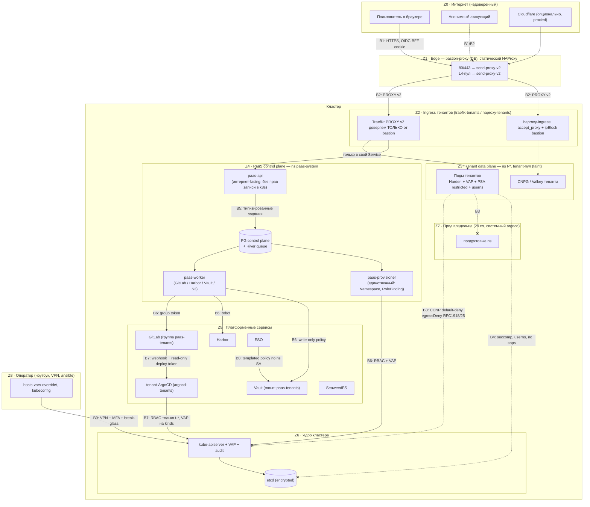

# 03. Модель безопасности

> Раздел дизайн-документа PaaS. Опирается на зафиксированные решения D1–D15 (см. [01-architecture-overview.md](01-architecture-overview.md)).
> Уточнения, принятые при согласовании разделов и обязательные здесь: **R-UID** — user namespaces обязательны, UID из образа (1..65535, не root) или `10001`, `runAsNonRoot` всегда; **R-SC** — тома тенантов (PVC приложений и managed-БД) только на отдельном LINSTOR-пуле tenant-нод, SC `lnstr-tenant-local` / `lnstr-tenant-multi-sync`, `reclaimPolicy: Delete` + 7-дневная корзина; **R-QUOTA** — память request == limit, CPU limit ≤ 4× request и ≥ 250m, PriorityClass `paas-system` > `paas-control` > `tenant-paid` > `tenant-trial` ([02](02-tenancy-and-isolation.md) §8–§9); **R-EGRESS** — выход тенантов в интернет только через Cilium Egress Gateway на отдельный IP, порт 25 закрыт; **R-LOGS** — логи и статусы в браузер через SSE.

## TL;DR

- **Главный нарушитель — враждебный тенант с root в контейнере**, и PaaS живёт в одном кластере с продом владельца. Цель модели: недоверенный код никогда не ближе к ядру платформы, чем на один сломанный слой (§1–§3: активы, шесть нарушителей, 25 угроз STRIDE с честными остатками, девять границ доверия).
- **Слой 1 — `Harden()`** (§4): пользователь не присылает YAML; манифест **перестраивается** из allow-list `AppSpec`, всё не скопированное — нулевое (включая будущие поля k8s). UID/GID — из образа, если он числовой не-root ≤ 65535, иначе `10001`; `runAsNonRoot` всегда (R-UID). `Verify()` повторяет инварианты VAP; fuzz, golden и «злой корпус» гоняются против envtest и раз в сутки на проде.
- **Слой 2 — 16 ValidatingAdmissionPolicy + PSA `restricted`** (§5), независимо от того, кто пишет (баг, взлом backend'а, tenant-ArgoCD). Область — **имя** namespace `t-*`, а не метка. Держат host-*, типы томов, Harbor + digest, userns, tenant-пул, ресурсы по R-QUOTA, PriorityClass `tenant-paid`/`tenant-trial`, только `ClusterIP`, kinds tenant-ArgoCD, `IngressRoute`/`Middleware`/`Certificate`/`ExternalSecret`/TCP, SC `lnstr-tenant-*`, рамки provisioner'а, RoleBinding, потолок квот, `Application`/`AppProject`, удаление ns только после `lifecycle=deleting`. Полный YAML + порядок выкатки Warn → Deny.
- **Изоляция рантайма** (§6): tenant-пул с taint'ом, на котором **нет** ingress-контроллеров и системных подов; user namespaces обязательны (stable в 1.36; прод на Ubuntu 24.04 с ядром 6.8 — подтвердить `uname -r` на каждой ноде); kubelet tenant-нод с `podPidsLimit` и `seccompDefault`; gVisor — фаза 2.
- **Сеть** (§7): default-deny + `egressDeny` (RFC1918, CGNAT, link-local, порт 25, блоклист), который не перебивается никаким allow; apiserver, ноды и чужие ns недоступны; одно исключение — CNPG → apiserver. **Весь выход в интернет — через Cilium Egress Gateway на IP, который используют только тенанты** (R-EGRESS): IP нод не раскрываются, абьюз не банит систему. Требует `bpf.masquerade` — смена режима на живом кластере через стенд и окно.
- **Разделение привилегий** (§8): интернет-facing `paas-api` не пишет в k8s и не читает секреты; `paas-worker` не пишет в k8s; `paas-provisioner` привязывает только 4 ClusterRole (`bind` + `resourceNames`), пишет только в `t-*` и может лишь **удалять** PVC/CNPG `Cluster`; у tenant-ArgoCD ровно allow-list kinds и **нет** `delete` на данные. Полные ClusterRole/Role, APF, матрица «попытка эскалации → что остановит».
- **Честно о пределах** (§9): `paas-worker` и tenant-ArgoCD — «коронные» компоненты для данных тенантов, закрываются детекторами «чужого коммита» и дрейфа, а не запретами. После R-SC (`reclaimPolicy: Delete`) скомпрометированный provisioner может необратимо уничтожить тома приложений — рекомендация `paas-reaper`: удаление отдельной identity и не раньше чем через 7 дней после пометки.
- **Supply chain и секреты платформы** (§10–§11): образы только через Harbor по digest, Trivy, SBOM для своих образов, cosign — фаза 2; у каждой интеграции свой токен с минимальным scope, в под — через ESO; тип `Secret` в Go не печатается. ⚠️ Расхождение с [12](12-svc-secrets.md): здесь worker пишет секреты **без права чтения**, в 12 §6.2 у него есть `read` для reveal/rollback — решает владелец.
- **Блокеры в текущей конфигурации** (до первого клиента): Traefik с `proxyProtocol/forwardedHeaders.insecure: true` (подделка IP в обход allowlist), `allowCrossNamespace: true`, `api.insecure=true`; нет audit-лога apiserver и Vault; нет шифрования трафика между нодами на публичных IP; NodePort'ы доступны на IP нод; PSA/VAP/квот нет нигде; `bpf.masquerade` не включён, поэтому egress тенантов пока шёл бы с IP нод.
- **Аудит** (§12): политика audit apiserver (тела запросов provisioner'а, `RequestResponse` для RBAC/admission), append-only `audit_log` с печатями хэшей вне кластера, Vault audit; page на изменение VAP, массовые пометки удаления и любой `exec` в `t-*`.
- **Абьюз** (§13): порт 25 закрыт, потолок полосы на под, блоклист, отдельный egress-IP; явные сигналы (SMTP, stratum, пробинг, flood) → **авто-карантин egress за минуты** с предохранителем от массовых ложных срабатываний — иначе требование «12 часов» соло не выполнить. Журнал потоков Hubble обязателен: за egress-IP стоят все тенанты.
- **Чеклист перед запуском** (§14) — проверяемые пункты с командами, включая pen-test UI/API и упражнение «враждебный тенант». **Решения владельца** (§15): отдельный tenant-Traefik, WireGuard, состав tenant-пула, write-only секреты, MFA, число egress-IP, `paas-reaper`. **Проверки на стенде** — §16.

## 1. Активы и нарушители

Главная особенность угрозовой модели этого проекта — **PaaS живёт в том же кластере, что и собственный прод владельца** (29 продуктовых namespace, GitLab, Vault, SeaweedFS, системный ArgoCD). Компрометация через тенанта бьёт не только по другим тенантам, но и по бизнесу владельца. Поэтому цель №1 модели — не «защитить тенантов друг от друга», а **не пустить недоверенный код ближе к ядру платформы, чем на один сломанный слой**.

### 1.1. Активы

| ID | Актив | Где живёт | Что будет при потере |
|---|---|---|---|
| A1 | Управление кластером: cluster-admin, etcd | manager, kubeconfig на `master_manager_fact` | всё: все тенанты + прод владельца |
| A2 | Секреты платформы: Vault (unseal-ключи **открытым текстом** в `/etc/kubernetes/vault-unseal.json` на manager'ах), токены GitLab/Harbor/SeaweedFS для worker'а, ключ оператора NATS, ключи платёжки, Cloudflare API token | Vault, `paas-system`, manager-ноды | массовый доступ к данным тенантов и платформы |
| A3 | Данные тенантов: PVC, CNPG-базы, S3-бакеты, приватные образы Harbor, секреты в `paas-tenants/`, потоки NATS, логи (могут содержать ПДн) | tenant-пул, LINSTOR, SeaweedFS, Harbor, Vault | утечка, 152-ФЗ, репутация |
| A4 | Целостность того, что запускается у тенанта: git-репо `paas-tenants/*`, digest'ы образов | GitLab, Harbor | подмена кода клиента (supply-chain против клиента) |
| A5 | БД control plane: пользователи, организации, биллинг, данные идентификации клиентов (406-ФЗ, хранить 1 год), `audit_log` | CNPG-кластер в `paas-system` | утечка ПДн, подделка биллинга/владения |
| A6 | Доступность общего кластера и **прод владельца** | всё | простой бизнеса владельца |
| A7 | Репутация IP (IP нод tenant-пула, IP bastion) и юридический статус (реестр хостинг-провайдеров, правило «12 часов») | внешний мир | блэклисты Spamhaus, претензии РКН/ЦМУ ССОП |
| A8 | Wildcard-сертификат `*.<apps-domain>` и его ключ | Secret в платформенном ns | MITM всех платформенных поддоменов тенантов |

### 1.2. Нарушители

| ID | Нарушитель | Возможности на входе | Типичная цель |
|---|---|---|---|
| N1 | Анонимный интернет | сеть до bastion, прямой доступ к публичным IP нод, регистрационная форма, API | RCE в `paas-api`, credential stuffing, обход bastion через NodePort нод, триал-абьюз, DDoS |
| N2 | **Враждебный тенант** (оплатил, возможно краденой картой) | **полный контроль над своим образом и процессом**, свои поля в UI, свой DNS, свой трафик | container escape, латеральное движение, SSRF во внутренние сервисы, чужие данные, майнинг/спам/скан с наших IP, захват чужого домена |
| N3 | Скомпрометированный аккаунт тенанта | всё, что может жертва в UI | кража данных, майнинг за счёт жертвы, вымогательство (удалить БД) |
| N4 | Инсайдер / утечка токена владельца | ноутбук с `hosts-vars-override/`, kubeconfig, SSH-ключи, GitLab-admin, будущий саппорт | всё |
| N5 | Скомпрометированный компонент backend'а | RCE в `paas-api` (интернет-facing), отравленная Go/npm-зависимость, взлом `paas-worker`/`paas-provisioner`/tenant-ArgoCD/GitLab | масштабирование атаки на всех тенантов |
| N6 | Supply chain | вредоносный публичный образ через proxy-cache, отравленный апстрим-оператор (CNPG, Harbor, NATS) | код в кластере с правами оператора |

**Самый важный нарушитель — N2.** PaaS продаёт ровно одно: право исполнять чужой код на наших машинах. Всё, что ниже, проектировалось исходя из допущения «в каждом tenant-поде сидит атакующий с root внутри контейнера и 0-day в ядре через год».

### 1.3. Инварианты безопасности (что обязано выполняться всегда)

| ID | Инвариант | Где обеспечивается |
|---|---|---|
| S1 | Код тенанта не выходит за свой контейнер: нет host-namespace, host-FS, привилегий, capabilities | §4 `Harden()`, §5 VAP + PSA, §6 userns |
| S2 | Тенант не читает и не меняет чужие данные и трафик | §5, §7, Vault templated policy ([12-svc-secrets.md](12-svc-secrets.md)) |
| S3 | Tenant-под не достаёт до apiserver, Vault, GitLab, системных ns, IP нод, RFC1918 | §7 CCNP default-deny + `egressDeny` |
| S4 | RCE в `paas-api` ≠ компрометация кластера и ≠ чтение секретов тенантов | §8 разделение привилегий, write-only секреты, transit-шифрование |
| S5 | Прод владельца изолирован от тенантов: другой node pool, другой ArgoCD, другие ns | §6, D3 |
| S6 | Каждое изменение состояния тенанта атрибутируемо (кто, когда, что) | §12 |
| S7 | Платформа не служит плацдармом абьюза дольше минут | §13 авто-карантин |
| S8 | Значение секрета тенанта существует только в Vault и в поде тенанта — не в PG, не в git, не в логах, не в очереди в открытом виде | §8.2, §11, [12-svc-secrets.md](12-svc-secrets.md) |

## 2. Границы доверия (trust boundaries)



| Граница | Что пересекает | Контроль (основной → второй слой) |
|---|---|---|
| **B1** Интернет → `paas-api` | HTTP-запросы UI/API | Zitadel OIDC + BFF-cookie `__Host-`, проверка `Origin`, rate limit → строгая типизированная allow-list модель ввода, OpenAPI-валидация |
| **B2** Интернет → приложения тенантов | L7/L4 через bastion | PROXY v2 принимается **только** от IP bastion (`trustedIPs`) → CCNP на tenant-подах пускает только из `traefik-tenants`/`haproxy-tenants` → VAP запрещает `NodePort`/`LoadBalancer`/`externalIPs` |
| **B3** Tenant-под → сеть | весь egress/ingress пода | CCNP default-deny (разрешены: DNS к kube-dns, свой ns, интернет) → `egressDeny` RFC1918/CGNAT/link-local/порт 25, которые не перебиваются никаким allow; интернет — только через Egress Gateway на отдельный IP (§7) |
| **B4** Контейнер → ядро ноды | syscalls | seccomp `RuntimeDefault`, drop ALL, non-root, `readOnlyRootFilesystem`, `hostUsers: false` → отдельный tenant-пул (побег = только tenant-нода) → gVisor для недоверенного тарифа (позже) |
| **B5** `paas-api` → очередь → worker/provisioner | задания River | типизированные аргументы, повторная авторизация по БД в worker, секретные значения только шифротекстом Vault transit |
| **B6** worker/provisioner → внешние API | GitLab, Harbor, Vault, apiserver | отдельный токен на интеграцию с минимальными правами → VAP на все записи provisioner'а |
| **B7** git тенанта → tenant-ArgoCD → apiserver | манифесты | k8s RBAC (только `t-*`, только разрешённые kinds, ноль cluster-scoped записи) → VAP (содержимое объектов) → AppProject, созданный через API, а не из git |
| **B8** ESO → Vault | чтение секретов | одна k8s-auth role + одна templated policy, путь вычисляется из namespace SA; ClusterSecretStore для тенантов запрещён |
| **B9** Оператор → кластер | ansible, kubectl | VPN + SSH-ключи на аппаратном токене + MFA → break-glass-группа, audit-лог apiserver |

**Правило, которое следует из схемы:** ни одна стрелка из Z3 не ведёт в Z4–Z7. Tenant-под не видит ни apiserver, ни control plane, ни платформенные сервисы. Всё, что тенант может сделать с платформой, идёт через B1 — то есть через UI и строго типизированный API.

## 3. STRIDE: угрозы → меры

Таблица сгруппирована по STRIDE (**S**poofing, **T**ampering, **R**epudiation, **I**nformation disclosure, **D**enial of service, **E**levation of privilege). «Остаток» — что остаётся после мер; это не «ноль», а осознанно принятый риск.

| # | Угроза | STRIDE | Кто | Основная мера | Второй слой | Остаток |
|---|---|---|---|---|---|---|
| T1 | Прямое подключение к `<IP ноды>:443` в обход bastion + поддельный PROXY-заголовок с IP из allowlist | S | N1 | Traefik `proxyProtocol.trustedIPs`/`forwardedHeaders.trustedIPs` = IP bastion (**сейчас `insecure: true`** — блокер, §14) | CCNP на подах Traefik: ingress только от bastion + нод | нет |
| T2 | Кража сессии UI (XSS, CSRF) | S | N1 | BFF, `__Host-` cookie `HttpOnly; Secure; SameSite=Lax`, проверка `Origin`/`Sec-Fetch-Site`, hash-based CSP + Trusted Types ([14-frontend-console.md](14-frontend-console.md)) | step-up MFA на деструктивные действия | фишинг MFA-кода (TOTP); пасскеи снимают |
| T3 | Захват чужого custom domain (второй тенант заявляет тот же `Host`) | S/T | N2 | TXT-проверка владения + UNIQUE в БД ([08-svc-ingress-domains-ip.md](08-svc-ingress-domains-ip.md)) | VAP: платформенный поддомен обязан кончаться на `-<project_id>.<apps-domain>` своего ns; сканер дублей `Host` по всем `IngressRoute` | кастомный домен VAP проверить не может (нет lookup'ов) — только backend + сканер |
| T4 | Сертификат на чужой домен через HTTP-01 | S | N2 | backend — единственный писатель `Certificate`; issuer только `paas-le-http01` | VAP: запрет `Issuer`/`CertificateRequest` от тенанта, запрет `dnsNames` под `<apps-domain>`, запрет CA-issuer'ов | нет |
| T5 | Подмена манифестов в tenant-репо (утечка токена worker'а, взлом GitLab) | T | N5 | group token только на `paas-tenants`, защищённая ветка, push только бота | VAP: всё, что пришло из git, всё равно проходит Harden-инварианты; детектор «чужого» коммита → заморозка auto-sync (§9) | в пределах allow-list атакующий деплоит что угодно в любой `t-*` |
| T6 | Подмена образа тенанта (перезапись тега в Harbor) | T | N5/N6 | в git пишется **digest**, не тег | VAP требует `@sha256:` | нет |
| T7 | Кэш образов на ноде: тенант B запускает приватный образ тенанта A без credentials | I | N2 | `imagePullPolicy: Always` **или** `KubeletEnsureSecretPulledImages` (⚠️ статус в 1.36, §6) | digest в имени (не угадать) | до решения по гейту — полагаемся на `Always` |
| T8 | Container escape (0-day в ядре, runc) | E | N2 | seccomp, drop ALL, non-root, `hostUsers: false`, RO rootfs | tenant-пул: побег = tenant-нода, не прод владельца; NodeRestriction ограничивает kubelet-креды своими подами | секреты **других тенантов** на той же ноде; gVisor-тариф — позже |
| T9 | Под с `hostPath`/`privileged`/`hostNetwork` через баг backend'а | E | N5 | `Harden()` + golden-тесты | VAP + PSA `restricted` независимо от того, кто применяет | нет |
| T10 | `nodeName` в поде — обход taint'ов и планировщика | E | N5 | Harden не ставит | VAP: `spec.nodeName` на CREATE запрещён | нет |
| T11 | SSRF из tenant-пода во внутренние сервисы (Vault, GitLab, apiserver, Prometheus, Loki без auth, Traefik `api.insecure`) | I/E | N2 | CCNP: egress только DNS/свой ns/world | `egressDeny` RFC1918, CGNAT, link-local | нет |
| T12 | SSRF **через Traefik**: `ExternalName`-Service или Service без selector + свой EndpointSlice на внутренний IP, `allowCrossNamespace: true` | I/E | N2/N5 | backend не генерирует такое | VAP: только `ClusterIP` с selector, `Endpoints`/`EndpointSlice` вне allow-list kinds, в `IngressRoute` запрещено поле `namespace`, запрещены `TraefikService` и `@provider`-ссылки | нет |
| T13 | SSRF через ESO: `generatorRef` (Webhook/Password-генераторы), чужой `SecretStore`, `ClusterSecretStore` | I | N5 | backend рендерит только `secretStoreRef: paas-vault` | VAP на `ExternalSecret`; генераторы вне allow-list kinds | нет |
| T14 | Чтение секретов чужого ns через Vault | I | N2/N5 | templated policy по `service_account_namespace` | ClusterSecretStore запрещён VAP'ом | нет |
| T15 | Чтение секретов тенантов при RCE в `paas-api` / worker | I | N5 | api не имеет доступа к Vault, кроме `encrypt`; worker — **write-only** policy на `paas-tenants/data/*` (рекомендация §15 №4; в [12](12-svc-secrets.md) §6.2 — с `read`) | значения в очереди — шифротекст transit | при write-only worker может **перезаписать** секрет (целостность), но не прочитать; в варианте 12 — и прочитать |
| T16 | Отказ: тенант исчерпывает ресурсы (CPU, RAM, PID, диск, inode, соединения) | D | N2 | ResourceQuota + LimitRange, обязательные requests/limits, `ephemeral-storage`, `emptyDir.sizeLimit` | `podPidsLimit` в kubelet tenant-пула, tenant-пул отделён от системы | IO-шум на LINSTOR/DRBD — нет per-PVC IO-лимитов |
| T17 | Отказ: вал коммитов/синков, «шторм» Application | D | N3/N5 | rate limit в API и в очереди на организацию | отдельный tenant-ArgoCD — системный не страдает | задержки деплоя у других тенантов |
| T18 | Отказ: DDoS на bastion | D | N1 | фильтрация на bastion, Cloudflare-режим для L7 | — | bastion — один, SPOF входа ([15-observability-and-operations.md](15-observability-and-operations.md)) |
| T19 | Отрицание: «я не удалял базу» / «это не мой коммит» | R | N3/N4 | `audit_log` append-only с hash-цепочкой, коммит несёт `request_id`+`actor` | audit apiserver, audit Vault, события GitLab | нет |
| T20 | Абьюз исходящего: спам, скан, майнинг, DDoS-источник | D (для мира) | N2/N3 | порт 25 закрыт, `kubernetes.io/egress-bandwidth`, лимиты, выход через Egress Gateway на отдельный IP (§7) | Hubble-метрики → алерт → авто-карантин egress (§13) | минуты до срабатывания |
| T21 | Эскалация через provisioner: RoleBinding в `kube-system`, ns без PSA-меток, снятие label `paas.1520.tech/tenant` | E | N5 | RBAC: `bind` только на 4 ClusterRole | VAP: provisioner пишет только в `^t-[a-z0-9]{10}$`, обязательные метки не снимаются никем, кроме break-glass | массовое **удаление** тенантов (§9) |
| T22 | Эскалация через tenant-ArgoCD: RoleBinding/Role/Secret/`Pod` с SA контроллера | E | N5 | RBAC `paas-tenant-deployer` без `rbac.*`, `secrets`, `pods`, `serviceaccounts` | VAP kinds allow-list на username контроллера | нет |
| T23 | Эскалация через `AppProject`/`Application`, пришедшие из git | E | N5 | AppProject/Application создаёт только provisioner через API (D3) | VAP: `destination` только `t-*`, `repoURL` только `paas-tenants/*`, запрет `plugin`, `default`-проект заблокирован | нет |
| T24 | Утечка ПДн через логи тенанта / PromQL-LogQL-инъекция | I | N2 | backend строит запрос сам, матчер `namespace` принудительный, пользовательские строки только экранированием | Loki/Prometheus недоступны из tenant-подов | нет |
| T25 | Утечка токена владельца (ноутбук, `hosts-vars-override/`) | E | N4 | SSH на FIDO2-ключе, override зашифрован (sops/age — решение владельца), kubeconfig только на manager | audit apiserver, break-glass-алерты | компрометация ноутбука = компрометация всего; принимается осознанно |

## 4. Слой 1 — генерация: allow-list модель и `Harden()`

Слой 1 — это код, который **строит** манифест. Он не «чистит» чужой YAML, а собирает объект с нуля из строго типизированного ввода. Слой 2 (§5) проверяет результат независимо. Оба слоя обязаны существовать: слой 1 даёт хорошие сообщения об ошибках и предсказуемый результат, слой 2 — гарантию, которую не отменит баг или взлом слоя 1.

### 4.1. Почему allow-list, а не deny-list

**Решение: пользователь никогда не присылает YAML, JSON-манифест или «дополнительные поля PodSpec». Вход — только структура `AppSpec` (§4.2); `Harden()` строит PodSpec копированием из разрешённого списка полей, а всё остальное остаётся нулевым значением.**

Почему не deny-list («принимаем манифест, вырезаем опасное»):

1. **В PodSpec ~70 полей, и их число растёт каждый релиз.** За последние версии добавились `hostUsers`, `resourceClaims`, `schedulingGates`, `os`, volume-источник `image`, `resizePolicy`, `appArmorProfile`, `supplementalGroupsPolicy`. Для deny-list каждое новое поле — **тихая дыра до тех пор, пока кто-то не заметит**. Для allow-list новое поле просто не существует: код его не копирует, значит в объекте его нет.
2. **Опасные значения прячутся в безобидных полях.** `httpGet.host` у liveness-пробы заставляет **kubelet** (сеть ноды, мимо политик пода) сделать HTTP-запрос на произвольный адрес — классический SSRF с ноды. `Service` без selector + свой `EndpointSlice` превращает Traefik в прокси на любой внутренний IP. Deny-list должен знать про каждую такую комбинацию; allow-list их не пропускает, потому что их нет в модели.
3. **Парсинг недоверенного YAML — отдельная поверхность атаки**: дубли ключей, anchors (billion laughs), путаница типов (`on`/`yes` → bool). В allow-list-модели недоверенный вход — это небольшой JSON с `DisallowUnknownFields`, валидируемый по OpenAPI.
4. **Deny-list невозможно доказать.** Allow-list доказывается golden-тестом: «вот все поля, которые мы когда-либо выставляем».

Что отвергнуто: «продвинутый режим — вставьте свой YAML» (Heroku/Render его не дают — и правильно); «helm-чарт пользователя» (тот же YAML через Go-template). Если позже понадобится гибкость, она добавляется **новым полем в `AppSpec`** с ревью, а не проходом сырого YAML.

### 4.2. Входная модель (единственное, что присылает пользователь)

Единственное, что UI присылает при создании/изменении приложения. Декодирование — `json.Decoder` с `DisallowUnknownFields()`, затем `Validate()`. Всё, что влияет на ресурсы, выбирается **из тарифной сетки** (enum), а не числом.

```go
package appspec

import (
	"fmt"
	"regexp"
	"strings"

	"github.com/distribution/reference"
)

// AppSpec — полный вход от пользователя. Никаких других полей не существует.
type AppSpec struct {
	Name        string         `json:"name"`        // DNS-1123 label, 1..30
	Image       string         `json:"image"`       // "nginx:1.27", "harbor.<d>/org-x/api:v3"
	Command     []string       `json:"command"`     // exec-form, без shell
	Args        []string       `json:"args"`
	Port        int32          `json:"port"`        // 1024..65535 (non-root без NET_BIND_SERVICE)
	Size        string         `json:"size"`        // SKU из тарифа: "s1","s2","m1"...
	Replicas    int32          `json:"replicas"`    // 1..tariff.MaxReplicas
	Env         []EnvVar       `json:"env"`
	SecretEnv   []SecretEnvVar `json:"secretEnv"`   // ссылки на «Секреты», не значения
	Health      *HealthCheck   `json:"health"`
	Volume      *VolumeSpec    `json:"volume"`      // ≤1 PVC в MVP
	Public      bool           `json:"public"`      // публиковать ли на <app>-<pid>.<apps-domain>
}

type EnvVar struct {
	Name  string `json:"name"`
	Value string `json:"value"`
}

type SecretEnvVar struct {
	Name     string `json:"name"`     // имя env в контейнере
	SecretID string `json:"secretId"` // ID «Секрета» проекта (UUID из БД)
	Key      string `json:"key"`
}

type HealthCheck struct {
	Type         string `json:"type"` // "http" | "tcp"
	Path         string `json:"path"` // только для http
	InitialDelay int32  `json:"initialDelaySeconds"`
}

type VolumeSpec struct {
	MountPath string `json:"mountPath"`
	SizeGi    int32  `json:"sizeGi"`
}

var (
	reName     = regexp.MustCompile(`^[a-z]([a-z0-9-]{0,28}[a-z0-9])?$`)
	reEnvName  = regexp.MustCompile(`^[A-Za-z_][A-Za-z0-9_]{0,127}$`)
	rePath     = regexp.MustCompile(`^/[A-Za-z0-9._~/-]{0,255}$`)
	reMount    = regexp.MustCompile(`^/[A-Za-z0-9._/-]{1,255}$`)
	reservedEnvPrefixes = []string{"KUBERNETES_", "PAAS_"}
	forbiddenMountRoots = []string{"/proc", "/sys", "/dev", "/etc", "/tmp", "/var/run", "/run"}
)

const (
	maxArgs        = 64
	maxArgLen      = 4096
	maxEnv         = 128
	maxEnvValueLen = 32 << 10
	maxEnvTotal    = 256 << 10
)

// Validate проверяет форму. Тарифные ограничения (Size, Replicas, SizeGi)
// проверяет вызывающий код против тарифа организации.
func (s *AppSpec) Validate() error {
	if !reName.MatchString(s.Name) {
		return fmt.Errorf("name: must match %s", reName)
	}
	if _, err := reference.ParseNormalizedNamed(s.Image); err != nil {
		return fmt.Errorf("image: %w", err)
	}
	if len(s.Command)+len(s.Args) > maxArgs {
		return fmt.Errorf("command+args: at most %d items", maxArgs)
	}
	for _, a := range append(append([]string{}, s.Command...), s.Args...) {
		if len(a) > maxArgLen || strings.ContainsRune(a, 0) {
			return fmt.Errorf("command/args: item too long or contains NUL")
		}
	}
	if s.Port < 1024 || s.Port > 65535 {
		return fmt.Errorf("port: 1024..65535 (non-root container)")
	}
	if len(s.Env)+len(s.SecretEnv) > maxEnv {
		return fmt.Errorf("env: at most %d variables", maxEnv)
	}
	seen, total := map[string]bool{}, 0
	check := func(name string) error {
		if !reEnvName.MatchString(name) {
			return fmt.Errorf("env %q: invalid name", name)
		}
		for _, p := range reservedEnvPrefixes {
			if strings.HasPrefix(name, p) {
				return fmt.Errorf("env %q: prefix %s is reserved", name, p)
			}
		}
		if seen[name] {
			return fmt.Errorf("env %q: duplicate", name)
		}
		seen[name] = true
		return nil
	}
	for _, e := range s.Env {
		if err := check(e.Name); err != nil {
			return err
		}
		if len(e.Value) > maxEnvValueLen {
			return fmt.Errorf("env %q: value longer than %d bytes", e.Name, maxEnvValueLen)
		}
		total += len(e.Name) + len(e.Value)
	}
	if total > maxEnvTotal {
		return fmt.Errorf("env: total size exceeds %d bytes", maxEnvTotal)
	}
	for _, e := range s.SecretEnv {
		if err := check(e.Name); err != nil {
			return err
		}
	}
	if h := s.Health; h != nil {
		switch h.Type {
		case "http":
			if !rePath.MatchString(h.Path) {
				return fmt.Errorf("health.path: must match %s", rePath)
			}
		case "tcp":
		default:
			return fmt.Errorf("health.type: http|tcp")
		}
		if h.InitialDelay < 0 || h.InitialDelay > 300 {
			return fmt.Errorf("health.initialDelaySeconds: 0..300")
		}
	}
	if v := s.Volume; v != nil {
		if !reMount.MatchString(v.MountPath) || strings.Contains(v.MountPath, "..") {
			return fmt.Errorf("volume.mountPath: invalid")
		}
		for _, r := range forbiddenMountRoots {
			if v.MountPath == r || strings.HasPrefix(v.MountPath, r+"/") {
				return fmt.Errorf("volume.mountPath: %s is reserved", r)
			}
		}
	}
	return nil
}
```

Чего в модели **нет** и не будет без отдельного ревью безопасности: volume-типы кроме одного PVC, `hostPort`, sidecar'ы, `securityContext` в любом виде, probes типа `exec` с произвольной командой (в MVP — только http/tcp), `hostAliases`, `dnsConfig`, собственные labels/annotations, выбор ноды, выбор runtime.

Образ из ввода **не** попадает в манифест как есть: worker переписывает публичную ссылку на proxy-cache Harbor (`nginx:1.27` → `harbor.<domain>/dockerhub/library/nginx:1.27`), запрашивает у Harbor digest и кладёт в git `harbor.<domain>/...@sha256:<digest>` (тег сохраняется в аннотации для UI). Подробности — [10-svc-registry-harbor.md](10-svc-registry-harbor.md).

### 4.3. `Harden()` — полный код

Принцип: **перестроение, а не правка.** `HardenPodTemplate` получает PodTemplate от рендерера и собирает **новый** объект, копируя только перечисленные поля; всё, что не скопировано явно (`hostNetwork`, `nodeName`, `affinity`, `hostAliases`, `ephemeralContainers`, `resourceClaims`, будущие поля k8s 1.37+…), остаётся нулевым значением. В конце — `Verify()`, повторяющий инварианты VAP в Go: если рендерер сломан, ошибка случится до коммита в git, а не в событиях ReplicaSet.

```go
// Package harden строит безопасный PodTemplate для workload'ов тенанта.
// Импортируется рендерером в paas-worker. Ввод пользователя сюда не попадает —
// только объекты, собранные рендерером из appspec.AppSpec, и Profile из БД.
package harden

import (
	"errors"
	"fmt"
	"regexp"
	"strconv"
	"strings"

	appsv1 "k8s.io/api/apps/v1"
	batchv1 "k8s.io/api/batch/v1"
	corev1 "k8s.io/api/core/v1"
	"k8s.io/apimachinery/pkg/api/resource"
	metav1 "k8s.io/apimachinery/pkg/apis/meta/v1"
	"k8s.io/utils/ptr"
)

const (
	LabelManagedBy = "paas.1520.tech/managed-by" // = "paas" (D1)
	LabelTenantNS  = "paas.1520.tech/tenant-ns"  // = <namespace> (D1)
	LabelAppID     = "paas.1520.tech/app-id"
	AnnRestartedAt = "paas.1520.tech/restarted-at" // bump = рестарт через git (D3)
	AnnEgressBW    = "kubernetes.io/egress-bandwidth"

	PoolLabelKey   = "paas.1520.tech/pool"
	PoolLabelValue = "tenant"
	TaintKey       = "paas.1520.tech/tenant"
	TaintValue     = "true"

	// R-UID: при hostUsers: false внутри пода существуют только ID 0..65535 (выше —
	// overflow 65534, контейнер не стартует). UID/GID берутся из образа, если они
	// числовые и не root, иначе DefaultTenantUID. runAsNonRoot — всегда.
	DefaultTenantUID = int64(10001)
	MaxUserNSID      = int64(65535)
	tmpVolume        = "tmp"
)

var (
	ErrInvariant = errors.New("harden: invariant violated")
	reDigestRef  = regexp.MustCompile(`@sha256:[a-f0-9]{64}$`)
	// fieldRef, которые не раскрывают ничего о ноде/кластере
	allowedFieldPaths = map[string]bool{"metadata.name": true, "metadata.namespace": true, "status.podIP": true}
)

// Profile — всё, что Harden знает о тенанте и тарифе. Источник — БД control plane,
// НЕ пользовательский ввод.
type Profile struct {
	Namespace        string // t-xxxxxxxxxx
	AppID            string
	UID              int64  // 1..65535 — ResolveRunAsIDs(config.User образа), фиксируется вместе с digest'ом
	GID              int64  // 1..65535 — там же
	HarborPrefix     string // "harbor.example.ru/"
	PullSecretName   string // "paas-harbor-pull"
	PriorityClass    string // "tenant-paid" | "tenant-trial" (R-QUOTA, 02 §9)
	RuntimeClass     string // "" = runc; "gvisor" — тариф «недоверенный» (не MVP)
	PullPolicy       corev1.PullPolicy // Always, пока не подтверждён KubeletEnsureSecretPulledImages (§6)
	CPURequest       resource.Quantity
	CPULimit         resource.Quantity
	MemRequest       resource.Quantity
	MemLimit         resource.Quantity
	EphemeralRequest resource.Quantity
	EphemeralLimit   resource.Quantity
	TmpSize          resource.Quantity
	EgressBandwidth  string          // "50M" — Cilium Bandwidth Manager, из тарифа
	AllowedSecrets   map[string]bool // материализованные «Секреты» проекта + <db>-app
	AllowedPVCs      map[string]bool // PVC и имена volumeClaimTemplates этого app
}

// HardenPodTemplate возвращает НОВЫЙ PodTemplateSpec. Вход не мутируется.
func HardenPodTemplate(in corev1.PodTemplateSpec, p Profile) (corev1.PodTemplateSpec, error) {
	if p.UID < 1 || p.UID > MaxUserNSID || p.GID < 1 || p.GID > MaxUserNSID {
		return corev1.PodTemplateSpec{}, fmt.Errorf("%w: profile UID/GID %d/%d outside 1..%d", ErrInvariant, p.UID, p.GID, MaxUserNSID)
	}
	vols, volNames, err := sanitizeVolumes(in.Spec.Volumes, p)
	if err != nil {
		return corev1.PodTemplateSpec{}, err
	}
	sanitizeAll := func(cs []corev1.Container) ([]corev1.Container, error) {
		out := make([]corev1.Container, 0, len(cs))
		for _, c := range cs {
			sc, err := sanitizeContainer(c, p, volNames)
			if err != nil {
				return nil, err
			}
			out = append(out, sc)
		}
		return out, nil
	}
	ctrs, err := sanitizeAll(in.Spec.Containers)
	if err != nil {
		return corev1.PodTemplateSpec{}, err
	}
	inits, err := sanitizeAll(in.Spec.InitContainers)
	if err != nil {
		return corev1.PodTemplateSpec{}, err
	}

	restart := in.Spec.RestartPolicy
	switch restart {
	case "", corev1.RestartPolicyAlways, corev1.RestartPolicyOnFailure, corev1.RestartPolicyNever:
	default:
		return corev1.PodTemplateSpec{}, fmt.Errorf("%w: restartPolicy %q", ErrInvariant, restart)
	}
	grace := int64(30)
	if g := in.Spec.TerminationGracePeriodSeconds; g != nil {
		grace = min(max(*g, 0), 60)
	}

	out := corev1.PodTemplateSpec{
		ObjectMeta: metav1.ObjectMeta{
			// Метки строятся из профиля; метки рендерера игнорируются целиком —
			// так в шаблон не попадут зарезервированные cnpg.io/*, acme.cert-manager.io/*.
			Labels: map[string]string{
				LabelManagedBy: "paas",
				LabelTenantNS:  p.Namespace,
				LabelAppID:     p.AppID,
			},
			Annotations: map[string]string{},
		},
		Spec: corev1.PodSpec{
			Volumes:                       vols,
			InitContainers:                inits,
			Containers:                    ctrs,
			RestartPolicy:                 restart,
			TerminationGracePeriodSeconds: ptr.To(grace),
			ActiveDeadlineSeconds:         clampDeadline(in.Spec.ActiveDeadlineSeconds),
			DNSPolicy:                     corev1.DNSClusterFirst,
			NodeSelector:                  map[string]string{PoolLabelKey: PoolLabelValue},
			ServiceAccountName:            "default", // у default в t-* нет ни одного RoleBinding
			AutomountServiceAccountToken:  ptr.To(false),
			SecurityContext:               podSecurityContext(p),
			ImagePullSecrets:              []corev1.LocalObjectReference{{Name: p.PullSecretName}},
			Tolerations: []corev1.Toleration{{
				Key: TaintKey, Operator: corev1.TolerationOpEqual, Value: TaintValue,
				Effect: corev1.TaintEffectNoSchedule,
			}},
			PriorityClassName:  p.PriorityClass,
			EnableServiceLinks: ptr.To(false),
			HostUsers:          ptr.To(false), // user namespaces (§6)
			OS:                 &corev1.PodOS{Name: corev1.Linux},
			TopologySpreadConstraints: []corev1.TopologySpreadConstraint{{
				MaxSkew:           1,
				TopologyKey:       "kubernetes.io/hostname",
				WhenUnsatisfiable: corev1.ScheduleAnyway,
				LabelSelector:     &metav1.LabelSelector{MatchLabels: map[string]string{LabelAppID: p.AppID}},
			}},
			// НЕ копируются и остаются нулевыми: HostNetwork, HostPID, HostIPC,
			// ShareProcessNamespace, NodeName, Affinity, SchedulerName, HostAliases,
			// DNSConfig, EphemeralContainers, ResourceClaims, SchedulingGates, Overhead,
			// ReadinessGates, SetHostnameAsFQDN, Hostname, Subdomain, pod-level Resources.
		},
	}
	if v, ok := in.Annotations[AnnRestartedAt]; ok {
		out.Annotations[AnnRestartedAt] = v
	}
	if p.EgressBandwidth != "" {
		out.Annotations[AnnEgressBW] = p.EgressBandwidth
	}
	if p.RuntimeClass != "" {
		out.Spec.RuntimeClassName = ptr.To(p.RuntimeClass)
	}
	if err := Verify(out, p); err != nil {
		return corev1.PodTemplateSpec{}, err
	}
	return out, nil
}

func podSecurityContext(p Profile) *corev1.PodSecurityContext {
	return &corev1.PodSecurityContext{
		RunAsNonRoot:        ptr.To(true),
		RunAsUser:           ptr.To(p.UID),
		RunAsGroup:          ptr.To(p.GID),
		FSGroup:             ptr.To(p.GID),
		FSGroupChangePolicy: ptr.To(corev1.FSGroupChangeOnRootMismatch),
		// Strict: не подмешивать группы из /etc/group образа. ⚠️ проверить на стенде
		// с containerd 2.3.1 (поле требует поддержки рантайма).
		SupplementalGroupsPolicy: ptr.To(corev1.SupplementalGroupsPolicyStrict),
		SeccompProfile:           &corev1.SeccompProfile{Type: corev1.SeccompProfileTypeRuntimeDefault},
		AppArmorProfile:          &corev1.AppArmorProfile{Type: corev1.AppArmorProfileTypeRuntimeDefault},
	}
}

func containerSecurityContext(p Profile) *corev1.SecurityContext {
	return &corev1.SecurityContext{
		Privileged:               ptr.To(false),
		AllowPrivilegeEscalation: ptr.To(false),
		RunAsNonRoot:             ptr.To(true),
		RunAsUser:                ptr.To(p.UID),
		RunAsGroup:               ptr.To(p.GID),
		ReadOnlyRootFilesystem:   ptr.To(true),
		Capabilities:             &corev1.Capabilities{Drop: []corev1.Capability{"ALL"}},
		SeccompProfile:           &corev1.SeccompProfile{Type: corev1.SeccompProfileTypeRuntimeDefault},
		AppArmorProfile:          &corev1.AppArmorProfile{Type: corev1.AppArmorProfileTypeRuntimeDefault},
		ProcMount:                ptr.To(corev1.DefaultProcMount),
	}
}

// ResolveRunAsIDs вычисляет UID/GID из поля config.User образа (OCI image config).
// worker читает его из Harbor при резолве тега в digest (§4.2) и кладёт в Profile.
//   - "1000", "101:101", "65532:65532" — числовой не-root ≤ 65535 → как в образе;
//   - "", "root", "0", "0:0", имя ("node", "nginx"), UID > 65535 → DefaultTenantUID.
// GID: числовой 1..65535 из образа, иначе = UID (группу 0 не выдаём).
// warn — предупреждение для UI (07 §14): образ рассчитан на root или на имя пользователя.
func ResolveRunAsIDs(imageUser string) (uid, gid int64, warn string) {
	u, g, _ := strings.Cut(strings.TrimSpace(imageUser), ":")
	uid, ok := parseUserNSID(u)
	if !ok {
		uid = DefaultTenantUID
		warn = fmt.Sprintf("пользователь образа %q — не числовой UID 1..%d (root или имя); приложение запустится от UID %d",
			u, MaxUserNSID, DefaultTenantUID)
	}
	if gid, ok = parseUserNSID(g); !ok {
		gid = uid
	}
	return uid, gid, warn
}

func parseUserNSID(s string) (int64, bool) {
	n, err := strconv.ParseInt(s, 10, 64)
	return n, err == nil && n >= 1 && n <= MaxUserNSID
}

func sanitizeVolumes(in []corev1.Volume, p Profile) ([]corev1.Volume, map[string]bool, error) {
	names := map[string]bool{tmpVolume: true}
	out := []corev1.Volume{{
		Name:         tmpVolume,
		VolumeSource: corev1.VolumeSource{EmptyDir: &corev1.EmptyDirVolumeSource{SizeLimit: ptr.To(p.TmpSize)}},
	}}
	for _, v := range in {
		if names[v.Name] { // "tmp" зарезервирован, дубли запрещены
			return nil, nil, fmt.Errorf("%w: volume %q: reserved or duplicate name", ErrInvariant, v.Name)
		}
		nv := corev1.Volume{Name: v.Name}
		switch {
		case v.PersistentVolumeClaim != nil && p.AllowedPVCs[v.PersistentVolumeClaim.ClaimName]:
			nv.PersistentVolumeClaim = &corev1.PersistentVolumeClaimVolumeSource{ClaimName: v.PersistentVolumeClaim.ClaimName}
		case v.Secret != nil && p.AllowedSecrets[v.Secret.SecretName]:
			nv.Secret = &corev1.SecretVolumeSource{SecretName: v.Secret.SecretName, DefaultMode: ptr.To[int32](0o440)}
		case v.ConfigMap != nil:
			nv.ConfigMap = &corev1.ConfigMapVolumeSource{LocalObjectReference: v.ConfigMap.LocalObjectReference, DefaultMode: ptr.To[int32](0o444)}
		default: // hostPath, projected(serviceAccountToken), nfs, iscsi, csi, image, ephemeral, ...
			return nil, nil, fmt.Errorf("%w: volume %q: source type not allowed", ErrInvariant, v.Name)
		}
		names[v.Name] = true
		out = append(out, nv)
	}
	// Имена volumeClaimTemplates StatefulSet'а: соответствующие volumes появятся
	// в поде только при создании (их добавляет statefulset-controller), но mount'ы
	// на них в шаблоне уже есть.
	for claim := range p.AllowedPVCs {
		names[claim] = true
	}
	return out, names, nil
}

func sanitizeContainer(c corev1.Container, p Profile, vols map[string]bool) (corev1.Container, error) {
	if !strings.HasPrefix(c.Image, p.HarborPrefix) || !reDigestRef.MatchString(c.Image) {
		return corev1.Container{}, fmt.Errorf("%w: container %q: image must be %s…@sha256:<digest>", ErrInvariant, c.Name, p.HarborPrefix)
	}
	out := corev1.Container{
		Name:                     c.Name,
		Image:                    c.Image,
		Command:                  c.Command,
		Args:                     c.Args,
		WorkingDir:               c.WorkingDir,
		ImagePullPolicy:          p.PullPolicy,
		TerminationMessagePolicy: corev1.TerminationMessageFallbackToLogsOnError,
		SecurityContext:          containerSecurityContext(p),
		Resources: corev1.ResourceRequirements{
			Requests: corev1.ResourceList{
				corev1.ResourceCPU:              p.CPURequest,
				corev1.ResourceMemory:           p.MemRequest,
				corev1.ResourceEphemeralStorage: p.EphemeralRequest,
			},
			Limits: corev1.ResourceList{
				corev1.ResourceCPU:              p.CPULimit,
				corev1.ResourceMemory:           p.MemLimit,
				corev1.ResourceEphemeralStorage: p.EphemeralLimit,
			},
		},
		LivenessProbe:  sanitizeProbe(c.LivenessProbe),
		ReadinessProbe: sanitizeProbe(c.ReadinessProbe),
		StartupProbe:   sanitizeProbe(c.StartupProbe),
		VolumeMounts:   []corev1.VolumeMount{{Name: tmpVolume, MountPath: "/tmp"}},
		// НЕ копируются: Lifecycle (httpGet.host в preStop — тот же SSRF, что в пробах),
		// EnvFrom, VolumeDevices, ResizePolicy, RestartPolicy (sidecar), Stdin, TTY,
		// Ports[].HostPort/HostIP, VolumeMounts[].MountPropagation.
	}
	for _, port := range c.Ports {
		out.Ports = append(out.Ports, corev1.ContainerPort{Name: port.Name, ContainerPort: port.ContainerPort, Protocol: corev1.ProtocolTCP})
	}
	for _, e := range c.Env {
		se, err := sanitizeEnv(e, p)
		if err != nil {
			return corev1.Container{}, err
		}
		out.Env = append(out.Env, se)
	}
	for _, m := range c.VolumeMounts {
		if m.Name == tmpVolume {
			continue
		}
		if !vols[m.Name] {
			return corev1.Container{}, fmt.Errorf("%w: volumeMount %q: unknown volume", ErrInvariant, m.Name)
		}
		out.VolumeMounts = append(out.VolumeMounts, corev1.VolumeMount{
			Name: m.Name, MountPath: m.MountPath, ReadOnly: m.ReadOnly, SubPath: m.SubPath,
		})
	}
	return out, nil
}

func sanitizeEnv(e corev1.EnvVar, p Profile) (corev1.EnvVar, error) {
	out := corev1.EnvVar{Name: e.Name}
	switch vf := e.ValueFrom; {
	case vf == nil:
		out.Value = e.Value
	case vf.SecretKeyRef != nil && p.AllowedSecrets[vf.SecretKeyRef.Name]:
		out.ValueFrom = &corev1.EnvVarSource{SecretKeyRef: &corev1.SecretKeySelector{
			LocalObjectReference: corev1.LocalObjectReference{Name: vf.SecretKeyRef.Name},
			Key:                  vf.SecretKeyRef.Key,
		}}
	case vf.FieldRef != nil && allowedFieldPaths[vf.FieldRef.FieldPath]:
		out.ValueFrom = &corev1.EnvVarSource{FieldRef: &corev1.ObjectFieldSelector{FieldPath: vf.FieldRef.FieldPath}}
	default: // чужие Secret (paas-harbor-pull, <db>-replication…), status.hostIP, fileKeyRef, …
		return corev1.EnvVar{}, fmt.Errorf("%w: env %q: valueFrom not allowed", ErrInvariant, e.Name)
	}
	return out, nil
}

// sanitizeProbe копирует только http/tcp-пробу без Host и без заголовков.
// httpGet.host/tcpSocket.host заставляют kubelet ходить из сети НОДЫ на любой адрес
// (мимо CCNP пода) — это SSRF во внутреннюю сеть.
func sanitizeProbe(pr *corev1.Probe) *corev1.Probe {
	if pr == nil {
		return nil
	}
	out := &corev1.Probe{
		InitialDelaySeconds: min(max(pr.InitialDelaySeconds, 0), 300),
		TimeoutSeconds:      min(max(pr.TimeoutSeconds, 1), 10),
		PeriodSeconds:       min(max(pr.PeriodSeconds, 5), 60),
		FailureThreshold:    min(max(pr.FailureThreshold, 1), 10),
		SuccessThreshold:    1,
	}
	switch {
	case pr.HTTPGet != nil:
		out.HTTPGet = &corev1.HTTPGetAction{Path: pr.HTTPGet.Path, Port: pr.HTTPGet.Port, Scheme: corev1.URISchemeHTTP}
	case pr.TCPSocket != nil:
		out.TCPSocket = &corev1.TCPSocketAction{Port: pr.TCPSocket.Port}
	default: // exec, grpc — не в MVP
		return nil
	}
	return out
}

func clampDeadline(v *int64) *int64 {
	if v == nil {
		return nil
	}
	return ptr.To(min(max(*v, 1), 24*3600))
}

// Verify — те же инварианты, что у VAP (§5), в Go. Вызывается в конце Harden
// и в golden-тестах. Расхождение Verify и VAP = баг, ловится conformance-сьютом (§14).
func Verify(t corev1.PodTemplateSpec, p Profile) error {
	s := t.Spec
	fail := func(f string, a ...any) error { return fmt.Errorf("%w: "+f, append([]any{ErrInvariant}, a...)...) }
	switch {
	case s.HostNetwork || s.HostPID || s.HostIPC:
		return fail("host namespaces")
	case s.NodeName != "" || s.Affinity != nil || len(s.EphemeralContainers) > 0 || len(s.ResourceClaims) > 0:
		return fail("forbidden scheduling/runtime fields")
	case s.AutomountServiceAccountToken == nil || *s.AutomountServiceAccountToken:
		return fail("automountServiceAccountToken must be false")
	case s.HostUsers == nil || *s.HostUsers:
		return fail("hostUsers must be false")
	case s.NodeSelector[PoolLabelKey] != PoolLabelValue || len(s.Tolerations) != 1:
		return fail("tenant pool selector/toleration")
	case s.SecurityContext == nil || s.SecurityContext.RunAsNonRoot == nil || !*s.SecurityContext.RunAsNonRoot:
		return fail("pod runAsNonRoot")
	}
	for _, v := range s.Volumes {
		if v.EmptyDir == nil && v.PersistentVolumeClaim == nil && v.Secret == nil && v.ConfigMap == nil {
			return fail("volume %q type", v.Name)
		}
		if v.EmptyDir != nil && v.EmptyDir.SizeLimit == nil {
			return fail("emptyDir %q without sizeLimit", v.Name)
		}
	}
	for _, c := range append(append([]corev1.Container{}, s.InitContainers...), s.Containers...) {
		sc := c.SecurityContext
		switch {
		case sc == nil || sc.Privileged == nil || *sc.Privileged:
			return fail("%s: privileged", c.Name)
		case sc.AllowPrivilegeEscalation == nil || *sc.AllowPrivilegeEscalation:
			return fail("%s: allowPrivilegeEscalation", c.Name)
		case sc.ReadOnlyRootFilesystem == nil || !*sc.ReadOnlyRootFilesystem:
			return fail("%s: readOnlyRootFilesystem", c.Name)
		case sc.Capabilities == nil || len(sc.Capabilities.Add) > 0 || len(sc.Capabilities.Drop) != 1 || sc.Capabilities.Drop[0] != "ALL":
			return fail("%s: capabilities", c.Name)
		case sc.RunAsUser == nil || *sc.RunAsUser < 1 || *sc.RunAsUser > MaxUserNSID:
			return fail("%s: runAsUser outside 1..%d", c.Name, MaxUserNSID)
		case sc.RunAsNonRoot == nil || !*sc.RunAsNonRoot:
			return fail("%s: runAsNonRoot", c.Name)
		case !strings.HasPrefix(c.Image, p.HarborPrefix) || !reDigestRef.MatchString(c.Image):
			return fail("%s: image", c.Name)
		}
		for _, r := range []corev1.ResourceName{corev1.ResourceCPU, corev1.ResourceMemory, corev1.ResourceEphemeralStorage} {
			if _, ok := c.Resources.Limits[r]; !ok {
				return fail("%s: limits.%s", c.Name, r)
			}
			if _, ok := c.Resources.Requests[r]; !ok {
				return fail("%s: requests.%s", c.Name, r)
			}
		}
		// R-QUOTA: память без burst; CPU-лимит от 250m и не больше 4× request (LimitRange 02 §8, VAP №3)
		if c.Resources.Limits.Memory().Cmp(*c.Resources.Requests.Memory()) != 0 {
			return fail("%s: memory limit must equal request", c.Name)
		}
		if cl, cr := c.Resources.Limits.Cpu().MilliValue(), c.Resources.Requests.Cpu().MilliValue(); cl < 250 || cl > 4*cr {
			return fail("%s: cpu limit must be within 250m..4x request", c.Name)
		}
		for _, port := range c.Ports {
			if port.HostPort != 0 {
				return fail("%s: hostPort", c.Name)
			}
		}
		for _, pr := range []*corev1.Probe{c.LivenessProbe, c.ReadinessProbe, c.StartupProbe} {
			if pr != nil && ((pr.HTTPGet != nil && pr.HTTPGet.Host != "") || (pr.TCPSocket != nil && pr.TCPSocket.Host != "")) {
				return fail("%s: probe host", c.Name)
			}
		}
	}
	return nil
}

// --- обёртки над workload'ами ---

func HardenDeployment(d *appsv1.Deployment, p Profile) error {
	t, err := HardenPodTemplate(d.Spec.Template, p)
	if err != nil {
		return err
	}
	d.Namespace = p.Namespace
	d.Labels = t.Labels
	d.Spec.Template = t
	d.Spec.Selector = &metav1.LabelSelector{MatchLabels: map[string]string{LabelAppID: p.AppID}}
	d.Spec.RevisionHistoryLimit = ptr.To[int32](3)
	d.Spec.ProgressDeadlineSeconds = ptr.To[int32](600)
	return nil
}

func HardenStatefulSet(s *appsv1.StatefulSet, p Profile) error {
	t, err := HardenPodTemplate(s.Spec.Template, p)
	if err != nil {
		return err
	}
	s.Namespace = p.Namespace
	s.Labels = t.Labels
	s.Spec.Template = t
	s.Spec.Selector = &metav1.LabelSelector{MatchLabels: map[string]string{LabelAppID: p.AppID}}
	// PVC не удаляются при удалении/скейле StatefulSet — удаление данных только явным действием (D3).
	s.Spec.PersistentVolumeClaimRetentionPolicy = &appsv1.StatefulSetPersistentVolumeClaimRetentionPolicy{
		WhenDeleted: appsv1.RetainPersistentVolumeClaimRetentionPolicyType,
		WhenScaled:  appsv1.RetainPersistentVolumeClaimRetentionPolicyType,
	}
	for i := range s.Spec.VolumeClaimTemplates {
		vct := &s.Spec.VolumeClaimTemplates[i]
		vct.Labels = t.Labels
		vct.Annotations = map[string]string{"argocd.argoproj.io/sync-options": "Delete=false,Prune=false"}
	}
	return nil
}

func HardenJob(j *batchv1.Job, p Profile) error {
	if j.Spec.Template.Spec.RestartPolicy == "" {
		j.Spec.Template.Spec.RestartPolicy = corev1.RestartPolicyNever
	}
	if j.Spec.Template.Spec.ActiveDeadlineSeconds == nil {
		j.Spec.Template.Spec.ActiveDeadlineSeconds = ptr.To[int64](3600)
	}
	t, err := HardenPodTemplate(j.Spec.Template, p)
	if err != nil {
		return err
	}
	j.Namespace = p.Namespace
	j.Labels = t.Labels
	j.Spec.Template = t
	j.Spec.BackoffLimit = ptr.To[int32](min(ptr.Deref(j.Spec.BackoffLimit, 3), 6))
	j.Spec.TTLSecondsAfterFinished = ptr.To[int32](3600)
	return nil
}
```

Три решения, зашитых в код, которые стоит проговорить:

- **UID — из образа, если он числовой, не root и ≤ 65535; иначе `10001` (R-UID).** С `hostUsers: false` (обязателен, §6.2) внутри пода существуют только ID 0–65535, а на хосте kubelet выдаёт каждому поду свой непересекающийся диапазон — тенантов друг от друга отделяет userns, а не номер UID. Отсюда два следствия: UID ≥ 65536 невозможен (контейнер не стартует), а принудительный `10001` для образов со своим не-root UID (`nginx-unprivileged` 101, distroless `nonroot` 65532, `node` 1000) только ломает их файлы с правами `0600`, ничего не добавляя к безопасности. `runAsNonRoot: true` остаётся всегда: даже внутри своего userns root открывает пути ядра по `ns_capable()` ([02 §4](02-tenancy-and-isolation.md)). `ResolveRunAsIDs` считает UID/GID из `config.User` образа при резолве digest'а; подстановка `10001` показывается пользователю предупреждением ([07-svc-compute.md](07-svc-compute.md) §14).
- **`imagePullPolicy` берётся из профиля.** До подтверждения `KubeletEnsureSecretPulledImages` на стенде — `Always` (защита от T7). Минус `Always`: при недоступном Harbor поды не перезапускаются — data plane начинает зависеть от Harbor. Поэтому цель — гейт kubelet'а + `IfNotPresent` (§6, §16).
- **Метки шаблона строятся из профиля, метки рендерера игнорируются.** Это не косметика: доверие к меткам `cnpg.io/*` в VAP и CCNP (§5, §7) держится на том, что ни один шаблон тенанта их не несёт.

### 4.4. Golden-тесты и инварианты

- **Golden-тесты**: `testdata/golden/<case>.yaml` — побайтовое сравнение сгенерированных манифестов (Deployment, Service, IngressRoute, ExternalSecret, CNPG `Cluster`) для ~30 типовых `AppSpec`. Флаг `-update` перегенерирует; любой diff в PR ревьюится глазами. Это «доказательство allow-list»: полный перечень полей, которые мы вообще выставляем.
- **Fuzz**: `FuzzRender(f *testing.F)` — случайный `AppSpec` → либо `Validate()` отклоняет, либо все сгенерированные объекты проходят `harden.Verify`. Падение fuzz = баг.
- **Conformance против настоящего apiserver**: envtest (`sigs.k8s.io/controller-runtime/pkg/envtest`, бинарники kube-apiserver 1.36 + etcd) с применённым набором VAP из §5. Golden-манифесты применяются `--dry-run=server` от имени SA tenant-ArgoCD (impersonation) → должны пройти; «злой корпус» (~60 манифестов: `hostPath`, `privileged`, `NodePort`, `ExternalName`, cross-ns `IngressRoute`, `generatorRef`, `httpGet.host`, `nodeName`, образ с docker.io, `ClusterSecretStore`…) → каждый обязан получить отказ с ожидаемым именем политики. Server-side dry-run прогоняет validating admission, так что это проверка реальных CEL-выражений, а не их копии.
- Тот же «злой корпус» гоняется **на проде** раз в сутки CronJob'ом `paas-seccheck` (dry-run, ничего не создаёт) — ловит ситуацию «VAP случайно удалили/перевели в Warn» (§12, §14).

```go
func TestEvilCorpusDenied(t *testing.T) {
	cfg := startEnvtestWithPolicies(t, "../../deploy/admission") // VAP из §5
	c := impersonatingClient(t, cfg, "system:serviceaccount:argocd-tenants:argocd-application-controller")
	for _, tc := range loadCorpus(t, "testdata/evil/*.yaml") {
		t.Run(tc.Name, func(t *testing.T) {
			err := c.Patch(ctx, tc.Obj, client.Apply, client.DryRunAll,
				client.FieldOwner("seccheck"), client.ForceOwnership)
			require.Error(t, err, "must be denied")
			require.Contains(t, err.Error(), tc.WantPolicy) // напр. "paas-tenant-pod-baseline"
		})
	}
}
```

## 5. Слой 2 — admission: ValidatingAdmissionPolicy + PSA

Слой 2 не доверяет слою 1. Он срабатывает на **любую** запись в tenant-namespace — от tenant-ArgoCD, provisioner'а, операторов, человека с kubeconfig. Два независимых механизма: встроенный **PSA `restricted`** (код kube-apiserver, включается меткой namespace) и набор **ValidatingAdmissionPolicy** (CEL, `admissionregistration.k8s.io/v1`, GA с 1.30). Kyverno/Gatekeeper не ставим: это ещё один контроллер с вебхуком, который надо обновлять и держать живым, а его падение при `failurePolicy: Fail` блокирует записи. VAP исполняется внутри apiserver — без отдельного процесса и сетевого хопа.

### 5.1. PSA `restricted` и labels namespace

Provisioner создаёт namespace ровно с этим набором меток; политика `paas-tenant-namespace-guard` (§5.2, №1) не даёт их снять или изменить **никому**, включая cluster-admin (без исключения break-glass — снятие метки PSA на живом тенанте не нужно ни для одной легитимной операции).

```yaml
apiVersion: v1
kind: Namespace
metadata:
  name: t-k3x9q2m7ab
  labels:
    paas.1520.tech/tenant: "true"
    paas.1520.tech/managed-by: paas
    paas.1520.tech/tenant-ns: t-k3x9q2m7ab
    paas.1520.tech/org-id: "o-7f3k2m9x1q"          # для биллинга и выборок, не для безопасности
    paas.1520.tech/lifecycle: active                 # active | suspended | deleting (02 §2.5); deleting — пропуск для DELETE, VAP №1
    pod-security.kubernetes.io/enforce: restricted
    pod-security.kubernetes.io/enforce-version: latest
    pod-security.kubernetes.io/audit: restricted
    pod-security.kubernetes.io/warn: restricted
```

- **`enforce-version: latest`**, а не pin на `v1.36`: поды тенантов генерирует `Harden()`, они соответствуют `restricted` с запасом, поэтому новые проверки следующих версий приезжают автоматически без массовой перемаркировки тысяч namespace. Риск «апгрейд k8s сломал тенантов» закрывается conformance-сьютом на стенде перед апгрейдом.
- **Что PSA `restricted` покрывает**: privileged, host-namespaces, hostPath и прочие небезопасные volume-типы, hostPort, `allowPrivilegeEscalation`, `runAsNonRoot`, seccomp, capabilities (`drop ALL`, добавить можно только `NET_BIND_SERVICE`), небезопасные sysctls, AppArmor/SELinux, `procMount`.
- **Чего PSA не покрывает** и почему нужен VAP: реестр образов, digest, requests/limits, `automountServiceAccountToken`, `hostUsers`, nodeSelector/tolerations, `nodeName`, `httpGet.host`, типы Service, `externalIPs`, kinds, содержимое `IngressRoute`/`ExternalSecret`/`Certificate`/RoleBinding, имена namespace.
- **Дублирование PSA и VAP намеренное**: это две независимые реализации. Если политику случайно удалят или переведут в `Warn`, PSA продолжит держать самое опасное (privileged, host-*, hostPath). Если снимут метку PSA (не должны смочь), VAP продолжит держать всё.
- **Кластерный дефолт PSA не меняем в MVP.** Сейчас на всех namespace действует `privileged` по умолчанию; перевести кластер на `baseline` по умолчанию — правильно, но системным компонентам (Cilium, LINSTOR/DRBD, node-exporter) нужен `privileged`, и каждый ns придётся промаркировать отдельно. Это отдельная ansible-задача фазы 2 ([17-roadmap.md](17-roadmap.md)); tenant-ns от неё не зависят.

### 5.2. Набор ValidatingAdmissionPolicy (полный YAML)

Шестнадцать политик. Общие принципы:

- **Область действия — по имени namespace** (`matchConditions: request.namespace.startsWith('t-')`), а не по метке в `namespaceSelector` binding'а. Имя namespace неизменяемо; метку теоретически можно снять, и тогда вся защита для этого ns тихо выключилась бы. Метки защищены отдельной политикой №1, но на них не опирается ни одна другая политика.
- **Два профиля подов.** `pod-baseline` (№2) — для *всех* подов в `t-*`, включая созданные CNPG и cert-manager (им нужен токен SA, у них нет `hostUsers: false`, UID 26 у Postgres). `pod-strict` (№3) — для подов приложений: всё, что не создано операторами. Как отличается «под оператора»: по `userInfo` создателя (CNPG и cert-manager создают поды сами), для Job'ов CNPG — по метке `cnpg.io/jobRole` на поде от `job-controller`. Доверие к этой метке держится на политике №4: ни один шаблон от tenant-ArgoCD не может нести `cnpg.io/*`.
- **Политики на шаблоны (№4) дают раннюю обратную связь** — ошибка видна в статусе Application при sync, а не только в событиях ReplicaSet. Источник истины — политики на поды.
- **`failurePolicy: Fail` везде.** Ошибка вычисления CEL (например, неожиданная форма объекта) означает отказ, а не пропуск. Цена — возможные отказы при смене схемы CRD; ловится conformance-сьютом до выкатки.
- Константы (`harbor.example.ru`, `apps.example.ru`, `gitlab.example.ru`, диапазон L4 `21000–22000`, tenant StorageClass'ы, потолки квот) — плейсхолдеры; ansible-компонент `paas-admission` рендерит их из `hosts-vars/paas-admission.yaml`. Имена SA операторов (`cnpg-system:cnpg-manager`) зависят от способа установки CNPG — ⚠️ сверить после установки (`kubectl -n cnpg-system get sa`).
- ⚠️ CEL написан под Kubernetes 1.36 с optional-синтаксисом (`?.`, `orValue`), библиотеками строк/regex (`findAll`, `lowerAscii`, `substring`) и `quantity()`. До выкатки обязателен прогон в envtest (§4.4) и проверка `status.typeChecking` каждой политики — ожидаемы только предупреждения в политике №4 (развилка CronJob/остальные kinds).

```yaml
# =============================================================================
# paas-admission — ValidatingAdmissionPolicy для tenant-namespace'ов.
# Ставится ansible-компонентом paas-admission (фаза install) ДО выдачи RBAC
# provisioner'у и tenant-ArgoCD. Константы (harbor host, apps-domain, диапазон
# L4-портов) рендерит ansible из hosts-vars; здесь — плейсхолдеры *.example.ru.
# Область действия задаётся ИМЕНЕМ namespace (request.namespace.startsWith('t-')),
# а не меткой: имя неизменяемо, метку можно снять.
# =============================================================================
# 1. Namespace: кто создаёт t-*, формат имени, неснимаемые метки (PSA + tenant)
# -----------------------------------------------------------------------------
apiVersion: admissionregistration.k8s.io/v1
kind: ValidatingAdmissionPolicy
metadata:
  name: paas-tenant-namespace-guard
spec:
  failurePolicy: Fail
  matchConstraints:
    resourceRules:
      - apiGroups: [""]
        apiVersions: ["v1"]
        resources: ["namespaces"]
        operations: ["CREATE", "UPDATE", "DELETE"]
  variables:
    - name: isProvisioner
      expression: "request.userInfo.username == 'system:serviceaccount:paas-system:paas-provisioner'"
    - name: isBreakGlass
      expression: "request.userInfo.groups.exists(g, g in ['system:masters', 'kubeadm:cluster-admins'])"
    - name: isTenantName
      expression: "request.name.startsWith('t-')"
    - name: tenantLabelsOK
      expression: >-
        has(object.metadata.labels)
        && [
             ['paas.1520.tech/tenant', 'true'],
             ['paas.1520.tech/managed-by', 'paas'],
             ['pod-security.kubernetes.io/enforce', 'restricted'],
             ['pod-security.kubernetes.io/enforce-version', 'latest'],
             ['pod-security.kubernetes.io/audit', 'restricted'],
             ['pod-security.kubernetes.io/warn', 'restricted']
           ].all(kv, kv[0] in object.metadata.labels && object.metadata.labels[kv[0]] == kv[1])
        && 'paas.1520.tech/tenant-ns' in object.metadata.labels
        && object.metadata.labels['paas.1520.tech/tenant-ns'] == request.name
  validations:
    - expression: >-
        !variables.isTenantName || request.operation == 'UPDATE'
        || variables.isProvisioner || variables.isBreakGlass
      message: "t-* namespaces are created and deleted only by paas-provisioner"
    - expression: "!variables.isProvisioner || variables.isTenantName"
      message: "paas-provisioner may manage only t-* namespaces"
    - expression: "!variables.isTenantName || request.name.matches('^t-[a-z0-9]{10}$')"
      message: "tenant namespace name must match ^t-[a-z0-9]{10}$"
    - expression: "request.operation == 'DELETE' || !variables.isTenantName || variables.tenantLabelsOK"
      message: "t-* namespace must carry tenant + PSA restricted labels; they cannot be removed (no break-glass exemption)"
    - expression: >-
        request.operation == 'DELETE' || variables.isTenantName
        || !has(object.metadata.labels) || !('paas.1520.tech/tenant' in object.metadata.labels)
      message: "label paas.1520.tech/tenant is reserved for t-* namespaces"
    # То же правило, что paas-namespace-delete-guard в 02 §2.5 (в наборе paas-admission живёт только
    # здесь, отдельной политикой не дублируется): удаление — второй, отдельный вызов после метки.
    - expression: >-
        request.operation != 'DELETE' || !variables.isTenantName || variables.isBreakGlass
        || oldObject.metadata.?labels[?'paas.1520.tech/lifecycle'].orValue('') == 'deleting'
      message: "t-* namespace may be deleted only after it was labeled paas.1520.tech/lifecycle=deleting"
---
# 2. Pod baseline — ВСЕ поды в t-*, включая созданные операторами (CNPG, cert-manager)
# -----------------------------------------------------------------------------
apiVersion: admissionregistration.k8s.io/v1
kind: ValidatingAdmissionPolicy
metadata:
  name: paas-tenant-pod-baseline
spec:
  failurePolicy: Fail
  matchConstraints:
    resourceRules:
      - apiGroups: [""]
        apiVersions: ["v1"]
        resources: ["pods", "pods/ephemeralcontainers"]
        operations: ["CREATE", "UPDATE"]
  matchConditions:
    - name: tenant-namespace
      expression: "request.namespace.startsWith('t-')"
  variables:
    - name: harborPrefix
      expression: "'harbor.example.ru/'"
    - name: containers
      expression: "object.spec.containers + object.spec.?initContainers.orValue([])"
  validations:
    - expression: >-
        request.subResource != 'ephemeralcontainers'
        && size(object.spec.?ephemeralContainers.orValue([])) == 0
      message: "ephemeral containers are forbidden in tenant namespaces"
    - expression: >-
        !object.spec.?hostNetwork.orValue(false) && !object.spec.?hostPID.orValue(false)
        && !object.spec.?hostIPC.orValue(false)
      message: "hostNetwork/hostPID/hostIPC are forbidden"
    - expression: >-
        object.spec.?volumes.orValue([]).all(v,
          has(v.emptyDir) || has(v.persistentVolumeClaim) || has(v.configMap)
          || has(v.secret) || has(v.projected) || has(v.downwardAPI))
      message: "volume source not allowed (hostPath, image, csi, nfs, iscsi, ... are forbidden)"
    - expression: "request.operation != 'CREATE' || object.spec.?nodeName.orValue('') == ''"
      message: "spec.nodeName must not be set on create (bypasses scheduler and taints)"
    - expression: >-
        'paas.1520.tech/pool' in object.spec.?nodeSelector.orValue({})
        && object.spec.nodeSelector['paas.1520.tech/pool'] == 'tenant'
      message: "tenant pods must use nodeSelector paas.1520.tech/pool=tenant"
    - expression: >-
        object.spec.?tolerations.orValue([]).all(t, t.?key.orValue('') in
          ['paas.1520.tech/tenant', 'node.kubernetes.io/not-ready', 'node.kubernetes.io/unreachable'])
      message: "only the tenant-pool toleration is allowed (empty-key tolerations tolerate everything)"
    - expression: "object.spec.?priorityClassName.orValue('') in ['tenant-paid', 'tenant-trial']"
      message: "priorityClassName must be tenant-paid or tenant-trial (R-QUOTA; which one per tier — ResourceQuota scope, 02 §8)"
    - expression: "!has(object.spec.runtimeClassName) || object.spec.runtimeClassName == 'gvisor'"
      message: "runtimeClassName: only gvisor may be requested"
    - expression: "object.spec.?serviceAccountName.orValue('default') != 'paas-eso'"
      message: "ServiceAccount paas-eso is reserved for ESO"
    - expression: "variables.containers.all(c, c.image.startsWith(variables.harborPrefix))"
      messageExpression: "'images must be pulled from ' + variables.harborPrefix"
    - expression: "variables.containers.all(c, !c.?securityContext.?privileged.orValue(false))"
      message: "privileged containers are forbidden"
    - expression: >-
        variables.containers.all(c, c.?securityContext.?allowPrivilegeEscalation.orValue(true) == false)
      message: "allowPrivilegeEscalation must be explicitly false"
    - expression: >-
        variables.containers.all(c,
          size(c.?securityContext.?capabilities.?add.orValue([])) == 0
          && c.?securityContext.?capabilities.?drop.orValue([]).exists(d, d == 'ALL'))
      message: "capabilities: drop ALL, add nothing"
    - expression: >-
        variables.containers.all(c,
          c.?securityContext.?runAsNonRoot.orValue(object.spec.?securityContext.?runAsNonRoot.orValue(false))
          && c.?securityContext.?runAsUser.orValue(object.spec.?securityContext.?runAsUser.orValue(1)) != 0)
      message: "containers must run as non-root"
    - expression: >-
        variables.containers.all(c,
          c.?securityContext.?seccompProfile.?type.orValue(
            object.spec.?securityContext.?seccompProfile.?type.orValue('')) == 'RuntimeDefault')
      message: "seccompProfile RuntimeDefault is required"
    - expression: "variables.containers.all(c, c.?ports.orValue([]).all(p, p.?hostPort.orValue(0) == 0))"
      message: "hostPort is forbidden"
    - expression: >-
        variables.containers.all(c, ['cpu', 'memory'].all(r,
          r in c.?resources.?requests.orValue({}) && r in c.?resources.?limits.orValue({})))
      message: "cpu/memory requests and limits are required"
    - expression: >-
        variables.containers.all(c,
          !c.?livenessProbe.?httpGet.?host.hasValue() && !c.?livenessProbe.?tcpSocket.?host.hasValue()
          && !c.?readinessProbe.?httpGet.?host.hasValue() && !c.?readinessProbe.?tcpSocket.?host.hasValue()
          && !c.?startupProbe.?httpGet.?host.hasValue() && !c.?startupProbe.?tcpSocket.?host.hasValue()
          && !c.?lifecycle.?postStart.?httpGet.?host.hasValue() && !c.?lifecycle.?preStop.?httpGet.?host.hasValue()
          && !c.?lifecycle.?postStart.?tcpSocket.?host.hasValue() && !c.?lifecycle.?preStop.?tcpSocket.?host.hasValue())
      message: "probe/lifecycle 'host' is forbidden (kubelet would connect from the node network — SSRF)"
---
# 3. Pod strict — поды приложений тенанта (всё, что НЕ создано операторами)
# -----------------------------------------------------------------------------
# Доверие к метке cnpg.io/jobRole держится на политике 4: ни один шаблон,
# пришедший от tenant-ArgoCD, не может нести метки cnpg.io/*.
apiVersion: admissionregistration.k8s.io/v1
kind: ValidatingAdmissionPolicy
metadata:
  name: paas-tenant-pod-strict
spec:
  failurePolicy: Fail
  matchConstraints:
    resourceRules:
      - apiGroups: [""]
        apiVersions: ["v1"]
        resources: ["pods"]
        operations: ["CREATE"]
  matchConditions:
    - name: tenant-namespace
      expression: "request.namespace.startsWith('t-')"
    - name: not-operator-managed
      expression: >-
        !(request.userInfo.username in [
            'system:serviceaccount:cnpg-system:cnpg-manager',
            'system:serviceaccount:cert-manager:cert-manager'])
        && !(request.userInfo.username == 'system:serviceaccount:kube-system:job-controller'
             && has(object.metadata.labels) && 'cnpg.io/jobRole' in object.metadata.labels)
  variables:
    - name: containers
      expression: "object.spec.containers + object.spec.?initContainers.orValue([])"
    - name: consumableSecret
      # u-* — материализованные «Секреты» и учётки Valkey; <cluster>-app — app-учётка CNPG.
      # Всё остальное (paas-harbor-pull, <cluster>-superuser/-replication/-ca/-server) — нельзя.
      expression: "'^(u-[a-z0-9-]{1,60}|db-[a-z0-9]{10}-app)$'"
  validations:
    - expression: "object.spec.?automountServiceAccountToken.orValue(true) == false"
      message: "automountServiceAccountToken must be explicitly false"
    - expression: "object.spec.?hostUsers.orValue(true) == false"
      message: "hostUsers must be explicitly false (user namespaces)"
    - expression: "object.spec.?serviceAccountName.orValue('default') == 'default'"
      message: "tenant apps run only as ServiceAccount 'default'"
    - expression: >-
        object.spec.?enableServiceLinks.orValue(true) == false
        && object.spec.?dnsPolicy.orValue('ClusterFirst') == 'ClusterFirst'
        && !has(object.spec.dnsConfig) && !has(object.spec.hostAliases)
        && !object.spec.?shareProcessNamespace.orValue(false)
      message: "enableServiceLinks=false, dnsPolicy=ClusterFirst, no dnsConfig/hostAliases/shareProcessNamespace"
    - expression: >-
        object.spec.?volumes.orValue([]).all(v,
          (has(v.emptyDir) && has(v.emptyDir.sizeLimit))
          || has(v.persistentVolumeClaim) || has(v.configMap)
          || (has(v.secret) && v.secret.secretName.matches(variables.consumableSecret)))
      message: "volumes: emptyDir with sizeLimit, PVC, configMap, or a consumable secret only"
    - expression: >-
        object.spec.?imagePullSecrets.orValue([]).all(s, s.name == 'paas-harbor-pull')
      message: "only imagePullSecret paas-harbor-pull is allowed"
    - expression: >-
        variables.containers.all(c, c.image.matches('@sha256:[a-f0-9]{64}$'))
      message: "images must be pinned by digest"
    - expression: >-
        variables.containers.all(c, c.?securityContext.?readOnlyRootFilesystem.orValue(false))
      message: "readOnlyRootFilesystem must be true"
    # R-UID: userns обязателен (правило выше), поэтому годится любой явный не-root ID из диапазона
    # userns 1..65535 — UID образа или 10001 (§4.3). ID вне диапазона контейнер всё равно не запустит.
    - expression: >-
        variables.containers.all(c, [
            c.?securityContext.?runAsUser.orValue(object.spec.?securityContext.?runAsUser.orValue(0)),
            c.?securityContext.?runAsGroup.orValue(object.spec.?securityContext.?runAsGroup.orValue(0))
          ].all(id, id >= 1 && id <= 65535))
      message: "runAsUser/runAsGroup must be set explicitly within 1..65535 (user namespaces range)"
    # R-QUOTA: память без burst; CPU-лимит от 250m и не больше 4x request (первый слой — LimitRange, 02 §8)
    - expression: >-
        variables.containers.all(c,
          quantity(c.?resources.?limits.?memory.orValue('0')).compareTo(
            quantity(c.?resources.?requests.?memory.orValue('-1'))) == 0
          && quantity(c.?resources.?limits.?cpu.orValue('0')).compareTo(quantity('250m')) >= 0
          && quantity(c.?resources.?limits.?cpu.orValue('0')).asApproximateFloat()
             <= 4.0 * quantity(c.?resources.?requests.?cpu.orValue('0')).asApproximateFloat())
      message: "resources: memory limit == request; cpu limit >= 250m and <= 4x request"
    - expression: >-
        variables.containers.all(c,
          'ephemeral-storage' in c.?resources.?limits.orValue({})
          && size(c.?envFrom.orValue([])) == 0
          && c.?env.orValue([]).all(e,
               !e.?valueFrom.?secretKeyRef.hasValue()
               || e.valueFrom.secretKeyRef.name.matches(variables.consumableSecret)))
      message: "ephemeral-storage limit required; no envFrom; secretKeyRef only to consumable secrets"
---
# 4. Шаблоны workload'ов от tenant-ArgoCD — ранняя обратная связь + запрет зарезервированных меток
# -----------------------------------------------------------------------------
apiVersion: admissionregistration.k8s.io/v1
kind: ValidatingAdmissionPolicy
metadata:
  name: paas-tenant-workload-templates
spec:
  failurePolicy: Fail
  matchConstraints:
    resourceRules:
      - apiGroups: ["apps"]
        apiVersions: ["v1"]
        resources: ["deployments", "statefulsets"]
        operations: ["CREATE", "UPDATE"]
      - apiGroups: ["batch"]
        apiVersions: ["v1"]
        resources: ["jobs", "cronjobs"]
        operations: ["CREATE", "UPDATE"]
  matchConditions:
    - name: tenant-namespace
      expression: "request.namespace.startsWith('t-')"
    - name: from-tenant-argocd
      expression: "request.userInfo.username == 'system:serviceaccount:argocd-tenants:argocd-application-controller'"
  variables:
    - name: tmpl
      # тип-чекер предупредит, что у CronJob нет spec.template — ветки разведены по kind, в рантайме безопасно
      expression: >-
        request.resource.resource == 'cronjobs'
          ? object.spec.jobTemplate.spec.template
          : object.spec.template
    - name: containers
      expression: "variables.tmpl.spec.containers + variables.tmpl.spec.?initContainers.orValue([])"
  validations:
    - expression: >-
        variables.tmpl.metadata.?labels.orValue({}).all(k,
          !k.startsWith('cnpg.io/') && !k.startsWith('acme.cert-manager.io/')
          && !k.startsWith('cert-manager.io/') && !k.startsWith('app.kubernetes.io/managed-by'))
      message: "pod template carries reserved labels (cnpg.io/*, acme.cert-manager.io/*, ...)"
    - expression: >-
        variables.tmpl.metadata.?labels.orValue({}).all(k,
          !k.startsWith('paas.1520.tech/')
          || k in ['paas.1520.tech/managed-by', 'paas.1520.tech/tenant-ns', 'paas.1520.tech/app-id'])
        && 'paas.1520.tech/tenant-ns' in variables.tmpl.metadata.?labels.orValue({})
        && variables.tmpl.metadata.labels['paas.1520.tech/tenant-ns'] == request.namespace
      message: "paas.1520.tech/* labels: only managed-by/tenant-ns/app-id, tenant-ns must equal the namespace"
    - expression: >-
        variables.tmpl.spec.?automountServiceAccountToken.orValue(true) == false
        && variables.tmpl.spec.?hostUsers.orValue(true) == false
        && variables.tmpl.spec.?serviceAccountName.orValue('default') == 'default'
      message: "template: automountServiceAccountToken=false, hostUsers=false, serviceAccountName=default"
    - expression: >-
        variables.containers.all(c, c.image.startsWith('harbor.example.ru/')
          && c.image.matches('@sha256:[a-f0-9]{64}$'))
      message: "template: images must be harbor.example.ru/...@sha256:<digest>"
    - expression: >-
        variables.containers.all(c,
          c.?securityContext.?readOnlyRootFilesystem.orValue(false)
          && c.?securityContext.?allowPrivilegeEscalation.orValue(true) == false
          && !c.?securityContext.?privileged.orValue(false))
      message: "template: container securityContext is not hardened"
    - expression: >-
        request.resource.resource != 'statefulsets'
        || object.spec.?volumeClaimTemplates.orValue([]).all(v,
             v.spec.?storageClassName.orValue('') in ['lnstr-tenant-local', 'lnstr-tenant-multi-sync'])
      message: "volumeClaimTemplates: only tenant storage classes"
---
# 5. Services: только ClusterIP, без externalIPs/nodePort; от tenant-ArgoCD — только с selector
# -----------------------------------------------------------------------------
apiVersion: admissionregistration.k8s.io/v1
kind: ValidatingAdmissionPolicy
metadata:
  name: paas-tenant-services
spec:
  failurePolicy: Fail
  matchConstraints:
    resourceRules:
      - apiGroups: [""]
        apiVersions: ["v1"]
        resources: ["services"]
        operations: ["CREATE", "UPDATE"]
  matchConditions:
    - name: tenant-namespace
      expression: "request.namespace.startsWith('t-')"
  validations:
    - expression: "object.spec.?type.orValue('ClusterIP') == 'ClusterIP'"
      message: "only ClusterIP services (NodePort/LoadBalancer/ExternalName are forbidden)"
    - expression: "size(object.spec.?externalIPs.orValue([])) == 0"
      message: "externalIPs are forbidden (CVE-2020-8554 class MITM)"
    - expression: "object.spec.?ports.orValue([]).all(p, p.?nodePort.orValue(0) == 0)"
      message: "nodePort must not be set"
    - expression: >-
        request.userInfo.username != 'system:serviceaccount:argocd-tenants:argocd-application-controller'
        || size(object.spec.?selector.orValue({})) > 0
      message: "services without selector are forbidden (manual endpoints = proxy to arbitrary IP)"
---
# 6. tenant-ArgoCD: allow-list kinds (второй слой поверх RBAC paas-tenant-deployer)
# -----------------------------------------------------------------------------
apiVersion: admissionregistration.k8s.io/v1
kind: ValidatingAdmissionPolicy
metadata:
  name: paas-tenant-argocd-kinds
spec:
  failurePolicy: Fail
  matchConstraints:
    resourceRules:
      - apiGroups: ["*"]
        apiVersions: ["*"]
        resources: ["*", "*/*"]
        operations: ["CREATE", "UPDATE", "DELETE"]
        scope: "*"
  matchConditions:
    - name: tenant-argocd-controller
      expression: "request.userInfo.username == 'system:serviceaccount:argocd-tenants:argocd-application-controller'"
    - name: not-own-namespace
      # в своём ns контроллер обновляет Application.status, events, shard-cm — это покрывает политика 14 + RBAC
      expression: "request.namespace != 'argocd-tenants'"
  validations:
    - expression: "request.namespace.matches('^t-[a-z0-9]{10}$')"
      message: "tenant-ArgoCD may write only into t-* namespaces (no cluster-scoped writes)"
    - expression: >-
        request.subResource == ''
        && (request.resource.group + '/' + request.resource.resource) in [
          '/configmaps', '/services', '/persistentvolumeclaims',
          'apps/deployments', 'apps/statefulsets',
          'batch/jobs', 'batch/cronjobs',
          'policy/poddisruptionbudgets',
          'autoscaling/horizontalpodautoscalers',
          'traefik.io/ingressroutes', 'traefik.io/middlewares',
          'ingress.v3.haproxy.org/tcps',
          'cert-manager.io/certificates',
          'external-secrets.io/externalsecrets',
          'postgresql.cnpg.io/clusters', 'postgresql.cnpg.io/scheduledbackups',
          'barmancloud.cnpg.io/objectstores'
        ]
      messageExpression: "'kind not allowed for tenant-ArgoCD: ' + request.resource.group + '/' + request.resource.resource"
    # R-SC: у tenant-SC reclaimPolicy: Delete — удаление PVC/CNPG Cluster уничтожает данные.
    # Удаляет их только provisioner (data.purge / db.delete, 06 §14.5); у paas-tenant-deployer нет этого глагола.
    - expression: >-
        request.operation != 'DELETE'
        || !((request.resource.group + '/' + request.resource.resource) in ['/persistentvolumeclaims', 'postgresql.cnpg.io/clusters'])
      message: "tenant-ArgoCD never deletes PVCs or CNPG clusters (data is deleted only by paas-provisioner)"
---
# 7. Traefik IngressRoute: свои Service/Middleware, свой платформенный поддомен, без HostRegexp
# -----------------------------------------------------------------------------
apiVersion: admissionregistration.k8s.io/v1
kind: ValidatingAdmissionPolicy
metadata:
  name: paas-tenant-ingressroutes
spec:
  failurePolicy: Fail
  matchConstraints:
    resourceRules:
      - apiGroups: ["traefik.io"]
        apiVersions: ["*"]
        resources: ["ingressroutes"]
        operations: ["CREATE", "UPDATE"]
  matchConditions:
    - name: tenant-namespace
      expression: "request.namespace.startsWith('t-')"
  variables:
    - name: pid
      expression: "request.namespace.substring(2)"
    - name: platformMiddlewares
      # общие middleware платформы, на которые разрешена cross-ns ссылка
      expression: "['http-to-https', 'paas-cloudflare-only']"
  validations:
    - expression: "object.spec.?entryPoints.orValue([]).all(e, e in ['web', 'websecure'])"
      message: "entryPoints: web/websecure only"
    - expression: >-
        object.spec.routes.all(r, r.?kind.orValue('Rule') == 'Rule'
          && !r.match.contains('HostRegexp') && !r.match.contains('HostSNI'))
      message: "HostRegexp/HostSNI are forbidden"
    - expression: >-
        object.spec.routes.all(r,
          r.match.lowerAscii().findAll('[a-z0-9.-]+\\.apps\\.example\\.ru').all(h,
            h.endsWith('-' + variables.pid + '.apps.example.ru')))
      messageExpression: "'platform hosts must end with -' + variables.pid + '.apps.example.ru'"
    - expression: >-
        object.spec.routes.all(r, r.?services.orValue([]).all(s,
          s.?kind.orValue('Service') == 'Service'
          && s.?namespace.orValue(request.namespace) == request.namespace
          && !s.name.contains('@')))
      message: "services: own-namespace Service only (no TraefikService, no namespace, no @provider)"
    - expression: >-
        object.spec.routes.all(r, r.?middlewares.orValue([]).all(m,
          !m.name.contains('@')
          && (m.?namespace.orValue(request.namespace) == request.namespace
              || (m.namespace == 'traefik-tenants' && m.name in variables.platformMiddlewares))))
      message: "middlewares: own-namespace or whitelisted platform middlewares only"
    - expression: >-
        !has(object.spec.tls) || (!has(object.spec.tls.certResolver)
          && !has(object.spec.tls.options) && !has(object.spec.tls.store))
      message: "tls: only secretName is allowed"
---
# 8. Traefik Middleware: allow-list типов (без forwardAuth/errors/chain/plugin — это SSRF из пода Traefik)
# -----------------------------------------------------------------------------
apiVersion: admissionregistration.k8s.io/v1
kind: ValidatingAdmissionPolicy
metadata:
  name: paas-tenant-middlewares
spec:
  failurePolicy: Fail
  matchConstraints:
    resourceRules:
      - apiGroups: ["traefik.io"]
        apiVersions: ["*"]
        resources: ["middlewares"]
        operations: ["CREATE", "UPDATE"]
  matchConditions:
    - name: tenant-namespace
      expression: "request.namespace.startsWith('t-')"
  validations:
    - expression: >-
        object.spec.all(k, k in [
          'headers', 'redirectScheme', 'redirectRegex', 'stripPrefix', 'stripPrefixRegex',
          'addPrefix', 'replacePath', 'replacePathRegex', 'ipAllowList', 'rateLimit',
          'inFlightReq', 'compress', 'buffering', 'retry', 'basicAuth', 'circuitBreaker'])
      message: "middleware type not allowed (forwardAuth, errors, chain, plugin, ... are forbidden)"
---
# 9. cert-manager: только ClusterIssuer'ы PaaS, без IP/URI/CA, без поддоменов apps-domain
# -----------------------------------------------------------------------------
apiVersion: admissionregistration.k8s.io/v1
kind: ValidatingAdmissionPolicy
metadata:
  name: paas-tenant-certificates
spec:
  failurePolicy: Fail
  matchConstraints:
    resourceRules:
      - apiGroups: ["cert-manager.io"]
        apiVersions: ["v1"]
        resources: ["certificates", "certificaterequests"]
        operations: ["CREATE", "UPDATE"]
  matchConditions:
    - name: tenant-namespace
      expression: "request.namespace.startsWith('t-')"
  validations:
    - expression: >-
        object.spec.issuerRef.?kind.orValue('Issuer') == 'ClusterIssuer'
        && object.spec.issuerRef.?group.orValue('cert-manager.io') == 'cert-manager.io'
        && object.spec.issuerRef.name in ['paas-le-http01', 'paas-fallback-http01']
      message: "issuerRef: ClusterIssuer paas-le-http01 / paas-fallback-http01 only"
    - expression: "!object.spec.?isCA.orValue(false)"
      message: "CA certificates are forbidden"
    - expression: >-
        request.resource.resource != 'certificates' || (
          size(object.spec.?ipAddresses.orValue([])) == 0
          && size(object.spec.?uris.orValue([])) == 0
          && size(object.spec.?emailAddresses.orValue([])) == 0
          && size(object.spec.?dnsNames.orValue([])) > 0
          && object.spec.dnsNames.all(d, !d.lowerAscii().endsWith('.apps.example.ru')
                                         && d.lowerAscii() != 'apps.example.ru'))
      message: "certificates: dnsNames only, none under the platform apps-domain (covered by the wildcard)"
---
# 10. ExternalSecret: только SecretStore paas-vault, без генераторов, без чужих секретов в шаблоне
# -----------------------------------------------------------------------------
apiVersion: admissionregistration.k8s.io/v1
kind: ValidatingAdmissionPolicy
metadata:
  name: paas-tenant-externalsecrets
spec:
  failurePolicy: Fail
  matchConstraints:
    resourceRules:
      - apiGroups: ["external-secrets.io"]
        apiVersions: ["*"]
        resources: ["externalsecrets"]
        operations: ["CREATE", "UPDATE"]
  matchConditions:
    - name: tenant-namespace
      expression: "request.namespace.startsWith('t-')"
  variables:
    - name: isProvisioner
      expression: "request.userInfo.username == 'system:serviceaccount:paas-system:paas-provisioner'"
  validations:
    - expression: >-
        object.spec.?secretStoreRef.?kind.orValue('SecretStore') == 'SecretStore'
        && object.spec.?secretStoreRef.?name.orValue('') == 'paas-vault'
      message: "secretStoreRef must be SecretStore/paas-vault (ClusterSecretStore is forbidden)"
    - expression: >-
        object.spec.?data.orValue([]).all(d, !has(d.sourceRef))
        && object.spec.?dataFrom.orValue([]).all(d, !has(d.sourceRef))
      message: "sourceRef/generatorRef are forbidden (generators = SSRF from the ESO controller)"
    - expression: "object.spec.?target.?creationPolicy.orValue('Owner') == 'Owner'"
      message: "target.creationPolicy must be Owner (Merge would write into foreign secrets)"
    - expression: >-
        variables.isProvisioner
          ? object.spec.?target.?name.orValue('').startsWith('paas-')
          : object.spec.?target.?name.orValue('').matches('^u-[a-z0-9-]{1,60}$')
      message: "target.name: u-* for tenant secrets, paas-* for platform-owned ones"
    - expression: >-
        object.spec.?target.?template.?templateFrom.orValue([]).all(t, !has(t.secret))
      message: "templateFrom.secret is forbidden (would copy other secrets of the namespace)"
    - expression: >-
        !has(object.spec.refreshInterval)
        || duration(object.spec.refreshInterval) == duration('0s')
        || duration(object.spec.refreshInterval) >= duration('1m')
      message: "refreshInterval must be 0 (no refresh) or >= 1m"
---
# 11. haproxy-ingress TCP: только свой диапазон портов, accept_proxy, префикс имени фронтенда
# -----------------------------------------------------------------------------
# ⚠️ схему сверить: kubectl explain tcp.spec --api-version=ingress.v3.haproxy.org/v3
apiVersion: admissionregistration.k8s.io/v1
kind: ValidatingAdmissionPolicy
metadata:
  name: paas-tenant-haproxy-tcp
spec:
  failurePolicy: Fail
  matchConstraints:
    resourceRules:
      - apiGroups: ["ingress.v3.haproxy.org"]
        apiVersions: ["*"]
        resources: ["tcps"]
        operations: ["CREATE", "UPDATE"]
  matchConditions:
    - name: tenant-namespace
      expression: "request.namespace.startsWith('t-')"
  variables:
    - name: portMin
      expression: "21000"
    - name: portMax
      expression: "22000"
  validations:
    - expression: >-
        object.spec.all(t,
          t.name.startsWith(request.namespace + '-')
          && t.frontend.name.startsWith('fe-' + request.namespace + '-')
          && t.frontend.binds.all(b,
               t.frontend.binds[b].port >= variables.portMin
               && t.frontend.binds[b].port <= variables.portMax
               && t.frontend.binds[b].?accept_proxy.orValue(false) == true))
      messageExpression: >-
        'TCP: names must start with ' + request.namespace + '-, ports in '
        + string(variables.portMin) + '..' + string(variables.portMax) + ', accept_proxy=true'
---
# 12. Хранилище: только tenant StorageClass, без volumeName (захват Released PV) и чужих dataSource
# -----------------------------------------------------------------------------
apiVersion: admissionregistration.k8s.io/v1
kind: ValidatingAdmissionPolicy
metadata:
  name: paas-tenant-storage
spec:
  failurePolicy: Fail
  matchConstraints:
    resourceRules:
      - apiGroups: [""]
        apiVersions: ["v1"]
        resources: ["persistentvolumeclaims"]
        operations: ["CREATE"]
  matchConditions:
    - name: tenant-namespace
      expression: "request.namespace.startsWith('t-')"
  validations:
    - expression: >-
        object.spec.?storageClassName.orValue('') in ['lnstr-tenant-local', 'lnstr-tenant-multi-sync']
      message: "storageClassName must be a tenant storage class (lnstr-tenant-*, tenant-node storage pool)"
    - expression: "object.spec.?volumeName.orValue('') == ''"
      message: "spec.volumeName is forbidden (binding to a pre-existing / Released PV)"
    - expression: >-
        !has(object.spec.dataSource)
        && object.spec.?dataSourceRef.?namespace.orValue(request.namespace) == request.namespace
      message: "dataSource / cross-namespace dataSourceRef are forbidden"
---
# 13. provisioner: пишет только в t-* и только свои kinds; в argocd-tenants — только Application/AppProject
# -----------------------------------------------------------------------------
apiVersion: admissionregistration.k8s.io/v1
kind: ValidatingAdmissionPolicy
metadata:
  name: paas-provisioner-scope
spec:
  failurePolicy: Fail
  matchConstraints:
    resourceRules:
      - apiGroups: ["*"]
        apiVersions: ["*"]
        resources: ["*", "*/*"]
        operations: ["CREATE", "UPDATE", "DELETE"]
        scope: "*"
  matchConditions:
    - name: provisioner
      expression: "request.userInfo.username == 'system:serviceaccount:paas-system:paas-provisioner'"
  variables:
    - name: gr
      expression: "request.resource.group + '/' + request.resource.resource"
  validations:
    - expression: >-
        request.namespace == ''
          ? (variables.gr == '/namespaces'
             || (variables.gr == 'cilium.io/ciliumcidrgroups' && request.name == 'paas-egress-blocklist'))
          : ((request.namespace.matches('^t-[a-z0-9]{10}$') && variables.gr in [
                '/resourcequotas', '/limitranges', '/serviceaccounts',
                'rbac.authorization.k8s.io/rolebindings',
                'networking.k8s.io/networkpolicies', 'cilium.io/ciliumnetworkpolicies',
                'external-secrets.io/secretstores', 'external-secrets.io/externalsecrets',
                '/persistentvolumeclaims', 'postgresql.cnpg.io/clusters'])
             || (request.namespace == 'argocd-tenants'
                 && variables.gr in ['argoproj.io/applications', 'argoproj.io/appprojects']))
      messageExpression: "'paas-provisioner may not write ' + variables.gr + ' in namespace ' + request.namespace"
    - expression: "variables.gr != '/serviceaccounts' || request.name == 'paas-eso'"
      message: "provisioner may create only ServiceAccount paas-eso"
    - expression: >-
        !(variables.gr in ['networking.k8s.io/networkpolicies', 'cilium.io/ciliumnetworkpolicies'])
        || request.name.startsWith('paas-')
      message: "provisioner network policies must be named paas-*"
    - expression: "variables.gr != '/resourcequotas' || request.name == 'paas-quota'"
      message: "the only ResourceQuota is paas-quota"
    - expression: "variables.gr != 'external-secrets.io/secretstores' || request.name == 'paas-vault'"
      message: "the only SecretStore is paas-vault"
    - expression: >-
        !(variables.gr in ['/persistentvolumeclaims', 'postgresql.cnpg.io/clusters'])
        || request.operation == 'DELETE'
      message: "provisioner may only DELETE PVCs / CNPG clusters (data.purge, db.delete), never create or change them"
---
# 14. RoleBinding в t-*: ClusterRole только из белого списка и только на «свой» субъект
# -----------------------------------------------------------------------------
apiVersion: admissionregistration.k8s.io/v1
kind: ValidatingAdmissionPolicy
metadata:
  name: paas-tenant-rolebindings
spec:
  failurePolicy: Fail
  matchConstraints:
    resourceRules:
      - apiGroups: ["rbac.authorization.k8s.io"]
        apiVersions: ["v1"]
        resources: ["rolebindings"]
        operations: ["CREATE", "UPDATE"]
  matchConditions:
    - name: tenant-namespace
      expression: "request.namespace.startsWith('t-')"
  variables:
    - name: allowed
      expression: >-
        {
          'paas-tenant-deployer':      'system:serviceaccount:argocd-tenants:argocd-application-controller',
          'paas-tenant-argocd-server': 'system:serviceaccount:argocd-tenants:argocd-server',
          'paas-api-tenant-reader':    'system:serviceaccount:paas-system:paas-api',
          'paas-provisioner-tenant':   'system:serviceaccount:paas-system:paas-provisioner'
        }
    - name: isCNPG
      expression: "request.userInfo.username == 'system:serviceaccount:cnpg-system:cnpg-manager'"
  validations:
    - expression: >-
        object.roleRef.kind == 'Role'
          ? (variables.isCNPG && object.subjects.all(s, s.kind == 'ServiceAccount'
               && s.?namespace.orValue(request.namespace) == request.namespace))
          : (object.roleRef.name in variables.allowed
             && size(object.subjects) == 1
             && object.subjects[0].kind == 'ServiceAccount'
             && 'system:serviceaccount:' + object.subjects[0].namespace + ':' + object.subjects[0].name
                == variables.allowed[object.roleRef.name])
      message: "RoleBinding: whitelisted ClusterRole -> its fixed subject; Role bindings only by CNPG to own-ns SAs"
---
# 15. ResourceQuota: потолок самого дорогого тарифа + NodePort/LoadBalancer = 0 (третий слой)
# -----------------------------------------------------------------------------
apiVersion: admissionregistration.k8s.io/v1
kind: ValidatingAdmissionPolicy
metadata:
  name: paas-tenant-resourcequota
spec:
  failurePolicy: Fail
  matchConstraints:
    resourceRules:
      - apiGroups: [""]
        apiVersions: ["v1"]
        resources: ["resourcequotas"]
        operations: ["CREATE", "UPDATE"]
  matchConditions:
    - name: tenant-namespace
      expression: "request.namespace.startsWith('t-')"
  variables:
    - name: caps
      # потолок максимального тарифа; ansible рендерит из hosts-vars (paas_quota_caps)
      expression: >-
        {
          'requests.cpu': '16', 'limits.cpu': '32',
          'requests.memory': '64Gi', 'limits.memory': '64Gi',
          'requests.ephemeral-storage': '50Gi', 'limits.ephemeral-storage': '100Gi',
          'requests.storage': '1Ti', 'persistentvolumeclaims': '50',
          'pods': '200', 'services': '100', 'configmaps': '200', 'secrets': '300',
          'services.nodeports': '0', 'services.loadbalancers': '0',
          'count/deployments.apps': '100', 'count/statefulsets.apps': '50',
          'count/jobs.batch': '100', 'count/cronjobs.batch': '50',
          'count/ingressroutes.traefik.io': '100', 'count/clusters.postgresql.cnpg.io': '20'
        }
  validations:
    - expression: "object.metadata.name == 'paas-quota'"
      message: "the only ResourceQuota in a tenant namespace is paas-quota"
    - expression: >-
        object.spec.?hard.orValue({}).all(k, k in variables.caps
          && quantity(object.spec.hard[k]).compareTo(quantity(variables.caps[k])) <= 0)
      message: "ResourceQuota exceeds the maximum tariff caps or uses an unknown key"
    - expression: >-
        ['services.nodeports', 'services.loadbalancers', 'limits.cpu', 'limits.memory',
         'requests.storage', 'limits.ephemeral-storage', 'pods'].all(k, k in object.spec.?hard.orValue({}))
        && object.spec.hard['services.nodeports'] == '0' && object.spec.hard['services.loadbalancers'] == '0'
      message: "ResourceQuota must bound cpu/memory/storage/pods and pin nodeports/loadbalancers to 0"
---
# 16. tenant-ArgoCD Application/AppProject: создаёт только provisioner, spec никто другой не меняет
# -----------------------------------------------------------------------------
apiVersion: admissionregistration.k8s.io/v1
kind: ValidatingAdmissionPolicy
metadata:
  name: paas-tenant-argocd-objects
spec:
  failurePolicy: Fail
  matchConstraints:
    resourceRules:
      - apiGroups: ["argoproj.io"]
        apiVersions: ["*"]
        resources: ["applications", "appprojects"]
        operations: ["CREATE", "UPDATE", "DELETE"]
  matchConditions:
    - name: tenant-argocd-namespace
      expression: "request.namespace == 'argocd-tenants'"
  variables:
    - name: isProvisioner
      expression: "request.userInfo.username == 'system:serviceaccount:paas-system:paas-provisioner'"
    - name: isBreakGlass
      expression: "request.userInfo.groups.exists(g, g in ['system:masters', 'kubeadm:cluster-admins'])"
    - name: repoPrefix
      expression: "'https://gitlab.example.ru/paas-tenants/'"
    - name: inCluster
      expression: "'https://kubernetes.default.svc'"
  validations:
    - expression: "request.operation == 'UPDATE' || variables.isProvisioner || variables.isBreakGlass"
      message: "Application/AppProject in argocd-tenants are created/deleted only by paas-provisioner"
    - expression: >-
        request.operation != 'UPDATE' || variables.isProvisioner || variables.isBreakGlass
        || object.spec == oldObject.spec
      message: "only paas-provisioner may change spec (ArgoCD itself may update status/operation/annotations)"
    - expression: >-
        request.operation == 'DELETE' || request.resource.resource != 'applications' || (
          object.spec.project != 'default' && object.spec.project.startsWith('org-')
          && has(object.spec.source) && !has(object.spec.sources)
          && object.spec.source.repoURL.startsWith(variables.repoPrefix)
          && !has(object.spec.source.plugin) && !has(object.spec.source.helm)
          && !has(object.spec.source.kustomize) && !has(object.spec.source.chart)
          && !object.spec.source.?directory.?jsonnet.hasValue()
          && object.spec.destination.?server.orValue('') == variables.inCluster
          && !has(object.spec.destination.name)
          && object.spec.destination.namespace.matches('^t-[a-z0-9]{10}$'))
      message: "Application: org-* project, single plain-directory source from paas-tenants, destination t-* in-cluster"
    - expression: >-
        request.operation == 'DELETE' || request.resource.resource != 'appprojects'
        || object.metadata.name != 'default'
        || (size(object.spec.?sourceRepos.orValue([])) == 0 && size(object.spec.?destinations.orValue([])) == 0)
      message: "AppProject 'default' must stay empty (no sourceRepos, no destinations)"
    - expression: >-
        request.operation == 'DELETE' || request.resource.resource != 'appprojects'
        || object.metadata.name == 'default' || (
          object.metadata.name.startsWith('org-')
          && size(object.spec.?sourceRepos.orValue([])) == 1
          && object.spec.sourceRepos[0].startsWith(variables.repoPrefix)
          && object.spec.?destinations.orValue([]).all(d,
               d.?server.orValue('') == variables.inCluster && !has(d.name)
               && d.?namespace.orValue('').matches('^t-[a-z0-9]{10}$'))
          && size(object.spec.?clusterResourceWhitelist.orValue([])) == 0
          && size(object.spec.?namespaceResourceWhitelist.orValue([])) > 0
          && !has(object.spec.roles) && !has(object.spec.sourceNamespaces))
      message: "AppProject: one paas-tenants repo, t-* destinations, no cluster resources, no roles/sourceNamespaces"
```

### 5.3. Binding'и и режим раскатки

Binding на каждую политику, без `matchResources` (область задают `matchConditions` самих политик):

```yaml
apiVersion: admissionregistration.k8s.io/v1
kind: ValidatingAdmissionPolicyBinding
metadata: {name: paas-tenant-namespace-guard}
spec: {policyName: paas-tenant-namespace-guard, validationActions: [Deny]}
---
apiVersion: admissionregistration.k8s.io/v1
kind: ValidatingAdmissionPolicyBinding
metadata: {name: paas-tenant-pod-baseline}
spec: {policyName: paas-tenant-pod-baseline, validationActions: [Deny]}
---
apiVersion: admissionregistration.k8s.io/v1
kind: ValidatingAdmissionPolicyBinding
metadata: {name: paas-tenant-pod-strict}
spec: {policyName: paas-tenant-pod-strict, validationActions: [Deny]}
---
apiVersion: admissionregistration.k8s.io/v1
kind: ValidatingAdmissionPolicyBinding
metadata: {name: paas-tenant-workload-templates}
spec: {policyName: paas-tenant-workload-templates, validationActions: [Deny]}
---
apiVersion: admissionregistration.k8s.io/v1
kind: ValidatingAdmissionPolicyBinding
metadata: {name: paas-tenant-services}
spec: {policyName: paas-tenant-services, validationActions: [Deny]}
---
apiVersion: admissionregistration.k8s.io/v1
kind: ValidatingAdmissionPolicyBinding
metadata: {name: paas-tenant-argocd-kinds}
spec: {policyName: paas-tenant-argocd-kinds, validationActions: [Deny]}
---
apiVersion: admissionregistration.k8s.io/v1
kind: ValidatingAdmissionPolicyBinding
metadata: {name: paas-tenant-ingressroutes}
spec: {policyName: paas-tenant-ingressroutes, validationActions: [Deny]}
---
apiVersion: admissionregistration.k8s.io/v1
kind: ValidatingAdmissionPolicyBinding
metadata: {name: paas-tenant-middlewares}
spec: {policyName: paas-tenant-middlewares, validationActions: [Deny]}
---
apiVersion: admissionregistration.k8s.io/v1
kind: ValidatingAdmissionPolicyBinding
metadata: {name: paas-tenant-certificates}
spec: {policyName: paas-tenant-certificates, validationActions: [Deny]}
---
apiVersion: admissionregistration.k8s.io/v1
kind: ValidatingAdmissionPolicyBinding
metadata: {name: paas-tenant-externalsecrets}
spec: {policyName: paas-tenant-externalsecrets, validationActions: [Deny]}
---
apiVersion: admissionregistration.k8s.io/v1
kind: ValidatingAdmissionPolicyBinding
metadata: {name: paas-tenant-haproxy-tcp}
spec: {policyName: paas-tenant-haproxy-tcp, validationActions: [Deny]}
---
apiVersion: admissionregistration.k8s.io/v1
kind: ValidatingAdmissionPolicyBinding
metadata: {name: paas-tenant-storage}
spec: {policyName: paas-tenant-storage, validationActions: [Deny]}
---
apiVersion: admissionregistration.k8s.io/v1
kind: ValidatingAdmissionPolicyBinding
metadata: {name: paas-provisioner-scope}
spec: {policyName: paas-provisioner-scope, validationActions: [Deny]}
---
apiVersion: admissionregistration.k8s.io/v1
kind: ValidatingAdmissionPolicyBinding
metadata: {name: paas-tenant-rolebindings}
spec: {policyName: paas-tenant-rolebindings, validationActions: [Deny]}
---
apiVersion: admissionregistration.k8s.io/v1
kind: ValidatingAdmissionPolicyBinding
metadata: {name: paas-tenant-resourcequota}
spec: {policyName: paas-tenant-resourcequota, validationActions: [Deny]}
---
apiVersion: admissionregistration.k8s.io/v1
kind: ValidatingAdmissionPolicyBinding
metadata: {name: paas-tenant-argocd-objects}
spec: {policyName: paas-tenant-argocd-objects, validationActions: [Deny]}
```

**Порядок выкатки (ansible-компонент `paas-admission`, до tenant-ArgoCD и до выдачи RBAC provisioner'у):**

1. Стенд (test-1): политики + binding'и с `validationActions: [Warn, Audit]`. Warn возвращает предупреждение клиенту, Audit пишет аннотацию `validation.policy.admission.k8s.io/validation_failure` в audit-лог (§12) — видно, что сломалось бы.
2. `kubectl get validatingadmissionpolicies -o custom-columns=NAME:.metadata.name,WARN:.status.typeChecking.expressionWarnings` — предупреждения только у №4.
3. Conformance-сьют (§4.4): golden проходят, «злой корпус» отклоняется с правильным именем политики. Отдельно — живой прогон CNPG-кластера, выпуск сертификата через HTTP-01 (поды solver'а в `t-*`), Valkey, Job.
4. Переключение binding'ов на `[Deny]` на стенде → неделя эксплуатации → то же на проде **до** первого тенанта.
5. На проде: CronJob `paas-seccheck` (раз в сутки, dry-run «злого корпуса» от имени tenant-ArgoCD) — если хоть один манифест **прошёл**, это алерт уровня page: политику удалили, перевели в Warn или сломали.

**Break-glass.** Отключить политику может только cluster-admin удалением binding'а; это действие попадает в audit-лог на уровне `RequestResponse` (§12) и поднимает алерт. Для починки живого тенанта отключать VAP не нужно — cluster-admin подпадает под исключения `isBreakGlass` в политиках №1 и №16, остальные инварианты не должны нарушаться никем.

**Мониторинг.** Метрики apiserver по VAP (⚠️ точные имена сверить на 1.36: `apiserver_validating_admission_policy_check_total`, `…_check_duration_seconds`) → Grafana: отказы по политикам в разрезе `userInfo`. Всплеск отказов от tenant-ArgoCD = баг рендерера или попытка атаки через git; всплеск от provisioner'а = баг или компрометация provisioner'а (§9).

### 5.4. Что VAP принципиально не ловит

| Не ловит | Почему | Чем закрыто |
|---|---|---|
| Что делает процесс **внутри** контейнера (майнинг, скан, эксплойт ядра) | admission смотрит на объекты, не на runtime | seccomp/userns (§6), Hubble-метрики и авто-карантин (§13); runtime-детект (Tetragon) — фаза 2 |
| Инварианты **между** объектами и БД: уникальность custom domain по всему кластеру, соответствие квоты тарифу *конкретной* организации | в VAP нет lookup'ов в другие объекты (кроме `namespaceObject` и params) | backend (UNIQUE в БД) + сканер дублей `Host` + потолок квот в №15 |
| Частоту операций (массовое удаление namespace) | VAP оценивает один запрос | API Priority & Fairness для SA provisioner'а + алерты по audit-логу (§9, §12) |
| Семантику `exec`/`attach`/`port-forward` | это CONNECT-запросы, в них нет объекта пода | RBAC: права на `pods/exec` в MVP нет ни у одного компонента PaaS |
| Объекты, созданные **до** появления политики | VAP не ретроактивен | политики ставятся до первого тенанта; `paas-seccheck` раз в сутки прогоняет живые объекты `t-*` через dry-run |
| Содержимое образа (вредонос, уязвимости) | не admission-задача | Harbor + Trivy, digest-пиннинг (§10) |
| Изменения самих VAP и binding'ов | VAP не применяются к admissionregistration-объектам | RBAC (только cluster-admin), audit `RequestResponse`, `paas-seccheck` |

## 6. Изоляция рантайма: node pool, user namespaces, gVisor

### 6.1. Отдельный tenant node pool

**Решение (D4):** воркеры с меткой `paas.1520.tech/pool=tenant` и taint'ом `paas.1520.tech/tenant=true:NoSchedule`, минимум 2 ноды на старте. Метку и taint ставит ansible (переменные ноды в `hosts-vars-override/`, задача в `full-node-install.yaml`), не backend. VAP №2 заставляет каждый под в `t-*` выбрать этот пул; taint не пускает туда системные поды.

Смысл пула не в производительности, а в том, **что лежит на ноде, если тенант из неё выбрался**. NodeRestriction ограничивает kubelet-креды секретами подов этой ноды, значит побег с tenant-ноды даёт атакующему только то, что там запущено. Отсюда жёсткое правило состава пула:

| Можно на tenant-ноде | Нельзя на tenant-ноде (и почему) |
|---|---|
| поды `t-*` (приложения, CNPG, Valkey, ACME solver'ы) | **Traefik и haproxy-ingress** — у Traefik RBAC на чтение Secret'ов во всём кластере (TLS), включая ключ wildcard-сертификата |
| `cilium`, `cilium-envoy` (обязательны) | ESO, Vault, cert-manager, ArgoCD (любой), GitLab, gitlab-runner, Harbor, SeaweedFS, `paas-*` |
| LINSTOR satellite + CSI node (обязательны для PVC) | любые поды прода владельца |
| node-exporter, Vector (читают только локальное) | всё, что монтирует токен SA с правами шире своего namespace |

Остаточный риск, который пул **не** закрывает: побег на tenant-ноду даёт секреты и данные **других тенантов на той же ноде** (их Secret'ы, DRBD-реплики их томов) и агентские креды Cilium/LINSTOR этой ноды. Это причина, по которой userns (§6.2) — главный рычаг, а gVisor — следующий шаг для недоверенных нагрузок.

Ёмкость: пул вычитается из воркеров, на которых сейчас живёт прод владельца. Сколько нод отдать и какие — решение владельца (§15); реалистичный старт — 2 из 5 воркеров.

### 6.2. User namespaces (`hostUsers: false`)

С `hostUsers: false` UID 0..65535 внутри контейнера отображаются на непривилегированный диапазон хоста, уникальный для пода. Root в контейнере — никто на хосте; большинство container-escape CVE последних лет (перезапись `runc` через `/proc/self/exe`, злоупотребление capabilities в init userns, запись в host-файлы через mount'ы) превращаются в «сбежал непривилегированным пользователем без прав на что-либо».

- Статус: **stable с Kubernetes 1.36** (проверено по документации kubernetes.io: feature gate `UserNamespacesSupport` залочен и игнорируется). Поэтому `hostUsers: false` — обязательное требование (R-UID), а не эксперимент; на стенде проверяется только поведение конкретных образов и LINSTOR-томов с idmap. Несовместимо с `hostNetwork`/`hostPID`/`hostIPC` — они и так запрещены (VAP №2).
- Требования и их проверка на **каждой** ноде tenant-пула:

| Требование | У нас | Как проверить |
|---|---|---|
| ядро ≥ 6.3 (idmap-mount'ы для tmpfs: projected/secret/configMap-volumes) | прод на Ubuntu 24.04 Noble (пакеты `~noble` в override), GA-ядро 6.8 ✓ — подтвердить на каждой ноде | `uname -r`; нода на Ubuntu 22.04 с GA-ядром 5.15 не годится → HWE-ядро |
| idmap-mount'ы на ФС томов (ext4 на LINSTOR, overlayfs) | ext4 поддерживает с 5.12 | под со StatefulSet + PVC на `lnstr-tenant-*` с `hostUsers: false` пишет файл |
| containerd ≥ 2.0 | 2.3.1 ✓ | — |
| runc ≥ 1.2 | 1.4.3 ✓ | — |
| диапазон subuid/subgid для kubelet | ⚠️ | `grep kubelet /etc/subuid /etc/subgid`; поведение по умолчанию сверить с документацией 1.36 |

- Смоук-тест: `kubectl -n t-test run userns --image=<harbor>/dockerhub/library/busybox@sha256:… --overrides='{"spec":{"hostUsers":false}}' -- cat /proc/self/uid_map` → ожидается `0 <большой_UID> 65536`; на хосте `ps -o uid,cmd` показывает этот большой UID.
- Где userns **не** будет: поды CNPG (в `Cluster` нет поля `hostUsers`, ⚠️ проверить актуальную версию CNPG) и solver'ы cert-manager. Поэтому они идут по профилю `pod-baseline`. CNPG-под — это Postgres самого тенанта: побег оттуда возможен только через SQL-доступ к собственной БД, суперпользователя тенанту не даём ([09-svc-databases.md](09-svc-databases.md)).

### 6.3. Kubelet и ядро tenant-пула

Отдельный drop-in KubeletConfiguration только на tenant-нодах (`/var/lib/kubelet/config.d/50-paas-tenant.conf`, ⚠️ проверить статус drop-in-каталога kubelet в 1.36; альтернатива — отдельный `kubelet_*`-набор переменных для этих хостов):

```yaml
apiVersion: kubelet.config.k8s.io/v1beta1
kind: KubeletConfiguration
podPidsLimit: 1024              # fork-бомба упирается в лимит пода, а не ноды
seccompDefault: true            # RuntimeDefault даже если кто-то забыл его выставить
protectKernelDefaults: true
readOnlyPort: 0
authentication:
  anonymous:
    enabled: false
authorization:
  mode: Webhook
serializeImagePulls: false
maxParallelImagePulls: 5
# ⚠️ KubeletEnsureSecretPulledImages (KEP-2535): статус и имена полей сверить для 1.36.
# Цель — кэш образа на ноде не выдаётся поду без креденшелов на этот образ (угроза T7).
# imagePullCredentialsVerificationPolicy: NeverVerifyPreloadedImages
```

- Пока гейт `KubeletEnsureSecretPulledImages` не подтверждён на стенде — `Harden()` ставит `imagePullPolicy: Always` (§4.3). После подтверждения — `IfNotPresent`, и тогда data plane не зависит от доступности Harbor при рестарте пода.
- sysctl tenant-нод (ansible): `kernel.dmesg_restrict=1`, `kernel.kptr_restrict=2`, `kernel.unprivileged_bpf_disabled=1`, `net.core.bpf_jit_harden=2`, `fs.protected_regular=2`, `fs.protected_fifos=2`.
- **Патчи ядра.** Tenant-пул — самые атакуемые машины. SLO: критический CVE ядра/runc/containerd закрыт на tenant-пуле за 72 часа (drain → обновление → reboot, существующие `node-drain-on.yaml`/`node-drain-off.yaml`, по одной ноде). С двумя нодами в пуле и PDB тенантов это возможно без простоя только для приложений с `replicas ≥ 2`; одиночные поды тенантов перезапустятся — это оговаривается в оферте.

### 6.4. gVisor — не в MVP

RuntimeClass `gvisor` (runsc) перехватывает syscalls в user-space ядре: побег требует двух уязвимостей вместо одной. Не берём в MVP: налог 10–30% на IO-нагрузках, несовместимость части образов, ещё один компонент на нодах; Koyeb, начинавший на k8s, публично отказался от gVisor из-за производительности (исследование prior art, раздел про Koyeb). Вход в фазу 2 — после бенчмарка типовых нагрузок, как отдельный тариф «изолированный» или для нагрузок, где риск выше (сборки образов, если платформа начнёт собирать из исходников). VAP №2 уже пропускает `runtimeClassName: gvisor`, поэтому включение — это ansible (runsc + RuntimeClass с `scheduling.nodeSelector`) + поле в тарифе, без изменения политик.

## 7. Сетевая изоляция и egress

**Модель:** базовая `CiliumClusterwideNetworkPolicy` на все tenant-поды (ansible, селектор по неснимаемой метке namespace — §5.1) + одна namespaced `CiliumNetworkPolicy` на каждый `t-*` для трафика внутри namespace (provisioner — в CCNP нельзя выразить «тот же namespace»). Полная сетевая модель тенанта — в [02-tenancy-and-isolation.md](02-tenancy-and-isolation.md); здесь — то, что относится к безопасности.

Три свойства Cilium, на которых держится схема (⚠️ все три проверить на стенде тестом из §14):

1. **Любой селектор egress включает default-deny для пода.** Разрешено только перечисленное: DNS к kube-dns, свой namespace, `world`, S3-порт SeaweedFS, NATS. Поэтому apiserver, IP нод, чужие namespace, Prometheus/Loki (Loki без auth — `auth_enabled=false`), Traefik-dashboard (`api.insecure=true`), Vault, GitLab недоступны **без явного правила запрета**.
2. **Entity `world` не включает ни ноды, ни поды, ни apiserver** — это отдельные `host`/`remote-node`/`cluster`/`kube-apiserver`. Поэтому D4-запрет «IP нод, pod/service CIDR, apiserver, чужие ns» реализуется default-deny, а не `egressDeny`.
3. **`egressDeny` сильнее любого allow**, и CIDR-правила не действуют на IP, которыми управляет Cilium (поды, ноды). Значит `egressDeny 10.0.0.0/8` не ломает трафик внутри своего ns (pod CIDR `10.64.0.0/10` лежит внутри 10/8), но отрезает всё приватное за пределами кластера — включая приватные сети провайдера и metadata-адреса. И запрет на apiserver **нельзя** делать через `egressDeny` — он убил бы исключение для CNPG.

```yaml
# --- (ansible, компонент paas-network) Базовая политика для ВСЕХ tenant-подов ---
apiVersion: cilium.io/v2
kind: CiliumClusterwideNetworkPolicy
metadata:
  name: paas-tenant-baseline
spec:
  description: "Tenant pods: ingress only from ingress controllers; egress DNS + world minus private ranges"
  endpointSelector:
    matchLabels:
      k8s:io.cilium.k8s.namespace.labels.paas.1520.tech/tenant: "true"
  ingress:
    - fromEndpoints:
        - matchLabels:
            k8s:io.kubernetes.pod.namespace: traefik-tenants
        - matchLabels:
            k8s:io.kubernetes.pod.namespace: haproxy-tenants
  egress:
    - toEndpoints:
        - matchLabels:
            k8s:io.kubernetes.pod.namespace: kube-system
            k8s:k8s-app: kube-dns
      toPorts:
        - ports:
            - port: "53"
              protocol: ANY
          rules:
            dns:
              - matchPattern: "*"      # L7-видимость DNS → Hubble-метрики для детекта абьюза (§13)
    - toEntities:
        - world                        # world НЕ включает ноды, поды, apiserver — они запрещены по умолчанию
    # опционально: S3-шлюз SeaweedFS изнутри кластера (только порт S3 API, не filer/master)
    - toEndpoints:
        - matchLabels:
            k8s:io.kubernetes.pod.namespace: seaweedfs
      toPorts:
        - ports:
            - port: "8333"
              protocol: TCP
    # общий NATS (D6): аутентификация JWT на account тенанта, TLS
    - toEndpoints:
        - matchLabels:
            k8s:io.kubernetes.pod.namespace: nats
      toPorts:
        - ports:
            - port: "4222"
              protocol: TCP
  # Deny имеет приоритет над любым allow — никакая будущая политика (и ошибка provisioner'а)
  # не откроет эти направления.
  egressDeny:
    - toCIDRSet:
        - cidr: 10.0.0.0/8
        - cidr: 172.16.0.0/12
        - cidr: 192.168.0.0/16
        - cidr: 100.64.0.0/10          # CGNAT
        - cidr: 169.254.0.0/16         # link-local / metadata
        - cidr: 0.0.0.0/8
        - cidr: 127.0.0.0/8
        - cidr: 224.0.0.0/4            # multicast
        - cidr: 240.0.0.0/4
        - cidrGroupRef: paas-egress-blocklist   # threat-intel фиды (§13), обновляет provisioner
    - toEntities:
        - world
      toPorts:
        - ports:
            - port: "25"
              protocol: TCP
---
# --- (ansible) Исключение для подов CNPG: instance manager обязан говорить с apiserver ---
# Доверие к метке cnpg.io/cluster держится на VAP №4 (шаблоны тенанта не несут cnpg.io/*).
apiVersion: cilium.io/v2
kind: CiliumClusterwideNetworkPolicy
metadata:
  name: paas-tenant-cnpg
spec:
  endpointSelector:
    matchLabels:
      k8s:io.cilium.k8s.namespace.labels.paas.1520.tech/tenant: "true"
    matchExpressions:
      - key: k8s:cnpg.io/cluster
        operator: Exists
  ingress:
    - fromEndpoints:
        - matchLabels:
            k8s:io.kubernetes.pod.namespace: cnpg-system
      toPorts:
        - ports:
            - port: "8000"             # status endpoint instance manager'а
              protocol: TCP
    - fromEndpoints:
        - matchLabels:
            k8s:io.kubernetes.pod.namespace: mon-system
      toPorts:
        - ports:
            - port: "9187"             # метрики Postgres
              protocol: TCP
  egress:
    - toEntities:
        - kube-apiserver
      toPorts:
        - ports:
            - port: "6443"
              protocol: TCP
---
# --- (provisioner, в каждом t-*) Трафик внутри своего namespace ---
apiVersion: cilium.io/v2
kind: CiliumNetworkPolicy
metadata:
  name: paas-intra-namespace
  namespace: t-k3x9q2m7ab
  labels:
    paas.1520.tech/managed-by: paas
    paas.1520.tech/tenant-ns: t-k3x9q2m7ab
spec:
  endpointSelector: {}
  ingress:
    - fromEndpoints:
        - {}
  egress:
    - toEndpoints:
        - {}
---
# --- (ansible, traefik post) Анти-байпас: Traefik принимает внешний трафик только от bastion ---
# Закрывает T1 вместе с proxyProtocol.trustedIPs. NodePort + externalTrafficPolicy: Local
# сохраняют исходный IP, поэтому fromCIDR видит реальный источник.
apiVersion: cilium.io/v2
kind: CiliumNetworkPolicy
metadata:
  name: traefik-ingress-from-bastion-only
  namespace: traefik-tenants          # то же нужно системному traefik-lb (18 §0 P1)
spec:
  endpointSelector:
    matchLabels:
      app.kubernetes.io/name: traefik
  ingress:
    - fromCIDRSet:
        - cidr: 203.0.113.10/32        # IP bastion-proxy (ansible: groups['bastion_proxy'])
      toPorts:
        - ports:
            - port: "web"
            - port: "websecure"
    - fromEntities:
        - cluster                      # поды и ноды кластера (health-checks kubelet, внутренние вызовы)
```

**Egress Gateway — весь выход тенантов в интернет через отдельный IP (R-EGRESS, [01 §6.1](01-architecture-overview.md)).** Без него под тенанта выходит наружу с SNAT на IP своей ноды: тенант узнаёт реальный IP ноды одной командой (`curl ifconfig.me`) и может атаковать её в обход bastion, а его абьюз заносит в блэклисты IP, с которых ходят GitLab, cert-manager и бэкапы. Решение — `CiliumEgressGatewayPolicy` на все tenant-namespace: трафик в `world` уходит через egress-ноду и SNAT'ится на публичный IP, который используют **только** тенанты.

```yaml
# --- (ansible, paas-network) Весь выход tenant-подов в интернет — через egress-ноду и отдельный IP ---
# Требует в cilium: egressGateway.enabled=true, bpf.masquerade=true (сейчас НЕ задан: смена режима
# маскарадинга на живом кластере — сначала test-1, на проде в окно), kubeProxyReplacement=true (есть).
apiVersion: cilium.io/v2
kind: CiliumEgressGatewayPolicy
metadata:
  name: paas-tenant-egress
spec:
  selectors:
    - namespaceSelector:                        # ⚠️ поле есть в доках 1.20 — проверить в 1.19.5;
        matchLabels:                            #    fallback: podSelector по метке ns
          paas.1520.tech/tenant: "true"         #    (io.cilium.k8s.namespace.labels.paas.1520.tech/tenant)
  destinationCIDRs:
    - 0.0.0.0/0                                 # приватные диапазоны всё равно режет egressDeny у источника
  egressGateway:
    nodeSelector:
      matchLabels:
        paas.1520.tech/egress-gateway: "true"   # ровно одна нода tenant-пула; вторая — standby по runbook
    egressIP: 198.51.100.20                     # плейсхолдер; реальный IP — в hosts-vars-override, на интерфейс ставит ansible
```

Что это меняет в модели угроз:

- **Egress-нода — на tenant-пуле.** Через неё идёт весь исходящий трафик тенантов, включая возможный flood; на системной ноде он забивал бы NIC и conntrack рядом с продом владельца. Код тенанта на ней тот же, что на соседних tenant-нодах; входящие соединения на egress-IP не принимаются — host firewall пропускает на него только ответный трафик (⚠️ проверить на стенде).
- **Политики источника продолжают работать.** `egressDeny` (RFC1918, порт 25, блоклист) и карантин (§13.2) применяются на ноде пода-источника **до** перенаправления на gateway: egress-нода не единственная точка контроля и не место для фильтрации. ⚠️ Проверить порядок на стенде: под с `paas-quarantine` не выходит в мир и через gateway.
- **Скрытие IP нод не абсолютное.** По документации Cilium первые пакеты только что стартовавшего пода могут уйти с IP ноды до применения политики. Значит, IP нод всё равно считаются известными атакующему: анти-байпас на Traefik (выше) и host firewall остаются обязательными, gateway их не заменяет.
- **Egress-IP тенантов не попадает ни в один allowlist**: ни в ACL bastion (там сейчас доверяют «egress-IP нод кластера», [15](15-observability-and-operations.md)), ни в `vpn_ips`, ни в `trustedIPs` Traefik, ни в allowlist'ы внешних партнёров платформы. Обратное тоже важно: **пока gateway не включён**, тенанты выходят с IP нод, и каждый allowlist, доверяющий IP нод, доверяет и тенантам — инвентаризация таких ACL входит в чеклист (§14).
- **Отказ egress-ноды** в OSS без HA (`egressGateways[]` — ⚠️ проверить в 1.19.5) = тенанты без исходящего интернета; входящий трафик и сайты работают. MVP: вторая нода со вторым IP и переключение метки по runbook; сколько IP покупать — решение владельца ([18](18-risks-and-owner-decisions.md), §15 №13).
- **Один IP на всех** делает атрибуцию жалоб невозможной без журнала потоков — §13.3.

**Шифрование на проводе — открытая дыра, которую надо закрыть до продажи.** Все 6 нод на публичных IP, Cilium-шифрование выключено: pod-to-pod трафик между нодами идёт по сети провайдера открытым текстом внутри VXLAN, а репликация DRBD (host-network) — тем более. Для тенанта это значит: трафик его приложения к его Valkey на соседней ноде читается на любом хопе провайдера. CNPG по умолчанию сервирует TLS, NATS — с TLS, но Valkey и произвольный трафик приложений — нет. Рекомендация: Cilium WireGuard (`encryption.enabled: true`, `type: wireguard`) в strict-режиме + ⚠️ проверить покрытие host-трафика (`nodeEncryption`) или DRBD over TLS для LINSTOR. Цена — CPU на шифрование; решение владельца (§15), замер на стенде обязателен.

**Traefik сейчас — три блокера** (из инвентаризации `hosts-vars/traefik.yaml`), каждый критичен для PaaS:

| Настройка | Сейчас | Нужно | Почему |
|---|---|---|---|
| `ports.web/websecure.proxyProtocol` / `forwardedHeaders` | `insecure: true` | `trustedIPs: [<bastion IPs>]` | иначе любой, кто подключился к `<IP ноды>:443`, подделывает PROXY-заголовок и обходит `ipAllowList` (включая режим «только Cloudflare» из D5 и `vpn-only` системных UI) |
| `providers.kubernetesCRD.allowCrossNamespace` | `true` | `false` для tenant-трафика | иначе `IngressRoute` тенанта может сослаться на Service/Middleware в чужом namespace; VAP №7 это уже запрещает, но граница на уровне самого Traefik надёжнее |
| `--api.insecure=true` | включено | выключить или закрыть | dashboard/API без аутентификации на порту 8080 пода Traefik; из tenant-подов недоступен (default-deny), но это лишняя поверхность |

`allowCrossNamespace: false` ломает системные маршруты, которые на него опираются, поэтому рекомендация — **отдельный инстанс Traefik для тенантов** (свой ns, свой ingressClass, `allowCrossNamespace: false`, `allowExternalNameServices: false`, `trustedIPs` = bastion), а системный Traefik остаётся как есть (с исправленным `trustedIPs`). Плюсы: ошибка/перегрузка tenant-маршрутов не роняет вход в GitLab и Vault UI; blast radius RBAC Traefik на Secret'ы ограничивается. Это не противоречит D5 (IngressRoute остаётся механизмом), но меняет источник ingress в CCNP с `traefik-lb` на ns tenant-Traefik. Решение владельца (§15); VAP №7 работает в обоих вариантах.

## 8. Разделение привилегий backend

Три бинаря (D13), три identity, три набора прав. Цель — чтобы **самый уязвимый** процесс (интернет-facing `paas-api`) был **самым бесправным**.

| | paas-api | paas-worker | paas-provisioner |
|---|---|---|---|
| Смотрит в интернет | **да** | нет (только исходящие к API интеграций) | нет |
| Запись в k8s | **нет** | **нет** | да: Namespace, RoleBinding (4 фиксированные роли), квоты, сетевые политики, SecretStore/ExternalSecret, Application/AppProject — всё под VAP |
| Чтение k8s | статусы в `t-*` (без Secret), Application в `argocd-tenants` | Application в `argocd-tenants` | свои объекты |
| Vault | только `transit-paas/encrypt/paas-inflight` | `paas-tenants/data/*` — **write-only** (рекомендация; в [12](12-svc-secrets.md) §6.2 — с `read`, §15 №4), `transit-paas/decrypt/paas-inflight` | нет |
| GitLab / Harbor / SeaweedFS | нет | да (отдельный токен на каждую) | нет |
| PG control plane | роль `paas_api` | роль `paas_worker` | роль `paas_provisioner` |

Общие правила для всех трёх: у каждого свой `ServiceAccount` и свой Deployment (не общий под с тремя контейнерами); образ distroless/static, без shell; `readOnlyRootFilesystem`; свой egress-CNP в `paas-system` (разрешены только нужные адресаты); секреты интеграций смонтированы **только** в тот под, которому нужны. Pod'ы `paas-system` живут на системных нодах, не в tenant-пуле.

### 8.1. paas-api

Интернет-facing BFF и REST API. Может: читать статусы объектов тенантов (через RoleBinding в каждом `t-*`, создаваемый provisioner'ом) и статус Application; класть задания в очередь River транзакционно вместе с изменением БД. Не может: писать в k8s вообще, читать Secret'ы, видеть системные namespace, ходить в GitLab/Harbor/SeaweedFS, читать или расшифровывать секреты тенантов.

Почему `ClusterRole` + `RoleBinding` на каждый `t-*`, а не `ClusterRoleBinding`: cluster-wide `list pods` показал бы env-переменные подов прода владельца и системных компонентов (в env встречаются литеральные секреты). С RoleBinding'ами у `paas-api` нет ни одного права за пределами `t-*`. Цена: нельзя держать cluster-wide informer по подам — `paas-api` делает GET/LIST по запросу пользователя в конкретном namespace (кэш на секунды), а для SSE-статусов смотрит (watch) только Application в одном `argocd-tenants`.

```yaml
apiVersion: v1
kind: ServiceAccount
metadata:
  name: paas-api
  namespace: paas-system
---
# Биндится НЕ ClusterRoleBinding'ом, а RoleBinding'ом в каждом t-* (создаёт provisioner).
# У paas-api нет ни одного права на системные namespace'ы и ни одного права на Secret.
apiVersion: rbac.authorization.k8s.io/v1
kind: ClusterRole
metadata:
  name: paas-api-tenant-reader
rules:
  - apiGroups: [""]
    resources: ["pods", "pods/log", "events", "services", "persistentvolumeclaims",
                "resourcequotas", "limitranges"]
    verbs: ["get", "list", "watch"]
  - apiGroups: ["apps"]
    resources: ["deployments", "statefulsets", "replicasets"]
    verbs: ["get", "list", "watch"]
  - apiGroups: ["batch"]
    resources: ["jobs", "cronjobs"]
    verbs: ["get", "list", "watch"]
  - apiGroups: ["events.k8s.io"]
    resources: ["events"]
    verbs: ["get", "list", "watch"]
  - apiGroups: ["metrics.k8s.io"]
    resources: ["pods"]
    verbs: ["get", "list"]
  - apiGroups: ["postgresql.cnpg.io"]
    resources: ["clusters", "backups", "scheduledbackups"]
    verbs: ["get", "list", "watch"]
  - apiGroups: ["cert-manager.io"]
    resources: ["certificates"]
    verbs: ["get", "list", "watch"]
  - apiGroups: ["external-secrets.io"]
    resources: ["externalsecrets"]
    verbs: ["get", "list", "watch"]
  - apiGroups: ["traefik.io"]
    resources: ["ingressroutes"]
    verbs: ["get", "list", "watch"]
---
apiVersion: rbac.authorization.k8s.io/v1
kind: Role
metadata:
  name: paas-api-argocd-reader
  namespace: argocd-tenants
rules:
  - apiGroups: ["argoproj.io"]
    resources: ["applications"]
    verbs: ["get", "list", "watch"]
---
apiVersion: rbac.authorization.k8s.io/v1
kind: RoleBinding
metadata:
  name: paas-api-argocd-reader
  namespace: argocd-tenants
roleRef:
  apiGroup: rbac.authorization.k8s.io
  kind: Role
  name: paas-api-argocd-reader
subjects:
  - kind: ServiceAccount
    name: paas-api
    namespace: paas-system
```

Vault для `paas-api` — только шифрование входящих значений секретов (k8s-auth role `paas-api`, SA `paas-system/paas-api`, TTL токена 15 мин):

```hcl
# policy paas-api
path "transit-paas/encrypt/paas-inflight" {
  capabilities = ["update"]
}
```

Ключ `transit-paas/keys/paas-inflight`: `type=aes256-gcm96`, `derived=true`, `exportable=false`, `deletion_allowed=false`. Контекст деривации — `<namespace>/<secret_name>/<job_id>`: шифротекст, переставленный в чужое задание (атакующий с доступом к БД), не расшифруется. Значение секрета, введённое пользователем, живёт в памяти `paas-api` миллисекунды: пришло по TLS → `transit-paas/encrypt` → в аргументы задания River кладётся только `vault:v1:…` → после успешной записи в Vault аргументы задания затираются.

### 8.2. paas-worker

Исполнитель долгих операций: коммиты в GitLab, Harbor-проекты и robot-аккаунты, запись секретов в Vault, бакеты и identity SeaweedFS, JWT для NATS. В k8s — только чтение Application (подтверждение деплоя).

```yaml
apiVersion: v1
kind: ServiceAccount
metadata:
  name: paas-worker
  namespace: paas-system
---
# Единственное право worker'а в k8s: читать Application, чтобы подтвердить
# «задеплоено» = sync.revision == закоммиченный SHA && health == Healthy (D3).
apiVersion: rbac.authorization.k8s.io/v1
kind: Role
metadata:
  name: paas-worker-argocd-reader
  namespace: argocd-tenants
rules:
  - apiGroups: ["argoproj.io"]
    resources: ["applications"]
    verbs: ["get", "list", "watch"]
---
apiVersion: rbac.authorization.k8s.io/v1
kind: RoleBinding
metadata:
  name: paas-worker-argocd-reader
  namespace: argocd-tenants
roleRef:
  apiGroup: rbac.authorization.k8s.io
  kind: Role
  name: paas-worker-argocd-reader
subjects:
  - kind: ServiceAccount
    name: paas-worker
    namespace: paas-system
```

> ⚠️ **Расхождение с [12-svc-secrets.md](12-svc-secrets.md) §6.2 — снимается решением владельца (§15 №4).** 12 — нормативный документ по Vault: там у worker'а есть `read` на `paas-tenants/data/*` (reveal, rollback, diff версий в UI) и `subkeys`, а токены интеграций он получает через ESO из `eso-secret/paas/*`, не читая их из Vault сам. Ниже — **рекомендуемый** этим документом ужесточённый вариант (write-only); имена mount'ов и ключей взяты из 12. Если остаётся вариант 12, остаток T15 = «скомпрометированный worker читает все секреты тенантов», а сигнал в Vault audit меняется с «любой `read` от worker'а» на «`read` без парного события reveal в `audit_log`» (как предлагает 12 §6.2).

Vault для `paas-worker` (k8s-auth role `paas-worker`):

```hcl
# policy paas-worker
# Секреты тенантов: ЗАПИСЬ без ЧТЕНИЯ значения. Компрометация worker'а = возможность
# перезаписать секрет (целостность), но не прочитать существующие (конфиденциальность).
path "paas-tenants/data/*" {
  capabilities = ["create", "update"]
}
# метаданные (версии, даты, custom_metadata) — для UI; значения тут не возвращаются
path "paas-tenants/metadata/*" {
  capabilities = ["read", "list", "delete"]
}
path "paas-tenants/delete/*" {
  capabilities = ["update"]
}
path "paas-tenants/destroy/*" {
  capabilities = ["update"]
}
path "transit-paas/decrypt/paas-inflight" {
  capabilities = ["update"]
}
# подпись account-JWT NATS ключом, который не покидает Vault (⚠️ см. §11)
path "transit-paas/sign/nats-account-signing" {
  capabilities = ["update"]
}
# токены интеграций (GitLab, Harbor, SeaweedFS, платёжка) worker из Vault НЕ читает:
# они приходят в под через ESO из eso-secret/paas/* (12 §6.1)
```

Следствие для продукта: **секреты write-only** — UI показывает имя, версию, дату изменения, но не значение (как masked-переменные в GitLab CI и секреты GitHub Actions). «Показать значение» не будет: это потребовало бы права `read` у worker'а и вернуло бы T15. Пользователь, которому нужно значение, берёт его из своего источника. Решение согласовано с [12-svc-secrets.md](12-svc-secrets.md); если владелец настаивает на «показать», это отдельный процесс с отдельной политикой, step-up MFA и аудитом (§15).

Задания worker'а **не доверяют** полям задания как авторизации: перед каждым шагом worker заново читает из БД, что `project_id` принадлежит `org_id`, а объект — проекту. Это не спасает от атакующего, который переписал БД (у `paas-api` есть INSERT в очередь и UPDATE своих таблиц), но закрывает целый класс IDOR-багов в API.

### 8.3. paas-provisioner

Единственный процесс с правом создавать namespace и RoleBinding. Архитектурный приём: **минимум cluster-wide**. Cluster-wide у provisioner'а только `namespaces`, `rolebindings` и `bind` на четыре фиксированные ClusterRole; всё остальное внутри `t-*` он получает через RoleBinding на `paas-provisioner-tenant`, который создаёт сам себе в новом namespace (это легально благодаря `bind`).

Последовательность создания проекта:

1. `CREATE Namespace t-<id>` с метками §5.1 (VAP №1 проверяет имя и метки).
2. `CREATE RoleBinding paas-provisioner-tenant` → subject = сам provisioner (VAP №14 проверяет пару roleRef→subject).
3. `ResourceQuota paas-quota` (VAP №15 — потолок), `LimitRange`, `ServiceAccount paas-eso`, `CiliumNetworkPolicy paas-intra-namespace`, `SecretStore paas-vault`, `ExternalSecret paas-harbor-pull` (VAP №13 — имена и kinds).
4. RoleBinding'и `paas-tenant-deployer` (tenant-ArgoCD), `paas-tenant-argocd-server`, `paas-api-tenant-reader`.
5. В `argocd-tenants`: `AppProject org-<org_id>` (если это первый проект организации — добавляется destination) и `Application` на каждое приложение (VAP №16).

Все шаги — Server-Side Apply с `fieldManager: paas-provisioner`, идемпотентны; шаг, упавший на VAP, — это **алерт**, а не ретрай (provisioner никогда не должен получать отказ admission в штатной работе).

```yaml
apiVersion: v1
kind: ServiceAccount
metadata:
  name: paas-provisioner
  namespace: paas-system
---
# Cluster-wide права provisioner'а — минимум, без которого нельзя завести namespace.
# Всё, что внутри t-*, provisioner получает через RoleBinding на paas-provisioner-tenant,
# который создаёт сам себе (это разрешает глагол bind).
apiVersion: rbac.authorization.k8s.io/v1
kind: ClusterRole
metadata:
  name: paas-provisioner
rules:
  - apiGroups: [""]
    resources: ["namespaces"]
    verbs: ["get", "list", "watch", "create", "update", "patch", "delete"]
  # RoleBinding'и — во всех ns на уровне RBAC (RBAC не умеет «только t-*»);
  # сужение до ^t-[a-z0-9]{10}$ и до белого списка roleRef/subject — VAP №13 и №14.
  - apiGroups: ["rbac.authorization.k8s.io"]
    resources: ["rolebindings"]
    verbs: ["get", "list", "watch", "create", "update", "patch", "delete"]
  # bind: можно ссылаться на эти ClusterRole в RoleBinding, не обладая их правами.
  # Никаких других ClusterRole provisioner привязать не может (escalation prevention).
  - apiGroups: ["rbac.authorization.k8s.io"]
    resources: ["clusterroles"]
    verbs: ["bind"]
    resourceNames:
      - paas-provisioner-tenant
      - paas-tenant-deployer
      - paas-tenant-argocd-server
      - paas-api-tenant-reader
  # threat-intel блоклист egress (§13); объект заранее создан ansible'ом
  - apiGroups: ["cilium.io"]
    resources: ["ciliumcidrgroups"]
    verbs: ["get", "update", "patch"]
    resourceNames: ["paas-egress-blocklist"]
---
apiVersion: rbac.authorization.k8s.io/v1
kind: ClusterRoleBinding
metadata:
  name: paas-provisioner
roleRef:
  apiGroup: rbac.authorization.k8s.io
  kind: ClusterRole
  name: paas-provisioner
subjects:
  - kind: ServiceAccount
    name: paas-provisioner
    namespace: paas-system
---
# Права provisioner'а ВНУТРИ tenant-namespace. Биндится RoleBinding'ом в каждом t-*.
# Нет: secrets (imagePullSecret приезжает через ExternalSecret), pods, workloads,
# roles, serviceaccounts/token, pods/exec.
apiVersion: rbac.authorization.k8s.io/v1
kind: ClusterRole
metadata:
  name: paas-provisioner-tenant
rules:
  - apiGroups: [""]
    resources: ["resourcequotas", "limitranges", "serviceaccounts"]
    verbs: ["get", "list", "watch", "create", "update", "patch", "delete"]
  - apiGroups: ["networking.k8s.io"]
    resources: ["networkpolicies"]
    verbs: ["get", "list", "watch", "create", "update", "patch", "delete"]
  - apiGroups: ["cilium.io"]
    resources: ["ciliumnetworkpolicies"]
    verbs: ["get", "list", "watch", "create", "update", "patch", "delete"]
  - apiGroups: ["external-secrets.io"]
    resources: ["secretstores", "externalsecrets"]
    verbs: ["get", "list", "watch", "create", "update", "patch", "delete"]
  # Удаление данных — только шагами data.purge / db.delete после 7-дневной корзины (02 §2.5,
  # 06 §14.5). R-SC: у tenant-SC reclaimPolicy: Delete, DELETE PVC = уничтожение тома.
  # create/update нет: PVC и Cluster создаёт tenant-ArgoCD из git (VAP №13 — только DELETE).
  - apiGroups: [""]
    resources: ["persistentvolumeclaims"]
    verbs: ["get", "list", "watch", "delete"]
  - apiGroups: ["postgresql.cnpg.io"]
    resources: ["clusters"]
    verbs: ["get", "list", "watch", "delete"]
---
# AppProject на организацию и Application на приложение — через API, не из git (D3).
apiVersion: rbac.authorization.k8s.io/v1
kind: Role
metadata:
  name: paas-provisioner-argocd
  namespace: argocd-tenants
rules:
  - apiGroups: ["argoproj.io"]
    resources: ["applications", "appprojects"]
    verbs: ["get", "list", "watch", "create", "update", "patch", "delete"]
---
apiVersion: rbac.authorization.k8s.io/v1
kind: RoleBinding
metadata:
  name: paas-provisioner-argocd
  namespace: argocd-tenants
roleRef:
  apiGroup: rbac.authorization.k8s.io
  kind: Role
  name: paas-provisioner-argocd
subjects:
  - kind: ServiceAccount
    name: paas-provisioner
    namespace: paas-system
---
# API Priority & Fairness: скомпрометированный provisioner не может завалить apiserver
# и выполняет массовые операции медленно (время на реакцию по алерту аудита).
apiVersion: flowcontrol.apiserver.k8s.io/v1
kind: PriorityLevelConfiguration
metadata:
  name: paas-provisioner
spec:
  type: Limited
  limited:
    nominalConcurrencyShares: 5
    lendablePercent: 0
    limitResponse:
      type: Queue
      queuing:
        queues: 4
        handSize: 2
        queueLengthLimit: 50
---
apiVersion: flowcontrol.apiserver.k8s.io/v1
kind: FlowSchema
metadata:
  name: paas-provisioner
spec:
  priorityLevelConfiguration:
    name: paas-provisioner
  matchingPrecedence: 500
  distinguisherMethod:
    type: ByUser
  rules:
    - subjects:
        - kind: ServiceAccount
          serviceAccount:
            name: paas-provisioner
            namespace: paas-system
      resourceRules:
        - apiGroups: ["*"]
          resources: ["*"]
          verbs: ["*"]
          namespaces: ["*"]
          clusterScope: true
```

Чего у provisioner'а **нет** намеренно: `secrets` (imagePullSecret приезжает из Vault через `ExternalSecret`), `pods`, `pods/exec`, workload'ы, `roles`, `clusterrolebindings`, `serviceaccounts/token`, `persistentvolumes`. Удаление данных — только шагами provisioner'а после окна мягкого удаления: `data.purge`/`db.delete` для томов и БД приложения (7 дней корзины) и `DELETE namespace` после метки `lifecycle=deleting` ([02 §2.5](02-tenancy-and-isolation.md), [06 §14.5](06-delivery-pipeline.md)). Права на `persistentvolumes` provisioner'у не нужны: у tenant-SC `reclaimPolicy: Delete` (R-SC), и шаг «PATCH PV → Delete» из 06 §14.5 отпадает. **Честно о цене R-SC:** раньше `Retain` делал так, что скомпрометированный provisioner, удаливший все namespace, не уничтожал сами тома. С `Delete` тома умирают вместе с PVC, а корзина живёт в коде provisioner'а и его компрометацию не переживает. CNPG-базы восстановимы из S3 (ключей S3 у provisioner'а нет), тома приложений — нет (бэкапа томов в MVP нет, D12). Задержку во времени возвращает только разделение обязанностей — `paas-reaper` (§9, §15 №14).

### 8.4. VAP на объекты provisioner'а (имена ns, labels, RoleBinding)

RBAC не умеет «только namespace'ы с именем `t-*`» и «только такие субъекты». Эти ограничения несёт VAP (§5.2); здесь — как они складываются против конкретных попыток эскалации через provisioner:

| Попытка (скомпрометированный provisioner или баг) | RBAC | VAP |
|---|---|---|
| Создать namespace `kube-evil` или `t-Admin` | разрешено | №1: provisioner — только `^t-[a-z0-9]{10}$` |
| Создать `t-*` без PSA-меток / снять метку `paas.1520.tech/tenant` | разрешено | №1: метки обязательны и неснимаемы |
| RoleBinding в `vault` / `kube-system` / `argocd` | разрешено (cluster-wide `rolebindings`) | №13: запись только в `t-*` |
| RoleBinding в `t-*` на `cluster-admin` / `admin` / `edit` | **запрещено** (нет `bind`, нет самих прав) | №14 (второй слой) |
| RoleBinding `paas-tenant-deployer` на свой SA или на `default` тенанта | разрешено (`bind`) | №14: у каждой роли фиксированный субъект |
| Поднять квоту тенанта выше максимального тарифа / включить NodePort | разрешено | №15: потолок + `services.nodeports: 0` |
| `SecretStore`, указывающий на чужой mount Vault / другой SA | разрешено | №13 (имя) + Vault: role `paas-tenant-eso` принимает только SA `paas-eso`, путь вычисляется из namespace SA ([12-svc-secrets.md](12-svc-secrets.md)) |
| Application с destination `vault` / `argocd` или репо не из `paas-tenants` | разрешено (Role в `argocd-tenants`) | №16 + у tenant-ArgoCD нет прав за пределами `t-*` |
| AppProject с `clusterResourceWhitelist: ['*']` | разрешено | №16 + у tenant-ArgoCD нет cluster-scoped прав — третий слой |
| Удалить `t-*` одним вызовом (баг) | разрешено | №1: сначала метка `lifecycle=deleting` отдельным вызовом ([02 §2.5](02-tenancy-and-isolation.md)) |
| Создать/изменить PVC или CNPG `Cluster` (подсунуть чужой том, `volumeName`) | запрещено (только `delete`) | №13: для provisioner'а — только DELETE; №12 — `volumeName` запрещён всем |
| Массово удалить все `t-*` | разрешено | **не ловится** — APF замедляет, аудит поднимает алерт; после R-SC (`reclaimPolicy: Delete`) тома **не** переживают удаление — задержку во времени даёт только `paas-reaper` (§9, §15 №14) |

### 8.5. tenant-ArgoCD

Отдельный инстанс в `argocd-tenants` (D3), вендоренный тем же способом, что и системный (`namespace-install.yaml`, без cluster-wide ролей). Инварианты системного ArgoCD из `CLAUDE.md` переносятся один-в-один: граница — k8s RBAC, `argocd-managed-deployer`-аналог в собственный ns не привязывается, `argocd-secret` остаётся пустым в helm-рендере, после смены RBAC — рестарт контроллера (watch'и переживают отзыв прав).

```yaml
# Права sync-движка tenant-ArgoCD в КАЖДОМ t-* (RoleBinding создаёт provisioner).
# Ровно allow-list kinds из VAP №6. Нет: secrets, pods, serviceaccounts, rbac.*,
# networkpolicies, endpoints/endpointslices, SecretStore, Issuer, CRD, namespaces.
apiVersion: rbac.authorization.k8s.io/v1
kind: ClusterRole
metadata:
  name: paas-tenant-deployer
rules:
  - apiGroups: [""]
    resources: ["configmaps", "services"]
    verbs: ["get", "list", "watch", "create", "update", "patch", "delete"]
  # PVC и CNPG Cluster — без delete (как в 06 §6.2): при reclaimPolicy: Delete (R-SC) удаление
  # уничтожает данные; удаляет только provisioner (data.purge / db.delete). Второй слой — VAP №6.
  - apiGroups: [""]
    resources: ["persistentvolumeclaims"]
    verbs: ["get", "list", "watch", "create", "update", "patch"]
  - apiGroups: ["apps"]
    resources: ["deployments", "statefulsets"]
    verbs: ["get", "list", "watch", "create", "update", "patch", "delete"]
  - apiGroups: ["batch"]
    resources: ["jobs", "cronjobs"]
    verbs: ["get", "list", "watch", "create", "update", "patch", "delete"]
  - apiGroups: ["policy"]
    resources: ["poddisruptionbudgets"]
    verbs: ["get", "list", "watch", "create", "update", "patch", "delete"]
  - apiGroups: ["autoscaling"]
    resources: ["horizontalpodautoscalers"]
    verbs: ["get", "list", "watch", "create", "update", "patch", "delete"]
  - apiGroups: ["traefik.io"]
    resources: ["ingressroutes", "middlewares"]
    verbs: ["get", "list", "watch", "create", "update", "patch", "delete"]
  - apiGroups: ["ingress.v3.haproxy.org"]
    resources: ["tcps"]
    verbs: ["get", "list", "watch", "create", "update", "patch", "delete"]
  - apiGroups: ["cert-manager.io"]
    resources: ["certificates"]
    verbs: ["get", "list", "watch", "create", "update", "patch", "delete"]
  - apiGroups: ["external-secrets.io"]
    resources: ["externalsecrets"]
    verbs: ["get", "list", "watch", "create", "update", "patch", "delete"]
  - apiGroups: ["postgresql.cnpg.io"]
    resources: ["clusters"]
    verbs: ["get", "list", "watch", "create", "update", "patch"]
  - apiGroups: ["postgresql.cnpg.io"]
    resources: ["scheduledbackups"]
    verbs: ["get", "list", "watch", "create", "update", "patch", "delete"]
  - apiGroups: ["barmancloud.cnpg.io"]
    resources: ["objectstores"]
    verbs: ["get", "list", "watch", "create", "update", "patch", "delete"]
  # только чтение — для health-оценки (ReplicaSet'ы Deployment'а, поды, события)
  - apiGroups: ["apps"]
    resources: ["replicasets"]
    verbs: ["get", "list", "watch"]
  - apiGroups: [""]
    resources: ["pods", "events"]
    verbs: ["get", "list", "watch"]
---
# argocd-server tenant-инстанса: только чтение (UI наружу не публикуется; отладка владельцем).
apiVersion: rbac.authorization.k8s.io/v1
kind: ClusterRole
metadata:
  name: paas-tenant-argocd-server
rules:
  - apiGroups: ["", "apps", "batch", "policy", "autoscaling", "traefik.io",
                "ingress.v3.haproxy.org", "cert-manager.io", "external-secrets.io",
                "postgresql.cnpg.io", "barmancloud.cnpg.io"]
    resources: ["configmaps", "services", "persistentvolumeclaims", "pods", "events",
                "deployments", "statefulsets", "replicasets", "jobs", "cronjobs",
                "poddisruptionbudgets", "horizontalpodautoscalers", "ingressroutes",
                "middlewares", "tcps", "certificates", "externalsecrets", "clusters",
                "scheduledbackups", "objectstores"]
    verbs: ["get", "list", "watch"]
---
# Единственный cluster-wide грант tenant-ArgoCD — чтение списка namespace (как у системного).
apiVersion: rbac.authorization.k8s.io/v1
kind: ClusterRole
metadata:
  name: paas-tenant-argocd-ns-reader
rules:
  - apiGroups: [""]
    resources: ["namespaces"]
    verbs: ["get", "list", "watch"]
---
apiVersion: rbac.authorization.k8s.io/v1
kind: ClusterRoleBinding
metadata:
  name: paas-tenant-argocd-ns-reader
roleRef:
  apiGroup: rbac.authorization.k8s.io
  kind: ClusterRole
  name: paas-tenant-argocd-ns-reader
subjects:
  - kind: ServiceAccount
    name: argocd-application-controller
    namespace: argocd-tenants
  - kind: ServiceAccount
    name: argocd-server
    namespace: argocd-tenants
---
# Пример того, что provisioner создаёт в каждом новом t-* (4 RoleBinding'а):
apiVersion: rbac.authorization.k8s.io/v1
kind: RoleBinding
metadata:
  name: paas-tenant-deployer
  namespace: t-k3x9q2m7ab
  labels:
    paas.1520.tech/managed-by: paas
    paas.1520.tech/tenant-ns: t-k3x9q2m7ab
roleRef:
  apiGroup: rbac.authorization.k8s.io
  kind: ClusterRole
  name: paas-tenant-deployer
subjects:
  - kind: ServiceAccount
    name: argocd-application-controller
    namespace: argocd-tenants
```

Харденинг самого инстанса (ansible-компонент `argocd-tenants`):

| Настройка | Значение | Зачем |
|---|---|---|
| ApplicationSet controller | **выключен** (replicas 0 / не ставится) | D3 не использует ApplicationSet; убирает класс `tokenRef`-атак и «пустой генератор удалил всё» |
| Notifications controller, Dex | выключены | лишняя поверхность |
| `admin.enabled` | `false`; UI без Ingress | пользователи работают только через наш UI; владелец отлаживает через `argocd --core` с kubeconfig |
| `resource.inclusions` в `argocd-cm` | только kinds из `paas-tenant-deployer` | меньше watch'ей (важно из-за известной утечки watch в cluster-cache) и никакого кэша чужих типов |
| `resource.respectRBAC` | `normal` | не пытаться смотреть то, на что нет прав |
| Тип источника | Application всегда с явным `spec.source.directory` | ⚠️ проверить, что явный `directory` отключает автодетект Kustomize/Helm по `kustomization.yaml`/`Chart.yaml` в репо |
| Egress `argocd-repo-server` | только GitLab (CNP) | даже при подменённом репо: remote-базы Kustomize и Helm-зависимости не скачаются — нет SSRF из repo-server |
| Доступ к git | GitLab **group deploy token** `read_repository` на группу `paas-tenants` (repo-creds по префиксу) | контроллер не может писать в git |
| Webhook GitLab → `argocd-server` | внутри кластера, секрет вебхука пишется out-of-band (как пароли в системном `argocd-secret`) | вебхук не торчит наружу |
| APF FlowSchema для контроллера | отдельный priority level | шторм синков тенантов не душит apiserver для системы |
| AppProject `default` | создан ansible'ом пустым (без `sourceRepos`/`destinations`) | VAP №16 держит его пустым |

## 9. Сценарии компрометации

Честная таблица: что получает атакующий, взявший каждый компонент, и что его останавливает. Главный вывод неприятный, но важный: **`paas-worker` и tenant-ArgoCD — «коронные» компоненты для данных тенантов.** Они не дают кластер, но дают всё, что можно сделать *внутри* allow-list, во *всех* tenant-namespace сразу — а внутри allow-list можно, например, задеплоить в namespace жертвы под, который смонтирует её `u-*`-секреты и отправит их наружу. Write-only Vault этого не предотвращает, потому что секрет читает ESO в namespace жертвы, а не worker.

| Скомпрометирован | Что получает | Чего **не** получает (что останавливает) | Как заметим | Восстановление |
|---|---|---|---|---|
| **`paas-api`** (RCE, интернет) | чтение БД своей ролью (метаданные всех тенантов, ПДн пользователей); постановка любых заданий → деплой в рамках allow-list в любой `t-*`; перехват сессий; логи/метрики тенантов | запись в k8s, системные ns, значения секретов (только `encrypt`), токены GitLab/Harbor/S3, обход Harden/VAP | egress-дропы пода `paas-api` (свой CNP), всплеск заданий без соответствующих user-действий, письма владельцам организаций о деструктивных действиях | сброс всех сессий, ротация PG-роли и OIDC-клиента, редеплой из known-good digest, разбор `audit_log` |
| **`paas-worker`** | GitLab group token → переписать любой tenant-репо (**косвенная эксфильтрация секретов** через деплой в namespace жертвы); Harbor robot → читать/удалять приватные образы; S3-админ → данные всех бакетов; подпись NATS JWT → чтение потоков любого account | k8s-запись, системные ns, обход VAP; при write-only (§15 №4) — и чтение значений из Vault (попытка `read` = отказ + алерт; в варианте [12](12-svc-secrets.md) §6.2 worker читает всё) | Vault audit: `permission denied` на `read` от роли `paas-worker` (write-only) или `read` без парного reveal в `audit_log` (вариант 12); коммиты вне расписания заданий; сканер дрейфа | ротация всех токенов интеграций (§11), перегенерация tenant-репо из БД, ротация секретов тенантов с уведомлением |
| **`paas-provisioner`** | создать/пометить/удалить любые `t-*` — **вместе с томами** (R-SC: `reclaimPolicy: Delete`); удалить любые PVC и CNPG `Cluster` в `t-*`; RoleBinding'и только из белого списка; квоты ≤ потолка; Application/AppProject в рамках VAP №16 | системные ns, чужие ClusterRole, Secret'ы, поды, exec, создание и подмену томов (VAP №12/№13) | audit: >3 меток `lifecycle=deleting` или удалений namespace/PVC за 10 мин → page; любой отказ VAP для provisioner'а → page | namespace'ы из БД; **тома приложений не восстановимы** (бэкапа томов в MVP нет, D12) → `paas-reaper` ниже; CNPG — из бэкапов в S3 (у provisioner'а нет S3-ключей, бэкапы он не тронет) |
| **tenant-ArgoCD** | запись разрешённых kinds во все `t-*` (как worker через git, но без git) | cluster-scoped, свой ns (`argocd-tenants`), системные ns, `pods`/`secrets`/`rbac` напрямую | сканер дрейфа: объект в `t-*` с `render-hash`, которого нет в БД | ротация deploy token, рестарт, resync, перегенерация репо |
| **GitLab** (админ инстанса) | всё из строки `paas-worker` по части git + код и CI самого владельца | k8s напрямую | детектор «чужого коммита» (ниже) | см. [15-observability-and-operations.md](15-observability-and-operations.md) |
| **Harbor** (админ) | чтение приватных образов всех организаций, удаление | подмену запущенного кода: в git лежат digest'ы | Harbor audit log | пересборка из CI клиентов; digest'ы в git не меняются |
| **Vault** (mount `paas-tenants`) | все секреты тенантов | системные секреты (другие mount'ы, если policy не root) | Vault audit | ротация, уведомление всех тенантов — инцидент 152-ФЗ |
| **Побег на tenant-ноду** | Secret'ы и тома (DRBD) **тенантов на этой ноде**, их трафик, агентские креды Cilium/LINSTOR этой ноды | системные ноды и Secret'ы (taint + NodeRestriction), прод владельца | ⚠️ runtime-детекта в MVP нет (Tetragon — фаза 2); косвенно — аномалии Hubble | переустановка ноды с нуля (не reboot), ротация секретов всех тенантов, чьи поды там были |
| **Ноутбук владельца** | всё: `hosts-vars-override/`, kubeconfig, SSH | — | audit apiserver вне окон обслуживания | ротация всего; поэтому §11 и §14 требуют FIDO2 и шифрование override |
| **Клиентский инстанс Zitadel** | вход под любым пользователем | кластер, staff-SSO (отдельный инстанс, D13) | Zitadel events | ротация ключей инстанса, сброс сессий |

**Два дешёвых детектора, которые закрывают строки GitLab/tenant-ArgoCD/worker:**

1. **Детектор «чужого коммита».** Каждый коммит бота записывается в `deploy_commits(repo, sha, job_id)` *до* ответа GitLab'а об успехе. GitLab push-webhook (все события группы `paas-tenants`) приходит в `paas-api` `/hooks/gitlab` (секрет вебхука + CNP: только из ns `gitlab`). Коммит, которого нет в `deploy_commits`, или автор не бот → алерт + provisioner выключает `syncPolicy.automated` у затронутых Application (заморозка: работающее продолжает работать, новое не катится). Против атакующего, у которого *весь* worker (и его роль в БД), не помогает — против утёкшего токена GitLab и ручной правки в UI GitLab помогает полностью.
2. **Сканер дрейфа.** Рендерер ставит на каждый объект аннотацию `paas.1520.tech/render-hash` (SHA-256 канонического YAML без неё самой). `paas-worker` раз в час сверяет живые объекты `t-*` с хэшами из БД. Расхождение = объект создан не нашим рендером (tenant-ArgoCD, человек, баг) → алерт.

**Массовое удаление** — единственное, что ни RBAC, ни VAP не предотвращают, и после R-SC (`reclaimPolicy: Delete`) оно необратимо для томов приложений. Слои сейчас: VAP №1 пропускает `DELETE namespace` только после метки `lifecycle=deleting` (второй вызов — защита от бага, но не от атакующего); APF замедляет provisioner (§8.3); алерт аудита на >3 меток `deleting` или удалений namespace/PVC за 10 минут (§12.1); бэкапы CNPG — вне namespace и вне досягаемости provisioner'а; деструктивные действия пользователей — soft-delete на 7 дней с письмом владельцу организации (письмо шлёт worker, не api).

**Рекомендация — `paas-reaper`: корзина как разделение обязанностей, а не как код.** Provisioner только *помечает* (`lifecycle=deleting` на namespace, аннотация `paas.1520.tech/delete-after=<RFC3339>` на PVC и `Cluster`) и приостанавливает нагрузку. Фактические `DELETE namespace` и `data.purge`/`db.delete` выполняет отдельная identity `paas-reaper` — CronJob из того же бинаря (`paas-provisioner reap`, D13 не нарушается) со своим SA, без входящего трафика, с правами только `get/list/delete` на `namespaces`, `persistentvolumeclaims`, `postgresql.cnpg.io/clusters`. Срок reaper сверяет сам по двум источникам: `delete-after` на объекте **и** запись о запросе удаления в PG, где `created_at` проставляет БД (`DEFAULT now()`, у роли provisioner'а нет права писать эту колонку — задним числом не пометить). В VAP №1 и №13 для DELETE `isProvisioner` заменяется на `isReaper` + обязательную пометку. Итог: скомпрометированный provisioner может лишь *пометить* всё — это видно алертом и откатывается снятием пометок в течение 7 дней; скомпрометированный reaper удаляет только уже помеченное. Для потери данных нужны обе identity. Цена — один SA, один CronJob и две правки VAP. Решение владельца — §15 №14.

## 10. Supply chain

| Цепочка | Решение | Почему |
|---|---|---|
| Образы тенантов | **только Harbor** (VAP №2); публичные — через proxy-cache проекты `dockerhub`/`ghcr`/`quay` (приватные, pull — robot'ом организации) | один контролируемый вход; кластер не ходит в интернет за образами; сканирование и квоты в одном месте |
| Пиннинг | worker резолвит тег → digest через Harbor API, в git пишется `…@sha256:` (VAP №3/№4 требует digest) | подмена тега в Harbor не меняет запущенный код; результат Trivy привязан к digest'у |
| Сканирование | Trivy в Harbor: на push и на первый pull через proxy-cache; результат — в UI приложения | уязвимость в образе клиента — ответственность клиента; наша граница — рантайм (§6) |
| Блокировка по CVE | **не блокируем** образы тенантов по умолчанию; опция организации «запретить деплой при Critical» | блокировка ломает рестарты и откаты в самый неудобный момент; риск для платформы это не снижает |
| Образы платформы (`paas-*`, операторы) | собираются в GitLab CI владельца; Trivy-гейт (Critical с фиксом → сборка падает); digest в `hosts-vars`; SBOM CycloneDX (Trivy/syft) кладётся рядом с образом как OCI-артефакт | для своего кода блокировка оправдана: это наш риск |
| Подписи | **фаза 2**: cosign, ключ в Vault transit (`cosign sign --key hashivault://paas-cosign`); проверка — Kyverno `verifyImages` только для `paas-system`/операторов (D4 допускает Kyverno позже только для этого) или ⚠️ image-verifier плагин containerd 2.x | в MVP digest-пиннинг даёт ту же целостность для одного оператора; подпись нужна, когда появятся несколько сборщиков |
| Go-зависимости backend'а | `go.sum` + `-mod=readonly`, `GOSUMDB` включён, `govulncheck` в CI (reachable-уязвимость → красный), Renovate с задержкой ≥ 7 дней на новые версии, минимум зависимостей (stdlib `net/http`, pgx, sqlc, River, client-go, oapi-codegen) | backend — самый ценный процесс; каждая зависимость исполняется с его правами |
| Фронтенд | pnpm, lockfile, запрет lifecycle-скриптов кроме белого списка, задержка на свежие версии, нет runtime-CDN ([14-frontend-console.md](14-frontend-console.md)) | волна червей npm 2025–2026 (Shai-Hulud) — реальная угроза; фронт не исполняется на сервере, но крадёт сессию через XSS |
| Чарты/операторы | вендорятся локально, как все 25 чартов репозитория; апгрейд = ревью диффа | существующая практика репозитория, не менять |
| Сборка из исходников для клиентов | **не в MVP** | сборка = исполнение чужого кода с доступом к кэшам и секретам раннера; если появится — только на отдельных нодах в gVisor/Kata, раннер не делится с платформой |

Отдельно про Docker Hub: proxy-cache без аутентификации упрётся в лимиты анонимного pull'а Docker Hub (⚠️ актуальные лимиты проверить) — в Harbor нужен authenticated аккаунт Docker Hub для proxy-cache эндпоинта.

## 11. Секреты платформы

Правило: **у каждой интеграции свой токен с минимальным scope, лежит в Vault, монтируется только в тот под, которому нужен; статических токенов для доступа к Vault и k8s нет** (k8s-auth и projected SA-токены с audience и коротким TTL). Пути и ключи Vault — по [12-svc-secrets.md](12-svc-secrets.md) §3 и §6: токены интеграций лежат в `eso-secret/paas/*` и приходят в под через ESO, сам worker прочитать их из Vault не может.

| Секрет | Где лежит | Кто читает | Scope | Ротация |
|---|---|---|---|---|
| GitLab group access token (запись в tenant-репо) | Vault `eso-secret/paas/gitlab` → ESO → Secret в `paas-system`, mount только в `paas-worker` | worker | группа `paas-tenants`, роль Maintainer, scope `api`; **не** instance-wide PAT | 90 дней через API `…/access_tokens/:id/rotate` самим worker'ом; ⚠️ максимальный срок жизни токена в 17.11 сверить |
| GitLab group deploy token | Vault → ESO → repo-creds в `argocd-tenants` | tenant-ArgoCD repo-server | `read_repository`, группа `paas-tenants` | 180 дней |
| Секрет GitLab webhook (→ tenant-ArgoCD, → `paas-api`) | Vault; в `argocd-secret` tenant-инстанса — out-of-band patch (инвариант «пустой `argocd-secret`») | argocd-server, `paas-api` | один вебхук группы | 180 дней |
| Harbor robot платформы | Vault → worker | worker | system-robot: создание проектов, robot'ов, квоты; **не** admin | 90 дней; ⚠️ проверить, что версия Harbor даёт system-robot'у право создавать проекты, иначе — отдельный admin-пользователь в Vault и это явный риск |
| Harbor pull robot организации | Vault `paas-tenants/data/<ns>/sys/registry-pull` → `ExternalSecret paas-harbor-pull` | kubelet (imagePullSecret) | pull: проект организации + proxy-cache проекты | при ротации worker перезаписывает в Vault, ESO обновляет Secret |
| Harbor push robot организации | показывается клиенту **один раз** в UI (для его CI) | клиент | push только в проект организации | по кнопке клиента |
| SeaweedFS admin | Vault → worker | worker | полный доступ к данным (свойство SeaweedFS, сузить нельзя) → отдельный инстанс `seaweedfs-tenants` к GA (D8) | 90 дней |
| NATS: ключ оператора | **офлайн** (у владельца, не в кластере) | никто в рантайме | подписывает account signing keys | при компрометации — перевыпуск всего дерева |
| NATS: signing key account'ов тенантов | Vault transit (ed25519, `exportable=false`) — ⚠️ проверить совместимость подписи с `nats-io/jwt/v2` через свой `nkeys.KeyPair`; fallback — Vault KV с чтением только worker'ом | worker (подпись, не чтение ключа) | account-JWT тенантов | ежегодно |
| Ключ `transit-paas/keys/paas-inflight` | Vault, неэкспортируемый | api (encrypt), worker (decrypt) | значения секретов в очереди | `rotate` раз в квартал; старые версии живут для расшифровки |
| Платёжный провайдер (секретный ключ магазина) | Vault → worker | **только worker** | создание платежей, рекурренты | по регламенту провайдера |
| OIDC-клиент BFF (клиентский Zitadel) | Vault → ESO → `paas-api` | paas-api | confidential client; ⚠️ `private_key_jwt` вместо client secret, если поддерживается | 180 дней |
| Роли PG control plane | CNPG-managed Secret'ы в `paas-system` | каждая роль — свой бинарь | `paas_api`, `paas_worker`, `paas_provisioner` с разными GRANT; `audit_log` — только INSERT/SELECT | CNPG, по регламенту |
| Cloudflare API token (DNS-01 wildcard) | ansible → Secret в `cert-manager` | cert-manager | `Zone.DNS:Edit` только на зону apps-domain | 180 дней |
| Ключ wildcard `*.<apps-domain>` | Secret в ns tenant-Traefik | Traefik | TLS | cert-manager, 60 дней |

Уведомление webhook'а платёжного провайдера **не** доверяется как факт оплаты: `paas-api` принимает уведомление, кладёт задание, worker перезапрашивает статус платежа у провайдера по API своим ключом. У `paas-api` нет ни одного платёжного секрета.

Секреты в памяти Go-процессов — отдельный тип, который не утечёт в лог случайно:

```go
// Secret не печатается ни fmt, ни slog, ни encoding/json.
type Secret string

func (Secret) String() string              { return "[REDACTED]" }
func (Secret) GoString() string            { return "[REDACTED]" }
func (Secret) LogValue() slog.Value        { return slog.StringValue("[REDACTED]") }
func (Secret) MarshalJSON() ([]byte, error) { return []byte(`"[REDACTED]"`), nil }
func (s Secret) Reveal() string            { return string(s) } // единственный способ получить значение — grep-абельный
```

Unseal-ключи Vault сейчас лежат открытым текстом в `/etc/kubernetes/vault-unseal.json` на manager'ах и в k8s Secret. Для PaaS это остаточный риск, который tenant-пул частично закрывает (manager'ы — не в пуле, побег с tenant-ноды до них не дотягивается). Auto-unseal через внешний KMS в OSS-Vault без облака — открытый вопрос (§16).

## 12. Аудит

Три независимых журнала + git как журнал доставки. Корреляция — через `request_id`: он рождается в `paas-api`, идёт в аргументы задания River, в трейлер коммита (`Paas-Request-Id: …`, `Paas-Actor: user:<id>`) и в `audit_log`.

### 12.1. Audit-лог kube-apiserver (сейчас отсутствует — блокер)

Политика — `/etc/kubernetes/audit/policy.yaml` на каждом manager'е (правило — первое совпадение):

```yaml
apiVersion: audit.k8s.io/v1
kind: Policy
omitStages:
  - RequestReceived
rules:
  # --- 0. Шум ---
  - level: None
    nonResourceURLs: ["/healthz*", "/readyz*", "/livez*", "/metrics", "/version", "/openapi/*"]
  - level: None
    resources:
      - group: ""
        resources: ["events"]
      - group: "events.k8s.io"
        resources: ["events"]
      - group: "coordination.k8s.io"
        resources: ["leases"]
  - level: None
    userGroups: ["system:nodes"]
    verbs: ["get", "list", "watch"]
  - level: None
    users: ["system:kube-scheduler", "system:kube-controller-manager"]
    verbs: ["get", "list", "watch"]
  # --- 1. Секреты и токены: кто и когда, НИКОГДА тела ---
  - level: Metadata
    resources:
      - group: ""
        resources: ["secrets", "serviceaccounts/token"]
      - group: "authentication.k8s.io"
        resources: ["tokenreviews"]
  # --- 2. Интерактивный доступ к подам и прокси ---
  - level: Metadata
    resources:
      - group: ""
        resources: ["pods/exec", "pods/attach", "pods/portforward", "pods/ephemeralcontainers",
                    "pods/proxy", "services/proxy", "nodes/proxy"]
  # --- 3. Права и защиты: полностью (запрос + ответ) ---
  - level: RequestResponse
    verbs: ["create", "update", "patch", "delete", "deletecollection"]
    resources:
      - group: "rbac.authorization.k8s.io"
      - group: "admissionregistration.k8s.io"
      - group: "flowcontrol.apiserver.k8s.io"
      - group: "cilium.io"
        resources: ["ciliumclusterwidenetworkpolicies", "ciliumnetworkpolicies", "ciliumcidrgroups"]
      - group: ""
        resources: ["namespaces", "resourcequotas"]
  # --- 4. Всё, что пишет provisioner: с телом запроса ---
  - level: Request
    users: ["system:serviceaccount:paas-system:paas-provisioner"]
    verbs: ["create", "update", "patch", "delete"]
  # --- 5. tenant-ArgoCD: метаданные (содержимое и так в git) ---
  - level: Metadata
    users: ["system:serviceaccount:argocd-tenants:argocd-application-controller"]
    verbs: ["create", "update", "patch", "delete"]
  # --- 6. Прочие записи: метаданные ---
  - level: Metadata
    verbs: ["create", "update", "patch", "delete", "deletecollection"]
  # --- 7. Прочие чтения: не пишем ---
  - level: None
```

Подключение — в `kubeadm_config_template` (`hosts-vars/kubeadm-config.yaml`), `ClusterConfiguration.apiServer`:

```yaml
    extraArgs:
      - name: audit-policy-file
        value: "/etc/kubernetes/audit/policy.yaml"
      - name: audit-log-path
        value: "/var/log/kubernetes/audit/audit.log"
      - name: audit-log-format
        value: "json"
      - name: audit-log-maxage
        value: "7"
      - name: audit-log-maxbackup
        value: "10"
      - name: audit-log-maxsize
        value: "200"
    extraVolumes:
      - name: audit-policy
        hostPath: "/etc/kubernetes/audit/policy.yaml"
        mountPath: "/etc/kubernetes/audit/policy.yaml"
        readOnly: true
        pathType: File
      - name: audit-logs
        hostPath: "/var/log/kubernetes/audit"
        mountPath: "/var/log/kubernetes/audit"
        readOnly: false
        pathType: DirectoryOrCreate
```

На живом кластере `kubeadm-config` меняет только будущие `init`/`join`; для существующих manager'ов нужен rolling-плейбук по образцу `apiserver-sans-update.yaml` (перегенерация static-pod манифеста apiserver, `serial: 1`). Доставка: Vector на manager'ах (file source) → Loki, поток `{job="k8s-audit"}`; хранение — 90 дней в Loki, 1 год сжатым архивом в S3 и еженедельная копия **вне кластера** (журнал, который может удалить тот же cluster-admin, которого он должен ловить, — слабый журнал).

Алерты по аудиту (Loki ruler):

| Событие | Уровень |
|---|---|
| запись в `admissionregistration.k8s.io` (удаление/изменение VAP или binding'а) | page |
| `ClusterRoleBinding` create/update кем-либо, кроме identity ansible | page |
| отказ VAP `paas-*` для provisioner'а | page (штатно не бывает) |
| отказ VAP для tenant-ArgoCD | warn (баг рендерера или попытка через git) |
| >3 `DELETE namespace t-*` за 10 минут | page |
| >3 меток `paas.1520.tech/lifecycle=deleting` или `DELETE persistentvolumeclaims` в `t-*` за 10 минут | page (подготовка массового удаления — после R-SC тома не переживают удаление, §9) |
| `pods/exec`/`attach`/`portforward`/`ephemeralcontainers` в `t-*` | page (в MVP ни у кого нет этого права) |
| активность `system:masters`/`kubeadm:cluster-admins` вне окна обслуживания | notify |

### 12.2. `audit_log` в БД control plane

Журнал бизнес-действий: всё, что меняет состояние (деплой, секрет, домен, удаление, тариф), вход/выход/MFA, действия саппорта («войти как» — только с указанием причины), биллинговые события.

```sql
CREATE TABLE audit_log (
    id           bigint GENERATED ALWAYS AS IDENTITY,
    occurred_at  timestamptz NOT NULL DEFAULT now(),
    actor_type   text NOT NULL CHECK (actor_type IN ('user', 'staff', 'system', 'api_token')),
    actor_id     text NOT NULL,
    org_id       text,
    project_id   text,
    action       text NOT NULL,          -- 'app.deploy', 'secret.update', 'domain.verify', 'auth.mfa.disable', ...
    target_type  text,
    target_id    text,
    result       text NOT NULL CHECK (result IN ('ok', 'denied', 'error')),
    request_id   uuid NOT NULL,
    source_ip    inet,
    user_agent   text,
    details      jsonb NOT NULL DEFAULT '{}'::jsonb,   -- НИКОГДА значения секретов
    PRIMARY KEY (id, occurred_at)
) PARTITION BY RANGE (occurred_at);

CREATE INDEX audit_log_org_time ON audit_log (org_id, occurred_at DESC);

-- append-only: у ролей приложения нет UPDATE/DELETE/TRUNCATE, а триггер ловит даже владельца схемы
REVOKE ALL ON audit_log FROM PUBLIC;
GRANT INSERT, SELECT ON audit_log TO paas_api, paas_worker, paas_provisioner;

CREATE FUNCTION audit_log_append_only() RETURNS trigger LANGUAGE plpgsql AS $$
BEGIN
    RAISE EXCEPTION 'audit_log is append-only';
END $$;

CREATE TRIGGER audit_log_no_mutation
    BEFORE UPDATE OR DELETE ON audit_log
    FOR EACH ROW EXECUTE FUNCTION audit_log_append_only();

-- печать целостности: раз в минуту job считает хэш новой пачки строк
CREATE TABLE audit_seal (
    seal_id      bigint GENERATED ALWAYS AS IDENTITY PRIMARY KEY,
    last_id      bigint NOT NULL,
    batch_hash   bytea  NOT NULL,   -- sha256(канонический JSON строк пачки по порядку id)
    chain_hash   bytea  NOT NULL,   -- sha256(prev.chain_hash || batch_hash)
    sealed_at    timestamptz NOT NULL DEFAULT now()
);
```

Цепочка хэшей считается пачками, а не на каждую вставку (иначе все вставки сериализуются). `chain_hash` раз в сутки экспортируется **вне кластера** — после этого тихо переписать историю нельзя даже с доступом суперпользователя к PG. Партиции по месяцам; удаление партиций старше срока — отдельной ролью, не ролями приложения. Срок хранения — ≥ 1 год после прекращения договора (идентификационные данные по 406-ФЗ, [16-legal-ru.md](16-legal-ru.md)).

Тенант видит свой `audit_log` в UI («Журнал действий организации»): это одновременно фича и защита от сценария N3 — владелец организации замечает чужие действия.

### 12.3. Vault audit

Сейчас в Vault нет audit-устройства, а `vault_purge_unmanaged_exclude.audit: false` означает, что bank-vaults удалит любое, не объявленное в конфиге. Значит объявлять его надо декларативно (в `hosts-vars/vault.yaml` → `externalConfig`):

```yaml
audit:
  - type: file
    description: "Vault audit -> stdout -> Vector -> Loki"
    options:
      file_path: stdout
      format: json
```

Значения секретов в audit Vault по умолчанию — HMAC, не открытый текст. Алерты: любой `read` по `paas-tenants/data/*` от роли, отличной от `paas-tenant-eso` (при write-only **отказ `paas-worker` на read — сильнейший сигнал компрометации worker'а**; в варианте [12](12-svc-secrets.md) §6.2 — `read` от `paas-worker` без парного события reveal в `audit_log`); `sys/*`-операции вне окна обслуживания; вход root-токеном. ⚠️ Vault блокирует запросы, если не может записать ни в одно audit-устройство: stdout практически не отказывает, но это стоит знать при диагностике «Vault завис».

### 12.4. Остальное

- **Git** tenant-репо — журнал доставки (кто/что/когда по каждому манифесту), трейлеры коммитов связывают его с `audit_log`.
- **Harbor** — встроенный audit log (push/pull/delete по проектам).
- **GitLab** — ⚠️ часть audit events в GitLab — платная функция; для группы `paas-tenants` роль журнала выполняют push-webhook'и в детектор «чужого коммита» (§9).

## 13. Abuse исходящего трафика

Абьюз исходящего трафика — не только репутация, но и **юридическое требование**: хостинг-провайдер обязан устранить источник атаки с IP-адреса в течение 12 часов ([16-legal-ru.md](16-legal-ru.md)). Соло-оператор ночью этого не сделает руками, поэтому реакция на явные сигналы — автоматическая.

### 13.1. Профилактика (до сигналов)

| Мера | Реализация | Эффект |
|---|---|---|
| Порт 25 наружу закрыт всегда | `egressDeny` в CCNP (§7) | снимает основную массу спам-абьюза; 465/587 (submission к легальным провайдерам с аутентификацией) открыты, но под алертом |
| Потолок полосы на под | Cilium Bandwidth Manager + аннотация `kubernetes.io/egress-bandwidth` из тарифа (`Harden()`); ⚠️ в `hosts-vars/cilium.yaml` Bandwidth Manager сейчас не включён — `bandwidthManager.enabled: true`, проверить требования к ядру | под физически не станет мощным источником DDoS |
| Потолок CPU | `limits.cpu` + квота | майнинг упирается в оплаченное |
| Нет бесплатного тарифа, идентификация клиента | D10, D11 | абьюзер платит и раскрывает личность — главный фильтр |
| Блоклист адресатов | `CiliumCIDRGroup paas-egress-blocklist` в `egressDeny`; ежедневно обновляется provisioner'ом из фидов (FireHOL level1, Spamhaus DROP/EDROP) | известные C2/ботнет-адреса недостижимы |
| Отдельный egress-IP тенантов | Cilium Egress Gateway (§7, R-EGRESS): весь выход `t-*` в интернет SNAT'ится на публичный IP, который используют только тенанты | блэклист из-за тенанта бьёт только по этому IP — не по IP нод, почте GitLab, ACME и бэкапам системы; реальные IP нод тенанту не видны; выделенный IP для организации — платная опция фазы 2 ([08](08-svc-ingress-domains-ip.md)) |

### 13.2. Детект и автоматическая реакция

Метрики Hubble уже включены (`dns`, `drop`, `tcp`, `flow`, `flows-to-world`, `port-distribution`, `icmp`, `httpV2`), но без контекста namespace у большинства из них. Нужно добавить `labelsContext=source_namespace,source_workload` к `drop`, `tcp`, `port-distribution`, `flows-to-world` (⚠️ сверить синтаксис опций и имена меток для Cilium 1.19 и оценить кардинальность: ~N тенантов × метрики). С Egress Gateway (§7) детект не ломается: Hubble видит поток на ноде пода-источника, до перенаправления на gateway, с identity namespace; IP и порт назначения те же.

Лестница реакции:

| Уровень | Когда | Что делается | Кем |
|---|---|---|---|
| L0 уведомление | мягкие сигналы: CPU в потолке 6 ч, egress выше soft-limit тарифа | письмо клиенту + отметка в staff-консоли | worker |
| **L1 карантин egress** | жёсткие сигналы: SMTP-попытки, stratum-порты, пробинг внутренних сетей, SYN/packet flood | `CiliumNetworkPolicy paas-quarantine` в namespace (сайт продолжает работать, исходящий интернет закрыт), письмо клиенту с причиной, тикет в staff-консоли | provisioner, **за минуты** |
| L2 приостановка | подтверждённый абьюз или повтор после снятия карантина | `replicas: 0` через git (путь suspend из D10) + блокировка входа до разбора | worker + provisioner |
| L3 расторжение | решение человека | удаление по процедуре D10, хранение данных клиента 1 год (D11), при необходимости — сообщение в ЦМУ ССОП / ответ на запрос | владелец |

Конвейер L1: `PrometheusRule` (метка `paas_action="quarantine"`) → Alertmanager → webhook в `paas-api` `/internal/alerts/abuse` (bearer из Vault; CNP разрешает этот путь только из ns `mon-system`) → проверка: namespace `^t-[a-z0-9]{10}$`, имя правила из белого списка → задание River → provisioner создаёт `paas-quarantine`. **Предохранитель:** не больше 20 авто-карантинов в час на кластер и не больше одного на организацию без подтверждения человека; сверх — только page владельцу. Иначе баг в одном правиле карантинит всех.

Снятие карантина — только человеком из staff-консоли, с записью в `audit_log` и в тикет.

```yaml
# Карантин egress: provisioner создаёт в namespace нарушителя. Deny сильнее baseline-allow:
# интернет закрыт, DNS и трафик внутри namespace работают, входящий трафик (сайт) — тоже.
apiVersion: cilium.io/v2
kind: CiliumNetworkPolicy
metadata:
  name: paas-quarantine
  namespace: t-k3x9q2m7ab
  labels:
    paas.1520.tech/managed-by: paas
    paas.1520.tech/tenant-ns: t-k3x9q2m7ab
  annotations:
    paas.1520.tech/quarantine-reason: "PaasTenantSMTPAttempts"
    paas.1520.tech/quarantine-at: "2026-09-11T10:00:00Z"
spec:
  endpointSelector: {}
  egressDeny:
    - toEntities:
        - world
---
apiVersion: monitoring.coreos.com/v1
kind: PrometheusRule
metadata:
  name: paas-abuse
  namespace: mon-system
spec:
  groups:
    - name: paas-abuse
      rules:
        - alert: PaasTenantSMTPAttempts
          # порт 25 закрыт всегда, поэтому любой поток на него = попытка
          expr: sum by (source_namespace) (increase(hubble_port_distribution_total{source_namespace=~"t-.*", port="25"}[10m])) > 50
          labels: {severity: warning, paas_action: quarantine}
          annotations: {summary: "SMTP egress attempts from {{ $labels.source_namespace }}"}
        - alert: PaasTenantMiningPorts
          expr: sum by (source_namespace) (increase(hubble_port_distribution_total{source_namespace=~"t-.*", port=~"3333|4444|5555|7777|14444|45700"}[15m])) > 20
          labels: {severity: warning, paas_action: quarantine}
          annotations: {summary: "Stratum-like egress from {{ $labels.source_namespace }}"}
        - alert: PaasTenantInternalProbing
          # попытки в RFC1918 / ноды / apiserver / чужие ns — все они дропаются политикой
          expr: sum by (source_namespace) (increase(hubble_drop_total{source_namespace=~"t-.*", reason=~"(?i).*polic.*"}[10m])) > 300
          labels: {severity: critical, paas_action: quarantine}
          annotations: {summary: "Policy-denied probing from {{ $labels.source_namespace }}"}
        - alert: PaasTenantSynFlood
          expr: sum by (source_namespace) (rate(hubble_tcp_flags_total{source_namespace=~"t-.*", flag="SYN"}[5m])) > 200
          for: 10m
          labels: {severity: warning, paas_action: quarantine}
          annotations: {summary: "Connection flood / scanning from {{ $labels.source_namespace }}"}
        - alert: PaasTenantPacketFlood
          expr: sum by (namespace) (rate(container_network_transmit_packets_total{namespace=~"t-.*"}[5m])) > 50000
          for: 10m
          labels: {severity: critical, paas_action: quarantine}
          annotations: {summary: "Egress packet flood from {{ $labels.namespace }}"}
        - alert: PaasTenantCPUPinned
          # сигнал, не приговор: мягкая реакция (уведомление), не карантин
          expr: >-
            sum by (namespace) (rate(container_cpu_usage_seconds_total{namespace=~"t-.*", container!=""}[30m]))
            / sum by (namespace) (kube_resourcequota{namespace=~"t-.*", resource="limits.cpu", type="hard"}) > 0.95
          for: 6h
          labels: {severity: info, paas_action: notify}
          annotations: {summary: "CPU pinned at quota for 6h in {{ $labels.namespace }}"}
```

Маршрут Alertmanager (в существующий `mon-system`, сейчас корневой receiver — `null`):

```yaml
route:
  routes:
    - matchers: ['paas_action="quarantine"']
      receiver: paas-abuse-webhook
      group_by: [alertname, source_namespace, namespace]
      group_wait: 30s
      repeat_interval: 1h
      continue: true            # и дальше — в канал владельца
receivers:
  - name: paas-abuse-webhook
    webhook_configs:
      - url: http://paas-api.paas-system.svc:8080/internal/alerts/abuse
        http_config:
          authorization:
            credentials_file: /etc/alertmanager/secrets/paas-abuse-token/token
        send_resolved: false
```

### 13.3. Атрибуция жалоб

Жалоба на абьюз приходит в формате «с IP X в момент T шёл трафик на Y». IP X — egress-IP тенантов (R-EGRESS), общий для **всех** тенантов платформы. Поэтому журнал исходящих соединений — не опция, а условие ответа на жалобу в срок: экспорт потоков Hubble (`hubble.export.static` с фильтром «источник в `t-*`, назначение `reserved:world`» и `fieldMask` время/ns/под/dst IP/порт/verdict) → Vector → Loki, хранение 30 дней. ⚠️ Объём на проде надо замерить до включения; дешёвой альтернативы нет: агрегаты `flows-to-world` за одним IP на всех тенантов ответа «кто» не дают. Сопоставление идёт по (время, IP и порт назначения): SNAT-порт egress-ноды Hubble источника не видит, но в жалобах почти всегда есть адресат и время (⚠️ проверить на стенде, хватает ли этого при плотном трафике).

Входящие жалобы на **контент** (фишинг, вредонос на сайте клиента, требования РКН) — не сетевая задача: снятие маршрута через git (удаление `IngressRoute`) по процедуре из [16-legal-ru.md](16-legal-ru.md).

## 14. Security-чеклист перед запуском

Гейт перед **первым платным клиентом**. Каждый пункт — с проверкой, которую можно выполнить и приложить результат. Пункты с (Б) — блокеры, найденные в текущей конфигурации кластера.

**Кластер и control plane**
- [ ] 3 manager'а, etcd-снапшоты вне кластера (D12).
- [ ] (Б) Audit-лог apiserver на всех manager'ах, доставка в Loki + еженедельная копия вне кластера, алерты §12.1 срабатывают на синтетике.
- [ ] Шифрование Secret'ов в etcd действительно работает: `ETCDCTL_API=3 etcdctl get /registry/secrets/<ns>/<name> | hexdump -C | head` → префикс `k8s:enc:`.
- [ ] (Б) 16 VAP в режиме `Deny`, `status.typeChecking` без ошибок, conformance-сьют (§4.4) зелёный, CronJob `paas-seccheck` работает и алертит, если «злой» манифест прошёл.
- [ ] (Б) PSA `restricted` на тестовом `t-*`: `kubectl label ns t-test pod-security.kubernetes.io/enforce-` → отказ VAP №1.

**Tenant-пул**
- [ ] ≥ 2 ноды с меткой и taint'ом; kubelet drop-in (§6.3) применён: `kubectl get --raw /api/v1/nodes/<n>/proxy/configz | jq .kubeletconfig.podPidsLimit`.
- [ ] Ядро ≥ 6.3 на всех нодах пула (`uname -r`; Ubuntu 24.04 = 6.8), смоук-тест userns (§6.2) проходит, StatefulSet с PVC на `lnstr-tenant-*` и `hostUsers: false` пишет данные; образы с `USER 65532` и с `USER root` стартуют с UID 65532 и 10001 соответственно (R-UID).
- [ ] Тома тенантов только на storage-пуле tenant-нод: `linstor resource list` — ни одной реплики `lnstr-tenant-*` на системной ноде; `kubectl auth can-i delete pvc -n t-test --as=system:serviceaccount:argocd-tenants:argocd-application-controller` → `no` (R-SC).
- [ ] Решено по кэшу образов: `KubeletEnsureSecretPulledImages` подтверждён или `imagePullPolicy: Always` в профиле.
- [ ] На tenant-нодах только разрешённое: `kubectl get pods -A -o wide --field-selector spec.nodeName=<node>` → поды `t-*` и DaemonSet'ы из белого списка §6.1 (нет Traefik, haproxy-ingress, ESO, ArgoCD).

**Сеть**
- [ ] (Б) Traefik: `proxyProtocol.trustedIPs` и `forwardedHeaders.trustedIPs` = IP bastion; тест — `curl --haproxy-protocol` прямо на `<IP ноды>:443` с поддельным источником из allowlist не проходит `ipAllowList`.
- [ ] (Б) Анти-байпас CNP на подах Traefik; `api.insecure` выключен; принято решение по отдельному tenant-Traefik (§15).
- [ ] (Б) Инвентаризация NodePort'ов: `kubectl get svc -A -o json | jq -r '.items[]|select(.spec.type=="NodePort")|.metadata.namespace+"/"+.metadata.name'` — каждый либо закрыт анти-байпас-политикой, либо осознанно публичен.
- [ ] (Б) Egress Gateway (§7): из `t-test` `curl -s https://ifconfig.me` → egress-IP тенантов, а не IP ноды; под с `paas-quarantine` не выходит в мир и через gateway; runbook переключения на standby-ноду отработан.
- [ ] Инвентаризация allowlist'ов, доверяющих IP нод (ACL bastion, внешние сервисы, `vpn_ips`): ни один не содержит egress-IP тенантов; пока gateway не включён, каждый из них считается доступным тенантам.
- [ ] Probe-под в `t-test`: apiserver (ClusterIP и IP manager'а:6443), `<IP ноды>:10250`, Service Vault, Prometheus, Loki, под другого `t-*`, `169.254.169.254`, `10.0.0.1`, внешний `:25` → **всё** timeout/refused; интернет `:443` и DNS → работают.
- [ ] (Б) Шифрование трафика между нодами включено (WireGuard) **или** риск явно принят владельцем и отражён в оферте.

**Доступ и identity**
- [ ] Клиентский инстанс Zitadel отдельно от staff-SSO; MFA обязательна для ролей owner/admin организации; lockout и rate limit логина настроены.
- [ ] Staff: SSH-ключи на FIDO2, kubeconfig только на manager, `hosts-vars-override/` зашифрован, break-glass-процедура записана и один раз отрепетирована.
- [ ] RBAC-матрица в CI стенда: для каждого SA `kubectl auth can-i --list --as=system:serviceaccount:<ns>:<sa> -n <ns>` по системным и tenant-namespace'ам сравнивается с эталоном; `paas-api` в любом системном ns → пусто.

**Секреты**
- [ ] Vault audit включён; `vault kv get paas-tenants/<ns>/x` с токеном роли `paas-worker` → `permission denied` и алерт (write-only, §15 №4) **или**, если принят вариант [12](12-svc-secrets.md) §6.2, `read` без события reveal в `audit_log` поднимает алерт.
- [ ] Transit-ключи `paas-inflight` и NATS — неэкспортируемые; токены интеграций из §11 созданы с минимальным scope и сроком жизни, ротация автоматизирована.

**Backend и фронт**
- [ ] Образы `paas-*` distroless, `readOnlyRootFilesystem`, свой egress-CNP у каждого бинаря; Trivy/`govulncheck`-гейты в CI.
- [ ] Fuzz `AppSpec`/`Harden`, golden-тесты, IDOR-автотест: пользователь организации A получает 404 на **каждый** эндпоинт с ID объектов организации B.
- [ ] Внешний pen-test UI/API (OWASP ASVS L2 как чеклист), CSP/Trusted Types/cookie-флаги проверены.

**Абьюз и эксплуатация**
- [ ] На стенде: под, долбящий `:25` / stratum-порты → `paas-quarantine` за < 5 минут; предохранитель (20/час) проверен.
- [ ] Адрес abuse@, процесс «жалоба → тенант» (§13.3), runbook'и компрометации каждого компонента из §9.
- [ ] Упражнение «враждебный тенант» на стенде: из пода тенанта стандартные наборы для побега и латерального движения (образы через Harbor) — ничего из Z4–Z7 не достижимо; отчёт сохранён.

**Юридический гейт** — реестр хостинг-провайдеров, СОРМ, идентификация клиентов, 152-ФЗ: [16-legal-ru.md](16-legal-ru.md).

## 15. Решения, требующие владельца

| # | Решение | Рекомендация | Цена ошибки |
|---|---|---|---|
| 1 | **Отдельный Traefik для тенантов** (свой ns/ingressClass, `allowCrossNamespace: false`, `trustedIPs`) | **Да.** VAP №7 закрывает cross-ns и без него, но граница на уровне самого Traefik надёжнее, а падение/перегрузка tenant-маршрутов не роняет вход в системные сервисы | без отдельного инстанса одна ошибка в конфиге Traefik = тенант маршрутизирует в чужой namespace |
| 2 | **Шифрование трафика между нодами** (Cilium WireGuard) до продажи | **Да**, после замера CPU на стенде; отдельно решить DRBD (host-трафик) | трафик тенантов по публичной сети открытым текстом |
| 3 | Сколько и какие воркеры отдать в tenant-пул | 2 из 5 на старте; манифесты прода владельца уходят с этих нод | меньше ёмкости для собственного прода |
| 4 | ✅ Решено оркестратором: R-REVEAL ([01 §12.1](01-architecture-overview.md)) — значения читаемы со step-up MFA, write-only — флаг на секрете и опция владельца (18 Q23). Исходная позиция раздела: **Секреты write-only** (UI не показывает значение) | **Да.** «Показать значение» ломает T15 (право `read` у worker'а). ⚠️ Расходится с [12-svc-secrets.md](12-svc-secrets.md) §6.2, где у worker'а есть `read` для reveal/rollback/diff: до решения владельца документы противоречат друг другу | компрометация worker'а = чтение всех секретов |
| 5 | MFA | Обязательна для owner/admin организации и для деструктивных действий (step-up); для остальных — опция | захват аккаунта = удаление БД клиента |
| 6 | Шифрование `hosts-vars-override/` (sops+age или ansible-vault) и SSH на FIDO2-ключе | **Да** | потеря ноутбука = потеря всего |
| 7 | Блокировать деплой образов с Critical CVE | По умолчанию **нет**, опция организации | ложные блокировки откатов у клиентов |
| 8 | Экспорт потоков Hubble (30 дней) для атрибуции жалоб | **Да**, после замера объёма | нельзя ответить на жалобу «кто» — за egress-IP стоят все тенанты (§13.3); 12-часовое требование под угрозой |
| 9 | Порты 465/587 наружу | Следовать D4: открыты, под алертом (исследование биллинга советовало закрыть все три — это ломает легальную отправку почты через провайдеров) | чуть больше спам-риска |
| 10 | Поддиапазон L4-портов для тенантов | `21000–22000` из существующего `20000–22000`; `20000–20999` — системные | коллизия с системными портами (GitLab SSH на 20001) |
| 11 | `exec` в контейнер из UI | **Не в MVP.** Позже — отдельный процесс с правом `pods/exec` только в `t-*`, step-up MFA, запись сессии | cross-tenant доступ при компрометации держателя права |
| 12 | Авто-карантин egress без человека (L1) | **Да**, с предохранителями §13.2 — иначе требование «12 часов» невыполнимо соло | ложный карантин: сайт клиента работает, но без исходящего интернета |
| 13 | **Egress Gateway: сколько IP и где** (R-EGRESS, §7) | 2 публичных IP (активный + standby), egress-нода — на tenant-пуле, переключение по runbook в MVP ([18](18-risks-and-owner-decisions.md) Q9); egress-IP не вносить ни в один allowlist | без gateway тенанты раскрывают IP нод и банят систему; с одним IP без standby отказ egress-ноды = тенанты без исходящего интернета |
| 14 | **`paas-reaper`: удаление данных отдельной identity** (§9) | **Да, до первого клиента.** После R-SC (`reclaimPolicy: Delete`) корзина в коде provisioner'а не защищает от его компрометации; разделение «пометить» (provisioner) и «удалить через 7 дней» (reaper) возвращает задержку, которую раньше давал `Retain` | скомпрометированный provisioner за минуты уничтожает все тома приложений тенантов без возможности восстановления |

## 16. Открытые вопросы / что проверить на стенде

| # | Что проверить | Как |
|---|---|---|
| 1 | CEL всех 16 VAP на k8s 1.36: optional-синтаксис (`?.`, `orValue`, `hasValue`), `findAll`, `lowerAscii`, `substring`, `quantity`, `duration`; предупреждения type-checker'а | envtest 1.36 + conformance-сьют (§4.4); `kubectl get vap -o yaml` → `status.typeChecking` |
| 2 | User namespaces: статус проверен (stable в 1.36). Остаётся: ядро **на каждой** ноде (ожидается 6.8, Ubuntu 24.04), диапазон subuid/subgid kubelet, idmap-mount'ы на LINSTOR ext4, образы с файлами UID > 65535 | §6.2: `uname -r`, смоук-тест с PVC на `lnstr-tenant-*`, прогон популярных образов через `ResolveRunAsIDs` (R-UID) |
| 3 | `KubeletEnsureSecretPulledImages`: статус и имена полей KubeletConfiguration в 1.36 | changelog 1.36 + под тенанта B с образом тенанта A на той же ноде без pull-секрета → должен получить отказ |
| 4 | `supplementalGroupsPolicy: Strict` с containerd 2.3.1; drop-in каталог конфигурации kubelet | под с образом, где пользователь входит в группы в `/etc/group`: `id` внутри |
| 5 | CNPG: SA оператора и его ns, метки `cnpg.io/cluster` / `cnpg.io/jobRole`, нужен ли apiserver Job-подам, есть ли `hostUsers`/pod securityContext в `Cluster` | установить CNPG на стенде, `kubectl get pod -o yaml` у instance и initdb-подов |
| 6 | Поды HTTP-01 solver'а cert-manager проходят `pod-baseline`: seccomp, resources, `priorityClassName`/nodeSelector/tolerations через `podTemplate`, образ solver'а из Harbor (`--acme-http01-solver-image`). Отдельно: `podTemplate` у ClusterIssuer'а один на всех, а квота-страж PriorityClass в trial-namespace пускает только `tenant-trial` ([02](02-tenancy-and-isolation.md) §8) — solver с `tenant-paid` там не создастся | выпуск сертификата в `t-test` и в trial-namespace при `Deny` |
| 7 | Cilium 1.19.5: `egressDeny` c `cidrGroupRef`; DNS-proxy для tenant-подов (поведение при рестарте агента); `labelsContext` у метрик Hubble и строки `reason` у drop'ов; Bandwidth Manager на ядре нод; WireGuard + `nodeEncryption`; DRBD over TLS | стенд + `cilium status`, `hubble observe`, `curl :9965/metrics` |
| 8 | ArgoCD 3.5.1: явный `spec.source.directory` отключает автодетект Kustomize/Helm; `resource.inclusions`; вебхук-секрет tenant-инстанса out-of-band | положить `kustomization.yaml` в тестовый репо, проверить тип источника в статусе Application |
| 9 | Схема `tcps.ingress.v3.haproxy.org` (VAP №11) | `kubectl explain tcp.spec --api-version=ingress.v3.haproxy.org/v3` |
| 10 | Harbor: system-robot с правом создавать проекты; генерация SBOM; лимиты Docker Hub для proxy-cache | документация развёрнутой версии Harbor + тестовый robot |
| 11 | Vault: `bound_service_account_namespace_selector` в k8s-auth role `paas-tenant-eso` (параметр существует — проверено по API-докам; Vault нужны права читать namespaces); transit ed25519 как `nkeys.KeyPair` для `nats-io/jwt/v2`; синтаксис `audit` в bank-vaults; вариант auto-unseal без облачного KMS | стенд Vault + Go-тест подписи и проверки JWT `nsc`/`nats-server` |
| 12 | GitLab 17.11: максимальный срок group access token и API `rotate`; какие audit events есть в CE; push-webhook уровня группы | стенд GitLab / документация 17.11 |
| 13 | Traefik: PROXY v2 от bastion + `externalTrafficPolicy: Local` сохраняют реальный IP в `ipAllowList` и в режиме Cloudflare (D5) | тест с bastion и прямым подключением |
| 14 | Объём audit-лога apiserver и экспорта потоков Hubble на проде; кардинальность метрик Hubble с контекстом namespace | включить на неделю на стенде под синтетической нагрузкой, экстраполировать |
| 15 | Имена метрик apiserver по VAP в 1.36 | `kubectl get --raw /metrics \| grep validating_admission_policy` |
| 16 | Остаточный риск IO-шума на LINSTOR/DRBD (нет per-PVC IO-лимитов). Отдельный storage-пул tenant-нод решён (R-SC) — он отделяет тенантов от системы, но не тенантов друг от друга | замер fio из двух tenant-подов на одной ноде; [07-svc-compute.md](07-svc-compute.md) / [09-svc-databases.md](09-svc-databases.md) |
| 17 | Cilium Egress Gateway на 1.19.5: `namespaceSelector` в `selectors`, `egressGateways[]`; переключение `bpf.masquerade` на живом кластере; внутрикластерный трафик (DNS, NATS, S3) не идёт через gateway; `egressDeny`/порт 25/карантин режутся у источника; host firewall на egress-IP пропускает только ответный трафик; окно утечки IP ноды у новых подов | test-1: `cilium-dbg bpf egress list`, `curl ifconfig.me` из пода сразу после старта и через 5 с, `hubble observe --to-identity world` |
| 18 | CEL-проверки R-QUOTA в VAP №3 (`quantity().asApproximateFloat()`, сравнение с `250m`) и согласованность с сеткой размеров: в [07](07-svc-compute.md) §3 размер `XS` = 50m/250m (×5) нарушает R-QUOTA (≤ ×4) и будет отклонён VAP №3 и LimitRange; в [02](02-tenancy-and-isolation.md) §8 `default` CPU-лимит LimitRange 200m < 250m | envtest с golden-манифестами всех размеров; выровнять 07 и 02 |
| 19 | ✅ Исправлено оркестратором: 09 использует `tenant-paid`. PriorityClass подов CNPG: R-QUOTA допускает в `t-*` только `tenant-paid`/`tenant-trial`, а [09](09-svc-databases.md) упоминает `paas-tenant-db` — VAP №2 такие поды отклонит | `spec.priorityClassName` в `Cluster` на стенде; выровнять 09 |
| 20 | `paas-reaper` (§9): VAP №1/№13 с `isReaper` для DELETE; CronJob без входящего трафика; сверка `delete-after` с записью в PG, где `created_at` ставит БД | стенд: provisioner пытается удалить помеченный namespace сам → отказ; reaper удаляет только помеченное и не раньше срока |
