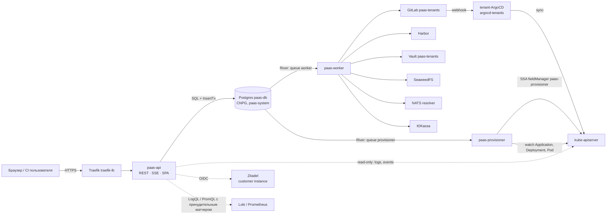
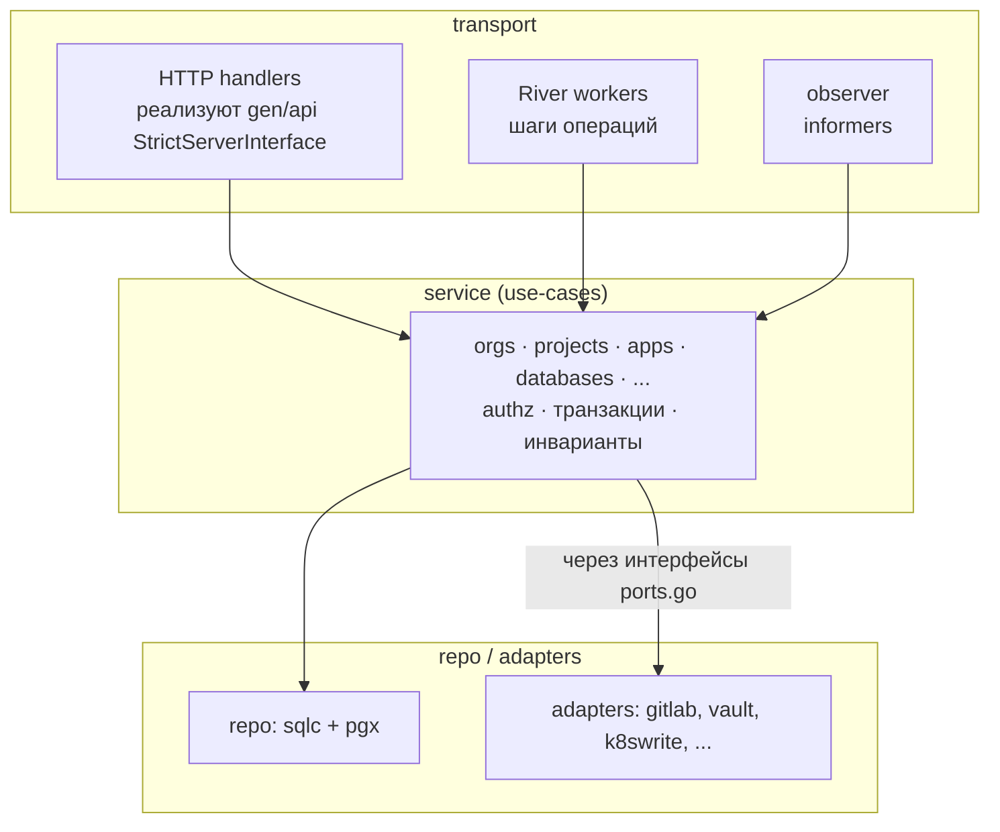
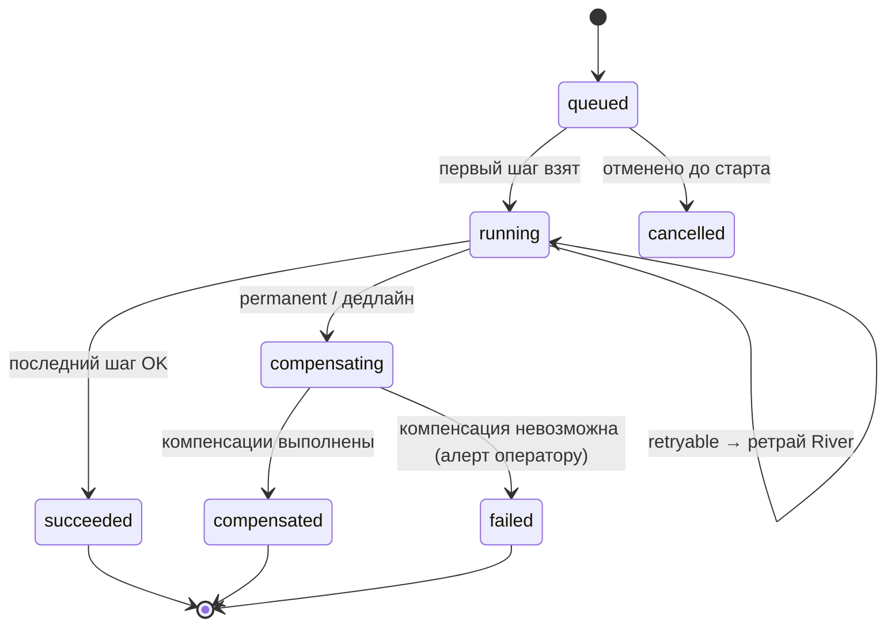

# 04. Control plane на Go

> Статус: черновик. Раздел описывает Go-backend PaaS: структуру кода, API, аутентификацию, очередь, state machine, адаптеры, стриминг, наблюдаемость, тестирование и установку в кластер.

## TL;DR

- **Модульный монолит, один Go-модуль, три бинаря с разными кредами** (D13, D4). `paas-api` смотрит в интернет и не имеет ни прав записи в k8s, ни токенов GitLab/Vault; `paas-worker` владеет внешними интеграциями; `paas-provisioner` — единственный, кто пишет в kube-apiserver. Граница проверяется **при сборке** (`go list -deps`), а не только конфигурацией.
- **API — spec-first OpenAPI 3.1 + `oapi-codegen`**: каждая операция обязана объявить `x-permission`, иначе сборка падает; `Idempotency-Key` на каждом `POST` с записью ключа в той же транзакции, что и эффект; ошибки RFC 9457; keyset-пагинация по UUIDv7; `/api/v1` только с аддитивными изменениями (`oasdiff`).
- **Auth**: BFF-сессии в Postgres (`__Host-` cookie, в БД только хэш), отдельный customer-инстанс Zitadel, API-токены для CI (`sha256`, scopes, срок ≤ 1 года, без доступа к разрушительным операциям), роли owner/admin/developer/viewer/billing, третий слой — RLS в БД.
- **Intent-proof**: необратимые операции исполняются, только если исполнитель шага сам проверил свежий `id_token` Zitadel с MFA и `nonce`, привязанным к конкретному действию. Скомпрометированный API не может «удалить всё».
- **River + transactional enqueue** вместо outbox; долгие операции — движок state machine: шаг = задание в очереди процесса с нужными кредами, продвижение и постановка следующего шага — одной транзакцией, ретраи/snooze/дедлайн/компенсации, circuit breaker на разрушительные шаги.
- **`app.reconcile` — level-triggered**: все изменения приложения меняют desired-состояние в БД, одна активная операция на приложение сходится к последнему; упавший раскат откатывается коммитом предыдущей здоровой ревизии по её digest'у.
- **Managed Postgres**: `db.create` — шесть шагов между worker и provisioner, тома на `lnstr-tenant-*` (R-SC), бэкап в бакет проекта `pgbk-<ns_id>`. Удаление — обратимая `db.delete` (hibernation через git), 7 дней «корзины», затем необратимая `db.purge` с проверкой legal hold.
- **Рендер — только типами** (`k8s.io/api` + минимальные CRD-структуры). `Harden()` = слой 1 D4: `hostUsers: false` всегда (user namespaces — stable в k8s 1.36), UID из образа, если он числовой 1–65535, иначе 10001, `runAsNonRoot` всегда (R-UID); память request = limit, CPU limit ≤ 4 × request (R-QUOTA); PriorityClass `tenant-paid`/`tenant-trial`. Golden-тесты прогоняются через те же VAP в envtest — расхождение слоёв ломает сборку, а не деплой клиента.
- **GitLab**: два файла на ресурс (`manifest.yaml`, `_meta.json`), `_meta.json` — замок директории через `last_commit_id` и ключ идемпотентности коммита. **«Задеплоено»** = ревизия ArgoCD *содержит* наш коммит (по цепочке `parent_sha` в своём журнале) ∧ rollout здоров; ArgoCD дёргается аннотацией refresh через apiserver, без REST-токена ArgoCD.
- **Стриминг — только SSE** (R-LOGS): живые логи (`pods/log` с `follow`) и статусы (`LISTEN/NOTIFY`) идут одним транспортом, с реконнектом по `Last-Event-ID`/`sinceTime`, той же cookie и тем же `x-permission`. Класса Cross-Site WebSocket Hijacking нет. Стримы закрываются сервером на 540-й секунде, раньше 600-секундного таймаута Traefik. **Exec в MVP выключен**: грант `pods/exec` интернет-facing процессу отменил бы D4. WebSocket появится только у отдельного `paas-exec-gateway` фазы 2.
- **Секреты тенантов не лежат в очереди в открытом виде**: API запечатывает значение открытым ключом X25519, открывает только worker.
- **Установка** — ansible-компонент `paas-control-plane`: `pre → postgresql → cfg → migrate → install → post`; Deployments и `paas-db` с PriorityClass `paas-control`; права provisioner'а сужены до `t-*` отдельной VAP; установка невозможна, пока нет tenant-политик из [03](03-security-model.md).
- **Главные решения владельца** (§19): разные registrable-домены консоли и приложений, внешняя копия бэкапа `paas-db`, обязательная MFA для owner/admin, привязка тарифа к Project ([02](02-tenancy-and-isolation.md) §1.1) вместо подписки на организацию.

## 1. Форма системы: модульный монолит, три бинаря

**Решение.** Один Go-модуль (`gitlab.<domain>/paas/control-plane`), один репозиторий, общий `internal/`, **три бинаря с разными правами** (D13, D4). Не микросервисы: соло-оператору нужен один `git log`, один релиз, одна схема БД и транзакции через границы доменов (создать приложение = строка в `apps` + ревизия + домен + операция + задание в очереди — в одной транзакции Postgres). Не «один бинарь»: интернет-facing процесс не должен даже *содержать* код, умеющий писать в kube-apiserver или GitLab.

| Процесс | Экспозиция | Права в k8s | Внешние креды | Очереди River | Реплики |
|---|---|---|---|---|---|
| `paas-api` | интернет (через Traefik) — REST, SSE (статусы и логи), отдаёт SPA | **только чтение** в `t-*`: `pods`, `pods/log`, `events`, `deployments`, `statefulsets`, `replicasets` через `RoleBinding` на `ClusterRole paas-managed-api-reader`, которую создаёт provisioner в каждом tenant-ns. Cluster-wide — ноль | Zitadel OIDC client secret, ключ шифрования сессий, ключ подписи курсоров, read-only токен Loki/Prometheus | нет потребителей, только **insert-only** клиент | 2 |
| `paas-worker` | нет входящего трафика, кроме `/metrics`, `/healthz` | **ноль** (`automountServiceAccountToken: false`; projected-токен только с `audience: vault`) | GitLab group access token (`api` на группу `paas-tenants`), Harbor robot (system-level, ограниченный), Vault (k8s-auth role `paas-worker`), SeaweedFS admin identity, NATS operator signing key, ключи ЮKassa, SMTP | `worker`, `worker_slow`, `periodic` | 2 |
| `paas-provisioner` | нет входящего трафика | ограниченный `ClusterRole` (создание `Namespace` с фиксированным паттерном, `ResourceQuota`, `LimitRange`, `NetworkPolicy`, `ServiceAccount`, `RoleBinding` с `bind` по `resourceNames`, `SecretStore`, pull-secret) + `Role` в `argocd-tenants` на `AppProject`/`Application` + cluster-wide **чтение** подов/деплойментов с label `paas.1520.tech/managed-by=paas` для observer'а | нет | `provisioner` | 2 (observer — под `Lease`) |



**Почему разделение именно по кредам, а не по доменам.** Домены (apps, databases, …) присутствуют во всех трёх бинарях; различается то, *какие адаптеры слинкованы*. Шаг state machine, которому нужен GitLab, исполняется только в `paas-worker`; шаг, которому нужен apiserver на запись, — только в `paas-provisioner`. Маршрутизация — через имя очереди River в `InsertOpts` аргументов задания (§8). Компрометация `paas-api` даёт злоумышленнику: чтение БД в рамках своей роли (с RLS, см. [05-data-model.md](05-data-model.md) §3), возможность класть задания в очередь и чтение логов тенантов. Не даёт: токена GitLab, Vault, SSA в кластер. Остаточный риск «положить в очередь разрушительное задание» закрывается в §9.1 (задания несут только ID, исполнитель перечитывает состояние из БД, circuit breaker на разрушительные шаги).

**Отвергнуто.**
- *Микросервисы по доменам* — сетевые вызовы вместо транзакций, распределённые саги там, где хватает одной `BEGIN … COMMIT`, N пайплайнов. Соло не вытянет.
- *Kubebuilder-оператор с CRD как источником истины* (рекомендация исследования prior-art) — противоречит D3: источник истины — Postgres, git — рендер-проекция. Оператор-подход не отвергнут навсегда: provisioner по сути и есть level-triggered контроллер, только его desired state — строки в БД, а не CR.
- *Один бинарь с флагом роли* — все креды и весь код в одном образе; RCE в API = RCE с токеном GitLab на соседнем флаге. Нет.

## 2. Дерево репозитория

Репозиторий кода — **отдельный** GitLab-проект `paas/control-plane` (не этот ansible-репо: здесь только чарт и переменные компонента `paas-control-plane`, §18). SPA ([14-frontend-console.md](14-frontend-console.md)) живёт в том же репо в `web/` и встраивается в `paas-api` через `embed.FS` — один артефакт, одна версия контракта.

```
paas/control-plane/
├── api/
│   ├── openapi.yaml              # ЕДИНСТВЕННЫЙ источник контракта (OpenAPI 3.1, spec-first)
│   ├── events.schema.json        # JSON Schema типов SSE-событий (OpenAPI плохо типизирует event-stream)
│   └── oapi-codegen.yaml
├── cmd/
│   ├── paas-api/main.go          # wiring: HTTP-сервер, insert-only River, k8sread
│   ├── paas-worker/main.go       # wiring: River(worker*, periodic), gitlab/harbor/vault/s3/nats/payments; подкоманда `migrate`
│   └── paas-provisioner/main.go  # wiring: River(provisioner), k8swrite, observer (informers + Lease)
├── internal/
│   ├── platform/                 # сквозное, без бизнес-логики
│   │   ├── config/  db/  log/  metrics/  tracing/  clock/  ids/
│   │   ├── httpx/                # роутер, middleware-цепочка, problem+json, пагинация, security-заголовки
│   │   ├── idempotency/  ratelimit/  sse/        # sse — статусы и логи (R-LOGS); WebSocket-кода нет (§13.3)
│   │   ├── authn/                # BFF-сессии, OIDC, API-токены
│   │   └── authz/                # роли, матрица прав, x-permission
│   ├── ops/                      # движок state machine поверх River (§9)
│   ├── render/                   # манифесты: Harden(), app, postgres, valkey, nats, crd/ (минимальные типы CRD)
│   ├── identity/  orgs/  projects/  apps/  deployments/  domains/  databases/
│   ├── storage/  registry/  secrets/  billing/  metering/  audit/  notifications/
│   │   └── (в каждом: model.go, service.go, repo.go, http.go, jobs.go, ports.go)
│   ├── adapters/
│   │   ├── k8sread/  k8swrite/  argocd/      # argocd = чтение/патч Application через apiserver, НЕ REST ArgoCD
│   │   ├── gitlab/  harbor/  vault/  seaweedfs/  nats/  payments/yookassa/
│   │   ├── zitadel/  loki/  prometheus/  dnscheck/  smtp/
│   └── gen/
│       ├── api/                  # oapi-codegen (не редактируется руками)
│       └── sqlc/                 # sqlc (не редактируется руками)
├── db/
│   ├── migrations/               # goose, *.sql (+ embed)
│   ├── queries/                  # *.sql для sqlc
│   └── sqlc.yaml
├── web/                          # React SPA (Vite) → web/dist встраивается в paas-api
├── testdata/golden/              # эталонные манифесты (§10)
├── test/
│   ├── envtest/                  # provisioner + VAP против настоящего kube-apiserver
│   └── e2e/                      # kind / test-1
├── Dockerfile                    # multi-stage, три target → три distroless-образа
├── Makefile  .golangci.yml  .gitlab-ci.yml
└── go.mod
```

**`pkg/` отсутствует сознательно.** Всё в `internal/` — нет внешних потребителей Go-API, а `pkg/` провоцирует «экспортировать на всякий случай». Когда появится публичный Go-клиент или terraform-провайдер, он генерируется из `api/openapi.yaml` в отдельный модуль.

**Образы.** Три отдельных distroless-образа (`gcr.io/distroless/static:nonroot`) из одного Dockerfile (`--target api|worker|provisioner`), CI собирает и пушит в Harbor-проект платформы, подписывает cosign. Отдельные образы, а не один с тремя бинарями: RCE в `paas-api` не должен находить на диске бинарь с кодом записи в GitLab — это дешёвая, но реальная ступень.

## 3. Слои и правила зависимостей



Правила (проверяются линтером, не договорённостью):

1. **Transport не содержит логики.** HTTP-хэндлер: распаковать запрос → `service.X(ctx, cmd)` → упаковать ответ. River-воркер: взять ID из аргументов → `service.Step(ctx, id)`.
2. **Service владеет транзакцией.** `db.WithTx(ctx, fn)` открывается в сервисе; внутри — sqlc-запросы и `river.InsertTx`. Сетевой вызов (GitLab, Vault) **никогда** не выполняется внутри открытой транзакции БД — только до или после (иначе держим блокировки на время HTTP и получаем deadlock-лотерею).
3. **Порты объявляет потребитель.** `internal/apps/ports.go` описывает `type GitCommitter interface { Commit(ctx, CommitRequest) (CommitResult, error) }`; реализация — в `internal/adapters/gitlab`. Домен не импортирует адаптеры, `cmd/*` связывает.
4. **Запрет импортов** — `depguard` в `golangci-lint`:
   - `internal/{identity,…,notifications}` ✗→ `internal/adapters/**`
   - `internal/adapters/**` ✗→ доменные пакеты
   - `internal/render` ✗→ всё, кроме `k8s.io/api`, `k8s.io/apimachinery`, `sigs.k8s.io/yaml`, `internal/render/crd`
5. **Граница бинаря проверяется в CI.** Шаг `go list -deps ./cmd/paas-api | grep -E 'internal/adapters/(gitlab|vault|k8swrite|harbor|seaweedfs|nats|payments)'` обязан вернуть пустоту. Это превращает D4 («у API нет прав записи») из свойства конфигурации в свойство сборки.
6. **Контекст запроса** несёт `Principal{UserID|TokenID, OrgID, Role, Scopes, AuthTime, AMR}` и `request_id`; сервисы получают его только через `authz.FromContext(ctx)`, не параметрами — нельзя «забыть передать».

## 4. Доменные модули

Модуль = пакет `internal/<name>` со своими таблицами (владение таблицей ровно у одного модуля; чужие читают через его сервис, не SQL-ом), своими HTTP-операциями и своими шагами операций.

| Модуль | Владеет таблицами ([05](05-data-model.md)) | Ключевые use-cases | Где исполняются шаги |
|---|---|---|---|
| `identity` | `users`, `sessions`, `api_tokens` | OIDC login/callback/logout, back-channel logout, выпуск/отзыв токенов, step-up | api (+ periodic cleanup в worker) |
| `orgs` | `organizations`, `memberships`, `invitations`, `org_billing_profiles` | создать организацию (→ GitLab-репо, Harbor-проект, `AppProject`), приглашения, роли, передача владения | worker (GitLab, Harbor) → provisioner (`AppProject`) |
| `projects` | `projects`, `quotas` | создать проект (→ namespace и весь управляющий набор D3), распределить квоту организации по проектам, удалить (мягкое удаление 7 дней — [02](02-tenancy-and-isolation.md) §2.5) | provisioner |
| `apps` | `apps`, `app_revisions` | валидация `AppSpec`, переписывание образа на Harbor proxy-cache, deploy, env, scale, restart, suspend | worker (digest, commit) → provisioner (Application, ожидание) |
| `deployments` | `deployments`, `git_commits` | история, откат на ревизию, сверка revision, drift detector, rehydrate | worker + provisioner |
| `domains` | `domains`, `certificates`, `l4_ports`, `ip_slots`, `ingress_ips` | платформенный hostname, custom domain + TXT, перепроверка dangling CNAME, выделение L4-порта (`SKIP LOCKED`), назначение IP-слота | worker (DNS-проверки) + рендер в app |
| `databases` | `managed_databases` | Postgres (CNPG), Valkey, NATS-account; тумблер внешнего доступа; список бэкапов; ротация пароля | worker (Vault, NATS JWT, commit) → provisioner |
| `storage` | `buckets`, `s3_credentials`, `s3_credential_buckets` | бакеты `t-<project_id>-*`, ключи, квоты | worker (SeaweedFS) |
| `registry` | `registry_projects`, `robot_accounts` | Harbor-проект на организацию, robot push/pull, квота, сбор занятого места | worker (Harbor) → provisioner (pull-secret) |
| `secrets` | `secrets` (только метаданные) | write-only секреты: значение запечатывается в API, открывается только в worker и пишется в Vault (§9, §16) | worker |
| `billing` | `plans`, `addons`, `subscriptions`, `subscription_addons`, `invoices`, `payments`, `payment_webhook_events` | подписка, рекурренты, webhooks (inbox), dunning: ретраи → grace → suspend → удаление ([13](13-billing-and-quotas.md)) | worker |
| `metering` | `usage_hourly` | почасовой сбор из Prometheus, идемпотентный upsert, fair-use сигналы | worker (periodic) |
| `audit` | `audit_log`, `audit_digests` | запись в той же транзакции, что и изменение; ежедневный дайджест; экспорт партиций | все три (insert), worker (экспорт) |
| `notifications` | `notifications` | email + in-app; доставка — задание River, созданное в транзакции события | worker |

Сквозные пакеты, не домены: `ops` (движок операций, таблица `operations`), `render` (чистые функции «строки БД → манифесты»), `platform/*`.

**Отдельно про границу «пользователь → k8s».** Ни один модуль не принимает от пользователя YAML, JSON-патч, LogQL, PromQL, имя namespace или имя k8s-объекта. Вход — только типизированные поля OpenAPI-схемы; k8s-имена выводятся из ID в БД. Это слой 1 из D4, и он начинается в транспортном слое, а не в `Harden()`.

## 5. Адаптеры внешних систем

Общие правила для **всех** адаптеров (реализованы один раз в `platform/httpx.Client` и обёртках):

- Таймаут на каждый вызов через `context.WithTimeout` (по умолчанию 10 с; GitLab commit 30 с). Никаких вызовов без дедлайна.
- Ретраи — только для идемпотентных операций или операций с ключом идемпотентности; экспоненциальный backoff с full jitter, максимум 4 попытки внутри шага. Всё, что дольше, — ретрай *шага* средствами River (§9), а не цикл внутри HTTP-клиента.
- Семафор конкурентности на адаптер (GitLab 8, Harbor 8, Vault 16, SeaweedFS 4): шторм операций не превращается в шторм по GitLab/Sidekiq.
- Метрики `paas_adapter_requests_total{adapter,op,code}` и `paas_adapter_request_duration_seconds{adapter,op}`; ошибки классифицируются в `retryable | conflict | not_found | permanent`.
- Секреты в логах невозможны по построению: токены и значения — типы с `LogValue()`, возвращающим `[redacted]`.

| Адаптер | Процесс | Протокол / библиотека | Минимальные права | Идемпотентность |
|---|---|---|---|---|
| `k8sread` | api | client-go, прямые `GET`/`LIST` по конкретному namespace, без informer'ов | `RoleBinding` в `t-*` на `paas-managed-api-reader` | чтение |
| `k8swrite` | provisioner | client-go **Server-Side Apply**: `applyconfigurations/*` для core, `dynamic` + `unstructured` для CRD; `FieldManager: "paas-provisioner"`, `Force: true` | `ClusterRole paas-managed-provisioner` (§18) | SSA идемпотентен по определению |
| `argocd` | provisioner | **не REST ArgoCD**, а объект `Application` через apiserver: SSA спецификации + merge-patch аннотации `argocd.argoproj.io/refresh: normal` отдельным field manager `paas-provisioner-refresh`; чтение `status` через informer | `Role` в `argocd-tenants` | повторный refresh безвреден |
| `gitlab` | worker | REST v4, `gitlab.com/gitlab-org/api/client-go` (официальный клиент) | group access token на `paas-tenants`, роль Maintainer, scope `api` | `_meta.json` + `last_commit_id` (§11) |
| `harbor` | worker | REST `/api/v2.0`, тонкий клиент по swagger Harbor | system robot: `project:create`, `robot:create/delete`, `quota:update`, `artifact:read` — ⚠️ проверить точный набор permission'ов system robot в установленной версии | проверка существования по имени перед созданием |
| `vault` | worker | `hashicorp/vault/api` + kubernetes auth; JWT — projected SA token с `audience: vault`, не дефолтный токен пода | role `paas-worker` → policy на `paas-tenants/data/*`, `paas-tenants/metadata/*` | KV v2 **CAS**: первая запись `cas=0`, обновление `cas=<версия>` |
| `seaweedfs` | worker | IAM-совместимый API шлюза S3; fallback — `weed shell` как **клиент** по gRPC к master/filer (без `kubectl exec`, у worker нет прав в k8s) — ⚠️ проверить покрытие IAM API в 4.45, решение в [11](11-svc-object-storage-s3.md) | admin identity платформы | «создать, если нет» по имени identity |
| `nats` | worker | `nats-io/jwt/v2` + `nkeys`: выпуск account JWT, подписанного operator signing key; публикация в resolver через `$SYS.REQ.CLAIMS.UPDATE` | system-account creds + signing key (не root operator key) | JWT детерминирован по account pubkey |
| `payments/yookassa` | worker | REST, заголовок `Idempotence-Key` на каждый POST | shop id + secret key | `payments.idempotence_key` UNIQUE |
| `zitadel` | api | `coreos/go-oidc/v3` + `x/oauth2`; только OIDC, без management API в MVP | confidential client в customer-инстансе | — |
| `loki`, `prometheus` | api | HTTP query API; запрос строится из шаблона с принудительным матчером `namespace="t-…"` (D14), значения экранируются | read-only | чтение |
| `dnscheck` | worker | `miekg/dns`, прямые запросы к 3 независимым публичным резолверам, требуется согласие 2 из 3 | исходящий UDP/TCP 53 | чтение |

**Почему ArgoCD — через apiserver, а не через его REST API** (исследование gitops-scale предлагало `GET /api/v1/applications/{app}?refresh=hard` + `POST .../sync`). Аннотация `argocd.argoproj.io/refresh` — штатный механизм ArgoCD, контроллер реагирует на неё через свой informer, после обработки снимает. Выигрыш: у backend нет долгоживущего ArgoCD API-токена (ещё один секрет и ещё одна RBAC-система в Casbin), единственная граница прав остаётся k8s RBAC, как у системного ArgoCD. Sync запускать не нужно: у tenant-Application `automated: {prune: true, selfHeal: true}`, refresh → OutOfSync → auto-sync. ⚠️ проверить на стенде задержку «аннотация → начало sync» в 3.5.x (ожидание: < 1 с).

## 6. API: REST + OpenAPI 3.1 spec-first

### 6.1 Инструменты и генерация

**Решение (D13): контракт пишется руками в `api/openapi.yaml`, код генерируется из него.**

| Сторона | Инструмент | Что получаем |
|---|---|---|
| Go-сервер | `oapi-codegen` v2: `models`, `std-http-server` (роутер `net/http` Go 1.22+), `strict-server`, `embedded-spec` | типизированный интерфейс `StrictServerInterface`, который модуль обязан реализовать; невозможно «забыть» эндпоинт |
| Валидация входа | `oapi-codegen/nethttp-middleware` (kin-openapi) по встроенной спеке | отказ до хэндлера при лишнем поле, неверном типе, выходе за `maxLength` |
| TS-клиент | `openapi-typescript` + `openapi-fetch` | те же инструменты, что рекомендует [14-frontend-console.md](14-frontend-console.md): фронту безразлично, спека из кода или руками |
| Линт спеки | `redocly lint` + собственное правило-скрипт | см. ниже |
| Контроль совместимости | `oasdiff breaking` против `main` | MR с ломающим изменением в `/v1` не мержится |

```yaml
# api/oapi-codegen.yaml
package: api
output: internal/gen/api/api.gen.go
generate:
  models: true
  std-http-server: true
  strict-server: true
  embedded-spec: true
output-options:
  nullable-type: true
```

**Почему spec-first, а не code-first (`huma`, как предлагает исследование фронтенда).** Для платформы, где безопасность — главный критерий, code-first опасен одним конкретным механизмом: добавил поле в Go-структуру ответа — оно молча уехало наружу (OWASP API3:2023, Broken Object Property Level Authorization). В spec-first любое расширение поверхности — видимый diff `openapi.yaml` в MR. Второе: request-схемы с `additionalProperties: false` закрывают mass assignment на уровне валидатора, до кода.

**Собственные правила линта (скрипт в CI, 40 строк на Go поверх kin-openapi):**
1. У каждой операции есть `operationId` и **ровно одно** из `x-permission: <perm>` или `x-public: true`. Операция без явного права — ошибка сборки (§7.3).
2. Каждый `POST` имеет параметр `Idempotency-Key` (`required: true`), кроме `/auth/*` и `/webhooks/*`.
3. Все 4xx/5xx ссылаются на `#/components/responses/Problem*`.
4. Все request-body схемы — `additionalProperties: false`; все строки имеют `maxLength`, все массивы — `maxItems`.

⚠️ **Проверить в первый день:** полноту поддержки OpenAPI **3.1** в текущем `oapi-codegen` v2 (исторически генератор строился на 3.0-семантике kin-openapi; проблемные места — `type: [string, "null"]`, `const`, `$ref` с соседними ключами). Как проверить: сгенерировать код из фрагмента §6.2 и собрать. Если генератор не справляется — писать спеку в подмножестве 3.1, эквивалентном 3.0 (nullable через `oneOf` с `null` не использовать; опциональность через отсутствие в `required`), либо перейти на `ogen`. Решение фиксируется до написания первых 20 эндпоинтов.

### 6.2 Фрагмент спеки: apps

Маршруты тенанта всегда несут `orgId` в пути: он становится контекстом RLS ([05](05-data-model.md) §3) после проверки членства. Плоские `/v1/apps/{id}` отвергнуты — пришлось бы сначала найти организацию объекта в обход RLS.

```yaml
openapi: 3.1.0
info: {title: PaaS Console API, version: "1.0.0"}
servers: [{url: /api/v1}]
paths:
  /orgs/{orgId}/projects/{projectId}/apps:
    parameters:
      - $ref: '#/components/parameters/OrgId'
      - $ref: '#/components/parameters/ProjectId'
    get:
      operationId: listApps
      x-permission: app.read
      parameters:
        - $ref: '#/components/parameters/Limit'
        - $ref: '#/components/parameters/Cursor'
      responses:
        '200':
          description: Страница приложений
          content:
            application/json:
              schema: {$ref: '#/components/schemas/AppPage'}
        default: {$ref: '#/components/responses/Problem'}
    post:
      operationId: createApp
      x-permission: app.write
      parameters:
        - $ref: '#/components/parameters/IdempotencyKey'
      requestBody:
        required: true
        content:
          application/json:
            schema: {$ref: '#/components/schemas/CreateAppRequest'}
      responses:
        '202':
          description: Приложение создано, развёртывание поставлено в очередь
          headers:
            Location: {schema: {type: string}, description: URL операции}
          content:
            application/json:
              schema: {$ref: '#/components/schemas/AppWithOperation'}
        '409': {$ref: '#/components/responses/ProblemConflict'}     # slug занят / квота
        '422': {$ref: '#/components/responses/ProblemValidation'}
        '429': {$ref: '#/components/responses/ProblemRateLimited'}
        default: {$ref: '#/components/responses/Problem'}

  /orgs/{orgId}/apps/{appId}/deploy:
    parameters:
      - $ref: '#/components/parameters/OrgId'
      - $ref: '#/components/parameters/AppId'
    post:
      operationId: deployApp            # основной вызов из CI пользователя
      x-permission: app.deploy
      parameters: [{$ref: '#/components/parameters/IdempotencyKey'}]
      requestBody:
        required: true
        content:
          application/json:
            schema:
              type: object
              additionalProperties: false
              required: [image]
              properties:
                image: {$ref: '#/components/schemas/ImageRef'}
      responses:
        '202':
          description: Новая ревизия принята
          content:
            application/json:
              schema: {$ref: '#/components/schemas/AppWithOperation'}
        default: {$ref: '#/components/responses/Problem'}

components:
  parameters:
    OrgId:     {name: orgId,     in: path, required: true, schema: {type: string, format: uuid}}
    ProjectId: {name: projectId, in: path, required: true, schema: {type: string, format: uuid}}
    AppId:     {name: appId,     in: path, required: true, schema: {type: string, format: uuid}}
    Limit:     {name: limit, in: query, schema: {type: integer, minimum: 1, maximum: 200, default: 50}}
    Cursor:    {name: cursor, in: query, schema: {type: string, maxLength: 512}}
    IdempotencyKey:
      name: Idempotency-Key
      in: header
      required: true
      schema: {type: string, minLength: 16, maxLength: 128, pattern: '^[A-Za-z0-9_-]+$'}

  schemas:
    ImageRef:
      type: string
      maxLength: 512
      description: >
        Ссылка на образ. Публичные реестры (docker.io, ghcr.io, quay.io) переписываются на
        proxy-cache проекты Harbor; прочие хосты, кроме Harbor платформы, отклоняются (422).
      pattern: '^[a-z0-9]+([._-][a-z0-9]+)*(:[0-9]+)?(/[a-z0-9]+([._-][a-z0-9]+)*)*(:[A-Za-z0-9_][A-Za-z0-9._-]{0,127})?(@sha256:[a-f0-9]{64})?$'
    CreateAppRequest:
      type: object
      additionalProperties: false
      required: [slug, spec]
      properties:
        slug:
          type: string
          pattern: '^[a-z]([a-z0-9-]{0,28}[a-z0-9])?$'   # неизменяем: входит в hostname <slug>-<project_id>.<apps-domain>
        displayName: {type: string, maxLength: 64}
        spec: {$ref: '#/components/schemas/AppSpec'}
    AppSpec:
      type: object
      additionalProperties: false
      required: [image, size]
      properties:
        image: {$ref: '#/components/schemas/ImageRef'}
        size:
          type: string
          enum: [xs, s, m, l, xl]              # тарифная сетка ресурсов, не произвольные CPU/RAM
        replicas: {type: integer, minimum: 0, maximum: 10, default: 1}
        expose:
          type: string
          enum: [http, none]                   # none = фоновый воркер без Service/маршрута
          default: http
        port: {type: integer, minimum: 1, maximum: 65535, default: 8080}
        command: {type: array, maxItems: 16, items: {type: string, maxLength: 1024}}
        args:    {type: array, maxItems: 64, items: {type: string, maxLength: 4096}}
        env:
          type: array
          maxItems: 100
          items: {$ref: '#/components/schemas/EnvVar'}
        healthCheck: {$ref: '#/components/schemas/HealthCheck'}
    EnvVar:
      type: object
      additionalProperties: false
      required: [name]
      properties:
        name: {type: string, pattern: '^[A-Za-z_][A-Za-z0-9_]{0,127}$'}
        value: {type: string, maxLength: 32768}
        secretRef:                              # ссылка на секрет проекта; значение в git не попадает
          type: object
          additionalProperties: false
          required: [secret, key]
          properties:
            secret: {type: string, pattern: '^[a-z0-9]([a-z0-9-]{0,61}[a-z0-9])?$'}
            key:    {type: string, pattern: '^[A-Za-z0-9._-]{1,253}$'}
      oneOf:
        - required: [value]
        - required: [secretRef]
    HealthCheck:
      type: object
      additionalProperties: false
      required: [type]
      properties:
        type: {type: string, enum: [http, tcp, none]}
        path: {type: string, maxLength: 256, pattern: '^/[\x21-\x7e]*$'}
        initialDelaySeconds: {type: integer, minimum: 0, maximum: 300}
    Operation:
      type: object
      required: [id, kind, status, createdAt]
      properties:
        id: {type: string, format: uuid}
        kind: {type: string}                    # app.reconcile, db.create, ...
        status: {type: string, enum: [queued, running, succeeded, failed, compensating, compensated, cancelled]}
        step: {type: string}
        error: {$ref: '#/components/schemas/Problem'}
        createdAt: {type: string, format: date-time}
    AppPage:
      type: object
      required: [items]
      properties:
        items: {type: array, items: {$ref: '#/components/schemas/App'}}
        nextCursor: {type: string}
```

Про `port`: биндинг портов < 1024 не-root процессом держится на `enable_unprivileged_ports` в containerd (sysctl `net.ipv4.ip_unprivileged_port_start=0` в sandbox пода; в containerd 2.x включено по умолчанию). ⚠️ проверить на ноде: `crictl inspectp <pod> | grep unprivileged`. Если выключено — ограничить `minimum: 1024` и подсказывать в UI.

### 6.3 Idempotency-Key

**Обязателен на каждом `POST`** (правило линта §6.1). `PATCH` и `DELETE` идемпотентны естественно: `PATCH` приложения порождает новую ревизию только если `spec_hash` отличается от текущей desired-ревизии; `DELETE` уже удалённого возвращает `204`. Семантика — по черновику IETF `draft-ietf-httpapi-idempotency-key-header` (⚠️ на момент написания — черновик, не RFC; поведение ниже не зависит от его финальной редакции).

| Ситуация | Ответ |
|---|---|
| Ключ новый | обычная обработка, ответ сохраняется |
| Ключ есть, запрос завершён, отпечаток тела совпадает | сохранённый ответ + `Idempotent-Replayed: true` |
| Ключ есть, отпечаток **другой** | `422 idempotency_key_reused` |
| Ключ есть, запрос ещё выполняется | `409 idempotency_in_progress` + `Retry-After: 1` |
| Обработка упала с 5xx | запись-захват удаляется — клиент вправе повторить с тем же ключом |

Ключ ограничен принципалом: `(principal, key)`, где principal — `user:<uuid>` или `token:<uuid>`. Хранение — таблица `idempotency_keys` ([05](05-data-model.md) §5.9), TTL 24 ч.

**Главная тонкость — нет окна между эффектом и записью ключа.** Для создающих операций перевод ключа в `completed` делается **в той же транзакции**, что и бизнес-запись. Middleware только «захватывает» ключ; завершает его сервис.

```go
// internal/platform/idempotency/middleware.go
func Middleware(store *Store) func(http.Handler) http.Handler {
	return func(next http.Handler) http.Handler {
		return http.HandlerFunc(func(w http.ResponseWriter, r *http.Request) {
			if r.Method != http.MethodPost || isExempt(r.URL.Path) {
				next.ServeHTTP(w, r)
				return
			}
			key := r.Header.Get("Idempotency-Key") // формат уже проверен валидатором спеки
			p := authz.MustPrincipal(r.Context())
			body, err := io.ReadAll(io.LimitReader(r.Body, 1<<20))
			if err != nil {
				httpx.WriteProblem(w, r, problem.BadRequest("body_unreadable"))
				return
			}
			r.Body = io.NopCloser(bytes.NewReader(body))
			fp := fingerprint(r.Method, r.URL.Path, body) // sha256(method \0 path \0 canonicalJSON(body))

			claim, err := store.Claim(r.Context(), p.Key(), key, fp) // INSERT ... ON CONFLICT DO NOTHING RETURNING
			switch {
			case errors.Is(err, ErrInProgress):
				w.Header().Set("Retry-After", "1")
				httpx.WriteProblem(w, r, problem.Conflict("idempotency_in_progress"))
				return
			case errors.Is(err, ErrFingerprintMismatch):
				httpx.WriteProblem(w, r, problem.Unprocessable("idempotency_key_reused"))
				return
			case err == nil && claim.Completed:
				w.Header().Set("Idempotent-Replayed", "true")
				httpx.WriteRaw(w, claim.Status, claim.Body)
				return
			case err != nil:
				httpx.WriteProblem(w, r, problem.Internal(err))
				return
			}
			// Сервис вызовет idempotency.Complete(ctx, tx, status, body) внутри своей транзакции.
			ctx := idempotency.WithClaim(r.Context(), claim)
			rec := httpx.NewRecorder(w)
			next.ServeHTTP(rec, r.WithContext(ctx))
			if rec.Status >= 500 {
				_ = store.Release(context.WithoutCancel(r.Context()), claim) // дать клиенту повторить
			} else if !claim.CompletedInTx() {
				_ = store.CompleteOutsideTx(r.Context(), claim, rec.Status, rec.Body()) // 4xx без бизнес-транзакции
			}
		})
	}
}
```

### 6.4 Ошибки: RFC 9457

Все ошибки — `application/problem+json` по RFC 9457. `type` — стабильный URI из каталога, `code` — машинный код (фронт и CI ветвятся по нему, не по тексту), `request_id` — сквозной ID (он же в логах, в коммит-сообщении и в аннотации Application).

```json
{
  "type": "https://console.<domain>/docs/errors/quota_exceeded",
  "title": "Превышена квота проекта",
  "status": 409,
  "detail": "Для размера «m» нужно 1000m CPU, свободно 400m. Уменьшите размер или повысьте тариф.",
  "instance": "/api/v1/orgs/0192.../projects/0192.../apps",
  "code": "quota_exceeded",
  "request_id": "01J8Z9V3QKX3M5",
  "errors": [
    {"pointer": "/spec/size", "detail": "не помещается в квоту"}
  ]
}
```

```go
// internal/platform/httpx/problem/problem.go
type Problem struct {
	Type      string       `json:"type"`
	Title     string       `json:"title"`
	Status    int          `json:"status"`
	Detail    string       `json:"detail,omitempty"`
	Instance  string       `json:"instance,omitempty"`
	Code      string       `json:"code"`
	RequestID string       `json:"request_id"`
	Errors    []FieldError `json:"errors,omitempty"`
	cause     error        // только в лог, НИКОГДА в ответ
}

// Единая точка маппинга доменных ошибок; хэндлеры не пишут статусы руками.
func FromError(err error) *Problem {
	var de *domain.Error
	switch {
	case errors.As(err, &de):
		return fromDomain(de) // NotFound→404, Conflict→409, Quota→409, Forbidden→403, Validation→422
	case errors.Is(err, context.DeadlineExceeded):
		return &Problem{Status: 504, Code: "upstream_timeout", Title: "Операция не успела выполниться", cause: err}
	default:
		return &Problem{Status: 500, Code: "internal", Title: "Внутренняя ошибка", cause: err}
	}
}
```

Правила: (1) текст ошибок GitLab/Harbor/Vault/apiserver никогда не уходит клиенту — только в лог с `request_id`; (2) «нет доступа» к чужому объекту отвечается `404`, а не `403` — не подтверждаем существование чужих ID; (3) `403` — только когда объект свой, а роли не хватает.

### 6.5 Пагинация курсором

Keyset-пагинация, без `OFFSET` и без `total` (дорогой `count(*)` на каждой странице). Все первичные ключи — UUIDv7 ([05](05-data-model.md) §1), они монотонны по времени, поэтому ключ пагинации — просто `id`.

```sql
-- name: ListApps :many
SELECT * FROM apps
WHERE org_id = @org_id AND project_id = @project_id AND deleted_at IS NULL
  AND (@after::uuid IS NULL OR id < @after::uuid)   -- новые сверху
ORDER BY id DESC
LIMIT @page_size;                                    -- = limit + 1, чтобы понять, есть ли следующая страница
```

Курсор непрозрачен и подписан: `base64url(json{v:1, after:<uuid>, f:<hash фильтров>}) + "." + HMAC-SHA256`. Подпись не про безопасность (RLS и `org_id` в запросе всё равно ограничивают выборку), а про честность контракта: курсор нельзя «собрать руками» и зависеть от его формата, а курсор, выданный для одного набора фильтров, отвергается для другого (`400 cursor_invalid`). Ответ — `{"items": [...], "nextCursor": "..."}`; отсутствие `nextCursor` = последняя страница.

### 6.6 Версионирование

- Префикс пути `/api/v1`. Внутри v1 допустимы только **аддитивные** изменения: новые эндпоинты, новые необязательные поля, новые значения enum (клиенты обязаны терпеть неизвестные значения — это записано в описании API). `oasdiff breaking` в CI это стережёт.
- Ломающее изменение → `/api/v2` параллельно с v1 не менее 6 месяцев; устаревающие операции отдают `Deprecation` (RFC 9745) и `Sunset` (RFC 8594) + `Link: <…>; rel="deprecation"`.
- SPA пользуется **тем же публичным API**, что и CI пользователя. Приватных эндпоинтов нет, кроме `/auth/*` (BFF-поток) и `/webhooks/*` (платёжка). Это не принцип ради принципа: отсутствие «внутреннего API без проверок» закрывает целый класс обходов авторизации.
- Версия схемы события SSE — поле `v` в каждом событии (`events.schema.json`), независимо от версии REST.

## 7. Аутентификация и авторизация

### 7.1 Zitadel OIDC и BFF-сессии

**Решение (D13).** Клиенты живут в **отдельном виртуальном инстансе Zitadel** (`auth.<console-domain>`), не в том, где staff-SSO (`cluster-tools`): другая политика регистрации (самостоятельная), другие MFA-правила, другой blast radius. Инстанс заводит ansible-компонент `zitadel` (платформа, D1); backend — только confidential OIDC-клиент в нём. Management API Zitadel в MVP не используется: всё, что нужно, — Authorization Code + PKCE, refresh, back-channel logout. Поток целиком и дизайн cookie — в [14-frontend-console.md](14-frontend-console.md); здесь — серверная сторона.

| Эндпоинт (`x-public`) | Что делает сервер |
|---|---|
| `GET /auth/login?return_to=` | генерирует `state`, `nonce`, `code_verifier`; сохраняет в `oidc_login_tx` (TTL 10 мин); 302 на Zitadel. `return_to` — только относительный путь (open redirect) |
| `GET /auth/callback` | достаёт и **удаляет** tx по `state`; обмен кода; проверка `id_token` (iss, aud, exp, nonce, подпись по JWKS); upsert `users` по `sub`; создание сессии; `Set-Cookie: __Host-sid` |
| `POST /auth/logout` | удаляет сессию, чистит cookie, `204` |
| `POST /auth/backchannel-logout` | проверяет logout-token (подпись, `events`, отсутствие `nonce`), удаляет все сессии с этим `sid`/`sub` |

**Сессия** — строка в Postgres (`sessions`), не Redis: ещё один stateful-компонент соло не нужен, а поиск по первичному ключу — доли миллисекунды. В cookie — 32 случайных байта; в БД — только `sha256(sid)`: утечка дампа БД не даёт рабочих cookie. Refresh-токен Zitadel хранится зашифрованным (AES-256-GCM, ключ `session_tokens_key` из Vault через ESO; `key_id` в строке для ротации). Таймауты: idle 30 мин, absolute 12 ч, access-токен обновляется сервером за 60 с до истечения.

**Step-up и «доказательство намерения».** Опасные операции требуют свежей аутентификации с MFA. Для необратимых (удаление проекта/БД/бакета/организации, показ сгенерированных кредов, передача владения) этого мало: скомпрометированный `paas-api` мог бы сам поставить в очередь «удалить всё». Поэтому:

1. API создаёт `intent` = `{action, target_id, org_id, user_id}` и уводит пользователя на Zitadel с `prompt=login`, `max_age=0` и **`nonce = base64url(sha256(intent_id))`**.
2. Сырой `id_token` из callback'а прикладывается к операции (`operations.intent_proof`).
3. Исполнитель шага (worker/provisioner) **сам** проверяет подпись по JWKS Zitadel, `auth_time` ≤ 5 мин, `amr` содержит второй фактор, `nonce` совпадает с `sha256(intent_id)` операции, а `sub` — владелец/админ организации по БД.

Подделать `id_token` без ключа Zitadel нельзя, переиспользовать его для другого действия — тоже (nonce привязан к конкретному intent). Для обратимых чувствительных операций (выпуск API-токена, смена платёжного метода) достаточно session-level step-up: `auth_time` сессии ≤ 5 мин, иначе `401` с `code: step_up_required` и `login_url`.

⚠️ проверить на стенде: какие значения `amr` кладёт Zitadel customer-инстанса при входе с TOTP/passkey (ожидается наличие `mfa` или `otp`/`user`); как проверить — войти тестовым пользователем с MFA и декодировать `id_token`.

### 7.2 API-токены для CI

CI пользователя (GitLab CI, GitHub Actions) вызывает `deployApp` с API-токеном. Cookie-сессии там неприменимы.

| Свойство | Решение |
|---|---|
| Формат | `paas_<k>_<43 символа base62 = 256 бит>_<6 символов CRC32>`, где `k` = `p` (personal) / `o` (org). Префикс ловится secret-сканерами (GitLab Secret Detection, gitleaks — добавить правило), CRC отсекает опечатки без запроса в БД |
| Хранение | `sha256(token)` в `api_tokens.token_hash`; показывается один раз при выпуске; в UI — первые 12 символов |
| Почему не bcrypt/argon2 | токен — 256 бит случайности, перебор невозможен; медленный хэш добавил бы 50–100 мс на **каждый** запрос CI без выигрыша |
| Виды | `personal` — умирает вместе с членством пользователя; `org` (сервисный) — выпускают только owner/admin, переживает уход автора, виден всем админам |
| Права | `scopes` (подмножество из фиксированного списка) ∩ права `role_cap` (роль не выше роли выпустившего на момент выпуска); опционально `project_ids` |
| Срок | обязателен, ≤ 366 дней, по умолчанию 90; за 7 дней — уведомление |
| Запрещено токенам | всё, что требует step-up: удаления данных, показ кредов, управление участниками и оплатой, выпуск других токенов |
| `last_used_at` | обновляется не чаще раза в 5 мин (иначе запись на каждый запрос CI) |

```go
// internal/platform/authn/token.go
func (a *Authenticator) fromBearer(ctx context.Context, raw string) (*authz.Principal, error) {
	tok, ok := parseToken(raw) // формат + CRC; неверный — сразу 401 без похода в БД
	if !ok {
		return nil, ErrUnauthenticated
	}
	sum := sha256.Sum256([]byte(raw))
	row, err := a.q.AuthLookupAPIToken(ctx, sum[:]) // SECURITY DEFINER-функция: RLS ещё не знает org
	if err != nil || row.RevokedAt.Valid || time.Now().After(row.ExpiresAt) {
		return nil, ErrUnauthenticated // одинаковый ответ на «нет», «отозван», «истёк»
	}
	a.touch.Maybe(row.ID) // асинхронный троттлинг last_used_at
	return &authz.Principal{
		Kind: authz.PrincipalToken, TokenID: row.ID, OrgID: row.OrgID, UserID: row.UserID,
		Role: row.RoleCap, Scopes: row.Scopes, ProjectIDs: row.ProjectIDs, TokenKind: tok.Kind,
	}, nil
}
```

### 7.3 RBAC внутри организации

Роли — на уровне организации (проектные роли — фаза 2). Проверка — в middleware по `x-permission` операции; фронт только прячет кнопки.

| Право | owner | admin | developer | viewer | billing |
|---|:-:|:-:|:-:|:-:|:-:|
| `org.read`, `project.read`, `app.read`, `db.read`, `domain.read`, `storage.read`, `registry.read`, `secret.read_meta` | ✓ | ✓ | ✓ | ✓ | `org.read` |
| `app.write`, `app.deploy`, `app.logs`, `secret.write`, `domain.write` | ✓ | ✓ | ✓ | — | — |
| `db.write`, `storage.write`, `registry.write` (создать, изменить) | ✓ | ✓ | ✓ | — | — |
| `app.delete` | ✓ | ✓ | ✓ | — | — |
| `db.delete`, `storage.delete`, `project.delete`, `db.reveal`, `storage.reveal` (step-up + intent) | ✓ | ✓ | — | — | — |
| `project.write`, `member.invite`, `member.role` (кроме назначения owner), `token.create_org`, `audit.read` | ✓ | ✓ | — | — | — |
| `billing.read` | ✓ | ✓ | — | — | ✓ |
| `billing.write` (тариф, платёжный метод) | ✓ | — | — | — | ✓ |
| `org.delete`, назначение/снятие `owner` | ✓ | — | — | — | — |

Инвариант «в организации всегда ≥ 1 owner» держит триггер БД ([05](05-data-model.md) §5.2), а не только код.

```go
// internal/platform/authz/middleware.go — permission берётся из спеки, а не из кода хэндлера.
// permByOperation генерируется `go generate` из x-permission / x-public в api/openapi.yaml.
func Enforce(next api.StrictHandlerFunc, operationID string) api.StrictHandlerFunc {
	perm, public := permByOperation[operationID]
	return func(ctx context.Context, w http.ResponseWriter, r *http.Request, req any) (any, error) {
		if public {
			return next(ctx, w, r, req)
		}
		p, ok := FromContext(ctx)
		if !ok {
			return nil, problem.Unauthenticated()
		}
		orgID, err := uuid.Parse(r.PathValue("orgId"))
		if err != nil {
			return nil, problem.NotFound()
		}
		role, err := members.RoleOf(ctx, p, orgID) // для токена: org фиксирован в токене, иначе 404
		if err != nil {
			return nil, problem.NotFound() // не член организации = объект «не существует»
		}
		if !Allowed(role, perm) || !p.ScopeAllows(perm) || !p.ProjectAllows(r.PathValue("projectId")) {
			audit.Denied(ctx, p, orgID, perm, operationID)
			return nil, problem.Forbidden(perm)
		}
		if RequiresStepUp(perm) && !p.StepUpFresh(5*time.Minute) {
			return nil, problem.StepUpRequired(loginURL(r))
		}
		// Контекст для RLS: db.WithTx прочитает его и выполнит set_config(... , true) в начале транзакции.
		return next(WithOrg(ctx, orgID, role), w, r, req)
	}
}
```

Операция, которую забыли разметить, в `permByOperation` отсутствует → `Enforce` паникует при старте (`missing x-permission for operationId X`), а линт спеки ловит это ещё раньше в CI. Путь «новый эндпоинт без проверки прав в прод» закрыт дважды. Третий слой — RLS в БД: даже если сервис забудет `WHERE org_id = …`, роль `paas_api` не увидит строк чужой организации.

## 8. Очередь River и транзакционный enqueue

**Решение (D13): River** (`github.com/riverqueue/river`, драйвер `riverpgxv5`) в той же базе `paas`. Главное свойство — `InsertTx`: задание вставляется в **ту же** транзакцию, что и бизнес-изменение. Закоммитилось приложение — гарантированно есть задание его развернуть; откатилась транзакция — задания нет. Отдельная таблица outbox не нужна.

| Процесс | Клиент River | Очереди (MaxWorkers) | Periodic jobs |
|---|---|---|---|
| `paas-api` | insert-only (без `Queues`/`Workers`) | — | — |
| `paas-worker` | полный | `worker` (20), `worker_slow` (4) | общий список (см. ниже) |
| `paas-provisioner` | полный | `provisioner` (20) | общий список |

**Ловушка лидерства.** Periodic jobs ставит в очередь только *лидер* River, а лидер один на базу среди всех клиентов с очередями. Если periodic jobs объявлены лишь в worker, а лидером станет provisioner, — метеринг и перепроверка доменов молча перестанут запускаться. Решение: **одинаковый** список periodic jobs объявлен во всех клиентах с очередями, у каждого задания в `InsertOpts` жёстко задана целевая очередь — неважно, кто лидер. ⚠️ проверить семантику лидерства и periodic jobs в закреплённой версии River (интеграционный тест: два клиента, убить лидера, убедиться, что периодическое задание поставлено).

Periodic jobs: `metering.collect` (ежечасно, :05), `domains.recheck` (каждые 15 мин порциями), `deployments.drift` (ежечасно, выборка), `db.partitions.ensure` (ежесуточно, партиции на 3 месяца вперёд), `retention.purge` (ежесуточно), `audit.digest` (ежесуточно), `credentials.expiry` (ежесуточно: сроки GitLab-токена, robot-аккаунтов, сертификатов), `billing.dunning` (ежечасно), `registry.usage` (каждые 30 мин).

**Что лежит в аргументах задания.** Только идентификаторы (`operation_id`, индекс шага). Никаких секретов: `river_job.args` — открытый JSON в БД и в каждом её бэкапе. Пользовательские значения секретов из API в worker едут *запечатанными* (§16).

**Справедливость между тенантами.** В open-source River нет лимита конкурентности по ключу (это River Pro). Замена: в транзакции создания операции — проверка «активных операций у организации < 5», иначе `429 too_many_operations`. Плюс партиальный уникальный индекс «одна активная операция на объект» ([05](05-data-model.md) §5.9) — второй деплой того же приложения не создаёт вторую операцию, а сливается с текущей (§9.2).

```go
// cmd/paas-api/main.go — insert-only клиент
riverClient, err := river.NewClient(riverpgxv5.New(pool), &river.Config{})

// internal/apps/service.go — создание приложения: всё или ничего
func (s *Service) Create(ctx context.Context, projectID uuid.UUID, req CreateAppCmd) (*AppWithOp, error) {
	spec, err := s.validator.Normalize(req.Spec) // allow-list, переписывание образа на Harbor proxy-cache
	if err != nil {
		return nil, err // 422 с JSON-pointer'ами
	}
	var out *AppWithOp
	err = s.db.WithTx(ctx, func(q *sqlc.Queries, tx pgx.Tx) error {
		if err := s.quota.ReserveApp(ctx, q, projectID, spec.Size, spec.Replicas); err != nil {
			return err // 409 quota_exceeded — до создания чего-либо
		}
		if err := s.ops.CheckOrgBudget(ctx, q); err != nil {
			return err // 429 too_many_operations
		}
		app, err := q.InsertApp(ctx, newAppParams(projectID, req)) // short_id, slug
		if err != nil {
			return mapUnique(err, "slug_taken")
		}
		rev, err := q.InsertAppRevision(ctx, revisionParams(app, spec, 1))
		if err != nil {
			return err
		}
		if err := s.domains.AllocatePlatformHostname(ctx, q, app); err != nil { // <slug>-<ns_id>.<apps-domain>
			return err
		}
		dep, err := q.InsertDeployment(ctx, deploymentParams(app, rev, "create"))
		if err != nil {
			return err
		}
		op, err := s.ops.Start(ctx, q, tx, ops.AppReconcile, app.ID) // INSERT operations + river.InsertTx(шаг 0)
		if err != nil {
			return err
		}
		if err := audit.Write(ctx, q, "app.create", app.ID, auditDetails(spec)); err != nil {
			return err
		}
		if err := idempotency.Complete(ctx, q, 202, &AppWithOp{App: app, Operation: op}); err != nil {
			return err
		}
		out = &AppWithOp{App: app, Revision: rev, Deployment: dep, Operation: op}
		return nil
	})
	return out, err
}
```

## 9. State machine долгих операций

### 9.1 Каркас: шаги, идемпотентность, ретраи, компенсации

Каждая долгая операция — строка в `operations` + план из упорядоченных шагов. Каждый шаг — отдельное задание River в очереди того процесса, у которого есть нужные креды. Движок один, реализации шагов регистрирует каждый бинарь только свои (api не линкует ни одной).



Контракт шага:

| Требование | Как обеспечено |
|---|---|
| **Идемпотентность**: повтор после падения в любой точке сходится | SSA; Vault KV CAS; `_meta.json` в git (§11); Harbor/SeaweedFS «проверить по имени → создать»; все имена выводятся из ID, не генерируются заново |
| **Продвижение ровно один раз** | результат шага сохраняется и следующий шаг ставится **одной транзакцией**; `UPDATE … WHERE step_index = $from` — поздний дубль задания видит 0 строк и выходит |
| Ретраи | ошибки классифицируются: `retryable` (5xx, таймаут, 429) → ретрай River по `NextRetry` (1 с, 2 с, 4 с … ≤ 60 с, до `MaxAttempts` шага); `ErrWait` (ждём внешнего условия) → `river.JobSnooze`; `permanent` (4xx по вине входа, баг рендера) → компенсация |
| Дедлайн операции | `operations.deadline_at`; шаг после дедлайна → permanent `deadline_exceeded` |
| Компенсации | обратный порядок по выполненным шагам, у которых есть `Compensate`; компенсация сама идемпотентна |
| Разрушительные шаги | `Destructive: true` → проверка intent-proof (§7.1) + глобальный circuit breaker: > 10 разрушительных шагов за час → шаг «засыпает», алерт `PaasDestructiveBreakerOpen`, снимается оператором вручную (`paas-worker ops breaker reset`). Защита от бага или взлома, решившего снести всех тенантов за минуту |

```go
// internal/ops/plan.go — общий для всех бинарей: только имена, очереди, порядок.
type StepSpec struct {
	Name        string
	Queue       string        // "worker" | "worker_slow" | "provisioner"
	Timeout     time.Duration // на одну попытку
	MaxAttempts int
	Destructive bool
	Compensable bool
}

type Plan struct {
	Kind     string
	Steps    []StepSpec
	Deadline time.Duration
}

// internal/ops/engine.go — реализация шага регистрируется бинарём.
type StepImpl interface {
	Do(ctx context.Context, op *Operation) (Result, error)
}
type Compensator interface {
	Compensate(ctx context.Context, op *Operation) error
}

type StepArgs struct {
	OperationID uuid.UUID `json:"op"`
	StepIndex   int       `json:"i"`
	Compensate  bool      `json:"c,omitempty"`
}

func (StepArgs) Kind() string { return "ops.step" }

func (e *Engine) Work(ctx context.Context, job *river.Job[StepArgs]) error {
	op, err := e.repo.Load(ctx, job.Args.OperationID)
	if err != nil {
		return err
	}
	if op.Terminal() || op.StepIndex != job.Args.StepIndex {
		return nil // дубль или устаревшее задание — идемпотентный выход
	}
	if job.Args.Compensate {
		return e.compensate(ctx, op, job.Args.StepIndex)
	}
	plan := e.plans[op.Kind]
	spec := plan.Steps[op.StepIndex]
	impl, ok := e.impls[op.Kind+"/"+spec.Name]
	if !ok { // задание попало не в тот бинарь — это баг маршрутизации, а не повод ретраить
		return river.JobCancel(fmt.Errorf("step %s/%s is not linked into %s", op.Kind, spec.Name, e.binary))
	}
	if e.clock.Now().After(op.DeadlineAt) {
		return e.fail(ctx, op, ErrDeadlineExceeded)
	}
	if spec.Destructive {
		if err := e.guard.Allow(ctx, op); err != nil { // intent-proof + circuit breaker
			return err // ErrBreakerOpen → JobSnooze(10m); ErrIntentInvalid → permanent
		}
	}
	sctx, cancel := context.WithTimeout(ctx, spec.Timeout)
	defer cancel()

	res, err := impl.Do(sctx, op)
	switch {
	case errors.Is(err, ErrWait):
		return river.JobSnooze(res.RetryAfter)
	case IsPermanent(err):
		return e.fail(ctx, op, err) // статус compensating + задание компенсации последнего выполненного шага
	case err != nil:
		e.repo.RecordAttempt(ctx, op.ID, spec.Name, err) // UI: «повторяем: GitLab 502, попытка 3»
		return err
	}
	return e.db.WithSystemTx(ctx, func(q *sqlc.Queries, tx pgx.Tx) error {
		n, err := q.AdvanceOperation(ctx, sqlc.AdvanceOperationParams{
			ID: op.ID, FromStep: int32(op.StepIndex), Output: res.Output, // state = state || output
		})
		if err != nil || n == 0 {
			return err // n == 0: кто-то уже продвинул операцию
		}
		if next := op.StepIndex + 1; next < len(plan.Steps) {
			_, err = e.river.InsertTx(ctx, tx, StepArgs{OperationID: op.ID, StepIndex: next},
				&river.InsertOpts{Queue: plan.Steps[next].Queue, MaxAttempts: plan.Steps[next].MaxAttempts})
			return err
		}
		return e.finish(ctx, q, tx, op) // succeeded + resource_events (SSE) + audit + повтор при изменившемся desired
	})
}
```

⚠️ проверить в закреплённой версии River: увеличивает ли `JobSnooze` счётчик попыток. От этого зависит `MaxAttempts` ожидающих шагов; безопасная настройка — `MaxAttempts: 1000` для шагов `await_*` и опора на дедлайн операции, а не на число попыток.

### 9.2 «Создать приложение»

**Операция одна на все изменения приложения — `app.reconcile`.** Создание, деплой нового образа, env, scale, restart, suspend — это смена *желаемого состояния в БД* (новая `app_revision` и/или `deployment`), после которой гарантируется наличие активной `app.reconcile`. Если операция уже идёт, новая не создаётся: API в транзакции нового деплоя помечает незавершённый `deployment` как `superseded` (партиальный уникальный индекс «один незавершённый deployment на приложение», [05](05-data-model.md) §5.3), шаг рендера всегда берёт **последнюю** desired-ревизию, а `finish` проверяет, не сменилась ли она за время раската, и при необходимости запускает цикл заново. Это level-triggered контроллер поверх БД: пять деплоев из CI за 10 секунд дают один-два коммита, а не пять конкурирующих.

| # | Шаг | Очередь | Что делает | Идемпотентность | Ожидание / дедлайн |
|---|---|---|---|---|---|
| 0 | `resolve_image` | worker | переписывает публичный образ на proxy-cache Harbor, `HEAD` манифеста → `sha256`-digest в `deployments.image_digest`; из конфига образа по digest читает `USER` → `deployments.image_user` (вход `Harden()`, R-UID) | чтение | 60 с |
| 1 | `render_commit` | worker | берёт последнюю desired-ревизию, рендерит (§10), коммитит (§11), пишет `git_commits` | `_meta.json` с `operation_id` + `render_hash` | 30 с × 4 |
| 2 | `ensure_application` | provisioner | SSA `Application a-<app_short_id>` в `argocd-tenants` (имена — [06](06-delivery-pipeline.md)) + аннотация refresh | SSA | 10 с |
| 3 | `await_rollout` | provisioner | ждёт `sync.revision == sha` ∧ `Synced` ∧ `Healthy` ∧ rollout Deployment завершён | чтение из informer | snooze 2 с; дедлайн = `progressDeadlineSeconds` + 60 с |
| 4 | `finish` | provisioner | `deployments.status=healthy`, `apps.live_revision_id`, событие SSE, аудит | `UPDATE … WHERE status <> 'healthy'` | — |

**Компенсация шага 3** (новые поды не поднялись: `CrashLoopBackOff`, `ImagePullBackOff`, `OOMKilled`, отказ квоты). Старые поды при этом *продолжают обслуживать трафик* — `maxUnavailable: 0` в рендере. Компенсация:
- был предыдущий здоровый deployment → новый `deployment` с `reason=rollback` на его ревизию **и его digest** (не перерезолв тега), `apps.desired_revision_id` возвращается назад, коммит. DB и git снова совпадают; пользователь видит «Ревизия 7 не поднялась: exit 1, OOMKilled. Возвращена ревизия 6»;
- первый деплой → откатывать некуда; состояние `failed`, поды остаются в backoff (дёшево), логи доступны для отладки.

```go
// internal/apps/steps_provisioner.go
type awaitRollout struct {
	apps  *argocd.Observer   // informer по Application в argocd-tenants
	kube  *k8sread.Cache     // informer по Deployment/Pod с label paas.1520.tech/managed-by=paas
	diags *Diagnostics
}

func (s *awaitRollout) Do(ctx context.Context, op *ops.Operation) (ops.Result, error) {
	st := op.State.(*AppReconcileState) // commit_sha, app_name, namespace — выход предыдущих шагов
	app, ok := s.apps.Get(st.ApplicationName)
	if !ok {
		return ops.Wait(2 * time.Second)
	}
	if app.Status.Sync.Revision != st.CommitSHA {
		// ArgoCD ещё не увидел коммит ИЛИ видит более старый: «отстающий git» — ждём, не считаем успехом.
		return ops.Wait(2 * time.Second)
	}
	if app.Status.OperationState.Phase == "Failed" || app.Status.OperationState.Phase == "Error" {
		return ops.Result{}, ops.Permanent("sync_failed", app.Status.OperationState.Message)
	}
	d, ok := s.kube.Deployment(st.Namespace, st.WorkloadName)
	if !ok {
		return ops.Wait(2 * time.Second)
	}
	if failure := s.diags.RolloutFailure(ctx, d); failure != nil { // waiting.reason, lastState.terminated.reason, quota events
		return ops.Result{}, ops.Permanent(failure.Code, failure.Detail)
	}
	if app.Status.Sync.Status == "Synced" && app.Status.Health.Status == "Healthy" && rolloutComplete(d) {
		return ops.Result{Output: map[string]any{"healthy_at": time.Now().UTC()}}, nil
	}
	return ops.Wait(2 * time.Second)
}

func rolloutComplete(d *appsv1.Deployment) bool {
	want := ptr.Deref(d.Spec.Replicas, 1)
	return d.Status.ObservedGeneration >= d.Generation &&
		d.Status.UpdatedReplicas == want && d.Status.AvailableReplicas == want &&
		d.Status.Replicas == want // старых подов не осталось
}
```

**Restart** — это тоже ревизия: bump аннотации `paas.1520.tech/restarted-at` в pod template, через git (D3). Прямой `kubectl rollout restart` запрещён — selfHeal вернёт шаблон, и под перезапустится дважды.

### 9.3 «Создать Postgres»

Операция `db.create` (engine `postgres`, CNPG — D6; состав объектов и тарифы — [09](09-svc-databases.md)). Запись `managed_databases` и операция создаются в транзакции API вместе с проверкой лимита тарифа на число БД и объём (409 до создания чего-либо).

| # | Шаг | Очередь | Что делает | Идемпотентность | Дедлайн |
|---|---|---|---|---|---|
| 0 | `credentials` | worker | генерирует пароль пользователя `app`; Vault KV v2 `paas-tenants/data/t-<ns_id>/sys/pg-<short_id>` (зона `sys/` — [12](12-svc-secrets.md) §3.2) с `cas=0` | CAS-конфликт = уже записано → берём существующее | 30 с |
| 1 | `backup_target` | worker | бакет `pgbk-<ns_id>` на проект и identity с политикой только на него (создаются при первой БД проекта, дальше переиспользуются); ключи — в Vault рядом ([09](09-svc-databases.md)) | get-or-create по имени бакета и identity | 60 с |
| 2 | `render_commit` | worker | CNPG `Cluster pg-<short_id>` (`enableSuperuserAccess: false`, TLS, `priorityClassName` по тарифу, SC **`lnstr-tenant-multi-sync`** для Hobby и **`lnstr-tenant-local`** для Standard — R-SC), `ExternalSecret` ×2, barman-cloud `ObjectStore` с префиксом `pg-<short_id>/` + `ScheduledBackup` (`immediate: true`); на `Cluster` и PVC — `argocd.argoproj.io/sync-options: Delete=false,Prune=false` | `_meta.json` | 30 с × 4 |
| 3 | `ensure_application` | provisioner | `Application d-<short_id>` (имена — [06](06-delivery-pipeline.md)) | SSA | 10 с |
| 4 | `await_ready` | provisioner | `sync.revision` содержит наш коммит (§12) ∧ `Cluster.status.readyInstances == spec.instances` ∧ `phase` = здоровый; события `exceeded quota` → permanent `quota_exceeded` | чтение | snooze 5 с; 20 мин |
| 5 | `finish` | provisioner | `state=ready`, строка подключения (`pg-<short_id>-rw.t-<ns_id>.svc:5432`, БД, пользователь; пароль — только в Vault) | — | — |

Первый бэкап не блокирует готовность: `immediate: true` запускает его сразу, результат отслеживает periodic-проверка; неудача → `backup_status=failing` + уведомление + алерт (из-за риска с `HeadBucket` в SeaweedFS это место обязано быть наблюдаемым с первого дня — [09](09-svc-databases.md)).

**Компенсации — сознательно почти пустые.** Шаги 0–1 создают креды — компенсация их *не удаляет*: повторная попытка их переиспользует, а удаление живёт в отдельной операции. Шаг 4 по дедлайну → `state=failed`, PVC и Cluster **не удаляются автоматически** (`Delete=false` — принцип D3: данные исчезают только явным действием). В UI — кнопка «Удалить», запускающая `db.delete` (ниже). Автоматически чистить «пустую» упавшую БД соблазнительно, но у движка нет надёжного способа доказать, что данных там нет.

**Удаление — две операции и 7 дней «корзины» между ними** (R-SC; порядок — [09](09-svc-databases.md) §12.4, окно — [02](02-tenancy-and-isolation.md) §2.5):

- **`db.delete` обратима.** Шаг с intent-proof (§7.1) коммитит аннотацию `cnpg.io/hibernation: "on"`: поды остановлены, PVC целы, квоты CPU/RAM освобождены. Затем `managed_databases.state=deleting`, `purge_after = now() + 7 дней`. В UI БД видна в «Удалённых», `db.restore` снимает аннотацию тем же путём через git.
- **`db.purge` необратима.** Её ставит periodic `retention.purge`, когда наступил `purge_after` и у организации нет legal hold ([16](16-legal-ru.md) §4.2). Шаги: удалить файлы из git, удалить `Application`, удалить `Cluster` (PVC уходят каскадом по ownerReference CNPG, оставшиеся provisioner удаляет явно), удалить креды в Vault. SC тенантов с `reclaimPolicy: Delete` (R-SC) сразу освобождает том LINSTOR, поэтому reaper PV и доступ provisioner'а к LINSTOR API не нужны.
- **JWT пользователя `db.purge` не перепроверяет**: за 7 дней Zitadel мог сменить ключи подписи. Guard разрушительных шагов требует другого — чтобы исходная `db.delete` завершилась успешно с проверенным intent-proof. Circuit breaker действует как обычно.

```go
// internal/databases/plans.go — общий для всех бинарей
var PostgresCreate = ops.Plan{
	Kind:     "db.create",
	Deadline: 30 * time.Minute,
	Steps: []ops.StepSpec{
		{Name: "credentials", Queue: "worker", Timeout: 30 * time.Second, MaxAttempts: 8},
		{Name: "backup_target", Queue: "worker", Timeout: 60 * time.Second, MaxAttempts: 8},
		{Name: "render_commit", Queue: "worker", Timeout: 30 * time.Second, MaxAttempts: 8},
		{Name: "ensure_application", Queue: "provisioner", Timeout: 10 * time.Second, MaxAttempts: 8},
		{Name: "await_ready", Queue: "provisioner", Timeout: 10 * time.Second, MaxAttempts: 1000},
		{Name: "finish", Queue: "provisioner", Timeout: 10 * time.Second, MaxAttempts: 8},
	},
}

var PostgresDelete = ops.Plan{ // обратима 7 дней: hibernation, данные целы (R-SC)
	Kind:     "db.delete",
	Deadline: 30 * time.Minute,
	Steps: []ops.StepSpec{
		{Name: "hibernate_commit", Queue: "worker", Timeout: 30 * time.Second, MaxAttempts: 8, Destructive: true}, // intent-proof проверяется здесь
		{Name: "await_hibernated", Queue: "provisioner", Timeout: 10 * time.Second, MaxAttempts: 1000},
		{Name: "finish", Queue: "provisioner", Timeout: 10 * time.Second, MaxAttempts: 8}, // state=deleting, purge_after = now() + 7 дней
	},
}

var PostgresPurge = ops.Plan{ // через 7 дней, ставит periodic retention.purge; необратима
	Kind:     "db.purge",
	Deadline: 30 * time.Minute,
	Steps: []ops.StepSpec{
		{Name: "check_legal_hold", Queue: "provisioner", Timeout: 10 * time.Second, MaxAttempts: 8}, // hold → отмена, purge_after сдвигается
		{Name: "remove_from_git", Queue: "worker", Timeout: 30 * time.Second, MaxAttempts: 8},
		{Name: "delete_application", Queue: "provisioner", Timeout: 10 * time.Second, MaxAttempts: 8},
		{Name: "delete_data", Queue: "provisioner", Timeout: 60 * time.Second, MaxAttempts: 8, Destructive: true},   // Cluster → PVC; SC reclaimPolicy: Delete
		{Name: "delete_credentials", Queue: "worker", Timeout: 30 * time.Second, MaxAttempts: 8, Destructive: true}, // KV metadata delete: все версии
		{Name: "finish", Queue: "provisioner", Timeout: 10 * time.Second, MaxAttempts: 8},
	},
}

// internal/databases/steps_worker.go
func (s *pgCredentials) Do(ctx context.Context, op *ops.Operation) (ops.Result, error) {
	db, err := s.repo.Get(ctx, op.TargetID)
	if err != nil {
		return ops.Result{}, err
	}
	path := vaultpath.DB(db.Namespace(), db.ShortID) // paas-tenants/data/t-<ns_id>/sys/pg-<short_id> (12 §3.2)
	pw, err := secrets.GeneratePassword(32)          // crypto/rand, алфавит без символов, ломающих URI
	if err != nil {
		return ops.Result{}, err
	}
	err = s.vault.PutCAS(ctx, path, map[string]string{"username": "app", "password": pw.Reveal()}, 0)
	if errors.Is(err, vault.ErrCASMismatch) {
		err = nil // уже создано прошлой попыткой — ничего не перезаписываем
	}
	return ops.Result{Output: map[string]any{"vault_path": path}}, err // пароль в Output НЕ попадает
}
```

## 10. Рендер манифестов и golden-тесты

**Решение (D13): манифесты — только типами.** `k8s.io/api` для core-объектов, собственные минимальные структуры в `internal/render/crd/` для CRD, сериализация `sigs.k8s.io/yaml`. Никаких `text/template`: шаблон с `{{ .Env }}` — это инъекция YAML при первом же значении с переводом строки; тип — нет.

**Почему свои структуры CRD, а не импорт upstream-модулей.** `github.com/argoproj/argo-cd/v3`, CNPG, cert-manager, ESO, Traefik тянут каждый свою версию `k8s.io/*` и `controller-runtime` — через полгода `go mod tidy` превращается в разрешение конфликтов. Нам нужны 5–15 полей каждого CRD. Структуры на 30–80 строк + валидация готового YAML через `kubeconform` против **закреплённых** JSON-схем CRD тех версий, что стоят в кластере (стадия kubeconform уже есть в `make test` этого репо — берём тот же подход).

Рендер — чистая функция без I/O: `render.App(in AppInput) ([]Object, error)`. `AppInput` собирает сервис из БД (ревизия, deployment с digest, проект, домены, секретные ссылки, L4-порты). Одинаковый вход → побайтно одинаковый выход.

```go
// internal/render/harden.go — слой 1 (D4). Слой 2 — VAP в кластере, проверяющий то же самое независимо.
const fallbackUID int64 = 10001 // root-образ, имя вместо числа, пустой USER (R-UID)

type HardenParams struct {
	Size      Size   // сетка XS–2XL (07 §3.1)
	Tier      Tier   // trial | paid → PriorityClass (02 §9)
	ImageUser string // USER из конфига образа по digest (шаг resolve_image, deployments.image_user)
}

// ImageIdentity реализует R-UID. User namespaces обязательны (hostUsers: false): UID внутри пода
// не совпадает с UID хоста, поэтому допустим любой ненулевой числовой UID образа из диапазона
// idmap пода 1–65535. Root, имя пользователя, пустое значение, выход за диапазон → 10001.
func ImageIdentity(user string) (uid, gid int64) {
	u, g, _ := strings.Cut(user, ":")
	uid, err := strconv.ParseInt(u, 10, 64)
	if err != nil || uid < 1 || uid > 65535 {
		return fallbackUID, fallbackUID
	}
	gid, err = strconv.ParseInt(g, 10, 64)
	if err != nil || gid < 1 || gid > 65535 { // группа не указана, задана именем или 0 → группа = UID
		gid = uid
	}
	return uid, gid
}

func Harden(ps *corev1.PodSpec, p HardenParams) {
	uid, gid := ImageIdentity(p.ImageUser)
	ps.AutomountServiceAccountToken = ptr.To(false)
	ps.EnableServiceLinks = ptr.To(false)
	ps.HostUsers = ptr.To(false) // userns: stable в k8s 1.36; ядро 6.8 (Ubuntu 24.04), containerd 2.3.1, runc 1.4.3
	ps.HostNetwork, ps.HostPID, ps.HostIPC = false, false, false
	ps.PriorityClassName = p.Tier.PriorityClass() // "tenant-paid" | "tenant-trial" (R-QUOTA, 02 §9)
	ps.NodeSelector = map[string]string{"paas.1520.tech/pool": "tenant"}
	ps.Tolerations = []corev1.Toleration{{
		Key: "paas.1520.tech/tenant", Operator: corev1.TolerationOpEqual, Value: "true", Effect: corev1.TaintEffectNoSchedule,
	}}
	ps.SecurityContext = &corev1.PodSecurityContext{
		RunAsNonRoot:        ptr.To(true), // всегда, независимо от UID образа
		RunAsUser:           ptr.To(uid),
		RunAsGroup:          ptr.To(gid),
		FSGroup:             ptr.To(gid),
		FSGroupChangePolicy: ptr.To(corev1.FSGroupChangeOnRootMismatch),
		SeccompProfile:      &corev1.SeccompProfile{Type: corev1.SeccompProfileTypeRuntimeDefault},
	}
	ps.ImagePullSecrets = []corev1.LocalObjectReference{{Name: "paas-harbor-pull"}} // 10 §3.5
	ps.Volumes = append(ps.Volumes, corev1.Volume{Name: "tmp", VolumeSource: corev1.VolumeSource{
		EmptyDir: &corev1.EmptyDirVolumeSource{SizeLimit: ptr.To(resource.MustParse("256Mi"))},
	}})
	for i := range ps.Containers {
		c := &ps.Containers[i]
		c.SecurityContext = &corev1.SecurityContext{
			AllowPrivilegeEscalation: ptr.To(false),
			ReadOnlyRootFilesystem:   ptr.To(true),
			RunAsNonRoot:             ptr.To(true),
			Privileged:               ptr.To(false),
			Capabilities:             &corev1.Capabilities{Drop: []corev1.Capability{"ALL"}},
			SeccompProfile:           &corev1.SeccompProfile{Type: corev1.SeccompProfileTypeRuntimeDefault},
		}
		c.VolumeMounts = append(c.VolumeMounts, corev1.VolumeMount{Name: "tmp", MountPath: "/tmp"})
		// R-QUOTA: memory request = limit; CPU limit ≤ 4 × request и ≥ 250m. Числа — сетка 07 §3.1;
		// LimitRange namespace'а (maxLimitRequestRatio.cpu: 4) отвергнет всё, что вне правила.
		c.Resources = p.Size.Requirements()
		c.ImagePullPolicy = corev1.PullIfNotPresent // образ всегда по digest — IfNotPresent безопасен
	}
}
```

**Слой 2 обязан проверять то же правило R-UID:** `runAsNonRoot: true`, `hostUsers: false`, `runAsUser`/`runAsGroup` в диапазоне 1–65535. Эталонная VAP в [03](03-security-model.md) требует `>= 10000` — это правило D4 до R-UID, его нужно привести к R-UID. Пока слои расходятся, golden-кейс «образ с `USER 101`» падает на допуске политиками (таблица проверок ниже), и это правильно: расхождение ловит сборка, а не деплой клиента.

Состав рендера одного приложения (`expose: http`): `Deployment`, `Service`, `IngressRoute` (платформенный hostname + подтверждённые custom-домены), `Certificate` на каждый custom-домен (платформенный hostname закрыт wildcard-сертификатом, D5), `ExternalSecret` на каждый упомянутый секрет проекта (имя `app-<short_id>-<secret>`, у каждого приложения свои — независимый жизненный цикл, удаление приложения их уносит), `PodDisruptionBudget` при `replicas ≥ 2`. Все объекты несут `paas.1520.tech/managed-by=paas`, `paas.1520.tech/tenant-ns=t-<ns_id>`, `paas.1520.tech/app-id=<short_id>`. Имена объектов — от `slug` (неизменяем) — `kubectl get` у оператора читаем.

Стратегия раската: `RollingUpdate{maxUnavailable: 0, maxSurge: 1}`, `progressDeadlineSeconds: 600`, `revisionHistoryLimit: 3`. `maxSurge: 1` требует запаса квоты на один лишний под — `ResourceQuota` namespace'а = лимит тарифа + запас на surge самого крупного приложения проекта; учёт тарифа ведётся по steady state ([13](13-billing-and-quotas.md)).

```go
// internal/render/serialize.go — детерминированный multi-document YAML.
func Serialize(objs []Object) ([]byte, error) {
	sort.SliceStable(objs, func(i, j int) bool { // порядок: kindOrder, затем имя
		if ki, kj := kindOrder(objs[i]), kindOrder(objs[j]); ki != kj {
			return ki < kj
		}
		return objs[i].GetName() < objs[j].GetName()
	})
	var buf bytes.Buffer
	for i, o := range objs {
		m, err := runtime.DefaultUnstructuredConverter.ToUnstructured(o)
		if err != nil {
			return nil, err
		}
		delete(m, "status")                                            // typed-структуры пишут status: {}
		unstructured.RemoveNestedField(m, "metadata", "creationTimestamp") // и creationTimestamp: null
		b, err := yaml.Marshal(m) // sigs.k8s.io/yaml: ключи отсортированы → детерминизм
		if err != nil {
			return nil, err
		}
		if i > 0 {
			buf.WriteString("---\n")
		}
		buf.Write(b)
	}
	return buf.Bytes(), nil
}
```

**Golden-тесты.** `testdata/golden/<case>/input.json` → `manifest.yaml`; `go test ./internal/render/... -update` перезаписывает эталоны, в MR их diff читается глазами — любое изменение рендерера, затрагивающее тысячи тенантов, видно построчно. Кейсы: минимальное приложение, воркер без порта, 3 реплики + PDB, custom-домен за Cloudflare, секретные env, Postgres hobby/standard, Valkey, suspend (replicas 0); по R-UID — образ root → UID 10001, `USER 101` → 101, `USER nginx` → 10001; trial-тариф → `tenant-trial`. К эталонам применяются три проверки:

| Проверка | Инструмент | Что ловит |
|---|---|---|
| байтовое совпадение | `go test` | непреднамеренные изменения |
| схема | `kubeconform -strict` + схемы CRD закреплённых версий | опечатки в полях CRD, неверные типы |
| **допуск политиками** | envtest: kube-apiserver 1.36 + те же VAP, что в проде; `create --dry-run=server` каждого объекта в namespace с label `paas.1520.tech/tenant=true` | расхождение слоя 1 (`Harden`) и слоя 2 (VAP) — если golden не проходит VAP, падает сборка, а не деплой клиента |

**Версия рендерера** (`render.Version = "2026.10.1"`) пишется в каждый коммит и в `_meta.json`. Смена рендерера не раскатывается сама: админ-операция `deployments.rehydrate` перерендеривает приложения порциями (50 приложений / мин, с паузой при росте ошибок), каждое — отдельным коммитом через тот же `app.reconcile`.

## 11. GitLab-адаптер: Commits API и optimistic lock

**Раскладка (D3):** группа `paas-tenants`, репозиторий `o-<org_short_id>` на организацию, ветка `main` protected (push — только Maintainer; единственный Maintainer — бот group access token). В директории ресурса ровно **два файла**:

```
projects/<ns_id>/apps/<app_short_id>/manifest.yaml     # все объекты приложения, multi-document
projects/<ns_id>/apps/<app_short_id>/_meta.json        # замок и паспорт коммита
projects/<ns_id>/databases/<db_short_id>/manifest.yaml
projects/<ns_id>/databases/<db_short_id>/_meta.json
```

Один `manifest.yaml` вместо файла на объект: коммит всегда = `update` двух файлов, не нужно листать дерево и вычислять `delete` для исчезнувших объектов (удалил custom-домен → `Certificate` просто пропал из файла, ArgoCD с `prune` его удалит). Diff в `git log` остаётся читаемым.

**Правило «один коммит = один ресурс»** (кроме rehydrate): упрощает сверку sync (§12) и делает `git log -- projects/<ns_id>/apps/<id>` полной историей приложения.

**Оптимистическая блокировка.** В Commits API GitLab `last_commit_id` задаётся на *действие над файлом* и означает «коммит, в котором файл менялся последний раз». Поскольку каждый коммит ресурса трогает `_meta.json`, `last_commit_id` на его `update` = `apps.git_head_sha` — это замок на всю директорию: кто-то коммитил в неё после нас → GitLab отклоняет весь коммит атомарно.

```json
{"schema": 1, "resource": "app", "id": "0192f0c1-...", "operation_id": "0192f0c4-...",
 "render_hash": "sha256:4be1...", "renderer": "2026.10.1", "app_revision": 7, "deployment_id": "0192f0c4-..."}
```

```go
// internal/adapters/gitlab/commit.go
type CommitRequest struct {
	ProjectID   int64
	Dir         string // projects/<ns_id>/apps/<short_id>
	Manifest    []byte
	Meta        Meta   // сериализуется в _meta.json
	ExpectedSHA string // apps.git_head_sha; "" — первый коммит ресурса
	Message     string // заголовок + трейлеры Paas-Operation-Id, Paas-Request-Id, Paas-Renderer
}

type CommitResult struct {
	SHA, ParentSHA string
	Adopted        bool // коммит уже был сделан прошлой попыткой — приняли его
}

var ErrConflict = errors.New("gitlab: directory changed concurrently")

func (c *Client) CommitResource(ctx context.Context, r CommitRequest) (CommitResult, error) {
	action := gitlab.FileUpdate
	if r.ExpectedSHA == "" {
		action = gitlab.FileCreate
	}
	meta, _ := json.Marshal(r.Meta)
	opts := &gitlab.CreateCommitOptions{
		Branch:        gitlab.Ptr("main"),
		CommitMessage: gitlab.Ptr(r.Message),
		AuthorName:    gitlab.Ptr("paas-bot"),
		AuthorEmail:   gitlab.Ptr("paas-bot@noreply.<domain>"),
		Actions: []*gitlab.CommitActionOptions{
			{Action: gitlab.Ptr(action), FilePath: gitlab.Ptr(r.Dir + "/manifest.yaml"), Content: gitlab.Ptr(string(r.Manifest))},
			{Action: gitlab.Ptr(action), FilePath: gitlab.Ptr(r.Dir + "/_meta.json"), Content: gitlab.Ptr(string(meta)),
				LastCommitID: nilIfEmpty(r.ExpectedSHA)}, // замок директории
		},
	}
	var res CommitResult
	err := c.retry.Do(ctx, func(ctx context.Context) error { // 5xx/429 (с учётом Retry-After), сеть; ≤ 4 попыток
		commit, resp, err := c.gl.Commits.CreateCommit(r.ProjectID, opts, gitlab.WithContext(ctx))
		if err == nil {
			res = CommitResult{SHA: commit.ID, ParentSHA: first(commit.ParentIDs)}
			return nil
		}
		if resp != nil && resp.StatusCode == http.StatusBadRequest {
			return backoff.Permanent(c.resolveRejected(ctx, r, &res)) // не парсим текст ошибки — смотрим на факты
		}
		return err
	})
	return res, err
}

// resolveRejected: 400 от Commits API = «файл изменился» ИЛИ «файл уже существует» ИЛИ невалидный запрос.
// Различаем по состоянию репозитория, а не по тексту сообщения (он меняется между версиями GitLab).
func (c *Client) resolveRejected(ctx context.Context, r CommitRequest, res *CommitResult) error {
	f, _, err := c.gl.RepositoryFiles.GetFile(r.ProjectID, r.Dir+"/_meta.json",
		&gitlab.GetFileOptions{Ref: gitlab.Ptr("main")}, gitlab.WithContext(ctx))
	if err != nil {
		return fmt.Errorf("commit rejected and _meta.json unreadable: %w", err)
	}
	raw, _ := base64.StdEncoding.DecodeString(f.Content)
	var head Meta
	_ = json.Unmarshal(raw, &head)
	if head.OperationID == r.Meta.OperationID && head.RenderHash == r.Meta.RenderHash {
		*res = CommitResult{SHA: f.LastCommitID, Adopted: true} // наш коммит прошёл, но ответ потерялся
		return nil
	}
	if f.LastCommitID != r.ExpectedSHA {
		return fmt.Errorf("%w: expected %s, head %s (op %s)", ErrConflict, r.ExpectedSHA, f.LastCommitID, head.OperationID)
	}
	return fmt.Errorf("commit rejected, directory unchanged — invalid request: %w", ErrPermanent)
}
```

Поведение шага `render_commit` на `ErrConflict`: перечитать состояние ресурса из БД, взять `head` из GitLab как новый `ExpectedSHA`, перерендерить и повторить — не более 3 раз. Если `_meta.json` в HEAD написан не нами (нет известной `operation_id`) — это ручная правка: шаг всё равно перезаписывает директорию (БД — источник истины), но поднимает алерт `PaasGitManualEdit` и пишет аудит.

**Вебхук.** Group webhooks в GitLab — функция Premium; на free-редакции хук создаётся **на каждый репозиторий** организации при её создании (`POST /projects/:id/hooks`, push events, secret token из Vault) и указывает на tenant-ArgoCD. ⚠️ проверить редакцию GitLab в кластере (`/help` или `/api/v4/metadata`). Вебхук — страховка: основной путь — аннотация refresh из шага `ensure_application` (§5), потому что у вебхуков GitLab нет SLO по задержке (Sidekiq).

⚠️ **Срок жизни токена.** GitLab ограничивает срок access-токенов (365 дней по умолчанию для self-managed; ⚠️ проверить настройку инстанса). Истёкший токен = остановка всех деплоев всех тенантов. Periodic `credentials.expiry` экспортирует `paas_credential_expiry_seconds{credential="gitlab_group_token"}`, алерт за 30 дней; ротация — ansible (`paas-control-plane-install.yaml --tags config-gitlab`, по образцу `config-root` у gitlab).

## 12. Ожидание sync: watch Application и сверка revision

**Правило D3:** «задеплоено» сообщается, только когда tenant-ArgoCD синхронизировал ревизию, *содержащую* наш коммит, и rollout здоров. Это защита от «отстающего git = тихого отката»: если реплика отдала ArgoCD старый ref, `Synced` на старой ревизии успехом не считается.

**Тонкость: равенство SHA — неверный предикат.** Репозиторий общий на организацию; с `manifest-generate-paths` коммит в *соседнее* приложение тоже продвигает `status.sync.revision` нашего Application (манифесты берутся из кэша, ревизия — новая). Строгое `revision == our_sha` может не выполниться никогда. Правильный предикат — «`status.sync.revision` содержит наш коммит». Проверяем по собственному журналу: мы единственный писатель, у каждого коммита в `git_commits` есть `parent_sha`, история `main` линейна.

```sql
-- name: CommitIncluded :one
-- true, если @ours достижим от @head по цепочке родителей (наши коммиты линейны на main).
WITH RECURSIVE chain AS (
    SELECT sha, parent_sha, 0 AS depth
    FROM git_commits WHERE repo_project_id = @repo AND sha = @head
  UNION ALL
    SELECT g.sha, g.parent_sha, c.depth + 1
    FROM git_commits g JOIN chain c ON g.sha = c.parent_sha AND g.repo_project_id = @repo
    WHERE c.depth < 500
)
SELECT EXISTS (SELECT 1 FROM chain WHERE sha = @ours);
```

`head` неизвестен журналу (ручной коммит) → fallback на GitLab Compare API (`GET /projects/:id/repository/compare?from=<ours>&to=<head>`; пустой список коммитов в обратную сторону = предок) + алерт `PaasGitManualEdit`.

**Observer** — часть `paas-provisioner`, работает под `Lease` (client-go leaderelection): informer'ы на `applications.argoproj.io` в `argocd-tenants` и на `Deployment`/`StatefulSet`/`Pod` с label `paas.1520.tech/managed-by=paas` во всём кластере (один watch на kind, число watch не зависит от числа тенантов — урок cluster-cache ArgoCD). Observer не принимает решений — он переносит наблюдения в БД (`git_commits.sync_status`, `deployments`, runtime-статус приложений) и публикует `resource_events` для SSE. Шаги `await_*` читают тот же informer-кэш in-process; если шаг попал на реплику без лидерства — у неё свой кэш (informer'ы работают на обеих репликах, лидерство нужно только для записи в БД, чтобы не удваивать события).

```go
// internal/adapters/argocd/observer.go — без импорта модуля argo-cd: unstructured + своя проекция.
var appGVR = schema.GroupVersionResource{Group: "argoproj.io", Version: "v1alpha1", Resource: "applications"}

type AppStatus struct {
	Sync struct {
		Status   string `json:"status"`   // Synced | OutOfSync | Unknown
		Revision string `json:"revision"`
	} `json:"sync"`
	Health struct {
		Status string `json:"status"` // Healthy | Progressing | Degraded | Missing | Suspended | Unknown
	} `json:"health"`
	OperationState struct {
		Phase   string `json:"phase"` // Running | Succeeded | Failed | Error | Terminating
		Message string `json:"message"`
	} `json:"operationState"`
}

func NewObserver(dyn dynamic.Interface, ns string, sink Sink) *Observer {
	f := dynamicinformer.NewFilteredDynamicSharedInformerFactory(dyn, 10*time.Minute, ns,
		func(o *metav1.ListOptions) { o.LabelSelector = "paas.1520.tech/managed-by=paas" })
	inf := f.ForResource(appGVR).Informer()
	o := &Observer{factory: f, lister: f.ForResource(appGVR).Lister(), sink: sink}
	_, _ = inf.AddEventHandler(cache.ResourceEventHandlerFuncs{
		UpdateFunc: func(_, newObj any) { o.onChange(newObj.(*unstructured.Unstructured)) },
		AddFunc:    func(obj any) { o.onChange(obj.(*unstructured.Unstructured)) },
	})
	return o
}

func (o *Observer) onChange(u *unstructured.Unstructured) {
	var st AppStatus
	raw, _, _ := unstructured.NestedMap(u.Object, "status")
	if err := runtime.DefaultUnstructuredConverter.FromUnstructured(raw, &st); err != nil {
		return
	}
	// Коалесцирующая очередь: по каждому Application не чаще одной записи в БД в 2 с.
	o.sink.Enqueue(u.GetName(), st)
}
```

Сток (`Sink`) в одной транзакции: `UPDATE git_commits SET sync_status=…` для всех наших коммитов, достижимых от `sync.revision`; `UPDATE deployments` соответствующего приложения; `INSERT resource_events`. Отставание: если `sync.revision` не продвигается к последнему нашему коммиту дольше 5 мин при `sync.status=Synced` — алерт `PaasArgoRevisionLag` (именно этот сценарий — «ArgoCD доволен старым ref» — и есть тихий откат).

## 13. Стриминг: SSE статусов и логов, exec

**Решение (R-LOGS): всё, что сервер отдаёт браузеру потоком, — статусы операций и живые логи — идёт через SSE** (`text/event-stream`). В MVP WebSocket нет вообще. Он появится только вместе с exec-шлюзом фазы 2 (§13.3), где нужен настоящий двунаправленный канал (stdin, resize терминала). D13 называл WebSocket для логов. R-LOGS и исследование фронтенда (приоритетное по D15) выбрали SSE. Причины — в таблице.

| Свойство | SSE (выбрано) | WebSocket (отвергнут для логов) |
|---|---|---|
| Направление | поток сервер → браузер: ровно то, что нужно логам и статусам | двунаправленный. Логам обратный канал не нужен: пауза — буфер в браузере, смена контейнера или фильтра — новый запрос |
| Переподключение | встроено в `EventSource`: `retry:` + `Last-Event-ID`. У логов `id` = время последней строки, сервер продолжает с `sinceTime` | пишется руками на клиенте |
| Авторизация | обычный `GET` с той же cookie, той же цепочкой middleware и `x-permission` | отдельный путь upgrade, класс атак Cross-Site WebSocket Hijacking, обязательная проверка `Origin` |
| Прокси | Traefik и bastion (`mode tcp`) видят обычный HTTP-ответ. Нужны только `X-Accel-Buffering: no` и flush после каждого события | отдельные таймауты и поведение upgrade на каждом хопе |
| HTTP/2 | много потоков в одном соединении, лимит браузера «6 соединений на домен» не мешает | каждый WebSocket поверх HTTP/1.1 — отдельное соединение |
| Код | одно ядро `internal/platform/sse` на оба стрима, одна модель лимитов и метрик | второе ядро и вторая модель лимитов |

Общее ограничение: у entrypoint'ов Traefik `readTimeout`/`writeTimeout`/`idleTimeout` = 600 с (`hosts-vars/traefik.yaml`). Любой долгий стрим будет разорван на 600-й секунде. Поэтому сервер **сам** завершает стримы на 540-й секунде штатным событием `reconnect`, а `EventSource` переподключается. Это часть протокола, а не авария.

### 13.1 SSE статусов

`GET /api/v1/orgs/{orgId}/events` (`x-permission: org.read`), `text/event-stream`.

| Элемент | Решение |
|---|---|
| Источник | таблица `resource_events` (`id bigserial`), пишется в транзакциях изменений и observer'ом; триггер делает `pg_notify('paas_events', '{"id":…,"org":"…"}')` — доставка **после коммита** |
| Fan-out | каждая реплика `paas-api` держит **одно** выделенное соединение с `LISTEN paas_events` и раздаёт события подписчикам своей реплики по `org_id`; фильтр по правам (биллинговые события — только `billing.read`) |
| Возобновление | `Last-Event-ID` → догрузка из `resource_events` (хранится 24 ч); старше — событие `resync`, клиент перезапрашивает состояние через REST |
| Живость | комментарий `: ping` каждые 15 с; `retry: 2000`; закрытие сервером на 540 с |
| Лимиты | 5 стримов на сессию, 2000 на реплику; превышение — `429` |
| Заголовки | `Cache-Control: no-store`, `X-Accel-Buffering: no`; HTTP/2 через Traefik — лимит 6 соединений браузера на домен не мешает |

Событие несёт минимум (`{"v":1,"type":"app.status","id":"…","state":"running","ready":2,"desired":2}`); клиент при необходимости дочитывает объект по REST (TanStack Query invalidate). Типы — в `api/events.schema.json`.

### 13.2 SSE живых логов

`GET /api/v1/orgs/{orgId}/apps/{appId}/logs/stream?container=&tail=200&previous=false` (`x-permission: app.logs`), `Accept: text/event-stream`. Источник — `pods/log` через kube-apiserver с `follow=true` (права `paas-api` — только чтение, §1). Loki для живого хвоста не используется: число одновременных tail-запросов в Loki ограничено, и хвост нужен даже при недоступном Loki ([07](07-svc-compute.md) §12.1). `previous=true` отдаёт лог упавшего контейнера — это главный сценарий отладки `CrashLoopBackOff`.

```go
// internal/platform/sse/stream.go — одно ядро для статусов и логов.
type Stream struct {
	mu sync.Mutex
	w  http.ResponseWriter
	rc *http.ResponseController
}

func Start(w http.ResponseWriter, retry time.Duration) (*Stream, error) {
	h := w.Header()
	h.Set("Content-Type", "text/event-stream")
	h.Set("Cache-Control", "no-store")
	h.Set("X-Accel-Buffering", "no")
	w.WriteHeader(http.StatusOK)
	s := &Stream{w: w, rc: http.NewResponseController(w)}
	if _, err := fmt.Fprintf(w, "retry: %d\n\n", retry.Milliseconds()); err != nil {
		return nil, err
	}
	return s, s.rc.Flush()
}

// Send пишет одно событие. data — однострочный JSON: перевод строки внутри строки лога экранирует
// json.Marshal, поэтому лог тенанта не может «разорвать» кадр и подделать событие (SSE-инъекция).
func (s *Stream) Send(id, event string, v any) error {
	b, err := json.Marshal(v)
	if err != nil {
		return err
	}
	s.mu.Lock()
	defer s.mu.Unlock()
	_ = s.rc.SetWriteDeadline(time.Now().Add(10 * time.Second)) // медленный клиент не держит горутину
	if _, err := fmt.Fprintf(s.w, "id: %s\nevent: %s\ndata: %s\n\n", id, event, b); err != nil {
		return err
	}
	return s.rc.Flush()
}

// Ping — комментарий `: ping` раз в 15 с: держит соединение на всех хопах и выявляет ушедшего клиента.
func (s *Stream) Ping() error {
	s.mu.Lock()
	defer s.mu.Unlock()
	_ = s.rc.SetWriteDeadline(time.Now().Add(10 * time.Second))
	if _, err := io.WriteString(s.w, ": ping\n\n"); err != nil {
		return err
	}
	return s.rc.Flush()
}
```

```go
// internal/apps/http_logs.go
func (h *Handler) StreamLogs(w http.ResponseWriter, r *http.Request, orgID, appID uuid.UUID, p LogsParams) {
	app, err := h.apps.Get(r.Context(), appID) // RLS: чужое приложение = 404
	if err != nil {
		httpx.WriteProblem(w, r, problem.FromError(err))
		return
	}
	// 3 на пользователя, 10 на организацию, 100 на реплику (≈ 200 на платформу при двух репликах, 07 §12.1)
	release, ok := h.limits.Acquire(authz.MustPrincipal(r.Context()), orgID)
	if !ok {
		httpx.WriteProblem(w, r, problem.TooManyRequests("log_streams_limit")) // до старта стрима — обычный problem+json
		return
	}
	defer release()

	ctx, cancel := context.WithTimeout(r.Context(), 540*time.Second) // раньше, чем Traefik порвёт на 600 с
	defer cancel()
	// Namespace и селектор — из БД, никогда из запроса.
	pods, err := h.kube.ListPods(ctx, app.Namespace(), "paas.1520.tech/app-id="+app.ShortID)
	if err != nil {
		httpx.WriteProblem(w, r, problem.Unavailable("pods_unavailable"))
		return
	}
	stream, err := sse.Start(w, 2*time.Second)
	if err != nil {
		return
	}
	since := p.ResumeFrom(r.Header.Get("Last-Event-ID")) // id события = RFC3339Nano последней отданной строки
	out := make(chan logLine, 256)
	for _, pod := range firstN(pods, 5) {
		go h.follow(ctx, app.Namespace(), pod, p.Container, p.Previous, since, p.TailOr(200), out) // tail ≤ 500
	}
	limiter := rate.NewLimiter(rate.Limit(256*1024), 64*1024) // 256 КиБ/с на стрим
	ping := time.NewTicker(15 * time.Second)
	defer ping.Stop()
	var dropped int
	for {
		select {
		case <-ctx.Done():
			_ = stream.Send(since.Format(time.RFC3339Nano), "reconnect", struct{}{}) // штатное закрытие
			return
		case <-ping.C:
			if stream.Ping() != nil {
				return
			}
		case l := <-out:
			if !limiter.AllowN(time.Now(), len(l.Text)) {
				dropped++
				continue
			}
			if dropped > 0 {
				_ = stream.Send(l.TS.Format(time.RFC3339Nano), "dropped", map[string]int{"lines": dropped})
				dropped = 0
			}
			since = l.TS
			if err := stream.Send(l.TS.Format(time.RFC3339Nano), "line", l); err != nil {
				return // клиент ушёл или не читает дольше write deadline
			}
		}
	}
}

func (h *Handler) follow(ctx context.Context, ns string, pod corev1.Pod, container string, previous bool,
	since time.Time, tail int64, out chan<- logLine) {
	opts := &corev1.PodLogOptions{
		Container: container, Follow: !previous, Previous: previous, Timestamps: true,
		LimitBytes: ptr.To(int64(50 << 20)),
	}
	if since.IsZero() {
		opts.TailLines = ptr.To(tail) // первый заход — хвост
	} else {
		opts.SinceTime = &metav1.Time{Time: since} // переподключение — с последней отданной строки
	}
	stream, err := h.kube.CoreV1().Pods(ns).GetLogs(pod.Name, opts).Stream(ctx)
	if err != nil {
		return
	}
	defer stream.Close()
	sc := bufio.NewScanner(stream)
	sc.Split(splitTruncate(16 * 1024)) // длинная строка режется, а не обрывает хвост с bufio.ErrTooLong
	for sc.Scan() {
		l := parseLine(pod.Name, sc.Text())
		if !since.IsZero() && !l.TS.After(since) {
			continue // SinceTime в API с точностью до секунды — уже отданное отбрасываем
		}
		select {
		case out <- l:
		default: // медленный потребитель — строка отбрасывается, счётчик увидит лимитер выше
		}
	}
}
```

Клиент: `new EventSource(url)` (same-origin, cookie уходит сама). «Пауза» — клиент перестаёт рендерить и копит до 5000 строк. Смена контейнера или `previous` — закрыть и открыть новый `EventSource`. Кадры `line` дедуплицируются по `(pod, ts)`. Ошибка **до** старта стрима — обычный `problem+json` со статусом. После старта статус уже отправлен, поэтому ошибки идут событием `event: error` с `code` из каталога §6.4.

Исторические логи — REST `GET …/logs?from=&to=&contains=`: запрос в Loki строится сервером: `{namespace="t-<ns_id>", app_id="<short_id>"} |= "<экранированная подстрока>"`, окно не шире 7 дней (D14), не больше 5000 строк и 30 запросов в минуту на пользователя ([07](07-svc-compute.md) §12.1). Пользователь не присылает LogQL. Loki сейчас single-tenant с retention 31 день — физический срок хранения логов тенантов задаётся per-stream retention в компакторе (`retention_stream` по селектору `{namespace=~"t-.*"}`) — это настройка ansible-компонента `mon-system`, см. [15](15-observability-and-operations.md).

### 13.3 Exec — выключен в MVP

**Решение: exec (терминал в контейнер) в MVP отсутствует полностью.** Вариант «только read-only exec» отвергнут, потому что его не существует: shell нельзя ограничить «читающими» командами (allow-list команд обходится через `sh -c`, интерпретаторы в образе, `/proc`).

Главный аргумент — не что пользователь сделает в *своём* контейнере (там у него те же права, что у его кода), а **чей это грант**: exec из консоли требует, чтобы интернет-facing `paas-api` имел `pods/exec` во всех tenant-namespace. Тогда RCE в API = выполнение команд во всех контейнерах всех клиентов, чтение их данных и секретов. Это прямо отменяет D4.

Что вместо в MVP: логи (живые и исторические), события, статусы, рестарт, откат ревизии. Фаза 2 — отдельный процесс `paas-exec-gateway` (свой SA; `RoleBinding` на `pods/exec` создаётся provisioner'ом **в одном namespace на 15 минут** по запросу), step-up с intent-proof, запись сессии (asciicast в S3), аудит начала/конца, только для подов с label платформы. Альтернатива на обсуждение там же — эфемерные debug-контейнеры (`kubectl debug`) с hardened-профилем.

**WebSocket появится только здесь.** Exec — единственный сценарий с вводом (stdin, resize), поэтому в фазе 2 у `paas-exec-gateway` будет WebSocket-эндпоинт на отдельном хосте, а не в `paas-api`. Вход — по одноразовому билету: его выпускает API после step-up, билет живёт 30 с и привязан к поду и пользователю. Обязательна проверка `Origin`, лимит — одна сессия на пользователя, сессия пишется в asciicast. В `paas-api` WebSocket-кода нет. Это ещё одна проверка границы бинаря в CI (§3): `go list -deps ./cmd/paas-api | grep -i websocket` должен вернуть пустоту.

## 14. Rate limiting и защита API

Урок Fly.io (исследование prior-art): control plane убивает один клиент на не-ограниченной дорогой операции. Поэтому лимит есть у **каждой** мутирующей операции, и лимиты многослойны.

| Слой | Ключ | Лимит | Где хранится | Ответ |
|---|---|---|---|---|
| Traefik `RateLimit` middleware | реальный IP (из PROXY v2 bastion) | 50 rps, burst 100 | Traefik | 429 |
| Вход `/auth/login`, `/auth/callback` | IP | 20 / мин | in-memory | 429 |
| Чтение API | principal | 20 rps, burst 40 | in-memory token bucket | 429 + `Retry-After` |
| Запись API | principal | 5 rps, burst 10 | in-memory | 429 |
| Создание ресурсов (проект, БД, бакет, домен, токен) | org | 30 / час | Postgres (счётчик по `operations`/`audit_log`) | 429 `creation_rate_limited` |
| Активные операции | org | 5 одновременно | Postgres (в транзакции создания) | 429 `too_many_operations` |
| Разрушительные шаги | org / глобально | 10 / час на org; глобальный breaker 10 / час | Postgres | шаг засыпает + алерт |
| Стримы SSE | user, org, реплика | логи: 3 / 10 / 100 на реплику (≈ 200 на платформу, [07](07-svc-compute.md) §12.1); статусы: 5 на сессию, 2000 на реплику | in-memory | 429 |
| Вебхуки платёжки | IP-allowlist провайдера | — | Traefik middleware | 403 |

In-memory лимитеры (`golang.org/x/time/rate`, LRU на 100k ключей) неточны при двух репликах (худший случай — ×2). Это приемлемо для защиты от шторма; всё, что стоит денег или ресурсов кластера, считается в Postgres и точно.

Жёсткие параметры HTTP-сервера: `ReadHeaderTimeout 5s`, `ReadTimeout 30s` (кроме стримов — у них свой дедлайн), `IdleTimeout 120s`, `MaxHeaderBytes 64 KiB`, тело ≤ 1 MiB (`http.MaxBytesReader`), JSON-декодер с `DisallowUnknownFields` поверх валидатора спеки. Ответ 429 — problem+json с `Retry-After`; заголовки `RateLimit-Policy`/`RateLimit` по черновику IETF (⚠️ черновик — формат может измениться, клиенты должны опираться на `Retry-After`).

## 15. Наблюдаемость самого backend

**Логи** — `log/slog`, JSON в stdout → существующий Vector → Loki. Обязательные поля: `request_id`, `trace_id`, `org_id`, `project_id`, `operation_id`, `job_id`, `step`, `binary`, `version`. `request_id` сквозной: HTTP-запрос → `operations.request_id` → трейлер коммита `Paas-Request-Id` → аннотация `paas.1520.tech/request-id` на Application. Жалоба пользователя «деплой 3-го числа сломался» → один LogQL-запрос по `request_id`.

**Трассировка** — OpenTelemetry-инструментирование (`otelhttp`, `otelpgx`, спаны на шаги операций и вызовы адаптеров) ставится сразу, но **экспорт выключен**: в `mon-system` нет бэкенда трасс (Tempo/Jaeger). `trace_id` всё равно генерируется и пишется в логи — корреляция работает без бэкенда. Включение Tempo — фаза 2, переключается конфигом без изменения кода.

**Метрики** — `prometheus/client_golang`, порт `9090` (`/metrics`, `/livez`, `/readyz`), наружу не публикуется.

| Метрика | Тип | Зачем |
|---|---|---|
| `paas_http_requests_total{route,method,code}`, `paas_http_request_duration_seconds{route,method}` | counter / histogram | RED по API |
| `paas_operation_duration_seconds{kind,outcome}` | histogram | SLO создания/деплоя |
| `paas_deploy_phase_seconds{phase="commit|sync|rollout"}` | histogram | где тратятся 5–40 с деплоя (бюджет D3) |
| `paas_operation_step_attempts_total{kind,step,class}` | counter | какой адаптер сыпет ошибками |
| `paas_river_queue_depth{queue}`, `paas_river_oldest_available_seconds{queue}` | gauge | застрявшая очередь |
| `paas_adapter_requests_total{adapter,op,code}`, `…_duration_seconds` | counter / histogram | GitLab/Harbor/Vault здоровье |
| `paas_argocd_revision_lag_seconds` | gauge (max) | «тихий откат» |
| `paas_drift_mismatches_total` | counter | ручные правки git / баги рендера |
| `paas_destructive_breaker_open` | gauge | сработал предохранитель |
| `paas_credential_expiry_seconds{credential}` | gauge | истечение токенов и сертификатов |
| `paas_sse_connections`, `paas_log_streams` | gauge | ёмкость реплик |

**Алерты** (`PrometheusRule` в фазе `post`): `PaasOperationFailureRateHigh` (> 10% за 15 мин), `PaasQueueStuck` (старейшее доступное задание > 5 мин), `PaasAdapterDown{adapter}` (> 50% ошибок за 5 мин), `PaasArgoRevisionLag` (> 5 мин), `PaasGitManualEdit`, `PaasDestructiveBreakerOpen`, `PaasCredentialExpiring` (< 30 дней), `PaasDBConnectionsSaturated` (> 80% пула), `PaasObserverNotLeading` (нет лидера observer > 2 мин).

**Пробы.** `/livez` — процесс жив (без зависимостей, иначе падение БД перезапустит все поды разом). `/readyz` — БД доступна, версия схемы ≥ требуемой бинарём, у provisioner — informer'ы синхронизированы. River UI (`riverui`) наружу не публикуется; доступ — через Teleport/port-forward.

## 16. Конфигурация и секреты backend

**Конфигурация** — переменные окружения → типизированная структура (`caarlos0/env/v11`), валидация при старте (fail fast: пустой обязательный параметр = под не стартует). Несекретное — из ConfigMap (значения из `hosts-vars/paas-control-plane.yaml`). **Секреты — файлами** из k8s Secret, смонтированными в `/run/secrets/…`, не env: env виден в `/proc/<pid>/environ` процессам того же uid и попадает в дампы/отчёты об ошибках; файл можно перечитать при ротации.

Каждый Deployment монтирует **только свои** секреты (отдельный `Secret` на бинарь):

| Секрет | Vault (`eso-secret/paas-control-plane/…`) | api | worker | provisioner | Ротация |
|---|---|:-:|:-:|:-:|---|
| пароль роли БД | `db/api`, `db/worker`, `db/provisioner`, `db/owner` (только Job миграций) | свой | свой | свой | seed-if-missing ansible; ротация — `--tags config-db` |
| OIDC client secret (customer-инстанс Zitadel) | `oidc` | ✓ | | | вручную в Zitadel → Vault → reloader |
| ключ шифрования Zitadel-токенов в сессиях | `session` (`key_id` + ключи) | ✓ | | | новый `key_id`, старый — только на чтение 12 ч |
| HMAC-ключ курсоров и CSRF | `hmac` | ✓ | | | произвольно (курсоры станут невалидны — клиент начнёт с первой страницы) |
| **открытый** ключ запечатывания | ConfigMap (не секрет) | ✓ | | | вместе с закрытым |
| закрытый ключ запечатывания (X25519) | `sealing` | | ✓ | | ежегодно; старый держится до опустошения очереди |
| GitLab group access token | `gitlab` | | ✓ | | `--tags config-gitlab`, алерт за 30 дней |
| Harbor system robot | `harbor` | | ✓ | | срок robot'а, алерт |
| SeaweedFS admin identity | `seaweedfs` | | ✓ | | `seaweedfs-install --tags user-sync` |
| NATS system creds + operator signing key | `nats` | | ✓ | | signing key ротируется без смены operator |
| ЮKassa shop id/secret, SMTP | `payments`, `smtp` | | ✓ | | вручную |
| Loki/Prometheus read-only | — (внутрикластерный доступ, NetworkPolicy) | ✓ | | | — |

**Vault для тенантских секретов** — не через ESO, а напрямую: `paas-worker` логинится Kubernetes-auth ролью `paas-worker` (bound SA `paas-worker`, ns `paas-system`) projected-токеном с `audience: vault`. Роль и политика объявляются в inventory (`vault_auth_kubernetes_roles_extra`, `vault_policies_extra`) и применяются bank-vaults — это платформа (D1, D9):

```yaml
# hosts-vars/paas-control-plane.yaml (фрагмент) — политика записи тенантских секретов
paas_control_plane_vault_policies:
  - name: "paas-worker-tenants"
    rules: |
      path "paas-tenants/data/*"     { capabilities = ["create", "update", "read", "delete"] }
      path "paas-tenants/metadata/*" { capabilities = ["read", "delete", "list"] }
      path "paas-tenants/destroy/*"  { capabilities = ["update"] }
```

**Запечатывание пользовательских секретов (D9 без секретов в очереди).** Поток D9 «UI → paas-api → очередь → paas-worker → Vault» при наивной реализации кладёт значение секрета в `river_job.args` — открытым текстом в БД и во все её бэкапы. Решение: API знает только **открытый** ключ X25519 и запечатывает значение (`nacl/box.SealAnonymous`) до постановки задания; открыть может только worker. Скомпрометированный API читает то, что пользователь вводит *сейчас*, но не может достать ни одного уже сохранённого секрета — эндпоинта чтения значений нет вообще (секреты write-only, как в GitHub Actions).

```go
// internal/secrets/seal.go
// API: запечатать до постановки в очередь. В БД/очереди — только шифртекст.
func Seal(pub *[32]byte, v SecretValue) ([]byte, error) {
	return box.SealAnonymous(nil, v.Bytes(), pub, rand.Reader)
}

// worker: открыть и сразу записать в Vault; значение живёт в памяти миллисекунды.
func (w *writeSecret) Do(ctx context.Context, op *ops.Operation) (ops.Result, error) {
	st := op.State.(*SecretWriteState)
	plain, ok := box.OpenAnonymous(nil, st.Sealed, w.pub, w.priv)
	if !ok {
		return ops.Result{}, ops.Permanent("secret_unseal_failed", "ключ запечатывания не совпадает")
	}
	defer clear(plain)
	var kv map[string]string
	if err := json.Unmarshal(plain, &kv); err != nil {
		return ops.Result{}, ops.Permanent("secret_payload_invalid", "")
	}
	ver, err := w.vault.PutCAS(ctx, vaultpath.Secret(st.Namespace, st.Name), kv, st.ExpectedVersion)
	if err != nil {
		return ops.Result{}, err
	}
	return ops.Result{Output: map[string]any{"version": ver, "sealed": nil}}, nil // шифртекст затирается в state
}
```

Показ сгенерированных платформой кредов (пароль БД, secret key S3) — intent-proof (§7.1) + ответ, зашифрованный на эфемерный ключ, который сгенерировал браузер (WebCrypto, X25519/ECDH): worker шифрует, API пересылает шифртекст, расшифровывает только вкладка пользователя. API не видит открытого значения даже в легитимном сценарии. Фронтенд-часть — ~50 строк, см. [14](14-frontend-console.md).

## 17. Тестирование

| Уровень | Что | Инструмент | Когда |
|---|---|---|---|
| Unit | валидация `AppSpec`, переписывание образов, матрица прав, классификация ошибок, лимитеры, курсоры | `go test` | каждый MR |
| Golden | рендер всех кейсов (§10) | `go test -update`, `kubeconform -strict` + схемы CRD | каждый MR |
| Допуск политиками | golden-манифесты проходят VAP/PSA; заведомо плохие (root, hostPath, чужой реестр) — отвергаются | envtest (kube-apiserver + etcd 1.36) + VAP из ansible-чарта | каждый MR |
| Provisioner | SSA управляющего набора namespace, повторный прогон = 0 изменений, `bind` только разрешённых ClusterRole, отказ VAP на ns вне паттерна | envtest | каждый MR |
| БД | запросы sqlc, триггеры (≥1 owner, иммутабельность ревизий, append-only аудит), миграции up с нуля и up поверх снапшота прод-схемы | `testcontainers-go` + Postgres той же мажорной версии, что в CNPG | каждый MR |
| **BOLA/RLS** | каждая операция спеки × каждая роль × «чужая организация» → ожидаемый 200/403/404; отдельно — каждый sqlc-запрос под ролью `paas_api` с контекстом чужой org возвращает 0 строк | генерируется из `openapi.yaml` + список запросов sqlc | каждый MR |
| Очередь / операции | движок: дубль задания, падение между `Do` и коммитом, дедлайн, компенсации | `rivertest` + fault injection в фейковых адаптерах | каждый MR |
| Адаптеры | контракт с GitLab/Harbor/Vault/SeaweedFS: коды ошибок, конфликт `last_commit_id`, CAS | `httptest`-фейки в MR; **живые** контракт-тесты против test-1 | фейки — MR; живые — nightly |
| Fuzz | парсеры образов, env, hostname, курсоров | `go test -fuzz` | nightly, 10 мин на цель |
| E2E | организация → проект → приложение (публичный образ) → custom-домен (фейковый DNS) → Postgres → секрет → деплой из «CI» → откат → удаление; замер фаз деплоя | kind (Cilium, tenant-ArgoCD, CNPG, VAP) | nightly |
| E2E на реальной инфраструктуре | то же + host firewall, bastion, LINSTOR, SeaweedFS | кластер `test-1` | перед каждым релизом |
| Supply chain | `golangci-lint` (с `depguard`, `gosec`), `govulncheck`, проверка границы бинаря (§3), Trivy по образам, SBOM (`syft`), подпись `cosign` | GitLab CI | каждый MR / релиз |

kind не воспроизводит host firewall Cilium и bastion — сетевую изоляцию тенантов (CCNP) проверяют только на `test-1`. ⚠️ проверить наличие бинарей envtest для 1.36 в `setup-envtest` к моменту начала работ; если их нет — закрепить 1.35 для envtest и держать отдельный nightly-прогон VAP на `test-1`.

## 18. Установка в кластер: ansible-компонент paas-control-plane

Backend — платформенный компонент (D1), ставится этим репозиторием по его конвенциям: плейбук `playbook-app/paas-control-plane-install.yaml`, чарты `playbook-app/charts/paas-control-plane/<stage>/`, переменные `hosts-vars/paas-control-plane.yaml` (полная структура) + `hosts-vars-override/<cluster>/paas-control-plane.yaml` (значения кластера), namespace `paas-system`, opt-in флаг `paas_control_plane_enabled: false`.

**Стадии и почему именно так.** Три стандартные фазы + три дополнительных релиза между ними (конвенции §6.1 разрешают extras между `pre` и `post`):

| # | Тег / релиз | Содержимое | Почему здесь |
|---|---|---|---|
| 1 | `pre` / `paas-control-plane-pre` | namespace (`--create-namespace`), `NetworkPolicy`/`CiliumNetworkPolicy` (ниже), ESO: SA + `SecretStore` + `ExternalSecret`'ы §16, `Issuer` для консоли | стандарт: всё, без чего workload не стартует, и ничего, что требует CRD операторов |
| 2 | `postgresql` / `paas-control-plane-postgresql` | CNPG `Cluster paas-db`: 2 инстанса на `lnstr-worker-local` (избыточность на уровне PG; это системная БД на системных нодах, поэтому `lnstr-worker-*` здесь допустим — R-SC касается только томов тенантов), `priorityClassName: paas-control`, `managed.roles` пяти ролей ([05](05-data-model.md) §1; `paas_legal` — только для админки владельца, §5.10) с паролями из ESO, barman-cloud в S3 + `ScheduledBackup`, `PodMonitor` | отдельный релиз по образцу `outline`/`zitadel` (`postgresql`-стадия); требует компонента `cnpg` (оператор, D1) — `tasks-wait-crds.yaml` на `clusters.postgresql.cnpg.io` |
| 3 | `cfg` / `paas-control-plane-cfg` | все права **за пределами `paas-system`**: `ClusterRole`/`ClusterRoleBinding` provisioner'а, `ClusterRole paas-managed-api-reader` и `paas-tenant-deployer` (привязывает provisioner в каждом `t-*`), `Role`/`RoleBinding` в `argocd-tenants`, VAP-предохранитель provisioner'а | тот же приём, что стадия `cfg` у `argocd`/`kargo`/`argo-events`; объекты в чужих namespace — с префиксом `paas-managed-*` (инвариант уникальных имён). **До** `install`: без прав provisioner уходит в crash-loop |
| 4 | `migrate` / `paas-control-plane-migrate` | `Job paas-migrate-<первые 12 символов digest образа>`: `paas-worker migrate up` под `paas_owner` (goose + River) | отдельный релиз, а не helm hook (в репо хуков нет; `--wait-for-jobs` уже в обязательных флагах). Имя Job'а меняется с версией → helm заменяет Job, а не падает на immutable `spec.template` |
| 5 | `install` / `paas-control-plane` | 3 `Deployment` (api ×2, worker ×2, provisioner ×2; `priorityClassName: paas-control` — R-QUOTA, [02](02-tenancy-and-isolation.md) §9), `Service`, `PodDisruptionBudget`, `ServiceAccount` (у worker `automountServiceAccountToken: false` + projected-токен `audience: vault`), `ConfigMap`; `tasks-wait-rollout.yaml` | стандарт |
| 6 | `post` / `paas-control-plane-post` | `IngressRoute` `console.<console-domain>` (`/`, `/api`, `/auth`; `/webhooks/payments` — через `ipAllowList` провайдера), `Certificate`, 3 `ServiceMonitor`, `PrometheusRule` §15 | стандарт; сломанный `post` не откатывает `install` |

Неустановочные плейбуки по конвенции §16: `paas-control-plane-restart.yaml` (стадии `[install]`), теги ротации в install-плейбуке `config-db`, `config-gitlab` (seed/rotate через `tasks-vault-put.yaml`, образец — `gitlab --tags config-root`).

**Предохранитель порядка** (inline-assert в начале плейбука, тег `always`): backend не ставится, пока в кластере нет tenant-политик из [03-security-model.md](03-security-model.md). Иначе окно «provisioner уже создаёт namespace'ы, а VAP ещё нет» — ровно то, что слой 2 D4 должен исключать.

```yaml
    - name: "[paas-control-plane-pre-check] Tenant admission policies must exist before the backend"
      ansible.builtin.command: >
        kubectl get validatingadmissionpolicy {{ paas_control_plane_required_vaps | join(' ') }} -o name
      register: _local_paas_cp_vap_check
      changed_when: false
      failed_when: _local_paas_cp_vap_check.rc != 0
      delegate_to: "{{ master_manager_fact }}"
      run_once: true
      tags: [always]
```

**Права provisioner'а** (стадия `cfg`). Ни одного `verbs: ["*"]` (иначе `escalate`/`bind`/`impersonate` — тот же довод, что у `argocd-managed-*`), на `secrets` — ноль глаголов: pull-secret приходит через ESO (`ExternalSecret paas-harbor-pull` → Vault, [10](10-svc-registry-harbor.md) §3.5), provisioner Secret'ы не пишет и не читает.

```yaml
apiVersion: rbac.authorization.k8s.io/v1
kind: ClusterRole
metadata:
  name: paas-managed-provisioner
rules:
  - apiGroups: [""]
    resources: [namespaces]
    verbs: [get, list, watch, create, patch, delete]        # имя и метки ограничивает VAP ниже
  - apiGroups: [""]
    resources: [resourcequotas, limitranges, serviceaccounts]
    verbs: [get, list, watch, create, patch, update, delete]
  - apiGroups: [networking.k8s.io]
    resources: [networkpolicies]
    verbs: [get, list, watch, create, patch, update, delete]
  - apiGroups: [rbac.authorization.k8s.io]
    resources: [rolebindings]
    verbs: [get, list, watch, create, patch, update, delete]
  - apiGroups: [rbac.authorization.k8s.io]
    resources: [clusterroles]
    verbs: [bind]                                           # привязывать можно ТОЛЬКО эти роли
    resourceNames: [paas-tenant-deployer, paas-managed-api-reader]
  - apiGroups: [external-secrets.io]
    resources: [secretstores, externalsecrets]
    verbs: [get, list, watch, create, patch, update, delete]
  - apiGroups: [apps]
    resources: [deployments, statefulsets, replicasets]
    verbs: [get, list, watch]                               # observer
  - apiGroups: [""]
    resources: [pods, events]
    verbs: [get, list, watch]                               # observer + диагностика
  - apiGroups: [postgresql.cnpg.io]
    resources: [clusters]
    verbs: [get, list, watch, delete]                       # delete — только шаг db.delete (Delete=false в ArgoCD)
  - apiGroups: [""]
    resources: [persistentvolumeclaims]
    verbs: [get, list, watch, delete]
```

`ClusterRoleBinding` даёт эти права во **всех** namespace, включая `kube-system`. Сужение до `t-*` делает VAP — RBAC не умеет выражать «namespace по шаблону»:

```yaml
apiVersion: admissionregistration.k8s.io/v1
kind: ValidatingAdmissionPolicy
metadata:
  name: paas-managed-provisioner-guard
spec:
  failurePolicy: Fail
  matchConstraints:
    resourceRules:
      - apiGroups: ["", "rbac.authorization.k8s.io", "networking.k8s.io", "external-secrets.io", "postgresql.cnpg.io", "argoproj.io"]
        apiVersions: ["*"]
        operations: [CREATE, UPDATE, DELETE]
        resources: ["*"]
  matchConditions:
    - name: provisioner-only
      expression: "request.userInfo.username == 'system:serviceaccount:paas-system:paas-provisioner'"
  variables:
    - name: obj
      expression: "request.operation == 'DELETE' ? oldObject : object"
    - name: tenantNs
      expression: "'^t-[a-z0-9]{10}$'"
  validations:
    - expression: >-
        request.resource.resource != 'namespaces' || variables.obj.metadata.name.matches(variables.tenantNs)
      message: "provisioner manages only namespaces t-<10 [a-z0-9]>"
    - expression: >-
        request.resource.resource != 'namespaces' || request.operation == 'DELETE' ||
        (object.metadata.?labels['paas.1520.tech/tenant'].orValue('') == 'true' &&
         object.metadata.?labels['paas.1520.tech/managed-by'].orValue('') == 'paas' &&
         object.metadata.?labels['paas.1520.tech/tenant-ns'].orValue('') == object.metadata.name &&
         object.metadata.?labels['pod-security.kubernetes.io/enforce'].orValue('') == 'restricted')
      message: "tenant namespace must carry platform labels and PSA restricted"
    - expression: >-
        request.resource.resource == 'namespaces' ||
        request.namespace.matches(variables.tenantNs) || request.namespace == 'argocd-tenants'
      message: "provisioner writes only into t-* and argocd-tenants"
    - expression: >-
        request.resource.resource != 'rolebindings' || request.operation == 'DELETE' ||
        object.subjects.all(s, s.kind == 'ServiceAccount' &&
          ((s.namespace == 'argocd-tenants' && s.name == 'argocd-application-controller') ||
           (s.namespace == 'paas-system' && s.name == 'paas-api')))
      message: "rolebinding subjects are fixed: tenant-ArgoCD controller or paas-api"
```

Даже скомпрометированный provisioner не может: тронуть системный namespace, снять PSA с tenant-namespace, привязать права к SA тенанта, прочитать Secret. ⚠️ проверить на envtest 1.36: синтаксис опциональных полей (`.?labels[…].orValue`) и поведение `variables` при `DELETE`.

**Сеть `paas-system`** (фаза `pre`, порты — из `values.yaml`, конвенция §17.9; cross-ns пары рендерит этот чарт как consumer, §17.11):

| Кто | Куда | Разрешено |
|---|---|---|
| Traefik (`traefik-lb`) | `paas-api:8080` | ingress |
| Prometheus (`mon-system`) | все поды `:9090` | ingress |
| api, worker, provisioner | `paas-db` `:5432`, kube-dns | egress |
| api, provisioner | kube-apiserver | egress (`CiliumNetworkPolicy` `toEntities: [kube-apiserver]`) |
| api | Zitadel, Loki, Prometheus | egress |
| worker | GitLab webservice, Harbor core, Vault, SeaweedFS (S3 + master/filer gRPC), NATS | egress + парная ingress-NP в их namespace |
| worker | ЮKassa API, SMTP, публичные DNS-резолверы | egress `toFQDNs` / `toCIDR` на портах 443/587/53 — не «весь интернет» |
| migrate Job | `paas-db` | egress |

**Почему не через системный ArgoCD/Kargo.** Кластерные права (стадия `cfg`), CNPG-кластер и ESO — платформа, это ansible по D1. Выпуски backend частые, и прогон `--tags migrate,install` занимает ~1–2 минуты — для соло приемлемо. Если частота релизов вырастет (несколько в день), `install`-стадию можно отдать системному ArgoCD + Kargo (у владельца есть рабочая цепочка), оставив ansible всё остальное — вынесено в решения владельца.

```yaml
# hosts-vars/paas-control-plane.yaml — фрагмент базовой структуры (значения кластера — в override)
paas_control_plane_enabled: false
paas_control_plane_namespace: "paas-system"
paas_control_plane_helm_timeout: "10m"
paas_control_plane_images:
  api: ""            # harbor.<domain>/platform/paas-api@sha256:...  (всегда по digest)
  worker: ""
  provisioner: ""
paas_control_plane_replicas: {api: 2, worker: 2, provisioner: 2}
paas_control_plane_console_domain: ""
paas_control_plane_apps_domain: ""
paas_control_plane_required_vaps: []   # имена VAP из компонента tenant-политик (03)
paas_control_plane_db:
  instances: 2
  storage_class: "lnstr-worker-local"
  storage_size: "20Gi"
  backup_retention: "30d"
paas_control_plane_pre_kustomize_patches: []
paas_control_plane_postgresql_kustomize_patches: []
paas_control_plane_cfg_kustomize_patches: []
paas_control_plane_migrate_kustomize_patches: []
paas_control_plane_install_kustomize_patches: []
paas_control_plane_post_kustomize_patches: []
```

## 19. Решения, требующие владельца

| # | Решение | Рекомендация | Почему срочно |
|---|---|---|---|
| 1 | Консоль и приложения тенантов — на **разных registrable-доменах** (`console.<бренд>.ru` и `*.<бренд>apps.ru`), apps-домен — в Public Suffix List | да | иначе приложение клиента same-site с консолью, `SameSite` не защищает сессию; меняется только до регистрации доменов; PSL — недели ожидания ([14](14-frontend-console.md)) |
| 2 | Копия бэкапа `paas-db` **вне кластера** (ежедневный `pg_dump`, зашифрованный `age`, в S3 другого провайдера **в РФ** — ПДн, 152-ФЗ) | да | barman пишет в SeaweedFS того же кластера: потеря кластера = потеря пользователей, биллинга и аудита. Git и k8s из БД восстанавливаются, обратное — нет |
| 3 | Обязательная MFA для ролей owner/admin | да | без второго фактора owner не пройдёт step-up и не сможет удалить данные; intent-proof (§7.1) держится на MFA |
| 4 | Секреты **write-only** (сохранённое значение нельзя посмотреть, только перезаписать) | да | единственный способ, при котором взлом API не даёт массового чтения секретов; UX-компромисс привычный (GitHub Actions, Vercel) |
| 5 | Окно мягкого удаления проекта и «корзина» томов и БД — 7 дней (приложения сразу в 0 реплик, БД в hibernation, данные удаляются после; [02](02-tenancy-and-isolation.md) §2.5, R-SC) | да | защита от ошибки и от взлома сессии; цена — тома удалённого проекта держат место 7 суток |
| 6 | К чему привязан тариф: к **Project** ([02](02-tenancy-and-isolation.md) §1.1, [13](13-billing-and-quotas.md) §2 — одна подписка = один namespace) или к Organization с распределением квоты по проектам (так сейчас устроены модуль `projects` в §4 и DDL [05](05-data-model.md) §5.8) | к Project, до первой миграции в прод | меняет `subscriptions` (добавить `project_id`, уникальность живой подписки на проект), `quotas` и эндпоинты тарифа. До запуска это одна миграция, после — перенос живых подписок |
| 7 | Exec в фазе 2: делать ли `paas-exec-gateway` вообще | по спросу, не раньше фазы 2 | каждый вариант exec — новый привилегированный путь в контейнеры клиентов |
| 8 | Способ выката backend: ansible `--tags migrate,install` (по умолчанию) или install-стадия через системный ArgoCD + Kargo | ansible на старте | при нескольких релизах в день ansible станет узким местом |
| 9 | Провайдер транзакционной почты (приглашения, уведомления, счета) | российский SMTP-провайдер | email — ПДн; письма о платежах и удалении — часть модели безопасности (§7.1) |

## 20. Открытые вопросы / что проверить на стенде

| # | Что проверить | Как |
|---|---|---|
| 1 | Поддержка OpenAPI **3.1** в `oapi-codegen` v2 | сгенерировать код из фрагмента §6.2, собрать; при провале — подмножество 3.1 ≈ 3.0 или `ogen` (§6.1) |
| 2 | River: лидерство и periodic jobs при двух клиентах с разными очередями; увеличивает ли `JobSnooze` счётчик попыток; минимальные гранты insert-only клиента (роль `paas_api`) | интеграционный тест на `testcontainers`: два клиента, убить лидера; snooze 100 раз; вставка под ролью без лишних прав |
| 3 | Zitadel customer-инстанса: значения `amr` при MFA, back-channel logout, создание виртуального инстанса (System API) из ansible | тестовый пользователь с TOTP/passkey, декодировать `id_token`; завершить сессию в Zitadel → проверить удаление сессии в консоли |
| 4 | ArgoCD 3.5.x: задержка «аннотация refresh → начало sync»; как ведёт себя `status.sync.revision` при `manifest-generate-paths` и коммите в соседнюю директорию | стенд `test-1`: два приложения в одном репо, коммит в одно, наблюдать `status.sync.revision` второго (подтверждает предикат «содержит», §12) |
| 5 | GitLab 17.11: ответ Commits API на устаревший `last_commit_id`; два параллельных коммита в разные директории `main`; редакция (group webhooks) и политика срока токенов | скрипт против `test-1`: 50 параллельных коммитов, посчитать 400/успехи; `GET /api/v4/metadata` |
| 6 | VAP-предохранитель provisioner'а: `.?labels[…].orValue`, `variables` на `DELETE` | envtest 1.36 (или 1.35, если 1.36 нет в `setup-envtest`) |
| 7 | `enable_unprivileged_ports` в containerd 2.3.1 (порты < 1024 у не-root) | `crictl inspectp` на tenant-ноде; под с `nginx` на 80 от uid 10001 |
| 8 | Набор permission'ов system robot Harbor, достаточный для проектов/robot'ов/квот | создать robot с урезанным набором, прогнать сценарий организации |
| 9 | Покрытие IAM API SeaweedFS 4.45 (identity, ключи, политики на префикс) и работа `weed shell` как клиента по gRPC | стенд; решение фиксирует [11](11-svc-object-storage-s3.md) |
| 10 | Per-stream retention в Loki для `{namespace=~"t-.*"}` | конфиг компактора в `mon-system` на `test-1`, проверить удаление через 7 суток ([15](15-observability-and-operations.md)) |
| 11 | Нагрузка: 1000 организаций × 5 приложений — память observer'а (cluster-wide informer подов), overhead RLS, fan-out SSE на реплику | синтетический прогон на `test-1` + `EXPLAIN (ANALYZE)` под `paas_api` |
| 12 | SSE-логи через Traefik и bastion: нет буферизации (события приходят по одному), штатный реконнект на 540-й секунде без потерь и дублей, поведение `EventSource` поверх HTTP/2 | `curl -N` и браузер против `test-1`: приложение пишет строку в секунду, сверить поток до и после реконнекта |
| 13 | R-UID на реальных образах: `USER 101` (nginx), `65532` (distroless), `node`, root — запуск с `hostUsers: false`, запись в `emptyDir` и в PVC `lnstr-tenant-*` с `fsGroup` (idmap-монтирование ext4) | golden-кейсы §10 + под на tenant-ноде `test-1`; `uname -r` на всех нодах пула (нужно ядро ≥ 6.3, у Ubuntu 24.04 — 6.8) |
| 14 | Hibernation CNPG через git: `cnpg.io/hibernation: "on"` не спорит с selfHeal tenant-ArgoCD; удаление `Cluster` при `Delete=false` уносит PVC по ownerReference, том LINSTOR освобождается сразу (`reclaimPolicy: Delete`) | `db.delete` → корзина (на стенде сжать до минут) → `db.purge` на `test-1`; `kubectl linstor resource list` до и после |
| 15 | `LimitRange` на golden-манифестах: `maxLimitRequestRatio.cpu: 4`, минимальный CPU-лимит 250m, `memory request == limit` для всех размеров сетки | envtest: `create --dry-run=server` в namespace с `LimitRange` из [02](02-tenancy-and-isolation.md) §8 |

**Согласование с соседними разделами.** Документ приведён к решениям оркестратора R-LOGS, R-UID, R-QUOTA, R-SC. На момент написания им противоречат места в соседних разделах; реализация идёт по R-*:

- ✅ Исправлено в 14. [14](14-frontend-console.md) описывает WebSocket для живых логов. По R-LOGS это SSE (§13.2), WebSocket нужен только exec-шлюзу фазы 2.
- [03](03-security-model.md): эталонная VAP требует `runAsUser >= 10000`, по R-UID нужно 1–65535 при `hostUsers: false`. [07](07-svc-compute.md) всегда ставит UID 10001 и называет PriorityClass `paas-tenant-*`, а по R-QUOTA классы — `tenant-paid`/`tenant-trial`. В сетке размеров 07 у `XS` CPU limit/request = 5, R-QUOTA допускает не больше 4.
- ✅ Исправлено оркестратором в 09 (R-SC; пути Vault — по 12 §3.2). [09](09-svc-databases.md): SC `lnstr-worker-*` для БД, по R-SC нужны `lnstr-tenant-*`. Креды БД в 09 лежат по пути `t-<ns>/pg-<id>` без зоны `sys/`, которую вводит [12](12-svc-secrets.md) §3.2.
- [10](10-svc-registry-harbor.md) хранит pull-секрет в `sys/registry-pull`, [12](12-svc-secrets.md) §3.2 — в `sys/registry-pull`. Нужна одна раскладка. Имя k8s-объекта `paas-harbor-pull` в обоих разделах совпадает.
