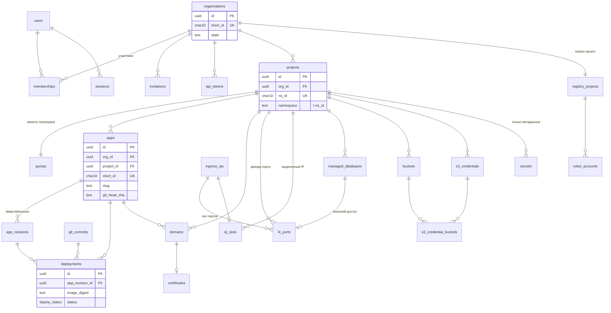
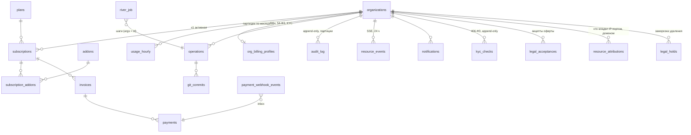

# 05. Модель данных control plane (Postgres)

> Статус: черновик. Полный DDL базы `paas` control plane: сущности, индексы, ограничения, политика хранения.

## TL;DR

- **Postgres `paas` — источник истины** (D3): всё, из чего пересобирается git тенантов, и всё, чего нет больше нигде (пользователи, биллинг, аудит). Схема `paas`, 11 файлов goose, River — в той же схеме своими миграциями. **DDL проверен прогоном**: все блоки §5 применены на PostgreSQL 17.9 без ошибок, 24 поведенческие проверки инвариантов (32 утверждения) прошли под реальными ролями, прогон нашёл и закрыл три дефекта схемы (§5.11). Минимальная версия — 17.
- **Ключ тенанта `org_id` в каждой таблице** + составные FK `(project_id, org_id) → projects(id, org_id)`: связать объект одной организации с объектом другой невозможно на уровне схемы, а не только кода.
- **ID**: UUIDv7 через `paas.new_id()` (не зависит от версии PG; keyset-пагинация по одному `id`); короткие `[a-z0-9]{10}` для namespace, путей git, hostname'ов и ключей Vault — никогда не переиспользуются.
- **RLS — да, только для `paas_api`**: fail-closed (нет контекста — нет строк), `WITH CHECK` против вставки в чужую организацию, узкие `SECURITY DEFINER`-входы там, где организация ещё неизвестна (сессия, API-токен, upsert пользователя, аренда L4-порта). Worker и provisioner — `BYPASSRLS`; у API нет `DELETE` на таблицах ресурсов; пятая роль `paas_legal` видит только юридический контур.
- **Инварианты живут в схеме**: ≥ 1 owner (отложенный триггер с блокировкой строки организации), один незавершённый deployment на приложение, одна активная операция на объект (повтор → `rerun`, а не вторая операция), глобально уникальный *подтверждённый* домен при нескольких неподтверждённых заявках (защита от сквоттинга), пул L4-портов с `PRIMARY KEY (ip, port)` + аренда `SKIP LOCKED` + карантин 7 дней ([08](08-svc-ingress-domains-ip.md) §9.2), префикс бакета привязан к своему проекту.
- **Решения оркестратора закреплены схемой, а не комментариями**: тома БД тенантов — только `lnstr-tenant-*` (CHECK, R-SC); `limits.cpu = 4 × requests` — генерируемая колонка (R-QUOTA); `USER` образа хранится в `deployments.image_user` для `Harden()` (R-UID); «корзина» 7 дней (`purge_after` у проектов, БД и App).
- **Иммутабельность**: `app_revisions`, `audit_log`, `kyc_checks`, `legal_acceptances` — триггер + `REVOKE`; тарифы заморожены (новая цена = новая версия тарифа). Digest образа — в `deployments`, не в ревизии: откат идёт по digest'у, а не по перерезолву тега.
- **Значений секретов в БД нет**: пути Vault по раскладке [12](12-svc-secrets.md) (`u/` — пользовательские, `sys/` — платформенные, зону проверяет CHECK), имена ключей; токены — `sha256`; ответы идемпотентности с секретом хранятся без него.
- **Юридический контур (§5.10, по [16](16-legal-ru.md))**: KYC-гейт на создание проекта (406-ФЗ), append-only история проверок и акцептов, `resource_attributions` с EXCLUDE — ответ на «кому принадлежал IP:порт или домен в момент T», `legal_holds` останавливают любое удаление.
- **Outbox не нужен**: River `InsertTx` для побочных эффектов, `resource_events` + `NOTIFY` для SSE, inbox `payment_webhook_events` для входящих вебхуков (статус платежа перезапрашивается у провайдера).
- **Хранение**: `audit_log` и `usage_hourly` — месячные партиции (первые создаёт миграция); аудит 13 месяцев в БД + 3 года в архиве S3 с дневной цепочкой хэшей; KYC — 1 год после договора; сроки бухгалтерии и атрибуций — ⚠️ юрист/бухгалтер; бэкап `paas-db` вне кластера — решение владельца.
- **Открытый конфликт**: [02](02-tenancy-and-isolation.md) §1.1 привязывает тариф к Project, а §5.8 — к организации (одна живая подписка). Дельта-миграция описана в §8 п.7; решить до первой миграции в прод.

## 1. Принципы модели

1. **Postgres — источник истины (D3).** Git и объекты k8s — проекции. Всё, что нужно, чтобы с нуля перегенерировать репозиторий организации (rehydrate), лежит в БД: ревизии, deployments с digest'ами, домены, ссылки на секреты. Обратное неверно: из git БД не восстанавливается (биллинг, пользователи, аудит есть только здесь) — поэтому бэкап этой базы важнее бэкапа git ([04](04-control-plane-go.md) §18).
2. **Ключ тенанта — `org_id`** (Organization = тенант и плательщик по D2; в брифе — `tenant_id`). Он есть в **каждой** таблице, принадлежащей тенанту, даже когда выводится через `project_id`. Связи внутри тенанта — составными FK `(project_id, org_id) → projects(id, org_id)`: приложение физически не может сослаться на проект другой организации, даже при баге в коде.
3. **Идентификаторы.** Первичные ключи — UUIDv7 (`paas.new_id()`): монотонны по времени → keyset-пагинация по одному `id`, локальность B-tree. Короткие публичные ID `[a-z0-9]{10}` (`organizations.short_id`, `projects.ns_id`, `apps.short_id`, `managed_databases.short_id`) — для имён namespace, путей в git, hostname'ов; генерируются в Go из `crypto/rand`, **никогда не переиспользуются** (полный `UNIQUE`, не партиальный): остатки удалённого проекта в Vault/S3/git не должны достаться новому.
4. **Soft delete.** `deleted_at` + `purge_after`; уникальность пользовательских имён — партиальными индексами `WHERE deleted_at IS NULL`. Физическое удаление строк ресурсов — только retention-функциями владельца. У роли `paas_api` нет `DELETE` ни на одной таблице ресурсов; `DELETE` есть только на связочных и эфемерных (`memberships`, `s3_credential_buckets`, `idempotency_keys`, `oidc_login_tx`).
5. **Типы.** Время — `timestamptz` (UTC). Деньги — `bigint` в копейках + `currency char(3)`; никаких `float`/`numeric` для сумм. Стабильные множества — `ENUM` (эволюция только `ALTER TYPE … ADD VALUE`, удаление значения — новая миграция с новым типом).
6. **Иммутабельность там, где это смысл сущности:** `app_revisions` (ревизия = снимок намерения), `audit_log` (append-only). Триггер + `REVOKE UPDATE, DELETE` — двойная защита.
7. **Значений секретов в БД нет.** Секреты — пути Vault и имена ключей; токены — `sha256`; refresh-токены Zitadel в сессиях — AES-GCM с `key_id`; платёжные методы — токен провайдера и маска карты.
8. **Пять ролей БД**: `paas_owner` (владеет объектами, только миграции и retention), `paas_api` (под RLS, без `DELETE`, точечные column-grants), `paas_worker` и `paas_provisioner` (`BYPASSRLS`, гранты по нужде), `paas_legal` (чтение юридического контура и ведение legal hold — только админка владельца, §5.10). Все объекты — в схеме `paas`, туда же River.

## 2. ER-диаграмма

Две диаграммы: ресурсы тенанта и биллинг/служебное. Колонки — только ключевые; полный состав — в DDL §5.





## 3. Решение по RLS

**Решение: RLS — да, но прицельно: только для роли `paas_api`** (интернет-facing процесс). Worker и provisioner работают с ролями `BYPASSRLS`.

**Почему да.** Главная уязвимость мультитенантных API — BOLA (OWASP API1:2023): эндпоинт, в котором забыли `AND org_id = $1`. Первый слой — `org_id` в каждом sqlc-запросе и проверка членства в middleware ([04](04-control-plane-go.md) §7.3). RLS — второй, независимый: даже запрос без фильтра под ролью `paas_api` видит только строки организации из контекста. Ошибка превращается из утечки в пустой ответ (`404`). Для платформы, где безопасность — главный критерий владельца, цена (одна функция, по политике на таблицу, `set_config` в начале транзакции) несопоставимо меньше выигрыша.

**Почему не для всех ролей.** Worker и provisioner по природе межтенантные (метеринг, drift detector, dunning, observer), их вход — ID из заданий, а не пользовательский HTTP; RLS там дал бы в основном обходные SECURITY DEFINER-функции. Остаточный риск «скомпрометированный API кладёт задания про чужие объекты» закрыт иначе: исполнитель перечитывает объект и его `org_id` из БД, разрушительные шаги требуют intent-proof ([04](04-control-plane-go.md) §7.1, §9.1).

**Механика.**

```sql
-- Контекст ставится В НАЧАЛЕ КАЖДОЙ транзакции paas_api (третий аргумент true = только на транзакцию,
-- безопасно при пуле соединений):
--   SELECT set_config('paas.org_id', $1, true), set_config('paas.user_id', $2, true);
CREATE FUNCTION paas.current_org_id() RETURNS uuid LANGUAGE sql STABLE AS
$$ SELECT nullif(current_setting('paas.org_id', true), '')::uuid $$;
CREATE FUNCTION paas.current_user_id() RETURNS uuid LANGUAGE sql STABLE AS
$$ SELECT nullif(current_setting('paas.user_id', true), '')::uuid $$;

-- Типовая политика на таблицу тенанта:
ALTER TABLE paas.apps ENABLE ROW LEVEL SECURITY;
CREATE POLICY tenant_isolation ON paas.apps TO paas_api
  USING (org_id = paas.current_org_id())
  WITH CHECK (org_id = paas.current_org_id());
```

Свойства, на которые опираемся:
- **Fail closed.** Контекст не выставлен (код забыл транзакцию) → `current_org_id()` = `NULL` → `org_id = NULL` ложно → 0 строк.
- **Стоимость.** `STABLE`-функция вычисляется один раз на запрос и участвует в индексном условии; все индексы тенантских таблиц начинаются с `org_id`. ⚠️ проверить `EXPLAIN (ANALYZE)` ключевых запросов под ролью `paas_api` на объёме ~1000 организаций — ожидается Index Scan без Filter по всей таблице.
- **Запросы до контекста.** Аутентификация происходит раньше, чем известна организация: поиск сессии по хэшу cookie, API-токена по хэшу, приглашения по токену, список организаций пользователя. Это `SECURITY DEFINER`-функции владельца с узким результатом (`paas.auth_lookup_session`, `paas.auth_lookup_api_token`, `paas.invitation_lookup`) и политика на `memberships`: `org_id = current_org_id() OR user_id = current_user_id()`.
- **`WITH CHECK`** не даёт вставить или «перенести» строку в чужую организацию.

**Что RLS не решает** (и чем закрыто): доступ внутри своей организации по ролям (owner/developer) — middleware; утечку через ошибки и тайминги — единый ответ `404`; межтенантные таблицы без `org_id` (`plans`, `ingress_ips`, пул `l4_ports` в свободном состоянии) — отдельные политики или только `SELECT` на справочники.

**Тест, без которого RLS — декорация:** для каждого sqlc-запроса — прогон под ролью `paas_api` с контекстом организации B над данными организации A, ожидание — 0 строк / 0 изменённых. Генерируется из `db/queries/*.sql` ([04](04-control-plane-go.md) §17).

## 4. Миграции goose и соглашения

| Правило | Как |
|---|---|
| Инструмент | `pressly/goose` v3, SQL-файлы `db/migrations/NNNNN_<name>.sql` (`-- +goose Up` / `-- +goose Down`, функции внутри `StatementBegin/End`), встроены в бинарь через `embed.FS` |
| Кто применяет | Job фазы `migrate` компонента `paas-control-plane` ([04](04-control-plane-go.md) §18): `paas-worker migrate up` под ролью `paas_owner`. Прикладные роли DDL-прав не имеют. После goose — миграции River (`rivermigrate`, та же команда) |
| Блокировка | goose session locker (advisory lock) — два Job'а не применят миграции параллельно |
| Совместимость | **expand → migrate → contract**: миграция релиза N обязана работать с бинарём N-1 (раскат `--atomic` может откатить поды, но не схему). Удаление колонки — только через релиз после того, как код перестал её читать |
| Долгие блокировки | каждая миграция начинается с `SET lock_timeout = '5s'`; индексы на живых таблицах — `CREATE INDEX CONCURRENTLY` в файле с `-- +goose NO TRANSACTION`; `NOT NULL` на существующей колонке — через `CHECK … NOT VALID` + `VALIDATE CONSTRAINT` |
| Линт | `squawk` в CI (ловит блокирующие `ALTER`, индексы без `CONCURRENTLY`, смену типов) |
| Неизменяемость истории | CI падает, если в MR изменён уже существующий файл миграции (`git diff --diff-filter=M main -- db/migrations` должен быть пуст) |
| Down-миграции | пишутся (нужны для локальной разработки и тестов), в проде не применяются: откат — это новая forward-миграция |
| Партиции | первые — миграцией `00010`, до первой записи (иначе строки текущего месяца лягут в DEFAULT); дальше periodic `db.partitions.ensure` создаёт месячные партиции `audit_log`, `usage_hourly` на 3 месяца вперёд (+ DEFAULT-партиция как страховка) |

## 5. DDL

### 5.1 Расширения, схема, enum-типы, общие функции

Каждый подраздел §5.1–§5.9 — отдельный файл миграции (`00001_…` … `00009_…`), в §5.9 же — `00010_security.sql`, в §5.10 — `00011_legal.sql`; FK на таблицы из более поздних файлов добавляются `ALTER TABLE` в том файле, где появляется цель. Роли создаёт CNPG (`managed.roles`), миграции только выдают гранты (§5.9).

```sql
-- db/migrations/00001_base.sql
-- +goose Up
SET lock_timeout = '5s';
CREATE SCHEMA IF NOT EXISTS paas AUTHORIZATION paas_owner;
SET search_path = paas;

-- UUIDv7 (RFC 9562) для любой мажорной версии PG ≥ 13: 48 бит unix-ms + версия 7 + случайность.
-- Трюк: gen_random_uuid() даёт версию 0100; установка битов 52 и 53 превращает её в 0111.
-- На PG 18 эквивалент — встроенная uuidv7(); функция-обёртка оставляет схему независимой от версии.
-- +goose StatementBegin
CREATE FUNCTION paas.new_id() RETURNS uuid LANGUAGE sql VOLATILE AS $$
  SELECT encode(
           set_bit(set_bit(
             overlay(uuid_send(gen_random_uuid())
                     PLACING substring(int8send(floor(extract(epoch FROM clock_timestamp()) * 1000)::bigint) FROM 3)
                     FROM 1 FOR 6),
           52, 1), 53, 1),
         'hex')::uuid
$$;
-- +goose StatementEnd

-- Контекст RLS (§3)
CREATE FUNCTION paas.current_org_id() RETURNS uuid LANGUAGE sql STABLE AS
$$ SELECT nullif(current_setting('paas.org_id', true), '')::uuid $$;
CREATE FUNCTION paas.current_user_id() RETURNS uuid LANGUAGE sql STABLE AS
$$ SELECT nullif(current_setting('paas.user_id', true), '')::uuid $$;

-- +goose StatementBegin
CREATE FUNCTION paas.touch_updated_at() RETURNS trigger LANGUAGE plpgsql AS $$
BEGIN
  NEW.updated_at := now();
  RETURN NEW;
END $$;

-- Иммутабельные таблицы: UPDATE/DELETE запрещены всем; retention-задание владельца
-- удаляет строки, выставив SET LOCAL paas.allow_purge = 'on'.
CREATE FUNCTION paas.forbid_mutation() RETURNS trigger LANGUAGE plpgsql AS $$
BEGIN
  IF TG_OP = 'DELETE' AND current_user = 'paas_owner'
     AND current_setting('paas.allow_purge', true) = 'on' THEN
    RETURN OLD;
  END IF;
  RAISE EXCEPTION '% on %.% is forbidden: table is immutable', TG_OP, TG_TABLE_SCHEMA, TG_TABLE_NAME
    USING ERRCODE = 'P0002';
END $$;
-- +goose StatementEnd

CREATE TYPE member_role     AS ENUM ('owner', 'admin', 'developer', 'viewer', 'billing');
CREATE TYPE lifecycle_state AS ENUM ('pending', 'provisioning', 'ready', 'updating', 'suspended', 'failed', 'deleting', 'deleted');
CREATE TYPE token_kind      AS ENUM ('personal', 'org');
CREATE TYPE op_status       AS ENUM ('queued', 'running', 'succeeded', 'failed', 'compensating', 'compensated', 'cancelled');
CREATE TYPE deploy_status   AS ENUM ('pending', 'committed', 'syncing', 'progressing', 'healthy', 'failed', 'superseded', 'rolled_back');
CREATE TYPE sync_status     AS ENUM ('pending', 'synced', 'out_of_sync', 'failed', 'unknown');
CREATE TYPE domain_kind     AS ENUM ('platform', 'custom');
CREATE TYPE domain_status   AS ENUM ('pending_verification', 'verified', 'active', 'failed', 'dangling', 'released');
CREATE TYPE cert_status     AS ENUM ('pending', 'issuing', 'ready', 'failed', 'expiring');
CREATE TYPE cert_mode       AS ENUM ('platform_wildcard', 'http01', 'cloudflare_origin', 'http_only_cf');
CREATE TYPE db_engine       AS ENUM ('postgres', 'valkey', 'nats');
CREATE TYPE robot_kind      AS ENUM ('push', 'pull');
CREATE TYPE port_status     AS ENUM ('free', 'allocated', 'cooldown', 'reserved_platform');
CREATE TYPE sub_status      AS ENUM ('trialing', 'active', 'past_due', 'grace', 'suspended', 'cancelled', 'terminated');
CREATE TYPE payment_status  AS ENUM ('pending', 'waiting_for_capture', 'succeeded', 'cancelled', 'refunded', 'failed');
CREATE TYPE invoice_status  AS ENUM ('draft', 'open', 'paid', 'void', 'uncollectible');
CREATE TYPE actor_kind      AS ENUM ('user', 'api_token', 'system', 'staff');

-- +goose Down
DROP SCHEMA paas CASCADE;
```

### 5.2 Identity: organizations, users, memberships, invitations, api_tokens

```sql
-- db/migrations/00002_identity.sql
-- +goose Up
SET lock_timeout = '5s';
SET search_path = paas;

CREATE TABLE organizations (
  id                uuid PRIMARY KEY DEFAULT paas.new_id(),
  short_id          text NOT NULL UNIQUE CHECK (short_id ~ '^[a-z0-9]{10}$'),   -- репо o-<short_id>, Harbor o-<short_id>
  slug              text NOT NULL CHECK (slug ~ '^[a-z]([a-z0-9-]{1,38}[a-z0-9])$'),
  display_name      text NOT NULL CHECK (length(display_name) BETWEEN 1 AND 100),
  state             lifecycle_state NOT NULL DEFAULT 'pending',
  suspended_at      timestamptz,
  suspend_reason    text CHECK (suspend_reason IN ('non_payment', 'abuse', 'legal', 'owner_request')),
  gitlab_project_id bigint UNIQUE,
  argocd_project    text GENERATED ALWAYS AS ('o-' || short_id) STORED,           -- AppProject o-<short_id> в argocd-tenants (06)
  created_at        timestamptz NOT NULL DEFAULT now(),
  updated_at        timestamptz NOT NULL DEFAULT now(),
  deleted_at        timestamptz,
  terminated_at     timestamptz              -- прекращение договора: отсчёт срока хранения данных клиента
);
CREATE UNIQUE INDEX organizations_slug_uq ON organizations (slug) WHERE deleted_at IS NULL;
CREATE TRIGGER organizations_touch BEFORE UPDATE ON organizations FOR EACH ROW EXECUTE FUNCTION paas.touch_updated_at();

-- ПДн и требования 54-ФЗ / 406-ФЗ отдельно: узкий круг читателей, свой срок хранения (§7, 16-legal-ru.md).
CREATE TABLE org_billing_profiles (
  org_id          uuid PRIMARY KEY REFERENCES organizations (id),
  customer_type   text NOT NULL CHECK (customer_type IN ('individual', 'sole_proprietor', 'legal_entity')),
  legal_name      text CHECK (length(legal_name) <= 300),
  inn             text CHECK (inn ~ '^([0-9]{10}|[0-9]{12})$'),
  kpp             text CHECK (kpp ~ '^[0-9]{9}$'),
  receipt_email   text CHECK (receipt_email = lower(receipt_email)),
  receipt_phone   text CHECK (receipt_phone ~ '^\+[0-9]{10,15}$'),
  kyc_status      text NOT NULL DEFAULT 'none' CHECK (kyc_status IN ('none', 'pending', 'verified', 'rejected')),
  kyc_method      text CHECK (kyc_method IN ('gosuslugi', 'ukep', 'bank_card_ru', 'phone_ru', 'in_person')),
  kyc_reference   text CHECK (length(kyc_reference) <= 200),   -- ID проверки у провайдера; сканы документов НЕ храним
  kyc_verified_at timestamptz,
  retain_until    timestamptz,                                  -- terminated_at + срок по закону (⚠️ юрист)
  updated_at      timestamptz NOT NULL DEFAULT now(),
  CHECK (customer_type = 'individual' OR inn IS NOT NULL),
  CHECK (receipt_email IS NOT NULL OR receipt_phone IS NOT NULL),
  CHECK (kyc_status <> 'verified' OR (kyc_method IS NOT NULL AND kyc_verified_at IS NOT NULL))
);

CREATE TABLE users (
  id             uuid PRIMARY KEY DEFAULT paas.new_id(),
  zitadel_sub    text NOT NULL UNIQUE,              -- sub customer-инстанса Zitadel; email не уникален (соц-логины)
  email          text NOT NULL CHECK (email = lower(email) AND length(email) <= 254),
  email_verified boolean NOT NULL DEFAULT false,
  display_name   text CHECK (length(display_name) <= 100),
  locale         text NOT NULL DEFAULT 'ru' CHECK (locale IN ('ru', 'en')),
  created_at     timestamptz NOT NULL DEFAULT now(),
  last_login_at  timestamptz,
  deleted_at     timestamptz,
  anonymized_at  timestamptz                         -- email/имя затёрты по истечении срока хранения
);
CREATE INDEX users_email_idx ON users (email);

CREATE TABLE memberships (
  org_id     uuid NOT NULL REFERENCES organizations (id),
  user_id    uuid NOT NULL REFERENCES users (id),
  role       member_role NOT NULL,
  invited_by uuid REFERENCES users (id),
  created_at timestamptz NOT NULL DEFAULT now(),
  updated_at timestamptz NOT NULL DEFAULT now(),
  PRIMARY KEY (org_id, user_id)
);
CREATE INDEX memberships_user_idx ON memberships (user_id);

-- Инвариант «≥ 1 owner». Блокировка строки организации сериализует конкурентные разжалования
-- (без неё две транзакции, снимающие двух разных owner'ов, обе увидели бы «второй ещё есть»).
-- +goose StatementBegin
CREATE FUNCTION paas.ensure_owner_remains() RETURNS trigger
LANGUAGE plpgsql SECURITY DEFINER SET search_path = paas AS $$
DECLARE
  v_org uuid := OLD.org_id;
BEGIN
  PERFORM 1 FROM organizations WHERE id = v_org FOR UPDATE;
  IF EXISTS (SELECT 1 FROM organizations WHERE id = v_org AND state <> 'deleted')
     AND NOT EXISTS (SELECT 1 FROM memberships WHERE org_id = v_org AND role = 'owner') THEN
    RAISE EXCEPTION 'organization % must keep at least one owner', v_org USING ERRCODE = 'P0001';
  END IF;
  RETURN NULL;
END $$;

-- Personal-токены умирают вместе с членством.
CREATE FUNCTION paas.revoke_tokens_on_leave() RETURNS trigger
LANGUAGE plpgsql SECURITY DEFINER SET search_path = paas AS $$
BEGIN
  UPDATE api_tokens SET revoked_at = now()
   WHERE org_id = OLD.org_id AND user_id = OLD.user_id AND kind = 'personal' AND revoked_at IS NULL;
  RETURN NULL;
END $$;
-- +goose StatementEnd

CREATE CONSTRAINT TRIGGER memberships_owner_guard
  AFTER UPDATE OR DELETE ON memberships DEFERRABLE INITIALLY DEFERRED
  FOR EACH ROW EXECUTE FUNCTION paas.ensure_owner_remains();

CREATE TABLE invitations (
  id          uuid PRIMARY KEY DEFAULT paas.new_id(),
  org_id      uuid NOT NULL REFERENCES organizations (id),
  email       text NOT NULL CHECK (email = lower(email) AND length(email) <= 254),
  role        member_role NOT NULL CHECK (role <> 'owner'),     -- owner — только передачей владения
  token_hash  bytea NOT NULL UNIQUE CHECK (length(token_hash) = 32),
  invited_by  uuid NOT NULL REFERENCES users (id),
  created_at  timestamptz NOT NULL DEFAULT now(),
  expires_at  timestamptz NOT NULL,
  accepted_at timestamptz,
  accepted_by uuid REFERENCES users (id),
  revoked_at  timestamptz,
  CHECK (expires_at > created_at AND expires_at <= created_at + interval '14 days'),
  CHECK (accepted_at IS NULL OR revoked_at IS NULL)
);
CREATE UNIQUE INDEX invitations_open_uq ON invitations (org_id, email) WHERE accepted_at IS NULL AND revoked_at IS NULL;

-- BFF-сессии (04 §7.1). В cookie — случайные 32 байта, здесь — только их sha256.
CREATE TABLE sessions (
  id_hash             bytea PRIMARY KEY CHECK (length(id_hash) = 32),
  user_id             uuid NOT NULL REFERENCES users (id),
  zitadel_sid         text,
  auth_time           timestamptz NOT NULL,
  amr                 text[] NOT NULL DEFAULT '{}',
  tokens_enc          bytea NOT NULL,                  -- AES-256-GCM(refresh/access/id_token)
  tokens_key_id       text NOT NULL,
  access_expires_at   timestamptz NOT NULL,
  idle_expires_at     timestamptz NOT NULL,
  absolute_expires_at timestamptz NOT NULL,
  ip                  inet,
  user_agent          text CHECK (length(user_agent) <= 512),
  created_at          timestamptz NOT NULL DEFAULT now(),
  last_seen_at        timestamptz NOT NULL DEFAULT now(),
  revoked_at          timestamptz,
  CHECK (absolute_expires_at <= created_at + interval '12 hours')   -- «запомнить меня» — фаза 2, отдельная таблица
);
CREATE INDEX sessions_user_idx ON sessions (user_id) WHERE revoked_at IS NULL;
CREATE INDEX sessions_zitadel_sid_idx ON sessions (zitadel_sid) WHERE revoked_at IS NULL;   -- back-channel logout
CREATE INDEX sessions_expiry_idx ON sessions (absolute_expires_at);

CREATE TABLE oidc_login_tx (
  state_hash    bytea PRIMARY KEY CHECK (length(state_hash) = 32),
  nonce         text NOT NULL,
  code_verifier text NOT NULL,
  return_to     text NOT NULL CHECK (return_to ~ '^/([^/\\].*)?$' AND length(return_to) <= 1024),  -- только относительный путь
  intent_id     uuid,                                  -- step-up под конкретное действие
  created_at    timestamptz NOT NULL DEFAULT now(),
  expires_at    timestamptz NOT NULL DEFAULT now() + interval '10 minutes'
);

-- Намерение для необратимых действий (04 §7.1): nonce = sha256(intent.id), proof проверяет исполнитель шага.
CREATE TABLE intents (
  id          uuid PRIMARY KEY DEFAULT paas.new_id(),
  org_id      uuid NOT NULL REFERENCES organizations (id),
  user_id     uuid NOT NULL REFERENCES users (id),
  action      text NOT NULL CHECK (action IN ('project.delete', 'db.delete', 'storage.delete', 'org.delete',
                                             'db.reveal', 'storage.reveal', 'org.transfer_ownership')),
  target_id   uuid NOT NULL,
  proof_jwt   text,                                    -- сырой id_token после step-up
  created_at  timestamptz NOT NULL DEFAULT now(),
  expires_at  timestamptz NOT NULL DEFAULT now() + interval '10 minutes',
  consumed_at timestamptz
);
CREATE INDEX intents_org_idx ON intents (org_id, id DESC);

CREATE TABLE api_tokens (
  id           uuid PRIMARY KEY DEFAULT paas.new_id(),
  org_id       uuid NOT NULL REFERENCES organizations (id),
  kind         token_kind NOT NULL,
  user_id      uuid REFERENCES users (id),
  name         text NOT NULL CHECK (length(name) BETWEEN 1 AND 64),
  prefix       text NOT NULL CHECK (prefix ~ '^paas_[po]_[0-9A-Za-z]{5}$'),
  token_hash   bytea NOT NULL UNIQUE CHECK (length(token_hash) = 32),
  scopes       text[] NOT NULL CHECK (cardinality(scopes) > 0 AND scopes <@ ARRAY[
                 'app.read', 'app.write', 'app.deploy', 'app.logs', 'db.read', 'db.write',
                 'domain.read', 'domain.write', 'storage.read', 'storage.write',
                 'registry.read', 'registry.write', 'secret.read_meta', 'secret.write']::text[]),
  project_ids  uuid[],                                  -- NULL = все проекты организации
  role_cap     member_role NOT NULL CHECK (role_cap IN ('admin', 'developer', 'viewer')),
  created_by   uuid NOT NULL REFERENCES users (id),
  created_at   timestamptz NOT NULL DEFAULT now(),
  expires_at   timestamptz NOT NULL,
  last_used_at timestamptz,
  last_used_ip inet,
  revoked_at   timestamptz,
  revoked_by   uuid REFERENCES users (id),
  CHECK ((kind = 'personal') = (user_id IS NOT NULL)),
  CHECK (expires_at > created_at AND expires_at <= created_at + interval '366 days')
);
CREATE INDEX api_tokens_org_idx ON api_tokens (org_id, id DESC) WHERE revoked_at IS NULL;
CREATE INDEX api_tokens_expiry_idx ON api_tokens (expires_at) WHERE revoked_at IS NULL;

CREATE TRIGGER memberships_revoke_tokens AFTER DELETE ON memberships
  FOR EACH ROW EXECUTE FUNCTION paas.revoke_tokens_on_leave();
```

### 5.3 Проекты и приложения: projects, apps, app_revisions, deployments, git_commits

```sql
-- db/migrations/00003_projects_apps.sql
-- +goose Up
SET lock_timeout = '5s';
SET search_path = paas;

CREATE TABLE projects (
  id           uuid PRIMARY KEY DEFAULT paas.new_id(),
  org_id       uuid NOT NULL REFERENCES organizations (id),
  ns_id        text NOT NULL UNIQUE CHECK (ns_id ~ '^[a-z0-9]{10}$'),     -- никогда не переиспользуется
  namespace    text GENERATED ALWAYS AS ('t-' || ns_id) STORED,
  slug         text NOT NULL CHECK (slug ~ '^[a-z]([a-z0-9-]{0,30}[a-z0-9])?$'),
  display_name text NOT NULL CHECK (length(display_name) BETWEEN 1 AND 100),
  state        lifecycle_state NOT NULL DEFAULT 'pending',
  created_by   uuid REFERENCES users (id),
  created_at   timestamptz NOT NULL DEFAULT now(),
  updated_at   timestamptz NOT NULL DEFAULT now(),
  deleted_at   timestamptz,
  purge_after  timestamptz,                  -- deleted_at + 7 дней (02 §2.5): до этого удаление обратимо (приложения уже в 0 реплик)
  UNIQUE (id, org_id),
  CHECK ((deleted_at IS NULL) = (purge_after IS NULL))
);
CREATE UNIQUE INDEX projects_slug_uq ON projects (org_id, slug) WHERE deleted_at IS NULL;
CREATE INDEX projects_org_idx ON projects (org_id, id DESC) WHERE deleted_at IS NULL;
CREATE INDEX projects_purge_idx ON projects (purge_after) WHERE purge_after IS NOT NULL AND state <> 'deleted';
CREATE TRIGGER projects_touch BEFORE UPDATE ON projects FOR EACH ROW EXECUTE FUNCTION paas.touch_updated_at();

-- Доля лимитов организации, отданная проекту = содержимое ResourceQuota namespace t-<ns_id>.
-- Инвариант «сумма по проектам ≤ лимит тарифа организации» держит сервис под SELECT … FOR UPDATE строки
-- организации — межстрочный инвариант не выражается CHECK'ом.
CREATE TABLE quotas (
  project_id           uuid PRIMARY KEY,
  org_id               uuid NOT NULL,
  cpu_millicores       integer NOT NULL CHECK (cpu_millicores >= 0),                   -- requests.cpu
  cpu_limit_millicores integer GENERATED ALWAYS AS (cpu_millicores * 4) STORED,      -- limits.cpu = 4 × requests (R-QUOTA)
  memory_mib           integer NOT NULL CHECK (memory_mib >= 0),                       -- requests.memory = limits.memory (R-QUOTA)
  ephemeral_mib        integer NOT NULL CHECK (ephemeral_mib >= 0),
  storage_gib          integer NOT NULL CHECK (storage_gib >= 0),
  pods                 integer NOT NULL CHECK (pods >= 0),
  pvcs                 integer NOT NULL CHECK (pvcs >= 0),
  surge_cpu_millicores integer NOT NULL DEFAULT 0 CHECK (surge_cpu_millicores >= 0),   -- запас на maxSurge, в тариф не входит
  surge_memory_mib     integer NOT NULL DEFAULT 0 CHECK (surge_memory_mib >= 0),
  generation           bigint NOT NULL DEFAULT 1,
  applied_generation   bigint NOT NULL DEFAULT 0,       -- что provisioner применил в кластер
  updated_at           timestamptz NOT NULL DEFAULT now(),
  FOREIGN KEY (project_id, org_id) REFERENCES projects (id, org_id),
  CHECK (applied_generation <= generation)
);
CREATE INDEX quotas_pending_idx ON quotas (project_id) WHERE applied_generation < generation;

CREATE TABLE apps (
  id                  uuid PRIMARY KEY DEFAULT paas.new_id(),
  org_id              uuid NOT NULL,
  project_id          uuid NOT NULL,
  short_id            text NOT NULL UNIQUE CHECK (short_id ~ '^[a-z0-9]{10}$'),    -- путь в git, <short_id>.cname.<apps-domain>
  slug                text NOT NULL CHECK (slug ~ '^[a-z]([a-z0-9-]{0,28}[a-z0-9])?$'),   -- неизменяем: в hostname
  display_name        text CHECK (length(display_name) <= 64),
  state               lifecycle_state NOT NULL DEFAULT 'pending',
  desired_revision_id uuid,
  live_revision_id    uuid,
  git_head_sha        text CHECK (git_head_sha ~ '^[0-9a-f]{40}([0-9a-f]{24})?$'),  -- замок директории (04 §11)
  runtime_status      jsonb NOT NULL DEFAULT '{}' CHECK (jsonb_typeof(runtime_status) = 'object'),  -- пишет observer
  runtime_observed_at timestamptz,
  created_by          uuid REFERENCES users (id),
  created_at          timestamptz NOT NULL DEFAULT now(),
  updated_at          timestamptz NOT NULL DEFAULT now(),
  deleted_at          timestamptz,
  purge_after         timestamptz,              -- deleted_at + 7 дней: «корзина» тома App (R-SC); NULL — удалять нечего
  UNIQUE (id, org_id),
  FOREIGN KEY (project_id, org_id) REFERENCES projects (id, org_id),
  CHECK (purge_after IS NULL OR deleted_at IS NOT NULL)
);
CREATE UNIQUE INDEX apps_slug_uq ON apps (project_id, slug) WHERE deleted_at IS NULL;
CREATE INDEX apps_project_idx ON apps (org_id, project_id, id DESC) WHERE deleted_at IS NULL;
CREATE TRIGGER apps_touch BEFORE UPDATE ON apps FOR EACH ROW EXECUTE FUNCTION paas.touch_updated_at();

-- Ревизия = иммутабельный снимок намерения пользователя. Конкретный digest образа — в deployments:
-- одна ревизия с тегом может быть развёрнута в разные digest'ы, откат идёт по digest'у deployment'а.
CREATE TABLE app_revisions (
  id               uuid PRIMARY KEY DEFAULT paas.new_id(),
  org_id           uuid NOT NULL,
  app_id           uuid NOT NULL,
  revision         integer NOT NULL CHECK (revision > 0),
  spec             jsonb NOT NULL CHECK (jsonb_typeof(spec) = 'object' AND pg_column_size(spec) <= 262144),
  spec_version     smallint NOT NULL DEFAULT 1,
  spec_hash        bytea NOT NULL CHECK (length(spec_hash) = 32),      -- sha256 канонического JSON: одинаковый PATCH = без новой ревизии
  image_ref        text NOT NULL CHECK (length(image_ref) <= 512),      -- уже переписанный на Harbor
  created_via      text NOT NULL CHECK (created_via IN ('ui', 'api', 'system_rollback', 'system_suspend', 'system_rehydrate')),
  created_by       uuid REFERENCES users (id),
  created_by_token uuid REFERENCES api_tokens (id),
  created_at       timestamptz NOT NULL DEFAULT now(),
  UNIQUE (app_id, revision),
  UNIQUE (id, app_id),
  FOREIGN KEY (app_id, org_id) REFERENCES apps (id, org_id)
);
CREATE TRIGGER app_revisions_immutable BEFORE UPDATE OR DELETE ON app_revisions
  FOR EACH ROW EXECUTE FUNCTION paas.forbid_mutation();

-- Составные FK: desired/live ревизия обязана принадлежать ЭТОМУ приложению.
ALTER TABLE apps
  ADD CONSTRAINT apps_desired_rev_fk FOREIGN KEY (desired_revision_id, id) REFERENCES app_revisions (id, app_id),
  ADD CONSTRAINT apps_live_rev_fk    FOREIGN KEY (live_revision_id, id)    REFERENCES app_revisions (id, app_id);

-- Журнал наших коммитов в репозитории организаций. parent_sha даёт порядок и ответ на «содержит ли
-- ревизия ArgoCD наш коммит» без похода в GitLab (04 §12).
CREATE TABLE git_commits (
  sha              text PRIMARY KEY CHECK (sha ~ '^[0-9a-f]{40}([0-9a-f]{24})?$'),
  org_id           uuid NOT NULL REFERENCES organizations (id),
  repo_project_id  bigint NOT NULL,
  parent_sha       text,
  target_kind      text NOT NULL CHECK (target_kind IN ('app', 'database', 'bulk')),
  target_id        uuid,
  operation_id     uuid,                                -- FK добавляется в 00009
  render_hash      bytea CHECK (length(render_hash) = 32),
  renderer_version text NOT NULL,
  adopted          boolean NOT NULL DEFAULT false,      -- коммит найден по _meta.json после потерянного ответа
  sync_status      sync_status NOT NULL DEFAULT 'pending',
  synced_at        timestamptz,
  created_at       timestamptz NOT NULL DEFAULT now(),
  CHECK ((target_kind = 'bulk') = (target_id IS NULL))
);
CREATE INDEX git_commits_repo_idx ON git_commits (repo_project_id, created_at DESC);
CREATE INDEX git_commits_target_idx ON git_commits (target_id, created_at DESC) WHERE target_id IS NOT NULL;
CREATE INDEX git_commits_pending_idx ON git_commits (repo_project_id) WHERE sync_status = 'pending';

CREATE TABLE deployments (
  id                 uuid PRIMARY KEY DEFAULT paas.new_id(),
  org_id             uuid NOT NULL,
  app_id             uuid NOT NULL,
  app_revision_id    uuid NOT NULL,
  reason             text NOT NULL CHECK (reason IN ('create', 'deploy', 'config', 'scale', 'restart',
                                                     'rollback', 'suspend', 'resume', 'rehydrate')),
  status             deploy_status NOT NULL DEFAULT 'pending',
  image_digest       text CHECK (image_digest ~ '^sha256:[0-9a-f]{64}$'),
  image_user         text CHECK (length(image_user) <= 256),   -- USER из конфига образа по digest: вход Harden() (R-UID, 04 §10)
  operation_id       uuid,                                -- FK добавляется в 00009
  git_commit_sha     text REFERENCES git_commits (sha),
  rollback_of        uuid REFERENCES deployments (id),
  error_code         text CHECK (length(error_code) <= 64),
  error_detail       text CHECK (length(error_detail) <= 4096),
  requested_by       uuid REFERENCES users (id),
  requested_by_token uuid REFERENCES api_tokens (id),
  created_at         timestamptz NOT NULL DEFAULT now(),
  committed_at       timestamptz,
  synced_at          timestamptz,
  healthy_at         timestamptz,
  finished_at        timestamptz,
  FOREIGN KEY (app_id, org_id) REFERENCES apps (id, org_id),
  FOREIGN KEY (app_revision_id, app_id) REFERENCES app_revisions (id, app_id),
  CHECK (status NOT IN ('committed', 'syncing', 'progressing', 'healthy')
         OR (image_digest IS NOT NULL AND git_commit_sha IS NOT NULL)),
  CHECK (status <> 'rolled_back' OR finished_at IS NOT NULL)
);
CREATE INDEX deployments_app_idx ON deployments (org_id, app_id, id DESC);
-- Сериализация деплоев приложения на уровне схемы: не более одного незавершённого.
CREATE UNIQUE INDEX deployments_one_inflight_uq ON deployments (app_id)
  WHERE status IN ('pending', 'committed', 'syncing', 'progressing');
```

### 5.4 Сеть: domains, certificates, l4_ports, ip_slots

Инвентарь IP-адресов bastion и IP-слотов — **платформа** (ansible, D5): список приезжает в конфиг backend из `hosts-vars`, periodic-задание worker'а сверяет его с БД (добавляет новое, помечает исчезнувшее; строки с активной арендой не удаляет — алерт). Аренды — **только** в БД.

```sql
-- db/migrations/00004_network.sql
-- +goose Up
SET lock_timeout = '5s';
SET search_path = paas;

CREATE TABLE ingress_ips (
  ip         inet PRIMARY KEY,
  kind       text NOT NULL CHECK (kind IN ('shared', 'dedicated')),
  bastion    text NOT NULL,                        -- хост группы bastion_proxy из inventory
  active     boolean NOT NULL DEFAULT true,
  created_at timestamptz NOT NULL DEFAULT now()
);

-- Пул L4-портов предзаполнен из конфига bastion (сейчас 20000–22000 = 2001 строка на общий IP) → UNIQUE(ip, port) — первичный ключ,
-- а аренда — UPDATE свободной строки через SKIP LOCKED (§6). Порты, занятые платформой
-- (NodePort'ы Traefik и т.п.), помечаются reserved_platform из конфига.
CREATE TABLE l4_ports (
  ip             inet NOT NULL REFERENCES ingress_ips (ip),
  port           integer NOT NULL CHECK (port BETWEEN 1024 AND 65535),   -- фактический диапазон задаёт hosts-vars bastion
  status         port_status NOT NULL DEFAULT 'free',
  org_id         uuid REFERENCES organizations (id),
  project_id     uuid,
  target_kind    text CHECK (target_kind IN ('app', 'database')),
  target_id      uuid,
  allocated_at   timestamptz,
  cooldown_until timestamptz,                       -- карантин 7 дней после освобождения (08 §9.2): старый клиент не попадёт в чужую БД
  PRIMARY KEY (ip, port),
  FOREIGN KEY (project_id, org_id) REFERENCES projects (id, org_id),
  CHECK ((status = 'allocated') = (org_id IS NOT NULL AND project_id IS NOT NULL AND target_id IS NOT NULL)),
  CHECK (status <> 'cooldown' OR cooldown_until IS NOT NULL)
);
CREATE UNIQUE INDEX l4_ports_target_uq ON l4_ports (target_kind, target_id) WHERE status = 'allocated';
CREATE INDEX l4_ports_free_idx ON l4_ports (port) WHERE status = 'free';
CREATE INDEX l4_ports_org_idx ON l4_ports (org_id) WHERE status = 'allocated';
CREATE INDEX l4_ports_cooldown_idx ON l4_ports (cooldown_until) WHERE status = 'cooldown';

-- Выделенный IP (фаза 2, D5): слот заранее провижинит ansible (IP на bastion + entrypoint Traefik + NodePort'ы).
CREATE TABLE ip_slots (
  id                 text PRIMARY KEY CHECK (id ~ '^slot-[0-9]{2,3}$'),
  ip                 inet NOT NULL UNIQUE REFERENCES ingress_ips (ip),
  traefik_entrypoint text NOT NULL UNIQUE,
  node_port_http     integer NOT NULL UNIQUE,
  node_port_https    integer NOT NULL UNIQUE,
  status             port_status NOT NULL DEFAULT 'free',
  org_id             uuid REFERENCES organizations (id),
  project_id         uuid,
  assigned_at        timestamptz,
  cooldown_until     timestamptz,               -- 30 дней после освобождения IP (08 §10)
  FOREIGN KEY (project_id, org_id) REFERENCES projects (id, org_id),
  CHECK ((status = 'allocated') = (org_id IS NOT NULL AND project_id IS NOT NULL))
);

CREATE TABLE domains (
  id                 uuid PRIMARY KEY DEFAULT paas.new_id(),
  org_id             uuid NOT NULL,
  project_id         uuid NOT NULL,
  app_id             uuid,                             -- NULL: подтверждён, но ещё не привязан
  kind               domain_kind NOT NULL,
  hostname           text NOT NULL CHECK (
                       hostname = lower(hostname) AND length(hostname) <= 253 AND
                       hostname ~ '^([a-z0-9]([a-z0-9-]{0,61}[a-z0-9])?\.)+[a-z][a-z0-9-]{0,61}[a-z0-9]$'),
  status             domain_status NOT NULL DEFAULT 'pending_verification',
  verification_token text NOT NULL CHECK (verification_token ~ '^[a-z0-9]{32}$'),  -- TXT _paas-challenge.<hostname>
  verified_at        timestamptz,
  behind_cloudflare  boolean NOT NULL DEFAULT false,
  cert_mode          cert_mode NOT NULL,
  last_checked_at    timestamptz,
  next_check_at      timestamptz NOT NULL DEFAULT now(),
  check_failures     integer NOT NULL DEFAULT 0 CHECK (check_failures >= 0),
  last_check_error   text CHECK (length(last_check_error) <= 1024),
  created_by         uuid REFERENCES users (id),
  created_at         timestamptz NOT NULL DEFAULT now(),
  updated_at         timestamptz NOT NULL DEFAULT now(),
  deleted_at         timestamptz,
  FOREIGN KEY (project_id, org_id) REFERENCES projects (id, org_id),
  FOREIGN KEY (app_id, org_id) REFERENCES apps (id, org_id),
  CHECK (kind = 'custom' OR (cert_mode = 'platform_wildcard' AND verified_at IS NOT NULL)),
  CHECK (kind = 'platform' OR cert_mode <> 'platform_wildcard'),
  CHECK (kind = 'custom' OR NOT behind_cloudflare),
  CHECK (status NOT IN ('verified', 'active', 'dangling') OR verified_at IS NOT NULL)
);
-- Глобальная уникальность (D5) — среди ПОДТВЕРЖДЁННЫХ. Неподтверждённых заявок на один hostname может быть
-- несколько (по одной на организацию): иначе сквоттер, заявивший чужой домен без TXT, заблокировал бы
-- настоящего владельца. Подтверждение одной заявки освобождает остальные (§6).
CREATE UNIQUE INDEX domains_hostname_owner_uq ON domains (hostname)
  WHERE deleted_at IS NULL AND status IN ('verified', 'active', 'dangling');
CREATE UNIQUE INDEX domains_hostname_claim_uq ON domains (org_id, hostname)
  WHERE deleted_at IS NULL AND status = 'pending_verification';
CREATE INDEX domains_app_idx ON domains (app_id) WHERE deleted_at IS NULL;
CREATE INDEX domains_recheck_idx ON domains (next_check_at) WHERE deleted_at IS NULL AND kind = 'custom';
CREATE TRIGGER domains_touch BEFORE UPDATE ON domains FOR EACH ROW EXECUTE FUNCTION paas.touch_updated_at();

-- Зеркало статуса cert-manager Certificate (пишет observer) — для UI и алертов об истечении.
-- Платформенный wildcard строки не имеет: это объект платформы, его стережёт мониторинг.
CREATE TABLE certificates (
  id          uuid PRIMARY KEY DEFAULT paas.new_id(),
  org_id      uuid NOT NULL REFERENCES organizations (id),
  domain_id   uuid NOT NULL UNIQUE REFERENCES domains (id),
  k8s_name    text NOT NULL CHECK (k8s_name ~ '^[a-z0-9]([a-z0-9-]{0,61}[a-z0-9])?$'),
  issuer      text NOT NULL CHECK (issuer IN ('paas-le-http01', 'paas-fallback-http01', 'cloudflare-origin')),
  status      cert_status NOT NULL DEFAULT 'pending',
  not_before  timestamptz,
  not_after   timestamptz,
  last_error  text CHECK (length(last_error) <= 2048),
  observed_at timestamptz
);
CREATE INDEX certificates_expiry_idx ON certificates (not_after) WHERE status IN ('ready', 'expiring');
```

### 5.5 Данные: managed_databases, buckets, s3_credentials

```sql
-- db/migrations/00005_data_services.sql
-- +goose Up
SET lock_timeout = '5s';
SET search_path = paas;

CREATE TABLE managed_databases (
  id                    uuid PRIMARY KEY DEFAULT paas.new_id(),
  org_id                uuid NOT NULL,
  project_id            uuid NOT NULL,
  short_id              text NOT NULL UNIQUE CHECK (short_id ~ '^[a-z0-9]{10}$'),
  name                  text NOT NULL CHECK (name ~ '^[a-z]([a-z0-9-]{0,28}[a-z0-9])?$'),
  engine                db_engine NOT NULL,
  engine_version        text NOT NULL CHECK (engine_version ~ '^[0-9]+(\.[0-9]+){0,2}$'),
  tier                  text NOT NULL CHECK (tier IN ('hobby', 'standard')),
  instances             smallint NOT NULL CHECK (instances BETWEEN 1 AND 3),
  storage_gib           integer CHECK (storage_gib BETWEEN 1 AND 1024),
  storage_class         text,                            -- R-SC: lnstr-tenant-multi-sync (hobby) / lnstr-tenant-local (standard); NULL у nats
  config                jsonb NOT NULL DEFAULT '{}' CHECK (jsonb_typeof(config) = 'object'),   -- лимиты JetStream, maxmemory и т.п.
  state                 lifecycle_state NOT NULL DEFAULT 'pending',
  vault_path            text NOT NULL UNIQUE CHECK (vault_path ~ '^paas-tenants/data/t-[a-z0-9]{10}/sys/(pg|valkey|nats)-[a-z0-9]{10}$'),  -- зона sys/ (12 §3.2)
  external_access       boolean NOT NULL DEFAULT false,  -- по умолчанию выключен (D6)
  l4_port_ip            inet,
  l4_port               integer,
  backup_enabled        boolean NOT NULL DEFAULT true,
  backup_retention_days smallint NOT NULL DEFAULT 7 CHECK (backup_retention_days BETWEEN 1 AND 90),
  backup_status         text NOT NULL DEFAULT 'never' CHECK (backup_status IN ('ok', 'failing', 'never')),
  last_backup_at        timestamptz,
  nats_account_pubkey   text CHECK (nats_account_pubkey ~ '^A[A-Z2-7]{55}$'),   -- account на общем NATS (D6)
  git_head_sha          text CHECK (git_head_sha ~ '^[0-9a-f]{40}([0-9a-f]{24})?$'),
  created_by            uuid REFERENCES users (id),
  created_at            timestamptz NOT NULL DEFAULT now(),
  updated_at            timestamptz NOT NULL DEFAULT now(),
  deleted_at            timestamptz,
  purge_after           timestamptz,
  FOREIGN KEY (project_id, org_id) REFERENCES projects (id, org_id),
  FOREIGN KEY (l4_port_ip, l4_port) REFERENCES l4_ports (ip, port),
  CHECK (external_access = (l4_port IS NOT NULL)),
  CHECK ((l4_port IS NULL) = (l4_port_ip IS NULL)),
  CHECK (engine <> 'postgres' OR (tier = 'hobby' AND instances = 1) OR (tier = 'standard' AND instances BETWEEN 2 AND 3)),
  CHECK (engine <> 'valkey' OR instances = 1),
  CHECK (engine <> 'nats' OR (instances = 1 AND storage_gib IS NULL AND NOT external_access)),
  CHECK (engine = 'nats' OR nats_account_pubkey IS NULL),
  CHECK (engine = 'nats' OR storage_gib IS NOT NULL),
  -- R-SC: тома тенантов только на пуле tenant-нод; lnstr-worker-* увёл бы вторую реплику на системную ноду
  CHECK (engine = 'nats' OR (tier = 'hobby' AND storage_class = 'lnstr-tenant-multi-sync')
                          OR (tier = 'standard' AND storage_class = 'lnstr-tenant-local')),
  CHECK (engine <> 'nats' OR storage_class IS NULL)
);
CREATE UNIQUE INDEX managed_databases_name_uq ON managed_databases (project_id, name) WHERE deleted_at IS NULL;
CREATE INDEX managed_databases_project_idx ON managed_databases (org_id, project_id, id DESC) WHERE deleted_at IS NULL;
CREATE INDEX managed_databases_backup_idx ON managed_databases (last_backup_at) WHERE backup_enabled AND deleted_at IS NULL;
CREATE TRIGGER managed_databases_touch BEFORE UPDATE ON managed_databases FOR EACH ROW EXECUTE FUNCTION paas.touch_updated_at();

CREATE TABLE buckets (
  id               uuid PRIMARY KEY DEFAULT paas.new_id(),
  org_id           uuid NOT NULL,
  project_id       uuid NOT NULL,
  name             text NOT NULL UNIQUE CHECK (length(name) <= 63 AND
                     name ~ '^t-[a-z0-9]{10}-[a-z0-9]([a-z0-9-]{1,38}[a-z0-9])$'),   -- префикс t-<ns_id>- (D8)
  s3_instance      text NOT NULL DEFAULT 'seaweedfs' CHECK (s3_instance IN ('seaweedfs', 'seaweedfs-tenants')),
  quota_gib        integer NOT NULL CHECK (quota_gib BETWEEN 1 AND 10240),
  used_bytes       bigint CHECK (used_bytes >= 0),
  used_observed_at timestamptz,
  versioning       boolean NOT NULL DEFAULT false,
  state            lifecycle_state NOT NULL DEFAULT 'pending',
  created_by       uuid REFERENCES users (id),
  created_at       timestamptz NOT NULL DEFAULT now(),
  updated_at       timestamptz NOT NULL DEFAULT now(),
  deleted_at       timestamptz,
  purge_after      timestamptz,
  UNIQUE (id, project_id),
  FOREIGN KEY (project_id, org_id) REFERENCES projects (id, org_id)
);
-- Имя бакета полностью UNIQUE (не партиально): удалённый бакет в grace ещё существует в SeaweedFS.
CREATE INDEX buckets_project_idx ON buckets (org_id, project_id, id DESC) WHERE deleted_at IS NULL;

-- Префикс имени обязан совпадать с ns_id СВОЕГО проекта (CHECK на другую таблицу не сослаться — триггер).
-- +goose StatementBegin
CREATE FUNCTION paas.buckets_prefix_guard() RETURNS trigger
LANGUAGE plpgsql SECURITY DEFINER SET search_path = paas AS $$
BEGIN
  IF NOT EXISTS (SELECT 1 FROM projects p WHERE p.id = NEW.project_id AND NEW.name LIKE 't-' || p.ns_id || '-%') THEN
    RAISE EXCEPTION 'bucket % does not match its project prefix', NEW.name USING ERRCODE = 'P0003';
  END IF;
  RETURN NEW;
END $$;
-- +goose StatementEnd
CREATE TRIGGER buckets_prefix BEFORE INSERT OR UPDATE OF name, project_id ON buckets
  FOR EACH ROW EXECUTE FUNCTION paas.buckets_prefix_guard();

CREATE TABLE s3_credentials (
  id            uuid PRIMARY KEY DEFAULT paas.new_id(),
  org_id        uuid NOT NULL,
  project_id    uuid NOT NULL,
  name          text NOT NULL CHECK (length(name) BETWEEN 1 AND 64),
  identity_name text NOT NULL UNIQUE CHECK (identity_name ~ '^t-[a-z0-9]{10}-k[a-z0-9]{8}$'),  -- identity SeaweedFS
  access_key_id text NOT NULL UNIQUE CHECK (access_key_id ~ '^[A-Z0-9]{16,32}$'),
  vault_path    text NOT NULL UNIQUE CHECK (vault_path ~ '^paas-tenants/data/t-[a-z0-9]{10}/sys/s3-[a-z0-9]{8}$'),   -- secret key только в Vault, зона sys/ (12 §3.2)
  created_by    uuid REFERENCES users (id),
  created_at    timestamptz NOT NULL DEFAULT now(),
  rotated_at    timestamptz,
  revoked_at    timestamptz,
  UNIQUE (id, project_id),
  FOREIGN KEY (project_id, org_id) REFERENCES projects (id, org_id)
);

-- Составные FK через project_id: ключ проекта A физически не может получить доступ к бакету проекта B.
CREATE TABLE s3_credential_buckets (
  credential_id uuid NOT NULL,
  bucket_id     uuid NOT NULL,
  project_id    uuid NOT NULL,
  org_id        uuid NOT NULL,
  permission    text NOT NULL CHECK (permission IN ('read', 'readwrite')),
  PRIMARY KEY (credential_id, bucket_id),
  FOREIGN KEY (credential_id, project_id) REFERENCES s3_credentials (id, project_id),
  FOREIGN KEY (bucket_id, project_id) REFERENCES buckets (id, project_id),
  FOREIGN KEY (project_id, org_id) REFERENCES projects (id, org_id)
);
```

### 5.6 Registry: registry_projects, robot_accounts

```sql
-- db/migrations/00006_registry.sql
-- +goose Up
SET lock_timeout = '5s';
SET search_path = paas;

-- Harbor-проект на организацию (D7); квота Harbor — основа биллинга места в registry.
CREATE TABLE registry_projects (
  id                uuid PRIMARY KEY DEFAULT paas.new_id(),
  org_id            uuid NOT NULL UNIQUE REFERENCES organizations (id),
  harbor_project_id bigint UNIQUE,
  harbor_name       text NOT NULL UNIQUE CHECK (harbor_name ~ '^o-[a-z0-9]{10}$'),
  quota_gib         integer NOT NULL CHECK (quota_gib BETWEEN 1 AND 10240),
  used_bytes        bigint CHECK (used_bytes >= 0),
  used_observed_at  timestamptz,
  state             lifecycle_state NOT NULL DEFAULT 'pending',
  created_at        timestamptz NOT NULL DEFAULT now(),
  updated_at        timestamptz NOT NULL DEFAULT now(),
  deleted_at        timestamptz
);

-- pull-robot — одно поколение на проект (imagePullSecret paas-harbor-pull через ESO), секрет в Vault;
-- при A/B-ротации (10 §3.4) два поколения живут вместе, пока ESO не подтвердит новый секрет.
-- push-robot — для CI пользователя, секрет показывается ОДИН раз и не хранится (vault_path NULL).
CREATE TABLE robot_accounts (
  id                  uuid PRIMARY KEY DEFAULT paas.new_id(),
  org_id              uuid NOT NULL REFERENCES organizations (id),
  registry_project_id uuid NOT NULL REFERENCES registry_projects (id),
  project_id          uuid,
  kind                robot_kind NOT NULL,
  generation          integer NOT NULL DEFAULT 1 CHECK (generation >= 1),   -- поколение pull-robot'а (A/B-ротация)
  name                text NOT NULL CHECK (name ~ '^[a-z0-9]([a-z0-9-]{1,46}[a-z0-9])$'),
  harbor_robot_id     bigint UNIQUE,
  harbor_full_name    text UNIQUE,                         -- pull-<ns>-g<N> | robot_push-o-<org>-<id> (имена — 10 §3)
  vault_path          text UNIQUE,
  expires_at          timestamptz,
  created_by          uuid REFERENCES users (id),
  created_at          timestamptz NOT NULL DEFAULT now(),
  revoked_at          timestamptz,
  FOREIGN KEY (project_id, org_id) REFERENCES projects (id, org_id),
  CHECK ((kind = 'pull') = (project_id IS NOT NULL)),
  CHECK ((kind = 'pull') = (vault_path IS NOT NULL))
);
CREATE UNIQUE INDEX robot_accounts_pull_uq ON robot_accounts (project_id, generation) WHERE kind = 'pull';
CREATE UNIQUE INDEX robot_accounts_name_uq ON robot_accounts (registry_project_id, name) WHERE revoked_at IS NULL;
CREATE INDEX robot_accounts_expiry_idx ON robot_accounts (expires_at) WHERE revoked_at IS NULL;
```

### 5.7 Секреты: secrets (только метаданные)

Значения — только в Vault KV v2 (`paas-tenants/data/t-<ns_id>/u/<short_id>`, D9; раскладка — [12](12-svc-secrets.md) §3.2). В БД — имя, путь, **имена** ключей (чтобы UI мог предложить `secretRef` при настройке env) и версия KV после последней записи. Пользовательские секреты живут в зоне `u/`, платформенные (`sys/pg-*`, `sys/s3-*`, `sys/registry-pull`) — в зоне `sys/`: перекрыть платформенный секрет пользовательским невозможно по построению пути, а не по соглашению об именах. Путь строится из `short_id`, а не из имени, поэтому переименование секрета не двигает данные в Vault.

```sql
-- db/migrations/00007_secrets.sql
-- +goose Up
SET lock_timeout = '5s';
SET search_path = paas;

CREATE TABLE secrets (
  id              uuid PRIMARY KEY DEFAULT paas.new_id(),
  org_id          uuid NOT NULL,
  project_id      uuid NOT NULL,
  short_id        text NOT NULL UNIQUE CHECK (short_id ~ '^[a-z0-9]{10}$'),   -- ключ в Vault: u/<short_id>
  name            text NOT NULL CHECK (name ~ '^[a-z0-9]([a-z0-9-]{0,61}[a-z0-9])?$'),
  vault_path      text NOT NULL UNIQUE CHECK (vault_path ~ '^paas-tenants/data/t-[a-z0-9]{10}/u/[a-z0-9]{10}$'),   -- зона u/ (12 §3.2)
  keys            text[] NOT NULL CHECK (cardinality(keys) BETWEEN 1 AND 64),
  current_version integer NOT NULL DEFAULT 0 CHECK (current_version >= 0),   -- версия KV v2; CAS при следующей записи
  state           lifecycle_state NOT NULL DEFAULT 'pending',
  created_by      uuid REFERENCES users (id),
  updated_by      uuid REFERENCES users (id),
  created_at      timestamptz NOT NULL DEFAULT now(),
  updated_at      timestamptz NOT NULL DEFAULT now(),
  deleted_at      timestamptz,
  FOREIGN KEY (project_id, org_id) REFERENCES projects (id, org_id)
);
CREATE UNIQUE INDEX secrets_name_uq ON secrets (project_id, name) WHERE deleted_at IS NULL;
CREATE TRIGGER secrets_touch BEFORE UPDATE ON secrets FOR EACH ROW EXECUTE FUNCTION paas.touch_updated_at();
COMMENT ON TABLE secrets IS
  'Только метаданные. Колонки со значением нет и не появится: значения живут в Vault paas-tenants; '
  'из API в worker едут запечатанными (04 §16).';
```

### 5.8 Биллинг: plans, subscriptions, payments, invoices, quotas, usage_hourly

`quotas` (доля лимитов на проект) — в §5.3. Здесь — каталог тарифов, подписка и деньги. Модель D10: flat-тариф с жёсткой квотой; метеринг ведётся, но счёт от него не зависит.

```sql
-- db/migrations/00008_billing.sql
-- +goose Up
SET lock_timeout = '5s';
SET search_path = paas;

-- Тариф неизменяем: версия — часть id ('start-2026-10'). Новые цены = новая строка, старые подписки живут на старой.
CREATE TABLE plans (
  id            text PRIMARY KEY CHECK (id ~ '^[a-z0-9-]{2,40}$'),
  name          text NOT NULL,
  price_kopecks bigint NOT NULL CHECK (price_kopecks >= 0),
  currency      char(3) NOT NULL DEFAULT 'RUB',
  period        text NOT NULL DEFAULT 'month' CHECK (period IN ('month', 'year')),
  limits        jsonb NOT NULL CHECK (jsonb_typeof(limits) = 'object' AND limits ?& ARRAY[
                  'cpu_millicores', 'memory_mib', 'storage_gib', 'pods', 'apps', 'databases',
                  'buckets', 'registry_gib', 's3_gib', 'custom_domains', 'l4_ports']),
  is_public     boolean NOT NULL DEFAULT true,
  is_trial      boolean NOT NULL DEFAULT false,
  archived_at   timestamptz,
  created_at    timestamptz NOT NULL DEFAULT now()
);

-- +goose StatementBegin
CREATE FUNCTION paas.plans_freeze() RETURNS trigger LANGUAGE plpgsql AS $$
BEGIN
  IF NEW.price_kopecks <> OLD.price_kopecks OR NEW.limits <> OLD.limits
     OR NEW.currency <> OLD.currency OR NEW.period <> OLD.period THEN
    RAISE EXCEPTION 'plan % is immutable: create a new plan version', OLD.id USING ERRCODE = 'P0002';
  END IF;
  RETURN NEW;
END $$;
-- +goose StatementEnd
CREATE TRIGGER plans_freeze BEFORE UPDATE ON plans FOR EACH ROW EXECUTE FUNCTION paas.plans_freeze();

CREATE TABLE addons (
  id            text PRIMARY KEY CHECK (id ~ '^[a-z0-9-]{2,40}$'),
  name          text NOT NULL,
  unit          text NOT NULL CHECK (unit IN ('dedicated_ip', 'registry_10gib', 's3_50gib', 'database', 'l4_port')),
  price_kopecks bigint NOT NULL CHECK (price_kopecks >= 0),
  limits_delta  jsonb NOT NULL CHECK (jsonb_typeof(limits_delta) = 'object'),
  archived_at   timestamptz,
  created_at    timestamptz NOT NULL DEFAULT now()
);

CREATE TABLE subscriptions (
  id                   uuid PRIMARY KEY DEFAULT paas.new_id(),
  org_id               uuid NOT NULL REFERENCES organizations (id),
  plan_id              text NOT NULL REFERENCES plans (id),
  status               sub_status NOT NULL,
  current_period_start timestamptz NOT NULL,
  current_period_end   timestamptz NOT NULL,
  trial_ends_at        timestamptz,
  grace_ends_at        timestamptz,
  suspended_at         timestamptz,
  cancel_at_period_end boolean NOT NULL DEFAULT false,
  payment_provider     text CHECK (payment_provider IN ('yookassa', 'cloudpayments', 'tbank')),
  payment_method_token text,                                  -- id сохранённого метода у провайдера, НЕ номер карты
  payment_method_title text CHECK (length(payment_method_title) <= 64),   -- «МИР •• 4242»
  created_at           timestamptz NOT NULL DEFAULT now(),
  updated_at           timestamptz NOT NULL DEFAULT now(),
  CHECK (current_period_end > current_period_start),
  CHECK (status <> 'trialing' OR trial_ends_at IS NOT NULL),
  CHECK (status <> 'grace' OR grace_ends_at IS NOT NULL),
  CHECK (status <> 'suspended' OR suspended_at IS NOT NULL)
);
-- Не более одной «живой» подписки на организацию.
CREATE UNIQUE INDEX subscriptions_one_live_uq ON subscriptions (org_id)
  WHERE status IN ('trialing', 'active', 'past_due', 'grace', 'suspended');
CREATE INDEX subscriptions_period_end_idx ON subscriptions (current_period_end)
  WHERE status IN ('trialing', 'active', 'past_due', 'grace');
CREATE TRIGGER subscriptions_touch BEFORE UPDATE ON subscriptions FOR EACH ROW EXECUTE FUNCTION paas.touch_updated_at();

CREATE TABLE subscription_addons (
  subscription_id uuid NOT NULL REFERENCES subscriptions (id),
  addon_id        text NOT NULL REFERENCES addons (id),
  org_id          uuid NOT NULL REFERENCES organizations (id),
  quantity        integer NOT NULL CHECK (quantity BETWEEN 1 AND 100),
  created_at      timestamptz NOT NULL DEFAULT now(),
  PRIMARY KEY (subscription_id, addon_id)
);

CREATE SEQUENCE invoice_number_seq;
CREATE TABLE invoices (
  id                uuid PRIMARY KEY DEFAULT paas.new_id(),
  org_id            uuid NOT NULL REFERENCES organizations (id),
  subscription_id   uuid REFERENCES subscriptions (id),
  number            text NOT NULL UNIQUE
                      DEFAULT ('PAAS-' || to_char(now(), 'YYYY') || '-' || lpad(nextval('paas.invoice_number_seq')::text, 7, '0')),
  status            invoice_status NOT NULL DEFAULT 'draft',
  period_start      timestamptz NOT NULL,
  period_end        timestamptz NOT NULL,
  amount_kopecks    bigint NOT NULL CHECK (amount_kopecks >= 0),
  currency          char(3) NOT NULL DEFAULT 'RUB',
  lines             jsonb NOT NULL CHECK (jsonb_typeof(lines) = 'array'),
  issued_at         timestamptz,
  due_at            timestamptz,
  paid_at           timestamptz,
  fiscal_receipt_id text,                                      -- чек 54-ФЗ из облачной кассы провайдера
  created_at        timestamptz NOT NULL DEFAULT now(),
  updated_at        timestamptz NOT NULL DEFAULT now(),
  CHECK (period_end > period_start),
  CHECK (status <> 'paid' OR paid_at IS NOT NULL)
);
CREATE INDEX invoices_org_idx ON invoices (org_id, id DESC);
CREATE INDEX invoices_open_idx ON invoices (due_at) WHERE status = 'open';

CREATE TABLE payments (
  id                  uuid PRIMARY KEY DEFAULT paas.new_id(),
  org_id              uuid NOT NULL REFERENCES organizations (id),
  invoice_id          uuid NOT NULL REFERENCES invoices (id),
  provider            text NOT NULL CHECK (provider IN ('yookassa', 'cloudpayments', 'tbank')),
  provider_payment_id text,
  idempotence_key     uuid NOT NULL UNIQUE,                    -- заголовок Idempotence-Key к провайдеру
  amount_kopecks      bigint NOT NULL CHECK (amount_kopecks > 0),
  currency            char(3) NOT NULL DEFAULT 'RUB',
  status              payment_status NOT NULL DEFAULT 'pending',
  is_recurrent        boolean NOT NULL DEFAULT false,
  attempt             smallint NOT NULL DEFAULT 1 CHECK (attempt BETWEEN 1 AND 10),
  failure_reason      text CHECK (length(failure_reason) <= 256),
  provider_response   jsonb,                                   -- без ПДн и реквизитов карты
  captured_at         timestamptz,
  created_at          timestamptz NOT NULL DEFAULT now(),
  updated_at          timestamptz NOT NULL DEFAULT now(),
  UNIQUE (provider, provider_payment_id)
);
CREATE INDEX payments_invoice_idx ON payments (invoice_id);

-- Inbox вебхуков: запись без обработки (API), обработка — worker, который ПЕРЕЗАПРАШИВАЕТ статус платежа
-- у провайдера и не доверяет телу уведомления. Ключ дедупликации — '<event>:<object.id>'.
CREATE TABLE payment_webhook_events (
  provider      text NOT NULL,
  event_id      text NOT NULL CHECK (length(event_id) <= 200),
  received_at   timestamptz NOT NULL DEFAULT now(),
  payload       jsonb NOT NULL CHECK (pg_column_size(payload) <= 65536),
  processed_at  timestamptz,
  process_error text,
  PRIMARY KEY (provider, event_id)
);
CREATE INDEX payment_webhook_events_pending_idx ON payment_webhook_events (received_at) WHERE processed_at IS NULL;

-- Метеринг (D10): почасовые агрегаты из Prometheus, идемпотентный upsert (§6). Час усекается в Go до UTC.
CREATE TABLE usage_hourly (
  org_id       uuid NOT NULL,
  project_id   uuid NOT NULL,
  hour         timestamptz NOT NULL,
  metric       text NOT NULL CHECK (metric IN ('cpu_request_mcore_h', 'cpu_usage_mcore_h', 'mem_request_mib_h',
                                              'mem_usage_mib_h', 'pvc_gib_h', 'registry_gib_h', 's3_gib_h', 'egress_mib')),
  value        numeric(20, 6) NOT NULL CHECK (value >= 0),
  collected_at timestamptz NOT NULL DEFAULT now(),
  PRIMARY KEY (org_id, project_id, metric, hour)
) PARTITION BY RANGE (hour);
CREATE TABLE usage_hourly_default PARTITION OF usage_hourly DEFAULT;

-- Действующие лимиты организации = тариф + аддоны. Сервис сверяет с суммой quotas по проектам.
CREATE VIEW org_entitlements WITH (security_invoker = true) AS
SELECT s.org_id, s.plan_id, s.status,
       p.limits AS plan_limits,
       coalesce(jsonb_agg(jsonb_build_object('addon', a.id, 'qty', sa.quantity, 'delta', a.limits_delta))
                FILTER (WHERE a.id IS NOT NULL), '[]') AS addons
FROM subscriptions s
JOIN plans p ON p.id = s.plan_id
LEFT JOIN subscription_addons sa ON sa.subscription_id = s.id
LEFT JOIN addons a ON a.id = sa.addon_id
WHERE s.status IN ('trialing', 'active', 'past_due', 'grace', 'suspended')
GROUP BY s.org_id, s.plan_id, s.status, p.limits;
```

`security_invoker = true` (PG ≥ 15) — представление исполняется с правами и RLS вызывающего, а не владельца: без этого view стал бы обходом RLS.

### 5.9 Аудит, idempotency, операции, River

**Outbox не нужен как отдельная таблица**: побочные эффекты во внешних системах ставятся заданиями River через `InsertTx` в той же транзакции, UI-события — строками `resource_events` с `NOTIFY` после коммита. Входящие вебхуки — inbox `payment_webhook_events` (§5.8).

```sql
-- db/migrations/00009_ops_audit.sql
-- +goose Up
SET lock_timeout = '5s';
SET search_path = paas;

CREATE TABLE operations (
  id                 uuid PRIMARY KEY DEFAULT paas.new_id(),
  org_id             uuid REFERENCES organizations (id),       -- NULL: платформенные (rehydrate)
  project_id         uuid,
  kind               text NOT NULL CHECK (kind ~ '^[a-z0-9_]+\.[a-z0-9_]+$'),   -- app.reconcile, db.create, project.delete …
  target_kind        text NOT NULL CHECK (target_kind ~ '^[a-z_]+$'),
  target_id          uuid,
  status             op_status NOT NULL DEFAULT 'queued',
  step_index         smallint NOT NULL DEFAULT 0 CHECK (step_index >= 0),
  step_name          text,
  state              jsonb NOT NULL DEFAULT '{}' CHECK (jsonb_typeof(state) = 'object' AND pg_column_size(state) <= 65536),
  rerun              boolean NOT NULL DEFAULT false,           -- desired изменился во время выполнения (04 §9.2)
  attempt_errors     jsonb NOT NULL DEFAULT '[]' CHECK (jsonb_typeof(attempt_errors) = 'array'),
  error_code         text CHECK (length(error_code) <= 64),
  error_detail       text CHECK (length(error_detail) <= 4096),
  intent_id          uuid REFERENCES intents (id) ON DELETE SET NULL,
  actor_kind         actor_kind NOT NULL,
  requested_by       uuid REFERENCES users (id),
  requested_by_token uuid REFERENCES api_tokens (id),
  request_id         text,
  created_at         timestamptz NOT NULL DEFAULT now(),
  updated_at         timestamptz NOT NULL DEFAULT now(),
  deadline_at        timestamptz NOT NULL,
  finished_at        timestamptz,
  FOREIGN KEY (project_id, org_id) REFERENCES projects (id, org_id),
  CHECK ((status IN ('succeeded', 'failed', 'compensated', 'cancelled')) = (finished_at IS NOT NULL))
);
-- Одна активная операция на объект: второй деплой сливается с текущей (rerun), а не конкурирует.
CREATE UNIQUE INDEX operations_one_active_uq ON operations (target_kind, target_id)
  WHERE status IN ('queued', 'running', 'compensating') AND target_id IS NOT NULL;
CREATE INDEX operations_org_idx ON operations (org_id, id DESC);
CREATE INDEX operations_active_org_idx ON operations (org_id) WHERE status IN ('queued', 'running', 'compensating');
CREATE INDEX operations_finished_idx ON operations (finished_at) WHERE finished_at IS NOT NULL;
CREATE TRIGGER operations_touch BEFORE UPDATE ON operations FOR EACH ROW EXECUTE FUNCTION paas.touch_updated_at();

ALTER TABLE deployments ADD CONSTRAINT deployments_operation_fk
  FOREIGN KEY (operation_id) REFERENCES operations (id) ON DELETE SET NULL;
ALTER TABLE git_commits ADD CONSTRAINT git_commits_operation_fk
  FOREIGN KEY (operation_id) REFERENCES operations (id) ON DELETE SET NULL;

-- 04 §6.3. Ответы, содержащие секрет (выпуск API-токена), сохраняются БЕЗ секрета: повтор вернёт
-- метаданные и code=secret_shown_once — хранить токен в открытую ради идемпотентности нельзя.
CREATE TABLE idempotency_keys (
  principal     text NOT NULL CHECK (principal ~ '^(user|token):[0-9a-f-]{36}$'),
  key           text NOT NULL CHECK (key ~ '^[A-Za-z0-9_-]{16,128}$'),
  org_id        uuid,
  fingerprint   bytea NOT NULL CHECK (length(fingerprint) = 32),
  status        text NOT NULL CHECK (status IN ('in_progress', 'completed')),
  response_code smallint,
  response_body bytea CHECK (length(response_body) <= 65536),
  locked_until  timestamptz NOT NULL DEFAULT now() + interval '60 seconds',   -- захват умершего пода «протухает»
  created_at    timestamptz NOT NULL DEFAULT now(),
  expires_at    timestamptz NOT NULL DEFAULT now() + interval '24 hours',
  PRIMARY KEY (principal, key),
  CHECK ((status = 'completed') = (response_code IS NOT NULL))
);
CREATE INDEX idempotency_keys_expiry_idx ON idempotency_keys (expires_at);

-- Лента SSE (04 §13): короткоживущая, 24 ч. События — подсказки: при переподключении SPA перечитывает
-- видимые данные, поэтому редкий пропуск (identity выдаётся до коммита) не критичен.
CREATE TABLE resource_events (
  id          bigint GENERATED ALWAYS AS IDENTITY PRIMARY KEY,
  org_id      uuid NOT NULL,
  project_id  uuid,
  type        text NOT NULL CHECK (type ~ '^[a-z_]+\.[a-z_]+$'),
  resource_id uuid,
  audience    text NOT NULL DEFAULT 'org' CHECK (audience IN ('org', 'billing')),
  payload     jsonb NOT NULL CHECK (pg_column_size(payload) <= 4096),
  created_at  timestamptz NOT NULL DEFAULT now()
);
CREATE INDEX resource_events_org_idx ON resource_events (org_id, id);
CREATE INDEX resource_events_created_idx ON resource_events (created_at);

-- +goose StatementBegin
CREATE FUNCTION paas.notify_resource_event() RETURNS trigger LANGUAGE plpgsql AS $$
BEGIN
  PERFORM pg_notify('paas_events', json_build_object('id', NEW.id, 'org', NEW.org_id)::text);  -- доставка после COMMIT
  RETURN NULL;
END $$;
-- +goose StatementEnd
CREATE TRIGGER resource_events_notify AFTER INSERT ON resource_events
  FOR EACH ROW EXECUTE FUNCTION paas.notify_resource_event();

-- Аудит: append-only, партиции по месяцам. Пишется в той же транзакции, что и изменение.
CREATE TABLE audit_log (
  id           bigint GENERATED ALWAYS AS IDENTITY,
  occurred_at  timestamptz NOT NULL DEFAULT now(),
  org_id       uuid,                           -- NULL: платформенные события (вход до выбора организации, staff)
  project_id   uuid,
  actor_kind   actor_kind NOT NULL,
  actor_id     text NOT NULL,                  -- users.id | api_tokens.id | 'paas-worker' | staff sub
  actor_ip     inet,
  user_agent   text CHECK (length(user_agent) <= 512),
  request_id   text,
  operation_id uuid,
  action       text NOT NULL CHECK (action ~ '^[a-z_]+(\.[a-z_]+)+$'),
  target_kind  text,
  target_id    text,
  outcome      text NOT NULL CHECK (outcome IN ('success', 'denied', 'error')),
  details      jsonb NOT NULL DEFAULT '{}' CHECK (pg_column_size(details) <= 16384),   -- без значений секретов
  PRIMARY KEY (occurred_at, id)
) PARTITION BY RANGE (occurred_at);
CREATE TABLE audit_log_default PARTITION OF audit_log DEFAULT;
CREATE INDEX audit_log_org_idx ON audit_log (org_id, occurred_at DESC);
CREATE INDEX audit_log_target_idx ON audit_log (target_id, occurred_at DESC);
CREATE TRIGGER audit_log_append_only BEFORE UPDATE OR DELETE ON audit_log
  FOR EACH ROW EXECUTE FUNCTION paas.forbid_mutation();

-- Дневной дайджест — цепочка хэшей с гранулярностью «сутки»: sha256(prev_sha256 || sha256(строки дня по id)).
-- Даёт обнаружение подчистки без построчной сериализации вставок (построчная цепочка = глобальная блокировка).
CREATE TABLE audit_digests (
  day          date PRIMARY KEY,
  row_count    bigint NOT NULL CHECK (row_count >= 0),
  rows_sha256  bytea NOT NULL CHECK (length(rows_sha256) = 32),
  prev_sha256  bytea CHECK (length(prev_sha256) = 32),
  chain_sha256 bytea NOT NULL CHECK (length(chain_sha256) = 32),
  exported_uri text,                           -- s3://paas-audit-archive/2026/09/10.jsonl.zst
  created_at   timestamptz NOT NULL DEFAULT now()
);

CREATE TABLE notifications (
  id         uuid PRIMARY KEY DEFAULT paas.new_id(),
  org_id     uuid REFERENCES organizations (id),
  user_id    uuid NOT NULL REFERENCES users (id),
  kind       text NOT NULL CHECK (kind ~ '^[a-z_]+\.[a-z_]+$'),
  channel    text NOT NULL CHECK (channel IN ('email', 'inapp')),
  payload    jsonb NOT NULL CHECK (pg_column_size(payload) <= 16384),
  created_at timestamptz NOT NULL DEFAULT now(),
  sent_at    timestamptz,
  read_at    timestamptz,
  failed_at  timestamptz,
  error      text CHECK (length(error) <= 1024)
);
CREATE INDEX notifications_user_idx ON notifications (user_id, id DESC);
```

**River.** Таблицы `river_job`, `river_leader`, `river_queue`, `river_client`, `river_migration` создаёт и мигрирует сам River (`rivermigrate`), не goose; мы на них не ссылаемся FK (River удаляет завершённые задания сам — `CompletedJobRetentionPeriod` 24 ч, `DiscardedJobRetentionPeriod` поднимаем до 30 суток для разборов). Связь с нашей моделью — только `args.op` = `operations.id`. Порядок в команде `paas-worker migrate up`: `CREATE SCHEMA IF NOT EXISTS paas` → `rivermigrate up` (с `search_path=paas`) → `goose up` (последний файл выдаёт гранты, в т.ч. на `river_job`). ⚠️ проверить: поддержку произвольной схемы в закреплённой версии River (`Config.Schema` или `search_path` в DSN) и минимальный набор прав insert-only клиента.

**Функции-исключения из RLS, retention, гранты, политики** — последний файл, `00010_security.sql`:

```sql
-- db/migrations/00010_security.sql
-- +goose Up
SET lock_timeout = '5s';
SET search_path = paas;

-- ---------- SECURITY DEFINER: узкие входы там, где контекст организации ещё неизвестен (§3) ----------
-- +goose StatementBegin
CREATE FUNCTION paas.auth_lookup_session(p_hash bytea)
RETURNS TABLE (s_user_id uuid, s_auth_time timestamptz, s_amr text[], s_tokens_enc bytea, s_tokens_key_id text,
               s_access_expires_at timestamptz, s_idle_expires_at timestamptz)
LANGUAGE sql STABLE SECURITY DEFINER SET search_path = paas AS $$
  SELECT s.user_id, s.auth_time, s.amr, s.tokens_enc, s.tokens_key_id, s.access_expires_at, s.idle_expires_at
  FROM sessions s JOIN users u ON u.id = s.user_id
  WHERE s.id_hash = p_hash AND s.revoked_at IS NULL AND u.deleted_at IS NULL
    AND now() < s.absolute_expires_at AND now() < s.idle_expires_at
$$;

CREATE FUNCTION paas.auth_lookup_api_token(p_hash bytea)
RETURNS TABLE (t_id uuid, t_org_id uuid, t_user_id uuid, t_kind token_kind, t_scopes text[],
               t_project_ids uuid[], t_role_cap member_role, t_expires_at timestamptz)
LANGUAGE sql STABLE SECURITY DEFINER SET search_path = paas AS $$
  SELECT t.id, t.org_id, t.user_id, t.kind, t.scopes, t.project_ids, t.role_cap, t.expires_at
  FROM api_tokens t JOIN organizations o ON o.id = t.org_id
  WHERE t.token_hash = p_hash AND t.revoked_at IS NULL AND now() < t.expires_at AND o.deleted_at IS NULL
$$;

-- Вход по OIDC: upsert пользователя по sub до того, как известен его id.
CREATE FUNCTION paas.upsert_user_from_oidc(p_sub text, p_email text, p_verified boolean, p_name text)
RETURNS uuid LANGUAGE sql VOLATILE SECURITY DEFINER SET search_path = paas AS $$
  INSERT INTO users (zitadel_sub, email, email_verified, display_name, last_login_at)
  VALUES (p_sub, lower(p_email), p_verified, p_name, now())
  ON CONFLICT (zitadel_sub) DO UPDATE
    SET email = excluded.email, email_verified = excluded.email_verified,
        display_name = excluded.display_name, last_login_at = now()
  RETURNING id
$$;

-- Аренда L4-порта: свободные строки пула не принадлежат организации, RLS их не покажет — поэтому функция.
CREATE FUNCTION paas.allocate_l4_port(p_project uuid, p_kind text, p_target uuid)
RETURNS TABLE (alloc_ip inet, alloc_port integer)
LANGUAGE plpgsql VOLATILE SECURITY DEFINER SET search_path = paas AS $$
DECLARE
  v_org  uuid;
  v_ip   inet;
  v_port integer;
BEGIN
  SELECT p.org_id INTO v_org FROM projects p WHERE p.id = p_project AND p.deleted_at IS NULL;
  -- session_user = роль соединения (current_user внутри SECURITY DEFINER — владелец).
  IF v_org IS NULL OR (session_user = 'paas_api' AND v_org IS DISTINCT FROM current_org_id()) THEN
    RAISE EXCEPTION 'project not found' USING ERRCODE = 'P0004';
  END IF;
  UPDATE l4_ports lp
     SET status = 'allocated', org_id = v_org, project_id = p_project,
         target_kind = p_kind, target_id = p_target, allocated_at = now(), cooldown_until = NULL
   WHERE (lp.ip, lp.port) = (
           SELECT f.ip, f.port
           FROM l4_ports f JOIN ingress_ips i ON i.ip = f.ip
           WHERE f.status = 'free' AND i.kind = 'shared' AND i.active
           ORDER BY f.port
           LIMIT 1
           FOR UPDATE OF f SKIP LOCKED)
  RETURNING lp.ip, lp.port INTO v_ip, v_port;
  IF v_ip IS NULL THEN
    RAISE EXCEPTION 'l4 port pool exhausted' USING ERRCODE = 'P0005';
  END IF;
  RETURN QUERY SELECT v_ip, v_port;
END $$;

-- ---------- Retention и партиции: привилегированные действия с фиксированной логикой ----------
CREATE FUNCTION paas.ensure_monthly_partitions(p_table text, p_months_ahead integer DEFAULT 3)
RETURNS void LANGUAGE plpgsql SECURITY DEFINER SET search_path = paas SET TimeZone = 'UTC' AS $$
DECLARE
  m date := date_trunc('month', now())::date;
  i integer;
BEGIN
  IF p_table NOT IN ('audit_log', 'usage_hourly') THEN
    RAISE EXCEPTION 'not a managed partitioned table: %', p_table;
  END IF;
  FOR i IN 0..p_months_ahead LOOP
    EXECUTE format('CREATE TABLE IF NOT EXISTS paas.%I PARTITION OF paas.%I FOR VALUES FROM (%L) TO (%L)',
                   p_table || '_' || to_char(m + make_interval(months => i), 'YYYY_MM'), p_table,
                   (m + make_interval(months => i))::timestamptz, (m + make_interval(months => i + 1))::timestamptz);
  END LOOP;
END $$;

CREATE FUNCTION paas.retention_purge() RETURNS void
LANGUAGE plpgsql SECURITY DEFINER SET search_path = paas AS $$
BEGIN
  DELETE FROM idempotency_keys       WHERE expires_at < now();
  DELETE FROM oidc_login_tx          WHERE expires_at < now();
  DELETE FROM resource_events        WHERE created_at < now() - interval '24 hours';
  DELETE FROM sessions               WHERE absolute_expires_at < now() - interval '7 days';
  DELETE FROM intents                WHERE expires_at < now() - interval '30 days';
  DELETE FROM payment_webhook_events WHERE processed_at < now() - interval '90 days';
  DELETE FROM notifications          WHERE created_at < now() - interval '180 days';
  DELETE FROM operations             WHERE finished_at < now() - interval '180 days';
END $$;
-- +goose StatementEnd

-- Первичные партиции — сразу, до первой записи: иначе строки текущего месяца лягут в DEFAULT,
-- и создание партиции этого месяца потом упадёт на пересечении с DEFAULT (§9 п.7).
SELECT paas.ensure_monthly_partitions('audit_log');
SELECT paas.ensure_monthly_partitions('usage_hourly');

-- ---------- Гранты ----------
REVOKE ALL ON ALL FUNCTIONS IN SCHEMA paas FROM PUBLIC;       -- функции по умолчанию исполнимы PUBLIC
GRANT USAGE ON SCHEMA paas TO paas_api, paas_worker, paas_provisioner;
GRANT EXECUTE ON FUNCTION paas.new_id(), paas.current_org_id(), paas.current_user_id()
  TO paas_api, paas_worker, paas_provisioner;
GRANT EXECUTE ON FUNCTION paas.auth_lookup_session(bytea), paas.auth_lookup_api_token(bytea),
  paas.upsert_user_from_oidc(text, text, boolean, text), paas.allocate_l4_port(uuid, text, uuid) TO paas_api;
GRANT EXECUTE ON FUNCTION paas.allocate_l4_port(uuid, text, uuid), paas.retention_purge(),
  paas.ensure_monthly_partitions(text, integer) TO paas_worker;

-- worker / provisioner — межтенантные, BYPASSRLS (CNPG managed.roles: bypassrls: true)
GRANT SELECT, INSERT, UPDATE ON ALL TABLES IN SCHEMA paas TO paas_worker, paas_provisioner;
GRANT DELETE ON memberships, s3_credential_buckets, subscription_addons TO paas_worker;
GRANT USAGE ON ALL SEQUENCES IN SCHEMA paas TO paas_api, paas_worker, paas_provisioner;

-- api — минимально необходимое
GRANT SELECT ON plans, addons, ingress_ips, l4_ports, ip_slots, users, git_commits, certificates, registry_projects, robot_accounts,
  subscriptions, subscription_addons, invoices, payments, usage_hourly, org_entitlements TO paas_api;
GRANT SELECT, INSERT, UPDATE ON organizations, org_billing_profiles, projects, quotas, apps, deployments, domains,
  managed_databases, buckets, s3_credentials, secrets, api_tokens, invitations, intents, operations,
  sessions, notifications TO paas_api;
GRANT SELECT, INSERT ON app_revisions, audit_log, resource_events TO paas_api;
GRANT INSERT ON payment_webhook_events TO paas_api;
GRANT SELECT, INSERT, UPDATE, DELETE ON memberships, s3_credential_buckets, idempotency_keys, oidc_login_tx TO paas_api;
GRANT UPDATE (cancel_at_period_end) ON subscriptions TO paas_api;
GRANT SELECT, INSERT ON river_job TO paas_api;                 -- insert-only клиент River (⚠️ проверить минимум)

-- Иммутабельность — и правами, и триггерами.
REVOKE UPDATE, DELETE, TRUNCATE ON app_revisions, audit_log FROM paas_api, paas_worker, paas_provisioner;

-- ---------- RLS: только для paas_api (§3) ----------
-- +goose StatementBegin
DO $$
DECLARE
  t text;
BEGIN
  FOREACH t IN ARRAY ARRAY[
    'org_billing_profiles', 'projects', 'quotas', 'apps', 'app_revisions', 'deployments', 'git_commits', 'domains',
    'certificates', 'l4_ports', 'ip_slots', 'managed_databases', 'buckets', 's3_credentials', 's3_credential_buckets',
    'registry_projects', 'robot_accounts', 'secrets', 'api_tokens', 'invitations', 'intents', 'operations',
    'subscriptions', 'subscription_addons', 'invoices', 'payments', 'usage_hourly', 'audit_log', 'resource_events']
  LOOP
    EXECUTE format('ALTER TABLE paas.%I ENABLE ROW LEVEL SECURITY', t);
    EXECUTE format('CREATE POLICY tenant_isolation ON paas.%I TO paas_api '
                   'USING (org_id = paas.current_org_id()) WITH CHECK (org_id = paas.current_org_id())', t);
  END LOOP;
END $$;
-- +goose StatementEnd

ALTER TABLE organizations ENABLE ROW LEVEL SECURITY;
CREATE POLICY org_visible ON organizations TO paas_api
  USING (id = paas.current_org_id()
         OR EXISTS (SELECT 1 FROM memberships m WHERE m.org_id = organizations.id AND m.user_id = paas.current_user_id()))
  WITH CHECK (id = paas.current_org_id());          -- новую организацию API создаёт, выставив её id в контекст

ALTER TABLE memberships ENABLE ROW LEVEL SECURITY;
CREATE POLICY membership_visible ON memberships TO paas_api
  USING (org_id = paas.current_org_id() OR user_id = paas.current_user_id())
  WITH CHECK (org_id = paas.current_org_id());

ALTER TABLE users ENABLE ROW LEVEL SECURITY;
CREATE POLICY user_visible ON users TO paas_api
  USING (id = paas.current_user_id()
         OR EXISTS (SELECT 1 FROM memberships m WHERE m.user_id = users.id AND m.org_id = paas.current_org_id()))
  WITH CHECK (id = paas.current_user_id());

ALTER TABLE sessions ENABLE ROW LEVEL SECURITY;
CREATE POLICY session_owner ON sessions TO paas_api
  USING (user_id = paas.current_user_id()) WITH CHECK (user_id = paas.current_user_id());

ALTER TABLE notifications ENABLE ROW LEVEL SECURITY;
CREATE POLICY notification_owner ON notifications TO paas_api
  USING (user_id = paas.current_user_id()) WITH CHECK (user_id = paas.current_user_id());
```

`l4_ports`/`ip_slots` под политикой `tenant_isolation`: API видит только свои аренды, свободный пул — только через `allocate_l4_port`. `payment_webhook_events`, `idempotency_keys`, `oidc_login_tx` без RLS: у них нет владельца-организации в момент записи, и API не имеет к ним чтения шире, чем по первичному ключу из собственного запроса.

### 5.10 Юридический контур: kyc_checks, legal_acceptances, resource_attributions, legal_holds

Таблицы, которые [16](16-legal-ru.md) §4.1–§4.2 предложил для этой схемы. Гейт D11 действует до первого платного клиента, поэтому они входят в первую версию схемы, а не «потом». Что закрывают:

- **идентификация клиента** (406-ФЗ, ПП № 2008): история проверок `kyc_checks` и второй барьер в БД — проект у неидентифицированной организации не создаётся даже при баге API;
- **договор**: какую версию оферты, AUP, политики ПДн, когда и с какого IP акцептовали (`legal_acceptances`);
- **«кому принадлежал IP:порт или домен в момент T»**: `l4_ports`, `ip_slots` и `domains` хранят только **текущее** владение, после освобождения и карантина ответить было бы нечем. `resource_attributions` ведут триггеры, пересечение периодов владения одним ресурсом запрещено схемой;
- **legal hold**: заморозка удаления данных организации по запросу правоохранителей, при споре или инциденте. Все `*.purge` (04 §9.3), экспорт и `DROP` партиций аудита и `retention_purge()` пропускают организацию под hold.

```sql
-- db/migrations/00011_legal.sql
-- +goose Up
SET lock_timeout = '5s';
SET search_path = paas;
CREATE EXTENSION IF NOT EXISTS btree_gist;   -- trusted-расширение из contrib: EXCLUDE по (text, tstzrange)

-- 406-ФЗ: ресурсы только идентифицированным клиентам. Второй барьер после paas-api (16 §4.1).
-- +goose StatementBegin
CREATE FUNCTION paas.require_identified_org() RETURNS trigger
LANGUAGE plpgsql SECURITY DEFINER SET search_path = paas AS $$
BEGIN
  IF NOT EXISTS (SELECT 1 FROM org_billing_profiles WHERE org_id = NEW.org_id AND kyc_status = 'verified') THEN
    RAISE EXCEPTION 'organization % is not identified (406-FZ)', NEW.org_id USING ERRCODE = 'check_violation';
  END IF;
  RETURN NEW;
END $$;
-- +goose StatementEnd
CREATE TRIGGER projects_require_identified_org BEFORE INSERT ON projects
  FOR EACH ROW EXECUTE FUNCTION paas.require_identified_org();

-- История проверок: append-only; строку пишет worker по результату проверки у провайдера.
CREATE TABLE kyc_checks (
  id             uuid PRIMARY KEY DEFAULT paas.new_id(),
  org_id         uuid NOT NULL REFERENCES organizations (id),
  method         text NOT NULL CHECK (method IN ('bank_card_ru', 'bank_transfer_ru', 'ukep', 'gosuslugi', 'phone_ru')),
  provider       text NOT NULL CHECK (length(provider) <= 64),       -- yookassa | cloudpayments | tbank | …
  provider_ref   text NOT NULL CHECK (length(provider_ref) <= 200),  -- id платежа или проверки у провайдера
  card_bin       text CHECK (card_bin ~ '^[0-9]{6,8}$'),             -- маска допустима, полный PAN — никогда
  card_last4     text CHECK (card_last4 ~ '^[0-9]{4}$'),
  issuer_country text CHECK (issuer_country ~ '^[A-Z]{2}$'),
  issuer_name    text CHECK (length(issuer_name) <= 200),
  payer_inn      text CHECK (payer_inn ~ '^([0-9]{10}|[0-9]{12})$'), -- для bank_transfer_ru
  result         text NOT NULL CHECK (result IN ('verified', 'rejected')),
  reason         text CHECK (length(reason) <= 1024),
  actor_user_id  uuid REFERENCES users (id),
  client_ip      inet,
  created_at     timestamptz NOT NULL DEFAULT now(),
  UNIQUE (provider, provider_ref)                                     -- идемпотентность вебхука провайдера
);
CREATE INDEX kyc_checks_org_idx ON kyc_checks (org_id, created_at DESC);
CREATE TRIGGER kyc_checks_append_only BEFORE UPDATE OR DELETE ON kyc_checks
  FOR EACH ROW EXECUTE FUNCTION paas.forbid_mutation();

-- Акцепты документов: какую версию, когда, с какого IP. Append-only.
CREATE TABLE legal_acceptances (
  id          uuid PRIMARY KEY DEFAULT paas.new_id(),
  org_id      uuid NOT NULL REFERENCES organizations (id),
  user_id     uuid NOT NULL REFERENCES users (id),
  document    text NOT NULL CHECK (document IN ('offer', 'aup', 'privacy', 'dpa', 'sla')),
  version     text NOT NULL CHECK (length(version) BETWEEN 1 AND 32),
  doc_sha256  bytea NOT NULL CHECK (length(doc_sha256) = 32),        -- хэш текста, который человек видел
  client_ip   inet,
  user_agent  text CHECK (length(user_agent) <= 512),
  accepted_at timestamptz NOT NULL DEFAULT now(),
  UNIQUE (org_id, user_id, document, version)
);
CREATE TRIGGER legal_acceptances_append_only BEFORE UPDATE OR DELETE ON legal_acceptances
  FOR EACH ROW EXECUTE FUNCTION paas.forbid_mutation();

-- Кто владел адресуемым ресурсом в каждый момент времени. Открытый период = владеет сейчас.
CREATE TABLE resource_attributions (
  id         bigint GENERATED ALWAYS AS IDENTITY PRIMARY KEY,
  kind       text NOT NULL CHECK (kind IN ('domain', 'l4_port', 'ip_slot', 'namespace', 'egress_pool')),
  key        text NOT NULL CHECK (length(key) <= 300),   -- 'shop.example.ru' | '203.0.113.10:20417' | 'slot-03' | 't-k3x9q2m7ab'
  org_id     uuid NOT NULL REFERENCES organizations (id),
  project_id uuid,
  during     tstzrange NOT NULL,                          -- [выдан, освобождён)
  EXCLUDE USING gist (kind WITH =, key WITH =, during WITH &&)
);
CREATE INDEX resource_attributions_org_idx ON resource_attributions (org_id);

-- +goose StatementBegin
-- Единственный разрешённый UPDATE — закрыть открытый период; DELETE — только retention владельца (3 года, §7).
CREATE FUNCTION paas.attribution_guard() RETURNS trigger LANGUAGE plpgsql AS $$
BEGIN
  IF TG_OP = 'UPDATE' AND upper_inf(OLD.during)
     AND (NEW.kind, NEW.key, NEW.org_id) = (OLD.kind, OLD.key, OLD.org_id)
     AND NEW.project_id IS NOT DISTINCT FROM OLD.project_id
     AND (isempty(NEW.during)                               -- выдан и освобождён в одной транзакции
          OR (lower(NEW.during) = lower(OLD.during) AND NOT upper_inf(NEW.during))) THEN
    RETURN NEW;
  END IF;
  IF TG_OP = 'DELETE' AND current_user = 'paas_owner' AND current_setting('paas.allow_purge', true) = 'on' THEN
    RETURN OLD;
  END IF;
  RAISE EXCEPTION '% on resource_attributions is forbidden: only closing an open period is allowed', TG_OP
    USING ERRCODE = 'P0002';
END $$;

-- Смена владельца строки l4_ports / ip_slots / domains закрывает старый период и открывает новый.
CREATE FUNCTION paas.attribution_track() RETURNS trigger
LANGUAGE plpgsql SECURITY DEFINER SET search_path = paas AS $$
DECLARE
  v_kind    text := TG_ARGV[0];
  v_key     text;
  was_owner uuid;
  now_owner uuid;
BEGIN
  IF v_kind = 'domain' THEN
    v_key := NEW.hostname;
    IF TG_OP = 'UPDATE' AND OLD.status IN ('verified', 'active', 'dangling') AND OLD.deleted_at IS NULL THEN
      was_owner := OLD.org_id;
    END IF;
    IF NEW.status IN ('verified', 'active', 'dangling') AND NEW.deleted_at IS NULL THEN
      now_owner := NEW.org_id;
    END IF;
  ELSIF v_kind = 'l4_port' THEN
    -- Каждая ветка трогает только поля своей таблицы: PL/pgSQL планирует выражение целиком,
    -- и CASE с NEW.id на строке l4_ports падает с «record "new" has no field "id"» (поймано прогоном §5.11).
    v_key := host(NEW.ip) || ':' || NEW.port;
    IF TG_OP = 'UPDATE' AND OLD.status = 'allocated' THEN was_owner := OLD.org_id; END IF;
    IF NEW.status = 'allocated' THEN now_owner := NEW.org_id; END IF;
  ELSE                                                  -- ip_slot
    v_key := NEW.id;
    IF TG_OP = 'UPDATE' AND OLD.status = 'allocated' THEN was_owner := OLD.org_id; END IF;
    IF NEW.status = 'allocated' THEN now_owner := NEW.org_id; END IF;
  END IF;
  IF was_owner IS NOT NULL AND was_owner IS DISTINCT FROM now_owner THEN
    UPDATE resource_attributions SET during = tstzrange(lower(during), now())
     WHERE kind = v_kind AND key = v_key AND upper_inf(during);
  END IF;
  IF now_owner IS NOT NULL AND now_owner IS DISTINCT FROM was_owner THEN
    INSERT INTO resource_attributions (kind, key, org_id, project_id, during)
    VALUES (v_kind, v_key, now_owner, NEW.project_id, tstzrange(now(), NULL));
  END IF;
  RETURN NULL;
END $$;
-- +goose StatementEnd
CREATE TRIGGER resource_attributions_guard BEFORE UPDATE OR DELETE ON resource_attributions
  FOR EACH ROW EXECUTE FUNCTION paas.attribution_guard();
CREATE TRIGGER domains_attribution AFTER INSERT OR UPDATE OF status, deleted_at, org_id ON domains
  FOR EACH ROW EXECUTE FUNCTION paas.attribution_track('domain');
CREATE TRIGGER l4_ports_attribution AFTER INSERT OR UPDATE OF status, org_id ON l4_ports
  FOR EACH ROW EXECUTE FUNCTION paas.attribution_track('l4_port');
CREATE TRIGGER ip_slots_attribution AFTER INSERT OR UPDATE OF status, org_id ON ip_slots
  FOR EACH ROW EXECUTE FUNCTION paas.attribution_track('ip_slot');

-- Заморозка удаления данных организации (16 §4.2). Несколько hold'ов одновременно — у каждого своё основание.
CREATE TABLE legal_holds (
  id          uuid PRIMARY KEY DEFAULT paas.new_id(),
  org_id      uuid NOT NULL REFERENCES organizations (id),
  reason      text NOT NULL CHECK (reason IN ('law_enforcement', 'regulator', 'dispute', 'abuse_incident')),
  request_ref text NOT NULL CHECK (length(request_ref) BETWEEN 1 AND 300),   -- реквизиты запроса
  created_by  text NOT NULL CHECK (length(created_by) <= 200),               -- staff sub (staff-SSO)
  created_at  timestamptz NOT NULL DEFAULT now(),
  released_by text CHECK (length(released_by) <= 200),
  released_at timestamptz,
  CHECK ((released_at IS NULL) = (released_by IS NULL))
);
CREATE INDEX legal_holds_active_idx ON legal_holds (org_id) WHERE released_at IS NULL;

CREATE FUNCTION paas.org_has_legal_hold(p_org uuid) RETURNS boolean
LANGUAGE sql STABLE SECURITY DEFINER SET search_path = paas AS
$$ SELECT EXISTS (SELECT 1 FROM legal_holds WHERE org_id = p_org AND released_at IS NULL) $$;

-- retention_purge из 00010 + пропуск организаций под legal hold.
-- +goose StatementBegin
CREATE OR REPLACE FUNCTION paas.retention_purge() RETURNS void
LANGUAGE plpgsql SECURITY DEFINER SET search_path = paas AS $$
BEGIN
  DELETE FROM idempotency_keys       WHERE expires_at < now();
  DELETE FROM oidc_login_tx          WHERE expires_at < now();
  DELETE FROM resource_events        WHERE created_at < now() - interval '24 hours';
  DELETE FROM sessions               WHERE absolute_expires_at < now() - interval '7 days';
  DELETE FROM intents                WHERE expires_at < now() - interval '30 days' AND NOT paas.org_has_legal_hold(org_id);
  DELETE FROM payment_webhook_events WHERE processed_at < now() - interval '90 days';
  DELETE FROM notifications          WHERE created_at < now() - interval '180 days'
                                       AND (org_id IS NULL OR NOT paas.org_has_legal_hold(org_id));
  DELETE FROM operations             WHERE finished_at < now() - interval '180 days'
                                       AND (org_id IS NULL OR NOT paas.org_has_legal_hold(org_id));
END $$;
-- +goose StatementEnd

-- ---------- Гранты и RLS ----------
REVOKE ALL ON FUNCTION paas.require_identified_org(), paas.attribution_guard(), paas.attribution_track(),
  paas.org_has_legal_hold(uuid) FROM PUBLIC;
GRANT EXECUTE ON FUNCTION paas.org_has_legal_hold(uuid) TO paas_worker, paas_provisioner;
GRANT SELECT, INSERT ON kyc_checks TO paas_worker;
GRANT SELECT ON kyc_checks TO paas_api;
GRANT SELECT, INSERT ON legal_acceptances TO paas_api, paas_worker;
GRANT SELECT, INSERT, UPDATE (during) ON resource_attributions TO paas_provisioner;   -- периоды namespace / egress
GRANT SELECT ON legal_holds TO paas_worker, paas_provisioner;

-- paas_legal: чтение юридического контура для админки владельца + ведение legal hold + запись legal.export в аудит.
GRANT USAGE ON SCHEMA paas TO paas_legal;
GRANT EXECUTE ON FUNCTION paas.new_id() TO paas_legal;
GRANT SELECT ON organizations, org_billing_profiles, payments, invoices, kyc_checks, legal_acceptances,
  resource_attributions, legal_holds TO paas_legal;
GRANT INSERT, UPDATE (released_at, released_by) ON legal_holds TO paas_legal;
GRANT INSERT ON audit_log TO paas_legal;

ALTER TABLE kyc_checks ENABLE ROW LEVEL SECURITY;
ALTER TABLE legal_acceptances ENABLE ROW LEVEL SECURITY;
CREATE POLICY tenant_isolation ON kyc_checks TO paas_api
  USING (org_id = paas.current_org_id()) WITH CHECK (org_id = paas.current_org_id());
CREATE POLICY tenant_isolation ON legal_acceptances TO paas_api
  USING (org_id = paas.current_org_id()) WITH CHECK (org_id = paas.current_org_id());
-- На таблицах под RLS роль без своей политики не видит ничего — paas_legal нужна явная политика чтения.
-- +goose StatementBegin
DO $$
DECLARE
  t text;
BEGIN
  FOREACH t IN ARRAY ARRAY['organizations', 'org_billing_profiles', 'payments', 'invoices', 'kyc_checks', 'legal_acceptances']
  LOOP
    EXECUTE format('CREATE POLICY legal_read ON paas.%I FOR SELECT TO paas_legal USING (true)', t);
  END LOOP;
END $$;
-- +goose StatementEnd
CREATE POLICY legal_export ON audit_log FOR INSERT TO paas_legal WITH CHECK (action = 'legal.export');
```

Замечания к таблицам:

- `bank_transfer_ru` есть в `kyc_checks.method`, но в `org_billing_profiles.kyc_method` его пока нет: [16](16-legal-ru.md) §4.1 добавляет его туда только после ответа юриста.
- Периоды `namespace` и `egress_pool` пишет `paas-provisioner` (создание и удаление namespace, назначение egress-IP); для `domain`, `l4_port`, `ip_slot` периоды ведут триггеры, код их не пишет.
- `paas_legal` у [16](16-legal-ru.md) — только чтение. Здесь ей добавлено ведение `legal_holds`: hold ставит та же админка владельца, что делает выгрузки, и так не нужна ещё одна роль. Каждый hold и каждая выгрузка пишутся в `audit_log`.
- `btree_gist` — trusted-расширение (PG ≥ 13): его создаёт владелец схемы без суперпользователя. ⚠️ Проверить наличие в образе CNPG, который выберет компонент `cnpg` (§9).

### 5.11 Проверка DDL

Весь DDL §5.1–§5.10 (11 файлов миграций) применён подряд на **PostgreSQL 17.9** (образ `postgres:17.9-alpine3.22`) под ролью `paas_owner`, без ошибок. Затем поведенческий скрипт проверил инварианты под теми ролями, под которыми они должны держаться: `paas_owner`, `paas_api` через `SET SESSION AUTHORIZATION`, `paas_worker`, `paas_legal`. Итог: **24 проверки, 32 утверждения, все прошли**.

| # | Инвариант | Как проверено |
|---|---|---|
| 1 | `paas.new_id()` — UUIDv7, монотонен | версия 7 и порядок двух вызовов |
| 2–3 | составные FK: объект одной организации не ссылается на объект другой; desired-ревизия — только своего приложения | вставка и UPDATE с чужими ID → `foreign_key_violation` |
| 4, 11 | `app_revisions` и `audit_log` иммутабельны | UPDATE → `P0002` |
| 5 | в организации всегда ≥ 1 owner | удаление последнего owner → исключение |
| 6 | один незавершённый deployment на приложение | второй → `unique_violation` |
| 7 | `EnsureReconcileOperation`: повтор не создаёт вторую операцию, а ставит `rerun` | два вызова → одна строка, `inserted` = true, затем false |
| 8 | домен: подтверждённая заявка побеждает, конкурент освобождается; второго подтверждённого владельца нет | `VerifyDomainClaim` + попытка второго `verified` |
| 9 | префикс бакета привязан к своему проекту | чужой префикс → `P0003` |
| 10 | `CommitIncluded`: предок — да, потомок — нет | цепочка из трёх коммитов |
| 12 | RLS `paas_api`: видны только строки своей организации, `WITH CHECK` не пускает в чужую, `DELETE` на ресурсах нет | счётчики строк и ошибки прав |
| 13 | аренда L4-порта через `allocate_l4_port`: API видит только свою аренду, чужой проект — отказ | `P0004` |
| 14 | fail-closed: без контекста организации — 0 строк | запросы без `set_config` |
| 15 | партиции и `retention_purge()` под `paas_worker` | вызовы по грантам worker'а |
| 16 | 406-ФЗ: проект у неидентифицированной организации не создаётся | `check_violation` |
| 17 | `resource_attributions`: аренда порта и подтверждение домена открывают период, освобождение закрывает, закрытый период неизменяем, пересечение отвергается | `P0002`, `exclusion_violation` |
| 18 | legal hold виден; `retention_purge()` с проверкой hold работает | вызов функции |
| 19 | R-SC: `lnstr-worker-*` для БД тенанта отвергается, `lnstr-tenant-*` принимается | `check_violation` |
| 20 | A/B-ротация pull-robot'ов: два поколения живут вместе, дубль поколения — нет | `unique_violation` |
| 21 | R-QUOTA: `cpu_limit_millicores` = 4 × `cpu_millicores` | generated column |
| 22 | пользовательский секрет не ложится в зону `sys/` | `check_violation` |
| 23 | AppProject `o-<short_id>`; строка аудита легла в месячную партицию, а не в DEFAULT | счётчик DEFAULT-партиции |
| 24 | `paas_legal` читает юридический контур и не читает ресурсы тенанта | `insufficient_privilege` на `apps` |

**Что прогон нашёл и что исправлено в схеме:**

1. У `paas_api` не было `SELECT` на `l4_ports`/`ip_slots`, хотя §5.9 обещает API «только свои аренды». Грант добавлен в `00010`.
2. `attribution_track()` с `CASE … NEW.id` падал на строках `l4_ports` с ошибкой `record "new" has no field "id"`: PL/pgSQL планирует выражение целиком. Ветки разнесены по `IF`.
3. Первичные партиции `audit_log`/`usage_hourly` не создавались до первого periodic-запуска. Строки текущего месяца легли бы в DEFAULT, и создание партиции этого месяца потом упало бы. Теперь их создаёт `00010` при миграции.

Два дефекта были в самом тестовом скрипте, а не в схеме: DML в подзапросе `FROM` заменён на CTE, `SET ROLE` — на `SET SESSION AUTHORIZATION` (`allocate_l4_port` различает вызывающего по `session_user`).

**Воспроизведение** — тот же прогон в CI репозитория кода (уровень «БД» в [04](04-control-plane-go.md) §17): извлечь SQL-блоки §5 до `-- +goose Down`, создать пять ролей, применить на образе той мажорной версии Postgres, что в CNPG, прогнать поведенческий скрипт. На PG 18 схема не проверялась (§9 п.11).

## 6. Ключевые запросы (sqlc)

Запросы, в которых живут инварианты; остальное — тривиальный CRUD. Предикат «ревизия ArgoCD содержит наш коммит» (`CommitIncluded`) — в [04](04-control-plane-go.md) §12.

```sql
-- name: EnsureReconcileOperation :one
-- Level-triggered: если активная операция по объекту есть — только пометить rerun; иначе создать.
-- inserted = true → в той же транзакции поставить River-задание шага 0.
INSERT INTO operations (org_id, project_id, kind, target_kind, target_id, actor_kind, requested_by,
                        requested_by_token, request_id, deadline_at)
VALUES (@org_id, @project_id, 'app.reconcile', 'app', @app_id, @actor_kind, @user_id, @token_id, @request_id,
        now() + interval '30 minutes')
ON CONFLICT (target_kind, target_id) WHERE status IN ('queued', 'running', 'compensating') AND target_id IS NOT NULL
DO UPDATE SET rerun = true
RETURNING id, (xmax = 0) AS inserted;

-- name: AdvanceOperation :execrows
-- Продвижение ровно один раз: поздний дубль задания обновит 0 строк.
UPDATE operations
   SET step_index = step_index + 1, state = state || @output::jsonb, step_name = NULL
 WHERE id = @id AND step_index = @from_step AND status = 'running';

-- name: SupersedeInflightDeployment :exec
-- Перед вставкой нового deployment (партиальный уникальный индекс «один незавершённый»).
UPDATE deployments SET status = 'superseded', finished_at = now()
 WHERE app_id = @app_id AND status IN ('pending', 'committed', 'syncing', 'progressing');

-- name: CountActiveOperations :one
SELECT count(*) FROM operations
 WHERE org_id = @org_id AND status IN ('queued', 'running', 'compensating');   -- лимит 5 (04 §8)

-- name: LockOrgForQuota :one
-- Перераспределение квоты: сериализуем по организации, затем сверяем сумму долей с тарифом.
SELECT o.id,
       (SELECT coalesce(sum(q.cpu_millicores), 0) FROM quotas q WHERE q.org_id = o.id)::bigint AS cpu_allocated,
       (SELECT coalesce(sum(q.memory_mib), 0)     FROM quotas q WHERE q.org_id = o.id)::bigint AS mem_allocated
  FROM organizations o WHERE o.id = @org_id FOR UPDATE OF o;

-- name: VerifyDomainClaim :one
-- TXT подтверждён: заявка становится владельцем, конкурирующие заявки того же hostname освобождаются.
-- Выполняется worker'ом (межтенантный доступ) в одной транзакции.
WITH won AS (
  UPDATE domains SET status = 'verified', verified_at = now(), check_failures = 0, last_check_error = NULL
   WHERE id = @domain_id AND status = 'pending_verification' AND deleted_at IS NULL
  RETURNING id, hostname
), lost AS (
  UPDATE domains d SET status = 'released', last_check_error = 'claimed by another verified owner'
    FROM won
   WHERE d.hostname = won.hostname AND d.id <> won.id AND d.status = 'pending_verification'
  RETURNING d.id
)
SELECT won.id, (SELECT count(*) FROM lost) AS released FROM won;

-- name: UpsertUsageHourly :exec
-- Идемпотентно: повторный сбор того же часа перезаписывает значение, а не суммирует.
INSERT INTO usage_hourly (org_id, project_id, hour, metric, value)
SELECT unnest(@org_ids::uuid[]), unnest(@project_ids::uuid[]), @hour::timestamptz,
       unnest(@metrics::text[]), unnest(@values::numeric[])
ON CONFLICT (org_id, project_id, metric, hour) DO UPDATE
  SET value = excluded.value, collected_at = now();

-- name: ReleaseL4Port :exec
UPDATE l4_ports SET status = 'cooldown', cooldown_until = now() + interval '7 days',   -- карантин (08 §9.2)
                    org_id = NULL, project_id = NULL, target_kind = NULL, target_id = NULL, allocated_at = NULL
 WHERE target_kind = @kind AND target_id = @target_id AND status = 'allocated';

-- name: RecycleCooledPorts :execrows
UPDATE l4_ports SET status = 'free', cooldown_until = NULL
 WHERE status = 'cooldown' AND cooldown_until < now();
```

## 7. Политика хранения и партиционирование

| Данные | Горячее хранение | Дальше | Механизм | Основание |
|---|---|---|---|---|
| `audit_log` | 13 месяцев (месячные партиции) | архив JSONL.zst в S3 (`paas-audit-archive`) + дайджест, 3 года; затем удаление | ежемесячно: экспорт партиции → запись `exported_uri` в `audit_digests` → `DETACH` + `DROP` (функция владельца) | расследования, споры с клиентами; ⚠️ юрист — не требует ли 406-ФЗ/СОРМ иных сроков для части событий ([16](16-legal-ru.md)) |
| `audit_digests` | бессрочно | — | — | маленькая, доказательство целостности архива |
| `usage_hourly` | 13 месяцев | — (биллинг flat, D10) | `DROP` старых партиций | fair-use анализ, планирование ёмкости |
| `invoices`, `payments` | ≥ 5 лет, из приложения не удаляются | — | — | ⚠️ бухгалтерский учёт (402-ФЗ) — подтвердить срок с бухгалтером |
| `org_billing_profiles` (KYC, реквизиты) | до прекращения договора + срок по закону | анонимизация | `retain_until` = `terminated_at` + срок; periodic-задание | ⚠️ 406-ФЗ / ПП № 2008: хранение сведений о клиентах после прекращения услуг (в ТЗ — 1 год); 152-ФЗ: удаление по достижении цели |
| `users` удалённых аккаунтов | до конца срока хранения по связанным организациям | анонимизация email/имени (`anonymized_at`), строка остаётся ради FK аудита | periodic | 152-ФЗ |
| `organizations`, ресурсы (soft-deleted) | `purge_after` (проекты, БД и тома App — 7 дней «корзины», [02](02-tenancy-and-isolation.md) §2.5 и R-SC; организация — 30 дней после предложения экспорта, D10) | физическое удаление строк ресурсов; строка организации остаётся до конца срока KYC | операции `*.delete` + retention | — |
| `app_revisions` | все, на которые ссылаются deployments за 13 месяцев, + последние 50 на приложение | удаление (владельцем, `paas.allow_purge`) | ежесуточно | размер; история деплоев остаётся в git |
| `deployments`, `git_commits` | 13 месяцев + последние 100 на приложение | удаление | ежесуточно | история всё равно в git |
| `operations` | 180 дней после завершения | удаление (FK → `SET NULL`) | `retention_purge()` | аудит хранит факт операции дольше |
| `sessions` | до истечения + 7 дней | удаление | `retention_purge()` | — |
| `idempotency_keys`, `oidc_login_tx` | 24 ч / 10 мин | удаление | `retention_purge()` | — |
| `resource_events` | 24 ч | удаление | `retention_purge()` | окно возобновления SSE |
| `payment_webhook_events` | 90 дней после обработки | удаление | `retention_purge()` | разбор споров с провайдером |
| `river_job` | завершённые 24 ч, отброшенные 30 дней | — | настройки River | — |
| `kyc_checks` | до прекращения договора + 1 год | удаление строк (append-only таблица — через `paas.allow_purge`) | retention владельца по `org_billing_profiles.retain_until` | 406-ФЗ / ПП № 2008 ([16](16-legal-ru.md) §4.2) |
| `legal_acceptances` | 3 года после прекращения договора | удаление | retention владельца | исковая давность ⚠️ юрист ([16](16-legal-ru.md) §4.2) |
| `resource_attributions` | 3 года после закрытия периода | удаление (`paas.allow_purge`) | retention владельца | ответы на запросы и претензии ⚠️ юрист ([16](16-legal-ru.md) §4.2) |
| `legal_holds` | бессрочно | — | — | основание заморозки должно пережить саму заморозку |
| **Бэкапы БД** | barman-cloud PITR 30 дней в SeaweedFS кластера | + внешняя ежедневная копия (`pg_dump` + `age`) в S3 в РФ вне кластера — **решение владельца** | CNPG `ScheduledBackup` + CronJob | бэкап внутри того же кластера не переживает потерю кластера |

**Legal hold сильнее любой строки этой таблицы.** `retention_purge()`, операции `*.purge` ([04](04-control-plane-go.md) §9.3) и экспорт с `DROP` партиций аудита пропускают организацию с активным hold (§5.10).

Объём для планирования (оценка): 1000 организаций × ~50 событий аудита в сутки ≈ 18 млн строк/год ≈ 9 ГБ/год с индексами; `usage_hourly` — 1000 × 3 проекта × 8 метрик × 8760 ч ≈ 210 млн строк/год — поэтому метрики на уровне проекта, а не пода, и партиции с удалением через 13 месяцев. На старте всё это умещается в 20 ГиБ `paas-db` с запасом; мониторинг размера — `cnpg_pg_database_size_bytes`.

## 8. Решения, требующие владельца

| # | Решение | Рекомендация | Почему |
|---|---|---|---|
| 1 | Мажорная версия Postgres для `paas-db` | 18, если образ CNPG с ней стабилен на момент запуска; иначе 17. **Ниже 17 нельзя**: identity-колонка на партиционированной `audit_log` появилась в 17 | схема от версии не зависит (`paas.new_id()` вместо встроенной `uuidv7()`); DDL проверен на 17.9 (§9) |
| 2 | Сроки хранения аудита: 13 мес. в БД + 3 года в архиве | да, после подтверждения юристом | 406-ФЗ/СОРМ могут требовать иного для отдельных категорий событий ([16](16-legal-ru.md)) |
| 3 | Срок хранения KYC и реквизитов после прекращения договора | по ответу юриста (в ТЗ — 1 год) | противоречие «хранить по 406-ФЗ» и «удалить по 152-ФЗ» разрешается только юридически |
| 4 | Внешняя копия бэкапа `paas-db` вне кластера (в РФ) | да | та же, что решение 2 в [04](04-control-plane-go.md) §19 — без неё потеря кластера = потеря клиентов и денег |
| 5 | Тарифы неизменяемы (новая цена = новая версия тарифа), перевод клиентов между версиями — отдельной операцией с уведомлением | да | чтобы «500 ₽ за вот это» в счёте всегда совпадало с тем, что клиент купил |
| 6 | Первая версия схемы — сразу с RLS, а не «добавим потом» | да | RLS, добавленный поверх работающего кода, ломает сотни запросов разом; сделанный с первого дня — бесплатен |
| 7 | Привязка тарифа: к **Project** ([02](02-tenancy-and-isolation.md) §1.1, [13](13-billing-and-quotas.md) §2) вместо одной живой подписки на организацию (так устроена §5.8) | к Project, до первой миграции в прод | Решение уже принято в [02](02-tenancy-and-isolation.md), схема §5.8 его не отражает. Дельта: `subscriptions.project_id NOT NULL` + FK на `projects`, уникальность живой подписки — по `project_id`; платёжный метод и дата списания — на уровень организации; `invoices` — сводный счёт организации со строками по подпискам; `org_entitlements` → `project_entitlements`; `LockOrgForQuota` → проверка по проекту. До запуска это одна миграция, после — перенос живых подписок |
| 8 | Юридический контур §5.10 — в первой версии схемы (KYC-гейт на создание проекта, `resource_attributions`, legal hold) | да | гейт D11 действует до первого клиента; сроки хранения (§7) утвердить после ответа юриста |

## 9. Открытые вопросы / что проверить на стенде

| # | Что проверить | Как |
|---|---|---|
| 1 | CNPG `managed.roles`: атрибут `bypassrls` для `paas_worker`/`paas_provisioner`, пароли из ESO-секретов | стенд `test-1`: `\du` после применения `Cluster` |
| 2 | River: таблицы в схеме `paas` (`Config.Schema` или `search_path` в DSN) и минимальные права insert-only клиента под `paas_api` | интеграционный тест: вставка задания под ролью только с `SELECT, INSERT ON river_job` + `USAGE` на последовательности |
| 3 | Стоимость RLS | `EXPLAIN (ANALYZE, BUFFERS)` ключевых запросов под `SET ROLE paas_api` с выставленным контекстом на 1000 организаций синтетики: ожидается Index Scan по индексу, начинающемуся с `org_id` |
| 4 | Автоматический BOLA-тест по всем sqlc-запросам (04 §17) | генератор по `db/queries/*.sql`: каждый запрос под контекстом «чужой» организации → 0 строк |
| 5 | Размер `paas-db` и `usage_hourly` через год | метрика `cnpg_pg_database_size_bytes`, алерт на 70% PVC |
| 6 | Порядок `rivermigrate` → `goose` на пустой базе и на базе с данными | прогон `paas-worker migrate up` в CI на пустой БД и на снапшоте прод-схемы |
| 7 | Поведение `ensure_monthly_partitions`, если в DEFAULT-партицию уже попали строки будущего месяца | тест: вставка в DEFAULT, затем создание партиции → ожидаемая ошибка; периодичность «на 3 месяца вперёд» делает это недостижимым в штатном режиме, но алерт на непустую DEFAULT-партицию нужен |
| 8 | `btree_gist` в образе CNPG, который выберет компонент `cnpg` (EXCLUDE в `resource_attributions`) | `CREATE EXTENSION btree_gist` под `paas_owner` на `test-1` |
| 9 | Пул L4-портов и диапазон bastion: GROUND-TRUTH и [09](09-svc-databases.md) — 20000–22000 (2001 порт на IP), [08](08-svc-ingress-domains-ip.md) §9.2 — 21000–29999 с резервом 20000–20999. Схема принимает любой диапазон (CHECK 1024–65535), но предзаполнение пула должно брать фактический диапазон из `hosts-vars` bastion | сверить `bastion_proxy_haproxy_l4_range_*` в base и override, согласовать с [08](08-svc-ingress-domains-ip.md) |
| 10 | Раскладка Vault: схема следует [12](12-svc-secrets.md) §3.2 (`u/`, `sys/`). [09](09-svc-databases.md) кладёт креды БД в `t-<ns>/pg-<id>` без `sys/`, [10](10-svc-registry-harbor.md) — pull-секрет в `sys/registry-pull` | одно решение до реализации worker'а; регэкспы `vault_path` в §5.5–§5.7 меняются вместе с ним |
| 11 | Повтор проверки §5.11 на PG 18, если выбрана 18 (§8 п.1) | тот же прогон на образе `postgres:18` |
