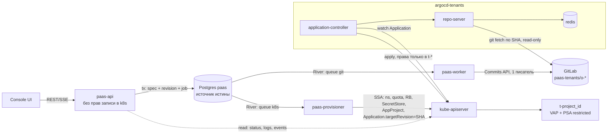
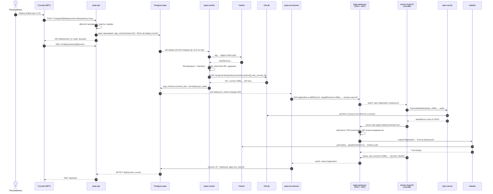

# 06. Конвейер доставки: backend → GitLab → tenant-ArgoCD (+ provisioner напрямую)

> **TL;DR**
> - **Гибрид D3.** Тенанта (namespace, квоты, RBAC, `SecretStore`, `AppProject`, `Application`) создаёт `paas-provisioner` напрямую в apiserver. Нагрузка идёт: рендер на Go → GitLab (**репо на организацию**) → **отдельный tenant-ArgoCD** `argocd-tenants`: права только в `t-*`, 13 kinds, без `Secret`/NetworkPolicy/RBAC, без `delete` на PVC и CNPG. Git — материализация и аудит; источник истины — Postgres.
> - **Главное развитие D3: `targetRevision` = 40-hex SHA на каждом `Application`.** Пин ставит provisioner с монотонным guard'ом по `revision_seq`. Тихого отката от отставшего или восстановленного из бэкапа GitLab не бывает, от вебхука и кэша ревизий ничего не зависит, коммит в App A не трогает App B. Вебхук + ветка остаются запасным режимом.
> - **«Задеплоено»** = `sync.revision == SHA` и `Synced` плюс завершённый rollout `Deployment`, который читаем сами. Агрегатный health не используем: он включает `Certificate`, а в 3.x health ресурсов в CR не хранится. Deploy → Running: 3–6 с на тёплом образе, ≈40 с на холодном.
> - **Коммиты:** один писатель, одна job на организацию с коалесингом, diff по git blob id без чтения файлов, `last_commit_id` из БД как optimistic lock, trailer `Paas-Commit-Id` для идемпотентности.
> - **Секреты** — версия KV v2 прямо в имени `ExternalSecret`/`Secret`: гонки нет, откат ревизии откатывает и секрет, reloader не нужен.
> - **Откат** — новая ревизия со spec старой, собранная текущим рендером. `git revert` не используем: он откатил бы харденинг.
> - **Удаление:** сначала `Application` (каскад через finalizer), данные — только явно или после grace. На LINSTOR `Retain` PV обязательно переводится в `Delete` до удаления PVC, иначе данные клиента физически остаются на дисках.
> - **Предел масштаба** — не число `Application`, а произведение kinds × namespaces watch'ей. Утечка watch бьёт по **общему** apiserver, и изоляция инстанса её не сдерживает. Отсюда правила R1–R7: 13 kinds, ns в списке только вместе с `RoleBinding` (гипотеза механизма утечки из кода gitops-engine), пул namespace'ов, рестарт после пакета, алерты. После ~300 ns — режим cluster-wide read (решение владельца).
> - **Выход на оператор** подготовлен: рендер отделён от транспорта, миграция по одному App без простоя (§16).

---

## 1. Честный разбор идеи владельца: git-ops как транспорт

Идея владельца — «backend генерирует manifest → коммит в GitLab → ArgoCD подхватывает и синхронизирует» — это известный паттерн *rendered manifests*. Он жизнеспособен, но в наивной форме («всё через git, один ArgoCD, ветка `main`, вебхук») ломается в конкретных местах. Ниже разбор без скидок; фильтр — один оператор без SRE-команды.

### 1.1 Где идея сильна (сохраняем)

| Свойство | Почему ценно именно здесь |
|---|---|
| Аудит бесплатно | каждое изменение пользовательского workload — коммит с trailer'ами (кто, `request_id`, ревизия). Спор «у меня всё упало 3-го числа» закрывается `git log -- projects/<p>/apps/<a>/` за минуту |
| Разделение доверия | интернет-facing `paas-api` не имеет прав записи в k8s вообще; workload-путь идёт через git и tenant-ArgoCD, у которого права только в `t-*` |
| selfHeal | любой дрейф (ручной `kubectl edit`, баг, «кто-то дотянулся») откатывается к декларации |
| Data plane не зависит от control plane | упали backend / GitLab / tenant-ArgoCD — поды тенантов работают, недоступны только изменения |
| Знакомый инструмент | владелец эксплуатирует ArgoCD 3.5.1 и лично разбирал его ловушки (утечка watch, отстающий git, пустой генератор). «Знаю, как чинить в 3 ночи» важнее «на 30 % эффективнее» |

### 1.2 Где наивная реализация стреляет в ногу

| # | Проблема | Механизм | Чем закрыто в этом документе |
|---|---|---|---|
| 1 | ArgoCD не может создать namespace тенанта | системный ArgoCD namespace-scoped by design (инвариант CLAUDE.md §0): verbs на `Namespace`/`RoleBinding` нет | управляющий канал: `paas-provisioner` пишет в apiserver напрямую (§2) |
| 2 | `AppProject` из git — не граница | он приезжает тем же коммитом, что и нагрузка, и переписывается им | `AppProject`/`Application` создаёт provisioner через API, в git их нет (§8, §9) |
| 3 | Отстающий или **восстановленный из бэкапа** git = тихий откат | ArgoCD не проверяет монотонность ревизии; бэкап GitLab у владельца ручной (`backup-utility`, без cron) — restore вернёт старое состояние `main` | `targetRevision` = 40-hex SHA, пинит provisioner, только вперёд по `revision_seq` (§9, §11) |
| 4 | Один ArgoCD на всех | watch = kinds × namespaces; каждая пересборка кэша течёт поколением watch; каждый новый ns = пересборка | отдельный tenant-ArgoCD, `resource.inclusions`, пакетное пополнение списка ns (§6, §7, §17) |
| 5 | Монорепо | каждый коммит меняет HEAD для всех Application репо → рефреш и перегенерация у всех; checkout одного репо на repo-server сериализуется | репо на организацию + пин каждого Application на свой SHA: коммит в app A не трогает app B (§4, §7) |
| 6 | Git — не БД | нет транзакций, UNIQUE, выборок; гонки конкурентных коммитов | источник истины — Postgres; git — детерминированная материализация; единственный писатель, сериализация на репо, optimistic lock (§10) |
| 7 | Вебхук без SLO | GitLab шлёт вебхуки через Sidekiq, под нагрузкой — минуты; `main` резолвится через кэш ревизий repo-server | деплой не зависит от вебхука: смена `targetRevision` в `Application` — событие watch, контроллер реагирует за < 1 с (§11) |
| 8 | Секреты в git | соблазн «зашифруем sops/sealed-secrets и положим» → компрометация репо = компрометация всех тенантов | в git только `ExternalSecret` с номером версии KV (§5.6) |
| 9 | Горячий путь медленнее прямого patch | restart/scale = коммит + sync ≈ 3–8 с против 0.3 с | принято осознанно (D3): прямой patch откатит selfHeal, а 3–8 с для PaaS приемлемо (§12) |
| 10 | Смена шаблона = рестарт всех подов платформы | правка `Harden()` меняет pod template у всех App → все поды всех тенантов перекатываются разом | перерендер кампаниями по волнам с rate-limit (§15.4) |

### 1.3 Вердикт

Git-ops сохраняется как **транспорт и аудит workload-манифестов** (D3), но **не** как источник истины и **не** как механизм управления тенантом:

- источник истины — Postgres `paas` (спецификации, ревизии, квоты);
- тенант (namespace, квоты, RBAC, границы ArgoCD) — прямые вызовы apiserver от `paas-provisioner`;
- нагрузка — рендер → GitLab → tenant-ArgoCD, с пином на SHA и монотонным guard'ом.

Исследование prior art (research-поток 03, §1 п.10; см. [01-architecture-overview.md](01-architecture-overview.md)) рекомендует сразу «CRD + собственный оператор, git — зеркало». Для MVP это отвергнуто (D3): лишний код и лишний класс багов реконсиляции у соло-оператора, при том что ArgoCD уже освоен. Но решение сделано **обратимым**: слой рендера — чистая функция без транспорта (инвариант I8), и путь миграции на оператор описан в §16.

## 2. Выбранная схема (D3): два канала доставки

### 2.1 Кто что пишет

| Объект в `t-<project_id>` / `argocd-tenants` | Пишет | Канал | Почему так |
|---|---|---|---|
| `Namespace` (labels `paas.1520.tech/tenant=true`, PSA `restricted`) | provisioner | apiserver, SSA | ArgoCD не может by design; `cluster-base` не годится (удаление из списка сносит ns) |
| `ResourceQuota`, `LimitRange` | provisioner | apiserver | граница тарифа не должна зависеть от содержимого git |
| `NetworkPolicy` (базовые, поверх CCNP из ansible) | provisioner | apiserver | tenant-ArgoCD сетевыми политиками **не управляет вообще** (§6.4) |
| `ServiceAccount` `app-runtime`, `paas-eso` | provisioner | apiserver | RBAC-объекты вне git-ops |
| `RoleBinding` → `paas-tenant-deployer` | provisioner | apiserver | динамический аналог `argocd_cfg_rbac_role_bindings` |
| `SecretStore` `paas-vault`, `Secret` `harbor-pull` | provisioner | apiserver | граница секретов (D9) и значение robot-токена — не для git |
| `AppProject` `o-<org_id>` | provisioner | apiserver | граница tenant-ArgoCD, которую не перепишет коммит |
| `Application` `a-<app_id>` / `d-<db_id>` | provisioner | apiserver | «указатель» на SHA; источник — git |
| cluster-`Secret` `argocd-tenants-cluster` (поле `namespaces`) | provisioner | apiserver | список ns кэша контроллера (§6.3, §17) |
| `Deployment`, `StatefulSet`, `Service`, `IngressRoute(TCP)`, `Certificate`, `ExternalSecret`, `PDB`, `HPA`, `PVC`, CNPG `Cluster`/`ScheduledBackup` | worker → GitLab → tenant-ArgoCD | git-ops | аудит, selfHeal, откат, независимость data plane |
| логи, события, статусы, метрики, exec | paas-api | apiserver **только чтение** (+ `pods/exec`) | D3: прямые вызовы — только чтения |



### 2.2 Инварианты конвейера

- **I1.** БД `paas` — источник истины спецификаций. Git — детерминированная материализация: любой репо восстановим из БД командой `rehydrate` (§15.3).
- **I2.** Единственный писатель в группу `paas-tenants` — `paas-worker` (бот `paas-bot`). Ручная правка = инцидент, её ловит детектор расхождений (§15.2).
- **I3.** `Application.spec.source.targetRevision` — всегда полный 40-hex SHA; выставляет только provisioner и только вперёд по `revision_seq` (§11.1).
- **I4.** tenant-ArgoCD не имеет прав записи вне `t-*`; не имеет прав на `Secret`, `NetworkPolicy`, RBAC, `ResourceQuota`, `Namespace`; не имеет `delete` на `PVC` и CNPG `Cluster`.
- **I5.** Всё, что создаёт backend (и в git, и через API), несёт labels `paas.1520.tech/managed-by=paas` и `paas.1520.tech/tenant-ns=<ns>` (D1).
- **I6.** Секретные значения никогда не попадают в git, в `Application`, в коммит-сообщения и в логи рендера.
- **I7.** Прямой write в apiserver на workload-объекты запрещён. Единственное исключение — явное удаление данных provisioner'ом (§14).
- **I8.** Рендер — чистая функция `Render(spec, platform) → []client.Object` без I/O. Транспорт (git сейчас, оператор потом) подключается снаружи.

## 3. Sequence: «пользователь нажал Deploy» → Running

Пример: пользователь меняет образ приложения `api` на `api:1.4.2` и жмёт **Deploy**. Идентификаторы условные: организация `7h2k9m4x1c`, проект `p4n8r2w6zt` (namespace `t-p4n8r2w6zt`), приложение `a9f3k1q7ve`.



Состояния деплоя, которые видит пользователь, привязаны к шагам: `queued` (1–5) → `committing` (7–12) → `syncing` (13–19) → `rolling_out` (20–24) → `deployed` | `failed(reason)`. Причина провала берётся из чтений apiserver (§11.3), а не из текста ArgoCD.

**Бюджет латентности** (развёртка D3; ⚠️ цифры — оценка, замерить на стенде нагрузочным прогоном 100 деплоев):

| Шаг | p50 | p95 | Что доминирует |
|---|---|---|---|
| API-транзакция + enqueue | 20 мс | 50 мс | — |
| подхват job River | 50 мс | 1 с | LISTEN/NOTIFY + fetch-интервал River |
| tag → digest в Harbor | 50 мс | 300 мс | — |
| рендер | 10 мс | 50 мс | чистый Go, без шаблонизатора |
| коммит в GitLab | 300 мс | 1.5 с | Gitaly `UserCommitFiles` |
| пин `Application` | 20 мс | 100 мс | один SSA |
| реакция контроллера | < 1 с | 3 с | очередь `status-processors` |
| генерация манифестов | 100 мс | 2 с | fetch по SHA при промахе клона |
| apply + admission | 200 мс | 1 с | VAP — CEL в процессе apiserver, дёшево |
| планирование + pull | 1–2 с (образ на ноде) | 30 с+ (холодный) | размер образа; proxy-cache Harbor |
| **итого до Running** | **3–6 с** + старт приложения | **≈ 40 с** + старт | pull образа |

Вебхук GitLab в этом пути **отсутствует** — это сознательно (см. §11.1 и §7.3).

## 4. Раскладка git-репозитория организации

### 4.1 Группа и репозитории

- GitLab-группа `paas-tenants` (private). **Один репозиторий на Organization**: `paas-tenants/o-<org_id>` (D3). Группа, два бот-пользователя и их токены — платформенные объекты: создаются один раз идемпотентным ansible-тегом `gitlab-install.yaml --tags config-paas` (по образцу `config-root`), токены кладутся в Vault и доставляются в `paas-system` через ESO. Репозитории организаций создаёт `paas-worker` в рантайме (D1).
- `paas-bot` — Maintainer на группе, токен `api` (создание проектов, коммиты). `paas-argocd-reader` — Reporter на группе, SSH-ключ, только чтение. ArgoCD получает **один** `repo-creds` на префикс `ssh://git@gitlab-gitlab-shell.gitlab.svc/paas-tenants/` — новый репо не требует нового секрета.
- Доступ tenant-ArgoCD к GitLab — **изнутри кластера** через Service `gitlab-shell` (⚠️ проверить точное имя Service в чарте 8.11.8), а не через `gitlab.<domain>:20001` на bastion-proxy: деплой тенанта не должен зависеть от немецкого edge-узла и внешнего DNS. `known_hosts` для внутреннего имени — патчем `argocd-ssh-known-hosts-cm`.
- Настройки проекта при создании (worker): visibility `private`; выключены issues, wiki, snippets, MR, **CI/CD** (`builds_access_level: disabled`), container registry, packages, pages. Ветка `main` protected: push — Maintainers (фактически только `paas-bot`), force push — запрещён.
- GitLab у владельца **CE** (`edition: ce` в `hosts-vars/gitlab.yaml`): групповых вебхуков и push rules нет (Premium). Поэтому защита от посторонних записей = protected branch + единственный Maintainer + детектор расхождений (§15.2); вебхук (если нужен режиму «ветка», §7.3) создаётся worker'ом на каждый проект.

### 4.2 Дерево файлов

```text
paas-tenants/o-7h2k9m4x1c/
├── README.md                          # «Сгенерировано платформой. Ручные правки будут перезаписаны.»
├── .paas/
│   └── repo.yaml                      # служебное; вне путей Application — ArgoCD не читает
└── projects/
    └── p4n8r2w6zt/                    # = namespace t-p4n8r2w6zt
        ├── apps/
        │   └── a9f3k1q7ve/            # = Application a-a9f3k1q7ve (spec.source.path)
        │       ├── deployment.yaml
        │       ├── service.yaml
        │       ├── pdb.yaml
        │       ├── ingressroute-platform.yaml
        │       ├── ingressroute-d-x7k2m1q9pz.yaml
        │       ├── certificate-d-x7k2m1q9pz.yaml
        │       └── externalsecret-env-v8.yaml
        └── databases/
            └── d5k2h8n1rb/            # = Application d-d5k2h8n1rb (CNPG), содержимое — в 09
                ├── cluster.yaml
                └── scheduledbackup.yaml
```

`.paas/repo.yaml`:

```yaml
schemaVersion: 3            # версия раскладки репо; миграция раскладки = кампания (§15.4)
orgId: 7h2k9m4x1c
renderer: v1.4.2            # версия рендера последнего коммита
generatedBy: paas-worker
# никаких e-mail, имён, реквизитов: git — не место для ПДн (152-ФЗ)
```

### 4.3 Правила раскладки

1. **Один файл — один объект**, имя `<kind>[-<suffix>].yaml`. Вывод детерминирован: `sigs.k8s.io/yaml` сортирует ключи, списки упорядочивает рендер. Детерминизм нужен для golden-тестов и для no-op-детекции без чтения содержимого (§10.2).
2. **Одна директория = одно `Application`.** `apps/<app_id>/` и `databases/<db_id>/` — отдельные Application: провал sync БД не блокирует деплой приложения и наоборот.
3. **Только plain YAML.** Никаких kustomize/helm/CMP в тенантских репо: repo-server не исполняет ничего, генерация — чтение файлов (дёшево, без exec-поверхности атаки).
4. **Никаких `.json` в директориях Application** — directory-source ArgoCD читает `*.yaml|*.yml|*.json`. Страховка — `directory.include: '*.yaml'` в Application (§9).
5. **Ни одного секретного значения** (I6), ни одного `Namespace`/RBAC/`NetworkPolicy`/`ResourceQuota` — их отвергнут `AppProject` и RBAC (§8), но рендер не должен их даже порождать (golden-тест с запретным списком kinds).
6. **Имена объектов в namespace** строятся из `slug` приложения — неизменяемого после создания (UI его не переименовывает; отображаемое имя — отдельное поле). Переименование = удаление + создание, иначе ArgoCD сделает prune/create со сменой Service IP и простоем.

### 4.4 Коммит-сообщение

```text
deploy(api): image api@sha256:9c1e4b… (tag 1.4.2)

Paas-Operation: deploy
Paas-Org: 7h2k9m4x1c
Paas-Project: p4n8r2w6zt
Paas-App: a9f3k1q7ve
Paas-Revision-Seq: 42
Paas-Actor: user:u_3kq9wz71pd (console)
Paas-Request-Id: 01J8Z9V3QK7M2N4P6R8T0V2X4Z
Paas-Commit-Id: 5b0e6c2a-4f1e-4d7a-9a51-0f8f3c2e9d11
Paas-Renderer: v1.4.2
```

Git trailers парсятся `git interpret-trailers`. `Paas-Commit-Id` (UUID намерения из БД) делает коммит идемпотентным при повторе job (§10.4). Автор — `paas-bot <paas-bot@noreply.paas.example>`; **actor — только внутренний id**, e-mail пользователя в git не пишется.

**Рост репо** (оценка): App ≈ 7 файлов × 1–2 КБ; 10–20 ревизий в сутки → сырой прирост ≈ 100–300 КБ/сутки на App, после delta-сжатия git — в 5–10 раз меньше. 1000 App ≈ 50–150 МБ/мес на весь GitLab — не проблема; housekeeping GitLab делает сам.

## 5. Генерируемые манифесты одного App (полный пример)

Ниже — **полный** вывод рендера для приложения `api` с одним кастомным доменом, секретным env и привязанной managed-БД. Всё, что здесь не пришло из пользовательской модели, навешивает `Harden()` (D4); VAP в apiserver проверяет те же инварианты независимо (детали политик — [03-security-model.md](03-security-model.md)). Домены — [08-svc-ingress-domains-ip.md](08-svc-ingress-domains-ip.md), секреты — [12-svc-secrets.md](12-svc-secrets.md).

### 5.1 Общие метаданные (на каждом объекте)

```yaml
metadata:
  namespace: t-p4n8r2w6zt
  labels:
    paas.1520.tech/managed-by: paas          # D1
    paas.1520.tech/tenant-ns: t-p4n8r2w6zt   # D1
    paas.1520.tech/org-id: 7h2k9m4x1c
    paas.1520.tech/app-id: a9f3k1q7ve
    app.kubernetes.io/name: api              # slug, неизменяемый
    app.kubernetes.io/managed-by: paas
```

Tracking-аннотацию `argocd.argoproj.io/tracking-id` ставит сам ArgoCD при apply (метод `annotation`, дефолт 3.x); рендер её не пишет.

### 5.2 `deployment.yaml`

```yaml
apiVersion: apps/v1
kind: Deployment
metadata:
  name: api
  namespace: t-p4n8r2w6zt
  labels: { ...5.1... }
  annotations:
    paas.1520.tech/revision-seq: "42"        # только на Deployment, НЕ в pod template:
                                             # смена домена не должна перекатывать поды
    argocd.argoproj.io/sync-wave: "0"
spec:
  replicas: 2                                # отсутствует, если включён HPA (§12)
  revisionHistoryLimit: 3
  progressDeadlineSeconds: 600               # → Degraded, если rollout встал
  strategy:
    type: RollingUpdate
    rollingUpdate: { maxSurge: 1, maxUnavailable: 0 }   # surge требует запаса квоты — см. 13
  selector:
    matchLabels: { paas.1520.tech/app-id: a9f3k1q7ve }
  template:
    metadata:
      labels: { ...5.1... }
      annotations:
        paas.1520.tech/restarted-at: "2026-09-11T10:15:00Z"   # кнопка Restart (§12)
    spec:
      serviceAccountName: app-runtime        # создаёт provisioner, без RoleBinding'ов
      automountServiceAccountToken: false
      enableServiceLinks: false
      hostUsers: false                       # user namespaces, D4 (stable в k8s 1.36)
      priorityClassName: tenant-paid         # PriorityClass создаёт ansible
      imagePullSecrets: [{ name: harbor-pull }]
      nodeSelector: { paas.1520.tech/pool: tenant }
      tolerations:
        - { key: paas.1520.tech/tenant, operator: Equal, value: "true", effect: NoSchedule }
      topologySpreadConstraints:
        - maxSkew: 1
          topologyKey: kubernetes.io/hostname
          whenUnsatisfiable: ScheduleAnyway
          labelSelector:
            matchLabels: { paas.1520.tech/app-id: a9f3k1q7ve }
      securityContext:
        runAsNonRoot: true
        runAsUser: 10001
        runAsGroup: 10001
        fsGroup: 10001
        fsGroupChangePolicy: OnRootMismatch
        seccompProfile: { type: RuntimeDefault }
      terminationGracePeriodSeconds: 30
      containers:
        - name: app
          image: harbor.paas.example/o-7h2k9m4x1c/api@sha256:9c1e4b...   # всегда digest
          imagePullPolicy: IfNotPresent
          ports:
            - { name: http, containerPort: 8080, protocol: TCP }
          env:
            - { name: PORT, value: "8080" }
            - name: DATABASE_URL                 # привязка managed-БД: Secret создаёт CNPG
              valueFrom:
                secretKeyRef: { name: db-d5k2h8n1rb-app, key: uri }
          envFrom:
            - secretRef: { name: api-env-v8 }    # версия секрета в ИМЕНИ (§5.6)
          resources:
            requests: { cpu: 250m, memory: 512Mi, ephemeral-storage: 64Mi }
            limits:   { cpu: "1", memory: 512Mi, ephemeral-storage: 512Mi }
          readinessProbe:
            httpGet: { path: /healthz, port: http }
            periodSeconds: 5
            timeoutSeconds: 3                  # не 1 с: медленный healthz → ложный NotReady
            failureThreshold: 3
          livenessProbe:
            httpGet: { path: /healthz, port: http }
            initialDelaySeconds: 10
            periodSeconds: 10
            timeoutSeconds: 3
            failureThreshold: 6
          lifecycle:
            preStop:
              sleep: { seconds: 5 }            # нативный хук, shell в образе не нужен (⚠️ статус в 1.36)
          terminationMessagePolicy: FallbackToLogsOnError   # хвост лога → причина провала в UI
          securityContext:
            allowPrivilegeEscalation: false
            readOnlyRootFilesystem: true
            privileged: false
            capabilities: { drop: [ALL] }
          volumeMounts:
            - { name: tmp, mountPath: /tmp }
      volumes:
        - name: tmp
          emptyDir: { sizeLimit: 256Mi }
```

### 5.3 `service.yaml`

```yaml
apiVersion: v1
kind: Service
metadata:
  name: api
  namespace: t-p4n8r2w6zt
  labels: { ...5.1... }
spec:
  type: ClusterIP                             # VAP: NodePort/LoadBalancer/ExternalName/externalIPs запрещены
  selector: { paas.1520.tech/app-id: a9f3k1q7ve }
  ports:
    - { name: http, port: 80, targetPort: http, protocol: TCP }
```

### 5.4 `ingressroute-platform.yaml` и `ingressroute-d-x7k2m1q9pz.yaml`

```yaml
apiVersion: traefik.io/v1alpha1
kind: IngressRoute
metadata:
  name: api-platform
  namespace: t-p4n8r2w6zt
  labels: { ...5.1... }
  annotations:
    kubernetes.io/ingress.class: traefik-tenants
spec:
  entryPoints: [websecure]
  routes:
    - kind: Rule
      match: Host(`api-p4n8r2w6zt.apps.paas.example`)
      services:
        - { name: api, port: 80 }             # без поля namespace — VAP (см. ниже)
  tls: {}                                     # wildcard *.apps.paas.example = default-сертификат TLSStore (08)
---
apiVersion: traefik.io/v1alpha1
kind: IngressRoute
metadata:
  name: api-d-x7k2m1q9pz                      # d-<domain_id>: домен уникален глобально (D5)
  namespace: t-p4n8r2w6zt
  labels: { ...5.1..., paas.1520.tech/domain-id: x7k2m1q9pz }
  annotations:
    kubernetes.io/ingress.class: traefik-tenants
spec:
  entryPoints: [websecure]
  routes:
    - kind: Rule
      match: Host(`shop.customer.example`)
      services:
        - { name: api, port: 80 }
  tls:
    secretName: api-d-x7k2m1q9pz-tls
```

> ⚠️ **Опасность для этого конвейера.** В `hosts-vars/traefik.yaml` у CRD-провайдера `allowCrossNamespace: true` (системным компонентам нужен общий middleware `vpn-only`). Значит `IngressRoute` из `t-*` технически может сослаться на `Service` или `Middleware` в чужом namespace — например, опубликовать наружу `vault` или GitLab. Рендер такого не порождает, но граница — не рендер: VAP обязана запрещать `spec.routes[].services[].namespace` и `spec.routes[].middlewares[].namespace`, кроме явного allow-list платформенных middleware (Cloudflare-allowlist и т.п. — [08](08-svc-ingress-domains-ip.md)). То же для `IngressRouteTCP`.

### 5.5 `certificate-d-x7k2m1q9pz.yaml`

```yaml
apiVersion: cert-manager.io/v1
kind: Certificate
metadata:
  name: api-d-x7k2m1q9pz
  namespace: t-p4n8r2w6zt
  labels: { ...5.1..., paas.1520.tech/domain-id: x7k2m1q9pz }
  # sync-wave НЕТ намеренно: см. абзац ниже
spec:
  secretName: api-d-x7k2m1q9pz-tls
  dnsNames: [shop.customer.example]
  issuerRef: { group: cert-manager.io, kind: ClusterIssuer, name: paas-le-http01 }
  privateKey: { algorithm: ECDSA, size: 256, rotationPolicy: Always }
  secretTemplate:
    labels:
      paas.1520.tech/managed-by: paas
      paas.1520.tech/tenant-ns: t-p4n8r2w6zt
```

Файл появляется в git **только после** подтверждения TXT `_paas-challenge` (D5). Готовность сертификата **не входит** в критерий «задеплоено» (§11.2): выпуск зависит от DNS клиента и может идти минутами; у домена свой статус в UI. Поэтому у `Certificate` нет sync-wave, а tenant-ArgoCD получает health-override «всегда Healthy» для `cert-manager.io/Certificate` (§6.2) — ровно как override для `Ingress` у системного инстанса. Без этого недоделанный DNS клиента подвешивал бы sync всего приложения: ArgoCD ждёт здоровья ресурсов волны перед следующей волной и перед `PruneLast`. Solver-под HTTP-01 создаётся cert-manager'ом **в namespace тенанта** — ClusterIssuer `paas-le-http01` обязан задавать ему `nodeSelector`/`tolerations`/`securityContext` tenant-пула, а образ solver'а — из Harbor, иначе VAP его отвергнет (разбор — [08](08-svc-ingress-domains-ip.md)).

### 5.6 `externalsecret-env-v8.yaml`

```yaml
apiVersion: external-secrets.io/v1
kind: ExternalSecret
metadata:
  name: api-env-v8                            # суффикс = версия KV v2 в Vault
  namespace: t-p4n8r2w6zt
  labels: { ...5.1... }
  annotations:
    argocd.argoproj.io/sync-wave: "-1"
spec:
  refreshInterval: "0"                        # версия запинена → перечитывать нечего
  secretStoreRef: { kind: SecretStore, name: paas-vault }
  target:
    name: api-env-v8
    creationPolicy: Owner
    immutable: true
    template:
      engineVersion: v2
      metadata:
        labels:
          paas.1520.tech/managed-by: paas
          paas.1520.tech/tenant-ns: t-p4n8r2w6zt
  dataFrom:
    - extract:
        key: t-p4n8r2w6zt/app-api-env        # → paas-tenants/data/t-p4n8r2w6zt/app-api-env (D9)
        version: "8"
```

**Почему версия в имени, а не reloader.** Пользователь меняет секрет → worker пишет в Vault (версия 9) → коммитит `externalsecret-env-v9.yaml` и `envFrom: api-env-v9` в Deployment одним коммитом → новый ReplicaSet физически не стартует, пока Secret `api-env-v9` не создан (kubelet ждёт, `CreateContainerConfigError` → ретрай) — гонки «под поднялся со старым значением» нет по построению. Старый `api-env-v8` удаляется prune'ом **после** rollout (`PruneLast=true`, §9). Бонусы: смена секрета видна в git как событие (без значения), откат ревизии откатывает и версию секрета (§13). Stakater-reloader для тенантов **не используется**: он пишет в pod template в обход git, и selfHeal воевал бы с ним (у владельца это уже лечилось `ignoreDifferences`).

### 5.7 `pdb.yaml`

```yaml
apiVersion: policy/v1
kind: PodDisruptionBudget
metadata:
  name: api
  namespace: t-p4n8r2w6zt
  labels: { ...5.1... }
spec:
  maxUnavailable: 1
  unhealthyPodEvictionPolicy: AlwaysAllow     # CrashLoop-поды не блокируют drain ноды
  selector:
    matchLabels: { paas.1520.tech/app-id: a9f3k1q7ve }
```

Рендерится **только при `replicas ≥ 2`** (или `HPA.minReplicas ≥ 2`). PDB с одной репликой вечно блокирует `node-drain-on.yaml` — тенант не должен уметь мешать оператору обслуживать ноды.

### 5.8 Чего в git нет — и почему

| Объект | Где живёт | Причина |
|---|---|---|
| `NetworkPolicy` | provisioner | namespaced-NP в Cilium аддитивны: коммит с «разрешить всё» расширил бы доступ. Базовые запреты — deny-правилами CCNP (ansible), их namespaced-политика не перебивает ([03](03-security-model.md)) |
| `ServiceAccount`, `Role(Binding)` | provisioner | RBAC-объекты; у tenant-ArgoCD на них нет прав (I4) |
| `ResourceQuota`, `LimitRange` | provisioner | граница тарифа ([13](13-billing-and-quotas.md)) |
| `Secret` с данными | ESO / CNPG / cert-manager | I6 |
| `ConfigMap` — исключение | git | допустим для несекретных конфиг-файлов пользователя; имя с хешем содержимого (`api-cfg-3f9a1c`) по той же логике, что §5.6 |

## 6. tenant-ArgoCD: установка как ansible-компонент

### 6.1 Почему отдельный инстанс, а не системный `argocd`

| Критерий | Тенанты в системном `argocd` | Отдельный `argocd-tenants` (D3) |
|---|---|---|
| Blast radius компрометации | тот же контроллер имеет права в `gitlab`, `vault`, продуктовых ns владельца | права только в `t-*`; системных ns не видит |
| Утечка watch / OOM | тенантские ns умножают watch системного кэша (сейчас 35 ns × 93 kinds) | отдельный кэш, отдельный набор kinds; рестарт не трогает git-ops владельца |
| Модель доверия `AppProject` | из git (не граница, CLAUDE.md §0) | создаёт provisioner через API — граница |
| Апгрейды, настройки | общий `argocd-cm`, общие таймауты (`30s`) | свои: `3600s`, свои processors, свой inclusions |
| Цена | 0 | ~1.5–2.5 GiB RAM и ~0.5–1 CPU на системных нодах (⚠️ оценка) |

### 6.2 Компонент `argocd-tenants` в этом репо

По образцу `argocd` (components.md §9), с отличиями ниже. Per-tenant данных в `hosts-vars*` нет (D1): ansible ставит «пустой» инстанс, наполняет его provisioner.

| Что | Значение |
|---|---|
| Playbook | `playbook-app/argocd-tenants-install.yaml`, `playbook-app/argocd-tenants-restart.yaml` |
| Чарты | `playbook-app/charts/argocd-tenants/{pre,install,post,cfg}/` — **без `crds`** |
| Vars | `hosts-vars/argocd-tenants.yaml` (полная структура), override — только enable/ресурсы/nodeSelector |
| Namespace | `argocd-tenants` — платформенный, статический: заводится `cluster-base` (это не tenant-ns) |
| Релизы | `argocd-tenants-pre`, `argocd-tenants`, `argocd-tenants-post`, `argocd-tenants-cfg` |
| CRD | **общие с системным** `argocd` (cluster-scoped). Ставятся только `argocd-install.yaml --tags crds`; playbook `argocd-tenants` делает assert наличия трёх CRD. Оба инстанса обновляются в lockstep: `make test` сверяет, что вендоренный `install.yaml` у двух чартов байт-в-байт одинаков |
| Манифест | тот же upstream `namespace-install.yaml` v3.5.1, ребинд namespace — штатным `dto_target_namespace` в `tasks-helm-template-kustomize-build.yaml` |
| Порядок | `argocd --tags crds` → `cluster-base` (ns) → `argocd-tenants` (pre → install → post → cfg) → **`argocd-tenants-restart.yaml`** (тот же инвариант, что у системного: `helm upgrade` не пересоздаёт под контроллера) |

**Фаза `pre`:** SecretStore/ESO для `repo-creds` (SSH-ключ `paas-argocd-reader` из Vault), NetworkPolicy, и **пустой** cluster-Secret:

```yaml
apiVersion: v1
kind: Secret
metadata:
  name: argocd-tenants-cluster
  namespace: argocd-tenants
  labels:
    argocd.argoproj.io/secret-type: cluster
  annotations:
    helm.sh/resource-policy: keep
# data: НЕТ. name/server/namespaces/clusterResources пишет provisioner (patch с resourceNames).
# Тот же приём, что инвариант argocd-secret: любой data-ключ в рендере => helm владеет картой
# и на upgrade снесёт поле namespaces, которое ведёт provisioner (helm#12886).
```

`argocd-secret` тоже остаётся без `data:` — webhook-секрет (если нужен, §7.3) пишется out-of-band, как пароли у системного инстанса.

**Фаза `install` — kustomize-патчи** (фрагмент `argocd_tenants_install_kustomize_patches`):

```yaml
# 1) Лишние компоненты — удалить (меньше поверхность атаки и RBAC в ns):
- patch: |-
    $patch: delete
    apiVersion: apps/v1
    kind: Deployment
    metadata: { name: argocd-applicationset-controller }   # ApplicationSet не используется (D3)
- patch: |-
    $patch: delete
    apiVersion: apps/v1
    kind: Deployment
    metadata: { name: argocd-dex-server }                  # SSO нет: людей в этом ArgoCD нет
- patch: |-
    $patch: delete
    apiVersion: apps/v1
    kind: Deployment
    metadata: { name: argocd-notifications-controller }    # статус читаем из CR сами
# (+ их ServiceAccount/Role/RoleBinding/Service/ConfigMap тем же приёмом)
# 2) argocd-cm
- target: { kind: ConfigMap, name: argocd-cm }
  patch: |-
    apiVersion: v1
    kind: ConfigMap
    metadata: { name: argocd-cm }
    data:
      installationID: argocd-tenants          # два инстанса в одном кластере не спорят за объекты (⚠️ проверить в 3.5.1)
      application.resourceTrackingMethod: annotation
      resource.respectRBAC: normal
      resource.inclusions: |                  # РОВНО kinds из ClusterRole paas-tenant-deployer (§17, правило R2)
        - { apiGroups: ["apps"], kinds: ["Deployment", "StatefulSet"], clusters: ["*"] }
        - { apiGroups: [""], kinds: ["Service", "ConfigMap", "PersistentVolumeClaim"], clusters: ["*"] }
        - { apiGroups: ["policy"], kinds: ["PodDisruptionBudget"], clusters: ["*"] }
        - { apiGroups: ["autoscaling"], kinds: ["HorizontalPodAutoscaler"], clusters: ["*"] }
        - { apiGroups: ["traefik.io"], kinds: ["IngressRoute", "IngressRouteTCP"], clusters: ["*"] }
        - { apiGroups: ["cert-manager.io"], kinds: ["Certificate"], clusters: ["*"] }
        - { apiGroups: ["external-secrets.io"], kinds: ["ExternalSecret"], clusters: ["*"] }
        - { apiGroups: ["postgresql.cnpg.io"], kinds: ["Cluster", "ScheduledBackup"], clusters: ["*"] }
      timeout.reconciliation: 3600s
      timeout.reconciliation.jitter: 600s
      timeout.hard.reconciliation: 0s
      users.anonymous.enabled: "false"
      admin.enabled: "false"
      exec.enabled: "false"
      statusbadge.enabled: "false"
      resource.customizations.health.cert-manager.io_Certificate: |   # выпуск не гейтит sync (§5.5)
        hs = {}
        hs.status = "Healthy"
        hs.message = "issuance tracked by paas backend"
        return hs
# 3) argocd-rbac-cm: policy.default: '' и пустой policy.csv — людей и API-клиентов нет
# 4) argocd-cmd-params-cm — числа в §7.1
# 5) StatefulSet argocd-application-controller: env ARGOCD_CLUSTER_CACHE_RESYNC_DURATION (§17),
#    resources.limits.memory: 2Gi, nodeSelector системных нод
```

**Размещение:** все поды `argocd-tenants` — на **системных** нодах, никогда на tenant-пуле. Под контроллера держит токен с правами записи во все `t-*`; соседство с чужим кодом на одной ноде превращает любой container escape в компрометацию всех тенантов.

**Фаза `cfg`** (релиз `argocd-tenants-cfg`) — только **определения**, привязки динамические:

```yaml
apiVersion: rbac.authorization.k8s.io/v1
kind: ClusterRole
metadata:
  name: paas-tenant-deployer           # префикс-маркер владельца (CLAUDE.md §0: уникальные имена)
rules:
  - apiGroups: ["apps"]
    resources: ["deployments", "statefulsets"]
    verbs: ["get", "list", "watch", "create", "update", "patch", "delete"]
  - apiGroups: [""]
    resources: ["services", "configmaps"]
    verbs: ["get", "list", "watch", "create", "update", "patch", "delete"]
  - apiGroups: [""]
    resources: ["persistentvolumeclaims"]
    verbs: ["get", "list", "watch", "create", "update", "patch"]        # без delete: данные удаляет только provisioner
  - apiGroups: ["policy"]
    resources: ["poddisruptionbudgets"]
    verbs: ["get", "list", "watch", "create", "update", "patch", "delete"]
  - apiGroups: ["autoscaling"]
    resources: ["horizontalpodautoscalers"]
    verbs: ["get", "list", "watch", "create", "update", "patch", "delete"]
  - apiGroups: ["traefik.io"]
    resources: ["ingressroutes", "ingressroutetcps"]
    verbs: ["get", "list", "watch", "create", "update", "patch", "delete"]
  - apiGroups: ["cert-manager.io"]
    resources: ["certificates"]
    verbs: ["get", "list", "watch", "create", "update", "patch", "delete"]
  - apiGroups: ["external-secrets.io"]
    resources: ["externalsecrets"]
    verbs: ["get", "list", "watch", "create", "update", "patch", "delete"]
  - apiGroups: ["postgresql.cnpg.io"]
    resources: ["clusters"]
    verbs: ["get", "list", "watch", "create", "update", "patch"]        # без delete
  - apiGroups: ["postgresql.cnpg.io"]
    resources: ["scheduledbackups"]
    verbs: ["get", "list", "watch", "create", "update", "patch", "delete"]
# Нет: secrets, networkpolicies, serviceaccounts, roles, rolebindings, resourcequotas,
# limitranges, pods, pods/exec, events. Verbs нигде не "*" (как у системного инстанса).
```

Плюс `default` AppProject — lockdown тем же приёмом, что `argocd_gitops_default_project_update` у системного инстанса (пустые `sourceRepos`/`destinations`, blacklist `*/*`). Cluster-wide грантов по умолчанию **нет**; read-only `namespaces get/list/watch` (аналог `argocd-managed-ns-reader`) добавляется, только если стенд покажет, что без него что-то ломается (⚠️ проверить).

`RoleBinding` в каждом `t-*` создаёт provisioner при создании проекта:

```yaml
apiVersion: rbac.authorization.k8s.io/v1
kind: RoleBinding
metadata:
  name: paas-tenant-deployer
  namespace: t-p4n8r2w6zt
  labels: { paas.1520.tech/managed-by: paas, paas.1520.tech/tenant-ns: t-p4n8r2w6zt }
roleRef: { apiGroup: rbac.authorization.k8s.io, kind: ClusterRole, name: paas-tenant-deployer }
subjects:
  - { kind: ServiceAccount, name: argocd-application-controller, namespace: argocd-tenants }
```

У provisioner для этого — `bind` с `resourceNames: [paas-tenant-deployer]` ([04](04-control-plane-go.md), D4); `escalate` нет.

**Фаза `post`:** только `ServiceMonitor` для controller / repo-server / server. **Никакого IngressRoute**: UI tenant-ArgoCD наружу не публикуется, людей в нём нет. Отладка владельцем — `kubectl port-forward` или `argocd --core`.

### 6.3 NetworkPolicy namespace `argocd-tenants`

- ingress: repo-server ← controller, server; redis ← controller, repo-server, server; server:8080 ← ns `gitlab` (вебхук, только в режиме «ветка»); metrics ← `mon-system`.
- egress: kube-apiserver (Cilium entity `kube-apiserver`), `gitlab-shell:22` в ns `gitlab`, DNS. **Интернета нет** — repo-server физически не сходит в чужой git, даже если `AppProject` ошибся.

### 6.4 Что tenant-ArgoCD не делает никогда

Не создаёт namespace (`CreateNamespace` не используется, прав нет), не трогает NetworkPolicy/RBAC/квоты, не удаляет PVC и CNPG `Cluster`, не видит `Secret`, не исполняет helm/kustomize/плагины, не ходит в интернет, не обслуживает людей.

## 7. tenant-ArgoCD: настройки масштаба

### 7.1 Настройки инстанса

Ориентир — до ~1000–1500 `Application` на один контроллер. Все числа — стартовые; ⚠️ подтвердить нагрузочным прогоном на стенде (синтетическая организация с 500 App, массовый пин, замер p95 реконсиляции и памяти).

| Настройка | Значение | Upstream-дефолт | Зачем |
|---|---|---|---|
| `controller.status.processors` | `50` | 20 | очередь реконсиляции при ~1000 App (рекомендация HA-доков ArgoCD для 1000 App — 50/25, ⚠️ сверить с докой 3.5) |
| `controller.operation.processors` | `25` | 10 | параллельные sync; пик — кампания перерендера (§15.4) |
| `controller.kubectl.parallelism.limit` | `20` | 20 | потолок одновременных apply → нагрузка на apiserver |
| `controller.sync.timeout.seconds` | `600` | 0 (без таймаута) | **обязательно**: зависший sync (волна ждёт здоровья вечно) иначе блокирует все следующие деплои этого App |
| `controller.repo.server.timeout.seconds` | `120` | 60 | запас на холодный fetch |
| `controller.cluster.cache.batch.events.processing` | `"false"` | true | как у системного инстанса (подозреваемый путь утечки, §17) |
| `reposerver.parallelism.limit` | `10` | 0 (без лимита) | защита памяти repo-server при массовом refresh |
| `timeout.reconciliation` | `3600s` | 180s (у системного — 30s) | при SHA-пине git под Application не меняется; периодика — только страховка от потери кэша. Live-дрейф ловится watch'ем сразу, независимо от этого таймаута |
| `timeout.reconciliation.jitter` | `600s` | ⚠️ проверить дефолт 3.5 | размазать периодические refresh'и 1000 App |
| `timeout.hard.reconciliation` | `0s` | 0 | hard refresh обходит кэш — только вручную |
| env `ARGOCD_CLUSTER_CACHE_RESYNC_DURATION` | `12h` явно → `0` после проверки (§17.3) | 12h, env в `install.yaml` нет | главный плановый триггер пересборки кэша |
| реплики controller | 1 | 1 | шардинг идёт по кластерам — §7.2 |
| `resources.limits.memory` controller | `2Gi` | нет | утечка упирается в OOM → рестарт (ограниченный ущерб) + алерт на рестарты |
| реплики repo-server | 2 | 1 | доступность; checkout одного репо сериализуется в пределах реплики |
| redis | 1 реплика, `maxmemory 1gb`, `allkeys-lru` | — | потеря redis = промахи кэша, не авария |
| `--persist-resource-health` | `false` (дефолт 3.x) | false | health ресурсов не пишется в CR → backend читает статус `Deployment` сам (§11.2) |
| syncOption `ServerSideApply=true` | вкл. | выкл. | совместное владение полями с HPA/операторами, без `last-applied` |
| Server-Side Diff | выкл. в MVP | выкл. | dry-run apply на каждый ресурс каждого refresh; включать после замера нагрузки (⚠️) |

### 7.2 Шардинг контроллера: почему «просто поставить replicas: 3» не работает

ArgoCD шардит контроллер **по кластерам** (`--sharding-method legacy|round-robin|consistent-hashing`): один целевой кластер = один шард. У нас кластер один, лишние реплики простаивали бы. Реальные рычаги по порядку:

1. **Вертикально** — processors, память (таблица выше). Хватает до ~1000–1500 App (⚠️ оценка по публичной практике, не измерение).
2. **Ячейки (cells)** — второй инстанс `argocd-tenants-b` в своём namespace, со своим cluster-Secret и своим подмножеством namespace'ов. Provisioner назначает организации ячейку при создании (`orgs.delivery_cell`) и никогда её не меняет. Это тот же ansible-компонент, параметризованный списком ячеек. Ячейки делят память и объём пересборки кэша, **но не уменьшают суммарное число watch** на apiserver (§17.4).
3. **Отвергнуто:** регистрировать тот же apiserver под несколькими «кластерами» с разными URL ради шардинга — хак, завязанный на то, как ArgoCD идентифицирует кластер по `server`; ломается на апгрейдах.

### 7.3 Вебхук GitLab и `manifest-generate-paths` (D3)

- По D3 каждое `Application` несёт `argocd.argoproj.io/manifest-generate-paths: .`, а GitLab шлёт push-вебхук на `http://argocd-tenants-server.argocd-tenants.svc/api/webhook`. На CE вебхук создаётся на каждый проект (групповых нет). GitLab по умолчанию **блокирует вебхуки в локальную сеть** — нужен allowlist внутреннего имени в Admin → Network → Outbound requests (⚠️ проверить имя настройки в 17.11). Секрет `webhook.gitlab.secret` пишется в `argocd-secret` out-of-band (инвариант пустого `argocd-secret` действует и здесь).
- **Важно:** вебхук обновляет только те Application, у которых `targetRevision` совпадает с запушенной веткой. В рекомендуемом режиме SHA-пина (§11.1) таких нет — вебхук ни на что не влияет. Он остаётся механизмом **запасного режима «ветка»** (`targetRevision: main`), в который провайдер рендера Application переключается одним флагом, если SHA-пин по какой-то причине придётся отключить. Если владелец откажется от запасного режима — вебхук можно не создавать вовсе (раздел 18).
- `manifest-generate-paths` в режиме SHA-пина полезен, когда пин сдвигается на новый SHA без изменений в пути App (коммит-«rehydrate», объединённый коммит): контроллер просит repo-server перенести кэш вперёд вместо генерации (⚠️ проверить, что оптимизация срабатывает при смене SHA→SHA, а не только для ветки).

### 7.4 Кэш repo-server

- Кэш манифестов в redis, ключ включает SHA, TTL 24 ч. При SHA-пине промах после TTL = чтение из локального клона без сети, если объект уже есть.
- Клон — в `emptyDir`: рестарт repo-server = повторный clone репо организации при первом обращении (нужен живой GitLab). Живой redis при этом продолжает отдавать манифесты по SHA и без GitLab. PVC под клон (repo-server как StatefulSet) — не в MVP; вернуться, если рестарты repo-server совпадут с простоями GitLab.
- Прогрев после сброса кэша: организация со 100 App на разных SHA = 100 последовательных checkout одного репо на реплике ≈ 5–20 с (⚠️ оценка). Для приложений это невидимо — поды работают, задерживается только реакция на изменения.

## 8. AppProject на организацию (создаёт provisioner)

Один `AppProject` на организацию (D3), живёт в `argocd-tenants`, создаётся и обновляется **только** provisioner'ом (SSA, `fieldManager: paas-provisioner`) при создании/удалении организации и её проектов. В git его нет — поэтому он граница: коммит не может его переписать.

```yaml
apiVersion: argoproj.io/v1alpha1
kind: AppProject
metadata:
  name: o-7h2k9m4x1c
  namespace: argocd-tenants
  labels:
    paas.1520.tech/managed-by: paas
    paas.1520.tech/org-id: 7h2k9m4x1c
spec:
  description: "PaaS org 7h2k9m4x1c. Managed by paas-provisioner. Do not edit."
  sourceRepos:
    - ssh://git@gitlab-gitlab-shell.gitlab.svc/paas-tenants/o-7h2k9m4x1c.git   # ровно один репо
  sourceNamespaces: []                  # Application только в argocd-tenants (apps-in-any-namespace не используется)
  destinations:                         # явный список ns организации — НЕ glob "t-*"
    - { server: https://kubernetes.default.svc, namespace: t-p4n8r2w6zt }
    - { server: https://kubernetes.default.svc, namespace: t-q8m2x5v1kd }
  clusterResourceWhitelist: []          # пусто = ни одного cluster-scoped kind
  namespaceResourceWhitelist:           # совпадает с resource.inclusions и ClusterRole (§6.2)
    - { group: apps, kind: Deployment }
    - { group: apps, kind: StatefulSet }
    - { group: "", kind: Service }
    - { group: "", kind: ConfigMap }
    - { group: "", kind: PersistentVolumeClaim }
    - { group: policy, kind: PodDisruptionBudget }
    - { group: autoscaling, kind: HorizontalPodAutoscaler }
    - { group: traefik.io, kind: IngressRoute }
    - { group: traefik.io, kind: IngressRouteTCP }
    - { group: cert-manager.io, kind: Certificate }
    - { group: external-secrets.io, kind: ExternalSecret }
    - { group: postgresql.cnpg.io, kind: Cluster }
    - { group: postgresql.cnpg.io, kind: ScheduledBackup }
  roles: []                             # людей и токенов в tenant-ArgoCD нет
  syncWindows: []                       # приостановка — replicas=0 через git (D10), не окна
  signatureKeys: []                     # GPG-подпись коммитов — не в MVP
```

Почему именно так:

- **`destinations` — явный список**, а не `t-*`: glob пустил бы Application организации A в namespace организации B, если provisioner ошибётся в `destination`. Список полный (CRD-списки без `listType` — atomic), provisioner каждый раз шлёт его целиком из БД.
- **Три слоя на один запрет.** Рендер не порождает `RoleBinding` (golden-тест) → `AppProject` его отвергнет → RBAC tenant-ArgoCD его не пропустит → VAP проверит поля Pod-спеки независимо от всех трёх.
- **Отвергнуто: `AppProject` на проект.** Тоньше изоляция внутри организации, но плательщик один и граница биллинга та же; зато вдвое больше объектов и обновлений. Пересечение проектов внутри организации возможно только при баге provisioner'а в `destination`, а не через git.
- **Отвергнуто: `destinationServiceAccounts` (sync impersonation).** В 3.5 — beta и выключено по умолчанию. Дало бы RBAC-уровень и для пересечения проектов, но добавляет SA и биндинг impersonate на каждый ns. Кандидат на фазу 2 харденинга (раздел 19).

## 9. Application на приложение (создаёт provisioner)

Одно `Application` на App (`a-<app_id>`) и на каждую managed-БД (`d-<db_id>`). Создаёт provisioner при создании App; дальше при каждом деплое меняет **только** `targetRevision` и аннотации ревизии.

```yaml
apiVersion: argoproj.io/v1alpha1
kind: Application
metadata:
  name: a-a9f3k1q7ve
  namespace: argocd-tenants
  labels:
    paas.1520.tech/managed-by: paas
    paas.1520.tech/tenant-ns: t-p4n8r2w6zt
    paas.1520.tech/org-id: 7h2k9m4x1c
    paas.1520.tech/app-id: a9f3k1q7ve
  annotations:
    argocd.argoproj.io/manifest-generate-paths: .
    paas.1520.tech/revision-seq: "42"                       # монотонный guard (§11.1)
    paas.1520.tech/commit-id: 5b0e6c2a-4f1e-4d7a-9a51-0f8f3c2e9d11
  finalizers:
    - resources-finalizer.argocd.argoproj.io                # удаление Application = каскад (§14)
spec:
  project: o-7h2k9m4x1c
  source:
    repoURL: ssh://git@gitlab-gitlab-shell.gitlab.svc/paas-tenants/o-7h2k9m4x1c.git
    targetRevision: c0ffee1234567890c0ffee1234567890c0ffee12   # 40 hex, НИКОГДА не ветка (I3)
    path: projects/p4n8r2w6zt/apps/a9f3k1q7ve
    directory:
      recurse: false
      include: "*.yaml"
  destination:
    server: https://kubernetes.default.svc
    namespace: t-p4n8r2w6zt
  syncPolicy:
    automated:
      prune: true
      selfHeal: true
      allowEmpty: false
    syncOptions:
      - ServerSideApply=true
      - PruneLast=true
      - PrunePropagationPolicy=foreground
      - FailOnSharedResource=true
      - ApplyOutOfSyncOnly=true
      - RespectIgnoreDifferences=true
      - CreateNamespace=false
    retry:
      limit: 5
      backoff: { duration: 5s, factor: 2, maxDuration: 2m }
  revisionHistoryLimit: 5
  # только при включённом HPA:
  # ignoreDifferences:
  #   - { group: apps, kind: Deployment, jsonPointers: [/spec/replicas] }
```

| Поле | Почему |
|---|---|
| `targetRevision` = SHA | нет тихого отката от отставшего/восстановленного GitLab (восстановленный без этого SHA даёт громкий `ComparisonError`, не откат); нет `ls-remote` и кэша ревизий ветки; коммит в App B не трогает App A |
| `directory.include: "*.yaml"` | directory-source читает и `.json` — случайный служебный файл не станет манифестом |
| `automated.prune` | удалённый из рендера объект удаляется из кластера (кроме помеченных `Prune=false`) |
| `selfHeal` | дрейф откатывается; backoff из дефолтов контроллера: 2 с × 3, потолок 300 с |
| `allowEmpty: false` | пустая директория (баг рендера, неверный путь) не снесёт приложение |
| `ServerSideApply` | HPA и операторы владеют своими полями без войны; большие объекты без `last-applied` |
| `PruneLast` | старые `api-env-v7` / `ConfigMap` с хешем удаляются после того, как новая волна здорова (rollout завершён) |
| `FailOnSharedResource` | два Application не делят объект — баг рендера падает громко, а не перетягиванием |
| `ApplyOutOfSyncOnly` | применяются только изменённые объекты — меньше нагрузки на apiserver |
| `CreateNamespace=false` | namespace — только provisioner |
| `retry` 5 раз до 2 мин | транзиентные ошибки (таймаут admission, CRD ещё не готов); дальше `Failed` → путь провала §11.3 |
| finalizer | без него удаление Application оставит работающую (и оплачиваемую) нагрузку сиротой |

**Защита данных** в `d-<db_id>` и у PVC — три независимых слоя: аннотация `argocd.argoproj.io/sync-options: Delete=false,Prune=false` на объекте (ArgoCD читает её с **живого** объекта — значит provisioner может проставить её и вне git), отсутствие `delete` на `persistentvolumeclaims`/`clusters` в RBAC tenant-ArgoCD (§6.2) и явный шаг удаления данных в provisioner (§14). Health CNPG `Cluster` в ArgoCD — ⚠️ проверить встроенный health-check в 3.5.1; если нет — Lua в `argocd-cm` tenant-инстанса.

## 10. Как backend коммитит: атомарность, конкурентность, очередь на репо

### 10.1 Один писатель на репо

- Все записи в репо организации идут через job River `git.org_sync{org_id}` в очереди `git`, которую обслуживает только `paas-worker`. Уникальность job — по `org_id` среди состояний `available/scheduled/retryable` (River `UniqueOpts`): пока job ждёт, новые изменения той же организации к нему **присоединяются**, а не плодят коммиты.
- Внутри job — `pg_advisory_xact_lock(hashtextextended('git:' || org_id, 0))`: даже при двух репликах worker'а в репо пишет ровно один.
- **Коалесинг.** Job стартует с задержкой 300 мс (`ScheduledAt = now()+300ms`), забирает **все** ревизии организации в статусе `queued` и делает **один** коммит на все. Ползунок scale, дёрнутый пять раз, даёт один коммит с последним значением; промежуточные ревизии получают статус `superseded`.
- Пропускная способность на организацию — 1–3 коммита/с (время ответа Gitaly), на весь GitLab — не ограничение при наших объёмах (тысячи коммитов в сутки).

### 10.2 Diff без чтения файлов: git blob id

Рендер детерминирован, поэтому сравнивать можно хеши, а не содержимое: git-id блоба вычисляется локально и совпадает с `id` записи в `GET /repository/tree`. Одно чтение дерева директории — и известно, какие файлы создать, обновить, удалить.

```go
import gitlab "gitlab.com/gitlab-org/api/client-go"

// blobID — git-хеш содержимого; равен TreeNode.ID из ListTree, файл читать не нужно.
func blobID(b []byte) string {
	h := sha1.New()
	fmt.Fprintf(h, "blob %d\x00", len(b))
	h.Write(b)
	return hex.EncodeToString(h.Sum(nil))
}

// planActions: desired — рендер директории App; tree — path→blobID из ListTree(ref=main);
// lastCommit — path→last_commit_id из таблицы git_files (мы единственный писатель, БД знает его точно).
func planActions(desired map[string][]byte, tree, lastCommit map[string]string) []*gitlab.CommitActionOptions {
	var acts []*gitlab.CommitActionOptions
	for path, body := range desired {
		cur, exists := tree[path]
		switch {
		case !exists:
			acts = append(acts, &gitlab.CommitActionOptions{
				Action: gitlab.Ptr(gitlab.FileCreate), FilePath: gitlab.Ptr(path), Content: gitlab.Ptr(string(body))})
		case cur != blobID(body):
			acts = append(acts, &gitlab.CommitActionOptions{
				Action: gitlab.Ptr(gitlab.FileUpdate), FilePath: gitlab.Ptr(path), Content: gitlab.Ptr(string(body)),
				LastCommitID: gitlab.Ptr(lastCommit[path])}) // optimistic lock на файл
		}
	}
	for path := range tree {
		if _, keep := desired[path]; !keep {
			acts = append(acts, &gitlab.CommitActionOptions{
				Action: gitlab.Ptr(gitlab.FileDelete), FilePath: gitlab.Ptr(path),
				LastCommitID: gitlab.Ptr(lastCommit[path])})
		}
	}
	sort.Slice(acts, func(i, j int) bool { return *acts[i].FilePath < *acts[j].FilePath })
	return acts // пусто => no-op: коммита нет, ревизия получает SHA текущего пина
}
```

Коммит — один вызов `POST /projects/:id/repository/commits` со всеми `actions` сразу: GitLab применяет их **атомарно** (все или ничего).

```go
c, _, err := gl.Commits.CreateCommit(repoID, &gitlab.CreateCommitOptions{
	Branch:        gitlab.Ptr("main"),
	CommitMessage: gitlab.Ptr(msg), // с trailer'ами §4.4, включая Paas-Commit-Id
	AuthorName:    gitlab.Ptr("paas-bot"),
	AuthorEmail:   gitlab.Ptr("paas-bot@noreply.paas.example"),
	Actions:       acts,
}, gitlab.WithContext(ctx))
```

После успеха — **одна транзакция Postgres**: `git_commits.status=done, sha`, upsert `git_files(path, blob_id, last_commit_id=c.ID)`, `app_revisions.commit_sha`, и `InsertTx` job'ов `deploy.pin_await` для каждого затронутого App (транзакционный enqueue River = outbox бесплатно, D13).

### 10.3 Optimistic lock и чужие записи

`last_commit_id` на каждом `update`/`delete` — «файл не менялся с этого коммита». GitLab отвечает `400` при несовпадении, `create` существующего файла — тоже `400`. Для нас это **сигнал чужой записи** (при единственном писателе такого не бывает): job перечитывает дерево и `last_commit_id` из GitLab, пишет событие аудита `git.foreign_write` с diff'ом, **алертит владельца** и повторяет коммит поверх — БД главнее (I1). Два таких события подряд по одной организации → синхронизация организации ставится на паузу до ручного разбора.

### 10.4 Идемпотентность при сбое между «GitLab принял» и «БД записала»

Перед вызовом API worker пишет в БД намерение `git_commits(id=uuid, org_id, status=pending)`; `id` уходит в trailer `Paas-Commit-Id`. При повторе job после падения: читаем последние 50 коммитов `main`, ищем trailer с этим `id` — нашёлся → принимаем его SHA без повторного коммита; не нашёлся → рендерим заново (дерево могло уйти вперёд) и коммитим.

### 10.5 Ошибки GitLab

| Ответ | Действие |
|---|---|
| `5xx`, таймаут, connection refused | ретрай River с экспоненциальной паузой (до 25 попыток ≈ несколько часов); UI: «ожидает GitLab»; алерт, если очередь `git` старше 5 мин |
| `400` конфликт | §10.3 |
| `401/403` | истёк/отозван токен `paas-bot` (у токенов GitLab есть предельный срок жизни — ⚠️ проверить политику в 17.11) → page владельцу; ротация токена — плановая job, как у ESO-секретов |
| `404` проекта | репо организации удалён вне платформы → `rehydrate` (§15.3) |
| `413`/лимиты | коммит слишком большой (кампания перерендера) → разбить по проектам |

Внутри кластера GitLab API доступен по внутреннему Service; прозрачного шифрования в Cilium не видно (⚠️ проверить `encryption.enabled`) — значит токен идёт внутри кластера открытым текстом. Решение — ходить к GitLab по TLS (внутренний Service Traefik или TLS у workhorse), не по `http://…:8181`.

## 11. Как backend ждёт результата: revision + health

### 11.1 Пин с монотонным guard'ом

ArgoCD не проверяет, что новая ревизия новее старой. Мы проверяем сами: `revision_seq` (монотонный номер ревизии App в БД) хранится в аннотации `Application`, и provisioner никогда не ставит пин с меньшим номером. Создание `Application` — SSA; **сдвиг пина — merge-patch с `resourceVersion`** (предусловие: объект не менялся с момента чтения), потому что у SSA нет семантики «только если новее».

```go
var fullSHA = regexp.MustCompile(`^[0-9a-f]{40}$`)

func (p *Provisioner) Pin(ctx context.Context, app string, seq int64, sha string) error {
	if !fullSHA.MatchString(sha) {
		return fmt.Errorf("refuse to pin non-SHA revision %q", sha) // I3: ветка никогда
	}
	return retry.RetryOnConflict(retry.DefaultBackoff, func() error {
		u, err := p.apps.Namespace("argocd-tenants").Get(ctx, app, metav1.GetOptions{})
		if err != nil {
			return err
		}
		cur, _ := strconv.ParseInt(u.GetAnnotations()["paas.1520.tech/revision-seq"], 10, 64)
		if cur >= seq {
			return nil // уже стоит ревизия новее (или эта же) — откатывать нельзя
		}
		patch := fmt.Sprintf(
			`{"metadata":{"resourceVersion":%q,"annotations":{"paas.1520.tech/revision-seq":"%d"}},`+
				`"spec":{"source":{"targetRevision":%q}}}`, u.GetResourceVersion(), seq, sha)
		_, err = p.apps.Namespace("argocd-tenants").Patch(ctx, app, types.MergePatchType,
			[]byte(patch), metav1.PatchOptions{FieldManager: "paas-provisioner"})
		return err // 409 Conflict → RetryOnConflict перечитает
	})
}
```

Страховка на уровне apiserver — VAP на `applications.argoproj.io` в `argocd-tenants`: `targetRevision` матчит `^[0-9a-f]{40}$`, `destination.server` — только `https://kubernetes.default.svc`, `project` начинается с `o-`, писать может только SA provisioner'а. Тогда даже баг или ручная правка не переведёт Application на ветку. Контроллер ArgoCD пишет `status` и `operation` тем же объектом (у CRD `Application`, по всей видимости, нет status-subresource — ⚠️ проверить, раздел 19 п.7), поэтому для SA контроллера политика требует лишь `object.spec == oldObject.spec`.

Реакция: смена `spec` Application — событие watch контроллера, refresh стартует немедленно; ни вебхук, ни `timeout.reconciliation` для деплоя не нужны.

### 11.2 Критерий «задеплоено»

Агрегатный `status.health.status` Application **не используется**: он включает `Certificate`/`ExternalSecret`, а health отдельных ресурсов в 3.x по умолчанию в CR не пишется (`--persist-resource-health=false`). Критерий собирается из двух источников, оба — чтения:

1. **Application** (`argocd-tenants`): `status.sync.revision == sha` и `status.sync.status == Synced`; если `operationState.syncResult.revision == sha` и `phase ∈ {Failed, Error}` — провал с `operationState.message`.
2. **Workload** (`t-*`): `Deployment` с аннотацией `revision-seq == seq`, `status.observedGeneration ≥ metadata.generation`, `updatedReplicas == availableReplicas == replicas == spec.replicas`, нет `Progressing=False/ProgressDeadlineExceeded`. Для `StatefulSet` — `updateRevision == currentRevision` и `readyReplicas == replicas`.

```go
// Не импортируем модуль argo-cd (тянет сотни зависимостей): unstructured → узкая локальная структура.
type appStatus struct {
	Sync struct {
		Status   string `json:"status"`
		Revision string `json:"revision"`
	} `json:"sync"`
	OperationState *struct {
		Phase      string `json:"phase"`
		Message    string `json:"message"`
		SyncResult *struct {
			Revision string `json:"revision"`
		} `json:"syncResult"`
	} `json:"operationState"`
}

func verdict(st appStatus, sha, seq string, d *appsv1.Deployment) (done bool, err error) {
	if op := st.OperationState; op != nil && op.SyncResult != nil && op.SyncResult.Revision == sha &&
		(op.Phase == "Failed" || op.Phase == "Error") {
		return true, fmt.Errorf("sync failed: %s", op.Message)
	}
	if st.Sync.Revision != sha || st.Sync.Status != "Synced" {
		return false, nil
	}
	if d.Annotations["paas.1520.tech/revision-seq"] != seq || d.Status.ObservedGeneration < d.Generation {
		return false, nil
	}
	for _, c := range d.Status.Conditions {
		if c.Type == appsv1.DeploymentProgressing && c.Reason == "ProgressDeadlineExceeded" {
			return true, fmt.Errorf("rollout stuck: %s", c.Message)
		}
	}
	want := ptr.Deref(d.Spec.Replicas, 1)
	s := d.Status
	return s.UpdatedReplicas == want && s.AvailableReplicas == want && s.Replicas == want, nil
}
```

Provisioner держит informer'ы на `Application` (свой ns) и на `Deployment/StatefulSet/Pod` с селектором `paas.1520.tech/managed-by=paas` — событийно, без поллинга.

### 11.3 Провал: ранняя диагностика и дедлайны

Ждать `progressDeadlineSeconds` (10 мин), чтобы сказать «образ не найден», — плохой UX. Причину читаем из подов нового ReplicaSet сразу:

| Сигнал (чтение apiserver) | Сообщение пользователю | Кому алерт |
|---|---|---|
| `waiting.reason ∈ {ErrImagePull, ImagePullBackOff}` дважды | образ не найден или нет доступа | — |
| `CrashLoopBackOff`, `restartCount ≥ 3` + `lastState.terminated.message` (хвост лога через `FallbackToLogsOnError`) | приложение падает при старте: «…» | — |
| `lastState.terminated.reason = OOMKilled` | не хватает памяти тарифа | — |
| `CreateContainerConfigError` | секрет/конфиг недоступен | владельцу, если это `ExternalSecret` не синхронизирован |
| ReplicaSet `ReplicaFailure`, `exceeded quota` | превышена квота тарифа (должно отсекаться ещё в API) | владельцу (баг предпроверки) |
| `FailedScheduling` | нет свободной ёмкости | **владельцу**: ёмкость пула |
| Application `Failed`: `admission webhook … denied` / VAP | внутренняя ошибка платформы | **владельцу**: рендер породил то, что отверг VAP, — это баг |
| `ComparisonError` / `not our ref` | задержка платформы | **владельцу**: GitLab или repo-server |

Дедлайны: мягкий 2 мин (UI «дольше обычного»), жёсткий **12 мин** (> `progressDeadlineSeconds` + запас) → `failed(timeout)`.

> ✅ Пересмотрено оркестратором (R-ROLLBACK, [01 §12.1](01-architecture-overview.md)): автооткат — **да**: по `progressDeadlineSeconds` provisioner возвращает пин на предыдущий здоровый SHA. Ниже — исходная аргументация раздела.

**Автоотката нет** (решение для MVP). При `maxUnavailable: 0` провалившаяся версия не гасит старые поды: сервис продолжает работать на предыдущем ReplicaSet. UI предлагает «Откатить на ревизию N (последняя здоровая)» (§13). Автооткат воевал бы с пользователем, чинящим «вперёд», и удваивал бы число коммитов.

## 12. Горячий путь: restart / scale / env через git

По D3 горячие операции тоже идут через git: прямой patch откатит selfHeal, а два источника правды — хуже, чем +3 с латентности.

| Операция | Что меняется в git | Эффект | Латентность до эффекта |
|---|---|---|---|
| **Restart** | `spec.template.metadata.annotations["paas.1520.tech/restarted-at"]` | rolling restart всех подов App | 3–8 с + старт приложения |
| **Scale** | `spec.replicas` (или `minReplicas/maxReplicas` HPA; тогда `replicas` в рендере нет и в Application включается `ignoreDifferences` на `/spec/replicas`) | новые/удалённые поды | 3–6 с |
| **Env (несекретный)** | `env[]` в Deployment | rollout | 3–8 с + старт |
| **Env (секретный)** | новая версия в Vault → `externalsecret-env-vN+1.yaml` + ссылка в Deployment (§5.6) | rollout с новым Secret, без гонки | 4–10 с + старт |
| **Stop / Start** | `replicas: 0` / прежнее значение | App остановлен, данные целы | 3–6 с |
| **Suspend организации** (неоплата, D10) | один коммит: `replicas: 0` у всех App + гибернация CNPG аннотацией `cnpg.io/hibernation: "on"` (⚠️ проверить механизм в текущей CNPG) | всё остановлено, данные целы; ingress отдаёт страницу «приостановлено» ([08](08-svc-ingress-domains-ip.md)) | секунды–минута |

**Защита control plane от «кнопочного» шторма** (урок Fly.io из prior art: один клиент заклинил API частыми мутациями):

- rate-limit на мутирующие операции: ≤ 6 в минуту на App, ≤ 60 в минуту на организацию (429 с `Retry-After` из `paas-api`);
- коалесинг (§10.1): промежуточные состояния не коммитятся, но пишутся в историю ревизий как `superseded`;
- restart подряд в пределах 10 с склеивается в один.

**Что идёт напрямую в apiserver — только чтения** (D3): логи (`pods/log`), события, статусы, метрики и `pods/exec`. Права `paas-api` на это — ClusterRole `paas-api-tenant`, привязанная **RoleBinding'ом в каждом `t-*`** (создаёт provisioner), а не ClusterRoleBinding: иначе интернет-facing процесс мог бы читать логи и делать exec в подах `vault` или `gitlab`. Удаление отдельного пода («убить зависший под») в MVP не даём — это запись в обход git; пользователю доступен Restart.

## 13. Откат (rollback)

### 13.1 Модель

`app_revisions` (схема — [05-data-model.md](05-data-model.md)) хранит на каждую ревизию полную пользовательскую спецификацию: digest образа, версии секретов, хеши конфигов, ресурсы, домены, а также `renderer_version`, `commit_sha`, `status`, `actor`, `reason`. **Откат на ревизию N** = новая ревизия `M = max(seq)+1` со `spec := revisions[N].spec`, отрендеренная **текущим** рендером, закоммиченная и запиненная обычным путём. Номер растёт — монотонный guard (§11.1) не нарушается, и история честно показывает «42 → 43 (откат на 40)».

### 13.2 Почему не `git revert`

| `git revert <sha>` | Новая ревизия из `app_revisions` |
|---|---|
| откатывает и **платформенный харденинг**: если между ревизиями вышел фикс `Harden()` (например, закрыли capability), revert его вернёт → VAP отвергнет или, хуже, дыра вернётся | откатывается **намерение пользователя**, харденинг — всегда текущий |
| конфликтует, если после целевого коммита были объединённые коммиты других App | конфликтов нет: рендер директории целиком |
| не знает про внешние ссылки (версия секрета, digest) | всё в `spec`, проверяется до коммита |
| ломает монотонность `revision_seq` | seq растёт |

### 13.3 Что откатывается, а что нет

| Откатывается | Не откатывается (внешнее состояние) |
|---|---|
| образ (digest), команда, порты, env, ресурсы в пределах **текущего** тарифа, health-check | данные в PVC и managed-БД (миграции схемы — ответственность пользователя) |
| версия секрета (если ещё хранится) | домены: состояние владения/сертификата живёт отдельно; домен, удалённый после ревизии N, не вернётся |
| replicas / HPA | квоты тарифа: ресурсы ревизии N урезаются до текущего тарифа |

**Предпроверка перед коммитом** (иначе откат провалится на полпути):
- версия секрета KV v2 ещё существует: по умолчанию KV v2 хранит 10 версий (`max_versions`) — ⚠️ проверить настройку mount `paas-tenants`; для отката глубже истории секрета — предупреждение в UI;
- digest ещё есть в Harbor: retention/GC Harbor не должен удалять digest'ы последних N ревизий, иначе откат = `ImagePullBackOff` ([10-svc-registry-harbor.md](10-svc-registry-harbor.md));
- ресурсы ревизии помещаются в текущую квоту.

## 14. Удаление: приложение / проект / организация

Общий принцип: **нагрузка удаляется сразу, данные — только явно или по истечении grace-периода**, и порядок шагов выбран так, чтобы ни один сбой посередине не оставил работающую (и оплачиваемую) нагрузку-сироту или неудаляемый мусор.

### 14.1 Приложение

1. `paas-api`: App → `deleting`, ревизия с `op=delete`, job `app.delete` в очередь `k8s`.
2. provisioner удаляет `Application a-<app_id>`. Finalizer `resources-finalizer.argocd.argoproj.io` каскадом удаляет `Deployment`, `Service`, `IngressRoute`, `Certificate`, `ExternalSecret`, `PDB`, `HPA`; PVC остаются (`Delete=false` + нет verb'а `delete` в RBAC).
3. Ждём исчезновения Application (таймаут 5 мин → алерт владельцу: застрявший finalizer).
4. worker коммитит удаление `projects/<p>/apps/<a>/` — для аудита.
5. Данные App (PVC с label `app-id`): по выбору пользователя «удалить сейчас» (подтверждение вводом имени) или корзина 7 дней → job `data.purge` (§14.5).
6. Остатки: TLS-секреты `*-tls` (cert-manager по умолчанию не ставит ownerReference на Secret сертификата и не удаляет его вместе с `Certificate`) — provisioner чистит по label из `secretTemplate`; значения секретов в Vault (`metadata`-delete всех версий) — worker после grace ([12](12-svc-secrets.md)); запись домена освобождается после grace ([08](08-svc-ingress-domains-ip.md)).

**Почему сначала Application, потом файлы.** С `allowEmpty: false` удаление всех файлов из директории **не** приведёт к prune — auto-sync откажется синхронизировать пустоту, и App продолжит работать. Каскад через finalizer — единственный однозначный путь.

### 14.2 Managed-БД

1. Предложить финальный бэкап/экспорт ([09](09-svc-databases.md)).
2. provisioner удаляет `Application d-<db_id>` → каскадом уходит `ScheduledBackup`; `Cluster` остаётся (`Delete=false` + RBAC).
3. После grace: provisioner переводит PV инстансов в `Delete` (§14.5) и **сам** удаляет CNPG `Cluster` — единственная разрешённая прямая запись в workload (I7). CNPG удаляет поды и PVC (ownerReferences), CSI удаляет тома.
4. worker коммитит удаление `databases/<db_id>/`; бэкапы в S3 живут по сроку оферты ([11](11-svc-object-storage-s3.md)).

### 14.3 Проект (namespace)

1. Все App → §14.1 шаги 1–4; все БД → §14.2 шаги 1–2. Данные пока целы.
2. Проект → `deleting`, в UI обратный отсчёт grace.
3. По истечении grace (или сразу при «удалить всё»):
   1. provisioner убирает ns из `argocd-tenants-cluster.namespaces` (в ближайшем пакете, §17.3 R3) и из `AppProject.destinations`; ждёт пересборки кэша контроллера. **Порядок обязателен:** ns в списке без `RoleBinding` — это путь утечки watch (§17.3 R2);
   2. переводит все PV namespace в `Delete`;
   3. удаляет `Namespace` — каскадом уходят PVC, Secret'ы, SA, RoleBinding'и, `SecretStore`, остатки CNPG;
   4. проверка: не осталось PV с `claimRef.namespace = t-…` в `Released` — иначе алерт;
   5. worker коммитит удаление `projects/<p>/`; Harbor/S3/Vault — по своим документам.

### 14.4 Организация

1. Все проекты → §14.3.
2. provisioner удаляет `AppProject o-<org_id>` (только когда на него не ссылается ни одно Application).
3. worker **архивирует** репо (read-only) на 90 дней для разбора споров, затем удаляет. ПДн в git нет по построению (actor — внутренний id, §4.4); срок хранения данных о клиенте по 406-ФЗ (1 год) закрывает БД биллинга, не git ([16-legal-ru.md](16-legal-ru.md)).

### 14.5 Удаление данных на LINSTOR: ловушка `Retain`

> ✅ По R-SC ([01 §12.1](01-architecture-overview.md)) тенантские SC `lnstr-tenant-*` — `reclaimPolicy: Delete`: шаг «PATCH PV → Delete» и право provisioner'а на `persistentvolumes` не нужны (удаление данных — отдельной identity `paas-reaper`, [03](03-security-model.md) §9). Ниже — разбор для системных SC.

Все SC LINSTOR в кластере — `reclaimPolicy: Retain` (осознанно, ground truth). Удаление PVC оставляет PV в `Released` **и** том DRBD на нодах; `kubectl delete pv` при `Retain` том **не освобождает** (у владельца уже был разбор осиротевших томов после `helm --atomic`). Для тенантов это двойная проблема: утечка thin-пула и **данные клиента физически не удалены** (152-ФЗ).

Решение — job `data.purge` в provisioner:

```text
for each PVC to purge:
  pv := pvc.spec.volumeName
  PATCH pv: spec.persistentVolumeReclaimPolicy = Delete   # до удаления PVC!
  DELETE pvc                                             # CSI вызовет DeleteVolume
verify: linstor resource-definition <pv> отсутствует;  PV с этим именем нет
```

⚠️ Проверить на стенде, что LINSTOR CSI при смене политики на `Delete` действительно удаляет resource-definition (а не только PV). Праву provisioner'а `patch persistentvolumes` (cluster-scoped, по labels RBAC не сужается) нужен ограничитель — VAP: SA provisioner'а может менять **только** `persistentVolumeReclaimPolicy` и **только** у PV, чей `claimRef.namespace` матчит `^t-[a-z0-9]{10}$`.

| Что | Когда удаляется автоматически | Кем |
|---|---|---|
| нагрузка App | сразу | tenant-ArgoCD (каскад finalizer'а) |
| PVC / БД | только после подтверждения или grace | provisioner (`data.purge`) |
| namespace | после grace проекта | provisioner |
| git-история | архив 90 дней после удаления организации | worker |
| аудит `app_revisions` | по политике хранения БД | — |

## 15. Отказоустойчивость и рассинхрон БД ↔ git

### 15.1 Матрица отказов

| Отказ | Продолжает работать | Не работает | Как узнаём | Восстановление |
|---|---|---|---|---|
| GitLab недоступен | все поды; selfHeal по кэшу манифестов (redis, ключ по SHA) | коммиты: деплои ждут в очереди `git`, UI «ожидает GitLab» | возраст очереди `git` > 5 мин | ретраи River; после подъёма очередь рассасывается сама |
| **GitLab восстановлен из старого бэкапа** | поды | Application с пином на отсутствующий SHA → `ComparisonError` — громко и **без отката** | массовый `ComparisonError` | `rehydrate --all` (§15.3). **Никогда** не переключать Application на ветку «чтобы заработало» |
| tenant-ArgoCD controller | поды | sync и selfHeal; деплои висят в `syncing` | алерт down/рестарты | рестарт; при старте — реконсиляция всех App |
| repo-server / redis | поды | генерация манифестов | ошибки `ComparisonError` | рестарт; прогрев кэша (§7.4) |
| paas-provisioner | поды; ArgoCD синхронизирует уже запиненное | новые проекты, пины, удаления | алерт | рестарт; job'ы River ждут |
| paas-worker | поды | коммиты | рост очереди `git` | рестарт |
| Postgres `paas` | поды, ArgoCD | UI и любые изменения | алерт | failover CNPG / restore |
| kube-apiserver (сейчас 1 manager) | работающие поды (kubelet) | всё управление | — | D12: 3 manager'а до первого платного клиента |
| Harbor | работающие поды | новые поды, деплой, переезд подов при drain | алерт | [10](10-svc-registry-harbor.md) |

Свойство, ради которого это всё: **ни один отказ control plane не останавливает работающие приложения тенантов** (D3). Единственное исключение — одновременная потеря Harbor и ноды: поды, переезжающие на другую ноду, не спулят образ. Отсюда proxy-cache и HA Harbor в [10](10-svc-registry-harbor.md).

### 15.2 Четыре петли сверки

| Петля | Частота | Сравнивает | При расхождении |
|---|---|---|---|
| **git ← БД** (детектор) | раз в час по всем организациям | множество `(path, blob_id)` дерева репо ↔ сохранённое в БД для последней закоммиченной ревизии каждого App (без чтения файлов) | чужая запись → алерт + перезапись (§10.3); упавшая job → re-enqueue |
| **Application ← БД** | каждые 5 мин + при старте provisioner | существование, `project`, `destination`, `path`, пин == `apps.desired_commit_sha` | SSA исправляет (идемпотентно) |
| **тенант ← БД** | каждые 10 мин | ns, labels, quota, LimitRange, базовые NP, RoleBinding'и, `SecretStore`, членство ns в cluster-Secret | SSA исправляет |
| **кластер ← git** | постоянно (ArgoCD) | live ↔ desired | selfHeal; OutOfSync дольше 10 мин → алерт |

Детектор сравнивает с тем, что **мы закоммитили**, а не с рендером текущей версией кода — иначе каждый выпуск нового рендера выглядел бы как массовый дрейф. Отставание рендера — отдельный класс «ожидает кампании» (§15.4).

### 15.3 Rehydrate: git из БД

`paas-admin rehydrate --org <id> | --all [--dry-run] [--rate 10/min]`:

1. репо организации нет → создать (настройки §4.1);
2. для каждого App/БД создать ревизию `op=rehydrate` со `spec` **живой** ревизии (`apps.live_seq`, не последней в очереди) → обычный путь §10–§11;
3. если рендер той же версии — содержимое совпадает с живым, ArgoCD видит `Synced` без изменений, **поды не перезапускаются**; если версия рендера выросла — rehydrate становится кампанией и идёт волнами (§15.4).

Отсюда приоритеты бэкапа: **Postgres `paas` (CNPG + barman) важнее GitLab-репо тенантов**. Потеря GitLab = потеря красивой истории (аудит частично дублирует `app_revisions`), но не состояния.

### 15.4 Кампании перерендера

Любая правка рендера/`Harden()` меняет вывод у всех App. Если меняется pod template — это рестарт **всех подов всех тенантов**. Поэтому:

1. **Классификация до выпуска:** dry-run нового рендера по всем живым `spec` из БД → сколько App меняется и у скольких меняется pod template (= рестарт).
2. **Политика:** security-фикс → принудительная кампания; косметика → «ленивое» применение при следующем деплое пользователя.
3. **Исполнение:** волны 1 % → 10 % → 50 % → 100 %, не более ~20 App/мин, коммиты коалесируются по организациям, trailer `Paas-Campaign: <id>`; стоп при > 2 % провалов или при алертах apiserver/контроллера; уведомление пользователям, если нужен рестарт.

## 16. Масштабные пределы и путь миграции на CRD + оператор

### 16.1 Что упрётся первым

| Ресурс | Порог | Сигнал | Рычаг |
|---|---|---|---|
| **watch tenant-ArgoCD на apiserver** (режим «список ns») | 13 kinds × N ns: 100 проектов ≈ 1.3 тыс. watch (~120 МБ heap apiserver при ~93 КБ/watch по замеру владельца); 300 ≈ 3.9 тыс. (~360 МБ); 1000 ≈ 13 тыс. (~1.2 ГБ). Для сравнения: весь apiserver сейчас держит ~4.7 тыс. watch | `sum(apiserver_longrunning_requests{verb="WATCH"})`, RSS apiserver | **первый предел**: ~300 ns → режим cluster-wide read (§17.5) |
| Application на контроллер | ~1000–1500 (⚠️ оценка) | глубина workqueue, p95 реконсиляции | processors → ячейки (§7.2) |
| пересборки кэша | 1 на пакет изменений списка ns | CPU контроллера, LIST-шторм | пул ns (§17.3 R3) |
| коммиты в репо организации | 1–3/с | возраст очереди `git` | коалесинг (§10.1) |
| repo-server | `parallelism 10` × 2 реплики | `argocd_git_request_duration_seconds`, CPU | реплики |
| etcd | `Application` ≈ 5–15 КБ (история 5, список ресурсов) × N; 3000 App ≈ 30–45 МБ | `etcd_mvcc_db_total_size_in_bytes` | `revisionHistoryLimit` |

Вывод: **ограничивает не число Application, а произведение kinds × namespaces** в режиме, который диктует буквальное прочтение D3 (права только через RoleBinding в `t-*`).

### 16.2 Когда пора на собственный оператор

Любой из триггеров:
- больше ~3000 Application (две-три ячейки) — эксплуатация ячеек дороже одного оператора;
- p95 деплоя > 60 с при тёплом образе — время съедает конвейер, а не pull;
- нужны синхронные гарантии, которых git-ops не даёт (scale за 1 с, тысячи preview-сред на PR);
- git перестал приносить ценность: аудит и откат и так живут в `app_revisions`.

### 16.3 Что делаем сейчас, чтобы переход был дешёвым

Рендер и транспорт разделены с первого дня (I8):

```go
// render — чистые функции: без сети, без часов, без рандома. Покрыты golden-тестами.
func App(spec AppSpec, p Platform) ([]client.Object, error)

// Transport — единственное место, знающее про git/ArgoCD.
type Transport interface {
	// git: коммит → Ref{SHA}; оператор: SSA объекта PaasApp → Ref{Generation}
	Publish(ctx context.Context, org OrgID, changes []AppChange) (map[AppID]Ref, error)
	// git: пин + verdict §11.2; оператор: status.observedGeneration + тот же verdict по Deployment
	Await(ctx context.Context, app AppID, ref Ref) (Verdict, error)
}
```

Labels D1 и `paas.1520.tech/app-id` на каждом объекте позволяют будущему оператору найти и усыновить объекты без переименований.

### 16.4 Миграция App с ArgoCD на оператор

CRD `PaasApp` (namespaced, живёт в `t-*`, `spec` = `AppSpec`) + контроллер на controller-runtime, вызывающий тот же `render.App` и применяющий дочерние объекты SSA с `fieldManager: paas-operator` и ownerReferences. Порядок на одно App (сначала внутренняя организация-канарейка, потом волнами):

1. оператор в **теневом** режиме: рендерит `PaasApp`, сравнивает с live, пишет расхождения в метрики, ничего не применяет;
2. provisioner создаёт `PaasApp` из БД;
3. provisioner снимает finalizer с `Application` и удаляет её — без finalizer'а ArgoCD ресурсы **не** удаляет, нагрузка продолжает работать;
4. оператор усыновляет объекты: SSA с `force` забирает владение полями у менеджера ArgoCD, снимает `argocd.argoproj.io/tracking-id`, ставит ownerReferences;
5. worker перестаёт коммитить это App (или продолжает асинхронно — как зеркало аудита);
6. откат миграции — зеркально: удалить `PaasApp` с `--cascade=orphan`, пересоздать `Application` — ArgoCD подхватит объекты по содержимому.

Цена: ~1.5–3 тыс. строк Go + тесты. **Оператор не отменяет компромисс §17.5:** контроллеру для N namespace нужен либо cluster-wide watch (и cluster-wide read), либо watch на каждый ns. Это свойство Kubernetes RBAC, а не ArgoCD.

## 17. Утечка watch в cluster-cache: сдерживание

### 17.1 Что известно (замеры владельца на prod, 2026-08)

- Системный ArgoCD, namespace-scoped: 35 ns × 93 kinds = **3255 watch на поколение кэша**. Каждая полная пересборка кэша (плановая — раз в 12 ч, `clusterCacheResyncDuration`) открывала новый набор watch, **не закрывая предыдущий**: за 96 ч ~8.4 поколения, kube-apiserver 5.4 ГБ, +0.9 ГБ/сутки, до OOM ноды оставалось 3–4 суток.
- Цена watch на apiserver ≈ 93 КБ heap + ~2 горутины. Апгрейд до 3.5.1 не чинит. Симптоматика — рестарт контроллера; смягчение `batch.events.processing=false` раскатывается/проверяется.

### 17.2 Что даёт изоляция инстанса и чего не даёт

| Даёт | Не даёт |
|---|---|
| утечка, OOM и рестарты tenant-ArgoCD не трогают git-ops владельца | **kube-apiserver общий.** Утёкшие watch tenant-инстанса раздувают тот же apiserver (сейчас — единственный!), от которого зависят системный ArgoCD, GitLab и все тенанты |
| свои настройки: 13 kinds вместо 93, свой период пересборки | изоляция не сдерживает главную жертву — сдерживают только правила ниже |
| рестарт можно делать агрессивно: тенанты его не видят (растёт лишь латентность изменений, поды живут) | |

### 17.3 Правила конструкции

- **R1. `resource.inclusions` = 13 kinds** (§6.2). Поколение кэша в ~7 раз меньше, чем у системного инстанса на том же числе ns.
- **R2. В списке `namespaces` — только namespace'ы, где controller может `list/watch` КАЖДЫЙ из 13 kinds.** Добавление: создать ns и `RoleBinding` → проверить SSAR (`kubectl auth can-i list <kind> --as=system:serviceaccount:argocd-tenants:argocd-application-controller -n t-…` по всем kinds, в provisioner — `SubjectAccessReview`) → только потом внести в список. Удаление — строго обратное: убрать из списка → дождаться пересборки → удалять `RoleBinding`/ns.

> ⚠️ **Гипотеза механизма утечки (по чтению исходника gitops-engine `pkg/cache/cluster.go`, копия в scratchpad; не доказано).** `startMissingWatches` создаёт на kind один `context` с `watchCancel` и обходит ns списка. Если в одном ns `list` запрещён (`respectRBAC: normal`), kind удаляется из `apisMeta` **вместе с `watchCancel`**, а watch'и этого kind в остальных ns (запущенные до и после) продолжают жить с контекстом, который уже некому отменить. `Invalidate()` отменяет только записи `apisMeta` → при каждой пересборке эти watch'и остаются, а рядом открывается новый набор. Это совпадает с симптомом «новый полный набор без закрытия старого». Совпадает и конфигурация системного инстанса: в его cluster-Secret есть ns `argocd`, где у контроллера только встроенный `Role` на несколько kinds — остальные kinds там запрещены. **Проверка:** (а) стенд: ns в списке без `RoleBinding` + две принудительные пересборки (дважды изменить Secret) → посчитать watch; (б) prod: сравнить `argocd_cluster_api_resources` с числом kinds, реально открытых на apiserver. Если подтвердится — это же и фикс для системного инстанса (отдельная задача владельцу, раздел 18).

- **R3. Пакетное обновление списка: пул namespace'ов.** Provisioner держит K = 10–25 заранее созданных «свободных» `t-<random10>` (с `RoleBinding`, базовыми NP и квотой `pods: 0`), уже внесённых в список. Создание проекта **забирает** свободный ns — его случайный id и становится `project_id` (совместимо с D2). Пул пополняется одной пачкой, когда в нём < K/2; удаления копятся и уходят той же пачкой. Итог: одна пересборка кэша на ~K проектов вместо одной на каждый; создание проекта ничего не ждёт. Цена — K пустых ns × 13 watch ≈ 300 watch.
- **R4. Период пересборки — явно.** `ARGOCD_CLUSTER_CACHE_RESYNC_DURATION=12h` kustomize-патчем (в `install.yaml` этой env нет); после проверки на стенде, что 10-минутный перезапуск каждого watch держит данные свежими, — `0` (плановых пересборок нет, только при смене списка).
- **R5. Рестарт после пакета.** Пока корень утечки не закрыт: после каждого изменения списка provisioner делает rolling restart StatefulSet контроллера (patch аннотации pod template; право — `patch statefulsets` с `resourceNames` в `argocd-tenants`). Смерть процесса закрывает все его watch по TCP — накопиться нечему. Не чаще раза в 30 мин (R3 это обеспечивает). Цена — 1–3 мин без реконсиляции, поды тенантов не затронуты.
- **R6.** `limits.memory: 2Gi` на контроллере — худший случай ограничен OOM-рестартом. **R7.** `batch.events.processing=false`, как у системного.

### 17.4 Мониторинг

`apiserver_longrunning_requests` не атрибутирует watch по клиентам, поэтому смотрим с двух сторон: суммарно на apiserver и горутины самого контроллера против ожидаемого числа watch (provisioner экспортирует `paas_argocd_tenants_expected_watches = 13 × len(namespaces)`). По замеру владельца утёкший watch стоит контроллеру ~3.5 горутины.

```promql
# 1) Суммарные watch на apiserver выросли в 1.5 раза к недельной базовой линии
sum(apiserver_longrunning_requests{verb="WATCH"})
  > 1.5 * avg_over_time(sum(apiserver_longrunning_requests{verb="WATCH"})[7d:1h])

# 2) Горутины tenant-контроллера сильно больше, чем объясняет число watch
max(go_goroutines{namespace="argocd-tenants", pod=~"argocd-application-controller-.*"})
  > 4 * max(paas_argocd_tenants_expected_watches) + 3000

# 3) Рестарты контроллера (OOM по R6) чаще раза в сутки
increase(kube_pod_container_status_restarts_total{namespace="argocd-tenants", container="argocd-application-controller"}[1d]) > 1
```

⚠️ Имена job/label подогнать под `mon-system` ([15-observability-and-operations.md](15-observability-and-operations.md)). Runbook: алерт 1 или 2 → `argocd-tenants-restart.yaml`, затем разбор (какой kind растёт — `apiserver_longrunning_requests` по `resource`).

### 17.5 Режим cluster-wide read — выход за предел

**Когда:** больше ~300 tenant-ns или алерты §17.4 срабатывают, несмотря на R1–R6.

**Что:** cluster-Secret **без** поля `namespaces` (кэш на весь кластер), ClusterRole `argocd-tenants-reader` (`get/list/watch` на те же 13 kinds) через **один** `ClusterRoleBinding`; запись по-прежнему только через `RoleBinding` в `t-*`. Число watch = 13 навсегда, создание проекта больше не трогает cluster-Secret — пересборок из-за тенантов нет вовсе.

**Цена:** tenant-ArgoCD **читает** эти 13 kinds во всех namespace, включая системные (`Deployment`/`Service`/`ConfigMap` GitLab, Vault и т.д.); `Secret` в списке нет. Главная утечка — системные `ConfigMap`, поэтому вместе с переходом `ConfigMap` исключается из tenant-kinds (конфиг-файлы тенантов — через `ExternalSecret`). Это отступление от буквы D3 («права только в `t-*`») по чтению — **решение владельца** (раздел 18).

## 18. Решения, требующие владельца

1. **Режим пина.** Рекомендую `targetRevision` = SHA, выставляемый provisioner'ом (§11.1). Буквальное D3 (ветка `main` + вебхук + `manifest-generate-paths`) описано как запасной режим и включается одним флагом рендера Application. Выбор: SHA-пин основным (рекомендация) или ветка основным.
2. **Пул namespace'ов (§17.3 R3):** держать K = 10–25 предсозданных `t-*`; `project_id` = id взятого из пула namespace.
3. **Рестарт контроллера после каждого пакета изменений списка ns (R5)** — до тех пор, пока не найден корень утечки.
4. **Порог и принятие режима cluster-wide read (§17.5)**: отступление от «прав только в `t-*`» для **чтения** 13 kinds; вместе с ним `ConfigMap` уходит из tenant-kinds. Предлагаемый порог — ~300 tenant-ns.
5. **Проверка гипотезы утечки на системном `argocd`** (ns `argocd` в его cluster-Secret при частичных правах там) — задача вне PaaS, но с эффектом для prod уже сейчас.
6. **Автооткат провалившегося деплоя — да (R-ROLLBACK; исходно раздел предлагал «нет в MVP»)** (§11.3): старые поды продолжают обслуживать, пользователь откатывает кнопкой.
7. **Grace-периоды:** данные App/БД — 7 дней, проект — 7 дней, архив репо организации — 90 дней. Сверить с офертой и юристом ([16](16-legal-ru.md)).
8. **Политика кампаний перерендера** (§15.4): что считается security-фиксом (принудительно всем), как уведомлять пользователей о рестарте.
9. **Вебхуки на проекты GitLab:** создавать ради запасного режима или не создавать совсем.
10. **Транспорт до GitLab внутри кластера:** SSH через `gitlab-shell` для ArgoCD и TLS для API worker'а — либо прозрачное шифрование Cilium для всего кластера.
11. **Прямые «ручки» в обход git** (удалить под, форсировать refresh) — в MVP не даём; подтвердить.

## 19. Открытые вопросы / что проверить на стенде

| # | Что проверить | Как |
|---|---|---|
| 1 | Гипотеза механизма утечки watch (R2) | стенд: ns в списке без `RoleBinding`, две принудительные пересборки, счёт `apiserver_longrunning_requests{verb="WATCH"}` и горутин контроллера; prod: `argocd_cluster_api_resources` против числа открытых kinds |
| 2 | `installationID` в 3.5.1: что именно пишется в объекты и как два инстанса делят кластер | исходник `util/settings` и `controller/` тега v3.5.1; стенд: два инстанса, один объект |
| 3 | Встроенные health-check'и `postgresql.cnpg.io/Cluster` и `external-secrets.io/ExternalSecret` в 3.5.1 | каталог `resource_customizations/` в теге v3.5.1 |
| 4 | Ожидание здоровья волны перед следующей и перед `PruneLast`; `controller.sync.timeout.seconds` прерывает зависший sync; auto-sync новой ревизии после `Failed` | стенд: App с CrashLoop, секретом новой версии и `PruneLast` |
| 5 | `manifest-generate-paths` при смене SHA→SHA без изменений в пути | стенд: rehydrate-коммит, логи и метрики генерации repo-server |
| 6 | ESO 2.5.0: `dataFrom.extract.version` для Vault KV v2, `refreshInterval: "0"`, `target.immutable` | CRD-схема ESO 2.5.0 + стенд |
| 7 | CRD `Application` без status-subresource: контроллер пишет `status`/`operation` тем же объектом → VAP на `applications` (§11.1) должна пропускать SA контроллера при `object.spec == oldObject.spec` | `kubectl get crd applications.argoproj.io -o jsonpath='{.spec.versions[*].subresources}'`; стенд с включённой VAP |
| 8 | LINSTOR CSI: `Retain → Delete` на PV перед удалением PVC удаляет resource-definition | стенд: `linstor resource-definition list` до/после |
| 9 | Нагрузка: 500 синтетических App, массовый пин, кампания 100 % | память и p95 реконсиляции контроллера, watch на apiserver, p95 коммита GitLab, p95 «Deploy → Running» |
| 10 | GitLab CE 17.11: allowlist вебхуков в локальную сеть, предельный срок жизни токенов, лимиты Commits API (размер тела, число actions) | админ-доки 17.11 + стенд |
| 11 | Имя Service `gitlab-shell` в чарте 8.11.8, `known_hosts` для внутреннего имени | `kubectl -n gitlab get svc`, `ssh-keyscan` |
| 12 | Прозрачное шифрование Cilium (токены внутри кластера) | `cilium config view \| grep -iE 'wireguard\|ipsec'` |
| 13 | k8s 1.36: `hostUsers: false`, `lifecycle.preStop.sleep`, merge-patch с `resourceVersion` как предусловие для CR | стенд 1.36 |
| 14 | Дефолт `timeout.reconciliation.jitter` в 3.5 | `docs/operator-manual/argocd-cm.yaml` тега v3.5.1 |
| 15 | Решение по `--enable-certificate-owner-ref` в cert-manager (TLS-секреты удаляются вместе с `Certificate`) — влияет и на системные сертификаты | ревью системных `Certificate`; пока — чистка по label (§14.1) |
| 16 | Harbor retention/GC не удаляет digest'ы живых и последних N ревизий | [10](10-svc-registry-harbor.md) |
| 17 | `max_versions` KV v2 на mount `paas-tenants` ≥ глубины отката секретов | [12](12-svc-secrets.md) |
| 18 | Механизм гибернации CNPG для suspend | документация текущей версии CNPG ([09](09-svc-databases.md)) |
