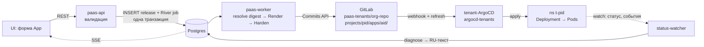
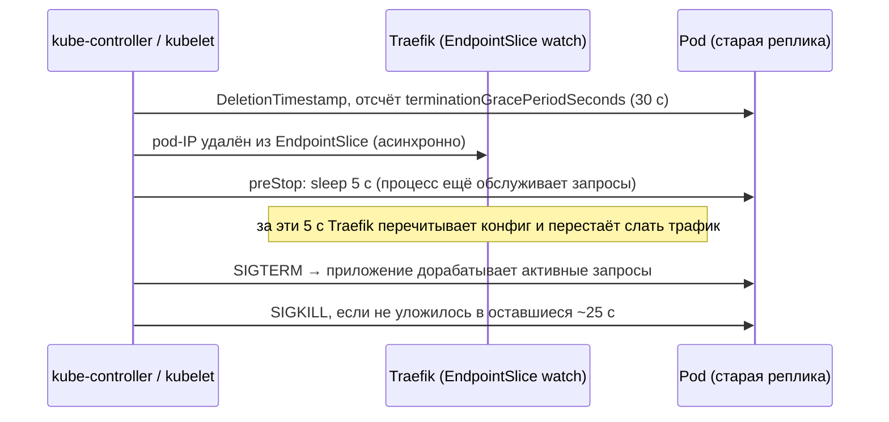
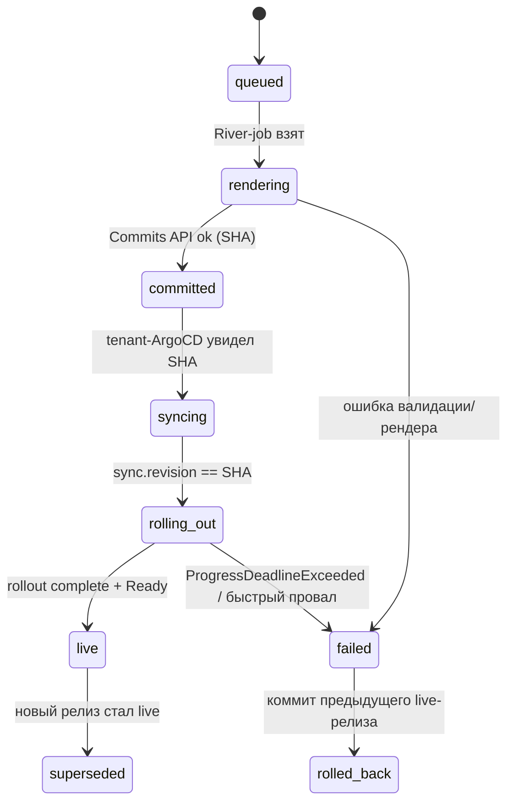
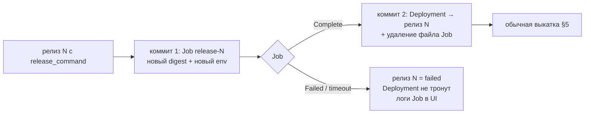

# 07. Услуга Compute («ECS-аналог»): запуск контейнеров

> **TL;DR.** Продаём запуск **одного образа по типизированной спецификации** четырёх видов: `web`, `worker`, `cron`, `job`. YAML от пользователя не принимается никогда. Каждое изменение создаёт иммутабельный **Release** (образ закреплён по digest), который backend рендерит строго типами `k8s.io/api`, пропускает через `Harden()` и коммитит в git; VAP в кластере проверяет результат независимо.
>
> - **Ресурсы:** сетка XS–2XL; **RAM request = limit** (память тенанта никогда не превышает гарантию и не выселяет соседей), CPU с burst ×2–5 и минимальным лимитом 250m; ephemeral-storage ограничен, потому что LINSTOR делит корневую ФС ноды. QoS — Burstable, BestEffort невозможен. Квота = тариф + «резерв выкатки», выкатки внутри проекта сериализуются.
> - **Выкатка без простоя:** `maxUnavailable: 0`, `maxSurge: 1`, встроенный `preStop sleep 5`, readiness/startup с таймаутом 3 с, liveness **выключена** по умолчанию. «Live» — только когда ArgoCD применил нужный SHA и rollout завершён; при провале — **автооткат**. Canary/blue-green (Argo Rollouts) — фаза 2.
> - **Масштабирование:** «HPA всегда» (фиксированные N реплик = `min == max`), поэтому `spec.replicas` не спорит с ArgoCD. Scale-to-zero — фаза 2, собственный «сон/пробуждение» через git + waker; Knative и KEDA HTTP отвергнуты.
> - **Диск:** App с томом = одна реплика StatefulSet + отдельный PVC в git; **нужен новый LINSTOR-пул и SC `lnstr-tenant-*` с `reclaimPolicy: Delete`**: существующие `lnstr-worker-*` кладут вторую реплику на системные ноды, и HA тома не работает. Бэкапа томов в MVP нет.
> - **Миграции** — release command: отдельный Job с новым образом **до** выкатки, оркестрирует backend (не PreSync-хук ArgoCD: тот запускается на каждом рестарте). У Job в git **нельзя** ставить `ttlSecondsAfterFinished`, иначе selfHeal запустит его повторно.
> - **Поддержка пользователя:** диагност переводит ~30 сигналов Kubernetes в русский текст с кнопкой-исправлением («добавить каталог для записи»), делит ошибки на user/platform; проверка конфига образа при создании ловит root, порт < 1024, `VOLUME`, чужую архитектуру **до** деплоя.
> - **Гейты до первого тенанта:** изменения Vector/Loki (метка `level` из JSON тенанта — вектор атаки на кардинальность), новый storage-пул, WireGuard для pod-to-pod.

---

## 1. Что продаём: четыре вида нагрузки

Продаём **запуск одного контейнерного образа по типизированной спецификации**, а не «доступ в Kubernetes». Пользователь не видит namespace, Deployment, YAML и kubectl — видит App, Release, логи, метрики и понятные сообщения об ошибках.

| Вид (`kind`) | Сценарий | Что генерирует backend (в git) | Публичный адрес | Масштабирование |
|---|---|---|---|---|
| `web` | HTTP/gRPC-сервис: сайт, API, бот с вебхуком | `Deployment` (или `StatefulSet` при томе) + `Service` + `IngressRoute`/`Certificate` ([08](08-svc-ingress-domains-ip.md)) + `PodDisruptionBudget` при replicas ≥ 2 + `HorizontalPodAutoscaler` при автоскейле | `<name>-<project_id>.<apps-domain>` + custom domain; или только приватный (`public: false`) | replicas 1..N, HPA по CPU |
| `worker` | Фоновый процесс без входящего порта: консьюмер очереди, бот на long-polling, воркер Celery/Sidekiq | `Deployment` без `Service` | нет | replicas 1..N, HPA по CPU |
| `cron` | Периодическая задача: отчёт, очистка, выгрузка | `CronJob` | нет | один запуск за раз |
| `job` | Разовая задача: миграция, импорт, пересчёт; «release command» перед выкаткой | `Job` с уникальным именем | нет | нет |

**Единица доставки — Release.** Каждое изменение App (новый образ, env, размер, реплики, рестарт) создаёт иммутабельный `Release`: снимок спецификации + **образ, закреплённый по digest** (тег резолвится в `sha256:` в момент создания релиза). Release рендерится в манифесты и коммитится в tenant-репо ([06](06-delivery-pipeline.md)). Откат = новый коммит, отрендеренный из предыдущего Release. Эта идея взята у Cloud Run (`Revision`) без Knative: у нас Release — строка в Postgres, а не CRD.



**Чего НЕ продаём в MVP (явно, в оферте и в UI):**

| Не продаём | Почему |
|---|---|
| Сборку из исходников (buildpacks, Dockerfile в UI) | Отдельный продукт с изоляцией сборок (build = выполнение недоверенного кода с сетью). Клиент собирает в своём CI и пушит в Harbor ([10](10-svc-registry-harbor.md)). Фаза 2+ |
| Несколько контейнеров в поде, пользовательские sidecar'ы, init-контейнеры | Удваивает поверхность валидации и VAP. Один App = один контейнер. Нужен второй процесс — второй App в том же проекте |
| Привилегированные поды, `hostPath`, `hostNetwork`, `hostPort`, свои capabilities | Запрещено слоями 1 и 2 ([03](03-security-model.md)); не «платная опция», а никогда |
| `DaemonSet`, `Service` типа `NodePort`/`LoadBalancer`, `externalIPs` | NodePort на этом кластере = порт на публичных IP всех нод в обход host-firewall. Внешний TCP — только через пул портов bastion ([08](08-svc-ingress-domains-ip.md)) |
| Публичный UDP | haproxy-ingress/bastion работают в TCP-режиме |
| GPU, arm64, Windows-образы | Нет железа. Образ без `linux/amd64` отвергается при создании (§14) |
| Бэкап томов общего назначения | D12: только managed-БД. Написано в оферте и рядом с полем «Диск» в UI |
| Прямой доступ к Kubernetes API, kubeconfig, `kubectl` | Пользователь работает только через UI (требование владельца) |

## 2. Модель App: поля, типы, валидация

### 2.1 Принципы

1. **Allow-list, а не deny-list.** Вход — закрытая структура; поле, которого нет в модели, задать нельзя. YAML от пользователя не принимается никогда (D4).
2. **Три рубежа валидации:** (а) OpenAPI-схема (`oapi-codegen` — типы, `pattern`, `minimum/maximum`); (б) доменная валидация в Go (тариф, уникальность, резервные имена, политика образов — нужна БД); (в) VAP в кластере ([03](03-security-model.md)) — не доверяет рубежам (а) и (б).
3. **Иммутабельное против изменяемого.** `name` и `kind` фиксируются при создании: имя — часть DNS внутри проекта и селекторов, смена ломает соседей и неизменяемый `spec.selector`. Переименовать можно только `display_name`.
4. **Ошибки — по-русски, с путём к полю** (`env[3].name: имя переменной должно начинаться с буквы или «_»`), чтобы UI подсветил поле.

### 2.2 Поля App

| Поле | Тип | Ограничения | По умолчанию | Изменяемо |
|---|---|---|---|---|
| `id` | string | 10 символов `[a-z0-9]`, генерирует сервер (схема как у `project_id`) | — | нет |
| `name` | string | `^[a-z]([a-z0-9-]{0,22}[a-z0-9])?$` (≤ 24); уникально в проекте; не из резерва: `paas-*`, `argocd*`, `pg-*`, `redis-*`, `nats-*`, `kube-*`, `default`, `harbor-pull` | — | **нет** |
| `display_name` | string | 1..64 символа Unicode | = `name` | да |
| `kind` | enum | `web` \| `worker` \| `cron` \| `job` | — | **нет** |
| `image` | string | парсится `go-containerregistry` `name.ParseReference`; реестр ∈ {Harbor платформы, `docker.io`, `ghcr.io`, `quay.io`} — публичные переписываются в proxy-cache Harbor (D4, D7) | — | да |
| `command` / `args` | []string | ≤ 32 элементов, каждый ≤ 1 KiB, без NUL; оболочка не подразумевается — нужен shell, пишите `["sh","-c","…"]` (и shell должен быть в образе) | из образа | да |
| `port` | int | 1..65535; для `web` обязателен | 8080 (или первый `EXPOSE` образа, §14) | да |
| `protocol` | enum | `http` \| `h2c` (gRPC без TLS внутри) | `http` | да |
| `public` | bool | только `web` | `true` | да |
| `size` | enum | `XS`..`2XL` из разрешённых тарифом (§3) | `S` | да |
| `replicas` | int | 1..`tariff.max_replicas`; при томе — ровно 1 | 1 | да |
| `autoscaling` | object | `{enabled, min ≥ 1, max ≤ tariff, cpu_target 50..90}`; только тарифы с HPA; несовместимо с томом | выкл | да |
| `env` | map | ≤ 100 ключей; имя `^[A-Za-z_][A-Za-z0-9_]{0,127}$`; значение ≤ 4 KiB, суммарно ≤ 64 KiB; запрещены `PORT`, `PAAS_*`, `KUBERNETES_*` | — | да |
| `secret_env` | []object | `{env, secret, key}` — ссылка на секрет проекта ([12](12-svc-secrets.md)); ≤ 50 | — | да |
| `secret_files` | []object | `{secret, mount_path}`; путь абсолютный, не `/`, `/proc`, `/sys`, `/dev`, `/etc`, `/tmp`; ≤ 5 | — | да |
| `health` | object | §4 | TCP на `port` | да |
| `writable_paths` | []object | `{path, size_mib}`; ≤ 5; путь абсолютный, не системный; сумма ≤ лимита `ephemeral-storage` размера | `/tmp` всегда | да |
| `volume` | object | `{size_gib 1..tariff, mount_path}`; ≤ 1 на App; только `web`/`worker` | нет | размер — только вверх |
| `termination_grace_seconds` | int | 10..300 | 30 | да |
| `release_command` | []string | для `web`/`worker`: команда перед выкаткой (миграции, §11) | нет | да |
| `schedule`, `timezone`, `concurrency`, `timeout_seconds`, `retries` | — | только `cron`/`job`, §10–§11 | — | да |

### 2.3 Модель в Go (фрагмент)

```go
// internal/compute/model.go
type AppKind string

const (
	KindWeb    AppKind = "web"
	KindWorker AppKind = "worker"
	KindCron   AppKind = "cron"
	KindJob    AppKind = "job"
)

type AppSpec struct {
	Name          string            `json:"name"`
	Kind          AppKind           `json:"kind"`
	Image         string            `json:"image"`
	Command       []string          `json:"command,omitempty"`
	Args          []string          `json:"args,omitempty"`
	Port          *int32            `json:"port,omitempty"`
	Protocol      string            `json:"protocol,omitempty"`
	Public        bool              `json:"public"`
	Size          SizeName          `json:"size"`
	Replicas      int32             `json:"replicas"`
	Autoscaling   *Autoscaling      `json:"autoscaling,omitempty"`
	Env           map[string]string `json:"env,omitempty"`
	SecretEnv     []SecretEnvRef    `json:"secret_env,omitempty"`
	SecretFiles   []SecretFileRef   `json:"secret_files,omitempty"`
	Health        HealthSpec        `json:"health"`
	WritablePaths []WritablePath    `json:"writable_paths,omitempty"`
	Volume        *VolumeSpec       `json:"volume,omitempty"`
	GraceSeconds  int64             `json:"termination_grace_seconds"`
	ReleaseCmd    []string          `json:"release_command,omitempty"`
	Cron          *CronSpec         `json:"cron,omitempty"`
}

var (
	reName    = regexp.MustCompile(`^[a-z]([a-z0-9-]{0,22}[a-z0-9])?$`)
	reEnvName = regexp.MustCompile(`^[A-Za-z_][A-Za-z0-9_]{0,127}$`)
	reserved  = []string{"paas-", "argocd", "pg-", "redis-", "nats-", "kube-"}
)

// Validate — доменный рубеж (б). Схемный рубеж (а) уже отработал в oapi-codegen.
func (s *AppSpec) Validate(t Tariff, img *ImageFacts) FieldErrors {
	var errs FieldErrors
	if !reName.MatchString(s.Name) || hasReservedPrefix(s.Name, reserved) {
		errs.Add("name", "имя: 1–24 символа, латиница в нижнем регистре, цифры и «-», начинается с буквы")
	}
	size, ok := t.AllowedSizes[s.Size]
	if !ok {
		errs.Add("size", fmt.Sprintf("размер %s недоступен на тарифе «%s»", s.Size, t.Title))
	}
	maxRep := s.Replicas
	if s.Autoscaling != nil && s.Autoscaling.Enabled {
		maxRep = s.Autoscaling.Max
	}
	// Квота проверяется по МАКСИМУМУ реплик: HPA не должен упираться в ResourceQuota.
	if ok && !t.FitsProject(s.Name, size, maxRep) {
		errs.Add("replicas", "не хватает ресурсов тарифа: уменьшите реплики/размер или перейдите на старший тариф")
	}
	if s.Volume != nil && (s.Replicas != 1 || s.Autoscaling != nil) {
		errs.Add("volume", "приложение с диском работает ровно в одном экземпляре")
	}
	total := 0
	for k, v := range s.Env {
		if !reEnvName.MatchString(k) || k == "PORT" || strings.HasPrefix(k, "PAAS_") || strings.HasPrefix(k, "KUBERNETES_") {
			errs.Add("env."+k, "недопустимое или зарезервированное имя переменной")
		}
		total += len(k) + len(v)
	}
	if total > 64<<10 {
		errs.Add("env", "суммарный объём переменных окружения больше 64 КиБ")
	}
	if img != nil && !img.HasLinuxAMD64 {
		errs.Add("image", "в образе нет варианта linux/amd64 — на наших серверах он не запустится")
	}
	return errs
}
```

**Почему имя ≤ 24 символов:** платформенный хост `<name>-<project_id>.<apps-domain>` — один DNS-label ≤ 63 символов; 24 + 1 + 10 = 35 оставляет запас. Имя CronJob ограничено 52 символами (контроллер добавляет суффикс к Job) — 24 проходит с запасом.

## 3. Размеры инстансов: тарифная сетка, requests/limits, QoS

### 3.1 Сетка размеров (на одну реплику)

| Размер | CPU request | CPU limit (burst) | RAM request = limit | ephemeral-storage limit | `/tmp` sizeLimit | Для чего |
|---|---|---|---|---|---|---|
| `XS` | 64m | 250m (×3.9) | 128Mi | 512Mi | 128Mi | бот, крошечный Go/Rust-сервис |
| `S` | 125m | 500m (×4) | 256Mi | 1Gi | 256Mi | лёгкий API на Go/Node, статический сайт |
| `M` | 250m | 1000m (×4) | 512Mi | 1Gi | 256Mi | типовой Node/Python-сервис |
| `L` | 500m | 1500m (×3) | 1Gi | 2Gi | 512Mi | Django/Rails, небольшая JVM |
| `XL` | 1000m | 2000m (×2) | 2Gi | 4Gi | 1Gi | JVM, тяжёлый Python |
| `2XL` | 2000m | 4000m (×2) | 4Gi | 8Gi | 2Gi | только старшие тарифы |

Сетка — **параметр платформы** (таблица в Postgres + дубль в конфиге backend), а не код. Какие размеры, сколько реплик и какая суммарная квота положены тарифу — [13](13-billing-and-quotas.md). Цифры выведены из fair-use-расчёта исследования биллинга (Starter ≈ 250m / 512Mi суммарно по requests) и **обязаны быть пересчитаны** после замера реальной ёмкости tenant-пула (⚠️ проверить: `kubectl describe node` по нодам пула, сумма `allocatable` минус DaemonSet'ы).

### 3.2 Политика requests/limits — и почему именно так

| Правило | Обоснование |
|---|---|
| **RAM: request = limit** | Память нельзя «притормозить», только убить. При `limit > request` поды суммарно обещают больше физической памяти, и при нехватке kubelet выселяет того, кто вылез за request, — в мультитенантной среде это чужой под. При `request = limit` под тенанта **никогда не превышает request** и не становится первой жертвой memory-pressure eviction. Честно для клиента: «512 МБ — ваши, больше не будет, при превышении — OOMKilled с понятным сообщением» (§13) |
| **CPU: limit = request × (2..5)** | CPU сжимаемый: при избытке спроса ядро дросселирует (CFS), а не убивает. Burst нужен рантаймам на старте (JVM, Node, Python-импорты) — без него старт тянется десятки секунд и не укладывается в пробы |
| **CPU limit не ниже 250m** | На этом кластере был реальный инцидент: Filestash с `limits.cpu: 100m` дросселировался в 80 % CFS-периодов, healthz отвечал ~3 с, readiness с таймаутом 1 с не проходил, `helm --atomic` откатывал релиз. Лимит ниже 250m — генератор тикетов «моё приложение не стартует» |
| **CPU limit вообще нужен** | Спор «CPU limits вредны» справедлив для однородной команды. У нас flat-подписка: без лимита один тенант забирает простаивающие ядра всей ноды, и соседи получают непредсказуемую латентность. Кроме того, `ResourceQuota` с `limits.cpu` требует лимит у каждого контейнера |
| **ephemeral-storage request + limit** | LINSTOR на этом кластере — `fileThinPool` **на корневой ФС ноды**: блочные тома, образы, логи и `emptyDir` делят один диск. Без лимита один `/tmp` на 50 ГБ валит ноду по `DiskPressure` вместе с томами соседей. Превышение → выселение пода с текстом из §13 |
| **`/tmp` на диске, не в памяти** | `emptyDir.medium: Memory` (tmpfs) засчитывается в лимит памяти контейнера → неожиданные OOMKilled. Диск с `sizeLimit` предсказуемее |

### 3.3 QoS: Burstable с гарантией памяти. Почему не BestEffort и не Guaranteed

- **BestEffort — никогда.** Под без requests планировщик не учитывает, он первым выселяется при любом давлении, а ResourceQuota по `requests.*` его вообще не пропустит (квота требует requests у каждого контейнера). BestEffort в мультитенантном кластере — это «продали воздух». VAP ([03](03-security-model.md)) отклоняет контейнер без `resources.requests` и `resources.limits` по CPU и памяти, `LimitRange` ([02](02-tenancy-and-isolation.md)) подставляет дефолты как страховку.
- **Guaranteed (CPU request = limit) — не по умолчанию.** Лишает burst на старте и вызывает дросселирование на пиках без выгоды для соседей (их память и так защищена правилом request = limit). Guaranteed с целыми ядрами и `cpuManagerPolicy: static` (закреплённые ядра, изоляция кэша) — кандидат в премиум-опцию «выделенные ядра» вместе с выделенными нодами; фаза 3.
- Итог: QoS-класс формально **Burstable**, но память ведёт себя как у Guaranteed. Порядок выселения при memory pressure учитывает превышение request — наши поды его не превышают.

### 3.4 PriorityClass

> ✅ Заменено R-QUOTA ([01 §12.1](01-architecture-overview.md)): классы определены в [02](02-tenancy-and-isolation.md) — `paas-system`, `paas-control`, `tenant-paid`, `tenant-trial`; приложения и БД используют `tenant-paid` (триал — `tenant-trial`). Ниже — исходное предложение раздела, в манифесты не переносить.

Ansible заводит два класса (платформа, D1), backend только ссылается на них, VAP проверяет, что `priorityClassName` из этого списка:

```yaml
apiVersion: scheduling.k8s.io/v1
kind: PriorityClass
metadata:
  name: paas-tenant-default          # App: web/worker/cron/job
value: 1000
preemptionPolicy: Never              # тенант никогда не вытесняет тенанта
globalDefault: false
description: "Нагрузка тенантов PaaS"
---
apiVersion: scheduling.k8s.io/v1
kind: PriorityClass
metadata:
  name: paas-tenant-data             # managed-БД и App с томом (09)
value: 1500
preemptionPolicy: Never
globalDefault: false
description: "Stateful-нагрузка тенантов PaaS: первой не выселяется"
```

`preemptionPolicy: Never` — принципиально: иначе под тенанта с приоритетом выше вытеснил бы соседа при нехватке места, и один клиент мог бы «выдавить» другого. Системные компоненты (без PriorityClass или с `system-*`) стоят на другом пуле нод (D4) и в конкуренцию не вступают.

### 3.5 Квота и rolling update: ловушка «exceeded quota при деплое»

`RollingUpdate` с `maxSurge: 1` на время выкатки поднимает **дополнительный** под. Если ResourceQuota равна сумме реплик впритык, surge-под не создаётся (`FailedCreate … exceeded quota`), и деплой висит до `progressDeadlineSeconds`. Решение:

1. **Квота namespace = тариф + «резерв выкатки»**, равный крупнейшему размеру, разрешённому тарифу. Резерв пользователю не продаётся и в UI не показывается как свободный.
2. **Backend считает занятость по тарифу, а не по квоте:** `Σ(max_replicas × size)` по всем App проекта ≤ тарифа (метод `FitsProject` из §2.3). Резерв физически могут занять только surge-поды и `release_command`-Job.
3. **Выкатки внутри проекта сериализуются.** Очередь River с уникальностью по `project_id`: пока идёт выкатка одного App, следующая ждёт. Одновременные surge двух App не выбирают резерв. На латентность это почти не влияет: чаще всего в проекте 1–3 App.
4. **Под `CronJob` резерв не рассчитан.** Если cron-запуск совпал с выкаткой и не влез, Job ждёт (контроллер повторяет создание), в UI — статус «ожидает ресурсы».
5. Завершённые поды (`Succeeded`/`Failed`) квоту не занимают, поэтому последовательность «release-Job → surge» укладывается в один резерв.

### 3.6 Подсказки рантаймам

Backend всегда кладёт в env: `PORT` (порт App), `PAAS_MEMORY_LIMIT_MB`, `PAAS_CPU_LIMIT_MILLI`, `PAAS_APP`, `PAAS_PROJECT`, `PAAS_RELEASE`, `HOME=/tmp` (пользователь может переопределить; у UID 10001 без записи в `/etc/passwd` `HOME=/`, а он read-only: npm, pip, git и многие SDK падают при записи кэша). Для популярных рантаймов UI показывает подсказку по памяти, но **ничего не подставляет сам** — неявная магия прячет причину OOM:

| Рантайм | Подсказка |
|---|---|
| JVM ≥ 11 | контейнерно-осведомлённая; `-XX:MaxRAMPercentage=75` вместо `-Xmx` |
| Node.js | `--max-old-space-size` ≈ 75 % от `PAAS_MEMORY_LIMIT_MB` |
| Go ≥ 1.25 | `GOMAXPROCS` учитывает CPU-лимит cgroup сам; `GOMEMLIMIT` ≈ 90 % лимита памяти |
| Python/gunicorn | число воркеров = f(лимит памяти), а не f(`nproc`): `nproc` покажет все ядра ноды |

## 4. Health-checks: liveness / readiness / startup

### 4.1 Дефолты

| Проба | `web` по умолчанию | `worker` | `cron`/`job` | Параметры |
|---|---|---|---|---|
| `startupProbe` | TCP на `port`; HTTP `GET health.path`, если путь задан | нет | нет | `periodSeconds: 5`, `timeoutSeconds: 3`, `failureThreshold = start_timeout/5` (дефолт 120 с → 24; диапазон 10..600 с) |
| `readinessProbe` | то же, что startup | нет | нет | `periodSeconds: 5`, `timeoutSeconds: 3`, `failureThreshold: 3`, `successThreshold: 1` |
| `livenessProbe` | **выключена** | выключена | нет | включается тумблером: только HTTP на **отдельный** путь; `periodSeconds: 10`, `timeoutSeconds: 5`, `failureThreshold: 3` |

### 4.2 Решения и почему

- **Liveness выключена по умолчанию.** Типовая авария: liveness проверяет `/health`, который ходит в БД; БД тормозит → все поды приложения одновременно убиваются → на рестарте они бьют в ту же БД → каскад. Упавший процесс kubelet перезапустит и без liveness. Liveness нужна только для зависаний (deadlock, event loop встал), и включает её пользователь осознанно, с подсказкой в UI: «проверяйте только сам процесс, не зависимости».
- **Никогда `timeoutSeconds: 1`** (дефолт Kubernetes). На этом кластере он уже ронял выкатку Filestash: под отвечал 200 за 1.5–3 с под CFS-дросселированием, kubelet считал пробу проваленной. Минимум — 3 с.
- **startupProbe вместо `initialDelaySeconds`.** Пока startup не прошла, liveness и readiness не запускаются. Медленный старт не убивает под, быстрый старт не ждёт зря.
- **Readiness = startup по умолчанию.** Пользователь задаёт один `health.path`; отдельный readiness-путь — расширенная настройка.
- **HTTP-проба считает успехом 200–399.** Типовая ловушка: `/` отдаёт 301 на `/login`, это успех; 404 — провал. Подсказка в форме: «укажите путь, который отвечает 200 без авторизации».
- **Порт пробы = порт App**, отдельный порт — расширенная настройка. Пробы идут от kubelet на pod-IP; тенантский CCNP ([03](03-security-model.md)) обязан разрешать `fromEntities: [host]` на порты подов, иначе пробы падают сразу после включения политики (⚠️ проверить на стенде с `hostFirewall`).
- **`exec`-пробы — только расширенный режим**, командой-массивом, без shell по умолчанию. В distroless-образе нет ни `sh`, ни `curl`, и `exec`-проба с ними — самая частая ошибка новичков.
- **`HEALTHCHECK` из Dockerfile Kubernetes игнорирует.** Если в образе он есть, UI предлагает перенести команду в пробу (данные из конфига образа, §14).
- **gRPC** (`protocol: h2c`): нативная gRPC-проба Kubernetes (`grpc.port`), если сервис реализует `grpc.health.v1`; иначе TCP.

### 4.3 Как пробы связаны с выкаткой

`progressDeadlineSeconds = start_timeout + 120` (не меньше 180). Если новые поды не стали Ready за это время, Deployment получает `Progressing=False, reason=ProgressDeadlineExceeded`, и backend автоматически откатывает релиз (§5.4). Быстрые явные провалы (образ не найден, CrashLoop с ≥ 3 рестартами, `CreateContainerConfigError` дольше 60 с) status-watcher ловит раньше дедлайна и откатывает сразу.

## 5. Zero-downtime деплой

### 5.1 Стратегия выкатки

```yaml
spec:
  strategy:
    type: RollingUpdate
    rollingUpdate:
      maxUnavailable: 0        # старые поды живут, пока новые не стали Ready
      maxSurge: 1              # ровно один лишний под — под него есть «резерв выкатки» в квоте (§3.5)
  minReadySeconds: 5           # под, упавший через 2 с после Ready, не считается доступным
  progressDeadlineSeconds: 240 # = start_timeout + 120 (§4.3)
  revisionHistoryLimit: 2      # откат делаем через git, а не через ReplicaSet; etcd один — не копим объекты
```

`maxSurge: 1`, а не `25%`: при 8 репликах `25%` дало бы 2 surge-пода и вдвое больший резерв квоты. Одна реплика за шаг медленнее, зато квота предсказуема.

### 5.2 Корректное завершение пода



- **Почему `preStop` нужен.** Traefik маршрутизирует IngressRoute на pod-IP из EndpointSlice, а не на ClusterIP. Удаление IP и SIGTERM идут параллельно. Без паузы процесс закрывает сокет раньше, чем Traefik узнаёт об этом, и клиенты получают 502. Внутрикластерный трафик через Cilium (kube-proxy replacement) подвержен той же гонке: eBPF-карта сервисов обновляется асинхронно.
- **Встроенное действие `lifecycle.preStop.sleep`**, а не `exec: ["sleep","5"]`: в distroless-образах нет бинаря `sleep`, и exec-хук молча падает. Действие `sleep` появилось в 1.29 (⚠️ проверить статус GA в 1.36: `kubectl explain pod.spec.containers.lifecycle.preStop.sleep`).
- **`terminationGracePeriodSeconds` включает время `preStop`.** Дефолт 30 с, пользователь меняет в пределах 10..300 (консьюмерам очередей нужно дольше). Для `worker` preStop не ставится: Endpoints у него нет.
- Пользователю подсказка в UI: «приложение должно корректно завершаться по SIGTERM». В образах, где PID 1 — shell-скрипт без `exec`, сигнал до процесса не доходит, и под ждёт SIGKILL все 30 с. Лечится `exec` в entrypoint или `tini`.

### 5.3 PodDisruptionBudget и обслуживание нод

| Реплик | PDB | Что это значит |
|---|---|---|
| 1 | **нет** | При `drain` ноды под пересоздаётся на другой — простой в секунды-минуты. Написано в UI рядом с полем «Реплики» и в оферте. PDB с `maxUnavailable: 0` на одной реплике навсегда заблокировал бы `node-drain-on.yaml`, и соло-оператор не смог бы обслуживать ноды |
| ≥ 2 | `maxUnavailable: 1`, `unhealthyPodEvictionPolicy: AlwaysAllow` | Drain выселяет по одному поду. `AlwaysAllow` не даёт падающим (NotReady) подам блокировать drain |
| App с томом | нет | Одна реплика по построению (§7) |

При `replicas ≥ 2` добавляется `topologySpreadConstraints` по `kubernetes.io/hostname` с `whenUnsatisfiable: ScheduleAnyway`: пул tenant-нод на старте — 2 ноды, `DoNotSchedule` оставил бы под в Pending при недоступности одной ноды.

### 5.4 Статусы релиза и автооткат



- **`live`** ставится только при выполнении всех условий (D3): `Application.status.sync.revision == SHA`, `Application.status.health == Healthy`, у Deployment `observedGeneration ≥ generation`, `updatedReplicas == availableReplicas == replicas`, старых реплик нет. Проверка по одному `health` недостаточна: отстающий git даёт «зелёный» статус на старой ревизии.
- **Автооткат включён по умолчанию.** При `failed` backend коммитит рендер последнего `live`-релиза с сообщением `rollback(app): release 42 failed: IMAGE_NOT_FOUND`. Почему не оставить «висящую» выкатку: при `maxUnavailable: 0` старые поды продолжают работать, но surge-под держит резерв квоты, блокирует очередь выкаток проекта (§3.5), а git расходится с тем, что реально обслуживает трафик. После отката git снова совпадает с реальностью.
- **Ручной откат** — кнопка «Вернуть релиз N»: создаётся новый релиз со спецификацией и digest релиза N. История линейна, `git revert` не используется.

### 5.5 Рестарт и масштабирование — тоже через git

По D3 прямые patch-запросы запрещены (selfHeal откатил бы их). «Перезапустить» создаёт релиз, в котором меняется только аннотация шаблона пода `paas.1520.tech/restarted-at: "<RFC3339>"`. Выкатка идёт по тем же правилам, то есть тоже без простоя. «Масштабировать» меняет `spec.replicas` в git (или `minReplicas`/`maxReplicas` HPA, §9). Латентность 5–15 с при тёплом образе приемлема для этих операций.

### 5.6 Argo Rollouts (canary, blue-green) — не в MVP, фаза 2

**Решение: в MVP только RollingUpdate.** Причины:

1. Canary с весами требует маршрутизации по весам (Traefik `TraefikService` weighted) и анализа по метрикам конкретного тенанта (доля 5xx, латентность). Это HTTP-метрики на уровне сервиса, которых в MVP нет (§12).
2. Появляется `Rollout` вместо `Deployment`: нужны новый kind в `resource.inclusions` tenant-ArgoCD, права в RoleBinding и отдельная ветка рендера и golden-тестов. VAP при этом ничего не теряет, потому что проверяет итоговые Pod'ы, кто бы их ни создал.
3. Для hobby-нагрузки RollingUpdate с автооткатом закрывает 95 % потребности.

Фаза 2, первым шагом — **blue-green с ручным promote** (UI: «новая версия поднята на preview-адресе, переключить?»). Это самая понятная пользователю модель, и ей не нужны метрики. Argo Rollouts v1.9.1 в кластере уже стоит (для Kargo). Для тенантов его либо переиспользуют, либо ставят отдельным инстансом с `--namespaced`/`instanceID`. ⚠️ Нужно решить в фазе 2 после проверки текущего scope контроллера: общий инстанс означает, что тенантские Rollout'ы и системные делят один контроллер и одну очередь.

## 6. Переменные окружения и секреты

Полностью модель секретов описана в [12](12-svc-secrets.md). Здесь — только то, что касается пода.

| Источник | Где хранится | Как попадает в под | Видимость |
|---|---|---|---|
| Обычная переменная (`env`) | Postgres (спецификация релиза) | `env[].value` прямо в Deployment в git | Git-история tenant-репо (читают только backend и tenant-ArgoCD), UI проекта |
| Секрет как переменная (`secret_env`) | Vault KV v2 `paas-tenants/data/t-<pid>/<secret>` | `ExternalSecret app-<name>-env` (в git — только ссылка) → Secret → `env[].valueFrom.secretKeyRef` | Никогда не попадает в git и Postgres |
| Секрет как файл (`secret_files`) | то же | тот же Secret → том `secret`, `readOnly`, `defaultMode: 0440` | то же |
| Платформенные (`PORT`, `PAAS_*`, `HOME`) | генерирует backend | `env[].value` | — |

**Решения:**

- **Детектор «секрета в обычной переменной».** Если имя совпадает с `(?i)(pass|secret|token|api_?key|private|dsn|credential)` или значение похоже на ключ (энтропия > 4 бит/символ при длине ≥ 20, префиксы `sk_`, `ghp_`, `glpat-`, `AKIA`), UI предупреждает: «значение будет храниться в истории конфигурации; перенести в Секреты?». Запрета нет (ложные срабатывания), но по умолчанию фокус на кнопке «Перенести».
- **`valueFrom.secretKeyRef` по ключам, а не `envFrom`.** Явное соответствие «переменная ← секрет/ключ» можно проверить до выкатки, и можно переименовать переменную, не трогая секрет. `envFrom` молча пропускает невалидные имена и прячет, откуда пришло значение.
- **`enableServiceLinks: false`.** Без этого Kubernetes добавляет в каждый под переменные вида `REDIS_PORT=tcp://10.4.1.7:6379` для каждого Service в namespace. Приложение, ждущее в `REDIS_PORT` число, падает. Это классическая ошибка, и она гарантированно проявится, когда в проекте появится managed Redis с именем `redis`.
- **Детерминированный рендер.** Переменные сортируются по имени (map в Go итерируется случайно). Иначе каждый рендер даёт новый порядок → новый pod template → лишний рестарт и шум в git.
- **Смена значения секрета = новый релиз.** Значение переменной окружения читается один раз при старте процесса, поэтому новое значение в Vault поды не увидят без рестарта. При сохранении секрета UI предлагает «Применить к приложениям: api, worker». Backend создаёт релизы, в которых меняются `remoteRef.version` в ExternalSecret (закрепление версии KV v2) и аннотация шаблона `paas.1520.tech/secrets-rev: <sha256 списка (секрет, версия)>`.
- **Гонка «под стартовал раньше, чем ESO обновил Secret».** ExternalSecret получает `argocd.argoproj.io/sync-wave: "-1"`, Deployment — `"0"`. tenant-ArgoCD ждёт здоровья волны -1, и для этого в его `argocd-cm` (ansible, D1) нужна health-проверка ExternalSecret: Ready=True **и** `status.syncedResourceVersion` соответствует текущему `metadata.generation`. ⚠️ Проверить формат `syncedResourceVersion` в ESO 2.5 и встроенную health-проверку ArgoCD 3.5 для `external-secrets.io/ExternalSecret`.
- **Stakater Reloader для тенантов не используется.** Он патчит шаблон пода в кластере в обход git: это нарушает D3 и потребовало бы `ignoreDifferences` на каждом Application. Рестарт из-за секрета — обычный релиз через git.
- **Файлы конфигурации из ConfigMap** (nginx.conf и т.п.) — фаза 2 (редактор в UI → ConfigMap в git → том). В MVP конфиг либо в образе, либо в переменных.

## 7. Тома: emptyDir и PVC

### 7.1 Временные каталоги (`emptyDir`) — всегда

`readOnlyRootFilesystem: true` (D4) означает, что писать можно только в явно смонтированные тома. Backend монтирует:

| Каталог | Откуда | Размер |
|---|---|---|
| `/tmp` | всегда | `sizeLimit` по размеру инстанса (§3.1) |
| `writable_paths[]` | пользователь, ≤ 5 путей (`/var/cache/nginx`, `/app/.next/cache`, …) | задаёт пользователь, сумма ≤ ephemeral-storage |
| `VOLUME` из конфига образа | автоматически (§14) | 256Mi каждый, в пределах лимита |

Всё это пропадает при перезапуске пода. В UI так и написано: «временные каталоги».

### 7.2 Постоянный диск (PVC)

**Модель:** не больше одного тома на App, только для `web`/`worker`. Такой App — **`StatefulSet` с ровно одной репликой** и **отдельный PVC в git**: не `volumeClaimTemplates`, а `volumes[].persistentVolumeClaim.claimName`.

| Решение | Почему |
|---|---|
| Одна реплика | Блочный том (DRBD, `ext4`) монтируется на одну ноду; два процесса, пишущих в один каталог данных (SQLite, файловая загрузка), = порча данных. Нужно масштабироваться — выносите состояние в managed-БД или S3 |
| `StatefulSet`, а не `Deployment` | StatefulSet гарантирует «не больше одного пода с этим именем»: замена не создаётся, пока старый под не удалён. Deployment при потере ноды поднимает второй под сразу |
| Отдельный PVC, а не `volumeClaimTemplates` | PVC из шаблона создаёт контроллер, не ArgoCD: его нельзя увеличить через git (шаблон неизменяем) и на него не повесить `Delete=false`. Отдельный PVC в git растёт сменой `spec.resources.requests.storage` |
| Деплой = короткий простой | StatefulSet с одной репликой сначала останавливает старый под, потом запускает новый. Честно в UI: «приложение с диском при обновлении недоступно ~10–30 с» |
| `fsGroup: 10001`, `fsGroupChangePolicy: OnRootMismatch` | Том пишется непривилегированным UID; рекурсивный `chown` только при несовпадении, а не на каждом старте |
| Доступ `ReadWriteOncePod` | Запрещает второй под даже на той же ноде. ⚠️ Проверить поддержку в LINSTOR CSI; если её нет — `ReadWriteOnce` |
| Размер 1..N GiB (N по тарифу), только увеличение | `allowVolumeExpansion: true`; уменьшить `ext4`-том нельзя. ⚠️ Проверить онлайн-расширение на DRBD без рестарта пода |

**StorageClass — новый, под пул tenant-нод.** Существующие `lnstr-worker-*` для тенантов **не годятся**: пул `lnstr-file-thin-worker` есть на **всех** воркерах, и вторая DRBD-реплика ляжет на системный воркер, куда tenant-под не пустят taint и nodeSelector (D4). При `allowRemoteVolumeAccess: false` под обязан жить на ноде с репликой. Значит, при падении tenant-ноды под окажется на единственной оставшейся реплике, куда ему нельзя, и зависнет в `Pending` с `volume node affinity conflict`. Отказоустойчивость, за которую заплачено вторым экземпляром данных, не сработает.

Предложение для ansible (платформа, D1) — по образцу уже заготовленного, но не введённого тира `dedic`:

```yaml
# hosts-vars-override/<cluster>/linstor.yaml — дополнение
linstor_cluster_helm_values_linstor_satellite_configurations:
  # ... существующие manager / worker ...
  - name: tenant
    nodeSelector:
      paas.1520.tech/pool: tenant
    storagePools:
      - name: lnstr-file-thin-tenant
        fileThinPool:
          directory: /var/lib/linstor-pools/lnstr-file-thin-tenant
linstor_cluster_helm_values_storage_classes:
  - name: "lnstr-tenant-multi-sync"          # дефолт для томов App
    allowVolumeExpansion: true
    reclaimPolicy: "Delete"                   # см. ниже — отличие от системных классов
    volumeBindingMode: "WaitForFirstConsumer"
    provisioner: linstor.csi.linbit.com
    parameters:
      linstor.csi.linbit.com/autoPlace: "2"
      linstor.csi.linbit.com/storagePool: "lnstr-file-thin-tenant"
      linstor.csi.linbit.com/allowRemoteVolumeAccess: "false"
      property.linstor.csi.linbit.com/DrbdOptions/Net/protocol: "C"
      csi.storage.k8s.io/fstype: "ext4"
  - name: "lnstr-tenant-local"               # том без второй DRBD-реплики (кандидат для БД — см. §17)
    # то же, autoPlace: "1"
```

⚠️ Проверить: satellite-конфиг `worker` выбирает ноды по `node-role.kubernetes.io/worker`, то есть tenant-ноды попадут в оба конфига. Нужно либо сузить `worker` до `paas.1520.tech/pool` ≠ tenant, либо убедиться, что Piraeus корректно сливает два конфига на одной ноде. Проверяется на стенде `kubectl linstor storage-pool list`.

**`reclaimPolicy: Delete`, а не `Retain`, как у всех системных классов.** `Retain` при удалении PVC оставляет `Released` PV и DRBD resource-definition. Владелец это уже знает как двухшаговую ручную уборку. На тысячах тенантских томов это гарантированная утечка диска. Защита от случайного удаления переносится выше: PVC в git несёт `argocd.argoproj.io/sync-options: Delete=false,Prune=false` (D3), так что ошибка рендера или удалённый файл не сносят том. Удаляет PVC только `paas-provisioner` по явному действию пользователя, после 7 дней «корзины» (App удалён → том ещё 7 дней лежит отсоединённым, его можно восстановить). Для managed-БД D6 фиксирует `lnstr-worker-multi-sync`/`lnstr-worker-local`, и к ним применимо то же возражение. Здесь D6 не меняется: сомнение вынесено в §17, решение принимают [09](09-svc-databases.md) и владелец.

**Квоты.** В ResourceQuota tenant-ns: `requests.storage`, `lnstr-tenant-multi-sync.storageclass.storage.k8s.io/requests.storage` и `lnstr-tenant-local.storageclass.storage.k8s.io/requests.storage` по тарифу; для **всех остальных** классов — `<sc>.storageclass.storage.k8s.io/persistentvolumeclaims: "0"`, чтобы тенант не взял системный SC. Тарифицируется выделенный объём, а не занятый; двойную репликацию оплачивает платформа, и это заложено в цену ([13](13-billing-and-quotas.md)).

**Thin-пул = overcommit.** Квота считает заявленный размер, а `fileThinPool` физически заполняется по мере записи — и лежит на **корневой ФС ноды** рядом с образами и логами. Provisioner перестаёт принимать новые тома при физическом заполнении пула ≥ 70 %, алерт на 80 % ([15](15-observability-and-operations.md)).

**Бэкап — не в MVP (D12).** В UI рядом с полем «Диск» и в оферте: «Резервные копии диска не делаются. Для важных данных используйте managed-Postgres (с бэкапами) или S3». Экспорт тома (Job с `tar` в S3) — фаза 2.

**Отказ ноды.** Под StatefulSet на мёртвой ноде сам по себе не удаляется: Kubernetes не может подтвердить остановку. Автоматический переезд даёт Piraeus HA Controller: он удаляет поды на нодах, потерявших DRBD-кворум. ⚠️ Проверить, что он включён в текущей установке Piraeus 2.10.6; если нет — переезд только вручную, через taint `node.kubernetes.io/out-of-service`.

## 8. Приватная сеть между приложениями проекта

| Откуда → куда | Разрешено? | Как |
|---|---|---|
| App → App того же проекта | **да** | `Service` типа `ClusterIP` с именем App. Адрес в UI: `http://api:8080` (короткое имя работает внутри namespace) или `api.t-<pid>.svc.cluster.local` |
| App → managed-БД того же проекта | **да** | Service БД в том же namespace ([09](09-svc-databases.md)) |
| App → App другого проекта (даже той же организации) | **нет** | Проект — граница изоляции (D2). CCNP разрешает ingress только из своего namespace и из `traefik-lb`/`haproxy-lb` ([03](03-security-model.md)) |
| App → интернет | да, кроме порта 25 и приватных диапазонов | CCNP egress (D4) |
| App → Kubernetes API, IP нод, pod/service CIDR чужих ns | **нет** | CCNP egress (D4) |
| Интернет → App | только через Traefik (`public: true`) или L4-порт bastion ([08](08-svc-ingress-domains-ip.md)) | `IngressRoute` / TCP-маршрут |

**Решения:**

- **Только `ClusterIP`.** ResourceQuota tenant-ns содержит `services.nodeports: "0"` и `services.loadbalancers: "0"`, VAP отклоняет `type: NodePort|LoadBalancer`, непустой `externalIPs` (класс атак CVE-2020-8554) и `ExternalName` (кроме единственного исключения фазы 2, §9.3). Второй рубеж нужен из-за того, что NodePort на этом кластере выставляет порт на публичных IP всех нод **в обход host-firewall Cilium**.
- **Изоляция между проектами — отсутствием разрешения, а не явным `deny`.** В Cilium deny-правила приоритетнее allow, и явный deny на «чужие namespace» навсегда закрыл бы будущий пиринг. Базовая CCNP разрешает трафик только из своего namespace, остальное запрещено по умолчанию. Пиринг проектов (фаза 2, по согласию обеих сторон) — это дополнительная `CiliumNetworkPolicy`, которую provisioner кладёт в namespace-получатель.
- **`dnsConfig.options: ndots: "2"`.** С дефолтным `ndots: 5` каждое обращение к `api.stripe.com` сначала пробует 3 search-домена кластера — это 4–5 DNS-запросов вместо одного, помноженные на тысячи подов. CoreDNS на этом кластере уже был усилителем каскада в инциденте SeaweedFS. Короткие имена (`api`, `api.t-<pid>`) продолжают работать.
- **Внутренняя сеть не шифруется — и об этом надо сказать честно.** Все ноды кластера живут на публичных IP, прозрачное шифрование Cilium (WireGuard) сейчас выключено. Значит, трафик «App → App» и «App → БД» между нодами идёт по сети провайдера открытым текстом внутри VXLAN. До первого платного клиента нужно включить WireGuard в Cilium (решение и цена по CPU — [03](03-security-model.md)). Managed-БД в любом случае отдают TLS ([09](09-svc-databases.md)).
- **Порт Service = порт контейнера**, `appProtocol: http` или `kubernetes.io/h2c`. Трансляция портов не нужна: пользователь видит один номер.
- **Имя Service = `name` App.** Поэтому `name` неизменяемо (§2.1) и не пересекается с резервом платформы (`pg-*`, `redis-*`, `nats-*`, `paas-*`).

## 9. Автомасштабирование: HPA и scale-to-zero

### 9.1 HPA по CPU (тарифы Standard и выше)

- `autoscaling/v2`, метрика — `Resource cpu`, `target.type: Utilization`, `averageUtilization` 50..90 (по умолчанию 70) **от request**. При burst-лимите ×4 утилизация может доходить до 400 %, поэтому 70 % — это «масштабируйся, как только постоянно ешь больше гарантированного». metrics-server в кластере есть (`--metric-resolution=15s`).
- `behavior.scaleDown.stabilizationWindowSeconds: 300` (дефолт) — без «пилы»; scaleUp по умолчанию.
- **Квота проверяется по `max`** (§2.3): HPA не должен упираться в ResourceQuota, иначе он «растёт» в `FailedCreate`.
- **HPA по памяти — нет.** Рантаймы с GC (JVM, Node, Go) не отдают память после пика, и HPA по памяти только растёт. **По RPS** (метрики Traefik) — фаза 2, через Prometheus Adapter или KEDA.

### 9.2 «HPA всегда»: как не подраться с ArgoCD за `spec.replicas`

Классическая ловушка GitOps: HPA меняет `spec.replicas`, ArgoCD видит дрейф и возвращает значение из git. А если убрать поле из манифеста при включении автоскейла, apply удаляет его, Kubernetes подставляет дефолт 1 — и приложение на мгновение падает до одной реплики.

**Решение: у `web`/`worker` без тома HPA рендерится всегда, а поле `spec.replicas` в Deployment отсутствует всегда.**

| Режим в UI | Что в git |
|---|---|
| Фиксированно N реплик | `HPA minReplicas = maxReplicas = N` |
| Автоскейл | `HPA minReplicas = min, maxReplicas = max` |
| Приостановлено (неоплата, D10) | Deployment `spec.replicas: 0` + HPA остаётся: при `replicas == 0` HPA-контроллер сам считает автоскейл выключенным |

Почему это работает без метрик: HPA-контроллер приводит `replicas` в `[min, max]`, **не спрашивая metrics-server**. Метрики нужны только внутри диапазона. Если metrics-server упал, фиксированные App остаются с N репликами; status-watcher игнорирует события `FailedGetResourceMetric` для HPA с `min == max`. Переходы «фиксированно ↔ автоскейл» — это просто смена чисел в HPA, без переходов владения полем.

Отвергнуто: `ignoreDifferences` на `/spec/replicas` + `RespectIgnoreDifferences`. Этим приёмом владелец пользуется в своём git-ops, но тогда ArgoCD перестаёт применять и **легитимные** изменения реплик из git, то есть масштабирование через git ломается. App с томом (StatefulSet, ровно 1 реплика) HPA не получает, `replicas: 1` там явный.

⚠️ Проверить на стенде: поведение HPA при `min == max` и недоступном metrics-server; момент первого создания (Deployment без `replicas` стартует с 1, HPA доводит до N в течение ~15 с).

### 9.3 Scale-to-zero — фаза 2, своя реализация «сон/пробуждение»

Зачем: в flat-модели спящий App освобождает requests, и ёмкость можно продать ещё раз. Для hobby-тарифа это главный рычаг экономики ([13](13-billing-and-quotas.md)).

| Вариант | Вердикт | Почему |
|---|---|---|
| Knative Serving | **отвергнут** | Activator, queue-proxy-sidecar в каждом поде, свой networking-слой. Тяжело ради одной функции «ноль» |
| KEDA + HTTP add-on | **отвергнут для MVP-фазы 2** | Interceptor-прокси стоит в пути **каждого** запроса масштабируемых App (латентность, ещё одна точка отказа); add-on много лет в статусе beta (⚠️ проверить); KEDA сам пишет `replicas` в Deployment в обход git — конфликт с D3 |
| **Своё: idle-детектор + waker** | **выбран** | Всё идёт через git (D3); в пути трафика бодрствующих App ничего нового; ~500 строк Go в существующем backend |

Механизм:

```mermaid
sequenceDiagram
  participant P as Prometheus (traefik_service_requests_total)
  participant B as paas-worker
  participant G as GitLab / tenant-ArgoCD
  participant T as Traefik
  participant Wk as paas-waker (paas-system)
  B->>P: каждые 5 мин: App с 0 запросов за idle_minutes (дефолт 30)?
  B->>G: релиз «sleep»: replicas 0; Service <app> → ExternalName paas-waker
  Note over T: IngressRoute и сертификат остаются на месте — TLS не ломается
  T->>Wk: запрос на спящий App (Host сохранён)
  Wk->>B: wake(app) — rate-limit, дедупликация
  Wk-->>T: браузеру — страница «Запускаем…» с автообновлением; API — 503 + Retry-After: 10
  B->>G: релиз «wake»: replicas из HPA, Service обратно на pod'ы
```

- Service спящего App переключается на `ExternalName paas-waker.paas-waker.svc.cluster.local`, IngressRoute не трогается, поэтому сертификат custom-домена продолжает отдаваться. Для этого Traefik нужен `allowExternalNameServices: true`, а VAP в tenant-ns обязан пропускать `ExternalName` **только** с этим точным значением: иначе тенант направит Traefik на `vault.vault.svc` (SSRF). ⚠️ Это ослабление глобальной настройки Traefik — включать только вместе с VAP и тестом на отказ.
- Холодный старт = путь через git (5–40 с). Для hobby-тарифа это приемлемо: у Render бесплатные инстансы просыпаются ~50 с.
- Ловушка «будильника»: внешний uptime-монитор пользователя не даст App уснуть — это его выбор, в UI сказано явно. Собственный Prometheus тенантские поды не скрейпит, будильником он не станет.
- Waker ограничивает частоту пробуждений (не чаще 1 раза в 2 мин на App) — защита от «wake-шторма» ботами.

## 10. Cron-jobs

| Поле спеки | Во что рендерится | Ограничения и дефолт | Почему |
|---|---|---|---|
| `schedule` | `spec.schedule` | 5 полей cron, парсер `robfig/cron/v3` (стандартный синтаксис, без секунд и `@every`); минимальный интервал — по тарифу (Starter — 5 мин, выше — 1 мин) | Каждый запуск — это создание пода: планировщик, проверка образа, cgroup, логи. «Каждую минуту» у тысячи тенантов — 1000 созданий подов в минуту на единственный etcd |
| `timezone` | `spec.timeZone` | IANA-зона из списка; дефолт `Europe/Moscow` | Пользователь думает в своём времени; без зоны cron идёт в UTC controller-manager'а |
| `concurrency` | `spec.concurrencyPolicy` | `Forbid` (дефолт) \| `Replace`; `Allow` не предлагается | `Allow` при зависших запусках накапливает поды до исчерпания квоты |
| — | `spec.startingDeadlineSeconds: 300` | фиксировано | Пропущенный (например, пока лежал control plane) запуск старше 5 мин не выполняется задним числом. Заодно защищает от ошибки контроллера «too many missed start times» |
| — | `successfulJobsHistoryLimit: 1`, `failedJobsHistoryLimit: 2` | фиксировано | История — в Postgres (status-watcher) и Loki; в etcd объекты не копятся |
| `timeout_seconds` | `jobTemplate.spec.activeDeadlineSeconds` | 60..86400, дефолт 3600, максимум по тарифу | Зависшая задача не держит квоту вечно |
| `retries` | `jobTemplate.spec.backoffLimit` | 0..3, дефолт 1 | |
| — | `restartPolicy: Never` | фиксировано | Каждая попытка — отдельный под с отдельными логами. С `OnFailure` логи прошлой попытки теряются |
| `suspended` | `spec.suspend` | тумблер в UI | Через git, как всё остальное |

**Особенности:**

- Под cron-задачи получает тот же `Harden()`, без проб и без Service.
- **«Запустить сейчас»** не делает `kubectl create job --from=cronjob/…` — это прямая запись в кластер в обход git (D3). Вместо этого создаётся one-off Job по механизму §11 с шаблоном из CronJob.
- Уведомление о провале (email/Telegram, opt-in): status-watcher видит Job `Failed` с причиной `BackoffLimitExceeded` или `DeadlineExceeded` и переводит её по §13.
- Cron выполняет kube-controller-manager, а не наш backend. Если backend лежит, задачи продолжают идти по расписанию (независимость data plane, D3). Если лежит единственный manager, не идут — ещё один аргумент за 3 manager'а до продаж (D12).

## 11. One-off jobs (миграции, разовые задачи)

### 11.1 Два сценария

1. **Release command** (`release_command` у `web`/`worker`) — как `release`-фаза у Heroku: миграции БД, сборка статики в S3. Выполняется **один раз на релиз, до выкатки**, с новым образом и новым env.
2. **Разовый запуск** — кнопка «Выполнить команду»: `["python","manage.py","createsuperuser","--noinput"]`, импорт данных, пересчёт. Неинтерактивно: интерактивный shell — это exec, а он не в MVP ([14](14-frontend-console.md)).

### 11.2 Механизм: Job в git с уникальным именем

```
projects/<pid>/apps/<aid>/jobs/<run_id>.yaml    # Job "job-<name>-<run_id>" (≤ 63 символов)
```

1. Backend коммитит Job с уникальным именем. Spec Job'а неизменяем, повторное использование имени невозможно.
2. tenant-ArgoCD создаёт Job; status-watcher следит за `Complete`/`Failed` и пишет результат в Postgres.
3. Через 24 часа после завершения backend **удаляет файл из git** → ArgoCD удаляет Job и его под (prune). Логи остаются в Loki (7 дней, D14).

**Ловушка, которую надо знать:** у Job в git **нельзя** ставить `ttlSecondsAfterFinished`. Kubernetes удалит завершённый Job, ArgoCD увидит «в git есть, в кластере нет», и selfHeal **создаст его заново — задача выполнится второй раз**. Для миграции это катастрофа. Жизненный цикл Job в git ведёт только backend.

### 11.3 Почему миграции не через ArgoCD PreSync-хук

PreSync-хук выполняется **на каждой** синхронизации Application. По D3 через git идут и рестарт, и масштабирование, и смена env — значит, миграции запускались бы при каждом нажатии «Перезапустить». Кроме того, провал хука выглядит в ArgoCD как проваленный sync, и из него хуже извлекается понятная пользователю причина.

**Решение — backend оркеструет два коммита** (state machine в River, шаги идемпотентны):



Цена — ещё один цикл «коммит → sync» (5–10 с) плюс время самой миграции. Взамен миграция выполняется ровно один раз на релиз, а её провал **не трогает** работающую версию.

### 11.4 Параметры Job

| Параметр | Release command | Разовый запуск |
|---|---|---|
| `backoffLimit` | **0** — повторять миграцию решает человек | 0..3, дефолт 0 |
| `activeDeadlineSeconds` | 60..3600, дефолт 600 | 60..86400, дефолт 3600 |
| `podReplacementPolicy` | `Failed` — новый под только после полной остановки старого; две миграции параллельно не бегут (⚠️ проверить статус GA в 1.36) | `Failed` |
| `restartPolicy` | `Never` | `Never` |
| Размер | как у App | как у App или выбранный (в пределах резерва квоты) |
| Параллелизм | 1 на App, в рамках сериализации выкаток проекта (§3.5) | ≤ 1 активный на App, ≤ 3 на проект |
| `terminationMessagePolicy` | `FallbackToLogsOnError` | то же |

`FallbackToLogsOnError` кладёт хвост лога упавшего контейнера (до 80 строк / 2 КБ) в `status.containerStatuses[].lastState.terminated.message`. Status-watcher показывает причину провала миграции, даже если Loki недоступен.

## 12. Логи, метрики, события для пользователя

Общие принципы (D14): пользователь **никогда** не присылает сырой LogQL/PromQL. Backend строит запрос по шаблону с принудительными матчерами проекта. Все чтения — через `paas-api` с read-only правами.

### 12.1 Логи

| Режим | Источник | Почему |
|---|---|---|
| **Живой хвост** | `GET /api/v1/namespaces/t-<pid>/pods/<pod>/log?follow=true&tailLines=500` через apiserver, в браузер — SSE (так решено для фронтенда в [14](14-frontend-console.md); D13 называет WebSocket — см. §17) | Свежее всего, работает при недоступном Loki, есть `previous=true` для упавшего контейнера. Loki tail API ограничен по числу одновременных хвостов |
| **История и поиск** | Loki: `{namespace="t-<pid>", instance="<app_id>"} \|= "<текст>"` | 7 дней (D14), фильтр по тексту, уровню, интервалу |

- Лимиты: ≤ 3 одновременных хвоста на пользователя, ≤ 200 на платформу; запрос истории — интервал ≤ 7 дней, ≤ 5000 строк, ≤ 30 запросов в минуту на пользователя. Traefik рвёт соединение на 600-й секунде (`respondingTimeouts` 600 с) — UI переподключается с `sinceTime`.
- Текст фильтра экранируется и подставляется как строковый литерал `|=`, регулярных выражений от пользователя нет (защита от «тяжёлых» regex и инъекции в LogQL).
- **Метки пода подобраны под существующий Vector:** он уже превращает `app.kubernetes.io/name` в Loki-метку `name`, `…/instance` в `instance`, `…/component` в `component`. Backend ставит `name: <name>`, `instance: <app_id>`, `component: web|worker|cron|job`. Под тенанты Vector перенастраивать не нужно.

**Обязательные изменения платформы (ansible, `mon-system`) до допуска тенантов:**

1. **Метка `level` сейчас берётся из JSON-лога пользователя без ограничений.** Тенант, пишущий `{"level":"<uuid>"}`, создаёт новый Loki-стрим на каждую строку — атака на кардинальность, которая уронит Loki для всех. Для `namespace =~ "t-.+"` значение нужно приводить к списку `debug|info|warn|error|fatal|unknown`.
2. **`timestamp` из JSON тенанта не использовать** (сейчас парсится): иначе можно писать логи «в прошлое» и обходить retention и фильтры. Для `t-*` — только время приёма.
3. **Троттлинг по namespace** (`throttle`-transform Vector, ключ — namespace, ~500 строк/с): лимит Loki `ingestion_rate_mb: 30` сейчас общий на всех, один болтливый тенант съест его целиком.
4. **Отдельный retention:** `limits_config.retention_stream` с `{namespace=~"t-.+"}` → `168h`, системные логи остаются на `744h`.
5. **Ротация логов на tenant-нодах:** сейчас `containerLogMaxSize: 100Mi × 5` — до 500 МиБ на контейнер на **корневой ФС**, общей с LINSTOR. Для tenant-пула — `20Mi × 3` через drop-in конфиг kubelet на нодах пула (⚠️ проверить механизм drop-in `--config-dir` в 1.36 и совместимость с kubeadm).

### 12.2 Метрики

Backend строит PromQL по шаблонам с принудительными `namespace="t-<pid>"` и `pod=~"^<name>-[a-z0-9]+-[a-z0-9]{5}$"` (Deployment) или `pod="<name>-0"` (StatefulSet). Имена подов детерминированы, поэтому объединять с `kube_pod_labels` не нужно.

| График в UI | Метрика | Что говорит пользователю |
|---|---|---|
| CPU: использование vs гарантия vs лимит | `container_cpu_usage_seconds_total` + requests/limits из спецификации | «ест больше гарантированного — пора на размер выше» |
| **Дросселирование CPU, %** | `container_cpu_cfs_throttled_periods_total / container_cpu_cfs_periods_total` | Главный ответ на «почему медленно»: упирается в CPU-лимит |
| Память vs лимит (с линией OOM) | `container_memory_working_set_bytes` | «до OOMKilled осталось N МБ» |
| Рестарты | `kube_pod_container_status_restarts_total` | |
| Сеть in/out | `container_network_*_bytes_total` | |
| Заполнение диска | `kubelet_volume_stats_used_bytes / capacity_bytes` | Именно kubelet: LINSTOR `Allocated` у thin-пула — это high-water mark, а не занятость |
| HTTP: запросы и доля 5xx (только `public`) | метрики Traefik по сервису | ⚠️ кардинальность: метки service × code; гистограммы латентности — фаза 2 |

Окно графиков — до 7 дней. Recording rules и защита Prometheus от кардинальности (`retentionSize: 4GiB` схлопнет глубину хранения при росте числа тенантов) — [15](15-observability-and-operations.md).

### 12.3 События и история выкаток

Kubernetes Events живут 1 час (`--event-ttl` по умолчанию), написаны по-английски и шумят. Поэтому:

- **status-watcher** — роль в `paas-worker` с leader election и read-only ServiceAccount. Он держит informer'ы на Pod/Deployment/StatefulSet/Job/CronJob/HPA с label-селектором `paas.1520.tech/managed-by=paas` и один cluster-wide watch на `events.k8s.io/v1`, отфильтрованный в процессе по namespace `t-*`. Одна пачка watch'ей на всю платформу, а не на каждую реплику `paas-api` и не на каждого пользователя.
- Диагност (§13) превращает статусы и события в строки `app_events`: `code`, `severity`, `fault` (user/platform), RU-текст, сырое сообщение, `first_seen`, `last_seen`, `count` (дедупликация). Хранятся 30 дней. В UI они приходят через Postgres `LISTEN/NOTIFY` → SSE.
- Лента релиза в UI: «закоммичен 12:00:01 → ArgoCD применил 12:00:04 → скачивается образ 12:00:05 → готов 1/2, 2/2 12:00:21 → live».

### 12.4 Exec / терминал — не в MVP

Решение фронтенда ([14](14-frontend-console.md)) — не в MVP, позже только с повторной MFA, записью сессии и таймаутом. Технически exec — это `create` на `pods/exec`, то есть запись. Её нельзя выдавать интернет-facing `paas-api` (D4), нужен отдельный компонент. Кроме того, в hardened distroless-контейнере shell'а обычно нет.

## 13. Перевод ошибок Kubernetes на человеческий русский

### 13.1 Таблица

Колонка «Чья» определяет маршрут: **user** — сообщение и совет пользователю; **platform** — пользователю «проблема на нашей стороне, мы уже знаем», владельцу алерт. Сигналы берутся из `containerStatuses[].state/lastState`, Events и conditions Deployment/Job.

| Сигнал (reason / фрагмент message) | Причина | Текст пользователю | Совет | Чья |
|---|---|---|---|---|
| `ErrImagePull`/`ImagePullBackOff` + `not found`, `manifest unknown` | Нет такого тега или digest | «Образ `api:1.4.2` не найден в реестре» | Проверьте тег; список тегов — на вкладке Registry | user |
| то же + `unauthorized`, `403`, `denied` | Нет прав у pull-robot'а | «Нет доступа к образу» | Образ должен лежать в Registry вашей организации или в публичном реестре | user (если образ чужой) / platform (если свой — сломан robot) |
| то же + `toomanyrequests` | Лимит Docker Hub на стороне proxy-cache | «Внешний реестр временно ограничил скачивание» | Повторите через несколько минут или загрузите образ в свой Registry | platform |
| то же + `no match for platform in manifest` | Нет `linux/amd64` | «Образ собран не под нашу архитектуру (нужен linux/amd64)» | `docker buildx build --platform linux/amd64` | user |
| `InvalidImageName` | Кривая ссылка на образ | «Некорректное имя образа» | — (должно ловиться валидацией) | platform |
| `CrashLoopBackOff` + `lastState.terminated.exitCode=1` | Приложение завершилось с ошибкой | «Приложение падает при запуске (код 1)» | Смотрите последние строки лога — показываем их здесь же | user |
| то же + exit 126 / `permission denied` | Файл не исполняемый или недоступен UID 10001 | «Команда запуска недоступна для выполнения» | `chmod +x` в Dockerfile; файлы должны быть читаемы любым пользователем | user |
| то же + exit 127 / `executable file not found in $PATH` | Нет бинаря из `command` | «Команда `…` не найдена в образе» | Проверьте поле «Команда»; в distroless-образах нет `sh` | user |
| то же + `exec format error` | Бинарь не под amd64 | «Образ собран не под нашу архитектуру» | см. выше | user |
| `OOMKilled` (exit 137) | Превышен лимит памяти | «Приложению не хватило памяти: лимит 512 МБ, процесс был остановлен» | Размер побольше или ограничение кучи рантайма (§3.6) | user |
| exit 137 без `OOMKilled` | SIGKILL после grace period | «Приложение не завершилось за 30 с после сигнала остановки» | Обработайте SIGTERM; не запускайте через shell без `exec` | user |
| Лог содержит `Read-only file system`, `EROFS`, `(30: Read-only` | Запись в корневую ФС | «Приложение пытается писать в `/var/cache/nginx`, а файловая система образа доступна только для чтения» | Добавьте путь в «Каталоги для записи» — одна кнопка, путь подставлен из лога | user |
| Лог содержит `Permission denied`, `EACCES`, `(13:` при записи | Каталог принадлежит root, мы работаем от UID 10001 | «Нет прав на запись в `/app/data`» | Добавьте каталог для записи или `chown`/`chmod` в Dockerfile | user |
| Лог содержит `bind: permission denied` | Порт < 1024 без sysctl | «Приложение не может открыть порт 80» | Слушайте 8080 (переменная `PORT`) | platform (sysctl должен ставиться, §14) |
| Лог содержит `address already in use` | Два процесса или неверный порт | «Порт уже занят внутри контейнера» | — | user |
| `CreateContainerConfigError` + `secret "…" not found` / `couldn't find key` | ExternalSecret ещё не синхронизирован или ключа нет | «Секрет `db-password` не найден» | Проверьте, что секрет существует и в нём есть ключ; если только что создан — подождите минуту | user; > 5 мин — platform (ESO/Vault) |
| `CreateContainerConfigError` + `runAsNonRoot and image will run as root` | Не проставлен `runAsUser` | «Внутренняя ошибка конфигурации» | — | **platform: баг `Harden()`** |
| `FailedCreate` + `exceeded quota` | Упёрлись в ResourceQuota | «Не хватает ресурсов тарифа: занято 0.25 из 0.25 vCPU» | Уменьшите реплики/размер или смените тариф | user |
| `FailedCreate` + `violates PodSecurity` / `ValidatingAdmissionPolicy … denied` | Рендер нарушил политику | «Внутренняя ошибка конфигурации» | — | **platform: баг рендера, алерт** |
| `FailedScheduling` + `Insufficient cpu`/`Insufficient memory` | На нодах пула нет места (квота тенанта при этом не превышена) | «Сейчас нет свободных мощностей, приложение запустится автоматически» | — | **platform: ёмкость, алерт** |
| `FailedScheduling` + `untolerated taint`, `didn't match node affinity/selector` | Ошибка nodeSelector/toleration | «Внутренняя ошибка размещения» | — | platform |
| `FailedScheduling` + `volume node affinity conflict` | Нода с репликой тома недоступна | «Нода с вашим диском недоступна, ждём восстановления» | — | platform |
| `Pending` > 2 мин без событий | Прочее | «Приложение ожидает запуска» | — | platform (алерт при > 10 мин) |
| `Evicted` + `ephemeral local storage usage exceeds` / `Usage of EmptyDir volume "tmp" exceeds the limit` | Переполнен `/tmp` или каталог для записи | «Приложение записало во временные каталоги больше 256 МБ и было перезапущено» | Чистите временные файлы, увеличьте каталог или размер | user |
| `Evicted` + `low on resource: memory/ephemeral-storage` | Давление на ноде | «Приложение перезапущено из-за нехватки ресурсов на сервере» | — | platform |
| `Preempted` | Вытеснено системным подом | «Приложение перезапущено платформой» | — | platform |
| Event `Unhealthy` + `Readiness probe failed: HTTP probe failed with statuscode: 404` | Нет пути проверки | «Проверка здоровья: `GET /healthz` отвечает 404» | Укажите существующий путь | user |
| то же + `connection refused` | Приложение слушает другой порт или `127.0.0.1` | «Приложение не принимает соединения на порту 8080» | Слушайте `0.0.0.0:$PORT` | user |
| то же + `context deadline exceeded` | Ответ дольше 3 с | «Проверка здоровья не дождалась ответа за 3 с» | Облегчите health-endpoint или увеличьте размер (CPU) | user |
| Deployment `ProgressDeadlineExceeded` | Новые поды не стали готовы | «Новая версия не запустилась за 4 мин — оставили предыдущую» | — (указываем первопричину из строк выше) | user |
| Job `BackoffLimitExceeded` / `DeadlineExceeded` | Задача упала / не уложилась в таймаут | «Задача завершилась с ошибкой» / «превысила лимит времени 1 ч» | — | user |
| Нода `NotReady`, поды `Unknown`/`Terminating` | Отказ сервера | «Сервер с вашим приложением недоступен, переносим» | — | platform |

### 13.2 Реализация: таблица правил, а не if-лапша

```go
// internal/diagnose/rules.go
type Fault string

const (
	FaultUser     Fault = "user"
	FaultPlatform Fault = "platform"
)

type Signal struct {
	Source   string // "waiting" | "terminated" | "event" | "condition" | "log"
	Reason   string // ImagePullBackOff, OOMKilled, FailedScheduling, ...
	Message  string
	ExitCode int32
	LogTail  string // terminationMessage (FallbackToLogsOnError) или хвост previous-лога
}

type Rule struct {
	Code   string
	Match  func(s Signal) bool
	Fault  Fault
	Render func(s Signal, app AppView) Diagnosis // RU-заголовок, совет, действие в UI
}

var reROFS = regexp.MustCompile(`(?i)read-only file system|EROFS|\(30: Read-only`)
var rePath = regexp.MustCompile(`"(/[^"\s]+)"|'(/[^'\s]+)'`)

var Rules = []Rule{
	{Code: "IMAGE_NOT_FOUND", Fault: FaultUser,
		Match: func(s Signal) bool {
			return (s.Reason == "ErrImagePull" || s.Reason == "ImagePullBackOff") &&
				containsAny(s.Message, "not found", "manifest unknown")
		},
		Render: renderImageNotFound},
	{Code: "WRITE_TO_READONLY_FS", Fault: FaultUser,
		Match: func(s Signal) bool { return reROFS.MatchString(s.LogTail) },
		Render: func(s Signal, app AppView) Diagnosis {
			d := Diagnosis{Title: "Приложение пытается писать в файловую систему, доступную только для чтения"}
			if m := rePath.FindStringSubmatch(s.LogTail); m != nil {
				d.Action = &UIAction{Kind: "add_writable_path", Path: firstNonEmpty(m[1], m[2])}
			}
			return d
		}},
	// ... остальные правила из таблицы 13.1; порядок важен: от частного к общему
}
```

- **Первое совпадение побеждает**, правила отсортированы от частного к общему (`OOMKilled` раньше «exit 137», конкретные сообщения `ImagePull` раньше общего).
- **Нет совпадения** → показываем сырой английский текст под заголовком «Неизвестная ошибка — мы получили уведомление», владельцу приходит алерт `diagnose_unmatched_total`. Так таблица пополняется из реальных случаев.
- **Любая `platform`-ошибка** → алерт владельцу (Alertmanager → Telegram) с `project_id`, `app_id`, `release_id` и сырым сообщением.
- **Правила покрыты golden-тестами**: реальные JSON-статусы подов (собранные на стенде «плохими» образами из §17) → ожидаемый `code`.
- **Действие в UI** (`add_writable_path`, `open_logs`, `change_size`) делает ошибку исправимой в один клик. В этом главная ценность перевода: не просто объяснить, а дать кнопку.

## 14. Совместимость образов с жёсткой обвязкой

Жёсткая обвязка (D4) ломает заметную долю образов «из интернета». Задача платформы — **сказать об этом до деплоя, а не после**, и дать исправление в один клик.

### 14.1 Проверка образа при создании App и каждого релиза

`paas-worker` читает манифест и конфиг образа библиотекой `github.com/google/go-containerregistry` (`remote.Index`/`remote.Image` → выбор `linux/amd64` → `ConfigFile()`) с учётными данными pull-robot'а организации. Публичные образы читаются через proxy-cache-проект Harbor — заодно прогревается кэш. Выбрана именно библиотека: стандартный Registry API работает одинаково для собственных и proxy-cache проектов и не зависит от формы `extra_attrs` в Harbor API. Отчёт Trivy берётся из Harbor ([10](10-svc-registry-harbor.md)).

| Что видим в конфиге образа | Реакция платформы |
|---|---|
| Нет варианта `linux/amd64` | **Блок**: «образ не запустится на наших серверах» |
| Нет `Entrypoint`/`Cmd` и не задано поле «Команда» | **Блок** |
| `USER` пустой, `root` или `0` | Предупреждение: «образ рассчитан на root; запустим от UID 10001. Если приложение пишет в свои каталоги — добавьте их в „Каталоги для записи“». Типовые последствия — строки «Read-only»/«Permission denied» из §13 |
| `USER` — имя (`node`, `nginx`) | Имя без `/etc/passwd` не проверить. Запускаем от 10001 и предупреждаем о правах на файлы |
| `USER` — числовой не-root (`101`, `1000`, `65532`) | По D4 всё равно запускаем от 10001 и предупреждаем. Возможно смягчение — см. §16 |
| `EXPOSE` есть, а поле «Порт» пустое | Подставляем первый `EXPOSE`, остальные показываем списком |
| Порт < 1024 (`EXPOSE 80`) | Добавляем в `securityContext.sysctls` безопасный sysctl `net.ipv4.ip_unprivileged_port_start: "0"` (он в списке safe sysctls, PSA `restricted` его пропускает): непривилегированный процесс сможет слушать 80 без `NET_BIND_SERVICE`. Плюс подсказка «лучше 8080» |
| `VOLUME /data` | Автоматически монтируем `emptyDir` (Docker делает эти каталоги записываемыми, Kubernetes — нет) и предупреждаем: «данные в `/data` не сохраняются; нужен постоянный диск?» |
| `HEALTHCHECK` | Предлагаем перенести команду в пробу (§4) |
| Сжатый размер > 2 ГиБ | Предупреждение: скачивание образа — основная часть времени деплоя (D3), плюс место на диске ноды |
| Критические CVE по Trivy | Предупреждение в MVP; блокировка — политика [10](10-svc-registry-harbor.md) |

Sysctl ставится явно, а не в расчёте на дефолт containerd 2.x (`enable_unprivileged_ports`): явная настройка не зависит от версии рантайма и видна в манифесте. ⚠️ Проверить на стенде: под с `runAsUser: 10001` и этим sysctl слушает `:80`; VAP разрешает ровно этот sysctl и ничего больше.

### 14.2 Известные образы — готовые подсказки

| Образ | Что сломается | Подсказка платформы |
|---|---|---|
| `nginx` (официальный) | Мастер ждёт root; пишет `/var/cache/nginx`, `/var/run/nginx.pid`; слушает 80 | Используйте `nginxinc/nginx-unprivileged` (8080, pid в `/tmp`) или добавьте каталоги `/var/cache/nginx`, `/var/run` |
| `httpd`, `php:*-apache` | root + порт 80 + запись в `/usr/local/apache2/logs` | Каталог для записи под логи, порт 8080 в конфиге |
| `postgres`, `mysql`, `redis`, `mongo` как App | `initdb`/`chown` от root, данные на томе, нет бэкапов | «Возьмите управляемую БД» — кнопка ведёт в [09](09-svc-databases.md) |
| `node:*` с `npm install` на старте | Запись в `node_modules` и `~/.npm` в read-only ФС | Зависимости ставятся в Dockerfile; `HOME=/tmp` уже выставлен |
| `python:*` с `pip install` на старте | То же | То же |
| Next.js | Пишет `.next/cache` | Каталог для записи `/app/.next/cache` |
| Образ, где PID 1 — shell-скрипт | SIGTERM не доходит до процесса → остановка по SIGKILL через 30 с | `exec "$@"` в entrypoint или `tini` |
| Любой образ, слушающий `127.0.0.1` | Пробы и Traefik не достучатся | Слушайте `0.0.0.0:$PORT` |

### 14.3 Памятка «как подготовить образ» (ссылка из формы создания App)

1. Слушайте `0.0.0.0:$PORT` (по умолчанию 8080).
2. Не пишите никуда, кроме `/tmp` и заявленных «Каталогов для записи».
3. Процесс должен работать под любым UID: файлы приложения — `chmod -R g+rX,o+rX`.
4. Логи — в stdout/stderr, одна строка = одно событие; JSON приветствуется.
5. Корректно завершайтесь по SIGTERM за `termination_grace_seconds`.
6. Собирайте `--platform linux/amd64`, закрепляйте теги (`:1.4.2`, не `:latest`).

### 14.4 User namespaces (`hostUsers: false`)

С `hostUsers: false` (D4) UID 0 в контейнере — непривилегированный UID на хосте. Это главный рычаг против выхода из контейнера. На совместимость образов влияет мало: файлы образа видны с исходными владельцами благодаря idmap-монтированию. Риски — тома: idmap-монтирование PVC требует поддержки ФС в ядре, и поведение `fsGroup` под userns надо проверить. ⚠️ Проверить на стенде: версию ядра tenant-нод, запись в LINSTOR-том (`ext4`) из пода с `hostUsers: false` + `fsGroup: 10001`, статус фичи в 1.36 (`kubectl get --raw /metrics | grep feature_enabled | grep UserNamespaces`).

## 15. Полный пример: входная спека → сгенерированные манифесты

Имена хостов в примере — заглушки: `harbor.paas.example`, `apps.paas.example`. Project `k3f9x2m7qa`, App id `p7c1r9s3tm`.

### 15.1 Вход: что прислал UI (`POST /v1/projects/k3f9x2m7qa/apps`)

```json
{
  "name": "api",
  "kind": "web",
  "image": "ghcr.io/acme/shop-api:1.4.2",
  "port": 8080,
  "public": true,
  "size": "M",
  "replicas": 2,
  "env": { "NODE_ENV": "production", "LOG_LEVEL": "info" },
  "secret_env": [ { "env": "DATABASE_URL", "secret": "db", "key": "url" } ],
  "health": { "type": "http", "path": "/healthz", "start_timeout_seconds": 60 },
  "writable_paths": [ { "path": "/app/.cache", "size_mib": 128 } ],
  "termination_grace_seconds": 30
}
```

Что сделал backend до рендера: проверил тариф (2 × M = 500m / 1Gi requests укладывается), переписал образ в proxy-cache (`harbor.paas.example/ghcr/acme/shop-api`), резолвил тег `1.4.2` в digest, проверил конфиг образа (§14: `linux/amd64` есть, `USER node` → предупреждение), проверил, что секрет `db` с ключом `url` существует в Vault, и создал Release 42.

### 15.2 Выход: файлы в git

```
projects/k3f9x2m7qa/apps/p7c1r9s3tm/
├── deployment.yaml
├── service.yaml
├── hpa.yaml
├── pdb.yaml
├── externalsecret.yaml
└── ingressroute.yaml     # + certificate.yaml для custom domain — см. 08
```

**`deployment.yaml`** — всё, что добавил `Harden()`, помечено `# H`:

```yaml
apiVersion: apps/v1
kind: Deployment
metadata:
  name: api
  namespace: t-k3f9x2m7qa
  labels:
    app.kubernetes.io/name: api
    app.kubernetes.io/instance: p7c1r9s3tm
    app.kubernetes.io/component: web
    paas.1520.tech/managed-by: paas
    paas.1520.tech/tenant-ns: t-k3f9x2m7qa
    paas.1520.tech/app-id: p7c1r9s3tm
  annotations:
    paas.1520.tech/release: "42"
    paas.1520.tech/renderer: "v0.9.0"
spec:
  # spec.replicas отсутствует намеренно — владеет HPA (§9.2)
  selector:
    matchLabels:
      paas.1520.tech/app-id: p7c1r9s3tm        # неизменяемый селектор — только по id
  strategy:
    type: RollingUpdate
    rollingUpdate: { maxUnavailable: 0, maxSurge: 1 }
  minReadySeconds: 5
  progressDeadlineSeconds: 180
  revisionHistoryLimit: 2
  template:
    metadata:
      labels:
        app.kubernetes.io/name: api
        app.kubernetes.io/instance: p7c1r9s3tm
        app.kubernetes.io/component: web
        paas.1520.tech/managed-by: paas
        paas.1520.tech/tenant-ns: t-k3f9x2m7qa
        paas.1520.tech/app-id: p7c1r9s3tm
      annotations:
        paas.1520.tech/release: "42"
        paas.1520.tech/secrets-rev: "sha256:5f0c…"   # меняется при смене версии секрета → рестарт
    spec:
      automountServiceAccountToken: false            # H
      enableServiceLinks: false                      # H
      hostUsers: false                               # H user namespaces
      priorityClassName: tenant-paid         # H
      terminationGracePeriodSeconds: 30
      dnsConfig:
        options: [ { name: ndots, value: "2" } ]     # H
      imagePullSecrets: [ { name: harbor-pull } ]    # H robot организации (10)
      nodeSelector:
        paas.1520.tech/pool: tenant                  # H
      tolerations:                                   # H
        - { key: paas.1520.tech/tenant, operator: Equal, value: "true", effect: NoSchedule }
      topologySpreadConstraints:                     # H при replicas ≥ 2
        - maxSkew: 1
          topologyKey: kubernetes.io/hostname
          whenUnsatisfiable: ScheduleAnyway
          labelSelector: { matchLabels: { paas.1520.tech/app-id: p7c1r9s3tm } }
          matchLabelKeys: [ pod-template-hash ]
      securityContext:                               # H
        runAsNonRoot: true
        runAsUser: 10001
        runAsGroup: 10001
        fsGroup: 10001
        fsGroupChangePolicy: OnRootMismatch
        seccompProfile: { type: RuntimeDefault }
        appArmorProfile: { type: RuntimeDefault }
      containers:
        - name: app
          image: harbor.paas.example/ghcr/acme/shop-api@sha256:9c1e4b…   # digest, не тег
          imagePullPolicy: IfNotPresent
          ports:
            - { name: http, containerPort: 8080, protocol: TCP }
          env:                                       # отсортировано по имени
            - name: DATABASE_URL
              valueFrom: { secretKeyRef: { name: app-api-env, key: DATABASE_URL } }
            - { name: HOME, value: /tmp }
            - { name: LOG_LEVEL, value: info }
            - { name: NODE_ENV, value: production }
            - { name: PAAS_APP, value: api }
            - { name: PAAS_CPU_LIMIT_MILLI, value: "1000" }
            - { name: PAAS_MEMORY_LIMIT_MB, value: "512" }
            - { name: PAAS_PROJECT, value: k3f9x2m7qa }
            - { name: PAAS_RELEASE, value: "42" }
            - { name: PORT, value: "8080" }
          resources:                                 # H из сетки размеров, M
            requests: { cpu: 250m, memory: 512Mi, ephemeral-storage: 256Mi }
            limits:   { cpu: "1",  memory: 512Mi, ephemeral-storage: 1Gi }
          securityContext:                           # H
            allowPrivilegeEscalation: false
            privileged: false
            readOnlyRootFilesystem: true
            capabilities: { drop: [ ALL ] }
          startupProbe:
            httpGet: { path: /healthz, port: http }
            periodSeconds: 5
            timeoutSeconds: 3
            failureThreshold: 12                     # 60 с / 5
          readinessProbe:
            httpGet: { path: /healthz, port: http }
            periodSeconds: 5
            timeoutSeconds: 3
            failureThreshold: 3
          lifecycle:
            preStop: { sleep: { seconds: 5 } }       # H для web
          terminationMessagePolicy: FallbackToLogsOnError   # H
          volumeMounts:
            - { name: tmp, mountPath: /tmp }
            - { name: writable-0, mountPath: /app/.cache }
      volumes:
        - { name: tmp, emptyDir: { sizeLimit: 256Mi } }
        - { name: writable-0, emptyDir: { sizeLimit: 128Mi } }
```

**`service.yaml`, `hpa.yaml`, `pdb.yaml`, `externalsecret.yaml`:**

```yaml
apiVersion: v1
kind: Service
metadata:
  name: api
  namespace: t-k3f9x2m7qa
  labels: { paas.1520.tech/managed-by: paas, paas.1520.tech/tenant-ns: t-k3f9x2m7qa, paas.1520.tech/app-id: p7c1r9s3tm }
spec:
  type: ClusterIP
  selector: { paas.1520.tech/app-id: p7c1r9s3tm }
  ports:
    - { name: http, port: 8080, targetPort: http, protocol: TCP, appProtocol: http }
---
apiVersion: autoscaling/v2
kind: HorizontalPodAutoscaler
metadata:
  name: api
  namespace: t-k3f9x2m7qa
  labels: { paas.1520.tech/managed-by: paas, paas.1520.tech/tenant-ns: t-k3f9x2m7qa, paas.1520.tech/app-id: p7c1r9s3tm }
spec:
  scaleTargetRef: { apiVersion: apps/v1, kind: Deployment, name: api }
  minReplicas: 2          # фиксированный режим: min == max
  maxReplicas: 2
  metrics:
    - type: Resource
      resource: { name: cpu, target: { type: Utilization, averageUtilization: 70 } }
---
apiVersion: policy/v1
kind: PodDisruptionBudget
metadata:
  name: api
  namespace: t-k3f9x2m7qa
  labels: { paas.1520.tech/managed-by: paas, paas.1520.tech/tenant-ns: t-k3f9x2m7qa, paas.1520.tech/app-id: p7c1r9s3tm }
spec:
  maxUnavailable: 1
  unhealthyPodEvictionPolicy: AlwaysAllow
  selector: { matchLabels: { paas.1520.tech/app-id: p7c1r9s3tm } }
---
apiVersion: external-secrets.io/v1
kind: ExternalSecret
metadata:
  name: app-api-env
  namespace: t-k3f9x2m7qa
  labels: { paas.1520.tech/managed-by: paas, paas.1520.tech/tenant-ns: t-k3f9x2m7qa, paas.1520.tech/app-id: p7c1r9s3tm }
  annotations:
    argocd.argoproj.io/sync-wave: "-1"       # секрет раньше Deployment (§6)
spec:
  refreshInterval: 1h
  secretStoreRef: { kind: SecretStore, name: paas-vault }   # SecretStore в этом же ns (12)
  target: { name: app-api-env, creationPolicy: Owner }
  data:
    - secretKey: DATABASE_URL
      remoteRef: { key: t-k3f9x2m7qa/db, property: url, version: "3" }   # версия KV v2 закреплена
```

`ingressroute.yaml` и `certificate.yaml` (хост `api-k3f9x2m7qa.apps.paas.example` под wildcard-сертификатом, custom-домен после TXT-проверки) — [08](08-svc-ingress-domains-ip.md). Точный `apiVersion` ESO 2.5 (`v1` или `v1beta1`) и имя SecretStore фиксирует [12](12-svc-secrets.md).

### 15.3 `Harden()` — последний шаг рендера

```go
// internal/render/harden.go — вызывается для КАЖДОГО PodSpec (Deployment, StatefulSet, CronJob, Job).
// Перезаписывает поля безусловно: даже если рендер выше что-то туда положил, итог определяет Harden.
func Harden(ps *corev1.PodSpec, in HardenInput) {
	ps.AutomountServiceAccountToken = ptr.To(false)
	ps.EnableServiceLinks = ptr.To(false)
	ps.HostUsers = ptr.To(false)
	ps.HostNetwork, ps.HostPID, ps.HostIPC = false, false, false
	ps.ShareProcessNamespace = nil
	ps.PriorityClassName = in.PriorityClass // tenant-paid | tenant-trial (R-QUOTA)
	ps.NodeSelector = map[string]string{"paas.1520.tech/pool": "tenant"}
	ps.Tolerations = []corev1.Toleration{{
		Key: "paas.1520.tech/tenant", Operator: corev1.TolerationOpEqual,
		Value: "true", Effect: corev1.TaintEffectNoSchedule,
	}}
	ps.ImagePullSecrets = []corev1.LocalObjectReference{{Name: "harbor-pull"}}
	ps.DNSConfig = &corev1.PodDNSConfig{Options: []corev1.PodDNSConfigOption{{Name: "ndots", Value: ptr.To("2")}}}
	ps.SecurityContext = &corev1.PodSecurityContext{
		RunAsNonRoot:        ptr.To(true),
		RunAsUser:           ptr.To[int64](10001),
		RunAsGroup:          ptr.To[int64](10001),
		FSGroup:             ptr.To[int64](10001),
		FSGroupChangePolicy: ptr.To(corev1.FSGroupChangeOnRootMismatch),
		SeccompProfile:      &corev1.SeccompProfile{Type: corev1.SeccompProfileTypeRuntimeDefault},
		AppArmorProfile:     &corev1.AppArmorProfile{Type: corev1.AppArmorProfileTypeRuntimeDefault},
	}
	if in.PrivilegedPort { // порт < 1024 (§14)
		ps.SecurityContext.Sysctls = []corev1.Sysctl{{Name: "net.ipv4.ip_unprivileged_port_start", Value: "0"}}
	}
	ps.InitContainers, ps.EphemeralContainers = nil, nil // один контейнер на App (§1)
	for i := range ps.Containers {
		c := &ps.Containers[i]
		c.SecurityContext = &corev1.SecurityContext{
			AllowPrivilegeEscalation: ptr.To(false),
			Privileged:               ptr.To(false),
			ReadOnlyRootFilesystem:   ptr.To(true),
			Capabilities:             &corev1.Capabilities{Drop: []corev1.Capability{"ALL"}},
		}
		c.Resources = in.Size.Resources() // requests/limits из сетки, RAM request == limit
		c.TerminationMessagePolicy = corev1.TerminationMessageFallbackToLogsOnError
		ensureMount(ps, c, "tmp", "/tmp", in.Size.TmpLimit)
		sortEnv(c.Env) // детерминированный рендер (§6)
	}
}
```

**Golden-тесты (D13):** на каждый вид App и каждый размер хранится эталонный YAML в `testdata/golden/`. Изменение рендера без обновления эталона ломает CI, а обновление эталона видно в review как diff манифестов. Отдельный тест прогоняет каждый эталон через те же CEL-выражения, что стоят в VAP ([03](03-security-model.md)): рендер, который отклонил бы кластер, не должен пройти CI.

## 16. Решения, требующие владельца

| # | Решение | Рекомендация | Цена отказа от рекомендации |
|---|---|---|---|
| 1 | Сетка размеров и их распределение по тарифам (§3.1) | Принять сетку XS–2XL как каркас, **числа утвердить после замера ёмкости tenant-пула** | Тарифы, не опирающиеся на замер, либо убыточны, либо неконкурентны |
| 2 | RAM request = limit, CPU burst ×2–5, CPU-лимит ≥ 250m (§3.2) | Принять | Memory overcommit → выселение чужих подов; тонкие CPU-лимиты → «не стартует» |
| 3 | Liveness выключена по умолчанию (§4) | Принять | Каскадные рестарты при медленной зависимости |
| 4 | Автооткат при провале выкатки включён по умолчанию (§5.4) | Принять | «Висящие» выкатки держат квоту и очередь проекта |
| 5 | App с диском = одна реплика StatefulSet, простой при деплое, без бэкапа (§7.2) | Принять и прописать в оферте | Продавать «диск» как надёжное хранилище без бэкапа — репутационный риск |
| 6 | **Отдельный LINSTOR-пул и StorageClass `lnstr-tenant-*` с `reclaimPolicy: Delete` + 7-дневная корзина** (§7.2) | Принять для томов App; перенос того же подхода на managed-БД (D6) — открытый вопрос §17 | С `lnstr-worker-*` вторая реплика тома уезжает на системные ноды, и HA тома не работает; с `Retain` диск утекает |
| 7 | «HPA всегда», `spec.replicas` не рендерится (§9.2) | Принять | Конфликт HPA ↔ ArgoCD или падение до 1 реплики при включении автоскейла |
| 8 | Scale-to-zero — фаза 2, своя реализация; для неё — `allowExternalNameServices` в Traefik под защитой VAP (§9.3) | Принять направление, решение по Traefik — в фазе 2 после теста | Без ослабления настройки спящий App с custom-доменом отдаёт чужой сертификат |
| 9 | Минимальный интервал cron по тарифам (5 мин / 1 мин) (§10) | Принять | Шторм создания подов на единственный etcd |
| 10 | Изменения Vector/Loki/kubelet для tenant-логов (§12.1): clamp `level`, игнор `timestamp`, троттлинг, retention 7 дней, ротация 20Mi×3 | Принять как **гейт до первого тенанта** | Один тенант роняет Loki для всех |
| 11 | UID-политика: всегда 10001 (D4) или UID образа, если он числовой и не-root, при включённых user namespaces (§14.1) | Держать D4 в MVP; вернуться после проверки userns на стенде | Часть образов с файлами `0600` своего UID не запустится |
| 12 | Список внешних реестров для proxy-cache: `docker.io`, `ghcr.io`, `quay.io` | Принять; `registry.k8s.io`, `gcr.io` — по запросу | — |
| 13 | Шифрование pod-to-pod (WireGuard в Cilium) до продаж (§8) | Принять (детали и цена — [03](03-security-model.md)) | Трафик тенантов между нодами идёт открытым текстом по публичной сети |

## 17. Открытые вопросы / что проверить на стенде

| # | Что проверить | Как |
|---|---|---|
| 1 | Статус в 1.36: `lifecycle.preStop.sleep`, `podReplacementPolicy`, `matchLabelKeys` в topology spread, user namespaces | `kubectl explain …` на стенде + `kubectl get --raw /metrics \| grep kubernetes_feature_enabled` |
| 2 | Хватает ли `preStop: sleep 5` для Traefik + Cilium KPR | Нагрузочный прогон (`hey`/`vegeta`, 200 rps) во время выкатки 2→2 реплик; считать 502/5xx; повторить при 1 с / 5 с / 10 с |
| 3 | `hostUsers: false` + LINSTOR-том `ext4` + `fsGroup` | Под с PVC на `lnstr-tenant-multi-sync`, запись от UID 10001; `uname -r` на tenant-нодах |
| 4 | `ReadWriteOncePod` и онлайн-расширение в LINSTOR CSI | Создать PVC RWOP; увеличить размер работающего тома, проверить `df` в поде без рестарта |
| 5 | Piraeus HA Controller включён; как ведёт себя StatefulSet при жёстком выключении ноды | `kubectl -n <piraeus-ns> get ds`; выключить ноду с подом, засечь время до Running на другой |
| 6 | Satellite-конфиги `worker` и `tenant` на одной ноде | `kubectl linstor storage-pool list` после применения |
| 7 | HPA с `min == max` при недоступном metrics-server | Остановить metrics-server на стенде, убить под — HPA должен вернуть N |
| 8 | Гонка ESO ↔ Deployment при смене секрета | Формат `status.syncedResourceVersion` в ESO 2.5; health-Lua ExternalSecret в tenant-ArgoCD; 20 смен секрета подряд — ни один под не стартует со старым значением |
| 9 | Sysctl `ip_unprivileged_port_start` проходит PSA `restricted` и VAP; дефолт containerd 2.3.1 | Под с `runAsUser: 10001`, слушающий `:80`; `crictl info \| grep -i unprivileged` |
| 10 | CCNP tenant-ns пропускает пробы kubelet при `hostFirewall` | Под с readiness-пробой в namespace с базовой CCNP; `hubble observe --verdict DROPPED` |
| 11 | Drop-in конфиг kubelet на tenant-пуле (ротация логов) при установке через kubeadm | Стенд: `--config-dir` + файл в `/etc/kubernetes/kubelet.conf.d/`; `kubectl get --raw /api/v1/nodes/<n>/proxy/configz` |
| 12 | `retention_stream` в текущей версии Loki; `throttle` в Vector 0.50 | Конфиг на стенде; генератор логов 5000 строк/с из одного namespace |
| 13 | Кардинальность метрик Traefik по сервисам на 1000 App | `count({__name__=~"traefik_service_.*"})` на стенде с синтетическими IngressRoute |
| 14 | **Набор «плохих образов» для golden-тестов диагноста §13** | `nginx`, `httpd`, `postgres` как App, образ с `USER root`, пишущий в `/`, `EXPOSE 80`, только arm64, distroless без `sh`, образ с `VOLUME`, PID 1 = shell без `exec`, образ, падающий по OOM, образ с несуществующим тегом → собрать реальные статусы → эталоны |
| 15 | Реальная ёмкость tenant-пула для сетки размеров | Сумма `allocatable` нод пула минус DaemonSet'ы (Cilium, Vector, node-exporter, LINSTOR satellite, Traefik, haproxy-ingress) |
| 16 | **Сомнение в D6:** SC `lnstr-worker-*` для managed-БД | Та же проблема, что в §7.2: пул `lnstr-file-thin-worker` есть на всех воркерах, вторая реплика тома БД может лечь на системную ноду, куда под БД не пустят. Проверка: PVC на `lnstr-worker-multi-sync` от пода с nodeSelector tenant-пула → `kubectl linstor resource list` (где вторая реплика) → выключить ноду первой реплики → под переехал или завис в `Pending`? |
| 17 | ✅ Решено: R-LOGS ([01 §12.1](01-architecture-overview.md)). **Сомнение в D13:** WebSocket для логов | Фронтенд-исследование (приоритетно по D15) выбирает SSE для всего, кроме терминала: автопереподключение, `Last-Event-ID`, проходит Traefik и HAProxy как обычный HTTP. Нужно одно решение для [04](04-control-plane-go.md) и [14](14-frontend-console.md) |
| 18 | ✅ Решено: R-UID ([01 §12.1](01-architecture-overview.md)). **Сомнение в D4:** `runAsUser` строго ≥ 10000 при включённых user namespaces | При `hostUsers: false` UID в контейнере не совпадает с UID на хосте, и довод «не пересечься с пользователями хоста» слабеет. А образы с файлами `0600` своего UID (101, 999, 1000, 65532) ломаются. После проверки userns на стенде решить, разрешать ли числовой не-root UID образа (в VAP: `runAsUser ≥ 1` только при `hostUsers == false`) |
