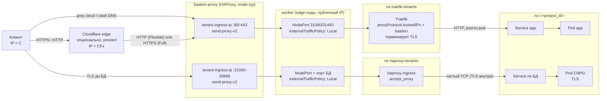
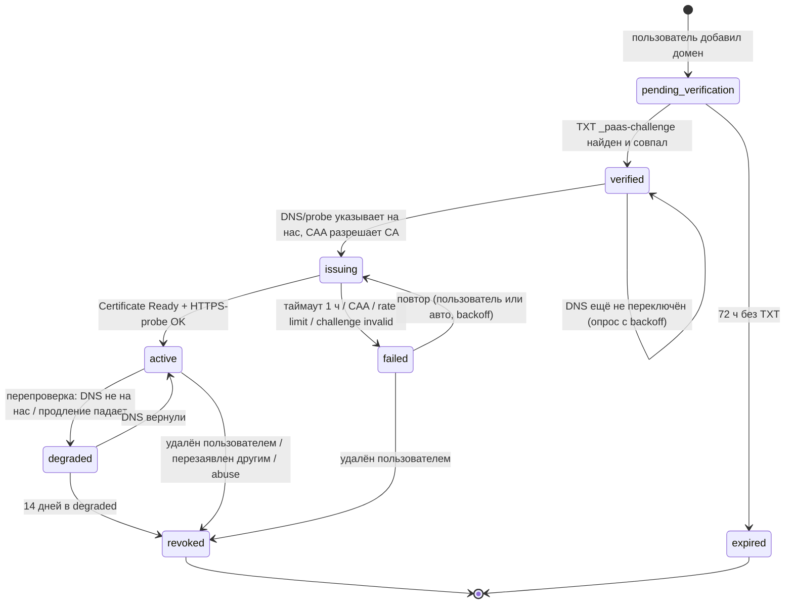
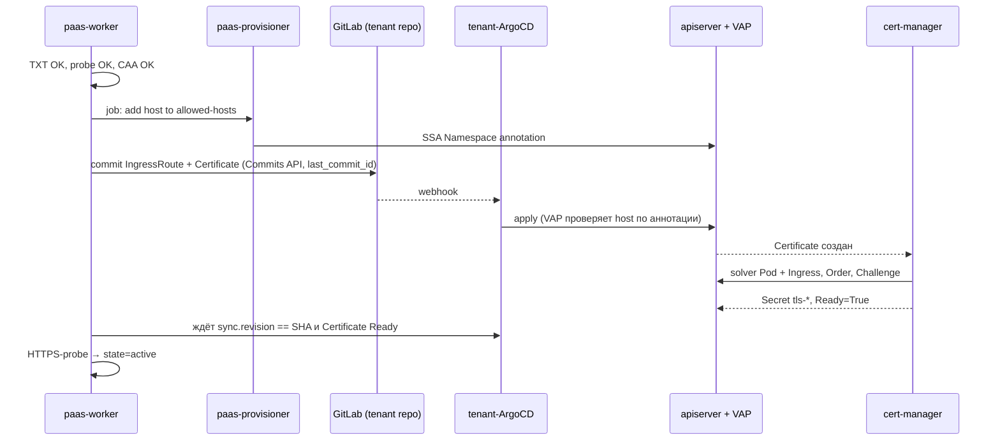

# 08. Услуга Ingress / API-Gateway: домены, сертификаты, IP

> **TL;DR**
>
> - **Тенантский трафик идёт через отдельный ingress-контур:** `traefik-tenants` (L7) и `haproxy-tenants` (L4) ставит ansible, плюс отдельный `tenant-ingress-ip` на bastion. Системный `traefik-lb` для этого не годится: у него `proxyProtocol.insecure`, `forwardedHeaders.insecure` и `allowCrossNamespace: true`. Bastion остаётся статическим «L3/L4-трубой» с PROXY v2, а домены, сертификаты и порты живут только в кластере.
> - **Платформенный поддомен** `<app>-<project_id>.<apps-domain>` работает сразу после деплоя. На всех один wildcard-сертификат через DNS-01, его отдаёт `TLSStore default`, приватный ключ ни в какие tenant-ns не копируется. `<apps-domain>` — отдельный registrable-домен. Вносить ли его в PSL, решает владелец: PSL, вероятно, несовместим с wildcard от LE.
> - **Custom domain:** владение подтверждается TXT `_paas-challenge`, маршрут — CNAME на `<app_id>.cname.<apps-domain>` (для apex — A-запись). Статусы: `pending_verification → verified → issuing → active → degraded/failed/revoked`. Объекты в k8s и ACME-ордер появляются только после проверки TXT, HTTP-probe и CAA. Поэтому захват домена по висящему CNAME невозможен, а лимиты LE не тратятся на «мёртвые» домены. Сертификаты выпускает `paas-le-http01`; резервный CA (GTS или ZeroSSL, если выдаёт `.ru`) backend включает по явным правилам.
> - **Второй слой защиты** не зависит от кода backend. VAP читает аннотации Namespace (`allowed-hosts`, `l4-ports`, `ip-slot`), а их пишет только `paas-provisioner`. Даже скомпрометированный конвейер (backend, git, tenant-ArgoCD) не создаст маршрут на чужой домен, не займёт чужой L4-порт, не сошлётся на чужой Service и не подсунет Traefik сертификат для чужого SNI.
> - **Режим Cloudflare:** принимаем HTTP и HTTPS, но только с IP Cloudflare (`ipAllowList`). `X-Forwarded-*` доверяем только Cloudflare, `CF-*` вырезаем на остальных маршрутах. Рекомендуем Full (strict), Flexible разрешён с предупреждением. Allowlist доказывает «запрос пришёл от Cloudflare», но не «из зоны этого клиента» — это даёт только AOP с собственным сертификатом (премиум).
> - **Внешний TCP к БД:** порт из пула 21000–29999 выдаёт SQL-аллокатор (`UNIQUE(ip, port)`, `SKIP LOCKED`, карантин 7 дней). NodePort создаёт provisioner, TCP CR с `accept_proxy` приходит через git, anti-bypass `ipBlock` на bastion — статическая политика ansible. Жёсткий потолок — service CIDR на 16384 ClusterIP.
> - **У solver-подов cert-manager в tenant-ns три ловушки:** исключение из VAP (только по идентичности SA, не по labels), квота по PriorityClass и `min` в LimitRange. Solver NetworkPolicy не генерируются на каждый компонент, а задаются статическими label-селекторами.
> - **Блокеры до первого платного клиента:** дыра с доверием к PROXY-заголовку на системном Traefik; bastion с одним backend'ом без `check` и в единственном экземпляре; нужен переносимый IP. Масштаб Traefik на тысячах маршрутов не известен — нужен нагрузочный стенд до продажи. Gateway API — после того как ListenerSet станет стабильным.

---

## 1. Что продаём и границы услуги

### 1.1 Три продукта в одной услуге

| # | Продукт | MVP | Что получает пользователь | Механизм |
|---|---|---|---|---|
| A | **Платформенный поддомен** | да | `https://<app>-<project_id>.<apps-domain>` сразу после деплоя, без действий | один wildcard-сертификат (DNS-01), общий tenant-IP |
| B | **Custom domain** | да | «пропиши домен — получишь сертификат»: TXT + CNAME/A → через 1–3 мин HTTPS | TXT-проверка владения → IngressRoute + Certificate (HTTP-01) |
| B' | Custom domain за Cloudflare (proxied) | да | принимаем и HTTP, и HTTPS, но только от Cloudflare | `ipAllowList` на CF-диапазоны + доверие `X-Forwarded-*` только от CF |
| C | **Внешний TCP-доступ к managed-БД** | да (тумблер, по умолчанию ВЫКЛ) | `db-host:<port>` с TLS | порт из пула на bastion L4-диапазоне → haproxy-ingress |
| D | **Выделенный IP** | фаза 2 | свой IPv4 для L7 (+ стандартные порты БД) | заранее провиженный ansible «IP-слот», назначаемый backend'ом |
| — | Произвольный TCP/UDP для приложений, HTTP/3, загрузка своего сертификата, wildcard custom domain | фаза 2+ | — | см. §16 |

Пользователь **никогда** не видит IngressRoute, Certificate, TCP CR или порты NodePort. В UI у него есть сущности `Domain` (со статусом, DNS-инструкцией и сроком действия сертификата) и `ExternalEndpoint` (хост:порт у БД). Модель данных — [05-data-model.md](05-data-model.md).

### 1.2 Главное решение раздела: отдельный ingress-контур для тенантов

**Рекомендация:** тенантский трафик обслуживает **отдельная пара ingress-инстансов** — `traefik-tenants` (L7) и `haproxy-tenants` (L4), ставятся ansible как платформенные компоненты (D1), — и приходит на **отдельный публичный IP bastion-proxy** (`tenant-ingress-ip`). Системный `traefik-lb`/`haproxy-lb` и системные домены (GitLab, Vault UI, Grafana, ArgoCD) остаются как есть.

Почему не общий `traefik-lb` (отвергнуто):

1. **Системный Traefik сконфигурирован небезопасно для мультитенантности.** В `hosts-vars/traefik.yaml` у entrypoint'ов `web`/`websecure` стоят `proxyProtocol.insecure: true` и `forwardedHeaders.insecure: true`, а у провайдера `kubernetesCRD` — `allowCrossNamespace: true`. Первое означает: любой, кто достучится до `<public-node-ip>:443` напрямую (NodePort открыт на публичных IP всех нод, host-firewall его не гейтит — [`reference/bastion-proxy.md`](../reference/bastion-proxy.md) §5), подделает PROXY-заголовок и пройдёт любой `ipAllowList` (включая `vpn-only`). Второе — IngressRoute тенанта сможет сослаться на Service в чужом namespace. Чинить это на системном инстансе = трогать рабочий прод владельца; для тенантского инстанса мы просто сразу ставим правильные значения.
2. **Blast radius.** Тысячи тенантских роутеров, частые изменения и ошибка в одном объекте не должны задевать вход в GitLab/Vault. Отдельный процесс = отдельная память, отдельный цикл реконфигурации, отдельный апгрейд.
3. **Разделение трафика без динамики на bastion.** Два IP на bastion → два статических frontend'а → два разных NodePort'а. Бастион не парсит SNI/Host и не знает про домены вообще (D5: «bastion тупой и статический»).
4. **Чистые логи и метрики.** Весь access-log `traefik-tenants` — тенантский; его проще фильтровать и отдавать пользователю (§14).

Цена: два DaemonSet'а (≈50–150 MB RAM на под Traefik при сотнях роутеров, ⚠️ замерить при тысячах — §12) и один дополнительный IPv4 на bastion. Для соло-оператора это дешевле, чем разбирать инцидент «тенант уронил вход в GitLab».

> ⚠️ **Находка вне PaaS, но блокирующая продажу:** `proxyProtocol.insecure: true` на системном `traefik-lb` уже сейчас позволяет обойти `vpn-only` (Grafana, Vault UI, Hubble, LINSTOR UI…) прямым подключением к IP ноды с поддельным PROXY-заголовком. Исправление — `proxyProtocol.trustedIPs: [<bastion IPs>]` + pod-level NetworkPolicy `ipBlock` на подах `traefik-lb` (тот же приём, что §9.4). Проверка на живом кластере: `printf 'PROXY TCP4 <vpn-ip> 1.1.1.1 1234 80\r\n' | cat - <(printf 'GET / HTTP/1.1\r\nHost: grafana...\r\n\r\n') | nc <node-ip> 80` — если отдаётся Grafana, дыра подтверждена. Вынесено в [18-risks-and-owner-decisions.md](18-risks-and-owner-decisions.md).

### 1.3 Кто чем владеет

| Объект | Где живёт | Кто создаёт | Как |
|---|---|---|---|
| `traefik-tenants`, `haproxy-tenants` (DaemonSet, entrypoints, NodePort 80/443 тенантов, anti-bypass NP) | ns `traefik-tenants`, `haproxy-tenants` | **ansible** | новый компонент по 3-фазному паттерну |
| ClusterIssuer `paas-le-dns01`, `paas-le-http01`, `paas-gts-http01` | cluster | **ansible** | `cert_manager_cluster_issuers` |
| Wildcard `Certificate` + `TLSStore default` | ns `traefik-tenants` | **ansible** | post-фаза `traefik-tenants` |
| Общие Middleware `paas-*` (cf-only, strip-cf, rate-limit по тарифам, security-headers) | ns `traefik-tenants` | **ansible** | post-фаза |
| Бастион: IP, frontend'ы, L4-диапазон, IP-слоты | bastion-proxy | **ansible** | `bastion-proxy-install.yaml` (статично, один раз) |
| Аннотации ns `paas.1520.tech/allowed-hosts`, `…/l4-ports`, `…/ip-slot` | Namespace `t-*` | **paas-provisioner** | SSA, fieldManager `paas-provisioner` |
| NodePort Service `l4-<port>` | ns `haproxy-tenants` | **paas-provisioner** | SSA (объект в чужом ns → только провижинер, не tenant-ArgoCD) |
| IngressRoute, Certificate, Middleware тенанта, TCP CR | ns `t-*` | **backend → git → tenant-ArgoCD** | D3 |
| DNS-записи в зоне `<apps-domain>` (`*.cname`, per-app override) | Cloudflare API | **paas-worker** | токен, ограниченный одной зоной |
| DNS-записи в зоне пользователя | у пользователя | **пользователь** | по инструкции из UI |

## 2. Путь запроса: кто видит какой IP и где заканчивается TLS

### 2.1 Схема



### 2.2 Кто какой IP видит

| Точка | L7, обычный домен | L7, домен за Cloudflare | L4 (БД) |
|---|---|---|---|
| bastion (TCP src) | C | CFx (egress-IP Cloudflare) | C |
| PROXY v2 заголовок от bastion | src = C | src = CFx | src = C |
| TCP src на поде ingress (Local, без SNAT) | bastion IP | bastion IP | bastion IP |
| «клиент» после разбора PROXY | C (`RemoteAddr`) | CFx (`RemoteAddr`) | C (в логе haproxy) |
| Реальный IP клиента для приложения | `X-Forwarded-For`/`X-Real-Ip` = C (Traefik перезаписывает заголовки от недоверенных) | `CF-Connecting-IP` = C; `X-Forwarded-For` = C, CFx (доверен, т.к. CFx ∈ `forwardedHeaders.trustedIPs`) | **не виден**: haproxy снимает PROXY, БД видит IP пода haproxy |
| TCP src на поде приложения | IP пода Traefik | IP пода Traefik | IP пода haproxy |

Следствия:

- `ipAllowList` в Traefik работает по `RemoteAddr` после разбора PROXY — корректно ровно тогда, когда PROXY-заголовок принимается **только от bastion** (`trustedIPs`, а не `insecure`) и прямой доступ к NodePort закрыт NetworkPolicy (§9.4 — тот же приём для Traefik).
- IP-allowlist для внешнего доступа к БД на уровне самой БД невозможен (`pg_hba` видит под haproxy). Если понадобится — ACL в haproxy (фаза 2, §9.7).

### 2.3 Где заканчивается TLS

| Режим | Клиент → CF | CF → bastion | bastion → Traefik | Traefik → Pod | Сертификат у нас |
|---|---|---|---|---|---|
| Платформенный поддомен | — | — | TLS passthrough (bastion не расшифровывает) | HTTP в overlay | wildcard `*.<apps-domain>` (DNS-01) |
| Custom domain, свой DNS | — | — | TLS passthrough | HTTP в overlay | LE на домен (HTTP-01) |
| CF **Flexible** | TLS (серт CF) | **HTTP, открытым текстом через интернет** | HTTP | HTTP | не нужен |
| CF **Full (strict)** (рекомендуем) | TLS (серт CF) | TLS | TLS passthrough | HTTP в overlay | LE на домен (HTTP-01) или CF Origin CA (фаза 2) |
| L4 БД | — | — | TLS passthrough | TLS до CNPG (end-to-end) | серт CNPG (свой CA кластера БД) |

Участок «Traefik → Pod» — plaintext HTTP внутри VXLAN. Ноды владельца соединены **через публичную сеть провайдера**, шифрование Cilium выключено (ground truth, [01-architecture-overview.md](01-architecture-overview.md)). Для PaaS это означает, что HTTP-трафик тенантов между edge-нодой и нодой тенант-пула идёт по интернету в открытом виде внутри VXLAN. **Требование до GA:** Cilium WireGuard (transparent encryption) хотя бы для tenant-пула. Решение и цена по CPU — [03-security-model.md](03-security-model.md).

## 3. Платформенные поддомены и wildcard-сертификат (DNS-01)

### 3.1 Схема имён

`<app>-<project_id>.<apps-domain>`, одна метка слева от `<apps-domain>`:

- `<app>` — слаг приложения `^[a-z]([a-z0-9-]{0,38}[a-z0-9])?$` (≤ 40), `<project_id>` — 10 символов `[a-z0-9]` (D2). Итог ≤ 51 < 63 (лимит DNS-метки). Валидация — в Go-модели и в VAP (§8.4).
- **Плоско, через дефис, а не `<app>.<project>.<apps-domain>`**: wildcard-сертификат покрывает ровно один уровень. Вложенная схема потребовала бы wildcard на каждый проект — тысячи DNS-01 ордеров вместо одного.
- `project_id` в имени делает поддомен уникальным без проверки коллизий между организациями и не раскрывает имя организации.

**`<apps-domain>` обязан быть отдельным registrable-доменом**, не родителем домена консоли и не `1520.tech` (иначе XSS в приложении клиента = cookie-tossing на консоль; обоснование — [14-frontend-console.md](14-frontend-console.md)). Пример структуры: `console.<platform-domain>` — консоль, `*.<apps-domain>` — приложения, `*.cname.<apps-domain>` — цели CNAME для custom domains.

**Public Suffix List.** Пока `<apps-domain>` не в PSL, браузер считает `a-x.<apps-domain>` и `b-y.<apps-domain>` одним «site»: приложение тенанта A может ставить cookie на `.<apps-domain>` и ломать сессии тенанта B; фишинг на одном поддомене может загнать весь `<apps-domain>` в Safe Browsing. Включение в PSL (private section) это лечит, но: ⚠️ по правилам CA/B Forum wildcard непосредственно под публичным суффиксом запрещён, т.е. **после включения в PSL LE, вероятно, откажет в `*.<apps-domain>`**, и придётся перейти на сертификат на каждый поддомен (каждый станет своим registered domain — лимит 50/нед перестанет мешать, но вырастет число ордеров). Как проверить: исходники Boulder (`policy/pa.go`, проверка wildcard против PSL) и community.letsencrypt.org — эмпирически на staging это не воспроизвести, пока домен не в PSL. Решение владельца — §15.

### 3.2 DNS зоны `<apps-domain>`

| Запись | Значение | Кто ведёт |
|---|---|---|
| `*.<apps-domain>` A | `tenant-ingress-ip` | ansible/вручную, один раз |
| `*.cname.<apps-domain>` A | `tenant-ingress-ip` | один раз |
| `<app_id>.cname.<apps-domain>` A | IP-слота (только для приложений с выделенным IP, фаза 2) | paas-worker |
| `_acme-challenge.<apps-domain>` TXT | временная, пишет cert-manager | cert-manager |

Зона — в Cloudflare, записи **DNS-only (grey cloud)**: иначе лимит тела 100 MB, ToS Cloudflare на чужой контент и потеря реального IP. Два разных API-токена Cloudflare, оба ограничены одной зоной `<apps-domain>` (`Zone:DNS:Edit` + `Zone:Zone:Read`): один у cert-manager, другой у paas-worker. Компрометация любого не даёт доступа к зонам владельца.

### 3.3 ClusterIssuer `paas-le-dns01` (ansible, `cert_manager_cluster_issuers`)

```yaml
apiVersion: cert-manager.io/v1
kind: ClusterIssuer
metadata:
  name: paas-le-dns01
spec:
  acme:
    server: https://acme-v02.api.letsencrypt.org/directory
    email: "<platform-ops-email>"
    privateKeySecretRef:
      name: paas-le-dns01-account-key        # в ns cert-manager
    solvers:
      - selector:
          dnsZones: ["<apps-domain>"]         # только своя зона
        dns01:
          cloudflare:
            apiTokenSecretRef:
              name: paas-cloudflare-dns01-token   # ExternalSecret из Vault, ns cert-manager
              key: api-token
```

Секрет токена ClusterIssuer ищется в «cluster resource namespace» cert-manager (по умолчанию `cert-manager`). Сейчас у компонента `cert-manager` в репо нет ESO-интеграции в pre-фазе — её надо добавить по стандартному паттерну (`eso_vault_integration_cert_manager_secrets`), путь в Vault — `eso-secret/cert-manager/paas-cloudflare-dns01`. Для staging-проверок — такой же `paas-le-dns01-staging` с `acme-staging-v02`.

### 3.4 Wildcard-сертификат и TLSStore (ansible, post-фаза `traefik-tenants`)

```yaml
apiVersion: cert-manager.io/v1
kind: Certificate
metadata:
  name: paas-apps-wildcard
  namespace: traefik-tenants
spec:
  secretName: paas-apps-wildcard
  dnsNames: ["*.<apps-domain>", "<apps-domain>"]
  issuerRef: {kind: ClusterIssuer, name: paas-le-dns01}
  privateKey: {algorithm: ECDSA, size: 256, rotationPolicy: Always}
  renewBeforePercentage: 33    # не часы: LE сокращает срок жизни сертификатов (§5.1), доля переживёт смену
  revisionHistoryLimit: 1
---
apiVersion: traefik.io/v1alpha1
kind: TLSStore
metadata:
  name: default                # Traefik признаёт только store с именем default
  namespace: traefik-tenants
  annotations:
    kubernetes.io/ingress.class: traefik-tenants
spec:
  defaultCertificate:
    secretName: paas-apps-wildcard
```

IngressRoute платформенного поддомена указывает `tls: {}` без `secretName` — Traefik отдаёт default-сертификат. Приватный ключ wildcard'а **не копируется** ни в один tenant-ns (копия ключа в каждом ns = тысяча мест утечки).

⚠️ Проверить на стенде: не подхватывает ли системный `traefik-lb` (ingressClass `traefik-lb`) `TLSStore default` из ns `traefik-tenants` — фильтр по ingressClass в Traefik гарантированно применяется к IngressRoute, для TLSStore/TLSOption/Middleware — проверить (`kubectl -n traefik-lb logs ds/traefik-lb | grep -i tlsstore` после создания объекта). Если подхватывает — у `traefik-lb` задать явный `providers.kubernetesCRD.namespaces` без `traefik-tenants`, либо системный TLSStore.

**Мониторинг — обязателен:** истечение wildcard = падение всех платформенных поддоменов одновременно. Алерт `certmanager_certificate_expiration_timestamp_seconds{name="paas-apps-wildcard"} - time() < 21*86400` (critical) и `certmanager_certificate_ready_status{condition="False"} == 1` дольше 1 ч.

## 4. Custom domain: жизненный цикл, проверка владения, takeover

### 4.1 Машина состояний



Соответствие каноническим enum'ам [05-data-model.md](05-data-model.md): `issuing` здесь = `domains.status = verified` + `certificates.status = issuing`; `degraded` = `dangling`; `revoked` и `expired` = `released` (причина — в отдельном поле). Диаграмма описывает поведение, хранение — по 05.

Состояния живут в Postgres платформы ([05-data-model.md](05-data-model.md)), переходы — идемпотентные шаги River-задач ([04-control-plane-go.md](04-control-plane-go.md)). В k8s домен появляется **только** на шаге `verified → issuing` — до этого ни одного объекта, ни одного ACME-ордера (иначе чужие «мёртвые» домены забивают лимиты LE и слоты cert-manager, §5).

### 4.2 Что просит UI

Для `shop.example.com` (не apex):

```
_paas-challenge.shop.example.com.  TXT    "paas-verify=7g2k...q9"      ← доказательство владения
shop.example.com.                  CNAME  a8f3k2m9x1.cname.<apps-domain>.   ← маршрутизация
```

Для apex `example.com`: TXT на `_paas-challenge.example.com` + **A-запись на `tenant-ingress-ip`** (или CNAME-flattening/ALIAS у DNS-провайдера — рекомендуем, т.к. переживёт смену IP). Опция «добавить `www`» создаёт второй домен, покрытый тем же TXT родителя, плюс redirect-middleware.

Почему CNAME на **per-app** цель `<app_id>.cname.<apps-domain>`, а не на общий `ingress.<apps-domain>`: переезд приложения на выделенный IP (фаза 2) или на другой edge меняет одну нашу DNS-запись, пользователь DNS не трогает. `app_id` случайный и **никогда не переиспользуется**.

Токен: 20 байт из `crypto/rand`, base32 без паддинга; привязан к паре `(organization_id, fqdn)`; новый при каждом заявлении. Отдельная метка `_paas-challenge` не конфликтует с SPF/DKIM и прочими TXT на самом домене.

### 4.3 Нормализация и запреты (до записи в БД)

```go
func NormalizeDomain(in string) (string, error) {
    s := strings.TrimSuffix(strings.TrimSpace(strings.ToLower(in)), ".")
    a, err := idna.Lookup.ToASCII(s) // golang.org/x/net/idna: IDN → A-label, UTS#46
    if err != nil || len(a) > 253 || net.ParseIP(a) != nil {
        return "", ErrInvalidDomain
    }
    labels := strings.Split(a, ".")
    if len(labels) < 2 { return "", ErrInvalidDomain }          // localhost, одиночные метки
    for _, l := range labels {
        if l == "" || len(l) > 63 || !reLabel.MatchString(l) { return "", ErrInvalidDomain }
    }
    if strings.HasPrefix(a, "*.") { return "", ErrWildcardNotInPlan } // фаза 2
    for _, r := range reservedSuffixes { // <apps-domain>, домен консоли, 1520.tech, системные
        if a == r || strings.HasSuffix(a, "."+r) { return "", ErrReserved }
    }
    if etld, _ := publicsuffix.PublicSuffix(a); etld == a { return "", ErrPublicSuffix }
    return a, nil
}
```

### 4.4 Проверка TXT и маршрутизации

- TXT читается **у авторитативных NS зоны** (обход рекурсивных кэшей: пользователь поправил запись — видим сразу; отравленный кэш резолвера не подтвердит чужой домен) и дополнительно через один публичный резолвер (DoH 1.1.1.1 или 8.8.8.8). Подтверждение — только при совпадении обоих. Библиотека — `github.com/miekg/dns`.
- Маршрутизация: `A/AAAA(fqdn)` ⊆ {наши ingress-IP} **или** цепочка CNAME заканчивается на `*.cname.<apps-domain>`. Для доменов с флагом «за Cloudflare» DNS показывает IP Cloudflare — там решает HTTP-probe.
- **HTTP-probe** (для всех режимов, перед созданием Certificate): `GET http://<fqdn>/.well-known/paas-probe/<nonce>` должен вернуть `HMAC-SHA256(probe_key, fqdn|nonce)`. Отвечает крошечный stateless-сервис `paas-probe` в ns `traefik-tenants` через общий низкоприоритетный маршрут `PathPrefix(/.well-known/paas-probe/)` для любого Host. Probe отсекает «домен смотрит не туда» до ACME-ордера — каждая неудачная HTTP-01 валидация сжигает лимит «5 failed / hostname / час» (§5).
- CAA: если у домена есть CAA без `letsencrypt.org` — сразу `failed` с понятным текстом «добавьте `0 issue "letsencrypt.org"`»; если разрешён только второй CA (§5.4) — выбираем его.

### 4.5 Hostile claim и domain takeover

| Атака | Защита |
|---|---|
| Тенант B заявляет домен тенанта A / чужой домен до владельца | Без TXT в зоне домена B не пройдёт `pending_verification`. Никаких объектов в k8s до `verified`. |
| B заявляет системный домен или поддомен `<apps-domain>` | `reservedSuffixes` в Go + VAP: host ∉ allowed-hosts ns (§8.4) |
| Dangling CNAME: пользователь удалил приложение, CNAME остался, злоумышленник регистрируется и заявляет домен | Takeover на Heroku/Azure/S3 работал, потому что те принимали домен по одному CNAME. У нас нужен TXT → невозможно. Цель `<app_id>.cname` не переиспользуется. |
| Домен сменил хозяина (продан/истёк), новый хозяин хочет его на платформе | Перезаявка: новая TXT-проверка в таблице `domain_claims` (много претендентов разрешено). При успехе — одной транзакцией старая привязка → `revoked`, новая → `issuing`; старому владельцу уведомление. Решает тот, кто контролирует DNS **сейчас**. |
| Компрометированный backend/tenant-ArgoCD создаёт IngressRoute на чужой домен | VAP сверяет каждый `Host(...)` с аннотацией `paas.1520.tech/allowed-hosts` namespace, которую пишет только provisioner (§8.4). Тенант-ArgoCD прав на Namespace не имеет. |
| Подмена выдачи сертификата через «более специфичный» TLS Secret в своём ns (Traefik выбирает серт по SNI глобально) | tenant-ArgoCD не имеет права создавать `Secret`; `tls.secretName` в IngressRoute — только по шаблону `tls-<domain_id>`; ExternalSecret не может целиться в имена `tls-*` и тип `kubernetes.io/tls` (VAP, §8.4) |
| Перебор/спам заявками (DoS на DNS-проверки, засорение UNIQUE) | лимит 20 незавершённых заявок на организацию, `expired` через 72 ч освобождает имя |
| Смена нашего `tenant-ingress-ip` / возврат IP провайдеру → apex A-записи клиентов указывают на чужой сервер | IP — долгоживущий контракт: брать **переносимый** IP (Additional/Failover IP провайдера), не возвращать отданные IP минимум 90 дней, при смене — массовое уведомление за 30 дней |

### 4.6 Периодическая перепроверка

River periodic job, для каждого `active`/`degraded` домена раз в 24 ч ± 2 ч джиттера (1000 доменов ≈ 1 проверка в 86 с — нагрузки нет):

1. DNS указывает на нас (или probe OK для CF-режима)? Нет → `degraded`, письмо «домен больше не указывает на платформу; сертификат перестанет продлеваться».
2. Через 3 дня в `degraded` backend убирает из git объект `Certificate` (IngressRoute остаётся): cert-manager перестаёт ретраить и жечь лимит failed validations, а TLS-Secret по умолчанию не удаляется вместе с Certificate (owner-ref на секрет cert-manager не ставит без флага `--enable-certificate-owner-ref`), так что HTTPS работает до истечения серта.
3. 14 дней в `degraded` → `revoked`: удаление IngressRoute+Certificate через git, удаление host из `allowed-hosts`, имя освобождается.
4. `Certificate.status.notAfter - now < 14d` при `active` — алерт владельцу платформы (продление cert-manager должно было случиться за 30 дней).

TXT после активации **не обязан** оставаться (как у Vercel): право на домен подтверждено, а продолжение работы зависит от того, что DNS смотрит на нас. TXT снова нужен только при перезаявке.

## 5. cert-manager на масштабе: лимиты Let's Encrypt, второй CA, backoff, ARI

### 5.1 Лимиты Let's Encrypt и что они значат для нас

⚠️ Цифры — по памяти на 2025–2026 гг.; перед запуском сверить с `https://letsencrypt.org/docs/rate-limits/` (LE переделал систему лимитов в 2025 и продолжает её менять).

| Лимит | Значение | Что это для платформы |
|---|---|---|
| New Orders per Account | 300 / 3 ч (пополнение ~1 за 36 с) | Штатно — с огромным запасом (новые домены: десятки в сутки; продления 2000 доменов ≈ 33/сутки). **Опасен массовый перевыпуск**: восстановили кластер без TLS-секретов → 2000 ордеров ≈ 20 ч частичной недоступности HTTPS. Защита — TLS-секреты попадают в снапшоты etcd (D12), ключ шифрования etcd бэкапится отдельно. |
| New Certificates per Registered Domain | 50 / 7 дней | Для `<apps-domain>` неважно (1 wildcard). Бьёт по клиенту, у которого много поддоменов одного домена (`a.shop.ru`…`z.shop.ru`), **и считаются сертификаты, выпущенные для этого домена где угодно**, не только у нас. Защита: все хосты одного приложения — в один Certificate (SAN, до 100 имён), лимит 20 новых custom-доменов на registered domain в неделю в Go с понятной ошибкой. |
| Duplicate Certificate (тот же набор имён) | 5 / 7 дней | Бьёт по «перевыпускам по кнопке» и по циклу удалил-добавил домен. Кнопка «перевыпустить» ограничена 1 раз/сутки. |
| Authorization Failures per Hostname per Account | 5 / 1 ч | Главная причина probe (§4.4): ордер только когда DNS уже смотрит на нас. |
| Consecutive Authorization Failures per Hostname | ~1000+, затем hostname «на паузе» до ручного unpause | ⚠️ проверить механизм. Домен в `degraded` не должен вечно ретраиться — §4.6 п.2. |
| Accounts per IP | 10 / 3 ч | Не создавать ACME-аккаунты динамически: 2–3 ClusterIssuer'а на всю платформу. |
| Имён в сертификате | 100 | Хватает. |
| Продления по ARI | освобождены от лимитов | ⚠️ проверить поддержку ARI в cert-manager v1.20 (release notes, `grep -ri ari` в CHANGELOG); если нет — продления по `renewBeforePercentage`, они естественно размазаны во времени. |

Сопутствующие изменения LE (⚠️ проверить даты): отказ от OCSP и e-mail-напоминаний об истечении (2025), поэтапное сокращение срока жизни сертификатов до ~45 дней к 2028. Следствия: (1) **своя** проверка истечения всех тенантских сертификатов обязательна — никто, кроме нас, не напомнит; (2) в Certificate — `renewBeforePercentage`, а не фиксированные часы.

Для хостинг-провайдеров у LE есть форма увеличения лимитов. Подать, когда custom-доменов станет > 1000.

### 5.2 cert-manager: настройки под тысячи Certificate

| Параметр | Значение | Почему |
|---|---|---|
| `--max-concurrent-challenges` | 60 (дефолт) | Не повышать: бутылочное горлышко безвредно, если нет «мёртвых» challenge. Их нет, потому что ордер создаётся только после probe. |
| Watchdog в paas-worker | `Challenge` старше 30 мин → домен `failed`, Certificate убирается из git | cert-manager сам не отпускает застрявший слот; 60 застрявших = стоит выпуск для всей платформы |
| `spec.revisionHistoryLimit` в каждом Certificate | 1 | Иначе CertificateRequest'ы копятся в etcd бесконечно |
| Backoff | встроенный экспоненциальный (≈1 ч → до 32 ч, ⚠️ проверить в v1.20) | «Повторить сейчас» в UI = прямой патч статуса (эквивалент `cmctl renew`) от `paas-provisioner` (RBAC: `patch certificates/status` в `t-*`). Это не правка spec — selfHeal ArgoCD не откатывает. |
| `--acme-http01-solver-image` | образ acmesolver через proxy-cache Harbor | иначе VAP «только Harbor» не пропустит solver-под (§6.2) |
| Реплик controller | 1 (как сейчас) | простой cert-manager на минуты не ломает отдачу уже выпущенных сертов |

Порядок объёма в etcd: 2000 доменов ≈ 2000 Certificate + 2000 CertificateRequest + 2000 Order + 2000 TLS Secret (~5 KB) ≈ 30–40 MB. Приемлемо, но это ещё одна причина держать `revisionHistoryLimit: 1`.

### 5.3 Второй CA — не «на всякий случай», а по правилам

cert-manager **не умеет** автоматический fallback между issuer'ами. Переключение делает backend: перерендер `Certificate.spec.issuerRef` → коммит. Правила переключения на резерв:

1. Order упал с `urn:ietf:params:acme:error:rateLimited`;
2. CAA домена разрешает только резервный CA;
3. LE недоступен (Order висит > 30 мин с 5xx от ACME).

Возврат на LE — при следующем продлении. Кандидаты (оба бесплатные, оба требуют EAB):

| CA | ACME directory | EAB |
|---|---|---|
| **Google Trust Services** (рекомендуем) | `https://dv.acme-v02.api.pki.goog/directory` | `gcloud publicca external-account-keys create` в GCP-проекте |
| ZeroSSL | `https://acme.zerossl.com/v2/DV90` | из кабинета/API ZeroSSL |

⚠️ **Российская специфика — проверить до запуска:** выдают ли GTS и ZeroSSL сертификаты для `.ru`/`.рф` и для заказчиков из РФ (часть западных CA в 2022 прекратила выдачу для `.ru`). Проверка — выпуск на тестовый `.ru`-домен через staging/prod каждого CA. Если ни один не выдаёт — резервного CA фактически нет, это риск в [18-risks-and-owner-decisions.md](18-risks-and-owner-decisions.md). Сертификаты НУЦ Минцифры не подходят: доверены только отдельными браузерами.

```yaml
apiVersion: cert-manager.io/v1
kind: ClusterIssuer
metadata:
  name: paas-gts-http01
spec:
  acme:
    server: https://dv.acme-v02.api.pki.goog/directory
    email: "<platform-ops-email>"
    externalAccountBinding:
      keyID: "<gts-eab-key-id>"
      keySecretRef: {name: paas-gts-eab, key: secret}   # ExternalSecret, ns cert-manager
    privateKeySecretRef: {name: paas-gts-account-key}
    solvers: []   # тот же http01-солвер, что у paas-le-http01 (§6.1), рендерится из общей переменной
```

## 6. ClusterIssuer `paas-le-http01` и solver NetworkPolicy в tenant-ns

### 6.1 ClusterIssuer `paas-le-http01` (ansible)

```yaml
apiVersion: cert-manager.io/v1
kind: ClusterIssuer
metadata:
  name: paas-le-http01
spec:
  acme:
    server: https://acme-v02.api.letsencrypt.org/directory
    email: "<platform-ops-email>"
    privateKeySecretRef: {name: paas-le-http01-account-key}
    solvers:
      - http01:
          ingress:
            ingressClassName: traefik-tenants
            # entrypoints НЕ ограничиваем (в отличие от системного acme-prod с router.entrypoints: web):
            # LE следует редиректу на https, а Cloudflare с «Always Use HTTPS» шлёт challenge на 443 (§7.3)
            ingressTemplate:
              metadata:
                labels: {paas.1520.tech/managed-by: cert-manager}
            podTemplate:
              metadata:
                labels: {app.kubernetes.io/component: acme-http01-solver}
              spec:
                priorityClassName: paas-acme-solver
                nodeSelector: {paas.1520.tech/pool: tenant}
                tolerations:
                  - {key: paas.1520.tech/tenant, operator: Equal, value: "true", effect: NoSchedule}
                imagePullSecrets: [{name: paas-harbor-pull}]   # одинаковое имя во всех t-* (D7)
                securityContext:
                  runAsNonRoot: true
                  runAsUser: 10001
                  runAsGroup: 10001
                  seccompProfile: {type: RuntimeDefault}
```

Флаги контроллера cert-manager (ansible, `cert_manager_helm_values.extraArgs`):

```yaml
extraArgs:
  - --acme-http01-solver-image=harbor.<platform-domain>/quay/jetstack/cert-manager-acmesolver:v1.20.2
  - --acme-http01-solver-resource-request-cpu=64m
  - --acme-http01-solver-resource-request-memory=64Mi
  - --acme-http01-solver-resource-limits-cpu=250m
  - --acme-http01-solver-resource-limits-memory=64Mi
```

### 6.2 Solver-под живёт в tenant-ns — три ловушки

cert-manager создаёт solver-под и Ingress **в namespace Certificate**, т.е. в `t-<project_id>`. Там действуют все ограничения тенанта:

1. **VAP «безопасный под» (D4)** требует `hostUsers: false`, `readOnlyRootFilesystem`, образ из Harbor и обязательные labels — podTemplate cert-manager не умеет задать часть этого. Исключение делается **по идентичности запросившего, никогда по labels** (labels тенант может подделать):

    ```yaml
    # в основной политике tenant-подов (03-security-model.md)
    matchConditions:
      - name: not-cert-manager
        expression: "request.userInfo.username != 'system:serviceaccount:cert-manager:cert-manager'"
    ---
    # отдельная узкая политика для solver-подов
    apiVersion: admissionregistration.k8s.io/v1
    kind: ValidatingAdmissionPolicy
    metadata: {name: paas-acme-solver-pod}
    spec:
      failurePolicy: Fail
      matchConstraints:
        namespaceSelector: {matchLabels: {paas.1520.tech/tenant: "true"}}
        resourceRules:
          - {apiGroups: [""], apiVersions: ["v1"], operations: ["CREATE", "UPDATE"], resources: ["pods"]}
      matchConditions:
        - name: is-cert-manager
          expression: "request.userInfo.username == 'system:serviceaccount:cert-manager:cert-manager'"
      validations:
        - expression: >-
            object.spec.containers.size() == 1 &&
            object.spec.containers[0].image.startsWith('harbor.<platform-domain>/quay/jetstack/cert-manager-acmesolver:')
          message: "cert-manager may only create the acmesolver pod here"
        - expression: "object.spec.priorityClassName == 'paas-acme-solver'"
        - expression: "object.spec.nodeSelector['paas.1520.tech/pool'] == 'tenant'"
        - expression: >-
            !has(object.spec.hostNetwork) || !object.spec.hostNetwork
    ---
    apiVersion: admissionregistration.k8s.io/v1
    kind: ValidatingAdmissionPolicyBinding
    metadata: {name: paas-acme-solver-pod}
    spec:
      policyName: paas-acme-solver-pod
      validationActions: [Deny]
    ```

    И обратное правило в основной политике: `priorityClassName == 'paas-acme-solver'` запрещён всем, кроме cert-manager. PSA `restricted`: solver-под cert-manager 1.x задуман совместимым (non-root, drop ALL, seccomp) — ⚠️ проверить на стенде созданием Certificate в ns с `pod-security.kubernetes.io/enforce=restricted`.

2. **ResourceQuota.** Если тариф тенанта исчерпан, solver-под не создастся, и сертификат молча не выпустится. Решение: CPU/memory-квота тенанта scoped на его PriorityClass'ы, а для solver'а — отдельная маленькая квота (структура квот — [13-billing-and-quotas.md](13-billing-and-quotas.md)):

    ```yaml
    apiVersion: v1
    kind: ResourceQuota
    metadata: {name: paas-acme-solver, namespace: t-a8f3k2m9x1}
    spec:
      hard: {pods: "3", requests.cpu: 30m, requests.memory: 96Mi, limits.cpu: 300m, limits.memory: 192Mi}
      scopeSelector:
        matchExpressions:
          - {scopeName: PriorityClass, operator: In, values: [paas-acme-solver]}
    ```

    Та же ловушка у **LimitRange**: `min.cpu` больше 10m отвергнет solver-под — `min` в LimitRange тенанта держать ≤ запросов solver'а.

3. **Ingress.** tenant-ArgoCD не имеет права на `networking.k8s.io/ingresses` — в `t-*` Ingress создаёт только cert-manager; VAP проверяет `spec.ingressClassName == 'traefik-tenants'` (иначе Ingress с классом `traefik-lb` подхватил бы системный Traefik).

### 6.3 Solver NetworkPolicy: из per-component цикла — в статические label-селекторы

В репо solver-NP генерируются в `pre/`-чарте каждого компонента циклом по `spec.acme.solvers[]`: пара политик (ingress в ns компонента + egress в ns `traefik-lb`) на каждый солвер ([`reference/networking.md`](../reference/networking.md) §4.2). Для десятка системных ns это правильно; для тысяч динамических `t-*` — нет (per-tenant объект в ns `traefik-lb` = ansible-прогон на тенанта, запрещено D1).

В PaaS обе стороны — **статические политики по label namespace**, ни одного per-tenant объекта:

```yaml
# (1) Ingress в tenant-ns: фрагмент базовой CCNP тенантов (полная политика — 03-security-model.md)
apiVersion: cilium.io/v2
kind: CiliumClusterwideNetworkPolicy
metadata: {name: paas-tenant-ingress-from-edge}
spec:
  endpointSelector:
    matchLabels: {k8s:io.cilium.k8s.namespace.labels.paas.1520.tech/tenant: "true"}
  ingress:
    - fromEndpoints:          # L7: приложения и solver-поды (8089) — любой порт
        - matchLabels:
            k8s:io.kubernetes.pod.namespace: traefik-tenants
            app.kubernetes.io/name: traefik
    - fromEndpoints:          # L4: только порты managed-БД
        - matchLabels:
            k8s:io.kubernetes.pod.namespace: haproxy-tenants
            app.kubernetes.io/name: kubernetes-ingress
      toPorts:
        - ports: [{port: "5432", protocol: TCP}, {port: "6379", protocol: TCP}]
---
# (2) Egress из traefik-tenants во все tenant-ns (ansible, pre-фаза traefik-tenants)
apiVersion: cilium.io/v2
kind: CiliumNetworkPolicy
metadata: {name: traefik-tenants-egress-to-tenants, namespace: traefik-tenants}
spec:
  endpointSelector: {matchLabels: {app.kubernetes.io/name: traefik}}
  egress:
    - toEndpoints:
        - matchLabels: {k8s:io.cilium.k8s.namespace.labels.paas.1520.tech/tenant: "true"}
```

Self-check cert-manager (перед сообщением ACME-серверу «готово» контроллер сам делает GET на `http://<fqdn>/.well-known/acme-challenge/<token>`) идёт **через публичный IP bastion** — egress ns `cert-manager` в интернет на 80/443 должен быть разрешён (⚠️ сверить с `playbook-app/charts/cert-manager/pre/templates/`).

## 7. Cloudflare-режим

### 7.1 Что хочет владелец и что из этого безопасно

«Если домен за Cloudflare — принимаем HTTP» = разрешить CF SSL-режим **Flexible**. Делаем (это требование владельца, и оно понятно пользователям), но с тремя обязательными оговорками:

1. Маршрут такого домена принимает запросы **только с IP Cloudflare** (`ipAllowList`), иначе CF-домен доступен в обход CF (и его WAF/DDoS-защиты) прямо через наш IP.
2. `X-Forwarded-*` доверяются **только от IP Cloudflare**; `CF-Connecting-IP` вырезается на всех не-CF маршрутах (иначе любой клиент подделает «реальный IP» для приложения).
3. В UI честный текст: при Flexible участок Cloudflare → наш bastion (Германия) идёт **открытым текстом через интернет**; рекомендуемый режим — **Full (strict)**, для него мы всё равно выпускаем LE-сертификат.

| Режим CF | CF → origin | Нужен наш серт | Риски | Позиция платформы |
|---|---|---|---|---|
| Flexible | HTTP | нет | plaintext на участке CF→origin; петли редиректов, если приложение само редиректит на https и не смотрит `X-Forwarded-Proto`; cookie без `Secure` | разрешён (требование владельца), с предупреждением |
| Full | HTTPS, серт не проверяется | любой | MITM на участке CF→origin теоретически возможен | разрешён |
| **Full (strict)** | HTTPS, серт проверяется | LE или CF Origin CA | нет | **рекомендуемый** |
| + Authenticated Origin Pulls (per-zone cert) | mTLS | + клиентский CA | нет | премиум, фаза 3 |

Честная граница: `ipAllowList` на диапазоны CF доказывает «пришло от Cloudflare», но **не** «от зоны этого пользователя» — любой клиент Cloudflare может направить свою зону на наш IP с нужным `Host` и обойти WAF-правила пользователя. Это закрывает только AOP с **собственным** (per-zone) сертификатом; глобальный AOP-сертификат Cloudflare общий для всех клиентов CF и даёт то же, что IP-allowlist.

### 7.2 Конфигурация `traefik-tenants` (ansible, values компонента)

```yaml
ports:
  web:
    port: 8000
    nodePort: 31080
    expose: {default: true}
    proxyProtocol:
      trustedIPs: "{{ paas_bastion_ips }}"          # все IP всех хостов bastion_proxy, НЕ insecure
    forwardedHeaders:
      trustedIPs: "{{ paas_cloudflare_ip_ranges }}" # X-Forwarded-* верим только Cloudflare
    transport:
      respondingTimeouts: {readTimeout: 600, writeTimeout: 600, idleTimeout: 180}
  websecure:
    port: 8443
    nodePort: 31443
    expose: {default: true}
    http: {tls: {enabled: true}}
    proxyProtocol: {trustedIPs: "{{ paas_bastion_ips }}"}
    forwardedHeaders: {trustedIPs: "{{ paas_cloudflare_ip_ranges }}"}
providers:
  kubernetesCRD:
    ingressClass: traefik-tenants
    allowCrossNamespace: true      # только ради общих Middleware paas-* из ns traefik-tenants; VAP (§8.4) запрещает ссылки на чужие Service
    allowExternalNameServices: false
  kubernetesIngress:
    ingressClass: traefik-tenants  # только для solver-Ingress cert-manager
service:
  spec: {type: NodePort, externalTrafficPolicy: Local}
```

`paas_bastion_ips` должен включать **все** адреса, с которых bastion открывает соединения к нодам (основной IP хоста, а не только `tenant-ingress-ip`; либо явно `source <ip>` в `server`-строках HAProxy). Иначе Traefik отвергнет PROXY-заголовок.

`paas_cloudflare_ip_ranges` — статическая ansible-переменная. ⚠️ Список ниже — по памяти, сверить с `https://www.cloudflare.com/ips-v4` и `/ips-v6` перед применением; paas-worker раз в сутки сравнивает живой список с применённым и шлёт алерт владельцу при расхождении (сам ничего не меняет):

```yaml
paas_cloudflare_ip_ranges:
  - 173.245.48.0/20
  - 103.21.244.0/22
  - 103.22.200.0/22
  - 103.31.4.0/22
  - 141.101.64.0/18
  - 108.162.192.0/18
  - 190.93.240.0/20
  - 188.114.96.0/20
  - 197.234.240.0/22
  - 198.41.128.0/17
  - 162.158.0.0/15
  - 104.16.0.0/13
  - 104.24.0.0/14
  - 172.64.0.0/13
  - 131.0.72.0/22
  - 2400:cb00::/32
  - 2606:4700::/32
  - 2803:f800::/32
  - 2405:b500::/32
  - 2405:8100::/32
  - 2a06:98c0::/29
  - 2c0f:f248::/32
```

Общие Middleware (ansible, post-фаза `traefik-tenants`, ns `traefik-tenants`):

```yaml
apiVersion: traefik.io/v1alpha1
kind: Middleware
metadata:
  name: paas-cf-only
  namespace: traefik-tenants
  annotations: {kubernetes.io/ingress.class: traefik-tenants}
spec:
  ipAllowList:
    sourceRange: "{{ paas_cloudflare_ip_ranges }}"
    # ipStrategy НЕ задаём: сверка по RemoteAddr = src из PROXY-заголовка bastion = egress-IP Cloudflare.
    # ipStrategy.depth здесь было бы дырой: X-Forwarded-For пишет клиент.
---
apiVersion: traefik.io/v1alpha1
kind: Middleware
metadata:
  name: paas-strip-cf-headers        # на ВСЕХ не-CF маршрутах
  namespace: traefik-tenants
  annotations: {kubernetes.io/ingress.class: traefik-tenants}
spec:
  headers:
    customRequestHeaders:            # пустое значение = удалить заголовок
      CF-Connecting-IP: ""
      True-Client-IP: ""
      CF-IPCountry: ""
      CF-Visitor: ""
      CF-Ray: ""
```

### 7.3 Выпуск сертификата для CF-домена

- HTTP-01 работает через CF-прокси: запрос LE на `:80/.well-known/acme-challenge/…` Cloudflare проксирует на origin. Если у пользователя включён «Always Use HTTPS», CF отвечает редиректом на https, LE следует ему (сертификат на редиректе LE не проверяет), CF идёт на origin по 443 — поэтому solver-Ingress не ограничен entrypoint'ом `web` (§6.1).
- **Первичный выпуск при Full (strict) + Always Use HTTPS не пройдёт**: до выпуска у нас нет валидного серта на этот хост, CF вернёт 526. Инструкция в UI: на время первичного выпуска держать Full (не strict) или Flexible; после статуса `active` переключить на Full (strict). Продления потом проходят и в strict — серт уже есть. ⚠️ проверить на стенде с реальной CF-зоной все четыре комбинации (Flexible/Full/strict × Always Use HTTPS on/off).
- Probe (§4.4) определяет фактический режим: отвечает ли домен по https нашим сертификатом — UI показывает «CF в режиме Flexible — рекомендуем Full (strict)».
- Ограничения CF, которые пользователь должен видеть в UI: тело запроса ≤ 100 MB на Free/Pro; ответ origin ≤ 100 с, иначе 524 — для долгих запросов/больших загрузок рекомендовать grey cloud.

### 7.4 Cloudflare Origin CA и загрузка своего сертификата (фаза 2)

Origin CA-сертификат (выпускает CF, доверен только CF, живёт до 15 лет) — это частный случай «загрузить свой сертификат». Поток: пользователь вставляет cert+key в UI → paas-worker проверяет (SAN ⊆ подтверждённые домены этого проекта, ключ соответствует серту, не истёк, RSA ≥ 2048/ECDSA) → ключ в Vault `paas-tenants/data/<ns>/tls-<domain_id>` → **paas-provisioner** создаёт `Secret` `tls-<domain_id>` типа `kubernetes.io/tls` напрямую (SSA). Не через ESO и не через git: VAP разрешает TLS-секреты в `t-*` только от SA cert-manager и paas-provisioner (§8.4) — иначе тенант подсунул бы Traefik'у «более специфичный» серт для чужого SNI.

### 7.5 DNS-01 через CNAME-делегирование (фаза 2)

Пользователь добавляет `_acme-challenge.shop.example.com CNAME <domain_id>.acme.<acme-delegation-zone>`; cert-manager с `cnameStrategy: Follow` пишет TXT в **нашу** отдельную зону (токен Cloudflare ограничен только ею). Даёт: выпуск независимо от режима CF и «Always Use HTTPS»; wildcard custom domains (`*.shop.example.com`); **выпуск до переключения DNS** — миграция клиента на платформу без окна с ошибкой сертификата. Отложено в фазу 2 только ради объёма MVP: механизм дешёвый (ещё один ClusterIssuer и одна зона).

## 8. Генерируемые IngressRoute / Certificate / Middleware (YAML)

Все объекты ниже рендерит Go из типов (`k8s.io/api` + локальные Go-структуры CRD Traefik/cert-manager, `sigs.k8s.io/yaml`), кладёт в `projects/<project_id>/apps/<app_id>/ingress/` репозитория организации; синхронизирует tenant-ArgoCD (D3). Пример: проект `a8f3k2m9x1`, приложение `api` (`app_id` `k3m9x2p7qa`), Service `api` порт 8080, домен `domain_id` `d7x2k9m4pq`.

### 8.1 Платформенный поддомен

```yaml
apiVersion: traefik.io/v1alpha1
kind: IngressRoute
metadata:
  name: r-k3m9x2p7qa-platform
  namespace: t-a8f3k2m9x1
  annotations:
    kubernetes.io/ingress.class: traefik-tenants
  labels:
    paas.1520.tech/managed-by: paas
    paas.1520.tech/tenant-ns: t-a8f3k2m9x1
    paas.1520.tech/app-id: k3m9x2p7qa
spec:
  entryPoints: [websecure]
  routes:
    - kind: Rule
      match: Host(`api-a8f3k2m9x1.<apps-domain>`)
      middlewares:
        - {name: paas-strip-cf-headers, namespace: traefik-tenants}
        - {name: paas-security-headers, namespace: traefik-tenants}
        - {name: paas-ratelimit-standard, namespace: traefik-tenants}
      services:
        - {name: api, port: 8080}
  tls: {}                      # default-сертификат TLSStore = wildcard, секрета в ns нет
---
apiVersion: traefik.io/v1alpha1
kind: IngressRoute
metadata:
  name: r-k3m9x2p7qa-platform-http
  namespace: t-a8f3k2m9x1
  annotations: {kubernetes.io/ingress.class: traefik-tenants}
  labels: {paas.1520.tech/managed-by: paas, paas.1520.tech/tenant-ns: t-a8f3k2m9x1, paas.1520.tech/app-id: k3m9x2p7qa}
spec:
  entryPoints: [web]
  routes:
    - kind: Rule
      match: Host(`api-a8f3k2m9x1.<apps-domain>`)
      middlewares: [{name: paas-redirect-https, namespace: traefik-tenants}]   # redirectScheme https, permanent
      services: [{name: api, port: 8080}]    # Traefik требует service; до него запрос не дойдёт
```

Редирект http→https — на уровне маршрута, **не** entrypoint'а: entrypoint-редирект сломал бы CF Flexible. ACME-solver и probe не страдают — их правила длиннее (`Host && PathPrefix`), а приоритет Traefik по умолчанию = длина правила. Поэтому backend **никогда** не ставит `priority` и не разрешает пользовательские пути, начинающиеся с `/.well-known/acme-challenge` и `/.well-known/paas-probe`.

### 8.2 Custom domain (свой DNS, grey cloud)

```yaml
apiVersion: cert-manager.io/v1
kind: Certificate
metadata:
  name: tls-d7x2k9m4pq
  namespace: t-a8f3k2m9x1
  labels: {paas.1520.tech/managed-by: paas, paas.1520.tech/tenant-ns: t-a8f3k2m9x1, paas.1520.tech/domain-id: d7x2k9m4pq}
spec:
  secretName: tls-d7x2k9m4pq
  dnsNames: [shop.example.com, www.shop.example.com]   # все хосты приложения — в один серт (лимит 50/нед)
  issuerRef: {kind: ClusterIssuer, name: paas-le-http01}
  privateKey: {algorithm: ECDSA, size: 256, rotationPolicy: Always}
  renewBeforePercentage: 33
  revisionHistoryLimit: 1
---
apiVersion: traefik.io/v1alpha1
kind: IngressRoute
metadata:
  name: r-d7x2k9m4pq
  namespace: t-a8f3k2m9x1
  annotations: {kubernetes.io/ingress.class: traefik-tenants}
  labels: {paas.1520.tech/managed-by: paas, paas.1520.tech/tenant-ns: t-a8f3k2m9x1, paas.1520.tech/domain-id: d7x2k9m4pq}
spec:
  entryPoints: [websecure]
  routes:
    - kind: Rule
      match: Host(`shop.example.com`)
      middlewares:
        - {name: paas-strip-cf-headers, namespace: traefik-tenants}
        - {name: paas-security-headers, namespace: traefik-tenants}
        - {name: paas-ratelimit-standard, namespace: traefik-tenants}
      services: [{name: api, port: 8080}]
    - kind: Rule
      match: Host(`www.shop.example.com`)
      middlewares: [{name: paas-redirect-www-to-apex, namespace: traefik-tenants}]
      services: [{name: api, port: 8080}]
  tls:
    secretName: tls-d7x2k9m4pq
```

Плюс `r-d7x2k9m4pq-http` на `web` с `paas-redirect-https` — как в §8.1. Пока серт не выпущен, Traefik на этот SNI отдаёт default (wildcard `<apps-domain>`) — браузер ругается, но это окно в 1–3 мин между `issuing` и `active`, и UI в нём показывает «выпускаем сертификат».

### 8.3 Custom domain за Cloudflare

Отличия от §8.2: оба entrypoint'а обслуживают трафик (без редиректа), первым middleware — `paas-cf-only`, `paas-strip-cf-headers` не ставится:

```yaml
spec:
  entryPoints: [web, websecure]
  routes:
    - kind: Rule
      match: Host(`shop.example.com`)
      middlewares:
        - {name: paas-cf-only, namespace: traefik-tenants}
        - {name: paas-security-headers, namespace: traefik-tenants}
        - {name: paas-ratelimit-standard-cf, namespace: traefik-tenants}   # sourceCriterion по CF-Connecting-IP (§13)
      services: [{name: api, port: 8080}]
  tls:
    secretName: tls-d7x2k9m4pq    # для Full (strict); при Flexible не используется, но и не мешает
```

Один `IngressRoute` на оба entrypoint'а с `tls` означает, что роутер на `web` Traefik создаст **без** TLS, а на `websecure` — с TLS: ⚠️ проверить это поведение Traefik v3 на стенде; при сомнении — два объекта, как в §8.1.

### 8.4 Второй слой: VAP на ingress-объекты тенанта

Backend генерирует правильно — но граница безопасности не может держаться только на коде backend'а (D4). Ключевой приём: **то, что тенанту разрешено, записано в аннотациях его Namespace, которые пишет только `paas-provisioner`** (tenant-ArgoCD прав на Namespace не имеет). VAP читает их через `namespaceObject`:

```yaml
apiVersion: v1
kind: Namespace
metadata:
  name: t-a8f3k2m9x1
  labels: {paas.1520.tech/tenant: "true"}
  annotations:                                   # fieldManager: paas-provisioner
    paas.1520.tech/allowed-hosts: "shop.example.com,www.shop.example.com"
    paas.1520.tech/l4-ports: "21437"
    paas.1520.tech/ip-slot: ""                  # фаза 2
```

```yaml
apiVersion: admissionregistration.k8s.io/v1
kind: ValidatingAdmissionPolicy
metadata: {name: paas-tenant-ingressroute}
spec:
  failurePolicy: Fail
  matchConstraints:
    namespaceSelector: {matchLabels: {paas.1520.tech/tenant: "true"}}
    resourceRules:
      - {apiGroups: [traefik.io], apiVersions: ["*"], operations: [CREATE, UPDATE], resources: [ingressroutes]}
  variables:
    - name: pid
      expression: "namespaceObject.metadata.name.substring(2)"
    - name: ann
      expression: "has(namespaceObject.metadata.annotations) ? namespaceObject.metadata.annotations : {}"
    - name: allowed
      expression: "'paas.1520.tech/allowed-hosts' in variables.ann ? variables.ann['paas.1520.tech/allowed-hosts'].split(',') : []"
  validations:
    - expression: "has(object.metadata.annotations) && object.metadata.annotations['kubernetes.io/ingress.class'] == 'traefik-tenants'"
      message: "ingress class must be traefik-tenants"
    - expression: "object.spec.routes.all(r, r.match.matches('^Host\\\\(`[a-z0-9.-]+`\\\\)$'))"
      message: "rule must be exactly Host(`fqdn`)"
    - expression: >-
        object.spec.routes.all(r, r.match.split('`')[1] in variables.allowed ||
          r.match.split('`')[1].matches('^[a-z]([a-z0-9-]{0,38}[a-z0-9])?-' + variables.pid + '\\.<apps-domain-regex-escaped>$'))
      message: "host is not verified for this project"
    - expression: "object.spec.routes.all(r, !has(r.priority))"
    - expression: >-
        object.spec.routes.all(r, !has(r.services) || r.services.all(s,
          (!has(s.kind) || s.kind == 'Service') && (!has(s.namespace) || s.namespace == object.metadata.namespace)))
      message: "services must be plain Services in the same namespace"
    - expression: >-
        object.spec.routes.all(r, !has(r.middlewares) || r.middlewares.all(m,
          !has(m.namespace) || m.namespace == object.metadata.namespace ||
          (m.namespace == 'traefik-tenants' && m.name.startsWith('paas-'))))
    - expression: "object.spec.entryPoints.all(e, e in ['web', 'websecure'])"   # фаза 2: + slot-<ip-slot>-*
    - expression: >-
        !has(object.spec.tls) || ((!has(object.spec.tls.secretName) || object.spec.tls.secretName.matches('^tls-[a-z0-9]{10}$'))
          && !has(object.spec.tls.options) && !has(object.spec.tls.store) && !has(object.spec.tls.certResolver))
---
apiVersion: admissionregistration.k8s.io/v1
kind: ValidatingAdmissionPolicyBinding
metadata: {name: paas-tenant-ingressroute}
spec:
  policyName: paas-tenant-ingressroute
  validationActions: [Deny]
```

Остальные правила того же семейства (полные тексты — рядом с этим, в ansible-компоненте `paas-policies`, [03-security-model.md](03-security-model.md)):

| Объект в `t-*` | Правило | Что закрывает |
|---|---|---|
| `Certificate` | `issuerRef` ∈ {`ClusterIssuer/paas-le-http01`, `ClusterIssuer/paas-gts-http01`}; `dnsNames` ⊆ `allowed-hosts`; `secretName == metadata.name` и `^tls-`; нет `ipAddresses/uris/emailAddresses/isCA` | выпуск на чужие имена, сжигание лимитов LE |
| `Issuer` (namespaced) | запрещён целиком | SelfSigned/CA Issuer в своём ns → Secret с сертом на любой SNI → Traefik выбирает серт по SNI глобально → DoS чужого домена |
| `Secret` `type: kubernetes.io/tls` | только от SA `cert-manager` и `paas-provisioner` | то же |
| `ExternalSecret` | `target.name` не `tls-*`; `target.template.type` отсутствует или `Opaque` | то же через ESO |
| `Middleware` | ровно один тип из allow-list: `headers`, `redirectScheme`, `redirectRegex`, `stripPrefix`, `compress`, `rateLimit`, `inFlightReq`, `basicAuth`, `ipAllowList` (без `ipStrategy`) | `forwardAuth` = SSRF из пода Traefik во внутреннюю сеть кластера; `plugin`, `errors`, `chain` на чужие ns |
| `TraefikService`, `ServersTransport`, `TLSOption`, `TLSStore`, `IngressRouteTCP/UDP`, `MiddlewareTCP` | запрещены (и нет в RBAC tenant-ArgoCD) | зеркалирование на чужие Service, `insecureSkipVerify`, подмена глобальных TLS-настроек |
| `Ingress` | только от SA cert-manager, `ingressClassName == 'traefik-tenants'` | Ingress с классом `traefik-lb` подхватил бы системный Traefik c `allowCrossNamespace: true` |
| `TCP` (haproxy) | §9.5 | захват чужого L4-порта |

⚠️ Проверить на стенде: CEL-выражения с `split`/`matches` (библиотека strings в k8s 1.36 включена), стоимость выражений (VAP отклоняет политику при превышении cost budget на больших списках — `allowed-hosts` держать ≤ 100 хостов на проект), поведение при отсутствии аннотации.

### 8.5 Порядок операций (добавление и удаление)



Удаление — строго в обратном порядке: коммит удаления → дождаться, что объекты исчезли из кластера → только затем убрать host из `allowed-hosts`. Иначе следующий sync старого объекта упрётся в VAP, а Application уйдёт в `SyncFailed`.

## 9. L4 TCP для managed-БД через bastion-proxy

### 9.1 Путь и компоненты

`клиент → bastion tenant-ingress-ip:<port> → send-proxy-v2 → worker:<port> (NodePort l4-<port>, externalTrafficPolicy: Local) → haproxy-tenants (accept_proxy, bind <port>) → Service <db>-rw:5432 → Pod CNPG`.

Это существующий паттерн владельца (gitlab-ssh / teleport: `TCP` CR в ns компонента + NodePort Service в ns haproxy с тем же номером порта — `playbook-app/charts/gitlab/post/templates/haproxy-tcp.yaml`), перенесённый в динамику. Отдельный инстанс `haproxy-tenants` вместо системного `haproxy-lb` — по тем же причинам, что §1.2: ошибка в тенантском TCP CR не должна блокировать перегенерацию конфига, по которому живёт gitlab-ssh.

**NATS** сюда не относится: общий NATS-кластер (D6) слушает один статический порт (ansible), тенанты различаются account'ами, пул портов не расходуется.

### 9.2 Пул портов

Бастион слушает L4-диапазон целиком (`bastion_proxy_haproxy_l4_range_start/_end`; в prod-override сейчас 20000–22000) и не знает, какой порт кому принадлежит. Предложение — **один раз** расширить диапазон ansible-прогоном и разделить:

| Диапазон | Назначение |
|---|---|
| 20000–20999 | существующие L4-сервисы владельца из git-ops `1520-tech-infra` (в `l4_ports` — строки `reserved_platform`) (⚠️ сверить фактически занятые порты: `kubectl get tcps.ingress.v3.haproxy.org -A -o json \| jq '.. \| .port? // empty'`) |
| 21000–29999 | пул тенантов (9000 портов) |

Цена расширения на bastion: 10000 listen-сокетов, ×2 на время hitless reload. FD-бюджет (`LimitNOFILE 1048576`) с запасом; время старта/reload и память HAProxy с 10000 bind — ⚠️ замерить на стенде до применения на prod (§11).

**Потолок, о котором надо помнить:** каждый NodePort Service занимает ClusterIP, а `service_subnet` `10.4.0.0/18` = 16384 адреса на **весь** кластер, включая Service'ы приложений тенантов. Поэтому в MVP лимит — ≤ 2000 внешних эндпоинтов (тарифами: Hobby 0, Standard 1, Pro 3); при приближении — переход на «один NodePort + диспетчеризация по `dst_port` из PROXY v2» (§9.6).

### 9.3 Аллокатор

Схема — каноническая из [05-data-model.md](05-data-model.md) §5.4 (`ingress_ips`, `l4_ports` c `PRIMARY KEY (ip, port)` = UNIQUE(ip, port), `port_status` = `free | allocated | cooldown | reserved_platform`, частичный UNIQUE «один занятый порт на цель»). Здесь — только то, что использует аллокатор ingress:

```sql
-- Разметка пула при заведении IP (миграция/админ-команда): диапазон владельца — reserved_platform, тенантам — free.
INSERT INTO l4_ports (ip, port, status)
SELECT '<tenant-ingress-ip>'::inet, g,
       CASE WHEN g BETWEEN 20000 AND 20999 THEN 'reserved_platform'::port_status ELSE 'free'::port_status END
FROM generate_series(20000, 29999) AS g
ON CONFLICT (ip, port) DO NOTHING;

-- name: GetL4PortByTarget :one
SELECT ip, port FROM l4_ports
WHERE target_kind = $1 AND target_id = $2 AND status = 'allocated';

-- name: AllocateL4Port :one
UPDATE l4_ports
SET status = 'allocated', org_id = $1, project_id = $2, target_kind = $3, target_id = $4,
    allocated_at = now(), cooldown_until = NULL
WHERE (ip, port) = (
    SELECT ip, port FROM l4_ports
    WHERE ip = $5
      AND (status = 'free' OR (status = 'cooldown' AND cooldown_until < now()))
    ORDER BY random()            -- номер порта не выдаёт число клиентов и не угадывается перебором соседей
    LIMIT 1
    FOR UPDATE SKIP LOCKED)
RETURNING ip, port;

-- name: ReleaseL4Port :exec
UPDATE l4_ports
SET status = 'cooldown', org_id = NULL, project_id = NULL, target_kind = NULL, target_id = NULL,
    cooldown_until = now() + sqlc.arg(cooldown)::interval
WHERE target_kind = $1 AND target_id = $2 AND status = 'allocated';
```

`cooldown`: клиент, у которого в конфиге остался старый `host:port`, не попадёт в чужую БД сразу после освобождения (TLS-хендшейк и пароль не пройдут, но в логах чужой БД такие попытки выглядели бы как атака). Длительность — параметр; в [05-data-model.md](05-data-model.md) пример 24 ч, для портов БД рекомендую 7 суток: строки подключения живут в чужих конфигах и CI дольше суток.

```go
// Шаг state machine "external access ON" (River job, идемпотентный).
func (s *L4) Ensure(ctx context.Context, tx pgx.Tx, db ManagedDB) (Endpoint, error) {
    q := sqlc.New(tx)
    ep, err := q.GetL4PortByTarget(ctx, sqlc.GetL4PortByTargetParams{Kind: "database", ID: db.ID})
    switch {
    case err == nil:
        return toEndpoint(ep), nil // уже выделен — повтор шага ничего не меняет
    case !errors.Is(err, pgx.ErrNoRows):
        return Endpoint{}, err
    }
    ep2, err := q.AllocateL4Port(ctx, sqlc.AllocateL4PortParams{
        OrgID: db.OrgID, ProjectID: db.ProjectID, Kind: "database", ID: db.ID, IP: s.ipFor(db.ProjectID)})
    if errors.Is(err, pgx.ErrNoRows) {
        s.alerts.Page(ctx, "l4 port pool exhausted") // владельцу; пользователю — понятная ошибка
        return Endpoint{}, ErrPortPoolExhausted
    }
    if err != nil {
        return Endpoint{}, err
    }
    // В той же транзакции — следующие шаги (outbox через River):
    //  1) provisioner: добавить порт в аннотацию ns paas.1520.tech/l4-ports
    //  2) provisioner: SSA Service l4-<port> в ns haproxy-tenants
    //  3) worker: коммит TCP CR в git тенанта
    //  4) worker: ждать sync.revision == SHA, затем TLS-probe на bastion:<port>
    _, err = s.river.InsertTx(ctx, tx, L4ApplyArgs{Port: ep2.Port, DB: db.Ref()}, nil)
    return toEndpoint(ep2), err
}
```

Выключение внешнего доступа — обратный порядок: удалить TCP CR из git → дождаться удаления → удалить Service `l4-<port>` → убрать порт из аннотации → `ReleaseL4Port`.

### 9.4 Манифесты

```yaml
# (1) NodePort — создаёт paas-provisioner (SSA): объект в чужом для тенанта ns, tenant-ArgoCD туда прав не имеет.
#     Уникальное имя по номеру порта — не пересекается с объектами helm-релизов haproxy-tenants (инвариант §0 CLAUDE.md).
apiVersion: v1
kind: Service
metadata:
  name: l4-21437
  namespace: haproxy-tenants
  labels:
    paas.1520.tech/managed-by: paas
    paas.1520.tech/tenant-ns: t-a8f3k2m9x1
spec:
  type: NodePort
  externalTrafficPolicy: Local            # сохраняет src = bastion IP → работает ipBlock ниже
  selector:
    app.kubernetes.io/name: kubernetes-ingress
    app.kubernetes.io/instance: haproxy-tenants
  ports:
    - {name: tcp, protocol: TCP, port: 21437, targetPort: 21437, nodePort: 21437}
---
# (2) TCP CR — рендерит backend в git, применяет tenant-ArgoCD
apiVersion: ingress.v3.haproxy.org/v3
kind: TCP
metadata:
  name: l4-21437
  namespace: t-a8f3k2m9x1
  annotations: {ingress.class: haproxy-tenants}
  labels: {paas.1520.tech/managed-by: paas, paas.1520.tech/tenant-ns: t-a8f3k2m9x1}
spec:
  - name: l4-21437
    frontend:
      name: fe-l4-21437                     # имя frontend глобально в конфиге haproxy → по порту, уникально
      tcplog: true
      binds:
        main:
          port: 21437
          accept_proxy: true                # строгий: без PROXY-заголовка соединение отвергается
    service:
      name: db1-rw                          # CNPG read-write Service
      port: 5432
---
# (3) Anti-bypass — статическая политика ansible (pre-фаза haproxy-tenants), НЕ per-tenant.
#     NodePort открыт на публичных IP всех нод, host-firewall его не гейтит (reference/bastion-proxy.md §5).
apiVersion: networking.k8s.io/v1
kind: NetworkPolicy
metadata: {name: allow-l4-from-bastion-only, namespace: haproxy-tenants}
spec:
  podSelector: {matchLabels: {app.kubernetes.io/name: kubernetes-ingress}}
  policyTypes: [Ingress]
  ingress:
    - from:                                  # 
        - ipBlock: {cidr: "<bastion-ip-1>/32"}
        - ipBlock: {cidr: "<bastion-ip-2>/32"}
      ports:
        - {protocol: TCP, port: 21000, endPort: 29999}
```

Плюс в том же `haproxy-tenants`: deny-all по умолчанию, DNS, `toEntities: kube-apiserver` (контроллер смотрит API), scrape от Prometheus, egress в tenant-ns только на 5432/6379 (зеркально §6.3). Такая же anti-bypass политика (`ipBlock` bastion на 8000/8443) ставится на поды `traefik-tenants`.

### 9.5 VAP на TCP CR

```yaml
validations:
  - expression: "has(object.metadata.annotations) && object.metadata.annotations['ingress.class'] == 'haproxy-tenants'"
  - expression: >-
      object.spec.all(e, e.frontend.binds.all(k,
        string(e.frontend.binds[k].port) in variables.ports &&
        e.frontend.binds[k].accept_proxy == true &&
        e.frontend.name == 'fe-l4-' + string(e.frontend.binds[k].port)))
    message: "bind port is not allocated to this project"
  - expression: "object.spec.all(e, e.service.port in [5432, 6379])"
# variables.ports = namespaceObject.metadata.annotations['paas.1520.tech/l4-ports'].split(',')
```

Без этого правила тенант (через скомпрометированный конвейер) объявил бы `bind 21437` в своём ns и перехватил бы или сломал внешний доступ к БД другого тенанта — все TCP CR сливаются в один конфиг haproxy. ⚠️ Проверить: системный `haproxy-lb` игнорирует TCP CR с `ingress.class: haproxy-tenants` (иначе он тоже попытается их применить).

### 9.6 TLS, имена и альтернативы

- Имя: `<db_id>.db.<apps-domain>` (A → `tenant-ingress-ip` через wildcard `*.db.<apps-domain>`), порт — из пула. CNPG: `spec.certificates.serverAltDNSNames: [<db_id>.db.<apps-domain>]`, в UI — CA кластера БД и строка `sslmode=verify-full`. `pg_hba` для внешних подключений — только `hostssl` + `scram-sha-256`. Valkey — `tls-port`, `port 0`. Детали — [09-svc-databases.md](09-svc-databases.md).
- **Отвергнуто: `haproxy-tenants` с `hostNetwork` и bind прямо на хосте** (anti-bypass тогда делал бы host-firewall CCNP). Причина: тенантский TCP CR начал бы открывать порты **в сетевом ns ноды** — ошибка в VAP превращается в захват портов хоста (kubelet, etcd); плюс PSA `privileged` на ns. NodePort + pod-level NP — существующий, проверенный на prod паттерн.
- **Путь масштабирования (фаза 3):** bastion шлёт весь L4-диапазон на **один** NodePort, in-cluster HAProxy диспетчеризует по `dst_port` из PROXY v2 (`use_backend %[dst_port,map(...)]`, map обновляется runtime API без reload). Убирает по ClusterIP на порт и per-port bind'ы, но требует своего HAProxy вместо haproxytech-контроллера. Триггер — > 1000 внешних эндпоинтов.
- **Postgres 17+ direct TLS** (`sslnegotiation=direct`, ALPN `postgresql`) делает возможной SNI-маршрутизацию всех БД на одном порту 5432. Старые клиенты шлют SSLRequest и SNI-роутинг не проходят — поэтому пул портов остаётся как совместимый путь; SNI — опция фазы 3.

### 9.7 IP-allowlist для внешнего доступа к БД (фаза 2)

Реальный IP клиента известен только haproxy (из PROXY-заголовка); БД видит под haproxy. Значит allowlist — ACL во frontend'е TCP CR (`tcp-request connection reject unless { src -f … }`). ⚠️ Проверить, пропускает ли схема CRD `tcps.ingress.v3.haproxy.org` (чарт 1.52.0) ACL/`tcp_request_rule_list` во `frontend`: `kubectl explain tcp.spec.frontend --recursive | grep -i -E 'acl|tcp_request'`. Если нет — allowlist переезжает на bastion (maps + runtime API без reload, §11) или откладывается.

## 10. Выделенные IP-слоты (фаза 2)

Зачем клиенту свой IP (в порядке важности для РФ): (1) **защита от коллатеральной блокировки** — блокировка по IP из-за соседа по `tenant-ingress-ip` кладёт всех, у кого A-запись на него; (2) allowlist у партнёров/банков; (3) стандартные порты БД (5432/6379) без номера из пула; (4) клиенты без SNI.

### 10.1 Что делает ansible — статично, пачкой, заранее

Слот = один дополнительный IPv4 на bastion + фиксированный набор NodePort'ов + entrypoint'ы в `traefik-tenants`. Слоты провижинятся **пачкой** (например, по 10), когда свободных остаётся < 3 — это операция владельца раз в месяцы, не на тенанта.

```yaml
# hosts-vars-override/<cluster>/paas-ip-slots.yaml (IP — из override, не в git)
paas_ip_slots:
  - {id: 1, ip: "<slot-ip-1>"}
  - {id: 2, ip: "<slot-ip-2>"}
# схема портов, N = id (1..99):
#   L7: NodePort web = 32100+N, websecure = 32200+N; entrypoints slot-N-web / slot-N-websecure
#   L4: 5432 на IP слота → NodePort 32300+N; 6379 → 32400+N
```

Бастион (фрагмент `bastion_proxy_haproxy_config`, цикл Jinja):

```

frontend slot{{ s.id }}_https
    bind {{ s.ip }}:443
    mode tcp
    default_backend slot{{ s.id }}_https_back
backend slot{{ s.id }}_https_back
    mode tcp

    server {{ w.name }} {{ w.ip }}:{{ 32200 + s.id }} send-proxy-v2 check

# ... то же для :80 (32100+N), :5432 (32300+N), :6379 (32400+N)

```

`traefik-tenants` получает entrypoint'ы `slot-N-web`/`slot-N-websecure` с теми же `proxyProtocol.trustedIPs`/`forwardedHeaders.trustedIPs`, что у основных. Добавление entrypoint'а = изменение статической конфигурации Traefik = **рестарт DaemonSet** — ещё одна причина провижинить слоты пачками и держать ≥ 2 edge-ноды с health-check на bastion (§11.3).

### 10.2 Что делает backend — динамически

Таблица `ip_slots` — в [05-data-model.md](05-data-model.md) §5.4 (`id` вида `slot-07`, IP, entrypoint, NodePort'ы, `status port_status`, `cooldown_until`; слот назначается проекту — граница = ns, D2). Имена entrypoint'ов выводятся из `id`: `slot-07-web`, `slot-07-websecure`.

Назначение слота проекту:

1. `ip_slots.status` → `allocated` (та же схема `FOR UPDATE SKIP LOCKED`; `cooldown` освобождённого IP — **30 дней**: у бывшего клиента могут остаться A-записи и репутация IP в чужих списках);
2. provisioner: аннотация ns `paas.1520.tech/ip-slot: "slot-07"` → VAP начинает разрешать entrypoint'ы `slot-07-*` (правило в §8.4 расширяется: `e in ['web','websecure'] || e.startsWith(variables.ann['paas.1520.tech/ip-slot'] + '-')`);
3. worker: перерендер IngressRoute проекта с `entryPoints: [websecure, slot-07-websecure]` (оба на время переезда DNS), коммит;
4. worker: `<app_id>.cname.<apps-domain>` → IP слота (Cloudflare API) — клиенты с CNAME переезжают сами; клиентам с apex-A UI показывает новую запись;
5. через 48 ч (TTL + запас) — перерендер только с `slot-07-*`.

L4 на слоте: TCP CR с `bind 32300+N` и NodePort `32300+N` — тот же механизм, что §9, только порт фиксирован слотом, а не из пула.

### 10.3 Что НЕ является IP-слотом

**Исходящий статический IP** (частый запрос «дайте IP для whitelist у партнёра») — другой продукт: Cilium Egress Gateway, policy на ns тенанта → выход через выделенный IP на egress-ноде. Сейчас egress тенантов SNAT'ится в IP той ноды, где живёт под, — это **публичные IP нод**, которые мы прячем за bastion для входящего трафика, и абьюз одного тенанта (сканирование, спам) испортит репутацию IP нод всего кластера. Рекомендация: общий egress-IP для всех тенантов через Egress Gateway уже к GA, выделенный egress-IP — платная опция. Детали — [07-svc-compute.md](07-svc-compute.md), [03-security-model.md](03-security-model.md).

## 11. Почему bastion-proxy остаётся статическим (и когда Data Plane API)

### 11.1 Что было бы «динамическим bastion» и почему нет

Динамика на bastion = per-tenant frontend/bind/ACL, которые backend добавляет по кнопке (через HAProxy Data Plane API или переписывание `haproxy.cfg` + reload). Отвергнуто:

1. **Цена reload.** Каждое изменение binds = reload. С 10–20 тыс. listen-сокетов новый процесс принимает сокеты от старого, а старый доживает, пока не закроются его сессии — при `timeout client 1h` это часы. Десятки действий тенантов в день = десятки одновременно живущих старых процессов с их памятью и FD; ограничивать их `hard-stop-after` = рвать долгие DB-сессии. Сейчас reload случается раз в месяцы — и это правильная частота.
2. **Runtime API не добавляет bind'ы.** Без reload меняются только servers, maps, ACL-списки, stick-tables. Всё, что нужно тенанту на bastion, должно укладываться в эти примитивы — а новые порты/IP туда не укладываются.
3. **Blast radius.** Ошибка в конфиге bastion = недоступны все тенанты и все системные домены одновременно.
4. **Разделение привилегий (D4).** Чтобы менять bastion по кнопке, backend получает root/SSH или сетевой доступ к API bastion — новый привилегированный путь из интернет-facing системы на edge.
5. **Заменяемость.** Статический bastion = N одинаковых машин из одного плейбука (Rule 1 в [`reference/bastion-proxy.md`](../reference/bastion-proxy.md)). Динамический — stateful, со своим бэкапом и рассинхроном между экземплярами.

Мозг (домены, сертификаты, порты, лимиты) живёт в кластере, bastion — L3/L4-труба с PROXY v2.

### 11.2 Когда что-то динамическое на bastion оправдано

| Потребность | Инструмент | Без reload? | Когда |
|---|---|---|---|
| Бан источника атаки/абьюза | stick-table + `map_ip` блоклист; агент на bastion **забирает** (pull, read-only) блоклист у платформы и делает `set map`/`add map` через runtime API | да | фаза 2, вместе с требованием «устранить источник атаки за 12 ч» ([16-legal-ru.md](16-legal-ru.md)) |
| IP-allowlist на внешний порт БД | map `port → CIDR` + ACL | да | если не удастся в TCP CR (§9.7) |
| Per-tenant bind'ы по требованию (сотни выделенных IP) | Data Plane API с транзакциями и батчингом reload | **нет** | только если пачечного провижининга слотов (§10.1) перестанет хватать; тогда честнее сменить edge на Envoy (xDS, конфиг без reload), чем строить конвейер вокруг DPAPI |

Pull-модель агента важна: bastion ходит к платформе, а не платформа к bastion — у backend'а не появляется прав на edge.

### 11.3 Обязательные доработки bastion до первого платного клиента (статично, ansible)

Сейчас (факты из `hosts-vars/bastion-proxy-haproxy.yaml`): один `server` на весь L7 и один на весь L4, **без `check`**, один хост bastion. Это SPOF входа для всех клиентов.

```
# фрагмент bastion_proxy_haproxy_config (новые переменные: paas_tenant_ingress_ip, paas_edge_nodes)
backend st_src
    stick-table type ip size 1m expire 30s store conn_rate(10s),conn_cur

frontend tenants_https
    bind {{ paas_tenant_ingress_ip }}:443
    mode tcp
    tcp-request connection track-sc0 src table st_src
    tcp-request connection reject if { sc0_conn_rate(st_src) gt 300 } || { sc0_conn_cur(st_src) gt 500 }
    default_backend tenants_https_back

backend tenants_https_back
    mode tcp
    balance leastconn

    server {{ w.name }} {{ w.ip }}:31443 send-proxy-v2 check inter 2s fall 3 rise 2


frontend tenants_l4
    bind {{ paas_tenant_ingress_ip }}:21000-29999
    mode tcp
    tcp-request connection track-sc0 src table st_src
    tcp-request connection reject if { sc0_conn_rate(st_src) gt 100 }
    default_backend tenants_l4_back

backend tenants_l4_back
    mode tcp

    # порт не указан → dst-порт сохраняется 1:1; check — на фиксированный healthz-NodePort haproxy-tenants
    server {{ w.name }} {{ w.ip }} send-proxy-v2 check port 31099 inter 2s fall 3 rise 2

```

| Доработка | Зачем |
|---|---|
| ≥ 2 edge-ноды в backend'е с `check` (TCP-check на NodePort; при `externalTrafficPolicy: Local` нода без пода ingress соединения дропает — check это ловит) | уход одной ноды не кладёт вход |
| `tenant-ingress-ip` — **переносимый** IP провайдера (failover/additional IP), ≥ 2 хоста bastion | смена/падение хоста bastion без смены IP у клиентов (apex A-записи!) |
| stick-table лимиты на источник | базовая защита от флуда соединениями; пороги ⚠️ подобрать по реальному трафику |
| `source <ip>` в `server`-строках или все IP bastion в `paas_bastion_ips` | Traefik/haproxy доверяют PROXY только от известных адресов (§7.2) |
| встроенный prometheus-exporter HAProxy на внутреннем порту, доступ только из кластера/VPN | видеть bastion в Grafana: сессии, отказы, состояние backend'ов |

Отдельный вопрос для юриста: весь трафик клиентов из РФ проходит через bastion в Германии, а требование к хостинг-провайдеру — мощности на территории РФ (D11, [16-legal-ru.md](16-legal-ru.md)).

## 12. Traefik на масштабе и путь к Gateway API

### 12.1 Как Traefik переваривает тысячи маршрутов

- Провайдер `kubernetesCRD` держит informer-кэши **по всему кластеру**: IngressRoute, Middleware, Service, EndpointSlice и **Secret** (для TLS и basicAuth). Любое изменение → пересборка **всей** динамической конфигурации (с троттлингом `providers.throttleDuration`) → атомарная подмена. Стоимость пересборки — O(всех роутеров), не O(изменения).
- Память = объекты конфигурации + загруженные TLS-сертификаты + informer-кэши. Кэш Secret'ов включает **все** секреты кластера, в том числе системные helm-release секреты, — память `traefik-tenants` растёт не только от тенантов.
- Оценка по памяти порядка «сотни MB на тысячи роутеров, пересборка от десятков мс до секунд» — **⚠️ не цифра, а гипотеза**. Проверить нагрузочным стендом до продажи: сгенерировать 1000/3000/5000 IngressRoute + Service (+500 Certificate с self-signed Issuer в тестовом ns), под нагрузкой `hey`/`vegeta` менять по 1 объекту в секунду и снимать RSS пода, `traefik_config_reloads_total`, время от `kubectl apply` до ответа нового роутера и p99 латентности текущего трафика.

Настройки `traefik-tenants` (в отличие от системного, где `resources: {}` и `logs.general.level: DEBUG`):

| Параметр | Значение | Зачем |
|---|---|---|
| `resources` | requests 200m/256Mi, limits memory 1Gi (⚠️ по стенду) | без лимита утечка/рост памяти Traefik выедает ноду |
| `env GOMEMLIMIT` | ~80 % memory limit | GC Go упирается в лимит мягко, а не OOM |
| `providers.throttleDuration` | 2–5 s | серия коммитов тенантов = одна пересборка |
| `logs.general.level` | `INFO` | DEBUG на тысячах роутеров = гигабайты логов |
| `metrics.prometheus.addRoutersLabels` | `false` | кардинальность, §14 |
| update strategy DaemonSet | `maxUnavailable: 1`, bastion с `check` | рестарт (новый entrypoint/апгрейд) не роняет вход |

### 12.2 Честный риск: Traefik читает все Secret'ы кластера

ClusterRole Traefik — `get/list/watch secrets` во всех namespace'ах; ограничить набор ns в Traefik можно только статическим списком (`providers.kubernetesCRD.namespaces`), а `t-*` динамические. Значит, RCE в интернет-facing `traefik-tenants` = чтение всех секретов кластера, включая системные. Это уже верно и для системного `traefik-lb`. Митигировать полностью нельзя; снижаем: pod hardening (non-root, RO rootfs, drop ALL — уже в values), egress-политика `traefik-tenants` только в `t-*` + apiserver + DNS (без интернета), быстрые апгрейды Traefik (подписка на security advisories), отдельный node pool/edge-ноды без tenant-нагрузки. Gateway API-реализации в целом устроены так же — миграция этот риск не снимает.

### 12.3 Путь к Gateway API

Целевое состояние (D5), но **не MVP**:

| | Traefik IngressRoute (MVP) | Gateway API |
|---|---|---|
| Кросс-namespace | `allowCrossNamespace: true` + VAP | `ReferenceGrant` — стандартно и явно |
| Разделение ролей | нет | GatewayClass (платформа) / Gateway (платформа) / HTTPRoute (тенант) |
| Сертификат на домен тенанта | `tls.secretName` в IngressRoute тенанта | сертификаты висят на listener'ах Gateway (ns платформы) → каждый домен = правка общего объекта Gateway; решает **ListenerSet** (GEP-1713) — ⚠️ статус «experimental» проверить на момент миграции |
| Конфликт hostname между тенантами | приоритет по длине правила | «старший маршрут выигрывает» по спецификации — всё равно нужен наш VAP `allowed-hosts` |
| Переносимость | только Traefik | Traefik, Envoy Gateway, Cilium и др. |

Триггеры миграции: (1) ListenerSet в standard-канале и поддержан Traefik; (2) нагрузочный стенд показал предел Traefik CRD-провайдера; (3) нужна функциональность, которой нет в IngressRoute. Подготовка уже в MVP: в Go рендер ingress'а скрыт за интерфейсом (`ingress.Renderer` c реализацией `traefikcrd`), миграция = новая реализация + массовый перерендер каталогов `ingress/` в репо организаций волнами, ArgoCD синхронизирует.

Отвергнуто: **Cilium Gateway API** (Envoy DaemonSet уже стоит) для тенантского edge — связывает апгрейд edge с апгрейдом CNI, а Envoy Cilium одновременно исполняет L7-политики сети: сбой тенантского edge уходит в CNI.

## 13. Rate limiting / WAF

### 13.1 Что делаем в Traefik

Общие Middleware по тарифам в ns `traefik-tenants` (ansible); backend только ссылается на нужный.

```yaml
apiVersion: traefik.io/v1alpha1
kind: Middleware
metadata:
  name: paas-ratelimit-standard
  namespace: traefik-tenants
  annotations: {kubernetes.io/ingress.class: traefik-tenants}
spec:
  rateLimit:
    average: 100          # запросов/с на один источник (⚠️ пороги — по стенду и тарифам)
    burst: 200
    period: 1s
    # sourceCriterion не задаём → RemoteAddr = реальный клиент из PROXY v2
---
apiVersion: traefik.io/v1alpha1
kind: Middleware
metadata: {name: paas-ratelimit-standard-cf, namespace: traefik-tenants, annotations: {kubernetes.io/ingress.class: traefik-tenants}}
spec:
  rateLimit:
    average: 100
    burst: 200
    sourceCriterion:
      requestHeaderName: CF-Connecting-IP   # безопасно ТОЛЬКО потому, что маршрут закрыт paas-cf-only
---
apiVersion: traefik.io/v1alpha1
kind: Middleware
metadata: {name: paas-inflight-host, namespace: traefik-tenants, annotations: {kubernetes.io/ingress.class: traefik-tenants}}
spec:
  inFlightReq:
    amount: 1000
    sourceCriterion: {requestHost: true}    # потолок одновременных запросов на ОДИН хост:
                                            # медленный бэкенд одного клиента не выедает соединения Traefik
---
apiVersion: traefik.io/v1alpha1
kind: Middleware
metadata: {name: paas-security-headers, namespace: traefik-tenants, annotations: {kubernetes.io/ingress.class: traefik-tenants}}
spec:
  headers:
    contentTypeNosniff: true
    referrerPolicy: strict-origin-when-cross-origin
    # HSTS НЕ ставим на custom domains: includeSubDomains/preload на чужом домене — решение его владельца (тумблер в UI)
```

Особенности, о которых надо знать:

- `rateLimit` Traefik — in-memory **на под**. При двух edge-нодах за bastion эффективный лимит ×2. Для защиты от флуда этого достаточно; распределённый лимит (Redis-бэкенд в новых версиях Traefik v3 — ⚠️ проверить, с какой версии) не нужен.
- Тела запросов: `buffering` не включаем — буферизация в памяти/на диске Traefik (RO rootfs) опаснее, чем польза. Защита от slowloris — таймауты entrypoint'а (`readTimeout` 300 s вместо системных 600 s, `idleTimeout` 180 s) и connection-limits на bastion (§11.3).
- Пользовательский IP-allowlist на приложение (grey cloud) — `ipAllowList` в ns тенанта без `ipStrategy`; для CF-доменов — фаза 2 (⚠️ проверить семантику `ipStrategy.depth` вместе с доверенными `X-Forwarded-For` от CF).

### 13.2 WAF и DDoS — что честно можно обещать

| Угроза | Платформа | Рекомендация пользователю |
|---|---|---|
| Флуд соединениями/запросами с одного IP | bastion stick-table + Traefik rateLimit/inFlightReq | — |
| Объёмный DDoS (L3/L4) | только то, что даёт провайдер bastion (у OVH — базовая защита на сетевом уровне, ⚠️ проверить для конкретного IP и услуги) | Cloudflare proxied |
| L7-атаки (SQLi, XSS, боты) | **нет WAF** | Cloudflare (режим §7) |

WAF в Traefik CE — только плагины (например, Coraza через WASM), которые Traefik скачивает из каталога плагинов при старте: зависимость рантайма от интернета, supply-chain и заметный CPU. **Не делаем.** Своя «защита от DDoS + взаимодействие с ЦМУ ССОП» — юридическое требование к хостинг-провайдеру (D11), техническое наполнение — [16-legal-ru.md](16-legal-ru.md) и [15-observability-and-operations.md](15-observability-and-operations.md).

### 13.3 Абьюз входящего контента — главный операционный риск общего IP

- Фишинг на `<app>-<pid>.<apps-domain>` → Safe Browsing/антивирусы помечают **весь** `<apps-domain>` → страдают все тенанты. Отсюда PSL (§3.1) и быстрый takedown.
- Блокировка по IP (в том числе регуляторная в РФ) из-за контента одного тенанта → недоступны все, у кого A/CNAME ведёт на `tenant-ingress-ip`.
- Takedown: backend заменяет маршруты приложения на страницу «приостановлено» (сервис `paas-suspended` в ns `traefik-tenants`, через git, как suspend за неоплату в D10) — цель < 1 ч от решения оператора.
- Запасной `tenant-ingress-ip` (провижинен на bastion, но не опубликован): при блокировке основного — `*.cname.<apps-domain>` и `*.<apps-domain>` переводятся на запасной одной DNS-правкой; клиенты с apex-A — вручную по рассылке. Мониторинг наших IP в блоклистах (Spamhaus и др., ⚠️ плюс проверка по выгрузкам реестра блокировок РФ через доступный сервис) — [15-observability-and-operations.md](15-observability-and-operations.md).

## 14. Метрики и логи доступа per-domain для пользователя

Принцип D14: пользователь не присылает PromQL/LogQL; backend строит запросы сам и **всегда** подставляет матчер своего namespace, собранный из проверенного `project_id`, а не из ввода.

### 14.1 Метрики

Traefik отдаёт `traefik_service_requests_total{service, code, method, protocol}` и `traefik_service_request_duration_seconds_bucket{service, …}`; имя сервиса у CRD-провайдера содержит namespace (вида `t-a8f3k2m9x1-api-8080@kubernetescrd`, ⚠️ сверить точный формат в v3 на стенде). Этого хватает на «RPS / доля 4xx-5xx / p50-p95 по приложению».

Кардинальность — главный враг: 2000 сервисов × ~10 кодов × ~5 методов × 12 бакетов ≈ 1.2 млн серий только на гистограмму. Режем:

| Мера | Эффект |
|---|---|
| `addRoutersLabels: false` (per-domain разрез — из access-логов, не из метрик) | нет умножения на число доменов |
| `metrics.prometheus.buckets: [0.1, 0.3, 1.2, 5]` | 12 → 5 бакетов |
| `metricRelabelings` в ServiceMonitor: drop `method`, `protocol` | ×5 меньше |
| recording rules `paas:app_requests:rate5m`, `paas:app_latency:p95_5m` по `service`, `code_class` | UI читает дешёвые агрегаты |

Итог ≈ 2000 × 10 × 5 ≈ 100 тыс. серий — приемлемо для текущего Prometheus (⚠️ подтвердить замером `prometheus_tsdb_head_series` до/после). Запрос backend'а:

```go
// pid прошёл валидацию ^[a-z0-9]{10}$ при создании проекта; в выражение попадает только он
q := fmt.Sprintf(`sum by (code_class) (paas:app_requests:rate5m{service=~"t-%s-.+"})`, pid)
```

### 14.2 Access-логи per domain

Traefik `traefik-tenants` пишет JSON access-log в stdout → существующий Vector → Loki ([15-observability-and-operations.md](15-observability-and-operations.md)).

```yaml
# values traefik-tenants
logs:
  access:
    enabled: true
    format: json
    bufferingSize: 100
    fields:
      defaultMode: keep
      names: {StartLocal: drop, ClientUsername: drop}
      headers:
        defaultMode: drop            # никаких Cookie/Authorization в логах
        names: {User-Agent: keep, Referer: keep, CF-Connecting-IP: keep}
```

Vector: разобрать JSON → `namespace` из префикса `ServiceName` (`t-<id>-…`) → Loki-лейблы только `{job="traefik-tenants-access", namespace="t-…"}`; `RequestHost`, `DownstreamStatus`, `Duration`, `ClientHost` — в тело/structured metadata, **не** в лейблы (домен как лейбл = взрыв индекса Loki). Строки без распознанного tenant-ns (например, 404 на неизвестный Host) — в отдельный поток оператора. Per-tenant троттлинг в Vector (`throttle`, например 200 строк/с на namespace, остаток — счётчик отброшенного): один клиент под нагрузкой не должен заливать Loki.

Запрос для UI «логи домена» строит backend: `{job="traefik-tenants-access", namespace="t-a8f3k2m9x1"} | json | RequestHost = "shop.example.com"`. Retention — 7 дней (D14).

IP клиентов в access-логах — персональные данные (152-ФЗ): показываются только владельцу проекта, хранятся 7 дней, в оферте/политике ПДн это должно быть описано ([16-legal-ru.md](16-legal-ru.md)).

### 14.3 Что видит пользователь на карточке домена

Статус машины состояний (§4.1) и человеческая причина, если не `active`; DNS: что ожидаем и что видим (последняя проверка); режим Cloudflare, определённый probe; сертификат: CA, дата истечения, дата следующего продления; графики RPS / 4xx / 5xx / p95 по приложению; последние 100 строк access-лога с фильтром по коду.

### 14.4 Алерты владельцу платформы

| Алерт | Условие |
|---|---|
| Wildcard истекает | < 21 дня (critical) |
| Тенантский серт истекает при `active` | < 14 дней |
| Пересборка конфигурации Traefik падает | `traefik_config_last_reload_success == 0` > 5 мин |
| Backend bastion down | HAProxy exporter: `haproxy_server_status != 1` |
| Пул L4-портов | занято > 80 % |
| ClusterIP | занято > 70 % от 16384 |
| Застрявшие challenge | `Challenge` старше 30 мин > 0 |
| Домены в `degraded` | рост > N за сутки (признак проблемы на нашей стороне, а не у клиентов) |

## 15. Решения, требующие владельца

| # | Решение | Рекомендация | Цена / последствие |
|---|---|---|---|
| 1 | Отдельный ingress-контур для тенантов (`traefik-tenants` + `haproxy-tenants` + отдельный `tenant-ingress-ip` на bastion) | **да** | +1 IPv4, +2 DaemonSet; взамен — изоляция от системного входа и правильные trust-настройки с первого дня |
| 2 | Исправить `proxyProtocol.insecure`/`forwardedHeaders.insecure` на системном `traefik-lb` + anti-bypass NP | **да, до продажи, независимо от PaaS** | правка рабочего прода; сейчас `vpn-only` обходится подделкой PROXY-заголовка |
| 3 | `<apps-domain>` — отдельный registrable-домен; вносить ли его в PSL | домен — да, сразу; PSL — после проверки политики wildcard у LE (§3.1) | PSL, вероятно, = отказ от wildcard и переход на серт на поддомен |
| 4 | Разрешать CF Flexible («принимаем HTTP») | да, как хочет владелец, но с предупреждением в UI и рекомендацией Full (strict) | plaintext CF → bastion (Германия) через интернет |
| 5 | Расширение L4-диапазона bastion до 20000–29999 с разделом «владелец 20000–20999 / тенанты 21000–29999» | да, после замера reload на стенде | один ansible-прогон на bastion |
| 6 | Лимиты внешних эндпоинтов БД по тарифам (Hobby 0 / Standard 1 / Pro 3) | да | ClusterIP и порты — общий ресурс кластера |
| 7 | Резервный CA | GTS, **если** выдаёт `.ru`/`.рф`; иначе ZeroSSL; иначе — признать отсутствие резерва риском | EAB-ключи, ещё один ClusterIssuer |
| 8 | HA входа: ≥ 2 bastion, переносимый IP, ≥ 2 edge-ноды с `check` | **обязательно до первого платного клиента** | 1 сервер + failover IP |
| 9 | `tenant-ingress-ip` = долгоживущий контракт (не менять, не возвращать провайдеру) | да | зафиксировать в оферте: смена IP — с уведомлением за 30 дней |
| 10 | Запасной непубличный ingress-IP на случай блокировки основного | да | +1 IPv4 |
| 11 | Access-логи с IP клиентов, 7 дней, видны владельцу проекта | да, текст — с юристом | 152-ФЗ |
| 12 | Выделенные IP-слоты: цена, размер пачки | фаза 2; пачка 10, пополнение при < 3 свободных | стоимость IP у провайдера + рестарт `traefik-tenants` на пачку |
| 13 | Cilium WireGuard хотя бы для tenant-пула | до GA | CPU-налог; решение в [03-security-model.md](03-security-model.md) |
| 14 | Общий egress-IP тенантов через Egress Gateway (а не IP нод) | до GA | защищает репутацию IP нод от абьюза тенантов |

## 16. Открытые вопросы / что проверить на стенде

| # | Что проверить | Как |
|---|---|---|
| 1 | Уязвимость `proxyProtocol.insecure` на системном Traefik | прямое подключение к `<node-ip>:80` с поддельным `PROXY TCP4 <vpn-ip> …` к хосту под `vpn-only` (§1.2) |
| 2 | Системный `traefik-lb` не подхватывает `TLSStore`/`Middleware` из ns `traefik-tenants`; `haproxy-lb` игнорирует TCP CR с `ingress.class: haproxy-tenants` | создать объекты на стенде, смотреть логи и сгенерированный конфиг обоих контроллеров |
| 3 | Один IngressRoute на `[web, websecure]` с `tls` — роутер на `web` без TLS | стенд, `curl -v http://` и `https://` |
| 4 | CEL: `split`, `matches`, `namespaceObject` в VAP, cost budget при 100 хостах в аннотации | `kubectl apply` политики в k8s 1.36 + негативные тесты (чужой host, чужой ns в services, forwardAuth) |
| 5 | Solver-под cert-manager 1.20.2 проходит PSA `restricted` и узкую VAP; квота solver'а по PriorityClass работает | Certificate в ns с `enforce=restricted`, исчерпанной основной квотой и LimitRange |
| 6 | Актуальные лимиты LE, механизм «paused» hostname, поддержка ARI в cert-manager v1.20, срок жизни сертификатов LE | letsencrypt.org/docs/rate-limits, CHANGELOG cert-manager |
| 7 | Выдают ли GTS и ZeroSSL сертификаты на `.ru`/`.рф` | реальный выпуск на тестовый домен |
| 8 | Wildcard LE для домена в PSL | исходники Boulder `policy/pa.go`, форум LE |
| 9 | Cloudflare: Flexible/Full/strict × Always Use HTTPS — первичный выпуск и продление HTTP-01 | тестовая CF-зона |
| 10 | Актуальный список IP Cloudflare | `curl https://www.cloudflare.com/ips-v4` и `/ips-v6` |
| 11 | Traefik на масштабе: RSS, время пересборки, p99 при 1000/3000/5000 IngressRoute | нагрузочный стенд (§12.1) |
| 12 | Формат label `service` в метриках Traefik v3 CRD-провайдера | `curl traefik-tenants:9200/metrics \| grep service_requests_total` |
| 13 | HAProxy на bastion с 10000 bind'ами: время старта/reload, память, поведение старых процессов с долгими сессиями | стенд-VM с тем же пакетом PPA vbernat 3.3 |
| 14 | Фактически занятые L4-порты владельца в `1520-tech-infra` | `kubectl get tcps.ingress.v3.haproxy.org -A` |
| 15 | Схема TCP CRD (чарт 1.52.0): есть ли ACL / `tcp_request_rule_list` во frontend | `kubectl explain tcp.spec.frontend --recursive` |
| 16 | NP ns `cert-manager` разрешает egress на 80/443 в интернет (self-check через bastion) | `playbook-app/charts/cert-manager/pre/templates/`, тестовый выпуск |
| 17 | Какой DDoS-защитой реально покрыт IP bastion у провайдера | документация/тикет провайдера |
| 18 | IPv6 на bastion: нужен ли AAAA для `<apps-domain>` и custom domains | решение после MVP; сейчас только IPv4 |
| 19 | Cilium CCNP с `k8s:io.cilium.k8s.namespace.labels.*` в `endpointSelector`/`toEndpoints` и `endPort` в NetworkPolicy на Cilium 1.19.5 | стенд + `cilium policy get`, Hubble |
