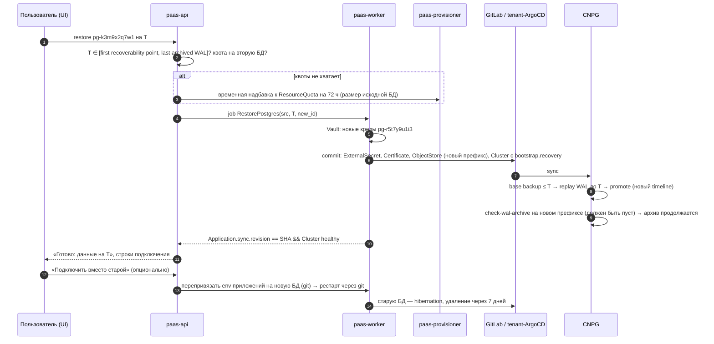
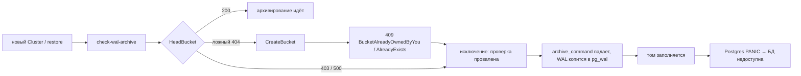
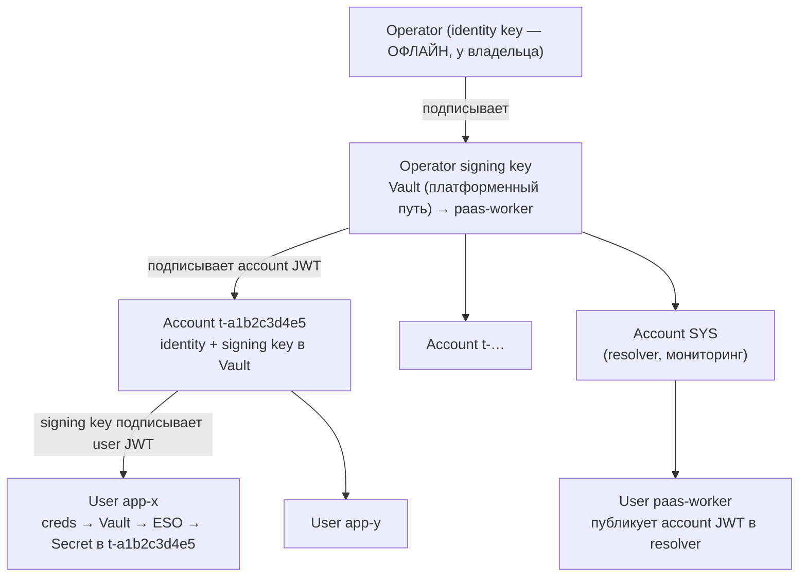
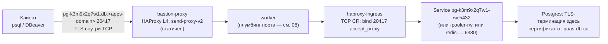

# 09. Услуга Managed-БД: Postgres (CloudNativePG), Valkey, NATS

> Раздел дизайн-документа PaaS. Опирается на зафиксированные решения D1–D15 (особенно D2, D3, D4, D6, D9, D10, D12).
> Смежные разделы: [02-tenancy-and-isolation.md](02-tenancy-and-isolation.md), [03-security-model.md](03-security-model.md), [06-delivery-pipeline.md](06-delivery-pipeline.md), [08-svc-ingress-domains-ip.md](08-svc-ingress-domains-ip.md), [11-svc-object-storage-s3.md](11-svc-object-storage-s3.md), [12-svc-secrets.md](12-svc-secrets.md), [13-billing-and-quotas.md](13-billing-and-quotas.md), [15-observability-and-operations.md](15-observability-and-operations.md).

## TL;DR

- **Что продаём:** Postgres **Hobby** (1 инстанс, избыточность тома — DRBD, RTO при отказе ноды ≈ 6–8 мин) и **Standard** (primary + асинхронная реплика на `local`-томах, failover за секунды) на CloudNativePG; **Valkey** (1 инстанс, AOF); **NATS** — account в общем кластере (Ф2). БД живут в namespace проекта и расходуют его квоту; размеры — из фиксированной сетки; superuser не выдаём никогда.
- **CNPG выбран** за отсутствие Patroni, минимальный вес на инстанс и полную декларативность (роли с `passwordSecret`, `Database`, pooler, hibernation). План Б на уровне оператора — Percona (pgBackRest).
- **Установка** — новый ansible-компонент `cnpg` (`cnpg-pre` → `cnpg` → `cnpg-barman-cloud` → `cnpg-post`), in-place обновление instance manager, чтобы апгрейд оператора не рестартовал все БД. Поды CNPG требуют узких исключений из D4 (токен SA, egress к apiserver и S3, UID 26?). Исключения выдаются по **тому, кто создаёт объект** (VAP по `request.userInfo`), а не по метке.
- **Бэкапы:** плагин barman-cloud пишет в бакет на проект `pgbk-<project_id>` в SeaweedFS. WAL — раз в 5 мин (Standard) или 15 мин (Hobby), окно PITR 14 / 7 дней. Восстановление — **всегда в новую БД** с новым префиксом архива и новым паролем. Учения восстановления идут еженедельно автоматически. Копия вне площадки обязательна по NFR.
- **Главный риск, найденный по исходникам:** barman 3.19.1 в `check-wal-archive` (первое архивирование каждого нового или восстановленного кластера) вызывает `HeadBucket` и на `404` пытается создать бакет. Ложный 404 SeaweedFS (владелец видел такое на 4.36) приводит к отказу, WAL копится, диск заполняется, Postgres падает с PANIC. Conformance-тест (§7.4) — гейт продажи. Fallback: pgBackRest, который HeadBucket не вызывает (проверено по исходнику драйвера), или внешний S3 в РФ.
- **Valkey** — StatefulSet без оператора, рендерит backend. ACL (`default off`, `-@admin`), `enable-module/debug/protected-configs no` закрывают известные пути к выполнению кода. VAP проверяет его как обычный workload, без исключений.
- **NATS:** operator (офлайн) → signing key → account на проект с лимитами JetStream в JWT → user на приложение. Resolver `full`, JWT публикуются через `$SYS`. Код выпуска на Go есть в §10.4. Главные риски — отсутствие rate-limit на account и общий радиус поражения.
- **Внешний доступ:** выключен по умолчанию. Порт из пула bastion, TCP CR через git, VAP сверяет порт с аннотацией namespace (выдаёт только provisioner). TLS идёт насквозь, сертификат от приватного `paas-db-ca`, одна wildcard-DNS-запись. Allow-list IP клиента — Ф2.
- **Потолки ёмкости:** плотность Hobby ограничена памятью пула, `maxPods` 200 на ноду, ⚠️ диапазон TCP-портов DRBD в LINSTOR (возможный потолок ~1000 реплицируемых PVC), кардинальность Prometheus.
- **Решение владельца №1:** отдельные tenant-StorageClass с `reclaimPolicy: Delete` и репликами только в tenant-пуле. Иначе удалённые БД копятся сиротами в тонком пуле, а failover Hobby может не сработать.

---

## 1. Что продаём: каталог и тарифы

### 1.1 Каталог

| Услуга | Движок | Топология | Этап | Где живёт |
|---|---|---|---|---|
| **Postgres Hobby** | PostgreSQL 17 / 18 под CloudNativePG | 1 инстанс; избыточность тома — DRBD (2 реплики) | MVP | namespace проекта `t-<project_id>` |
| **Postgres Standard** | то же | primary + асинхронная реплика, автоматический failover оператором | MVP | namespace проекта |
| **Valkey** | Valkey 8.x (BSD, Redis-совместимый) | 1 инстанс, AOF + RDB; избыточность тома — DRBD | MVP | namespace проекта |
| **NATS** | NATS Server 2.x + JetStream | account в **общем** 3-узловом кластере | Ф2 ([17](17-roadmap.md)) | общий ns `nats`, в проекте — только creds |

Принципы, общие для всех БД:

1. **БД — это блок квоты проекта, а не отдельный счёт.** БД живёт в namespace проекта (D2) и потребляет ту же `ResourceQuota`, что и приложения (D10). Тариф проекта задаёт: сколько БД каждого вида можно создать, какие ступени доступны (Standard — только со среднего тарифа), какие размеры. «Доп. БД» сверх лимита — аддон ([13](13-billing-and-quotas.md)).
2. **Размер — из фиксированной сетки**, пользователь не вводит CPU/RAM/диск руками (та же логика, что у приложений в [07](07-svc-compute.md) §3).
3. **Никакого superuser, никакого доступа к ОС.** Пользователь получает владельца базы (`app`), а не `postgres`. Superuser в Postgres = `COPY … PROGRAM` = выполнение кода в поде = чтение токена ServiceAccount пода = чтение S3-ключей бэкапа (§12). Это не обсуждается даже на старших тарифах.

### 1.2 Postgres: тарифная сетка

| Параметр | Hobby `db-s` | Hobby `db-m` | Standard `db-m` | Standard `db-l` | Standard `db-xl` |
|---|---|---|---|---|---|
| Инстансов | 1 | 1 | 2 | 2 | 2 |
| CPU request / limit (на инстанс) | 0.25 / 1 | 0.5 / 2 | 1 / 1 | 2 / 2 | 4 / 4 |
| RAM (request = limit) | 1 GiB | 2 GiB | 2 GiB | 4 GiB | 8 GiB |
| QoS | Burstable | Burstable | **Guaranteed** | Guaranteed | Guaranteed |
| Диск (на инстанс) | 10 GiB | 25 GiB | 25 GiB | 50 GiB | 100 GiB |
| StorageClass (R-SC) | `lnstr-tenant-multi-sync` | `lnstr-tenant-multi-sync` | `lnstr-tenant-local` | `lnstr-tenant-local` | `lnstr-tenant-local` |
| `max_connections` | 50 | 100 | 100 | 200 | 300 |
| Base backup | ежедневно | ежедневно | ежедневно (со standby) | ежедневно | ежедневно |
| WAL-архив, `archive_timeout` | 15 мин | 15 мин | 5 мин | 5 мин | 5 мин |
| Окно PITR (retention) | 7 дней | 7 дней | 14 дней | 14 дней | 14 дней (опция 30) |
| Отказ ноды | под переезжает на вторую DRBD-реплику, **≈ 6–8 мин** (§14.3) | то же | failover оператором, **≈ 10–60 с** | то же | то же |
| Обслуживание ноды (drain) | рестарт ≈ 30–90 с | то же | switchover, секунды | то же | то же |
| Read-only endpoint (`-ro`) | нет | нет | да | да | да |
| Pooler (PgBouncer) | нет | опция | опция | опция | опция |
| Внешний доступ (L4, TLS) | тумблер | тумблер | тумблер | тумблер | тумблер |

**Почему Hobby — Burstable, а Standard — Guaranteed.** CNPG рекомендует Guaranteed QoS: при `limits > requests` по памяти под первым идёт под OOM-kill при давлении на ноду, а Postgres, убитый по OOM, — это crash recovery. Поэтому **память везде request = limit**, а overcommit допускается только по CPU и только на Hobby (дешёвая ступень, где CPU-троттлинг приемлем).

**Соответствие NFR** ([19-requirements.md](19-requirements.md) §4.6):

| Класс | Требование RPO / RTO | Что даёт дизайн |
|---|---|---|
| Postgres Standard | ≤ 5 мин / ≤ 1 ч | RPO ≤ 5 мин (`archive_timeout`) при потере всей площадки; при отказе ноды RPO ≈ секунды (асинхронная реплика), RTO ≈ 1 мин; восстановление из бэкапа — ≤ 1 ч для ≤ 100 GiB (⚠️ замерить на стенде, §6.5) |
| Postgres Hobby | ≤ 24 ч / ≤ 4 ч | фактический RPO ≤ 15 мин (WAL-архив есть и на Hobby), но **обещаем** ≤ 24 ч; RTO при отказе ноды ≈ 6–8 мин, из бэкапа ≤ 4 ч |

**Физическая цена одинакова для обеих ступеней: 2× диск.** Hobby платит DRBD-репликой, Standard — второй PG-репликой на `local`-томе (двойной репликации нет — D6). Плюс бэкапы в S3: полный бэкап + WAL за окно retention ≈ 1.5–3× размера БД. Это входит в себестоимость тарифа и должно быть учтено в [13](13-billing-and-quotas.md).

### 1.3 Valkey: тарифная сетка

| Параметр | `kv-s` | `kv-m` | `kv-l` |
|---|---|---|---|
| CPU request / limit | 0.1 / 0.5 | 0.25 / 1 | 0.5 / 2 |
| RAM (request = limit) | 512 MiB | 2 GiB | 8 GiB |
| `maxmemory` (60 % лимита — запас на fork при AOF-rewrite) | 300 MB | 1200 MB | 4800 MB |
| Диск (AOF + RDB, `lnstr-tenant-multi-sync`) | 2 GiB | 5 GiB | 16 GiB |
| Потеря данных при сбое | ≤ 1 с (`appendfsync everysec`) | то же | то же |
| Бэкап | **нет в MVP** (явно в оферте) | нет | нет |

### 1.4 Что пользователь может и чего не может

| Может (UI → allow-list) | Не может (фиксирует платформа) |
|---|---|
| версия PG при создании (17 / 18), размер, ступень | `shared_buffers`, `max_connections`, `archive_*`, `wal_*`, `max_slot_wal_keep_size` — производные от размера |
| `work_mem`, `statement_timeout`, `lock_timeout`, `idle_in_transaction_session_timeout`, `log_min_duration_statement`, `timezone`, `default_transaction_isolation` — в границах | `shared_preload_libraries`, `pg_hba`, `ssl_*`, `listen_addresses` |
| доп. базы (`Database` CR) и расширения из курируемого списка (`pgvector`, `pg_trgm`, `citext`, `hstore`, `uuid-ossp`, `pg_stat_statements`, `postgis` — ⚠️ проверить наличие в образе `standard`) | роль с `SUPERUSER` / `REPLICATION` / `BYPASSRLS`, недоверенные расширения, `COPY … PROGRAM`, `pg_read_server_files` |
| внешний доступ (тумблер), pooler (тумблер), ротация пароля, PITR-восстановление в новую БД | логическая репликация наружу, `pg_basebackup` снаружи, доступ к файлам/WAL |

## 2. CloudNativePG — выбор оператора

**Решение: CloudNativePG (D6).** Сравнение — через фильтр «сотни маленьких БД, один оператор-человек, всё генерирует backend».

| Критерий | **CloudNativePG** | Zalando postgres-operator | StackGres | Percona Operator for PG | Crunchy PGO v5 |
|---|---|---|---|---|---|
| Лицензия кода / образов | Apache 2.0 / Apache 2.0; CNCF Sandbox | MIT / MIT (Spilo) | **AGPLv3** | Apache 2.0 / бесплатные образы | Apache 2.0 / **образы под условиями Crunchy Developer Program** — прод-использование без подписки ⚠️ проверить актуальные условия |
| Механизм HA | собственный instance manager, DCS = k8s API; Patroni/etcd нет | Patroni в каждом поде | Patroni + Envoy | Patroni | Patroni |
| Backup / PITR | barman-cloud через плагин CNPG-I; volume snapshots | WAL-G через env Spilo | WAL-G | **pgBackRest** нативно | pgBackRest |
| Декларативность | `Cluster`, `Database`, `Pooler`, `ScheduledBackup`, `Publication`/`Subscription`; роли с `passwordSecret`; `serverAltDNSNames` | CRD + много конфигурации через ConfigMap/env | богатые CRD + веб-консоль | CRD `PerconaPGCluster` (форк PGO) | CRD `PostgresCluster` |
| Вес на один инстанс | 1 контейнер + сайдкар плагина | тяжёлый Spilo-образ (все мажоры внутри) | много сайдкаров (envoy, pgbouncer, fluent-bit…) | Patroni + pgBackRest-сайдкар | то же |
| Совместимость с PSA `restricted` | из коробки (⚠️ UID, §3.4) | требует доработки | требует доработки | да | да |
| Вердикт | ✅ **выбран** | ❌ | ❌ лицензия + вес | 🟡 **план Б** (§7.4) | ❌ условия образов |

**Почему именно CNPG:**

1. **Нет Patroni** — на одну распределённую систему консенсуса меньше. Failover решает оператор через k8s API; для соло-оператора «меньше движущихся частей» важнее любых фич.
2. **Минимальный вес на инстанс.** При сотнях Hobby-БД накладные расходы × N решают экономику: один контейнер Postgres + instance manager (Go) + сайдкар плагина бэкапа — против Patroni + Spilo + Envoy + сайдкаров мониторинга у конкурентов.
3. **Всё, что нужно backend'у, — декларативно**: пароль роли из Secret (ротация без SQL), доп. базы (`Database`), расширения, SAN в серверном сертификате, PDB-тумблер, окно обслуживания, закреплённый образ. Backend рендерит YAML — оператор доводит до состояния.
4. **Плагинная архитектура CNPG-I**: бэкап-движок меняется без смены оператора — это прямая страховка от риска §7.
5. **Цена выбора:** быстрый релизный цикл (минорная ветка поддерживается ограниченное время — ⚠️ проверить текущую политику поддержки на cloudnative-pg.io) — апгрейд оператора раз в квартал обязателен; бэкап идёт через Python-утилиты barman-cloud (процесс на каждый WAL-сегмент) — это накладные расходы (§15) и источник риска совместимости с SeaweedFS (§7).

**Отвергнуто также:** «один большой Postgres-кластер, база на тенанта» (как у дешёвых хостингов) — нет изоляции ресурсов (один тяжёлый запрос тормозит всех), нет независимых версий/PITR/рестартов, общий `max_connections`, `pg_hba` на всех; эксплуатационно проще, но это другой продукт. Возможен позже как дешёвый «Shared DB»-тариф, не в MVP.

## 3. Установка CNPG как ansible-компонента

### 3.1 Раскладка по конвенциям репозитория

Новый компонент `cnpg` ([playbook-conventions.md](../reference/playbook-conventions.md) §1, §6, §21):

| Что | Значение |
|---|---|
| Плейбуки | `playbook-app/cnpg-install.yaml`, `playbook-app/cnpg-restart.yaml` |
| Vars | `hosts-vars/cnpg.yaml` (полная структура в base — per-cluster значения в override) |
| Namespace | `cnpg-system` — заводит `cluster-base` (матрица в [01](01-architecture-overview.md)) |
| Релизы (по порядку) | `cnpg-pre` (локальный чарт: NetworkPolicy ns `cnpg-system`) → `cnpg` (upstream `cloudnative-pg/cloudnative-pg`, с CRD) → `cnpg-barman-cloud` (upstream `cloudnative-pg/plugin-barman-cloud`; extra-релиз между install и post, §6.1 конвенций) → `cnpg-post` (локальный чарт: PodMonitor оператора и плагина, `PrometheusRule` алертов тенантских БД §14.2) |
| CRD-ожидание | `tasks-wait-crds.yaml` по списку `cnpg_crds_list`: `clusters`, `backups`, `scheduledbackups`, `poolers`, `databases`, `imagecatalogs`, `clusterimagecatalogs`, `publications`, `subscriptions` (`*.postgresql.cnpg.io`) + `objectstores.barmancloud.cnpg.io` — ⚠️ сверить с версией чарта |
| Rollout-ожидание | `deployment.apps/cnpg-controller-manager`, `deployment.apps/barman-cloud` |
| Зависимости | cert-manager (плагин использует mTLS между оператором и сайдкаром через cert-manager `Certificate`), mon-system (CRD `PodMonitor`/`PrometheusRule`) |
| Потребители | `harbor` (своя БД), `paas-control-plane` (control-plane БД), все тенантские Postgres |

Фрагмент `hosts-vars/cnpg.yaml` (ключевые значения; версии — ⚠️ проверить актуальные на дату установки):

```yaml
all:
  vars:
    cnpg_namespace: "cnpg-system"
    cnpg_helm_is_oci: false
    cnpg_helm_url: "https://cloudnative-pg.github.io/charts"
    cnpg_helm_repo_name: "cnpg"
    cnpg_helm_chart_name: "cloudnative-pg"
    cnpg_helm_chart_version: "<chart-version>"        # ⚠️ пин; chart ↔ operator 1.2x.y
    cnpg_barman_cloud_helm_chart_name: "plugin-barman-cloud"
    cnpg_barman_cloud_helm_chart_version: "<chart-version>"
    cnpg_install_helm_timeout: "5m"
    cnpg_rollout_timeout: "300s"
    cnpg_rollout_resources:
      - deployment.apps/cnpg-controller-manager
      - deployment.apps/barman-cloud
    cnpg_helm_values:
      fullnameOverride: "cnpg-controller-manager"
      replicaCount: 2                      # leader election; оператор не на tenant-пуле
      crds:
        create: true
      config:
        create: true
        clusterWide: true                  # тенантские ns динамические — WATCH_NAMESPACE пуст
        data:
          # Апгрейд оператора НЕ рестартует все БД: instance manager обновляется in-place.
          # Без этого каждый апгрейд оператора = rolling restart сотен тенантских Postgres.
          ENABLE_INSTANCE_MANAGER_INPLACE_UPDATES: "true"
          INHERITED_LABELS: "paas.1520.tech/managed-by, paas.1520.tech/tenant-ns"
      resources:
        requests: { cpu: 100m, memory: 256Mi }
        limits:   { cpu: "1",  memory: 1Gi }
      monitoring:
        podMonitorEnabled: false           # PodMonitor — в cnpg-post, под наш контроль
```

### 3.2 Что CNPG требует от платформы (обязательства для `paas-policies`)

CNPG ломает несколько общих инвариантов D4 — не потому что небезопасен, а потому что его поды **создаёт оператор**, а не backend. Эти исключения должны быть явными и узкими:

| Инвариант D4 | Что нужно CNPG | Как сузить исключение |
|---|---|---|
| `automountServiceAccountToken: false` | instance manager ходит в apiserver (читает свой `Cluster`, пишет статус, выборы primary) — токен нужен | исключение только для подов с метками `cnpg.io/*`, созданных доверенным requester'ом (§3.4) |
| egress к kube-apiserver запрещён | instance manager → apiserver :6443 | CCNP-исключение по селектору `cnpg.io/cluster` exists: egress `toEntities: kube-apiserver` |
| egress в чужие ns запрещён | сайдкар barman → `seaweedfs-s3.seaweedfs:8333` | CCNP-исключение: egress к `seaweedfs` ns, порт 8333, тот же селектор |
| ingress только из traefik/haproxy/своего ns | оператор → instance manager :8000; Prometheus → exporter :9187 | CCNP: ingress из `cnpg-system` на 8000, из `mon-system` (Prometheus) на 9187 |
| `runAsUser ≥ 10000` | образы CNPG используют UID 26 | ⚠️ проверить `spec.postgresUID/postgresGID = 10026` на стенде (initdb может не найти пользователя в `/etc/passwd`); если не работает — исключение «UID 26 только для подов CNPG» |
| `hostUsers: false` | поле пода CNPG не выставляет, podTemplate целиком не отдаёт | ⚠️ проверить в актуальной версии CNPG; до тех пор — исключение для подов CNPG (MutatingAdmissionPolicy не используем — D4) |

Плюс в `paas-policies`:
- **ClusterRole `paas-tenant-deployer`** (tenant-ArgoCD) дополняется: `postgresql.cnpg.io` — `clusters`, `scheduledbackups`, `poolers`, `databases`; `barmancloud.cnpg.io` — `objectstores`; `monitoring.coreos.com` — `podmonitors`; `cert-manager.io` — `certificates`; `ingress.v3.haproxy.org` — `tcps`. **Без** `backups` — разовый бэкап создаёт provisioner (§6.2).
- **PriorityClass — `tenant-paid`** (R-QUOTA, [01 §12.1](01-architecture-overview.md): в `t-*` только `tenant-paid` / `tenant-trial`). Приоритет БД над приложениями даёт запас ёмкости N+1; отдельный класс `tenant-paid-data` — опция владельца ([13](13-billing-and-quotas.md)).
- **ClusterIssuer `paas-db-ca`** (тип CA, долгоживущий корневой сертификат «PaaS DB Root CA») — для серверных сертификатов Valkey и внешнего доступа к Postgres (§11.3).

### 3.3 Образы и циклическая зависимость с Harbor

Harbor хранит свою БД в CNPG ([10](10-svc-registry-harbor.md)), а VAP тенантских ns требует префикс Harbor (D4). Если сайдкар бэкапа, который инжектит плагин, тянуть через Harbor, то при переезде пода БД Harbor он не стартует — **Harbor ждёт свою БД, БД ждёт Harbor**. Решение:

- оператор, плагин, **сайдкар** и образы Postgres для системных кластеров (`harbor`, `paas-system`) тянутся напрямую из `ghcr.io/cloudnative-pg/…` **по digest** (как все системные компоненты);
- для тенантских ns VAP допускает: префикс Harbor **или** точный digest из короткого allow-list «платформенных образов» (сайдкар barman-cloud), который ansible держит в параметрах VAP (`paramRef` на ConfigMap);
- образ Postgres тенанта backend рендерит через Harbor proxy-cache с digest: `harbor.<domain>/ghcr/cloudnative-pg/postgresql:18.<minor>-standard-trixie@sha256:…` (⚠️ имя proxy-cache проекта — по [10](10-svc-registry-harbor.md) §4; схема тегов CNPG-образов — ⚠️ проверить).

`ClusterImageCatalog` **не используем**: смена образа в каталоге одновременно запускает rolling update всех ссылающихся кластеров. Минорные апгрейды backend раскатывает **волнами** (перерендер `imageName` пачками по N проектов, с паузой и проверкой здоровья), что управляемее и соответствует принципу «явная конфигурация, а не производная».

### 3.4 VAP: метки `cnpg.io/*` — только от оператора

Узкое место исключений §3.2 — селектор по метке. Метку должен уметь поставить **только** оператор, иначе любой сгенерированный Deployment с `cnpg.io/cluster` получил бы egress к apiserver. Проверяем не метку, а **кто пишет**:

```yaml
apiVersion: admissionregistration.k8s.io/v1
kind: ValidatingAdmissionPolicy
metadata:
  name: paas-tenant-cnpg-reserved-labels
spec:
  failurePolicy: Fail
  matchConstraints:
    namespaceSelector:
      matchLabels: { paas.1520.tech/tenant: "true" }
    resourceRules:
      - { apiGroups: [""],     apiVersions: ["v1"], operations: ["CREATE","UPDATE"], resources: ["pods"] }
      - { apiGroups: ["apps"], apiVersions: ["v1"], operations: ["CREATE","UPDATE"], resources: ["deployments","statefulsets","replicasets","daemonsets"] }
      - { apiGroups: ["batch"],apiVersions: ["v1"], operations: ["CREATE","UPDATE"], resources: ["jobs","cronjobs"] }
  variables:
    - name: labels
      expression: "has(object.metadata.labels) ? object.metadata.labels : {}"
    - name: tplLabels
      expression: >-
        has(object.spec) && has(object.spec.template) && has(object.spec.template.metadata)
        && has(object.spec.template.metadata.labels) ? object.spec.template.metadata.labels : {}
    - name: cnpgLabeled
      expression: >-
        variables.labels.exists(k, k.startsWith('cnpg.io/')) ||
        variables.tplLabels.exists(k, k.startsWith('cnpg.io/'))
    - name: isPod
      expression: "request.kind.kind == 'Pod'"
    - name: trusted
      # Поды Job/Pooler создают контроллеры kube-controller-manager (kubeadm:
      # --use-service-account-credentials=true). Их Job/Deployment сам по себе
      # проходит эту же проверку и допускается только от SA оператора.
      expression: >-
        request.userInfo.username == 'system:serviceaccount:cnpg-system:cnpg-controller-manager' ||
        (variables.isPod && request.userInfo.username in [
          'system:serviceaccount:kube-system:job-controller',
          'system:serviceaccount:kube-system:replicaset-controller'])
  validations:
    - expression: "!variables.cnpgLabeled || variables.trusted"
      message: "метки cnpg.io/* зарезервированы за оператором CloudNativePG"
      reason: Forbidden
```

Основной tenant-VAP ([03](03-security-model.md)) использует ту же пару `cnpgLabeled && trusted`, чтобы **ослабить** для подов CNPG ровно три правила (токен SA, UID, `hostUsers`) и оставить остальные: `runAsNonRoot`, `allowPrivilegeEscalation=false`, `capabilities.drop: [ALL]`, seccomp `RuntimeDefault`, запрет `hostPath`/`hostNetwork`/`privileged`, allow-list образов, nodeSelector + toleration tenant-пула. ⚠️ Проверить на стенде, что поды CNPG (instance, initdb/join/major-upgrade Jobs, Pooler) проходят оставшиеся правила — `kubectl get pod -o yaml` и dry-run VAP в режиме `Audit` перед `Deny`.

Для ручной эксплуатации на `master_manager_fact` ставится плагин `kubectl-cnpg` той же версии, что оператор (runbooks §14 используют `kubectl cnpg status|promote|fencing|backup`).

## 4. Сгенерированный Cluster CR (Hobby и Standard)

### 4.1 Набор объектов на одну БД

Пример: проект `t-a1b2c3d4e5`, БД `k3m9x2q7w1` → имя кластера `pg-k3m9x2q7w1` (префикс `pg-` зарезервирован за платформой, [07](07-svc-compute.md) §2).

| Объект | Кто создаёт | Путь |
|---|---|---|
| Vault `paas-tenants/data/t-a1b2c3d4e5/sys/pg-k3m9x2q7w1` (username/password) | `paas-worker` | Vault API (D9) |
| Vault `paas-tenants/data/t-a1b2c3d4e5/sys/pgbk` (S3-ключи бэкапа проекта) | `paas-worker` | Vault API |
| S3-бакет `pgbk-a1b2c3d4e5` + identity с политикой только на него | `paas-worker` | SeaweedFS IAM (§6.1) |
| `ExternalSecret` → `pg-…-app`, `pgbk-s3`; `Certificate` `pg-…-server-tls` | backend → git | tenant-ArgoCD |
| `ObjectStore`, `Cluster`, `ScheduledBackup`, `PodMonitor` | backend → git | tenant-ArgoCD |
| `Database` (доп. базы), `Pooler`, `TCP` (внешний доступ) | backend → git, по тумблерам | tenant-ArgoCD |
| L4-порт + разрешение порта на namespace | `paas-provisioner` | apiserver напрямую ([08](08-svc-ingress-domains-ip.md)) |

`Cluster` несёт `argocd.argoproj.io/sync-options: Delete=false,Prune=false` (D3): ошибка генерации или удаление каталога из git **не** удаляет БД. Удаление — только явным действием через provisioner (§12.4). Отдельный `NetworkPolicy` на БД не нужен: базовый CCNP уже разрешает трафик внутри ns проекта и нужные платформенные исключения (§3.2).

### 4.2 Hobby (`db-s`)

```yaml
apiVersion: postgresql.cnpg.io/v1
kind: Cluster
metadata:
  name: pg-k3m9x2q7w1
  namespace: t-a1b2c3d4e5
  labels:
    paas.1520.tech/managed-by: paas
    paas.1520.tech/tenant-ns: t-a1b2c3d4e5
    paas.1520.tech/resource-kind: postgres
    paas.1520.tech/resource-id: k3m9x2q7w1
    paas.1520.tech/db-tier: hobby
    paas.1520.tech/db-size: db-s
  annotations:
    argocd.argoproj.io/sync-options: Delete=false,Prune=false
    argocd.argoproj.io/sync-wave: "10"          # после ExternalSecret/Certificate/ObjectStore (wave 0)
spec:
  description: "paas postgres hobby db-s"
  instances: 1
  imageName: harbor.<domain>/ghcr/cloudnative-pg/postgresql:18.<minor>-standard-trixie@sha256:<digest>
  imagePullPolicy: IfNotPresent
  imagePullSecrets:
    - name: harbor-pull
  enableSuperuserAccess: false
  enablePDB: false                 # 1 инстанс: PDB заблокировал бы drain ноды навсегда
  primaryUpdateStrategy: unsupervised
  primaryUpdateMethod: restart
  startDelay: 900
  stopDelay: 120
  smartShutdownTimeout: 60
  bootstrap:
    initdb:
      database: app
      owner: app
      secret:
        name: pg-k3m9x2q7w1-app    # из ExternalSecret (Vault — источник истины, §12)
      dataChecksums: true
      encoding: UTF8
      localeProvider: builtin      # PG17+: сортировка не зависит от glibc → апгрейд ОС образа не портит индексы
      builtinLocale: C.UTF-8       # ⚠️ проверить имена полей в актуальном CNPG
  managed:
    roles:
      - name: app                  # пароль владельца реконсилится из Secret → ротация без SQL
        ensure: present
        login: true
        superuser: false
        createdb: false
        createrole: false
        replication: false
        bypassrls: false
        passwordSecret:
          name: pg-k3m9x2q7w1-app
    services:
      disabledDefaultServices: ["ro", "r"]   # реплик нет — лишние Service не нужны
  storage:
    storageClass: lnstr-tenant-multi-sync     # R-SC: избыточность даёт DRBD
    size: 10Gi
    resizeInUseVolumes: true
  ephemeralVolumesSizeLimit:
    shm: 256Mi
    temporaryData: 1Gi
  resources:
    requests: { cpu: 250m, memory: 1Gi }
    limits:   { cpu: "1",  memory: 1Gi }
  postgresql:
    parameters:
      max_connections: "50"
      shared_buffers: "256MB"               # 25 % RAM
      effective_cache_size: "768MB"         # 75 % RAM
      maintenance_work_mem: "64MB"
      work_mem: "4MB"
      max_wal_size: "1GB"
      archive_timeout: "15min"              # RPO Hobby
      max_slot_wal_keep_size: "2GB"         # слот не может съесть диск
      temp_file_limit: "2GB"                # runaway-запрос не заполнит том
      password_encryption: scram-sha-256
      idle_in_transaction_session_timeout: "30min"
      log_min_duration_statement: "2000"
      log_lock_waits: "on"
      pg_stat_statements.max: "1000"
    pg_hba:                                 # TLS всегда: Cilium не шифрует межузловой трафик
      - hostnossl all all 0.0.0.0/0 reject
      - hostnossl all all ::/0 reject
  certificates:
    serverTLSSecret: pg-k3m9x2q7w1-server-tls   # cert-manager, ClusterIssuer paas-db-ca (§11.3)
    serverCASecret: pg-k3m9x2q7w1-server-tls    # тот же Secret: ca.crt внутри
  plugins:
    - name: barman-cloud.cloudnative-pg.io
      isWALArchiver: true
      parameters:
        barmanObjectName: pg-k3m9x2q7w1-backup
  affinity:
    nodeSelector:
      paas.1520.tech/pool: tenant
    tolerations:
      - { key: paas.1520.tech/tenant, operator: Equal, value: "true", effect: NoSchedule }
  priorityClassName: tenant-paid
  seccompProfile:
    type: RuntimeDefault
  monitoring:
    enablePodMonitor: false                 # PodMonitor рендерим сами (§4.4) — с обрезкой метрик
  inheritedMetadata:
    labels:
      paas.1520.tech/managed-by: paas
      paas.1520.tech/tenant-ns: t-a1b2c3d4e5
      paas.1520.tech/resource-id: k3m9x2q7w1
```

### 4.3 Standard (`db-l`)

Отличия от Hobby — две реплики, `local`-том, Guaranteed QoS, жёсткая анти-аффинити, switchover при обновлениях, бэкап со standby.

```yaml
apiVersion: postgresql.cnpg.io/v1
kind: Cluster
metadata:
  name: pg-p8r2t6v4x0
  namespace: t-a1b2c3d4e5
  labels:
    paas.1520.tech/managed-by: paas
    paas.1520.tech/tenant-ns: t-a1b2c3d4e5
    paas.1520.tech/resource-kind: postgres
    paas.1520.tech/resource-id: p8r2t6v4x0
    paas.1520.tech/db-tier: standard
    paas.1520.tech/db-size: db-l
  annotations:
    argocd.argoproj.io/sync-options: Delete=false,Prune=false
    argocd.argoproj.io/sync-wave: "10"
spec:
  description: "paas postgres standard db-l"
  instances: 2                               # primary + асинхронная реплика
  imageName: harbor.<domain>/ghcr/cloudnative-pg/postgresql:18.<minor>-standard-trixie@sha256:<digest>
  imagePullPolicy: IfNotPresent
  imagePullSecrets: [ { name: harbor-pull } ]
  enableSuperuserAccess: false
  enablePDB: true
  primaryUpdateStrategy: unsupervised
  primaryUpdateMethod: switchover            # обновление = переключение на реплику, секунды простоя
  startDelay: 1800
  stopDelay: 300
  smartShutdownTimeout: 120
  bootstrap:
    initdb:
      database: app
      owner: app
      secret: { name: pg-p8r2t6v4x0-app }
      dataChecksums: true
      encoding: UTF8
      localeProvider: builtin
      builtinLocale: C.UTF-8
  managed:
    roles:
      - { name: app, ensure: present, login: true, superuser: false, createdb: false,
          createrole: false, replication: false, bypassrls: false,
          passwordSecret: { name: pg-p8r2t6v4x0-app } }
    services:
      disabledDefaultServices: ["r"]         # -rw (primary) и -ro (реплика) отдаём пользователю
  storage:
    storageClass: lnstr-tenant-local         # R-SC: избыточность на уровне PG, без двойной репликации
    size: 50Gi
    resizeInUseVolumes: true
  ephemeralVolumesSizeLimit: { shm: 1Gi, temporaryData: 2Gi }
  resources:
    requests: { cpu: "2", memory: 4Gi }
    limits:   { cpu: "2", memory: 4Gi }      # Guaranteed
  postgresql:
    parameters:
      max_connections: "200"
      shared_buffers: "1GB"
      effective_cache_size: "3GB"
      maintenance_work_mem: "256MB"
      work_mem: "8MB"
      max_wal_size: "4GB"
      archive_timeout: "5min"                # RPO Standard
      max_slot_wal_keep_size: "10GB"         # отставшая реплика будет пересоздана, а не заполнит диск
      temp_file_limit: "10GB"
      password_encryption: scram-sha-256
      idle_in_transaction_session_timeout: "30min"
      log_min_duration_statement: "1000"
      log_lock_waits: "on"
      pg_stat_statements.max: "5000"
    pg_hba:
      - hostnossl all all 0.0.0.0/0 reject
      - hostnossl all all ::/0 reject
  certificates:
    serverTLSSecret: pg-p8r2t6v4x0-server-tls
    serverCASecret: pg-p8r2t6v4x0-server-tls
  plugins:
    - name: barman-cloud.cloudnative-pg.io
      isWALArchiver: true
      parameters: { barmanObjectName: pg-p8r2t6v4x0-backup }
  affinity:
    enablePodAntiAffinity: true
    podAntiAffinityType: required            # реплики строго на разных нодах (пул ≥ 2 ноды — D4)
    topologyKey: kubernetes.io/hostname
    nodeSelector: { paas.1520.tech/pool: tenant }
    tolerations:
      - { key: paas.1520.tech/tenant, operator: Equal, value: "true", effect: NoSchedule }
  priorityClassName: tenant-paid
  seccompProfile: { type: RuntimeDefault }
  monitoring: { enablePodMonitor: false }
  inheritedMetadata:
    labels:
      paas.1520.tech/managed-by: paas
      paas.1520.tech/tenant-ns: t-a1b2c3d4e5
      paas.1520.tech/resource-id: p8r2t6v4x0
```

### 4.4 Спутники: ObjectStore, ScheduledBackup, секреты, сертификат, PodMonitor

```yaml
apiVersion: barmancloud.cnpg.io/v1
kind: ObjectStore
metadata:
  name: pg-k3m9x2q7w1-backup
  namespace: t-a1b2c3d4e5
  annotations: { argocd.argoproj.io/sync-wave: "0" }
spec:
  retentionPolicy: "7d"                     # Standard: "14d"
  configuration:
    destinationPath: "s3://pgbk-a1b2c3d4e5/" # serverName = имя кластера → префикс pg-k3m9x2q7w1/
    endpointURL: "http://seaweedfs-s3.seaweedfs.svc.<cluster_dns_domain>:8333"
    s3Credentials:
      accessKeyId:     { name: pgbk-s3, key: ACCESS_KEY_ID }
      secretAccessKey: { name: pgbk-s3, key: ACCESS_SECRET_KEY }
    wal:  { compression: gzip, maxParallel: 2 }   # zstd — после проверки поддержки в образе сайдкара
    data: { compression: gzip, jobs: 2 }
  instanceSidecarConfiguration:
    retentionPolicyIntervalSeconds: 3600
    resources:                               # сайдкар попадает в ResourceQuota — лимиты обязательны
      requests: { cpu: 50m,  memory: 128Mi }
      limits:   { cpu: 500m, memory: 512Mi }
    env:                                     # boto3 ≥ 1.36 по умолчанию шлёт CRC-checksum'ы — S3-совместимые
      - { name: AWS_REQUEST_CHECKSUM_CALCULATION, value: when_required }   # хранилища часто их не понимают
      - { name: AWS_RESPONSE_CHECKSUM_VALIDATION,  value: when_required }
---
apiVersion: postgresql.cnpg.io/v1
kind: ScheduledBackup
metadata:
  name: pg-k3m9x2q7w1-daily
  namespace: t-a1b2c3d4e5
spec:
  schedule: "0 37 2 * * *"                  # сек мин час; время выбирает backend при создании (разнос
  immediate: true                           # нагрузки по суткам) и хранит в своей БД — явно, не на лету
  backupOwnerReference: self
  cluster: { name: pg-k3m9x2q7w1 }
  method: plugin
  pluginConfiguration: { name: barman-cloud.cloudnative-pg.io }
  target: primary                           # Standard: prefer-standby
---
apiVersion: external-secrets.io/v1
kind: ExternalSecret
metadata:
  name: pg-k3m9x2q7w1-app
  namespace: t-a1b2c3d4e5
  annotations: { argocd.argoproj.io/sync-wave: "0" }
spec:
  refreshInterval: 1h
  secretStoreRef: { kind: SecretStore, name: paas-vault }   # имя — по [12]
  target:
    name: pg-k3m9x2q7w1-app
    creationPolicy: Owner
    template:
      type: kubernetes.io/basic-auth
      metadata:
        labels: { cnpg.io/reload: "true" }  # CNPG следит за Secret и применяет новый пароль
  data:
    - { secretKey: username, remoteRef: { key: t-a1b2c3d4e5/sys/pg-k3m9x2q7w1, property: username } }
    - { secretKey: password, remoteRef: { key: t-a1b2c3d4e5/sys/pg-k3m9x2q7w1, property: password } }
---
apiVersion: cert-manager.io/v1
kind: Certificate
metadata:
  name: pg-k3m9x2q7w1-server-tls
  namespace: t-a1b2c3d4e5
  annotations: { argocd.argoproj.io/sync-wave: "0" }
spec:
  secretName: pg-k3m9x2q7w1-server-tls
  secretTemplate:
    labels: { cnpg.io/reload: "true" }      # продление серта → reload Postgres без рестарта
  issuerRef: { kind: ClusterIssuer, name: paas-db-ca }
  duration: 2160h
  renewBefore: 360h
  privateKey: { algorithm: ECDSA, size: 256, rotationPolicy: Always }
  usages: ["server auth", "digital signature", "key encipherment"]
  dnsNames:
    - pg-k3m9x2q7w1-rw
    - pg-k3m9x2q7w1-rw.t-a1b2c3d4e5.svc
    - pg-k3m9x2q7w1.db.<apps-domain>         # только при включённом внешнем доступе (§11)
---
apiVersion: monitoring.coreos.com/v1
kind: PodMonitor
metadata:
  name: pg-k3m9x2q7w1
  namespace: t-a1b2c3d4e5
spec:
  selector:
    matchLabels: { cnpg.io/cluster: pg-k3m9x2q7w1, cnpg.io/podRole: instance }
  sampleLimit: 400                           # защита платформенного Prometheus от кардинальности
  podMetricsEndpoints:
    - port: metrics
      interval: 60s
      metricRelabelings:
        - sourceLabels: [__name__]
          action: keep
          regex: "cnpg_(collector_up|collector_last_available_backup_timestamp|collector_first_recoverability_point|collector_pg_wal.*|pg_replication_lag|pg_replication_in_recovery|pg_stat_archiver_.*|backends_total|backends_waiting_total|pg_database_size_bytes|pg_database_xid_age|pg_postmaster_start_time)"
```

`pgbk-s3` — такой же `ExternalSecret` на путь `t-a1b2c3d4e5/pgbk`, один на проект. ⚠️ Проверить: (1) допускает ли CNPG один Secret как `serverTLSSecret` и `serverCASecret` одновременно; (2) реакцию CNPG на метку `cnpg.io/reload`; (3) что `managed.roles` может управлять ролью-владельцем, созданной `initdb`.

### 4.5 Рендер в Go

Манифест собирается типами (D13) — `github.com/cloudnative-pg/cloudnative-pg/api/v1` (⚠️ проверить, вынесены ли API-типы в отдельный лёгкий модуль). Параметры Postgres — **функция размера**, а не ввод пользователя:

```go
// internal/render/postgres/params.go
type Size struct {
	Name        string // db-s, db-m, db-l, db-xl
	MemMiB      int64
	DiskGiB     int64
	MaxConns    int
	ArchiveTO   string // "15min" | "5min"
}

func pgParams(s Size, user UserTunables) map[string]string {
	p := map[string]string{
		"max_connections":        strconv.Itoa(s.MaxConns),
		"shared_buffers":         fmt.Sprintf("%dMB", s.MemMiB/4),
		"effective_cache_size":   fmt.Sprintf("%dMB", s.MemMiB*3/4),
		"maintenance_work_mem":   fmt.Sprintf("%dMB", min(s.MemMiB/16, 1024)),
		"max_wal_size":           fmt.Sprintf("%dMB", min(s.DiskGiB*1024/10, 8192)),
		"max_slot_wal_keep_size": fmt.Sprintf("%dMB", s.DiskGiB*1024/5),
		"temp_file_limit":        fmt.Sprintf("%dMB", s.DiskGiB*1024/5),
		"archive_timeout":        s.ArchiveTO,
		"password_encryption":    "scram-sha-256",
	}
	for k, v := range user.Validated() { // только allow-list §1.4, значения уже в границах
		p[k] = v
	}
	return p
}
```

Golden-тест на каждую пару (ступень × размер × версия PG) сравнивает итоговый YAML побайтно (NFR-OPS-06).

## 5. Pooler (PgBouncer) — когда

**Решение:** pooler — тумблер, **выключен по умолчанию**; UI предлагает его, когда видит признаки нехватки соединений.

| Включать, если | Не включать, если |
|---|---|
| `cnpg_backends_total / max_connections > 0.8` устойчиво (метрика есть, §4.4) | приложение держит постоянный пул ≤ `max_connections` (Go/Java с пулом на 10–20 соединений) |
| много реплик приложения × размер пула > `max_connections` | используются `LISTEN/NOTIFY`, session-level advisory locks, `SET` без `LOCAL`, временные таблицы между транзакциями |
| короткоживущие соединения (PHP, cron-скрипты, serverless-подобные нагрузки) | нужен `pg_dump` / миграции — их гнать через прямой `-rw` |

Режим — `transaction` (единственный, дающий реальный выигрыш); prepared statements поддерживаются PgBouncer ≥ 1.21 через `max_prepared_statements`. UI отдаёт **две строки подключения**: прямую (`pg-…-rw`) и через pooler (`pg-…-pooler-rw`) — миграции и длинные сессии идут прямо.

```yaml
apiVersion: postgresql.cnpg.io/v1
kind: Pooler
metadata:
  name: pg-k3m9x2q7w1-pooler-rw
  namespace: t-a1b2c3d4e5
spec:
  cluster: { name: pg-k3m9x2q7w1 }
  instances: 1                        # Standard: 2 (разные ноды)
  type: rw
  pgbouncer:
    poolMode: transaction
    parameters:
      max_client_conn: "500"
      default_pool_size: "20"         # ≤ max_connections − запас на прямые подключения и оператор
      max_prepared_statements: "200"
  template:                           # у Pooler полный PodTemplate — обвязка D4 применима целиком
    metadata:
      labels: { paas.1520.tech/managed-by: paas, paas.1520.tech/tenant-ns: t-a1b2c3d4e5 }
    spec:
      priorityClassName: tenant-paid
      # automountServiceAccountToken НЕ выключаем: в поде pooler работает instance manager CNPG,
      # он читает Pooler и auth-секреты из apiserver (то же исключение, что у инстансов, §3.2)
      nodeSelector: { paas.1520.tech/pool: tenant }
      tolerations:
        - { key: paas.1520.tech/tenant, operator: Equal, value: "true", effect: NoSchedule }
      containers:
        - name: pgbouncer
          image: harbor.<domain>/ghcr/cloudnative-pg/pgbouncer:<version>@sha256:<digest>
          resources:
            requests: { cpu: 50m,  memory: 64Mi }
            limits:   { cpu: 500m, memory: 128Mi }
```

Pooler — отдельный Deployment и **потребляет квоту проекта** (UI показывает это до включения). Аутентификация клиентов — через `auth_query` служебной ролью, которую CNPG заводит сам; пароль `app` в PgBouncer не дублируется.

## 6. Backup, PITR, restore как продукт

### 6.1 Где лежат бэкапы: бакет на проект

Бакет `pgbk-<project_id>` в системном SeaweedFS (D6), identity `pgbk-<project_id>` с политикой только на этот бакет (`s3:GetObject`, `s3:PutObject`, `s3:DeleteObject`, `s3:ListBucket`, `s3:GetBucketLocation`, `s3:AbortMultipartUpload`, `s3:ListMultipartUploadParts`). Все кластеры проекта пишут в него под своим префиксом `pg-<db_id>/`. Бакет и identity заводит `paas-worker` (механизм управления identity — [11](11-svc-object-storage-s3.md), D8).

**Почему не общий бакет с общим ключом.** Ключи S3 оказываются в поде: сайдкар плагина читает Secret через токен ServiceAccount, а тот же токен смонтирован и в контейнер Postgres (instance manager живёт в нём же). Любой RCE внутри Postgres (CVE, баг расширения) → токен SA → Secret с ключами. С общим ключом это **полные копии БД всех тенантов**; с ключом на проект — только свои бэкапы.

**Почему не префикс `t-<project_id>-`.** Бэкап-бакет — платформенный: тенант не видит его в S3-консоли, не удаляет и не платит за него как за S3 (он входит в цену тарифа БД).

⚠️ **Масштаб.** Filer SeaweedFS хранит метаданные в Postgres (`postgres2`, таблица на бакет) — тысячи проектов с БД = тысячи таблиц в одно-репличном `seaweedfs-postgresql`. Проверить нагрузочно; к GA — перенос в `seaweedfs-tenants` или внешний S3 (§7.5, [11](11-svc-object-storage-s3.md)).

### 6.2 Что происходит автоматически

| Операция | Когда | Кто | Заметка |
|---|---|---|---|
| WAL-архив | каждый сегмент 16 MiB или `archive_timeout` | плагин (сайдкар) | RPO = `archive_timeout` |
| Base backup | ежедневно, время разнесено по суткам | `ScheduledBackup` | Standard — со standby (не грузит primary) |
| Retention | раз в час | сайдкар (`retentionPolicy`) | окно PITR по ступени (§1.2) |
| Сборка мусора объектов `Backup` | ежедневно | `paas-worker` | ⚠️ проверить, чистит ли их CNPG сам; иначе ~365 объектов в год на БД копятся в etcd |
| Копия вне площадки | еженощно | CronJob `pgbk-offsite` в `paas-system` | `rclone copy` (без удалений) через `crypt`-remote во внешний S3 **в РФ**; lifecycle на приёмнике = retention + 7 дней. Закрывает NFR «бэкапы — вне площадки» ([19](19-requirements.md) §4.6) и защищает от удаления бэкапов из скомпрометированного пода |
| «Сделать бэкап сейчас» | по кнопке, ≤ 1/час | `paas-provisioner` создаёт `Backup` напрямую | разовое императивное действие, как `exec`; в git ему не место (ArgoCD воссоздавал бы его после сборки мусора) |

UI показывает окно восстановления «с `firstRecoverabilityPoint` по время последнего заархивированного WAL» — оба значения есть в метриках (§4.4) и статусе `ObjectStore` (⚠️ проверить поля статуса плагина).

### 6.3 «Восстановить на момент времени» — всегда в новую БД

Восстановление **никогда не затирает** текущую БД (FR-DB-03): создаётся новый `Cluster` с `bootstrap.recovery`, пишущий WAL-архив в **новый** префикс. Пользователь сначала смотрит на данные, потом решает.



Отличающаяся часть манифеста новой БД:

```yaml
spec:
  bootstrap:
    recovery:
      source: origin
      recoveryTarget:
        targetTime: "2026-09-10 14:32:00+03"   # API зажимает T ≤ времени последнего заархивированного WAL:
  externalClusters:                            # иначе recovery упадёт «ended before target was reached»
    - name: origin
      plugin:
        name: barman-cloud.cloudnative-pg.io
        parameters:
          barmanObjectName: pg-k3m9x2q7w1-backup   # ObjectStore ИСХОДНОЙ БД (тот же бакет проекта)
          serverName: pg-k3m9x2q7w1
  plugins:
    - name: barman-cloud.cloudnative-pg.io
      isWALArchiver: true
      parameters:
        barmanObjectName: pg-r5t7y9u1i3-backup     # НОВЫЙ ObjectStore → новый префикс архива
  managed:
    roles:
      - { name: app, ensure: present, login: true, passwordSecret: { name: pg-r5t7y9u1i3-app } }
```

Детали, которые легко упустить:
- **Новый префикс архива обязателен.** Запись восстановленного кластера в префикс исходного испортила бы архив исходной БД; `check-wal-archive` это ловит (непустой префикс → отказ), но полагаться на страховку нельзя — backend всегда рендерит новый `ObjectStore`.
- **Пароль меняется.** В бэкапе роль `app` со старым паролем; `managed.roles` переустанавливает его из нового Secret. Утечка старого пароля не даёт доступа к восстановленной копии.
- **Старая БД после «подключить вместо»** уходит в декларативную hibernation (аннотация `cnpg.io/hibernation: "on"` через git — поды остановлены, PVC целы, CPU/RAM квоты освобождены), через 7 дней provisioner удаляет её (§12.4).
- **Межпроектное восстановление** (БД проекта A в проект B) в MVP запрещено: ключи бэкап-бакета проекта A не должны попадать в namespace B.

### 6.4 Клон для staging и «тестовый апгрейд»

Тот же механизм без `recoveryTarget` — восстановление до последнего доступного WAL. Нагрузки на исходную БД нет (читается бэкап, а не live-primary). Клон используется и как полигон мажорного апгрейда (§8.2).

### 6.5 Тест восстановления

**Приёмка до запуска** (стенд `test-1`, затем прод): Hobby и Standard → `pgbench -i -s 50` → контрольная сумма `SELECT md5(string_agg(aid::text || abalance::text, ',' ORDER BY aid)) FROM pgbench_accounts` → фиксируем T1 → ещё запись → restore на T1 → суммы совпали; restore «на последнее» → совпало с финальной суммой; замер RTO на 10 / 50 / 100 GiB (NFR: Standard ≤ 1 ч).

**Регулярные учения** — задача `paas-worker` раз в неделю: все Standard-БД раз в месяц, случайные 5 % Hobby еженедельно восстанавливаются «на последнее» в платформенный ns `paas-restore-drill` (tenant-пул, своя квота, удаление сразу после проверки). Проверки: кластер healthy; `SELECT pg_is_in_recovery()` = false; для БД ≤ 5 GiB — `pg_amcheck --all --heapallindexed`. Данные тенанта человек не читает — проверяется только каталог и целостность (упомянуть в оферте). Результат — метрики `paas_db_restore_drill_success{project,db}` и `paas_db_restore_drill_duration_seconds`; алерт: Standard-БД без успешного учения > 35 дней.

### 6.6 Чего бэкапы не покрывают (в оферту)

- логические ошибки старше окна retention;
- Valkey (в MVP) и PVC приложений общего назначения (NFR);
- пока нет копии вне площадки — бэкапы на тех же нодах, что и БД: потеря площадки = потеря и того, и другого;
- ⚠️ бэкапы лежат в SeaweedFS **нешифрованными**, и внутри кластера идут по HTTP без шифрования (Cilium без WireGuard). Смягчения: `crypt`-remote для копии вне площадки, проверить шифрование томов filer SeaweedFS, решение по WireGuard в Cilium — сквозной вопрос [03](03-security-model.md).

## 7. Риск SeaweedFS × barman-cloud: conformance-тест и fallback pgBackRest

Владелец наблюдал на SeaweedFS 4.36: `HeadBucket` отдаёт `200` на одном бакете и `404` на другом, **заведомо существующем**. Ниже — что именно из этого следует для бэкапов, проверенное по исходникам (barman 3.19.1, SeaweedFS 4.45, pgBackRest — лежат в scratchpad оркестратора).

### 7.1 Где barman-cloud вызывает HeadBucket

| Утилита barman-cloud | Когда её вызывает плагин | HeadBucket | Основные S3-операции |
|---|---|---|---|
| `barman-cloud-check-wal-archive` | перед **первым** архивированием нового кластера (в т.ч. после restore/клона) | **всегда**; при ответе `404` утилита считает бакет отсутствующим и вызывает `CreateBucket` | ListObjectsV2 |
| `barman-cloud-wal-archive` | каждый WAL-сегмент | только с флагом `--test` | PutObject / multipart |
| `barman-cloud-backup` | `ScheduledBackup` / `Backup` | только с `--test` | multipart upload |
| `barman-cloud-backup-list/-show/-delete/-keep` | статус, retention | только с `--test` | ListObjectsV2, GetObject, DeleteObjects |
| `barman-cloud-restore`, `-wal-restore` | `bootstrap.recovery` | только с `--test` | GetObject, ListObjectsV2 |

Логика проверки существования в barman: `head_bucket` → успех = есть; ошибка с кодом `404` = нет (→ создать); любой другой код (403, 500) — исключение. ⚠️ Проверить по исходникам плагина (`github.com/cloudnative-pg/barman-cloud` и `plugin-barman-cloud`), вызывается ли где-то утилита с `--test` (например, при старте сайдкара): `grep -rn '"--test"'` — если да, HeadBucket попадает и в регулярный путь.

### 7.2 Что отвечает SeaweedFS 4.45

Обработчик `HeadBucket` в 4.45 прост: ищет запись бакета в filer; «не найдено» → `404 NoSuchBucket`, любая другая ошибка поиска → `500`, иначе `200`. Авторизация — до обработчика, в общем auth-слое (какое действие он требует для HeadBucket — ⚠️ проверить; в AWS это `s3:ListBucket`). Значит, наблюдение 4.36 объясняется одним из: баг, исправленный к 4.45; зависимость от identity/политики в auth-слое; расхождение кэшей между тремя filer'ами. **Чтением кода риск не снимается — только тестом на той же модели identity, что у `pgbk-*`.**

### 7.3 Сценарий отказа



Независимо от исхода теста в дизайн заложено:
1. бакеты **заранее** создаёт `paas-worker` — автосоздание barman не используется никогда;
2. политика identity включает `s3:ListBucket` и `s3:GetBucketLocation` на свой бакет;
3. переменные `AWS_REQUEST_CHECKSUM_CALCULATION/AWS_RESPONSE_CHECKSUM_VALIDATION=when_required` (§4.4) — иначе свежий boto3 шлёт заголовки контрольных сумм, которые S3-совместимые хранилища часто отвергают на PutObject;
4. алерт на сбой архивирования через 10 мин (§14.2): `max_slot_wal_keep_size` от этого **не** спасает — при сбое архивации WAL удерживается независимо от слотов; спасают только раннее обнаружение и запас диска.

### 7.4 Conformance-тест (гейт до продажи; повторять при апгрейде SeaweedFS, плагина, образа сайдкара)

**Этап A — «сырой» S3 с identity модели `pgbk-*`** (под с aws-cli в тестовом tenant-ns, egress как у CNPG-подов):

```bash
EP=http://seaweedfs-s3.seaweedfs.svc.<cluster_dns_domain>:8333
export AWS_DEFAULT_REGION=us-east-1   # ключи identity pgbk-conf01 — из Secret, не в истории shell
# 1) стабильность HeadBucket: 3 бакета × 50 раз; ожидание — ровно 150 "ok"
for b in pgbk-conf01 pgbk-conf02 pgbk-conf03; do for i in $(seq 1 50); do
  aws --endpoint-url "$EP" s3api head-bucket --bucket "$b" >/dev/null 2>&1 && echo ok || echo "FAIL $b"
done; done | sort | uniq -c
# 2) то же против КАЖДОГО s3-пода по отдельности (kubectl port-forward pod/<s3-pod> 18333:8333) —
#    ловим расхождение кэшей между filer'ами
# 3) отсутствующий бакет → ожидание 404 (не 403/500)
aws --endpoint-url "$EP" s3api head-bucket --bucket pgbk-nonexistent-zz; echo "rc=$?"
# 4) повторное создание своего бакета → ожидание BucketAlreadyOwnedByYou
aws --endpoint-url "$EP" s3api create-bucket --bucket pgbk-conf01; echo "rc=$?"
# 5) изоляция: ключом pgbk-conf01 читать/листать pgbk-conf02 → ожидание 403
aws --endpoint-url "$EP" s3 ls s3://pgbk-conf02/; echo "rc=$?"
# 6) повтор п.1 после рестарта одного filer-пода (холодный кэш)
```

**Этап Б — утилиты barman-cloud из образа сайдкара** (тот же digest, что инжектит плагин):

```bash
export AWS_REQUEST_CHECKSUM_CALCULATION=when_required AWS_RESPONSE_CHECKSUM_VALIDATION=when_required
D=s3://pgbk-conf01/ ; S=conf-srv
barman-cloud-check-wal-archive --endpoint-url "$EP" "$D" "$S"; echo "rc=$?"        # 0: префикс пуст
barman-cloud-wal-archive --endpoint-url "$EP" --gzip "$D" "$S" /work/000000010000000000000001
barman-cloud-check-wal-archive --endpoint-url "$EP" "$D" "$S"; echo "rc=$?"        # ≠0: префикс не пуст
barman-cloud-wal-restore --endpoint-url "$EP" "$D" "$S" 000000010000000000000001 /work/restored
cmp /work/000000010000000000000001 /work/restored && echo "WAL roundtrip ok"
barman-cloud-backup-list --endpoint-url "$EP" "$D" "$S"
```

(WAL-файл для теста — из временного `postgres` в том же поде: `initdb` + `pg_switch_wal()`.)

**Этап В — сквозной через CNPG на стенде:** Hobby-кластер с плагином → условие `ContinuousArchiving=True`; `pgbench` + ручной `Backup` (`kubectl cnpg backup … --method plugin`) → `completed`; PITR по §6.5 с контрольной суммой; **хаос** — удаление одного filer-пода под нагрузкой: `failed_count` может вырасти, но архивирование обязано восстановиться само; **soak** — 10 простаивающих Hobby-кластеров сутки без единого провала архива.

**Критерий прохождения:** 0 ложных 404 во всех прогонах; PITR совпадает побайтно по контрольной сумме; нет «залипших» сбоев архива после хаоса; RTO в пределах NFR.

### 7.5 Fallback — по ступеням

| Ступень | Когда | Что делаем | Цена |
|---|---|---|---|
| 0. Починить причину | ложный 404 объясним политикой/auth-слоем | правка политики identity; баг — в upstream SeaweedFS с воспроизведением (свой форк не держим) | дни |
| 1. **pgBackRest** (D6) | HeadBucket нестабилен, остальное работает | По исходнику драйвер S3 pgBackRest делает HEAD **только на объекты**, листинг — ListObjectsV2, запись — PUT/multipart, удаление — DELETE/POST; HeadBucket и автосоздания бакета нет. Plain HTTP в текущих исходниках поддержан (⚠️ проверить минимальную версию и имя опции; в старых версиях — только HTTPS). Встраивание — community-плагин CNPG-I для pgBackRest (⚠️ проверить зрелость и поддержку) | недели; новый компонент в цепочке |
| 2. Внешний S3 в РФ как **основная** цель бэкапа | сломаны и PutObject/multipart, либо ступень 1 незрела | ObjectStore указывает на коммерческий S3 (AWS-совместимый, HeadBucket штатный); заодно закрывает «бэкапы вне площадки» | деньги + исходящий трафик; данные тенантов уходят к подрядчику (152-ФЗ — только РФ, шифрование на стороне клиента невозможно в barman → договор) |
| 3. Percona Operator (Patroni + pgBackRest) для тенантских БД | ступени 1–2 невозможны | замена оператора | месяцы; последнее средство |

Volume snapshots (`method: volumeSnapshot`) — **не** замена: PITR всё равно требует WAL-архива в объектном хранилище, снимки LINSTOR живут на тех же нодах (не защищают от потери площадки), поддержка снимков для FILE_THIN-пулов — ⚠️ проверить.

## 8. Мажорный апгрейд Postgres

### 8.1 Минорные версии — забота платформы

Минорные апгрейды (18.x → 18.y) и пересборки образа с CVE-фиксами раскатывает платформа **волнами** (§3.3): перерендер `imageName` пачками, пауза, проверка здоровья пачки, дальше. Standard — `switchover` (секунды), Hobby — рестарт (30–90 с). Плановые — с уведомлением за 72 ч и в окне обслуживания, которое пользователь выбирает в настройках проекта; критичные CVE — сразу.

### 8.2 Мажорные версии — три способа, выбираем один

| Способ | Как | Простой | Риски |
|---|---|---|---|
| **A. Декларативный in-place (CNPG)** | меняем `imageName` на новый мажор → оператор останавливает кластер, Job с `pg_upgrade` над томом primary, запуск на новой версии, **реплики пересоздаются с нуля** | минуты (зависит от размера каталога, не данных — ⚠️ проверить, использует ли CNPG `--link`) | нет отката после успеха (только restore в старую версию); на время пересоздания реплики Standard без избыточности. ⚠️ Функция появилась в CNPG 1.26 — проверить статус и ограничения в актуальной версии |
| B. Import (`bootstrap.initdb.import`) | новый кластер на новом мажоре тянет логический дамп из старого | = время dump + restore; запись в старую БД надо остановить | долго на больших БД; зато можно сменить локаль/кодировку |
| C. Логическая репликация (`Publication`/`Subscription`) | новый кластер подписывается на старый, переключение по готовности | секунды | не реплицируются DDL, sequences, large objects — для «пользователя из UI» слишком много условий |

**Решение: A как продукт (Ф2, FR-DB-09), с тремя страховками:**
1. **Обязательный свежий base backup** непосредственно перед апгрейдом (шаг state machine; без `completed` апгрейд не стартует).
2. **«Тестовый апгрейд»** в UI: клон «на последнее» (§6.4) → in-place апгрейд клона → пользователь проверяет приложение на клоне → решает про основной. Клон живёт на временной надбавке к квоте (как restore).
3. **Новый префикс архива после апгрейда** (новый `ObjectStore`/`serverName`): цепочка WAL старого мажора не продолжается новым. Старый префикс живёт до конца окна retention; в UI честно: «до момента апгрейда — восстановление только в версию 17». ⚠️ Сверить с рекомендацией документации CNPG для major upgrade + плагина.

В MVP мажорный апгрейд — только по заявке: оператор запускает ту же state machine через admin-эндпоинт.

State machine в `paas-worker` (каждый шаг идемпотентен, D13):
`precheck (свободная квота, расширения доступны в новом образе) → backup_now → wait_backup_completed → commit_new_objectstore → commit_image_major → wait_sync_revision → wait_cluster_healthy (+ пересоздание реплики для Standard) → wait_first_backup_new_prefix → done` ; при ошибке на `wait_cluster_healthy` — перевод в `needs_attention` и алерт оператору, **без** автоматического отката.

### 8.3 Жизненный цикл мажоров

Новые БД — на 18 (17 — для совместимости). Мажор добавляется в каталог после выхода `.2`-минорной версии (⚠️ PostgreSQL 19 ожидается осенью 2026 — проверить). За 12 месяцев до EOL мажора (PostgreSQL поддерживает мажор 5 лет) — кампания: уведомления, «тестовый апгрейд» в один клик; за 90 дней до EOL — принудительный апгрейд в окне обслуживания пользователя.

## 9. Valkey: StatefulSet без оператора

### 9.1 Почему без оператора

| Вариант | Почему нет (в MVP) |
|---|---|
| Bitnami chart / образы | каталог бесплатных образов Bitnami с 2025 года фактически закрыт (перенос в legacy-репозиторий без обновлений, платные «Secure Images») — ⚠️ проверить текущее состояние; зависеть от него нельзя |
| OT-Container-Kit redis-operator | ещё один CRD и контроллер ради одного StatefulSet; малая команда проекта |
| Spotahome redis-operator | не поддерживается |
| официальный `valkey-io/valkey-operator` | молодой проект (⚠️ проверить зрелость) — кандидат для HA-ступени Ф2 |
| **backend-рендеримый StatefulSet** | ✅ для одного инстанса оператор ничего не добавляет: рестарт делает StatefulSet, данные держит PVC, конфиг — ConfigMap. Всё рендерит backend по тем же правилам D4, VAP проверяет как обычный workload — **без исключений**, в отличие от CNPG |

### 9.2 Сгенерированные манифесты

Имена — `redis-<id>` (префикс зарезервирован, [07](07-svc-compute.md) §2). Паттерн — как у sidecar-БД в репо ([playbook-conventions.md](../reference/playbook-conventions.md) §23): StatefulSet + статический PVC + headless Service; имя `redis-<id>` резолвится прямо в IP пода.

```yaml
apiVersion: v1
kind: ConfigMap
metadata:
  name: redis-9x8y7z6w5v-config
  namespace: t-a1b2c3d4e5
data:
  valkey.conf: |
    bind * -::*
    port 6379                          # внутри проекта (CCNP: только свой ns)
    tls-port 6380                      # внешний доступ и рекомендуемый внутренний
    tls-cert-file /tls/tls.crt
    tls-key-file /tls/tls.key
    tls-ca-cert-file /tls/ca.crt
    tls-auth-clients no
    protected-mode yes
    dir /data
    appendonly yes
    appendfsync everysec               # потеря ≤ 1 с при сбое
    aof-use-rdb-preamble yes
    save 3600 1 300 100
    maxmemory 300mb                    # 60 % лимита: запас на fork при AOF-rewrite
    maxmemory-policy noeviction        # «хранилище»; тумблер «режим кэша» → allkeys-lru
    maxclients 256
    aclfile /etc/valkey-acl/users.acl
    enable-protected-configs no        # закрывает CONFIG SET dir/dbfilename (классический RCE Redis)
    enable-debug-command no
    enable-module-command no           # MODULE LOAD = выполнение кода
---
apiVersion: external-secrets.io/v1
kind: ExternalSecret
metadata:
  name: redis-9x8y7z6w5v-acl
  namespace: t-a1b2c3d4e5
spec:
  refreshInterval: 1h
  secretStoreRef: { kind: SecretStore, name: paas-vault }
  target:
    name: redis-9x8y7z6w5v-acl
    template:
      engineVersion: v2
      data:                            # рендерит Go, не Helm → {{ }} экранировать не нужно
        users.acl: |
          user default off
          user app on #{{ .password | sha256sum }} ~* &* +@all -@admin
          user probe on #{{ .probe | sha256sum }} -@all +ping
        probe-password: "{{ .probe }}"
  data:
    - { secretKey: password, remoteRef: { key: t-a1b2c3d4e5/redis-9x8y7z6w5v, property: password } }
    - { secretKey: probe,    remoteRef: { key: t-a1b2c3d4e5/redis-9x8y7z6w5v, property: probe } }
---
apiVersion: v1
kind: PersistentVolumeClaim
metadata:
  name: redis-9x8y7z6w5v
  namespace: t-a1b2c3d4e5
  annotations:
    argocd.argoproj.io/sync-options: Delete=false,Prune=false
spec:
  accessModes: ["ReadWriteOnce"]
  storageClassName: lnstr-tenant-multi-sync   # 1 инстанс → избыточность от DRBD, как у Hobby PG
  resources: { requests: { storage: 2Gi } }
---
apiVersion: v1
kind: Service
metadata:
  name: redis-9x8y7z6w5v
  namespace: t-a1b2c3d4e5
spec:
  type: ClusterIP
  clusterIP: None
  selector: { paas.1520.tech/resource-id: 9x8y7z6w5v }
  ports:
    - { name: valkey,     port: 6379, targetPort: valkey }
    - { name: valkey-tls, port: 6380, targetPort: valkey-tls }
---
apiVersion: apps/v1
kind: StatefulSet
metadata:
  name: redis-9x8y7z6w5v
  namespace: t-a1b2c3d4e5
  labels:
    paas.1520.tech/managed-by: paas
    paas.1520.tech/tenant-ns: t-a1b2c3d4e5
    paas.1520.tech/resource-kind: valkey
    paas.1520.tech/resource-id: 9x8y7z6w5v
spec:
  replicas: 1
  serviceName: redis-9x8y7z6w5v
  selector:
    matchLabels: { paas.1520.tech/resource-id: 9x8y7z6w5v }
  template:
    metadata:
      labels:
        paas.1520.tech/managed-by: paas
        paas.1520.tech/tenant-ns: t-a1b2c3d4e5
        paas.1520.tech/resource-kind: valkey
        paas.1520.tech/resource-id: 9x8y7z6w5v
      annotations:
        paas.1520.tech/config-hash: "sha256:<hash valkey.conf + users.acl-версии>"  # смена → рестарт через git
        paas.1520.tech/restarted-at: "2026-09-11T10:00:00Z"                         # кнопка «перезапустить» (D3)
    spec:
      automountServiceAccountToken: false
      enableServiceLinks: false
      hostUsers: false                        # ⚠️ D4: проверить userns + fsGroup на ext4/DRBD на стенде
      priorityClassName: tenant-paid
      terminationGracePeriodSeconds: 60
      nodeSelector: { paas.1520.tech/pool: tenant }
      tolerations:
        - { key: paas.1520.tech/tenant, operator: Equal, value: "true", effect: NoSchedule }
      imagePullSecrets: [ { name: harbor-pull } ]
      securityContext:
        runAsNonRoot: true
        runAsUser: 10999
        runAsGroup: 10999
        fsGroup: 10999
        fsGroupChangePolicy: OnRootMismatch
        seccompProfile: { type: RuntimeDefault }
      containers:
        - name: valkey
          image: harbor.<domain>/dockerhub/valkey/valkey:<8.1.x|9.0.x>@sha256:<digest>
          command: ["valkey-server", "/etc/valkey/valkey.conf"]   # мимо entrypoint: chown/gosu не нужны
          ports:
            - { name: valkey,     containerPort: 6379 }
            - { name: valkey-tls, containerPort: 6380 }
          env:
            - name: VALKEY_PROBE_PASSWORD
              valueFrom: { secretKeyRef: { name: redis-9x8y7z6w5v-acl, key: probe-password } }
          resources:
            requests: { cpu: 100m, memory: 512Mi }
            limits:   { cpu: 500m, memory: 512Mi }
          securityContext:
            allowPrivilegeEscalation: false
            readOnlyRootFilesystem: true
            capabilities: { drop: ["ALL"] }
          startupProbe:                        # загрузка большого AOF — до 10 мин
            exec: { command: ["sh", "-c", "valkey-cli --no-auth-warning --user probe --pass \"$VALKEY_PROBE_PASSWORD\" ping | grep -q PONG"] }
            periodSeconds: 5
            failureThreshold: 120
          readinessProbe:
            exec: { command: ["sh", "-c", "valkey-cli --no-auth-warning --user probe --pass \"$VALKEY_PROBE_PASSWORD\" ping | grep -q PONG"] }
            periodSeconds: 10
            timeoutSeconds: 3
          livenessProbe:
            tcpSocket: { port: valkey }
            periodSeconds: 20
            failureThreshold: 6
          volumeMounts:
            - { name: data,   mountPath: /data }
            - { name: config, mountPath: /etc/valkey, readOnly: true }
            - { name: acl,    mountPath: /etc/valkey-acl, readOnly: true }
            - { name: tls,    mountPath: /tls, readOnly: true }
            - { name: tmp,    mountPath: /tmp }
      volumes:
        - { name: data,   persistentVolumeClaim: { claimName: redis-9x8y7z6w5v } }
        - { name: config, configMap: { name: redis-9x8y7z6w5v-config } }
        - name: acl
          secret: { secretName: redis-9x8y7z6w5v-acl, defaultMode: 0440, items: [ { key: users.acl, path: users.acl } ] }
        - { name: tls,    secret: { secretName: redis-9x8y7z6w5v-tls, defaultMode: 0440 } }   # Certificate от paas-db-ca
        - { name: tmp,    emptyDir: { sizeLimit: 64Mi } }
```

### 9.3 Решения по безопасности и поведению

- **ACL вместо `requirepass`**: `default` выключен; `app` — всё, кроме `@admin` (`CONFIG`, `DEBUG`, `MODULE`, `REPLICAOF`, `SHUTDOWN`, `MONITOR`, `ACL`…); `probe` — только `PING`. В сочетании с `enable-*-command no` закрыты все известные пути «Redis → выполнение кода/запись файлов».
- **Два порта, а не только TLS.** Postgres — TLS всегда (драйверы умеют `sslmode=require` без настройки). У Redis-клиентов поддержка TLS неровная, поэтому 6379 открыт **только внутри ns проекта**, но трафик между нодами при этом идёт открытым текстом (Cilium без WireGuard). UI рекомендует `rediss://…:6380` с CA из ConfigMap `paas-ca`; решение по WireGuard — сквозное ([03](03-security-model.md)).
- **Ротация пароля** = новый пароль в Vault → ESO обновит Secret → Valkey сам ACL-файл не перечитывает → рестарт через git (бамп аннотации). Простой — секунды + загрузка AOF.
- **Продление TLS-сертификата**: Valkey не перечитывает сертификат сам (⚠️ проверить для актуальной версии) → worker следит за `Certificate.status.renewalTime` и делает рестарт через git в окне обслуживания; `renewBefore` с запасом в 30 дней.
- **Отказ ноды**: как Hobby PG — переезд на вторую DRBD-реплику через HA-controller, ≈ 6–8 мин.

### 9.4 Путь к HA (Ф2)

Standard-Valkey = primary + replica + 3 Sentinel (Sentinel'ы крошечные, по 50m/64Mi). Клиенты должны уметь Sentinel (go-redis `FailoverClient`, Jedis, ioredis, redis-py — умеют); UI отдаёт адреса Sentinel и имя master-группы. Том — `lnstr-tenant-local` (избыточность на уровне Valkey, как Standard PG). Честное предупреждение в UI: репликация асинхронная, failover может потерять подтверждённые записи. Реализация — либо backend-рендер двух StatefulSet'ов, либо официальный `valkey-operator`, если к Ф2 он созреет (решается по результатам оценки). Valkey Cluster (шардирование) — нет: минимум 3 primary ×2 и cluster-aware клиенты — не для наших размеров.

## 10. NATS: общий кластер, account на тенанта

**Этап — Ф2** ([17](17-roadmap.md), FR-DB-08). Решение (D6): **один** NATS-кластер (3 узла, JetStream) в ns `nats`, account на проект. Account в NATS — штатный примитив мультиарендности: своё пространство subject'ов, чужих сообщений не видно без явных export/import, лимиты JetStream на account. Инстанс-на-тенанта = 3 пода × N со своим JetStream-хранилищем — ради изоляции, которую accounts уже дают.

### 10.1 Цепочка доверия



- **Identity-ключ оператора никогда не бывает онлайн**: онлайн только signing key — при компрометации его отзывают и выпускают новый, не пересоздавая всю иерархию.
- **Signing key у каждого account**: user JWT подписываются им; ротация без смены идентичности account.
- Публичные JWT оператора и SYS — не секрет (лежат в конфиге сервера), seed'ы — только в Vault в **платформенном** пути, недоступном tenant-ESO (D9).

### 10.2 Конфигурация сервера (ansible-компонент `nats`)

Upstream-чарт `nats/nats` в ns `nats`, фазы по [01](01-architecture-overview.md): `pre` → `install` → `post`. 3 реплики на **системных** нодах (не tenant-пул), жёсткая анти-аффинити; том — `lnstr-worker-local` (JetStream R3 реплицирует сам, двойная репликация через DRBD не нужна — та же логика, что D6 для Standard PG).

```text
# фрагмент nats.conf (в чарте — через config.merge; ⚠️ сверить ключи с версией чарта)
operator: "/etc/nats-operator/operator.jwt"
system_account: "<SYS_ACCOUNT_PUBKEY>"
resolver {
  type: full              # каждый сервер хранит все account JWT на диске и синхронизирует их с соседями
  dir: "/data/jwt"
  allow_delete: true
  interval: "2m"
  timeout: "5s"
}
resolver_preload { <SYS_ACCOUNT_PUBKEY>: "<SYS_ACCOUNT_JWT>" }
jetstream { store_dir: "/data/jetstream", max_memory_store: 2GB, max_file_store: 200GB }
max_payload: 1MB
max_connections: 20000
tls { cert_file: "/tls/tls.crt", key_file: "/tls/tls.key" }   # сертификат от paas-db-ca
```

| Resolver | Вердикт |
|---|---|
| `full` (NATS-based) | ✅ account JWT публикуются в рантайме через `$SYS`, переживают рестарт (на диске), синхронизируются между узлами |
| `memory` / `resolver_preload` для всех | ❌ список аккаунтов в конфиге = прогон ansible на каждого тенанта (запрещено D1) |
| URL (`nats-account-server`) | ❌ отдельный устаревший компонент |

### 10.3 Лимиты account по тарифу

| Лимит (JWT) | Малый | Средний | Старший |
|---|---|---|---|
| `Conn` / `Subs` | 20 / 1 000 | 100 / 10 000 | 500 / 50 000 |
| `Payload` | 256 KiB | 1 MiB | 1 MiB |
| JetStream R1 `DiskStorage` | 1 GiB | 10 GiB | 50 GiB |
| JetStream R3 `DiskStorage` | — (R3 запрещён) | 5 GiB | 25 GiB |
| `MemoryStorage` | 0 (memory-стримы запрещены — RAM общая) | 0 | 256 MiB |
| `Streams` / `Consumer` | 5 / 50 | 20 / 200 | 50 / 1 000 |
| `MaxBytesRequired` | true — стрим без `max_bytes` не создать | true | true |
| `Imports` / `Exports` / `LeafNodeConn` | 0 / 0 / 0 | 0 / 0 / 0 | 0 / 0 / 0 |

Backend ведёт учёт выданного: Σ `DiskStorage` по всем account ≤ 70 % `max_file_store` с учётом того, что R3-стрим занимает место на всех трёх узлах (⚠️ проверить, как считается использование в tier R3 — по логическому размеру или ×3).

### 10.4 Выпуск JWT в Go (`nats-io/jwt/v2`, `nkeys`)

```go
package natsprov

import (
	"context"
	"encoding/json"
	"fmt"
	"time"

	"github.com/nats-io/jwt/v2"
	"github.com/nats-io/nats.go"
	"github.com/nats-io/nkeys"
)

type Plan struct {
	Conns, Subs, Payload           int64
	DiskR1, DiskR3, MaxStreamBytes int64
	Streams, Consumers             int64
	AllowR3                        bool
}

type Account struct {
	PubKey     string // "A..." — хранится в БД платформы
	JWT        string // публикуется в resolver
	IdentSeed  []byte // → Vault (платформенный путь), нужен только для аварийного перевыпуска
	SignerSeed []byte // → Vault: им подписываются user JWT
}

// NewAccount — account на проект; op = operator signing key (из Vault).
func NewAccount(projectID string, p Plan, op nkeys.KeyPair) (*Account, error) {
	ident, err := nkeys.CreateAccount()
	if err != nil {
		return nil, err
	}
	signer, err := nkeys.CreateAccount()
	if err != nil {
		return nil, err
	}
	pub, _ := ident.PublicKey()
	spub, _ := signer.PublicKey()

	ac := jwt.NewAccountClaims(pub)
	ac.Name = "t-" + projectID
	ac.SigningKeys.Add(spub)
	ApplyPlan(ac, p)

	tok, err := encodeValid(ac, op)
	if err != nil {
		return nil, err
	}
	iseed, _ := ident.Seed()
	sseed, _ := signer.Seed()
	return &Account{PubKey: pub, JWT: tok, IdentSeed: iseed, SignerSeed: sseed}, nil
}

func ApplyPlan(ac *jwt.AccountClaims, p Plan) {
	ac.Limits.Conn, ac.Limits.Subs, ac.Limits.Payload, ac.Limits.Data = p.Conns, p.Subs, p.Payload, -1
	ac.Limits.LeafNodeConn, ac.Limits.Imports, ac.Limits.Exports = 0, 0, 0
	ac.Limits.WildcardExports = false
	ac.Limits.DisallowBearer = true // только nkey-challenge, bearer-токены запрещены
	tier := func(disk int64) jwt.JetStreamLimits {
		return jwt.JetStreamLimits{
			DiskStorage: disk, MemoryStorage: 0,
			Streams: p.Streams, Consumer: p.Consumers, MaxAckPending: 10_000,
			DiskMaxStreamBytes: p.MaxStreamBytes, MaxBytesRequired: true,
		}
	}
	ac.Limits.JetStreamTieredLimits = jwt.JetStreamTieredLimits{"R1": tier(p.DiskR1)}
	if p.AllowR3 {
		ac.Limits.JetStreamTieredLimits["R3"] = tier(p.DiskR3)
	}
}

func encodeValid(ac *jwt.AccountClaims, op nkeys.KeyPair) (string, error) {
	vr := jwt.CreateValidationResults()
	ac.Validate(vr)
	if vr.IsBlocking(true) {
		return "", fmt.Errorf("account claims: %v", vr.Errors())
	}
	return ac.Encode(op)
}

// NewUserCreds — creds-файл (JWT + seed) для одного приложения проекта.
func NewUserCreds(acctPub string, signerSeed []byte, appID string) (creds []byte, userPub string, err error) {
	signer, err := nkeys.FromSeed(signerSeed)
	if err != nil {
		return nil, "", err
	}
	defer signer.Wipe()
	ukp, err := nkeys.CreateUser()
	if err != nil {
		return nil, "", err
	}
	userPub, _ = ukp.PublicKey()
	uc := jwt.NewUserClaims(userPub)
	uc.Name = appID
	uc.IssuerAccount = acctPub // подписан signing key, а не identity-ключом account
	tok, err := uc.Encode(signer)
	if err != nil {
		return nil, "", err
	}
	seed, _ := ukp.Seed()
	creds, err = jwt.FormatUserConfig(tok, seed)
	return creds, userPub, err
}

// PushAccount — публикация/обновление account JWT в full-resolver через SYS.
func PushAccount(ctx context.Context, sys *nats.Conn, acctJWT string) error {
	msg, err := sys.RequestWithContext(ctx, "$SYS.REQ.CLAIMS.UPDATE", []byte(acctJWT))
	if err != nil {
		return err
	}
	var r struct {
		Error *struct {
			Code        int    `json:"code"`
			Description string `json:"description"`
		} `json:"error"`
	}
	if err := json.Unmarshal(msg.Data, &r); err != nil {
		return err
	}
	if r.Error != nil {
		return fmt.Errorf("claims update: %d %s", r.Error.Code, r.Error.Description)
	}
	return nil
}

// Suspend — неоплата/абьюз: отзываем все ранее выпущенные user JWT и режем соединения.
func Suspend(ac *jwt.AccountClaims) {
	ac.RevokeAt(jwt.All, time.Now())
	ac.Limits.Conn = 0
}
```

Перед использованием — компиляция и интеграционный тест против `nats-server` в kind (⚠️ проверить имена полей на актуальной версии `jwt/v2`, формат ответа `$SYS.REQ.CLAIMS.UPDATE`, чем подписывается `$SYS.REQ.CLAIMS.DELETE` — identity-ключом оператора или signing key). Удаление account: generic-claims со списком ключей, подписанные оператором, → `$SYS.REQ.CLAIMS.DELETE` (требует `allow_delete: true`). Выход из suspend = снятие лимита + **перевыпуск** creds всех приложений (отзыв `jwt.All` действует на всё, выпущенное до момента отзыва) + рестарт приложений через git.

### 10.5 Как приложение тенанта подключается

При привязке NATS к приложению backend: выпускает user → Vault `paas-tenants/data/<ns>/sys/nats-<app_id>` → `ExternalSecret` → Secret, смонтированный файлом; env и CA — в рендере Deployment:

```yaml
env:
  - { name: NATS_URL,   value: "tls://nats.nats.svc.<cluster_dns_domain>:4222" }
  - { name: NATS_CREDS, value: "/var/run/secrets/paas/nats/nats.creds" }
volumeMounts:
  - { name: nats-creds, mountPath: /var/run/secrets/paas/nats, readOnly: true }
  - { name: paas-ca,    mountPath: /etc/paas-ca, readOnly: true }   # ConfigMap с CA платформы
```

Клиент на Go: `nats.Connect(os.Getenv("NATS_URL"), nats.UserCredentials(os.Getenv("NATS_CREDS")), nats.RootCAs("/etc/paas-ca/ca.crt"))`. Внешний доступ к NATS в Ф2 не нужен (приложения в кластере); при спросе — **один** общий L4-порт с TLS (аутентификация nkey-challenge стойкая), а не порт на тенанта.

### 10.6 Изоляция и риски общего кластера

| Риск | Митигация |
|---|---|
| Отказ кластера = у всех тенантов нет обмена сообщениями | 3 узла, R3 для meta; PDB; осторожные апгрейды по одному узлу; алерты; статус-страница |
| **В NATS нет лимита скорости msg/s на account** — «шумный сосед» | лимиты на соединения/подписки/payload; метрики по account (`nats-surveyor` или `$SYS.REQ.ACCOUNT.*.CONNZ`) → автоматический `Suspend` по порогу + ручной разбор |
| Один meta-Raft JetStream на все стримы всех тенантов | потолки `Streams`/`Consumer`; `MaxBytesRequired` |
| Overcommit диска JetStream | учёт выданного в БД backend (§10.3) |
| Утечка между account через export/import | `Imports = Exports = 0`; account JWT подписывает только backend |
| Сетевой периметр: `nats:4222` — первый платформенный сервис, доступный из **всех** tenant-ns (CCNP-исключение) | изоляция только L7 (JWT); сервер закрепить по digest, подписка на security advisories nats-server, обновление по ним в течение суток |
| Компрометация operator signing key = можно выпустить любой account | ключ только у `paas-worker` (Vault); ротация signing key заранее отрепетирована; identity-ключ офлайн |

## 11. Внешний доступ к БД

По умолчанию **выключен** (D6), включается тумблером с предупреждением; включение/выключение пишется в аудит.

### 11.1 Цепочка



TLS не терминируется ни на bastion, ни на haproxy — это L4-passthrough; расшифровывает только сама БД. DNS — **одна** wildcard-запись `*.db.<apps-domain>` → IP bastion: БД различаются портом, DNS на каждую БД не нужен.

### 11.2 Выделение порта

Порт выделяет `paas-provisioner` из пула, равного L4-диапазону bastion (в base-vars `bastion_proxy_haproxy_l4_range_start..end` = 20000–22000, т. е. **2001 порт на IP**; ⚠️ сверить с override кластера). При 2 внешних БД на проект потолок — ~1000 проектов с включённым внешним доступом на один IP; расширение — IP-слоты (D5, [08](08-svc-ingress-domains-ip.md)).

> Согласовано по R-L4 ([01 §12.1](01-architecture-overview.md)): 20000–20999 — сервисы владельца, тенантам — 21000–22000 сейчас и 21000–29999 после расширения bastion-диапазона.

```sql
CREATE TABLE l4_ports (
  ip               inet        NOT NULL,
  port             int         NOT NULL CHECK (port BETWEEN 1 AND 65535),
  project_id       text        NOT NULL,
  resource_id      text        NOT NULL,
  allocated_at     timestamptz NOT NULL DEFAULT now(),
  released_at      timestamptz,
  quarantine_until timestamptz            -- освобождённый порт не выдаётся 7 дней:
);                                         -- клиенты старой БД не должны попасть в чужую
-- D5: UNIQUE(ip, port) среди активных; история освобождений сохраняется
CREATE UNIQUE INDEX l4_ports_active ON l4_ports (ip, port) WHERE released_at IS NULL;
```

Provisioner пишет разрешённые проекту порты в аннотацию namespace `paas.1520.tech/l4-ports: "20417,20418"`, backend рендерит TCP CR в git, **VAP сверяет порт TCP CR с аннотацией namespace** (переменная `namespaceObject`) — выдавать порты может только provisioner, даже если в git попал чужой номер:

```yaml
# фрагмент VAP на tcps.ingress.v3.haproxy.org в tenant-ns
validations:
  - expression: >-
      has(namespaceObject.metadata.annotations) &&
      'paas.1520.tech/l4-ports' in namespaceObject.metadata.annotations &&
      object.spec.all(t, t.frontend.binds.all(b,
        string(b.port) in namespaceObject.metadata.annotations['paas.1520.tech/l4-ports'].split(',') &&
        has(b.accept_proxy) && b.accept_proxy == true))
    message: "порт TCP-маршрута не выделен этому проекту или не включён accept_proxy"
```

```yaml
apiVersion: ingress.v3.haproxy.org/v3      # ⚠️ сверить apiVersion/класс с TCP-объектами git-ops 1520-tech-infra
kind: TCP
metadata:
  name: pg-k3m9x2q7w1-ext
  namespace: t-a1b2c3d4e5
  annotations:
    ingress.class: haproxy-tenants
spec:
  - name: pg-k3m9x2q7w1
    frontend:
      name: t-a1b2c3d4e5-pg-k3m9x2q7w1     # имя frontend глобально в конфиге haproxy → включает ns
      tcplog: true
      binds:
        - { name: p20417, port: 20417, accept_proxy: true }
    service:
      name: pg-k3m9x2q7w1-rw
      port: 5432
```

### 11.3 TLS и проверка сервера

- Сертификат БД выпускает cert-manager от **`paas-db-ca`** (§4.4); CA публикуется в UI и документации. Строка для клиента: `sslmode=verify-full sslrootcert=paas-db-ca.crt`. Минимум — `sslmode=require` (шифрование без проверки) — UI показывает, но не рекомендует.
- **Почему не Let's Encrypt:** wildcard `*.db.<apps-domain>` пришлось бы положить в каждый tenant-ns — любой тенант смог бы выдать себя за чужую БД; сертификат на каждую БД упирается в лимиты LE на домен (⚠️ актуальные лимиты). Приватный CA: без лимитов, свой ключ на БД, стабилен при restore (самоподписанный CA, который CNPG генерирует сам, после восстановления в новый кластер был бы другим — клиенты с закреплённым CA сломались бы).
- **Ф2-идея:** PostgreSQL 17 умеет `sslnegotiation=direct` (TLS с первого байта) → маршрутизация по SNI на **одном** порту и отказ от порта-на-БД. Требует libpq 17+ у всех клиентов — ⚠️ проверить поддержку в драйверах (pgx, JDBC, psycopg) прежде чем обещать.

### 11.4 Защита

- **Anti-bypass.** Порты 20000–22000 открыты и на публичных IP нод: подключившись мимо bastion, можно подделать PROXY-заголовок. Защищать надо **вход в haproxy-ingress** (разрешить L4-диапазон только с IP bastion — host firewall / CCNP на стороне `haproxy-lb`), а не под БД: после терминации PROXY источником для Postgres всегда является под haproxy-ingress, поэтому `ipBlock` на bastion IP в NetworkPolicy пода БД ничего не отсечёт. Реализация — [08](08-svc-ingress-domains-ip.md) / [03](03-security-model.md).
- **Allow-list IP клиента на БД — не в MVP**: Postgres не понимает PROXY protocol, `pg_hba` видит только IP haproxy. Требует ACL во frontend haproxy (⚠️ проверить, даёт ли TCP CR правила `tcp-request`) — Ф2.
- **Перебор паролей**: 32 символа из `[A-Za-z0-9]` + SCRAM-SHA-256 делают перебор бессмысленным; `maxconn` на frontend; алерт на всплеск новых соединений по frontend (метрики haproxy-ingress уже собираются).
- Для Valkey наружу открывается **только** TLS-порт 6380; для Postgres можно открыть pooler вместо `-rw`.

## 12. Креды: хранение, доставка, ротация

### 12.1 Где что лежит

| Секрет | Источник истины | Доставка | Кто видит |
|---|---|---|---|
| Пароль `app` Postgres | Vault `paas-tenants/data/<ns>/sys/pg-<id>` (`username`, `password`) | ESO → Secret `pg-<id>-app` → CNPG `managed.roles` + env приложений (FR-DB-05) | пользователь — по «показать» (§12.2) |
| Пароли Valkey (`app`, `probe`) | Vault `…/<ns>/redis-<id>` | ESO → ACL-файл (sha256) | пользователь — `app` |
| NATS user creds | Vault `…/<ns>/nats-<app_id>` | ESO → файл в поде | никто (привязка к приложению) |
| S3-ключи бэкапа проекта | Vault `…/<ns>/pgbk` | ESO → Secret `pgbk-s3` → сайдкар CNPG | **никто из тенантов**; VAP запрещает workload'ам, кроме подов CNPG, ссылаться на Secret `pgbk-*` |
| Ключ TLS-сертификата БД | cert-manager | Secret в ns | никто |
| Seed'ы NATS account / operator signing key | Vault, **платформенный** путь вне `paas-tenants` | только `paas-worker` | никто; tenant-ESO физически не может прочитать (templated policy D9) |

Пароли генерирует `paas-worker` (`crypto/rand`, 32 символа `[A-Za-z0-9]` — без экранирования в URI). В git — только `ExternalSecret`-ссылки (D9). Строку подключения собирает шаблон ESO: `uri: postgresql://app:{{ .password }}@pg-<id>-rw:5432/app?sslmode=verify-full&sslrootcert=/etc/paas-ca/ca.crt`.

### 12.2 Показ в UI

Предпочтительный путь — «привязать к приложению» (env подставляется ESO, человек пароль не копирует). «Показать пароль» — повторная аутентификация (step-up MFA), аудит, rate-limit; механика — общая для всех секретов, [12](12-svc-secrets.md).

### 12.3 Ротация (всё через git — D3)

| Шаг | Postgres | Valkey | NATS |
|---|---|---|---|
| 1 | новый пароль → новая версия в Vault | то же | новый user JWT/seed → Vault |
| 2 | в git: бамп аннотации `force-sync` на `ExternalSecret` → ESO перечитывает Vault сразу, а не через `refreshInterval` | то же | то же |
| 3 | CNPG видит Secret (`cnpg.io/reload`) → `ALTER ROLE` | бамп `restarted-at` Valkey (ACL-файл читается при старте) | — |
| 4 | бамп `restarted-at` зависимых приложений | то же | то же |
| 5 | проверка: приложения Ready, в логах нет ошибок аутентификации | то же | `Revoke(oldUserPub)` в account JWT → push → старые creds мертвы |

Окно между шагами 3 и 4 — секунды: **уже открытые** соединения живут (аутентификация только при подключении), новые со старым паролем падают до рестарта. Схема «две роли `app_a`/`app_b` без простоя» отвергнута: владение объектами, гранты, миграции — слишком много граблей ради секунд.

### 12.4 Удаление БД

1. Пользователь удаляет → состояние `deleted` на **7 дней**: hibernation через git, в UI — «Удалённые, можно вернуть».
2. Через 7 дней provisioner удаляет `Cluster` (у него `Delete=false` — tenant-ArgoCD сам не удалит, D3); PVC уходят каскадом по ownerReference.
3. ⚠️ **Все LINSTOR SC — `reclaimPolicy: Retain`**: PV остаётся `Released`, а том LINSTOR/DRBD — навсегда, пока его явно не удалят (`kubectl delete pv` его **не** освобождает — нужен ещё `linstor resource-definition delete`). Для тысяч удалений это либо права provisioner'а на PV + LINSTOR API, либо тонкий пул, который заполняется сиротами. Рекомендация — отдельные tenant-SC с `Delete` (§17, решение владельца).
4. Бэкапы живут до конца окна retention → «вернуть удалённую БД» возможно и после шага 2 (restore в новую).
5. Пути Vault удаляются (KV v2 `metadata delete`) после окна retention; бакет `pgbk-*` — при удалении проекта.

## 13. Лицензионная карта

> **Дисклеймер.** Это инженерная карта, **не юридическая консультация**. Лицензии меняются (Elastic — 2021 и 2024, Redis — 2024 и 2025, CockroachDB — 2024): перед запуском каждого продукта — сверка актуального текста лицензии и заключение юриста ([16](16-legal-ru.md)). Товарные знаки: продукт называем «Valkey (совместим с протоколом Redis)», а не «Redis»; то же для MongoDB/Elasticsearch.

| СУБД / брокер | Лицензия | Можно продавать как managed? | Альтернатива |
|---|---|---|---|
| PostgreSQL (+ pgvector, pg_trgm, PostGIS) | PostgreSQL License (PostGIS — GPLv2) | ✅ | — |
| TimescaleDB | Apache 2.0 (ядро) + Timescale License (часть функций) | ⚠️ только Apache-часть; TSL запрещает DBaaS | партиционирование PG |
| Citus | AGPLv3 | ✅ с обязанностью раскрывать изменения | — |
| **Valkey** | BSD-3 | ✅ | — |
| Redis ≥ 7.4 | RSALv2 / SSPLv1; с Redis 8 добавлен AGPLv3 | ❌ по RSAL/SSPL; AGPL формально возможна, но Valkey — без условий | Valkey |
| Dragonfly | BSL 1.1 | ❌ | Valkey |
| **NATS** | Apache 2.0 | ✅ | — |
| MongoDB | SSPL | ❌ SSPL требует раскрыть весь стек сервиса | **FerretDB** (Apache 2.0) поверх PG + расширение DocumentDB (MIT) |
| Elasticsearch / Kibana | ELv2 / SSPL / AGPLv3 (с 2024) | ❌ ELv2 прямо запрещает managed-сервис | **OpenSearch** (Apache 2.0) |
| MySQL Community | GPLv2 | ✅ | — |
| MariaDB Server | GPLv2 (MaxScale — BSL ❌) | ✅ | ProxySQL вместо MaxScale |
| ClickHouse | Apache 2.0 | ✅ | — |
| RabbitMQ | MPL 2.0 | ✅ | — |
| Apache Kafka | Apache 2.0 | ✅ | — |
| Redpanda | BSL | ❌ | Kafka (Strimzi) |
| CockroachDB | проприетарная с 2024 | ❌ | PostgreSQL |
| ScyllaDB | source-available с 2024 | ❌ | Apache Cassandra (Apache 2.0) |
| Couchbase Server | BSL | ❌ | — |
| SurrealDB | BSL | ❌ | — |
| Meilisearch / Qdrant / Weaviate | MIT / Apache 2.0 / BSD-3 | ✅ | — |
| Typesense / Neo4j Community | GPLv3 | ✅ (без Enterprise-функций Neo4j) | — |

Операторы: CNPG (Apache 2.0), mariadb-operator (MIT), Altinity clickhouse-operator (Apache 2.0), RabbitMQ Cluster Operator (MPL 2.0), OpenSearch Operator (Apache 2.0), Strimzi (Apache 2.0) — все допустимы. **Образы — не от Bitnami** (§9.1): для каждого движка — официальный upstream-образ через Harbor с digest.

## 14. Операционка соло: алерты и runbook-скелеты

### 14.1 Кто что делает

| Автоматически — оператор | Автоматически — платформа (`paas-worker`) | Человек |
|---|---|---|
| failover Standard, пересоздание реплики, WAL-архив, base backup, retention, выпуск служебных сертификатов, rolling update, онлайн-расширение PVC | сборка мусора `Backup`, копия вне площадки, учения восстановления, волны минорных апгрейдов, ротация, suspend, реакция на заполнение диска (уведомить → предложить апгрейд) | отказ ноды с Hobby сверх HA-controller, «залипший» recovery, инциденты SeaweedFS, мажорные апгрейды в MVP, апгрейд оператора/плагина |

### 14.2 Обязательные алерты (`PrometheusRule` в `cnpg-post`)

```yaml
apiVersion: monitoring.coreos.com/v1
kind: PrometheusRule
metadata:
  name: paas-tenant-db
  namespace: cnpg-system
spec:
  groups:
    - name: paas-tenant-postgres
      rules:
        - alert: PGInstanceDown
          expr: cnpg_collector_up{namespace=~"t-.*"} == 0
          for: 5m
          labels: { severity: critical }
        - alert: PGWalArchivingFailing        # устойчиво к простаивающим БД (у них архивов нет долго — это норма)
          expr: cnpg_pg_stat_archiver_last_failed_time{namespace=~"t-.*"} > cnpg_pg_stat_archiver_last_archived_time{namespace=~"t-.*"}
          for: 10m
          labels: { severity: critical }
        - alert: PGBackupTooOld
          expr: time() - cnpg_collector_last_available_backup_timestamp{namespace=~"t-.*"} > 30 * 3600
          for: 30m
          labels: { severity: warning }
        - alert: PGReplicationLag
          expr: cnpg_pg_replication_lag{namespace=~"t-.*"} > 300
          for: 10m
          labels: { severity: warning }
        - alert: PGXidAgeHigh
          expr: cnpg_pg_database_xid_age{namespace=~"t-.*"} > 1.2e9
          for: 1h
          labels: { severity: warning }
    - name: paas-tenant-volumes             # заполнение — по kubelet (df в поде), НЕ по LINSTOR Allocated
      rules:
        - alert: TenantDBVolumeFilling
          expr: |
            100 * kubelet_volume_stats_used_bytes{namespace=~"t-.*", persistentvolumeclaim=~"(pg|redis)-.*"}
                / kubelet_volume_stats_capacity_bytes > 85
          for: 15m
          labels: { severity: warning }       # → уведомление тенанту через backend
        - alert: TenantDBVolumeCritical
          expr: |
            100 * kubelet_volume_stats_used_bytes{namespace=~"t-.*", persistentvolumeclaim=~"(pg|redis)-.*"}
                / kubelet_volume_stats_capacity_bytes > 95
          for: 5m
          labels: { severity: critical }
    - name: paas-db-platform
      rules:
        - alert: CNPGOperatorDown
          expr: kube_deployment_status_replicas_available{namespace="cnpg-system"} == 0
          for: 5m
          labels: { severity: critical }
        - alert: ValkeyDown
          expr: kube_statefulset_status_replicas_ready{namespace=~"t-.*", statefulset=~"redis-.*"} == 0
          for: 5m
          labels: { severity: warning }
```

Маршрутизация: причины **на стороне тенанта** (диск, соединения, xid) — вебхук Alertmanager → backend → уведомление пользователю в UI/почту, оператору — только сводка. Причины **платформы** (архив, оператор, Standard-инстанс) — оператору сразу. NATS (Ф2): узлов < 3, JetStream storage > 80 %, всплески по account.

### 14.3 Runbook-скелеты

**Диск заполнен** (`TenantDBVolumeCritical` / crashloop `No space left on device`)
1. `kubectl -n <ns> exec pg-<id>-1 -c postgres -- df -h /var/lib/postgresql/data`; `du -sh …/pg_wal`.
2. Если растёт `pg_wal` → причина — сбой архивирования: сначала runbook «WAL-архив», WAL руками **не удалять никогда**.
3. Проверить тонкий пул: `kubectl -n linstor exec deploy/linstor-controller -- linstor storage-pool list` (overcommit!).
4. Аварийное расширение: backend перерендеривает `storage.size` (+20 %, на 72 ч сверх тарифа — политика §17) → CNPG расширяет PVC онлайн.
5. Проверка: под Ready, `kubectl cnpg status pg-<id> -n <ns>` без ошибок.

**Отставание реплики** (`PGReplicationLag`)
1. `kubectl cnpg status` — lag, состояние реплики; нода реплики жива? нагрузка записи?
2. Реплика потеряла слот (`max_slot_wal_keep_size`) или нода мертва надолго → `kubectl cnpg destroy pg-<id> <instance> -n <ns>` → оператор пересоздаст реплику на другой ноде с новым PVC.

**Failover**
- *Standard*: автоматический. Проверить новый primary в `kubectl cnpg status`; вернувшийся старый primary станет репликой (pg_rewind). Нода потеряна навсегда → `destroy` инстанса (его `local`-PVC привязан к мёртвой ноде).
- *Hobby*: k8s-эвикция через 5 мин + HA-controller на 6-й минуте (`--fail-over-timeout=6m` — осознанная настройка кластера, не менять ради Hobby). Если под `Pending` — **проверить, что вторая DRBD-реплика стоит на ноде tenant-пула**: `linstor resource list -r <pv-name>`. Если нет — добавить диск-реплику на ноду пула (`linstor resource create <tenant-node> <pv-name>`), дождаться resync. Под на ноде, которая может быть жива, **не** force-delete, пока не подтверждено, что нода мертва.

**WAL-архив не работает** (`PGWalArchivingFailing`)
1. `kubectl cnpg status` (раздел Continuous Backup); логи сайдкара плагина в поде инстанса.
2. Доступность `seaweedfs-s3`, валидность ключа (`aws s3 ls s3://pgbk-<project>/` тем же ключом — **листинг, не head-bucket**), здоровье filer'ов.
3. Причина устранена → архив догоняет сам (Postgres не удаляет неархивированный WAL). После — внеплановый `kubectl cnpg backup`.

**Ручное восстановление** (UI/control plane недоступен): admin-эндпоинт restore (та же state machine §6.3); если лежит и control plane — `kubectl apply` recovery-`Cluster` вручную в ns проекта, после подъёма — rehydrate git из БД платформы ([06](06-delivery-pipeline.md)).

**Апгрейд оператора/плагина**: сначала `test-1`; **до** апгрейда плагина — добавить digest нового сайдкара в allow-list VAP (§3.3), иначе новые поды тенантских БД будут отклонены; апгрейд плагина и оператора — разными прогонами; после — выборочно `kubectl cnpg status` по 10 кластерам.

### 14.4 Обслуживание ноды tenant-пула

1. Standard-кластеры с primary на ноде → switchover: `kubectl cnpg promote <cluster> <instance-на-другой-ноде>` (скрипт по списку).
2. `node-drain-on.yaml --limit <node>`: реплики Standard эвиктятся (PDB реплик это позволяет) и ждут возвращения ноды (`local`-том); Hobby (PDB выключен) переезжают на вторую DRBD-реплику за 30–90 с.
3. Надолго (> 1 ч) → `destroy` реплик Standard с этой ноды, чтобы они пересоздались на других.
4. `node-drain-off.yaml`; проверить, что все кластеры healthy.

## 15. Ёмкость и накладные расходы

### 15.1 Накладные расходы на один инстанс Postgres

| Составляющая | CPU (простой) | RAM | Замечание |
|---|---|---|---|
| postgres + instance manager (Go) в одном контейнере | ~10m | 80–150 MiB + затронутая часть `shared_buffers` | shared_buffers по мере использования попадают в cgroup |
| сайдкар barman-cloud (Go) | ~5m | 30–60 MiB | + всплеск Python-процесса `barman-cloud-wal-archive` на каждый WAL: ~60–100 MiB, ~1 с CPU |
| PgBouncer (опция) | ~2m | 10–20 MiB | |
| Объекты k8s | — | — | Pod, 1–2 Service, ~5 Secret, PVC, PodMonitor, `Backup` каждый день (сборка мусора §6.2) |
| Серии Prometheus | — | — | ≤ 400 после relabel (§4.4); 1000 БД ≈ 0.4 M серий — нагрузка на текущий Prometheus (30 GiB), [15](15-observability-and-operations.md) |

Все числа — оценка; замерить на стенде `kubectl top pod --containers` на 10 простаивающих и 10 нагруженных (`pgbench`) кластерах.

### 15.2 Потолки ноды tenant-пула

| Ресурс | Потолок | Что упирается |
|---|---|---|
| Поды | `kubelet_max_pods: 200`, pod CIDR /23 на ноду | минус ~10–12 DaemonSet-подов (cilium, node-exporter, vector, linstor satellite/csi/ha-controller, haproxy-ingress — у него `tolerations: Exists`) → ~185 подов тенантов |
| Память | allocatable − резерв | Hobby `db-s` ≈ 1.13 GiB с сайдкаром: плотность Hobby ограничена **памятью**, а не подами |
| CPU | Burstable только у Hobby | Σ limits ≤ 4× allocatable на Hobby; Standard — Guaranteed, без overcommit |
| Диск | тонкий пул, overcommit возможен | обе ступени физически ×2; алерт на заполнение пула 70 %; для БД — overcommit ≤ 1.5 (решение владельца) |
| **Ресурсы DRBD** | ⚠️ LINSTOR выделяет TCP-порты DRBD из диапазона (по умолчанию 7000–7999 — **проверить** `linstor controller list-properties \| grep -i TcpPort` и в какой версии порт выделяется на ресурс, а в какой на ноду) | если на ресурс — это жёсткий потолок ~1000 PVC с репликацией на весь кластер (Hobby-БД + Valkey + PVC приложений). Расширение диапазона = правка CCNP host-firewall до изменения |
| Оператор CNPG | один reconciler на все кластеры | при 1000+ кластеров — ресурсы оператора и `--max-concurrent-reconciles` (⚠️ проверить флаг); рестарт оператора = повторная реконсиляция всех |

**Пример.** Пул 2 × (16 vCPU, 64 GiB, 2 TB NVMe), половина памяти под БД: ≈ 54 GiB → ≈ 48 Hobby `db-s` **или** ≈ 6 Standard `db-l` (по 8.25 GiB на кластер). Диск для 48 Hobby: 48 × 10 GiB × 2 = 960 GiB выделено (фактически меньше — тонкий пул). Вывод: managed-БД — главный потребитель памяти пула; пул растёт по памяти, и это закладывается в цену тарифов ([13](13-billing-and-quotas.md)).

**Шторм после отказа ноды:** все Hobby-поды мёртвой ноды одновременно стартуют на выжившей через ~6 мин — crash recovery + прогрев = всплеск I/O. Пул из 2 нод на старте должен иметь запас ≥ 50 % по памяти, иначе поды не поместятся (приоритет `paas-tenant-db` вытеснит приложения — это осознанно).

## 16. Фаза 2: MySQL/MariaDB, ClickHouse, RabbitMQ, OpenSearch, FerretDB

| Услуга | Оператор (лицензия) | Сложность | Предпосылки и заметки |
|---|---|---|---|
| **FerretDB** («MongoDB-совместимая») | CNPG + собственный образ PG с расширением DocumentDB + Deployment FerretDB (Apache 2.0 / MIT) | низкая–средняя | переиспользует CNPG, бэкапы, PITR, креды; ⚠️ FerretDB 2.x требует расширение DocumentDB — свой образ в Harbor, проверка совместимости драйверов Mongo |
| **RabbitMQ** | Cluster Operator + Messaging Topology Operator (MPL 2.0) | средняя | дешевле как NATS: **vhost на тенанта в общем кластере**, quorum queues, лимиты на vhost |
| **MariaDB** или MySQL (одно из двух) | mariadb-operator (MIT) / Percona Operator for MySQL (Apache 2.0) | средняя | бэкапы в S3 → повторный conformance SeaweedFS; не держать оба движка |
| **ClickHouse** | Altinity clickhouse-operator (Apache 2.0) | высокая | ClickHouse Keeper, аппетит к памяти (от 4–8 GiB) → только старшие тарифы |
| **OpenSearch** | OpenSearch Operator (Apache 2.0) | высокая | JVM heap, `vm.max_map_count` на нодах tenant-пула (sysctl через ansible), TLS security-плагина |
| Kafka | Strimzi (Apache 2.0) | высокая | фаза 3, только по спросу |

**Порядок:** FerretDB (дёшево — всё уже есть в CNPG, закрывает спрос «нужна Mongo») → RabbitMQ (общий кластер) → MariaDB → ClickHouse / OpenSearch только под конкретного платящего клиента. Каждый новый движок = новый оператор, новые алерты, новые runbooks, новый conformance бэкапа: для соло-оператора критерий входа — **спрос от платящих, а не полнота каталога**.

## 17. Решения, требующие владельца

| # | Решение | Рекомендация | Почему важно |
|---|---|---|---|
| 1 | **✅ Принято как R-SC ([01 §12.1](01-architecture-overview.md)).** **Отдельные tenant-StorageClass** `lnstr-tenant-multi-sync` / `lnstr-tenant-local`: те же параметры, что у `lnstr-worker-*` (D6), но `reclaimPolicy: Delete` и размещение реплик **только на нодах tenant-пула** (свой storage pool или aux-свойство LINSTOR) | **Да, до первого платного клиента** | (а) `Retain` оставляет PV + том DRBD после каждого удаления БД — тонкий пул забивается сиротами или provisioner'у нужны права на PV и LINSTOR API; (б) у `lnstr-worker-multi-sync` вторая реплика может встать на воркер вне tenant-пула — туда под Hobby не поедет (nodeSelector), и обещанный failover Hobby не сработает. Сохранность данных при `Delete` обеспечивают `Delete=false` в ArgoCD, 7 дней soft-delete и бэкапы |
| 2 | Куда копировать бэкапы вне площадки (S3 в РФ, бюджет) — либо сразу делать внешний S3 основной целью (§7.5, ступень 2) | копия вне площадки обязательна (NFR); провайдер — на выбор владельца | без неё потеря площадки = потеря БД и бэкапов одновременно |
| 3 | Политика аварийного расширения диска БД | +20 % на 72 ч бесплатно, затем апгрейд или read-only | альтернатива — падение БД тенанта в PANIC по вине заполнения |
| 4 | Временная надбавка к квоте на restore / клон / «тестовый апгрейд» | 72 ч бесплатно | иначе на полном тарифе восстановиться нельзя — именно тогда, когда это нужнее всего |
| 5 | RTO Hobby при отказе ноды ≈ 6–8 мин (HA-controller `--fail-over-timeout=6m` — осознанная глобальная настройка) | оставить, написать в оферте | ускорение затронуло бы все LINSTOR-нагрузки кластера |
| 6 | Прозрачное шифрование Cilium (WireGuard) | включить (сквозное решение, [03](03-security-model.md)) | сейчас пароли Valkey на порту 6379, бэкапы по HTTP и трафик NATS между нодами идут открытым текстом |
| 7 | Версии PG на старте | 17 и 18, по умолчанию 18 | меньше каталог — меньше тестов и образов |
| 8 | Бакет бэкапов на проект vs общий бакет с префиксами | бакет на проект в MVP; пересмотр при `seaweedfs-tenants` | изоляция vs тысячи таблиц в filer-Postgres SeaweedFS |
| 9 | Узкие исключения из «прямо в apiserver — только чтения» (D3): `Backup` по кнопке, аннотация портов на namespace — их пишет provisioner | принять как императивные действия (как `exec`) | в git им не место: разовый объект воссоздавался бы ArgoCD, а выдача портов — прерогатива provisioner |
| 10 | Автоматические учения восстановления над данными тенантов | да, с пунктом в оферте | без учений бэкапы — надежда, а не гарантия |
| 11 | Финансовый SLA на БД | нет в MVP; публичные целевые RPO/RTO (§1.2) | соло-оператор не должен продавать штрафы |

## 18. Открытые вопросы / что проверить на стенде

| Что проверить | Как |
|---|---|
| **Conformance barman-cloud × SeaweedFS** (гейт продажи Postgres) | §7.4, этапы A–В; повторять при апгрейде SeaweedFS/плагина/сайдкара |
| Вызывает ли плагин утилиты barman с `--test` (HeadBucket в регулярном пути) | `grep -rn '"--test"'` по исходникам `plugin-barman-cloud` и `cloudnative-pg/barman-cloud` |
| Актуальные версии CNPG и плагина; статус in-place major upgrade; версия удаления встроенного `barmanObjectStore` | release notes cloudnative-pg.io; установка на `test-1` |
| Поды CNPG против VAP: `postgresUID/GID=10026`, `readOnlyRootFilesystem`, `hostUsers`, PSA `restricted` | `kubectl get pod -o yaml` для instance/initdb/join/Pooler; VAP в режиме `Audit` → затем `Deny` |
| User namespaces (`hostUsers: false`) на k8s 1.36 + containerd 2.3.1 + runc 1.4.3 + ext4 на DRBD + `fsGroup` | Valkey-под на стенде: запись в `/data`, рестарт, переезд тома на другую ноду |
| Потолок ресурсов DRBD / диапазон TCP-портов LINSTOR | `linstor controller list-properties \| grep -i TcpPort`; нагрузочно создать 300 PVC `multi-sync` |
| Собирает ли CNPG/плагин объекты `Backup` сам | 14 дней ежедневных бэкапов на стенде при retention 7d → считать объекты |
| `serverTLSSecret` == `serverCASecret` одним Secret; метка `cnpg.io/reload`; `managed.roles` для владельца из `initdb`; поля `localeProvider/builtinLocale` | стенд: ротация пароля и продление серта без рестарта |
| `AWS_*_CHECKSUM_*` в образе сайдкара, поддерживаемые алгоритмы сжатия (zstd) | этап Б §7.4 |
| HeadBucket: действие в auth-слое SeaweedFS, согласованность между filer'ами; шифрование томов filer; `s3.bucket.quota` | §7.4 этап A п. 2 и 6; исходники `s3api` 4.45 |
| NATS: компиляция кода §10.4 на актуальной `jwt/v2`; учёт использования tier R3; ключ подписи `$SYS.REQ.CLAIMS.DELETE`; поведение `Conn = 0` для открытых соединений | интеграционный тест против `nats-server` в kind |
| TCP CR haproxy: `apiVersion`, аннотация класса, поддержка `tcp-request`-ACL, работа с headless Service | сверить с TCP-объектами git-ops `1520-tech-infra`; стенд |
| Valkey: перечитывание TLS-сертификата, состав `@admin` в выбранной версии | `ACL CAT admin`; продление серта на стенде |
| RTO восстановления 10 / 50 / 100 GiB | §6.5 |
| Накладные расходы на инстанс; эффект `ENABLE_INSTANCE_MANAGER_INPLACE_UPDATES` (апгрейд оператора без рестарта Postgres) | `kubectl top pod --containers`; апгрейд оператора на `test-1` с 20 кластерами |
| Поддержка `sslnegotiation=direct` в драйверах (Ф2: один порт с SNI) | pgx, JDBC, psycopg, node-postgres — матрица |
