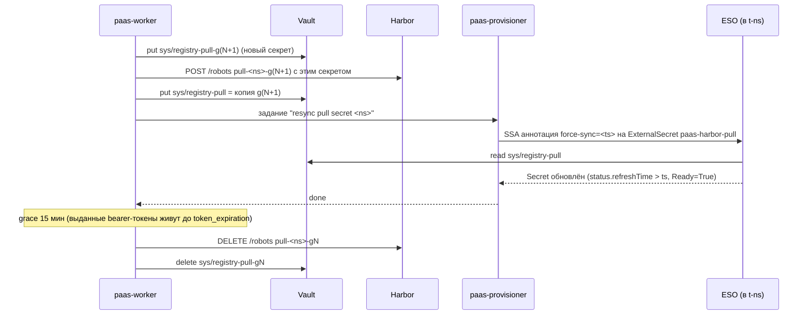

# 10. Услуга Registry (Harbor)

> **TL;DR**
> - **Harbor** (Apache 2.0, CNCF graduated) — единственный open-source registry, где из коробки есть всё, что мы продаём: project на организацию, квота с отказом на push, robot-токены из API, общий proxy-cache, Trivy. GitLab registry тенантам не отдаём (blast radius, нет квот и токенов нужной формы в CE, сломанный cleanup у владельца). zot/distribution — это «регистр без продукта».
> - Ставится ansible-компонентом `harbor` по конвенциям репо: `pre` (NP + ESO + Issuer) → `postgresql` (CNPG `harbor-db`) → `install` (upstream `goharbor/harbor`, все секреты через `existingSecret`) → `post` (IngressRoute + Certificate + ServiceMonitor) → `configure` (API-reconcile: auth, proxy-cache, GC, robot `paas-worker`). Per-tenant объекты Harbor создаёт только Go-backend.
> - **Тенанты в Harbor не входят.** Весь UX — в консоли платформы, `docker login` — только robot-токенами. Публично открыты лишь `/v2/` и `/service/token`, портал и API — только из VPN, OIDC — к staff-Zitadel.
> - Модель: Harbor-project `o-<org_id>` на Organization. System-level push-robot'ы (создаёт пользователь, срок ≤ 365 дней, секрет показан один раз, `delete` нет) и pull-robot на каждый Project (A/B-ротация раз в 60 дней через Vault + ESO `ExternalSecret` `paas-harbor-pull`, который создаёт provisioner). Секрет robot'а пишется в Vault **до** вызова Harbor — так шаг идемпотентен.
> - Proxy-cache `dockerhub/ghcr/quay/k8s` — непубличные, с отдельной upstream-учёткой. Backend переписывает ссылку на образ и **пинит digest** при деплое (кэш прогревается заранее). VAP с `namespaceObject` запрещает ссылаться на чужой `o-<org>`.
> - Квота Harbor = байты уникальных блобов проекта. Дедупликации между проектами для квоты нет — это маржа владельца. Квота жёсткая, без grace на push; биллинг — ступени тарифа + аддоны.
> - Хранилище: S3 SeaweedFS (бакет `harbor-registry`, identity `harbor` через `seaweedfs-sync`) — **только после conformance-теста**. Непроверенными остаются `DeleteObjects` (GC GitLab registry у владельца ни разу не запускался) и chunked-resume. Fallback — PVC LINSTOR ценой одной реплики registry. К GA — отдельный `seaweedfs-tenants`.
> - Блокировка по CVE — **на деплое в backend'е**, не на pull в Harbor: иначе ночной ре-скан роняет приложение тенанта при следующем рескедуле. «Scan All» выключен, ре-скан — только задеплоенных digest'ов.
> - Задеплоенное не исчезает: GC с `delete_untagged: false`, untagged чистит retention (только две заготовки, с dry-run), задеплоенные digest'ы держат пин-теги `paas-pin-*` со сверкой каждый час. Ловушки GitLab `created_at = nil` в Harbor нет: `push_time` Harbor ставит сам.
> - Kubelet тянет образы не через bastion в Германии, а через `/etc/hosts` → свой NodePort 443: иначе рескедул пода зависел бы от edge-прокси.
> - Бэкап: CNPG WAL + offsite `pg_dump` для БД; блобы — offsite `rclone copy` (решение владельца); `secretKey` — в Vault-снапшотах.

---

## 1. Почему Harbor, а не GitLab registry / zot / distribution

Требование владельца — «отдельный Harbor, беру деньги за место». Проверяем, что это правильный выбор, а не привычка: услуга должна давать **изоляцию по тенантам, квоту на место, выдаваемые из API токены, pull-through кэш, сканирование** — и всё это под управлением Go-backend'а через API, без ручной работы.

| Критерий | **Harbor** | GitLab registry (уже есть) | zot | CNCF Distribution v3 | Project Quay |
|---|---|---|---|---|---|
| Лицензия | Apache 2.0, CNCF graduated | MIT (CE) | Apache 2.0, CNCF sandbox | Apache 2.0 | Apache 2.0 |
| Мультитенантность | project = граница, свой RBAC | через GitLab-проекты и пользователей | статический ACL по glob репозиториев | нет (нужен свой token-server) | organization |
| Квота на место per tenant | **project quota, enforce на push** | CE — нет (лимиты неймспейсов — фича .com/платных тарифов) | нет | нет | есть (с 3.7) |
| Токены из API | **robot accounts, scoped, с TTL** | deploy tokens / PAT — привязаны к GitLab-сущностям | API keys у пользователей | нет | robot accounts |
| Pull-through кэш | **proxy-cache project** (docker.io, ghcr, quay, k8s, любой v2) | Dependency Proxy — только Docker Hub, только с GitLab-авторизацией | `sync`-расширение, on-demand | `proxy.remoteurl` — один upstream на инстанс | есть |
| Сканирование | Trivy встроен, auto-scan on push, блок pull по severity | CE — только через CI-джобы | Trivy-интеграция (search/CVE) | нет | Clair |
| GC | online (без read-only), по расписанию, dry-run | без metadata DB — offline, read-only окно | есть | offline, read-only | есть |
| Retention | правила по repo/tag, push/pull-time | cleanup policy **не работает у владельца** (`created_at = nil`) | есть (retention-политики) | нет | ограниченно |
| cosign / OCI referrers | подписи как accessories, enforce «без подписи не пуллить» | хранит, не энфорсит | referrers API, cosign | referrers API | частично |
| Вес эксплуатации | 7–9 подов + Postgres + Redis | уже работает | 1 бинарь | 1 бинарь | Quay + Clair + PG + Redis, операторная экосистема OpenShift |

**Решение: Harbor.** Он единственный из open-source даёт *из коробки* ровно ту модель, которую мы продаём: project-на-организацию + квота с отказом на push + robot-токены из API + общий proxy-cache + Trivy. Всё остальное пришлось бы дописывать на Go (token-server, квоты, учёт места) — то есть написать свой Harbor.

**Почему не GitLab registry** (зафиксировано D7, здесь аргументы):
1. **Blast radius.** GitLab — сердце доставки (tenant-репо, куда коммитит backend, и infra-git владельца). Тяжёлый трафик блобов тенантов, их квоты и их злоупотребления не должны жить в том же процессе, что git-ops платформы.
2. **Нет квот и токенов нужной формы в CE.** Пришлось бы заводить GitLab-пользователя/проект на тенанта — ещё один источник авторизации, который надо синхронизировать.
3. **Урок владельца** (`gitlab-registry-cleanup`): cleanup policy удаляет 0 тегов, потому что `created_at = nil` у OCI index от buildx; GC без metadata DB требует read-only окна. Для платной услуги «место» это неприемлемо — у тенанта должно быть видно и освобождаемо место.

**Почему не zot / distribution.** Лёгкие и быстрые, но это «регистр без продукта»: нет квот, нет API-выдачи scoped-токенов, у distribution нет даже авторизации. Мы бы переписали половину Harbor на Go и стали бы единственными мейнтейнерами этого кода. Соло-оператору это хуже, чем 8 лишних подов.

**Почему не Quay.** Функционально близок, но тяжелее (Clair + отдельная экосистема), комьюнити и helm-поддержка вне OpenShift заметно слабее. Нет выигрыша, который оправдал бы отход от де-факто стандарта k8s.

**Честные минусы Harbor**, которые принимаем:
- тяжёлый: ~2 vCPU / ~6 GiB requests на весь стек (см. §2.2);
- апгрейды с миграциями БД в `core` при старте — только по поддерживаемому пути версий, с бэкапом БД перед каждым (⚠️ проверить upgrade-path в release notes целевой версии);
- мейнтейнеры — сотрудники Broadcom (видно по `Chart.yaml`); вендор-риск смягчён статусом CNCF graduated и Apache 2.0.


## 2. Установка: ansible-компонент `harbor`

Harbor — **платформенный** компонент (D1): ставится ansible'ом по конвенциям репо, как `portainer`/`zitadel`/`kargo` (upstream-чарт в фазе `install`, локальные `pre`/`post`). Per-tenant объекты Harbor (проекты организаций, robot'ы тенантов, квоты) ansible **никогда** не трогает — их создаёт Go-backend через API в рантайме. Граница проходит так:

| Ansible (`playbook-app/harbor-install.yaml`, `hosts-vars/harbor.yaml`) | Go-backend (`paas-worker`) |
|---|---|
| workload Harbor, БД, Redis, секреты компонентов, ingress, ServiceMonitor | Harbor-project на организацию, его квота и metadata |
| системные настройки (auth mode, robot TTL, квоты вкл.) | robot'ы тенантов (push/pull), их ротация |
| registry endpoints + proxy-cache проекты (`dockerhub`, `ghcr`, `quay`, `k8s`) | retention/immutable-правила проектов организаций |
| расписание GC, системный robot `paas-worker` (секрет → Vault) | удаление проектов, suspend/restore |
| бакет `harbor-registry` + identity `harbor` в SeaweedFS (`seaweedfs-sync`) | — |

Namespace — `harbor`. Ноды — **системные** (без toleration tenant-пула из D4): Harbor обслуживает всех тенантов и не должен делить ноды с их нагрузкой.


### 2.1 Фазы pre / install / post

| Тег | Helm-релиз | Чарт | Содержимое |
|---|---|---|---|
| `pre` | `harbor-pre` | `charts/harbor/pre/` (локальный) | NetworkPolicy; ESO: SA `eso-main`, `SecretStore`, `ExternalSecret`'ы (ниже); `Issuer` (ACME HTTP-01) + solver-NP по циклу `spec.acme.solvers[]`; `extraObjects` |
| `postgresql` | `harbor-postgresql` | `charts/harbor/postgresql/` (локальный) | CNPG `Cluster` `harbor-db` (2 инстанса, `lnstr-worker-local`) + `ScheduledBackup` (§12). Требует CNPG-оператор (платформенный, D1/D6) |
| `install` | `harbor` | upstream `goharbor/harbor` из `https://helm.goharbor.io`; в репо только `charts/harbor/install/readme.md` | core, portal, registry(+registryctl), jobservice, trivy, redis (internal), exporter, nginx |
| `post` | `harbor-post` | `charts/harbor/post/` (локальный) | два `IngressRoute` (публичный v2-API и vpn-only портал), `Certificate`, `ServiceMonitor`, `extraObjects` |
| `configure` | — (API-reconcile через `uri`) | — | системная конфигурация Harbor, registry endpoints, proxy-cache проекты, расписания, системный robot `paas-worker` |

Флаги helm — стандартные по §6.4 конвенций (`--cleanup-on-fail --atomic --wait --wait-for-jobs --timeout`), `--create-namespace` на `harbor-pre`. Версия пинится переменной `harbor_helm_chart_version` — в scratchpad лежит chart **1.19.2 = Harbor v2.15.2** (⚠️ проверить актуальный релиз и upgrade-path перед установкой: `helm search repo harbor/harbor --versions`).

**Почему CNPG, а не sidecar-БД по §23 конвенций.** БД Harbor — единственный источник истины о том, какие артефакты, квоты и robot'ы есть у платящих тенантов. Нужен PITR (WAL-архив), а у паттерна §23 (StatefulSet + PVC) его нет. Бонус: Harbor становится первым «клиентом» managed-PG на CNPG (D6) — мы обкатываем barman-cloud на своей БД до продажи услуги тенантам. Fallback, если CNPG не готов к моменту запуска Harbor: §23-StatefulSet + ежедневный `pg_dump` в S3.

**Секреты (все — через ESO из Vault `eso-secret/harbor/*`, ничего не генерирует helm).** Upstream-чарт при пустых значениях генерирует `core.secret`, `jobservice.secret`, `registry.secret`, xsrf-ключ и TLS-пару token-сервиса через `randAlphaNum`/`genSelfSignedCert` **на каждом `helm upgrade`** — это рестарты, рассинхрон core↔jobservice посреди раската и недетерминированный рендер (render-diff перестаёт работать). Поэтому каждое значение — `existingSecret*`:

| ExternalSecret | Для чего | Потеря = |
|---|---|---|
| `eso-harbor-core` (`secret`), `eso-harbor-core-token` (`tls.crt`/`tls.key`), `eso-harbor-core-xsrf` (`CSRF_KEY`) | общий секрет core↔jobservice/registry; подпись bearer-токенов; CSRF портала | рестарт всех; выданные токены инвалидны (не страшно — живут минуты) |
| `eso-harbor-secretkey` (`secretKey`, 16 байт) | шифрование хранимых в БД кредов (upstream-пароли proxy-cache, OIDC client secret) | **нерасшифровываемые креды в БД** → хранить в Vault и в бэкапе (§12) |
| `eso-harbor-jobservice`, `eso-harbor-registry-http`, `eso-harbor-registry-creds` (`REGISTRY_PASSWD`/`REGISTRY_HTPASSWD`) | внутренние секреты компонентов | рестарт |
| `eso-harbor-s3` (`REGISTRY_STORAGE_S3_ACCESSKEY`/`_SECRETKEY`) | доступ registry к бакету | — |
| `eso-harbor-db-creds` (basic-auth: `username`/`password`) | bootstrap CNPG `initdb.secret` **и** `database.external.existingSecret` одним объектом | — |
| `eso-harbor-admin` (`HARBOR_ADMIN_PASSWORD`) | break-glass локальный admin | — |

⚠️ Имена ключей внутри секретов сверить с шаблонами чарта целевой версии (`helm template` + `grep existingSecret`).

**NetworkPolicy (фаза `pre`)** — default-deny на namespace плюс явные разрешения:

| Направление | Кто ↔ кого | Порт |
|---|---|---|
| ingress | `traefik-lb` → `harbor-nginx` | 8080 |
| ingress | `paas-system` (под `paas-worker`) → `harbor-core` | 8080 (API) |
| ingress | `mon-system` (Prometheus) → core/registry/jobservice/exporter | 8001 |
| ingress/egress | внутри `harbor` (core, registry, jobservice, trivy, redis, db) | по компонентам |
| egress | registry → `seaweedfs` S3 | 8333 |
| egress | core, jobservice, trivy → интернет `0.0.0.0/0` **кроме** RFC1918, 169.254/16, CGNAT, pod/svc CIDR | 443 (upstream-реестры, Trivy DB) |
| egress | core → Zitadel (staff-инстанс, OIDC) | 443 |
| egress | все → `kube-dns` | 53 |

Запрет приватных сетей на egress — защита от SSRF: jobservice ходит по webhook-URL, core — по URL registry endpoints. Сейчас тенанты не могут их задать (§2.3), но это слой на случай ошибки или будущей фичи «webhooks».


### 2.2 Ключевые helm-values

Фрагмент `harbor_helm_values` в `hosts-vars/harbor.yaml` (рендерится в `values-override.yaml` по §9 конвенций). Всё, что не указано, — дефолт чарта.

```yaml
externalURL: "https://{{ harbor_domain }}"          # registry.<platform-domain>; realm токен-сервиса
expose:
  type: clusterIP                                   # nginx чарта остаётся маршрутизатором /v2, /service, /api, /c
  tls: { enabled: false }                           # TLS терминирует Traefik
  clusterIP: { name: harbor }
existingSecretAdminPassword: eso-harbor-admin
existingSecretSecretKey: eso-harbor-secretkey
persistence:
  enabled: true
  resourcePolicy: keep
  persistentVolumeClaim:
    trivy: { storageClass: lnstr-worker-local, size: 10Gi }   # кэш Trivy DB + Java DB
  imageChartStorage:
    disableredirect: true            # клиенты НЕ получают 307 на S3: S3 внутренний и без публичного домена
    type: s3
    s3:
      existingSecret: eso-harbor-s3
      bucket: harbor-registry
      region: us-east-1
      regionendpoint: "http://seaweedfs-s3.{{ seaweedfs_namespace }}.svc.{{ cluster_dns_domain }}:8333"
      v4auth: true
      secure: false
registry:
  replicas: 2                        # S3 ⇒ stateless ⇒ можно >1 (с PVC — только 1, см. §6.4)
  existingSecret: eso-harbor-registry-http
  credentials: { existingSecret: eso-harbor-registry-creds }
  upload_purging: { enabled: true, age: 168h, interval: 24h, dryrun: false }
  registry:
    extraEnvVars:
      - { name: REGISTRY_STORAGE_S3_FORCEPATHSTYLE, value: "true" }  # явно, а не «выводится из regionendpoint»
core:
  replicas: 2
  existingSecret: eso-harbor-core
  secretName: eso-harbor-core-token  # tls.crt/tls.key для подписи токенов
  existingXsrfSecret: eso-harbor-core-xsrf
jobservice:
  replicas: 1
  existingSecret: eso-harbor-jobservice
  jobLoggers: [database]             # не PVC: иначе RWO-том прибивает jobservice к 1 реплике и ноде
database:
  type: external
  external:
    host: harbor-db-rw
    port: "5432"
    username: harbor
    coreDatabase: registry
    existingSecret: eso-harbor-db-creds
    sslmode: require                 # CNPG отдаёт TLS
  maxIdleConns: 5
  maxOpenConns: 20                   # дефолт чарта 900 (!) — см. ниже
redis: { type: internal }
trivy:
  replicas: 1
  offlineScan: true                  # не отправлять хэши артефактов тенантов во внешние API (Maven Central)
  timeout: 10m0s
  resources: { requests: { cpu: 200m, memory: 1Gi }, limits: { cpu: "2", memory: 2Gi } }
metrics:
  enabled: true
  serviceMonitor: { enabled: false } # ServiceMonitor рендерит наша фаза post
proxy:
  httpsProxy: ""                     # см. §4.2: если upstream-реестры недоступны с egress-IP кластера
```

**Урок владельца про пулы соединений.** Дефолт `maxOpenConns: 900` × (2 core + jobservice + exporter) при `max_connections: 100` в Postgres — ровно тот усилитель, что превратил блип в каскад у SeaweedFS (`PG pool 225 > 100`). Правило: `Σ(maxOpenConns × реплик) < max_connections − 20` (запас на суперпользователя и CNPG). При 4 процессах × 20 = 80 ставим `max_connections: 200` в CNPG `Cluster`.

**Три ловушки S3-конфига.**
1. `disableredirect: true` обязателен: с редиректом docker-клиент тенанта получит `307` на внутренний адрес SeaweedFS и не скачает слой.
2. `forcepathstyle`: в distribution v2.x path-style включался сам при заданном `regionendpoint`; в v3 это отдельный параметр. Virtual-host style на адресе `seaweedfs-s3.<ns>.svc` даст DNS-ошибку. Ставим явно (правило владельца «явный конфиг, а не выводимый»). ⚠️ Проверить: `helm template` → в `harbor-registry` ConfigMap/env есть `forcepathstyle`; если чарт не пробрасывает ключ из `s3:` — остаётся env, как выше.
3. `internalTLS` (шифрование между компонентами Harbor): в `hosts-vars/cilium.yaml` прозрачное шифрование (WireGuard/IPsec) **не включено** — трафик nginx→core с robot-секретами идёт открытым текстом по pod-сети. Для MVP под NP это принимаем; для GA — `internalTLS.enabled: true` с `certSource: secret` через cert-manager (не `auto` — тот тоже перегенерируется на каждом upgrade).

**Ресурсный бюджет (requests)**:

| Компонент | Реплик | CPU | RAM |
|---|---|---|---|
| nginx | 2 | 2×50m | 2×64Mi |
| portal | 1 | 50m | 64Mi |
| core | 2 | 2×200m | 2×512Mi |
| jobservice | 1 | 100m | 256Mi |
| registry + registryctl | 2 | 2×(200m+50m) | 2×(512Mi+64Mi) |
| trivy | 1 | 200m | 1Gi |
| redis (internal) | 1 | 50m | 256Mi |
| exporter | 1 | 50m | 64Mi |
| CNPG `harbor-db` | 2 | 2×250m | 2×1Gi |
| **Итого** | | **≈ 2 vCPU** | **≈ 6 GiB** |

Плюс PodDisruptionBudget `minAvailable: 1` для core, registry и nginx (в чарте `podDisruptionBudget.enabled`), `topologySpreadConstraints` по `kubernetes.io/hostname`.


### 2.3 Вход в Harbor UI: OIDC или только robot + UI платформы

**Решение: тенанты в Harbor не входят вообще.** В Harbor нет ни одного пользователя-тенанта. Всё, что тенант делает с registry, он делает в консоли платформы (§10). `docker login` — только robot-токенами (§3.2). Портал Harbor и `/api/v2.0` закрыты `vpn-only`; публично открыты только `/v2/` и `/service/token`.

Почему не OIDC к клиентскому инстансу Zitadel:
1. **Второй источник авторизации.** Члены Harbor-проекта с ролями пришлось бы синхронизировать с членством в Organization на каждое изменение. Любой дрейф — это уязвимость: уволенный из организации человек сохраняет push.
2. **Harbor UI отдаёт project admin'у то, что мы не продаём или что опасно:** webhooks на произвольные URL (SSRF из jobservice), создание robot'ов в обход наших лимитов и TTL, правка retention/immutable-правил (включая удаление «пинов» задеплоенных digest'ов, §8.3), CVE allowlist, выбор сканера, P2P preheat.
3. **Саморегистрация (D13) × auto-onboard.** В клиентском инстансе регистрируется кто угодно. Harbor с `oidc_auto_onboard` заведёт такого человека пользователем, а по умолчанию (`project_creation_restriction: everyone`) пользователь может создавать проекты. Получаем место, которое никто не оплачивает.
4. **Поверхность атаки.** Публичный портал и API Harbor — это сотни эндпоинтов. Нам наружу нужны только два пути протокола дистрибуции.

**OIDC всё же включаем, но к staff-инстансу Zitadel** — для оператора, в той же манере, что `grafana`/`argocd`/`gitlab` (`harbor_oidc_enabled`, клиент в staff-Zitadel, `oidc_admin_group` = staff-группа). Локальный `admin` остаётся break-glass: его пароль в Vault, вход только из VPN. Задаётся в шаге `configure`:

```json
PUT /api/v2.0/configurations
{
  "auth_mode": "oidc_auth",
  "oidc_name": "ZITADEL", "oidc_endpoint": "https://<zitadel-staff-domain>",
  "oidc_client_id": "<из Vault>", "oidc_client_secret": "<из Vault>",
  "oidc_scope": "openid,profile,email,offline_access", "oidc_groups_claim": "groups",
  "oidc_admin_group": "harbor-admins", "oidc_auto_onboard": true, "oidc_verify_cert": true,
  "project_creation_restriction": "adminonly",
  "quota_per_project_enable": true, "storage_per_project": -1,
  "robot_token_duration": 90, "robot_name_prefix": "robot_"
}
```

`storage_per_project: -1` (без лимита по умолчанию) безопасен: каждый проект создаётся с явным `storage_limit` — тенантский из backend'а, proxy-cache из ansible, — а проекты без лимита может создать только admin (`project_creation_restriction: adminonly`).

⚠️ Проверить на стенде: (а) Harbor разрешает переключить `auth_mode`, только пока в БД нет пользователей кроме `admin`, поэтому `configure` выставляет OIDC **первым** действием на свежей инсталляции; (б) в режиме `oidc_auth` локальный `admin` по-прежнему может войти; (в) robot'ы работают независимо от `auth_mode`.

**Маршрутизация (фаза `post`)** — два `IngressRoute` на один хост, общий backend `harbor:80`:

```yaml
# 1) публичный протокол дистрибуции — без vpn-only
- match: Host(`registry.<platform-domain>`) && (PathPrefix(`/v2/`) || Path(`/v2`) || PathPrefix(`/service/token`))
  priority: 100
  services: [{ name: harbor, port: 80 }]
# 2) всё остальное (портал, /api/v2.0, /c/ — логин OIDC) — только VPN
- match: Host(`registry.<platform-domain>`)
  priority: 10
  middlewares: [{ name: vpn-only, namespace: traefik-lb }]   # ipAllowList из vpn-rules.yaml
  services: [{ name: harbor, port: 80 }]
```

`paas-worker` ходит в API напрямую на `harbor-core.harbor.svc:80`, минуя ingress. Robot-токен тенанта не может обратиться даже к той части API, которую ему разрешает Harbor RBAC: `/api/v2.0` снаружи недоступен.

### 2.4 Сетевой путь pull'а: с нод — не через Германию

Публичное имя `registry.<platform-domain>` резолвится в IP bastion-proxy (Германия). Если kubelet на нодах тянет образы тенантов по этому имени, каждый pull проходит путь нода → интернет → bastion → NodePort Traefik → Harbor. Это двойной трафик, лишняя латентность, bastion как узкое место. И главное — **перезапуск пода тенанта зависит от доступности bastion**, а это нарушает принцип D3: data plane не должен зависеть от внешних звеньев.

**Решение (платформенное, ansible, статическое):** на каждой ноде в `/etc/hosts` имя `registry.<platform-domain>` указывает на `internal_ip` этой же ноды. Traefik слушает `websecure` на **NodePort 443** (`hosts-vars/traefik.yaml`, диапазон NodePort `1–50000`), и Cilium socket-LB заворачивает `own-ip:443` в под Traefik. SNI и сертификат те же, TLS валиден. Запись добавляется задачей в `playbook-system` рядом с существующим механизмом `containerd_additional_configs` (`/etc/containerd/certs.d/`). Подменять `certs.d` не нужно: имя резолвится локально.

Для подов внутри кластера (CI-сборки, если появятся) — `rewrite name registry.<platform-domain> traefik.<traefik-ns>.svc.cluster.local` в CoreDNS.

⚠️ Проверить на стенде: у `websecure` включён `proxyProtocol.insecure: true`. Нужно убедиться, что Traefik принимает соединения **без** PROXY-заголовка (заголовок необязателен): `curl --resolve registry.<d>:443:<node-ip> https://registry.<d>/v2/ -I` с ноды → ожидаем `401`.

**Лимит на размер слоя.** У `websecure` стоит `respondingTimeouts.readTimeout: 600` — это время на чтение **всего** запроса вместе с телом. Docker заливает слой одним `PATCH`, поэтому один слой должен уложиться в 10 минут: при 20 Мбит/с это ≈ 1.5 ГБ. На bastion `timeout client/server 1h`, он не мешает. Варианты — в §13.


## 3. Модель: Organization → Harbor project, роли, robot-аккаунты

### 3.1 Маппинг сущностей

| Сущность платформы | Объект Harbor | Имя | Кто создаёт |
|---|---|---|---|
| Organization (плательщик) | **project** | `o-<org_id>` (10 символов `[a-z0-9]`, как `project_id` в D2) | `paas-worker` при создании организации |
| Project (namespace `t-<project_id>`) | **pull-robot** (system-level) | `robot_pull-t-<project_id>-g<N>` | `paas-worker` при создании Project |
| «Токен доступа к Registry» (создаёт пользователь) | **push-robot** (system-level) | `robot_push-o-<org_id>-<token_id>` | `paas-worker` по запросу из UI |
| Репозиторий | repository внутри проекта | `o-<org_id>/<repo>` (имя задаёт пользователь) | `docker push` тенанта |
| Внешние публичные образы | 4 proxy-cache проекта | `dockerhub`, `ghcr`, `quay`, `k8s` | ansible `--tags configure` |

**Почему project на Organization, а не на Project.** Organization — плательщик, а квота продаётся плательщику (D7, D10). Кроме того, один образ собирают один раз и деплоят в несколько Project'ов одной организации (staging/prod). Изоляция между Project'ами одной организации на уровне registry не нужна: владелец у них один и тот же.

**Почему имя — случайный id, а не slug организации.** Harbor-project **нельзя переименовать**. Имя от пользователя заморозило бы название организации в каждой ссылке на образ и в каждом манифесте. Кроме того, случайное имя исключает сквоттинг и утечку названий, как и выбор D2 для namespace. В UI показываем готовую строку `registry.<d>/o-k3v9x0q2ma/api`, и её копируют, а не набирают.

**Роли.** Членов Harbor-проекта нет (§2.3). Права на registry — это права платформы на уровне Organization (модель ролей — в [05-data-model.md](05-data-model.md)):

| Действие в консоли | owner | admin | developer | viewer |
|---|---|---|---|---|
| смотреть репозитории, теги, уязвимости, место | ✓ | ✓ | ✓ | ✓ |
| удалить тег/артефакт | ✓ | ✓ | ✓ | — |
| создать/отозвать push-токен | ✓ | ✓ | — | — |
| изменить retention-правила, докупить место | ✓ | ✓ | — | — |


### 3.2 Robot-аккаунты: push (CI пользователя) и pull (кластер)

Оба вида robot'ов — **system-level**. Причина: project-level robot видит только один проект. Нашим robot'ам нужен доступ к проекту организации **и** к четырём proxy-cache проектам: CI тянет `FROM registry.<d>/dockerhub/library/golang`, кластер тянет публичные образы через кэш. Права задаются списком `permissions[]`, где у каждого элемента свой `namespace`.

| | push-robot (CI тенанта) | pull-robot (kubelet в `t-<project_id>`) | `paas-worker` (backend) |
|---|---|---|---|
| Создаёт | `paas-worker` по кнопке в UI | `paas-worker` при создании Project | ansible `--tags configure` |
| `o-<org_id>` | `repository: pull, push`; `artifact: read, list`; `tag: create, list` | `repository: pull` | — |
| proxy-cache проекты | `repository: pull` | `repository: pull` | — |
| Удалять | **нет** (`tag/artifact: delete` не выдаём — удаление только через UI, §8.3) | нет | — |
| Системный уровень | — | — | `project: create, list`; `robot: create, read, list, delete, update`; `quota: read, list`; для `namespace: "*"` — полный набор project-level прав |
| Срок жизни | выбирает пользователь: 30/90/365 дней, по умолчанию 90, **«никогда» нет** | 90 дней, ротация на 60-й (§3.4) | 90 дней, ротация ansible'ом |
| Секрет хранится | **нигде**: показан пользователю один раз | Vault `paas-tenants/<ns>/sys/registry-pull` | Vault `eso-secret/harbor/paas-worker-robot` |
| Лимит | по тарифу (5 / 20 / 50 на организацию) | 1 активный (+1 во время ротации) на Project | 1 (+1 при ротации) |

Push-robot'у **не** выдаём `delete`. Скомпрометированный CI-токен может залить мусор (его ограничит квота) и перезаписать теги. Удалить задеплоенный digest он не может.

⚠️ Проверить на стенде: (а) system-robot с `robot:create` может создавать другие system-robot'ы с project-правами (в Harbor ≥ 2.10 robot'ы умеют управлять robot'ами; нужно проверить ограничение «не шире своих прав»); (б) `namespace: "*"` в permission покрывает проекты, созданные **после** robot'а. Если (а) не работает — `paas-worker` использует локального `admin` из Vault. По силе это эквивалентно, но audit-лог Harbor хуже различает, кто что сделал.

**Компрометация `paas-worker` = доступ ко всем образам всех тенантов.** Поэтому, как требует D4, секрет есть только у `paas-worker`: у `paas-api` доступа к Harbor нет вообще.


### 3.3 Go-клиент Harbor API v2.0

**Решение: тонкий типизированный клиент на `net/http`**, ~15 эндпоинтов, в `internal/harbor`. Отвергнут `github.com/goharbor/go-client`: это сгенерированный go-swagger клиент на всю поверхность API (сотни операций), он тянет runtime `go-openapi` и привязан к версии swagger. Нам нужны project, quota, robot, artifact, tag, retention, immutable-rule, scan, metadata. Контракт проверяется интеграционным тестом против staging-Harbor той же версии (nightly), а не кодогенерацией.

Ключевой момент идемпотентности: **секрет robot'а Harbor отдаёт один раз**, в ответе на `POST /robots`. Если процесс упадёт между созданием robot'а и сохранением секрета, повтор получит `409 Conflict`, а секрет будет потерян. Поэтому секрет генерирует **backend**, пишет его в Vault **до** вызова Harbor и передаёт в поле `secret` (оно есть в `RobotCreate`). Повтор берёт тот же секрет из Vault, а `409` значит «уже создан с этим секретом».

```go
package harbor

type Access struct {
	Resource string `json:"resource"`
	Action   string `json:"action"`
}
type RobotPermission struct {
	Kind      string   `json:"kind"`      // "project"
	Namespace string   `json:"namespace"` // "o-k3v9x0q2ma" | "dockerhub" | "*"
	Access    []Access `json:"access"`
}
type RobotCreate struct {
	Name        string            `json:"name"`
	Description string            `json:"description,omitempty"`
	Secret      string            `json:"secret,omitempty"`
	Level       string            `json:"level"`    // "system"
	Duration    int64             `json:"duration"` // дни; -1 = never (не используем)
	Permissions []RobotPermission `json:"permissions"`
}
type RobotCreated struct {
	ID        int64  `json:"id"`
	Name      string `json:"name"`
	Secret    string `json:"secret"`
	ExpiresAt int64  `json:"expires_at"`
}

var proxyProjects = []string{"dockerhub", "ghcr", "quay", "k8s"}

func pullPerms(orgProject string) []RobotPermission {
	p := []RobotPermission{{Kind: "project", Namespace: orgProject,
		Access: []Access{{Resource: "repository", Action: "pull"}}}}
	for _, pc := range proxyProjects {
		p = append(p, RobotPermission{Kind: "project", Namespace: pc,
			Access: []Access{{Resource: "repository", Action: "pull"}}})
	}
	return p
}

// EnsureProject создаёт проект организации с квотой. Идемпотентно: 409 → сходимся к желаемой квоте.
func (c *Client) EnsureProject(ctx context.Context, name string, storageLimit int64) error {
	body := map[string]any{
		"project_name":  name,
		"storage_limit": storageLimit, // байты; -1 = без лимита (не используем)
		"metadata": map[string]string{
			"public": "false", "auto_scan": "true", "prevent_vul": "false",
			"auto_sbom_generation": "false",
		},
	}
	err := c.do(ctx, http.MethodPost, "/api/v2.0/projects", body, nil)
	if IsConflict(err) {
		return c.SetProjectQuota(ctx, name, storageLimit)
	}
	return err
}

// EnsurePullRobot — шаг state machine (River). Порядок строго: Vault → Harbor.
func (w *Worker) EnsurePullRobot(ctx context.Context, ns, orgProject string, gen int) error {
	name := fmt.Sprintf("pull-%s-g%d", ns, gen)
	path := ns + "/sys/registry-pull-g" + strconv.Itoa(gen)
	sec, err := w.vault.GetOrCreate(ctx, path, func() map[string]string {
		return map[string]string{"username": "robot_" + name, "password": secretgen.Robot(32)}
	})
	if err != nil {
		return err
	}
	_, err = w.harbor.CreateRobot(ctx, harbor.RobotCreate{
		Name: name, Level: "system", Duration: 90, Secret: sec["password"],
		Description: "paas pull " + ns, Permissions: pullPerms(orgProject),
	})
	if harbor.IsConflict(err) {
		return nil // создан раньше этим же шагом с этим же секретом
	}
	return err
}
```

`secretgen.Robot` гарантирует требования Harbor к сложности секрета (есть верхний и нижний регистр и цифры; ⚠️ сверить длину и правила в целевой версии). Все вызовы идут с таймаутом, ретрай — только на `5xx`/сетевые ошибки (River backoff). `4xx`, кроме `409`, считаются терминальной ошибкой шага и выводятся оператору.

**Push-токен: секрет не должен лечь в БД.** Токен создаёт пользователь, секрет показывается ему один раз, а создание идёт через очередь (`paas-api` не имеет прав на Harbor, D4). Схема:
1. `paas-api` генерирует секрет, шифрует его через Vault Transit (`paas-transit/encrypt/job-secrets` — у `paas-api` есть только `encrypt`), кладёт в River-задание **шифротекст** и отдаёт браузеру открытый секрет вместе с `job_id`.
2. Браузер держит секрет в памяти и показывает его только после SSE-события `job succeeded`. Если задание упало, секрет выбрасывается.
3. `paas-worker` расшифровывает (`decrypt` есть только у него) и создаёт robot с этим секретом.

Итог: в Postgres, River и логах — только шифротекст. Взлом `paas-api` не позволяет расшифровать ранее поставленные задания. Это общий паттерн «задание с секретом»; его место — в [04-control-plane-go.md](04-control-plane-go.md).


### 3.4 Срок жизни и ротация токенов

**Push-токены.** Срок обязателен, максимум 365 дней. Уведомления за 14 и за 3 дня до истечения. Протухший robot Harbor просто не аутентифицирует, но **не удаляет** — это делает ежесуточное задание `harbor-robot-gc`, которое сверяет список robot'ов с БД платформы. Кнопки «Перевыпустить» нет. Есть «Создать новый» и «Отозвать»: in-place `PATCH /robots/{id}` мгновенно инвалидирует старый секрет, и CI-пайплайны пользователя падают без окна перехода. Кнопка «Отозвать все» удаляет все push-robot'ы организации — это реакция на инцидент.

**Pull-robot'ы — A/B-ротация без окна недоступности** (каждые 60 дней и по кнопке оператора):



Старый robot удаляется **только** после того, как ESO подтвердил обновление целевого Secret'а. Уже выданные Harbor'ом bearer-токены (JWT, живут `token_expiration`, по умолчанию 30 мин — ⚠️ проверить) продолжают работать до истечения. Поэтому grace ≥ `token_expiration`.

**`paas-worker` robot** ротирует ansible (`--tags configure`) по полю-триггеру `harbor_paas_worker_robot_mtime`, по той же логике, что `passwordMtime` у `gitlab`: создать новый → записать в Vault → worker перечитывает секрет из Vault с TTL кэша 5 мин → удалить старый через 15 мин.


### 3.5 imagePullSecret в tenant-ns

Создаёт **`paas-provisioner`** при создании namespace, это управляющий объект по D3 (не в git, SSA, fieldManager `paas-provisioner`). Сам секрет с кредами provisioner **не видит и не пишет**. Он создаёт `ExternalSecret`, и ESO через `SecretStore` namespace'а (D9, SA `paas-eso`, templated policy) читает путь `paas-tenants/data/<ns>/sys/registry-pull`. Благодаря этому секрет robot'а не проходит через очередь заданий, а ротация (§3.4) — это просто запись в Vault.

```yaml
apiVersion: external-secrets.io/v1
kind: ExternalSecret
metadata:
  name: paas-harbor-pull
  namespace: t-k3v9x0q2ma
  labels:
    paas.1520.tech/managed-by: paas
    paas.1520.tech/tenant-ns: t-k3v9x0q2ma
spec:
  refreshInterval: 1h
  secretStoreRef: { kind: SecretStore, name: paas-vault }
  target:
    name: paas-harbor-pull
    creationPolicy: Owner
    template:
      type: kubernetes.io/dockerconfigjson
      data:
        .dockerconfigjson: '{"auths":{"registry.<platform-domain>":{"auth":"{{ printf "%s:%s" .username .password | b64enc }}"}}}'
  data:
    - secretKey: username
      remoteRef: { key: t-k3v9x0q2ma/sys/registry-pull, property: username }
    - secretKey: password
      remoteRef: { key: t-k3v9x0q2ma/sys/registry-pull, property: password }
```

- Префикс `sys/` в пользовательских именах секретов запрещён валидацией backend'а. Коллизия с секретом тенанта невозможна.
- Ссылку на секрет в под навешивает `Harden()` явно: `spec.imagePullSecrets: [{name: paas-harbor-pull}]` в каждом pod template. SA `default` не патчится — так ссылка видна в golden-тестах и в git.
- Одно имя хоста в `auths` покрывает и собственные образы, и proxy-cache: всё идёт через `registry.<platform-domain>`.
- Шаг state machine «создать Project» завершается только тогда, когда `ExternalSecret` в `Ready=True`. Иначе первый деплой получил бы `ImagePullBackOff`.
- Tenant-ArgoCD этот объект не трогает: он не отслеживает и не prune'ит ресурсы без своей tracking-метки.


## 4. Proxy-cache (docker.io, ghcr.io, quay.io, registry.k8s.io)

Четыре proxy-cache проекта — **платформенные**. Их создаёт ansible `--tags configure` (`POST /api/v2.0/registries` → `POST /projects` с `registry_id`). В исходниках Harbor прямо проверяется, что proxy-cache проект может создать только system admin.

| Проект | Endpoint type | Upstream | Квота | Retention |
|---|---|---|---|---|
| `dockerhub` | `docker-hub` | `https://hub.docker.com` | 150 GiB | 7 дней с последнего pull (Harbor создаёт сам) |
| `ghcr` | `github-ghcr` | `https://ghcr.io` | 50 GiB | то же |
| `quay` | `quay` | `https://quay.io` | 30 GiB | то же |
| `k8s` | `docker-registry` | `https://registry.k8s.io` | 20 GiB | то же |

Правила:
- **Не `public`.** Анонимный pull превратил бы `registry.<d>` в бесплатное зеркало Docker Hub для всего интернета: трафик, исчерпание upstream-лимита, abuse-жалобы на наш IP. Доступ есть только у robot'ов тенантов (§3.2).
- **Upstream-учётка — отдельная, без приватных репозиториев и без членства в организациях.** Кэш отдаёт любому тенанту всё, что видит эта учётка. Если это личный аккаунт владельца, его приватные образы станут доступны всем тенантам.
- `proxy_cache_local_on_not_found: "true"`: если образ удалили upstream, отдаём его из кэша, и приложения тенантов не падают. ⚠️ Проверить семантику на стенде.
- `auto_scan: "false"` на proxy-проектах. Сканировать каждый публичный образ дорого. Сканируются только **задеплоенные** digest'ы, по заданию backend'а (§7).
- Место в proxy-проектах — расход платформы, в квоту тенанта не входит. Harbor сам создаёт retention «7 дней с последнего pull» (константа `defaultDaysToRetentionForProxyCacheProject = 7` в исходниках).
- Push в proxy-cache проект Harbor отклоняет by design.


### 4.1 Переписывание ссылок на образы (Go)

Пользователь вводит в форме привычное `nginx:1.27` или `ghcr.io/org/app:v2`. Backend нормализует ссылку, переписывает её на Harbor и **пинит digest** на момент деплоя. Пин нужен, чтобы перезаливка `:latest` не меняла тихо образ при следующем рескедуле пода. Кроме того, это воспроизводимость и защита от подмены тега upstream.

```go
package imageref

import (
	"errors"
	"fmt"
	"strings"

	"github.com/distribution/reference"
)

var (
	ErrNotAllowed     = errors.New("registry is not allowed")
	ErrForeignProject = errors.New("image belongs to another organization")
)

// upstream → proxy-cache проект Harbor
var proxyCache = map[string]string{
	"docker.io":           "dockerhub",
	"registry-1.docker.io": "dockerhub",
	"ghcr.io":             "ghcr",
	"quay.io":             "quay",
	"registry.k8s.io":     "k8s",
}

func IsProxyProject(p string) bool {
	switch p {
	case "dockerhub", "ghcr", "quay", "k8s":
		return true
	}
	return false
}

// Rewrite: "nginx:1.27" → "registry.<d>/dockerhub/library/nginx:1.27".
// Digest дописывается позже (ResolveDigest через Harbor, который заодно прогревает кэш).
func Rewrite(in, harborHost, orgProject string) (string, error) {
	in = strings.TrimSpace(in)
	if in == "" || len(in) > 512 {
		return "", fmt.Errorf("invalid image reference length")
	}
	named, err := reference.ParseNormalizedNamed(in) // "nginx" → docker.io/library/nginx
	if err != nil {
		return "", fmt.Errorf("invalid image reference: %w", err)
	}
	domain, path := reference.Domain(named), reference.Path(named)

	var repo string
	if domain == harborHost {
		project, _, _ := strings.Cut(path, "/")
		if project != orgProject && !IsProxyProject(project) {
			return "", ErrForeignProject // чужой o-<org>: pull всё равно упал бы, но ошибка — сразу и понятная
		}
		repo = harborHost + "/" + path
	} else {
		p, ok := proxyCache[domain]
		if !ok {
			return "", fmt.Errorf("%w: %s (supported: docker.io, ghcr.io, quay.io, registry.k8s.io)", ErrNotAllowed, domain)
		}
		repo = harborHost + "/" + p + "/" + path // library/ для официальных образов Docker Hub сохраняется
	}
	if d, ok := named.(reference.Digested); ok {
		return repo + "@" + d.Digest().String(), nil
	}
	tag := "latest"
	if t, ok := named.(reference.Tagged); ok {
		tag = t.Tag()
	}
	return repo + ":" + tag, nil
}
```

В манифест пишется `registry.<d>/o-k3v9x0q2ma/api:1.4.2@sha256:…`. Kubelet использует digest, а тег остаётся для человека в UI и в git-диффе. Digest резолвится через `HEAD /v2/<repo>/manifests/<tag>` к Harbor с pull-кредами проекта. Для proxy-cache это одновременно прогревает кэш до коммита манифеста, так что `ImagePullBackOff` из-за upstream всплывает **до** деплоя, а не после. Golden-тесты покрывают официальные образы (`nginx`), вложенные пути (`ghcr.io/a/b/c`), `name:tag@digest`, порт в хосте (`localhost:5000/x` → отказ), верхний регистр (отказ).

**Защита в admission (предложение для [03-security-model.md](03-security-model.md)).** VAP из D4 проверяет префикс `registry.<d>/`. Этого мало: префикс не мешает сослаться на **чужой** `o-<org>`. Pull бы всё равно не прошёл, но это единственная линия защиты. У CEL в VAP есть `namespaceObject`, поэтому provisioner вешает на namespace метку `paas.1520.tech/harbor-project=o-<org_id>`, а правило требует:

```cel
object.spec.template.spec.containers.all(c,
  c.image.startsWith('registry.<d>/' + namespaceObject.metadata.labels['paas.1520.tech/harbor-project'] + '/')
  || ['dockerhub','ghcr','quay','k8s'].exists(p, c.image.startsWith('registry.<d>/' + p + '/')))
```

(аналогично для `initContainers`/`ephemeralContainers`; плюс требование `@sha256:` в ссылке — это и есть «только пиненные digest'ы»).


### 4.2 Лимиты Docker Hub и защита от них

**Лимиты** (⚠️ проверить актуальные на docs.docker.com/docker-hub/usage/ — Docker менял их в 2025): анонимно ~10 pull/час на IP (IPv6 — на /64), бесплатная учётка ~100 pull/час, платные тарифы — без жёсткого лимита (fair use). Считается `GET` манифеста. `HEAD` не считается.

**Почему proxy-cache в основном снимает проблему.** При повторном pull тега Harbor проверяет upstream через `HEAD` (бесплатно) и отдаёт слои из кэша. Лимит тратится только на **уникальные новые** манифесты, а не на число тенантов и рестартов подов. Весь egress кластера выходит с нескольких IP, поэтому без учётки мы бы упёрлись в анонимный лимит за минуты. Отсюда решения:
1. Учётка Docker Hub на endpoint `dockerhub` обязательна. При > ~50 активных тенантов нужен платный тариф (решение владельца, §13).
2. Kubelet никогда не ходит в Docker Hub напрямую: VAP разрешает только `registry.<d>/…`. Существующий `_default/hosts.toml` → `mirror.gcr.io` в `k8s-base.yaml` остаётся для **системных** образов платформы.
3. Resolve digest при деплое (§4.1) прогревает кэш заранее. Если upstream отказал (429/5xx), деплой не коммитится и пользователь видит ошибку «источник образа временно недоступен». Сломанного Deployment не остаётся.

**Доступность upstream из РФ.** С 2024 года были эпизоды блокировок Docker Hub для российских IP. ⚠️ Проверить с egress-IP нод: `curl -sI https://registry-1.docker.io/v2/` и `curl -sI https://ghcr.io/v2/`. Если заблокировано — `proxy.httpsProxy` в values Harbor (компоненты `core`, `jobservice`, `trivy`) на forward-proxy вне РФ, с allowlist только на домены реестров и Trivy DB. Где его держать, решает владелец. На bastion-proxy — не лучший вариант: по D5 bastion «тупой и статический», а forward-proxy меняет его роль и добавляет юридический вопрос о трафике через Германию (D11).


## 5. Квоты и биллинг

Квота registry — это **жёсткий лимит места на Organization**, который продаётся ступенями тарифа и пакетами-аддонами (D10). Enforcement делает сам Harbor (project quota). Backend только выставляет лимит и показывает потребление.


### 5.1 Как Harbor считает project quota

- **Единица — байты блобов, на которые ссылаются артефакты проекта:** слои (в сжатом виде, как залиты), config, манифесты. Блоб, общий для двух репозиториев **одного** проекта, считается один раз.
- **Между проектами дедупликации для квоты нет.** Базовый слой `debian:12`, залитый тремя организациями, каждая оплачивает целиком, а физически в S3 он лежит один раз (content-addressable storage distribution). Эта разница — законная маржа владельца, как и зафиксировано в D7.
- **Accessories считаются.** cosign-подписи, SBOM, attestation-манифесты внутри OCI index (buildx по умолчанию) — это артефакты проекта. Они маленькие (КБ), но в UI должны быть видны.
- **Untagged артефакты тоже считаются**, пока их не удалит retention или GC. Типичный сюрприз пользователя: «у меня три тега, а квота полна» — это двадцать старых digest'ов от перезаливок `:latest`. Поэтому UI показывает размер untagged отдельно, а retention по умолчанию чистит их через 7 дней (§8.2).
- **Удаление артефакта уменьшает `used` сразу** (снимается ссылка), а физическое место освобождает только GC. Пользователь видит освобождённую квоту мгновенно, у владельца физическое потребление ≠ Σ `used`.
- Блобы proxy-cache идут в квоту proxy-проекта, а не тенанта.

API: `GET /api/v2.0/quotas?reference=project&reference_id=<project_id>` → `hard.storage` / `used.storage`; изменение — `PUT /api/v2.0/quotas/{id}` с `{"hard":{"storage":<bytes>}}`.


### 5.2 Биллинг по квоте

| Тариф (пример, цены — в [13-billing-and-quotas.md](13-billing-and-quotas.md)) | Registry включено | Push-токенов |
|---|---|---|
| Hobby | 1 GiB | 5 |
| Standard | 5 GiB | 20 |
| Pro | 20 GiB | 50 |
| Аддон «+10 GiB registry» | +10 GiB | — |

- `hard = включено_по_тарифу + Σ аддонов`. Меняет его только `paas-worker` в том же state machine, что и смену тарифа. Источник истины — БД биллинга, Harbor — исполнитель. Раз в час сверка: расхождение `hard` в Harbor с БД → автоисправление + алерт (признак ручной правки или бага).
- **Метеринг `used`** — почасовой опрос `/quotas` → идемпотентный upsert в `usage_hourly` (`org_id, resource='registry_bytes', hour, value`). Для flat-тарифа он не нужен, но нужен для fair-use, планирования ёмкости и будущего overage (D10).
- **Ёмкость:** Σ `hard` по всем проектам — это обязательство, а не потребление. Типичный `used/hard` — 30–50 %, поэтому overcommit допустим. Но нужны два алерта: физический размер бакета `harbor-registry` > 70 % свободной ёмкости SeaweedFS, и Σ `used` > 60 % физического запаса. Страховочная сетка — квота на уровне SeaweedFS на бакет (⚠️ проверить поведение `s3.bucket.quota` в 4.45: блокирует ли запись и что при этом увидит distribution).


### 5.3 Превышение квоты и grace

- **Push, превышающий квоту, отклоняется Harbor'ом**: `denied: … will exceed the configured upper limit of …` при загрузке блоба или `PUT` манифеста. Существующие образы, pull и работающие приложения не затрагиваются. Недокачанные блобы остаются сиротами — GC Harbor чистит их явно (в коде GC это отдельный кейс «orphan blobs created in the quota exceeding case»).
- Текст ошибки в CI задаёт Harbor, мы его не контролируем. Поэтому в UI и в письмах есть пороги 80 % и 95 %, и документация объясняет, как выглядит эта ошибка в `docker push`.
- **Grace на push нет** — квота жёсткая, как решено в D10. Выход: удалить лишнее или докупить аддон, и то и другое — одна кнопка, лимит меняется за секунды.
- **Даунгрейд тарифа при `used > new_hard`:** backend **запрещает** даунгрейд, пока пользователь не освободит место, и UI показывает, что удалить (untagged, самые старые). Установить в Harbor `hard < used` мы не пытаемся: поведение этого случая надо проверить (⚠️), а «квота меньше занятого» — плохой UX в любом варианте.
- Grace по **неоплате** — это отдельная история, §11.


## 6. Хранилище: SeaweedFS S3 vs PVC

**Решение:** основной вариант — S3 SeaweedFS, отдельный бакет `harbor-registry` и отдельная identity `harbor`, но **только после прохождения conformance-теста** (§6.3). Fallback — PVC на LINSTOR (§6.4).

Бакет и identity — **платформенные** объекты (один бакет на всех тенантов, изоляцию тенантов обеспечивает Harbor, а не S3). Поэтому их объявляет ansible через `seaweedfs-sync`, по образцу закомментированных gitlab-бакетов в `hosts-vars/seaweedfs-sync.yaml`:

```yaml
# hosts-vars-override/<cluster>/seaweedfs-sync.yaml
seaweedfs_managed_policies_extra:
  - name: harbor-rw
    document:
      Version: "2012-10-17"
      Statement:
        - Sid: "HarborRegistryFullAccess"
          Effect: "Allow"
          Action: ["s3:GetObject", "s3:PutObject", "s3:DeleteObject", "s3:ListBucket", "s3:GetBucketLocation"]
          Resource: ["arn:aws:s3:::harbor-registry", "arn:aws:s3:::harbor-registry/*"]
seaweedfs_identities_extra:
  - name: harbor
    account_id: harbor            # == name (инвариант filter_plugins/seaweedfs_user.py)
    actions: []
    policy_names: [harbor-rw]
seaweedfs_sync_buckets_extra:
  - name: harbor-registry
    owner: "harbor"
    replication: "001"
    volumeGrowthCount: 2
    rack: "workers-1"
    dataCenter: "dc-1"
```

Набор action'ов повторяет `gitlab-rw`, на котором GitLab registry (тот же род драйвера distribution) уже работает в проде. Проходят ли под ним `ListMultipartUploads`/`ListParts`/`AbortMultipartUpload` — это отдельный пункт conformance-теста. Ключи identity — в Vault `eso-secret/harbor/s3-storage`, в Harbor попадают через `eso-harbor-s3`.

**Куда переезжает бакет к GA.** D8 требует отдельного инстанса `seaweedfs-tenants`. Registry — это bulk-данные тенантов с пиковыми нагрузками (массовые push из CI), и держать их в одном инстансе с Loki, GitLab и бэкапами CNPG не надо: инцидент со spin filer'а и каскадом у владельца уже был. Переезд: `rclone copy` старого бакета в новый. Блобы content-addressable и неизменяемы, поэтому копия инкрементальна. Затем Harbor `read_only: true` (системная настройка) → финальный `rclone copy` → смена `regionendpoint` → `read_only: false`. Окно — минуты.


### 6.1 Какие S3-операции использует distribution S3 driver

Registry Harbor — это distribution с драйвером `s3-aws`. Методы драйвера и S3-вызовы за ними (по коду distribution v2.8/v3; ⚠️ подтвердить фактический список debug-логом драйвера, §6.3):

| Метод драйвера | S3-операции | Когда | На SeaweedFS у владельца |
|---|---|---|---|
| `PutContent` | `PutObject` | manifests, link-файлы, `startedat` | ✓ (работает у GitLab registry) |
| `Reader`/`GetContent` | `GetObject` (+ `Range`) | pull слоёв, чтение link-файлов | ✓ |
| `Stat` | `HeadObject`; для «каталогов» `ListObjectsV2(prefix, max-keys=1)` | повсюду | ✓ |
| `Writer` (новый upload) | `CreateMultipartUpload`, `UploadPart`, `CompleteMultipartUpload` | push слоя | ✓ |
| `Writer` (resume/append) | `ListMultipartUploads(prefix)`, `ListParts`; если последняя часть < 5 MiB — `Complete` → новый `Create` + `GetObject` или `UploadPartCopy` | **chunked upload** (несколько `PATCH` на блоб) | ⚠️ не проверено: docker CLI шлёт один `PATCH`, но containerd/buildkit/crane могут резать |
| `Move` (коммит блоба) | ≤ 32 MiB — `CopyObject`; больше — `CreateMultipartUpload` + `UploadPartCopy` c `x-amz-copy-source-range` + `Complete`; затем удаление источника | **каждый** коммит `_uploads/<id>/data` → `blobs/sha256/…/data` | ✓ скорее всего (у GitLab есть слои > 32 MiB) — подтвердить |
| `Delete` | `ListObjectsV2` (рекурсивно) + `DeleteObjects` (пачки ≤ 1000) | чистка upload'ов, sweep GC, удаление репозитория | ⚠️ **не проверено**: GC GitLab registry у владельца ни разу не запускался |
| `List`/`Walk` | `ListObjectsV2` c `delimiter`, пагинация `continuation-token` | upload purging | ✓ базово; > 1000 ключей ⚠️ |
| `URLFor` | presigned `GET` | только с redirect | выключено (`disableredirect`) |

**Хорошая новость:** `HeadBucket`, `GetObjectAttributes`, `Get/PutObjectTagging`, `GetObjectAcl` — ровно те операции, что у владельца сломаны на SeaweedFS, — драйвер distribution в штатной работе, насколько известно, **не вызывает**. **Плохая:** непроверенными остаются путь удаления (`DeleteObjects`) и chunked-resume — а это GC и часть клиентов.


### 6.2 Риски известных дыр SeaweedFS

| Риск | Последствие | Мера |
|---|---|---|
| `DeleteObjects` частично падает или врёт о результате | GC «освободил» место в БД Harbor, а объекты остались (утечка) — или наоборот | тест №7 §6.3; ежемесячная сверка размера бакета с `Σ used` + ожидаемый оверхед |
| Пагинация `ListObjectsV2` с `delimiter` на > 1000 ключей | upload purging не видит часть `_uploads` → мусор растёт | тест №8; метрика размера префикса `_uploads/` |
| `UploadPartCopy` делает не zero-copy, а копирует данные | каждый слой > 32 MiB пишется **дважды** (IO-амплификация на push) | принять; учитывать в ёмкости дисков SeaweedFS |
| Много мелких объектов: link-файлы по каждому слою в каждом репозитории, ревизии и индексы тегов (10–30 объектов на артефакт) | нагрузка на metadata-store filer'а (Postgres у SeaweedFS владельца): на 100k артефактов — миллионы записей | мониторинг размера filer-PG; к GA — отдельный инстанс (D8) |
| Spin/падение filer'а (инцидент владельца) | push и pull **некэшированных** слоёв падают. Работающие поды живут, новые/рескедулящиеся — `ImagePullBackOff` | алерт на 5xx registry; runbook «перезапустить filer, держащий `s3.leader`»; отдельный инстанс к GA |
| Будущий апгрейд SeaweedFS меняет S3-семантику (у владельца так уже бывало: 4.38 ListBuckets, 4.42/4.43 деградации) | тихая порча registry | conformance-тест §6.3 — **обязательный гейт каждого апгрейда SeaweedFS и Harbor** |


### 6.3 Conformance-тест

Стенд: staging-Harbor той же версии чарта + отдельный бакет на SeaweedFS **той же версии (4.45)** + `REGISTRY_STORAGE_S3_LOGLEVEL=debug` в `registry.registry.extraEnvVars`, чтобы драйвер логировал все S3-запросы (⚠️ сверить имя параметра `loglevel` в версии distribution из образа). Скрипт лежит в репо платформы (`tests/registry-conformance/`) и прогоняется до запуска услуги и перед каждым апгрейдом Harbor/SeaweedFS.

| # | Проверка | Инструмент | Критерий |
|---|---|---|---|
| 1 | OCI distribution-spec conformance (push monolithic + **chunked**, pull, cross-mount, referrers, delete) | `opencontainers/distribution-spec/conformance` (`OCI_ROOT_URL`, `OCI_NAMESPACE`, `OCI_TEST_PUSH/PULL/CONTENT_DISCOVERY/CONTENT_MANAGEMENT=1`) | все тесты зелёные, кроме задокументированных отклонений Harbor |
| 2 | Большой многослойный образ: 5 слоёв × 1–3 GiB случайных данных | `docker push`, затем `crane push`/`skopeo copy` | pull на другом хосте, sha256 каждого слоя совпадает |
| 3 | Multi-arch index + attestations buildx по умолчанию | `docker buildx build --platform linux/amd64,linux/arm64 --push` | pull обеих архитектур; index и дети в UI; статус скана индекса (§7) |
| 4 | Подписи и referrers | `cosign sign`, `cosign attest --type spdx`, `oras discover` | accessories видны в Harbor, `cosign verify` проходит, учтены в квоте |
| 5 | Конкурентность | 20 параллельных push + 50 параллельных pull (`crane` в цикле) | 0 × 5xx, CPU filer'а в пределах |
| 6 | Квота | push сверх лимита | `denied`, после GC сироты удалены |
| 7 | Удаление + GC | удалить 50 % артефактов → GC (не dry-run) → повторный GC | число объектов в бакете (`aws s3 ls --recursive \| wc -l`) упало ≥ 95 % от ожидаемого; **все** оставшиеся digest'ы пуллятся; второй GC — no-op |
| 8 | Upload purging | прервать push (kill клиента), `upload_purging.age: 1h` на стенде | `_uploads/` вычищен; в логе `AbortMultipartUpload` |
| 9 | Отказ filer'а во время push | `kubectl delete pod` filer'а посреди push 2 GiB | push падает или ретраится, **битых блобов нет** (pull + verify digest) |
| 10 | Инвентаризация операций | grep debug-лога по именам S3-операций | список ⊆ §6.1; любая лишняя операция — разбор до продажи |

Итоговый критерий: ноль несовпадений digest, ноль неожиданных 5xx, GC возвращает место. Если хоть что-то из №1, 2, 7, 9 не проходит — идём по fallback §6.4 и заводим issue в SeaweedFS.


### 6.4 Fallback на PVC LINSTOR

`imageChartStorage.type: filesystem` на PVC `lnstr-worker-multi-sync` (DRBD, 2 реплики). Честная цена:
- **RWO ⇒ `registry.replicas: 1` и `Recreate`** (RWX в LINSTOR без NFS-слоя нет). Каждый апгрейд Harbor и каждый отказ ноды — это минуты недоступности push и pull некэшированных слоёв.
- Пул thin, поэтому размер PVC задаётся явно, под планируемую ёмкость, и растёт через `allowVolumeExpansion`. Иначе overcommit thin-пула (факт ground truth) проявится как отказ записи у всех.
- GC работает (registryctl в том же поде), но место на PVC возвращает только сама файловая система.
- Путь обратно в S3: layout `docker/registry/v2/...` одинаков, поэтому `rclone copy` каталога в бакет + окно `read_only` Harbor.

PVC — **временная мера**, чтобы запустить услугу, пока SeaweedFS не прошёл тест. Он не альтернатива на равных.


## 7. Trivy: сканирование и блокировка по severity

**Что сканируем:**
- собственные образы тенантов — `auto_scan: true` на проекте организации, скан на каждый push;
- proxy-cache — **не** автоматом, только задеплоенные digest'ы (§4);
- **ночной ре-скан только задеплоенных digest'ов** (backend знает их по пинам, §8.3): `POST …/artifacts/{digest}/scan`. Системный «Scan All» Harbor **выключен**: перескан тысяч никому не нужных образов каждую ночь съест CPU кластера. Новые CVE в работающих приложениях всплывают к утру и уходят тенанту уведомлением.

**Блокировка — на деплое в backend'е, а не на pull в Harbor.** Флаг проекта `prevent_vul` + `severity` запрещает **pull** артефакта с уязвимостями ≥ порога. Ловушка: ночью Trivy DB обновилась, ре-скан пометил работающий образ как CRITICAL, а утром нода ушла в drain — и приложение тенанта не поднимается, потому что его образ «запрещён». Защита сама вызывает аварию. Поэтому:

| Тариф | CRITICAL при деплое | HIGH при деплое | `prevent_vul` в Harbor |
|---|---|---|---|
| Hobby / Standard | предупреждение + явная галочка «понимаю риск» | предупреждение | выкл |
| Pro | политика организации: block / warn | политика организации | выкл |
| Опция «strict» (opt-in) | block (с фильтром «только fixable» по выбору) | warn | вкл (`critical`), с явным предупреждением про риск рескедула |

- Образ ещё не отсканирован к моменту деплоя → деплой **не ждёт** сканер (недоступность Trivy не должна блокировать выкатку). В UI он помечен «скан в очереди», вердикт придёт позже.
- `ignoreUnfixed: false` (показываем всё), в UI есть фильтр «только с исправлением».
- `offlineScan: true`: Trivy не ходит во внешние API за метаданными зависимостей и не утекает хэши артефактов тенантов (§2.2).
- ⚠️ Проверить на стенде (тест №3 §6.3): как Harbor отображает скан **индекса**, где рядом с платформенными манифестами лежит attestation-манифест buildx (`unknown/unknown`) — не показывает ли index «ошибку скана» из-за неподдерживаемого ребёнка. Если показывает, UI агрегирует вердикт только по платформенным детям.

**Цена.** Скан образа — 10–60 с, 1–2 CPU, до 1–2 GiB RAM на крупных образах. Параллелизм ограничиваем двумя рычагами: `trivy.replicas: 1` (2 — с ростом) и число воркеров jobservice (⚠️ найти актуальный ключ `jobservice.maxJobWorkers` в values и выставить ~4). В пик push'ей из CI будет очередь; это приемлемо, и UI её показывает. Trivy DB и Java DB обновляются из `mirror.gcr.io`/`ghcr.io` (`dbRepository`/`javaDBRepository` в values). Нужен egress, кэш — на PVC `trivy` 10Gi. Если upstream недоступен из РФ — тот же `proxy.httpsProxy`, что в §4.2.

**SBOM.** `auto_sbom_generation: false` по умолчанию. В UI есть кнопка «сгенерировать SBOM»: результат — accessory, он учитывается в квоте, и пользователя об этом предупреждаем.


## 8. GC и retention policies

Удалить артефакт в нашей схеме могут ровно четыре механизма: (1) пользователь через UI, (2) retention-политика проекта, (3) GC с `delete_untagged`, (4) удаление проекта. Push-robot'ы удалять не могут (§3.2). Каждый механизм должен знать, что **задеплоенный digest неприкосновенен**. Это аналог урока владельца с Kargo: пин digest'а + удаление тега + GC с удалением untagged = образ, который нельзя спуллить, и откат сломан.


### 8.1 GC

- Harbor GC работает **online** (без read-only окна, в отличие от GitLab registry без metadata DB). Расписание задаёт ansible `--tags configure` (`PUT /api/v2.0/system/gc/schedule`): раз в неделю, воскресенье 04:00, параметры `{"delete_untagged": false, "workers": 2, "dry_run": false}`.
- **`delete_untagged: false` — осознанное решение.** GC — единственный **глобальный** механизм, и про пины (§8.3) он ничего не знает. Чистку untagged делегируем retention-политикам проектов, которые пины учитывают.
- `time_window` оставляем по умолчанию (2 ч, видно в коде GC): блобы, залитые за последние 2 часа, sweep не трогает. Это защищает push'и, идущие в момент GC.
- Раз в месяц — dry-run с отчётом «сколько освободил бы», сверка с приростом бакета. Алерты: GC упал; GC длится > 2 ч; размер бакета растёт при падающем `Σ used` (признак того, что удаление в S3 не работает, §6.2).

### 8.2 Retention: две заготовки, никакого свободного редактора

Семантика retention в Harbor: правила **«сохранить»**, объединённые через OR, а **всё, что не удержано ни одним правилом, удаляется**. Одно неудачное правило «сохранять `release-*`» снесёт все остальные теги во всех репозиториях. Поэтому пользователь выбирает режим, а JSON политики собирает backend. Перед первой активацией и после каждого изменения обязателен dry-run (`POST /retentions/{id}/executions` с `dry_run: true`), и UI показывает, что будет удалено.

| Режим | Правила (retain, OR) | Итог |
|---|---|---|
| **A (по умолчанию)** «храним все теги» | 1) `**` tagged → `always`; 2) `**` вкл. untagged → `nDaysSinceLastPush: 7` | untagged старше 7 дней удаляются, теги — никогда |
| **B** «последние N тегов» | 1) `paas-pin-*` → `always`; 2) `**` → `latestPushedK: N`; 3) `**` вкл. untagged → `nDaysSinceLastPush: 7` | в каждом репозитории N свежих тегов + пины |

```json
{
  "algorithm": "or",
  "scope": { "level": "project", "ref": 123 },
  "trigger": { "kind": "Schedule", "settings": { "cron": "0 0 3 * * *" } },
  "rules": [
    { "action": "retain", "template": "always",
      "scope_selectors": { "repository": [{ "kind": "doublestar", "decoration": "repoMatches", "pattern": "**" }] },
      "tag_selectors": [{ "kind": "doublestar", "decoration": "matches", "pattern": "**", "extras": "{\"untagged\":false}" }] },
    { "action": "retain", "template": "nDaysSinceLastPush", "params": { "nDaysSinceLastPush": 7 },
      "scope_selectors": { "repository": [{ "kind": "doublestar", "decoration": "repoMatches", "pattern": "**" }] },
      "tag_selectors": [{ "kind": "doublestar", "decoration": "matches", "pattern": "**", "extras": "{\"untagged\":true}" }] }
  ]
}
```

(режим A; ⚠️ формат `extras` и cron с секундами сверить со swagger целевой версии и проверить dry-run'ом).

**Урок владельца про `created_at = nil` — аналог в Harbor есть?** Прямого аналога нет. Harbor ставит `push_time` сам в момент создания артефакта (`PushTime: time.Now()` в `ensureArtifact` контроллера артефактов) и **не** парсит `created` из config-блоба. OCI index от buildx получает дату так же, как обычный образ. Смежные ловушки, которые надо проверить на стенде:
1. **Повторный push существующего digest'а под новым тегом** не создаёт новый артефакт: `push_time` артефакта остаётся старым, свою дату получает только тег. По какому ключу сортирует `latestPushedK` — по артефакту или по тегу? В режиме B старый digest с самым свежим тегом может оказаться «старым». ⚠️
2. **Дети index** (платформенные манифесты, attestation-манифест `unknown/unknown`) — не отдельные кандидаты retention, они живут и умирают вместе с index. В коде `deleteDeeply` дети удаляются, только если на них не ссылается другой родитель. ✓
3. **Accessories** (cosign, SBOM) удаляются вместе с subject (hard-ref). ⚠️ Нужно убедиться, что legacy-тег `sha256-<digest>.sig` распознаётся как accessory, а не считается «тегом» в `latestPushedK`.
4. **`pull_time` обновляется асинхронно.** От него зависит правило proxy-cache «7 дней с последнего pull». Если обновление отстаёт или отключено настройкой, горячие образы вытесняются из кэша и перекачиваются заново, а это расход лимита Docker Hub. ⚠️ Проверить настройки обновления pull time в 2.15 и мониторить частоту повторных fetch из upstream.

### 8.3 Пины: задеплоенное не исчезает

- После каждого **подтверждённого** деплоя (по D3: `sync.revision == SHA` и rollout здоров) `paas-worker` вешает на digest тег `paas-pin-<app_id>-r<rev>` (`POST …/artifacts/{digest}/tags`). Пины живут для текущей и 5 предыдущих ревизий — это окно отката. Более старые снимаются.
- С пином артефакт считается tagged. Режимы A/B его удерживают, GC (`delete_untagged: false`) его не трогает.
- Префикс `paas-pin-` зарезервирован. UI не показывает такие теги в списке, вместо них — бейдж «задеплоено в app X, ревизия N».
- **Перезапись пина.** Push-robot технически может залить тег `paas-pin-…` и сдвинуть его на другой digest. Ежечасная сверка пинов в БД с Harbor восстанавливает тег и уведомляет организацию («тег перезаписан токеном Y»). Untagged удаляется только через 7 дней, сверка идёт каждый час — окно потери отсутствует. Immutable-правило на `paas-pin-*` отвергнуто: immutable-тег не может удалить даже backend без временного отключения правила, а это гонка на каждый unpin. ⚠️ Если Harbor позволяет admin/robot'у удалять immutable-тег — переходим на immutable.
- **Удаление через UI** задеплоенного digest'а (или репозитория, содержащего такой) backend отклоняет: «используется app X, ревизия 12 — сначала задеплойте другую версию». Кнопки «force» нет.
- **Задеплоенные образы из proxy-cache.** Их удерживает не пин, а ежесуточный keepalive: `GET` манифеста по digest через Harbor обновляет `pull_time`, и правило «7 дней с последнего pull» образ не вытесняет (⚠️ проверить, что `GET` манифеста обновляет `pull_time`). Если образ всё же вытеснен, при рескедуле Harbor перекачает его по digest из upstream. Риск — только если upstream удалил digest.

## 9. Подпись cosign и будущая верификация в admission

**MVP.** Harbor хранит cosign-подписи и attestations как accessories артефакта: и через OCI 1.1 referrers, и по legacy-схеме тега `sha256-<digest>.sig` (⚠️ проверить распознавание обоих вариантов, тест №4 §6.3). UI показывает «подписан / не подписан». Push-robot'у хватает `push`. Мы ничего не энфорсим.

**Почему не флаг `enable_content_trust_cosign`.** Он запрещает pull неподписанных артефактов, но, насколько известно, Harbor проверяет лишь **наличие** accessory-подписи, а не ключ или identity подписанта (⚠️ подтвердить). Любой, у кого есть push, может приложить подпись своим ключом. Продавать это как «защиту цепочки поставок» было бы нечестно.

**Фаза 2 — настоящая верификация в admission.** VAP сделать это не может: CEL не ходит в сеть и не проверяет криптографию. Поэтому здесь используется исключение из D4 — **Kyverno только для `verifyImages`**:
- организация загружает в UI публичный ключ (или keyless-identity: issuer + subject regexp CI-системы). Backend хранит его, provisioner рендерит **namespaced** Kyverno `Policy` в каждый `t-ns` этой организации;
- keyless требует доступа кластера к публичным Rekor/Fulcio (egress плюс юридический вопрос для РФ), поэтому начинаем с ключей.

```yaml
apiVersion: kyverno.io/v1
kind: Policy
metadata:
  name: paas-verify-images
  namespace: t-k3v9x0q2ma
  labels: { paas.1520.tech/managed-by: paas, paas.1520.tech/tenant-ns: t-k3v9x0q2ma }
spec:
  validationFailureAction: Enforce
  webhookTimeoutSeconds: 15
  rules:
    - name: org-signed
      match: { any: [{ resources: { kinds: [Pod] } }] }
      verifyImages:
        - imageReferences: ["registry.<d>/o-k3v9x0q2ma/*"]   # proxy-cache не подписаны тенантом — не требуем
          mutateDigest: false        # digest уже пинит backend
          verifyDigest: true
          required: true
          attestors:
            - entries:
                - keys:
                    publicKeys: |-
                      -----BEGIN PUBLIC KEY-----
                      <ключ организации>
                      -----END PUBLIC KEY-----
```

Цена: webhook Kyverno оказывается в пути создания каждого пода tenant-ns. Нужны 3 реплики admission-контроллера и алерт на латентность. Отказ webhook'а блокирует **новые** поды — работающие продолжают жить. Поэтому это opt-in фича тарифа Pro, а не дефолт.


## 10. Что видит пользователь в UI

Всё — в консоли платформы (дизайн-система и паттерны — [14-frontend-console.md](14-frontend-console.md)). Браузер никогда не ходит в Harbor: данные отдаёт Go-BFF, который читает Harbor API под `paas-worker`. Чтения ради отзывчивости кэшируются в Postgres платформы. Мутаций из `paas-api` нет, они идут заданиями (D4).

| Экран | Что показывает | Действия |
|---|---|---|
| **Registry → обзор** | полоса квоты `used / hard`, отдельно доля untagged; число репозиториев; режим retention | «Докупить +10 GiB», «Очистить untagged сейчас» (retention run, после dry-run-превью) |
| **Репозитории** | имя, число тегов, размер, последний push, «используется в apps» | удалить (если не задеплоено) |
| **Репозиторий → артефакты** | теги, короткий digest, платформы (для index — `amd64 / arm64`), размер, push time, последний pull, бейджи уязвимостей `C / H / M / L` или «скан в очереди», «подписан», «задеплоено в …» | скопировать pull-ссылку с digest; удалить тег или артефакт; запустить ре-скан |
| **Артефакт** | список CVE (id, пакет, установленная / исправленная версия, severity, ссылка), фильтр «только fixable»; accessories (подписи, SBOM) | скачать SBOM, сгенерировать SBOM (с предупреждением про квоту) |
| **Токены доступа** | имя, создан, истекает, кем создан | создать (имя + срок 30/90/365), отозвать, «отозвать все» |
| **Настройки registry** | режим retention A/B и N; политика уязвимостей (в пределах тарифа); cosign-ключи (фаза 2) | — |

**Выдача токена.** Модалка показывает секрет **один раз** вместе с готовыми командами:

```bash
echo "$REGISTRY_TOKEN" | docker login registry.<platform-domain> \
  -u 'robot_push-o-k3v9x0q2ma-ci01' --password-stdin
docker build -t registry.<platform-domain>/o-k3v9x0q2ma/api:1.4.2 .
docker push registry.<platform-domain>/o-k3v9x0q2ma/api:1.4.2
```

Плюс сниппеты для GitLab CI и GitHub Actions: переменные `REGISTRY_USER` / `REGISTRY_TOKEN`, masked + protected. Выдача токена требует step-up (свежий MFA) и double-submit CSRF — это операция из списка критичных в 14-frontend.

**Префикс имени robot'а — `robot_`, а не дефолтный `robot$`.** `$` в имени пользователя — известная ловушка: GitLab CI раскрывает `$push…` как переменную, её же съедают `.env`, Makefile и shell без кавычек. Префикс задаётся один раз в `configure` (`robot_name_prefix`) на свежей инсталляции. **Менять его потом нельзя**: Harbor узнаёт robot'а по префиксу при логине, и все выданные токены перестанут работать. ⚠️ Проверить, что Harbor принимает `robot_` как значение префикса. Если нет — остаётся `robot$`, а UI и сниппеты подставляют его в одинарных кавычках.


## 11. Неплательщик: что происходит с образами

Этапы — по D10 (ретраи 3 дня → grace 7 дней → suspend → 30 дней → удаление). Для registry:

| Этап | Registry |
|---|---|
| Ретраи платежа (дни 0–3) | без изменений |
| Grace (7 дней) | баннер и письма; push и pull работают; новые токены не выдаются |
| **Suspend** | push-robot'ы `disable: true` (`PUT /robots/{id}`): CI получает `401`. Pull-robot'ы остаются (приложения всё равно `replicas=0` через git). UI registry — только чтение. Retention продолжает чистить untagged. Предлагается **токен экспорта**: pull-only robot на 7 дней, чтобы `docker pull` / `skopeo sync` забрать образы |
| Оплата во время suspend | robot'ы `disable: false` за секунды, ничего не потеряно |
| **Удаление** (через 30 дней после suspend, после письма с предложением экспорта) | удалить robot'ы → удалить все репозитории (Harbor не удаляет непустой проект — `_deletable` проверка) → удалить проект → пути Vault `sys/*`; физически место освободит ближайший GC. Запись в аудит |

- Хранение образов suspended-организаций до 30 дней — расход владельца, он закладывается в цену.
- **Abuse** (registry как хостинг malware, фишинговых образов): немедленное отключение **и push, и pull** robot'ов, запрет удаления (сохранение доказательств), ручной разбор. Процедура — в [16-legal-ru.md](16-legal-ru.md) и [13-billing-and-quotas.md](13-billing-and-quotas.md).
- Обязанность хранить данные о клиентах 1 год (D11) касается сведений **о клиенте**, а не его контента. Удаление образов по графику ей не противоречит. ⚠️ Подтвердить у юриста.


## 12. Бэкап Harbor

| Состояние | Где | Критичность | Бэкап |
|---|---|---|---|
| БД Harbor (проекты, артефакты, теги, robot'ы, квоты, отчёты сканов, retention, аудит) | CNPG `harbor-db` | **критично**: без неё блобы — анонимная куча | CNPG barman-cloud → S3: WAL непрерывно + ежедневный base backup, хранение 14 дней. **Плюс** еженедельный `pg_dump` в хранилище **вне кластера и вне SeaweedFS** |
| Блобы registry | S3 `harbor-registry` | высокая | репликация SeaweedFS `001` — **не бэкап** (удаление реплицируется). Offsite: ночной `rclone copy` (именно `copy`, не `sync`) во внешний S3; раз в месяц — `sync` после GC для прунинга |
| Секреты компонентов, особенно `secretKey` | Vault `eso-secret/harbor/*` | высокая | Vault Raft-снапшоты (D12). Потеря `secretKey` = нерасшифровываемые upstream-креды и OIDC-секрет в БД (восстановимо повторным `configure`, но это надо знать) |
| Redis | internal | нет | не бэкапится: кэш и очередь заданий, пропавшие задания перезапускаются |
| Кэш Trivy | PVC | нет | перекачивается |

**Согласованность при восстановлении.** Блобы в бакете никогда не удаляются иначе как через GC, а offsite копируется в режиме `copy`, поэтому offsite-бакет — **надмножество** блобов для любой точки восстановления БД. БД из точки T всегда найдёт свои блобы. Лишние блобы (сироты) уберёт следующий GC. Опасна обратная ситуация — БД новее блобов. Её исключает порядок: восстанавливаем блобы, затем БД.

**Барьер из D6.** barman-cloud пишет в SeaweedFS, где сломан `HeadBucket`. Бэкап БД Harbor проходит тот же conformance-тест, что и бэкапы тенантских CNPG, и начинается с него: это первый CNPG-кластер платформы. Fallback — pgBackRest или `pg_dump` по cron.

**RPO/RTO:** БД — RPO ≈ минуты (WAL), блобы — RPO 24 ч для offsite (в кластере — реплика). RTO — 1–2 ч: новый CNPG из бэкапа → Harbor на него → проверка pull случайных 20 digest'ов. **Учения раз в квартал** на staging. Что именно бэкапится, прямо написано в оферте (D12).

Offsite для блобов удваивает стоимость хранения registry. Нужен ли он в MVP — решение владельца (§13). Минимум без вариантов — offsite для **БД** (десятки МБ).


## 13. Решения, требующие владельца

1. **Harbor UI закрыт для тенантов** (всё через консоль, `docker login` — только robot'ы). Портал и API — только из VPN, OIDC — к staff-Zitadel. Подтвердить (§2.3).
2. **Хранилище:** S3 SeaweedFS после conformance-теста (рекомендация) или сразу PVC. Когда переносить бакет в `seaweedfs-tenants`: к GA (рекомендация) или по первому инциденту.
3. **Платный тариф Docker Hub** для proxy-cache (при > ~50 тенантах) и где держать forward-proxy, если upstream-реестры недоступны с IP кластера. На bastion — не рекомендуется (§4.2).
4. **Лимит на слой из-за `readTimeout: 600` Traefik.** Оставить и задокументировать (≈ 1.5 ГБ на слой при 20 Мбит/с; рекомендация для MVP) или поднять глобально до 1800–3600 с (больше поверхность для slowloris на всех доменах).
5. **Ступени квоты registry по тарифам** (1 / 5 / 20 GiB) и цена аддона +10 GiB.
6. **Политика уязвимостей по умолчанию** — предупреждение на деплое, без блокировки pull (рекомендация, §7) — и нужна ли опция «strict».
7. **Offsite-бэкап блобов registry в MVP** (≈ ×2 к стоимости хранения registry) или только БД.
8. **Префикс robot'ов `robot_`** вместо `robot$` — решается один раз до первого токена, потом необратимо (§10).
9. **Имя домена registry** (`registry.<platform-domain>`): оно навсегда попадает в манифесты и CI тенантов.
10. **Окно отката = 5 ревизий** (сколько пинов держать на приложение; влияет на место, которое платформа удерживает сверх воли пользователя).


## 14. Открытые вопросы / что проверить на стенде

| # | Что | Как проверить |
|---|---|---|
| 1 | Актуальная версия Harbor/чарта и поддерживаемый upgrade-path | `helm search repo harbor/harbor --versions`, release notes goharbor/harbor |
| 2 | Переключение `auth_mode` только без пользователей; вход локального `admin` в `oidc_auth`; robot'ы не зависят от режима | свежий стенд: `PUT /configurations` до и после создания пользователя; логин admin; `docker login` robot'ом |
| 3 | System-robot с `robot:create` создаёт system-robot'ов с project-правами; `namespace: "*"` покрывает будущие проекты | API-вызовы под robot'ом `paas-worker` на стенде |
| 4 | Чарт пробрасывает `forcepathstyle` / или работает env `REGISTRY_STORAGE_S3_FORCEPATHSTYLE` | `helm template` + `kubectl exec … cat /etc/registry/config.yml` |
| 5 | Traefik `websecure` принимает соединения без PROXY-заголовка (путь pull с нод, §2.4) | `curl --resolve registry.<d>:443:<node-ip> -I https://registry.<d>/v2/` с ноды → `401` |
| 6 | Весь conformance-набор §6.3, включая инвентаризацию S3-операций по debug-логу драйвера | скрипт `tests/registry-conformance/` |
| 7 | Поведение `s3.bucket.quota` в SeaweedFS 4.45 и что видит distribution при её превышении | бакет с малой квотой, push до упора |
| 8 | `PUT /quotas/{id}` с `hard < used` — отказ или «read-only» | API на стенде |
| 9 | Лимиты Docker Hub на текущий момент и доступность `registry-1.docker.io`, `ghcr.io`, `quay.io`, `mirror.gcr.io` с egress-IP нод | docs.docker.com; `curl -sI` с каждой ноды |
| 10 | Семантика `proxy_cache_local_on_not_found`; обновляет ли `GET` манифеста `pull_time` (keepalive, §8.3); лаг обновления `pull_time` | удалить тег в тестовом upstream-реестре; наблюдать `pull_time` через API |
| 11 | Отображение скана OCI index с attestation-ребёнком buildx; ключ числа воркеров jobservice | тест №3 §6.3; `values.yaml` целевой версии |
| 12 | Формат retention JSON (`extras` untagged, cron с секундами), ключ сортировки `latestPushedK`, `.sig` как accessory | dry-run retention на подготовленном проекте |
| 13 | Что именно проверяет `enable_content_trust_cosign` — наличие подписи или ключ | подпись чужим ключом → pull |
| 14 | Может ли admin/robot удалить immutable-тег (если да — пины на immutable-правило) | API на стенде |
| 15 | Дефолт `token_expiration` (grace при ротации pull-robot'ов) | `GET /configurations` |
| 16 | Требования к сложности секрета robot'а; допустимость `robot_` как `robot_name_prefix` | `POST /robots` с разными секретами; `PUT /configurations` |
| 17 | barman-cloud (CNPG) против SeaweedFS (`HeadBucket`) — общий с [09-svc-databases.md](09-svc-databases.md) гейт | бэкап + восстановление `harbor-db` на стенде |

