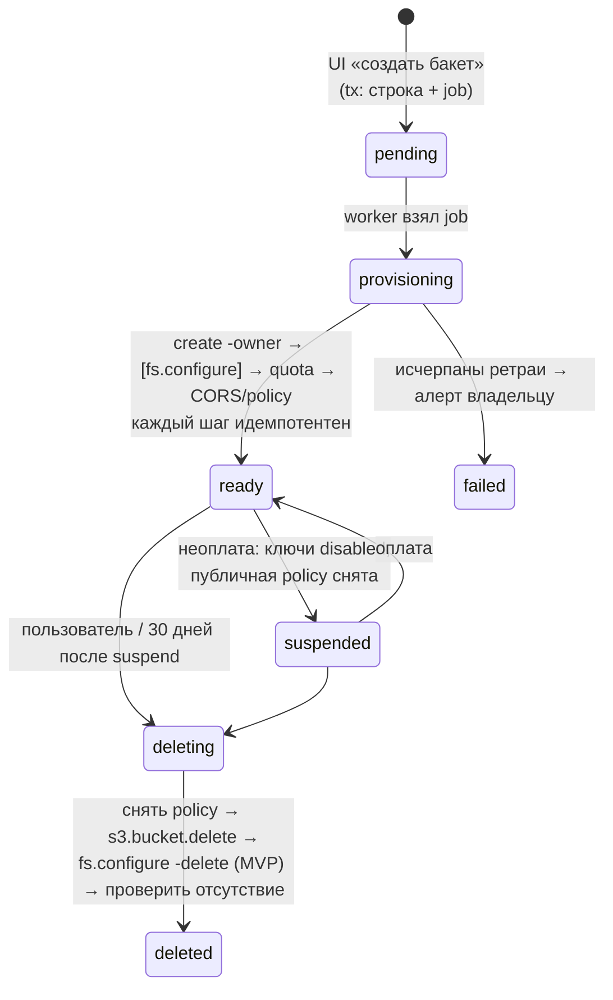
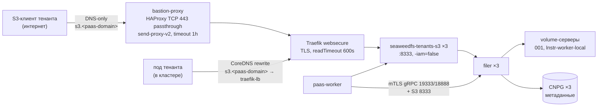

# 11. Услуга «Объектное хранилище S3» (SeaweedFS)

> Раздел дизайн-документа PaaS. Связанные: [02](02-tenancy-and-isolation.md), [03](03-security-model.md), [04](04-control-plane-go.md), [05](05-data-model.md), [08](08-svc-ingress-domains-ip.md), [09](09-svc-databases.md), [10](10-svc-registry-harbor.md), [12](12-svc-secrets.md), [13](13-billing-and-quotas.md), [15](15-observability-and-operations.md), [16](16-legal-ru.md), [17](17-roadmap.md).

> **TL;DR.**
> 1. **Что продаём.** Приватные бакеты `t-<project_id>-<suffix>`; ключи доступа с узкой областью (RW или RO, весь проект или один бакет); квоту на бакет; presigned GET/PUT; CORS. Публичные бакеты и статические сайты — Ф2, только с отдельного usercontent-домена. **Не продаём:** presigned POST (SeaweedFS проверяет его только по legacy `actions`), Object Lock (тенант держал бы диск в заложниках), bucket policy и ACL под управлением тенанта, бэкапы и «девятки».
> 2. **Где.** Общий SeaweedFS — только закрытая бесплатная бета (≤ 20 бакетов). Платный S3 работает лишь на отдельном `seaweedfs-tenants`. На общем инстансе восемь проверенных механизмов отказа, в том числе: spin filer'а на `s3.leader`; общий пул слотов, где **7 активных бакетов съедают весь запас прода**; право записи в IAM, равное правам админа хранилища; ansible-sync, который удаляет всё, чего нет в inventory.
> 3. **P0 до первого тенантского объекта:** regex-исключение `^t-[a-z0-9]{10}(-|$)` в четырёх delete-фильтрах `seaweedfs-sync`. Иначе ближайший `--tags bucket-sync` необратимо удалит тенантские бакеты с данными.
> 4. **Модель identity.** Якорь `t-<pid>` без ключей владеет всеми бакетами проекта. Каждый ключ — отдельная identity с managed policy на `arn:aws:s3:::t-<pid>-*`. Legacy `actions` отвергнуты: грубый `Write` открывает `PutObjectLockConfiguration`.
> 5. **Управление из `paas-worker`.** Identity — через типизированный IAM-gRPC filer'а (`iam_pb`). Бакеты — через `weed shell` той же версии, что кластер. CORS и публичность — через S3 API от `paas-s3-ops` с доступом только к `t-*`. На публичных gateway `-iam=false`, на тенантском инстансе mTLS+JWT.
> 6. **Квота.** Пользователь сам распределяет лимит тарифа по бакетам. Энфорсит встроенный механизм gateway раз в минуту, внешний контроль только наблюдает.
> 7. **Совместимость.** ✅ aws-cli, boto3, rclone, GitLab, Loki, distribution. ⚠️ Всё, что вызывает HeadBucket (restic, minio-go, barman, s3a), и SDK, которые пишут `aws-chunked`. ❌ Presigned POST, attributes/tagging/ACL. Гейт продажи и каждого апгрейда — ceph s3-tests + mint + собственный набор `C-SEC-01..12`.
> 8. **SLA.** 99.5 % доступности. Сохранность без «девяток»: две копии, один ДЦ, без бэкапа. EC выключен: с 4.45 это односторонняя дверь.

---

## 1. Что продаём (и чего НЕ продаём)

**Решение:** продаём **приватные бакеты + ключи доступа с узкой областью + квоту на бакет** через S3-совместимый API SeaweedFS. Всё управление (создать бакет, выдать ключ, CORS, сделать бакет публичным) — только через UI → `paas-api` → очередь → `paas-worker`. Пользователь получает endpoint и пару ключей, дальше работает своими S3-клиентами.

| Возможность | MVP (закрытая бета, общий инстанс) | GA (`seaweedfs-tenants`) | Механизм |
|---|---|---|---|
| Приватный бакет `t-<project_id>-<suffix>` | ✅ | ✅ | `weed shell s3.bucket.create -owner=t-<pid>` (§4) |
| Ключ доступа: RW или RO; на все бакеты проекта или на один | ✅ | ✅ | identity на ключ + managed policy (§3) |
| Квота на бакет (делится из S3-лимита тарифа) | ✅ | ✅ | `s3.bucket.quota` + встроенный энфорсмент gateway раз в минуту (§6) |
| Presigned URL (GET/PUT) | ✅ | ✅ | клиент подписывает сам своим ключом; query-signed запросы идут через policy-путь и работают |
| CORS на бакет (allowlist origin'ов) | ✅ | ✅ | `PutBucketCors` от платформенной identity (§7) |
| Использование (объём, объекты, трафик) в UI | ✅ | ✅ | метрики `SeaweedFS_s3_bucket_*` (§6.2) |
| «Сохранить ключ как секрет проекта» | ✅ | ✅ | запись в Vault → ExternalSecret в приложение, см. [12](12-svc-secrets.md) |
| Публичный бакет (анонимный GET) | ❌ | Ф2 | bucket policy `Principal: *` (⚠️ conformance, §7) |
| Статический сайт на своём домене | ❌ | Ф2 | Traefik-маршрут + `index.html`-переписывание; своего website-хостинга у SeaweedFS нет (§7) |
| Versioning / lifecycle (expiration) | ❌ | Ф2 | тумблеры в UI; lifecycle — фоновая job `s3_lifecycle` воркера (⚠️ проверить) |

**Endpoint.** `https://s3.<apps-domain>`, path-style — основной режим (одно имя, один сертификат). Virtual-hosted (`<bucket>.s3.<apps-domain>`) — дополнительно: у `weed s3` есть флаг `-domainName` (есть в исходниках 4.45), плюс wildcard-сертификат `*.s3.<apps-domain>` по DNS-01. Регион в документации — `us-east-1`: это самое совместимое значение для клиентов, у которых регион зашит в код (⚠️ прогнать в conformance).

**Чего НЕ продаём, и почему** (эта таблица целиком идёт в оферту как «известные ограничения»):

| Не продаём | Почему |
|---|---|
| Presigned **POST** (загрузка из HTML-формы) | SeaweedFS проверяет POST только по legacy `actions` identity, managed policy не учитывает. Владелец это проверил по исходникам 4.39, и в исходниках 4.45 проверка та же (`auth_signature_v4.go:789`, `identity.CanDo(ACTION_WRITE, …)`). Для загрузки из браузера есть presigned **PUT**, он работает |
| Object Lock / retention / legal hold | Тенант в режиме compliance мог бы сделать объекты неудаляемыми. Единственное, что мешает `s3.bucket.delete`, — это как раз заблокированные объекты. Итог: удалить данные неплательщика нельзя, диск в заложниках |
| Bucket policy / ACL, которыми управляет сам тенант | Публичность и доступ настраиваются только через UI, иначе тенант сам откроет бакет наружу или выдаст доступ чужой identity |
| Tagging, `GetObjectAttributes`, ACL-операции | В SeaweedFS нестабильны: 500, 404 или AccessDenied вперемешку (факт владельца, §5.1) |
| SSE-C / SSE-KMS | Не проверено, в MVP не нужно. Шифрование at-rest — задача дисков |
| IAM API / STS для тенанта | Право записи в IAM у SeaweedFS равно правам администратора хранилища (§3.1), делегировать его нельзя |
| Репликация бакетов, notifications, inventory | В SeaweedFS не реализованы или не проверены |
| Бэкап и гео-резерв данных бакета | Гарантия одна: две копии на разных серверах в одном ДЦ (§9). В оферте прямо: «хранилище, не архив» |
| «Безлимит» | Хард-квота на бакет. Превысил квоту — бакет становится read-only, удалять можно (§6) |

**Ограничение, которое диктует модель SeaweedFS: число бакетов на проект.** Каждый S3-бакет — отдельная collection. При первой записи под неё создаются тома: `volumeGrowthCount × копии`, для `001` и vGC=2 это 4 слота. Каждый слот резервирует `volumeSizeLimitMB` диска. Пустой бакет не стоит ничего, томов у него нет. Бакет с одним байтом стоит 4 слота. Поэтому число бакетов ограничено тарифом: Starter — 2, старшие — до 10 (цифры задаёт [13](13-billing-and-quotas.md)). Расчёт ёмкости — в §2.3 и §9.

## 2. Где живут тенантские бакеты: MVP на существующем SeaweedFS → `seaweedfs-tenants` к GA

### 2.1 Почему не навсегда общий инстанс: blast radius и прошлые инциденты

**Вывод:** общий инстанс для тенантов допустим только как **закрытая бета без денег**. Платный S3 работает только на отдельном `seaweedfs-tenants`. Все пункты ниже — проверенные факты этого кластера или исходников 4.45, не теория.

| # | Механизм отказа | Что было или что проверено | Последствие на общем инстансе |
|---|---|---|---|
| 1 | **Spin filer'а, держащего `s3.leader`** | 2026-06-28: после сбоя LINSTOR и отказа CoreDNS `seaweedfs-filer-1` завис в gRPC-reconnect и съел ~1.4 ядра, master — ~1.9 ядра. Лечится только удалением пода. `s3.leader` — синглтон: flush meta-log, раздача IAM трём S3-подам, репликация lock'ов | Нагрузка тенантов (массовые LIST, лавина мелких файлов, частые изменения IAM) бьёт по тому же синглтону, на котором сидят GitLab registry/artifacts, Loki, бэкапы CNPG и Vault |
| 2 | **Усилители каскада** | httpGet-пробы filer'а на `/` (полный листинг корня); `filemeta.name` без `COLLATE "C"`, поэтому большие LIST сортируются без индекса; пул `75 × 3 filer = 225` при `max_connections=100` в Postgres | Тенант с миллионом объектов в одном префиксе нагружает сортировками тот же Postgres, где лежат метаданные системных бакетов |
| 3 | **Слоты томов — общий пул** | На проде было свободно 6 слотов из 141, после правки vGC/threshold — около 28. При `volumeSizeLimitMB: 1000` один активный бакет `001` занимает 4 слота, то есть 4 GB резерва | **Семь** активных тенантских бакетов выбирают весь запас. После этого у Loki и GitLab не создаются новые тома, их запись падает |
| 4 | **Апгрейды** | 4.42 и 4.43 деградированы. Начиная с 4.45 EC — односторонняя дверь: откат образа портит EC-тома | Системный S3 становится заложником матрицы совместимости тенантов, и наоборот. Окна обслуживания общие |
| 5 | **Право записи в IAM = админ хранилища** | Исходники 4.45: запись в IAM разрешена `isAdmin()` или `iam:<Action>` только на ресурс `arn:aws:iam:::*` (`s3api_embedded_iam.go:2496-2499`), ограничить по ресурсу нельзя | Взлом `paas-worker` даёт чтение и удаление `gitlab-registry`, `loki-logs`, бэкапов. Эта граница не зависит от канала: IAM API, gRPC, `weed shell` |
| 6 | **Ansible-sync удаляет всё, чего нет в inventory** | `seaweedfs_buckets_to_delete`, `…_to_delete_fs`, `seaweedfs_identities_to_delete`, `seaweedfs_policies_to_delete` — чистые diff'ы «filer минус target». Фаза A делает `s3.bucket.delete`, то есть `CollectionDelete` вместе с данными | Первый же `seaweedfs-install.yaml --tags bucket-sync` после появления тенантов **удалит все тенантские бакеты с данными**, их identity и policy. Это P0 (§4.4) |
| 7 | **Метаданные — один Postgres** | Filer store `postgres2` в sidecar-чарте, 1 реплика | Рост метаданных тенантов и их потеря бьют по системным бакетам. Потерять метаданные filer'а — значит потерять все объекты, даже если тома целы |
| 8 | **Master × 1** | SPOF: без master'а нет Assign на запись и lookup томов после истечения кэша | Одна точка отказа на всех |

Отказаться от SeaweedFS в пользу MinIO/Ceph RGW нельзя и не нужно: MinIO — AGPL и курс на закрытие community-редакции, Ceph для соло-оператора эксплуатационно тяжелее SeaweedFS. Отдельный инстанс уже знакомого софта — дешёвый способ убрать все восемь пунктов из общего blast radius.

### 2.2 MVP: общий инстанс с жёсткой изоляцией

**Рамки беты:** не больше 20 тенантских бакетов на весь кластер, не больше 2 на проект, квота бакета не больше 5 GB. S3 бесплатен и помечен «beta». Это совпадает с [17-roadmap](17-roadmap.md): S3 попадает в MVP только при зелёной матрице §5.

**Предусловия. Все — P0, до первого тенантского бакета:**

| # | Предусловие | Где меняется | Закрывает риск |
|---|---|---|---|
| 1 | **Исключить PaaS-имена из ansible-sync** (подробно в §4.4) | `filter_plugins/seaweedfs_{bucket,user,policy}.py` + новая переменная `seaweedfs_sync_foreign_name_regex` в `hosts-vars/seaweedfs-sync.yaml` | #6: иначе bucket-sync удалит тенантские данные |
| 2 | **Бюджет слотов**: увеличить PVC volume-серверов так, чтобы после 20 бакетов × 4 слота × 1 GB осталось ≥ 8 свободных слотов на ноду | override `seaweedfs.yaml` (размер VCT volume-групп) + `volume-resize-hook`. Сначала сверить свободное место в thin-пуле LINSTOR | #3 |
| 3 | **Отдельный hostname тенантского API без Cloudflare**: `s3.<apps-domain>` (DNS-only) на тот же `seaweedfs-s3` | `post`-чарт seaweedfs: второй Ingress через `extraObjects` (сейчас одна переменная = один домен) | Cloudflare ломает SigV4 у rclone (`sign_accept_encoding`) и режет тело запроса (⚠️ лимит плана CF, §7) |
| 4 | **Audit-лог S3-gateway** (`-auditLogConfig`, флаг есть в 4.45) → Vector (source `fluent`) → Loki. Алерт: платформенная identity трогает бакет не с префиксом `t-` | `seaweedfs_helm_values_s3_extra_args` + конфиг-файл аудита (⚠️ формат проверить) | #5 — детектирует, но не предотвращает |
| 5 | **Глобальный circuit breaker**: `s3.circuitBreaker -global -type count -actions Read,Write -values 500,200 -apply` плюс per-bucket лимиты на `t-*` | `paas-worker` при создании бакета (per-bucket); global — ansible | #1, #2: шумный сосед |
| 6 | **Репликация `001` на каждый тенантский бакет** (на системном инстансе `defaultReplication: "000"`) + сверка после записи + периодический reconcile | `paas-worker`: `fs.configure … -apply`, затем чтение `fs.configure` | Иначе бакет, созданный вне inventory, получает одну копию |
| 7 | filer/master UI не опубликованы (на проде уже так), admin UI за VPN | override `seaweedfs.yaml` | HTTP API filer'а на 8888 без JWT — полный доступ к ФС |

Принятый в бете риск: `paas-worker` — администратор всего системного S3 (#5). Компенсация — аудит (#4), срок (только бета) и переезд на `seaweedfs-tenants` до первого платного S3-клиента.

### 2.3 GA: второй инстанс `seaweedfs-tenants` — что параметризовать в ansible-компоненте

**Решение:** тот же ansible-компонент `seaweedfs` (upstream-чарт + локальные `pre`/`postgresql`/`post` + tasks), ставится **вторым релизом** через тонкий playbook-обёртку, которая перепривязывает переменные. Отвергнуты два варианта. Копия компонента (`charts/seaweedfs-tenants`, вторые filter-plugins): два расходящихся экземпляра ~2 тыс. строк, каждый апгрейд дважды. Список `seaweedfs_instances` с циклом: инвазивный рефакторинг боевого компонента ради двух инстансов.

**Что придётся параметризовать** (найдено grep'ом по репо; сейчас захардкожено):

| Место | Сейчас | Станет |
|---|---|---|
| `playbook-app/seaweedfs-install.yaml` — `dto_release_name` | `seaweedfs-pre`, `seaweedfs-postgresql`, `seaweedfs`, `seaweedfs-post` | `{{ seaweedfs_release_name }}-pre` и т.д., дефолт `seaweedfs_release_name: seaweedfs` |
| `tasks/seaweedfs/tasks-seaweedfs-weed-shell.yaml` | `deploy/seaweedfs-s3`, `-master=seaweedfs-master:9333`, `-filer=seaweedfs-filer:8888` | из `seaweedfs_release_name` (имена сервисов upstream-чарта = `fullname`, т.е. имя релиза) |
| Vault-пути bootstrap / admin-UI / postgres | `/seaweedfs/...` | `{{ seaweedfs_vault_path_prefix }}/...` |
| ClusterRole/Binding upstream-чарта | `{{ fullname }}-rw-cr` / `-rw-crb` (сверено по `sources/seaweedfs/k8s/charts/seaweedfs/templates/shared/cluster-role.yaml`) | уникальны автоматически, если имя релиза другое. COSI-шаблоны выключены (`cosi.enabled: false`) |
| NetworkPolicy в `pre` | через `.Values.namespace` | менять не нужно |
| Гейт cross-ns NP у потребителей (`seaweedfs_enabled`) | gitlab / loki / filestash | для `seaweedfs-tenants` не нужен: системные компоненты его не потребляют |

**Обёртка** `playbook-app/seaweedfs-tenants-install.yaml`:

```yaml
# Второй инстанс SeaweedFS для тенантов. Все seaweedfs_* перепривязаны на seaweedfs_tenants_*
# (hosts-vars/seaweedfs-tenants.yaml держит ПОЛНУЮ структуру — как база системного инстанса).
- import_playbook: seaweedfs-install.yaml
  vars:
    seaweedfs_release_name: "seaweedfs-tenants"
    seaweedfs_namespace: "{{ seaweedfs_tenants_namespace }}"
    seaweedfs_vault_path_prefix: "/seaweedfs-tenants"
    seaweedfs_helm_values: "{{ seaweedfs_tenants_helm_values }}"
    seaweedfs_s3_domain: "{{ seaweedfs_tenants_s3_domain }}"
    # ... полный список потребляемых seaweedfs_* (контракт, см. тест ниже)
    # Tenant-инстанс: ansible ведёт только платформенные identity (break-glass s3-admin).
    seaweedfs_identities: "{{ seaweedfs_tenants_identities }}"
    seaweedfs_managed_policies: []
    seaweedfs_sync_buckets: []
```

Два предохранителя:
1. Первая задача обёртки — inline `assert`: `seaweedfs_release_name != 'seaweedfs'` и `seaweedfs_namespace != 'seaweedfs'`. Недопривязанная переменная не должна тихо ударить по системному инстансу.
2. pytest в `make test`: разобрать YAML playbook'а, tasks и values, достать Jinja-переменные через `jinja2.meta.find_undeclared_variables`, проверить, что каждая `seaweedfs_*` есть в `vars:` обёртки. YAML-парс, не grep (урок владельца).

**Чем `seaweedfs-tenants` отличается от системного по значениям:**

| Параметр | `seaweedfs` (системный, прод) | `seaweedfs-tenants` | Почему |
|---|---|---|---|
| master | 1 | **3** (raft) | SPOF (#8) |
| filer store | `postgres2` в sidecar-чарте × 1 | `postgres2` на **CNPG Cluster × 3** (sync-реплика), бэкап barman → **системный** SeaweedFS + offsite | потеря метаданных = потеря всех объектов (#7); инстансы бэкапят друг друга |
| `filemeta.name` | без collation | `COLLATE "C"` в `createTable`-шаблоне | индексные LIST'ы (#2) |
| пул PG | `75 × 3 = 225` > 100 | `MAX_OPEN × filers ≤ 0.8 × max_connections`, например `40 × 3 = 120` при 200 | #2 |
| пробы filer'а | `httpGet /` | `tcpSocket` | #2 |
| `defaultReplication` | `000` | **`001`** | любая запись — две копии без `fs.configure`; меньше писателей в `filer.conf` (§4.1) |
| `master.volume_growth` | в override `copy_2=2`, `threshold=1.0` | `copy_2=2`, `threshold=1.0` (один rack!) | пул = ровно vGC → 4 слота на бакет |
| `volumeSizeLimitMB` | 1000 | **256** (⚠️ нагрузочный тест) | резерв активного бакета 1 GB вместо 4 GB |
| `minFreeSpacePercent` | 1 | **10** | за этим порогом все тома ноды разом уходят в read-only |
| worker `jobType` | `all` (детектор EC включён) | `default` + в admin-конфиге `erasure_coding: enabled=false` | EC — односторонняя дверь (§9) |
| S3 `-iam` | по умолчанию `true` (read-only) | **`-iam=false`** | у публичного gateway нет IAM-поверхности вовсе |
| `-autoCreateBucket` | `false` | `false` | бакет появляется только через `paas-worker` |
| `-domainName` | — | `s3.<apps-domain>` | virtual-hosted стиль |
| `-auditLogConfig` | — | включён | аудит доступа (§11) |
| `global.seaweedfs.enableSecurity` (mTLS + JWT) | `false` | **`true`** (⚠️ стенд: влияние на probes/metrics) | без `jwt.filer_signing.key` IAM-gRPC filer'а принимает **неаутентифицированные** вызовы (исходник `command_s3_iam_client.go`) |
| filer/master UI | выключены | выключены | |
| admin UI | публичный с логином | только VPN | |
| ноды | системные воркеры | **системный пул, НЕ tenant-пул** | побег из tenant-пода рядом с volume-сервером = доступ ко всем бакетам |
| SC volume-PVC | `lnstr-worker-local` | `lnstr-worker-local` (autoPlace 1) | избыточность даёт SeaweedFS `001`, двойной репликации нет |

**Ёмкость.** Резерв слотов = `активные_бакеты × 4 × volumeSizeLimitMB`. При 256 MB 500 активных бакетов резервируют ~0.5 TB сырого места под пустые пулы, данные сверх этого — ×2. Слоты «виртуальные»: `maxVolumes: 0` считает их от свободного места. Рычаг на будущее — явный `maxVolumes` с оверкоммитом (как thin-пул), но только вместе с алертами на реальную заполненность диска (§11). Для GA — отдельные диски под volume-PVC, чтобы тенантский S3 не делил пул LINSTOR с managed-БД.

## 3. Модель идентичностей SeaweedFS и схема для тенантов

### 3.1 Факты модели 4.34+ / 4.38+ (проверено владельцем)

Источники: память владельца (проверено на проде и по исходникам 4.34–4.41) и вендоренные исходники `sources/seaweedfs` (`git describe` = `4.45-92-ge6f2386a0`, то есть master **чуть новее** прод-4.45). Ключевые факты из таблицы — авторизация IAM, `CanDo` у POST, resolver тонких действий, флаги `-iam`, HeadBucket, энфорсер квот, `tags` у identity — дополнительно сверены по **точному тегу `4.45`** (`git show 4.45:<файл>`), то есть совпадают с продом.

| Факт | Что это значит для тенантов |
|---|---|
| **Владелец бакета = `identity.Name`** (`isBucketOwnedByIdentity`); `s3.bucket.create -owner=X` пишет имя в `Extended[AmzIdentityId]`. После переименования identity метка владельца осиротеет | Владелец должен быть **стабильной** identity, которую никогда не удаляют и не переименовывают, пока жив бакет |
| **Владелец объекта = `account_id`** записавшей identity (`Extended[ExtAmzOwnerKey]`), переживает удаление identity | На доступ не влияет: ACL у нас не используются |
| **Доступ к данным = managed policy** (`policy_names`), не владение | Права задаёт policy, владение — только для листинга |
| `hasAttachedPolicies` в `authorizationRoute` важнее `len(Actions) > 0` | Одна identity = одна модель. Смешать `policy_names` и `actions` нельзя |
| **ListBuckets**: с 4.38 identity с policy видит только **свои** бакеты; с 4.41 (#10458) — плюс бакеты из конкретных ARN `s3:ListBucket` в её policy. Wildcard-ARN даёт полный скан `/buckets` с тем же видимым набором, но дороже | Ключ с policy `arn:aws:s3:::t-<pid>-*` видит бакеты своего проекта (⚠️ нагрузка при тысячах бакетов, §5.3) |
| **Presigned POST** проверяется только по legacy `actions` (`identity.CanDo`), managed policy игнорируется. В исходниках 4.45+ та же строка `auth_signature_v4.go:789`; новое — только дополнительный Deny по bucket policy | Presigned POST не продаём (§1) |
| **Запись в IAM**: `isAdmin()` или `iam:<Action>` на `arn:aws:iam:::*` (`s3api_embedded_iam.go:2496-2499`) | Ограничить IAM-права по ресурсу нельзя, IAM-писатель = админ хранилища |
| Встроенный IAM HTTP API: `-iam=true` по умолчанию, `-iam.readOnly=true` по умолчанию (`weed/command/s3.go:124-125`) | На публичных gateway тенантского инстанса ставим `-iam=false` |
| **IAM-gRPC filer'а** (`iam_pb.SeaweedIdentityAccessManagement`: `CreateUser`, `UpdateUser`, `DeleteUser`, `CreateAccessKey`, `DeleteAccessKey`, `PutPolicy`, `DeletePolicy`, …) — через него работают и granular-команды `weed shell s3.user.*`. Без `jwt.filer_signing.key` принимает **неаутентифицированные** вызовы (`command_s3_iam_client.go`) | Типизированный канал для `paas-worker` (§4.1). На тенантском инстансе обязателен `enableSecurity` |
| `Identity` в `iam.proto` — поля `name`, `credentials`, `actions`, `account`, `disabled`, `policy_names` | Один `CreateUser` атомарно создаёт identity с ключом и policy. `disabled=true` приостанавливает её без удаления |
| 4.45: S3-auth **fail-closed** (не загрузился IAM — отказ, раньше было «открыто анонимам»); `s3.configure -delete` и `s3.policy -delete` теперь возвращают ошибку | Безопаснее, но sync-процессы могут начать падать, их надо уметь повторять |
| Анонимный доступ: `AuthWithPublicRead` проверяет ACL public-read, затем **bucket policy с `Principal: *`** через policy engine (`s3api_bucket_handlers.go:905+`); ещё есть `s3.anonymous.set` (legacy `actions` у общей identity `anonymous`) | Публичность — через bucket policy на бакете, не через общую identity `anonymous` (§3.3) |

### 3.2 Выбранная схема: identity на ключ + managed policy на проект

**Решение.** В каждом проекте три вида объектов SeaweedFS:

1. **Якорная identity проекта `t-<pid>`**. Без ключей, `actions: []`, без policy, `disabled: true` (⚠️ проверить, что disabled-якорь не мешает листингу ключей). Единственная роль — **владелец всех бакетов проекта**. Живёт, пока жив проект, и никогда не переименовывается. Так закрыт факт «владелец = имя»: ключи приходят и уходят, а владелец бакета не осиротеет.
2. **Identity на каждый ключ доступа `t-<pid>-k<kid>`** (`kid` — 8 символов `[a-z0-9]`). Ровно один credential, `actions: []`, `policy_names: ["t-<pid>-k<kid>"]`. `account` = `t-<pid>`, чтобы все объекты проекта принадлежали аккаунту проекта, а не конкретному ключу (⚠️ проверить, что SeaweedFS допускает общий `account.id` у нескольких identity; если нет — `account.id` = имя identity, как в ansible-конвенции владельца).
3. **Managed policy на каждый ключ `t-<pid>-k<kid>`**, рендерится из типизированной области ключа: `{mode: rw|ro, buckets: all|[...]}`.

**Имена бакетов.** `t-<pid>-<suffix>`, где `pid` — ровно 10 символов `[a-z0-9]` ([02](02-tenancy-and-isolation.md)), а `suffix` задаёт пользователь: `^[a-z0-9]([a-z0-9-]{1,48}[a-z0-9])$`, итого ≤ 63 символа. Фиксированная длина `pid` плюс обязательный дефис после него делают wildcard `arn:aws:s3:::t-<pid>-*` безопасным: чужой проект под него не попадёт, потому что другой `pid` отличается в первых 10 символах. Имя уникально глобально по построению, плюс `UNIQUE` в БД.

**Access key ID.** 20 символов `[A-Z0-9]`: префикс `PT` + 18 случайных base32. Secret — 40 символов `[A-Za-z0-9]` из `crypto/rand`. Генерирует **`paas-api` в момент запроса**, чтобы показать секрет один раз синхронно. В очередь секрет уходит только в шифротексте Vault Transit (как все секреты в job-аргументах, см. [12](12-svc-secrets.md)).

**Почему так, а не иначе:**

| Альтернатива | Почему отвергнута |
|---|---|
| Одна identity на проект, несколько ключей | У ключей разные области (RO/RW, отдельные бакеты), а policy вешается на identity. Отозвать ключ = удалить credential; отдельной приостановки ключа нет |
| Legacy `actions` (`Read:<b>`, `Write:<b>`, `List:<b>`) | Единственный плюс — работал бы presigned POST. Но грубый `Write` на бакет открывает маршруты конфигурации бакета, которые в роутере SeaweedFS проверяются тем же `ACTION_WRITE`: `PutBucketCors`, `PutBucketLifecycle`, `PutBucketVersioning`, **`PutObjectLockConfiguration`** (`s3api_server.go:912-951`). Это прямой путь к Object Lock и заложникам (§1). Плюс ни явного Deny, ни тонких действий |
| Владелец бакета = identity ключа | Удалили ключ — осиротела метка владельца, а владелец неизменяем |
| Bucket policy с principal на identity | Второй механизм рядом с managed policy, объекты на каждом бакете, сложнее аудит. Bucket policy используем только для публичного чтения (§7) |
| Общая identity `anonymous` для публичных бакетов (`s3.anonymous.set`) | Один общий объект, который read-modify-write'ят все воркеры, и его же может вести ansible user-sync. Bucket policy живёт на самом бакете и удаляется вместе с ним |

### 3.3 Конкретный JSON: identity, policy, публичный бакет

Пример проекта `k3j9x0a1bz`: бакет `t-k3j9x0a1bz-media`, ключ `kq7m2p4x`.

**Якорь проекта** (форма `iam_pb.Identity`, в filer — `/etc/iam/identities/t-k3j9x0a1bz.json`):

```json
{
  "name": "t-k3j9x0a1bz",
  "credentials": [],
  "actions": [],
  "account": { "id": "t-k3j9x0a1bz", "displayName": "project k3j9x0a1bz" },
  "disabled": true,
  "policyNames": [],
  "tags": [
    { "key": "paas.1520.tech/managed-by", "value": "paas" },
    { "key": "paas.1520.tech/tenant-ns",  "value": "t-k3j9x0a1bz" }
  ]
}
```

**Identity ключа** (секрет виден только в момент создания; в БД PaaS его нет, §4.3):

```json
{
  "name": "t-k3j9x0a1bz-kq7m2p4x",
  "credentials": [
    { "accessKey": "PT7Q2M4XK9ZB3W8N5R6D", "secretKey": "<40 символов>", "status": "Active" }
  ],
  "actions": [],
  "account": { "id": "t-k3j9x0a1bz" },
  "disabled": false,
  "policyNames": ["t-k3j9x0a1bz-kq7m2p4x"],
  "tags": [
    { "key": "paas.1520.tech/managed-by", "value": "paas" },
    { "key": "paas.1520.tech/tenant-ns",  "value": "t-k3j9x0a1bz" }
  ]
}
```

(`tags` есть в `iam.proto` тега 4.45: поле 9, `repeated UserTag tags`. Принадлежность дублируется ещё и именем.)

**Policy ключа «RW на все бакеты проекта»:**

```json
{
  "Version": "2012-10-17",
  "Statement": [
    {
      "Sid": "Bucket",
      "Effect": "Allow",
      "Action": ["s3:ListBucket", "s3:GetBucketLocation", "s3:ListBucketMultipartUploads"],
      "Resource": ["arn:aws:s3:::t-k3j9x0a1bz-*"]
    },
    {
      "Sid": "Objects",
      "Effect": "Allow",
      "Action": ["s3:GetObject", "s3:PutObject", "s3:DeleteObject",
                 "s3:AbortMultipartUpload", "s3:ListMultipartUploadParts"],
      "Resource": ["arn:aws:s3:::t-k3j9x0a1bz-*/*"]
    }
  ]
}
```

**Policy ключа «RO на один бакет»:**

```json
{
  "Version": "2012-10-17",
  "Statement": [
    { "Sid": "Bucket",  "Effect": "Allow", "Action": ["s3:ListBucket", "s3:GetBucketLocation"],
      "Resource": ["arn:aws:s3:::t-k3j9x0a1bz-media"] },
    { "Sid": "Objects", "Effect": "Allow", "Action": ["s3:GetObject"],
      "Resource": ["arn:aws:s3:::t-k3j9x0a1bz-media/*"] }
  ]
}
```

**Платформенная `paas-s3-ops`** (одна на инстанс; ведёт её ansible: имя начинается с `paas-`, но она из inventory, см. §4.4):

```json
{
  "Version": "2012-10-17",
  "Statement": [
    {
      "Sid": "TenantBucketConfig",
      "Effect": "Allow",
      "Action": ["s3:GetBucketCors", "s3:PutBucketCors", "s3:DeleteBucketCors",
                 "s3:GetBucketPolicy", "s3:PutBucketPolicy", "s3:DeleteBucketPolicy",
                 "s3:GetBucketVersioning", "s3:PutBucketVersioning",
                 "s3:ListBucket", "s3:ListBucketVersions", "s3:ListBucketMultipartUploads"],
      "Resource": ["arn:aws:s3:::t-*"]
    },
    {
      "Sid": "TenantPurge",
      "Effect": "Allow",
      "Action": ["s3:DeleteObject", "s3:DeleteObjectVersion", "s3:AbortMultipartUpload"],
      "Resource": ["arn:aws:s3:::t-*/*"]
    }
  ]
}
```

`t-*` безопасен при одном инварианте, и его навязывает ansible-валидация (§4.4): **ни один системный бакет не называется на `t-`**.

**Bucket policy публичного бакета (Ф2):** только анонимный `GetObject`, без листинга:

```json
{
  "Version": "2012-10-17",
  "Statement": [
    { "Sid": "PublicRead", "Effect": "Allow", "Principal": "*",
      "Action": ["s3:GetObject"], "Resource": ["arn:aws:s3:::t-k3j9x0a1bz-site/*"] }
  ]
}
```

**Почему запрещённые действия действительно запрещены.** В исходниках 4.45+ `s3_action_resolver.go` переводит маршрут в тонкое действие: `PUT ?cors` → `s3:PutBucketCors`, `?versioning` → `s3:PutBucketVersioning`, `?object-lock` → `s3:PutBucketObjectLockConfiguration`. Policy-путь сверяет именно их, поэтому ключ с `s3:PutObject` не может включить Object Lock. Это критичное свойство проверяется в рантайме тестами `C-SEC-*` (§5.3). Генератор policy — Go-код с allow-list действий; golden-тест проверяет каждую отрисовку против списка запрещённых.

## 4. Как backend управляет бакетами, identity и ключами

### 4.1 Канал управления: IAM-API vs `weed shell` — решение

**Решение: три плоскости управления, у каждой свой канал.** Все каналы вызывает только `paas-worker`: у `paas-api` доступа к SeaweedFS нет, у `paas-provisioner` тоже, в S3 ему нечего делать.

| Плоскость | Операции | Канал | Почему именно он |
|---|---|---|---|
| **Identity** | создать/удалить identity ключа, policy, приостановить (`disabled`, `Credential.status=Inactive`) | **IAM-gRPC filer'а** (`iam_pb`): Go-клиент, сгенерированный из вендоренного `weed/pb/iam.proto` (Apache-2.0, копия в `internal/s3tenant/iampb/`) | Типизирован; `CreateUser` атомарно создаёт identity, ключ и policy_names; тот же путь, что у `weed shell s3.user.*`, и те же live-обновления gateway через filer. Identity и policy лежат в filer отдельными файлами (`/etc/iam/identities/<n>.json`, `/etc/iam/policies/<n>.json`), общего read-modify-write нет |
| **Bucket** | `s3.bucket.create -owner`, `s3.bucket.quota`, `s3.bucket.delete`, `s3.circuitBreaker`, `fs.configure` (только в MVP) | **`weed shell`**: бинарь той же версии, что кластер, в образе `paas-worker` (multi-stage `COPY --from=chrislusf/seaweedfs:<ver>`), ходит по gRPC в master/filer | Семантика владельца (`Extended[AmzIdentityId]`, collection = имя бакета) живёт в коде shell-команд **той же версии**, а она уже менялась (4.34). Операции редкие. `lock` для `s3.*`/`fs.*` не нужен |
| **Config** | `PutBucketCors`, `Put/DeleteBucketPolicy` (публичность), `PutBucketVersioning` (Ф2), `DeleteObjects` при очистке | **S3 API** (`aws-sdk-go-v2/service/s3`) от платформенной identity `paas-s3-ops` через внутренний Service | Стандартный контракт. У `paas-s3-ops` **не** `Admin`, а managed policy на `arn:aws:s3:::t-*` — так даже на общем инстансе через эту плоскость системные бакеты недоступны |

**Отвергнуто:**
- **Встроенный IAM HTTP API** (`-iam.readOnly=false`): пишущий IAM висит на S3-порту, то есть торчит в интернет, если не поднимать отдельный gateway; нужна SigV4-подпись админом. Ничего не даёт сверх gRPC, которым пользуется сам shell.
- **`weed shell s3.configure`** (путь ansible): секреты в аргументах команды; чтение состояния = дамп **всех** identity с секретами (при тысячах тенантов тяжело и опасно для логов); разбор текста.
- **`kubectl exec` в поды seaweedfs**: `paas-worker` получил бы `pods/exec` — k8s-привилегию, которой по [03](03-security-model.md) у него быть не должно.
- **Прямой `filer_pb` для бакетов**: пришлось бы переписать семантику shell-команд и следить за её дрейфом между версиями.
- **COSI** (в чарте `cosi.enabled: false`, драйвер `v0.1.2`, API COSI в k8s — alpha): cluster-scoped CRD и контроллер, жизненный цикл хранилища уехал бы в tenant-git. Alpha — не для платной услуги. Вернуться, когда API станет beta+.
- **ansible `seaweedfs-sync`**: статичный inventory и прогон на каждое изменение — запрещено D1 (§4.4).

**Гонка на `filer.conf`.** Это один файл, и его read-modify-write'ят сразу несколько писателей: `fs.configure` воркера, **энфорсер квот в gateway** (раз в минуту при переключении read-only — `enforceBucketQuotas` → `SaveInsideFiler`) и ansible bucket-sync. Потерянное обновление реально. Меры:
1. На `seaweedfs-tenants` `defaultReplication: "001"` и per-bucket `fs.configure` не пишем вообще. Остаётся один писатель — энфорсер, который сам себя чинит каждую минуту.
2. В MVP все операции bucket-плоскости идут в River-очередь `s3_bucket_plane` с `MaxWorkers: 1` — свои писатели сериализованы.
3. После каждого `fs.configure` читаем его обратно и сверяем. Периодический reconcile раз в 10 минут проверяет `replication=001` у каждого `t-*` и алертит при расхождении.

**Защита канала.** На `seaweedfs-tenants` `enableSecurity: true`: gRPC по mTLS, IAM-gRPC требует JWT, подписанный `jwt.filer_signing.key`. `paas-worker` монтирует `security.toml` и клиентский сертификат из Secret, который ESO берёт из Vault (`paas-platform/seaweedfs-tenants/grpc-client`). NetworkPolicy: `paas-worker` → master `19333`, filer `18888`, внутренний s3 `8333`. Больше никто из `paas-system`. В MVP на системном инстансе security выключен, и любой под, которого пустила NP, — админ. Поэтому NP сужена до подов `paas-worker` (label `app.kubernetes.io/name=paas-worker`).

### 4.2 Go-код: `internal/s3tenant`

Пакет в модуле control plane ([04](04-control-plane-go.md)):

```
internal/s3tenant/
  names.go     // регэкспы и построители имён; guard «только t-*»
  policy.go    // Scope → policy JSON (golden-тесты, запрещённые действия)
  iam.go       // IdentityPlane: iam_pb gRPC
  shell.go     // ShellRunner + BucketPlane: weed shell
  config.go    // ConfigPlane: aws-sdk-go-v2/service/s3 (CORS, bucket policy)
  iampb/       // сгенерировано из вендоренного weed/pb/iam.proto (версия = версии кластера)
```

**Имена и guard** — единая точка, через которую проходит любая мутация:

```go
package s3tenant

var (
	projectIDRe    = regexp.MustCompile(`^[a-z0-9]{10}$`)
	bucketSuffixRe = regexp.MustCompile(`^[a-z0-9]([a-z0-9-]{1,48}[a-z0-9])$`)
	tenantBucketRe = regexp.MustCompile(`^t-[a-z0-9]{10}-[a-z0-9]([a-z0-9-]{1,48}[a-z0-9])$`)
	keyIDRe        = regexp.MustCompile(`^[a-z0-9]{8}$`)
	ErrForeignName = errors.New("s3tenant: name outside the PaaS namespace")
)

func AnchorIdentity(pid string) string    { return "t-" + pid }
func KeyIdentity(pid, kid string) string  { return "t-" + pid + "-k" + kid }

func BucketName(pid, suffix string) (string, error) {
	if !projectIDRe.MatchString(pid) || !bucketSuffixRe.MatchString(suffix) {
		return "", fmt.Errorf("invalid bucket name parts %q/%q", pid, suffix)
	}
	return "t-" + pid + "-" + suffix, nil
}

// mustTenantBucket — последняя линия в коде: даже баг в state machine не удалит системный бакет.
func mustTenantBucket(name string) error {
	if !tenantBucketRe.MatchString(name) {
		return fmt.Errorf("%w: %q", ErrForeignName, name)
	}
	return nil
}
```

**Policy — типами, без шаблонов:**

```go
type Mode string

const (
	ModeRW Mode = "rw"
	ModeRO Mode = "ro"
)

type Scope struct {
	ProjectID string
	Mode      Mode
	Buckets   []string // пусто = все бакеты проекта (wildcard t-<pid>-*)
}

type statement struct {
	Sid      string   `json:"Sid"`
	Effect   string   `json:"Effect"`
	Action   []string `json:"Action"`
	Resource []string `json:"Resource"`
}

type policyDoc struct {
	Version   string      `json:"Version"`
	Statement []statement `json:"Statement"`
}

var (
	bucketRO = []string{"s3:ListBucket", "s3:GetBucketLocation"}
	bucketRW = []string{"s3:ListBucket", "s3:GetBucketLocation", "s3:ListBucketMultipartUploads"}
	objectRO = []string{"s3:GetObject"}
	objectRW = []string{"s3:GetObject", "s3:PutObject", "s3:DeleteObject",
		"s3:AbortMultipartUpload", "s3:ListMultipartUploadParts"}

	// Никогда не должны появиться в tenant-policy. Проверяется тестом по всем комбинациям Scope.
	Forbidden = []string{"s3:*", "s3:CreateBucket", "s3:DeleteBucket",
		"s3:PutBucketPolicy", "s3:DeleteBucketPolicy", "s3:PutBucketAcl", "s3:PutObjectAcl",
		"s3:PutBucketCors", "s3:PutBucketVersioning", "s3:PutLifecycleConfiguration",
		"s3:PutBucketObjectLockConfiguration", "s3:PutObjectRetention",
		"s3:PutObjectLegalHold", "s3:BypassGovernanceRetention"}
)

func RenderPolicy(s Scope) ([]byte, error) {
	if !projectIDRe.MatchString(s.ProjectID) {
		return nil, fmt.Errorf("invalid project id %q", s.ProjectID)
	}
	var bucketARNs, objectARNs []string
	if len(s.Buckets) == 0 {
		p := "arn:aws:s3:::t-" + s.ProjectID + "-*"
		bucketARNs, objectARNs = []string{p}, []string{p + "/*"}
	}
	for _, b := range s.Buckets {
		if err := mustTenantBucket(b); err != nil || !strings.HasPrefix(b, "t-"+s.ProjectID+"-") {
			return nil, fmt.Errorf("%w: bucket %q is not in project %s", ErrForeignName, b, s.ProjectID)
		}
		bucketARNs = append(bucketARNs, "arn:aws:s3:::"+b)
		objectARNs = append(objectARNs, "arn:aws:s3:::"+b+"/*")
	}
	ba, oa := bucketRO, objectRO
	if s.Mode == ModeRW {
		ba, oa = bucketRW, objectRW
	}
	return json.Marshal(policyDoc{Version: "2012-10-17", Statement: []statement{
		{Sid: "Bucket", Effect: "Allow", Action: ba, Resource: bucketARNs},
		{Sid: "Objects", Effect: "Allow", Action: oa, Resource: objectARNs},
	}})
}
```

**Identity-плоскость (gRPC).** Идемпотентность — через чтение перед записью, а не через угадывание кода ошибки:

```go
type IdentityPlane struct {
	c    iampb.SeaweedIdentityAccessManagementClient
	auth func(context.Context) context.Context // добавляет Bearer JWT (jwt.filer_signing) на tenant-инстансе
}

type Key struct {
	ProjectID, KID, AccessKeyID, Secret string // Secret расшифрован из Transit только в памяти воркера
	Scope                               Scope
}

func (p *IdentityPlane) CreateKey(ctx context.Context, k Key) error {
	ctx = p.auth(ctx)
	name := KeyIdentity(k.ProjectID, k.KID)
	doc, err := RenderPolicy(k.Scope)
	if err != nil {
		return err
	}
	// 1. Сначала policy: identity не должна ссылаться на несуществующую policy.
	if _, err := p.c.PutPolicy(ctx, &iampb.PutPolicyRequest{Name: name, Content: string(doc)}); err != nil {
		return fmt.Errorf("put policy %s: %w", name, err)
	}
	// 2. Повтор после сбоя: identity уже есть → проверяем, что она «наша», и выходим.
	if got, err := p.c.GetUser(ctx, &iampb.GetUserRequest{Username: name}); err == nil && got.GetIdentity() != nil {
		return verifySameKey(got.GetIdentity(), k)
	}
	_, err = p.c.CreateUser(ctx, &iampb.CreateUserRequest{Identity: &iampb.Identity{
		Name:        name,
		Credentials: []*iampb.Credential{{AccessKey: k.AccessKeyID, SecretKey: k.Secret, Status: "Active"}},
		Account:     &iampb.Account{Id: AnchorIdentity(k.ProjectID)},
		PolicyNames: []string{name},
	}})
	return err
}

// Приостановка проекта (неоплата): все ключи → disabled; данные и конфигурация целы.
func (p *IdentityPlane) SetKeyDisabled(ctx context.Context, name string, disabled bool) error {
	ctx = p.auth(ctx)
	got, err := p.c.GetUser(ctx, &iampb.GetUserRequest{Username: name})
	if err != nil {
		return err
	}
	id := got.GetIdentity()
	id.Disabled = disabled
	_, err = p.c.UpdateUser(ctx, &iampb.UpdateUserRequest{Username: name, Identity: id})
	return err
}
```

(Имена полей — из `iam.proto` исходников 4.45+: `CreateUserRequest{identity}`, `UpdateUserRequest{username, identity}`, `PutPolicyRequest{name, content}`, `CreateAccessKeyRequest{username, credential}`. ⚠️ При каждом апгрейде SeaweedFS сверять `git diff` у `weed/pb/iam.proto`: protobuf у них аддитивный, но это надо проверять, а не предполагать.)

**Bucket-плоскость (`weed shell`).** `weed shell` **всегда выходит с кодом 0**, ошибку видно только по префиксу в stderr. Это урок ansible-обёртки `tasks-seaweedfs-weed-shell.yaml`, переносим его как есть:

```go
type ShellRunner struct {
	Bin, Master, Filer string // /usr/local/bin/weed; <release>-master.<ns>.svc:9333; <release>-filer.<ns>.svc:8888
	ConfigDir          string // каталог с security.toml (mTLS/JWT) — рабочая директория процесса
}

var shellErrRe = regexp.MustCompile(`(?m)^(error: |unknown command: )`)

func (r *ShellRunner) Run(ctx context.Context, cmds ...string) (string, error) {
	for _, c := range cmds { // аргументы уже провалидированы регэкспами, но разделители запрещаем явно
		if strings.ContainsAny(c, "\n\r;`$|&") {
			return "", fmt.Errorf("refusing unsafe weed shell command %q", c)
		}
	}
	ctx, cancel := context.WithTimeout(ctx, 60*time.Second)
	defer cancel()
	cmd := exec.CommandContext(ctx, r.Bin, "shell", "-master="+r.Master, "-filer="+r.Filer)
	cmd.Dir = r.ConfigDir
	cmd.Stdin = strings.NewReader(strings.Join(cmds, "\n") + "\n")
	var out, errb bytes.Buffer
	cmd.Stdout, cmd.Stderr = &out, &errb
	if err := cmd.Run(); err != nil {
		return "", fmt.Errorf("weed shell: %w: %s", err, errb.String())
	}
	if shellErrRe.Match(errb.Bytes()) {
		return "", fmt.Errorf("weed shell: %s", strings.TrimSpace(errb.String()))
	}
	return out.String(), nil
}

type BucketPlane struct {
	sh                   *ShellRunner
	PerBucketReplication bool   // true только в MVP на системном инстансе (defaultReplication=000)
	Rack, DC             string // workers-shared-1 / dc-1 — берутся из конфигурации, не из запроса
}

func (b *BucketPlane) Create(ctx context.Context, pid, name string, quotaMB int64) error {
	if err := mustTenantBucket(name); err != nil {
		return err
	}
	// s3.bucket.create на существующем бакете — UPSERT владельца (факт владельца: CreateEntry OExcl=false).
	// Поэтому сначала проверяем, что бакета нет или он уже наш; чужой → громкая ошибка, а не «кража».
	if owner, exists, err := b.ownerOf(ctx, name); err != nil {
		return err
	} else if exists && owner != AnchorIdentity(pid) {
		return fmt.Errorf("bucket %s exists with foreign owner %q", name, owner)
	}
	cmds := []string{fmt.Sprintf("s3.bucket.create -name=%s -owner=%s", name, AnchorIdentity(pid))}
	if b.PerBucketReplication {
		cmds = append(cmds, fmt.Sprintf(
			"fs.configure -locationPrefix=/buckets/%s -replication=001 -rack=%s -dataCenter=%s -volumeGrowthCount=2 -apply",
			name, b.Rack, b.DC))
	}
	cmds = append(cmds, fmt.Sprintf("s3.bucket.quota -name=%s -op=set -sizeMB=%d", name, quotaMB))
	_, err := b.sh.Run(ctx, cmds...)
	return err
}
```

Тесты пакета: golden-файлы policy для всех комбинаций `Scope`; тест «ни одна отрисовка не содержит `Forbidden`»; тест guard'а (`gitlab-registry`, `loki-logs`, `t-short-x` отвергаются); интеграционный тест против `weed server` в testcontainers той же версии. Тот же стенд прогоняет conformance §5.3.

### 4.3 Состояние в БД PaaS и state machine операций

Источник истины о том, **что должно существовать**, — БД PaaS ([05](05-data-model.md)). SeaweedFS — исполнитель. Секретов ключей в БД нет.

```sql
CREATE TYPE s3_state AS ENUM ('pending','provisioning','ready','suspended','deleting','deleted','failed');

CREATE TABLE s3_buckets (
  id           uuid PRIMARY KEY DEFAULT gen_random_uuid(),
  project_id   text NOT NULL REFERENCES projects(id),
  instance     text NOT NULL CHECK (instance IN ('seaweedfs','seaweedfs-tenants')),
  name         text NOT NULL UNIQUE
               CHECK (name ~ '^t-[a-z0-9]{10}-[a-z0-9]([a-z0-9-]{1,48}[a-z0-9])$'),
  quota_bytes  bigint NOT NULL CHECK (quota_bytes >= 104857600),      -- минимум 100 MiB
  public_read  boolean NOT NULL DEFAULT false,
  cors_rules   jsonb   NOT NULL DEFAULT '[]'::jsonb,
  state        s3_state NOT NULL DEFAULT 'pending',
  created_at   timestamptz NOT NULL DEFAULT now(),
  deleted_at   timestamptz,
  CHECK (starts_with(name, 't-' || project_id || '-'))
);

CREATE TABLE s3_access_keys (
  id            uuid PRIMARY KEY DEFAULT gen_random_uuid(),
  project_id    text NOT NULL REFERENCES projects(id),
  kid           text NOT NULL CHECK (kid ~ '^[a-z0-9]{8}$'),
  access_key_id text NOT NULL UNIQUE CHECK (access_key_id ~ '^PT[A-Z0-9]{18}$'),
  label         text NOT NULL,
  mode          text NOT NULL CHECK (mode IN ('rw','ro')),
  bucket_ids    uuid[],                          -- NULL = все бакеты проекта
  state         s3_state NOT NULL DEFAULT 'pending',
  last_used_at  timestamptz,                     -- из audit-лога (Ф2)
  created_at    timestamptz NOT NULL DEFAULT now(),
  UNIQUE (project_id, kid)
);
```

**Инвариант квоты проекта** (`Σ quota_bytes ≤ S3-лимит тарифа + аддоны`) проверяется в той же транзакции, что вставка или изменение бакета. Сериализация — `SELECT … FROM projects WHERE id=$1 FOR UPDATE`, после неё — enqueue River-job (транзакционный outbox, [04](04-control-plane-go.md)).



**Шаги и их идемпотентность:**

| Шаг | Повтор безопасен, потому что |
|---|---|
| `s3.bucket.create -owner` | upsert; перед ним проверка «нет или наш» (§4.2) |
| `fs.configure … -apply` (MVP) | перезаписывает локацию целиком; после записи — сверка |
| `s3.bucket.quota -op=set` | задаёт абсолютное значение |
| `PutPolicy` / `CreateUser` | policy перезаписывается; для identity — чтение перед созданием |
| `s3.bucket.delete` | отсутствие бакета = шаг выполнен |

**Ключ:** `pending → provisioning → ready (active)`. Секрет `paas-api` сгенерировал, показал пользователю и положил в job-аргументы шифротекстом Transit. Воркер расшифровывает → `PutPolicy` → `CreateUser` → при галке «сохранить как секрет проекта» пишет в `paas-tenants/data/t-<pid>/s3-<label>` ([12](12-svc-secrets.md)). Потом job-аргументы затираются (River `JobArgs` с шифротекстом удаляются вместе с завершённым job'ом по retention).

**Удаление проекта:** бакеты → identity ключей → их policy → **якорь последним**. Пока жив хоть один бакет, якорь удалять нельзя, иначе метка владельца осиротеет.

**Reconcile** (River periodic job, раз в 10 минут, только чтение, при расхождении — алерт, не авто-исправление): в SeaweedFS нет лишних `t-*` бакетов и identity, которых нет в БД (утечка); у каждого `ready`-бакета есть квота и в MVP `replication=001`; у каждого `ready`-ключа identity не `disabled`, а у `suspended` — `disabled`.

### 4.4 Сосуществование с `seaweedfs-sync` (ansible): кто чем владеет

**Почему `seaweedfs-sync` не годится для тенантов:** это статичный inventory плюс ansible-прогон на каждое изменение, а D1 запрещает per-tenant объекты в `hosts-vars*`. При тысячах identity `user-sync` на каждом прогоне читает дамп `s3.configure` со **всеми секретами** всех тенантов. Сохраняется не каждое изменение (фаза A distribute смотрит на state, а не на Vault). Для «кнопки в UI» это неприменимо в принципе.

**Почему они подерутся без изменений (P0).** Все delete-фильтры — чистый diff «живой filer минус inventory»:

| Фильтр | Что удалит | Команда |
|---|---|---|
| `seaweedfs_buckets_to_delete` | все `t-*` бакеты **с данными** | `s3.bucket.delete` → `CollectionDelete` |
| `seaweedfs_buckets_to_delete_fs` | `fs.configure`-локации `/buckets/t-*`: и репликацию, и **read-only флаги квот** | `fs.configure -delete` |
| `seaweedfs_identities_to_delete` | все `t-*` identity: ключи тенантов перестанут работать | `s3.configure -user -delete` |
| `seaweedfs_policies_to_delete` | все `t-*` policy | `s3.policy -delete` |

Фильтры, которые идут от target (`_to_create`, `_grant`, `_revoke`, `keys_to_*`, `quota_*`, `volume_growth_*`), чужих имён не касаются.

**Изменение в ansible** (делается **до** первого тенантского объекта, на обоих инстансах):

```yaml
# hosts-vars/seaweedfs-sync.yaml
    # Имена, которыми владеет PaaS (paas-worker), а не ansible. Sync их НИКОГДА не удаляет,
    # и inventory НЕ МОЖЕТ их объявить (fail-fast). "" = выключено (прежнее поведение).
    seaweedfs_sync_foreign_name_regex: "^t-[a-z0-9]{10}(-|$)"
```

```python
# filter_plugins/seaweedfs_bucket.py — так же в seaweedfs_user.py и seaweedfs_policy.py
# (файлы самодостаточны, хелпер дублируется намеренно — конвенция v18).
import re

def _is_foreign(name, foreign_regex):
    return bool(foreign_regex) and re.search(foreign_regex, name) is not None

def _assert_no_foreign_targets(names, foreign_regex, kind):
    bad = sorted(n for n in names if _is_foreign(n, foreign_regex))
    if bad:
        raise AnsibleFilterError(
            f"{kind} {bad} match seaweedfs_sync_foreign_name_regex — these names belong to PaaS "
            f"and must not be declared in inventory")

def seaweedfs_buckets_to_delete(fs_configure_raw, bucket_list_raw, target_buckets, foreign_regex=""):
    _validate_buckets(target_buckets)
    _assert_no_foreign_targets([b["name"] for b in target_buckets], foreign_regex, "buckets")
    diff = _compute_bucket_diff(_current_buckets(fs_configure_raw, bucket_list_raw),
                                target_buckets)["to_delete_buckets"]
    return [d for d in diff if not _is_foreign(_item_name(d), foreign_regex)]
```

В tasks новый аргумент передаётся четырём delete-фильтрам. pytest (`tests/python/test_seaweedfs_*.py`) получает кейсы: чужой бакет, локация, identity и policy не попадают в delete; `t-abcdefghij-x` в inventory даёт ошибку; `""` сохраняет прежнее поведение. Проверка «после» — живой прогон `--tags bucket-sync,user-sync,policy-sync` на стенде с тенантскими объектами: `changed` только у ожидаемого, тенантские объекты на месте.

**Кто чем владеет:**

| Объект | Владелец | Второй участник |
|---|---|---|
| Инстанс: helm-релизы, NP, ESO, Ingress, `master.toml`, `volumeSizeLimitMB`, `defaultReplication` | ansible | — |
| `s3-admin` (break-glass) и `paas-s3-ops` (identity + policy) | ansible inventory | воркер берёт креды `paas-s3-ops` из Vault через identity-distribute (`keys[].vault_paths`) |
| `t-<pid>*` бакеты, identity, policy, квоты, `fs.configure /buckets/t-*` | `paas-worker` | ansible пропускает по regex |
| Read-only флаги квот в `filer.conf` | энфорсер S3-gateway | никто другой не пишет руками |
| Конфиг circuit breaker (`/etc/s3/…`, global + per-bucket — ⚠️ путь сверить) | `paas-worker` (глобальные значения — из его ConfigMap, который деплоит ansible) | ansible `s3.circuitBreaker` не вызывает |

`-autoCreateBucket=false` (уже в базе) гарантирует, что бакет не появится в обход обоих владельцев.

## 5. Матрица совместимости клиентов и conformance-набор

### 5.1 Известные дыры API (факты владельца)

| Операция / поведение | Статус | Откуда известно |
|---|---|---|
| `HeadObject`, `GetObject`, `ListObjectsV2`, `GetBucketLocation`; `Cache-Control`/`Content-Type` сохраняются | ✅ надёжно | aws-cli против прода (4.36), прод-нагрузка fswap/GitLab/Loki |
| `GetObjectAttributes`, `GetObjectTagging`, `GetObjectAcl` | ❌ 500 / AccessDenied / 404 вперемешку | владелец, 4.36 |
| `HeadBucket` | ⚠️ на 4.36 было `200` на одном бакете и `404` на другом, который точно есть. В теге 4.45 путь простой: `AuthWithPublicRead` → `getBucketEntry`, `404` только при `ErrNotFound`. Похоже, починено, но это код, а не рантайм — **перепроверить на стенде** (Q-1) | владелец + исходники |
| Метаданные: `GET` может вернуть пустой `Metadata` и другой `LastModified`, чем `HEAD` | ⚠️ `x-amz-meta-*` читать из `HEAD` | владелец |
| Presigned **POST** | ❌ только legacy `actions` | исходники 4.39 и 4.45+ |
| `ListBuckets` для identity с policy | ✅ с 4.41: свои + из ARN policy | владелец, #10458 |
| **`Content-Encoding` сохраняется как прислал клиент.** Современные SDK (aws-cli ≥ 2.23, boto3/botocore с flexible checksums) шлют PUT с `Content-Encoding: aws-chunked` (CRC64NVME), SeaweedFS это **хранит и отдаёт** | ❌ битые объекты за любым hop'ом, который декодирует по `Content-Encoding` (edge, браузер, кэш). В `s3api` исходников 4.45+ удаления `aws-chunked` не найдено — считаем, что баг жив | владелец: инцидент fswap SVG, воспроизведено |
| Conditional PUT (`If-None-Match: *`) | ✅ в коде есть (`validateConditionalHeaders`), ⚠️ рантайм | исходники |
| S3-auth fail-closed, если IAM не загрузился | ✅ с 4.45 | владелец |

**Правило для документации клиента** (публикуется как есть): `request_checksum_calculation=when_required` и `response_checksum_validation=when_required` (env `AWS_REQUEST_CHECKSUM_CALCULATION` / `AWS_RESPONSE_CHECKSUM_VALIDATION`), path-style адресация, существование бакета проверять через `ListObjectsV2 max-keys=1`, а не `HeadBucket`.

### 5.2 Матрица клиентов

Оценка: ✅ работает (доказано на проде или в тесте), ⚠️ риск (задевает дыру, решает conformance), ❌ нет.

| Клиент | Что задевает | Оценка | Обязательные настройки | Проверка |
|---|---|---|---|---|
| **aws-cli v2** | `aws-chunked`; `s3api head-bucket`; attributes/tagging | ✅ для `s3 cp/sync/ls`, ⚠️ для `s3api head-bucket` | env checksum=`when_required`; `s3.addressing_style=path` | smoke + head-object после PUT: нет `ContentEncoding` |
| **boto3** (≥ 1.36) | `aws-chunked`; `head_bucket` в библиотеках-обёртках | ✅ / ⚠️ | `Config(request_checksum_calculation="when_required", response_checksum_validation="when_required", s3={"addressing_style": "path"})` | smoke |
| **rclone** | CreateBucket при старте; `accept-encoding` в подписи за Cloudflare | ✅ | `provider = SeaweedFS`, `no_check_bucket = true` (иначе rclone пробует CreateBucket, у ключа тенанта это AccessDenied); `sign_accept_encoding = false` — **только** за Cloudflare. Наш API-endpoint не за CF | smoke `copy`/`sync --checksum` |
| **minio-go / mc** | `BucketExists` = HeadBucket | ⚠️ | `mc alias set … --path on`; `mc mb` не работает (CreateBucket запрещён — это правильно) | smoke + `BucketExists` на 20 бакетах |
| **restic** | на `init` minio-go вызывает `BucketExists`, при `false` — `MakeBucket` → AccessDenied | ⚠️ **зависит от HeadBucket** | `-o s3.bucket-lookup=path` | `restic init`/`backup`/`check`/`restore` |
| **s3fs-fuse / rclone mount** | проверка бакета при монтировании, лавина мелких запросов | ⚠️ снаружи; **❌ внутри платформы**: нужен `/dev/fuse` + `SYS_ADMIN`, а VAP это запрещает ([03](03-security-model.md)) | `use_path_request_style` | только вне кластера |
| **Terraform s3 backend** | блокировка через `use_lockfile` (TF ≥ 1.10, `If-None-Match`); DynamoDB-блокировок нет | ⚠️ | `use_path_style=true`, `skip_credentials_validation`, `skip_region_validation`, `skip_requesting_account_id`, `skip_s3_checksum=true`, `use_lockfile=true` | два параллельных `plan -lock` |
| **Velero** (aws plugin) | валидация BSL; checksum | ⚠️ (только внешние кластеры клиента) | `s3ForcePathStyle: "true"`, `checksumAlgorithm: ""` | backup + restore namespace |
| **Loki** | — | ✅ прод (`loki-logs`) | — | уже работает |
| **Harbor / distribution S3 driver** | multipart, Stat=HEAD, redirect на presigned GET | ✅ вероятно: GitLab registry (форк distribution) работает на SeaweedFS в проде (`gitlab-registry`) | см. [10](10-svc-registry-harbor.md) §6 | conformance [10](10-svc-registry-harbor.md) §6.3 |
| **CNPG barman-cloud** | boto3, `head_bucket` при проверке бакета, `aws-chunked` в WAL | ⚠️ | checksum-env в поде barman | backup + WAL-архив + restore + PITR, [09](09-svc-databases.md). Fallback — pgBackRest |
| **GitLab** (fog-aws/workhorse), **s3cmd** (backup-utility) | — | ✅ прод | — | — |
| **aws-sdk-js v3** (Outline и т.п.) | presigned POST | ✅ / ❌ POST | `forcePathStyle: true`, `requestChecksumCalculation: 'WHEN_REQUIRED'` | smoke |
| **aws-sdk-go-v2** (наш воркер, Go-приложения тенантов) | `aws-chunked` | ✅ | `UsePathStyle: true`, `RequestChecksumCalculation: aws.RequestChecksumCalculationWhenRequired` | интеграционные тесты |
| **AWS SDK Java v2** | строгая проверка ETag (починено upstream, `test/s3/SDK_COMPATIBILITY.md`) | ⚠️ | `pathStyleAccessEnabled(true)`, checksum when_required | smoke |
| **Spark s3a / DuckDB / PyArrow** | bucket probe = HeadBucket | ⚠️ | `fs.s3a.bucket.probe=0`, path-style | smoke чтения Parquet (PyArrow upstream тестирует) |
| **Браузер** (прямая загрузка) | CORS; POST | ✅ presigned PUT + CORS; ❌ presigned POST | CORS через UI | e2e-тест UI |

Итог публикуется на странице «S3 → совместимость» (FR-S3-05): сначала таблица, потом «рецепты» настроек под каждого клиента.

### 5.3 Conformance-набор (гейт перед продажей и перед каждым апгрейдом)

**Решение:** четыре слоя. **Гейт продажи S3** — все `C-SEC-*` зелёные, опубликована матрица §5.2. **Гейт каждого апгрейда SeaweedFS** — прогон на стенде и diff baseline'ов: регресс в `C-SEC-*` блокирует апгрейд, регресс в `C-FUNC`/клиентах требует решения владельца и строки в «известных ограничениях».

| Слой | Что | Как запускать |
|---|---|---|
| 1. **ceph/s3-tests** (подмножество) | эталонные S3-тесты; конфиг с двумя пользователями (`main`, `alt`) = готовые проверки «чужой пользователь» | pytest в контейнере против endpoint стенда; результат — baseline `pass/fail` по тестам, хранится в репо PaaS и сравнивается между версиями |
| 2. **minio/mint** | SDK-сьюты (awscli, aws-sdk-go/java/js/py, mc, minio-go, s3cmd, …) | `docker run -e SERVER_ENDPOINT=s3.<stand>:443 -e ACCESS_KEY -e SECRET_KEY -e ENABLE_HTTPS=1 minio/mint`. MinIO-специфичные тесты падают ожидаемо → в baseline |
| 3. **Tenant-сьют** (наш Go-тест, `test/s3conformance`) | изоляция и продуктовые обещания, таблица ниже | `go test ./test/s3conformance -endpoint=… -admin-creds=…`: создаёт два проекта через `internal/s3tenant`, прогоняет, убирает за собой |
| 4. **Клиентская матрица + нагрузка** | сценарий `put → list → head → get(range) → copy → multipart 5 GB → presigned → delete` для каждого клиента §5.2; 1 млн мелких объектов в бакете (LIST + нагрузка на Postgres filer'а); ListBuckets при 2 000 бакетах | docker-скрипты на клиента; нагрузка — `warp` или `s3-benchmark` |

**Tenant-сьют (обязательный минимум):**

| ID | Проверка | Ожидание |
|---|---|---|
| C-SEC-01 | ключ проекта A: List/Get/Put в бакет проекта B | 403 |
| C-SEC-02 | ключ: CreateBucket / DeleteBucket | 403 |
| C-SEC-03 | RW-ключ: `PutBucketCors`, `PutBucketPolicy`, `PutBucketVersioning`, `PutObjectLockConfiguration`, `PutObjectRetention`, `PutBucketAcl`, `PutObjectAcl` | 403 на каждое (проверка resolver'а §3.3) |
| C-SEC-04 | ключ тенанта → системные бакеты (`gitlab-registry`, `loki-logs`) — **обязательно на общем инстансе** | 403 |
| C-SEC-05 | RO-ключ: Put/Delete | 403 |
| C-SEC-06 | ключ на один бакет → другой бакет того же проекта | 403 |
| C-SEC-07 | `disabled=true` у identity → запросы отклоняются; замерить задержку распространения по трём gateway | 403 за ≤ 10 с (⚠️ реальную цифру дать стенду) |
| C-SEC-08 | аноним: приватный бакет / публичный `GetObject` / публичный `ListBucket` / публичный `PutObject` | 403 / 200 / 403 / 403 |
| C-SEC-09 | ListBuckets ключом проекта | только бакеты своего проекта; время ответа при 2 000 бакетов |
| C-SEC-10 | presigned GET/PUT валиден; просроченный; presigned POST | 200 / 403 / 403 (фиксируем как ограничение) |
| C-SEC-11 | `aws iam list-users --endpoint-url https://s3.<domain>` (`-iam=false`) | не IAM-ответ (404/405) |
| C-SEC-12 | квота: PUT сверх квоты; DELETE при read-only; снова запись после удаления | 403 за ≤ 2 мин; DELETE проходит (⚠️ в коде read-only проверяется на пути записи filer'а `filer_server_handlers_write.go:270`, в delete-путях проверки не найдено — подтвердить); снова writable за ≤ 2 мин |
| C-FUNC-01 | PUT aws-cli по умолчанию → HEAD | `ContentEncoding` отсутствует (иначе — §7, strip на edge) |
| C-FUNC-02 | multipart 5 GB, range GET, server-side copy, `If-None-Match`, пагинация LIST 10k, ключи с пробелами, `+`, unicode | как в AWS |

Где гонять: быстрый подмножественный прогон — в CI против `weed server` той же версии в контейнере; полный — на стенде test-1 (или staging-релизе `seaweedfs-tenants`) с тем же чартом и значениями, что прод.

## 6. Квоты, метеринг объёма и запросов

### 6.1 Квоты: встроенная `s3.bucket.quota` + внешний контроль

**Что есть в SeaweedFS** (сверено по исходникам 4.45+):
- `s3.bucket.quota -name=<b> -op=set|remove|enable|disable -sizeMB=<n>`: квота хранится в записи бакета.
- **Энфорсмент встроен в S3-gateway**: цикл `bucketSizeMetricsInterval = 1 * time.Minute` → `enforceBucketQuotas` сравнивает **логический** размер collection (без учёта реплик) с квотой и переключает `ReadOnly` локации `/buckets/<b>/` в `filer.conf`. Запись блокирует путь записи filer'а (`filer_server_handlers_write.go:270`).
- В теге 4.45 снятие или выключение квоты **снимает и read-only**: так сказано в справке, и код это делает (`command_s3_bucket_quota.go`, «cleared read-only for bucket»). Заметка владельца по более старой версии говорила обратное. Рантайм всё равно подтверждает C-SEC-12; runbook R4 покрывает оба варианта.

**Модель продукта — явное распределение.** Пользователь при создании бакета задаёт его квоту (слайдер, шаг 100 MiB). Инвариант `Σ квот бакетов ≤ S3-лимит тарифа + аддоны` держит БД (§4.3). Поэтому **лимит проекта энфорсится только встроенным механизмом**: внешнего «замораживающего» контроллера нет, и нет гонки между двумя энфорсерами.

**Честные свойства, которые надо описать в оферте:**
- **Перебор до ~1–2 минут записи.** Размер пересчитывается раз в минуту, плюс задержка распространения `filer.conf`. Биллинг flat (D10), перебор не тарифицируется. Верхнюю границу держит per-bucket circuit breaker.
- **Удаление при read-only работает** (⚠️ подтверждается C-SEC-12). Иначе тенант, упёршийся в квоту, не смог бы освободить место, и понадобилась бы поддержка.
- Квота считается по логическому объёму — ровно то, что видит пользователь. Себестоимость — ×2 (`001`), это учтено в цене GB ([13](13-billing-and-quotas.md)).

**Остальные лимиты на проект:**

| Лимит | Механизм | Почему |
|---|---|---|
| Бакетов (Starter 2, выше — до 10) | БД | каждый активный бакет = 4 слота (§1) |
| Ключей (10) | БД | identity и policy в filer |
| Параллельных запросов на бакет (например, Read 50 / Write 20 на Starter) | `s3.circuitBreaker -buckets <b> -type count -actions Read,Write -values 50,20 -apply` | шумный сосед. Rate-limit по ключу на Traefik невозможен: access key сидит внутри подписанного `Authorization` |
| Объектов в бакете (fair-use, например 1 млн на Starter) | метрика `SeaweedFS_s3_bucket_object_count` → алерт и письмо, без жёсткой блокировки | каждый объект — строка в Postgres filer'а (`postgres2`, таблица на бакет) |

**Внешний контроль — только наблюдение** (MVP): алерт `BucketQuotaBreach` (§11), когда размер больше 1.2 × квоты дольше 10 минут. Значит, встроенный энфорсер сломан → runbook. Автоматический fallback (перевести policy ключей проекта в RO через `PutPolicy`) — Ф2, если алерт хоть раз сработает всерьёз.

### 6.2 Метеринг

**Источник — Prometheus (mon-system)**, per-bucket метрики S3-gateway. Имена сверены по `weed/stats/metrics.go`, namespace `SeaweedFS`, subsystem `s3`:

| Метрика | Тип | Агрегация по 3 gateway | Для чего |
|---|---|---|---|
| `SeaweedFS_s3_bucket_size_bytes{bucket}` (логический) | gauge | `max by (bucket)` (⚠️ сверить, считает ли каждый gateway или только лидер) | GB-часы, UI, fair-use |
| `SeaweedFS_s3_bucket_physical_size_bytes{bucket}` | gauge | `max` | себестоимость, ёмкость |
| `SeaweedFS_s3_bucket_object_count{bucket}` | gauge | `max` | fair-use объектов |
| `SeaweedFS_s3_bucket_quota_bytes`, `SeaweedFS_s3_bucket_read_only` | gauge | `max` | UI «квота исчерпана», алерты |
| `SeaweedFS_s3_bucket_traffic_sent_bytes_total` / `_received_bytes_total` | counter | `sum by (bucket) (increase(...[1h]))` | трафик |
| `SeaweedFS_s3_request_total{type,code,bucket}` | counter | `sum by (bucket)` | запросы, 5xx по бакету |

**Кардинальность.** `request_total` × тысячи бакетов × `type` × `code` раздувает Prometheus. SeaweedFS сам удаляет серии бакетов, которые неактивны 10 минут (`bucketAtiveTTL`, `bucketMetricTTLControl`), это помогает. Дополнительно — recording rules с агрегацией по `bucket`; у `t-*` в сырых сериях `code` схлопывается до класса (`2xx/4xx/5xx`) через `metric_relabel_configs`.

```yaml
# PrometheusRule (ansible, компонент paas-policies или mon-system post)
- record: paas:s3_bucket_logical_bytes:max
  expr: max by (bucket) (SeaweedFS_s3_bucket_size_bytes{bucket=~"t-.*"})
- record: paas:s3_bucket_tx_bytes:increase1h
  expr: sum by (bucket) (increase(SeaweedFS_s3_bucket_traffic_sent_bytes_total{bucket=~"t-.*"}[1h]))
- record: paas:s3_bucket_requests:increase1h
  expr: sum by (bucket) (increase(SeaweedFS_s3_request_total{bucket=~"t-.*"}[1h]))
```

**Сборщик** — River periodic job в `paas-worker`, раз в час: запрашивает recording rules за закрытый час → `INSERT … ON CONFLICT (bucket_id, hour) DO UPDATE` в почасовую таблицу метеринга ([13](13-billing-and-quotas.md) владеет общей схемой). Проект выводится из имени бакета (`t-<pid>-…`), join в БД не нужен. Потерянные точки не критичны: биллинг flat (D10), метеринг нужен для fair-use, ёмкости и abuse.

**Ограничение, которое надо признать.** `traffic_sent_bytes` не различает чтение из интернета (через bastion) и из подов кластера. «Egress S3» в UI — это весь исходящий трафик бакета, fair-use-лимит считаем по нему.

## 7. Публичные бакеты, статические сайты, presigned URL, CORS, Cloudflare

**Публичный бакет (Ф2).** Тумблер в UI → воркер ставит bucket policy §3.3 (`Principal: *`, только `s3:GetObject`, листинга нет) от имени `paas-s3-ops`. Выключение — `DeleteBucketPolicy`. Доступно только верифицированным аккаунтам ([16](16-legal-ru.md)): публичный бакет — вектор abuse **номер один** (фишинг, малварь, пиратка).

**Отдельный домен для пользовательского контента — обязательно.** Анонимная раздача идёт **не** с `s3.<paas-domain>` и не с домена консоли, а с отдельного регистрируемого домена (`<bucket>.<usercontent-domain>`, как `githubusercontent.com`). Две причины:
1. Фишинговую страницу в чужом бакете Safe Browsing пометит вместе со всем доменом. Под раздачу попал бы и API, и консоль.
2. Изоляция origin: пользовательский HTML не должен выполняться в origin, где живут cookie консоли.

Технически это второй суффикс в `-domainName=s3.<paas-domain>,<usercontent-domain>` (флаг принимает список через запятую) и wildcard-сертификат по DNS-01. Маршрут Traefik для usercontent-домена пропускает только `GET`/`HEAD`.

**Статический сайт на своём домене (Ф2).** Своего website-хостинга у SeaweedFS нет: в роутере есть только `GetBucketWebsite`, `PutBucketWebsite` отсутствует. Делаем на Traefik. `paas-provisioner` создаёт в namespace `seaweedfs-tenants` IngressRoute и Middleware с уникальными именами `paas-site-<site_id>` (правило «объект в чужом namespace — уникальное имя», CLAUDE.md §0). Сертификат — через поток custom domain из [08](08-svc-ingress-domains-ip.md).

```yaml
apiVersion: traefik.io/v1alpha1
kind: Middleware
metadata:
  name: paas-site-s7x2k9-index
  namespace: seaweedfs-tenants
  labels: { paas.1520.tech/managed-by: paas, paas.1520.tech/tenant-ns: t-k3j9x0a1bz }
spec:
  replacePathRegex:
    regex: "^(.*)/$"
    replacement: "${1}/index.html"
---
apiVersion: traefik.io/v1alpha1
kind: Middleware
metadata: { name: paas-site-s7x2k9-prefix, namespace: seaweedfs-tenants }
spec:
  addPrefix: { prefix: "/t-k3j9x0a1bz-site" }
---
apiVersion: traefik.io/v1alpha1
kind: Middleware
metadata: { name: paas-site-s7x2k9-headers, namespace: seaweedfs-tenants }
spec:
  headers:
    customResponseHeaders:
      Content-Encoding: ""        # срезаем сохранённый мусорный Content-Encoding (§5.1)
      x-amz-request-id: ""
    contentTypeNosniff: true
---
apiVersion: traefik.io/v1alpha1
kind: IngressRoute
metadata: { name: paas-site-s7x2k9, namespace: seaweedfs-tenants }
spec:
  entryPoints: [websecure]
  routes:
    - match: Host(`www.example.com`) && (Method(`GET`) || Method(`HEAD`))
      kind: Rule
      middlewares:
        - name: paas-site-s7x2k9-index
        - name: paas-site-s7x2k9-prefix
        - name: paas-site-s7x2k9-headers
      services:
        - name: seaweedfs-tenants-s3
          port: 8333
  tls: { secretName: paas-site-s7x2k9-tls }
```

Отвергнуто: IngressRoute в tenant-namespace с Service типа `ExternalName` на gateway. Для этого нужен `allowExternalNameServices` у Traefik, а тенантский `ExternalName` смог бы направить интернет на `vault.vault.svc`. VAP обязан запрещать `ExternalName` в `t-*` ([03](03-security-model.md)). SPA-fallback (404 → `index.html`) — Middleware `errors`, Ф2+.

**Presigned URL.** Подписывает клиент своим ключом, платформа не участвует. Максимальный срок — 7 дней (предел SigV4). URL — bearer-токен: утёк URL = утёк объект до истечения срока. Отзыв — только ротацией ключа (в UI это описано рядом с ключами).

**CORS.** Через UI → `PutBucketCors` от `paas-s3-ops`. Валидация: origin'ы только `https://…` (или `*` только для `GET`/`HEAD`), методы из `{GET, PUT, HEAD, DELETE}`, `ExposeHeaders: [ETag]`, `MaxAgeSeconds ≤ 3600`. У `weed s3` есть глобальный флаг `-allowedOrigins` (по умолчанию `*`) — ⚠️ проверить, как он сочетается с per-bucket CORS. На безопасность это не влияет: CORS не механизм авторизации, запросы всё равно подписаны.

**Cloudflare.**

| Трафик | Через CF? | Почему |
|---|---|---|
| S3 API (`s3.<paas-domain>`) | **Нет, DNS-only** | CF переписывает `accept-encoding`, и у rclone/SDK Go v2 падает SigV4 (инцидент владельца с `s3-global.1520.tech`). Тело запроса ограничено планом CF (⚠️ Free/Pro ~100 MB). CF видел бы все данные тенантов (терминирует TLS) |
| Публичный бакет / сайт | **Можно** | анонимные GET без подписи; кэш и DDoS-защита полезны. Режим CF из D5: принимаем только с IP-диапазонов Cloudflare |

**Ловушка SVG / `Content-Encoding` (инцидент fswap).** Объект с сохранённым `Content-Encoding: gzip|aws-chunked` при несжатых байтах ломает любой hop, который декодирует по заголовку: StormWall дал `ERR_HTTP2_PROTOCOL_ERROR`, CF и браузеры ведут себя так же. Меры:
1. На публичных и сайтовых маршрутах Traefik срезает `Content-Encoding` (Middleware выше). Цена — предсжатые `.gz`-ассеты не поддерживаются, это документируется. Сжатие на лету делает CF или Traefik (`compress`).
2. В рецептах клиентов — checksum `when_required` (§5.1), тогда новые объекты не отравляются.
3. При включении публичности воркер делает выборочный `HEAD` объектов и предупреждает в UI, если нашёл `Content-Encoding`. Починка — runbook R7.

## 8. Изоляция от системных бакетов (Loki, backups, Harbor, CNPG)

| Уровень | MVP (общий инстанс) | GA (`seaweedfs-tenants`) |
|---|---|---|
| Имена | системные бакеты никогда не начинаются на `t-` (ansible fail-fast, §4.4); тенантские всегда `t-<pid>-` | то же + системных бакетов на инстансе нет вовсе |
| Ключ тенанта | policy только на `t-<pid>-*`; C-SEC-04 проверяет отказ на `gitlab-registry`/`loki-logs` | системных бакетов нет |
| Платформенные identity | `paas-s3-ops` — только `arn:aws:s3:::t-*`; bucket-плоскость — guard `mustTenantBucket` в коде | то же; blast radius = только тенантские данные |
| Административный канал | gRPC без аутентификации, NP сужена до подов `paas-worker` | mTLS + JWT (`enableSecurity`) |
| Ansible | regex-исключение | regex-исключение, ansible ведёт только `s3-admin` и `paas-s3-ops` |
| Слоты и диск | общий пул, алерт на остаток, лимит беты 20 бакетов | свой пул, свои PVC |
| Метаданные | тот же Postgres filer'а (**таблица на бакет** в `postgres2`) | свой CNPG-кластер |
| Детектирование | audit-лог: платформенная identity трогает не-`t-*` → page | то же (защищает от ошибок кода) |

**Что остаётся на системном инстансе всегда:** Loki, GitLab (registry/artifacts/…), Harbor ([10](10-svc-registry-harbor.md)), бэкапы CNPG — и control plane, и managed-БД тенантов ([09](09-svc-databases.md)), Vault Raft-снапшоты, бэкап метаданных `seaweedfs-tenants`. Бэкапы тенантских БД — платформенные бакеты (`paas-pg-backups`, ведёт ansible) с префиксом на тенанта. Identity на каждый CNPG-кластер `t-<pid>-pgb-<cluster>` получает policy на `paas-pg-backups/t-<pid>/<cluster>/*` и попадает под regex-исключение как PaaS-объект. Тенантский ключ S3 эти бакеты не видит.

**Метаданные: таблица на бакет.** `postgres2` создаёт отдельную таблицу на каждый бакет. 5 000 бакетов — 5 000 таблиц в одной БД: PostgreSQL это выдерживает, но растут каталог и работа autovacuum, `pg_dump` медленнее. ⚠️ Нагрузочный тест на стенде до GA. Альтернатива — store `postgres` с одной таблицей, но смена store потом равна миграции, решать до запуска `seaweedfs-tenants`.

## 9. Надёжность: репликация, EC и что обещать в SLA

**Что даёт `001` физически.** Две копии каждого тома на двух **разных volume-серверах одного rack и одного ДЦ**. Master выделяет запись в `/buckets/<b>/…` только на том с совпадающей репликацией, поэтому данные бакета с `001` гарантированно лежат в двух копиях (факт владельца). PVC volume-серверов — `lnstr-worker-local` (autoPlace 1, без DRBD), так что SeaweedFS — **единственный** слой избыточности. Двойной репликации нет, и так и задумано.

| Сценарий | Что происходит | Данные |
|---|---|---|
| Падение одной ноды или диска | тома этой ноды становятся under-replicated; `volume.fix.replication -apply` из `admin_script` воркера (каждые 17 мин) досоздаёт копии | целы |
| Одновременная потеря двух нод, на которых обе копии тома | этот том потерян | **потеря части объектов** |
| Потеря Postgres filer'а без бэкапа | тома целы, но без метаданных объекты не найти | **потеря всего** |
| Восстановление метаданных из бэкапа (PITR) | объекты, записанные после точки восстановления, остаются в томах сиротами; удалённые после неё дают 404 | RPO = RPO WAL-архива (минуты) |
| Master (системный × 1) недоступен | нет Assign на запись; чтение работает, пока жив кэш lookup томов | целы, простой |
| Весь ДЦ | гео-резерва нет | как у ДЦ |

**EC — не включаем на `seaweedfs-tenants`**, пока volume-серверов меньше 9: по таблице из `reference/components.md` §17.5, для RS-6-3 нужно 9 серверов. Главная причина — односторонняя дверь: с 4.45 EC пишет новую раскладку шардов (`EcShardConfig.block_size`), и откат образа ниже 4.45 после любого encode **молча портит** EC-тома. Для тенантского инстанса это неприемлемо: откат версии — основной инструмент на случай регресса совместимости (§5.3). Выключается двумя местами: worker `jobType: default` (снимает `erasure_coding`) и `erasure_coding: enabled=false` в конфиге плагинов admin. `admin_script` не должен содержать `ec.encode`.

**Что обещать в SLA (рекомендация):**
- **Доступность S3 API — 99.5 % в месяц** (~3.6 ч простоя). Один ДЦ, один bastion, соло-оператор — 99.9 % обещать нечем.
- **Сохранность — без числа «девяток».** Формулировка: «данные хранятся в двух экземплярах на разных серверах одного дата-центра; резервное копирование и гео-репликация не выполняются; ответственность за утрату данных ограничена стоимостью услуги за период». «11 девяток» — только у объектных хранилищ с EC поверх нескольких AZ, у нас такого нет.
- В документации — прямая рекомендация держать собственную копию критичных данных. Аддон Ф2 — «копия во внешний S3» (`weed filer.remote.sync` или rclone по расписанию; ⚠️ проверить `filer.remote.sync` на 4.45).
- Порядок апгрейдов: сначала системный инстанс, выдержка ≥ 7 дней, затем conformance §5.3 на стенде, затем `seaweedfs-tenants`. Эта асимметрия — ещё одна польза от двух инстансов.

## 10. Сеть и доступ: эндпоинты, NetworkPolicy, TLS



**Решения:**
- **Один URL снаружи и изнутри.** Поды тенантов ходят на тот же `https://s3.<paas-domain>`: `rewrite` в CoreDNS отдаёт внутренний Service Traefik. Без этого трафик пода делал бы петлю через bastion в Германии и обратно — задержка и двойной внешний трафик. CCNP tenant-baseline ([02](02-tenancy-and-isolation.md), [03](03-security-model.md)) получает одно исключение: egress из `t-*` на поды `traefik-lb:443`. Отвергнут прямой `http://seaweedfs-tenants-s3.seaweedfs-tenants.svc:8333`: второй URL для пользователя и открытый текст между нодами (прозрачное шифрование Cilium не включено: в `hosts-vars/cilium.yaml` нет `encryption`). ⚠️ Нужна поддержка правки Corefile в ansible (сейчас патчится только Deployment CoreDNS, `tasks-coredns-patch.yaml`).
- **Таймауты.** У Traefik `respondingTimeouts.readTimeout: 600` (`hosts-vars/traefik.yaml`), значит один запрос длится не больше 10 минут. На bastion `timeout client/server 1h`. В документации клиента: большие файлы — только multipart. SDK и так переходят на multipart с 8–16 MB.
- **TLS** на Traefik: `s3.<paas-domain>`, `*.s3.<paas-domain>`, `*.<usercontent-domain>` через DNS-01 ClusterIssuer платформы (D5), TLSOption с минимумом TLS 1.2.
- **Реальный IP клиента**: PROXY v2 → Traefik → `X-Forwarded-For` → audit-лог gateway (⚠️ проверить, какое поле audit-лог SeaweedFS берёт как источник).
- **NetworkPolicy в `seaweedfs-tenants`** (`pre`-чарт): `deny-all`, `allow-dns`, `allow-internal`, `allow-for-monitoring`; к s3-подам `8333` — из `traefik-lb` и от `paas-worker`; к master/filer gRPC — только от `paas-worker` (⚠️ стенд покажет, нужны ли `weed shell` ещё HTTP-порты 9333/8888). Поды тенантов напрямую в namespace не ходят вообще.
- **Пропускная способность.** Весь внешний S3-трафик идёт через одну VM bastion. Нужен алерт на загрузку её NIC. Отдельный IP-слот под S3 ([08](08-svc-ingress-domains-ip.md), фаза 2) — рычаг масштабирования. Транзит данных граждан РФ через Германию — вопрос юристу ([16](16-legal-ru.md)).

## 11. Обязательные алерты

Имена метрик сверены по `weed/stats/metrics.go`. Метки у gauge'ей volume-сервера — ⚠️ сверить на живом Prometheus до записи правил.

| Алерт | Выражение (эскиз) | Уровень | Runbook |
|---|---|---|---|
| `SWFSUnderReplicated` | `max(SeaweedFS_master_under_replicated_volumes) > 0` 30m | page | R8 |
| `SWFSVolumeSlotsLow` | `sum by (instance)(SeaweedFS_volumeServer_max_volumes) - sum by (instance)(SeaweedFS_volumeServer_volumes) < 8` | page (< 16 — warn) | R2 |
| `SWFSDiskReadOnlyCliff` | `kubelet_volume_stats_available_bytes / kubelet_volume_stats_capacity_bytes < 0.15` для volume-PVC (кубелет, не LINSTOR «Allocated» — урок владельца) | page | R3 |
| `SWFSFilerSpin` | CPU filer-пода > 80 % лимита 10m **и** низкий RPS filer'а (сигнатура: много CPU, мало RAM, чистые логи) | page | R1 |
| `SWFSMasterNoLeader` / `LeaderFlapping` | `max(SeaweedFS_master_is_leader) == 0` 2m / `increase(SeaweedFS_master_leader_changes[1h]) > 3` | page / warn | — |
| `S3Errors5xx` | `sum(rate(SeaweedFS_s3_request_total{code=~"5.."}[5m])) / sum(rate(SeaweedFS_s3_request_total[5m])) > 0.01` 10m | page | R1/R3 |
| `S3LatencyP99` | `histogram_quantile(0.99, sum by (le)(rate(SeaweedFS_s3_request_seconds_bucket[5m]))) > 2` 15m | warn | — |
| `S3AuthRejectAll` (4.45 fail-closed) | всплеск 403 по всем бакетам сразу после рестарта gateway | page | IAM не загрузился из filer |
| `FilerPGConnections` | соединений > 80 % `max_connections` у Postgres/CNPG filer'а | warn | — |
| `BucketQuotaBreach` | `max by (bucket)(SeaweedFS_s3_bucket_size_bytes) > 1.2 * max by (bucket)(SeaweedFS_s3_bucket_quota_bytes)` 10m | warn | R4 |
| `BucketReadOnly` (событие, не page) | `SeaweedFS_s3_bucket_read_only == 1` для `t-*` | уведомление тенанту | — |
| `PublicBucketEgressSpike` | `paas:s3_bucket_tx_bytes:increase1h` публичного бакета > N × медианы за неделю | warn | R6 |
| `PlatformIdentityForeignBucket` | LogQL по audit-логу: identity `paas-*` → бакет не `t-*` | page | R12 |
| `PaaSS3ReconcileDrift` | reconcile нашёл лишние или недостающие `t-*` объекты, `replication≠001`, нет квоты | warn | §4.3 |
| `BastionNICSaturation` | исходящий трафик NIC bastion > 70 % 15m | warn | — |
| `S3ConformanceNightly` | ночной CI-прогон быстрого подмножества §5.3 упал | warn | блок апгрейда |

## 12. Runbook-скелеты

Команды для `seaweedfs-tenants`. На системном инстансе — те же с `-n seaweedfs` и `seaweedfs-*`. Обозначение `wsh` = `kubectl -n seaweedfs-tenants exec -i deploy/seaweedfs-tenants-s3 -- weed shell -master=seaweedfs-tenants-master:9333 -filer=seaweedfs-tenants-filer:8888`. **Помнить: `weed shell` выходит с 0 даже при ошибке — читать stderr.**

**R1. Spin filer'а / рост 5xx.** Диагностика: `kubectl top pod -n seaweedfs-tenants`. Сигнатура — один filer ~1–2 ядра, RAM маленькая, логи чистые, зависимости (PG, DNS, LINSTOR) здоровы. Действие: `kubectl delete pod <горячий filer>` — это безопасно, 1 из 3, `s3.leader` переедет. Master тоже горячий — он обслуживает churn и остывает сам. **Не** уменьшать число filer'ов до 1. Проверка: CPU master/filer → единицы millicore, 5xx → 0.

**R2. Кончаются слоты.** `echo "volume.list" | wsh` — свободные слоты по нодам. Причины: новые активные бакеты по 4 слота; `threshold` не 1.0; тома не запечатались. Действия по возрастанию риска: (1) увеличить PVC volume-серверов (`volume-resize-hook`, сверить VCT до апгрейда — урок 4.44); (2) временно поднять лимит бакетов в тарифе **нельзя** — наоборот, закрыть создание новых бакетов флагом в `paas-api`; (3) `fs.mergeVolumes` + `volume.vacuum` + `volume.deleteEmpty` (рецепт владельца, по collection, с проверкой `Σ(FileCount − DeleteCount)` до и после).

**R3. Диск у порога read-only.** Выше `minFreeSpacePercent` все тома ноды становятся read-only, и под `001` ломается `isAllWritable` у каждого тома с репликой на этой ноде. Действия: расширить PVC; `volume.vacuum -garbageThreshold=0.15` по крупным collection; найти тенанта-лидера роста по `paas:s3_bucket_logical_bytes:max`.

**R4. Бакет застрял в read-only или квота не энфорсится.** `echo "s3.bucket.list" | wsh` (квота, размер) и `echo "fs.configure" | wsh | grep -A3 /buckets/<b>/` (флаг `readOnly`). Квоту подняли, а read-only остался → `s3.bucket.quota -name=<b> -op=set -sizeMB=<новая>`, подождать ≤ 2 мин. Если флаг держится — `s3.bucket.quota -op=disable`, затем `-op=enable` (в 4.45 снятие квоты чистит read-only — по коду `command_s3_bucket_quota.go`; рантайм — C-SEC-12). Не энфорсится (алерт `BucketQuotaBreach`) → проверить логи лидера gateway `quota enforcement`, при необходимости вручную `s3.bucket.quota.enforce -apply`.

**R5. Утёк ключ тенанта.** В UI (или админке) «отозвать»: воркер ставит identity `disabled=true` — это мгновенно и обратимо, затем `DeleteUser` и `DeletePolicy`. Тенант создаёт новый ключ; если ключ был сохранён как секрет проекта, приложения подхватят новый через ESO и Reloader. Проверка: C-SEC-07 для этого ключа → 403.

**R6. Abuse (фишинг, малварь в публичном бакете).** По жалобе или алерту за ≤ 1 ч: снять публичность (`DeleteBucketPolicy`) — тенант продолжает работать приватно. Если злоупотребление подтверждено — `disabled=true` на все ключи проекта и suspend проекта ([13](13-billing-and-quotas.md)). **Доказательства не удалять**: объекты и audit-лог сохраняются (обязанности хостинг-провайдера, [16](16-legal-ru.md)). Ответ заявителю — из шаблона.

**R7. Мусорный `Content-Encoding` (битая раздача через edge).** Найти: `aws s3api head-object` показывает `ContentEncoding: gzip|aws-chunked`, а байты не gzip. Починить только метаданные: `AWS_REQUEST_CHECKSUM_CALCULATION=when_required aws s3api copy-object --bucket <b> --key <k> --copy-source <b>/<k> --metadata-directive REPLACE --content-type <ct> [--cache-control <cc>]` (без `--content-encoding`; `mergeCopyMetadata` сбрасывает заголовок — рецепт владельца). Проверить GET и HEAD **через edge**.

**R8. Under-replication после потери ноды.** `echo "volume.fix.replication -verbose" | wsh` — **симуляция**, `-apply` не добавлять: его и так раз в 17 минут запускает `admin_script`. Проверить: гауж → 0, у каждого тома `001` две реплики на разных серверах. Нода потеряна навсегда → после восстановления реплик `volume.balance`.

**R9. Удаление проекта (проверка очистки).** После state machine §4.3: `echo "s3.bucket.list" | wsh | grep t-<pid>-` пусто; `s3.user.list` без `t-<pid>`; `fs.configure` без `/buckets/t-<pid>-` (MVP). Факт удаления фиксируется в журнале. Данные о клиенте хранятся год ([16](16-legal-ru.md)) — это метаданные в БД PaaS, не объекты.

**R10. Апгрейд SeaweedFS.** Сначала системный инстанс (render-diff + разбор changelog'а, как делал владелец для 4.44/4.45), выдержка ≥ 7 дней. Затем полный §5.3 на стенде тенантской конфигурации, diff baseline'ов. Затем `seaweedfs-tenants` в окно с объявлением тенантам. Промежуточные деградированные версии не использовать как точку остановки (урок 4.42/4.43). Сверить `git diff` у `weed/pb/iam.proto`.

**R11. Потеря или порча метаданных filer'а.** Остановить запись: масштабировать s3-gateway в 0, тенантам объявить инцидент. CNPG PITR на момент до порчи → поднять filer'ы. Объекты, записанные после точки восстановления, есть в томах, но не в метаданных — они теряются для клиента (честно сообщить затронутым бакетам по логам аудита за окно). Проверить выборочным `HEAD` и сверкой `bucket_object_count` с последним метерингом.

**R12. Ansible-sync чуть не удалил тенантские объекты, или платформенная identity трогает системный бакет.** Остановить прогон. `CollectionDelete` **необратим**: данные удалённого бакета не восстановить, бэкапа нет (§9). Проверить, что `seaweedfs_sync_foreign_name_regex` задан в обоих override и что прогон шёл с актуальной веткой filter_plugins. Для `PlatformIdentityForeignBucket`: отозвать креды `paas-s3-ops`/воркера (ротация в Vault), разобрать audit-лог.

## 13. Решения, требующие владельца

| # | Решение | Рекомендация | Цена ошибки |
|---|---|---|---|
| O-1 | S3 в MVP: закрытая бета на общем инстансе или сразу на `seaweedfs-tenants` | Публичного S3 в MVP нет. Бета на общем инстансе — только если нужны отзывы, ≤ 20 бакетов, бесплатно | Тенантская нагрузка роняет GitLab, Loki и бэкапы (§2.1) |
| O-2 | Гейт отдельного инстанса | **До первого платного S3-клиента** (строже формулировки «к GA» в D8) | Платный клиент на общем инстансе = blast radius и IAM-админ на системных данных |
| O-3 | Железо под `seaweedfs-tenants`: отдельные диски или ноды, бюджет сырых TB | Отдельные диски под volume-PVC; ≥ 3 volume-сервера на системном пуле | Тенантский S3 делит thin-пул LINSTOR с managed-БД |
| O-4 | Одобрить изменения ansible-компонента `seaweedfs`: regex-исключение в filter_plugins + параметризация релиза и обёртка | Да, regex-исключение — первым коммитом, до любых тенантских объектов | Без regex bucket-sync удаляет тенантские данные необратимо |
| O-5 | `volumeSizeLimitMB` для тенантского инстанса | 256 MB после нагрузочного теста | 1000 MB = 4 GB резерва на активный бакет |
| O-6 | Отдельный регистрируемый домен для пользовательского контента | Да, до включения публичных бакетов (Ф2) | Safe Browsing блокирует основной домен из-за чужого фишинга |
| O-7 | Формулировки SLA и оферты | 99.5 % доступности; сохранность без чисел; «хранилище, не архив»; таблица ограничений §1 | Юридическая ответственность за обещание, которое нечем выполнить |
| O-8 | Тарифная сетка S3 (бакеты, GB, объекты, circuit breaker, цена аддона GB) | Starter 2 бакета / 1 GB (из исследования биллинга); цена GB учитывает ×2 реплики | Слоты или диск кончаются раньше денег |
| O-9 | Публичные бакеты — только для верифицированных аккаунтов | Да | Abuse → обязанности хостинг-провайдера за 12 ч ([16](16-legal-ru.md)) |
| O-10 | EC на тенантском инстансе | Выключен до ≥ 9 volume-серверов | Односторонняя дверь: откат образа портит данные |
| O-11 | `enableSecurity` (mTLS+JWT) на тенантском инстансе | Да, с первого дня (включать потом на живом — больно) | Любой под, пропущенный NP, — админ хранилища |
| O-12 | Правка Corefile (rewrite `s3.<domain>` → Traefik) в ansible | Да | Петля трафика подов через Германию |
| O-13 | Store метаданных тенантского filer'а: `postgres2` (таблица на бакет) или `postgres` (одна таблица) | Решить по нагрузочному тесту до запуска инстанса | Смена store позже = миграция метаданных |

## 14. Открытые вопросы / что проверить на стенде

| # | Вопрос | Как проверить |
|---|---|---|
| Q-1 | HeadBucket на 4.45 стабилен для ключа тенанта (от этого зависят restic, minio-go, barman, s3a) | цикл `aws s3api head-bucket` по 20 бакетам × 100 раз, ключом тенанта и `paas-s3-ops`; `restic init`; barman `--test`-проверка бакета |
| Q-2 | `Content-Encoding: aws-chunked` всё ещё сохраняется | C-FUNC-01: `aws s3api put-object` с настройками по умолчанию → `head-object` |
| Q-3 | DELETE при read-only разрешён; снятие квоты чистит read-only | C-SEC-12 |
| Q-4 | Анонимный `GetObject` работает через bucket policy (не только HeadBucket) | C-SEC-08 |
| Q-5 | Общий `account.id` у нескольких identity допустим | `CreateUser` × 2 с одним `account.id` через `iam_pb`, `PutObject` от обеих, `s3.configure` дамп |
| Q-6 | `disabled`-якорь не ломает листинг ключам; задержка распространения `disabled` на 3 gateway | C-SEC-07, C-SEC-09 |
| Q-7 | Тонкие действия резолвятся в рантайме (`PutObjectLockConfiguration` ≠ `PutObject`) | C-SEC-03 |
| Q-8 | Wildcard-ARN в ListBuckets при 2 000 бакетах — время и нагрузка на filer | нагрузочный слой §5.3 |
| Q-9 | `volumeSizeLimitMB: 256` — число томов, память master'а, heartbeat при 100 GB бакете | стенд: заливка 100 GB в один бакет, `volume.list`, метрики master'а |
| Q-10 | `postgres2` с тысячами таблиц: каталог, autovacuum, время `pg_dump`/barman | стенд: 5 000 бакетов с объектами |
| Q-11 | Формат и поля audit-лога gateway (`-auditLogConfig`, fluent), реальный IP из `X-Forwarded-For` | включить на стенде, принять в Vector source `fluent` |
| Q-12 | Какие порты нужны `weed shell` для команд `s3.bucket.*`/`fs.configure` (только gRPC?) | NP «только gRPC» на стенде → прогон §4.2 |
| Q-13 | `enableSecurity` в чарте 4.45: влияние на пробы, метрики, admin UI, наш клиент | стенд тенантской конфигурации |
| Q-14 | Глобальный `-allowedOrigins` против per-bucket CORS | браузерный e2e-тест с двумя origin'ами |
| Q-15 | Метрики `bucket_size_bytes` отдаёт каждый gateway или только лидер; метки `volumeServer_*` | живой Prometheus: `count by (bucket)(…)` |
| Q-16 | Лимит тела запроса у плана Cloudflare (для публичных маршрутов за CF) | документация CF для текущего плана |
| Q-17 | `weed filer.remote.sync` для аддона «копия во внешний S3» | стенд + внешний S3 |
| Q-18 | Путь и формат конфига circuit breaker, семантика `-type count` (конкурентность или rate) | `s3.circuitBreaker` на стенде + нагрузка |
