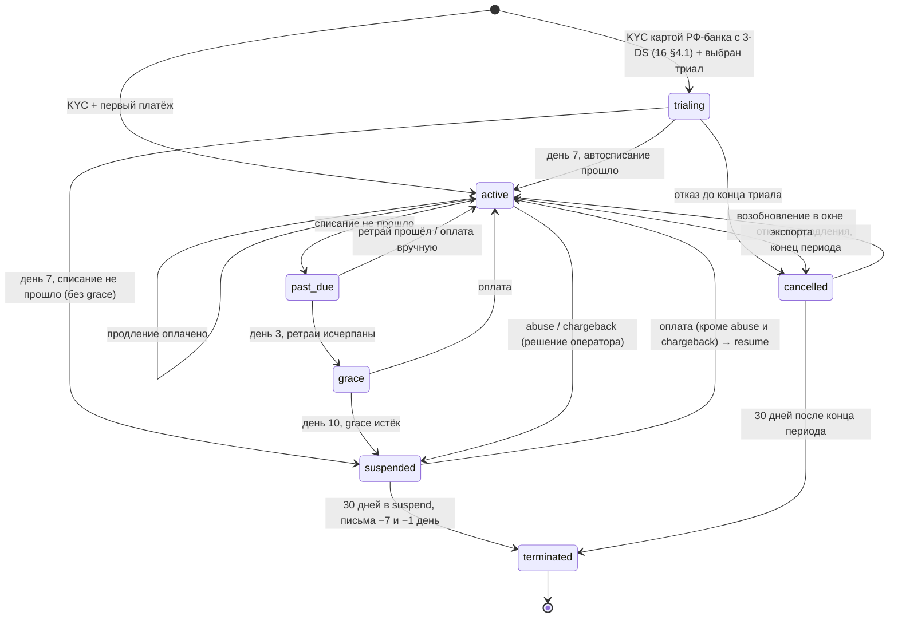
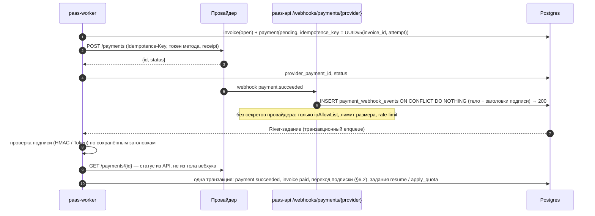

# 13. Биллинг, тарифы, квоты, метеринг и abuse-экономика

> **TL;DR**
> - **«500 ₽ — трать сколько хочешь» буквально убыточно**: клиент без квоты занимает ноду за ~15 000 ₽ и выселяет соседей. Работает честная версия D10 — тариф с жёсткой квотой. Starter за 490 ₽ = 512 MiB RAM (request = limit) и 250m CPU с burst до 1 vCPU. Формула для маркетинга: «всё, что влезло в тариф, — ваше, счетов за перерасход нет».
> - **Экономика** (§1, допущения подставляются): на масштабе продаваемый GiB RAM стоит платформе ~446–494 ₽ в месяц. Безубыточность — ~68–76 платящих тенантов в смеси тарифов на пуле из 3 нод. Первые 6–12 месяцев — минус 50–80 тыс. ₽/мес. Каждая следующая нода пула приносит в 2.6–3.3 раза больше своей цены.
> - **R-QUOTA учтён.** Память без оверкоммита: на старте это стоит одну ноду и ~12 тенантов безубыточности, взамен нет OOM-каскадов между соседями. CPU limit ≤ 4 × request и ≥ 250m, поэтому `XS` из сетки 07 становится 64m. Для нод пула рекомендован профиль 1:2.
> - **Сетка** (§2): Trial на 7 дней (только после идентификации), Starter 490, Standard 1 490, Pro 3 990, Business 10 900 ₽ плюс предоплатные аддоны (registry, S3, БД, диск, IP, домены). Overage нет.
> - **Тариф → Kubernetes** (§3): provisioner рендерит из Postgres пять ResourceQuota и LimitRange (SSA). `hard` = тариф + резерв выкатки. Тома — только на `lnstr-tenant-*` (R-SC). Вычислительная квота ограничена scope'ом PriorityClass, у solver'ов cert-manager своя. Upgrade — сразу после оплаты с пропорциональной доплатой; downgrade — с нового периода и только если текущее состояние влезает.
> - **Не продаём то, чего нет** (§4.4): гейт ёмкости на продажах (`used + Δ ≤ 0.9 × sellable`, оверселл квот ≤ 1.5), сигнал «заказать ноду» на 70 %. Платящий вытесняет только триал, другого платящего — никогда.
> - **Метеринг информационный** (§5): recording rules в `prometheus-tenants` → River раз в час → `usage_hourly` идемпотентным upsert. Диск считаем по `kubelet_volume_stats`, а не по LINSTOR Allocated. Потерянный час не меняет ни копейки.
> - **Неоплата** (§6): 3 дня ретраев → 7 дней grace → suspend (git `replicas: 0`, гибернация CNPG, редирект на страницу, `pods: 0`, CCNP) → 30 дней с экспортом без оплаты → удаление. Приостановку за abuse и chargeback оплата не снимает.
> - **Платежи** (§7): ЮKassa плюс второй провайдер, рекурренты по токену, чек 54-ФЗ на каждое автосписание. Вебхуки через inbox с перезапросом статуса, сверка раз в сутки. Подпись вебхука проверяет worker: у API нет платёжных кредов.
> - **Антифрод = идентификация по 406-ФЗ** (§9): карта российского банка с 3-D Secure, один триал на карту, телефон и устройство, скоринг правилами. Abuse (§10): майнинг выглядит как CPU на лимите без HTTP-трафика. Реакция в MVP — алерт и ручной suspend; DDoS с нашего IP будит ночью (12 часов на устранение по закону).

---

## 1. «500 ₽/мес — трать сколько хочешь»: честный разбор экономики

**Вердикт вперёд.** В буквальном виде — «плати 500 ₽ и занимай сколько хочешь» — модель убыточна и технически опасна: один клиент за 490 ₽ занимает целую ноду (себестоимость ~15 000 ₽/мес) и выселяет соседей. Та же цена с **жёсткой квотой около 0.5 GiB RAM** прибыльна на масштабе. Но первые месяцы платформа неизбежно в минусе: постоянные расходы есть с первого дня, а пул нужно наполнить. Ниже — расчёт с явными допущениями, чтобы владелец подставил свои цифры и пересчитал.

### 1.1 Допущения (подставить реальные цифры)

| # | Допущение | В расчёте | Диапазон | Как уточнить |
|---|---|---|---|---|
| Д-1 | Нода tenant-пула | 16 vCPU (потоков) / 64 GiB / 2×NVMe ~1 TB | 8/32 … 32/128 | `kubectl get nodes -o custom-columns='N:.metadata.name,CPU:.status.allocatable.cpu,MEM:.status.allocatable.memory'`; `playbook-system/utils/node-info.yaml` |
| Д-2 | Аренда bare-metal ноды (РФ, 2026) | **15 000 ₽/мес** | 8 000–25 000 | ⚠️ подставить счёт провайдера (мощности должны быть в РФ — [16](16-legal-ru.md)) |
| Д-3 | Два дополнительных manager'а (D12), 8 vCPU / 32 GiB | 7 000 ₽/мес за штуку | 4 000–10 000 | ⚠️ |
| Д-4 | Прочее: bastion и доп. IP, офсайт-бэкап, SMS, облачная касса и ОФД, домены | 8 000 ₽/мес | 4 000–15 000 | ⚠️ |
| Д-5 | Эквайринг и фискализация | 3.5 % оборота | 2.5–4 % | ⚠️ договор с провайдером (§7) |
| Д-6 | Переменные расходы на тенанта: логи, метрики, SMS, поддержка | 30 ₽/мес | 15–60 | после беты |
| Д-7 | Резерв пула | N+1: одна нода пула всегда свободна | — | решение владельца (§11) |
| Д-8 | Заполнение квоты: сколько из квоты тенант реально занял requests'ами | 60 % | 40–80 % | метеринг `usage_hourly` после беты |
| Д-9 | Проданность пула (sell-through) | 70 % | 50–85 % | там же |

**Не входит в расчёт.** Труд владельца: по оценке исследования, 20–40 % времени senior DevOps, это 75–110 тыс. ₽/мес альтернативных издержек. Комплаенс по 406-ФЗ (СОРМ, ГосСОПКА, юрист — [16](16-legal-ru.md)). Налоги. Если включить только труд, точка безубыточности сдвигается в 2–3 раза. Честная формулировка: пока владелец работает бесплатно, платформа окупает железо, но не себя.

### 1.2 Ёмкость кластера: 5 воркеров минус системные компоненты

После D4 (отдельный tenant-пул) и D12 (3 manager'а) из пяти воркеров продавать можно только **два**:

- **Три manager'а** — только control plane, нагрузку тенантов на них не ставим.
- **Три воркера — системные.** CoreDNS держит жёсткую anti-affinity и требует минимум трёх не-tenant нод ([02](02-tenancy-and-isolation.md) §3.3). Кроме того, на системных нодах живёт весь стек платформы. По оценке исследования, существующие компоненты (GitLab, SeaweedFS, LINSTOR, mon-system, Vault, Zitadel, ArgoCD/Kargo, Traefik, Cilium) занимают **15–30 vCPU и 45–90 GiB** по requests. Новое для PaaS (Harbor, CNPG-оператор, NATS ×3, tenant-ArgoCD, `paas-*` с собственным CNPG, `traefik-tenants`) добавляет ещё **4–6 vCPU и 10–16 GiB**. ⚠️ Измерить до решения: скрипт `jq` по `kubectl get pods -A -o json` из исследования биллинга §1.9. Если система не влезает в три воркера плюс manager, нужна **шестая нода** под систему, и её цена ложится в постоянные расходы PaaS.
- **Два воркера — tenant-пул** (минимум D4).

Сколько одна нода пула (Д-1) реально отдаёт тенантам:

| Строка | CPU | RAM |
|---|---:|---:|
| Capacity ноды | 16 | 64 GiB |
| `systemReserved` + `kubeReserved` (рекомендуется задать; сейчас в репо их нет, [02](02-tenancy-and-isolation.md) §3.4) | −1.5 | −3 GiB |
| `evictionHard memory.available: 500Mi` плюс запас до soft-порога `1Gi` (`hosts-vars/k8s-base.yaml`) | — | −1 GiB |
| DaemonSet'ы узла: cilium-agent, cilium-envoy, vector, node-exporter, linstor-satellite, csi-node | −1.2 | −2.5 GiB |
| **Доступно подам тенантов** | **13.3** | **57.5 GiB** |
| −10 % на фрагментацию: поды не упаковываются идеально | **12** | **52 GiB** |

⚠️ Строку DaemonSet'ов измерить командой `kubectl describe node <tenant-node> | grep -A12 "Non-terminated Pods"`.

Продаваемая ёмкость пула с резервом N+1 = (N−1) × 52 GiB:

| Нод в пуле | Продаётся RAM | Комментарий |
|---:|---:|---|
| 2 (старт, D4) | 52 GiB | половина железа пула — страховка |
| 3 | 104 GiB | рекомендуемый старт платных продаж (§11) |
| 4 | 156 GiB | |
| 6 | 260 GiB | |

### 1.3 Память — ограничивающий ресурс, если сетка совпадает с профилем ноды

Почему продаём именно RAM:

- **Память несжимаема.** Правило [07](07-svc-compute.md) §3.2 — `request == limit`. Каждый проданный GiB — это GiB физической памяти, зарезервированный 24/7, работает приложение или спит. Оверкоммита на уровне ноды нет (§4.2).
- **CPU сжимаем.** Продаётся гарантированная доля (request), а burst до limit берётся из простаивающих ядер. Недоиспользованный CPU одного тенанта достаётся соседям, недоиспользованная память — никому.

**Ловушка, которая ломает расчёт.** Планировщик считает requests **обоих** ресурсов. В сетке [07](07-svc-compute.md) §3.1 на каждый GiB приходится 0.5 vCPU request (M = 250m / 512Mi). Назовём этот коэффициент **k**. Нода 16/64 отдаёт 12 vCPU на 52 GiB, то есть 0.23 vCPU на GiB. При k = 0.5 CPU-requests кончаются, когда занято 24 GiB из 52: **больше половины RAM нельзя продать**.

| Профиль ноды пула (цена ⚠️) | Продаётся на ноду (после резервов и −10 %) | GiB при k = 0.5 (сетка 07) | GiB при k = 0.25 | ₽ за продаваемый GiB-мес при 100 % / 70 % проданности |
|---|---|---:|---:|---|
| 16/64 (1:4), 15 000 ₽ | 12 vCPU / 52 GiB | 24 (упор в CPU) | **48** | k=0.5: 625 / 890; **k=0.25: 312 / 446** |
| 32/64 (1:2), 18 000 ₽ | 26 vCPU / 52 GiB | **52** | 52 (упор в RAM) | 346 / 494 |
| 32/128 (1:4), 25 000 ₽ | 26 vCPU / 109 GiB | 52 (упор в CPU) | **104** | k=0.5: 480 / 686; **k=0.25: 240 / 343** |

**Решение.**

1. **k — параметр платформы**, а не константа кода. Сетка размеров уже лежит данными в Postgres ([07](07-svc-compute.md) §3.1), поэтому смена k — это миграция данных, а не релиз.
2. После замера нод пула ставится `k_grid = allocatable_cpu / allocatable_mem` (±10 %). **Поправка R-QUOTA:** CPU-лимит не больше 4 × request и не меньше 250m. Поэтому при k = 0.25 пополам делятся не только requests сетки 07, но и **лимиты**: M становится 125m / 500m вместо 250m / 1000m, а XS и S упираются в пол 250m. Burst ×8, заложенный в прежний вариант этого пункта, R-QUOTA запрещает. Отсюда выбор профиля нод пула:
   - **нода 1:2 (32/64) и сетка 07 как есть (k = 0.5)**: 494 ₽ за GiB при 70 % проданности, потолки burst сетки 07 сохраняются;
   - нода 1:4 (16/64) и k = 0.25: 446 ₽ за GiB (на 10 % дешевле), но у M потолок 0.5 vCPU, и JVM или Node стартуют вдвое дольше.

   На безубыточности разница почти не видна: смесь тарифов на пуле из 3 нод даёт U_be 74 % против 72 %, или ~76 тенантов против ~68 (§1.4). **Рекомендация:** новые ноды пула покупать с профилем 1:2 и сетку 07 не трогать. Если в пул уходят существующие воркеры 1:4, ставить k = 0.25 с урезанными лимитами. Решение владельца — §11.
3. **Квоты тарифа по CPU (§2) держим с запасом, k_quota = 0.5.** Квота — потолок, а не резерв. Запас нужен managed-БД: Postgres Standard идёт с Guaranteed-CPU, 1 vCPU на 2 GiB ([09](09-svc-databases.md) §1.2). Физическую ёмкость определяют фактические requests подов, а не квоты.

Дальше в расчётах: **себестоимость ≈ 446 ₽ за продаваемый GiB-мес** (нода 16/64, k = 0.25, проданность 70 %). Для ноды 1:2 с сеткой 07 — 494 ₽. Это стоимость на масштабе, когда постоянные расходы размазаны по многим нодам.

### 1.4 Точка безубыточности и порог убыточности flat-rate

**Постоянные расходы PaaS** (F, маржинально к уже существующему кластеру):

| Статья | ₽/мес |
|---|---:|
| Tenant-пул, 2 ноды × 15 000 | 30 000 |
| +2 manager'а (D12) × 7 000 | 14 000 |
| +1 системный воркер под Harbor, NATS, tenant-ArgoCD, `paas-*` (⚠️ может не понадобиться — замер §1.2) | 15 000 |
| Прочее (Д-4) | 8 000 |
| **F на старте** | **≈ 67 000** (диапазон 35–110 тыс.) |

**Вклад одного тенанта** = цена × (1 − 0.035) − 30 ₽. У Starter за 490 ₽ это **443 ₽**.

**Порог 1: сколько RAM окупает flat-подписка одного тенанта.** Максимальный объём `R_max = вклад / себестоимость GiB`.

| Себестоимость GiB-мес | Когда так | R_max для 490 ₽ |
|---:|---|---:|
| 1 396 ₽ | старт: F = 67 000 на 48 GiB пула из 2 нод (k = 0.25) | **0.32 GiB** |
| 446 ₽ | масштаб: нода 16/64, k = 0.25, проданность 70 % | **≈ 1.0 GiB** |
| 890 ₽ | масштаб, но k = 0.5 (сетка 07 без пересчёта) | 0.5 GiB |

Тариф за 490 ₽ **убыточен, если тенант держит больше ~1 GiB RAM** на масштабе и больше ~0.3 GiB на старте. Квота Starter — 512 MiB, при заполнении 60 % (Д-8) это 0.3 GiB. Отсюда вывод: **без квоты тариф не существует, с квотой 512 MiB он проходит.**

**Порог 2: какую долю пула надо продать, чтобы окупить F.** Загрузка безубыточности `U_be = F / (продаваемые GiB × вклад на занятый GiB)`.

| Сценарий | Вклад на занятый GiB | Пул | F | U_be | Тенантов до безубыточности |
|---|---:|---|---:|---:|---:|
| Только Starter (0.3 GiB занято на тенанта) | 1 477 ₽ | 2 ноды, 48 GiB при k = 0.25 | 67 000 | **94 %** | ~151 |
| Только Starter, k = 0.5 | 1 477 ₽ | 2 ноды, 24 GiB | 67 000 | **> 100 %: не окупается никогда** | — |
| Смесь 60/30/8/2 % (Starter/Standard/Pro/Business, §2): ARPU 1 278 ₽, занято 1.02 GiB на тенанта | 1 179 ₽ | 3 ноды, 96 GiB | 82 000 | **72 %** | **~68** |
| Та же смесь, 6 нод | 1 179 ₽ | 240 GiB | 127 000 | 45 % | ~106 |

(ARPU смеси = 0.6 × 490 + 0.3 × 1 490 + 0.08 × 3 990 + 0.02 × 10 900 = 1 278 ₽; вклад = 1 278 × 0.965 − 30 = 1 203 ₽. Средний занятый объём = 0.6 × (0.6 × 0.5 + 0.3 × 2 + 0.08 × 6 + 0.02 × 16) = 1.02 GiB.)

**Маржа каждой следующей ноды пула.** Нода 16/64 за 15 000 ₽ при k = 0.25 и проданности 70 % вмещает ~112 тенантов Starter (или ~33 тенанта смеси). Это ~49 000 ₽ вклада (или ~40 000 ₽ по смеси) — **×2.6–3.3 к её цене**. Экономика на масштабе здоровая. Больно только в начале: постоянные расходы (managers, системная нода, касса) приходят раньше выручки.

**Сценарий «трать сколько хочешь» буквально** — без квоты. Scheduler размещает поды по requests. Если requests большие — один клиент занимает ноду, а соседи уходят в `Pending`. Если requests не проставлены — поды размещаются все, и каскад OOM и eviction валит соседей (исследование биллинга §1.6). Один «жадный» клиент на ноде 16/64 обходится в −14 500 ₽/мес. Десять таких — минус 145 000 ₽/мес и лежащая платформа.

**Операционный предел.** Один человек выдерживает **100–300 платящих тенантов** (поддержка, abuse, идентификация по 406-ФЗ — исследование §1.8). Это совпадает с ёмкостью пула на 4–6 нод. «Тысячи тенантов» — другой бизнес: второй кластер и найм.

**Сверка с R-QUOTA: память без оверкоммита.** Весь расчёт выше уже ведётся при `request == limit`: продаётся ровно физическая память. Исследование биллинга допускало оверкоммит памяти ×2 (limits вдвое больше requests). R-QUOTA его запрещает, и у запрета есть цена:

| Показатель | ×2 (исследование, отвергнуто) | ×1 (R-QUOTA, принято) |
|---|---:|---:|
| Себестоимость продаваемого GiB-мес (16/64, k = 0.25, 70 %) | ~223 ₽ | 446 ₽ |
| R_max для 490 ₽ на масштабе | ~2 GiB | ~1 GiB |
| Сколько requests занимают 68 тенантов смеси | ~35 GiB: хватает пула из 2 нод | ~69 GiB: нужен пул из 3 нод |
| F и число тенантов до безубыточности | 67 000 ₽ → **~56** | 82 000 ₽ → **~68** |

Число тенантов до безубыточности определяют F и ARPU, а не ёмкость: оверкоммит только позволяет разместить тех же тенантов на меньшем числе нод. На старте запрет стоит одну ноду пула (~15 000 ₽/мес) и ~12 тенантов безубыточности. Взамен под тенанта никогда не превышает свой request и не становится первой жертвой eviction у соседа (§4.2). При ×2 первый тенант, упёршийся в свой limit, запускает выселение соседей: это риск R14 из [18](18-risks-and-owner-decisions.md). Цена приемлемая, решение не пересматриваем.

### 1.5 Вывод

1. **Буквально — нет.** «Плати 500 ₽ и трать сколько хочешь» даёт −14 500 ₽ на каждом жадном клиенте и падение соседей. Это не пессимизм: так ведут себя scheduler и OOM-killer.
2. **Как тариф с жёсткой квотой — да.** Starter за 490 ₽ с 512 MiB RAM стоит платформе ~150–230 ₽ из 443 ₽ вклада. Условия: сетка пересчитана под профиль ноды (k), в пуле не меньше трёх нод, есть 70+ платящих тенантов в смеси тарифов (или ~150 только Starter).
3. **Первые 6–12 месяцев — минус 50–80 тыс. ₽/мес.** Это расчётная инвестиция, а не сюрприз. В роадмапе нужен явный бюджет на этот период ([17](17-roadmap.md)).
4. **Маркетинговая формула** вместо «трать сколько хочешь»: **«никаких счетов за перерасход — всё, что влезло в тариф, ваше»**. Честно, соответствует D10 и не создаёт юридического риска вводящей в заблуждение рекламы.
5. Конкурировать ценой «сырого» GiB с публичными облаками РФ нельзя: ~450 ₽ за GiB-мес — порядок их розничной цены (⚠️ сверить прайсы Yandex Cloud, Selectel, VK Cloud на дату). Продаётся упаковка: домен сразу с сертификатом, Postgres кнопкой, секреты без DevOps, безопасная обвязка без YAML.

## 2. Тарифная сетка и аддоны

**К чему привязан тариф.** К Project, как рекомендует [02](02-tenancy-and-isolation.md) §1.1: одна позиция подписки = один Project = один namespace = один набор `ResourceQuota`. Organization — плательщик: один счёт, одна дата списания, в счёте строки по проектам и аддонам (§8). Исключение — registry: Harbor-проект заводится один на организацию (D7), поэтому его квота `hard` = сумма registry-лимитов всех проектов организации плюс аддоны. Модуль `projects` в [04](04-control-plane-go.md) описан как «распределить квоту организации по проектам». Это общий пул, то есть фаза 2 по [02](02-tenancy-and-isolation.md), в MVP его нет.

**Правило цены.** Даже если **все** тенанты заполнят квоты на 100 %, тариф не должен уходить в минус. При ожидаемом заполнении 60 % (Д-8) маржа — не меньше 40 %. Себестоимость ниже посчитана по §1.3: RAM 446 ₽ за GiB-мес. Диск LINSTOR, S3 и registry — ~7 ₽ за GiB-мес с учётом ×2 реплик и 40 % запаса. ⚠️ Себестоимость диска пересчитать от реальной цены NVMe.

### 2.1 Ступени

| Параметр | Trial (7 дней) | **Starter** | **Standard** | **Pro** | **Business** |
|---|---|---|---|---|---|
| Цена, ₽/мес (⚠️ с НДС или без — по налоговому режиму, §7.2) | 0, только после идентификации (§9) | **490** | **1 490** | **3 990** | **10 900** |
| RAM (request = limit), сумма по проекту | 512 MiB | 512 MiB | 2 GiB | 6 GiB | 16 GiB |
| CPU request (гарантированная доля) | 250m | 250m | 1 | 3 | 8 |
| CPU limit (потолок burst) | 500m | 1 | 3 | 8 | 16 |
| Крупнейший размер инстанса ([07](07-svc-compute.md) §3.1) | S | M | L | XL | 2XL |
| Приложений (App) | 2 | 3 | 10 | 25 | 60 |
| Подов (без резерва выкатки) | 3 | 6 | 20 | 50 | 120 |
| Диск: PVC + тома БД, суммарно / число PVC | 1 GiB / 1 | 2 GiB / 1 | 20 GiB / 4 | 60 GiB / 10 | 150 GiB / 25 |
| Managed-БД, слотов ([09](09-svc-databases.md)) | 0 | 0 | 1 (Postgres · 1 узел или Valkey) | 3 (+ Postgres · HA) | 8 |
| Registry (в квоту организации) | 0.5 GiB | 1 GiB | 5 GiB | 20 GiB | 50 GiB |
| S3: объём / бакетов ([11](11-svc-object-storage-s3.md)) | — | 1 GiB / 2 | 10 GiB / 5 | 50 GiB / 10 | 150 GiB / 10 |
| Custom domains ([08](08-svc-ingress-domains-ip.md)) | 0 | 1 | 5 | 20 | 50 |
| Внешние TCP-порты (L4) | 0 | 0 | 1 | 3 | 10 |
| Egress fair-use (HTTP + TCP через ingress, §5.1) | 5 GB | 50 GB | 200 GB | 1 TB | 3 TB |
| Исходящие соединения из подов (через egress-IP тенантов, R-EGRESS) | только 80/443 и DNS | всё, кроме 25/tcp (D4) | то же | то же | то же |
| HPA ([07](07-svc-compute.md) §9.1) | — | — | ✓ | ✓ | ✓ |
| Секретов в Vault ([12](12-svc-secrets.md)) | 10 | 20 | 100 | 300 | 1 000 |
| Логи (D14) | 7 дней | 7 дней | 7 дней | 7 дней | 7 дней |
| PITR Postgres | — | — | 7 дней | 14 дней | 30 дней |
| PriorityClass (§4.3, R-QUOTA) | `tenant-trial` | `tenant-paid` | `tenant-paid` | `tenant-paid` | `tenant-paid` |
| Поддержка | — | email, 72 ч | email, 24 ч | 8 ч в рабочие дни | 4 ч, чат |
| **Себестоимость квоты при 100 % заполнении**, ₽ | ~250 | 251 | 1 137 | 3 586 | 9 586 |
| **Маржа: 100 % / 60 % заполнения** | — | 43 % / 66 % | 19 % / 52 % | 6 % / 44 % | 9 % / 45 % |

Почему именно так:

- **Цена за GiB падает со ступенью** (980 → 745 → 665 → 681 ₽). У Business она чуть выше, чем у Pro, потому что в Business втрое больше диска и S3. Резать Business до уровня Pro нельзя: при 100 % заполнении он уйдёт в минус.
- **Starter без managed-БД.** Самый маленький Postgres (`db-s`, 1 GiB, [09](09-svc-databases.md) §1.2) больше всей квоты Starter. БД потребляет ту же квоту проекта, что и приложения (решение 09). Starter — это «один-два лёгких контейнера», БД докупается аддоном (§2.2) и расширяет квоту.
- **Trial ограничен по egress** портами 80/443 и DNS. Так на триале нет майнинга на пулах (stratum-порты), спама и сканирования — главных векторов злоупотребления. Реализация — статическая CCNP по метке namespace `paas.1520.tech/tier=trial` (ansible, D1). Burst ×2, а не ×4, чтобы майнить было невыгодно.
- **Путаница «Standard».** Тариф Standard и сервисная ступень Postgres Standard из [09](09-svc-databases.md) — разные сущности. В UI ступени БД называются «Postgres · 1 узел» и «Postgres · HA», слово «Standard» остаётся только за тарифом. Таблица registry в [10](10-svc-registry-harbor.md) §5.2 называет младший тариф «Hobby» — это Starter.

### 2.2 Аддоны

Аддоны — **предоплатные** ежемесячные позиции подписки, а не постфактум-overage (D10). Добавляются с пропорциональным доплатным списанием за остаток периода.

| Аддон | Цена, ₽/мес | Себестоимость ⚠️ | Что меняется технически | Уровень | Этап |
|---|---:|---:|---|---|---|
| +10 GiB Registry | 150 | ~70 | Harbor `hard` += 10 GiB ([10](10-svc-registry-harbor.md) §5.2) | организация | MVP |
| +50 GiB S3 | 450 | ~350 | лимит Σ квот бакетов проекта += 50 GiB ([11](11-svc-object-storage-s3.md) §6.1) | проект | MVP |
| +1 БД «Postgres · 1 узел» `db-s` (или Valkey того же размера) | 690 | ~516 | слот БД +1; квота: RAM +1 GiB, CPU +250m/+1, диск +10 GiB, PVC +1, `count/clusters.postgresql.cnpg.io` +1 | проект | MVP |
| +1 БД «Postgres · HA» `db-m` (2 × 1 vCPU / 2 GiB / 25 GiB) | 2 990 | ~2 134 | слот +1; RAM +4 GiB, CPU +2/+2, диск +50 GiB, PVC +2 | проект, от Standard | Ф2 |
| +10 GiB диска PVC | 120 | ~70 | `requests.storage` += 10 GiB | проект | Ф2 |
| Выделенный IP (слот bastion) | 990 | 150–400 за IP ⚠️ + дефицитный слот | назначение `ip_slot` ([08](08-svc-ingress-domains-ip.md)) | проект | Ф2 |
| +5 custom domains | 190 | ~0 | лимит в БД + `count/ingressroutes.traefik.io` | проект | Ф2 |

**Честно про S3.** ~9 ₽ за GiB-мес — это NVMe с двумя репликами, а не архив. Для терабайтных архивов публичное объектное хранилище дешевле в разы (⚠️ сверить прайсы), и конкурировать с ним не надо. Позиционирование — «хранилище рядом с приложением».

### 2.3 Правила сетки

1. **Overage нет** (D10). Упёрся в квоту — отказ с цифрами и кнопкой «перейти на старший тариф» (§6.1). Постфактум ресурсы никогда не тарифицируются.
2. **Бесплатного тарифа нет** (D10). Trial на 7 дней — только после идентификации (§9): одна карта и один телефон дают один trial за всё время.
3. **Upgrade — сразу**, с пропорциональным списанием за остаток периода. **Downgrade — с начала следующего периода** и только если текущее желаемое состояние в него влезает (§3.3).
4. **Годовая предоплата со скидкой 15 %** снижает долю эквайринга и отток. Решение владельца (§11).
5. **Сетка — данные.** Таблица `plans` с `version`. Изменение цены = новая версия. Действующие подписки остаются на старой до ближайшего продления после уведомления (срок — по оферте, ⚠️ юрист).
6. **Лимиты в UI — продуктовые единицы.** `ResourceQuota` = лимит тарифа + резерв выкатки ([07](07-svc-compute.md) §3.5). Резерв пользователю не показывается и не продаётся.
7. **Метка тарифа на namespace** `paas.1520.tech/tier` = `trial|starter|standard|pro|business` ([02](02-tenancy-and-isolation.md) §1). Ставит provisioner при смене тарифа. Метку читают VAP (разрешённые PriorityClass) и CCNP trial.

## 3. Тариф → ResourceQuota / LimitRange

### 3.1 Кто и когда применяет

**Источник истины — Postgres, исполнитель — `paas-provisioner`.** Больше никто в кластере квоты тенанта не пишет: у tenant-ArgoCD прав на `resourcequotas` и `limitranges` нет намеренно ([02](02-tenancy-and-isolation.md) §2.2), VAP разрешает менять метки `paas.1520.tech/*` на namespace только provisioner'у.

Цепочка:

1. Тариф проекта (`subscription_items`, §8) + аддоны проекта + резерв выкатки → строка `quotas` ([05](05-data-model.md) §5.3) с `generation += 1`. Всё в одной транзакции с изменением подписки.
2. В той же транзакции ставится River-задание `project.apply_quota` в очередь provisioner'а (транзакционный enqueue, [04](04-control-plane-go.md) §8).
3. Provisioner рендерит пять `ResourceQuota` и `LimitRange` чистой функцией `quota.Render()` и применяет их Server-Side Apply (`fieldManager: paas-provisioner`, `force: true`). Заодно ставит метку `paas.1520.tech/tier`.
4. `applied_generation = generation`. Частичный индекс `quotas_pending_idx` из 05 находит проекты, где применение отстало. Periodic-задание добивает их после сбоев.
5. Дрейф (кто-то изменил квоту руками) ловит informer provisioner'а по метке `paas.1520.tech/managed-by=paas` и переприменяет ([02](02-tenancy-and-isolation.md) §2.6).

| Событие | Что меняется в namespace | Инициатор |
|---|---|---|
| Создание проекта | все объекты с нуля ([02](02-tenancy-and-isolation.md) §2.2) | операция `project.create` |
| Upgrade тарифа или покупка аддона | `hard` растёт, `max` в LimitRange, метка `tier` | `billing` после успешного платежа (§3.3) |
| Downgrade | `hard` падает, только после проверки «влезает» | `billing.period_rollover` в конце периода |
| Trial → платный | метка `tier`, страж PriorityClass, класс подов `tenant-trial` → `tenant-paid` (коммит рестарта через git) | `billing` после первого списания |
| Suspend / resume | `paas-compute.pods: "0"` и обратно, метка `lifecycle` | `billing.dunning` (§6.3) |

**Резерв выкатки** ([07](07-svc-compute.md) §3.5) — это крупнейший размер, **разрешённый тарифу**, а не крупнейшее приложение проекта, как сказано в [04](04-control-plane-go.md) §10. Выбран тариф: резерв не зависит от набора приложений, поэтому квоту не надо переписывать при каждом деплое. Физически резерв занимают только surge-поды и `release_command`-Job, пользователю он не показывается и не продаётся. Переплата — один размер на проект, в бюджете ёмкости (§4.4) она учтена.

**Накладные слота БД.** CNPG-под — это postgres плюс сайдкар barman-cloud: 30–60 MiB в покое и всплеск Python-процесса на каждый WAL до ~100 MiB ([09](09-svc-databases.md) §15.1). Квота слота = размер БД из [09](09-svc-databases.md) §1.2 плюс **256Mi / 50m / 200m** на инстанс под сайдкар (⚠️ замерить `kubectl top pod --containers` на `test-1`). Как и резерв выкатки, накладные в UI не показываются. Себестоимость они увеличивают: у аддона `db-s` она растёт с ~516 до ~630 ₽ при цене 690 ₽ из §2.2 — маржа 9 %. Предложение: цена аддона 790 ₽ (§11).

```go
// internal/quota/render.go — чистая функция; golden-тест на каждую ступень:
// testdata/golden/quota/<tier>.yaml. Никакого text/template (D13).
type Entitlement struct {
	Tier         string            // trial|starter|standard|pro|business → метка paas.1520.tech/tier
	CPUReq       resource.Quantity // тариф + аддоны + накладные слотов БД
	CPULim       resource.Quantity
	Mem          resource.Quantity // request == limit (R-QUOTA)
	Pods, PVCs   int64
	Storage      resource.Quantity // PVC приложений + тома БД
	Objects      map[corev1.ResourceName]resource.Quantity // count/*: приложения, БД, домены, L4
	Reserve      Size              // крупнейший размер тарифа (07 §3.5)
	MaxContainer Size              // max(крупнейший размер App, крупнейшая БД тарифа и аддонов)
	MaxPVC       resource.Quantity
}

func Render(ns string, e Entitlement) []client.Object {
	class, ratio := "tenant-paid", "4"
	if e.Tier == "trial" {
		class, ratio = "tenant-trial", "2" // burst ×2 на триале (§2.1)
	}
	cpuReq, cpuLim, mem := add(e.CPUReq, e.Reserve.CPUReq), add(e.CPULim, e.Reserve.CPULim), add(e.Mem, e.Reserve.Mem)
	return []client.Object{
		compute(ns, cpuReq, cpuLim, mem, e.Pods+1),     // +1 под на surge
		storage(ns, e.Storage, e.PVCs),                 // только lnstr-tenant-*, остальные SC — "0" (R-SC)
		objects(ns, e.Objects),
		priorityGuard(ns, class),
		acmeSolver(ns),
		limits(ns, e.MaxContainer, e.MaxPVC, ratio),
	}
}
```

### 3.2 YAML по ступеням

Числа ниже посчитаны для сетки [07](07-svc-compute.md) §3.1 (k = 0.5) с одной поправкой: у `XS` request поднят до **64m**, иначе 50m / 250m даёт burst ×5, и LimitRange с `maxLimitRequestRatio.cpu: "4"` такой под отклонит (R-QUOTA). На триале размеры рендерятся с `request = limit / 2` (burst ×2): `XS` = 125m / 250m / 128Mi, `S` = 250m / 500m / 256Mi.

**Таблица профилей: `hard` = тариф из §2.1 + резерв выкатки.**

| Ключ | Trial | Starter | Standard | Pro | Business | Правило |
|---|---:|---:|---:|---:|---:|---|
| Резерв выкатки | S (trial) | M | L | XL | 2XL | крупнейший размер тарифа |
| `requests.cpu` | 500m | 500m | 1500m | 4 | 10 | тариф + резерв |
| `limits.cpu` | 1 | 2 | 4500m | 10 | 20 | тариф + резерв |
| `requests.memory` = `limits.memory` | 768Mi | 1Gi | 3Gi | 8Gi | 20Gi | тариф + резерв, R-QUOTA |
| `requests.ephemeral-storage` | 768Mi | 1Gi | 3Gi | 8Gi | 20Gi | = RAM (`Harden()` ставит request = RAM размера) |
| `limits.ephemeral-storage` | 3Gi | 4Gi | 12Gi | 32Gi | 80Gi | 4 × RAM: у любого размера лимит диска ≤ 4 × RAM, упор всегда раньше в память |
| `pods` | 4 | 7 | 21 | 51 | 121 | тариф + 1 |
| `persistentvolumeclaims` | 1 | 1 | 4 | 10 | 25 | тариф |
| `requests.storage` | 1Gi | 2Gi | 20Gi | 60Gi | 150Gi | тариф, логический объём |
| LimitRange `max` (Container) | 500m / 256Mi | 1 / 512Mi | 1500m / 1Gi | 2 / 2Gi | 4 / 4Gi | крупнейший размер App или БД |
| LimitRange `max` (PVC) | 1Gi | 2Gi | 20Gi | 60Gi | 100Gi | min(диск тарифа, 100Gi) |
| `maxLimitRequestRatio.cpu` | 2 | 4 | 4 | 4 | 4 | R-QUOTA, триал строже |
| `count/deployments.apps` | 2 | 3 | 10 | 25 | 60 | = приложений |
| `count/statefulsets.apps` | 1 | 1 | 4 | 10 | 25 | = PVC (Valkey, App с томом) |
| `count/replicasets.apps` | 8 | 12 | 40 | 100 | 240 | 4 × deployments (`revisionHistoryLimit: 3`) |
| `services` | 4 | 5 | 15 | 36 | 86 | приложения + 3 на БД (`-rw`/`-ro`/`-r`) + 2 |
| `configmaps` | 10 | 12 | 30 | 65 | 150 | |
| `secrets` | 15 | 20 | 50 | 100 | 250 | CNPG ~6 на кластер, cert-manager 1 на домен |
| `count/jobs.batch` | 8 | 10 | 25 | 55 | 125 | 2 × приложений + запас |
| `count/cronjobs.batch` | 0 | 1 | 5 | 15 | 30 | cron — Ф2, квота заготовлена |
| `count/horizontalpodautoscalers.autoscaling` | 0 | 0 | 10 | 25 | 60 | HPA с Standard |
| `count/poddisruptionbudgets.policy` | 2 | 3 | 11 | 28 | 68 | приложения + БД |
| `count/ingressroutes.traefik.io` | 2 | 4 | 15 | 45 | 110 | приложения + custom domains |
| `count/middlewares.traefik.io` | 4 | 6 | 20 | 50 | 120 | |
| `count/certificates.cert-manager.io` | 1 | 2 | 6 | 21 | 51 | custom domains + 1 |
| `count/externalsecrets.external-secrets.io` | 4 | 6 | 22 | 56 | 136 | 2 × (приложения + БД) |
| `count/clusters.postgresql.cnpg.io` | 0 | 0 | 1 | 3 | 8 | слоты БД; аддон «+1 БД» = +1 |
| `count/scheduledbackups.postgresql.cnpg.io`, `count/objectstores.barmancloud.cnpg.io`, `count/poolers.postgresql.cnpg.io` | 0 | 0 | 1 | 3 | 8 | = слоты БД |
| `count/tcps.ingress.v3.haproxy.org` | 0 | 0 | 1 | 3 | 10 | L4-порты ([08](08-svc-ingress-domains-ip.md) §9.2) |

`count/backups.postgresql.cnpg.io` **намеренно без квоты**: `ScheduledBackup` создаёт объект `Backup` каждый день, и квота молча остановила бы бэкапы на N-й день. Их число держит сборка мусора из [09](09-svc-databases.md) §6.2.

**Эталон целиком — Standard** (`t-k3x9q2m7ab`). Форма та же, что в [02](02-tenancy-and-isolation.md) §8, со следующими изменениями: SC только `lnstr-tenant-*` по R-SC, вычислительная квота разделена по PriorityClass, добавлена квота solver'а с исправленными пропорциями.

```yaml
# 1. Вычисления — только поды тенантских классов
apiVersion: v1
kind: ResourceQuota
metadata:
  name: paas-compute
  namespace: t-k3x9q2m7ab
  labels: {paas.1520.tech/managed-by: paas, paas.1520.tech/tenant-ns: t-k3x9q2m7ab}
  annotations:
    paas.1520.tech/plan: standard-2026-10      # версия тарифа (05 §5.8: тариф неизменяем)
    paas.1520.tech/quota-generation: "7"       # = quotas.generation
spec:
  hard:
    requests.cpu: 1500m                        # тариф 1 + резерв L 500m
    limits.cpu: 4500m                          # тариф 3 + резерв L 1500m
    requests.memory: 3Gi                       # тариф 2Gi + резерв L 1Gi
    limits.memory: 3Gi                         # R-QUOTA: == requests
    requests.ephemeral-storage: 3Gi
    limits.ephemeral-storage: 12Gi
    pods: "21"                                 # suspend: "0"
  scopeSelector:
    matchExpressions:
      - {scopeName: PriorityClass, operator: In, values: [tenant-paid, tenant-trial]}  # оба: переход trial→paid без окна
---
# 2. Хранилище — только тенантские SC (R-SC), остальные закрыты нулём
apiVersion: v1
kind: ResourceQuota
metadata:
  name: paas-storage
  namespace: t-k3x9q2m7ab
  labels: {paas.1520.tech/managed-by: paas, paas.1520.tech/tenant-ns: t-k3x9q2m7ab}
spec:
  hard:
    persistentvolumeclaims: "4"
    requests.storage: 20Gi
    lnstr-tenant-local.storageclass.storage.k8s.io/requests.storage: 20Gi
    lnstr-tenant-multi-sync.storageclass.storage.k8s.io/requests.storage: 20Gi
    lnstr-worker-local.storageclass.storage.k8s.io/requests.storage: "0"        # R-SC: вторая реплика уехала бы на системную ноду
    lnstr-worker-multi-sync.storageclass.storage.k8s.io/requests.storage: "0"
    lnstr-major-local.storageclass.storage.k8s.io/requests.storage: "0"
    lnstr-major-multi-sync.storageclass.storage.k8s.io/requests.storage: "0"
    lnstr-manager-local.storageclass.storage.k8s.io/requests.storage: "0"
    lnstr-manager-multi-sync.storageclass.storage.k8s.io/requests.storage: "0"
---
# 3. Число объектов (значения — строка Standard таблицы выше)
apiVersion: v1
kind: ResourceQuota
metadata:
  name: paas-objects
  namespace: t-k3x9q2m7ab
  labels: {paas.1520.tech/managed-by: paas, paas.1520.tech/tenant-ns: t-k3x9q2m7ab}
spec:
  hard:
    services: "15"
    services.nodeports: "0"
    services.loadbalancers: "0"
    configmaps: "30"
    secrets: "50"
    requests.hugepages-2Mi: "0"
    requests.hugepages-1Gi: "0"
    count/deployments.apps: "10"
    count/statefulsets.apps: "4"
    count/replicasets.apps: "40"
    count/jobs.batch: "25"
    count/cronjobs.batch: "5"
    count/horizontalpodautoscalers.autoscaling: "10"
    count/poddisruptionbudgets.policy: "11"
    count/ingressroutes.traefik.io: "15"
    count/middlewares.traefik.io: "20"
    count/certificates.cert-manager.io: "6"
    count/externalsecrets.external-secrets.io: "22"
    count/clusters.postgresql.cnpg.io: "1"
    count/scheduledbackups.postgresql.cnpg.io: "1"
    count/objectstores.barmancloud.cnpg.io: "1"
    count/poolers.postgresql.cnpg.io: "1"
    count/tcps.ingress.v3.haproxy.org: "1"
---
# 4. Страж PriorityClass: под любого другого класса в namespace не создать
apiVersion: v1
kind: ResourceQuota
metadata:
  name: paas-priority-guard
  namespace: t-k3x9q2m7ab
  labels: {paas.1520.tech/managed-by: paas, paas.1520.tech/tenant-ns: t-k3x9q2m7ab}
spec:
  hard: {pods: "0"}
  scopeSelector:
    matchExpressions:
      - {scopeName: PriorityClass, operator: NotIn, values: [tenant-paid, paas-acme-solver]}   # trial: [tenant-trial, paas-acme-solver]
---
# 5. Solver'ы cert-manager: своя маленькая квота, тариф тенанта не расходуют (08 §6.2)
apiVersion: v1
kind: ResourceQuota
metadata:
  name: paas-acme-solver
  namespace: t-k3x9q2m7ab
  labels: {paas.1520.tech/managed-by: paas, paas.1520.tech/tenant-ns: t-k3x9q2m7ab}
spec:
  hard:                                        # 3 solver-пода × 25m/100m CPU, 64Mi/64Mi RAM
    pods: "3"
    requests.cpu: 75m
    limits.cpu: 300m
    requests.memory: 192Mi
    limits.memory: 192Mi
  scopeSelector:
    matchExpressions:
      - {scopeName: PriorityClass, operator: In, values: [paas-acme-solver]}
---
apiVersion: v1
kind: LimitRange
metadata:
  name: paas-limits
  namespace: t-k3x9q2m7ab
  labels: {paas.1520.tech/managed-by: paas, paas.1520.tech/tenant-ns: t-k3x9q2m7ab}
spec:
  limits:
    - type: Container
      defaultRequest: {cpu: 125m, memory: 256Mi, ephemeral-storage: 256Mi}  # = размер S: страховка для подов операторов без resources
      default:        {cpu: 500m, memory: 256Mi, ephemeral-storage: 1Gi}
      min:            {cpu: 10m,  memory: 16Mi}                             # ≤ запросов solver'а (08 §6.2)
      max:            {cpu: 1500m, memory: 1Gi, ephemeral-storage: 2Gi}     # L; с аддоном «Postgres · HA» (Ф2) — 2 / 2Gi
      maxLimitRequestRatio:
        cpu: "4"                                                            # R-QUOTA
        memory: "1"                                                         # R-QUOTA
    - type: PersistentVolumeClaim
      min: {storage: 1Gi}
      max: {storage: 20Gi}
```

Что здесь сознательно отличается от [02](02-tenancy-and-isolation.md) §8 и [08](08-svc-ingress-domains-ip.md) §6.2:

- **`paas-compute` ограничена scope'ом PriorityClass.** Иначе solver-под cert-manager расходовал бы тариф, и при полной квоте сертификат молча не выпускался бы (ловушка из 08). В scope оба тенантских класса: после перехода trial → платный старые поды ещё несут `tenant-trial` и должны учитываться до пересоздания.
- **Квота solver'а исправлена под R-QUOTA.** В 08 стоит `requests.cpu: 30m` при `limits.cpu: 300m` (×10) и `limits.memory` вдвое больше `requests.memory`. LimitRange namespace'а такие поды отклонит. Solver-поды должны идти с 25m / 100m CPU и 64Mi / 64Mi RAM — это флаги контроллера cert-manager `--acme-http01-solver-resource-*` в ansible-компоненте (⚠️ сверить имена флагов в v1.20.2, [02](02-tenancy-and-isolation.md) §8).
- **Нет `type: Pod` в LimitRange.** В CNPG-поде два контейнера (postgres и сайдкар barman-cloud), и потолок на под пришлось бы считать отдельно для каждой комбинации БД. Хватает потолка на контейнер плюс квоты.
- **Пол CPU-лимита 250m (R-QUOTA) LimitRange не выражает**: его `min` действует и на request, и на limit. Пол проверяют `Harden()` и VAP, и только для контейнеров, которые рендерит backend. Поды операторов (CNPG, solver'ы) ограничены лишь LimitRange (R-OPERATOR-PODS).

**Остальные ступени** — те же шесть объектов, меняются только значения. Вход `quota.Render()` по ступеням (`paas-objects` — строка ступени из таблицы выше):

```yaml
trial:
  paas-compute:        {requests.cpu: 500m, limits.cpu: "1", requests.memory: 768Mi, limits.memory: 768Mi,
                        requests.ephemeral-storage: 768Mi, limits.ephemeral-storage: 3Gi, pods: "4"}
  paas-storage:        {persistentvolumeclaims: "1", requests.storage: 1Gi}      # оба lnstr-tenant-* = 1Gi, прочие SC = "0"
  paas-priority-guard: {notIn: [tenant-trial, paas-acme-solver]}
  paas-limits:         {max: {cpu: 500m, memory: 256Mi, ephemeral-storage: 1Gi}, pvcMax: 1Gi, maxLimitRequestRatio: {cpu: "2", memory: "1"}}
starter:
  paas-compute:        {requests.cpu: 500m, limits.cpu: "2", requests.memory: 1Gi, limits.memory: 1Gi,
                        requests.ephemeral-storage: 1Gi, limits.ephemeral-storage: 4Gi, pods: "7"}
  paas-storage:        {persistentvolumeclaims: "1", requests.storage: 2Gi}
  paas-priority-guard: {notIn: [tenant-paid, paas-acme-solver]}
  paas-limits:         {max: {cpu: "1", memory: 512Mi, ephemeral-storage: 1Gi}, pvcMax: 2Gi, maxLimitRequestRatio: {cpu: "4", memory: "1"}}
pro:
  paas-compute:        {requests.cpu: "4", limits.cpu: "10", requests.memory: 8Gi, limits.memory: 8Gi,
                        requests.ephemeral-storage: 8Gi, limits.ephemeral-storage: 32Gi, pods: "51"}
  paas-storage:        {persistentvolumeclaims: "10", requests.storage: 60Gi}
  paas-priority-guard: {notIn: [tenant-paid, paas-acme-solver]}
  paas-limits:         {max: {cpu: "2", memory: 2Gi, ephemeral-storage: 4Gi}, pvcMax: 60Gi, maxLimitRequestRatio: {cpu: "4", memory: "1"}}
business:
  paas-compute:        {requests.cpu: "10", limits.cpu: "20", requests.memory: 20Gi, limits.memory: 20Gi,
                        requests.ephemeral-storage: 20Gi, limits.ephemeral-storage: 80Gi, pods: "121"}
  paas-storage:        {persistentvolumeclaims: "25", requests.storage: 150Gi}
  paas-priority-guard: {notIn: [tenant-paid, paas-acme-solver]}
  paas-limits:         {max: {cpu: "4", memory: 4Gi, ephemeral-storage: 8Gi}, pvcMax: 100Gi, maxLimitRequestRatio: {cpu: "4", memory: "1"}}
# Аддоны прибавляются к ступени до резерва выкатки:
#   «+1 БД Postgres · 1 узел» (db-s): cpu 250m+50m / 1+200m, memory 1Gi+256Mi, storage +10Gi, pvc +1, cnpg-объекты +1
#   «+10 GiB диска»: storage +10Gi (LimitRange pvcMax не меняется)
```

### 3.3 Смена тарифа (upgrade / downgrade)

**Upgrade — сразу, но после оплаты.** Бесплатный апгрейд «в долг» даёт схему «апгрейд → карта отклонена → месяц на старшем тарифе даром».

1. `POST /v1/orgs/{org}/projects/{p}/plan` (право `billing.write`, [04](04-control-plane-go.md) §7.3). `paas-api` проверяет гейт ёмкости (§4.4) на дельту ресурсов и считает доплату.
2. Счёт на доплату, автосписание сохранённым методом с `Idempotence-Key` (§7.3).
3. Webhook `succeeded` → worker перезапрашивает статус у провайдера → **одна транзакция**: `subscription_items.plan_id`, `quotas` c `generation += 1`, задания `project.apply_quota` (provisioner) и `project.apply_external_limits` (worker: Harbor `hard`, JWT NATS-аккаунта).
4. Если переход trial → платный: после квоты worker коммитит в git рестарт приложений (bump аннотации), чтобы поды пересоздались с `tenant-paid`.
5. Консоль получает SSE-событие `project.quota_changed` (R-LOGS). От нажатия до новой квоты — секунды.

Отказ платежа → тариф не меняется, в форме — причина отказа (§7.3). Порядок «сначала k8s, потом Harbor и NATS» при апгрейде безопасен: лимиты только растут.

```go
// internal/billing/prorate.go — доплата за остаток периода. Только целые копейки (05 §1 п.5), округление вверх.
func Prorate(oldKop, newKop int64, start, end, now time.Time) int64 {
	if newKop <= oldKop || !now.Before(end) {
		return 0
	}
	left := int64(end.Sub(now) / time.Second)
	total := int64(end.Sub(start) / time.Second)
	amount := ((newKop-oldKop)*left + total - 1) / total // ≤ 1e7 коп × 3.2e7 с — в int64 помещается
	if amount < 100 {
		return 0 // меньше 1 ₽ не списываем: ниже минимального платежа провайдера (⚠️ сверить)
	}
	return amount
}
```

**Downgrade — с начала следующего периода и только если желаемое состояние влезает.** Понижение `ResourceQuota` ниже `status.used` работающие поды не выселяет ([02](02-tenancy-and-isolation.md) §8), поэтому полагаться на k8s нельзя: проверяет backend.

1. Пользователь выбирает младший тариф → `paas-api` вызывает `CheckFits(project, plan)`. Нарушения возвращаются списком в `409 plan_does_not_fit`: «RAM: приложения занимают 2.5 GiB, на Starter — 0.5 GiB (api ×2 размера L, worker M)», «БД `orders`: на Starter БД нет — удалите или купите аддон», «Registry организации: занято 3.2 GiB, будет 1 GiB».
2. Влезает → `subscription_items.pending_plan_id` + `effective_at = current_period_end` (§8). Счёт следующего периода выставляется по новой цене.
3. В конце периода `billing.period_rollover` проверяет ещё раз: пользователь мог вырасти за это время. Влезает → сначала понижаются внешние лимиты (Harbor, NATS), потом квоты k8s. Не влезает → проект остаётся на текущем тарифе, списывается текущая цена, пользователю уходит письмо «даунгрейд не выполнен» со списком. Принудительно ничего не режем.

| Проверка `CheckFits` | Источник |
|---|---|
| Σ(max_replicas × размер) по приложениям + ресурсы БД ≤ новый тариф по CPU request, CPU limit и RAM | `FitsProject` ([07](07-svc-compute.md) §2.3) по БД, не по `status.used` |
| Размер каждого приложения разрешён новым тарифом; нет HPA, если тариф его не даёт | `apps`, `app_revisions` |
| Σ PVC и число PVC, число и размеры БД ≤ новым | `managed_databases`, `quotas` |
| Custom domains, L4-порты, секреты, приложения ≤ новым лимитам | `domains`, `l4_ports`, `secrets`, `apps` |
| Σ квот бакетов проекта ≤ новый S3-лимит + аддоны | `buckets` ([11](11-svc-object-storage-s3.md) §4.3) |
| Registry: `used` проекта Harbor организации ≤ новый `hard` | Harbor API ([10](10-svc-registry-harbor.md) §5.3: даунгрейд при `used > new_hard` запрещён) |

Годовой тариф: апгрейд с доплатой за остаток года, даунгрейд — с конца года. Возвратов при даунгрейде нет: он и так вступает с нового периода.

### 3.4 Квоты вне k8s: Harbor, S3, NATS, домены, L4-порты

Каждый лимит проверяется трижды: БД в `paas-api` (первый отказ, с понятным текстом), исполнитель (k8s или внешняя система) и периодическая сверка. Источник истины — БД, исполнитель лимит только применяет.

| Ресурс | Где лимит | Кто энфорсит | Жёсткость | Что видит пользователь при упоре | Сверка |
|---|---|---|---|---|---|
| Registry | Harbor project quota организации: `hard` = Σ registry-лимитов её проектов + аддоны | Harbor на push ([10](10-svc-registry-harbor.md) §5.3) | жёсткая, без grace | `denied: … exceed … upper limit` в CI; письма на 80 и 95 % | ежечасно: `hard` в Harbor против БД, автоисправление + алерт |
| S3 | `s3.bucket.quota` на бакет; Σ квот бакетов ≤ тариф + аддоны — инвариант БД ([11](11-svc-object-storage-s3.md) §6.1) | S3-gateway раз в минуту переводит бакет в read-only | жёсткая, лаг ≤ 2 мин | `403` на запись, удаление работает; в UI «бакет заполнен» | алерт `BucketQuotaBreach` |
| NATS (Ф2) | лимиты JWT аккаунта ([09](09-svc-databases.md) §10.3): Starter и Standard — «Малый», Pro — «Средний», Business — «Старший» | nats-server | жёсткая | ошибка клиента о превышении лимита JetStream (⚠️ сверить текст) | Σ `DiskStorage` ≤ 70 % `max_file_store` |
| Custom domains | счётчик в БД + `count/ingressroutes`, `count/certificates` | `paas-api`, затем k8s | жёсткая | `409 quota_exceeded` в форме | — |
| L4-порты | аллокатор `l4_ports` ([08](08-svc-ingress-domains-ip.md) §9.3) + `count/tcps` | `paas-api`, затем k8s | жёсткая | `409` | — |
| Секреты | счётчик в БД ([12](12-svc-secrets.md) §7.1: у Vault OSS квот на путь нет) | `paas-api` | жёсткая | `409` | — |
| Приложения, слоты БД | счётчик в БД + `count/deployments`, `count/clusters` | `paas-api`, затем k8s | жёсткая | `409` | — |
| Egress fair-use | `usage_hourly.egress_mib` (§5) | нет | мягкая: письмо на 100 %, разговор на 200 %, в Ф2 — Bandwidth Manager | баннер | §10 |
| Логи | лимиты Loki на поток ([15](15-observability-and-operations.md) §5.3) | Loki | rate-limit | «часть логов отброшена» | — |
| Параллельные операции | 5 активных на организацию ([04](04-control-plane-go.md) §8) | `paas-api` | жёсткая | `429 too_many_operations` | — |

## 4. Overcommit-политика и PriorityClass

Итог одной строкой (R-QUOTA): **память продаётся без оверкоммита, у CPU переподписываются только лимиты (до ×4), requests не переподписываются нигде.**

### 4.1 CPU

| Правило | Чем обеспечено | Почему |
|---|---|---|
| Σ requests на ноде ≤ allocatable | scheduler | request — гарантированная доля при конкуренции (CFS shares). Продаём именно её |
| limit ≤ 4 × request, на триале ≤ 2 × | LimitRange `maxLimitRequestRatio.cpu`, VAP, `Harden()` | burst нужен рантаймам на старте ([07](07-svc-compute.md) §3.2). Потолок ×4 ограничивает, сколько простаивающих ядер соседей съест один тенант. На триале ×2 делает майнинг невыгодным (§10) |
| limit ≥ 250m | `Harden()` и VAP (LimitRange этого не умеет, §3.2) | инцидент Filestash: 100m → 80 % CFS-периодов в троттлинге, readiness не проходит ([07](07-svc-compute.md) §3.2) |
| Σ limits на ноде не ограничиваем | — | при конкуренции каждый получает свой request, burst — best-effort |

Формулировка для оферты: «Гарантированная доля процессора — request выбранного размера. Пиковая — до limit, если на сервере есть свободные ядра. Пиковая мощность не гарантируется».

Сетка размеров под R-QUOTA в двух вариантах k из §1.3:

| Размер | k = 0.5, сетка [07](07-svc-compute.md) с поправкой XS (нода 1:2) | k = 0.25 (нода 1:4) | RAM (request = limit) |
|---|---|---|---|
| XS | **64m** / 250m (было 50m, ×5 — нарушает ×4) | 64m / 250m | 128Mi |
| S | 125m / 500m | 64m / 250m | 256Mi |
| M | 250m / 1000m | 125m / 500m | 512Mi |
| L | 500m / 1500m | 250m / 1000m | 1Gi |
| XL | 1000m / 2000m | 500m / 2000m | 2Gi |
| 2XL | 2000m / 4000m | 1000m / 4000m | 4Gi |

Троттлинг показывается пользователю, а не прячется: график `rate(container_cpu_cfs_throttled_periods_total[5m]) / rate(container_cpu_cfs_periods_total[5m])` на странице приложения. При доле выше 25 % дольше 10 минут появляется подсказка «приложению не хватает CPU — возьмите размер больше». Это честно и заодно продаёт апгрейд. Выделенные ядра (Guaranteed + static CPU manager) — Ф3 ([07](07-svc-compute.md) §3.3).

### 4.2 Память

`requests.memory == limits.memory` везде и без исключений: у приложений (`Harden()` + VAP), у CNPG ([09](09-svc-databases.md) §1.2) и Valkey ([09](09-svc-databases.md) §1.3), у solver'ов (64Mi / 64Mi, §3.2), у подов операторов без `resources` (дефолты LimitRange тоже равны). Держат это правило три механизма: LimitRange `maxLimitRequestRatio.memory: "1"`, VAP и равенство `requests.memory` и `limits.memory` в квоте.

Следствия:

- Σ memory limits на ноде ≤ allocatable. Под тенанта не может превысить свой request, поэтому при нехватке памяти на ноде он **никогда не первая жертва eviction**. OOM случается только внутри собственного cgroup и выглядит как `OOMKilled` с понятным текстом ([07](07-svc-compute.md) §13).
- Вне квот остаются DaemonSet'ы, память ядра и кэш самой ноды. Их покрывают `systemReserved` / `kubeReserved` и пороги eviction (§1.2, [02](02-tenancy-and-isolation.md) §10.2). Page cache контейнера засчитывается в его cgroup и виден в `working_set`. Ядро вытеснит кэш раньше, чем убьёт процесс, но пользователь видит «память занята»: график в UI это объясняет.
- `emptyDir` для `/tmp` — на диске, не `medium: Memory` ([07](07-svc-compute.md) §3.2): tmpfs молча расходует лимит памяти.

| Отвергнутый вариант | Почему нет |
|---|---|
| ×2 (limit = 2 × request), как в исследовании | экономит одну ноду пула на старте (§1.4), но первый жадный тенант создаёт давление на ноде. Kubelet выселяет по превышению request, а глобальный OOM-killer, если kubelet не успел (цикл eviction — секунды), выбирает жертву по `oom_score_adj`, и ею может оказаться сосед |
| «небольшой» ×1.25 | та же механика в меньшем масштабе. Ради 20 % ёмкости теряется простое обещание «ваша память — ваша» |
| только request, без limit | под растёт до памяти ноды — худший из вариантов |

### 4.3 PriorityClass и порядок вытеснения

Набор фиксирует R-QUOTA, YAML классов — [02](02-tenancy-and-isolation.md) §9. Класс solver'а используется в [08](08-svc-ingress-domains-ip.md) §6.2, но нигде не определён: определение ниже.

| Класс | value | preemptionPolicy | Кто | Кого вытесняет |
|---|---:|---|---|---|
| `system-node-critical` (встроенный) | 2 000 001 000 | Preempt | cilium-agent, cilium-envoy, LINSTOR satellite, CSI node ([02](02-tenancy-and-isolation.md) §9) | всех |
| `paas-system` (`globalDefault: true`) | 1 000 000 | Preempt | все платформенные поды без явного класса | всех ниже |
| `paas-control` | 100 000 | Preempt | `paas-api` / `worker` / `provisioner`, tenant-ArgoCD, `paas-db` | на системных нодах тенантов нет, конкурирует с платформой |
| `tenant-paid` | 1 000 | PreemptLowerPriority | все поды платящих тенантов: App, CNPG, Valkey | `tenant-trial` |
| `paas-acme-solver` | 1 000 | Never | solver'ы cert-manager в `t-*`, своя квота (§3.2) | никого |
| `tenant-trial` | 100 | Never | триал | никого |

```yaml
apiVersion: scheduling.k8s.io/v1
kind: PriorityClass
metadata:
  name: paas-acme-solver          # ansible, компонент paas-policies (D1)
value: 1000
preemptionPolicy: Never           # не вытесняет даже триал: выпуск сертификата подождёт
description: "HTTP-01 solver'ы cert-manager в tenant-namespace"
```

**Кто кого вытесняет.**

1. В пуле нет места: под платящего тенанта вытесняет поды триала (preemption scheduler'а). Триал не вытесняет никого. Это пишется в оферту триала.
2. **Платящий никогда не вытесняет платящего**: у них одинаковый приоритет. После отказа ноды её поды ждут в `Pending`, а не выдавливают соседей. Поэтому от отказа ноды защищает резерв N+1 (§4.4), а не приоритеты.
3. DaemonSet'ы (`paas-system`, `system-node-critical`) при раскатке вытесняют тенанта с переполненной ноды. Это правильно: без Cilium и Vector нода бесполезна. Перед открытием пула обязателен рестарт DaemonSet'ов, иначе старые поды с приоритетом 0 окажутся ниже тенантов ([02](02-tenancy-and-isolation.md) §9, «грабли миграции»).
4. Давление на ноде (ephemeral-storage, PID): kubelet выселяет сначала превысивших request, затем по приоритету, то есть первым уходит триал. Давление по памяти поды тенантов практически не задевает (§4.2).

**БД и приложения — в одном классе.** [07](07-svc-compute.md) §3.4 предлагал `paas-tenant-data` выше приложений, [09](09-svc-databases.md) §15.2 ссылается на `paas-tenant-db`. R-QUOTA оставил четыре класса, и «БД важнее приложений» им не выражается. Следствие: после отказа ноды Hobby-БД не получает места раньше приложений — резерв N+1 обязателен. Если владелец хочет приоритет БД, есть мягкий вариант: пятый класс `tenant-paid-data` (value 1100, `preemptionPolicy: Never`). Он никого не вытесняет, но ставит поды БД первыми в очередь scheduler'а, когда освобождается место: приоритет упорядочивает очередь и при `Never`. Это отступление от R-QUOTA — решение владельца (§11).

**Что надо выровнять в соседних документах** (§12): [07](07-svc-compute.md) §3.4 (`paas-tenant-default` / `paas-tenant-data`), VAP в [03](03-security-model.md) (`startsWith('paas-tenant-')` пропускает только несуществующие по R-QUOTA классы, то есть отклонит все поды тенантов), [09](09-svc-databases.md) §15.2. Правило VAP по R-QUOTA — класс определяется меткой тарифа namespace:

```cel
object.spec.?priorityClassName.orValue('') ==
  (namespaceObject.metadata.labels['paas.1520.tech/tier'] == 'trial' ? 'tenant-trial' : 'tenant-paid')
```

Solver-поды с `paas-acme-solver` проверяет своя политика из [08](08-svc-ingress-domains-ip.md) §6.2, основная их исключает по requester (R-OPERATOR-PODS).

### 4.4 Бюджет ёмкости пула и admission на уровне биллинга

Квота — потолок, а не резерв. Сумма квот может превышать физическую ёмкость (оверселл), потому что тенанты в среднем занимают ~60 % квоты (Д-8). Оверселл безопасен **для работающих приложений**: память `request == limit`, и когда место кончается, новые поды висят в `Pending`, а работающие не страдают. Страдает только следующий деплой, и это недопустимо для платящего клиента. Поэтому биллинг не продаёт то, чего нет.

Величины (recording rules — §5.2, группа `paas-capacity`; обязательства — из БД):

| Величина | Определение |
|---|---|
| `sellable` | Σ allocatable нод пула − requests DaemonSet'ов, × (N−1)/N (резерв N+1), × 0.9 (фрагментация) — формула [02](02-tenancy-and-isolation.md) §3.4 |
| `used_req` | Σ requests работающих подов тенантов в пуле (факт) |
| `committed` | Σ RAM тарифов и аддонов живых подписок (`trialing`, `active`, `past_due`, `grace`) без резерва выкатки |
| `oversell` | `committed / sellable` |

| Действие | Условие допуска | Почему |
|---|---|---|
| Новый триал | `used_req + Δ ≤ 0.8 × sellable` и `oversell ≤ 1.2` | триал вытесняется первым, в тесноту его не пускаем |
| Новый платный проект, апгрейд, аддон БД | `used_req + Δ ≤ 0.9 × sellable` и `oversell ≤ 1.5` | Δ — полный RAM и CPU нового тарифа (худший случай) |
| Деплой внутри квоты | гейта нет | квота уже продана. При нехватке физических мест — `Pending`, текст «сейчас нет свободных мощностей» и алерт платформе ([07](07-svc-compute.md) §13) |
| Сигнал «заказать ноду» | `used_req / sellable > 0.7` или `oversell > 1.3` | порог [02](02-tenancy-and-isolation.md) §3.4. Поставка bare-metal — ⚠️ 1–3 недели у провайдера, отсюда запас |

`oversell ≤ 1.5` выбран с запасом к теоретическому 1 / 0.6 ≈ 1.67. После беты порог пересчитывается по фактическому заполнению из `usage_hourly`. Отказ гейта в UI: «Сейчас нет свободных мощностей для этого тарифа. Мы добавляем серверы — оставьте заявку, напишем, когда место появится». Заявка — подписка на уведомление в `notifications`.

```go
// internal/capacity/admit.go — гейт продаж. used/sellable — из recording rules (кэш 30 с), committed — из БД.
type Pool struct {
	SellableMem, UsedReqMem, CommittedMem int64 // байты
	SellableCPU, UsedReqCPU               int64 // милликоры
	Fresh                                 bool  // данные Prometheus не старше 5 минут
}

var ErrNoCapacity = errors.New("capacity: no room in tenant pool")

func Admit(p Pool, d Delta, trial bool) error {
	if !p.Fresh {
		if trial {
			return ErrNoCapacity // вслепую триал не пускаем
		}
		return nil // платный апгрейд сам по себе подов не создаёт; алерт PaaSCapacityBlind
	}
	fill, oversell := 0.9, 1.5
	if trial {
		fill, oversell = 0.8, 1.2
	}
	if float64(p.UsedReqMem+d.Mem) > fill*float64(p.SellableMem) ||
		float64(p.UsedReqCPU+d.CPU) > fill*float64(p.SellableCPU) ||
		float64(p.CommittedMem+d.Mem) > oversell*float64(p.SellableMem) {
		return ErrNoCapacity
	}
	return nil
}
```

Диск пула — отдельное измерение: LINSTOR-пул тенантов тонкий (R-SC), алерт на заполнение 70 %, оверселл диска БД ≤ 1.5 ([09](09-svc-databases.md) §15.2). Ещё один потолок, который не выражен в RAM, — число DRBD-ресурсов ([09](09-svc-databases.md) §15.2, ⚠️ диапазон TCP-портов LINSTOR).

## 5. Метеринг

Метеринг информационный (D10): счёт от него не зависит. Он нужен для четырёх вещей: fair-use, планирование ёмкости (§4.4), abuse (§10) и пересмотр цен после беты (Д-8, Д-9). Отсюда требования: точности ±5 % достаточно, пропуск часа допустим, идемпотентность обязательна.

### 5.1 Источники по видам ресурсов

| Ресурс | `usage_hourly.metric` | Источник | Точность | Заметки |
|---|---|---|---|---|
| CPU, заказано | `cpu_request_mcore_h` | ksm `kube_pod_container_resource_requests{resource="cpu"}` × под в `Running` | высокая (скрейп 30 с) | ровно то, что занимает место в пуле |
| CPU, использовано | `cpu_usage_mcore_h` | cAdvisor `container_cpu_usage_seconds_total` | высокая | abuse, подсказки размера |
| RAM, заказано | `mem_request_mib_h` | ksm `kube_pod_container_resource_requests{resource="memory"}` | высокая | главный вход экономики (Д-8) |
| RAM, использовано | `mem_usage_mib_h` | cAdvisor `container_memory_working_set_bytes` | средняя: включает page cache | подсказка «размер завышен» |
| Диск PVC | `pvc_gib_h` | ksm `kube_persistentvolumeclaim_resource_requests_storage_bytes` (заказано), `kubelet_volume_stats_used_bytes` (занято) | высокая | **не LINSTOR Allocated**: тонкий пул показывает high-water mark, а не заполнение ФС (урок владельца). Физический множитель ×2 у `multi-sync` — в себестоимости, не в метрике |
| S3 | `s3_gib_h` | `SeaweedFS_s3_bucket_size_bytes` (логический) через правила [11](11-svc-object-storage-s3.md) §6.2 | средняя (⚠️ какой gateway считает, 11) | проект — из префикса бакета `t-<ns_id>-` |
| Registry | `registry_gib_h` | Harbor API `/quotas`, `used.storage`, опрос раз в 30 мин ([04](04-control-plane-go.md) §8) | высокая | уровень организации (§8) |
| HTTP-трафик к пользователям | `egress_mib` | Traefik `traefik_service_responses_bytes_total` в `traefik-tenants` | средняя (⚠️ имя метрики и формат label `service` в Traefik чарта 39.0.9) | ровно то, что ушло через L7 |
| L4-трафик | в `egress_mib` | `haproxy-tenants`: байты бэкенда наружу (⚠️ имя метрики в haproxytech ingress) | средняя | внешний доступ к БД |
| S3-трафик | `s3_egress_mib` (новая, §8) | `SeaweedFS_s3_bucket_traffic_sent_bytes_total` | низкая: интернет и поды кластера не различаются ([11](11-svc-object-storage-s3.md) §6.2) | fair-use S3 |
| Исходящий трафик подов | `pod_tx_mib` (новая, §8) | cAdvisor `container_network_transmit_bytes_total` (уровень пода) | верхняя граница: включает трафик к БД и DNS внутри кластера | только сигнал abuse (§10), не fair-use |
| Egress через gateway | — | в Cilium OSS нет счётчиков байт по namespace (⚠️ проверить 1.19.5); Hubble считает потоки, а не байты | — | не используем |
| Размер БД | — | `cnpg_pg_database_size_bytes` | — | справочно в UI; тариф считает том, а не данные |

### 5.2 Recording rules Prometheus

Две группы. **`paas-metering`** живёт в `prometheus-tenants` ([15](15-observability-and-operations.md) §6.1, retention 8 дней): там лежат сырые серии тенантов. **`paas-capacity`** живёт в платформенном Prometheus: ёмкость пула — забота платформы, а нужные серии оставлены allow-list'ом ([15](15-observability-and-operations.md) §4.2).

Что эти правила требуют от [15](15-observability-and-operations.md): в allow-list ksm для `prometheus-tenants` должны попасть `kube_pod_container_resource_requests`, `kube_pod_container_resource_limits`, `kube_pod_status_phase`, `kube_persistentvolumeclaim_resource_requests_storage_bytes`, `kube_resourcequota`, `kube_namespace_labels`; в `--metric-labels-allowlist` ksm — `namespaces=[paas.1520.tech/tenant,paas.1520.tech/tier]` и `nodes=[paas.1520.tech/pool]`. Если `PrometheusRule` рендерится helm-чартом ansible, шаблоны `{{ $labels.* }}` в аннотациях надо экранировать (`{{ "{{" }} $labels.pod {{ "}}" }}`), иначе Helm съест их и отрендерит пустоту — та же ловушка, что с шаблонами ESO.

```yaml
apiVersion: monitoring.coreos.com/v1
kind: PrometheusRule
metadata:
  name: paas-metering
  namespace: mon-system
  labels:
    paas.1520.tech/prometheus: tenants        # ruleSelector prometheus-tenants (15 §6.1)
spec:
  groups:
    - name: paas-metering
      interval: 1m
      rules:
        # Заказано: только поды в Running
        - record: paas:ns_cpu_request_mcores:sum
          expr: |
            1000 * sum by (namespace) (
                kube_pod_container_resource_requests{namespace=~"t-[a-z0-9]{10}", resource="cpu"}
              * on (namespace, pod) group_left ()
                max by (namespace, pod) (kube_pod_status_phase{namespace=~"t-[a-z0-9]{10}", phase="Running"})
            )
        - record: paas:ns_cpu_limit_mcores:sum
          expr: |
            1000 * sum by (namespace) (
                kube_pod_container_resource_limits{namespace=~"t-[a-z0-9]{10}", resource="cpu"}
              * on (namespace, pod) group_left ()
                max by (namespace, pod) (kube_pod_status_phase{namespace=~"t-[a-z0-9]{10}", phase="Running"})
            )
        - record: paas:ns_mem_request_bytes:sum
          expr: |
            sum by (namespace) (
                kube_pod_container_resource_requests{namespace=~"t-[a-z0-9]{10}", resource="memory"}
              * on (namespace, pod) group_left ()
                max by (namespace, pod) (kube_pod_status_phase{namespace=~"t-[a-z0-9]{10}", phase="Running"})
            )
        # Использовано
        - record: paas:ns_cpu_usage_mcores:rate5m
          expr: 1000 * sum by (namespace) (rate(container_cpu_usage_seconds_total{namespace=~"t-[a-z0-9]{10}"}[5m]))
        - record: paas:ns_mem_working_set_bytes:sum
          expr: sum by (namespace) (container_memory_working_set_bytes{namespace=~"t-[a-z0-9]{10}"})
        # Диск: заказано и занято (df внутри тома, не LINSTOR)
        - record: paas:ns_pvc_request_bytes:sum
          expr: sum by (namespace) (kube_persistentvolumeclaim_resource_requests_storage_bytes{namespace=~"t-[a-z0-9]{10}"})
        - record: paas:ns_pvc_used_bytes:sum
          expr: sum by (namespace) (kubelet_volume_stats_used_bytes{namespace=~"t-[a-z0-9]{10}"})
        # Трафик. Имя сервиса Traefik для IngressRoute начинается с namespace (⚠️ сверить формат)
        - record: paas:ns_ingress_tx_bytes:rate5m
          expr: |
            sum by (namespace) (
              label_replace(
                rate(traefik_service_responses_bytes_total{service=~"t-[a-z0-9]{10}-.+"}[5m]),
                "namespace", "$1", "service", "(t-[a-z0-9]{10})-.+"
              )
            )
        - record: paas:ns_pod_tx_bytes:rate5m
          expr: sum by (namespace) (rate(container_network_transmit_bytes_total{namespace=~"t-[a-z0-9]{10}"}[5m]))
        # Сигналы abuse (§10) — по поду
        - record: paas:pod_cpu_limit_utilization:ratio5m
          expr: |
              sum by (namespace, pod) (rate(container_cpu_usage_seconds_total{namespace=~"t-[a-z0-9]{10}"}[5m]))
            / on (namespace, pod)
              sum by (namespace, pod) (kube_pod_container_resource_limits{namespace=~"t-[a-z0-9]{10}", resource="cpu"})
        - record: paas:pod_cpu_throttled:ratio5m
          expr: |
              sum by (namespace, pod) (rate(container_cpu_cfs_throttled_periods_total{namespace=~"t-[a-z0-9]{10}"}[5m]))
            / on (namespace, pod)
              sum by (namespace, pod) (rate(container_cpu_cfs_periods_total{namespace=~"t-[a-z0-9]{10}"}[5m]))
---
apiVersion: monitoring.coreos.com/v1
kind: PrometheusRule
metadata:
  name: paas-capacity
  namespace: mon-system
  labels: {release: mon-system}               # ⚠️ сверить ruleSelector платформенного Prometheus
spec:
  groups:
    - name: paas-capacity
      interval: 1m
      rules:
        - record: paas:tenant_pool_nodes:count
          expr: count(kube_node_labels{label_paas_1520_tech_pool="tenant"})
        - record: paas:tenant_pool_allocatable_bytes:sum
          expr: |
            sum(kube_node_status_allocatable{resource="memory"}
                * on (node) group_left () kube_node_labels{label_paas_1520_tech_pool="tenant"})
        - record: paas:tenant_pool_ds_request_bytes:sum            # DaemonSet'ы на нодах пула
          expr: |
            sum(
                kube_pod_container_resource_requests{resource="memory"}
              * on (namespace, pod) group_left (node) kube_pod_info{created_by_kind="DaemonSet"}
              * on (node) group_left () kube_node_labels{label_paas_1520_tech_pool="tenant"}
            )
        - record: paas:tenant_pool_sellable_bytes                  # формула 02 §3.4: N+1 и −10 %
          expr: |
            (paas:tenant_pool_allocatable_bytes:sum - paas:tenant_pool_ds_request_bytes:sum)
              * (paas:tenant_pool_nodes:count - 1) / paas:tenant_pool_nodes:count * 0.9
        - record: paas:tenant_pool_used_request_bytes:sum          # Pending тоже претендует на место
          expr: |
            sum(kube_pod_container_resource_requests{namespace=~"t-[a-z0-9]{10}", resource="memory"}
                * on (namespace, pod) group_left ()
                  max by (namespace, pod) (kube_pod_status_phase{namespace=~"t-[a-z0-9]{10}", phase=~"Pending|Running"}))
        # те же четыре правила для CPU: paas:tenant_pool_*_mcores, resource="cpu"
        - alert: PaaSTenantPoolOrderNode
          expr: paas:tenant_pool_used_request_bytes:sum / paas:tenant_pool_sellable_bytes > 0.7
          for: 1h
          labels: {severity: ticket}
          annotations:
            summary: "Tenant-пул занят на {{ $value | humanizePercentage }} продаваемой ёмкости — заказать ноду (§4.4)"
        - alert: PaaSCapacityBlind
          expr: absent(paas:tenant_pool_sellable_bytes) or time() - timestamp(paas:tenant_pool_sellable_bytes) > 300
          for: 10m
          labels: {severity: ticket}
          annotations:
            summary: "Гейт продаж работает вслепую: триалы закрыты, платные апгрейды пропускаются без проверки"
```

### 5.3 Агрегатор в Go → usage_hourly

Схема таблицы и запрос upsert — канонические из [05](05-data-model.md) §5.8 и §6 (`UpsertUsageHourly`: `ON CONFLICT (org_id, project_id, metric, hour) DO UPDATE SET value = excluded.value`). Повторный сбор того же часа перезаписывает значение, а не суммирует. На этом держится идемпотентность.

- **Когда.** River periodic job `metering.collect` ежечасно в :05 ([04](04-control-plane-go.md) §8), очередь `worker`, уникальность по аргументу «час». Раз в сутки `metering.backfill` ищет дыры за последние 7 дней и ставит задания на пропущенные часы: `prometheus-tenants` хранит 8 дней, глубже дыра остаётся навсегда.
- **Что спрашивает.** Мгновенный запрос `/api/v1/query` в момент конца часа. Для gauge — `avg_over_time(правило[1h])`: получается «единица·час», пропущенные скрейпы не искажают среднее. Для счётчиков — `sum_over_time(rate-правило[1h]) * 60`: правило считается раз в минуту, каждая точка — байты за минуту.
- **Куда.** Namespace → `(org_id, project_id)` по `projects.namespace` (generated-колонка в 05), включая soft-deleted проекты. Неизвестный namespace — метрика и лог, не ошибка.
- **Registry и S3** собирают свои задания: `registry.usage` (Harbor API, уровень организации, `project_id` = нулевой UUID, §8) и S3 (правила [11](11-svc-object-storage-s3.md) §6.2, сумма по бакетам проекта). Детализация по бакету в `usage_hourly` не хранится: схема 05 — на проект, UI показывает текущий размер бакета из Prometheus напрямую. Это уточняет [11](11-svc-object-storage-s3.md) §6.2, где упоминается upsert по `(bucket_id, hour)`.

```go
// internal/metering/collect.go
package metering

// Каталог: метрика usage_hourly → PromQL, который в момент конца часа
// возвращает вектор по namespace со значением «единица·час» за закрытый час.
var catalog = []struct{ metric, query string }{
	{"cpu_request_mcore_h", `avg_over_time(paas:ns_cpu_request_mcores:sum[1h])`},
	{"cpu_usage_mcore_h", `avg_over_time(paas:ns_cpu_usage_mcores:rate5m[1h])`},
	{"mem_request_mib_h", `avg_over_time(paas:ns_mem_request_bytes:sum[1h]) / 2^20`},
	{"mem_usage_mib_h", `avg_over_time(paas:ns_mem_working_set_bytes:sum[1h]) / 2^20`},
	{"pvc_gib_h", `avg_over_time(paas:ns_pvc_request_bytes:sum[1h]) / 2^30`},
	{"egress_mib", `sum_over_time(paas:ns_ingress_tx_bytes:rate5m[1h]) * 60 / 2^20`},
	{"pod_tx_mib", `sum_over_time(paas:ns_pod_tx_bytes:rate5m[1h]) * 60 / 2^20`},
}

type CollectArgs struct {
	Hour time.Time `json:"hour"` // начало часа, UTC
}

func (CollectArgs) Kind() string { return "metering.collect" }

func (CollectArgs) InsertOpts() river.InsertOpts {
	return river.InsertOpts{Queue: "worker", UniqueOpts: river.UniqueOpts{ByArgs: true}} // один час — одно задание
}

type Collector struct {
	river.WorkerDefaults[CollectArgs]
	prom promv1.API
	q    *sqlc.Queries
}

func (c *Collector) Work(ctx context.Context, job *river.Job[CollectArgs]) error {
	hour := job.Args.Hour.UTC().Truncate(time.Hour)
	end := hour.Add(time.Hour)
	if wait := time.Until(end.Add(2 * time.Minute)); wait > 0 { // час не закрыт или правила не досчитались
		return river.JobSnooze(wait)
	}
	projects, err := c.q.ProjectsByNamespace(ctx) // namespace → (org_id, project_id), с soft-deleted
	if err != nil {
		return err
	}
	p := sqlc.UpsertUsageHourlyParams{Hour: hour}
	for _, m := range catalog {
		res, _, err := c.prom.Query(ctx, m.query, end)
		if err != nil {
			return err // River повторит задание целиком; upsert перезапишет уже записанное
		}
		for _, s := range res.(model.Vector) {
			pr, ok := projects[string(s.Metric["namespace"])]
			if !ok {
				unknownNamespace.Inc()
				continue
			}
			p.OrgIds = append(p.OrgIds, pr.OrgID)
			p.ProjectIds = append(p.ProjectIds, pr.ProjectID)
			p.Metrics = append(p.Metrics, m.metric)
			p.Values = append(p.Values, numericFrom(float64(s.Value)))
		}
	}
	return c.q.UpsertUsageHourly(ctx, p) // одна транзакция на час: все метрики или ни одной
}
```

Объём — ~210 млн строк в год на 1000 организаций, партиции по месяцам, хранение 13 месяцев ([05](05-data-model.md) §7).

### 5.4 Почему потеря точек не критична при flat

- **Деньги не зависят от метеринга.** Счёт строится из `plans`, `subscription_items` и `subscription_addons`, никогда из `usage_hourly`. Потерянный час не меняет ни одной копейки.
- **Потребители терпят дыры.** Fair-use считается за месяц: час — это 0.14 %. Гейт ёмкости (§4.4) и abuse-алерты (§10) читают живые recording rules, а не `usage_hourly`. Пересмотр цен опирается на средние за месяцы.
- **Встроенная живучесть.** `avg_over_time` усредняет по имеющимся точкам, бэкфилл закрывает дыры до 7 дней, upsert идемпотентен.
- **Если введут overage (Ф3), требования поменяются.** Метеринг станет источником денег, и понадобится: сбор без дыр, независимый от одного Prometheus (снимки requests из informer'ов provisioner'а раз в минуту в БД или HA-пара Prometheus), детализация и сверка для клиента, споры, чеки 54-ФЗ за постоплату. Это отдельный проект на 2–3 недели и ещё один довод за решение D10: overage в MVP нет.

## 6. Enforcement

### 6.1 Превышение квоты: k8s отказывает — как это показать в UI

Отказ по квоте возникает в трёх местах, и у каждого свой путь к пользователю.

1. **До k8s — основной путь.** `paas-api` в транзакции создания или изменения проверяет `FitsProject` / `ReserveApp` ([07](07-svc-compute.md) §2.3, [04](04-control-plane-go.md) §6.4) и отвечает `409 quota_exceeded` в формате RFC 9457 с цифрами: «Для размера L нужно 1 GiB RAM, свободно 0.5 GiB». Форма подсвечивает поле и предлагает следующий шаг. Здесь отсекается подавляющее большинство случаев, и пользователь вообще не видит ошибок Kubernetes.
2. **ResourceQuota в admission** срабатывает, если первый слой что-то пропустил: поды операторов (CNPG, solver'ы), surge сверх резерва, гонка двух операций, баг. Симптом — событие `FailedCreate` у ReplicaSet или StatefulSet. Observer provisioner'а разбирает текст события, шаг `await_ready` классифицирует его как permanent `quota_exceeded` ([04](04-control-plane-go.md) §9), статус деплоя уходит в UI по SSE `deployment.status` (R-LOGS). Если первый слой обязан был это поймать, срабатывает алерт платформе `PaaSQuotaBypassed`: это баг `FitsProject` или резерва.
3. **Внешние системы**: Harbor на push, S3 на запись, NATS на публикацию. Тексты этих ошибок платформа не контролирует: их видит CI или клиент тенанта. Поэтому здесь работают упреждающие уведомления на 80 и 95 % и экран квот.

```go
// internal/diagnose/quota.go — разбор текста отказа apiserver'а.
// Формат: `exceeded quota: paas-compute, requested: limits.memory=512Mi,requests.memory=512Mi,
//          used: limits.memory=2560Mi,requests.memory=2560Mi, limited: limits.memory=3Gi,requests.memory=3Gi`
var reQuota = regexp.MustCompile(`exceeded quota: ([a-z0-9-]+), requested: (\S+?), used: (\S+?), limited: (\S+)`)

type QuotaFault struct {
	Quota                    string            // paas-compute | paas-storage | paas-objects | paas-priority-guard
	Requested, Used, Limited map[string]string // "limits.memory" → "512Mi"
	Platform                 bool              // paas-priority-guard: неверный класс — баг рендера, а не тариф
}

func ParseQuota(msg string) (*QuotaFault, bool) {
	m := reQuota.FindStringSubmatch(msg)
	if m == nil {
		return nil, false
	}
	return &QuotaFault{
		Quota: m[1], Requested: kv(m[2]), Used: kv(m[3]), Limited: kv(m[4]),
		Platform: m[1] == "paas-priority-guard" || m[1] == "paas-acme-solver",
	}, true
}
```

Три похожих сигнала пользователь должен различать — это разные проблемы с разными выходами:

| Сигнал | Смысл | Текст пользователю | Чья проблема |
|---|---|---|---|
| `exceeded quota` | тариф исчерпан | «Не хватает ресурсов тарифа: занято 2.5 из 3 GiB RAM». Кнопка «Перейти на Pro: +2 500 ₽/мес, сегодня спишем 1 234 ₽» | пользователь |
| `FailedScheduling` + `Insufficient memory/cpu` | в пуле нет физических мест, квота не превышена | «Сейчас нет свободных мощностей, приложение запустится автоматически» | платформа: гейт §4.4 не удержал или отказала нода |
| `Preempted` у триала | место отдано платящему тенанту | «Приложение триала остановлено: мощности заняты платными тарифами» | условия триала |

**Экран квот** (FR-BIL-04, маршруты `quota` и `usage` из [14](14-frontend-console.md) §3.1). Полоса на каждый ресурс. Основное значение — занятость **по тарифу** из БД (Σ max_replicas × размер), рядом — физическая занятость из `ResourceQuota.status.used`. Если физика выше тарифа, это идёт выкатка и занят резерв: показываем «идёт выкатка», а не «превышение». Для чтения квот `paas-api` нужен `get/list/watch resourcequotas` в его read-only ClusterRole: в [01](01-architecture-overview.md) §7 этого глагола нет (§12). Пороги 80 % (in-app) и 95 % (email + in-app) действуют и для registry, и для S3. События по SSE: `project.quota_changed`, `project.quota_threshold`.

### 6.2 Жизненный цикл подписки (state machine)

Статусы — enum `sub_status` из [05](05-data-model.md) §5.1. Тайминги — D10: ретраи 3 дня → grace 7 дней → suspend → 30 дней → удаление после предложения экспорта.



| День от даты продления | Статус | Что происходит | Уведомления |
|---|---|---|---|
| −3 | `active` | — | письмо «через 3 дня спишем N ₽ с карты МИР •• 4242» (⚠️ требования к автоплатежам — юрист, §7.2) |
| 0 | `active` → `past_due` при отказе | автосписание №1 | email + in-app: причина отказа, кнопки «оплатить» и «сменить карту» |
| +1, +2, +3 | `past_due` | ретраи №2–4, в разное время суток — это поднимает долю успешных | email на каждый отказ |
| +3 | `grace` на 7 дней | жёлтый баннер ([14](14-frontend-console.md) §3.3). Запрещено создавать ресурсы, покупать аддоны, делать апгрейд; деплой существующих приложений разрешён. Ретрай раз в сутки | email через день |
| +10 | `suspended` | §6.3 | email; SMS, если есть телефон (§11) |
| +10 … +40 | `suspended` | данные целы, экспорт доступен без оплаты (§6.4) | email на +33 (−7 дней) и +39 (−1 день) |
| +40 | `terminated` | §6.5 | email-подтверждение |

**Триал** устроен иначе. На седьмой день — автосписание. При отказе — один ретрай через 24 часа, затем сразу `suspended` (reason `trial_unpaid`), без `past_due` и `grace`: платёжной истории нет. Удаление — через 7 дней, а не 30.

**Abuse и chargeback** переводят подписку в `suspended` из любого живого статуса. Оплата такую приостановку **не снимает**: снимает только оператор. Причина хранится в `subscriptions.suspend_reason` (§8).

```go
// internal/billing/lifecycle.go — единственное место, где меняется subscriptions.status.
// Переход и постановка технической операции (suspend/resume/terminate) — одна транзакция (River InsertTx).
var transitions = map[Status]map[Event]Status{
	Trialing:  {ChargeOK: Active, ChargeFailed: Suspended, Cancel: Cancelled, Abuse: Suspended},
	Active:    {ChargeOK: Active, ChargeFailed: PastDue, Cancel: Cancelled, Abuse: Suspended},
	PastDue:   {ChargeOK: Active, RetriesExhausted: Grace, Abuse: Suspended},
	Grace:     {ChargeOK: Active, GraceOver: Suspended, Abuse: Suspended},
	Suspended: {ChargeOK: Active, SuspendOver: Terminated},
	Cancelled: {ChargeOK: Active, SuspendOver: Terminated},
}

func (s *Service) Apply(ctx context.Context, tx pgx.Tx, sub Subscription, ev Event) error {
	to, ok := transitions[sub.Status][ev]
	if !ok {
		return fmt.Errorf("billing: %s on %s: %w", ev, sub.Status, ErrIllegalTransition)
	}
	if sub.Status == Suspended && ev == ChargeOK && sub.SuspendReason.In("abuse", "chargeback") {
		return ErrManualResumeOnly // деньги приняли, но снять приостановку может только оператор
	}
	if err := s.q.WithTx(tx).SetSubscriptionStatus(ctx, sub.ID, to, reasonFor(ev)); err != nil {
		return err
	}
	return s.enqueueEffects(ctx, tx, sub, to) // org.suspend / org.resume / org.terminate / notify
}
```

Таймеры (`grace_ends_at`, `suspended_at + 30 дней`) продвигает periodic-задание `billing.dunning` раз в час ([04](04-control-plane-go.md) §8). Пропуск запуска только сдвигает переход на час.

### 6.3 Техническая реализация suspend / resume

Уровень namespace описан в [02](02-tenancy-and-isolation.md) §2.4, коммит — в [06](06-delivery-pipeline.md). Биллинг добавляет оркестрацию по всем проектам организации и системы вне k8s. Операция `org.suspend` — state machine River ([04](04-control-plane-go.md) §9), каждый шаг идемпотентен, проекты обрабатываются параллельно.

| # | Шаг | Процесс | Что делает | Зачем |
|---|---|---|---|---|
| 1 | `final_backup` | worker → provisioner | on-demand `Backup` каждого CNPG `Cluster`, ожидание `completed` | свежая копия в S3 до остановки: данные целы, даже если потеряется том |
| 2 | `suspend_git` | worker | **один коммит на проект**: `replicas: 0` у Deployment и StatefulSet (включая Valkey), `spec.suspend: true` у CronJob, CNPG `cnpg.io/hibernation: "on"` (⚠️ проверить механизм в выбранной версии CNPG), `ScheduledBackup.spec.suspend: true`, у каждого IngressRoute — redirect на страницу «приостановлено» | штатная остановка через git (D3): прямой patch откатил бы selfHeal |
| 3 | `await_sync` | provisioner | `Application.status.sync.revision` == SHA коммита (R-PIN) | не опережать git |
| 4 | `quota_zero` | provisioner | `paas-compute.pods: "0"`, метка `lifecycle=suspended` | страховка: даже откат git не создаст подов; CCNP `paas-tenant-suspended` отрезает интернет всему, что ещё работает |
| 5 | `external_suspend` | worker | Harbor: push-robot'ы `disable` ([10](10-svc-registry-harbor.md) §11); S3: ключи `disabled` ([11](11-svc-object-storage-s3.md) §4.3); NATS (Ф2): JWT аккаунта переиздаётся с `Conn: 0` (⚠️ или отзыв пользователей — проверить); L4-порты остаются за проектом | не только поды: registry, S3 и брокер тоже стоят денег и несут риск |
| 6 | `notify` | worker | email, in-app, SSE `org.suspended` | — |

**Страница «приостановлено» без межнамеспейсных ссылок.** У `traefik-tenants` нет `allowCrossNamespace` и `allowExternalNameServices` (R-INGRESS), поэтому IngressRoute тенанта не может сослаться на сервис `paas-suspended` в ns `traefik-tenants`, как предполагает [08](08-svc-ingress-domains-ip.md) §13.3. Решение: IngressRoute **остаётся** в namespace тенанта — он держит сертификат custom-домена, иначе браузер увидит ошибку TLS. Меняется только маршрут: middleware `redirectRegex` отправляет на страницу платформы на wildcard-домене. Текст страницы нейтральный: «Сервис временно недоступен». О долге клиента третьим лицам не сообщаем.

```yaml
apiVersion: traefik.io/v1alpha1
kind: Middleware
metadata: {name: paas-suspended, namespace: t-k3x9q2m7ab}
spec:
  redirectRegex:
    regex: "^https?://([^/]+)/.*"
    replacement: "https://suspended.<apps-domain>/?host=${1}"   # страница показывает только проверенный host
    permanent: false          # 302: после оплаты домен сразу вернётся к приложению, браузер не закэширует редирект
---
apiVersion: traefik.io/v1alpha1
kind: IngressRoute
metadata: {name: api, namespace: t-k3x9q2m7ab}
spec:
  entryPoints: [websecure]
  routes:
    - match: Host(`shop.example.ru`)
      kind: Rule
      middlewares: [{name: paas-suspended}]
      services: [{name: api, port: 8080}]      # 0 endpoints: redirect отвечает раньше балансировщика (⚠️ проверить: 302, а не 503)
  tls: {secretName: shop-example-ru-tls}       # сертификат custom-домена продолжает отдаваться
```

Продление сертификатов на время suspend останавливается: CCNP режет вход в namespace, и solver HTTP-01 недоступен. Сертификат живёт 90 дней и начинает продлеваться за 30, а suspend длится до 30 дней. В худшем случае он истечёт до resume, и cert-manager перевыпустит его сразу после.

**Resume** (`org.resume`) — в обратном порядке:

| # | Шаг | Что делает |
|---|---|---|
| 1 | provisioner | метка `lifecycle=active`, квоты из `quotas` (`generation += 1`) |
| 2 | worker | коммит: реплики из желаемого состояния в БД (последние `app_revisions`), `hibernation: "off"`, `ScheduledBackup` и CronJob без `suspend`, IngressRoute без redirect |
| 3 | provisioner | ожидание sync и здорового rollout, как у деплоя ([04](04-control-plane-go.md) §9) |
| 4 | worker | Harbor robot'ы и S3-ключи включены, JWT NATS восстановлен |
| 5 | worker | SSE `org.resumed`, письмо |

От оплаты до работающих приложений — 1–3 минуты плюс старт Postgres. Crash recovery нет: гибернация — это чистая остановка.

### 6.4 Сохранность данных и экспорт

Экспорт **не требует оплаты**: данные принадлежат клиенту (для персональных данных его конечных пользователей это ещё и требование 152-ФЗ). Окно — 30 дней в `suspended` или `cancelled` (D10).

| Данные | Во время suspend | Как забрать | Ограничение |
|---|---|---|---|
| Postgres | PVC целы + финальный бэкап (§6.3, шаг 1) | `pg_dump` из финального бэкапа: восстановление во временный кластер в платформенном ns `paas-export` → `pg_dump -Fc` → S3, ссылка на 7 дней | подов в tenant-ns не нужно, гибернированный том не трогаем. Заодно это проверка бэкапов: неудачное восстановление — алерт |
| Тома приложений (PVC) | целы (`Delete=false` в ArgoCD; SC с `Delete` удаляет том только при удалении проекта, R-SC) | MVP — через resume после оплаты; Ф2 — экспорт-Job `tar \| zstd` в S3 | бэкапов PVC общего назначения в MVP нет (D12), это пишется в оферту |
| Valkey | AOF на томе цел | как PVC (Ф2) | бэкапов Valkey в MVP нет ([09](09-svc-databases.md) §1.3) |
| S3 | объекты целы | ключи проекта включаются в режиме только чтения на время окна | в [11](11-svc-object-storage-s3.md) есть только `disabled`; режим RO — новая операция `paas-worker` |
| Registry | образы целы | pull-only robot на 7 дней ([10](10-svc-registry-harbor.md) §11) | — |
| Секреты | значения в Vault целы | выгрузка `.env` из UI со step-up MFA ([12](12-svc-secrets.md)) | каждая выгрузка — в аудит |
| Манифесты | git-репо организации | архив `projects/<project_id>/` | для переезда к другому провайдеру |
| Логи | 7 дней (D14) | — | — |

### 6.5 Terminate

**Когда:** +40 дней от неоплаченного продления (30 дней в `suspended`), 30 дней после конца периода у `cancelled`, 7 дней в suspend у неоплаченного триала. **Блокирует** только `organizations.legal_hold` (§8): запрос правоохранительных органов или abuse с доказательствами ([16](16-legal-ru.md) §10). Долг не блокирует: последний счёт получает статус `uncollectible`.

Операция `org.terminate`:

1. По каждому проекту — последовательность удаления из [02](02-tenancy-and-isolation.md) §2.5. Мягкое окно пропускается: им был сам suspend. Финальный бэкап уже есть с шага 1 §6.3.
2. Вне namespace: Harbor-проект ([10](10-svc-registry-harbor.md) §11), бакеты и identity S3 ([11](11-svc-object-storage-s3.md)), NATS-аккаунт, пути Vault ([12](12-svc-secrets.md)), освобождение доменов, L4-порты в `cooldown` (`ReleaseL4Port`, [05](05-data-model.md) §6), GitLab-репо организации ([06](06-delivery-pipeline.md)), `AppProject`.
3. Остаётся: счета и платежи — ≥ 5 лет (⚠️ 402-ФЗ, [05](05-data-model.md) §7), данные идентификации — 1 год после прекращения услуги (D11), аудит, финальный бэкап БД — на срок из оферты (7–14 дней, [02](02-tenancy-and-isolation.md) §2.5). Пользователи — анонимизация по [05](05-data-model.md) §7.
4. Если остался долг, отпечаток карты и телефон помечаются: новый триал с ними не дадут, новая организация того же человека — только после погашения (§9).

**Предохранитель.** Terminate необратим, поэтому у него circuit breaker ([04](04-control-plane-go.md) §9.1): больше 5 удалений в сутки или больше 2 % организаций за неделю — операции встают на паузу, оператору уходит алерт. Баг в `billing.dunning` не должен удалить пол-платформы за одну ночь.

## 7. Платёжные провайдеры РФ

### 7.1 Сравнение

Все цифры комиссий и детали API — ⚠️ сверить на дату подключения в договоре и документации провайдера: они меняются и зависят от оборота.

| Критерий | **ЮKassa** | **CloudPayments** | **T-Bank** (интернет-эквайринг) | Робокасса |
|---|---|---|---|---|
| Рекуррентные платежи | да: `save_payment_method` → `payment_method_id` для автосписаний; автоплатежи включает менеджер после проверки магазина ⚠️ | да: токен карты + API подписок | да: `Recurrent=Y` в первом платеже → `RebillId` → метод `Charge` | да, `Recurring` + повтор по `PreviousInvoiceID` ⚠️; функциональность беднее |
| Чеки 54-ФЗ | собственная облачная касса или партнёрская; чек передаётся в том же запросе платежа (`receipt`) | собственная облачная касса (CloudKassir) | своя онлайн-касса или партнёры ⚠️ | собственный сервис чеков ⚠️ |
| Защита вебхука | подписи нет: список IP провайдера + перезапрос статуса по API | HMAC-SHA256 в заголовке | поле `Token` = SHA-256 от параметров и пароля терминала | подпись `SignatureValue` |
| Идемпотентность исходящих | заголовок `Idempotence-Key` | `InvoiceId` + своя дедупликация ⚠️ | `OrderId` уникален в терминале | `InvId` |
| Страна эмитента для KYC ([16](16-legal-ru.md) §4.1) | в объекте карты ответа ⚠️ | ⚠️ | ⚠️ | ⚠️ |
| Комиссия по картам (⚠️) | ~2.8–3.5 % | ~2.5–3.5 % | ~2–3 % | ~3–4 % |
| Уже в дизайне | адаптер `payments/yookassa` ([04](04-control-plane-go.md)), CHECK в [05](05-data-model.md) | CHECK в 05 | CHECK в 05 (`tbank`) | нет |

**Решение: ЮKassa — основной, второй провайдер — CloudPayments или T-Bank** (выбор по условиям договора). Второй провайдер нужен не «на вырост», а против R19 из [18](18-risks-and-owner-decisions.md): эквайер может отключить хостинг из-за чарджбеков или отсутствия записи в реестре РКН ([16](16-legal-ru.md) §3). Без рекуррентов модель подписки не работает. Интерфейс §7.4 делает смену провайдера заменой адаптера. Сохранённые токены карт между провайдерами не переносятся: при переключении клиенты один раз заново привязывают карту. **Робокасса отвергнута**: API рекуррентов беднее, её нет в CHECK 05, и это ещё один договор без выигрыша.

**Переговоры с эквайером — на этапе 0**, параллельно с юридическим треком ([17](17-roadmap.md)). Рекурренты подключают отдельно после проверки бизнеса, а проверка спросит про реестр хостинг-провайдеров.

**Юрлица по счёту** (FR-BIL-07). В MVP-минимуме ([17](17-roadmap.md) §2.1) — без провайдера: PDF-счёт, оплата платёжным поручением, отметка «оплачено» в админке с записью в аудит, сверка по выписке банка вручную. Автоматический импорт выписки — Ф2.

### 7.2 Рекуррентные платежи и 54-ФЗ

**Поток рекуррента.**

1. Первый платёж (или холд при старте триала) инициирует клиент: 3-D Secure и `save_payment_method`. Токен метода и маска («МИР •• 4242») пишутся в `subscriptions` ([05](05-data-model.md) §5.8), данные карты для идентификации — в `kyc_checks` ([16](16-legal-ru.md) §4.1).
2. Продления инициирует магазин: списание по токену без 3-DS, `Idempotence-Key` детерминирован по `(invoice_id, attempt)` (§7.3).
3. **Согласие.** Отдельная неотмеченная галочка «Согласен на автоматическое списание N ₽ ежемесячно», тумблер «Автопродление» в настройках биллинга, отключение в два клика, письмо за 3 дня до списания. ⚠️ Требования к подпискам с автосписанием в законодательстве о защите прав потребителей и о платёжной системе в 2025–2026 годах менялись — сверить с юристом ([16](16-legal-ru.md) §9). Дизайн выше закрывает известные требования с запасом.
4. **Отказы** провайдер нормализует в коды (§7.4). Мягкие (`insufficient_funds`, `issuer_unavailable`) — ретрай по графику §6.2. Жёсткие (`card_expired`, `card_blocked`, `fraud_suspected`) — без ретраев, сразу просьба сменить карту. Срок действия карты виден заранее: письмо за 30 дней до истечения.

**54-ФЗ: чек на каждое списание, включая автоматическое.**

- Кассовый чек формируется в момент расчёта картой онлайн, в том числе при автосписании без участия клиента, и уходит ему на email. Облачная касса — у провайдера (ЮKassa / CloudKassir). Свою кассу и ФН не держим.
- Позиция чека: «Подписка на тариф Standard, проект my-shop, 01.10–31.10.2026», количество 1, цена, ставка НДС по налоговому режиму, признак предмета расчёта — услуга.
- **Признак способа расчёта — развилка для бухгалтера (§11).** Подписка оплачивается в начале периода за услугу, которая оказывается весь месяц. Вариант (а): «полная предварительная оплата» при списании плюс чек «зачёт аванса» в конце периода — два чека в месяц. Вариант (б): «полный расчёт» при списании. Дизайн поддерживает оба: поле `PaymentMode` в позиции чека (§7.4) и River-задание `fiscal.offset_advance` в конце периода для варианта (а).
- Возврат — чек «возврат прихода», провайдер формирует его при refund с `receipt`.
- Юрлицо платит платёжным поручением — ⚠️ по общему правилу чек не нужен (безналичный расчёт между организациями без электронного средства платежа), подтвердить у бухгалтера. Корпоративной картой онлайн — чек нужен.
- Ставка НДС и налоговый режим — ⚠️ в 2025–2026 годах менялись ставки и пороги УСН, решение с бухгалтером ([16](16-legal-ru.md) §7). Цены §2.1 помечены «с НДС или без — по режиму».
- Контроль: у каждого `succeeded`-платежа в течение часа должен появиться `invoices.fiscal_receipt_id` ([05](05-data-model.md) §5.8), иначе критический алерт (§7.3). Расчёт без чека — штраф ([16](16-legal-ru.md) §3).

### 7.3 Вебхуки, идемпотентность, сверка



Правила:

1. **Inbox вебхуков** — `payment_webhook_events` ([05](05-data-model.md) §5.8). `paas-api` только записывает событие и быстро отвечает 200: на не-2xx провайдер повторяет. Дедупликация — по первичному ключу `(provider, event_id)`.
2. **Подпись проверяет worker, а не API.** По [04](04-control-plane-go.md) у `paas-api` нет платёжных кредов, и CI запрещает ему линковать `adapters/payments`. Секрет HMAC — тоже кред. Поэтому API сохраняет тело и заголовки подписи (§8), а проверяет их worker. От мусора inbox защищают `ipAllowList` провайдеров на маршруте `/webhooks/payments` ([04](04-control-plane-go.md) §18), лимит 64 KiB и rate-limit.
3. **Телу вебхука не верим.** Статус всегда перезапрашивается по API: тело могут подделать при утечке IP-списка, а события приходят не по порядку.
4. **Исходящая идемпотентность.** `Idempotence-Key` = UUIDv5 от `(invoice_id, attempt)`: ретрай River-задания после таймаута не спишет деньги дважды. Провайдер на тот же ключ вернёт тот же платёж (⚠️ срок жизни ключа у ЮKassa).
5. **Неизвестный исход** (таймаут на создании): новый платёж не создаём. Сначала ищем существующий по ключу или `metadata.invoice_id`, и только подтверждённый `canceled` открывает следующую попытку с `attempt + 1`.
6. **Монотонность статусов**: `succeeded` никогда не возвращается в `pending`, `refunded` возможен только из `succeeded`. Обеспечивается в SQL: `UPDATE … WHERE status IN (…)`.
7. **Один счёт продления на период** — частичный уникальный индекс (§8).
8. **`pending` дольше часа** — перезапрос статуса, дольше суток — отмена и `failed`.

**Сверка** — River periodic `billing.reconcile`, ежедневно в 03:00 МСК: список платежей провайдера за прошлые сутки сравнивается с таблицей `payments`.

| Расхождение | Действие |
|---|---|
| платёж есть у провайдера, нет в БД | создать через перезапрос, провести; алерт: потерян и вебхук, и ответ на создание |
| статусы различаются | перезапросить и исправить; алерт, если движение денег |
| `succeeded` без чека дольше часа | **критический алерт** (54-ФЗ) |
| суммы различаются | критический алерт, разбор вручную |

Ежемесячно бухгалтер сверяет реестр выплат провайдера (на расчётный счёт) с Σ `succeeded` за вычетом комиссии. В MVP это ручная процедура по CSV из админки.

### 7.4 Интерфейс провайдера в Go

```go
// internal/payments/provider.go — порт; реализации в internal/adapters/payments/{yookassa,cloudpayments,tbank}.
// Линкуется только в paas-worker (04: CI-проверка границы бинаря).
package payments

type Provider interface {
	Name() string // "yookassa" | "cloudpayments" | "tbank" — значения CHECK в 05
	// Первый платёж (3-DS, сохранение метода) или автосписание по сохранённому токену.
	CreatePayment(ctx context.Context, req CreatePayment) (Payment, error)
	GetPayment(ctx context.Context, providerPaymentID string) (Payment, error)
	// Найти платёж по нашему ключу, когда ответ на создание потерян (§7.3 п.5).
	FindByIdempotenceKey(ctx context.Context, key uuid.UUID, invoiceID uuid.UUID) (*Payment, error)
	CancelPayment(ctx context.Context, providerPaymentID string, key uuid.UUID) (Payment, error) // снять холд
	Refund(ctx context.Context, req Refund) (RefundResult, error)                               // с чеком возврата
	// Проверка подписи сохранённого вебхука; тело — не источник истины (§7.3 п.3).
	VerifyWebhook(headers http.Header, body []byte) (WebhookEvent, error)
	ListPayments(ctx context.Context, from, to time.Time, cursor string) ([]Payment, string, error) // сверка
}

// EventKey — без секретов, линкуется в paas-api: только ключ дедупликации inbox.
func EventKey(provider string, body []byte) (string, error) { /* per-provider парсер */ }

type CreatePayment struct {
	IdempotenceKey uuid.UUID // UUIDv5(invoice_id, attempt)
	InvoiceID      uuid.UUID
	AmountKopecks  int64  // только целые копейки (05 §1)
	Description    string // ≤ 128 символов, видно в выписке клиента
	SavedMethod    string // пусто → первый платёж с 3-DS и ReturnURL
	SaveMethod     bool
	Capture        bool   // false → холд (привязка карты и KYC на старте триала)
	ReturnURL      string
	Receipt        Receipt
	Metadata       map[string]string // invoice_id, org_id — без ПДн
}

type Receipt struct {
	Email string
	Items []ReceiptItem
	TaxSystemCode int // ⚠️ по налоговому режиму
}

type ReceiptItem struct {
	Description    string
	Quantity       string // "1.00"
	AmountKopecks  int64
	VATCode        int
	PaymentMode    string // "full_prepayment" | "full_payment" — решение бухгалтера (§7.2)
	PaymentSubject string // "service"
}

type Payment struct {
	ProviderPaymentID string
	Status            Status // pending|waiting_for_capture|succeeded|cancelled|refunded|failed = payment_status (05)
	AmountKopecks     int64
	Method            *SavedMethod // токен, «МИР •• 4242», BIN, страна эмитента, 3-DS — для KYC (16 §4.1)
	Failure           FailureCode  // insufficient_funds | card_expired | card_blocked | fraud_suspected | issuer_unavailable | other
	ReceiptID         string       // → invoices.fiscal_receipt_id
	CapturedAt        *time.Time
}

// Hard-отказы не ретраим (§7.2 п.4).
func (f FailureCode) Retryable() bool {
	return f == InsufficientFunds || f == IssuerUnavailable || f == Other
}
```

## 8. Модель данных биллинга

Каноническая схема — [05](05-data-model.md) §5.8: `plans` (неизменяемые версии), `addons`, `subscriptions`, `subscription_addons`, `invoices`, `payments`, `payment_webhook_events`, `usage_hourly`, плюс `quotas` из §5.3 и `kyc_checks` из [16](16-legal-ru.md) §4.1. Здесь — только то, чего этому документу в ней не хватает, одной дельта-миграцией.

**Главное расхождение.** В 05 тариф висит на организации: одна живая подписка с `plan_id`, а `quotas` — «доля лимитов организации» на проект. В [02](02-tenancy-and-isolation.md) §1.1 и в §2 здесь тариф привязан к **проекту**: общий пул организации — фаза 2. Примирение без ломки 05: `subscriptions` остаётся **счётом организации** (период, метод оплаты, dunning, статус — у плательщика он один), а позиции подписки — тарифы проектов — ложатся в новую таблицу `subscription_items`. Когда появится общий пул (Ф2), он добавится как ещё один вид позиции, а инвариант «Σ квот ≤ пул» из 05 (`LockOrgForQuota`) заработает без переделки.

```sql
-- db/migrations/00009_billing_items.sql
-- +goose Up
SET lock_timeout = '5s';
SET search_path = paas;

-- 1. Тариф — на проект (02 §1.1). subscriptions = счёт организации: период, метод оплаты, dunning.
CREATE TABLE subscription_items (
  project_id      uuid PRIMARY KEY,                                  -- у проекта ровно один тариф
  org_id          uuid NOT NULL REFERENCES organizations (id),
  subscription_id uuid NOT NULL REFERENCES subscriptions (id),
  plan_id         text NOT NULL REFERENCES plans (id),
  pending_plan_id text REFERENCES plans (id),                        -- даунгрейд с начала следующего периода (§3.3)
  created_at      timestamptz NOT NULL DEFAULT now(),
  updated_at      timestamptz NOT NULL DEFAULT now(),
  FOREIGN KEY (project_id, org_id) REFERENCES projects (id, org_id),
  CHECK (pending_plan_id IS DISTINCT FROM plan_id)
);
CREATE INDEX subscription_items_sub_idx ON subscription_items (subscription_id);
CREATE TRIGGER subscription_items_touch BEFORE UPDATE ON subscription_items
  FOR EACH ROW EXECUTE FUNCTION paas.touch_updated_at();
-- plan_id подписки становится «тарифом по умолчанию для нового проекта»
ALTER TABLE subscriptions ALTER COLUMN plan_id DROP NOT NULL;

-- 2. Причина приостановки: abuse и chargeback не снимаются оплатой (§6.2)
ALTER TABLE subscriptions ADD COLUMN suspend_reason text
  CHECK (suspend_reason IN ('unpaid', 'trial_unpaid', 'cancelled', 'abuse', 'chargeback'));
ALTER TABLE subscriptions ADD CONSTRAINT subscriptions_suspend_reason_chk
  CHECK (status NOT IN ('suspended', 'cancelled') OR suspend_reason IS NOT NULL);
-- legal hold блокирует terminate (§6.5)
ALTER TABLE organizations ADD COLUMN legal_hold boolean NOT NULL DEFAULT false;

-- 3. Аддоны уровня проекта (S3, БД, диск, домены) и организации (registry)
ALTER TABLE subscription_addons ADD COLUMN project_id uuid;          -- NULL = уровень организации
ALTER TABLE subscription_addons DROP CONSTRAINT subscription_addons_pkey;
CREATE UNIQUE INDEX subscription_addons_uq ON subscription_addons
  (subscription_id, addon_id, coalesce(project_id, '00000000-0000-0000-0000-000000000000'::uuid));
ALTER TABLE addons DROP CONSTRAINT addons_unit_check;
ALTER TABLE addons ADD CONSTRAINT addons_unit_check CHECK (unit IN
  ('dedicated_ip', 'registry_10gib', 's3_50gib', 'database', 'l4_port', 'pvc_10gib', 'domains_5'));

-- 4. Один счёт продления на период: защита от двойного списания (§7.3 п.7)
ALTER TABLE invoices ADD COLUMN kind text NOT NULL DEFAULT 'renewal'
  CHECK (kind IN ('renewal', 'proration', 'addon', 'manual'));
CREATE UNIQUE INDEX invoices_one_renewal_per_period_uq ON invoices (subscription_id, period_start)
  WHERE kind = 'renewal' AND status <> 'void';

-- 5. Метеринг: две новые метрики (§5.1). Строки уровня организации (registry_gib_h)
--    пишутся с project_id = '00000000-0000-0000-0000-000000000000'.
ALTER TABLE usage_hourly DROP CONSTRAINT usage_hourly_metric_check;
ALTER TABLE usage_hourly ADD CONSTRAINT usage_hourly_metric_check CHECK (metric IN (
  'cpu_request_mcore_h', 'cpu_usage_mcore_h', 'mem_request_mib_h', 'mem_usage_mib_h', 'pvc_gib_h',
  'registry_gib_h', 's3_gib_h', 'egress_mib', 's3_egress_mib', 'pod_tx_mib'));

-- 6. Заголовки подписи вебхука: подпись проверяет worker (§7.3 п.2)
ALTER TABLE payment_webhook_events ADD COLUMN headers jsonb
  CHECK (headers IS NULL OR pg_column_size(headers) <= 4096);

-- 7. Один триал на карту, телефон и устройство (§9). Открытых значений нет — только HMAC.
CREATE TABLE trial_claims (
  kind       text NOT NULL CHECK (kind IN ('card', 'phone', 'device')),
  value_hmac bytea NOT NULL CHECK (length(value_hmac) = 32),  -- HMAC-SHA256(ключ из Vault, нормализованное значение)
  org_id     uuid NOT NULL REFERENCES organizations (id),
  blocked    boolean NOT NULL DEFAULT false,                  -- долг после terminate или chargeback (§6.5, §9)
  created_at timestamptz NOT NULL DEFAULT now(),
  PRIMARY KEY (kind, value_hmac)
);

-- 8. Сигналы abuse (§10): что увидела автоматика и что решил оператор
CREATE TABLE abuse_signals (
  id          uuid PRIMARY KEY DEFAULT paas.new_id(),
  org_id      uuid NOT NULL REFERENCES organizations (id),
  project_id  uuid,
  signal      text NOT NULL CHECK (signal IN ('mining', 'egress_spike', 'scanning', 'spam', 'fair_use', 'chargeback', 'complaint')),
  score       smallint NOT NULL CHECK (score BETWEEN 0 AND 100),
  evidence    jsonb NOT NULL,                                 -- значения метрик и окна, без содержимого трафика
  first_seen  timestamptz NOT NULL DEFAULT now(),
  last_seen   timestamptz NOT NULL DEFAULT now(),
  status      text NOT NULL DEFAULT 'open' CHECK (status IN ('open', 'false_positive', 'warned', 'suspended')),
  decided_by  uuid REFERENCES users (id),
  decided_at  timestamptz
);
CREATE UNIQUE INDEX abuse_signals_open_uq ON abuse_signals (org_id, coalesce(project_id, org_id), signal)
  WHERE status = 'open';
```

Остальное без миграций:

- **`plans.limits`.** CHECK в 05 требует наличия 11 ключей и не запрещает лишние. Ключ `cpu_millicores` из 05 означает **request**. Добавляются `cpu_limit_millicores`, `pvcs`, `max_size`, `secrets`, `egress_gib`, `hpa`, `pitr_days`, `support`. Пример ступени Standard:
  ```json
  {"cpu_millicores": 1000, "cpu_limit_millicores": 3000, "memory_mib": 2048, "storage_gib": 20, "pvcs": 4,
   "pods": 20, "apps": 10, "databases": 1, "buckets": 5, "registry_gib": 5, "s3_gib": 10, "custom_domains": 5,
   "l4_ports": 1, "secrets": 100, "egress_gib": 200, "max_size": "L", "hpa": true, "pitr_days": 7, "support": "email-24h"}
  ```
- **Представление `org_entitlements`** из 05 заменяется на `project_entitlements`: тариф проекта + аддоны проекта. Registry считается отдельно на уровне организации как Σ по проектам + аддоны организации. Принцип тот же — `security_invoker = true`.
- **Кто пишет.** `subscriptions`, `subscription_items`, `invoices`, `payments` меняет только `paas-worker` (роль `paas_worker`). `paas-api` вставляет строки в `payment_webhook_events` и создаёт намерения смены тарифа через операции ([04](04-control-plane-go.md) §9). Прямого `UPDATE` статуса подписки из API нет: только `billing.Apply` (§6.2).

## 9. Антифрод на регистрации

Главный экономический риск — не абуз триала, а **краденые карты**: месяц майнинга или спама на старшем тарифе, потом чарджбек и угроза отключения эквайринга (R19, §10). Поэтому антифрод строится вокруг карты. Та же карта — способ идентификации клиента по 406-ФЗ (D11, [16](16-legal-ru.md) §4.1): одно действие закрывает и закон, и фрод.

| Угроза | Как выглядит | Ущерб | Барьер |
|---|---|---|---|
| Краденая карта | оплата Standard или Pro чужой картой, месяц майнинга или спама, затем чарджбек | возврат денег, штраф за чарджбек (⚠️ по договору), риск отключения эквайринга, репутация egress-IP | 3-D Secure на первом платеже обязателен; эмитент — российский банк ([16](16-legal-ru.md) §4.1); 3 отказа подряд → блокировка и повторная идентификация |
| Абуз триала | десятки триалов на одного человека | CPU и RAM триала — копейки (§10); главное — репутация egress-IP | триал только после KYC; **один триал на карту, телефон и устройство** (`trial_claims`, §8) |
| Одноразовая почта | регистрация на mailinator и подобных | вход в триал без следа | блок-лист доменов (открытый список в репо, обновление CI раз в месяц, ⚠️ лицензия списка), проверка MX, подтверждение почты в Zitadel |
| Мультиаккаунт после бана | новая организация того же человека | обход блокировки | совпадение HMAC карты, телефона или устройства → ручная проверка; долг после terminate → отказ до погашения |
| Card testing | серия мелких отказов с разных карт | штрафы платёжных систем, блок магазина | 2+ отказа за час → балл риска; 3 подряд → блок организации и IP на сутки |
| SMS-pumping | массовые SMS на платные номера | прямые деньги | SMS только после привязки карты, только DEF-коды РФ ([16](16-legal-ru.md) §4.1), rate-limit по IP и номеру |
| Боты регистрации | скрипты массовой регистрации | мусор в БД, нагрузка | rate-limit и подтверждение почты в клиентском инстансе Zitadel; капча — российский сервис с данными в РФ (⚠️ выбрать) |

**Скоринг — правила, а не ML.** Каждый отказ объясним и тестируем, соло-оператор понимает, почему клиент получил отказ.

| Сигнал | Баллы |
|---|---:|
| IP датацентра, VPN или Tor (открытые списки ASN и выходных узлов, ⚠️ актуальность) | +30 |
| страна IP ≠ страна эмитента карты | +20 |
| предоплаченная или виртуальная карта (BIN-справочник, ⚠️ источник) | +20 |
| 2+ отказа по картам за час | +40 |
| карта, телефон или устройство уже есть в `trial_claims` | триала нет |
| одноразовая почта; связь с организацией, удалённой с долгом | отказ |

```go
// internal/antifraud/decide.go — чистая функция, табличный тест на каждое правило.
type Signals struct {
	DisposableEmail, LinkedToDebt   bool
	DatacenterIP, PrepaidCard       bool
	IPCountry, IssuerCountry        string
	CardDeclinesLastHour            int
	TrialClaimed                    bool // карта, телефон или устройство уже получали триал
}

type Decision int

const (
	AllowTrial   Decision = iota // триал 7 дней
	PayFirst                     // без триала: сразу первый платёж
	ManualReview                 // очередь в админке, SLA — 1 рабочий день
	Reject
)

func Decide(s Signals) (Decision, []string) {
	if s.DisposableEmail {
		return Reject, []string{"disposable_email"}
	}
	if s.LinkedToDebt {
		return Reject, []string{"unpaid_debt"} // до погашения долга
	}
	score, reasons := 0, []string{}
	add := func(hit bool, pts int, why string) {
		if hit {
			score += pts
			reasons = append(reasons, why)
		}
	}
	add(s.DatacenterIP, 30, "datacenter_ip")
	add(s.IPCountry != "" && s.IPCountry != s.IssuerCountry, 20, "geo_mismatch")
	add(s.PrepaidCard, 20, "prepaid_card")
	add(s.CardDeclinesLastHour >= 2, 40, "card_declines")
	switch {
	case score >= 60:
		return ManualReview, reasons
	case score >= 30 || s.TrialClaimed:
		return PayFirst, reasons
	default:
		return AllowTrial, reasons
	}
}
```

- **Что храним.** Отпечаток карты, телефон и устройство — только как HMAC-SHA256 с ключом из Vault (`trial_claims`). BIN, последние 4 цифры, страна эмитента — в `kyc_checks` ([16](16-legal-ru.md) §4.1). Если провайдер не отдаёт стабильный отпечаток карты, берём HMAC от `BIN + last4 + срок действия + эмитент` (⚠️ сверить поля в API провайдера; коллизии редки и для антифрода допустимы). Отпечаток устройства — first-party cookie плюс простой хэш браузера. Сторонние SDK фингерпринтинга не используем: 152-ФЗ и данные вне РФ.
- **Чарджбек** (уведомление провайдера или сверка §7.3) → подписка `suspended` с причиной `chargeback`: оплата её не снимает, решает оператор. Карта в `trial_claims` получает `blocked`. Спорный платёж выгоднее вернуть до чарджбека: возврат дешевле. Цель — доля чарджбеков < 0.3 % транзакций (⚠️ пороги платёжных систем и провайдера).
- **Повторная идентификация** — после трёх отказов подряд, при смене держателя карты и при передаче владения ([16](16-legal-ru.md) §4.1).

## 10. Abuse-детект с экономической стороны

При flat-тарифе abuse — это потребление общего сверх того, что покрывает цена, или порча общей репутации. RAM, диск и объекты уже закрыты жёсткими квотами. Остаются три канала: **burst CPU**, **трафик** и **репутация egress-IP** (R-EGRESS: все тенанты выходят в интернет с одного отдельного адреса, [01](01-architecture-overview.md) §6.1).

**Экономика майнинга — почему главная защита в §9, а не здесь.** Starter за 490 ₽ даёт максимум 1 vCPU × 720 ч = 720 vCPU·ч в месяц. Триал — 0.5 vCPU × 168 ч = 84 vCPU·ч. CPU-майнинг приносит порядка копеек за vCPU·ч (⚠️ оценка, зависит от курса и сложности сети). По рыночной цене тарифа майнить у нас в убыток, а на триале — бессмысленно. Выгодно только с краденой карты, когда за тариф никто не платит. Значит, защита — антифрод (§9), а детект нужен, чтобы ограничить ущерб часами. Ущерб при этом не в CPU как таковом: burst — это простаивающая мощность. Он в трёх вещах: соседи по ноде теряют запас burst, egress-IP попадает в блок-листы, приходят чарджбеки.

| Паттерн | Сигнатура | Стартовый порог (⚠️ калибровать на бете) | Реакция в MVP |
|---|---|---|---|
| Майнинг | CPU на лимите круглые сутки (`paas:pod_cpu_limit_utilization:ratio5m` ≈ 1, высокий `paas:pod_cpu_throttled:ratio5m`), при этом приложение почти никого не обслуживает (`paas:ns_ingress_tx_bytes:rate5m` ≈ 0) | > 0.9 в среднем за 6 ч (на триале — за 1 ч) и < ~1 МБ HTTP-ответов в час | алерт ops, ручная проверка, suspend с причиной `abuse` |
| Хронический burst (не abuse) | использование CPU больше 2 × request неделю, HTTP-трафик есть | 7 дней, из `usage_hourly` | письмо «вам тесно — возьмите размер больше» |
| DDoS или прокси с нашего IP | всплеск `paas:ns_pod_tx_bytes:rate5m` без роста HTTP-ответов | > 50 МБ/с дольше 15 минут | **page** (будит ночью): атаку с IP платформы надо устранить за 12 часов ([16](16-legal-ru.md) §4.4); suspend после проверки |
| Сканирование, брутфорс | много уникальных внешних адресатов, дропы в Hubble на уровне namespace ([15](15-observability-and-operations.md) §7.2: без меток пода) | ⚠️ подобрать по метрикам Hubble | алерт, проверка; жалобы на egress-IP ведут сюда же |
| Спам | 25/tcp закрыт (R-EGRESS); много соединений на 587/465 сторонних SMTP | ⚠️ | ручная проверка; ежедневная проверка egress-IP по DNSBL |
| Файлообменник на S3 | `s3_egress_mib` многократно больше объёма хранения | fair-use тарифа | письмо, затем разговор; Ф2 — ограничение скорости |
| Трафик сверх fair-use | `egress_mib` за месяц из `usage_hourly` | 100 % и 200 % лимита тарифа | письмо, затем разговор; Ф2 — Cilium Bandwidth Manager ([01](01-architecture-overview.md) §9) |

```yaml
apiVersion: monitoring.coreos.com/v1
kind: PrometheusRule
metadata:
  name: paas-abuse
  namespace: mon-system
  labels: {paas.1520.tech/prometheus: tenants}   # правила по сырым сериям тенантов (15 §6.1)
spec:
  groups:
    - name: paas-abuse
      rules:
        - alert: PaaSTenantMiningSuspected
          expr: |
            (avg_over_time(paas:pod_cpu_limit_utilization:ratio5m[6h]) > 0.9)
            and on (namespace)
            (avg_over_time(paas:ns_ingress_tx_bytes:rate5m[6h]) < 300)
          labels: {severity: ticket, category: abuse}
          annotations:
            summary: "{{ $labels.namespace }}/{{ $labels.pod }}: CPU на лимите 6 ч, HTTP-трафика почти нет — похоже на майнинг"
        - alert: PaaSTrialCpuSaturated
          expr: |
            (avg_over_time(paas:pod_cpu_limit_utilization:ratio5m[1h]) > 0.9)
            and on (namespace)
            kube_namespace_labels{label_paas_1520_tech_tier="trial"}
          labels: {severity: ticket, category: abuse}
          annotations:
            summary: "Триал {{ $labels.namespace }}: CPU на лимите весь последний час"
        - alert: PaaSTenantEgressSpike
          expr: paas:ns_pod_tx_bytes:rate5m > 50e6       # ≈ 400 Мбит/с устойчиво
          for: 15m
          labels: {severity: page, category: abuse}     # 12 часов на устранение атаки с нашего IP (16 §4.4)
          annotations:
            summary: "{{ $labels.namespace }}: исходящий трафик {{ $value | humanize }}Б/с — проверить на DDoS/прокси"
```

Медленные сигналы — хронический burst и fair-use трафика — считаются не алертами Prometheus, а раз в сутки по `usage_hourly`. Недельный `for` в Prometheus теряется при рестарте, а почасовые агрегаты для этого и существуют:

```sql
-- name: ChronicBurst :many
-- abuse.scan раз в сутки: неделю CPU вдвое выше гарантированной доли → письмо «возьмите размер больше».
SELECT org_id, project_id,
       sum(value) FILTER (WHERE metric = 'cpu_usage_mcore_h')   AS used_mcore_h,
       sum(value) FILTER (WHERE metric = 'cpu_request_mcore_h') AS reserved_mcore_h
  FROM usage_hourly
 WHERE hour >= now() - interval '7 days'
   AND metric IN ('cpu_usage_mcore_h', 'cpu_request_mcore_h')
 GROUP BY org_id, project_id
HAVING sum(value) FILTER (WHERE metric = 'cpu_usage_mcore_h')
     > 2 * sum(value) FILTER (WHERE metric = 'cpu_request_mcore_h');

-- name: EgressOverFairUse :many
-- Трафик с начала месяца против лимита тарифа проекта (plans.limits.egress_gib, §8).
SELECT u.org_id, u.project_id, sum(u.value) / 1024 AS egress_gib, (p.limits ->> 'egress_gib')::numeric AS limit_gib
  FROM usage_hourly u
  JOIN subscription_items si ON si.project_id = u.project_id
  JOIN plans p ON p.id = si.plan_id
 WHERE u.metric = 'egress_mib' AND u.hour >= date_trunc('month', now())
 GROUP BY u.org_id, u.project_id, p.limits
HAVING sum(u.value) / 1024 > (p.limits ->> 'egress_gib')::numeric;
```

**Процесс.** Алерты уходят в Alertmanager и Telegram «ops» ([15](15-observability-and-operations.md) §4.1). River-задание `abuse.scan` раз в час складывает сигналы в `abuse_signals` (§8), в админке у каждого сигнала кнопки «ложное срабатывание», «предупредить», «приостановить». Решение в MVP принимает человек — так же решено в [02](02-tenancy-and-isolation.md) §10. Приостановка за abuse использует тот же механизм §6.3, но с причиной `abuse`: оплата её не снимает, автоматического terminate нет, данные и логи сохраняются как доказательства ([16](16-legal-ru.md) §10, [11](11-svc-object-storage-s3.md) §12 R6).

**Уже встроенные экономические предохранители**: триал с burst ×2 и выходом только на 80/443 и DNS (порты stratum-пулов закрыты, §2.1), 25/tcp закрыт у всех, отдельный egress-IP тенантов (R-EGRESS), жёсткие квоты. Время на разбор abuse заложено в переменные расходы Д-6 (30 ₽ на тенанта в месяц).

**Ф2:** автоматический suspend триала по сильной сигнатуре майнинга (ложное срабатывание на триале дёшево — клиент напишет в поддержку); Cilium Bandwidth Manager (аннотация `kubernetes.io/egress-bandwidth` от `Harden()` по тарифу); выделенный egress-IP как платная опция ([08](08-svc-ingress-domains-ip.md) §10.3).

## 11. Решения, требующие владельца

| # | Решение | Рекомендация | Почему |
|---|---|---|---|
| 1 | Тарифная сетка и цены (§2) | утвердить как стартовые, пересмотреть после 3 месяцев беты по `usage_hourly` (Д-8, Д-9) | себестоимость — оценка; фактические заполнение и проданность двигают маржу сильнее цены ноды |
| 2 | Профиль нод tenant-пула и коэффициент k (§1.3, §4.1) | новые ноды — 1:2 (32/64) с сеткой [07](07-svc-compute.md) (k = 0.5); если в пул уходят существующие 1:4 — k = 0.25 с урезанными лимитами | R-QUOTA запрещает burst ×8; разница в безубыточности — 74 % против 72 % |
| 3 | Размер пула до первой платной продажи | 3 ноды: с резервом N+1 это 2 ноды продаваемой ёмкости | на 2 нодах тариф Starter в одиночку не окупается (U_be 94 %, §1.4) |
| 4 | Пороги гейта продаж (§4.4) | платные: `used + Δ ≤ 0.9 × sellable`, оверселл квот ≤ 1.5; триал — 0.8 и 1.2; заказ ноды при 0.7 | оверселл не задевает работающие приложения, но задевает следующий деплой |
| 5 | Приоритет БД над приложениями (§4.3) | принять R-QUOTA как есть и держать N+1; опция — пятый класс `tenant-paid-data` (1100, `Never`) | без него после отказа ноды Hobby-БД стартует не раньше приложений |
| 6 | Цена аддона «+1 БД Postgres · 1 узел» (§3.1) | 790 ₽ вместо 690 ₽ | сайдкар barman-cloud добавляет ~256 MiB, при 690 ₽ маржа падает до 9 % |
| 7 | Платёжные провайдеры (§7.1) | ЮKassa + второй (CloudPayments или T-Bank); переговоры на этапе 0 | R19: без рекуррентов модели нет, а эквайер спросит про реестр РКН |
| 8 | Налоговый режим, ставка НДС, признак способа расчёта в чеке (§7.2) | решить с бухгалтером до подключения кассы | меняет число чеков и позицию в них; код поддерживает оба варианта |
| 9 | Годовая предоплата | да, скидка 15 % | меньше эквайринга и оттока |
| 10 | Параметры триала | 7 дней, холд 1 ₽ с отменой (⚠️ §12, п.12); при неуспешном списании — suspend без grace, удаление через 7 дней | триал — магнит абьюза; идентификация картой нужна и по закону |
| 11 | Тайминги неоплаты (D10, §6.2) | 3 дня ретраев + 7 дней grace + 30 дней в suspend; SMS перед suspend, если есть телефон | это обещание в оферте — подтвердить |
| 12 | Экспорт томов приложений в MVP (§6.4) | через resume после оплаты; экспорт-Job — Ф2 | БД экспортируется без оплаты из бэкапа; экспорт томов приложений нужен редко |
| 13 | Реакция на abuse (§10) | в MVP — ручное решение по алерту; автосуспенд триала по сигнатуре майнинга — Ф2 | ложное срабатывание у платящего дороже абьюза |
| 14 | Egress fair-use (§3.4, §10) | в MVP только письма; ограничение полосы через Bandwidth Manager — Ф2 | пороги надо откалибровать на бете |
| 15 | Чарджбеки (§9) | suspend без автоснятия, карта блокируется для триала, новая организация — только после погашения долга | чарджбеки угрожают эквайрингу целиком |

## 12. Открытые вопросы / что проверить на стенде

| # | Что проверить | Как |
|---|---|---|
| 1 | `XS` в [07](07-svc-compute.md) §3.1 — 50m / 250m (×5) нарушает R-QUOTA; нужно 64m | правка 07; на `test-1` под 50m / 250m должен быть отклонён LimitRange |
| 2 | ✅ Исправлено оркестратором в 07 и 09. Имена PriorityClass расходятся с R-QUOTA: [07](07-svc-compute.md) §3.4 (`paas-tenant-default` / `paas-tenant-data`), VAP в [03](03-security-model.md) (`startsWith('paas-tenant-')`), [09](09-svc-databases.md) §15.2 (`paas-tenant-db`) | правка 07, 03, 09; тест: поды App и CNPG в `t-test` с `tenant-paid` проходят VAP |
| 3 | Квота solver'а в [08](08-svc-ingress-domains-ip.md) §6.2 (CPU ×10, память ×2) несовместима с LimitRange; имена флагов `--acme-http01-solver-resource-*` в cert-manager v1.20.2 | выпуск Certificate в `t-test` с LimitRange из §3.2 |
| 4 | Квоты со scope PriorityClass: под без класса отклоняется стражем, solver проходит. Отдельно: получают ли `tenant-paid` не только instance-поды CNPG, но и его Job'ы (initdb, join). Если нет — они получат `paas-system` и упрутся в страж | `Cluster` в `t-test`; `kubectl get pods -o custom-columns=N:.metadata.name,PC:.spec.priorityClassName` |
| 5 | CNPG: механизм гибернации, `ScheduledBackup.spec.suspend`, время resume | документация выбранной версии CNPG + стенд |
| 6 | Ресурсы сайдкара barman-cloud: 256Mi / 50m / 200m на инстанс, пропорции LimitRange | `kubectl top pod --containers` в покое и под `pgbench` |
| 7 | Traefik: наличие `traefik_service_responses_bytes_total` в версии чарта 39.0.9 и формат label `service`; имя метрики байт в `haproxy-tenants` | `curl` на metrics-порт на стенде |
| 8 | Allow-list ksm для `prometheus-tenants` и `--metric-labels-allowlist` (метки `tier` и `pool`) под правила §5.2 | правка [15](15-observability-and-operations.md) §4.2 и §6.2; `count by (__name__)` в `prometheus-tenants` |
| 9 | Read-only ClusterRole `paas-api`: нужен `get/list/watch resourcequotas` для экрана квот | правка [01](01-architecture-overview.md) §7 и [03](03-security-model.md) |
| 10 | ✅ Исправлено оркестратором в 02. CCNP `paas-tenant-suspended` ([02](02-tenancy-and-isolation.md) §6.2) режет вход из `traefik-lb` / `haproxy-lb`, а трафик тенантов по R-INGRESS идёт через `traefik-tenants` / `haproxy-tenants` | правка 02 §6.2; тест 18 из 02 §6.7 |
| 11 | Страница «приостановлено»: IngressRoute с redirect-middleware и Service без endpoints отвечает 302, а не 503 — в `traefik-tenants` без `allowCrossNamespace` | стенд |
| 12 | ЮKassa: сохраняется ли метод оплаты при отменённом холде; поле страны эмитента; срок жизни `Idempotence-Key`; IP-список вебхуков; условия одобрения автоплатежей | sandbox ЮKassa, менеджер |
| 13 | 54-ФЗ: признак способа расчёта для подписки; нужен ли чек при оплате юрлица по счёту; ставка НДС на 2026 | бухгалтер |
| 14 | Требования к подпискам с автосписанием (уведомление, отмена) | юрист, [16](16-legal-ru.md) §9 |
| 15 | Cilium 1.19.5: есть ли счётчики байт egress по namespace (через gateway или Hubble) | `cilium-dbg metrics list`, настройки `hubble.metrics` |
| 16 | Принять дельта-миграцию §8 в [05](05-data-model.md): `subscription_items`, аддоны проекта, метрики `usage_hourly`, заголовки вебхука, `trial_claims`, `abuse_signals`, `suspend_reason`, `legal_hold`, `invoices.kind` | ревью 05; `goose up` на пустой базе и на снапшоте схемы |
| 17 | Резерв выкатки: крупнейший размер тарифа (здесь) или крупнейшее приложение проекта ([04](04-control-plane-go.md) §10) | выровнять 04 |
| 18 | Имя ресурса CRD плагина barman-cloud для `count/objectstores.barmancloud.cnpg.io` | `kubectl api-resources \| grep -i objectstore` |
| 19 | Реальные Д-1…Д-9: профиль и цена нод, requests DaemonSet'ов, requests системных компонентов | команды из §1.1–§1.2, пересчёт §1 |
| 20 | Поведение Harbor при `hard < used` ([10](10-svc-registry-harbor.md) §5.3) | стенд |

**Сомнения в зафиксированных решениях** (документ им следует, сомнение — здесь):

- **R-QUOTA, четыре PriorityClass.** Приоритет БД над приложениями не выражается. Мягкий пятый класс `tenant-paid-data` с `preemptionPolicy: Never` ничего не ломает и ускоряет восстановление БД после отказа ноды (§4.3, решение 5).
- **Модель подписки в [05](05-data-model.md)** (тариф на организацию) расходится с [02](02-tenancy-and-isolation.md) §1.1 и §2 здесь (тариф на проект). Предложено примирение через `subscription_items` (§8). Если владелец выберет общий пул организации уже в MVP, придётся переделывать §3 и §8, а не 05.
- **D10: «CNPG hibernation» при suspend.** Гибернация останавливает WAL-архив и плановые бэкапы. Поэтому suspend здесь начинается с финального on-demand бэкапа (§6.3, шаг 1), которого в D10 нет.
