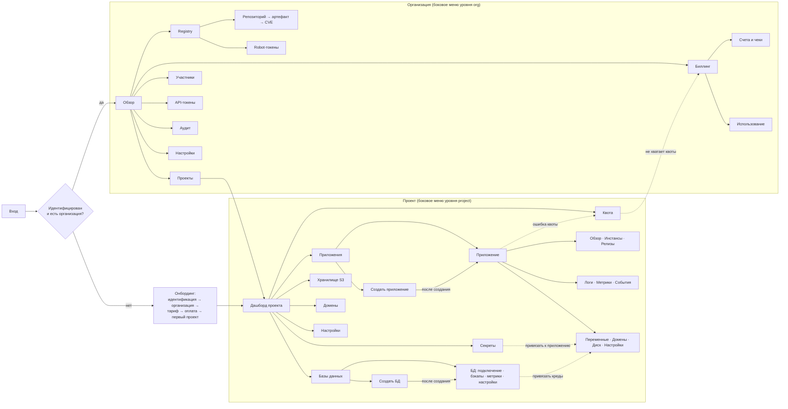

# 14. Web-консоль (frontend) и админка платформы

> Статус: черновик дизайна. Раздел опирается на исследование `research/10-frontend-ui-ux.md` и зафиксированные решения D1–D15.

## TL;DR

- **Стек.** React 19.2 + TypeScript + Vite 8, чистый SPA, встроенный в Go-бинарь `paas-api` через `embed.FS`: один образ, одна версия фронта и API, один откат. Next.js отвергнут: второй серверный рантайм, свой класс CVE, npm-код на сервере. Прод-зависимостей 13, потолок 20 (§1).
- **BFF и сессии.** `paas-api` — единственный конфиденциальный OIDC-клиент клиентского Zitadel. В браузере ни одного токена, только `__Host-sid`. CSRF закрывают `Sec-Fetch-Site` и double-submit. Опасные действия требуют свежего входа, необратимые — intent-подтверждения (§2).
- **Заголовки.** Строгий CSP без инлайн-скриптов, `connect-src 'self'` против эксфильтрации, Trusted Types с одной политикой, COOP/COEP/CORP. Ставит Go, покрыто тестом (§2.6, §14).
- **Информационная архитектура.** URL повторяет Organization → Project → ресурс, ссылкой можно поделиться. Слово «Kubernetes» пользователь не видит. Права приходят с сервера в `/me`; фронт кнопки не прячет, а выключает с объяснением (§3–§5).
- **Реальное время — SSE для всего:** статусы и живые логи (R-LOGS). WebSocket появится только с exec в фазе 2. Событие — сигнал инвалидировать кэш TanStack Query, авторитетен REST. Один поток на браузер: вкладка-лидер через Web Locks (§9.2, §10).
- **Прогресс деплоя.** Шесть шагов: сохранено → закоммичено → принято платформой → образ скачивается → запущено → готово. Шаги считает сервер по фактам (`sync.revision == SHA`, rollout завершён). Процентов нет, есть время и причина задержки. Тот же компонент показывает создание проекта, БД, выпуск сертификата, применение секрета (§7).
- **Ошибки.** Диагнозы рендерит сервер на языке пользователя: таблица [07](07-svc-compute.md) §13.1 плюс 28 правил для доменов, БД, секретов, registry, биллинга и сети — всего 60. У каждой карточки одна кнопка исправления. Ошибки платформы не перекладываются на клиента (§8).
- **Логи.** Живой хвост через SSE с подхватом подов новой выкатки и дедупом при переподключении, кольцевой буфер 50 000 строк, виртуализация, пауза на клиенте. История — Loki за 7 дней, скачивание обычной навигацией (§9).
- **Манифест.** По умолчанию — человекочитаемый контракт: что изменится и что платформа добавит всегда (список собирается из тех же констант, что `Harden()`). Сырой YAML — только чтение, под кнопкой. Редактора нет (§11).
- **Экраны.** Вайрфреймы дашборда проекта, создания приложения, детали с прогрессом выкатки, доменов с инструкцией DNS, создания БД, биллинга и очереди абьюза (§6). Квота видна прямо в формах. Исходящий IP показывается с честной пометкой «общий».
- **Дизайн-система.** shadcn/ui + Radix + Tailwind v4: статический CSS — единственный вариант под наш CSP; runtime CSS-in-JS (MUI, Ant, Chakra) отпадает. Статус = значок + текст + цвет. Цель — WCAG 2.2 AA (§12).
- **i18n.** В MVP только русский, английский вторым релизом. Свой модуль на `Intl` ≈ 150 строк, забытую кириллицу вне словаря ловит линтер (§13).
- **Supply-chain.** `ignore-scripts`, минимальный возраст версии 7 дней, сборка без сети, SBOM, еженедельные обновления без автомержа (§14.4).
- **Производительность.** Начальный JS ≤ 170 КБ brotli, LCP ≤ 2.5 с. Ассеты двух прошлых релизов лежат в образе, чтобы раскат не давал 404 на чанках. На телефоне — чтение и безопасные действия: перезапуск, откат, оплата (§15).
- **Админка** — отдельный контур: свой хост, бинарь `paas-admin`, staff-Zitadel, только VPN. Действия персонала идут через ту же очередь, с причиной, step-up и видимостью для клиента. «Войти как клиент» нет (§16).
- **Владельцу решить** (§18): домены (до запуска), автооткат (документы 04/07 и 06 расходятся), политика MFA. **Согласовать с соседними документами** (§19.2): SSE вместо WebSocket для логов в 04, четвёртый бинарь, хранение манифестов ревизий, тариф на проект в 05, размер `XS` и политика UID в 07.

## 1. Стек и архитектурное решение (BFF)

### 1.1 Решение одной таблицей

| Слой | Решение | Отвергнуто | Почему |
|---|---|---|---|
| Фреймворк | **React 19.2 + TypeScript + Vite 8 (Rolldown)**, чистый SPA | Next.js 16 (App Router, RSC) | SSR и SEO за логином не нужны. Next добавляет второй серверный рантайм (Node) рядом с Go: ещё один объект патчинга, свой класс уязвимостей «обход middleware» (CVE-2025-29927), кэш-семантику, которую в консоли всё равно пришлось бы выключать, и npm-зависимости, исполняемые **на сервере** |
| BFF | **`paas-api` (Go) — единственный BFF и конфиденциальный OIDC-клиент** | Next.js как BFF перед Go; SPA как публичный OIDC-клиент с токенами в памяти | RFC 10017 (BCP) рекомендует BFF. В браузере нет ни одного токена. Silent refresh через скрытый iframe зависит от third-party cookies, которые Safari и Chrome режут |
| Раздача | SPA собирается в `web/dist` и **встраивается в бинарь `paas-api` через `embed.FS`** ([04](04-control-plane-go.md) §2) | nginx или отдельный Deployment со статикой | Один образ = фронт и API одной версии. Заголовки безопасности ставит тот же код, тот же тест. Откат = откат одного образа |
| Контракт | `api/openapi.yaml`, **spec-first** (D13, `oapi-codegen` на стороне Go). TS: `openapi-typescript` (типы, dev) + `openapi-fetch` (рантайм ≈ 6 KB) | `huma` code-first (так предлагало исследование); ConnectRPC | D13 фиксирует spec-first, и для фронта это лучше: контракт ревьюится до кода, TS-типы генерируются из того же файла, что Go-интерфейс |
| Роутер | **TanStack Router** с деревом маршрутов в коде (без плагина-кодогенератора) | React Router v7 | Типизированные path- и **search-параметры**. Фильтры логов, окно метрик, пагинация живут в URL, и опечатка в параметре ловится компилятором |
| Серверное состояние | **TanStack Query v5** (5.x; версии 6 для React нет) | Redux/RTK Query, SWR | Инвалидация по ключам ложится на SSE-события (§10). Глобального клиентского стора нет вообще |
| Реальное время | **SSE (нативный `EventSource`) и для статусов, и для живых логов** (решение R-LOGS; уточняет D13 и [04](04-control-plane-go.md) §13, где для логов назван WebSocket). WebSocket появится только с exec в фазе 2 | WebSocket для логов; long-polling | SSE сам переподключается и шлёт `Last-Event-ID`, проходит через bastion и Traefik как обычный HTTP, cookie и CSRF-модель у него те же, что у REST. Обратный канал логам не нужен: пауза делается на клиенте, смена фильтра переоткрывает стрим (§9.2) |
| Формы | `react-hook-form`; клиентская валидация генерируется из `pattern`/`min`/`max` спеки собственным скриптом; **авторитет — сервер** (RFC 9457 `errors[].pointer` → поле формы) | Zod-схемы, написанные руками | Вторая копия правил валидации гарантированно разойдётся с сервером |
| UI-кит | **shadcn/ui (код в репо) + Radix-примитивы + Tailwind v4** (§12) | MUI, Ant Design, Mantine | Код компонентов наш, рантайм-зависимости от чужой дизайн-системы нет, поверхность supply-chain минимальна |
| Графики | **uPlot** (≈ 50 KB, 0 зависимостей, canvas) | Recharts (дерево d3, SVG тормозит на 10k точек), ECharts (≈ 1 MB) | Метрики за 7 дней с шагом 1 мин — это 10k точек на серию |
| Виртуализация | **react-virtuoso** — и для логов, и для длинных таблиц | `@tanstack/react-virtual` дополнительно | Строки переменной высоты из коробки (переносы в логах). Одна зависимость на оба сценария |
| i18n | **Свой модуль ≈ 150 строк на `Intl.*`** с типизированными ключами (§13) | i18next + react-i18next | `Intl.PluralRules`, `NumberFormat`, `DateTimeFormat`, `RelativeTimeFormat` покрывают всё. Правило «не пишется за 200 строк» не выполнено, поэтому зависимость не берём |
| Даты, числа, валюта | `Intl` | date-fns, dayjs, moment | То же |
| Ошибки фронта | свой `POST /api/v1/_client-errors` → Loki (с rate-limit) | Sentry SaaS | `connect-src 'self'` запрещает внешние эндпоинты, и это правильно (§14) |
| Пакетный менеджер | pnpm, `ignore-scripts=true`, lockfile в CI (`--frozen-lockfile`) | npm, yarn | §14.4 |

### 1.2 Почему SPA, а не Next.js

Next.js решает задачу «фронту нужен серверный слой». Здесь серверный слой обязателен (требование «back — Go») и уже спроектирован как BFF ([04](04-control-plane-go.md) §7.1). Next.js добавил бы второй серверный слой без нового качества, но с новым рантаймом, новым классом CVE и новым деревом npm-зависимостей, которые исполняются в проде. Все четыре Go-продукта с веб-консолью, которые владелец уже эксплуатирует в этом кластере (ArgoCD, Grafana, Kargo, Portainer), устроены одинаково: Go-бинарь отдаёт React-SPA из встроенной ФС. Для инфраструктурной консоли это отраслевой консенсус.

**Когда пересмотреть.** Появится публичный индексируемый каталог шаблонов или маркетинговый сайт — это **отдельный** статический сайт (Astro или Next в режиме `output: export`) на отдельном хосте. Консоль остаётся SPA. Разделять публичный и приватный контур полезно и само по себе.

### 1.3 Как SPA живёт внутри `paas-api`

| Путь | Что отдаётся | `Cache-Control` | Заголовки |
|---|---|---|---|
| `/assets/*` | хэшированные JS/CSS/шрифты из `embed.FS`; при `Accept-Encoding: br` отдаётся заранее сжатый `*.br` (сжатие на билде, не на лету) | `public, max-age=31536000, immutable` | набор для статики (§2.6) |
| `/api/v1/*` | JSON и SSE (WebSocket — только exec, фаза 2) | `no-store` | урезанный набор для API (§2.6) |
| `/auth/*` | BFF-поток OIDC (302-редиректы) | `no-store` | — |
| `/_fallback` | статическая HTML-страница **без единого JS**: «консоль недоступна», ссылка на внешнюю статус-страницу | `no-store` | полный CSP |
| всё остальное без расширения | `index.html` (SPA-fallback, код 200) | `no-store` | полный CSP (§2.6) |
| неизвестный путь с расширением | 404 | — | — |

```go
// internal/platform/httpx/static.go
func SPA(dist fs.FS, build string) http.Handler {
	index, _ := fs.ReadFile(dist, "index.html") // инвариант билда: файл есть, иначе паника в тесте
	return http.HandlerFunc(func(w http.ResponseWriter, r *http.Request) {
		p := strings.TrimPrefix(path.Clean(r.URL.Path), "/")
		w.Header().Set("X-Console-Build", build) // SPA сверяет со своей сборкой (§15.3)
		if strings.HasPrefix(p, "assets/") {
			serveAsset(w, r, dist, p) // .br при наличии, immutable-кэш, 404 без fallback
			return
		}
		if path.Ext(p) != "" {
			http.NotFound(w, r)
			return
		}
		w.Header().Set("Cache-Control", "no-store")
		w.Header().Set("Content-Type", "text/html; charset=utf-8")
		_, _ = w.Write(index)
	})
}
```

`/api/*` в SPA-fallback не попадает никогда: маршрутизатор регистрирует `/api/`, `/auth/`, `/webhooks/` раньше, неизвестный API-маршрут отвечает problem+json 404. `index.html` не кэшируется, поэтому после релиза вкладка подтягивает новую сборку при первой навигации с перезагрузкой. Как быть с уже открытыми вкладками, описано в §15.3.

### 1.4 Итоговый список прод-зависимостей

Прод-зависимость — это код, который попадает в бандл и исполняется в браузере с сессией, дающей доступ к чужим продакшенам. Список закрытый. Добавление новой зависимости идёт через запись в `web/DEPENDENCIES.md`: зачем она нужна и почему это нельзя написать самим за 200 строк.

| Пакет | Зачем | Замена, если исчезнет |
|---|---|---|
| `react`, `react-dom` | рантайм | — |
| `@tanstack/react-router` | маршрутизация | React Router |
| `@tanstack/react-query` | серверное состояние | — |
| `openapi-fetch` | типизированный fetch по спеке | 100 строк своего кода |
| `radix-ui` (зонтичный пакет примитивов) | доступные диалоги, меню, поповеры, табы | — |
| `class-variance-authority`, `clsx`, `tailwind-merge` | варианты стилей shadcn | 50 строк своего кода |
| `lucide-react` | иконки (tree-shaking) | SVG-спрайт |
| `react-hook-form` | формы | — |
| `react-virtuoso` | логи и длинные таблицы | `@tanstack/react-virtual` |
| `uplot` | графики метрик | — |

Итого **13 пакетов**, потолок **20**. Dev-зависимости (Vite, TypeScript, Tailwind, `openapi-typescript`, Vitest, Testing Library, Playwright, ESLint, MSW) в бандл не попадают, но исполняются на машине сборки, поэтому правила §14.4 касаются и их.

## 2. Аутентификация, сессии, CSRF, CSP

Серверная сторона (эндпоинты `/auth/*`, хранение сессий, step-up с intent-proof, API-токены) описана в [04](04-control-plane-go.md) §7. Здесь то, что видит и делает браузер.

### 2.1 Поток входа

```mermaid
sequenceDiagram
    autonumber
    participant B as Браузер (SPA)
    participant A as paas-api (BFF)
    participant Z as Zitadel (клиентский инстанс)
    B->>A: GET /api/v1/me
    A-->>B: 401 {code: unauthenticated}
    B->>A: навигация (не fetch) GET /auth/login?return_to=/orgs/…/apps/…
    A-->>B: 302 → Zitadel authorize (state, nonce, PKCE S256)
    B->>Z: пароль / passkey + MFA (экраны Zitadel)
    Z-->>B: 302 → /auth/callback?code&state
    B->>A: GET /auth/callback
    A->>Z: обмен code + code_verifier + client_secret
    A-->>B: Set-Cookie __Host-sid; 302 → return_to
    B->>A: GET /api/v1/me → {user, orgs[], permissions, flags}
```

Что знает фронт: два состояния, `200` и `401`. Токенов, `state`, `code_verifier` в браузере нет. Логин запускается только навигацией. Через `fetch` редирект к IdP не работает, и `fetch` не должен пытаться.

### 2.2 Cookie и домены

```
Set-Cookie: __Host-sid=<32 байта crypto/rand, base64url>; Path=/; Secure; HttpOnly; SameSite=Lax
Set-Cookie: __Host-csrf=<HMAC(sid)>; Path=/; Secure; SameSite=Strict        # читается JS, §2.4
```

Сессионная cookie без `Expires`. `SameSite=Lax`, а не `Strict`: возврат из Zitadel — это top-level GET, и при `Strict` cookie на нём не придёт, логин зациклится. Префикс `__Host-` запрещает атрибут `Domain`, поэтому никакой поддомен не перезапишет cookie консоли.

| Хост | Что | Отношение к консоли |
|---|---|---|
| `console.<platform-domain>` | консоль и API (`paas-api`) | origin консоли |
| `auth.<platform-domain>` | Zitadel, клиентский виртуальный инстанс (D13) | same-site: доверенный, наш |
| `registry.<platform-domain>` | Harbor: протокол дистрибуции; портал только через VPN ([10](10-svc-registry-harbor.md) §2.3) | same-site, наш |
| `*.<apps-domain>` | приложения тенантов, `s3.<apps-domain>` | **cross-site**: отдельный регистрируемый домен ([01](01-architecture-overview.md) §6.2), позже в Public Suffix List |
| `admin.<staff-domain>` | админка владельца (§16) | другой хост, другой OIDC-клиент, только VPN |

Код тенанта никогда не исполняется на `<platform-domain>`. Поэтому `SameSite=Lax` работает против него всерьёз: запрос со страницы приложения клиента для консоли cross-site. Регистрировать оба домена нужно **до** запуска: этот выбор потом не исправить ([18](18-risks-and-owner-decisions.md)).

### 2.3 Сроки жизни, повторный вход, step-up

| Параметр | Значение | Где держится |
|---|---|---|
| Простой (idle) | 30 мин | `sessions` в Postgres ([04](04-control-plane-go.md) §7.1) |
| Абсолютный срок сессии консоли | 12 ч | там же |
| Сессия в Zitadel (SSO) | 7 дней ⚠️ настроить в клиентском инстансе | Zitadel |
| «Запомнить меня» | **нет** | — |

«Запомнить меня» заменяет SSO-сессия Zitadel. Когда сессия консоли истекает, повторный вход выглядит как два редиректа без ввода пароля, пока жива сессия IdP. Для опасных операций IdP всё равно спросит пароль и второй фактор (`prompt=login`, `max_age=0`). Своя долгоживущая remember-cookie с ротацией — лишний код и лишний класс уязвимостей.

**Потеря сессии не теряет работу.** Middleware клиента на `401` сохраняет черновики открытых форм в `sessionStorage` и уводит на `/auth/login?return_to=…`. Поля, помеченные в спеке `x-secret: true` (значения секретов, пароли), в черновик **не попадают никогда**.

**Step-up**: два вида, как в [04](04-control-plane-go.md) §7.1.

| Вид | Операции | UX |
|---|---|---|
| Свежий вход (`auth_time` ≤ 5 мин) | выпуск API-токена, выпуск robot-токена registry, смена платёжного метода, reveal секрета (окно 10 мин, [12](12-svc-secrets.md) §7.2) | ответ `401 {code: step_up_required}` → диалог «Подтвердите личность» → навигация на `/auth/stepup?return_to=…` → Zitadel с MFA → возврат, действие повторяется автоматически |
| Intent-proof (id_token привязан к конкретному действию) | удаление проекта, БД, бакета, организации; показ сгенерированных кредов; передача владения | `POST …/intents` → `{intent_id, confirm_url}` → навигация на `confirm_url` → Zitadel → возврат на `/intents/:id/complete`. Экран показывает, **что именно** подтверждено («Удалить базу `orders-db` в проекте `shop-prod`»), и одну кнопку «Выполнить» |

```ts
// src/lib/stepup.ts — повтор отложенной мутации после возврата из Zitadel
type Pending = { opKey: string; path: string; method: "POST" | "PATCH" | "DELETE"; body?: unknown; idem: string };

export function rememberPending(p: Pending) {
  // body без секретных полей (их вырезает сериализатор формы по x-secret), Idempotency-Key тот же:
  // повтор после step-up не создаст дубль, даже если первый запрос всё-таки дошёл
  sessionStorage.setItem("paas.pending", JSON.stringify(p));
}

export async function resumePending(api: Client) {
  const raw = sessionStorage.getItem("paas.pending");
  if (!raw) return;
  sessionStorage.removeItem("paas.pending"); // одноразово: повтор не должен зациклиться
  const p = JSON.parse(raw) as Pending;
  await api.request(p.method, p.path, { body: p.body, headers: { "Idempotency-Key": p.idem } });
}
```

### 2.4 CSRF

1. **`SameSite=Lax`** отсекает cross-site формы и `fetch`.
2. **Главный слой — `Sec-Fetch-Site`** на сервере: любой не-GET запрос с cookie-сессией проходит только при `same-origin`, при отсутствии заголовка сверяется `Origin` с origin консоли. Это закрывает и `same-site` запросы, например со страницы Harbor на `registry.<platform-domain>`.
3. **Double-submit** `__Host-csrf` → заголовок `X-CSRF-Token` на **всех** мутирующих запросах. Middleware `openapi-fetch` ставит его автоматически, так что единообразие ничего не стоит, а отдельный список «критичных операций» не рассинхронится.
4. **SSE-стримы** (статусы и логи) — это `GET`, слои 2 и 3 к ним не применяются. Чужой сайт не прочитает ответ (CORS нет), а сервер всё равно отклоняет стрим при `Sec-Fetch-Site: cross-site`. **WebSocket** появится только с exec (фаза 2) и обязан проверять `Origin` при upgrade (`OriginPatterns`, [04](04-control-plane-go.md) §13): cookie уходят и с чужих сайтов, иначе возможен Cross-Site WebSocket Hijacking.
5. Запросы с `Authorization: Bearer paas_…` (CI) cookie не несут, слои 2 и 3 к ним не применяются.
6. `GET` в спеке не имеет побочных эффектов. Линт спеки запрещает `GET` с `x-mutating: true`.

### 2.5 Выход и активные сессии

| Действие | Что происходит |
|---|---|
| «Выйти» | `POST /auth/logout` → сервер удаляет сессию, `204` + `Clear-Site-Data: "cache", "storage"`, SPA очищает кэш TanStack Query и уходит на `/` |
| «Выйти везде» | то же + RP-initiated logout в Zitadel (`end_session_endpoint`, `id_token_hint`) |
| Завершение сессии в Zitadel | back-channel logout → сервер удаляет все сессии этого `sid`/`sub`; открытая вкладка получит `401` на следующем запросе, SSE-стрим закроется |
| Профиль → «Сессии» | устройство (упрощённый User-Agent), IP до /24, время входа, «эта сессия», кнопка «завершить». Письмо о входе с нового устройства |

### 2.6 Заголовки безопасности (готовые)

Ставит Go (`internal/platform/httpx/securityheaders.go`), а не Traefik: CSP меняется вместе с фронтом, должен различаться для HTML и API и покрыт тестом `TestSecurityHeaders`. На Traefik остаются `vpn-only` для админки и грубый `rateLimit` ([04](04-control-plane-go.md) §14).

**HTML-документ (`index.html`, `/_fallback`):**

```
Content-Security-Policy: default-src 'none'; base-uri 'none'; object-src 'none';
  frame-ancestors 'none'; form-action 'self';
  script-src 'self';
  style-src-elem 'self' 'sha256-<хэш инлайн-скелетона из index.html>'; style-src-attr 'unsafe-inline';
  img-src 'self' data: blob:; font-src 'self'; connect-src 'self';
  worker-src 'self' blob:; manifest-src 'self'; media-src 'none';
  require-trusted-types-for 'script'; trusted-types paas;
  upgrade-insecure-requests; report-to csp
Content-Security-Policy-Report-Only: style-src 'self'; report-to csp
Reporting-Endpoints: csp="/api/v1/_csp-report"
Strict-Transport-Security: max-age=63072000; includeSubDomains
Cross-Origin-Opener-Policy: same-origin
Cross-Origin-Embedder-Policy: require-corp
Cross-Origin-Resource-Policy: same-origin
X-Content-Type-Options: nosniff
Referrer-Policy: same-origin
Permissions-Policy: camera=(), microphone=(), geolocation=(), payment=(), usb=(), serial=(), hid=(), browsing-topics=()
X-Frame-Options: DENY
```

**API (`/api/*`):**

```
Content-Type: application/json; charset=utf-8       # или application/problem+json, text/event-stream
Content-Security-Policy: default-src 'none'; frame-ancestors 'none'; sandbox
Cache-Control: no-store
X-Content-Type-Options: nosniff
Cross-Origin-Resource-Policy: same-origin
```

Отличия от исследования — упрощения, которые делают политику строже:

| Директива | Решение | Почему |
|---|---|---|
| `script-src 'self'` без хэшей и без `'strict-dynamic'` | в `index.html` **нет** инлайн-скриптов, только `<script type="module" src="/assets/…">` | `'strict-dynamic'` в CSP3-браузерах **отключает** `'self'`, и тогда корневой скрипт пришлось бы разрешать хэшем через SRI. Без инлайн-кода `'self'` достаточно: JSON API не исполняется как скрипт (`nosniff`), JSONP на нашем origin нет |
| `style-src-elem 'self'` + `style-src-attr 'unsafe-inline'` | блоки `<style>` запрещены, style-атрибуты разрешены. Параллельно строгий `style-src 'self'` в Report-Only | React пишет `style` через CSSOM (`el.style.x = …`), а CSP это не ограничивает. Если за 2 недели отчётов нарушений нет, переводим в enforce строгий вариант |
| `trusted-types paas` (одна политика) | DOMPurify и xterm в MVP не нужны: пользовательский HTML/markdown не рендерим, терминала нет (§14.2) | меньше политик — меньше мест, где можно пропустить HTML |
| HSTS без `preload` | заголовок ставится на хосте консоли | preload требует апекса и распространяется на весь `<platform-domain>`, включая хосты, которые не контролирует `paas-api`. Решение об этом — отдельно, после инвентаризации хостов |

## 3. Информационная архитектура: полное дерево экранов

Принципы:

1. **Иерархия в URL повторяет модель** Organization → Project → ресурсы (D2). Любой экран открывается по прямой ссылке, ссылку можно отправить коллеге.
2. **Слово «Kubernetes» пользователь не видит.** Под — «инстанс», Deployment — «приложение», namespace — «проект», ArgoCD sync — «применение». Термины k8s остаются только в read-only YAML (§11) и в тексте исходного сообщения внутри раскрываемой «детали» ошибки (§8).
3. **Registry — ресурс организации** (Harbor project на организацию, D7). Всё остальное — ресурсы проекта. **Тариф привязан к проекту** ([02](02-tenancy-and-isolation.md) §1.1), поэтому биллинг организации — это список подписок её проектов.
4. Идентификаторы в URL — серверные ID (`orgId`, `project_id` из 10 символов, `app_id`). Имена, которые вводит пользователь, в URL не попадают: их можно переименовать, а ссылка должна жить.

### 3.1 Дерево маршрутов

```
/                                       → последняя открытая организация или онбординг
/login                                  экран «Войти» (кнопка ведёт на /auth/login)
/onboarding/
  identity                              идентификация по 406-ФЗ: карта РФ-банка | Госуслуги | телефон РФ (D11)
  organization                          плательщик: физлицо | ИП | юрлицо, реквизиты
  plan                                  тариф первого проекта (сравнение ступеней)
  payment · payment/return              redirect в hosted checkout → ожидание вебхука
  first-project                         имя проекта → прогресс «Проект создаётся…»
  first-app                             мастер первого приложения (можно пропустить)
/orgs/:orgId/
  overview                              дашборд организации: проекты, проблемы, оплата
  projects · projects/new
  members                               участники, приглашения, роли
  registry/                             Harbor-проект организации (D7)
    repositories/:repo                  теги и артефакты
    repositories/:repo/artifacts/:digest  CVE, SBOM, где задеплоен
    tokens                              robot-токены (push для CI)
    settings                            retention, политика уязвимостей
  billing/                              подписки проектов, аддоны, способ оплаты
    invoices                            счета, чеки 54-ФЗ, акты
    usage                               квоты всех проектов на одном экране
  tokens                                API-токены организации (сервисные)
  audit                                 аудит-лог организации
  settings                              название, реквизиты, экспорт данных, удаление
/orgs/:orgId/projects/:projectId/
  (index)                               дашборд проекта
  apps · apps/new
  apps/:appId/
    (index)                             обзор: статус, текущий релиз, адреса, активный деплой
    instances                           инстансы: статус, готовность, рестарты, возраст
    releases · releases/:seq            история, diff, откат, манифесты read-only (§11)
    logs                                живой хвост + история (7 дней)
    metrics                             CPU, троттлинг, RAM до OOM, рестарты, сеть, диск, HTTP
    events                              диагностированные события (§8)
    env                                 переменные + привязки секретов
    domains                             платформенный адрес + свои домены приложения
    volume                              постоянный диск: размер, заполненность
    settings                            размер, реплики, health, команда, порт, каталоги для записи, удаление
  databases · databases/new
  databases/:dbId/
    (index)                             статус, топология, версия, размер
    connection                          адреса, креды (reveal с intent), строки подключения, привязки к приложениям
    backups                             бэкапы, окно PITR, «восстановить в новую БД»
    metrics · settings                  параметры из allow-list, внешний доступ, pooler, ротация пароля, удаление
  storage/                              S3 (только при зелёной матрице совместимости, [11](11-svc-object-storage-s3.md))
    buckets/:bucketId · keys
  secrets · secrets/:name               ключи (маскированы), версии, привязки, reveal
  domains                               все домены проекта и их статусы
  quota                                 использование квоты проекта
  settings                              название, тариф, приостановка, удаление проекта
/account/
  profile · security · sessions · tokens · notifications
/intents/:intentId/complete             подтверждение необратимого действия после step-up (§2.3)
```

### 3.2 Экраны, права, реальное время

Права — матрица [04](04-control-plane-go.md) §7.3. Колонка «Живое» показывает, какие экраны подписаны на SSE (§10). Статус MVP сверен с [17](17-roadmap.md) §2.

| Экран | Для чего | Право на просмотр / действие | Живое | Этап |
|---|---|---|---|---|
| Онбординг: идентификация, организация, тариф, оплата | без идентификации ни одного ресурса (FR-ACC-03) | — | статус платежа | MVP |
| Дашборд организации | проекты со статусами, «требует внимания», статус оплаты | `org.read` | ✓ | MVP |
| Проекты, создание проекта | создание = namespace через provisioner, прогресс 2–10 с | `project.read` / `project.write` | ✓ | MVP |
| Участники и приглашения | пригласить по email, сменить роль; owner назначает только owner | `org.read` / `member.invite`, `member.role` | — | MVP |
| Registry: обзор, репозитории, артефакты, CVE, robot-токены | [10](10-svc-registry-harbor.md) §10 | `registry.read` / `registry.write` | скан | MVP |
| Биллинг: подписки, аддоны, способ оплаты, счета | §6.6 | `billing.read` / `billing.write` | статус платежа | MVP |
| API-токены организации | сервисные токены для CI, показ один раз | `token.create_org` | — | MVP |
| Аудит-лог | кто, что, когда, откуда. Фильтры, экспорт CSV | `audit.read` | — | MVP |
| Настройки организации | реквизиты, экспорт данных (FR-ACC-08), удаление (intent) | `org.read` / `org.delete` | — | MVP |
| Дашборд проекта | §6.1 | `project.read` | ✓ | MVP |
| Приложения: список, создание | §6.2 | `app.read` / `app.write` | ✓ | MVP |
| Приложение: обзор, инстансы, релизы, события | §6.3, §7, §8 | `app.read` / `app.deploy` | ✓ | MVP |
| Приложение: логи | §9 | `app.logs` | SSE | MVP |
| Приложение: метрики | [07](07-svc-compute.md) §12.2 | `app.read` | опрос 30 с | MVP |
| Приложение: переменные и привязки секретов | env сохраняется релизом через git (D3) | `app.read` / `app.write` | — | MVP |
| Приложение: домены | §6.4 | `domain.read` / `domain.write` | ✓ | MVP |
| Приложение: диск | заполненность по kubelet ([07](07-svc-compute.md) §12.2), только рост размера | `app.read` / `app.write` | — | MVP |
| Базы данных: список, создание, деталь, бэкапы, PITR | §6.5, [09](09-svc-databases.md) | `db.read` / `db.write`, `db.reveal`, `db.delete` | ✓ | MVP |
| Хранилище S3 | [11](11-svc-object-storage-s3.md) §1. **Браузера объектов нет** | `storage.read` / `storage.write`, `storage.reveal` | — | MVP⚠️ |
| Секреты | [12](12-svc-secrets.md) §7 | `secret.read_meta` / `secret.write`, reveal со step-up | статус применения | MVP |
| Квота проекта | CPU, RAM, диск, поды, домены, БД: занято и лимит | `project.read` | ✓ | MVP |
| Настройки проекта | тариф проекта, переименование, удаление (intent) | `project.read` / `project.write`, `project.delete` | — | MVP |
| Профиль, безопасность, сессии, личные токены | MFA и passkeys меняются в интерфейсе Zitadel (ссылка) | свой аккаунт | — | MVP |
| Cron и one-off jobs, HPA, scale-to-zero, NATS, выделенный IP, exec | [17](17-roadmap.md) §3 | — | — | Ф2 |

**Браузера объектов S3 в MVP нет.** Он заставил бы `paas-api` проксировать тела объектов (трафик и память интернет-facing процесса) и упирался бы в сломанные вызовы SeaweedFS ([11](11-svc-object-storage-s3.md) §5.1). Пользователь работает своими S3-клиентами. Консоль даёт endpoint, ключи и готовые конфиги для aws-cli, rclone и boto3 из матрицы совместимости. Ф2: список объектов только для чтения через backend.

### 3.3 Глобальные состояния и баннеры

| Состояние | Где видно | Что можно делать |
|---|---|---|
| Проект `provisioning` | карточка проекта со спиннером, шаги провижининга | ничего, обычно 2–10 с |
| Организация в grace (неоплата, D10) | жёлтый баннер на всех страницах: «Платёж не прошёл. Через N дн. проекты будут приостановлены» + кнопка «Оплатить» | всё |
| Проект `suspended` | красный баннер, приложения показаны как «приостановлено» | чтение, экспорт, оплата. Деплой запрещён |
| Организация заморожена администратором (abuse) | полноэкранная заглушка: причина по шаблону, контакт abuse@ | экспорт данных, переписка |
| Окно обслуживания | синий баннер из админки (§16) | всё |
| Нет связи с живыми обновлениями | маленький индикатор в шапке (§10.4) | всё, данные обновляются опросом |

## 4. Карта навигации (mermaid)



**Каркас экрана.** Шапка: переключатель организации, переключатель проекта, центр уведомлений, индикатор живых обновлений, меню профиля. Слева контекстное меню текущего уровня: организация или проект. Над контентом хлебные крошки `Организация / Проект / Приложение / Вкладка`. Вкладки деталей — это маршруты, а не локальное состояние: `Назад` в браузере работает, ссылку на вкладку «Логи» с фильтром можно отправить.

**Переходы по ошибке — часть навигации.** Ошибка квоты ведёт на «Квоту» и оттуда на «Биллинг». Ошибка секрета ведёт на секрет. Ошибка домена ведёт на инструкцию DNS. Каждая карточка ошибки (§8) несёт одну кнопку следующего шага.

**Командная палитра (⌘K)** — Ф2: переход к приложению или БД по имени. В MVP её заменяет поиск в списках.

## 5. Модель прав в UI (роли организации и проекта)

### 5.1 Откуда фронт знает права

`GET /api/v1/me` возвращает членства с **уже вычисленными** правами: `{orgs: [{id, name, role, permissions: ["app.read", "app.deploy", …]}], flags: {…}}`. Матрица роль → права живёт только на сервере ([04](04-control-plane-go.md) §7.3). Фронт её не дублирует, иначе два места разойдутся. Смена роли прилетает SSE-событием `member.changed`, по нему `/me` перечитывается.

```tsx
// src/auth/can.tsx
export function useCan(perm: Permission): boolean {
  const { orgId } = useParams({ strict: false });
  const me = useMe();                          // TanStack Query, staleTime 60 с, инвалидация по SSE
  return !!me.data?.orgs.find((o) => o.id === orgId)?.permissions.includes(perm);
}

// Кнопка без права не прячется, а выключается с объяснением: пользователь узнаёт, что действие
// существует и у кого его просить. Прячутся только целые разделы без права на чтение.
export function Guarded({ perm, children }: { perm: Permission; children: ReactElement }) {
  const ok = useCan(perm);
  return ok ? children : (
    <Tooltip content={t("perm.required", { role: minimalRoleFor(perm) })}>
      <span>{cloneElement(children, { disabled: true, "aria-disabled": true })}</span>
    </Tooltip>
  );
}
```

Правило: **проверки на фронте — это UX, не безопасность.** Кнопка, которую фронт выключил, на сервере всё равно защищена `x-permission`. Кнопка, которую фронт по ошибке показал, вернёт `403`.

| Ответ сервера | Что показывает UI |
|---|---|
| `401 unauthenticated` | черновики → `sessionStorage`, навигация на логин (§2.3) |
| `401 step_up_required` | диалог «Подтвердите личность» (§2.3) |
| `403 forbidden` | тост «Недостаточно прав: нужна роль Admin» (из `problem.detail`), фронт перечитывает `/me` |
| `404` на чужой или удалённый объект | страница «Не найдено или нет доступа». Сервер намеренно не различает эти случаи ([04](04-control-plane-go.md) §6.4) |

### 5.2 Разрушительные действия

Одна компонента `ConfirmDestructive` на все удаления, без исключений:

1. Заголовок называет объект полностью: «Удалить базу данных `orders-db` в проекте `shop-prod`?»
2. Список последствий **от сервера** (`GET …/delete-preview`): что удалится, что сохранится и сколько, что сломается («приложения `api`, `worker` потеряют `DATABASE_URL`»).
3. Ввод имени объекта для подтверждения. Кнопка активна только при точном совпадении.
4. Для необратимых действий intent-поток со step-up (§2.3). Кнопка «Удалить» ведёт на Zitadel, а не выполняет действие сразу.
5. После подтверждения — прогресс операции по SSE. Удаление асинхронное (финализаторы, git, provisioner), мгновенного «готово» не бывает.

### 5.3 Приглашения и токены

- **Приглашение**: email + роль. Приглашённый регистрируется в клиентском Zitadel и после входа попадает сразу в организацию. Идентификация по 406-ФЗ обязательна для плательщика (владелец организации). Нужна ли она каждому участнику, решает юрист ([16](16-legal-ru.md)). В UI это флаг `identity_required_for_members`, по умолчанию выключен.
- **API-токен**: имя, срок (30 / 90 / 365, по умолчанию 90), скоупы галочками (подмножество прав выпускающего), опционально ограничение проектами. Значение показывается **один раз** в модалке с кнопкой «копировать» и сниппетами для GitLab CI и GitHub Actions. Закрыть модалку можно только после отметки «Я сохранил токен». В списке видны префикс из 12 символов, срок, `last_used_at`, автор. Выпуск требует step-up.

## 6. Ключевые экраны: ASCII-вайрфреймы

Обозначения: `[Кнопка]`, `(•)` радио, `[x]` чекбокс, `▾` выпадающий список. Статусы всегда рисуются значком **и** текстом (§12.3): `●` работает, `◐` в процессе, `○` остановлено, `✕` ошибка, `!` требует внимания. `<apps-domain>` сокращён до `<apps>`. Идентификаторы условные: проект `k3f9x2m7qa`, приложение `a8f3k2m9x1`.

Все цифры тарифов, размеров и лимитов фронт **получает от API** (`GET /api/v1/sizes`, `GET …/quota`, `GET /api/v1/plans`) и сам не хранит. Сетка размеров — данные платформы ([07](07-svc-compute.md) §3.1), тарифы — [13](13-billing-and-quotas.md) §2.

### 6.1 Дашборд проекта (`/orgs/:orgId/projects/:projectId`)

```text
┌──────────────────────────────────────────────────────────────────────────────────────────────┐
│ PaaS   Организация: Acme ▾   Проект: shop-prod ▾           ● Живые   Уведомления (3)  Иван ▾ │
├───────────────┬──────────────────────────────────────────────────────────────────────────────┤
│ ▣ Обзор       │ Acme / shop-prod                                                             │
│ ▢ Приложения  │ Тариф Standard · следующее списание 12 окт                                   │
│ ▢ Базы данных │ Исходящий IP 203.0.113.40 (общий для клиентов платформы) · порт 25 закрыт  ⓘ │
│ ▢ Хранилище   │                                                                              │
│ ▢ Секреты     │ ┌ Требует внимания (2) ─────────────────────────────────────────────────────┐│
│ ▢ Домены      │ │ ✕ api    Релиз 43 не запустился: не хватило памяти (512 МБ)     [Открыть] ││
│ ▢ Квота       │ │ ! shop.example.com  Ждём TXT-запись · заявка истекает через 68 ч [Инстр.] ││
│ ▢ Настройки   │ └───────────────────────────────────────────────────────────────────────────┘│
│               │ Приложения                                            [+ Создать приложение] │
│               │  ● api     web     M ×2  релиз 42  2/2 готово  api-k3f9x2m7qa.<apps>       ⋯ │
│               │  ◐ worker  worker  S ×1  релиз 12 → 13 · образ скачивается                 ⋯ │
│               │  ○ admin   web     S ×1  остановлено                                       ⋯ │
│               │ Базы данных                                              [+ Создать базу]    │
│               │  ● orders-db  Postgres 17 · 1 узел · db-s   6.1 из 10 ГБ   бэкап 03:12 ✓   ⋯ │
│               │ Квота тарифа                                                    [Подробнее]  │
│               │  RAM   ███████████░░░░  1.5 из 2 ГБ      CPU  ██████░░░░  0.6 из 1 vCPU      │
│               │  Диск  ████░░░░░░░░░░░  6 из 20 ГБ       Приложений 3 из 10 · БД 1 из 1      │
│               │ Последние события                                           [Все события]    │
│               │  12:04  api        Релиз 43 не запустился → работает релиз 42 (Иван)         │
│               │  11:58  app-config Секрет v7 применён к 2 приложениям                        │
└───────────────┴──────────────────────────────────────────────────────────────────────────────┘
```

- Блок **«Требует внимания»** стоит первым. Это ошибки и незавершённые действия пользователя, каждая с одной кнопкой следующего шага (§8.3). Пустой блок не рисуется.
- Живое (SSE, §10): статусы приложений и БД, прогресс выкаток, квота, лента событий. Строка приложения обновляется точечно, без перезагрузки списка.
- **Исходящий IP.** Весь egress тенантов идёт через Cilium Egress Gateway на отдельный публичный IP ([01](01-architecture-overview.md) §6.1). Клиенту он нужен для allowlist'ов внешних API (платёжные шлюзы, партнёрские сервисы). Подсказка `ⓘ` честно говорит: IP **общий** для всех клиентов, поэтому allowlist по нему не отличит вас от соседа. Выделенный egress-IP — кандидат в платный аддон фазы 2. Там же сказано, что порт 25 закрыт и что на trial исходящие соединения разрешены только на 80/443 ([13](13-billing-and-quotas.md) §2.1).
- Пустой проект показывает не пустые таблицы, а `EmptyState`: «Запустите первое приложение: образ → размер → готово» с кнопкой и ссылкой на памятку «как подготовить образ» ([07](07-svc-compute.md) §14.3).

### 6.2 Создание приложения (`apps/new`)

Одна страница с секциями, а не пошаговый мастер: мастер прячет, что будет запущено, и мешает вернуться к полю. Справа — живая карточка «Что будет запущено» (человекочитаемый контракт, §11).

```text
┌ Acme / shop-prod / Приложения / Новое ─────────────────────────────────────────────────────────┐
│ ┌ 1. Образ ─────────────────────────────────────────────┐ ┌ Что будет запущено ──────────────┐ │
│ │ Образ [ registry.<platform>/o-acme/api:1.4.2       ]  │ │ api · web · публичное            │ │
│ │   ✓ linux/amd64 · 84 МБ · sha256:9c1e…                │ │ Образ   …/api:1.4.2 (digest при  │ │
│ │   ! USER root → запустим от UID 10001. Если прило-    │ │         выкатке)                 │ │
│ │     жение пишет в свои каталоги, добавьте их ниже.    │ │ Размер  M · 512 МБ · CPU 0.25–1  │ │
│ │   ✓ EXPOSE 8080 → порт подставлен                     │ │ Реплик  2                        │ │
│ │ Тип  (•) web  ( ) worker        Имя [ api          ]  │ │ Адрес   api-k3f9x2m7qa.<apps>    │ │
│ ├ 2. Размер и реплики ──────────────────────────────────┤ │ Переменных 4 · секретов 1        │ │
│ │  ( ) S   256 МБ · CPU 0.125 гарантия, до 0.5          │ │ Платформа добавит всегда:        │ │
│ │  (•) M   512 МБ · CPU 0.25 гарантия, до 1             │ │  · запуск не от root (UID 10001) │ │
│ │  ( ) L   1 ГБ   · CPU 0.5 гарантия, до 1.5            │ │  · ФС только для чтения, кроме   │ │
│ │  ( ) XL  нужен тариф Pro                  [Сравнить]  │ │    /tmp и каталогов для записи   │ │
│ │  Реплик [ 2 ]   Квота после создания:                 │ │  · без доступа к API кластера    │ │
│ │  RAM 1.0 → 2.0 из 2 ГБ ✓   CPU 0.35 → 0.85 из 1 ✓     │ │  · изоляция user namespace       │ │
│ ├ 3. Переменные и секреты ──────────────────────────────┤ │  · исходящий трафик с IP плат-   │ │
│ │  LOG_LEVEL      [ info            ]              [✕]  │ │    формы, порт 25 закрыт         │ │
│ │  DATABASE_URL   ← секрет orders-db / uri ▾       [✕]  │ │  · лимиты CPU, памяти, диска     │ │
│ │  [+ переменная] [+ из секрета] [Вставить .env]        │ │ [Показать YAML]                  │ │
│ ├ 4. Сеть и проверка здоровья ──────────────────────────┤ └──────────────────────────────────┘ │
│ │  Порт [ 8080 ]  Протокол (•) HTTP ( ) gRPC (h2c)  [x] Публичное                            │ │
│ │  Проверка  (•) HTTP GET [ /healthz ]  ( ) TCP-порт                                         │ │
│ ├ 5. Дополнительно ▸  команда · каталоги для записи · постоянный диск · время остановки     │ │
│ └────────────────────────────────────────────────────────────────────────────────────────────┘ │
│                                                            [Отмена]   [Создать и выкатить]    │
└────────────────────────────────────────────────────────────────────────────────────────────────┘
```

- **Проверка образа** запускается после ввода ссылки (`POST …/images:inspect`, [07](07-svc-compute.md) §14.1) и показывает блоки и предупреждения до деплоя. Тексты про UID следуют решению R-UID: числовой не-root `USER` ≤ 65535 из образа сохраняется («запустим от UID 101, как в образе»), `root`, `0` или имя (`node`, `nginx`) превращаются в UID 10001 с предупреждением. `runAsNonRoot: true` всегда. Для известных образов (`nginx`, `httpd`, `node` с `npm install` на старте) подсказка из [07](07-svc-compute.md) §14.2 предлагает готовое исправление: добавить каталог для записи или взять unprivileged-вариант образа.
- **Размеры**: строки недоступного тарифу размера видны, но выключены, с кнопкой сравнения тарифов. Цифры — из `GET /api/v1/sizes`. Память показывается одним числом: она одновременно гарантия и потолок (R-QUOTA, request = limit). CPU показывается как «гарантия, до X» (limit ≤ 4 × request).
- **Квота «после создания»** считается на клиенте из `GET …/quota` для мгновенной обратной связи. Авторитет — сервер (`FitsProject`, [07](07-svc-compute.md) §3.5). При нехватке кнопка «Создать» выключена, рядом «Уменьшите реплики или размер» и «Сменить тариф».
- **Переменные.** «Вставить .env» разбирает вставленный текст в строки. Имена проверяются регуляркой из спеки, запрещённые (`PORT`, `PAAS_*`, `KUBERNETES_*`) подсвечиваются сразу. Значения секретов в эту форму не вводятся, только ссылка на секрет проекта ([12](12-svc-secrets.md) §7.4). Коллизия имён между привязками — ошибка на месте.
- **Постоянный диск** в «Дополнительно»: при включении реплик ровно 1, автомасштабирование недоступно, размер только растёт ([07](07-svc-compute.md) §2.2). Рядом честное предупреждение: бэкапа томов общего назначения в MVP нет (D12), для данных — managed-БД.
- Кнопка отправляет `POST …/apps` с `Idempotency-Key`, выпущенным при открытии формы. Двойной клик и повтор после step-up не создают дубль. После `202` переход на деталь приложения с открытым прогрессом выкатки (§7).

### 6.3 Деталь приложения с прогрессом деплоя (`apps/:appId`)

```text
┌ Acme / shop-prod / api ─────────────────────────────────────── [Перезапустить] [Выкатить ▾] ⋯ ┐
│ ● Работает · релиз 42 · 2/2 готово · https://api-k3f9x2m7qa.<apps>  [копировать]              │
│ Обзор │ Инстансы │ Релизы │ Логи │ Метрики │ События │ Переменные │ Домены │ Диск │ Настройки  │
│ ┌ Выкатка релиза 43 · api:1.4.3 · начал Иван в 12:03:41 ───────────────── идёт 00:23 ───────┐ │
│ │ ✓ Сохранено             12:03:41                                                           │ │
│ │ ✓ Закоммичено           12:03:42   c0ffee1 «deploy(api): 1.4.2 → 1.4.3»                    │ │
│ │ ✓ Принято платформой    12:03:45   ревизия c0ffee1 применена                               │ │
│ │ ◐ Образ скачивается     12:03:46   84 МБ · на 1 из 2 серверов                              │ │
│ │ ○ Запущено                                                                                 │ │
│ │ ○ Готово                           0 из 2 новых инстансов прошли проверку здоровья         │ │
│ │ Трафик обслуживает релиз 42, пока новые инстансы не готовы. Обычно ~20 с. [Логи выкатки]   │ │
│ └────────────────────────────────────────────────────────────────────────────────────────────┘ │
│ Инстансы   ● api-7d9c…-x2k4p  готов          релиз 42  рестартов 0  2 ч                      │
│            ● api-7d9c…-m9q1z  готов          релиз 42  рестартов 0  2 ч                      │
│            ◐ api-5f1a…-p0c3e  скачивает образ релиз 43                                       │
│ Ресурсы 1 ч  CPU ▁▂▃▂▁▂▅▃ 0.18 из 0.25 гарантии   RAM ▃▃▄▄▄▅ 310 из 512 МБ   рестартов 0     │
│ Адреса     api-k3f9x2m7qa.<apps> ✓ · shop.example.com ! ждём TXT                [Домены →]    │
└────────────────────────────────────────────────────────────────────────────────────────────────┘
```

Та же карточка после провала (вариант с автооткатом, [04](04-control-plane-go.md) §9.2 и [07](07-svc-compute.md) §5.4; расхождение с [06](06-delivery-pipeline.md) §11.3 — §7.4):

```text
│ ┌ Релиз 43 не запустился · 00:47 ───────────────────────────────────────────────────────────┐ │
│ │ ✕ Приложению не хватило памяти: лимит 512 МБ, процесс был остановлен                      │ │
│ │   api-5f1a…-p0c3e упал 3 раза за 40 с. Последние строки лога:                              │ │
│ │   │ FATAL ERROR: Reached heap limit Allocation failed - JavaScript heap out of memory      │ │
│ │   Что сделать: размер L или ограничьте кучу: NODE_OPTIONS=--max-old-space-size=384         │ │
│ │   [Сменить размер на L]   [Открыть логи]   [Подробнее ▾]                                   │ │
│ │ ↺ Платформа вернула релиз 42 (коммит 7aa01b2). Трафик не прерывался.                       │ │
│ └────────────────────────────────────────────────────────────────────────────────────────────┘ │
```

- Вкладки — маршруты. Карточка выкатки видна на **любой** вкладке, пока выкатка идёт, и сворачивается в строку после успеха.
- «Выкатить ▾»: новый тег или digest, «Выкатить снова (тот же образ)», «Вернуть релиз N». Каждое действие создаёт ревизию через git (D3). Кнопок, которые меняют кластер в обход git, нет.
- Меню `⋯`: остановить, запустить, удалить (`ConfirmDestructive`, §5.2).

### 6.4 Домены с инструкцией DNS (`apps/:appId/domains`)

```text
┌ api / Домены ────────────────────────────────────────────────────────────── [+ Добавить домен] ┐
│ api-k3f9x2m7qa.<apps>   платформенный · wildcard-сертификат ✓ · всегда включён                 │
│ shop.example.com        ! Ждём подтверждения владения · проверено 12:10:04 · истекает через 68 ч│
│ ┌ shop.example.com — добавьте две записи у DNS-провайдера ────────────────────────────────────┐│
│ │ Добавлен ✓ → Владение (TXT) ◐ → DNS указывает на нас ○ → Сертификат ○ → Работает ○          ││
│ │ Тип    Имя (как ввести у провайдера)   Значение                           Сейчас            ││
│ │ TXT    _paas-challenge.shop            paas-verify=7G2K…Q9  [копировать]  ✕ не найдена      ││
│ │ CNAME  shop                            a8f3k2m9x1.cname.<apps>. [копир.]  ✕ shop-old.heroku…││
│ │ Мы читаем записи у ваших NS: ns1.reg.ru, ns2.reg.ru (не из кэша резолверов).                ││
│ │ Провайдер: reg.ru ▾   В поле «Имя» пишите без домена: _paas-challenge.shop                  ││
│ │ Домен за Cloudflare с оранжевым облаком?  ( ) нет  (•) да → [что это меняет]               ││
│ │ [Проверить сейчас]  автопроверка каждые 1–5 мин · TXT можно удалить после активации         ││
│ └──────────────────────────────────────────────────────────────────────────────────────────────┘│
└─────────────────────────────────────────────────────────────────────────────────────────────────┘
```

- Этапы — машина состояний [08](08-svc-ingress-domains-ip.md) §4.1, хранение по enum'ам [05](05-data-model.md) (`pending_verification → verified → issuing → active`, плюс `failed`, `dangling`, `released`).
- Колонка **«Сейчас»** показывает, что платформа реально видит у авторитативных NS ([08](08-svc-ingress-domains-ip.md) §4.4). Это главный инструмент против тикетов «я всё добавил»: пользователь видит старый CNAME на Heroku своими глазами.
- **Apex** (`example.com`): вместо CNAME — A-запись на ingress-IP тенантов или ALIAS/CNAME-flattening, если провайдер умеет. UI рекомендует ALIAS: он переживёт смену IP. Опция «добавить www» заводит второй домен, покрытый тем же TXT.
- **Подсказки по провайдерам** (reg.ru, nic.ru, Cloudflare, Timeweb, Beget, Selectel, Yandex Cloud DNS) — статичный справочник в словаре i18n: как называется поле имени и нужно ли дописывать домен. Справочник не проверяет ничего, только снимает частую ошибку «`_paas-challenge.shop.example.com.example.com`».
- **Cloudflare-режим**: HTTP от Cloudflare принимается только с его IP-диапазонов. UI рекомендует «Full (strict)» и объясняет разницу ([08](08-svc-ingress-domains-ip.md) §7).
- **«Проверить сейчас»** ограничена одним нажатием в 30 с: каждая проверка идёт к авторитативным NS. ACME-заказ не стартует, пока probe не подтвердил маршрут ([08](08-svc-ingress-domains-ip.md) §4.4), поэтому нажатия не жгут лимит Let's Encrypt «5 неудачных авторизаций в час». Если лимит всё же близок, кнопка «Повторить выпуск» выключена с обратным отсчётом.
- Для `active`: CA, дата истечения, дата следующего продления, RPS/4xx/5xx и последние 100 строк access-лога ([08](08-svc-ingress-domains-ip.md) §14.3). Для `dangling`: «Домен больше не указывает на платформу, сертификат перестанет продлеваться через N дней».

### 6.5 Создание базы данных (`databases/new`)

```text
┌ shop-prod / Базы данных / Новая ─────────────────────────────────────────────────────────────────┐
│ Движок      (•) PostgreSQL   ( ) Valkey (совместим с Redis)   ( ) NATS — скоро                   │
│ Версия      (•) 17   ( ) 18                                                                      │
│ Надёжность  (•) 1 узел — данные на двух дисках; при отказе сервера простой ≈ 6–8 мин            │
│             ( ) HA, 2 узла — переключение за 10–60 с              нужен тариф Pro   [Сравнить]  │
│ Размер      (•) db-s  1 ГБ RAM · CPU 0.25–1 · диск 10 ГБ · до 50 соединений                     │
│             ( ) db-m  2 ГБ RAM · CPU 0.5–2  · диск 25 ГБ · до 100 соединений                    │
│ Имя         [ orders-db ]  латиница, цифры и «-», до 24 символов                                 │
│ Бэкапы      ежедневно + непрерывный журнал; восстановление на любой момент за 7 дней             │
│ Подключить  [x] api → DATABASE_URL   [ ] worker → [ DATABASE_URL ]                               │
│ Доступ из интернета  [ ] выключен (можно включить позже; только TLS, отдельный порт)             │
│ ┌ Из квоты проекта ──────────────────────────────────────────────────────────────────────────┐   │
│ │ RAM 1.5 → 2.5 из 2 ГБ ✕ не помещается   Слот БД 0 → 1 из 1 ✓   Диск 6 → 16 из 20 ГБ ✓     │   │
│ │ [Докупить базу: +690 ₽/мес] добавит к квоте проекта 1 ГБ RAM, 10 ГБ диска и слот БД        │   │
│ └──────────────────────────────────────────────────────────────────────────────────────────────┘   │
│                                                                       [Отмена]  [Создать базу]  │
└──────────────────────────────────────────────────────────────────────────────────────────────────┘
```

- Названия ступеней в UI: «Postgres · 1 узел» и «Postgres · HA», слово «Standard» закреплено только за тарифом ([13](13-billing-and-quotas.md) §2.1). Сетка — [09](09-svc-databases.md) §1.2–1.3.
- База потребляет квоту проекта (D2, D10), поэтому блок квоты стоит прямо в форме, а не всплывает ошибкой после отправки.
- Настройки из allow-list ([09](09-svc-databases.md) §1.4: `work_mem`, `statement_timeout`, расширения из курируемого списка) — на вкладке «Настройки» созданной БД, не в форме создания.
- После отправки — прогресс по шагам операции `db.create` ([04](04-control-plane-go.md) §9.3): «Пароль создан → Хранилище бэкапов готово → Конфигурация сохранена → Принято платформой → Postgres запускается (1/1) → Готово». Обычно 1–3 мин, дедлайн 20 мин. Первый бэкап идёт в фоне и готовность не блокирует.
- Вкладка «Подключение»: адрес `-rw` (и `-ro` на HA), имя БД, пользователь `app`, пароль — `SecretValue` с reveal через intent-подтверждение ([04](04-control-plane-go.md) §7.1). Главная кнопка — «Привязать к приложению», чтобы пароль вообще не копировать ([09](09-svc-databases.md) §12.2). Готовые строки для `psql`, Go, Node, Python, Django, Rails.
- Удалённая БД 7 дней лежит в разделе «Удалённые» с кнопкой «Вернуть» и обратным отсчётом ([09](09-svc-databases.md) §12.4, R-SC: корзина на уровне provisioner'а).

### 6.6 Биллинг организации (`/orgs/:orgId/billing`)

```text
┌ Acme / Биллинг ──────────────────────────────────────────────────────────────────────────────────┐
│ ! Платёж 12 сен не прошёл: банк отклонил списание. Повторим 13 и 14 сен. Если оплаты не будет,  │
│   проекты приостановятся 21 сен (данные сохранятся).        [Оплатить сейчас]  [Сменить карту]  │
│ Подписка · списание 12-го числа · МИР •• 4242 (банк РФ) · автоплатёж включён                     │
│  Проект        Тариф      ₽/мес   Использование квоты                                           │
│  shop-prod     Standard   1 490   RAM 75 % · CPU 60 % · диск 30 %            [Сменить тариф]    │
│  shop-staging  Starter      490   RAM 40 % · CPU 20 % · диск 10 %            [Сменить тариф]    │
│  Аддоны        +10 ГБ Registry (на организацию)   150                        [Добавить]         │
│  Итого в месяц                                  2 130 ₽                                          │
│ Счета                                                                                  [Все →]   │
│  PAAS-2026-0001234  12 сен  2 130 ₽  ✕ не оплачен · повтор 13 сен          [Оплатить]  [PDF]     │
│  PAAS-2026-0000987  12 авг  2 130 ₽  ✓ оплачен · чек 54-ФЗ [Открыть] · акт [PDF]                 │
│ Плательщик  ИП Петров И. И. · ИНН 77…  [Изменить]     Способ оплаты  МИР •• 4242  [Заменить]     │
└──────────────────────────────────────────────────────────────────────────────────────────────────┘
```

- Статусы и сроки — машина неоплаты D10: ретраи 3 дня → grace 7 дней → suspend → 30 дней → удаление после предложения экспорта ([13](13-billing-and-quotas.md) §6). Баннер grace виден на **всех** страницах организации (§3.3).
- **Смена тарифа** открывает сравнение ступеней с текущим потреблением проекта поверх каждой колонки. Upgrade применяется сразу с доплатой за остаток периода. Downgrade — с начала следующего периода и только если текущее желаемое состояние в него помещается; иначе UI перечисляет, что мешает («уменьшите api до S или удалите worker») ([13](13-billing-and-quotas.md) §2.3).
- **Оплата — только редирект на hosted checkout провайдера**, никаких встроенных виджетов: чужой JS в консоли сломал бы CSP (§2.6) и получил бы доступ к сессии. После возврата страница `payment/return` не доверяет параметрам URL. Она ждёт вебхук через SSE (`billing.payment_succeeded`) до 60 с, потом говорит «Банк ещё подтверждает платёж, мы пришлём письмо».
- «Заменить карту» и смена реквизитов требуют свежего входа (step-up, §2.3). Номер карты консоль не видит никогда: только `payment_method_title` от провайдера ([05](05-data-model.md) §5.8).
- Счета, чеки 54-ФЗ и акты — ссылки на `GET …/invoices/:id/pdf` (обычная навигация, `Content-Disposition: attachment`). Роль `billing` видит только этот раздел и обзор организации ([04](04-control-plane-go.md) §7.3).

### 6.7 Админка: очередь абьюза (`admin.<staff-domain>/abuse`)

```text
┌ PaaS Admin · staff · VPN ────────── Поиск [ org · email · домен · ИНН · IP · t-xxxxxxxxxx ] ─ Оператор ▾ ┐
│ Тенанты │ Абьюз (3) │ Операции (1 ✕) │ Ёмкость │ Домены │ Тарифы │ Уведомления │ Аудит │ Юр. запросы       │
│ Поступило  Сигнал                                   Организация        Проект        Статус     До срока   │
│ 11:42      Жалоба abuse@: фишинг на shop-x.<apps>   Acme2 (trial)      t-q8w1…       новая      —          │
│ 09:15      Egress: 4 200 SYN/мин на :22 наружу      Beta LLC (Pro)     t-m2k7…       в работе   ⏱ 5 ч 50 м │
│ вчера      CPU 100 % 6 ч + соединения на stratum    Ivanov (Starter)   t-z1p4…       заморожен  —          │
│ ┌ Сигнал #219 · исходящее сканирование ──────────────────────────────────────────────────────────────────┐│
│ │ Источник: egress-IP тенантов 203.0.113.40 · Hubble flows · приложение scanner (a1…), создано 2 ч назад   ││
│ │ Организация Beta LLC: идентифицирована картой РФ 40 дней назад · Pro · 3 проекта · оплаты в срок        ││
│ │ Доказательства: топ-10 назначений, график SYN/мин, образ …/scanner@sha256:5b…, аудит последних действий ││
│ │ Действие  ( ) предупредить   (•) остановить приложение   ( ) заморозить организацию                     ││
│ │ Причина   [ Шаблон: «Сканирование сторонних сетей (п. 4.3 AUP)» ▾ ]  + комментарий для клиента         ││
│ │ [Выполнить — подтвердить MFA]         Клиент увидит действие и причину в своём аудите и в письме        ││
│ └──────────────────────────────────────────────────────────────────────────────────────────────────────────┘│
└──────────────────────────────────────────────────────────────────────────────────────────────────────────────┘
```

- Таймер «до срока» считается от поступления сигнала об атаке с IP платформы: провайдер хостинга обязан устранить источник за 12 часов (D11, [16](16-legal-ru.md) §4.4). Для жалоб на контент срок задаёт требование.
- Действия админки идут через ту же очередь операций, что и действия клиента (`actor_kind = staff`), с обязательной причиной и step-up в staff-Zitadel. Подробности — §16.


## 7. UX прогресса деплоя

### 7.1 Шаги и откуда они берутся

Пользователь видит шесть шагов. Каждый отмечается по наблюдаемому факту, а не по таймеру. Канонический статус — enum `deploy_status` из [05](05-data-model.md) §5.1. Подшаги внутри `progressing` берутся из статусов подов и событий, которые собирает status-watcher ([07](07-svc-compute.md) §12.3).

| Шаг в UI | `deployments.status` и сигнал | Когда отмечается | Типично ([06](06-delivery-pipeline.md) §3) |
|---|---|---|---|
| Сохранено | `pending` | API записал ревизию и задание в одной транзакции, ответил `202` | мгновенно |
| Закоммичено | `committed` | worker получил SHA от GitLab Commits API | 0.3–1.5 с |
| Принято платформой | `syncing` → `Application.status.sync.revision == SHA` и `Synced` | provisioner увидел свою ревизию в статусе tenant-ArgoCD | 1–5 с |
| Образ скачивается | `progressing` + события пода `Pulling` / `Pulled` | первый новый под назначен на ноду | 1–2 с для тёплого образа, 30 с+ для холодного |
| Запущено | `progressing` + `containerStatuses[].state.running` | контейнер стартовал хотя бы в одном новом поде | секунды |
| Готово | `healthy` | `updatedReplicas == availableReplicas == replicas`, старых подов нет ([06](06-delivery-pipeline.md) §11.2) | + время старта приложения |

**Шаги считает сервер, фронт их только рисует.** `GET …/deployments/{id}` возвращает готовый массив:

```json
{
  "id": "…", "status": "progressing", "seq": 43, "image": "…/api@sha256:9c1e…",
  "started_at": "2026-09-11T12:03:41Z", "typical_seconds": 21, "soft_deadline_at": "…", "deadline_at": "…",
  "steps": [
    {"key": "saved",     "state": "done",    "at": "…"},
    {"key": "committed", "state": "done",    "at": "…", "detail": {"sha": "c0ffee1", "message": "deploy(api): 1.4.2 → 1.4.3"}},
    {"key": "synced",    "state": "done",    "at": "…"},
    {"key": "pulling",   "state": "active",  "at": "…", "detail": {"image_size_bytes": 88080384, "nodes_done": 1, "nodes_total": 2}},
    {"key": "started",   "state": "pending"},
    {"key": "ready",     "state": "pending", "detail": {"ready": 0, "desired": 2}}
  ],
  "error": null, "rollback": null
}
```

Почему так. Логика «какой шаг сейчас» живёт в одном месте, на сервере. Её же используют письма и будущий CLI. Фронт не пересобирает машину состояний из сырых статусов, поэтому не разойдётся с бэкендом. `typical_seconds` — медиана последних 10 успешных выкаток этого приложения, считает сервер.

Имена статусов в [06](06-delivery-pipeline.md) §3 (`queued → committing → syncing → rolling_out → deployed`) и [07](07-svc-compute.md) §5.4 (`rendering`, `live`) — описательные. UI опирается на enum из DDL, ключи шагов выше — стабильный контракт `api/events.schema.json`.

### 7.2 Время: честно, без процентов

- **Нет прогресс-бара в процентах.** Kubelet не сообщает долю скачанного образа, а любой «процент» был бы выдумкой. Вместо него: текущий шаг, прошедшее время, размер образа из манифеста Harbor («84 МБ») и строка «обычно ~21 с».
- **Мягкий дедлайн 2 мин** ([06](06-delivery-pipeline.md) §11.3): карточка переходит в состояние «дольше обычного» и называет причину, если она известна: «скачивается большой образ, 1.2 ГБ», «ждём свободные мощности, мы уже знаем» (`FailedScheduling` — ошибка платформы, [07](07-svc-compute.md) §13.1), «новый инстанс не проходит проверку здоровья».
- **Жёсткий дедлайн 12 мин** → `failed(timeout)` с первопричиной из диагностики.
- Заголовок вкладки браузера отражает состояние: `◐ Выкатка api — PaaS`, `✕ api: ошибка — PaaS`. Это ничего не стоит, а выкатку видно из соседней вкладки.
- Шаги объявляются через `aria-live="polite"`. Фокус не перехватывается.

### 7.3 Несколько реплик и rolling update

При `replicas > 1` шаг «Готово» показывает «1 из 2 новых», а блок инстансов — релиз каждого пода. Строка «Трафик обслуживает релиз 42, пока новые инстансы не готовы» видна всю выкатку. При `maxUnavailable: 0` ([07](07-svc-compute.md) §5.1) это правда, и она снимает главный страх пользователя.

**Сериализация.** В приложении может идти только одна выкатка (уникальный индекс `deployments_one_inflight_uq`, [05](05-data-model.md)). Выкатки внутри проекта тоже идут по очереди ([07](07-svc-compute.md) §3.5). Поэтому возможны два состояния ожидания:

| Состояние | Текст | Что можно сделать |
|---|---|---|
| изменение пришло во время выкатки этого же приложения (операция помечена `rerun`, [05](05-data-model.md) `operations`) | «Изменения выкатятся сразу после текущей выкатки» | отменить своё изменение |
| выкатывается другое приложение проекта | «Ждёт завершения выкатки worker (очередь проекта: 1)» | ничего, обычно секунды |

### 7.4 Провал и откат

Провал показывается на шаге, где он случился: карточка ошибки (§8.3) с диагнозом, хвостом лога из `terminationMessage` и одной кнопкой исправления.

**Что происходит со старой версией — расхождение документов, и UI готов к обоим вариантам:**

- [04](04-control-plane-go.md) §9.2 и [07](07-svc-compute.md) §5.4: **автооткат** — компенсация шага `await_rollout` создаёт новый `deployment` с `reason = rollback` на последнюю здоровую ревизию и её digest. UI рисует его строкой «↺ Платформа вернула релиз 42 (коммит 7aa01b2)» со ссылкой на откатный деплой. На первом деплое откатывать некуда: поды остаются в backoff, UI предлагает «Исправьте и выкатите снова».
- [06](06-delivery-pipeline.md) §11.3: **автоотката нет**. Старый ReplicaSet продолжает обслуживать трафик, UI показывает кнопку «Вернуть релиз 42 (последний здоровый)».

Фронт отличает варианты по полю `rollback` в ответе (`{deployment_id, seq, automatic: true}` или `null`). Выбрать нужно одно поведение до этапа 3 (§18).

Откат вручную — «Вернуть релиз N» во вкладке «Релизы». Перед подтверждением UI показывает предпроверки сервера ([06](06-delivery-pipeline.md) §13.3): digest ещё есть в Harbor, версии секретов ещё хранятся, ресурсы ревизии помещаются в текущий тариф. Отдельной строкой: «данные в базах и на дисках не откатываются».

### 7.5 Другие долгие операции — тот же компонент

`<OperationProgress>` рисует любую операцию из таблицы `operations` ([05](05-data-model.md) §5.9): `step_name` и `step_index` плюс описание плана дают тот же массив `steps[]`.

| Операция | Шаги, которые видит пользователь | Источник |
|---|---|---|
| Создание проекта | Пространство создано → Квоты → Сеть → Доступ к секретам → Доступ к registry → Готов | readiness gate [02](02-tenancy-and-isolation.md) §2.3 |
| Создание БД | Пароль → Хранилище бэкапов → Конфигурация → Принято платформой → Запуск (1/1) → Готово | [04](04-control-plane-go.md) §9.3 |
| Выпуск сертификата домена | Владение → DNS указывает на нас → Сертификат → Работает | [08](08-svc-ingress-domains-ip.md) §4.1 |
| Применение секрета | Записан (v7) → Закоммичено → Перезапуск: api ✓, worker ◐ → Применён | [12](12-svc-secrets.md) §7.5 |
| Удаление (проект, БД, бакет) | шаги плана удаления, последний — «данные удалены» или «в корзине до 18 сен» | [06](06-delivery-pipeline.md) §14 |

```tsx
// src/ui/OperationProgress.tsx — рисует шаги, ничего не вычисляет
export function OperationProgress({ op }: { op: OperationView }) {
  const t = useT();
  return (
    <section aria-live="polite" aria-label={t("op.progress", { title: t(`op.kind.${op.kind}`) })}>
      <ol className="space-y-1">
        {op.steps.map((s) => (
          <li key={s.key} data-state={s.state} className="grid grid-cols-[1.5rem_12rem_6rem_1fr]">
            <StepIcon state={s.state} />
            <span>{t(`op.step.${op.kind}.${s.key}`)}</span>
            <TimeOf at={s.at} />
            <StepDetail kind={op.kind} step={s} />
          </li>
        ))}
      </ol>
      {op.error && <ErrorCard diagnosis={op.error} />}
      {op.rollback && <RollbackNote rollback={op.rollback} />}
    </section>
  );
}
```

Ушёл со страницы — не потерял результат. Завершение операции приходит тостом на любой странице консоли и остаётся в центре уведомлений (`notifications`, канал `inapp`, [05](05-data-model.md)). Долгие операции (создание БД) дополнительно дублируются письмом, если вкладка была закрыта.


## 8. Ошибки на человеческом языке

### 8.1 Источник правды и кто пишет тексты

**Таблица правил для рантайма — [07](07-svc-compute.md) §13.1** (сигнал → причина → текст → совет → чья ошибка) и её реализация в `internal/diagnose` ([07](07-svc-compute.md) §13.2). Исследование обещало 44 правила, но его текст оборвался раньше. Эта роль перешла к 07, а §8.4 ниже добавляет правила для остальных услуг: доменов, БД, секретов, registry, биллинга и сети. Вместе выходит около 60 правил в едином формате `Rule{Code, Match, Fault, Render}`.

**Тексты диагнозов рендерит сервер, на языке пользователя** (`users.locale`, [05](05-data-model.md) §5.2). Фронт не держит своих копий этих текстов. Почему:

- тот же текст уходит в письмо, в уведомление и в Telegram-алерт владельцу — источник должен быть один;
- фронт и API едут в одном бинаре (§1.3), поэтому новый `code` никогда не приходит в «старый» фронт;
- `code` остаётся стабильным ключом для раскладки карточки, иконки, кнопки-действия, тестов и ссылки на документацию.

В словаре фронта (§13) остаются только тексты интерфейса: кнопки, заголовки, подписи шагов.

### 8.2 Контракт диагноза

Один формат для `deployments.error`, `operations.error` и строк `app_events`:

```json
{
  "code": "OOM_KILLED",
  "fault": "user",
  "severity": "error",
  "title": "Приложению не хватило памяти: лимит 512 МБ, процесс был остановлен",
  "hint": "Выберите размер побольше или ограничьте кучу рантайма",
  "action": {"kind": "change_size", "params": {"suggest": "L"}},
  "evidence": {
    "instance": "api-5f1a…-p0c3e", "count": 3, "first_seen": "…", "last_seen": "…",
    "log_tail": ["FATAL ERROR: Reached heap limit Allocation failed - JavaScript heap out of memory"]
  },
  "incident_id": null,
  "raw": "Back-off restarting failed container api in pod api-5f1a…-p0c3e_t-k3f9x2m7qa(…)",
  "docs": "/docs/errors/oom-killed"
}
```

`raw` виден только под «Подробнее»: это единственное место, где пользователь встречает термины Kubernetes (принцип 2 из §3). `log_tail` — строки лога самого тенанта, рендерятся как текст (§14.3).

### 8.3 Анатомия карточки ошибки

```text
┌──────────────────────────────────────────────────────────────────────────────────┐
│ ✕ <title: что случилось, в терминах пользователя>                                │
│   <evidence: где, сколько раз, с какого времени>  │ <2–3 строки лога, если есть>  │
│   Что сделать: <hint>                                                            │
│   [<одна главная кнопка из action>]  [Открыть логи]  [Подробнее ▾]  [?]           │
└──────────────────────────────────────────────────────────────────────────────────┘
```

- **Одна главная кнопка.** Она выполняет навигацию или открывает форму с уже подставленным значением. Молча ничего не меняет: пользователь всегда подтверждает изменение сам.
- **`fault = platform`** выглядит иначе: «Проблема на нашей стороне. Мы уже получили уведомление (инцидент #1042). Ваши работающие приложения не затронуты» + ссылка на внешнюю статус-страницу ([15](15-observability-and-operations.md) §8). Никаких советов пользователю поменять что-то у себя: ошибку платформы нельзя перекладывать на клиента.
- **Дедупликация**: повтор той же ошибки увеличивает счётчик («×14, последний раз 12:05»), а не добавляет строку.
- **Нет совпадения** ни с одним правилом → «Неизвестная ошибка — мы получили уведомление» + сырой текст + кнопка «Добавить подробности» (комментарий пользователя прикрепляется к событию). Владельцу приходит метрика `diagnose_unmatched_total` ([07](07-svc-compute.md) §13.2), таблица пополняется из реальных случаев.

**Реестр действий** (UI-сторона `action.kind`):

| `kind` | Что делает кнопка |
|---|---|
| `change_size` | открывает «Настройки → Размер» с предложенным размером |
| `add_writable_path` | открывает «Каталоги для записи» с путём из лога |
| `fix_health_path` / `set_port` | открывает поле проверки здоровья или порта с подсказкой |
| `open_logs` | «Логи» с фильтром по инстансу и окну времени вокруг ошибки |
| `open_secret` | секрет и ключ, которых не хватает |
| `open_quota` / `upgrade_plan` | «Квота» проекта / сравнение тарифов |
| `open_dns_instructions` | инструкция DNS домена (§6.4) |
| `retry` | повтор операции (с тем же `Idempotency-Key`, если он есть) |
| `restore_release` | «Вернуть релиз N» |
| `pay_invoice` | hosted checkout для открытого счёта |

### 8.4 Правила за пределами рантайма (дополняют [07](07-svc-compute.md) §13.1)

Добавляются в `internal/diagnose` в том же формате. Там, где сигнал — строка лога, сопоставление идёт по хвосту `previous`-лога, как у правил `EROFS` в 07.

| `code` | Сигнал | Текст пользователю | Действие | Чья |
|---|---|---|---|---|
| `DOMAIN_TXT_NOT_FOUND` | TXT нет у авторитативных NS | «Не видим TXT-запись `_paas-challenge.shop.example.com` у ваших DNS-серверов» + что видим | `open_dns_instructions` | user |
| `DOMAIN_TXT_MISMATCH` | TXT есть, значение другое | «TXT-запись найдена, но в ней старый код. Замените значение» | `open_dns_instructions` | user |
| `DOMAIN_POINTS_ELSEWHERE` | CNAME или A не на нас | «Домен указывает на `shop-old.herokuapp.com`, а должен — на `a8f3k2m9x1.cname.<apps>`» | `open_dns_instructions` | user |
| `DOMAIN_CAA_FORBIDS` | CAA без `letsencrypt.org` | «Настройки домена (CAA) запрещают выпуск нашего сертификата. Добавьте `0 issue "letsencrypt.org"`» | `open_dns_instructions` | user |
| `DOMAIN_CF_PROBE_BLOCKED` | CF-режим, probe не прошёл | «Cloudflare не пропускает проверочный запрос: правило WAF или редирект перехватывает `/.well-known/`» | docs | user |
| `DOMAIN_CLAIM_EXPIRED` | 72 ч без TXT | «Заявка на домен истекла. Добавьте домен заново — код подтверждения будет новым» | `retry` | user |
| `DOMAIN_DANGLING` | перепроверка: DNS больше не на нас | «Домен больше не указывает на платформу. Сертификат перестанет продлеваться через N дней» | `open_dns_instructions` | user |
| `CERT_RATE_LIMITED` | ответ CA о лимите | «Центр сертификации временно ограничил выпуск для этого домена. Следующая попытка в 14:20» | — (обратный отсчёт) | platform, если лимит сожгли мы |
| `CERT_ISSUE_TIMEOUT` | `issuing` > 1 ч | «Сертификат выпускается дольше обычного, мы разбираемся» | — | platform |
| `DB_QUOTA` | `quota_exceeded` при создании БД | «Для базы нужно 1 ГБ памяти, в квоте проекта свободно 0.5 ГБ» | `upgrade_plan` / аддон | user |
| `DB_DISK_ALMOST_FULL` | `kubelet_volume_stats` > 85 % | «Диск базы заполнен на 87 %. При 100 % база перестанет принимать запись» | `change_size` | user |
| `DB_CONN_LIMIT` | лог PG `too many clients already` / `remaining connection slots are reserved` | «Достигнут лимит 50 соединений тарифа» | включить pooler | user |
| `DB_BACKUP_FAILING` | `backup_status = failing` | «Резервное копирование не удаётся с 03:00. Данные в безопасности, мы разбираемся» | — | platform |
| `DB_AUTH_FAILED_AFTER_ROTATION` | лог приложения `password authentication failed` в течение 5 мин после ротации | «Приложение подключается со старым паролем. Перезапустите его» | `retry` (рестарт) | user |
| `SECRET_KEY_COLLISION` | коллизия env при привязке | «Переменная `DATABASE_URL` уже задана секретом `app-config`» | `open_secret` | user |
| `SECRET_APPLY_STUCK` | ExternalSecret не `Ready` > 5 мин | «Секрет не удаётся доставить в приложение, мы разбираемся» | — | platform |
| `REGISTRY_QUOTA_EXCEEDED` | Harbor отклонил push по квоте | «Registry заполнен: 5 из 5 ГБ. Удалите неиспользуемые теги или докупите место» | `upgrade_plan` / аддон | user |
| `REGISTRY_TOKEN_EXPIRED` | push от истёкшего robot | «Токен `ci01` истёк 3 дня назад. Выпустите новый и обновите переменную в CI» | открыть «Токены» | user |
| `IMAGE_CRITICAL_CVE` | Trivy: critical при политике «блок» | «Образ содержит критические уязвимости (3). Политика организации запрещает выкатку» | открыть артефакт | user |
| `EGRESS_SMTP_BLOCKED` | лог `dial tcp …:25: … timeout` | «Исходящий порт 25 закрыт на платформе. Используйте порт 587 или 465 вашего почтового сервиса» | docs | user |
| `EGRESS_PRIVATE_BLOCKED` | лог `dial tcp 10.…`, `169.254.169.254`, `192.168.…` timeout/refused | «Приложениям закрыт доступ к внутренним адресам сети. Для связи между приложениями проекта используйте их имена» | docs | user |
| `EGRESS_TRIAL_PORTS` | trial + лог `dial tcp …:<не 80/443>` timeout | «На пробном тарифе исходящие соединения разрешены только на порты 80 и 443» | `upgrade_plan` | user |
| `TRIAL_PREEMPTED` | `Preempted` у пода trial | «Пробное приложение перезапущено: платформе понадобились мощности для платных клиентов» | `upgrade_plan` | user (так в оферте trial) |
| `PROJECT_SUSPENDED` | мутация в `suspended`-проекте | «Проект приостановлен из-за неоплаты. Оплатите счёт, и всё запустится» | `pay_invoice` | user |
| `PAYMENT_DECLINED` | отказ банка | «Банк отклонил платёж: <причина от провайдера>» | `pay_invoice` / сменить карту | user |
| `PAYMENT_CARD_NOT_RU` | страна эмитента ≠ RU при идентификации | «По закону для идентификации нужна карта российского банка. Эта карта выпущена за рубежом» | сменить карту | user ([16](16-legal-ru.md) §4.1) |
| `RATE_LIMITED` | `429` | «Слишком много изменений подряд. Повторите через 20 с» | — (обратный отсчёт по `Retry-After`) | user |

### 8.5 Ошибки API (RFC 9457)

Формат problem+json — [04](04-control-plane-go.md) §6.4. Разбор на клиенте один на всё приложение, в middleware `openapi-fetch`:

| Ответ | Что делает UI |
|---|---|
| `400/422` с `errors[].pointer` | ошибка на поле формы (`/spec/env/3/name` → строка 4 редактора переменных), фокус на первое поле с ошибкой |
| `401 unauthenticated` / `step_up_required` / `403` / `404` | §5.1 |
| `409 conflict` (optimistic lock, чужое изменение) | «Приложение изменилось, пока вы редактировали» + «Показать разницу» (структурный diff контракта, §11.2) + «Перезаписать» / «Отменить» |
| `409 operation_in_progress` | «Уже идёт выкатка» + ссылка на неё (§7.3) |
| `429` | обратный отсчёт по `Retry-After`, кнопка выключена |
| `5xx`, сеть | GET повторяется до 2 раз с backoff. Мутации сами не повторяются никогда; кнопка «Повторить» шлёт тот же `Idempotency-Key`. Текст «Что-то пошло не так на нашей стороне» + `request_id` с кнопкой «копировать» для поддержки |


## 9. Лог-вьюер, exec, события

### 9.1 Один экран, два режима

```text
┌ api / Логи ─────────────────────────────────────────────────────────────────────────────────┐
│ (•) Живой хвост  ( ) История   Инстанс [все ▾]  Уровень [все ▾]  Найти [ timeout          ]  │
│ [Пауза]  [Переносы ✓]  [Время: локальное ▾]  [Скачать]  [Ссылка]           ● поток · 3 инст. │
├──────────────────────────────────────────────────────────────────────────────────────────────┤
│ 12:03:46.123  p0c3e  INFO   listening on :8080                                               │
│ 12:03:47.001  x2k4p  WARN   slow query  ms=1840                                     { } ▸    │
│ ··· пропущено 37 строк: приложение пишет быстрее 256 КиБ/с ···                               │
│ 12:03:52.410  p0c3e  ERROR  connect ECONNREFUSED 10.96.0.12:5432                            │
│                                                             [↓ 1 240 новых строк]            │
└──────────────────────────────────────────────────────────────────────────────────────────────┘
```

| Режим | Источник ([07](07-svc-compute.md) §12.1) | Что умеет |
|---|---|---|
| **Живой хвост** | apiserver `pods/log?follow=true` через `paas-api`, в браузер — SSE | последние 200 строк + поток; «предыдущий запуск» упавшего контейнера (`previous=true`); работает при недоступном Loki |
| **История** | Loki, запрос строит сервер с принудительным `namespace="t-…"` (D14) | окно до 7 дней, поиск подстроки (`\|=`, без regex), фильтр по уровню и инстансу, постраничная прокрутка |

Все фильтры лежат в search-параметрах URL (типизированы TanStack Router). Ссылка «открой логи api за 12:00–12:05, только ERROR» отправляется коллеге как есть. Кнопка `open_logs` из карточки ошибки (§8.3) строит такую же ссылку.

### 9.2 Транспорт живого хвоста — SSE (R-LOGS)

```
GET /api/v1/orgs/{orgId}/apps/{appId}/logs/stream?instance=&tail=200     (x-permission: app.logs)
Accept: text/event-stream

retry: 4630
event: line
data: {"ts":"2026-09-11T12:03:46.123456789Z","i":"p0c3e","s":"stdout","t":"listening on :8080"}

id: p0c3e=1757592226123456789,x2k4p=1757592225998000000
event: line
data: {"ts":"…","i":"x2k4p","s":"stderr","t":"{\"level\":\"warn\",\"msg\":\"slow query\",\"ms\":1840}"}

event: dropped
data: {"n":37}

event: instances
data: {"add":["m9q1z"],"remove":["x2k4p"]}

event: bye
data: {"reason":"reconnect"}
```

Сервер повторяет логику [04](04-control-plane-go.md) §13 (namespace и селектор только из БД, follow по ≤ 5 подам, 256 КиБ/с на стрим, строка обрезается на 16 КиБ, штатное закрытие на 540-й секунде до обрыва Traefik на 600-й). Отличается только транспорт, плюс три детали:

1. **Новые поды выкатки подхватываются.** Хвост держит informer по подам приложения и шлёт `event: instances`. Без этого живой лог «замирает» ровно в момент деплоя, когда он нужнее всего.
2. **Возобновление — at-least-once с дедупом на клиенте.** Составной `id` (позиция каждого пода в наносекундах) сервер ставит не чаще раза в секунду и в `bye`. `EventSource` сам переподключается с `Last-Event-ID`, сервер продолжает каждый под с его `sinceTime`. У kubelet `sinceTime` имеет точность до секунды, поэтому на стыке придут дубли. Клиент отбрасывает их по ключу `(инстанс, ts, hash строки)`.
3. **`retry` с джиттером** 2–7 с. После раската новой версии `paas-api` тысячи стримов не переподключаются в одну и ту же секунду.

**Пауза — на клиенте.** Вид замирает, буфер продолжает наполняться, плашка показывает «Пауза · пришло 1 240 новых строк [Продолжить]». Если пауза длится дольше 5 минут, клиент закрывает стрим и освобождает слот лимита. При продолжении стрим открывается заново с `since`, а разрыв добирается из истории. Смена фильтра инстанса тоже переоткрывает стрим. Обратный канал, ради которого D13 выбирал WebSocket, так и не понадобился.

**Лимиты** ([04](04-control-plane-go.md) §13, [07](07-svc-compute.md) §12.1): 3 живых хвоста на пользователя. Четвёртая вкладка получает `429 log_streams_limit`, и UI пишет: «Живые логи уже открыты в 3 вкладках. Закройте одну или переключитесь на историю». Поток статусов организации (§10) в этот лимит не входит. Через Traefik идёт HTTP/2, поэтому лимит браузера в 6 соединений на хост не мешает.

### 9.3 Клиент: память и рендер

| Решение | Параметр | Почему |
|---|---|---|
| Кольцевой буфер | 50 000 строк на вкладку; вытесненные — плашка «↑ старые строки убраны, откройте историю» | ≈ 20–30 МБ кучи в худшем случае. Без потолка вкладка с болтливым приложением падает за час |
| Виртуализация | `react-virtuoso`, `followOutput="auto"` | в DOM только видимые строки; строки переменной высоты (переносы, раскрытый JSON) из коробки |
| Режим «следовать» | включён, пока пользователь внизу; прокрутка вверх выключает его и показывает «↓ N новых строк» | стандарт `tail -f`, который не отнимает у пользователя прокрутку |
| Батчинг | входящие строки копятся и добавляются раз в кадр (`requestAnimationFrame`) | 256 КиБ/с — до ~1 300 строк/с; рендер на каждую строку положил бы вкладку |
| JSON-строки | распознаются, показываются как `LEVEL msg key=value`, по клику раскрываются в дерево | половина современных приложений пишет структурированные логи |
| ANSI-цвета | свой парсер ≈ 60 строк: SGR (16 цветов, жирный) → `<span class>`, остальные escape-последовательности вырезаются | цвета помогают читать, а HTML из лога не рендерится никогда (§14.3) |
| Управляющие символы | bidi-управляющие (U+202A–U+202E, U+2066–U+2069) и U+0000–U+001F, кроме табуляции, показываются видимыми маркерами вида `⟨U+202E⟩` | защита от bidi-подмены (Trojan Source) в строках, которые пишет тенант |
| Длинные строки | сервер режет на 16 КиБ; клиент показывает первые 2 КиБ + «показать целиком» | одна строка на мегабайт не должна ломать вёрстку |
| Поиск в окне | подсветка подстроки в буфере на клиенте; поиск по истории — на сервере | не гоняем 50 000 строк через сеть ради подсветки |
| Web Worker | не в MVP; ввести, если профилирование покажет кадры > 16 мс при 1 000 строк/с | CSP уже разрешает `worker-src 'self' blob:` |

### 9.4 История и скачивание

- `GET …/logs?from&to&contains&level&instance&cursor` отдаёт страницы по 1 000 строк. Лимиты сервера: окно ≤ 7 дней, ≤ 5 000 строк на запрос, ≤ 30 запросов в минуту на пользователя ([07](07-svc-compute.md) §12.1).
- **Скачать** — обычная навигация на `GET …/logs/export?from&to&…` с `Content-Disposition: attachment`. Сервер стримит текст из Loki кусками, потолок 100 МБ. Через `blob:` в JS не собираем: 100 МБ в памяти вкладки — лишний риск.
- Метка `level` приходит нормализованной (`debug|info|warn|error|fatal|unknown`, [07](07-svc-compute.md) §12.1). Фильтр уровня — выпадающий список, а не свободный ввод.

### 9.5 События

Вкладка «События» — лента `app_events` ([07](07-svc-compute.md) §12.3): диагностированные события с кодом, счётчиком повторов, «чья ошибка» и маркерами релизов. Хранятся 30 дней, новые приходят через SSE (`app.event`). Сырые Kubernetes Events напрямую не показываются никогда: только через карточку диагноза, сырой текст — под «Подробнее» (§8.2).

### 9.6 Exec — фаза 2

В MVP терминала нет ([04](04-control-plane-go.md) §13, [07](07-svc-compute.md) §12.4, [18](18-risks-and-owner-decisions.md) Q11). На вкладке «Инстансы» вместо кнопки — объяснение: «Терминал недоступен. Для диагностики есть логи, события, перезапуск и откат».

Когда exec появится, фронт получит:

- отдельный lazy-чанк маршрута с `@xterm/xterm` 6.x (старые пакеты `xterm-*` deprecated). В основной бандл он не попадает;
- **единственный WebSocket в системе**, к `paas-exec-gateway`, с проверкой `Origin`;
- вторую политику Trusted Types `xterm`: xterm пишет в DOM (§14.2);
- step-up с intent-подтверждением, постоянный баннер «Сессия записывается», обратный отсчёт 15-минутного гранта и idle-таймаут.


## 10. Реальное время: SSE + TanStack Query

### 10.1 Модель: событие — это сигнал «перечитай», а не данные

Один поток на организацию: `GET /api/v1/orgs/{orgId}/events` ([04](04-control-plane-go.md) §13). Источник — таблица `resource_events` + `LISTEN/NOTIFY` после коммита ([05](05-data-model.md)). Возобновление по `Last-Event-ID` работает в пределах 24 часов, дальше приходит `resync`. Событие несёт минимум: тип, id объекта и 2–3 поля статуса. Правило для клиента:

- **по умолчанию** событие инвалидирует ключи TanStack Query, и активные экраны перечитывают объект по REST. Авторитетно то, что вернул REST;
- **точечный патч кэша** (`setQueryData`) разрешён только для трёх частых и маленьких событий: `app.status`, `deployment.step`, `operation.step`. Иначе выкатка десяти приложений устроила бы шторм перезапросов списков.

Права фильтрует сервер: биллинговые события (`audience = billing`) уходят только тем, у кого есть `billing.read`.

### 10.2 Карта «событие → ключи кэша»

| Событие | Действие на клиенте |
|---|---|
| `app.status` | патч `['app', id]`; `['apps', projectId]` инвалидируется не чаще раза в секунду |
| `deployment.step` | патч `['deployment', id]`; на `healthy`/`failed` — инвалидировать `['app', appId]`, `['releases', appId]` |
| `operation.step` | патч `['operation', id]`; на завершении — инвалидировать целевой объект |
| `app.event` | `['appEvents', appId]` |
| `db.status` | `['db', id]`, `['dbs', projectId]` |
| `domain.status` | `['domain', id]`, `['domains', projectId]`, `['app', appId]` (строка адресов) |
| `secret.applied` | `['secret', projectId, name]`, `['app', …]` для привязанных приложений |
| `quota.changed` | `['quota', projectId]` |
| `project.status` | `['project', id]`, `['projects', orgId]` |
| `member.changed` | `['me']`, `['members', orgId]` |
| `billing.*` | `['billing', orgId]`, `['invoices', orgId]`; `billing.payment_succeeded` будит страницу `payment/return` |
| `org.banner` | `['me']` (баннеры обслуживания, grace, заморозки — §3.3) |
| `resync` | `invalidateQueries()` без фильтра: перечитать всё видимое |

### 10.3 Код: подписка и один поток на все вкладки

Лимит — 5 стримов на сессию ([04](04-control-plane-go.md) §13). Пользователь с десятью вкладками консоли упрётся в него, поэтому поток держит одна вкладка-лидер и раздаёт события остальным через `BroadcastChannel`. Лидер выбирается через Web Locks: закрылась вкладка — замок освободился — лидером стала следующая.

```ts
// src/realtime/sse.ts
export function useOrgEvents(orgId: string) {
  const qc = useQueryClient();
  useEffect(() => {
    const bc = new BroadcastChannel(`paas-sse:${orgId}`);
    bc.onmessage = (m) => (m.data.type === "_conn" ? conn.set(m.data.state) : applyEvent(qc, m.data));
    const stop = new AbortController();
    navigator.locks
      .request(`paas-sse:${orgId}`, { signal: stop.signal }, () =>
        new Promise<void>((release) => {
          const es = new EventSource(`/api/v1/orgs/${orgId}/events`); // cookie same-origin, CSRF не нужен (§2.4)
          const setConn = (state: ConnState) => { conn.set(state); bc.postMessage({ type: "_conn", state }); };
          es.onopen = () => setConn("live");
          es.onerror = () => setConn(es.readyState === EventSource.CLOSED ? "polling" : "reconnecting");
          es.onmessage = (m) => {
            const e = JSON.parse(m.data) as OrgEvent; // типы — из api/events.schema.json (§17.1)
            applyEvent(qc, e);
            bc.postMessage(e);
          };
          stop.signal.addEventListener("abort", () => { es.close(); release(); });
        }),
      )
      .catch(() => {}); // AbortError при уходе со страницы организации
    return () => { stop.abort(); bc.close(); };
  }, [orgId, qc]);
}

// src/realtime/invalidation.ts
export function applyEvent(qc: QueryClient, e: OrgEvent) {
  switch (e.type) {
    case "app.status":
      qc.setQueryData(keys.app(e.id), (a?: App) => a && { ...a, state: e.state, ready: e.ready, desired: e.desired });
      return invalidateThrottled(qc, keys.apps(e.project_id), 1000);
    case "deployment.step":
      return qc.setQueryData(keys.deployment(e.id), (d?: Deployment) => d && mergeStep(d, e));
    case "resync":
      return qc.invalidateQueries();
    default:
      return keysFor(e).forEach((queryKey) => qc.invalidateQueries({ queryKey })); // таблица §10.2
  }
}
```

`conn` — хранилище на `useSyncExternalStore` в 15 строк. Глобальный стор-библиотека ради одного флага не нужен.

### 10.4 Индикатор связи и деградация

| Состояние | Когда | Что видит пользователь | Что делает клиент |
|---|---|---|---|
| `live` | поток открыт | зелёная точка «Живые» в шапке | ничего |
| `reconnecting` | ошибка, `EventSource` переподключается сам | через 5 с — жёлтая точка «Переподключение…». Плановое закрытие на 540-й секунде не показывается | ждёт |
| `polling` | 3 неудачных переподключения подряд или 30 с без связи | серая точка «Обновление раз в 15 с» | видимые экраны переходят на `refetchInterval: 15 000`; поток пробуем поднять с backoff до 60 с |
| `offline` | `navigator.onLine === false` | «Нет сети», мутации выключены | ждёт события `online`, затем `resync` |

Мобильный Safari усыпляет фоновые вкладки и рвёт соединения. На `visibilitychange → visible` клиент проверяет `readyState` и при закрытом потоке переподключается и инвалидирует всё видимое.

### 10.5 Настройки TanStack Query

```ts
// src/queryClient.ts
export const queryClient = new QueryClient({
  defaultOptions: {
    queries: {
      staleTime: 30_000,                // списки и детали; `/me` — 60 с
      gcTime: 5 * 60_000,
      refetchOnWindowFocus: true,       // дешёвая страховка, если событие потерялось
      retry: (n, err) => n < 2 && isRetriable(err), // сеть и 5xx; 4xx не повторяем
    },
    mutations: { retry: 0 },            // повтор только кнопкой, с тем же Idempotency-Key (§8.5)
  },
});
```

- **Оптимистичных обновлений для инфраструктурных операций нет.** Деплой, масштабирование, рестарт — асинхронные операции, и UI показывает их прогресс (§7), а не делает вид, что всё уже случилось. Оптимистично обновляется только мгновенное на сервере: «прочитано» у уведомления, порядок колонок.
- Данные маршрута грузятся в `loader` (`ensureQueryData`) параллельно с его кодом, без водопада запросов (§15.2).
- Ключи строятся фабрикой `keys.*` с типами. Строковые литералы ключей в компонентах запрещены линтером: иначе инвалидация из §10.2 промахнётся мимо опечатки.


## 11. Превью манифеста: показывать или нет

**Решение.** По умолчанию пользователь видит **человекочитаемый контракт**: что изменится и что платформа добавит всегда. Сырой YAML показывается **только для чтения, под кнопкой «Показать YAML»**, в двух местах: перед выкаткой и у каждого релиза. Редактора YAML нет и не будет.

### 11.1 Почему показывать, но не по умолчанию

| За показ | Против показа по умолчанию |
|---|---|
| **Доверие.** «Backend оборачивает манифест во все стандарты безопасности» — главный аргумент продажи. Его надо не заявлять, а показывать | 95 % пользователей YAML не нужен: они думают «образ, размер, домен» |
| **Отладка.** Опытный пользователь сверит, что порт, проба и переменные попали туда, куда он думает | YAML на главном пути возвращает термины Kubernetes, которые мы прячем (принцип 2, §3) |
| **Поддержка.** «Пришлите, что в релизе 43» закрывает тикет быстрее переписки | — |
| Секретов в YAML нет (в git только ссылки `ExternalSecret`, D9), прятать нечего | — |

### 11.2 Контракт: что видит пользователь

Перед выкаткой изменения (кнопка «Выкатить» открывает подтверждение):

```text
┌ Что изменится в api · релиз 42 → 43 ───────────────────────────────────────────┐
│ Образ        api:1.4.2 → api:1.4.3        sha256:9c1e… → при выкатке            │
│ Размер       M → L        +512 МБ памяти из квоты (1.5 → 2.0 из 2 ГБ)           │
│ Переменные   + SENTRY_DSN     ~ LOG_LEVEL: info → debug                        │
│ Секреты      app-config v6 → v7 (изменён ключ STRIPE_KEY)                       │
│ Без изменений  реплики 2 · порт 8080 · проверка GET /healthz · домены (2)       │
│                                          [Показать YAML]  [Отмена]  [Выкатить]  │
└─────────────────────────────────────────────────────────────────────────────────┘
```

- Diff структурный, по полям модели App ([07](07-svc-compute.md) §2.2), а не текстовый по YAML. Значения обычных переменных видны: пользователь сам ввёл их в открытое поле. Значения секретов не видны никогда, только имена ключей и номера версий ([12](12-svc-secrets.md) §7.3).
- Тот же diff показывается при `409 conflict` («кто-то изменил приложение, пока вы редактировали», §8.5) и в истории релизов.

**«Платформа добавит всегда»** (карточка справа в форме, §6.2). Список не захардкожен во фронте. Сервер возвращает его в ответе предпросмотра как `guarantees[]`, собранный из тех же констант, что применяет `Harden()` ([07](07-svc-compute.md) §15.3), поэтому список не может разойтись с реальностью:

| Гарантия | Поле манифеста (видно в YAML) |
|---|---|
| Запуск не от root: числовой UID из образа или 10001 (R-UID) | `runAsNonRoot: true`, `runAsUser` |
| Изоляция user namespace: root внутри контейнера не root на сервере | `hostUsers: false` |
| Файловая система только для чтения, кроме `/tmp` и каталогов для записи | `readOnlyRootFilesystem: true` + `emptyDir` |
| Без повышения привилегий, все capabilities сняты, seccomp | `allowPrivilegeEscalation: false`, `drop: [ALL]`, `RuntimeDefault` |
| Без доступа к API кластера | `automountServiceAccountToken: false` |
| Гарантированная память и лимиты CPU, диска | `resources` |
| Входящий трафик — только через ingress платформы; исходящий — с IP платформы, внутренние сети и порт 25 закрыты | политики namespace (в файлах приложения их нет, ссылка на документацию) |

### 11.3 YAML под кнопкой: откуда берётся

| Где | Источник | Детали |
|---|---|---|
| Перед выкаткой | `POST …/apps/{appId}:render-preview` (для новой — `…/apps:render-preview`), `x-permission: app.read` | `paas-api` вызывает чистую функцию `internal/render` + `Harden()` у себя: без кредов, без побочных эффектов, без записи в git. Образ остаётся тегом, digest определится при выкатке |
| У релиза | `GET …/apps/{appId}/releases/{seq}/manifests` | **ровно те файлы, что закоммичены.** У `paas-api` нет токена GitLab (D4), поэтому worker при коммите кладёт набор файлов (gzip, 10–30 КБ на ревизию) рядом с ревизией в Postgres. Нужна колонка или таблица в [05](05-data-model.md) — §19 |

Внутренние детали платформы, которые видны в YAML (label пула нод, `priorityClassName`, префикс `paas.1520.tech/*`, имя pull-секрета), секретом не являются. Безопасность держится на VAP и RBAC, а не на том, что тенант не знает имён ([03](03-security-model.md)).

### 11.4 Как рисуем YAML

- `<pre>` с номерами строк, вкладки по файлам (`deployment.yaml`, `service.yaml`, `ingressroute-*.yaml`…), кнопка «Копировать». Подсветка — свой токенизатор на ≈ 80 строк (ключ, строка, комментарий) или вовсе без подсветки.
- **Никаких Monaco и CodeMirror:** 1–3 МБ кода, web-воркеры, отдельные требования к CSP, а главное — поле редактора намекает, что YAML можно править.
- Между релизами сравнивается контракт (§11.2). Текстовый diff YAML — фаза 2, если о нём попросят: это ещё одна зависимость (`diff`), её взвесим тогда.

### 11.5 Отвергнуто

| Вариант | Почему нет |
|---|---|
| YAML-редактор, «режим эксперта» | ломает allow-list D4. Любая правка YAML — обход `Harden()` в UX: VAP её отвергнет, и пользователь начнёт воевать с платформой |
| Не показывать YAML вообще | теряем доверие («что вы запускаете от моего имени?») и скорость поддержки; прятать нечего |
| Живые объекты кластера (`kubectl get -o yaml`) | `managedFields`, `status`, служебные аннотации ArgoCD — шум, и лишнее чтение kube ради отображения. Файлы из git — точное желаемое состояние |
| YAML по умолчанию на экране выкатки | термины Kubernetes на главном пути пользователя |


## 12. Дизайн-система

### 12.1 Решение: shadcn/ui + Radix + Tailwind v4

Компоненты shadcn/ui копируются в репозиторий (`web/src/ui/`) и становятся нашим кодом. Поведение и доступность (фокус, клавиатура, ARIA) дают примитивы Radix. Стили — Tailwind v4, который на билде компилируется в **один статический CSS-файл**.

Решающий аргумент — CSP. Политика из §2.6 запрещает элементы `<style>`, созданные во время работы (`style-src-elem 'self'`). Любая библиотека с runtime CSS-in-JS вставляет такие элементы и отпадает сразу.

| Вариант | Почему нет |
|---|---|
| MUI | emotion вставляет `<style>` в рантайме: нужен `'unsafe-inline'` или nonce, а наш заголовок статический. Плюс вес и узнаваемый «material»-вид |
| Ant Design | тот же runtime CSS-in-JS (`@ant-design/cssinjs`), большой бандл |
| Chakra UI | emotion — та же проблема с CSP |
| Mantine | со статическим CSS совместим, но это чужая дизайн-система в рантайме: обновления по её графику, большая поверхность зависимостей |

Radix пишет только style-атрибуты через CSSOM (позиционирование поповеров), это разрешено `style-src-attr 'unsafe-inline'` и не ограничивается CSP вовсе (§2.6).

### 12.2 Токены и темы

```css
/* web/src/styles/theme.css */
@import "tailwindcss";
@custom-variant dark (&:where([data-theme=dark], [data-theme=dark] *));

:root {
  --bg: oklch(0.99 0 0);          --fg: oklch(0.21 0.01 260);
  --muted: oklch(0.55 0.01 260);  --border: oklch(0.90 0.005 260);  --accent: oklch(0.55 0.17 255);
  --ok: oklch(0.60 0.15 150);     --progress: oklch(0.60 0.14 240);
  --warn: oklch(0.72 0.15 75);    --fail: oklch(0.56 0.20 25);       --idle: oklch(0.62 0.01 260);
}
[data-theme=dark] {
  --bg: oklch(0.17 0.01 260);     --fg: oklch(0.94 0.005 260);
  --muted: oklch(0.70 0.01 260);  --border: oklch(0.30 0.01 260);
  /* статусные цвета светлее на ~0.1 по L: контраст 4.5:1 на тёмном фоне */
}
@theme inline {
  --color-bg: var(--bg);  --color-fg: var(--fg);  --color-muted: var(--muted);
  --color-border: var(--border);  --color-accent: var(--accent);
  --color-ok: var(--ok);  --color-progress: var(--progress);  --color-warn: var(--warn);
  --color-fail: var(--fail);  --color-idle: var(--idle);
  --font-sans: system-ui, -apple-system, "Segoe UI", Roboto, "Noto Sans", sans-serif;
  --font-mono: ui-monospace, "SF Mono", "Cascadia Mono", Menlo, Consolas, monospace;
}
```

- Цвета в OKLCH (как в shadcn для Tailwind v4): шаги по светлоте предсказуемы, контраст проверяется арифметикой, а не на глаз.
- **Тема.** По умолчанию — «как в системе» (`prefers-color-scheme`). Явный выбор пользователя хранится в cookie `theme`, и Go подставляет `data-theme` в `<html>` при отдаче `index.html`. Так нет ни мигания темы, ни инлайн-скрипта, который сломал бы `script-src 'self'`.
- **Шрифты системные.** Ноль килобайт загрузки, нет FOUT, нет вопросов лицензий. Моноширинный — `ui-monospace` для логов и YAML. `font-src 'self'` в CSP оставлен на будущее.
- Иконки — `lucide-react` поимённым импортом, в бандл попадают только используемые.

### 12.3 Язык статусов

Один компонент `StatusBadge` на все ресурсы. Статус никогда не передаётся только цветом (дальтонизм, печать, скриншот в тикете): значок + текст + цвет.

| Группа | Значок | Токен | Примеры |
|---|---|---|---|
| Работает | `●` | `ok` | «Работает», «Активен», «Готова», «Оплачен» |
| В процессе | `◐` (вращается только без `prefers-reduced-motion`) | `progress` | «Выкатка», «Создаётся», «Выпускается сертификат» |
| Требует внимания | `!` | `warn` | «Ждём TXT», «Отсрочка оплаты», «Диск 87 %» |
| Ошибка | `✕` | `fail` | «Не запустился», «Сертификат не выпущен», «Платёж отклонён» |
| Остановлено | `○` | `idle` | «Остановлено», «Приостановлен за неоплату» |
| Неизвестно | `?` | `idle` | «Нет данных» (status-watcher не отвечает) |

Отображение enum'ов домена (`lifecycle_state`, `deploy_status`, `domain_status`, `sub_status`… из [05](05-data-model.md) §5.1) в группы живёт в одном файле `src/ui/status-map.ts`, в исчерпывающем `switch` по сгенерированным из OpenAPI union-типам. Новое значение enum в спеке без строчки в этом файле — ошибка компиляции.

### 12.4 Свои компоненты

Построены на примитивах shadcn и Radix, живут в `src/ui/`:

| Компонент | Назначение |
|---|---|
| `StatusBadge` | §12.3 |
| `OperationProgress` | шаги любой долгой операции (§7.5) |
| `ErrorCard` | карточка диагноза с одной кнопкой действия (§8.3) |
| `ConfirmDestructive` | все удаления: последствия от сервера, ввод имени, intent-поток (§5.2) |
| `SecretValue` | маскированное значение, reveal через step-up, автоскрытие через 30 с, «копировать» ([12](12-svc-secrets.md) §7.2) |
| `OneTimeSecret` | показ токена один раз, закрытие только после «Я сохранил» (§5.3) |
| `CopyField` | значение + кнопка «копировать» + подтверждение |
| `QuotaBar` | занято / лимит / «после действия» (§6.2, §6.5) |
| `SizePicker` | сетка размеров из API, недоступные — выключены с причиной |
| `KeyValueEditor` | переменные: вставка `.env`, привязки секретов, валидация имён |
| `DnsRecordTable` | ожидаемые и фактические DNS-записи с «копировать» (§6.4) |
| `LogViewer` | §9 |
| `DataTable` | виртуализованная таблица, сортировка и фильтры в URL, курсорная пагинация |
| `EmptyState` | пустой список с первым шагом, а не с пустотой |
| `TimeAgo` | относительное время с тултипом абсолютного, обновляется раз в минуту |
| `Chart` | обёртка uPlot, lazy-чанк |

### 12.5 Что из каталога shadcn не берём

| Компонент | Почему | Чем заменяем |
|---|---|---|
| `sonner` (тосты) | вставляет `<style>` при импорте — конфликт с `style-src-elem 'self'` | свой тост на примитиве Radix Toast |
| Radix `ScrollArea` | рендерит `<style>` через `dangerouslySetInnerHTML` — конфликт и с CSP, и с Trusted Types | нативный `overflow` + `scrollbar-gutter` |
| `chart` (Recharts) | дерево d3, SVG тормозит на 10k точек (§1.1) | uPlot |
| `command` (cmdk) | командная палитра — фаза 2 (§4) | поиск в списках |
| `calendar`, `date-picker` (react-day-picker + date-fns) | две зависимости ради выбора интервала логов | нативный `<input type="datetime-local">` |
| `form` (zod-resolver) | вторая копия правил валидации (§1.1) | `react-hook-form` + валидаторы, сгенерированные из спеки |

Каждый новый компонент из каталога проходит один и тот же фильтр: Playwright-тест с включёнными CSP и Trusted Types (§17.4). Нарушение политики — красный CI.

### 12.6 Доступность

- Цель — **WCAG 2.2 AA.** Все действия доступны с клавиатуры, фокус виден всегда, ловушки фокуса в диалогах даёт Radix.
- Ошибки форм связаны с полями через `aria-describedby` и объявляются; прогресс операций и тосты — через `aria-live="polite"`.
- `prefers-reduced-motion` отключает вращение и анимации переходов.
- Размер цели нажатия ≥ 24 px на десктопе (WCAG 2.2, 2.5.8) и ≥ 44 px на мобильном.
- `axe-core` запускается в Playwright на ключевых экранах (dev-зависимость, в бандл не попадает). Нарушения уровня `serious` и `critical` валят CI.

### 12.7 Каталог компонентов без Storybook

Storybook отвергнут: сотни dev-пакетов ради витрины — лишняя поверхность supply-chain (§14.4). Вместо него маршрут `/dev/ui` только в dev-сборке (`import.meta.env.DEV`, в прод-бандл не попадает): все состояния `StatusBadge`, `ErrorCard` для каждого `code`, `OperationProgress` для каждого вида операции, формы с ошибками сервера.


## 13. i18n (ru/en)

### 13.1 Решение

- **MVP — только русский интерфейс, но каждая строка с первого дня идёт через `t()`.** Английский — вторым релизом, после беты. Клиенты MVP российские: идентификация по 406-ФЗ требует карту российского банка (D11). Английский на запуске никто не прочтёт. А вот встроить i18n задним числом в сотню экранов — это месяц работы.
- **Где живут тексты:**

| Что | Где | Язык выбирается по |
|---|---|---|
| Интерфейс: кнопки, заголовки, подписи шагов | словари фронта `src/i18n/{ru,en}.ts` | `users.locale` из `/me` |
| Диагнозы, тексты problem+json, письма, уведомления | каталоги Go (§8.1) | `users.locale` (`ru` \| `en`, [05](05-data-model.md) §5.2) |
| Оферта, AUP, политика ПДн | статические документы | §13.5 |

- До входа (экран «Войти», `/_fallback`) язык берётся из `navigator.language` с запасным `ru`. `<html lang>` выставляется всегда: от него зависят экранные дикторы и переносы.

### 13.2 Модуль (≈ 150 строк, без зависимостей)

```ts
// src/i18n/ru.ts — источник правды: набор ключей и форм
export const ru = {
  "app.create": "Создать приложение",
  "app.replicas": (n: number) => plural(n, "ru", { one: "# реплика", few: "# реплики", many: "# реплик", other: "# реплики" }),
  "deploy.elapsed": (sec: number) => `идёт ${fmt.duration(sec)}`,
  "quota.after": (used: number, total: number) => `после создания: ${fmt.bytes(used)} из ${fmt.bytes(total)}`,
} as const;

export type Dict = {
  [K in keyof typeof ru]: (typeof ru)[K] extends (...a: infer A) => string ? (...a: A) => string : string;
};

// src/i18n/en.ts — пропущенный ключ или другая сигнатура = ошибка tsc
export const en = {
  "app.create": "Create app",
  "app.replicas": (n: number) => plural(n, "en", { one: "# replica", other: "# replicas" }),
  "deploy.elapsed": (sec: number) => `running for ${fmt.duration(sec)}`,
  "quota.after": (used: number, total: number) => `after creation: ${fmt.bytes(used)} of ${fmt.bytes(total)}`,
} satisfies Dict;

// src/i18n/t.ts
type Args<K extends keyof Dict> = Dict[K] extends (...a: infer A) => string ? A : [];
export function useT() {
  const dict: Dict = useLocale() === "en" ? en : ru;
  return <K extends keyof Dict>(key: K, ...args: Args<K>): string => {
    const v = dict[key];
    return typeof v === "function" ? (v as (...a: unknown[]) => string)(...args) : v;
  };
}

// src/i18n/fmt.ts
const rules = { ru: new Intl.PluralRules("ru"), en: new Intl.PluralRules("en") };
export function plural(n: number, loc: "ru" | "en", forms: Partial<Record<Intl.LDMLPluralRule, string>>) {
  return (forms[rules[loc].select(n)] ?? forms.other ?? "").replace("#", fmt.number(n));
}
```

`Intl.PluralRules("ru")` сам различает `one` (1, 21, 101), `few` (2–4, 22–24), `many` (0, 5–20, 25–30) и `other` (дроби: 1.5). Тест прогоняет каждую форму на 0, 1, 2, 5, 11, 21, 22, 25, 111 и 1.5.

**Форматтеры** (`fmt.*`, всё на `Intl`):

| Что | Как | Пример (ru) |
|---|---|---|
| Деньги | `Intl.NumberFormat(loc, {style: "currency", currency: "RUB"})`, копейки только если они есть | «1 490 ₽» |
| Объёмы | двоичные единицы с русскими подписями: 1 ГБ = 1024 МБ, сноска на экранах квоты и биллинга | «512 МБ», «2 ГБ» |
| CPU | доли vCPU, не милли-ядра | «0.25 vCPU» |
| Дата и время | `Intl.DateTimeFormat` в часовом поясе пользователя: из профиля, иначе из браузера | «11 сент., 12:03» |
| Относительное время | `Intl.RelativeTimeFormat` + абсолютное в тултипе | «2 ч назад» |
| Длительность | `Intl.DurationFormat` (⚠️ проверить поддержку в целевых браузерах), иначе свой хелпер на 20 строк | «1 мин 12 с» |

API всегда отдаёт время в UTC (ISO 8601). Форматирование — только на клиенте (или в Go для писем, с часовым поясом пользователя).

### 13.3 Правила, которые проверяет CI

1. **Нет склейки фраз из кусков.** Параметры подставляются внутри функции словаря, иначе в английском или в падежах всё развалится.
2. **Нет кириллицы вне словаря.** ESLint `no-restricted-syntax` запрещает JSX-текст и строковые литералы с `/[А-Яа-яЁё]/` вне `src/i18n/**`. Забытая строка ловится в MR, а не после перевода.
3. **Псевдолокаль `xx` в dev-сборке:** каждая строка оборачивается в `⟦…⟧` с диакритикой и удлиняется на 30 %. Обрезанные подписи и захардкоженные строки видны сразу.
4. Совпадение наборов ключей `ru` и `en` проверяет компилятор (`satisfies Dict`). Отдельного теста не нужно.

### 13.4 Что не переводится

Имена ресурсов, строки логов, сырые тексты Kubernetes под «Подробнее», YAML, имена образов и доменов. Интернационализированные домены показываются в Unicode, punycode (`xn--…`) — в тултипе и в инструкции DNS: провайдеры часто требуют именно его (§14.3).

### 13.5 Юридические тексты

Оферта, AUP и политика ПДн существуют на русском, и юридическую силу имеет русская версия. Английская — перевод для удобства с явной пометкой об этом (⚠️ сверить формулировку с юристом, [16](16-legal-ru.md) §9).


## 14. Безопасность фронтенда (CSP, Trusted Types, supply-chain)

BFF не делает XSS безвредным. Токен атакующий не украдёт (cookie `HttpOnly`), но пока жертва на странице, он действует от её имени: `Sec-Fetch-Site: same-origin` пройдёт. Отсюда четыре линии обороны фронта:

1. не дать внедрить код: CSP и Trusted Types;
2. никогда не рендерить данные тенанта как HTML;
3. держать короткой цепочку чужого кода: бюджет зависимостей, сборка без сети;
4. ограничить ущерб, если всё же пробили: step-up на опасных операциях (§2.3), `connect-src 'self'` против эксфильтрации, аудит, который нельзя подчистить из UI.

### 14.1 CSP: как внедряем

Заголовки — §2.6. Порядок внедрения:

| Среда | Режим | Критерий перехода |
|---|---|---|
| dev и стенд | enforce с первого коммита. Playwright валит любой тест, в котором сработало событие `securitypolicyviolation` | — |
| прод, первые 2 недели | enforce основной политики + Report-Only строгого `style-src 'self'` | 0 отчётов от нашего кода → строгий вариант переходит в enforce |

Эндпоинт отчётов `/api/v1/_csp-report` принимает `application/reports+json`, режет поток rate-limit'ом и отбрасывает отчёты с источниками `chrome-extension:`, `moz-extension:`, `safari-web-extension:` (это основная масса шума). Остальное пишет в Loki с меткой `component=csp` и в счётчик `paas_csp_violations_total{directive}`. Всплеск — алерт: это либо сломанный релиз, либо попытка атаки.

Настройки сборки, без которых CSP сломается:

- в `index.html` нет инлайн-скриптов: только `<script type="module" src="/assets/…">`, `<link rel="stylesheet">` и один `<style>`-скелетон, хэш которого стоит в CSP;
- `build.modulePreload.polyfill: false` в Vite: целевые браузеры умеют `modulepreload` сами, а полифил — лишний код в входном чанке;
- ни одной переменной `VITE_*` с секретом: всё, что начинается на `VITE_`, попадает в бандл. Проверяет линтер и `dist-scan` (§14.4).

### 14.2 Trusted Types

Одна политика, `paas`, и **без политики `default`**: `default` молча превращала бы любую строку в «доверенную» и обнуляла бы механизм.

```ts
// src/lib/trusted-types.ts — импортируется первой строкой main.tsx
export const tt = window.trustedTypes?.createPolicy("paas", {
  // createHTML не объявлен: HTML из строки не создаётся никогда, любая попытка = исключение
  createScriptURL(input: string) {
    const u = new URL(input, location.origin);
    if (u.origin === location.origin && u.pathname.startsWith("/assets/")) return u.href; // только воркеры нашей сборки
    throw new TypeError(`paas: blocked script URL ${u.href}`);
  },
});
```

- В MVP нет ни DOMPurify, ни xterm (§2.6): markdown и HTML от пользователей не рендерим, терминала нет. С exec в фазе 2 добавится политика `xterm` (§9.6).
- ESLint запрещает `dangerouslySetInnerHTML`, `innerHTML`, `outerHTML`, `insertAdjacentHTML`, `document.write`, `eval`, `new Function`, строковые `setTimeout`/`setInterval` и ссылки `javascript:`. Те же конструкции `dist-scan` ищет в собранном бандле: линтер не видит код зависимостей.
- Trusted Types ловят и чужой код: библиотека, пишущая HTML строкой (Radix `ScrollArea`, `sonner` — §12.5), падает в Playwright-тесте с включённой политикой, а не в проде.

### 14.3 Данные тенанта на экране

С точки зрения консоли данные тенанта недоверенные: их пишет код клиента, другой участник организации или злоумышленник, который хочет атаковать сотрудника поддержки через админку.

| Данные | Риск | Правило |
|---|---|---|
| Строки логов, сообщения коммитов, значения env, `display_name` (Unicode, до 64 символов), имена организаций, email приглашённых | XSS, если попадут в HTML | только текст через React. Markdown и HTML не рендерятся нигде в MVP |
| Ссылки | `javascript:`, фишинг | ссылки строятся только из ID. Ссылка на приложение — только платформенный поддомен или домен в статусе `active`, схема `https:`, `rel="noopener noreferrer"` |
| Интернационализированные домены | гомографы: `аpple.com` с кириллической «а» | Unicode и punycode рядом; смешение письменностей в одной метке — предупреждение |
| Bidi- и управляющие символы | Trojan Source: визуальная подмена имени или строки | сервер запрещает их в именах; в логах — видимые маркеры (§9.3) |
| CSV-экспорт аудита | formula injection в Excel (`=HYPERLINK(…)`) | сервер экранирует ячейки, начинающиеся с `=`, `+`, `-`, `@` |
| Поля секретов и значений env | утечка через автозаполнение и облачную проверку орфографии браузера (расширенная проверка в Chrome и Edge отправляет текст на сервер) | `autocomplete="off"`, `spellcheck="false"`, `autocapitalize="off"`; значения маскированы; никогда не попадают в URL и в черновики (§2.3) |

### 14.4 Supply-chain: бюджет и сборка

Консоль работает в браузере с сессией, которая управляет чужими продакшенами. После червей Shai-Hulud (2025) и 0-day PackageGate в npm и pnpm (январь 2026) правила такие:

1. **Прод-зависимостей 13, потолок 20** (§1.4). Новая — только с записью в `web/DEPENDENCIES.md`: зачем и почему не 200 строк своего кода.
2. **`.npmrc`: `ignore-scripts=true`**, `pnpm.onlyBuiltDependencies: []`. Ни один пакет не исполняет install-скрипты. Нативные бинари Vite 8, Rolldown и Tailwind v4 приходят готовыми пакетами через `optionalDependencies` (⚠️ проверить, что сборка проходит без postinstall).
3. **`minimumReleaseAge` = 7 дней** (⚠️ проверить наличие настройки в закреплённой версии pnpm): новую версию пакета ставим не раньше чем через неделю после публикации. Черви этого класса обычно находят и снимают за дни.
4. `pnpm install --frozen-lockfile`, lockfile с integrity-хэшами, версия pnpm закреплена в `packageManager`.
5. **Сборка в два этапа:** установка зависимостей с сетью, но без npm-токена, затем `vite build` в `RUN --network=none`. Вредоносный код, проснувшийся на сборке, не найдёт сети для эксфильтрации.
6. **Архив установленного.** Tarball'ы из pnpm store каждого релиза сохраняются артефактом CI: пересборка возможна, даже если пакет сняли с npm. Приватное npm-зеркало отложено: потребитель один, оператор тоже. Вернуться к вопросу, когда появится второй JS-проект.
7. **SBOM** (CycloneDX) по lockfile собирает `syft` (Go-бинарь, не npm), сканирует `osv-scanner`. SBOM лежит рядом с образом.
8. **Обновления — раз в неделю пачкой** (Renovate в GitLab CI или вручную), **без автомержа**, с просмотром diff'а lockfile. Исключение — срочные security-фиксы. Автомерж — это автоматическая доставка червя.
9. **`dist-scan`** проверяет собранный бандл: нет `eval(`, `new Function`, `document.write`, присваиваний `innerHTML`, нет URL чужих хостов.
10. **Никаких runtime-CDN:** ни шрифтов, ни аналитики, ни загрузчика Sentry. `connect-src 'self'` всё равно их заблокирует.

### 14.5 Прочее

- **`return_to`** — только относительный путь, начинается с `/` и не с `//` ([04](04-control-plane-go.md) §7.1): открытого редиректа нет.
- **Service Worker в MVP нет.** Кэш ответов, переживающий сессию, и ещё один путь обновления кода не окупаются: офлайн консоли не нужен.
- **Отчёты об ошибках клиента** (`POST /api/v1/_client-errors`): сообщение, стек, шаблон маршрута (`/orgs/:orgId/apps/:appId`, без ID и query), номер сборки. Значения форм не отправляются никогда. До 4 КБ, rate-limit на сессию. Source map'ы собираются, но хранятся только артефактом CI и не раздаются.
- **Выход** чистит всё: `Clear-Site-Data` + сброс кэша TanStack Query (§2.5).
- **Оплата** — только редирект на hosted checkout (§6.6).


## 15. Производительность и адаптив

### 15.1 Бюджеты

| Метрика | Бюджет | Как проверяем |
|---|---|---|
| Начальный JS, brotli | ≤ 170 КБ (≈ 200 КБ gzip — бюджет исследования) | `scripts/size-check.mjs` против `budget.json`, каждый MR |
| CSS, brotli | ≤ 30 КБ | то же |
| Чанк маршрута, brotli | ≤ 80 КБ. uPlot, LogViewer и просмотр YAML — отдельные lazy-чанки | то же |
| LCP дашборда проекта | ≤ 2.5 с на профиле «Fast 4G» при чтениях API p95 ≤ 300 мс (NFR-PRF-02) | Playwright + `PerformanceObserver`, nightly |
| INP | ≤ 200 мс | выборка 10 % сессий → `POST /api/v1/_client-metrics` → гистограмма в Prometheus |
| Задержка живого лога | ≤ 3 с от записи в stdout до экрана (NFR-PRF-03) | e2e на стенде |
| Куча вкладки логов | ≤ 150 МБ при 50 000 строк | Playwright, `performance.measureUserAgentSpecificMemory` (Chromium) |

Превышение бюджета размера валит CI. Бюджет можно поднять только отдельным коммитом в `budget.json` с объяснением в сообщении.

### 15.2 Приёмы

- **Код по маршрутам** (`lazyRouteComponent`), предзагрузка по намерению — наведение или фокус на ссылке (`defaultPreload: "intent"` в TanStack Router).
- **Данные параллельно с кодом:** `loader` маршрута вызывает `ensureQueryData`, запрос уходит одновременно с загрузкой чанка. `/me` запрашивается параллельно с первым чанком, пока браузер рисует скелетон из инлайн-CSS `index.html`.
- **Скелетоны, а не спиннеры**, с зарезервированной высотой: без прыжков вёрстки.
- **Списки:** курсорная пагинация ([04](04-control-plane-go.md) §6.5), виртуализация от 100 строк.
- **Графики:** сервер прореживает серию до 1 000–2 000 точек, выбирая шаг по окну. uPlot рисует на canvas.
- **Статика:** заранее сжатые `.br`, `immutable`-кэш на год (§1.3), HTTP/2.
- **Без тяжёлого:** ни date-библиотек, ни i18n-фреймворка (`Intl`), ни runtime CSS-in-JS.

### 15.3 Перекос версий и открытые вкладки

| Проблема | Решение |
|---|---|
| Старая вкладка работает с новым API | API v1 меняется только аддитивно ([04](04-control-plane-go.md) §6.6), новые поля старый фронт игнорирует |
| Вкладка должна узнать о новой сборке | каждый ответ несёт `X-Console-Build` (§1.3). При расхождении — ненавязчивая плашка «Консоль обновилась · Обновить» и полная перезагрузка на следующей навигации, если нет несохранённой формы |
| Lazy-чанк старой сборки уже удалён → 404 | событие `vite:preloadError` → одна перезагрузка на тот же URL (метка в `sessionStorage` против цикла) |
| Раскат `paas-api` на 2+ репликах: минуту живут обе версии, запрос чанка попадает не в ту реплику | образ содержит ассеты **двух предыдущих** релизов: CI достаёт `dist/assets` прошлых сборок и кладёт рядом, имена с хэшем не конфликтуют. `index.html` — только текущий. Цена — 1–2 МБ в бинаре |

```ts
// src/api/client.ts — фрагмент: сверка сборки и восстановление после удалённого чанка
const buildCheck: Middleware = {
  onResponse({ response }) {
    const b = response.headers.get("X-Console-Build");
    if (b && b !== __BUILD__) newBuild.set(b); // плашка; перезагрузка на следующей навигации без грязных форм
    return response;
  },
};
window.addEventListener("vite:preloadError", (e) => {
  if (sessionStorage.getItem("paas.reloaded") === location.pathname) return; // уже пробовали — не зацикливаемся
  sessionStorage.setItem("paas.reloaded", location.pathname);
  e.preventDefault();
  location.reload();
});
```

### 15.4 Адаптив

95 % работы с PaaS идёт с ноутбука, но «упало ночью» смотрят с телефона. Отсюда desktop-first, а мобильная версия покрывает чтение и безопасные операционные действия.

| Ширина | Раскладка |
|---|---|
| ≥ 1280 px | боковое меню + контент + правая панель (карточка контракта в формах) |
| 1024–1279 px | меню свёрнуто в иконки, правая панель уходит под форму |
| 768–1023 px | меню в выдвижной панели |
| < 768 px | нижняя навигация (Обзор, Приложения, Логи, Биллинг, Ещё); таблицы превращаются в карточки |

| Сценарий | На телефоне |
|---|---|
| статусы, дашборды, события, уведомления | оптимизировано |
| логи: живые и история, переносы включены по умолчанию | оптимизировано |
| перезапуск, остановка, «Вернуть релиз N» | оптимизировано: частый ночной сценарий «упало — откатить» |
| оплата счёта, смена карты | оптимизировано (hosted checkout сам мобильный) |
| создание приложения, БД, домена; переменные; YAML | работает, но не оптимизировано |
| админка (§16) | только десктоп |

Цели нажатия ≥ 44 px, `inputmode="numeric"` для числовых полей. Ничего не доступно только по наведению: каждый тултип открывается и по тапу.

### 15.5 Поддержка браузеров

Последние две мажорные версии Chrome, Edge, Firefox, Safari (≥ 26) и Яндекс Браузера (Chromium, заметная доля в РФ). Цель сборки — ES2022, без полифилов. Trusted Types — Baseline с февраля 2026. Браузер без них игнорирует директиву: консоль работает под одной CSP, это приемлемо. Нет `navigator.locks` или `BroadcastChannel` — каждая вкладка держит свой поток (§10.3). Нет `EventSource` — работаем опросом (§10.4). Старые браузеры не блокируются, но и не тестируются.


## 16. Админка владельца платформы (отдельный контур)

**Решение** (исследование, NFR-SEC-13, FR-ADM-01…06 из [19](19-requirements.md)): отдельный хост, отдельный процесс, отдельный OIDC-клиент в staff-Zitadel, доступ только через VPN. Роль «admin» в клиентской консоли отвергнута.

### 16.1 Почему не роль в той же консоли

- Компрометация клиентской поверхности (XSS в консоли, угнанная сессия клиента, баг авторизации в `paas-api`) не должна давать ни одного права оператора.
- Сотрудников нет в клиентском Zitadel, клиентов нет в staff-Zitadel: это разные инстансы (D13).
- Из интернета админки просто не существует. VPN-only снимает перебор паролей, 0-day в админском коде и фишинг «войдите в админку».
- Код админки не уезжает клиентам: список админских эндпоинтов и экранов не лежит в клиентском бандле.

### 16.2 Контур

| Свойство | Консоль клиентов | Админка |
|---|---|---|
| Хост | `console.<platform-domain>` | `admin.<staff-domain>`: вне `<platform-domain>`, на системном домене владельца |
| Процесс | `paas-api`, ns `paas-system` | `paas-admin`, ns `paas-admin` ([01](01-architecture-overview.md) §2). Четвёртый бинарь того же Go-модуля (`cmd/paas-admin`) со своим встроенным SPA (§16.6) |
| IdP | клиентский виртуальный инстанс Zitadel | staff-SSO: существующий инстанс, организация `cluster-tools` (регистрация выключена, MFA обязательна) |
| OIDC-клиент | `paas-console-web` | `paas-admin-web`; секрет в Vault по паттерну репо, ESO → Secret в `paas-admin` |
| Сеть | интернет через системный Traefik | middleware `vpn-only` (`ipAllowList` по `vpn_ips` из `hosts-vars/vpn-rules.yaml`, тот же механизм, что у системных компонентов за VPN, [`networking.md`](../reference/networking.md)) + NetworkPolicy: вход в `paas-admin` только из `traefik-lb` |
| Cookie | `__Host-sid`: простой 30 мин, абсолютный срок 12 ч | `__Host-asid` на своём хосте: простой 15 мин, абсолютный срок 8 ч |
| Права в k8s | чтение статусов в `t-*` | прямой записи нет. Ёмкость читается из Prometheus. Действия идут через общую очередь операций с `actor_kind = staff` |
| Права в БД | роль `paas_api` под RLS по организации | роль `paas_admin`: чтение всех организаций by design; запись только через SECURITY DEFINER-функции, которые требуют причину и пишут аудит |

Устанавливает оба процесса один ansible-компонент `paas-control-plane` (Deployments и IngressRoute консоли и админки, [01](01-architecture-overview.md) §9).

### 16.3 Роли персонала

| Роль | Может | Не может |
|---|---|---|
| `operator` | всё в админке: заморозка, операции, тарифы, уведомления | видеть значения секретов тенантов — такого эндпоинта нет вообще |
| `support` | читать тенантов, операции и события; писать внутренние заметки; продлевать отсрочку оплаты до 7 дней | замораживать, менять тарифы, делать выгрузки |
| `legal` | выгрузка данных о клиенте по законному запросу (FR-ADM-05); каждое чтение попадает в аудит ([16](16-legal-ru.md) §4.2) | всё остальное |

Сегодня владелец один и у него роль `operator`. Роли заведены заранее на случай, если владелец выпадет и нужен второй человек ([15](15-observability-and-operations.md) §15).

### 16.4 Экраны

| Экран | Что показывает | Действия | Требование |
|---|---|---|---|
| Тенанты | поиск по организации, email, домену, ИНН, IP, `project_id` и `t-…`; тариф, статус идентификации, статус подписки, потребление против квоты, флаги риска | открыть тенанта | FR-ADM-01 |
| Тенант | организация → проекты → ресурсы (только чтение); подписки и счета; аудит; операции; внутренние заметки | заморозить или разморозить, продлить отсрочку, остановить приложение | FR-ADM-02 |
| Абьюз | очередь сигналов (§6.7): жалобы из ящика abuse@, аномалии egress (Hubble), устойчивые 100 % CPU вместе с соединениями на пулы майнинга, запросы госорганов; таймер 12 ч для атак с IP платформы | предупредить, остановить приложение, заморозить организацию — с шаблоном причины | FR-ADM-03 |
| Ёмкость | tenant-пул по нодам: allocatable, requests, фактическое потребление; прогноз заполнения по тренду 14 дней; pending-поды; вытеснения `tenant-trial`; заполнение LINSTOR-пула tenant-нод (R-SC); состояние egress-IP | — (докупка железа вне системы) | FR-ADM-04, [15](15-observability-and-operations.md) §12 |
| Операции | упавшие и зависшие дольше дедлайна операции, ошибки River | повторить, отменить (с причиной), rehydrate организации ([06](06-delivery-pipeline.md) §15.3) | — |
| Домены | `failed`, `dangling`, запас по лимитам Let's Encrypt, застрявшие challenge | — | [08](08-svc-ingress-domains-ip.md) §14.4 |
| Тарифы | версии `plans`; правка создаёт новую версию | опубликовать версию | [13](13-billing-and-quotas.md) §2.3 |
| Уведомления | окна обслуживания: синий баннер в консоли (§3.3) + письма затронутым организациям | запланировать, отменить | FR-ADM-06 |
| Аудит персонала | все действия staff | экспорт | NFR-SEC-09 |
| Юридические запросы | выгрузки по законным запросам | сформировать выгрузку (роль `legal`) | FR-ADM-05 |

### 16.5 Правила действий персонала

- **Каждое изменяющее действие** — операция в общей очереди (`operations.actor_kind = staff`, [05](05-data-model.md) §5.9) + обязательная причина (шаблон и свободный текст) + step-up в staff-Zitadel (`max_age=0`).
- **Прозрачность для клиента.** Действие попадает в аудит организации клиента и в письмо: «Администратор платформы остановил приложение scanner. Причина: сканирование сторонних сетей (п. 4.3 AUP)». Внутренние заметки клиент не видит.
- **Нет «войти как клиент».** Имперсонация — это сессия с правами клиента в руках сотрудника: в аудите её не отличить от действий клиента, и она ломает правило «персонал никогда не видит секретов». Вместо неё — представление ресурсов тенанта только для чтения через API админки.
- **Секреты тенантов персоналу недоступны.** В API админки нет reveal. Выгрузка по законному запросу содержит данные о клиенте (идентификация, платежи, аудит, IP-адреса), а не содержимое его секретов и баз (⚠️ объём выгрузки — с юристом, [16](16-legal-ru.md)).
- **Заморозка** = suspend организации тем же путём, что и при неоплате (`replicas: 0` через git, гибернация БД, [06](06-delivery-pipeline.md) §12) + флаг `frozen`. Он блокирует мутации в консоли клиента и показывает полноэкранную заглушку с причиной и контактом abuse@ (§3.3). Данные не удаляются.
- **Break-glass**, если VPN недоступен, — через Teleport, который уже есть в кластере (⚠️ проверить Application Access и отдельный redirect URI OIDC-клиента). Обходного публичного входа нет.

### 16.6 Реализация

- Тот же каталог `web/`, второй вход Vite `admin.html` → `web/dist-admin`, встраивается в бинарь `paas-admin`. Общие `src/ui`, `src/i18n` и генератор клиента.
- Отдельный контракт `api/admin.yaml`: админских операций нет ни в клиентской спеке, ни в клиентских TS-типах. CI проверяет, что клиентский бандл не содержит строк маршрутов админки (`/admin-api/`).
- Тот же набор заголовков безопасности (§2.6), `connect-src 'self'` на своём origin.
- Только русский язык, только десктоп.


## 17. Структура репозитория фронта, сборка, доставка, тесты

### 17.1 Дерево

Фронт живёт в том же GitLab-проекте `paas/control-plane`, что и Go-код, в каталоге `web/` ([04](04-control-plane-go.md) §2).

```
paas/control-plane/web/
├── package.json  pnpm-lock.yaml  .npmrc  tsconfig.json  vite.config.ts  eslint.config.js
├── DEPENDENCIES.md             # обоснование каждой прод-зависимости (§1.4)
├── budget.json                 # бюджеты размера (§15.1)
├── index.html  admin.html      # два входа: консоль и админка (§16.6)
├── scripts/
│   ├── gen-validators.mjs      # pattern/min/max/x-secret из спеки → правила форм (§1.1)
│   ├── size-check.mjs          # бюджет бандла
│   └── dist-scan.mjs           # eval / new Function / innerHTML / чужие URL в dist
├── src/
│   ├── main.tsx  router.tsx  queryClient.ts
│   ├── api/                    # client.ts (openapi-fetch + middleware: 401, CSRF, Idempotency-Key, build-check)
│   │                           # schema.d.ts, events.d.ts — сгенерированы, руками не правятся
│   ├── auth/                   # useMe, can.tsx, stepup.ts, drafts.ts
│   ├── realtime/               # sse.ts (EventSource + лидер вкладок), invalidation.ts, conn.ts
│   ├── i18n/                   # t.ts, fmt.ts, ru.ts, en.ts
│   ├── lib/                    # trusted-types.ts, ansi.ts, idempotency.ts, keys.ts
│   ├── ui/                     # код shadcn/ui + наши компоненты (§12.4), status-map.ts
│   ├── features/               # по доменам, как internal/ в Go:
│   │   ├── onboarding/ orgs/ projects/ apps/ deployments/ logs/ databases/ domains/
│   │   └── secrets/ registry/ storage/ billing/ audit/ tokens/ account/
│   │       (в каждом: routes.tsx, queries.ts, компоненты экранов)
│   └── admin/                  # только для admin.html: tenants/ abuse/ capacity/ operations/ plans/ …
├── e2e/                        # Playwright
└── test/                       # MSW-обработчики, фикстуры реальных ответов API
```

Структура `features/` повторяет доменные модули Go (`internal/apps`, `internal/domains`…). Изменение фичи обычно касается одной пары каталогов по обе стороны контракта.

### 17.2 Генерация из контракта

| Вход | Генератор | Выход |
|---|---|---|
| `api/openapi.yaml` | `openapi-typescript` | `src/api/schema.d.ts` |
| `api/admin.yaml` | `openapi-typescript` | `src/admin/api/schema.d.ts` |
| `api/openapi.yaml`: `pattern`, `minLength`, `maximum`, `x-secret` | `scripts/gen-validators.mjs` (свой, ≈ 150 строк) | правила `react-hook-form` и список полей, которые не попадают в черновики |
| `api/events.schema.json` | `json-schema-to-typescript` (dev) | `src/api/events.d.ts` |
| коды диагнозов из `internal/diagnose` | `go run ./cmd/tools/diagnose-codes` | `api/diagnose-codes.json` — все `code` и `action.kind` для теста §17.4 |

CI регенерирует всё и падает на `git diff --exit-code`: спека, типы и валидаторы не могут разойтись.

### 17.3 Сборка и доставка

```text
web:install  pnpm install --frozen-lockfile (ignore-scripts; store — в кэше CI)
web:gen      регенерация типов и валидаторов → git diff --exit-code
web:lint     eslint + tsc --noEmit
web:test     vitest run (unit + компоненты)
web:build    vite build без сети → dist/ + *.br, dist-admin/
web:checks   size-check, dist-scan, SBOM (syft), osv-scanner
go:build     go:embed web/dist (+ ассеты двух прошлых релизов, §15.3) → образ paas-api; dist-admin → образ paas-admin
e2e          Playwright против настоящего бинаря paas-api с fake-адаптерами (Chromium в MR, три движка nightly)
deploy       тег образа → переменные компонента paas-control-plane → прогон ansible
```

```dockerfile
# --- web: зависимости (сеть есть, npm-токена нет) ---
FROM node:24-alpine@sha256:<закреплённый> AS web-deps
WORKDIR /src/web
RUN corepack enable
COPY web/package.json web/pnpm-lock.yaml web/.npmrc ./
RUN pnpm fetch --frozen-lockfile && pnpm install --offline --frozen-lockfile

# --- web: сборка (сети нет) ---
FROM web-deps AS web-build
ARG BUILD                                   # тот же id, что в X-Console-Build (§15.3)
COPY api/ /src/api/
COPY web/ ./
RUN --network=none BUILD=$BUILD pnpm run build && pnpm run checks

# --- go: встраивание ---
FROM golang:<версия из go.mod>@sha256:<закреплённый> AS go-build
ARG BUILD
WORKDIR /src
COPY . .
COPY --from=web-build /src/web/dist ./web/dist
COPY --from=web-build /src/web/dist-admin ./web/dist-admin
RUN CGO_ENABLED=0 go build -trimpath -ldflags "-X main.build=${BUILD}" -o /out/paas-api ./cmd/paas-api
```

- Фронт и API — один образ и одна версия. Откат = предыдущий тег образа в переменных `paas-control-plane`.
- Ассеты прошлых релизов (§15.3) CI берёт из артефактов тегированных сборок (`web-assets.tar`, `expire_in: never` для тегов).
- Сборка воспроизводима: закреплённые digest'ы базовых образов, lockfile, `--network=none`, архив pnpm store (§14.4).

### 17.4 Тесты

| Уровень | Инструмент | Что проверяем | Когда |
|---|---|---|---|
| Типы | `tsc --strict` + сгенерированные типы | контракт с API, исчерпывающие `switch` по enum'ам (§12.3) | каждый MR |
| Unit | Vitest | `plural` и форматтеры, парсер ANSI, кольцевой буфер и дедуп логов, карта инвалидации (§10.2), `rememberPending`/`resumePending` (§2.3) | каждый MR |
| Компоненты | Vitest + Testing Library + MSW | формы: валидация из спеки, problem+json → поле; `ErrorCard` на каждый `code`; `OperationProgress` на каждый вид операции; `Guarded` | каждый MR |
| Галерея ошибок | Vitest | для каждого `code` из `api/diagnose-codes.json` есть отрисовка и известный UI `action.kind`. Новый код на сервере без UI — красный CI | каждый MR |
| E2E | Playwright против бинаря `paas-api` с fake-адаптерами ([04](04-control-plane-go.md) §17) | онбординг (фейковая оплата), создание приложения → прогресс → логи, добавление домена → инструкция DNS, создание БД, step-up (фейковый IdP), удаление с intent | MR (Chromium), nightly (Chromium, WebKit, Firefox) |
| Политики | Playwright | реальные заголовки из Go; любой `securitypolicyviolation` и нарушение Trusted Types валят тест; `axe-core` на ключевых экранах | каждый MR |
| Стенд | Playwright на `test-1` с настоящими Zitadel, GitLab, tenant-ArgoCD | smoke: выкатка реального образа, тайминги шагов, живой лог во время выкатки | перед релизом |

Скриншотных тестов в MVP нет: они нестабильны и дороги в поддержке для одного человека. Цель по времени: unit и компоненты < 60 с, e2e в MR < 5 мин.


## 18. Решения, требующие владельца

| # | Вопрос | Рекомендация | Почему решать сейчас |
|---|---|---|---|
| 1 | Домены консоли, приложений и админки | три хоста: `console.<platform-domain>`; приложения на **отдельном регистрируемом** `<apps-domain>` с заявкой в Public Suffix List; админка на системном домене владельца `admin.<staff-domain>` ([18](18-risks-and-owner-decisions.md) Q4) | после запуска не исправить: на домены завязаны cookie, `SameSite` и доверие пользователей (§2.2) |
| 2 | Автооткат провалившейся выкатки: да в [04](04-control-plane-go.md) §9.2 и [07](07-svc-compute.md) §5.4, нет в [06](06-delivery-pipeline.md) §11.3 | **да.** Висящая выкатка держит резерв квоты и очередь проекта, а git расходится с тем, что обслуживает трафик. UI готов к обоим вариантам (§7.4), но поведение должно быть одно до этапа 3 | иначе разное поведение в коде и документации |
| 3 | MFA для клиентов | обязательна для ролей owner, admin и billing; для developer и viewer — по желанию; step-up всегда требует второй фактор ([04](04-control-plane-go.md) §19) | обязательная MFA для всех режет регистрацию; без MFA у owner не пройдёт intent-подтверждение |
| 4 | Вход через соцсети в клиентском Zitadel | Яндекс ID, GitHub, Google. Идентификацию по 406-ФЗ они не заменяют, её даёт карта ([16](16-legal-ru.md) §4.1) | меньше трения на регистрации |
| 5 | Английский интерфейс на запуске | нет: русский в MVP, английский после беты; инфраструктура i18n с первого дня (§13.1) | месяц работы, который на запуске никто не увидит |
| 6 | Показывать ли YAML | да: только чтение, под кнопкой (§11) | без YAML страдают доверие и поддержка; редактор YAML означал бы обход allow-list |
| 7 | Роутер | TanStack Router (§1.1). React Router допустим, если он владельцу привычнее | смена роутера после сотни экранов стоит недель |
| 8 | Объём мобильной версии | чтение + перезапуск, остановка, откат, оплата; формы создания — desktop-first (§15.4) | полноценная мобильная версия форм удваивает объём фронта |
| 9 | Показывать ли клиентам общий egress-IP | да, с честной пометкой «общий для всех клиентов». Выделенный egress-IP — платный аддон фазы 2 | без IP клиенты не настроят allowlist у платёжных шлюзов и придут в поддержку |
| 10 | Аварийный доступ к админке без VPN | через Teleport (уже в кластере), без публичного входа (§16.5) | иначе в аварию либо нет админки, либо она публичная |
| 11 | Единицы объёма в интерфейсе | «МБ» и «ГБ» в двоичном смысле со сноской «1 ГБ = 1024 МБ» (§13.2) | «ГиБ» точнее, но непривычно; главное — одинаково в квоте, тарифе и счёте |
| 12 | Нужна ли идентификация приглашённым участникам (`identity_required_for_members`) | по умолчанию нет, только плательщику; решает юрист (§5.3, [16](16-legal-ru.md)) | лишний шаг для каждого разработчика клиента |
| 13 | «Войти как клиент» для персонала | нет, только представление только для чтения (§16.5) | прозрачность аудита и правило «персонал не видит секретов» |
| 14 | Где внешняя статус-страница | на хостинге вне кластера и вне его домена; ссылки из `/_fallback` и из карточек ошибок платформы ([15](15-observability-and-operations.md) §8) | когда кластер лежит, клиенты должны где-то об этом узнать |


## 19. Открытые вопросы / что проверить на стенде

### 19.1 Проверить на стенде (`test-1`)

| # | Что | Как | Если «нет» |
|---|---|---|---|
| 1 | SSE сквозь bastion (TCP passthrough) → Traefik `websecure` (HTTP/2) → `paas-api`: без буферизации, событие доходит < 1 с, штатное закрытие на 540-й секунде и переподключение, 2 000 стримов на реплику | `curl -N` + генератор нагрузки на Go (1 000 соединений, событие в секунду), замер задержки | найти, кто буферизует (flush в Go, `X-Accel-Buffering: no`, настройки Traefik); в худшем случае — опрос раз в 5 с |
| 2 | Живой лог: возобновление по составному `Last-Event-ID`, дедуп на стыке `sinceTime`, подхват подов новой выкатки | генератор 1 000 пронумерованных строк/с, принудительный обрыв каждые 30 с, сверка номеров | добирать разрыв из Loki |
| 3 | Trusted Types в enforce с React 19.2, Radix, TanStack Router, react-virtuoso и **uPlot** (легенда может писать HTML строкой) | Playwright с политикой и слушателем нарушений на всех экранах | обернуть или заменить библиотеку; для uPlot — своя легенда |
| 4 | Строгий `style-src 'self'` в Report-Only | 2 недели отчётов с прода | оставить `style-src-attr 'unsafe-inline'` |
| 5 | COEP `require-corp` не ломает воркеры из `blob:` и `.br`-ассеты в Safari | e2e на WebKit | `credentialless` или отказ от COEP: SharedArrayBuffer консоли не нужен |
| 6 | react-virtuoso: 50 000 строк переменной высоты — INP и память на среднем ноутбуке и телефоне | Playwright + профилировщик | окно 20 000 строк или разбор в воркере |
| 7 | Сборка без install-скриптов (Vite 8, Rolldown, Tailwind v4 при `ignore-scripts=true`); наличие `minimumReleaseAge` в закреплённой версии pnpm | чистая сборка в CI | разрешить поимённо в `onlyBuiltDependencies`; задержку версий — через Renovate |
| 8 | Клиентский инстанс Zitadel: back-channel logout, значения `amr` для TOTP и passkey, поведение `prompt=login&max_age=0`, брендирование экранов входа на `auth.<platform-domain>` | тестовый пользователь, декодирование `id_token` | step-up только по `auth_time`, без проверки `amr` (слабее) |
| 9 | Мобильный Safari: восстановление SSE после сна вкладки | ручной прогон на iPhone | `resync` при каждом возврате фокуса |
| 10 | Бюджеты бандла (§15.1) на первой реальной сборке | `size-check` | пересматривать зависимости, а не бюджет |
| 11 | `Intl.DurationFormat` и `navigator.locks` в целевых браузерах | таблица совместимости + e2e | свой хелпер длительности; поток на каждую вкладку |
| 12 | Cookie темы и подстановка `data-theme` в `index.html` не мешают CSP-хэшу скелетона | e2e | тема только из `prefers-color-scheme` |

### 19.2 Согласовать с соседними документами

| # | Расхождение | Где | Предложение |
|---|---|---|---|
| 1 | Живые логи: WebSocket (D13) против SSE (R-LOGS) | [04](04-control-plane-go.md) §13 и `wsx/` в дереве §2 | эндпоинт логов — SSE по §9.2; WebSocket только для exec фазы 2 |
| 2 | Автооткат | [06](06-delivery-pipeline.md) §11.3 против [04](04-control-plane-go.md) §9.2 и [07](07-svc-compute.md) §5.4 | одно поведение, §18 п. 2 |
| 3 | Четвёртый бинарь `paas-admin` | [04](04-control-plane-go.md) §1–2 описывает три бинаря; [01](01-architecture-overview.md) §2 уже содержит `paas-admin` | добавить `cmd/paas-admin`, `api/admin.yaml`, роль БД `paas_admin` (§16.2) |
| 4 | Где хранить закоммиченные манифесты ревизии для `GET …/releases/{seq}/manifests` | [05](05-data-model.md) §5.3 | колонка `app_revisions.rendered_files` (gzip) или таблица `revision_manifests`; пишет worker при коммите (§11.3) |
| 5 | Тариф на проект против одной подписки с одним `plan_id` на организацию | [05](05-data-model.md) §5.8 против [13](13-billing-and-quotas.md) §2 и [02](02-tenancy-and-isolation.md) §1.1 | позиции подписки по проектам (`subscription_items` с `project_id` и `plan_id`); экран §6.6 рассчитан на это |
| 6 | Размер `XS`: CPU 50m / 250m = ×5 | [07](07-svc-compute.md) §3.1 против R-QUOTA (limit ≤ 4 × request, минимальный лимит 250m) | request `XS` ≥ 63m, например 64m / 250m. Фронт покажет то, что вернёт `GET /api/v1/sizes` |
| 7 | UID для образов с числовым не-root `USER` | [07](07-svc-compute.md) §14.1 («всё равно 10001») против R-UID (числовой UID ≤ 65535 из образа сохраняется) | тексты проверки образа в UI (§6.2) уже по R-UID; привести 07 и `Harden()` к нему |
| 8 | Часовой пояс пользователя для писем | [05](05-data-model.md) §5.2: у `users` есть `locale`, нет `timezone` | добавить `users.timezone` (IANA), по умолчанию `Europe/Moscow` |
| 9 | Эндпоинты, которые вводит этот документ | [04](04-control-plane-go.md) §6 | внести в `api/openapi.yaml`: `GET /api/v1/sizes`, `images:inspect`, `apps:render-preview`, `releases/{seq}/manifests`, `logs/stream` (SSE), `logs/export`, `_client-errors`, `_client-metrics`, `_csp-report` |

### 19.3 Продуктовые вопросы на потом

- **Командная палитра (⌘K) и глобальный поиск** — фаза 2. Вернуться, если у клиентов в среднем больше 10 приложений.
- **Документация публичного API.** API-токены для CI уже есть (§5.3). Страницу документации генерировать из `api/openapi.yaml` на билде в статический HTML, без JS-зависимости в рантайме консоли.
- **Шаблоны приложений** («Grafana, n8n, Metabase в один клик») — сильный рычаг регистрации. Но каждый шаблон — образ, проверенный под жёсткую обвязку (R-UID, read-only FS, userns). Фаза 2.

