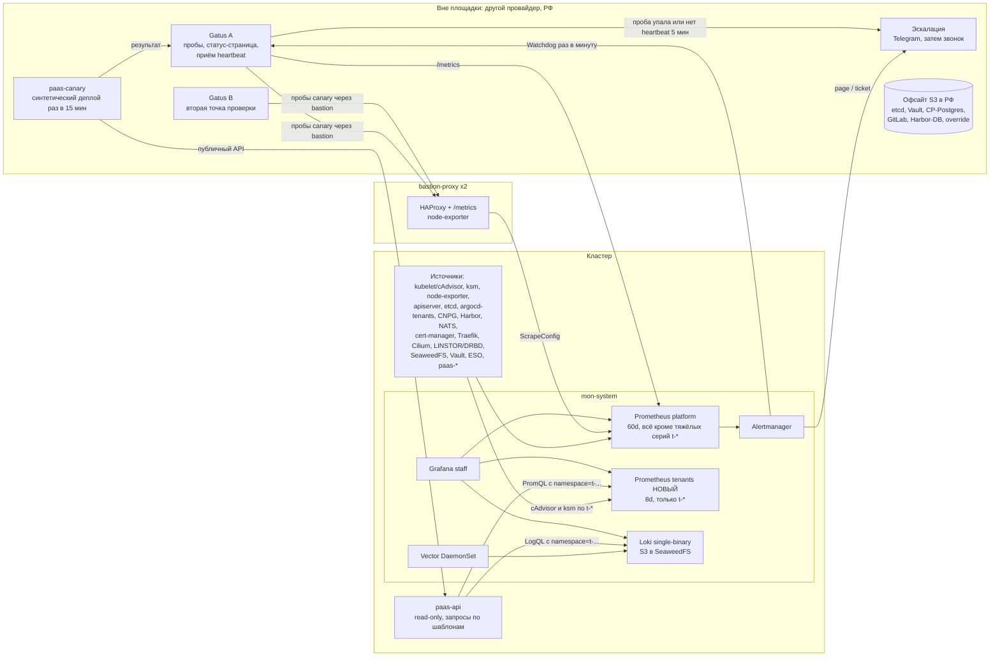
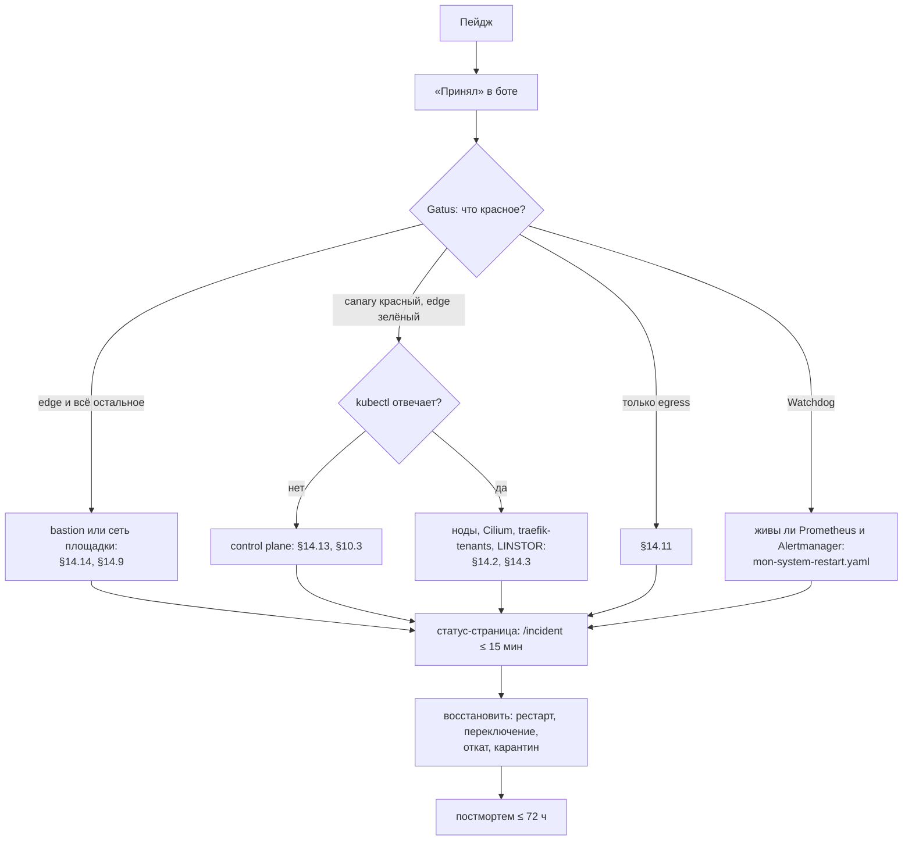

# 15. Наблюдаемость и эксплуатация платформы соло-оператором

> Статус: черновик дизайна.

## TL;DR

- **Фильтр всех решений — один оператор.** Ночью будит только data plane и только симптом, задевший многих тенантов: девять page-правил и одно свободное место (§13.2), остальное — ticket на утро. Потолок одного человека — 100–300 платящих проектов; второй дежурный нужен до публичного запуска (§15.5).
- **SLO честные:** data plane 99.5 % в месяц, control plane 99 %. Меряем снаружи, по служебной организации `org-canary`, которая живёт ровно по правилам клиента (§2). **С сегодняшней топологией 99.5 % — неправда.** Мешают один manager, один bastion без `check`, отсутствие офсайта и внешнего мониторинга. Пока это не закрыто — закрытая бета без SLA (§2.4).
- **Три независимых пути сигнала** (§3):
  - внутренний — Prometheus → Alertmanager, которому нужны настоящие receivers: сейчас корень `null`;
  - внешний — Gatus на двух VPS в РФ у разных провайдеров: пробы canary, статус-страница на отдельной DNS-зоне (§8);
  - deadman — `Watchdog` в Gatus.

  Эскалация — `paas-pager`: Telegram, через 10 минут звонок, через 30 — доверенное лицо (§8.4).
- **До допуска тенантов в `mon-system`** (§4–§7):
  - закрыть cluster-wide селекторы Prometheus для `t-*`;
  - тяжёлые серии тенантов — во второй `Prometheus` CR `tenants` с ретенцией 8 дней;
  - логи тенантов — отдельный sink Vector без метки `pod`; лимиты Loki задать явно.

  Логи и метрики тенант получает только через шаблоны backend с принудительным `namespace` и проверкой AST запроса.
- **Бэкап — короткий список хранилищ:** база `paas` — источник истины, git и namespace'ы восстанавливаются из неё (§9).
  - etcd — таймер на хосте каждые 6 часов, Vault — каждый час;
  - всё уходит в офсайт-S3 в РФ, шифрование age, ключи по схеме 2 из 3;
  - автоматические учения восстановления — каждую неделю.

  **Честная оговорка:** при потере площадки RPO control-plane-БД и Standard-БД — около 20 минут, а не 5, потому что barman пишет в SeaweedFS того же кластера. Предлагается писать бэкапы CP-БД прямо в офсайт (§9.4).
- **HA** (§10). Переход 1 → 3 manager'а — в одно окно: два manager'а хуже одного. Порядок строго такой: `cilium-install --tags post` → `full-node-install` → `manager-join` по одному → `haproxy-apiserver-lb-update`. Второй bastion — с `check` target'ов и DNS-failover из `paas-pager`. Одиночкой с ручным переключением метки остаётся egress gateway (§14.11).
- **Апгрейды без даунтайма** (§11):
  - kured только исполняет перезагрузки в окне (вторник 02:00–05:00 МСК) и только после осознанного `os-patch.yaml`: `unattended-upgrades` в репо замаскированы;
  - drain — с PDB и switchover CNPG по метке `draining`;
  - плейбука апгрейда Kubernetes в репо нет — нужен новый `k8s-upgrade.yaml`;
  - выпуск backend, меняющий `Harden()`, — тоже апгрейд: он рестартует всех тенантов.
- **Ёмкость** (§12). Главный ограничитель — память (`request == limit`). Правила записи считают N+1: при 70 % — заказать ноду, при 85 % — стоп-продажи. Докупка: inventory с taint → `cilium-install --tags post` → `full-node-install` → `worker-join`. Около часа работы оператора плюс срок поставки.
- **13 скелетов runbook'ов** с якорями под `runbook_url` на внекластерном зеркале (§14). Среди них: нода, диск и thin-пул, сертификаты, tenant-ArgoCD, GitLab, Vault, абьюз, DDoS, утечка watch, egress gateway, filer SeaweedFS, застывший apiserver, bastion.
- **Фактор автобуса** (§15):
  - автоплатежи;
  - режим «только data plane»: деплой открыт, регистрация закрыта;
  - внекластерный пакет доступов и контактов;
  - доверенное лицо с ролью `ops-duty` и break-glass по схеме 2 из 3.
- **Staging — test-1 после расширения.** CI (§16):
  - в `k8s-ansible` его сейчас нет — добавить `make test`;
  - для Go — полный конвейер с подписью образов и push в Harbor;
  - выкат — ansible'ом, на Kargo — при больше чем трёх релизах в неделю.
- **Шесть расхождений с соседними документами** вынесены в §18.1: Vault page или ticket, `PodMonitor` CNPG, RPO при потере площадки в 09, порог утечки watch, частота офсайта Vault, фаза egress gateway в 03.

---

## 1. Исходные ограничения: один оператор

Фильтр для каждого решения ниже: платформу эксплуатирует **один человек**. Он же пишет её код, ведёт текущий прод (GitLab, Kargo, SeaweedFS, ZITADEL), отвечает клиентам, иногда спит, болеет и уезжает в отпуск. Отсюда семь принципов.

| # | Принцип | Следствие в этом документе |
|---|---|---|
| П1 | **Ночью будит только data plane, и только платформенный симптом** — задетыми оказываются многие тенанты или все. Отдельное упавшее приложение будить не должно (NFR-OPS-04) | ≤ 10 page-алертов (§13.2). Сбой одного тенанта уходит ему же в UI через диагност ([07 §13](07-svc-compute.md)) |
| П2 | **Данные важнее доступности.** RPO строже RTO | Бэкапы вне площадки до первого платного клиента; SLO — честные 99.5 % (§2, §9) |
| П3 | **Всё повторяющееся отдаём автомату**, человек только принимает решения | kured для перезагрузок по окну, авто-карантин abuse, еженедельные учения восстановления — это задания, а не пункты в чек-листе (§9.6, §11.3, §14.8) |
| П4 | **Мониторинг мониторинга — вне кластера и вне площадки** | Статус-страница, deadman, эскалация, runbooks, копия `hosts-vars-override/` и офсайт-бэкапы не должны умирать вместе с кластером (§8, §9, §15) |
| П5 | **Не заводим новых stateful-систем ради наблюдаемости** | Остаётся существующий `mon-system`. Добавляются: второй `Prometheus` CR тем же оператором, Gatus на внешнем VPS, kured |
| П6 | **Обещаем то, что выдержит один человек** | SLO 99.5 % / 99 %. Поддержка — в рабочее время. Ночью — только аварии data plane |
| П7 | **Масштаб считаем операционный, не архитектурный** | NFR-SCL-01 (1 000 организаций / 5 000 приложений) — это потолок архитектуры. Потолок одного человека — **100–300 платящих проектов** ([research 08 §1.8]). Дальше нужен второй человек (§15) |

**Противоречие, которое надо назвать вслух.** По 406-ФЗ хостинг-провайдер обязан устранить источник атаки со своих IP за 12 часов и реагировать на требования РКН (D11, [16](16-legal-ru.md)). Это **обязательство 24/7**, а один человек его не гарантирует — он спит, болеет, бывает вне связи. Закрывается двумя вещами:

1. **Автоматикой, которой не нужен человек:** авто-карантин egress тенанта по сигналу abuse (§14.8) и заморозка проекта одной кнопкой с телефона.
2. **Вторым лицом с доступом по процедуре** (§15).

Без обоих пунктов юридический трек под угрозой независимо от качества кода.

## 2. SLO платформы: data plane ≠ control plane

### 2.1 Два контура — два обещания

| | Data plane | Control plane |
|---|---|---|
| Что это | Работающие приложения тенантов принимают трафик. Managed-БД принимают соединения. S3 и registry отдают данные | Консоль и API. Деплой, рестарт, скейл. Создание проектов, БД, доменов. Секреты. Логи и метрики в UI |
| От чего зависит | ноды tenant-пула, Cilium, Traefik / haproxy-ingress, bastion-proxy, LINSTOR, DNS, сертификаты | всё из data plane **плюс** paas-*, control-plane Postgres, GitLab, tenant-ArgoCD, Vault, Harbor, apiserver |
| От чего **не** зависит (D3, NFR-AVL-01) | backend, GitLab, tenant-ArgoCD, Vault, Harbor (пока не нужен новый pull), apiserver (kubelet держит поды) | — |
| **SLO (месяц)** | **99.5 %** ≈ 3 ч 39 мин простоя (NFR-AVL-02) | **99 %** ≈ 7 ч 18 мин (NFR-AVL-03) |
| Вторичные SLO | TLS-рукопожатие через bastion p95 ≤ 300 мс | деплой p95 ≤ 45 с без учёта pull (NFR-PRF-01); выпуск сертификата ≤ 5 мин (NFR-PRF-04); tail логов ≤ 3 с (NFR-PRF-03) |
| Кого будит | владельца, 24/7 | никого; разбирается утром |

**Почему не 99.9 %.** 99.9 % — это 43 минуты в месяц. Ночью соло-оператору надо проснуться, дойти до ноутбука, поднять VPN и понять, что происходит, — это 20–40 минут до первого действия. Одна ночная авария сжигает весь бюджет. 99.5 % выдерживает одну-две ночные аварии в месяц с MTTR около часа. Это честный максимум для одной площадки и одного человека.

### 2.2 SLI: как именно меряем

Меряем **снаружи, по canary-нагрузке платформы**, а не по приложениям клиентов. Упавшее приложение тенанта не должно тратить бюджет платформы.

- **Canary-организация** `org-canary` (служебная, с тарифом без биллинга) живёт в tenant-пуле **теми же механизмами, что и клиенты**: через provisioner, git и tenant-ArgoCD. В ней:
  - `canary-web` — 2 реплики, `topologySpread` на обе ноды пула, отдаёт `/probe` с номером ревизии;
  - `canary-pg` — Hobby-Postgres с включённым внешним доступом через L4-порт;
  - custom domain `canary.<platform-domain>` с сертификатом HTTP-01.
- **Data plane SLI** = доля «хороших минут». Минута плохая, если **с обеих точек проверки** (§8.1) не прошла хотя бы одна проба:
  - HTTPS на платформенный поддомен `canary-web`;
  - HTTPS на custom domain;
  - TCP + TLS + `SELECT 1` к `canary-pg` через bastion L4.
  
  Условие «с обеих точек» отсекает сетевые сбои самого проверяющего VPS.
- **Control plane SLI** = доля хороших минут. Минута плохая, если не прошла проба `GET https://console.<platform-domain>/api/v1/healthz` (глубокая: БД, River, GitLab-адаптер) **или** последний синтетический деплой (§8.3, раз в 15 мин) не дошёл до Running за 120 с.
- **Источник истины для отчёта** — хранилище Gatus (§8), а не Prometheus: пока лежит кластер, Prometheus не видит собственного простоя.

### 2.3 Что не входит в SLO

| Не считается | Почему / условие |
|---|---|
| Сбои приложения тенанта: crash, OOM, исчерпанная квота, ошибка в коде | зона тенанта; UI объясняет причину ([07 §13](07-svc-compute.md)) |
| Простой приложения **с 1 репликой** во время drain в **объявленное окно** | рестарт за секунды-минуты — так написано в UI и в оферте ([07 §5.3](07-svc-compute.md)) |
| Объявленное обслуживание: уведомление ≥ 72 ч, ≤ 4 ч в месяц, ночное окно | не больше одного окна в неделю (§11.4) |
| **Отказ провайдера площадки — считается** | Во внутреннем SLO честно считаем всё. Исключения в договорном SLA — вопрос оферты ([16](16-legal-ru.md)) |

### 2.4 Предусловия: при сегодняшней топологии 99.5 % — неправда

| Сегодня (факт) | Почему ломает SLO | Что сделать до первого платного клиента |
|---|---|---|
| bastion-proxy шлёт весь L7 и L4 на **один** worker IP **без `check`** ([research 01 §1.6]) | смерть одного воркера = недоступны все тенанты, при том что поды живы на других нодах | список target'ов с `check` в vars-модели `bastion-proxy-haproxy.yaml` (§10.4) |
| один bastion-proxy | его отказ отрезает всех клиентов | второй bastion + две A-записи (§10.4) |
| один manager, один etcd | нет self-healing: под на умершей ноде не переедет, Endpoints не обновятся | 3 manager'а (D12, §10) |
| нет бэкапа etcd, нет автоснапшотов Vault, нет офсайта | потеря manager'а или диска = потеря кластера или секретов | §9 |
| нет внешнего мониторинга | о падении узнаём от клиентов | §8 |

До закрытия этой таблицы платформа работает в режиме **закрытой беты «best effort» без SLO в оферте**. SLO публикуется как цель, SLA с компенсациями вводится только после неё (§17).

### 2.5 Политика бюджета ошибок

- **Бюджет исчерпан** (data plane < 99.5 % за скользящие 30 дней) → заморозка платформенных изменений до восстановления бюджета: никаких апгрейдов компонентов, кроме исправлений безопасности и причин инцидентов. Разбор трёх главных причин.
- **Burn-rate алерты** (методика SRE Workbook, окна 1 ч / 5 мин и 6 ч / 30 мин) считаются в Prometheus по метрикам Gatus (§8.2). Они только дополняют прямые алерты Gatus.

```yaml
# PrometheusRule (mon-system/post) — SLO data plane, бюджет 0.5 %
groups:
- name: paas-slo
  rules:
  - record: paas:dataplane_probe_error_ratio:rate5m
    expr: 1 - (sum(rate(gatus_results_total{group="dataplane",success="true"}[5m]))
               / sum(rate(gatus_results_total{group="dataplane"}[5m])))
  - record: paas:dataplane_probe_error_ratio:rate1h
    expr: 1 - (sum(rate(gatus_results_total{group="dataplane",success="true"}[1h]))
               / sum(rate(gatus_results_total{group="dataplane"}[1h])))
  - alert: PaasDataPlaneBudgetFastBurn        # 2 % месячного бюджета за час
    expr: paas:dataplane_probe_error_ratio:rate1h > (14.4 * 0.005)
      and paas:dataplane_probe_error_ratio:rate5m > (14.4 * 0.005)
    labels: {severity: page, plane: data}
  - alert: PaasDataPlaneBudgetSlowBurn        # 5 % бюджета за 6 часов
    expr: (1 - sum(rate(gatus_results_total{group="dataplane",success="true"}[6h]))
               / sum(rate(gatus_results_total{group="dataplane"}[6h]))) > (6 * 0.005)
    labels: {severity: ticket, plane: data}
```

⚠️ проверить имена и labels метрик Gatus (`gatus_results_total`, label `group`/`name`/`success`) в выбранной версии: `curl -s http://<gatus>:8080/metrics | grep gatus_`.

## 3. Архитектура наблюдаемости (схема)



**Три независимых пути сигнала:**

1. **Внутренний** — Prometheus, затем Alertmanager, затем эскалация. Знает всё о кластере, но умирает вместе с ним.
2. **Внешний** — Gatus сам пробует canary через bastion и сам шлёт в эскалацию. Работает при мёртвом кластере, мёртвом Alertmanager и мёртвом bastion.
3. **Deadman** — Alertmanager раз в минуту шлёт вечно горящий `Watchdog` в Gatus A. Нет heartbeat 5 минут — значит, внутренний мониторинг ослеп, и приходит пейдж «кластер не отчитывается». Без этого пути тишина от мёртвого Prometheus выглядит как «всё хорошо».

**Что нового относительно сегодняшнего `mon-system`**

| Новое | Где живёт | Как ставится |
|---|---|---|
| `Prometheus` CR `tenants` (§6) | `mon-system`, тот же оператор | новый тег `prometheus-tenants` в `mon-system-install.yaml` |
| Правила `PrometheusRule` для SLO, ёмкости, apiserver, etcd, нод | `mon-system/post` | новая переменная `mon_system_prometheus_rules` в `hosts-vars/mon-system.yaml`; в базе — полная структура |
| Правила по компоненту (argocd-tenants, cnpg, harbor, nats) | фаза `post` самого компонента, рядом с его ServiceMonitor | по конвенции репо |
| `ScrapeConfig` на bastion-proxy и Gatus | `mon-system/post` | статические target'ы |
| Реальные receivers Alertmanager (сейчас корень — `"null"`, алерты не уходят никуда) | `mon_system_alertmanager_root_config_spec` | секреты через ESO (§4.1) |
| Gatus x2 + `paas-canary` + приёмник эскалации | 2 внешних VPS у разных провайдеров | новый плейбук `playbook-system/status-node-install.yaml`, всё inline, как `bastion-proxy-install.yaml`. **Отдельный inventory** `hosts-vars-override/ops-external/`, не каталог кластера: ни один cluster-wide плейбук не должен его увидеть |
| kured (§11.3) | новый ansible-компонент `kured` | фазы `pre`, `install` |
| Таймер бэкапа etcd (§9.2) | systemd на manager'ах | `playbook-system`, новый плейбук |

## 4. Платформенные метрики и алерты: что добавить в mon-system

### 4.1 Модель важности и маршрутизация

Каждое правило несёт labels `severity` (`page` | `ticket` | `info`) и `plane` (`data` | `control` | `platform`) и аннотацию `runbook_url`. Ссылка ведёт на **внекластерное** зеркало runbooks (§15.3): когда кластер лежит, GitLab лежит вместе с ним.

| severity | Куда | Когда реагировать |
|---|---|---|
| `page` | эскалация (§8.4): громкий Telegram, через 10 мин без подтверждения — звонок | 24/7. Только data plane (П1) |
| `ticket` | Telegram-чат «ops» без звука | в рабочее время, следующим утром |
| `info` | никуда: дашборд и блокировка kured (§11.3) | — |

Корневой конфиг Alertmanager (сейчас `receiver: "null"` — алерты не уходят никуда):

```yaml
# hosts-vars/mon-system.yaml → mon_system_alertmanager_root_config_spec (AlertmanagerConfig.spec)
route:
  receiver: telegram-ticket
  groupBy: [alertname, namespace]
  groupWait: 30s
  groupInterval: 5m
  repeatInterval: 4h
  routes:
    - matchers: [{name: alertname, value: Watchdog, matchType: "="}]
      receiver: deadman
      groupWait: 0s
      groupInterval: 1m
      repeatInterval: 1m
    - matchers: [{name: severity, value: page, matchType: "="}]
      receiver: pager
      repeatInterval: 30m
    - matchers: [{name: severity, value: info, matchType: "="}]
      receiver: "null"
receivers:
  - name: "null"
  - name: deadman                     # heartbeat во внешний Gatus (§8.2)
    webhookConfigs:
      - urlSecret: {name: eso-mon-system-alerting, key: gatus-heartbeat-url}
        sendResolved: false
  - name: pager                       # приёмник эскалации на VPS (§8.4)
    webhookConfigs:
      - urlSecret: {name: eso-mon-system-alerting, key: pager-url}
  - name: telegram-ticket
    telegramConfigs:
      - botToken: {name: eso-mon-system-alerting, key: telegram-bot-token}
        chatID: -1000000000000        # чат «ops», значение — в override
        disableNotifications: true
inhibitRules:
  # нода умерла → не спамить алертами каждого пода и тома на ней
  - sourceMatch: [{name: alertname, value: TenantNodeNotReady, matchType: "="}]
    targetMatch: [{name: severity, value: ticket, matchType: "="}]
    equal: [node]
```

Секреты (токен бота, URL'ы с токенами) лежат в Vault `eso-secret/mon-system/alerting` и приходят через ExternalSecret в `mon-system/pre`, по образцу Grafana ([observability.md §3.1](../reference/observability.md)).

### 4.2 Обязательные изменения `mon-system` до допуска тенантов

1. **Закрыть cluster-wide селекторы для tenant-ns.** Сейчас `serviceMonitorNamespaceSelector`, `podMonitorNamespaceSelector`, `probeNamespaceSelector`, `ruleNamespaceSelector`, `scrapeConfigNamespaceSelector` и `alertmanagerConfigNamespaceSelector` равны `{}`. Если из-за бага в RBAC или VAP в tenant-ns окажется `ServiceMonitor`, платформенный Prometheus начнёт ходить по произвольному адресу с правами своего пода (SSRF) и получит неограниченную кардинальность. Второй забор к RBAC tenant-ArgoCD и VAP:
   ```yaml
   serviceMonitorNamespaceSelector:
     matchExpressions: [{key: paas.1520.tech/tenant, operator: DoesNotExist}]
   # то же для podMonitor/probe/rule/scrapeConfig NamespaceSelector и для
   # alertmanagerConfigNamespaceSelector в Alertmanager CR
   ```
2. **Тяжёлые серии тенантов — только в `prometheus-tenants`** (§6). Платформенный Prometheus отбрасывает cAdvisor по `t-*` целиком, а из kube-state-metrics по `t-*` оставляет короткий allow-list для ёмкости и квот:
   ```yaml
   # metricRelabelings на kubelet/cadvisor и ksm ServiceMonitor'ах платформенного Prometheus
   - sourceLabels: [namespace, __name__]
     regex: 't-[a-z0-9]{10};(kube_pod_container_resource_(requests|limits)|kube_resourcequota|kube_pod_status_phase|kube_pod_info)'
     targetLabel: __tmp_keep
     replacement: "1"
   - sourceLabels: [namespace, __tmp_keep]
     regex: 't-[a-z0-9]{10};'
     action: drop
   - regex: __tmp_keep
     action: labeldrop
   ```
3. **kube-state-metrics:** добавить `--metric-labels-allowlist=nodes=[paas.1520.tech/pool],namespaces=[paas.1520.tech/tenant]`. Без метки пула нельзя посчитать ёмкость tenant-пула одним выражением (§12).
4. **Внешние target'ы:**
   - HAProxy на bastion: встроенный `prometheus-exporter` на отдельном порту, ACL `src` — только egress-IP нод кластера;
   - node-exporter на bastion;
   - Gatus `/metrics`.

   Все три — через `ScrapeConfig` со `staticConfigs`.
5. **`Watchdog`** (`expr: vector(1)`, `severity: none`) — источник heartbeat.
6. Receivers и секреты — §4.1.

### 4.3 Каталог сигналов

Пороги стартовые, их надо калибровать по первым неделям. «Много тенантов» = **≥ 3 проектов или ≥ 5 % от активных, что больше**: у одного тенанта всё почти всегда в порядке, одновременный сбой у многих — симптом платформы.

| Компонент | Сигнал | Выражение (суть) | Порог | Важн. |
|---|---|---|---|---|
| **Внешние пробы** | canary недоступен | Gatus: 2 из 2 точек, 3 неудачи подряд | — | **page** |
| Внешние пробы | внутренний мониторинг ослеп | Gatus: нет `Watchdog` | 5 мин | **page** |
| apiserver | недоступен | `up{job="apiserver"} == 0` | 2 мин | **page** (без него нет self-healing data plane) |
| apiserver | латентность | p99 `apiserver_request_duration_seconds{verb!~"WATCH\|CONNECT"}` | > 1 с, 10 мин | ticket |
| apiserver | **утечка watch** | `sum(apiserver_longrunning_requests{verb="WATCH"})` против `avg_over_time(...[7d])` | > 2.5×, 30 мин | ticket |
| apiserver | память к OOM | `predict_linear(process_resident_memory_bytes{job="apiserver"}[6h], 12*3600)` > 0.85 RAM ноды | 12 ч / 4 ч | ticket / **page** |
| etcd | нет лидера | `etcd_server_has_leader == 0` | 1 мин | **page** |
| etcd | fsync / размер БД / смены лидера | p99 `etcd_disk_wal_fsync_duration_seconds` > 25 мс; `etcd_mvcc_db_total_size_in_bytes` > 70 % квоты; > 3 смен лидера в час | 15 мин | ticket |
| etcd | бэкап старый | `time() - paas_etcd_backup_last_success_timestamp` (textfile-коллектор, §9.2) | > 8 ч | ticket |
| Ноды | tenant-нода NotReady | `kube_node_status_condition{condition="Ready",status="true"} == 0` и метка пула | 5 мин | **page** |
| Ноды | system-нода NotReady | то же, прочие ноды | 10 мин | ticket |
| Ноды | корневая ФС заполнится | доступно < 10 % **и** `predict_linear(...[6h], 4*3600) < 0` | — | **page**; < 15 % — ticket |
| Ноды | conntrack / PID | `node_nf_conntrack_entries / node_nf_conntrack_entries_limit` > 0.8; PID > 0.8 от `kernel.pid_max` | 10 мин | ticket |
| LINSTOR | FILE_THIN пул кончается | свободно на ФС под пулом `lnstr-file-thin-*` (node-exporter по mountpoint, ⚠️ уточнить путь) | < 15 % / < 8 % | ticket / **page** |
| DRBD | ресинк идёт | `drbd_peerdevice_outofsync_bytes > 0` | — | info (блокирует kured) |
| DRBD | ресинк висит | `outofsync_bytes` не уменьшается 30 мин ([известная ловушка](../reference/bootstrap-and-ha.md)) | 30 мин | ticket |
| DRBD | том без UpToDate-реплики | ⚠️ имя метрики drbd-reactor уточнить | 2 мин | **page** |
| Cilium | агент не Ready на tenant-ноде | `up{job="cilium-agent"}` / DaemonSet unavailable | 5 мин | **page** |
| Cilium | давление BPF-карт, ошибки импорта политик | `cilium_bpf_map_pressure > 0.9`; `rate(cilium_policy_import_errors_total[10m]) > 0` | 10 мин | ticket |
| Traefik | ошибки перезагрузки конфига | `increase(traefik_config_reloads_failure_total[10m]) > 0` | — | ticket (битый IngressRoute тенанта) |
| Traefik | доля 5xx по всем сервисам | `sum(rate(traefik_service_requests_total{code=~"5.."}[10m])) / sum(rate(...[10m]))` | > 20 % | ticket (page дают canary) |
| bastion | backend'ы не все живы | `haproxy_backend_active_servers` < числа target'ов | 5 мин | ticket |
| bastion | сессии у `maxconn`, fd, conntrack | `haproxy_frontend_current_sessions / haproxy_frontend_limit_sessions` > 0.7 | 5 мин | ticket (признак DDoS, §14.9) |
| cert-manager | массовые отказы выпуска | число `certmanager_certificate_ready_status{condition="False"}` в `t-*` | «много тенантов», 30 мин | ticket |
| cert-manager | упёрлись в лимит LE | `increase(certmanager_http_acme_client_request_count{status="429"}[1h]) > 0` | — | ticket |
| cert-manager | wildcard `<apps-domain>` истекает | `certmanager_certificate_expiration_timestamp_seconds - time()` | < 10 дн / < 3 дн | ticket / **page** |
| tenant-ArgoCD | отставание ревизии | `paas_argocd_revision_lag_seconds` ([04 §15](04-control-plane-go.md)) | > 5 мин | ticket |
| tenant-ArgoCD | массовый OutOfSync | `count(argocd_app_info{sync_status="OutOfSync"})` > 5 % приложений | 30 мин | ticket |
| tenant-ArgoCD | контроллер у лимита памяти или рестарты | `container_memory_working_set_bytes` > 0.85 лимита; `increase(kube_pod_container_status_restarts_total[1h]) > 1` | — | ticket |
| tenant-ArgoCD | медленная реконсиляция | p95 `argocd_app_reconcile` | > 60 с | ticket |
| CNPG тенантов | много кластеров не отвечают | `cnpg_collector_up == 0` по `t-*` | «много тенантов», 5 мин | **page** |
| CNPG тенантов | WAL не архивируется (RPO) | возраст последнего WAL в архиве, Standard | > 15 мин | ticket |
| CNPG тенантов | нет свежего base backup | `time() - cnpg_collector_last_available_backup_timestamp` | > 36 ч | ticket |
| CP-Postgres | primary недоступен / лаг реплики | `cnpg_collector_up{namespace="paas-system"}`; `cnpg_pg_replication_lag` | 2 мин / > 60 с | ticket (control plane, П1) |
| Harbor | недоступен / очередь заданий | проба `/v2/` из Gatus; ⚠️ имена метрик экспортёра Harbor уточнить | 5 мин | ticket |
| SeaweedFS | S3 недоступен | проба из Gatus (продукт S3) | 3 неудачи | **page**, если S3 продаётся |
| SeaweedFS | «спин» filer'а (§14.12) | CPU filer > 1 ядра при RSS < 100 Mi | 15 мин | ticket |
| Vault | sealed | `vault_core_unsealed == 0` | 5 мин | ticket, см. примечание |
| ESO / Vault | [12 §11.4](12-svc-secrets.md) | — | — | ticket |
| paas-* | [04 §15](04-control-plane-go.md): очередь River, адаптеры, предохранитель | — | — | ticket |
| GitLab | коммиты не проходят | `paas_adapter_requests_total{adapter="gitlab"}`, доля 5xx/таймаутов | > 50 %, 5 мин | ticket |
| Loki / Vector | отброшенные строки, заполнение буфера | `increase(loki_discarded_samples_total[15m])` по reason; буфер Vector > 80 % | — | ticket |
| Prometheus | head series, провалы правил, выброшенные уведомления | `prometheus_tsdb_head_series`; `prometheus_rule_evaluation_failures_total`; `prometheus_notifications_dropped_total` | §7 | ticket |
| Ёмкость | §12 | — | — | ticket |
| Abuse | CPU у лимита часами, отказы на 25 порт, всплески egress | §14.8 | — | info: в очередь abuse и авто-карантин, человека не будит |

**Примечание про Vault.** [12 §11.4](12-svc-secrets.md) предлагает `vault_core_unsealed == 0` как page. Здесь это **ticket**: по [12 §12.2](12-svc-secrets.md) Vault — зависимость изменений, а не работы приложений, а bank-vaults распечатывает Vault сам примерно за минуту. Если sealed держится 5 минут, авто-unseal сломан, и это ремонт на утро. Расхождение вынесено в §18.

### 4.4 Пример правил: утечка watch и массовый сбой сертификатов

```yaml
groups:
- name: paas-platform
  rules:
  - record: paas:apiserver_watch_total
    expr: sum(apiserver_longrunning_requests{verb="WATCH"})
  - alert: ApiserverWatchLeakSuspected
    expr: paas:apiserver_watch_total > 2.5 * avg_over_time(paas:apiserver_watch_total[7d])
    for: 30m
    labels: {severity: ticket, plane: control}
    annotations:
      summary: "WATCH в apiserver: {{ $value }} — больше 2.5x недельной нормы"
      runbook_url: "https://runbooks.<ops-domain>/15#runbook-watch-leak"
  - alert: TenantCertificatesFailingMass
    expr: |
      count(certmanager_certificate_ready_status{condition="False", namespace=~"t-.+"})
        > max(3, 0.05 * count(certmanager_certificate_ready_status{condition="True", namespace=~"t-.+"}))
    for: 30m
    labels: {severity: ticket, plane: control}
```

`apiserver_longrunning_requests` — метрика, проверенная на этом кластере: `apiserver_registered_watchers` в 1.36 нет. Единица при расследовании — **число watch, а не число TCP-сокетов**: HTTP/2 мультиплексирует до 250 потоков на соединение (опыт владельца).

## 5. Логи тенантов (Vector → Loki)

Решение D14 остаётся в силе: **Vector → существующий Loki**, retention логов тенанта 7 дней, пользователь никогда не присылает LogQL. Loki остаётся single-tenant (`auth_enabled: false`). Изоляция — принудительный матчер `namespace` на стороне backend.

**Отвергнуто: Loki multi-tenant (`X-Scope-OrgID` на проект).** Изоляция там сильнее, а лимиты на тенанта встроенные, но:

- тысячи тенантов Loki = тысячи мелких индексов в сутки, это давление мелких файлов на SeaweedFS;
- compactor работает по каждому тенанту;
- staff-запросам нужен multi-tenant режим.

Вернуться, если понадобится гарантированная изоляция приёма логов по тенанту.

### 5.1 Что меняется в `mon-system` (ansible, до допуска тенантов)

Обязательные пункты 1–5 уже перечислены в [07 §12.1](07-svc-compute.md): нормализация `level`, запрет `timestamp` из JSON тенанта, троттлинг по namespace, `retention_stream` 168h, ротация логов kubelet на tenant-нодах. Сверх них, по результатам разбора текущего конфига:

| # | Сейчас (факт из `hosts-vars/mon-system.yaml`) | Проблема на масштабе | Изменение |
|---|---|---|---|
| 6 | Один sink с метками `level, nodeName, containerName, pod, namespace, name, instance, component, partOf` | метка `pod` = новый поток на каждый под. Каждый деплой рождает новые потоки (churn). Потоков порядка «поды × уровни» | **Отдельный sink `loki_tenants`** для `t-*`: метки `namespace, instance, component, level`; `pod`, `container`, `node` — в structured metadata (Loki 3, schema v13 уже включена). Число потоков на приложение ≈ компоненты × уровни ≤ 18, от числа подов и деплоев не зависит |
| 7 | лимит потоков не задан | дефолт Loki `max_global_streams_per_user` = 5 000 (⚠️ проверить для используемой версии). В single-tenant режиме **все** потоки кластера считаются одному тенанту `fake`. Упёрлись — Loki отвергает новые потоки у всех | явно задать `max_global_streams_per_user: 100000` и алерт на `loki_ingester_memory_streams` > 70 % |
| 8 | у Vector нет метрик («by design no SM») | троттлинг и переполнение буфера не видны — логи молча теряются | source `internal_metrics` + sink `prometheus_exporter` + PodMonitor |
| 9 | буфер sink — в памяти (дефолт) | рестарт Loki или SeaweedFS = потеря логов за время простоя | `buffer: {type: disk, max_size: 1GiB, when_full: drop_newest}` на `loki_tenants`: болтливые тенанты не вытесняют системные логи. ⚠️ проверить, что `data_dir` Vector смонтирован как hostPath |

### 5.2 Vector: фрагмент конфига

```yaml
transforms:
  parse_json_logs:            # существующий; правка: для t-* timestamp из JSON не берём
    source: |
      is_tenant = starts_with(string(.kubernetes.pod_namespace) ?? "", "t-")
      # ... существующий разбор JSON ...
      if exists(.parsed_message.timestamp) && !is_tenant { ... }   # как было
  split_by_owner:
    type: route
    inputs: [format_message]
    route:
      tenant: 'starts_with(string(.namespace) ?? "", "t-")'
      system: '!starts_with(string(.namespace) ?? "", "t-")'
  tenant_guard:
    type: remap
    inputs: [split_by_owner.tenant]
    source: |
      lvl = downcase(string(.level) ?? "unknown")
      if lvl == "warning" { lvl = "warn" }
      if !includes(["debug", "info", "warn", "error", "fatal"], lvl) { lvl = "unknown" }
      .level = lvl
      if !includes(["web", "worker", "cron", "job"], .component) { .component = "unknown" }
  tenant_throttle:
    type: throttle
    inputs: [tenant_guard]
    key_field: "{{ namespace }}"
    threshold: 5000             # строк за окно на namespace (≈ 500 строк/с, 07 §12.1)
    window_secs: 10
sinks:
  loki_system:                  # существующий loki_output, inputs: [split_by_owner.system]
    inputs: [split_by_owner.system]
  loki_tenants:
    type: loki
    inputs: [tenant_throttle]
    endpoint: "http://loki.mon-system.svc.cluster.local:3100"
    labels:
      namespace: "{{ namespace }}"
      instance: "{{ instance }}"
      component: "{{ component }}"
      level: "{{ level }}"
    structured_metadata:        # ⚠️ проверить поддержку в Vector 0.50
      pod: "{{ podName }}"
      container: "{{ containerName }}"
      node: "{{ nodeName }}"
    buffer: {type: disk, max_size: 1073741824, when_full: drop_newest}
    encoding: {codec: text}
```

Правка идёт в блок-скаляр `mon_system_vector_config_yaml`, где шаблоны Vector уже обёрнуты в ``. Проверка — render-diff до и после (`make test` плюс рендер) и синтетический под в `t-*`, который пишет `{"level":"<uuid>"}`: в Loki должен появиться поток с `level="unknown"`, а не новый.

### 5.3 Loki: лимиты

```yaml
limits_config:
  retention_period: 744h                      # системные — как сейчас
  retention_stream:
    - selector: '{namespace=~"t-.+"}'
      priority: 1
      period: 168h                            # D14
  max_global_streams_per_user: 100000         # явно (п. 7)
  ingestion_rate_mb: 30                       # как сейчас; тенантов ограничивает Vector
  ingestion_burst_size_mb: 60
  max_entries_limit_per_query: 5000
  max_query_series: 500
  max_query_length: 721h                      # staff смотрит системные логи за месяц; 7 дней для тенанта держит backend
  query_timeout: 30s
```

### 5.4 Как backend читает логи

Запрос строит только функция-конструктор. Идентификаторы проверяются регулярками, текст фильтра подставляется строковым литералом, regex от пользователя не принимается ([07 §12.1](07-svc-compute.md)):

```go
var (
    reNS  = regexp.MustCompile(`^t-[a-z0-9]{10}$`)
    reApp = regexp.MustCompile(`^[a-z0-9]{10}$`)
    levels     = map[string]bool{"debug": true, "info": true, "warn": true, "error": true, "fatal": true, "unknown": true}
    components = map[string]bool{"web": true, "worker": true, "cron": true, "job": true}
)

// TenantLogQL — единственный способ получить LogQL для тенанта.
func TenantLogQL(ns, appID, component, level, needle string) (string, error) {
    if !reNS.MatchString(ns) || !reApp.MatchString(appID) {
        return "", ErrBadIdentifier
    }
    sel := fmt.Sprintf(`{namespace=%q, instance=%q`, ns, appID)
    if component != "" {
        if !components[component] { return "", ErrBadFilter }
        sel += fmt.Sprintf(`, component=%q`, component)
    }
    if level != "" {
        if !levels[level] { return "", ErrBadFilter }
        sel += fmt.Sprintf(`, level=%q`, level)
    }
    sel += "}"
    if needle != "" {
        if len(needle) > 256 { return "", ErrBadFilter }
        sel += " |= " + strconv.Quote(needle) // литерал; строковые литералы LogQL экранируются как в Go
    }
    return sel, nil
}
```

`namespace` берётся **из проекта в БД по сессии пользователя**, а не из запроса. Проверка «пользователь состоит в организации проекта» делается до вызова конструктора ([04 §7.3](04-control-plane-go.md)).

### 5.5 Отказы

| Отказ | Что видит тенант | Что теряется |
|---|---|---|
| Loki | живой хвост работает: он идёт через apiserver ([07 §12.1](07-svc-compute.md)). История и поиск — «временно недоступно» | ничего, пока дисковый буфер Vector (1 ГиБ на ноду) не переполнен |
| SeaweedFS (бакет `loki-logs`) | то же. Loki держит WAL в `emptyDir` 4 Gi | при долгом простое — логи за часы |
| Vector на ноде | нет истории логов подов этой ноды | строки, ротированные kubelet'ом за время простоя (`20Mi × 3` на tenant-нодах) |

Логи тенанта **не входят в SLO** и в оферте описаны как «диагностические, без гарантии полноты».

**Платформенные журналы с долгим сроком** (audit apiserver — сейчас его нет, [research 01 §1.2]; audit Vault; журнал действий в control-plane БД) не должны зависеть от 7/31-дневного retention Loki. Политика и срок — [03 §12](03-security-model.md) и [16](16-legal-ru.md). Инфраструктурно: отдельный поток `{job="audit"}` с отдельным `retention_stream` плюс ночная выгрузка в офсайт S3 (§9).

## 6. Метрики тенантов (принудительный матчер)

### 6.1 Решение: второй `Prometheus` CR `tenants` с первого дня

| | Один Prometheus с отбрасыванием | **Второй CR `tenants` (выбрано)** | VictoriaMetrics / Mimir |
|---|---|---|---|
| Retention | одна на всех: 60 дней для тенантских серий, которым нужно 7 | своя, 8 дней | своя |
| Blast radius | взрыв кардинальности у тенантов роняет Prometheus, который будит ночью | роняет только графики тенантов | — |
| Новые движущиеся части | 0 | ещё одна StatefulSet тем же оператором | новая stateful-система (против П5) |
| Когда пересматривать | — | > 1.5 млн серий или нужен HA по метрикам тенантов | тогда |

Это решение ужесточает митигацию R22 из [18](18-risks-and-owner-decisions.md): там «отдельный Prometheus при росте», здесь — сразу. Цена — один PVC и 1–5 GiB RAM. Выигрыш — алертинг платформы изолирован от поведения тенантов.

```yaml
apiVersion: monitoring.coreos.com/v1
kind: Prometheus
metadata:
  name: tenants
  namespace: mon-system
spec:
  replicas: 1
  retention: 8d
  retentionSize: 30GiB
  scrapeInterval: 30s
  evaluationInterval: 1m
  # только объекты с меткой и только из mon-system — tenant-ns не участвуют никак
  serviceMonitorSelector: {matchLabels: {paas.1520.tech/prometheus: tenants}}
  serviceMonitorNamespaceSelector: {matchLabels: {kubernetes.io/metadata.name: mon-system}}
  podMonitorSelector: {matchLabels: {paas.1520.tech/prometheus: tenants}}
  podMonitorNamespaceSelector: {matchLabels: {kubernetes.io/metadata.name: mon-system}}
  ruleSelector: {matchLabels: {paas.1520.tech/prometheus: tenants}}
  ruleNamespaceSelector: {matchLabels: {kubernetes.io/metadata.name: mon-system}}
  probeNamespaceSelector: {matchLabels: {kubernetes.io/metadata.name: none}}
  scrapeConfigNamespaceSelector: {matchLabels: {kubernetes.io/metadata.name: none}}
  enforcedLabelLimit: 30
  enforcedLabelValueLengthLimit: 200
  enforcedBodySizeLimit: 50MB
  query:
    maxSamples: 20000000
    timeout: 30s
    maxConcurrency: 8
  alerting:
    alertmanagers:
      - {namespace: mon-system, name: alertmanager-operated, port: web}  # ⚠️ сверить имя Service
  storage:
    volumeClaimTemplate:
      spec:
        storageClassName: lnstr-worker-local   # данные восстановимы, двойная репликация не нужна
        resources: {requests: {storage: 40Gi}}
  resources:
    requests: {cpu: 500m, memory: 2Gi}
    limits: {memory: 6Gi}
  nodeSelector: {node-role.kubernetes.io/worker: ""}
```

### 6.2 Что скрейпит `prometheus-tenants`

| Цель | Как | Заметка |
|---|---|---|
| cAdvisor по `t-*` | копия kubelet-ServiceMonitor с меткой `paas.1520.tech/prometheus: tenants` и отбрасыванием из §7.2 | kubelet скрейпится дважды (платформа + тенанты). Цена приемлема. Если cAdvisor-эндпоинт станет тяжёлым, у платформы интервал 60 с |
| kube-state-metrics по `t-*` | копия ksm-ServiceMonitor, `keep` по `namespace=~"t-.+"` и allow-list метрик | один ksm на кластер. `--namespaces` не принимает шаблон, поэтому отдельный ksm для тенантов не имеет смысла |
| **CNPG тенантов** | **один** платформенный `PodMonitor` в `mon-system`: `namespaceSelector: {any: true}`, `selector: cnpg.io/podRole=instance`, `relabelings: keep namespace=~"t-.+"`, `sampleLimit: 400` (действует **на каждый под**) | Расходится с [09 §4.4](09-svc-databases.md), где `PodMonitor` рендерится в каждый tenant-ns через git. Один платформенный объект вместо тысяч: tenant-ArgoCD не нужны права на `monitoring.coreos.com`, VAP на поля PodMonitor не нужна, дыра из §4.2 закрыта полностью. Правила `PrometheusRule` из `cnpg-post` ([09](09-svc-databases.md) §14.2) должны нести метку `paas.1520.tech/prometheus: tenants`, иначе их не увидит Prometheus, где лежат метрики. Вынесено в §18 |
| Traefik по сервисам тенантов | ServiceMonitor Traefik, `keep` по `service=~"t-[a-z0-9]{10}-.+"` (⚠️ сверить формат имени сервиса в метриках Traefik для IngressRoute) | только счётчики (§7.2) |

**Сеть.** Под `prometheus-tenants` ходит в tenant-ns на порт `metrics` (9187) CNPG-подов. Базовая CCNP tenant-ns сейчас пускает ingress только из `traefik-tenants`, `haproxy-tenants` и своего ns ([02 §6](02-tenancy-and-isolation.md)). Нужно одно добавочное правило: из подов `app.kubernetes.io/name=prometheus, prometheus=tenants` в `mon-system` — только на TCP 9187.

### 6.3 Путь запроса: шаблон + проверка AST

D14: пользователь не присылает PromQL. Запросы — фиксированные шаблоны ([07 §12.2](07-svc-compute.md)) с подстановкой проверенных идентификаторов. **prom-label-proxy не ставим**: его ценность в защите от сырого пользовательского PromQL, а сырого PromQL у нас нет. Лишний сетевой хоп не нужен.

Вместо прокси — дешёвый второй забор в самом `paas-api`: перед отправкой любой запрос разбирается парсером Prometheus. Если хоть один селектор не ограничен ровно нужным namespace, запрос отвергается. Это ловит баг в шаблоне, который иначе показал бы тенанту чужие данные.

```go
package obs

import (
    "fmt"

    "github.com/prometheus/prometheus/model/labels"
    "github.com/prometheus/prometheus/promql/parser"
)

// EnforceNamespace: каждый селектор запроса обязан иметь матчер namespace="<ns>" (строгое равенство).
func EnforceNamespace(query, ns string) error {
    expr, err := parser.ParseExpr(query)
    if err != nil {
        return fmt.Errorf("promql: %w", err)
    }
    var violation error
    parser.Inspect(expr, func(n parser.Node, _ []parser.Node) error {
        vs, ok := n.(*parser.VectorSelector)
        if !ok || violation != nil {
            return violation
        }
        found := false
        for _, m := range vs.LabelMatchers {
            if m.Name != "namespace" {
                continue
            }
            if m.Type != labels.MatchEqual || m.Value != ns {
                violation = fmt.Errorf("selector %s: namespace must be exactly %q", vs, ns)
                return violation
            }
            found = true
        }
        if !found {
            violation = fmt.Errorf("selector %s: missing namespace matcher", vs)
        }
        return violation
    })
    return violation
}
```

Golden-тест: каждый шаблон из каталога графиков проходит `EnforceNamespace`, а намеренно испорченные шаблоны (без матчера, с `=~`, с чужим ns, с `or` на второй селектор без матчера) — нет. Лимиты `paas-api`: окно ≤ 7 дней, шаг ≥ 60 с для окон > 24 ч, ≤ 20 запросов в минуту на пользователя, результаты кэшируются на 30 с по ключу (запрос, окно, шаг).

### 6.4 Метеринг и пользовательские метрики

- **Recording rules биллинга** ([13 §5.2](13-billing-and-quotas.md)) вычисляются в `prometheus-tenants`: сырые данные тенантов лежат там. Агрегатор `usage_hourly` читает их раз в час. Retention 8 дней = агрегатор может догнать пропуск до недели. Потеря данных глубже некритична: тариф flat (D10).
- **Пользовательские `/metrics` приложений — фаза 2.** Backend будет рендерить `PodMonitor` в `mon-system` (не в tenant-ns) с `namespaceSelector.matchNames: [t-<pid>]`, `sampleLimit: 1000` и `labelLimit: 20`. У `prometheus-tenants` включается `enforcedNamespaceLabel: namespace`: серии не смогут подделать чужой namespace. Число серий войдёт в квоту тарифа.

## 7. Кардинальность и объём при тысячах подов

Все числа раздела — **оценки для порядка величины**. До беты их надо замерить на `test-1` синтетической нагрузкой: `prometheus_tsdb_head_series`, `GET /api/v1/status/tsdb` (топ метрик и меток), `loki_ingester_memory_streams`, `loki_distributor_bytes_received_total`.

### 7.1 Сколько серий даёт тенант (после отбрасывания, §7.2)

| Источник | Серий на единицу | Единица |
|---|---|---|
| cAdvisor (7 метрик, без `id`/`image`/`name`) | ~10 | контейнер |
| kube-state-metrics (allow-list) | ~20 | под |
| kubelet volume stats | 4 | PVC |
| Traefik (только счётчики, без гистограмм) | ~15 | сервис с публичным маршрутом |
| CNPG (урезанный набор запросов, §7.2) | ~60 | инстанс Postgres |

| Сценарий | Поды | БД | Сервисы | Активных серий в `prometheus-tenants` | RAM (оценка) | Диск за 8 дней |
|---|---|---|---|---|---|---|
| Бета: 50 проектов | 150 | 20 | 80 | ~7 тыс. | < 0.5 GiB | < 1 GiB |
| Предел одного человека: 300 проектов | 1 000 | 150 | 500 | ~50 тыс. | ~0.6 GiB | ~2 GiB |
| Потолок архитектуры (NFR-SCL-01) | 7 500 | 1 500 | 5 000 | ~410 тыс. + churn | 3–5 GiB | ~15 GiB |

Churn — главный скрытый множитель. Каждый деплой рождает новые имена подов, а с ними новые серии. 5 000 деплоев в сутки × ~30 серий = 150 тыс. новых серий в сутки. Head их переваривает, но растут индекс и память compaction. Поэтому retention тенантов — 8 дней, а не 60. В платформенном Prometheus от тенантов остаётся только allow-list ksm (§4.2): ~10 серий на под, до ~75 тыс. на потолке.

### 7.2 Что отбрасываем на scrape (`prometheus-tenants`)

```yaml
# ServiceMonitor kubelet/cadvisor с меткой paas.1520.tech/prometheus: tenants
metricRelabelings:
  - sourceLabels: [namespace]
    regex: 't-[a-z0-9]{10}'
    action: keep
  - sourceLabels: [__name__]
    regex: 'container_(cpu_usage_seconds_total|cpu_cfs_(throttled_)?periods_total|memory_working_set_bytes|network_(receive|transmit)_bytes_total|oom_events_total)'
    action: keep
  - sourceLabels: [__name__, container]        # pause-контейнер и pod-cgroup дублируют суммы…
    regex: 'container_(cpu|memory).*;(POD|)'   # …но сетевые метрики живут только на уровне пода
    action: drop
  - regex: 'id|image|name'
    action: labeldrop
```

- **CNPG:** в генерируемом `Cluster` — `monitoring.disableDefaultQueries: true` плюс свой короткий ConfigMap запросов: доступность, лаг репликации, возраст последнего архивированного WAL, размер БД, соединения к `max_connections`, `xid` wraparound. Дефолтный набор даёт сотни серий на инстанс, а 1 500 инстансов с ним — это отдельный Prometheus только под БД. ⚠️ проверить поле и формат ConfigMap в выбранной версии CNPG.
- **Traefik:** гистограммы латентности `traefik_service_request_duration_seconds_bucket` для сервисов тенантов отбрасываются до фазы 2 ([07 §12.2](07-svc-compute.md)). Гистограммы уровня entrypoint остаются: это латентность платформы в целом.
- **Hubble:** метрики только с `sourceContext=namespace` и `destinationContext=namespace`, никаких меток pod или workload. Иначе Hubble сам станет генератором кардинальности. ⚠️ сверить с текущими `hubble.metrics.enabled` в `hosts-vars/cilium.yaml`.

### 7.3 Предохранители

- **`sampleLimit` на каждом ServiceMonitor/PodMonitor, а не один глобальный `enforcedSampleLimit`.** Превышение лимита роняет **весь** scrape цели, а не только лишние серии. Для общих целей лимиты щедрые: ksm — 400 тыс. (одна цель на все поды кластера), cAdvisor — 30 тыс. на ноду. Строгие лимиты — только для целей, которые принадлежат одному тенанту: CNPG — 2 000 на под, пользовательские метрики фазы 2 — 1 000.
- `enforcedLabelLimit: 30`, `enforcedLabelValueLengthLimit: 200`, `enforcedBodySizeLimit: 50MB` на `prometheus-tenants`.
- Алерты (ticket):
  - `increase(prometheus_target_scrapes_exceeded_sample_limit_total[15m]) > 0` — чья-то цель потеряна целиком;
  - `prometheus_tsdb_head_series{prometheus="mon-system/tenants"} > 800e3` — пора увеличивать ресурсы или делить;
  - то же для платформенного Prometheus при > 1.5e6.
- Раз в неделю — отчёт по топу метрик и меток из `/api/v1/status/tsdb` в Telegram «ops»: растущая метрика видна до того, как станет проблемой.

### 7.4 Логи: объём

| Сценарий | Приложений | Сырой поток (при 0.5 строки/с × 200 Б на приложение) | В S3 за 7 дней (сжатие 5–10×) |
|---|---|---|---|
| Предел одного человека | 1 000 | ~0.1 МБ/с ≈ 8.6 ГБ/сутки | ~6–12 ГБ |
| Потолок архитектуры | 5 000 | ~0.5 МБ/с ≈ 43 ГБ/сутки | ~30–60 ГБ |

Объём байтов для single-binary Loki посилен. Узкое место не байты, а **число потоков и churn меток**, и об этом §5.3.

## 8. Внешняя статус-страница и внешний мониторинг

Всё в этом разделе живёт **вне кластера и вне площадки** (П4). Кластер может лежать целиком: Prometheus, Alertmanager, GitLab с runbooks, bastion. Эта часть обязана при этом видеть сбой, будить владельца и сообщать клиентам.

### 8.1 Две точки проверки

| | Gatus A | Gatus B |
|---|---|---|
| Где | VPS у провайдера X в РФ, не у провайдера площадки | VPS у провайдера Y в РФ, другой город |
| Роль | пробы, статус-страница, приём heartbeat и push-результатов, `paas-pager` (§8.4), `paas-canary` (§8.3), зеркало runbooks (§15.3) | вторая точка проб, горячий резерв `paas-pager` |
| Ресурсы | 1 vCPU, 1 GiB RAM, 20 GB диска | то же |

Правила:

- **Проба data plane считается упавшей, только если она не прошла с обеих точек** (§2.2). Сбой с одной точки — это сеть проверяющего, он даёт ticket «точка X видит сбой». Логику «2 из 2» считает `paas-pager`, в самом Gatus её нет.
- A и B пробуют друг друга. Недоступный пир — ticket.
- **На VPS нет ни одного креда кластера**: только API-токен служебной организации `org-canary`, push-токены Gatus и токен Telegram-бота. Взлом VPS даёт доступ к `org-canary` и возможность спамить уведомлениями, но не к кластеру и не к данным клиентов.

**Почему Gatus.** Один Go-бинарь. Конфиг — YAML в git, как весь репозиторий. Встроенная статус-страница. Условия на код ответа, тело, срок сертификата и время ответа. Есть `/metrics` и external endpoints: внешний агент сам присылает результат. Хранилище — SQLite, отдельный сервер БД не нужен.

**Отвергнуто:**

- **Uptime Kuma** — конфиг живёт в UI, а не в git.
- **SaaS** (UptimeRobot, Better Stack) — оплата из РФ и санкционный риск. Допустим как бесплатная третья точка без эскалации, вне SLI.
- **Статус-страница в кластере** — умирает вместе с тем, о чём должна сообщать.

### 8.2 Конфиг Gatus (фрагмент)

```yaml
# /etc/gatus/config.yaml на VPS A (шаблон из status-node-install.yaml; секреты — через env)
storage:
  type: sqlite
  path: /var/lib/gatus/data.db
  maximum-number-of-results: 100000   # ≈ 34 дня при интервале 30 с — источник SLI (§2.2). ⚠️ проверить ключ в выбранной версии
metrics: true
ui:
  title: "Статус платформы"
alerting:
  custom:                              # всё идёт в paas-pager: дедупликация, «2 из 2», эскалация
    url: "http://127.0.0.1:8090/v1/gatus?point=A"
    method: POST
    body: '{"key":"[ENDPOINT_GROUP]/[ENDPOINT_NAME]","state":"[ALERT_TRIGGERED_OR_RESOLVED]"}'
endpoints:
  - name: web-platform-subdomain
    group: dataplane
    url: "https://canary-web-<canary-pid>.<apps-domain>/probe"
    interval: 30s
    ui: {hide-hostname: true, hide-url: true}
    conditions:
      - "[STATUS] == 200"
      - "[BODY].ok == true"
      - "[RESPONSE_TIME] < 2000"
      - "[CERTIFICATE_EXPIRATION] > 72h"
    alerts: [{type: custom, failure-threshold: 3, success-threshold: 2, send-on-resolved: true}]
  - name: web-custom-domain            # путь HTTP-01-сертификата и CNAME на cname.<apps-domain>
    group: dataplane
    url: "https://canary.<platform-domain>/probe"
    interval: 30s
    conditions: ["[STATUS] == 200", "[CERTIFICATE_EXPIRATION] > 72h"]
    alerts: [{type: custom, failure-threshold: 3, success-threshold: 2, send-on-resolved: true}]
  - name: egress                       # под сам ходит наружу и возвращает, с какого IP его увидели
    group: dataplane
    url: "https://canary-web-<canary-pid>.<apps-domain>/probe/egress"
    interval: 60s
    conditions:
      - "[STATUS] == 200"
      - "[BODY].source_ip == any(<egress-ip-a>, <egress-ip-b>)"   # IP ноды = утечка мимо egress gateway
    alerts: [{type: custom, failure-threshold: 3, send-on-resolved: true}]
  - name: bastion-1
    group: edge
    url: "tls://<bastion-1-ip>:443"
    interval: 30s
    client: {insecure: true}            # проверяем, что TCP+TLS проходит до Traefik; сертификат — в пробах выше
    conditions: ["[CONNECTED] == true"]
  - name: console-healthz
    group: control
    url: "https://console.<platform-domain>/api/v1/healthz"
    interval: 60s
    conditions: ["[STATUS] == 200", "[BODY].status == ok"]
external-endpoints:                    # результат присылают снаружи: POST /api/v1/endpoints/{key}/external?success=…
  - name: pg-select-1                  # SQL-проба canary-pg через bastion L4 (§8.3)
    group: dataplane
    token: "${PUSH_TOKEN_PG}"
    heartbeat: {interval: 2m}           # ⚠️ проверить поддержку heartbeat у external endpoints в выбранной версии
    alerts: [{type: custom, failure-threshold: 3, send-on-resolved: true}]
  - name: watchdog                     # deadman: Alertmanager присылает Watchdog раз в минуту (§4.1)
    group: meta
    token: "${PUSH_TOKEN_WATCHDOG}"
    heartbeat: {interval: 5m}
    alerts: [{type: custom, failure-threshold: 1, send-on-resolved: true}]
  - name: synthetic-deploy
    group: control
    token: "${PUSH_TOKEN_DEPLOY}"
    heartbeat: {interval: 35m}
    alerts: [{type: custom, failure-threshold: 2, send-on-resolved: true}]
```

Alertmanager шлёт в `watchdog` обычным `webhookConfigs` (URL с `?success=true` и bearer-токен — секрет `eso-mon-system-alerting`, §4.1). ⚠️ Проверить на выбранной версии: имена метрик Gatus (§2.5), формат external endpoints, поле `any()` в условиях. Команда: `curl -s localhost:8080/metrics | grep gatus_`.

### 8.3 Синтетика: `paas-canary`

`paas-canary` — Go-бинарь на VPS A. Он ходит **в публичный API тем же клиентом, что сгенерирован из OpenAPI для консоли** ([04 §6](04-control-plane-go.md)), с API-токеном `org-canary`. Поэтому синтетика проверяет весь путь клиента: API → очередь → GitLab → tenant-ArgoCD → rollout.

| Проверка | Частота | Как | Результат |
|---|---|---|---|
| SQL к `canary-pg` | 30 с | TCP через bastion L4 → TLS → `SELECT 1` | push в `pg-select-1` |
| Синтетический деплой | 15 мин | `PATCH` env `CANARY_TS=<now>` у `canary-web` → ждать, пока `/probe` вернёт новую ревизию, ≤ 120 с | push в `synthetic-deploy` + длительность |
| Выпуск сертификата | раз в неделю | custom domain `w<ISO-неделя>.canary.<platform-domain>`: TXT-проверка → HTTP-01 → HTTPS 200 → удаление домена | ticket при провале |

Выпуск сертификата — редко и **каждый раз на новое имя**. Лимиты Let's Encrypt: 5 одинаковых сертификатов за 7 дней и 50 новых сертификатов на регистрируемый домен за 7 дней. Частый выпуск на одно имя быстро упрётся в первый лимит.

`org-canary` помечена `paas.1520.tech/canary=true`. Биллинг и детект абьюза её пропускают. **VAP, квоты и сеть — нет**: canary живёт ровно по правилам клиента, иначе он ничего не доказывает. Потребление: 2 реплики `XS` и один Hobby-Postgres.

### 8.4 Эскалация: `paas-pager`

`paas-pager` — около 300 строк Go на VPS A, с горячим резервом на VPS B. Состояние хранится в SQLite. Входы:

- Alertmanager, receiver `pager` (§4.1);
- `custom`-алерты обоих Gatus.

Пейджер дедуплицирует по ключу алерта и считает правило «2 из 2 точек».

| t | Действие |
|---|---|
| 0 | громкое сообщение от бота лично владельцу, кнопки «Принял» и «Ложное» |
| +10 мин без «Принял» | звонок через голосовой API российского оператора. ⚠️ Выбрать провайдера: сравнить API, цену и надёжность доставки |
| +30 мин | звонок и сообщение доверенному лицу (§15.4) |
| resolve | сообщение «решено», запись в журнал инцидентов (SQLite, ежесуточная выгрузка в ops-репозиторий) |

- **Два канала — потому что Telegram в РФ бывает замедлен.** Звонок от него не зависит.
- Резерв на B проверяет A по health раз в минуту. Если A молчит 2 минуты, B эскалирует сам по правилу «1 из 1»: вторая точка при этом недоступна.
- **Тестовый пейдж — каждый понедельник в 11:00**, включая звонок. Непроверенная эскалация = отсутствующая эскалация.
- Отвергнуто:
  - Grafana OnCall OSS — Django, Celery, Redis и БД ради одного человека, против П5; ⚠️ проверить текущий статус OSS-проекта.
  - PagerDuty и Opsgenie — оплата из РФ; Opsgenie сворачивается производителем ⚠️.

### 8.5 Статус-страница

- **Где:** встроенный UI Gatus A на `status.<status-domain>`. `<status-domain>` — отдельная зона **у другого DNS-провайдера**, чем платформенные домены. Сбой DNS-аккаунта платформы не должен гасить страницу, которая о нём сообщает. TLS — Caddy перед Gatus с автоматическим ACME.
- **Что видно клиенту:** продуктовые группы — «Консоль и API», «Приложения», «Исходящий трафик», «Базы данных», «Registry», «S3» (если продаётся). Адреса проб скрыты (`hide-hostname`, `hide-url`).
- **Объявления о работах:**
  - announcements Gatus ⚠️ проверить наличие в версии и hot-reload отдельного файла конфига;
  - синий баннер в консоли из админки ([14 §3.3, §16](14-frontend-console.md));
  - письмо владельцам организаций.
- **Инцидент:** красный статус Gatus ставит сам. Текст («что сломано, что делаем, когда следующее обновление») владелец отправляет с телефона командой бота `/incident <текст>`. Бот дописывает announcement в отдельный файл конфига.
- **Консоль недоступна:** консоль отдаёт `/_fallback` — статичную страницу без JS со ссылкой на статус ([14](14-frontend-console.md)).

### 8.6 Как ставится

- **Плейбук.** Новый `playbook-system/status-node-install.yaml`, всё inline, по образцу `bastion-proxy-install.yaml`: Gatus, Caddy, `paas-pager`, `paas-canary` как systemd-сервисы, конфиги из шаблонов, `node-exporter`.
- **Inventory.** Отдельный — `hosts-vars-override/ops-external/`, группа `status_nodes`. Запуск по правилу двух инвентарей: `-i hosts-vars/ -i hosts-vars-override/ops-external/`. Кластерный каталог эти хосты не содержит, поэтому ни один cluster-wide плейбук их не заденет.
- **Секреты VPS** (токен бота, push-токены, токен canary, ключ API голосовых звонков) лежат в override под `ansible-vault` или sops, **а не в Vault кластера**. VPS обязан работать при мёртвом кластере.
- **Метрики.** Платформенный Prometheus скрейпит оба Gatus и node-exporter VPS через `ScrapeConfig` (§4.2 п. 4). Если кластер лежит, данные просто не собираются — алертинг VPS от этого не зависит.

## 9. Backup и DR всей платформы

Опора раздела — инвариант [06 §2.2](06-delivery-pipeline.md) I1: **база `paas` — источник истины**. Git тенантов восстанавливается из неё командой `rehydrate` ([06 §15.3](06-delivery-pipeline.md)). Namespace'ы, квоты, RBAC и Application восстанавливает реконсиляция provisioner'а «тенант ← БД». Поэтому бэкап платформы — это короткий список хранилищ, а не «весь кластер».

### 9.1 Две беды — две стратегии

| Сценарий | Пример | Стратегия |
|---|---|---|
| **Потерян control plane, ноды и диски живы** | умер диск единственного manager'а; порча etcd; неудачный апгрейд | восстановить etcd из снапшота (§9.2). Возвращаются все объекты k8s, тома LINSTOR остаются на местах |
| **Потеряна площадка**: пожар, отказ провайдера, изъятие, шифровальщик | кластер и системный SeaweedFS потеряны целиком | **новый кластер** + ansible + восстановление хранилищ из офсайта (§9.5). etcd-снапшот здесь вреден: он описывает поды и PV, которых больше нет |

### 9.2 etcd

- **Таймер** `paas-etcd-backup.timer` на каждом manager'е, раз в 6 часов, со сдвигом между manager'ами на 2 часа. Снапшот делается **бинарём `etcdctl` на хосте**, а не через `kubectl exec` в под etcd, как в [commands-reference §5](../reference/commands-reference.md). Когда apiserver мёртв, `exec` не работает, а бэкап нужен именно тогда. Бинарь той же версии, что образ etcd, ставится через `tasks-tarball-install.yaml`.
- **Снапшот бесполезен без двух вещей:**
  - `/etc/kubernetes/pki/` — CA кластера и CA etcd;
  - `/etc/kubernetes/pki/encryption-config.yaml` — Secret'ы внутри снапшота зашифрованы этим ключом.

  Их бэкап — **по событию** (`cluster-init`, `manager-join`, `etcd-key-rotate.yaml`), отдельным age-ключом, в отдельный префикс. После ротации ключа ETCD старая версия `encryption-config.yaml` хранится весь срок хранения старых снапшотов.
- **В etcd лежит `Secret` `vault-unseal-keys`.** Значит, «etcd-снапшот + encryption-config» = ключи распечатки Vault. Отсюда разные age-ключи и разные бакеты для etcd и для Vault-снапшотов. Правило [12 §12.4](12-svc-secrets.md) «снапшоты и unseal-ключи никогда вместе» распространяется и сюда.

```bash
#!/bin/sh
# /usr/local/sbin/paas-etcd-backup — ставит новый плейбук playbook-system/utils/etcd-backup-install.yaml
set -eu
TS=$(date -u +%Y%m%dT%H%M%SZ); H=$(hostname); F=/var/backups/etcd/etcd-$H-$TS.db
etcdctl --endpoints=https://127.0.0.1:2379 --cacert=/etc/kubernetes/pki/etcd/ca.crt \
  --cert=/etc/kubernetes/pki/etcd/server.crt --key=/etc/kubernetes/pki/etcd/server.key \
  snapshot save "$F"
etcdutl snapshot status "$F" -w json > /dev/null          # целостность до отправки
age -R /etc/paas-backup/age-etcd.pub -o "$F.age" "$F" && rm -f "$F"
sha256sum "$F.age" > "$F.age.sha256"                        # для еженедельной проверки без ключа (§9.6)
rclone --config /etc/paas-backup/rclone.conf copy /var/backups/etcd/ \
  "offsite:paas-backup-etcd/1520-tech-prod-1/$H/" --include "etcd-$H-$TS.db.age*" --s3-no-check-bucket
rm -f "$F.age" "$F.age.sha256"
printf 'paas_etcd_backup_last_success_timestamp %s\n' "$(date +%s)" \
  > /var/lib/node_exporter/textfile/etcd_backup.prom.$$ && \
  mv /var/lib/node_exporter/textfile/etcd_backup.prom.$$ /var/lib/node_exporter/textfile/etcd_backup.prom
```

⚠️ **У node-exporter в `hosts-vars/mon-system.yaml` textfile-коллектор сейчас не настроен.** Нужно добавить `--collector.textfile.directory` и hostPath, иначе алерт «бэкап старый» из §4.3 не сработает. Ключ `rclone` в офсайте — только на запись (§9.4).

### 9.3 Что, куда, как часто

RPO дан в двух колонках. Требования [19 §4.6](19-requirements.md) сформулированы без сценария. При отказе компонента их выполняет кластерный бэкап. **При потере площадки — только офсайт**, и там цифры другие.

| Данные | Внутри площадки | Офсайт | RPO: отказ компонента | RPO: потеря площадки | RTO | 19 §4.6 |
|---|---|---|---|---|---|---|
| Control-plane Postgres `paas` | barman-cloud → системный SeaweedFS, WAL 5 мин, PITR 30 дн ([05](05-data-model.md)) | ежедневно `pg_dump \| age` ([05](05-data-model.md)) + `rclone copy` WAL-архива каждые 15 мин | секунды (failover) / ≤ 5 мин | ≤ 20 мин | ≤ 1 ч | ≤ 5 мин / ≤ 1 ч — **при потере площадки не выполняется**, §9.4 |
| Vault (Raft) | снапшот каждый час → SeaweedFS ([12 §12.4](12-svc-secrets.md)) | **каждый час сразу в офсайт**: объём — килобайты. У 12 — раз в сутки, здесь ужесточено | 1 ч | 1 ч | ≤ 1 ч | ≤ 24 ч / ≤ 1 ч ✓ |
| etcd | — | каждые 6 ч прямо в офсайт (§9.2) | 6 ч | не используется | ≤ 2 ч | ≤ 24 ч / ≤ 2 ч ✓ |
| PKI, encryption-config, **`hosts-vars-override/`** | — | по событию, age, отдельный ключ; override — ещё и в зашифрованном git-репозитории вне GitLab кластера | 0 | 0 | — | нет в 19 → **добавить** |
| Postgres тенантов Standard | barman → SeaweedFS, WAL 5 мин, PITR 14 дн ([09](09-svc-databases.md)) | `rclone copy` бакетов `pgbk-*` каждые 15 мин | секунды / ≤ 5 мин | ≤ 20 мин | ≤ 1 ч на базу; все базы — часы | ≤ 5 мин / ≤ 1 ч — как у CP |
| Postgres тенантов Hobby | то же, WAL 15 мин, PITR 7 дн | то же | ≤ 15 мин | ≤ 30 мин | ≤ 4 ч | ≤ 24 ч / ≤ 4 ч ✓ |
| Git-репо тенантов | GitLab | не нужен: `rehydrate` из БД | = БД | = БД | ≤ 4 ч | ✓ |
| GitLab целиком: платформенный код, CI, проекты владельца | сейчас `backup-utility` вручную, без cron ([06 §1.2](06-delivery-pipeline.md)) → CronJob ежесуточно | копия архива ежесуточно | 24 ч | 24 ч | ≤ 8 ч | вне 19: не данные тенантов |
| БД Harbor | CNPG `harbor-db`, WAL | ежедневный `pg_dump` ([10 §12](10-svc-registry-harbor.md)) + копия WAL как у CP | минуты | ≤ 20 мин | 1–2 ч | ≤ 24 ч / ≤ 4 ч ✓ |
| Блобы Harbor | реплика `001` — не бэкап | ночной `rclone copy` — решение владельца ([10](10-svc-registry-harbor.md) §13 п. 7) | — | 24 ч или «тенанты перезаливают» | ≤ 4 ч | S |
| TLS-секреты сертификатов тенантов | etcd | **ночной экспорт в офсайт** (age) | — | 24 ч | — | нет в 19 → §9.5 шаг 8 |
| S3 тенантов: объекты | 2 копии (`001`) | **нет**: «хранилище, не архив» ([11](11-svc-object-storage-s3.md)) | — | потеря | — | — |
| Метаданные filer SeaweedFS | CNPG, barman ([11](11-svc-object-storage-s3.md)) | как БД Harbor | минуты | ≤ 20 мин | — | — |
| PVC общего назначения, Valkey | DRBD (multi-sync) | **нет** (D12, [18](18-risks-and-owner-decisions.md) Q12) | — | потеря | — | «не гарантируется» ✓, явно в оферте |
| Loki, Prometheus | SeaweedFS / PVC | нет | потеря допустима | — | — | — |
| Аудит (apiserver, Vault, `audit_event`) | Loki `{job="audit"}`, CP-БД | ночная выгрузка потока аудита (§5.5); `audit_event` — вместе с CP-БД | 24 ч | 24 ч | — | сроки — [03 §12](03-security-model.md), [16](16-legal-ru.md) |

### 9.4 Куда: офсайт-хранилище

- **Где.** S3-совместимое хранилище **у другого провайдера в РФ, в другом городе**. В БД `paas` лежат ПДн клиентов: локализация по 152-ФЗ и D11. `s3-global` за Cloudflare — это тот же кластер, не офсайт ([12 §12.4](12-svc-secrets.md)). ⚠️ Сравнить кандидатов по цене, версионированию, Object Lock и совместимости с `rclone` и barman.
- **Бакеты.** Три, у каждого свой age-получатель:
  - `paas-backup-etcd` — etcd, PKI, encryption-config;
  - `paas-backup-vault` — Raft-снапшоты;
  - `paas-backup-data` — БД, GitLab, TLS-секреты, аудит.

  Vault-снапшот и unseal-ключи никогда не оказываются вместе.
- **Права ключей кластера.** Только запись, без удаления и перезаписи. Старые копии удаляет lifecycle-правило провайдера. Если провайдер поддерживает Object Lock, включить governance на 30 дней: тогда даже полностью скомпрометированный кластер не сотрёт офсайт.
- **Шифрование на клиенте** (`age`). В кластере — только публичные ключи. Приватные — офлайн: у владельца на аппаратном носителе и в пакете доверенного лица по схеме 2 из 3 (§15.4). Провайдер видит только шифротекст.
- **Разрыв RPO при потере площадки** (строки CP-БД и Standard в §9.3). Barman пишет в SeaweedFS того же кластера, поэтому «5 минут» держатся, только пока площадка жива. [09 §1.2](09-svc-databases.md) утверждает «RPO ≤ 5 мин при потере всей площадки» — это верно, только если объектное хранилище вне площадки. Варианты:
  - **(а) рекомендуется для CP-БД и БД Harbor.** Barman пишет **прямо в офсайт**. Базы маленькие и самые ценные. Заодно снимается риск R9: сломанный `HeadBucket` SeaweedFS. Цена — исходящий трафик и зависимость архивации WAL от интернета. Защита — алерт на WAL, который копится на PVC (`cnpg_pg_stat_archiver_failed_count`, ⚠️ сверить имя).
  - **(б) для тенантских БД.** SeaweedFS, как в 09, плюс 15-минутная копия. Честно в оферте: «при утрате площадки — до 30 минут».

  Решение владельца (§17).

### 9.5 Восстановление после потери площадки

| # | Шаг | Оценка |
|---|---|---|
| 0 | Железо: 3 manager'а, 3 системных воркера, 2 tenant-ноды, или урезанный состав | часы или дни — самый длинный шаг |
| 1 | `hosts-vars-override/` из офсайта (age-ключ владельца), новые IP в inventory | 15 мин |
| 2 | Bootstrap по [commands-reference §2](../reference/commands-reference.md): `full-node-install` → `cluster-init` → `manager-join` ×2 → `worker-join` | 1–2 ч |
| 3 | Компоненты L2–L5 в порядке [01 §9](01-architecture-overview.md), хранилища пока пустые | 1–2 ч |
| 4 | Vault: restore снапшота по [12 §12.6](12-svc-secrets.md). **Ловушка bank-vaults**: на пустом storage он делает `init` нового Vault. Старые unseal-ключи — только из офлайн-копии | 30–60 мин |
| 5 | CP Postgres: CNPG `bootstrap.recovery` **прямо из офсайт-бакета**, минуя загрузку в SeaweedFS | 30 мин |
| 6 | GitLab: restore архива **или** пустой GitLab + `rehydrate --all` | 1–2 ч |
| 7 | `paas-control-plane` → provisioner: «тенант ← БД» создаёт все `t-*` с квотами, RBAC, AppProject, Application ([06 §15.2](06-delivery-pipeline.md)) | минуты на сотни проектов |
| 8 | **TLS-секреты тенантов — из офсайта, до запуска cert-manager.** Иначе массовый перевыпуск: 1 000 доменов при лимите 300 новых заказов на аккаунт за 3 часа — это 10+ часов без HTTPS | 15 мин |
| 9 | Harbor: БД из бэкапа + блобы из офсайта (если оплачено), иначе тенанты перезаливают образы; proxy-cache наполнится сам | 1–4 ч |
| 10 | tenant-ArgoCD синхронизирует приложения, поды тянут образы | 30 мин |
| 11 | БД тенантов: массовое восстановление из копий `pgbk-*`, по одной, сначала Standard. **Нужна job `db.restore_all` в backend** — её нет в [09](09-svc-databases.md), §18 | часы |
| 12 | bastion: он вне площадки и, скорее всего, жив. Перегенерировать target'ы на новые IP edge-нод прогоном `bastion-proxy-install.yaml`. DNS тенантов менять не надо | 15 мин |

**Честный итог.** RTO потери площадки — **сутки и больше**, из них 8–12 часов работы одного человека при готовом железе. Такое событие сжигает бюджет SLO на полгода вперёд, и SLO здесь ни при чём. Цель — **не потерять данные** (П2): офсайт, шифрование, учения.

### 9.6 Учения (задания, а не пункты чек-листа)

| Учение | Как | Частота | Сигнал |
|---|---|---|---|
| Восстановление CP Postgres | CronJob `paas-restore-drill` в ns `paas-drill` (системный пул): CNPG `Cluster` с `bootstrap.recovery` из последнего бэкапа → SQL-проверки (число организаций, возраст последнего `audit_event` меньше RPO) → удаление | еженедельно, автоматически | `paas_restore_drill_last_success_timestamp{target="cp-db"}`, ticket, если старше 8 дней |
| Восстановление тенантской БД | то же: случайная Standard и случайная Hobby, PITR на «час назад», `SELECT 1`, размер ±5 % | еженедельно, автоматически | `{target="tenant-db"}` |
| Целостность офсайта без ключа | VPS B скачивает последние объекты каждого бакета и сверяет `sha256` и размер. Ключа расшифровки на VPS нет | еженедельно | ticket |
| etcd | test-1: `etcdutl snapshot restore` из офсайта → кластер из одного manager'а поднимается, объекты на месте | ежеквартально, вручную | журнал учений |
| Vault | [12 §12.6](12-svc-secrets.md) на test-1, со старыми unseal-ключами из офлайн-копии | ежеквартально | журнал |
| «Выключить manager / bastion / tenant-ноду» | прод, в окно | до запуска ([17 §4](17-roadmap.md)), потом ежеквартально | canary зелёный |
| Полный DR, урезанный: CP + один тенант | test-1 из офсайта по §9.5 | раз в полгода | **измеренный** RTO вместо оценки |

Требование [19 §4.6](19-requirements.md) «учения до запуска и раз в квартал» выполняется с запасом: самое ценное — CP-БД и тенантские БД — проверяется каждую неделю автоматически.

## 10. HA-путь: от 1 к 3 manager'ам

### 10.1 Что даёт и чего требует

- **Что даёт.** etcd с тремя членами переживает отказ одного. Каждый узел ходит к apiserver через свой локальный HAProxy (`127.0.0.1:16443` → все manager'ы, [bootstrap-and-ha §4](../reference/bootstrap-and-ha.md)). Scheduler и controller-manager переключаются выборами лидера. Manager'ы остаются только control plane: нагрузку тенантов на них не ставим ([13 §1.2](13-billing-and-quotas.md)).
- **Главная ловушка: два manager'а хуже одного.** etcd из двух членов требует для кворума **оба**. Промежуточное состояние «2 manager'а» длится минуты внутри одного окна, а не дни.
- **Железо.** etcd чувствителен к задержке `fsync`: алерт в §4.3 на p99 > 25 мс, цель < 10 мс. Нужны SSD/NVMe и RTT между manager'ами < 10 мс ⚠️ замерить `playbook-system/benchmark/disk-io.yaml` и `network.yaml`. Площадка одна: multi-region вне масштаба ([01 §13](01-architecture-overview.md)). Внутри площадки — разные стойки и линии питания, если провайдер это даёт. Память: не меньше 16 GiB. Сегодняшний manager имеет 11 GiB, и утечка watch уже раздувала apiserver до 5.4 GiB ([06 §17](06-delivery-pipeline.md)).
- **LINSTOR.** На manager'е есть пул `lnstr-file-thin-manager` для SC `lnstr-manager-*` и `lnstr-major-*`. Новые manager'ы получат satellite с этим пулом, если так сказано в satellite-конфиге override ⚠️ проверить `nodeSelector`. Это полезно: реплики `lnstr-manager-multi-sync` разойдутся по разным manager'ам.

### 10.2 Порядок работ

**До окна** (можно за несколько дней):

1. Точка отката: etcd-снапшот, PKI и encryption-config — в офсайт (§9.2).
2. Репетиция на test-1: 1 → 3 manager'а на двух временных VM (§16.2).
3. Серверы с Ubuntu 24.04 (ядро 6.8 — это важно и для user namespaces). В `hosts-vars-override/1520-tech-prod-1/hosts.yaml` в группу `managers` добавить `k8s-manager-2` и `k8s-manager-3`: `ansible_host`, `internal_ip`, `api_server_advertise_address`, `node_labels`. `is_master: true` остаётся у `k8s-manager-1`.
4. Инвариант репозитория — **CCNP до join**:

```bash
ansible-playbook -i hosts-vars/ -i hosts-vars-override/1520-tech-prod-1/ playbook-app/cilium-install.yaml --tags post
ansible-playbook -i hosts-vars/ -i hosts-vars-override/1520-tech-prod-1/ playbook-system/full-node-install.yaml --limit k8s-manager-2,k8s-manager-3
```

**В окне:**

```bash
# строго по одному; второй join — сразу за первым (состояние «2 manager'а» хрупкое)
ansible-playbook -i hosts-vars/ -i hosts-vars-override/1520-tech-prod-1/ playbook-system/utils/manager-join.yaml --limit k8s-manager-2
ansible-playbook -i hosts-vars/ -i hosts-vars-override/1520-tech-prod-1/ playbook-system/utils/manager-join.yaml --limit k8s-manager-3
# локальные HAProxy всех узлов получают 3 backend'а (serial: 1, без --limit)
ansible-playbook -i hosts-vars/ -i hosts-vars-override/1520-tech-prod-1/ playbook-system/utils/haproxy-apiserver-lb-update.yaml
# если в certSANs нужны новые IP/DNS
ansible-playbook -i hosts-vars/ -i hosts-vars-override/1520-tech-prod-1/ playbook-system/utils/apiserver-sans-update.yaml
```

**Проверка:**

- `etcdctl member list` — три члена, `endpoint health` — 3/3 (команда из [commands-reference §5](../reference/commands-reference.md), по очереди на каждом manager'е).
- На новых manager'ах есть `/etc/kubernetes/pki/encryption-config.yaml` и `/etc/kubernetes/vault-unseal.json`: их раздаёт сам `manager-join` (шаги 4–5).
- Таймер бэкапа etcd (§9.2) на новых manager'ах, алерт `EtcdMembersDown`: `count(etcd_server_has_leader == 1) < 3` → ticket.

**Учение** (критерий [17 §4](17-roadmap.md)):

1. `node-drain-on.yaml --limit k8s-manager-2`, выключить manager-2.
2. Убедиться, что canary-деплой проходит и тестовый namespace создаётся и удаляется.
3. Включить, `node-drain-off.yaml`.
4. То же для `k8s-manager-1`.

Пока manager-1 лежит, app-плейбуки не работают: `master_manager_fact` недоступен. Для долгой аварии — перенести `is_master: true` на manager-2 в override ([bootstrap-and-ha §7](../reference/bootstrap-and-ha.md)); kubeconfig там уже есть после `tasks-kubectl-configure`.

**Откат join'а:** `node-drain-on` → `node-remove` → `node-clean` (все `--limit <joiner>`), затем `haproxy-apiserver-lb-update.yaml`. ⚠️ `node-remove` удаляет только объект Node. Член etcd убирает `kubeadm reset` внутри `node-clean`, если etcd доступен. После отката обязательно проверить `etcdctl member list` и при необходимости выполнить `etcdctl member remove <id>` вручную. Иначе мёртвый член съедает кворум.

### 10.3 Три manager'а не лечат «застывший» apiserver

После потери питания на проде уже был случай: watch-cache apiserver застыл, при этом `/livez` = 200, а поды висели в `ContainerCreating` (§14.13). Health-check HAProxy на `/readyz` такое не видит. С тремя apiserver'ами застывший — один из трёх, но клиенты, которых локальный HAProxy отправил к нему, получают устаревшие данные. Лечение — рестарт этого apiserver через перенос манифеста. `kubectl delete pod` статический под не перезапускает. Запланированный владельцем `playbook-system/control-plane-recover.yaml` и сторож на узле ещё не построены — это задача Э7 ([17](17-roadmap.md)).

### 10.4 bastion-proxy: второй экземпляр и проверки target'ов

1. **Target'ы с `check`.** Шаблон [08 §11.3](08-svc-ingress-domains-ip.md): `paas_edge_nodes`, `check inter 2s fall 3 rise 2`. Edge-ноды — системные ноды с `traefik-tenants` и `haproxy-tenants` (R-INGRESS, [17](17-roadmap.md) Э1), минимум две. Tenant-ноды edge не бывают ([02 §3.2](02-tenancy-and-isolation.md)).
2. **Второй bastion.** Группа `bastion_proxy` уже поддерживает N хостов: второй хост в inventory, затем `bastion-proxy-install.yaml`. Размещение — в РФ: законность bastion в Германии — открытый вопрос для юриста (D11, [18](18-risks-and-owner-decisions.md) Q1). Провайдер — другой или хотя бы другая зона.
3. **DNS.** Две A-записи на все имена, которыми управляет платформа: `*.<apps-domain>`, `*.cname.<apps-domain>`, `console.<platform-domain>`, TTL 60. Браузер при обрыве соединения переходит ко второму адресу, но не каждый клиент так умеет. Поэтому `paas-pager` (§8.4) по сигналу Gatus «bastion N недоступен с обеих точек 3 мин» **удаляет его A-запись через API DNS-провайдера** и возвращает после восстановления. Защита: последнюю запись не удалять никогда.
4. **Честные ограничения.**
   - Клиенты с apex-доменом, у которых A-запись указывает прямо на наш IP, сами не переключатся. В UI рекомендуем CNAME или CNAME flattening, в оферте пишем прямо.
   - IP-слоты фазы 2 придётся дублировать на обоих bastion: вдвое больше IP.
   - L4 с жёстко прописанным IP переживёт отказ bastion только при плавающем IP у провайдера ⚠️ уточнить наличие.

### 10.5 Что остаётся одиночным после трёх manager'ов

| Одиночка | Влияние на data plane | Почему пока приемлемо / путь |
|---|---|---|
| Vault, 1 под | нет ([12 §12.2](12-svc-secrets.md)) | этап 2 (Raft ×3) — при > 50 платящих проектах ([12 §12.3](12-svc-secrets.md)) |
| Egress gateway: активна одна нода | **есть**: исходящий интернет всех тенантов | ручное переключение метки за минуту (§14.11); HA в OSS Cilium ⚠️ — [01 §6.1](01-architecture-overview.md) |
| GitLab | нет, только изменения | апгрейд и HA — [18](18-risks-and-owner-decisions.md) Q15 |
| Prometheus, Alertmanager, Loki | нет | внешний контур (§8) закрывает слепоту |
| tenant-ArgoCD, 1 контроллер | нет (selfHeal пропадает) | шардинг — [06 §7.2](06-delivery-pipeline.md) |
| SeaweedFS системный | есть, если продаётся S3; косвенно — бэкапы и WAL | отдельный `seaweedfs-tenants` к GA (D8) |

## 11. Апгрейды без даунтайма для тенантов

### 11.1 Карта влияния

| Что обновляем | Влияние на работающие приложения | Как | Окно |
|---|---|---|---|
| ОС и ядро нод | перезапуск подов на ноде. 1 реплика — простой от секунд до минут. Hobby-БД — 30–90 с. Standard — switchover за секунды ([09 §1.2](09-svc-databases.md)) | новый `playbook-system/utils/os-patch.yaml` (apt upgrade без перезагрузки) + kured (§11.3) | да |
| kubelet, containerd, runc | то же, через drain | новый `k8s-upgrade.yaml` (§11.5), тот же каркас для tarball-компонентов | да |
| Kubernetes minor, control plane | нет при 3 manager'ах; при одном — минуты без self-healing | `kubeadm upgrade` по manager'ам по одному (§11.5) | да, вместе с kubelet |
| Cilium | BPF-датапас работает во время рестарта агента. ⚠️ DNS-прокси агента обслуживает L7-правила DNS для Hubble ([03](03-security-model.md)): на время рестарта возможны короткие сбои резолва | helm upgrade, по одной минорной версии, с preflight-проверкой Cilium | да |
| `traefik-tenants`, `haproxy-tenants` | нет, если bastion выводит ноду из балансировки раньше, чем гаснет под | DaemonSet с `maxUnavailable: 1`; `preStop` sleep 15 с — больше, чем `fall 3 × inter 2s` на bastion; `requestAcceptGraceTimeout` в Traefik ⚠️ | нет |
| LINSTOR / Piraeus | нет: рестарт satellite не трогает DRBD | helm upgrade. Новый модуль ядра DRBD — только через перезагрузку (kured) | для модуля — да |
| Оператор и плагин CNPG | нет: in-place обновление instance manager | по [09 §14](09-svc-databases.md). **Сначала** digest нового сайдкара — в allow-list VAP | нет |
| PG minor в БД тенантов | Standard — switchover, секунды; Hobby — рестарт | волнами ([09 §3.3](09-svc-databases.md)) | для Hobby — да |
| cert-manager, ESO, tenant-ArgoCD, Vault, GitLab, `paas-*` | нет, затронуты только изменения | обычный install. После `argocd-tenants` — рестарт контроллера (утечка watch, [06 §17](06-delivery-pipeline.md)) | нет |
| Harbor | нет, пока не нужен pull | install. **Не совмещать с drain'ами**: переезжающим подам нужен pull | нет |
| bastion HAProxy | нет, если bastion два | `bastion-proxy-install.yaml --limit <один>`, второй — после проверки | нет |
| **Выпуск backend, меняющий рендер `Harden()`** | **рестарт всех подов тенантов**, если меняется pod template | кампания [06 §15.4](06-delivery-pipeline.md): dry-run → классификация → волны | да, если рестарт массовый |

Последняя строка — самая неочевидная. Релиз собственного кода платформы — тоже апгрейд с влиянием на тенантов, и планируется так же.

### 11.2 Drain: кто страдает и как это смягчаем

- **Приложения.** PDB по [07 §5.3](07-svc-compute.md):
  - 1 реплика — PDB нет, простой от секунд до минут, так и написано в UI и в оферте;
  - 2 и больше реплик — `maxUnavailable: 1` и `unhealthyPodEvictionPolicy: AlwaysAllow`.
- **Managed-БД** — процедура [09 §14.4](09-svc-databases.md): switchover primary Standard до drain; Hobby (`enablePDB: false`) переезжает на вторую DRBD-реплику за 30–90 с. Автоматизация:
  1. `node-drain-on.yaml` и kured вешают на ноду метку `paas.1520.tech/draining=true`.
  2. provisioner по этой метке делает switchover всех Standard-primary с ноды. Это скрипт из 09, превращённый в задачу.
  3. PDB primary удерживает drain, пока switchover не закончится.

  ⚠️ Проверить на стенде порядок и таймаут drain.
- **Valkey и App с томом** ([07](07-svc-compute.md)) — StatefulSet с одной репликой: переезд, простой около минуты.
- **Порядок.** Ноды — строго по одной. Следующая — только после завершения ресинка DRBD: kured блокируется алертом `DrbdResyncInProgress` (§4.3).
- **Ёмкость.** При двух tenant-нодах на время drain вся нагрузка ложится на одну. Правило N+1 (§12) обязательно, иначе drain превращается в `Pending`.

### 11.3 kured

`preflight.yaml` навсегда маскирует `unattended-upgrades` и таймеры `apt-daily*`: политика репозитория — «обновления ОС через rolling upgrade, не в фоне» ([bootstrap-and-ha §1.2](../reference/bootstrap-and-ha.md)). Поэтому `/var/run/reboot-required` появляется только после осознанного прогона `os-patch.yaml`. **kured здесь исполнитель перезагрузок в окне, а не инициатор.** Патчи — раз в 2–4 недели или сразу по критичной CVE: ядро с публичным эксплойтом, побег через runc.

```yaml
# новый ansible-компонент kured (фазы pre, install), DaemonSet в ns kured
args:
  - --period=10m
  - --reboot-days=tue
  - --start-time=02:00
  - --end-time=05:00
  - --time-zone=Europe/Moscow
  - --concurrency=1                       # одна нода на весь кластер
  - --lock-ttl=2h
  - --drain-timeout=30m
  - --prometheus-url=http://prometheus-operated.mon-system.svc:9090
  - --alert-filter-regexp=^(DrbdResyncInProgress|DrbdResyncStuck|EtcdMembersDown|TenantNodeNotReady|PaasDataPlaneBudgetFastBurn)$
  - --alert-filter-match-only=true        # блокируют только перечисленные алерты
  - --alert-firing-only=true
  - --pre-reboot-node-labels=paas.1520.tech/draining=true
  - --post-reboot-node-labels=paas.1520.tech/draining=false
tolerations:
  - {key: paas.1520.tech/tenant, operator: Equal, value: "true", effect: NoSchedule}
  - {key: node-role.kubernetes.io/control-plane, operator: Exists, effect: NoSchedule}
```

- ⚠️ Имена флагов (`--alert-filter-match-only`, `--pre-reboot-node-labels`, уведомления) менялись между версиями kured. Сверить с выбранной версией.
- kured — привилегированный DaemonSet с `hostPID`: перезагрузка идёт через `nsenter`. Он работает и на tenant-нодах, как Cilium. В таблицу DaemonSet'ов с toleration пула ([02 §3.2](02-tenancy-and-isolation.md)) он добавляется явно. VAP действует только на tenant-namespace, поэтому конфликта нет.
- Manager'ы kured перезагружает только после перехода на три manager'а (§10). До этого — вручную, в окно.

### 11.4 Окна обслуживания и уведомления

| Класс работ | Уведомление | Когда | Каналы |
|---|---|---|---|
| Без влияния: control plane, rolling без drain | не нужно; запись в changelog | рабочее время | — |
| С drain: перезагрузки, kubelet, рестарт Hobby-БД | **≥ 72 ч** | окно: **вторник 02:00–05:00 МСК**, не чаще раза в неделю, не больше 4 ч в месяц (§2.3) | баннер в консоли ([14 §16](14-frontend-console.md)), письмо владельцам организаций, статус-страница (§8.5), Telegram-канал платформы |
| Minor Kubernetes или Cilium, смена режима маскарадинга (egress gateway) | **≥ 7 дней** | окно | то же + отдельная рассылка с описанием риска |
| Экстренный патч безопасности | ≥ 24 ч или постфактум с причиной | ближайшая ночь | то же |

**Чек-лист перед окном:**

- офсайт-бэкапы свежие (§9.3);
- canary зелёный;
- ресинков DRBD нет;
- бюджет ошибок не исчерпан (§2.5);
- та же процедура прогнана на test-1;
- в пейджере отмечено «плановые работы». Page-алерты data plane при этом **не глушатся**: окно не даёт права не заметить настоящую аварию.

### 11.5 Апгрейд Kubernetes

В репозитории нет плейбука апгрейда: в `playbook-system/` не встречается `kubeadm upgrade`. Нужен новый `playbook-system/utils/k8s-upgrade.yaml` по образцу `apiserver-sans-update.yaml`:

- `hosts: managers:workers`, `serial: 1`, без `--limit`;
- целевая версия — в `hosts-vars/k8s-base.yaml`: база держит полную структуру переменной.

Шаги:

1. На `master_manager_fact`: `kubeadm upgrade plan` → `kubeadm upgrade apply v1.37.x`.
2. Остальные manager'ы: `kubeadm upgrade node`.
3. Каждый узел по очереди: метка `draining` → drain → обновить kubelet и kubectl тем же способом, каким их ставит `full-node-install.yaml` → `systemctl restart kubelet` → `Ready` → uncordon → дождаться окончания ресинка DRBD.

**Предусловия:**

- три manager'а;
- репетиция на test-1;
- `apiserver_requested_deprecated_apis` пуст;
- все VAP проходят `kubectl apply --dry-run=server` на новой версии (CEL-выражения);
- Go: `k8s.io/api` той же минорной версии + golden-тесты ([04 §17](04-control-plane-go.md));
- проверена совместимость Cilium, LINSTOR/Piraeus, CNPG, cert-manager и ArgoCD с новой версией.

**Ритм.** kubeadm не умеет перепрыгивать минорные версии, а каждая поддерживается примерно 14 месяцев. Отсюда одна минорная версия раз в 4–6 месяцев, в окно, с уведомлением за 7 дней.

## 12. Ёмкость tenant-пула: измерение, алерты, докупка ноды

### 12.1 Что ограничивает

| Ресурс | Почему важен | Где мерить |
|---|---|---|
| **Память** | `request == limit` (R-QUOTA, [07 §3.2](07-svc-compute.md)): каждый проданный GiB физически зарезервирован 24/7. Главный ограничитель ([13 §1.3](13-billing-and-quotas.md)) | ksm: requests против allocatable нод пула |
| CPU requests | второй ограничитель. Burst до `limit ≤ 4 × request` берётся из простаивающих ядер | то же |
| Tenant thin-пул LINSTOR `lnstr-lvm-thin-tenant` (R-SC) | thin = overcommit диска. Заполненный пул переводит **все** тома на ноде в ошибки ввода-вывода | метрики linstor-controller ⚠️ сверить имена; `lvs -o+data_percent,metadata_percent` |
| Поды на ноду | `kubelet_max_pods: 200` — упираемся редко ([02 §3.4](02-tenancy-and-isolation.md)) | ksm |
| Полоса egress gateway | весь исходящий трафик тенантов идёт через аплинк **одной** ноды | node-exporter на активной gateway-ноде |
| L4-порты на bastion | конечный пул: 2 001 порт в диапазоне 20000–22000 по `hosts-vars` | аллокатор, UNIQUE(ip, port) ([08 §9.2](08-svc-ingress-domains-ip.md)) |
| Control plane | размер etcd, объекты на один tenant-namespace ([02 §14](02-tenancy-and-isolation.md) п. 21), число Application ([06 §16](06-delivery-pipeline.md)) | §4.3 |

### 12.2 Правила записи

Правила считаются в платформенном Prometheus. Метка пула приходит от ksm через `--metric-labels-allowlist` (§4.2 п. 3). Requests и фаза подов из `t-*` проходят allow-list (§4.2 п. 2).

```yaml
groups:
- name: paas-capacity
  interval: 1m
  rules:
  - record: paas:tenant_node:info
    expr: max by (node) (kube_node_labels{label_paas_1520_tech_pool="tenant"})
  - record: paas:tenant_pool_allocatable_bytes
    expr: sum(kube_node_status_allocatable{resource="memory"} * on(node) group_left() paas:tenant_node:info)
  - record: paas:tenant_pool_allocatable_n1_bytes          # N+1: минус самая большая нода пула
    expr: |
      paas:tenant_pool_allocatable_bytes
        - max(kube_node_status_allocatable{resource="memory"} * on(node) group_left() paas:tenant_node:info)
  - record: paas:tenant_pool_requested_bytes               # включая DaemonSet'ы на tenant-нодах
    expr: |
      sum(
        kube_pod_container_resource_requests{resource="memory"}
          * on(namespace, pod) group_left() (max by (namespace, pod) (kube_pod_status_phase{phase=~"Pending|Running"}) == 1)
          * on(node) group_left() paas:tenant_node:info
      )
  - record: paas:tenant_pool_committed_ratio               # эквивалент формулы sellable из 02 §3.4
    expr: paas:tenant_pool_requested_bytes / (paas:tenant_pool_allocatable_n1_bytes * 0.9)
  - record: paas:tenant_pool_quota_oversell_ratio
    expr: |
      sum(kube_resourcequota{resource="limits.memory", type="hard", namespace=~"t-.+"})
        / (paas:tenant_pool_allocatable_n1_bytes * 0.9)
```

Коэффициент 0.9 — запас 10 % на фрагментацию ([02 §3.4](02-tenancy-and-isolation.md), [13 §1.2](13-billing-and-quotas.md)). То же для CPU — с `resource="cpu"`.

### 12.3 Сигналы

| Сигнал | Условие | Реакция |
|---|---|---|
| Пора заказывать ноду | `paas:tenant_pool_committed_ratio > 0.70` | ticket «заказать ноду» (порог из [02 §3.4](02-tenancy-and-isolation.md)) |
| Не успеваем к поставке | `predict_linear(paas:tenant_pool_committed_ratio[14d], <lead_time>) > 0.85`. `lead_time` — срок поставки сервера, параметр; старт — 21 день | ticket «заказать сейчас» |
| Стоп-продажи | `committed > 0.85` | backend честно отказывает в создании и апгрейде, требующих памяти («нет мест, добавляем ноды», [02 §3.4](02-tenancy-and-isolation.md), [13](13-billing-and-quotas.md)); баннер в админке |
| Под тенанта не помещается | `kube_pod_status_unschedulable` по `t-*` дольше 10 мин. Правило живёт в `prometheus-tenants` (§6.2): там есть ksm по `t-*` | ticket: проверка ёмкости в backend дала сбой |
| Оверселл квот | `paas:tenant_pool_quota_oversell_ratio` выше порога владельца; старт — 2.0 | в еженедельный отчёт |
| Tenant thin-пул | §4.3: свободно < 15 % / < 8 % | ticket / **page** |
| Полоса egress gateway | исходящий трафик аплинка активной gateway-ноды > 70 % в течение 15 мин | ticket |
| L4-порты | доля занятых портов > 80 %. Нужна метрика `paas_l4_ports_used` в [04 §15](04-control-plane-go.md), §18 | ticket |
| Системный пул | memory requests системных нод / allocatable > 0.8 | ticket |

### 12.4 Порядок величин

По [13 §1.2](13-billing-and-quotas.md): нода 16 vCPU / 64 GiB отдаёт тенантам **52 GiB** после резервов, DaemonSet'ов и 10 % запаса. С правилом N+1 продаётся (N−1) × 52 GiB: 52 GiB на двух нодах, 104 GiB на трёх.

Типовой проект — две реплики `S`, воркер `XS`, небольшой Postgres ([07 §3.1](07-svc-compute.md), [09 §1.2](09-svc-databases.md)) — занимает порядка 1–2 GiB. Значит, **2 ноды ≈ 25–50 проектов, 3 ноды ≈ 50–100**. Операционный потолок одного человека в 100–300 проектов (П7) — это 5–10 tenant-нод. Числа иллюстративные: итог даёт сетка 07 и 09 и тарифы 13.

### 12.5 Процесс: докупка tenant-ноды

| # | Шаг | Команда / проверка | Время |
|---|---|---|---|
| 0 | Заказ сервера: **тот же профиль**, что у пула (иначе N+1 считается по самой большой ноде) + отдельный диск под `lnstr-lvm-thin-tenant` (R-SC, [02 §3.5](02-tenancy-and-isolation.md)) | — | от часов (аренда) до недель (своё железо) |
| 1 | Inventory: хост в `workers` с `node_labels` (`paas.1520.tech/pool=tenant`) и `node_taints` ([02 §3.2](02-tenancy-and-isolation.md)); диск — в satellite-конфиге LINSTOR | правка override | 10 мин |
| 2 | **CCNP до join** (инвариант репозитория) | `cilium-install.yaml --tags post` | 5 мин |
| 3 | Подготовка | `full-node-install.yaml --limit k8s-worker-N` | 20–40 мин |
| 4 | Join, taint ставится при регистрации | `utils/worker-join.yaml --limit k8s-worker-N` (с `tasks-kubelet-register-taints.yaml`, [02 §3.2](02-tenancy-and-isolation.md)) | 5 мин |
| 5 | Проверки | `kubectl get node k8s-worker-N -o jsonpath='{.spec.taints}'` — taint есть; `uname -r` ≥ 6.3; `linstor storage-pool list -n k8s-worker-N` — пул `lnstr-lvm-thin-tenant` есть; `cilium encrypt status` — WireGuard (R-WG); allocatable учитывает `systemReserved` ([02 §10.2](02-tenancy-and-isolation.md)) | 10 мин |
| 6 | Проба | под в ns `paas-drill` с toleration пула, `nodeName`, `hostUsers: false` и PVC на `lnstr-tenant-multi-sync` стартует; затем удалить | 5 мин |
| 7 | Итог | `paas:tenant_pool_committed_ratio` снизился, стоп-продажи снялись сами | — |

**Трогать не нужно:**

- bastion и Traefik — edge-роль у системных нод;
- Prometheus — нода подхватится сама;
- egress gateway — если нода не назначается резервным gateway (§14.11).

Время оператора — около часа. Срок определяет поставщик железа. Поэтому сигнал «заказать» срабатывает при 70 %, а не при 90 %. Держать ли заранее подготовленный, но не присоединённый резервный сервер или аренду с почасовой оплатой — решение владельца (§17).

**Вывод ноды из пула:**

1. `node-drain-on.yaml`.
2. Эвакуация ресурсов LINSTOR с ноды (`linstor node evacuate` ⚠️ проверить в используемой версии) — дождаться, пока все реплики станут `UpToDate` на других нодах.
3. `node-remove.yaml` → `node-clean.yaml` (все `--limit`).

## 13. Инцидент-менеджмент соло: что будит ночью

### 13.1 Режим дежурства

- **Будит только `severity: page`** (П1). Всё остальное уходит в беззвучный Telegram-чат «ops» и разбирается утром.
- **Ориентиры ночью:** подтверждение — до 15 минут, первое действие — до 40 (§2.1). Бюджет 99.5 % рассчитан ровно на это.
- **Всегда при себе:**
  - телефон с ботом `paas-pager`, на котором можно принять звонок;
  - в пределах 30 минут — ноутбук с VPN и аппаратным ключом (B9 в [03](03-security-model.md)).

  Если это невозможно (перелёт, отпуск без связи), включается **режим пониженной реакции**: запись на статус-странице, и первую эскалацию получает доверенное лицо (§15.4), а не «+30 мин».
- **Ночью только восстанавливаем, не чиним:** рестарт, переключение, откат, карантин. Поиск причины и изменения платформы — днём, на свежую голову.

### 13.2 Page-алерты: девять правил и одно свободное место

| # | Алерт | Условие | Источник | Первое действие |
|---|---|---|---|---|
| 1 | `PaasCanaryDown` | любая проба группы `dataplane` (поддомен, custom domain, egress, SQL к canary-pg, S3 — если продаётся) не проходит с 2 из 2 точек 3 раза подряд | Gatus → `paas-pager` | §13.3 |
| 2 | `PaasMonitoringBlind` | нет `Watchdog` 5 мин | Gatus | §13.3, ветка «Watchdog» |
| 3 | `PaasDataPlaneBudgetFastBurn` | §2.5 | Prometheus | как п. 1 |
| 4 | `ClusterControlPlaneDown` | apiserver `up == 0` 2 мин, **или** `etcd_server_has_leader == 0` 1 мин, **или** прогноз OOM apiserver < 4 ч | Prometheus | §14.13, §14.10 |
| 5 | `TenantNodeNotReady` | tenant-нода NotReady 5 мин **или** Cilium-агент на ней не Ready | Prometheus | §14.2 |
| 6 | `StorageExhaustionImminent` | tenant thin-пул свободен < 8 %; корневая ФС < 10 % с прогнозом заполнения за 4 ч; DRBD-том без `UpToDate`-реплики | Prometheus | §14.3 |
| 7 | `WildcardCertificateExpiring` | wildcard `<apps-domain>` истекает через < 3 дней | Prometheus | §14.4 |
| 8 | `TenantDatabasesMassDown` | CNPG недоступны у «многих тенантов» (§4.3) | Prometheus | [09 §14.3](09-svc-databases.md), §14.2 |
| 9 | `AbuseDeadlineAtRisk` | abuse-обращение или требование РКН открыто дольше 8 ч из 12 (D11); сработал предохранитель авто-карантина | `paas-api` → Prometheus. Метрика `paas_abuse_case_open_oldest_seconds` — новая, §18 | §14.8 |
| 10 | — | резерв | — | новое page-правило добавляется только **вместо** существующего |

Всё остальное из §4.3 — ticket. Упавшее приложение одного тенанта не будит никогда: ему самому показывает причину диагност в UI ([07 §13](07-svc-compute.md)).

### 13.3 Первые 15 минут



### 13.4 Коммуникация

- **Статус-страница.** Первое сообщение — в течение 15 минут после «Принял», затем обновление каждые 30 минут до решения. Три шаблона: «Наблюдаем сбой …», «Нашли причину, восстанавливаем …», «Решено в HH:MM, влияние …».
- **Письмо владельцам организаций** — если сбой data plane длился больше 30 минут или затронул данные.
- **Внешние обязательства:** требования РКН, ЦМУ ССОП, жалобы на абьюз. Это отдельный канал, контакты лежат в офлайн-пакете (§15.3). Каждое обращение регистрируется **со временем получения**: от него идёт отсчёт 12 часов (D11, [03 §13](03-security-model.md)).

### 13.5 После инцидента

- **Постмортем** — не позже чем через 72 часа, одна страница:
  - хронология;
  - влияние: минуты data plane и затронутые тенанты;
  - причина;
  - что мониторинг поймал и что пропустил;
  - 1–3 действия с датами.
- **Действия** идут в бэклог выше фич, пока бюджет ошибок исчерпан (§2.5).
- **Журнал инцидентов** — ежесуточная выгрузка пейджера в ops-репозиторий (§8.4). Ежемесячный отчёт SLO строится по данным Gatus.

### 13.6 Гигиена тикетов

- Раз в неделю — 30 минут на разбор тикетов из «ops».
- Правило, которое сработало больше трёх раз за неделю и ни разу не потребовало действия, чинится или удаляется. Шум убивает внимание быстрее, чем тишина.
- Silence в Alertmanager ставится только с `endsAt` не дальше 7 дней и с комментарием.
- Раз в квартал пороги §4.3 пересматриваются по фактическим данным.

## 14. Runbooks (скелеты)

### 14.1 Формат и где лежат

- **Источник** — markdown в ops-репозитории платформы.
- **Зеркало** — статичный сайт `runbooks.<ops-domain>` на VPS A за basic-auth (§8.6). `runbook_url` в каждом правиле ведёт туда, на якорь `#runbook-<id>`.
- **Копия** — PDF в офлайн-пакете (§15.3). Когда кластер лежит, GitLab лежит вместе с ним.
- **Формат:** **Симптом → Влияние → Диагностика → Действия → Проверка → После.** Команды готовы к копированию, с обоими инвентарями.
- Runbook, ни разу не прогнанный на test-1, считается черновиком.

<a id="runbook-node-down"></a>
### 14.2 Умерла tenant-нода

**Симптом.** `TenantNodeNotReady` (page). Canary при этом может остаться зелёным: у него две реплики на разных нодах.

**Влияние.**
- Поды с одной репликой простаивают до переезда, около 5 минут: дефолтные toleration `not-ready` и `unreachable` — 300 секунд.
- Hobby-БД и тома `multi-sync` переезжают на ноду со второй DRBD-репликой: HA-controller срабатывает на 6-й минуте, RTO 6–8 минут ([09 §14.3](09-svc-databases.md)).
- Standard-БД переключается на реплику за секунды. Её инстанс на мёртвой ноде ждёт возвращения ноды (`local`-том).
- Если нода была активным egress gateway — см. §14.11.

**Диагностика.**
- IPMI или панель провайдера: жива ли машина.
- `kubectl describe node <n>`.
- `kubectl -n linstor exec deploy/linstor-controller -- linstor node list`.
- `kubectl get pods -A -o wide --field-selector spec.nodeName=<n>`.

**Действия.**
1. Машина отвечает по IPMI, но нода NotReady — смотреть kubelet, containerd и сеть: `systemctl status kubelet containerd`, `journalctl -u kubelet --since -15m`. При необходимости перезагрузить через IPMI.
2. Если за 10 минут не вернулась — сначала **изоляция**: выключить машину через IPMI. Только после этого ставить `kubectl taint nodes <n> node.kubernetes.io/out-of-service=nodeshutdown:NoExecute`. Taint ускоряет отвязку томов и переезд stateful-подов (non-graceful node shutdown). Без выключения машины его не ставить: у тома появится второй писатель.
3. Проверить, что оставшейся ёмкости хватает (N+1, §12): нет ли `Pending` в `t-*`.

**Проверка.** Canary зелёный. `kubectl get pods -A --field-selector=status.phase=Pending | grep '^t-'` пуст. CNPG healthy.

**После.**
- Нода вернулась → снять taint `out-of-service`, дождаться ресинка DRBD. Смотреть на байты, а не на проценты.
- Не вернётся → вывести из пула (§12.5) и заменить.

<a id="runbook-disk-full"></a>
### 14.3 Диск полон: корневая ФС или LINSTOR thin-пул

**Симптом.** `StorageExhaustionImminent` (page) или ticket «свободно < 15 %». kubelet ставит `DiskPressure` и выселяет поды. Тома отвечают ошибками ввода-вывода.

**Влияние.**
- Thin-пул заполнен на 100 % → **все** thin-тома пула на ноде падают с ошибками ввода-вывода: все БД и тома тенантов на ноде.
- Корневая ФС заполнена → kubelet выселяет поды, containerd не может скачать образы.
- На системных нодах пулы `lnstr-file-thin-*` — это каталоги на корневой ФС. Там обе беды случаются разом.

**Диагностика.**
- Корневая ФС: `du -xh --max-depth=1 /var | sort -h`. Обычные подозреваемые — `/var/lib/containerd`, `/var/log/pods`, `/var/lib/linstor-pools`, журнал systemd.
- Thin-пул: `linstor storage-pool list` (колонка FreeCapacity), на ноде — `lvs -o+data_percent,metadata_percent`.
- Что растёт: `linstor volume list`, по размеру. Для БД — [09 §14.3](09-svc-databases.md). Растущий `pg_wal` означает сломанный WAL-архив, см. §14.12.

**Действия** — от безопасного к рискованному:
1. Корневая ФС: `crictl rmi --prune`; `journalctl --vacuum-size=500M`. На manager'е при `NOSPACE` у etcd — `etcdctl defrag`, затем `etcdctl alarm disarm`.
2. Thin-пул:
   - остановить рост — флаг backend «стоп-продажи новых томов» на этот пул;
   - расширить VG запасным диском: `pvcreate` → `vgextend` → `lvextend` thin-пула;
   - если высокий `metadata_percent` — `lvextend --poolmetadatasize`.
3. Диска нет — перенести крупную реплику на другую ноду: `linstor resource create <other> <res>` → дождаться `UpToDate` → `linstor resource delete <node> <res>`. Учесть, что ресинк сам займёт место на целевой ноде.

**Никогда** не удалять PVC тенанта и не удалять WAL руками, чтобы освободить место.

**После.** Пересчитать оверкоммит пула и порог заказа диска или ноды (§12.3).

<a id="runbook-cert-manager"></a>
### 14.4 cert-manager не выпускает сертификаты

**Симптом.** `TenantCertificatesFailingMass` (ticket), ответы 429 от ACME (ticket), `WildcardCertificateExpiring` (page).

**Сначала отделить проблему клиента от проблемы платформы.** Не выпускается один домен — почти всегда виноват DNS клиента: CNAME или A указывает не на нас, TXT не тот. Это показывает UI ([08](08-svc-ingress-domains-ip.md)), оператор не нужен. Не выпускаются многие домены сразу — проблема платформы.

**Диагностика.**
- `kubectl get certificates,orders,challenges -A | grep -v True | head`.
- `kubectl -n cert-manager logs deploy/cert-manager --since=30m | grep -Ei '429|rateLimited|error'`.
- Путь HTTP-01: зелёная ли проба `web-custom-domain` (§8.2); доходит ли `/.well-known/acme-challenge/` до solver-подов через `traefik-tenants` (solver NetworkPolicy, [networking.md](../reference/networking.md)).

**Причины и действия.**
- **Лимиты Let's Encrypt**: 300 заказов за 3 часа на аккаунт; 5 неудачных авторизаций в час на имя; 50 сертификатов в неделю на регистрируемый домен.
  - Остановить шторм перевыпуска в backend: ретраи с backoff, выпуск только после проверки DNS.
  - Переключить `paas-le-http01` на запасной issuer второго CA ([08](08-svc-ingress-domains-ip.md)).
  - Включить ARI: продления через ARI освобождены от всех лимитов. ⚠️ Проверить поддержку в cert-manager v1.20.2.
- **Сломан путь bastion → `traefik-tenants`.** Это уже авария data plane: canary custom domain тоже красный. См. §14.14 и §14.2.
- **cert-manager в OOM или рестартах** при тысячах `Certificate` — поднять ресурсы, настроить `--max-concurrent-challenges`.
- **Wildcard (DNS-01 через Cloudflare):** истёк или отозван API-токен — это видно по `paas_credential_expiry_seconds` ([04 §15](04-control-plane-go.md)). Выпустить новый токен, положить в Vault, затем `eso-force-sync.yaml`.

**Проверка.** Число `Ready=False` в `t-*` падает. Wildcard продлён.

<a id="runbook-tenant-argocd"></a>
### 14.5 tenant-ArgoCD встал

**Симптом.** `paas_argocd_revision_lag_seconds` больше 5 минут, массовый OutOfSync, рестарты или OOM контроллера (ticket).

**Влияние.** Работающие приложения не страдают. Деплои висят в «синхронизации», selfHeal не работает.

**Диагностика.**
- `kubectl -n argocd-tenants get pods`.
- Память контроллера против лимита 2 GiB ([06 §6.2](06-delivery-pipeline.md)); p95 `argocd_app_reconcile`.
- Горутины против `paas_argocd_tenants_expected_watches` ([06 §17.4](06-delivery-pipeline.md)).
- `ComparisonError` у repo-server; состояние redis.

**Действия.**
1. `ansible-playbook -i hosts-vars/ -i hosts-vars-override/1520-tech-prod-1/ playbook-app/argocd-tenants-restart.yaml`.
2. OOM повторяется → поднять лимит памяти и сверить число Application с планом шардинга ([06 §7.2](06-delivery-pipeline.md)). При tenant-ns больше ~300 — режим cluster-wide read ([06 §17.5](06-delivery-pipeline.md)).
3. Массовый `ComparisonError` после восстановления GitLab из бэкапа → `rehydrate --all` ([06 §15.3](06-delivery-pipeline.md)). **Никогда** не переключать Application на ветку «чтобы заработало».

**Проверка.** Отставание падает до секунд, очередь River рассасывается (`paas_river_queue_depth`).

<a id="runbook-gitlab-down"></a>
### 14.6 GitLab недоступен

**Симптом.** `PaasAdapterDown{adapter="gitlab"}`, возраст очереди `git` больше 5 минут (ticket).

**Влияние.** Деплои тенантов копятся в очереди, UI показывает «ожидает GitLab». Приложения работают. Заодно стоят CI платформы и проекты владельца.

**Диагностика.**
- `kubectl -n gitlab get pods`: webservice, gitaly, sidekiq, postgresql, redis.
- Заполненность PVC Gitaly.
- Доступность объектного хранилища SeaweedFS (§14.12).

**Действия.**
1. `playbook-app/gitlab-restart.yaml`.
2. Данные Gitaly потеряны → восстановить из бэкапа (§9.3) или поднять пустой GitLab и выполнить `rehydrate --all`.
3. Простой дольше часа → написать на статус-странице «деплои задержаны».

**Никогда** не делать ручных коммитов в репозитории тенантов: детектор дрейфа перезапишет их и поднимет алерт ([06 §10.3](06-delivery-pipeline.md)).

**Проверка.** Очередь `git` пуста, синтетический деплой (§8.3) зелёный.

<a id="runbook-vault-sealed"></a>
### 14.7 Vault sealed

**Симптом.** `vault_core_unsealed == 0` дольше 5 минут (ticket, §4.3). ESO не обновляет секреты.

**Влияние.** Работающие поды не страдают: Secret уже лежит в etcd. Не работают новые и изменённые секреты и деплой с новой версией секрета ([12 §12.2](12-svc-secrets.md)).

**Действия** — по таблице [12 §12.6](12-svc-secrets.md):
1. Посмотреть логи unsealer'а bank-vaults.
2. Распечатать вручную. Ключи — в `Secret` `vault-unseal-keys`, в `/etc/kubernetes/vault-unseal.json` или в офлайн-копии ([bootstrap-and-ha §7](../reference/bootstrap-and-ha.md)).
3. Порча Raft или случайный purge → восстановление из снапшота при остановленном `paas-worker`. Понадобятся **старые** unseal-ключи: на пустом storage bank-vaults сам сделает `init` нового Vault.

**Проверка.** `ExternalSecret` нескольких тенантов в состоянии `Ready`, `paas-worker` снова работает.

<a id="runbook-abuse"></a>
### 14.8 Абьюз тенанта: майнер, спам, скан

**Симптом.**
- Info-сигналы в очереди абьюза: CPU в потолке часами, stratum-порты, попытки SMTP, всплески egress.
- Сработал авто-карантин L1 ([03 §13.2](03-security-model.md)).
- Жалоба провайдера, Spamhaus или требование РКН.
- `AbuseDeadlineAtRisk` (page).

**Влияние.** CPU нарушителя ограничен его квотой. Но страдает **репутация общего egress-IP** — а она у всех тенантов одна.

**Диагностика.**
- Staff-консоль: карточка abuse-случая.
- `hubble observe --namespace t-<id> --to-port 25 --verdict DROPPED --last 200`; `hubble observe --namespace t-<id> --to-port 3333 --last 200` и так же по другим stratum-портам.
- `kubectl top pods -n t-<id>`; образ, digest и отчёт Trivy в Harbor.

**Действия** — лестница [03 §13.2](03-security-model.md):
1. **L1, карантин egress** (`CiliumNetworkPolicy paas-quarantine`) — автоматически или кнопкой в staff-консоли. Сайт работает, исходящий интернет закрыт.
2. **L2, если абьюз подтверждён** — suspend по [02 §2.4](02-tenancy-and-isolation.md): `replicas: 0` через git, `pods: "0"`, метка `suspended`, CCNP `paas-tenant-suspended`. Плюс блокировка входа.
3. Сохранить доказательства: выгрузку потоков Hubble, digest образа, логи — в офсайт-бакет аудита. Срок хранения — год (D11).
4. Ответить на жалобу с временем устранения. Отсчёт 12 часов идёт от получения обращения.
5. Если egress-IP попал в блоклисты — подать запрос на исключение.

**Проверка.** Сигналы по namespace пропали, `AbuseDeadlineAtRisk` погас.

<a id="runbook-ddos"></a>
### 14.9 DDoS на домен тенанта

**Симптом.** Сессии bastion упираются в `maxconn` (ticket), растёт латентность или краснеет canary (page), провайдер сообщает о blackhole-маршрутизации IP.

**Влияние.** Страдают все тенанты на общем `tenant-ingress-ip`. Консоль на отдельном IP (R-INGRESS) остаётся доступной.

**Диагностика.**
- На bastion: `echo "show table st_src" | socat stdio /run/haproxy/admin.sock` — топ источников; `ss -s`.
- Какую цель атакуют: `rate(traefik_service_requests_total[5m])` по сервисам `traefik-tenants`. SNI в логах bastion ⚠️ в режиме `tcp` нужно явно добавить `req.ssl_sni` в формат лога.

**Действия** — по нарастающей:
1. Временно ужесточить лимиты stick-table на bastion ([08 §11.3](08-svc-ingress-domains-ip.md)).
2. Атакуют одного тенанта:
   - его домен — через Cloudflare в режиме proxied ([08 §7](08-svc-ingress-domains-ip.md));
   - платформенный поддомен — временно на страницу «приостановлено» (путь takedown, [08 §13.3](08-svc-ingress-domains-ip.md)).
3. Объёмная атака, аплинк bastion забит → защита провайдера. **Остальных тенантов** перевести на запасной `tenant-ingress-ip` одной правкой DNS `*.cname.<apps-domain>` и `*.<apps-domain>` ([08 §13.3](08-svc-ingress-domains-ip.md)). Атакуемый остаётся на старом IP.
4. Юридическая сторона — взаимодействие с ЦМУ ССОП (D11). Контакты в офлайн-пакете.

**После.** Вернуть DNS, написать постмортем. Защита от DDoS входит в требования реестра ([16](16-legal-ru.md)); нужна ли платная фильтрация для `tenant-ingress-ip` — решение владельца.

<a id="runbook-watch-leak"></a>
### 14.10 Утечка watch в apiserver

**Симптом.** `ApiserverWatchLeakSuspected` (ticket), прогноз OOM apiserver (page в составе `ClusterControlPlaneDown`), алерты [06 §17.4](06-delivery-pipeline.md).

**Диагностика** — порядок, проверенный владельцем на проде:
1. `go_goroutines{job="apiserver"}`. Норма — 500–3 000; десятки тысяч видны сразу.
2. `sum by (resource) (apiserver_longrunning_requests{verb="WATCH"})`. Примерно одинаковый избыток на **каждом** namespaced-kind означает продублированный набор информеров.
3. На manager'е: `ss -tn state established '( sport = :6443 )'` → IP подов-клиентов → чей это под. Считать нужно число watch, а не сокетов: HTTP/2 мультиплексирует до 250 потоков в одном соединении.
4. Горутины tenant-контроллера против `paas_argocd_tenants_expected_watches` ([06 §17.4](06-delivery-pipeline.md)).

**Действия.**
1. Перезапустить виновника: `playbook-app/argocd-restart.yaml` для системного ArgoCD или `argocd-tenants-restart.yaml` для тенантского.
2. Убедиться, что WATCH упали. На проде было 28.9 тыс. → 4.7 тыс.
3. apiserver у предела памяти, а рестарт виновника не помог → перезапустить apiserver переносом манифеста (§14.13).

**После.** Долгосрочные меры — в [06 §17](06-delivery-pipeline.md): `ARGOCD_CLUSTER_CACHE_RESYNC_DURATION` и гипотеза про batch-events.

<a id="runbook-egress-gateway"></a>
### 14.11 Упала нода egress gateway

**Модель MVP** ([01 §6.1](01-architecture-overview.md), [18](18-risks-and-owner-decisions.md) Q9).
- Две подготовленные ноды, у каждой свой публичный IP.
- Политика выбирает ноду с меткой `paas.1520.tech/egress-gw=active`. Метка стоит **ровно на одной** ноде.
- Эту метку ставит оператор, а не inventory: `tasks-apply-node-labels.yaml` поставил бы её обеим нодам. В inventory — только `paas.1520.tech/egress-gw-capable=true`.

```yaml
# эскиз; эталонная политика — в paas-policies (02 §6, 03)
apiVersion: cilium.io/v2
kind: CiliumEgressGatewayPolicy
metadata: {name: paas-tenant-egress}
spec:
  selectors:
    - namespaceSelector: {matchLabels: {paas.1520.tech/tenant: "true"}}
  destinationCIDRs: ["0.0.0.0/0"]
  excludedCIDRs: ["10.0.0.0/8", "172.16.0.0/12", "192.168.0.0/16", "100.64.0.0/10"]   # + pod/service CIDR кластера
  egressGateway:
    nodeSelector: {matchLabels: {paas.1520.tech/egress-gw: active}}
    interface: <public-iface>            # IP берётся с интерфейса выбранной ноды
```

**Симптом.**
- Проба `egress` красная с обеих точек — page в составе `PaasCanaryDown`.
- `source_ip` не из списка egress-IP — ticket безопасности: трафик уходит с IP ноды.

**Влияние.** У всех тенантов нет исходящего интернета: внешние API, платёжные шлюзы, SMTP-relay. Входящий трафик работает. ⚠️ Проверить на стенде, что при пропаже gateway-ноды трафик **отбрасывается**, а не уходит с IP ноды.

**Действия.**

```bash
kubectl label node <standby> paas.1520.tech/egress-gw=active
kubectl label node <dead> paas.1520.tech/egress-gw-
```

Проба `egress` зеленеет, теперь с IP B. На статус-странице — «исходящий IP временно B». Оба IP заранее опубликованы в документации для белых списков партнёров.

**После.** Возвращаться на IP A — только в окно: это снова меняет адрес источника. Автоматическое переключение — фаза 2 (или `egressGateways[]` ⚠️ проверить наличие в 1.19.5).

<a id="runbook-seaweedfs-filer-spin"></a>
### 14.12 SeaweedFS: filer в «спине»

**Симптом.**
- CPU filer'а больше одного ядра при RSS меньше 100 Mi дольше 15 минут (ticket).
- Таймауты S3, ошибки приёма в Loki.
- **Сбои WAL-архива CNPG** — под угрозой RPO тенантских БД.

**Контекст.** Инцидент 2026-06-28: после сбоя LINSTOR и отказа CoreDNS filer, державший `s3.leader`, завис в gRPC-reconnect.

**Действия.**
1. Найти по логам filer, который держит `s3.leader`, и перезапустить **только его**: `kubectl -n seaweedfs delete pod <filer>`.
2. Не сокращать число filer'ов до одного.
3. Проверить CoreDNS.

**Проверка.** CPU filer'а в норме. `PGWalArchivingFailing` гаснут, архив догоняет сам ([09 §14.3](09-svc-databases.md)). Loki принимает логи.

**После.** К GA — отдельный инстанс `seaweedfs-tenants` (D8).

<a id="runbook-apiserver-wedge"></a>
### 14.13 apiserver отвечает, но данные устарели (watch-cache wedge)

**Симптом** — после потери питания или рестарта etcd:
- поды висят в `ContainerCreating`, в kubelet ошибка `no relationship found between node ... and this object`;
- в логах controller-manager — `not as new as written version`;
- `/livez` отвечает 200.

**Действия.**
1. На manager'е перезапустить apiserver переносом манифеста: `mv /etc/kubernetes/manifests/kube-apiserver.yaml /tmp/ && sleep 20 && mv /tmp/kube-apiserver.yaml /etc/kubernetes/manifests/`.
2. Затем тем же способом — controller-manager.
3. `kubectl delete pod` статический под **не** перезапускает — не тратить на это время.
4. При трёх manager'ах — по одному.

**После.** Плейбук `control-plane-recover.yaml` и сторож на узле (§10.3) — задача Э7.

<a id="runbook-bastion-down"></a>
### 14.14 bastion-proxy недоступен

**Симптом.** Группа `edge` в Gatus красная. Если bastion один — красный ещё и весь `dataplane` (page).

**Действия.**
- **Bastion два.** `paas-pager` сам снимает A-запись упавшего (§10.4). Проверить, что запись снята и canary зелёный. Упавший поднимать спокойно.
- **Bastion один.** Консоль провайдера, перезагрузка. Затем `haproxy -c -f /etc/haproxy/haproxy.cfg` и reload. При reload число listen-сокетов ненадолго удваивается (2 001 порт L4), поэтому до reload проверить свободную память.

**После.** Если отказал сам провайдер — поднять bastion у другого провайдера через `bastion-proxy-install.yaml` и перевести DNS. IP клиентских apex-записей при этом поменяется: нужна рассылка клиентам.

## 15. Фактор автобуса: владелец недоступен

### 15.1 Что работает без владельца

| Процесс | Как устроен | Что сделать заранее |
|---|---|---|
| Продление сертификатов | cert-manager, ARI | API-токен Cloudflare со сроком не меньше года; `paas_credential_expiry_seconds` под алертом |
| Платежи, suspend неплательщиков | конечный автомат [13](13-billing-and-quotas.md) | провайдер с рекуррентами |
| Абьюз уровня L1 | авто-карантин ([03 §13.2](03-security-model.md)) | предохранитель: не больше 20 карантинов в час |
| Бэкапы и еженедельные учения | таймеры и CronJob (§9) | офсайт оплачен |
| DNS-failover bastion | `paas-pager` (§10.4) | два bastion |
| Оплата площадки, VPS, DNS, офсайта, голосового API | **автоплатёж + баланс на 3 месяца**; домены — автопродление на 2 года и больше | один раз настроить |
| Перезагрузки и апгрейды | **не работают** без владельца: kured исполняет только после `os-patch.yaml` | так задумано: без человека платформа не меняется |

### 15.2 Режим «только data plane»

Режим включается флагом `platform.mode=data-plane-only` в админке ([14 §16](14-frontend-console.md)). Включает владелец заранее, например перед отпуском, или доверенное лицо (§15.4).

| Работает | Закрыто |
|---|---|
| приложения, БД, S3, registry; вход в консоль, логи, метрики; **деплой новых версий существующих приложений**, рестарт, оплата | регистрация клиентов и организаций; новые проекты, домены, БД; апгрейд тарифа, которому нужна ёмкость; любые изменения платформы ansible'ом, кроме runbook'ов |

- **Деплой оставляем открытым**: клиенту может срочно понадобиться выкатить исправление. Запрет деплоев ударит по клиентам сильнее, чем риск, от которого он защищает.
- **Регистрацию закрываем**: новый клиент — это идентификация по 406-ФЗ, возможный абьюз и поддержка. Без владельца всё это некому обслуживать.
- На статус-странице висит «Поддержка ограничена до <дата>».
- **Dead-man switch.** `paas-pager` раз в неделю спрашивает у владельца «жив?». Если ответа нет 72 часа после повторов, доверенное лицо получает уведомление со ссылкой на инструкцию. **Режим включает человек, а не автомат**: ложное срабатывание закрыло бы регистрацию без причины.

### 15.3 Внекластерный пакет: runbooks, доступы, контакты

| Что | Где | Секрет? |
|---|---|---|
| Runbooks (§14), этот документ, схема платформы | `runbooks.<ops-domain>` на VPS A + PDF в пакете | нет |
| `hosts-vars-override/`: inventory и секреты | зашифрованный git-репозиторий вне GitLab кластера + офсайт (§9.3) | да, age |
| Приватные age-ключи офсайта | **схема Шамира 2 из 3**: владелец, доверенное лицо, третий хранитель (юрист или банковская ячейка) | да |
| Офлайн-копия unseal-ключей Vault | там же, отдельно от Vault-снапшотов ([12 §12.4](12-svc-secrets.md)) | да |
| Доступы к аккаунтам провайдеров: площадка, VPS, DNS, регистратор, офсайт, платёжный провайдер, голосовой API | менеджер паролей с экстренным доступом или зашифрованный файл в пакете ⚠️ выбрать | да |
| Контакты: поддержка провайдеров, регистратор, платёжный провайдер, юрист, РКН, ЦМУ ССОП, подрядчик | пакет + страница runbooks | нет |
| «Письмо доверенному лицу»: что делать в первые 24 часа | пакет | нет |

Override и ключи обновляются автоматически при изменении (§9.3). Пакет у доверенного лица проверяется раз в квартал, во время учения из §15.4.

### 15.4 Доверенное лицо и break-glass

- **Кто.** Инженер с опытом Kubernetes, подрядчик на абонентском договоре с NDA. ⚠️ Доступ к ПДн клиентов требует оформления поручения на обработку по 152-ФЗ ([16](16-legal-ru.md)).
- **Постоянный доступ** — роль `ops-duty` в staff-консоли:
  - карантин и заморозка тенанта;
  - баннер и режим «только data plane»;
  - дашборды на чтение.

  Этого хватает для 12-часового обязательства (D11) и для большинства runbook'ов первой линии.
- **Break-glass** — SSH к manager'ам и kubeconfig. Выдаются только из пакета по схеме 2 из 3. О каждом использовании `paas-pager` сообщает в чат владельцу. После использования — ротация.
- **Учение раз в квартал на test-1**: доверенное лицо по runbook'ам делает карантин тенанта, запускает `argocd-tenants-restart.yaml` и распечатывает Vault.
- **Место в эскалации** — вторая ступень пейджера, через 30 минут (§8.4).

### 15.5 Когда нужен второй человек

Достаточно любого из триггеров:

- больше 100 платящих проектов — нижняя граница П7;
- в среднем больше одного page в неделю за квартал;
- хотя бы один случай, когда 12-часовой срок оказался под угрозой (`AbuseDeadlineAtRisk`);
- запланированный отпуск дольше двух недель.

Рекомендация: второй дежурный-подрядчик — **до публичного запуска**, а не после первого выгорания. Естественный кандидат — доверенное лицо из §15.4.

## 16. Dev/staging и CI/CD самой платформы

### 16.1 Три контура

| Контур | Где | Что проверяем | Что там не проверить |
|---|---|---|---|
| Локально | ноутбук: `go test`, envtest, kind + оператор CNPG + upstream ArgoCD ([17](17-roadmap.md) Э2) | рендер, golden-тесты, жизненный цикл provisioner, VAP, API | LINSTOR, host firewall Cilium, bastion, userns на реальном ядре |
| **test-1** (staging) | отдельный кластер из override `hosts-vars-override/test-1/` | интеграцию с реальными компонентами репозитория, апгрейды, DR-учения | нагрузку и ёмкость |
| Прод | `1520-tech-prod-1` | canary (§8.3), бета | — |

### 16.2 test-1 как staging: честно о ресурсах

**Факт:** 1 control-plane + 2 воркера по 2 vCPU и 6 GB, медленные диски (~20 МБ/с). GitLab, Teleport и Zitadel там выключены. Домены `*-k8s-v2.drawapp.ru`, сертификаты — настоящий Let's Encrypt.

**Проблемы:**

- Одновременно не влезут Harbor, CNPG control plane, tenant-ArgoCD, mon-system и GitLab.
- Если сделать tenant-пул из двух нод, системе останется только control-plane нода.

**Рекомендация** (решение владельца, §17):

1. **Постоянно.** Добавить системный воркер (4 vCPU, 8 GB), а два существующих воркера отдать в tenant-пул. Итог: 1 CP + 1 system + 2 tenant.
2. **Временно, на учения.** Две VM под manager'ы: репетиция перехода 1 → 3 и апгрейда Kubernetes.
3. **GitLab для staging — прод-GitLab**, отдельная группа `paas-tenants-staging` с отдельным токеном. Поднимать GitLab на test-1 дорого. Изоляции по группе достаточно: клиентских данных в staging нет.
4. Harbor — на PVC, минимальный. mon-system — с короткой ретенцией, как сейчас в override test-1.
5. Для синтетических тестов — ClusterIssuer на **Let's Encrypt staging**. Автотесты легко выжгут лимиты боевого LE на домене test-1.

**Правило:** staging не ходит в прод-Vault, прод-S3 и прод-БД. Единственное общее — GitLab, и только через отдельную группу.

**До прода на test-1 обязательно проверяются:**

- user namespaces с PVC на LINSTOR ([02 §4.4](02-tenancy-and-isolation.md));
- набор «злых манифестов» против VAP;
- Egress Gateway вместе со сменой `bpf.masquerade`;
- полный цикл kured с drain CNPG;
- апгрейды Kubernetes и Cilium;
- все учения §9.6;
- переход 1 → 3 manager'а.

### 16.3 CI/CD платформы

| Репозиторий | CI | Доставка |
|---|---|---|
| `k8s-ansible` (этот) | на MR — `make test`: yamllint, ansible-lint, syntax-check, helm + kubeconform, pytest ([testing.md](../reference/testing.md)). **`.gitlab-ci.yml` в репозитории сейчас нет** — добавить | человек: `ansible-playbook` с двумя инвентарями, сначала test-1, потом прод |
| `paas`, Go ([04 §2](04-control-plane-go.md)) | lint (golangci-lint + проверка границы бинаря `go list -deps`, [04 §3](04-control-plane-go.md)) → unit + envtest → golden-диф рендера → OpenAPI-диф и генерация TS-клиента → сборка трёх distroless-образов (SPA внутри `embed.FS`) → SBOM + Trivy, High/Critical блокируют → cosign → push в Harbor `platform/` по digest | ansible-компонент `paas-control-plane`, `--tags migrate,install` ([04 §18](04-control-plane-go.md)): digest в override test-1 → canary и e2e → digest в override прода |

- **Раннер CI.** Существующий компонент `gitlab-runner`, **только в системном пуле** (`nodeAffinity NotIn tenant`). Сборке образов нужны привилегии. Для кода владельца это допустимо; для кода тенантов — никогда ([01 §13](01-architecture-overview.md)).
- **Миграции БД** — только expand/contract, совместимые с предыдущей версией бинаря ([05](05-data-model.md)). Откат — предыдущий digest без отката схемы.
- **Изменение рендера `Harden()`** — это кампания ([06 §15.4](06-delivery-pipeline.md)). Golden-диф в MR показывает масштаб. Если меняется pod template у всех приложений, релиз уходит в окно (§11.1).
- **Никаких выпусков в пятницу и перед отпуском.** Соло-оператор должен быть рядом 48 часов после релиза.

**Циклическая зависимость с Harbor.** Образы `paas-*` лежат в Harbor. Если Harbor лежит, поды `paas-*` не стартуют на новой ноде. Меры:

- образы по digest и `IfNotPresent`;
- не меньше двух реплик `paas-api` на разных нодах;
- **зеркальный push тех же digest'ов в registry GitLab** и переключение `paas_control_plane_images` на него по runbook'у.

Системные компоненты (Harbor, CNPG, Vault) через Harbor не тянутся никогда — только напрямую по digest ([09 §3.3](09-svc-databases.md)).

**Переход на системный ArgoCD + Kargo** ([04 §19](04-control-plane-go.md) п. 8) — когда релизов больше трёх в неделю. Схема та же, что уже работает у владельца для `system-docs`:

1. Warehouse следит за digest'ами в Harbor `platform/`.
2. Stage `test-1` — автоматически.
3. Stage `prod` — вручную, с гейтами: canary зелёный, миграция прошла на test-1.

Ansible при этом остаётся владельцем всего, кроме тега образа: namespace, CNPG, RBAC, VAP, ESO, IngressRoute. Системному ArgoCD нужен RoleBinding `argocd-managed-deployer` в `paas-system` через `argocd_cfg_rbac_role_bindings` — это штатный путь репозитория.

## 17. Решения, требующие владельца

| # | Решение | Рекомендация | Почему / когда |
|---|---|---|---|
| 1 | Когда публиковать SLO и SLA | SLO 99.5 % / 99 % — как цель сразу; **SLA с компенсациями — только после закрытия §2.4**: 3 manager'а, 2 bastion, офсайт, внешний мониторинг | иначе обещание заведомо невыполнимо |
| 2 | Внешний контур: два VPS у двух провайдеров в РФ + зона статус-страницы у другого DNS-провайдера | да, до беты | без этого о падении узнаём от клиентов |
| 3 | Офсайт-хранилище: провайдер в РФ, другой город, Object Lock, бюджет | да, до первого платного клиента ([17 §4](17-roadmap.md) п. 7) | потеря площадки = потеря данных |
| 4 | CP-БД и БД Harbor: barman пишет **прямо в офсайт** или остаётся 15-минутная копия | прямо в офсайт | иначе RPO ≤ 5 мин из [19 §4.6](19-requirements.md) не выполняется при потере площадки; заодно обходится R9 |
| 5 | Голосовой канал эскалации: провайдер API звонков | да | Telegram в РФ бывает замедлен |
| 6 | Доверенное лицо, схема Шамира 2 из 3, абонентский договор с подрядчиком | да, до публичного запуска | 12 часов по 406-ФЗ соло не гарантировать |
| 7 | Окно обслуживания | вторник 02:00–05:00 МСК, не чаще раза в неделю | — |
| 8 | kured + `os-patch.yaml` раз в 2–4 недели | да | патчи ядра — главный рычаг против побега из контейнера (R5) |
| 9 | Запас ёмкости: резервный сервер или почасовая аренда против заказа по сигналу 70 % | заказ по сигналу, если поставка ≤ 3 недель; иначе держать резервный сервер | срок поставки определяет порог |
| 10 | Порог оверселла квот | старт — 2.0, пересмотр после беты | [13](13-billing-and-quotas.md) |
| 11 | Расширение test-1 (+1 системный воркер, 2 воркера → tenant, 2 временных manager'а) и staging-группа в прод-GitLab | да | без стенда учения §9.6 и апгрейды пойдут сразу на прод |
| 12 | Бэкап GitLab: CronJob + офсайт | да, до беты | сейчас бэкап ручной |
| 13 | Способ выката backend ([04 §19](04-control-plane-go.md) п. 8) | ansible на старте, Kargo при > 3 релизов в неделю | — |
| 14 | Платная DDoS-фильтрация для `tenant-ingress-ip` | решить вместе с юристом: защита от DDoS — требование реестра ([16](16-legal-ru.md)) | общий IP = общая беда |
| 15 | Кто включает режим «только data plane» | владелец заранее или доверенное лицо; не автомат | ложное срабатывание закрыло бы регистрацию |
| 16 | Второй дежурный | до публичного запуска (§15.5) | потолок одного человека — 100–300 проектов (П7) |

## 18. Открытые вопросы / что проверить на стенде

### 18.1 Расхождения с соседними документами

| # | Где | Расхождение | Предложение |
|---|---|---|---|
| 1 | [12 §11.4](12-svc-secrets.md) | там `vault_core_unsealed == 0` — page, здесь — ticket (§4.3) | ticket: Vault — зависимость изменений, а не работы ([12 §12.2](12-svc-secrets.md)); bank-vaults распечатывает сам. Поправить 12 при сведении |
| 2 | [09 §4.4](09-svc-databases.md) | там `PodMonitor` CNPG рендерится в каждый tenant-ns через git, здесь — один платформенный в `mon-system` (§6.2) | один платформенный: tenant-ArgoCD не нужны права на `monitoring.coreos.com`, не нужна VAP на поля PodMonitor. Убрать `podmonitors` из `paas-tenant-deployer`; правила `cnpg-post` — с меткой `paas.1520.tech/prometheus: tenants` |
| 3 | [09 §1.2](09-svc-databases.md) | там «RPO ≤ 5 мин при потере всей площадки», но barman пишет в SeaweedFS того же кластера | «≤ 5 мин» верно только при офсайт-хранилище (§9.4). Уточнить в 09: ≤ 5 мин при отказе компонента, ≤ 20–30 мин при потере площадки |
| 4 | [06 §17.4](06-delivery-pipeline.md) | порог утечки watch там — 1.5× недельной базы, здесь (§4.4) — 2.5× за 30 мин | 1.5× — ранний ticket (06); 2.5× и прогноз OOM — эскалация (здесь). Согласовать имена правил |
| 5 | [12 §12.4](12-svc-secrets.md) | Vault-снапшот в офсайт там раз в сутки, здесь — каждый час (§9.3) | каждый час: объём — килобайты, RPO при потере площадки — 1 ч |
| 6 | [03 §13.1](03-security-model.md) | там Cilium Egress Gateway — фаза 2, решение R-EGRESS и [01 §6.1](01-architecture-overview.md) — MVP | документ следует R-EGRESS (§14.11); строку в 03 обновить |

### 18.2 Проверить на стенде

| # | Что | Как проверить | На что влияет |
|---|---|---|---|
| 1 | Gatus: имена метрик, external endpoints с heartbeat, retention SQLite, условие `any()`, announcements, hot-reload конфига | поднять на VPS; `curl /metrics`; push через `curl` | §2.5, §8 |
| 2 | Egress gateway: при пропаже gateway-ноды трафик отбрасывается или уходит с IP ноды; время переключения метки; `egressGateways[]` в 1.19.5 | выключить активную gateway-ноду, `curl ifconfig.me` из пода | §14.11 |
| 3 | Cilium: сбой DNS при рестарте агента с L7-правилами DNS | цикл `dig` из пода во время `rollout restart ds/cilium` | §11.1 |
| 4 | kured: флаги выбранной версии; drain со Standard-primary и меткой `draining` | полный цикл `os-patch` → kured на test-1 | §11.2–11.3 |
| 5 | Non-graceful shutdown (`out-of-service`) вместе с HA-controller LINSTOR: время переезда томов `multi-sync` | выключить tenant-ноду по питанию | §14.2 |
| 6 | etcd: версии `etcdctl`/`etcdutl` на хосте; восстановление снапшота; убирает ли `kubeadm reset` член etcd при откате join | учение §9.6; откат `manager-join` на test-1 | §9.2, §10.2 |
| 7 | textfile-коллектор node-exporter в `mon-system` | `curl <node>:9100/metrics \| grep paas_etcd` | §9.2 |
| 8 | `kubeadm upgrade` 1.36 → 1.37 новым плейбуком | test-1 с тремя manager'ами на временных VM | §11.5 |
| 9 | Инкрементальная `rclone copy` WAL-архива каждые 15 мин: время листинга SeaweedFS на тысячах WAL-файлов | замер на синтетике | §9.3 |
| 10 | DR: экспорт и импорт TLS-секретов тенантов — cert-manager не перевыпускает | восстановить 50 `Certificate` в чистый кластер | §9.5 |
| 11 | `traefik-tenants`: ноль 5xx при rolling-рестарте (`preStop` против `check` bastion) | нагрузка `k6` во время рестарта | §11.1 |
| 12 | DNS-failover через API DNS-провайдера при TTL 60: время до перехода клиентов | снять A-запись на тестовом домене | §10.4 |
| 13 | Полный DR урезанного состава из офсайта: измеренный RTO | учение §9.6 | §9.5 |
| 14 | Новое в backend: метрики `paas_abuse_case_open_oldest_seconds`, `paas_l4_ports_used`; job `db.restore_all` | добавить в [04 §15](04-control-plane-go.md) и [09](09-svc-databases.md) | §9.5, §12.3, §13.2 |
| 15 | Метрики linstor-controller (ёмкость пулов) и drbd-reactor (состояние реплик): имена | `curl` эндпоинтов метрик | §4.3, §12.1 |
| 16 | Реальное время ночного подтверждения и первого действия (ориентир §13.1) | учебный ночной пейдж раз в квартал | §2.1 |
