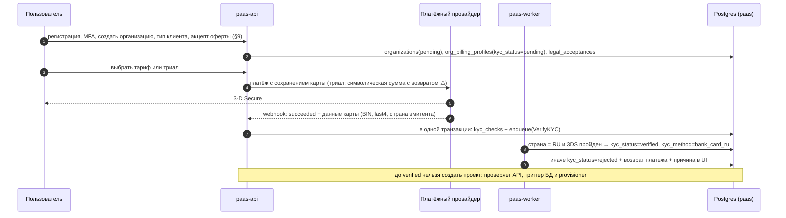
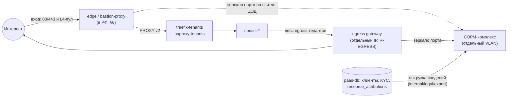
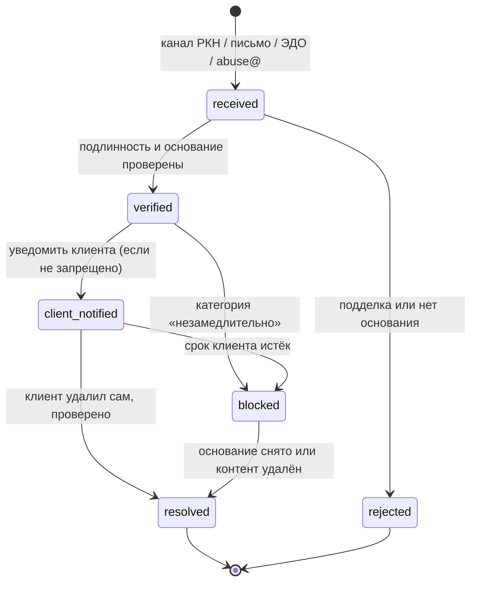
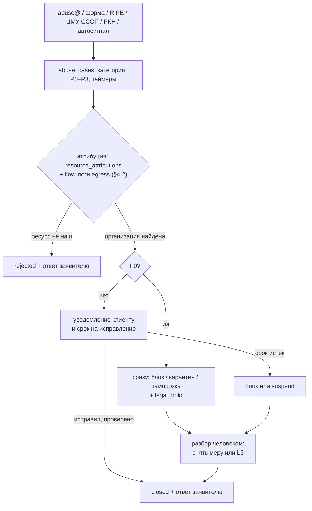

# 16. Правовая рамка РФ: хостинг-провайдер, ПДн, касса, документы

> **Дисклеймер.** Этот раздел — инженерная карта правовых требований, а не юридическая консультация. Всё, что помечено «⚠️ сверить с юристом», не проверялось по первоисточнику в этой сессии.

## TL;DR

- **Это гейт ДО первого постороннего пользователя, не только платного.** По 149-ФЗ PaaS — провайдер хостинга. Отсюда реестр РКН (406-ФЗ, ПП № 2008), российское юрлицо, мощности в РФ, СОРМ (заявление в ФСБ за 45+ дней), ГосСОПКА, 12 часов на устранение источника атаки, DDoS-защита и ЦМУ ССОП, идентификация клиентов, хранение сведений о них 1 год. Бесплатность, B2B-договоры и слово «PaaS» статус не снимают; санкции — вплоть до запрета деятельности и блокировки (§1–3).
- **Главный блокер — география.** Bastion стоит в Германии; кластер, по исследованию 08, вероятно, у OVH в ЕС (подтвердить владельцу). В РФ должно стоять всё, чего касается клиент. Если кластер в ЕС, PaaS для России — это новый кластер в российском ЦОДе тем же репозиторием, который заодно закрывает HA-гейт D12 (§6).
- **Главная неизвестная — СОРМ.** Собственный комплекс стоит 5–10 млн ₽ плюс ~30 % в год (исследование 08) и на масштабе соло-оператора не окупается. Реален только СОРМ как услуга площадки, и это критерий №1 при выборе ЦОДа. Архитектура D1–D15 почти не меняется: съём трафика — на аплинках edge и egress gateway (R-EGRESS), сведения о клиентах — выгрузкой из `paas-db` (§4.3, §12).
- **Закон превращается в функции продукта** (§4):
  - идентификация картой российского банка с тремя независимыми барьерами;
  - темпоральная `resource_attributions` и flow-логи egress, чтобы ответить, кто стоял за IP, портом или доменом в момент T;
  - `legal_hold`;
  - авто-карантин за минуты под правило 12 часов;
  - блок URL с ответом 451 и запрет повторного добавления домена;
  - очереди `abuse_cases`, `legal_requests`, `security_incidents` с таймерами.
- **152-ФЗ, две роли** (§5). Для ПДн клиентов платформа — оператор: уведомление РКН, политика, локализация `paas-db`, клиентского Zitadel, логов и бэкапов в РФ. Для данных тенантов — обработчик по поручению: DPA с честным списком мер (шифрования томов на диске в MVP нет, аттестации ФСТЭК нет).
- **Форма и налоги:** ООО на УСН. Самозанятость невозможна, ИП — только если юрист подтвердит, что реестр его допускает. НДС на старте, вероятно, не платим (порог УСН), но порог снижается, поэтому цены и таблицу `plans` готовим к НДС (§7, ⚠️).
- **54-ФЗ:** чек облачной кассы провайдера на каждое списание, доплату и возврат. Идентификационный платёж делаем холдом, чтобы не плодить чеки (§8).
- **Документы** (§9–10): оферта, AUP с правом немедленной заморозки, правила обработки жалоб, политика ПДн, DPA. SLA — только после 3 manager'ов и 2 edge. Версии и акцепты хранятся в БД. Для CSAM отдельный протокол: не копировать, заморозить, legal hold, сообщить в органы.
- **Деньги и сроки** (⚠️): без СОРМ и железа — ≈ 0,25–0,8 млн ₽ разово и 60–250 тыс. ₽ в месяц. Покрытие одних этих расходов требует около 250 платящих проектов. Критический путь — 3–4 месяца при площадке в РФ, 5–6+ месяцев, если её строить (§12). Чек-лист из 32 пунктов — §11.
- **Первый шаг владельца:** за 2–4 недели получить три ответа — заключение юриста, где стоит кластер, КП по СОРМ. От них зависит, строить публичную платформу или внутреннюю (§13).

## 1. Квалификация деятельности: почему PaaS = хостинг-провайдер

**Вывод: платформа — провайдер хостинга в смысле 149-ФЗ, и назвать её «PaaS» или «облаком» статус не снимает.** Определение функциональное: важно, что делает услуга, а не как её называют.

**Норма.** 149-ФЗ «Об информации…»: провайдер хостинга — лицо, оказывающее услуги по предоставлению вычислительной мощности для размещения информации в информационной системе, постоянно подключённой к сети Интернет. Обязанности провайдера хостинга и реестр введены 406-ФЗ (2023). Порядок ведения реестра и требования к провайдерам установлены ПП РФ №2008 от 28.11.2023 (D11). ⚠️ сверить с юристом номера статей (определение — ст. 2, обязанности — ст. 10.2-1) и актуальную редакцию.

**Как под определение попадает каждая услуга:**

| Услуга | Что делает клиент | Подпадает под определение | Комментарий |
|---|---|---|---|
| Контейнеры ([07](07-svc-compute.md)) | запускает свой код, доступный из интернета | **да**, это ядро определения | мощность (CPU/RAM) + размещение информации + интернет |
| Managed Postgres / Valkey / NATS ([09](09-svc-databases.md)) | размещает свои данные на наших мощностях | **да** | |
| Registry, Harbor ([10](10-svc-registry-harbor.md)) | хранит свои образы | да, в составе услуги | |
| S3, SeaweedFS ([11](11-svc-object-storage-s3.md)) | хранит файлы, в том числе публичные | в составе PaaS — да | по исследованию 08, разъяснение Минцифры выводит «файлохранилища» из-под определения; ⚠️ сверить с юристом. Для нас это ничего не меняет: S3 продаётся вместе с контейнерами |
| Ingress, домены, сертификаты ([08](08-svc-ingress-domains-ip.md)) | направляет трафик на своё приложение | отдельно — нет, в составе — да | |
| Секреты ([12](12-svc-secrets.md)) | хранит конфигурацию | отдельно — нет | |

**Что статус НЕ снимает** (логика определения; ⚠️ сверить с юристом):

- **Бесплатность.** Определение не требует возмездности. Бесплатная бета для посторонних людей — тоже хостинг. Отсюда правило: до записи в реестре платформа обслуживает только проекты самого владельца (см. следующий список).
- **B2B-договоры вместо публичной оферты.** Статус тот же. Проще становятся только идентификация (у юрлица есть УКЭП и расчётный счёт) и абьюз (компании редко майнят и рассылают спам). Вариант «B2B без оферты» из [00](00-executive-summary.md) облегчает эксплуатацию, но **реестр, СОРМ и мощности в РФ не отменяет**.
- **Название.** «PaaS», «облако», «платформа разработки» — маркетинг, а не правовая категория.

**Что может снять статус** (⚠️ только после заключения юриста): платформа для собственных проектов владельца и его группы лиц, без услуг третьим лицам. Это вариант «внутренняя платформа» из [00](00-executive-summary.md): архитектура D1–D15 применима к нему без изменений, отпадают только биллинг и KYC.

**Практика.** На 05.05.2026 в реестре 567 провайдеров (D11), из них, по данным исследования 08, около 57 облачных. То есть РКН относит облака к хостингу, и спорить с этим на старте бессмысленно.

**Смежные статусы: подпадаем ли** (⚠️ сверить с юристом):

| Статус | Норма | Вывод для платформы | Что делаем |
|---|---|---|---|
| Организатор распространения информации (ОРИ) | ст. 10.1 149-ФЗ, сервисы обмена сообщениями пользователей интернета | платформа таким сервисом не является. NATS — брокер между приложениями тенанта, а не мессенджер для пользователей интернета | в оферте: если тенант запускает у нас мессенджер или форум, обязанности ОРИ несёт он |
| Оператор связи | 126-ФЗ «О связи», лицензия | мы не продаём доступ в интернет, транзит или VPN, значит лицензия не нужна | AUP запрещает тенантам поднимать VPN и прокси для третьих лиц (§9), иначе услугу связи на наших IP оказывает тенант, а разбираться придётся нам |
| Владелец VPN или анонимайзера | ст. 15.8 149-ФЗ | не мы | AUP: запрет средств обхода блокировок |

## 2. Реестр провайдеров хостинга РКН (ПП РФ №2008): требования по пунктам

Источник пунктов 1–8 — D11: проверено веб-поиском оркестратора, источники te-st.org (05.2026), habr/ispmanager, tadviser. Всё, что сверх D11, помечено ⚠️.

**Главное: реестр — не «подать бумагу».** Большинство пунктов — это возможности, которые **в день подачи уже должны работать** в продукте и в эксплуатации: идентификация в онбординге, реакция на атаки за 12 часов, хранение данных о клиентах, СОРМ. Поэтому юридический трек идёт параллельно с разработкой и задаёт часть требований к ней ([17](17-roadmap.md), этап 0).

| # | Требование | Суть | Что это значит для платформы | Где |
|---|---|---|---|---|
| 1 | Статус заявителя | российское юрлицо (D11). Допускается ли ИП — ⚠️ юрист: исследование 08 пишет «ЮЛ/ИП», D11 — «уточнить» | ООО как базовый вариант | §7 |
| 2 | Мощности в РФ | вычислительные мощности на территории РФ (D11) | tenant pool, control plane с данными клиентов, хранилища и edge — в российском ЦОД. **Сейчас, по всей видимости, не выполнено** | §6 |
| 3 | СОРМ | заявление в ФСБ **не позднее 45 дней** до начала работы (D11) | самый длинный жёсткий срок в календаре; техническое решение согласуется с ФСБ ⚠️ | §4.3 |
| 4 | ГосСОПКА | взаимодействие с государственной системой обнаружения компьютерных атак (D11) | соглашение (напрямую или через центр ГосСОПКА ⚠️) + процесс уведомления об инцидентах | §4.3 |
| 5 | 12 часов | устранение источника атак с IP провайдера за 12 часов (D11) | круглосуточная реакция и карантин одной кнопкой; для соло-оператора это нужно проектировать отдельно | §4.4 |
| 6 | DDoS и ЦМУ ССОП | защита от DDoS + взаимодействие с Центром мониторинга и управления сетью связи общего пользования (D11) | внешняя фильтрация трафика перед edge, контакты и регламент с ЦМУ ССОП ⚠️ | §4.4 |
| 7 | Идентификация клиентов | Госуслуги (ЕСИА), УКЭП, паспорт при личном присутствии, карта российского банка, номер российского оператора (D11). ЕБС (биометрия) — по исследованию 08, ⚠️ | шаг онбординга **до создания первого ресурса** (FR-ACC-03) | §4.1 |
| 8 | Хранение данных о клиентах | 1 год после прекращения оказания услуг (D11) | retention-модель, legal hold, выгрузка по запросу (FR-ADM-05) | §4.2 |
| 9 | Расширение реестра (планы) | реестр планируют дополнить сведениями о мощностях и о лицах, которым они предоставлены (01-VERIFIED-FACTS §6) | историю «кому принадлежал IP, порт или домен в момент T» закладываем в модель данных сразу, это дёшево | §4.2 |
| 10 | Ограничение доступа по требованию | уведомления РКН о запрещённой информации: провайдер хостинга уведомляет клиента и при его бездействии ограничивает доступ. Обязанность есть у любого провайдера хостинга независимо от реестра, ст. 15.1–15.3 149-ФЗ ⚠️ сроки | процесс с таймерами, блокировка домена или приложения | §4.5 |

**Порядок входа в реестр** (⚠️ сверить с юристом: форма заявления, канал подачи, срок рассмотрения):

1. Юрлицо создано, мощности в РФ существуют физически: договор с ЦОД, IP-адреса, оборудование.
2. Заявление по СОРМ подано в ФСБ за 45+ дней до начала оказания услуг.
3. Соглашения по ГосСОПКА и DDoS-защите заключены, контакты с ЦМУ ССОП есть.
4. Идентификация клиентов работает в продукте, данные о клиентах хранятся.
5. Заявление в РКН о включении в реестр → запись в реестре → **только после этого первый клиент** (платный или бесплатный, см. §1).

## 3. Санкции и что происходит без реестра

**Юридические санкции** (D11 и 01-VERIFIED-FACTS §6; остальное помечено):

| Нарушение | Последствие | Источник |
|---|---|---|
| Хостинг без записи в реестре или несоответствие требованиям | запрет деятельности провайдера хостинга, блокировка | D11 |
| Неисполнение требований РКН | штраф 10–20 тыс. ₽ | 01-VERIFIED-FACTS §6 |
| Новые составы КоАП для провайдеров хостинга с 01.03.2026 (ФЗ-508 от 28.12.2025) | по исследованию 08; составы и размеры ⚠️ сверить с юристом | исследование 08 |
| 152-ФЗ: утечка ПДн | оборотные штрафы (с 2025 года) и уголовная ответственность за незаконный оборот ПДн ⚠️ | §5 |
| 152-ФЗ: обработка без уведомления РКН | штраф ⚠️ | §5 |
| 54-ФЗ: расчёт без чека | штраф в процентах от суммы расчёта, ст. 14.5 КоАП ⚠️ | §8 |

**Практические санкции наступают раньше юридических и бьют сильнее:**

- **Эквайринг.** Платёжный провайдер проверяет бизнес при подключении и при жалобах. Хостинг без записи в реестре — основание отказать или отключить (⚠️ спросить у провайдера при подключении). Без рекуррентов модель подписки D10 не работает.
- **Площадка-арендодатель.** Абьюз с IP, выданных ЦОДом, порождает жалобы площадке. Её реакция — null-route или отключение сервера целиком, а это роняет **всю** платформу, а не только нарушителя. Поэтому AUP платформы не мягче AUP площадки, а реакция на абьюз быстрее её сроков (§10).
- **Общие IP.** У нас много тенантов делят один IP: egress-шлюз ([01](01-architecture-overview.md) §6.1) и bastion. Блокировка по IP из-за ресурса одного тенанта задевает всех на этом адресе (⚠️ механика фильтрации). Для нас быстрая реакция на уведомления РКН критичнее, чем для VPS-хостера, у которого IP на клиента.
- **Рынок.** Без мощностей в РФ российские компании не могут законно держать у нас первичные БД с ПДн граждан РФ (локализация, §5). Это отрезает основной B2B-сегмент: почти любой сайт с регистрацией обрабатывает ПДн.

**Вывод.** «Запустить сначала, оформить потом» не работает. Штрафы невелики, но запрет деятельности, блокировка и отказ платёжки означают конец бизнеса, и наступают они без предупреждения.

## 4. Что это значит технически для платформы

Каждое требование реестра — это функция продукта или процесс эксплуатации. Карта «требование → где живёт в системе»:

| Требование | Компонент | Требование в [19](19-requirements.md) |
|---|---|---|
| Идентификация клиента | онбординг `paas-api` + платёжный провайдер + `org_billing_profiles` ([05](05-data-model.md)) | FR-ACC-03 |
| Хранение данных о клиентах 1 год | retention-задания владельца БД + `legal_hold` | NFR-CMP-01 |
| Выгрузка по законному запросу | админка, роль `legal`, аудит каждого чтения | FR-ADM-05 |
| 12 часов на источник атаки | карантин одной кнопкой (`paas.1520.tech/lifecycle=suspended` + CCNP `paas-tenant-suspended`, [02](02-tenancy-and-isolation.md) §2.4) + дежурство | FR-ADM-02, FR-ADM-03 |
| Ограничение доступа по требованию РКН | `paas-worker`: снятие маршрута домена через git, запрет повторного добавления | §4.5 |
| СОРМ | структурированные данные о клиентах в РФ + точка на edge ⚠️ | §4.3 |
| ГосСОПКА, инциденты 152-ФЗ | runbook + `audit_log` | §4.3 |
| DDoS | внешняя фильтрация перед bastion-proxy | §4.4 |

### 4.1. Идентификация клиента в онбординге

**Решение по способам (406-ФЗ допускает пять, D11):**

| Способ | Статус | Почему |
|---|---|---|
| **Карта российского банка** (привязка с 3-D Secure, страна эмитента = RU) | **MVP, основной для физлиц и ИП** | интеграцию с платёжкой мы строим всё равно (рекурренты, D10). Идентификация достаётся без отдельного провайдера и без хранения документов |
| **Оплата первого счёта с расчётного счёта в российском банке** | **MVP для юрлиц** ⚠️ | совпадает с «ручным биллингом по счёту» из MVP-минимума ([17](17-roadmap.md)). ⚠️ юрист: засчитывается ли безналичный платёж юрлица как идентификация. Если нет — УКЭП подписанта |
| УКЭП | Ф2 | подпись challenge в браузере требует криптоплагина (⚠️ КриптоПро ЭЦП Browser plug-in) — тяжёлый UX и поддержка. Нужна юрлицам, которые не платят по счёту |
| Госуслуги (ЕСИА) | Ф2+ | подключение ИС к ЕСИА: регистрация ИС, соглашение, ГОСТ-подпись запросов ⚠️. Для соло-оператора это недели работы ради способа, который карта уже покрывает |
| Номер российского оператора | не как основной; антифрод-сигнал | ⚠️ юрист: достаточно ли SMS-подтверждения владения номером из российского плана нумерации. Плюс SMS-pumping и стоимость. Код +7 7xx — Казахстан, проверять DEF-диапазоны РФ |
| Паспорт при личном присутствии | нет | онлайн-продукт, соло-оператор |

**Отвергнуто: загрузка скана паспорта.** Это не дистанционный способ из перечня D11. Скан — ПДн повышенного риска: утечка сканов означает оборотный штраф по 152-ФЗ, а проверить подлинность скана мы всё равно не можем.

**Ловушка «карта МИР ≠ российская карта».** Карты МИР выпускают и банки других стран (⚠️ проверить актуальный список). Оплата пройдёт, но «картой российского банка» такая карта не является. Поэтому проверяем **страну эмитента** из ответа провайдера, а не платёжную систему. ⚠️ проверить на стенде: поле страны эмитента в API выбранного провайдера ([13](13-billing-and-quotas.md) §7).

**Поток онбординга** (развитие схемы из [01](01-architecture-overview.md)):



**Три независимых барьера** (та же философия, что у D4: каждый слой не доверяет предыдущему):

1. `paas-api` не принимает `POST /v1/orgs/{id}/projects`, пока организация не идентифицирована; UI показывает шаг «Подтвердите карту».
2. Триггер в БД: даже баг API или скомпрометированная роль `paas_api` не создадут проект у неидентифицированной организации.
3. `paas-provisioner` перед созданием namespace перечитывает `kyc_status` (он и так перечитывает объект из БД, [05](05-data-model.md)).

```sql
-- 406-ФЗ: ресурсы только идентифицированным клиентам. Второй барьер после paas-api.
CREATE FUNCTION paas.require_identified_org() RETURNS trigger
LANGUAGE plpgsql AS $$
BEGIN
  IF NOT EXISTS (
    SELECT 1 FROM org_billing_profiles
    WHERE org_id = NEW.org_id AND kyc_status = 'verified'
  ) THEN
    RAISE EXCEPTION 'organization % is not identified (406-FZ)', NEW.org_id
      USING ERRCODE = 'check_violation';
  END IF;
  RETURN NEW;
END $$;

CREATE TRIGGER projects_require_identified_org
  BEFORE INSERT ON projects
  FOR EACH ROW EXECUTE FUNCTION paas.require_identified_org();

-- История проверок: append-only, UPDATE/DELETE запрещены (как audit_log в 05).
-- Хранится до terminated_at + 1 год (§4.2). Предложение для 05-data-model.
CREATE TABLE kyc_checks (
  id              uuid PRIMARY KEY DEFAULT paas.new_id(),
  org_id          uuid NOT NULL REFERENCES organizations (id),
  method          text NOT NULL CHECK (method IN ('bank_card_ru', 'bank_transfer_ru', 'ukep', 'gosuslugi', 'phone_ru')),
  provider        text NOT NULL,                              -- yookassa | cloudpayments | tbank | ...
  provider_ref    text NOT NULL,                              -- id платежа или проверки у провайдера
  card_bin        text CHECK (card_bin ~ '^[0-9]{6,8}$'),     -- маска допустима, полный PAN — НИКОГДА
  card_last4      text CHECK (card_last4 ~ '^[0-9]{4}$'),
  issuer_country  text CHECK (issuer_country ~ '^[A-Z]{2}$'),
  issuer_name     text CHECK (length(issuer_name) <= 200),
  payer_inn       text CHECK (payer_inn ~ '^([0-9]{10}|[0-9]{12})$'), -- для bank_transfer_ru
  result          text NOT NULL CHECK (result IN ('verified', 'rejected')),
  reason          text,
  actor_user_id   uuid REFERENCES users (id),
  client_ip       inet,
  created_at      timestamptz NOT NULL DEFAULT now(),
  UNIQUE (provider, provider_ref)                             -- идемпотентность вебхука
);
```

Метод `bank_transfer_ru` в `kyc_checks` — предложение: в CHECK `org_billing_profiles.kyc_method` из [05](05-data-model.md) его пока нет. Добавить после ответа юриста.

```go
// internal/kyc/card.go — чистая функция, покрыта табличным тестом.
type CardEvidence struct {
	Provider, PaymentID string
	BIN, Last4          string
	IssuerCountry       string // ISO 3166-1 alpha-2, из ответа провайдера
	IssuerName          string
	ThreeDSPassed       bool
}

var (
	ErrNo3DS           = errors.New("kyc: 3-D Secure not passed")
	ErrNotRussianIssuer = errors.New("kyc: card is not issued by a Russian bank")
)

func VerifyCard(e CardEvidence) error {
	if !e.ThreeDSPassed {
		return ErrNo3DS
	}
	if e.IssuerCountry != "RU" {
		return ErrNotRussianIssuer
	}
	return nil
}
```

**Что сохраняем и чего не сохраняем:**

- Сохраняем: способ, провайдера, id платежа, BIN и последние 4 цифры, банк и страну эмитента, время, IP, пользователя, акцепт оферты. Этого достаточно, чтобы по запросу показать, как и когда клиент идентифицирован (⚠️ юрист: полнота состава).
- Никогда: полный номер карты, CVV (запрет PCI DSS; мы их и не видим, форма карты у провайдера), сканы документов.
- Карта идентифицирует **плательщика**, а не того, кто нажимает кнопки. Оферта фиксирует, что клиент — лицо, чья карта или счёт идентифицированы, и он отвечает за действия участников организации.

**Повторная идентификация.** Нужна при смене способа оплаты на карту другого держателя, при передаче владения организацией (FR-ACC-09, Ф2) и после 3 отказов в подряд (антифрод, [13](13-billing-and-quotas.md) §9). Замена карты тем же держателем — новая строка в `kyc_checks`, статус не сбрасывается.

### 4.2. Журналирование и хранение данных о клиентах (1 год)

**Что такое «данные о клиентах» для нашей системы.** Точный состав задают ПП №2008 и требования к идентификации (⚠️ сверить с юристом). Инженерный минимум, который закрывает и реестр, и запросы правоохранителей, и абьюз:

1. **Кто клиент**: `org_billing_profiles` (тип, наименование, ИНН, контакты для чеков) + `kyc_checks` (§4.1).
2. **Договор**: какую версию оферты и когда акцептовал, с какого IP (`legal_acceptances`, §9).
3. **Какие мощности и адреса ему предоставлены и когда.** Это самое неочевидное. Типовой запрос звучит так: «кому принадлежал `shop.example.ru` / `IP:20432` / исходящий трафик с IP X в 03:12 14 октября». В [05](05-data-model.md) таблицы `l4_ports`, `ip_slots`, `domains` хранят **текущее** владение. После освобождения порта и 24 часов cooldown ответить уже нечем. Восстанавливать ответ из `details jsonb` в `audit_log` хрупко.
4. **Платежи**: `payments`, `invoices` (54-ФЗ, бухучёт, §8).

**Решение: отдельная темпоральная таблица владения** (предложение для [05](05-data-model.md)). Заполняется триггерами на смену статуса в `l4_ports` / `ip_slots` / `domains` и событиями provisioner'а. Пересечение периодов владения одним ресурсом запрещено ограничением БД:

```sql
CREATE EXTENSION IF NOT EXISTS btree_gist;   -- contrib, есть в образах CNPG (⚠️ проверить)

-- Кто владел адресуемым ресурсом в каждый момент времени. Append-only (закрытие периода —
-- единственный разрешённый UPDATE: upper(during) из NULL в now()).
CREATE TABLE resource_attributions (
  id          bigint GENERATED ALWAYS AS IDENTITY PRIMARY KEY,
  kind        text NOT NULL CHECK (kind IN ('domain', 'l4_port', 'ip_slot', 'namespace', 'egress_pool')),
  key         text NOT NULL,        -- 'shop.example.ru' | '203.0.113.10:20432' | 'slot-03' | 't-k3x9q2m7ab'
  org_id      uuid NOT NULL REFERENCES organizations (id),
  project_id  uuid,
  during      tstzrange NOT NULL,   -- [выдан, освобождён)
  EXCLUDE USING gist (kind WITH =, key WITH =, during WITH &&)
);
CREATE INDEX resource_attributions_org_idx ON resource_attributions (org_id);

-- Ответ на запрос «кому принадлежал домен в момент T»:
SELECT o.short_id, p.legal_name, p.inn, a.during
FROM resource_attributions a
JOIN organizations o ON o.id = a.org_id
JOIN org_billing_profiles p ON p.org_id = a.org_id
WHERE a.kind = 'domain' AND a.key = 'shop.example.ru'
  AND a.during @> timestamptz '2026-10-14 03:12:00+03';
```

**Исходящий трафик через общий egress-IP.** Все тенанты выходят в интернет через IP egress-шлюза ([01](01-architecture-overview.md) §6.1). По IP источник не определить, нужна запись потоков. Решение: экспорт flow-логов Hubble **только для трафика tenant-namespace → `world`**, в обрезанном виде: время, namespace, pod, dst IP, dst port, протокол, verdict. Хранение — 30 дней в Loki, в отдельном потоке, недоступном тенантам. Этого хватает на 12-часовое правило и на типичную жалобу (приходит в течение дней). Нужны ли более долгие сроки для запросов правоохранителей и СОРМ — ⚠️ юрист. Объём потока при абьюзе (сканер, DDoS) — ⚠️ замерить на стенде, при необходимости агрегировать в минутные бакеты `(namespace, dst_ip, dst_port)`.

**Legal hold.** По запросу правоохранителей, при споре или при CSAM-инциденте (§10) удаление данных организации нужно заморозить: ресурсов, PVC, бакетов, образов, логов, строк БД. Решение — таблица `legal_holds (id, org_id, reason, request_ref, created_by, created_at, released_at)`. Все retention- и purge-задания, включая очистку 7-дневной корзины томов тенантов (SC `lnstr-tenant-local` / `lnstr-tenant-multi-sync` с `reclaimPolicy: Delete`, [02](02-tenancy-and-isolation.md) §3.5, [06](06-delivery-pipeline.md) §14.5) и удаление Vault-путей, проверяют `NOT EXISTS (активный hold)` и пропускают такую организацию. Отдельная таблица, а не колонка: holds бывают несколько сразу, и у каждого своё основание.

**Сроки хранения: юридическая часть матрицы** (дополняет таблицу [05](05-data-model.md) §7 и [02](02-tenancy-and-isolation.md) §2.5):

| Данные | Срок после прекращения договора | Основание | Что потом |
|---|---|---|---|
| Идентификация (`kyc_checks`, KYC-поля профиля), контакты | **1 год** | 406-ФЗ, D11 | анонимизация (`anonymized_at`) |
| Акцепты оферты | 3 года | исковая давность, ГК ⚠️ | удаление |
| Счета, платежи, чеки | ≥ 5 лет | бухгалтерский и налоговый учёт ⚠️ сверить с бухгалтером | удаление |
| `resource_attributions` | 3 года | ответы на запросы и претензии ⚠️ | удаление |
| Flow-логи egress (Hubble) | 30 дней | 12-часовое правило, абьюз ⚠️ юрист | ротация Loki |
| `audit_log` | 13 мес. в БД + 3 года в архиве ([05](05-data-model.md) §7) | расследования; ⚠️ юрист: не требует ли СОРМ иного | удаление |
| Abuse-тикеты и юридические запросы | 3 года | споры, повторные нарушители | удаление |
| Данные тенанта (PVC, БД, S3, образы) | окно экспорта из оферты (D10: 30 дней) | договор | удаление, если нет legal hold |

**Конфликт «хранить по 406-ФЗ vs удалить по 152-ФЗ»** ([05](05-data-model.md) §8, решение 3) снимается самим 152-ФЗ. Обработка для выполнения обязанности, возложенной законом, — самостоятельное основание, для которого согласие не нужно. Обязанность удалить по достижении цели действует, «если иное не предусмотрено федеральным законом». Значит, храним ровно 1 год, затем анонимизируем. ⚠️ подтвердить у юриста, но архитектурно это уже заложено (`retain_until` = `terminated_at` + 1 год).

**Доступ к этим данным.** Роль БД `paas_legal` (только `SELECT` на профили, `kyc_checks`, `resource_attributions`, `legal_acceptances`, `payments`). Используется одним админским эндпоинтом выгрузки (FR-ADM-05). Каждый вызов пишет в `audit_log` запись `legal.export` со ссылкой на реквизиты запроса. Выгрузка — JSON + человекочитаемый PDF, SHA-256 обоих файлов фиксируется в аудите.

### 4.3. СОРМ и ГосСОПКА: что это меняет в инфраструктуре

**Вывод.** СОРМ и ГосСОПКА — это не код в `paas-*`, а две внешние интеграции. Встают они в точки, через которые и так идёт весь трафик тенантов: на входе edge (bastion-proxy), на выходе egress gateway (R-EGRESS, [01](01-architecture-overview.md) §6.1). Архитектуру D1–D15 они почти не меняют. Меняются три вещи: площадка, отдельный сетевой сегмент для чужого оборудования и один экспорт сведений о клиентах. Технический объём СОРМ для провайдера хостинга определяется при согласовании с ФСБ (⚠️ сверить с юристом и интегратором СОРМ).

**Что известно, а что нет:**

| | Известно (D11) | Неизвестно (⚠️ юрист или интегратор) |
|---|---|---|
| СОРМ | заявление в ФСБ не позднее 45 дней до начала работы | состав технических требований к провайдеру хостинга. Только сведения о клиентах и услугах или ещё и съём трафика? Нужен сертифицированный комплекс или хватит программного экспорта? Можно ли использовать решение площадки? |
| ГосСОПКА | обязанность взаимодействовать | формат: соглашение с НКЦКИ напрямую или через лицензированный центр ГосСОПКА; перечень инцидентов и сроки уведомлений |
| Стоимость | — | по исследованию 08, собственный СОРМ-комплекс — 5–10 млн ₽ капзатрат плюс около 30 % в год на поддержку (⚠️ оценка, §12) |

**Где СОРМ встаёт в схему.** Узких точек две, и обе уже есть в архитектуре:



1. **Съём трафика — на аплинках edge и egress-нод, а не внутри кластера.** Если требования его включают, это зеркало порта (SPAN/TAP) на коммутаторе площадки. Поток однонаправленный: комплекс ничего не шлёт в наши сети и не получает доступа к apiserver, Vault или БД. Работает это, только пока точек мало и они известны. Вход тенантов идёт только через edge: NodePort и LoadBalancer тенантам запрещены VAP и квотой ([07](07-svc-compute.md) §8), системные NodePort закрыты anti-bypass-политиками ([08](08-svc-ingress-domains-ip.md)). Выход идёт только через egress gateway. Оговорка из [01](01-architecture-overview.md) §6.1: первые пакеты нового пода могут уйти с IP ноды. ⚠️ Согласовать с интегратором, хватит ли зеркала egress-нод или нужно зеркалировать и tenant-ноды.
2. **Сведения о клиентах — программная выгрузка из `paas-db`.** Состав тот же, что для запросов правоохранителей (§4.2): профиль, способ идентификации, какие ресурсы и адреса выданы и когда (`resource_attributions`). Выгрузку делает один модуль `internal/legal/export` для двух потребителей: админского эндпоинта FR-ADM-05 и интерфейса СОРМ (формат ⚠️ по требованиям). Отдельную «базу абонентов» не заводим: две копии неизбежно разойдутся.
3. **Чужое оборудование — в отдельном сегменте.** Физический комплекс ставится в стойку площадки в отдельный VLAN без маршрута в сеть нод. В ansible-инвентарь его не включаем, в CCNP не описываем: это единственный узел, которым не управляет этот репозиторий.
4. **Сервис площадки дешевле собственного комплекса.** Часть российских ЦОДов и интеграторов подключает клиентов-хостеров к своему СОРМ-решению по договору (⚠️ проверить у кандидатов). Поэтому при выборе площадки (§6) это критерий номер один после географии: такая услуга заменяет 5–10 млн ₽ капзатрат ежемесячным платежом.
5. **Конфиденциальность.** Схемы подключения, переписка с ФСБ и параметры СОРМ не хранятся в git и не описываются в публичных документах, включая этот (⚠️ режим — у юриста). В репозитории остаётся только факт: «аплинки edge и egress-нод зеркалируются».

**ГосСОПКА.** Суть — сообщать о компьютерных инцидентах в НКЦКИ и получать от него сведения об угрозах (⚠️ формат). Соло-оператору рекомендуем подключаться через коммерческий лицензированный центр ГосСОПКА: он же даёт мониторинг и шаблоны уведомлений. Прямое соглашение с НКЦКИ — запасной вариант (⚠️ проверить, допустим ли для провайдера хостинга посредник). На нашей стороне остаётся:

- **Реестр инцидентов** в `paas-db`. Он же закрывает уведомление РКН об утечке ПДн (§5): первичное — в течение 24 часов, итоговое — в течение 72 часов (ст. 21 152-ФЗ, ⚠️ сверить).
- **Источники сигналов уже есть:** `audit_log`, abuse-очередь FR-ADM-03, авто-карантин ([03](03-security-model.md) §13.2), алерты `mon-system`. ГосСОПКА добавляет не детекторы, а обязанность **сообщить** в срок.
- **Входящие индикаторы** от НКЦКИ (адреса C2, ботнетов) идут в тот же `CiliumCIDRGroup paas-egress-blocklist`, который provisioner обновляет из FireHOL и Spamhaus ([03](03-security-model.md) §13.1).

```sql
-- Реестр инцидентов: ГосСОПКА (НКЦКИ) и 152-ФЗ (РКН). Предложение для 05-data-model.
-- Таймеры считает River periodic job: алерт владельцу за 6 ч и за 1 ч до дедлайна.
CREATE TABLE security_incidents (
  id                uuid PRIMARY KEY DEFAULT paas.new_id(),
  detected_at       timestamptz NOT NULL,
  category          text NOT NULL CHECK (category IN
                      ('compromise', 'ddos_on_us', 'attack_from_us', 'pd_leak', 'malware', 'other')),
  summary           text NOT NULL CHECK (length(summary) <= 2000),
  affected_orgs     uuid[] NOT NULL DEFAULT '{}',
  pd_involved       boolean NOT NULL DEFAULT false,   -- true → дедлайны РКН: detected_at + 24 ч / + 72 ч
  nkcki_notified_at timestamptz,
  rkn_initial_at    timestamptz,                      -- 152-ФЗ: первичное уведомление
  rkn_final_at      timestamptz,                      -- 152-ФЗ: результаты расследования
  closed_at         timestamptz,
  created_by        text NOT NULL                     -- sub сотрудника из staff-Zitadel
);
```

### 4.4. Реакция на атаки с IP платформы (12 часов) и DDoS

**Вывод.** «12 часов» — предел закона, а не цель. Наши цели: автоматический карантин за минуты, решение человека за 4 часа. Все 12 часов остаются только на случаи, где нужен разбор. Соло-оператор уложится в эти сроки только за счёт автоматики ([03](03-security-model.md) §13.2) и второго человека с доступом по процедуре ([15](15-observability-and-operations.md) §1).

**Какие IP «наши» и откуда может идти атака:**

| IP | Кто за ним | Может ли быть источником атаки | Чем закрыто |
|---|---|---|---|
| egress-IP, 1–2 шт. (R-EGRESS) | исходящий трафик **всех** тенантов | да, это главный канал: спам, сканирование, брутфорс, участие в DDoS, связь ботов с C2 | порт 25 закрыт; на trial только 80/443 и DNS ([13](13-billing-and-quotas.md) §2.1); блоклист адресатов; потолок полосы на под; авто-карантин |
| `tenant-ingress-ip` на edge | входящий трафик к приложениям | практически нет: edge проксирует только TCP, UDP-сервисы тенантам не публикуются. Открытые DNS-, NTP- или memcached-усилители у тенанта из интернета недоступны | статичный конфиг edge ([08](08-svc-ingress-domains-ip.md)) |
| IP нод | системный egress: GitLab, cert-manager, бэкапы | кратко: первые пакеты нового пода до применения политики ([01](01-architecture-overview.md) §6.1) | политика egress gateway; ⚠️ на стенде проверить, видно ли в Hubble tenant-трафик с IP нод, и завести на него алерт |

**Внутренние нормативы реакции:**

| Этап | Норматив | Механизм |
|---|---|---|
| Жёсткий автоматический сигнал (попытки SMTP, stratum, пробинг приватных сетей, флуд) → карантин egress | ≤ 5 мин, без человека | L1 `CiliumNetworkPolicy paas-quarantine` ([03](03-security-model.md) §13.2) |
| Внешнее уведомление (ЦМУ ССОП, НКЦКИ, РКН, abuse-отдел чужого провайдера) → подтверждение приёма | ≤ 1 ч днём, ≤ 4 ч ночью | `abuse_cases` (§10); ночью будит только категория P0 |
| Атрибуция «кто стоял за IP X в момент T» | ≤ 1 ч после приёма | `resource_attributions` + flow-логи egress за 30 дней (§4.2) |
| Устранение источника: карантин или suspend | цель **≤ 4 ч**; предел закона **12 ч** (D11) | L1 или L2; кнопка «Заморозить» в staff-консоли работает с телефона |
| Ответ заявителю или органу | ≤ 24 ч | шаблон из `abuse_cases` |

⚠️ Юрист: от какого момента отсчитываются 12 часов (получение уведомления или начало атаки), кто вправе уведомлять и каким каналом. Если от начала атаки, требование в принципе невыполнимо без автоматического детекта.

**Предохранитель тоже должен будить.** В [03](03-security-model.md) §13.2 авто-карантин ограничен: не больше 20 в час на кластер и не больше одного на организацию без подтверждения человеком. Сработавший предохранитель — это page владельцу, а не тихий пропуск. Иначе ночью 12 часов уйдут впустую.

**Общий egress-IP дорого стоит.** Попадание одного тенанта в Spamhaus или другой блэклист портит исходящую репутацию всех тенантов на этом IP. Страдают отправка почты через 465/587 у легальных провайдеров и API, которые проверяют репутацию IP. Поэтому быстрая реакция — вопрос не только закона, но и экономики. Вариант на Ф2: отдельный egress-IP для новых клиентов (trial и первые 30 дней), чтобы новички не делили репутацию с проверенными (решение владельца, §13).

**DDoS на нас (входящий):**

- **Сейчас** есть только базовая сетевая защита провайдера bastion ([08](08-svc-ingress-domains-ip.md) §13.2) и лимиты в stick-table и Traefik. Для требования реестра этого мало.
- **Решение:** внешняя L3/L4-фильтрация перед edge у российского anti-DDoS-провайдера или у самой площадки. Под защиту идут защищённые IP (или анонс префикса через фильтрующую сеть) для `tenant-ingress-ip` и консоли. Кандидаты: услуга ЦОДа, StormWall (с ним у владельца есть опыт по другому проекту), DDoS-Guard, Qrator (⚠️ сравнить КП). Обязательное условие — TCP-passthrough с PROXY v2 **без терминации TLS**. Если фильтр терминирует TLS для приложений тенантов, мы передаём ключи и трафик клиентов третьей стороне (152-ФЗ, §5).
- **Cloudflare для платформы не выбираем:** это иностранный сервис, а требование предполагает взаимодействие с ЦМУ ССОП (⚠️ юрист: выполнимо ли требование реестра с иностранной фильтрацией). Тенантам Cloudflare остаётся доступен как их собственный выбор (D5). В этом случае оператор данных, идущих через Cloudflare, — тенант (§5).
- **ЦМУ ССОП:** контакт, регламент и, возможно, подключение к их системе обмена сведениями об атаках (⚠️ порядок). С нашей стороны — дежурный канал (email и телефон), который попадает в тот же конвейер `abuse_cases`.

### 4.5. Запросы РКН, правоохранителей, блокировка контента

**Вывод.** Обязанность ограничить доступ по требованию есть у любого провайдера хостинга, с реестром или без (ст. 15.1–15.3 149-ФЗ, ⚠️). Технически это «снять маршрут», а это backend и так делает при suspend за неоплату. Сверх этого нужны три вещи: точечная блокировка (URL, а не весь сайт), запрет повторного добавления и журнал с таймерами.

**Какие требования приходят:**

| Кто | Что требует | Норма и срок (⚠️ сверить все сроки) | Наша реакция |
|---|---|---|---|
| РКН (единый реестр запрещённой информации) | уведомить владельца ресурса, при его бездействии ограничить доступ | ст. 15.1: сутки на уведомление клиента, сутки клиенту на удаление, затем ограничиваем мы | таймеры в `legal_requests`, блок-правило |
| Генпрокуратура через РКН (экстремизм, призывы к беспорядкам) | ограничить доступ | ст. 15.3, «незамедлительно» | сначала блок, потом уведомление клиента |
| Правообладатель, Мосгорсуд | удалить нарушающий контент | ст. 15.2 149-ФЗ. По ст. 1253.1 ГК посредник не отвечает, если своевременно принял меры после письменного заявления | notice-and-takedown: переслать клиенту, при бездействии блокировать |
| Правоохранители (МВД, СК, ФСБ), суд | сведения о клиенте, сохранность данных | УПК, 144-ФЗ «Об ОРД», «О полиции»: основания различаются | проверка подлинности → выгрузка FR-ADM-05 → запись `legal.export` в аудите |
| Субъект ПДн | доступ к своим ПДн, исправление, удаление | 152-ФЗ, 10 рабочих дней | §5 |

**Жизненный цикл требования:**



**Как блокируем.** Уровень выбираем от узкого к широкому и берём самый узкий, который исполняет требование:

1. **URL или путь.** Блок-правило ставится перед маршрутом приложения. Запросы на `Host() && Path()` уходят в платформенный сервис `paas-blocked` в ns `traefik-tenants`, который отвечает `451 Unavailable For Legal Reasons` (RFC 7725). Остальной сайт клиента работает. Это важно: требование касается страницы, а снятие всего сайта из-за одной страницы — лишний ущерб клиенту и претензия уже к нам.
2. **Хост.** Все маршруты домена или платформенного поддомена переводятся на `paas-blocked`. Механика та же, что у takedown в [08](08-svc-ingress-domains-ip.md) §13.3.
3. **Объект или бакет S3.** Снимаем публичность (`DeleteBucketPolicy`), [11](11-svc-object-storage-s3.md) R6.
4. **Образ в registry.** Отключаем pull и push у robot'ов организации ([10](10-svc-registry-harbor.md)).
5. **Весь проект.** `lifecycle=suspended` плюс CCNP `paas-tenant-suspended` ([02](02-tenancy-and-isolation.md) §2.4).

```yaml
# Рендер backend → git → tenant-ArgoCD (D3). Блок-правило идёт первым и с явным priority.
apiVersion: traefik.io/v1alpha1
kind: IngressRoute
metadata:
  name: app-a1b2c3
  namespace: t-k3x9q2m7ab
  labels:
    paas.1520.tech/managed-by: paas
    paas.1520.tech/tenant-ns: t-k3x9q2m7ab
spec:
  entryPoints: [websecure]
  routes:
    - kind: Rule
      match: Host(`shop.example.ru`) && Path(`/catalog/item-123`)
      priority: 100000                     # выше любого маршрута приложения
      services:
        - name: paas-blocked               # 451; в allow-list VAP вместе с paas-suspended (08 §8.4)
          namespace: traefik-tenants
          port: 8080
    - kind: Rule
      match: Host(`shop.example.ru`)
      services:
        - name: app-a1b2c3
          port: 8080
```

⚠️ Добавить `traefik-tenants/paas-blocked` в allow-list VAP на кросс-namespace ссылки ([08](08-svc-ingress-domains-ip.md) §8.4), рядом с `paas-suspended`. На стенде проверить: блок-правило перекрывает маршрут приложения с любой длиной `match`.

**Если git-путь недоступен.** Когда лежит GitLab или tenant-ArgoCD, а требование «незамедлительное», provisioner напрямую через API ставит проекту `lifecycle=suspended`. CCNP отрезает входящий трафик от ingress-контроллеров. Это грубее (закрывается проект, а не страница), зато работает без git. После восстановления конвейера ставим точный блок и снимаем suspend.

**Повторное добавление.** Активный блок хоста запрещает добавить этот домен в любой проект: проверка в шаге верификации домена ([08](08-svc-ingress-domains-ip.md)) до TXT-челленджа. Снять блок может только роль `legal`, с записью в `audit_log`.

```sql
-- Входящие юридические требования. Доступ только у роли paas_legal: у paas_api прав на таблицу нет,
-- чтобы конфиденциальный запрос правоохранителей не утёк через баг API. Предложение для 05.
CREATE TABLE legal_requests (
  id            uuid PRIMARY KEY DEFAULT paas.new_id(),
  authority     text NOT NULL CHECK (authority IN
                  ('rkn', 'prosecutor', 'court', 'police', 'fsb', 'investigative', 'rightsholder', 'pd_subject', 'other')),
  kind          text NOT NULL CHECK (kind IN ('restrict_access', 'disclose_info', 'preserve_data', 'pd_subject_request')),
  external_ref  text NOT NULL,                 -- номер уведомления или исходящий номер запроса
  received_at   timestamptz NOT NULL,
  deadline_at   timestamptz,                   -- по виду требования (⚠️ сроки — у юриста)
  org_id        uuid REFERENCES organizations (id),   -- NULL, пока не атрибутировано (§4.2)
  subject       text NOT NULL,                 -- URL | домен | IP:порт | ИНН
  confidential  boolean NOT NULL DEFAULT false,         -- true → клиента не уведомляем
  status        text NOT NULL DEFAULT 'received' CHECK (status IN
                  ('received', 'verified', 'client_notified', 'blocked', 'resolved', 'rejected')),
  documents_uri text,                          -- файл запроса в приватном бакете paas-legal; SHA-256 — в audit_log
  handled_by    text NOT NULL                  -- sub сотрудника из staff-Zitadel
);

CREATE TABLE content_blocks (
  id            uuid PRIMARY KEY DEFAULT paas.new_id(),
  request_id    uuid REFERENCES legal_requests (id),  -- NULL для блоков по abuse_cases (§10)
  org_id        uuid NOT NULL REFERENCES organizations (id),
  kind          text NOT NULL CHECK (kind IN ('url', 'host', 'bucket', 'registry_repo', 'project')),
  target        text NOT NULL,                 -- 'shop.example.ru/catalog/item-123' | 'shop.example.ru' | ...
  created_at    timestamptz NOT NULL DEFAULT now(),
  lifted_at     timestamptz,
  lifted_reason text
);
CREATE UNIQUE INDEX content_blocks_active_uq ON content_blocks (kind, target) WHERE lifted_at IS NULL;
```

**Правила для запросов правоохранителей:**

- **Подлинность** проверяем обратным звонком по номеру с официального сайта органа, а не из письма. Смотрим подпись и указанное правовое основание.
- **Объём ответа — ровно запрошенное.** Сведения о клиенте (профиль, KYC, `resource_attributions`, платежи) выгружаются по процедуре §4.2. **Содержимое данных клиента** (его БД, бакеты, тома) без решения суда или иного основания, подтверждённого юристом, не передаём (⚠️ юрист: какие основания достаточны для чего).
- **Запрос сохранить данные** — это `legal_hold` (§4.2) на организацию.
- **Если запрос запрещает уведомлять клиента** (`confidential`), экран «заморожено» ([14](14-frontend-console.md)) показывает нейтральную причину по шаблону.

**Канал поступления.** Как РКН направляет уведомления провайдеру хостинга (личный кабинет, система взаимодействия, email из заявления) — ⚠️ юрист. Минимум: отдельный ящик `legal@` с пересылкой в тот же канал эскалации, что у алертов ([15](15-observability-and-operations.md)), и ежедневная сверка вручную. Если у канала есть API, `paas-worker` опрашивает его периодическим заданием и сам создаёт строку в `legal_requests`.

**Сопутствующий ущерб от блокировки по IP.** Если заблокируют `tenant-ingress-ip`, пострадают все, чей домен смотрит на него. Для этого есть запасной непубличный ingress-IP ([08](08-svc-ingress-domains-ip.md) §13.3). Быстрое исполнение точечных требований — лучшая профилактика блокировки по IP.

## 5. 152-ФЗ: платформа как оператор и как обработчик ПДн

**Вывод.** У платформы две роли. Для ПДн своих клиентов она **оператор**: уведомление РКН, политика, меры защиты, локализация. Все базы с ПДн клиентов (control-plane БД, клиентский Zitadel, логи, бэкапы) должны быть в РФ. Для ПДн, которые тенанты хранят в своих приложениях, БД и бакетах, платформа — **лицо, обрабатывающее по поручению** (ст. 6 ч. 3): поручение (DPA) входит в оферту, список мер защиты в нём честный. Аттестацию ФСТЭК и сертифицированные СЗИ не обещаем. Всё в разделе, кроме факта «152-ФЗ требует уведомления и локализации» (D11), — ⚠️ сверить с юристом.

### 5.1. Роль 1: оператор ПДн клиентов

| ПДн | Где хранится | Основание обработки (⚠️) | Срок | Кто видит |
|---|---|---|---|---|
| Учётная запись: email, имя, хеш пароля, MFA, история входов с IP | клиентский Zitadel (его БД) + `users` в `paas-db` | исполнение договора | до удаления аккаунта, дальше анонимизация (`anonymized_at`, [05](05-data-model.md) §7) | пользователь; staff по процедуре |
| Плательщик: ФИО или наименование, ИНН, контакты для чеков | `org_billing_profiles` | договор, 54-ФЗ, 406-ФЗ | 1 год после прекращения договора (§4.2); платёжные документы — по бухучёту | `paas_legal`, биллинг |
| Идентификация: BIN, last4, банк, страна, IP, время | `kyc_checks` (§4.1) | обязанность по закону (406-ФЗ) | 1 год после прекращения | `paas_legal` |
| IP-адреса в журналах | `audit_log`; access-логи `traefik-tenants` — 7 дней ([08](08-svc-ingress-domains-ip.md) §14); flow-логи egress — 30 дней (§4.2) | законный интерес, закон | по таблице §4.2 | владелец проекта видит свои access-логи; staff |
| Заявители abuse и субъекты ПДн | `abuse_cases` (§10), `legal_requests` (§4.5) | законный интерес, закон | 3 года | `paas_legal` |

**Обязанности оператора и где они закрываются:**

1. **Уведомление РКН об обработке ПДн** — до начала обработки (ст. 22). В уведомлении указывается местонахождение баз с ПДн граждан РФ (⚠️). Значит, подавать его можно, только когда площадка выбрана (§6).
2. **Политика обработки ПДн** опубликована на сайте (ст. 18.1), §9.
3. **Ответственный за организацию обработки** назначен приказом (ст. 22.1). На старте это владелец.
4. **Локализация** (ст. 18 ч. 5): запись, хранение и извлечение ПДн граждан РФ — только в базах на территории РФ. Что именно это значит, — §5.2.
5. **Меры защиты** (ст. 19): модель угроз, определение уровня защищённости по ПП № 1119 (для наших данных, вероятно, УЗ-3 или УЗ-4, ⚠️), пакет организационных документов (§9).
6. **Инциденты:** уведомить РКН в течение 24 часов, итоги расследования — в течение 72 часов (ст. 21, ⚠️). Реестр `security_incidents` в §4.3.
7. **Запросы субъектов** на доступ, исправление и удаление — 10 рабочих дней (⚠️). Удаление = анонимизация, кроме данных, которые мы обязаны хранить по 406-ФЗ. В ответе субъекту это объясняем со ссылкой на закон.
8. **Согласия.** Для исполнения договора согласие не нужно. Для маркетинговых рассылок нужно отдельное, и с 01.09.2025 оно оформляется отдельно от других документов (⚠️). Консоль ставит только техническую сессионную cookie `__Host-…` ([14](14-frontend-console.md)) и не подключает стороннюю аналитику, поэтому cookie-баннер не нужен (⚠️). Если появится Яндекс Метрика или аналог, это передача данных третьему лицу: нужны баннер и согласие.
9. **Трансграничная передача** (ст. 12) требует уведомить РКН до начала передачи (⚠️). По построению у нас её нет. Единственный открытый случай — транзит через bastion в Германии (§6).
10. **Санкции:** оборотные штрафы за утечки и уголовная ответственность за незаконный оборот ПДн (§3, ⚠️ составы и размеры).

### 5.2. Локализация: что обязано быть в РФ

Правило простое: **ПДн клиентов не покидают российский контур**. На практике это значит, что в РФ стоит всё, чего касается клиент.

| Компонент | ПДн | Требование | Ссылка |
|---|---|---|---|
| `paas-db` (CNPG в `paas-system`) | пользователи, профили, KYC, аудит с IP | в РФ | [05](05-data-model.md) |
| Клиентский инстанс Zitadel и его БД | логины, email, MFA, IP входов | в РФ. Инстанс живёт в существующем деплое `zitadel`, поэтому ответ зависит от того, где кластер (§6) | [04](04-control-plane-go.md) §7.1 |
| Loki (логи тенантов, access-логи, flow-логи egress) | IP конечных пользователей и клиентов | в РФ | [15](15-observability-and-operations.md) |
| Офсайт-бэкапы `paas-db` и Zitadel | всё перечисленное | S3 **другого** провайдера **в РФ** | [04](04-control-plane-go.md) §19, решение 2 |
| Транзакционная почта | email, содержимое писем | российский провайдер | [04](04-control-plane-go.md) §19, решение 9 |
| Платёжный провайдер и облачная касса | данные карты (у провайдера), контакты для чеков | российские (D10) | [13](13-billing-and-quotas.md) §7 |
| Логи и трейсы самих `paas-*` | не должно быть ПДн: логгер пишет ID, а не email; тело запроса в логи не попадает | где угодно внутри контура | [12](12-svc-secrets.md) §2.2 |
| Внешняя статус-страница (Gatus на отдельном VPS) | нет, только синтетические пробы | любая страна | [15](15-observability-and-operations.md) §1 |
| Cloudflare DNS API (DNS-01), Let's Encrypt | имена доменов, не ПДн (⚠️) | допустимо | [08](08-svc-ingress-domains-ip.md) |

### 5.3. Роль 2: обработчик ПДн тенантов (DPA)

Тенант, который хранит в своей БД или бакете данные своих пользователей, — оператор этих ПДн. Мы храним их на своих мощностях. Доминирующий подход: хранение — это обработка, и оно требует поручения оператора (⚠️). Позиция «инфраструктура без доступа к данным — не обработка» существует, но строить на ней бизнес не стоит. B2B-клиентам поручение нужно для их собственного комплаенса: без него они просто не придут.

**Что пишем в поручение (приложение к оферте, акцептуется вместе с ней, §9):**

- Перечень действий: хранение и передача по сети в пределах инфраструктуры, по командам клиента. Цели определяет клиент.
- Место: только РФ. Субобработчики поимённо: площадка (физическое размещение) и провайдер офсайт-бэкапов, если бэкапы БД тенантов уходят к нему ([09](09-svc-databases.md) §7).
- Конфиденциальность. Доступ к содержимому данных — только (а) по просьбе клиента в поддержке, (б) через break-glass при инциденте или абьюзе с записью в журнал ([12](12-svc-secrets.md) §2.2, строка 17), (в) по законному требованию (§4.5). Автоматические учения восстановления проверяют целостность, но не читают данные ([09](09-svc-databases.md) §6.5).
- Инциденты с данными клиента — уведомление без промедления, не позднее 24 часов (⚠️). Цель — несколько часов: у клиента свой 24-часовой срок перед РКН.
- Удаление после прекращения договора — по сроку оферты (окно экспорта 30 дней, D10), если нет legal hold (§4.2).

**Честный список мер защиты** (в DPA перечисляем только то, что есть):

| Мера | Статус | Где |
|---|---|---|
| Изоляция тенантов: namespace, VAP, PSA, user namespaces, CCNP default-deny | есть | [02](02-tenancy-and-isolation.md), [03](03-security-model.md) |
| TLS до managed-БД и консоли | есть | [09](09-svc-databases.md), [14](14-frontend-console.md) |
| Шифрование секретов: etcd `aescbc`, Vault barrier | есть | [12](12-svc-secrets.md) §2.2 |
| Шифрование трафика между нодами (WireGuard) | требование до продажи | [02](02-tenancy-and-isolation.md) §6.6 |
| Шифрование томов LINSTOR и объектов SeaweedFS на диске | **нет в MVP** (⚠️ подтвердить) | клиенту: чувствительные поля шифровать на своей стороне |
| Журнал доступа staff к данным клиента | есть: break-glass и audit | [12](12-svc-secrets.md) §13 |
| Бэкап томов общего назначения | нет (D12), написано в оферте | [07](07-svc-compute.md) |
| Аттестация ФСТЭК, сертифицированные СЗИ, размещение ГИС и КИИ | **нет** | не наш рынок в MVP |

**Ограничения в оферте** (⚠️ юрист): платформа не предназначена для специальных категорий ПДн и биометрии (УЗ-1/УЗ-2) без отдельного договора. Если тенант включил Cloudflare proxied (D5), ПДн его пользователей идут через иностранный сервис, и трансграничную передачу оформляет тенант как оператор.

## 6. Физическое размещение: кластер, bastion-proxy в Германии, внешние сервисы

**Вывод.** Требование «мощности на территории РФ» (D11) вместе с локализацией по 152-ФЗ (§5.2) означает, что всё, чего касается клиент, физически находится в РФ. Известно пока одно: bastion-proxy стоит в Германии. Где стоят ноды кластера, должен ответить владелец ([18](18-risks-and-owner-decisions.md), Q1). По исследованию 08, адресный блок кластера зарегистрирован в RIPE на OVH SAS (Франция). Это сильный признак, что кластер тоже в ЕС. Если так, **текущий кластер в реестр не проходит**, и PaaS для российского рынка придётся строить как **новый кластер в РФ** тем же репозиторием.

**Что обязано быть в РФ:**

| Элемент | В РФ? | Почему |
|---|---|---|
| Tenant pool: ноды с подами и томами тенантов | да | это и есть «мощности» из определения (D11) |
| Manager-ноды (etcd, apiserver) | да | etcd хранит Secret'ы тенантов, в том числе материализованные из Vault |
| Control plane PaaS: `paas-system`, `paas-db`; клиентский Zitadel | да | ПДн клиентов (§5.2) |
| Managed-БД, Harbor, S3 тенантов, Vault | да | данные тенантов — это размещаемая информация |
| GitLab-группа `paas-tenants`, tenant-ArgoCD | да (⚠️) | ПДн в манифестах нет ([06](06-delivery-pipeline.md)), но это часть системы оказания услуги; вынос в другую страну значил бы отдельный кластер |
| Edge (bastion-proxy) для трафика тенантов | да | точка СОРМ (§4.3), DDoS-фильтрация и ЦМУ ССОП (§4.4), видит IP конечных пользователей (§5) |
| Egress gateway и его IP | да | точка СОРМ; «наши IP» для правила 12 часов (§4.4) |
| Внешняя статус-страница | нет | ПДн нет |
| Текущие проекты владельца | не обязательно | это не услуга третьим лицам |

**Сценарии:**

| Сценарий | Что делаем | Цена | Срок |
|---|---|---|---|
| **A.** Кластер в РФ, bastion в Германии | Ставим edge в РФ: группа `bastion_proxy` уже поддерживает N хостов ([`bastion-proxy.md`](../reference/bastion-proxy.md)). `tenant-ingress-ip` и egress-IP берём российские. Германский bastion оставляем только системному трафику владельца или выводим | 2 VM и 3–5 IPv4 в РФ (⚠️ прайс площадки) | недели |
| **B.** Кластер в ЕС (вероятно, OVH) | Новый кластер в российском ЦОДе только под PaaS: 3 manager'а, системный пул, tenant pool, 2 edge, egress-ноды. Ставится этим же репо как новый `hosts-vars-override/<cluster>/`. Текущий кластер остаётся проектам владельца | новый бюджет на железо, §12 и [13](13-billing-and-quotas.md) §1 | 1–3 мес. |
| **C.** Кластер в ЕС, рынок вне РФ | Иностранное юрлицо и площадка вне РФ, клиенты вне РФ. Российский реестр не нужен, но российских клиентов брать нельзя: риск блокировки и нарушения локализации (⚠️) | — | — |
| **D.** Внутренняя платформа | Только проекты владельца (§1) | — | — |

**Рекомендация: A, если кластер в РФ; иначе B.** У B есть побочная выгода: новый кластер собирается сразу с тремя manager'ами и двумя edge. Это заодно закрывает HA-гейт D12, который на текущем кластере потребовал бы работ на живом проде.

**Отвергнуто: разнести кластер по странам** (control plane в ЕС, tenant pool в РФ). Задержка между площадками бьёт по etcd и apiserver. etcd с Secret'ами тенантов оставался бы за границей. Вся архитектура D1–D15 рассчитана на одну площадку. И «мощности», скорее всего, включают управляющий контур (⚠️).

**Если оставить bastion в Германии для российских клиентов:**

- Он видит IP конечных пользователей из РФ, а IP в практике РКН — ПДн (⚠️). Считается ли транзит зашифрованного трафика трансграничной передачей, решает юрист (§5, п. 9).
- Точка съёма СОРМ оказывается вне РФ, то есть её нет (§4.3).
- Доступность из РФ зависит от трансграничных каналов и фильтрации трафика (⚠️).
- Договор европейского провайдера с российским юрлицом несёт санкционный риск: провайдер вправе отказать в обслуживании (⚠️ юрист по санкциям ЕС). То же касается текущего договора с площадкой кластера, если переоформлять его на ООО.

**Критерии выбора площадки в РФ** (по порядку важности):

1. Услуга СОРМ для клиентов-хостеров или готовность подключить сторонний комплекс; SPAN на коммутаторе (§4.3).
2. Anti-DDoS с TCP-passthrough и PROXY v2, без терминации TLS (§4.4).
3. Аренда IPv4: edge, egress, запасной ingress-IP, IP-слоты ([08](08-svc-ingress-domains-ip.md)). Переносимые между хостами адреса для failover edge.
4. Abuse-контакт в RIPE для наших блоков делегируется нам, либо площадка пересылает жалобы с фиксированным сроком. Иначе 12 часов (§4.4) съедает пересылка.
5. Bare-metal с NVMe под LINSTOR и нужный профиль нод ([13](13-billing-and-quotas.md) §1).
6. Договор на российское юрлицо, ЭДО, закрывающие документы.

**Внешние зависимости, которые надо проверить из площадки в РФ** (ПДн через них не идут, но они нужны для работы):

| Сервис | Для чего | Риск (⚠️ проверить с площадки) |
|---|---|---|
| Docker Hub, ghcr.io, quay.io | proxy-cache Harbor ([10](10-svc-registry-harbor.md)) | доступность из РФ, лимиты анонимного pull |
| Let's Encrypt (ACME) | сертификаты тенантов ([08](08-svc-ingress-domains-ip.md)) | доступность; запасной CA уже заложен (D5) |
| Cloudflare API | DNS-01 для wildcard `<apps-domain>` | доступность API; при проблемах — DNS-провайдер с API в РФ (⚠️ поддержка в cert-manager) |
| GitHub, proxy.golang.org | сборка самой платформы | доступность; зеркало модулей |

## 7. Форма ведения бизнеса, налоги, НДС

**Вывод.** ООО на УСН. Самозанятость не подходит совсем. ИП — только если юрист подтвердит, что реестр его допускает, и даже тогда ООО лучше из-за ответственности. НДС на старте, скорее всего, не платим (освобождение по порогу УСН), но порог снижается, поэтому цены в оферте формулируем с оглядкой на НДС. Налоговые нормы 2025–2026 годов менялись несколько раз: всё в разделе, кроме факта «реестр требует юрлицо» (D11), — ⚠️ сверить с юристом и бухгалтером на дату регистрации.

| Форма | Подходит? | Почему |
|---|---|---|
| Самозанятый (НПД) | **нет** | реестр требует юрлицо (D11); потолок дохода 2,4 млн ₽ в год; нанимать работников нельзя |
| ИП | только если реестр допускает (⚠️) | ИП отвечает всем личным имуществом. При оборотных штрафах по 152-ФЗ (§3) и исках о потере данных это существенно. Контрагенты по СОРМ, ГосСОПКА и B2B-клиенты привычнее работают с ООО |
| **ООО** | **да, рекомендуется** | закрывает требование реестра, ответственность ограничена уставным капиталом, стандарт для B2B. Минусы: бухучёт и отчётность, налог на дивиденды при выводе прибыли, субсидиарная ответственность директора при банкротстве (⚠️) |

**Регистрация** (⚠️ бухгалтер):

- ОКВЭД: основной 63.11 («обработка данных, предоставление услуг по размещению информации»), дополнительные 62.0x.
- Уставный капитал от 10 000 ₽.
- Госпошлина — 0 ₽ при электронной подаче; ставки менялись с 2025 года.
- Расчётный счёт в российском банке: он нужен и для эквайринга (§8), и для идентификации юрлиц-клиентов по платежу (§4.1).

**Налоговый режим:**

| Режим | Ставка (⚠️) | Когда выгоден | Для нас |
|---|---|---|---|
| УСН «доходы» | 6 % (в регионах бывает ниже) | расходы меньше ~60 % выручки | зрелая фаза, когда пул загружен |
| УСН «доходы минус расходы» | 15 % (в регионах бывает ниже), минимальный налог 1 % выручки | расходы больше ~60 % выручки | **старт**: площадка, железо и касса приходят раньше выручки ([13](13-billing-and-quotas.md) §1.4). Расходы из закрытого перечня нужно подтверждать документами; оборудование списывается по особым правилам |
| ОСНО | налог на прибыль 25 % + НДС | крупные B2B-клиенты требуют входящий НДС | не на старте |

Точка равновесия: 6 % × R = 15 % × (R − C), то есть C = 0,6 R. Если расходы выше 60 % выручки, выгоднее «доходы минус расходы». Режим меняется только с нового года (⚠️), поэтому выбираем по бюджету первого года.

**НДС** (⚠️ все цифры сверить на дату регистрации — это прямо влияет на цену):

- С 2025 года (ФЗ-176 от 12.07.2024) плательщики УСН с доходом выше порога платят НДС: либо по пониженным ставкам 5 % или 7 % без вычетов, либо по общей ставке с вычетами. До порога — освобождение.
- Налоговая реформа 2025 года, по имеющимся данным, снижает порог с 2026 года (до 20 млн ₽ в год, дальше ниже) и поднимает общую ставку до 22 %.
- Сколько это для нас: 20 млн ₽ в год — около 1,67 млн ₽ в месяц, это порядка 1 100 проектов на тарифе Standard (1 490 ₽). Операционный предел соло-оператора — 100–300 проектов ([15](15-observability-and-operations.md) §1, П7). Значит, первые годы мы, скорее всего, под порогом. «Скорее всего» — не план, поэтому:
  - в оферте: «НДС не облагается в связи с применением УСН», плюс механизм пересмотра цены, если НДС станет применим. Для физлиц-потребителей одностороннее изменение цены ограничено (⚠️ юрист);
  - в таблицу `plans` ([05](05-data-model.md) §5.8) добавить поля `vat_code` и `payment_mode` рядом с `price_kopecks` (предложение для 05; сейчас их нет). Тогда переход на НДС станет новой версией тарифа, а не миграцией данных.
- **IT-льгота по НДС** (пп. 26 п. 2 ст. 149 НК) касается передачи прав на ПО из российского реестра. PaaS и хостинг — это услуга, а не лицензия, поэтому льгота, скорее всего, не применяется (⚠️).
- **IT-аккредитация** даёт льготы по налогу на прибыль (при ОСНО) и страховым взносам, то есть работает при наличии сотрудников. Для соло на УСН эффект минимальный. Относится ли хостинг или PaaS к аккредитуемой деятельности — ⚠️. Экономику на льготах не строим.

**Документы для бухгалтерии.** B2B-клиентам ежемесячно нужны закрывающие документы (акт или УПД). Для оферты — формулировка «акт считается принятым, если не оспорен в N дней» (⚠️). В MVP это счёт и акт в PDF в консоли, выгружаемые из `invoices` и `payments` ([05](05-data-model.md) §5.8), и CSV-выгрузка для бухгалтера. ЭДО через оператора — Ф2, когда появятся B2B-клиенты, которые этого требуют.

## 8. 54-ФЗ: онлайн-касса и чеки при рекуррентных платежах

**Вывод.** Каждое списание с карты сопровождается чеком через облачную кассу платёжного провайдера. Своей ККТ не заводим. До запуска нужно решить четыре нюанса: признак способа расчёта для подписки, чек на возврат, идентификационный платёж на триале и доплаты при upgrade. Всё сверх «чек на каждое списание» (NFR-CMP-03, D10) — ⚠️ сверить с бухгалтером и провайдером.

| Операция | Чек? | Какой (⚠️) |
|---|---|---|
| Ежемесячное автосписание подписки с карты | да | приход; предмет расчёта — «услуга». Способ расчёта — «полный расчёт» или «предоплата 100 %» (подписка оплачивается в начале периода); выбрать с бухгалтером |
| Доплата при upgrade, покупка аддона | да | отдельный чек прихода на сумму доплаты ([13](13-billing-and-quotas.md) §2.2) |
| Возврат денег (претензия, отказ потребителя) | да | «возврат прихода». Downgrade денег не возвращает: он вступает со следующего периода |
| Идентификация картой на триале (§4.1) | **нет, если** это авторизация с отменой (холд без списания) | «Символическая сумма с возвратом» — это два чека, приход и возврат. Поэтому для §4.1 выбираем холд. ⚠️ Проверить у провайдера, что при холде проходит 3-D Secure и приходит страна эмитента |
| Юрлицо или ИП платит по счёту с расчётного счёта | нет (⚠️) | закрывающие документы (§7) |
| Физлицо платит по счёту через банк или СБП | да (⚠️) | чек в установленный срок |

**Что в чеке:**

- наименование позиции — тариф и период, из версии тарифа, а не из ввода пользователя;
- система налогообложения (УСН) и ставка «без НДС» (§7);
- email или телефон покупателя из `org_billing_profiles` ([05](05-data-model.md) §5.2; CHECK уже требует одно из двух);
- для юрлица, которое платит картой, — реквизиты покупателя (⚠️);
- формат фискальных документов — актуальная версия ФФД (⚠️).

```go
// internal/billing/receipt.go — позиция чека строится из версии тарифа (plans), не из ввода.
// VATCode и PaymentMode — предлагаемые поля plans (§7).
type ReceiptItem struct {
	Description    string // ≤ 128 символов (⚠️ лимит ФФД и провайдера)
	AmountKopecks  int64
	Quantity       string // "1.00"
	VATCode        string // "none" на УСН без НДС (§7)
	PaymentSubject string // "service"
	PaymentMode    string // "full_payment" | "full_prepayment" (⚠️ бухгалтер)
}

func SubscriptionItem(p Plan, projectShortID string, from, to time.Time) ReceiptItem {
	d := fmt.Sprintf("Тариф %s, проект %s, %s–%s", p.Name, projectShortID,
		from.Format("02.01.2006"), to.AddDate(0, 0, -1).Format("02.01.2006"))
	return ReceiptItem{
		Description: truncateRunes(d, 128), AmountKopecks: p.PriceKopecks, Quantity: "1.00",
		VATCode: p.VATCode, PaymentSubject: "service", PaymentMode: p.PaymentMode,
	}
}
```

**Реализация:**

- Чек формирует провайдер в том же запросе, что и платёж: у ЮKassa, CloudPayments и T-Bank есть облачные кассы (⚠️ названия и тарифы, [13](13-billing-and-quotas.md) §7). Статус чека приходит вебхуком и пишется в `invoices.fiscal_receipt_id` ([05](05-data-model.md) §5.8).
- Автосписание запускает `paas-worker` периодическим заданием River с сохранённым способом оплаты. Чек — часть того же запроса, отдельного шага нет.
- Сверка: платёж `succeeded` без чека дольше 24 часов → алерт уровня `ticket` → разбор и, при необходимости, чек коррекции (⚠️).

**Согласие на автосписание и уведомления** (⚠️ правила платёжных систем и закон о защите прав потребителей):

- При первой оплате — отдельная галочка «согласен на автоматическое списание по тарифу». Это документ `recurring_consent` в `legal_acceptances` (§9).
- Письмо за 3 дня до списания с суммой.
- Автопродление отключается в консоли в любой момент, одной кнопкой, без «удерживающих» экранов.

## 9. Документы для запуска: оферта, AUP, SLA, политика ПДн, DPA

**Вывод.** Нужны семь публичных документов и пакет внутренних. Тексты пишет юрист. Этот раздел фиксирует, что в них **обязано** быть, чтобы оферта совпадала с тем, как устроена система. Разделы [07](07-svc-compute.md), [09](09-svc-databases.md), [11](11-svc-object-storage-s3.md) и [12](12-svc-secrets.md) уже вынесли свои ограничения с пометкой «в оферту», и оферта не должна обещать больше. Документы — тоже данные: у каждой версии есть хеш, акцепт каждой версии записывается в БД.

**Когда какой документ нужен.** «До записи в реестре» значит «до первого постороннего пользователя», платного или бесплатного (§1). Закрытая бета с внешними тенантами ([17](17-roadmap.md)) начинается только после реестра. До этого — только проекты владельца.

| Документ | Для чего | Что обязано быть, исходя из архитектуры | Нужен к |
|---|---|---|---|
| **Публичная оферта** | договор оказания услуг | предмет; акцепт — регистрация плюс идентификация (§4.1); тарифы — приложение с версией из `plans`. «Безлимит в рамках справедливого использования» с конкретными лимитами ([13](13-billing-and-quotas.md) §2). Чего не продаём и известные ограничения: [07](07-svc-compute.md), [09](09-svc-databases.md) §6.6, [11](11-svc-object-storage-s3.md) §1 («хранилище, не архив»), нет бэкапа томов общего назначения (D12). Клиент — идентифицированный плательщик и отвечает за участников организации (§4.1). Право немедленной приостановки по AUP и требованиям закона. После прекращения — 30 дней на экспорт, затем удаление; сведения о клиенте хранятся 1 год (§4.2). Доступ staff к данным — только break-glass с журналом ([12](12-svc-secrets.md) §2.2). Учения восстановления без чтения данных ([09](09-svc-databases.md) §6.5). Согласие на автосписание (§8). Ограничение ответственности (для потребителей — ⚠️). Порядок изменения условий с уведомлением. Право РФ | первый посторонний пользователь |
| **AUP** (правила допустимого использования) | что запрещено | перечень ниже; градация реакции; немедленная заморозка без предупреждения для P0 (§10); сохранение доказательств | то же |
| **SLA** | обещание доступности | data plane 99,5 %, control plane 99 % в месяц ([15](15-observability-and-operations.md) §2.1). Компенсация — кредит на следующий период, не деньги. Исключения: плановые работы с уведомлением, приостановка по AUP или за неоплату, приложения с одной репликой ([07](07-svc-compute.md)), RTO Hobby-БД 6–8 минут ([09](09-svc-databases.md)). **Публикуется только после закрытия предусловий [15](15-observability-and-operations.md) §2.4** (3 manager'а, 2 edge); до этого — «best effort» | платный запуск |
| **Политика обработки ПДн** | ст. 18.1 152-ФЗ | категории и цели (§5.1), локализация в РФ, сроки (§4.2), права субъектов и как ими воспользоваться, IP в логах как ПДн ([08](08-svc-ingress-domains-ip.md) §14.2) | первый посторонний пользователь |
| **Поручение на обработку ПДн (DPA)** | роль обработчика | §5.3: действия, место, субобработчики, честная таблица мер защиты | платный запуск (B2B спросит раньше) |
| **Правила обработки жалоб** | публичный канал abuse | как подать жалобу и что приложить, сроки ответа (§10), отдельный путь для CSAM | первый посторонний пользователь |
| **Реквизиты и контакты** | ст. 10 149-ФЗ, закон о защите прав потребителей (⚠️) | наименование, адрес, ИНН; email для заявлений правообладателей (ст. 15.7, ⚠️); `abuse@`, `legal@` | то же |

**AUP: что запрещено и как реагируем** (P0–P3 — приоритеты из §10):

| Категория | Примеры | Реакция |
|---|---|---|
| Майнинг криптовалют | любой, включая «браузерный» | L1/L2 сразу |
| Спам и массовые рассылки | в том числе через сторонние SMTP на 465/587 | L1 сразу |
| Фишинг и мошенничество | копии банков, госсайтов, маркетплейсов | блок хоста сразу (P0) |
| Вредоносное ПО, C2, ботнеты | раздача payload, панели управления ботнетом | блок и карантин (P0) |
| DDoS, сканирование, брутфорс чужих систем | включая «нагрузочные тесты» без согласия цели | L1 (P0) |
| CSAM | любой | заморозка организации, legal hold, сообщение в органы (§10, P0) |
| Запрещённая в РФ информация (ст. 15.1, 15.3 149-ФЗ) | наркотики, склонение к суициду, экстремизм, азартные игры без лицензии (⚠️) | процедура §4.5 |
| Нарушение авторских прав | варез, «файлообменник» в публичном бакете | notice-and-takedown (§4.5) |
| Средства обхода блокировок, VPN и прокси для третьих лиц | ст. 15.8 149-ФЗ, §1 | блок; при повторе — расторжение |
| Открытые релеи, резолверы, анонимайзеры | open proxy, выходной узел Tor | карантин |
| Торговля ПДн и базами | утёкшие базы, сервисы «пробива» | блок и заморозка (P0) |
| Перепродажа мощностей третьим лицам без договора с нами | свой хостинг поверх нашего | расторжение: клиент сам становится провайдером хостинга без реестра, а отвечать придётся нам (⚠️) |

**Версии документов и акцепты** (предложение для [05](05-data-model.md); на `legal_acceptances` ссылается онбординг в §4.1):

```sql
CREATE TABLE legal_documents (
  id           uuid PRIMARY KEY DEFAULT paas.new_id(),
  kind         text NOT NULL CHECK (kind IN ('offer', 'aup', 'sla', 'privacy_policy', 'dpa',
                                             'recurring_consent', 'marketing_consent')),
  version      int  NOT NULL,
  published_at timestamptz NOT NULL,
  effective_at timestamptz NOT NULL,                 -- для изменений: published_at + срок уведомления
  sha256       text NOT NULL CHECK (sha256 ~ '^[0-9a-f]{64}$'),   -- хеш опубликованного текста
  url          text NOT NULL,
  material     boolean NOT NULL DEFAULT false,       -- существенное изменение → нужен повторный акцепт
  UNIQUE (kind, version)
);

-- Append-only, как audit_log. Хранится 3 года после прекращения договора (§4.2).
CREATE TABLE legal_acceptances (
  id          bigint GENERATED ALWAYS AS IDENTITY PRIMARY KEY,
  document_id uuid NOT NULL REFERENCES legal_documents (id),
  user_id     uuid NOT NULL REFERENCES users (id),
  org_id      uuid REFERENCES organizations (id),    -- NULL для документов уровня пользователя
  accepted_at timestamptz NOT NULL DEFAULT now(),
  client_ip   inet NOT NULL,
  user_agent  text CHECK (length(user_agent) <= 500),
  UNIQUE NULLS NOT DISTINCT (document_id, user_id, org_id)   -- PG ≥ 15; у paas-db ≥ 17 (05 §8)
);
```

**Правила:**

- Тексты лежат в отдельном git-репозитории владельца и публикуются статическими страницами. `sha256` опубликованного файла доказывает, какой именно текст принят.
- **Существенное изменение** (`material = true`): консоль показывает блокирующий экран с изменениями до акцепта. Пока акцепта нет, `paas-api` отвечает `403 acceptance_required` на изменяющие операции. Чтение и экспорт работают, чтобы клиент мог спокойно уйти. Несущественное изменение — письмо за N дней до `effective_at` (⚠️ срок).
- Согласие на рассылки — отдельный документ `marketing_consent`, по умолчанию не отмечен (§5.1, п. 8).

**Внутренние документы** (не публикуются):

- Пакет по 152-ФЗ: приказ о назначении ответственного, положение об обработке ПДн, модель угроз и определение УЗ, перечень лиц с доступом, журнал обращений субъектов.
- Регламент идентификации клиентов (406-ФЗ, §4.1).
- Регламент реагирования на инциденты и уведомления НКЦКИ и РКН (§4.3).
- Регламенты обработки требований госорганов (§4.5) и abuse (§10).
- Регламент доступа staff к данным клиентов (break-glass, [12](12-svc-secrets.md) §2.2).
- План СОРМ (конфиденциально, §4.3).

## 10. Противоправный контент, CSAM и абьюз-процесс

**Вывод.** Все жалобы и сигналы идут в один конвейер `abuse_cases` с приоритетом и таймерами. Реакция ступенчатая: от точечного блока до расторжения. Доказательства не уничтожаем (legal hold), но и лишнего не копируем, особенно при CSAM. Автосигналы человека не будят, их закрывает авто-карантин ([15](15-observability-and-operations.md) §4.3). Будят только внешние P0-жалобы, которые автоматикой не закрыть, и сработавший предохранитель авто-карантина (§4.4). Повторную регистрацию нарушителя блокируем по хешам идентификаторов KYC.

**Каналы приёма:**

| Канал | Кто пишет | Как попадает в `abuse_cases` |
|---|---|---|
| `abuse@<platform-domain>` | кто угодно, abuse-отделы других провайдеров | ящик разбирает `paas-worker` и создаёт кейс `source=email`; вложения кладёт в приватный бакет `paas-legal` |
| Форма на сайте | кто угодно | категория, URL или IP, время, описание, контакт; rate-limit на источник |
| Abuse-контакт в RIPE для наших IP-блоков | другие провайдеры, Spamhaus | делегирован на `abuse@` или пересылается площадкой в оговорённый срок (§6) |
| ЦМУ ССОП, НКЦКИ, РКН | госорганы | запись в `legal_requests` (§4.5) и связанный кейс |
| Автоматические сигналы | `mon-system` → webhook `/internal/alerts/abuse` ([03](03-security-model.md) §13.2) | `source=auto`; L1 к этому моменту уже выполнен |

**Приоритеты и сроки:**

| P | Категории | Подтверждение приёма | Действие | Кого будит |
|---|---|---|---|---|
| **P0** | CSAM; активный фишинг; C2 и ботнеты; исходящие атаки (DDoS, сканирование, брутфорс); торговля ПДн | автоматически | ≤ 1 ч; авто-L1 — за минуты | page 24/7, если автоматика не закрыла |
| P1 | вредоносное ПО, спам, майнинг, открытые релеи | ≤ 4 ч | ≤ 12 ч (правило для атак, §4.4) | ticket; page, если за 8 ч не разобрано |
| P2 | авторские права; требования РКН со стандартными таймерами | ≤ 1 рабочий день | по таймерам §4.5 | ticket |
| P3 | прочее: споры между клиентами, мнимые нарушения | ≤ 3 рабочих дня | разбор | ticket |



**Лестница действий** (L0–L3 из [03](03-security-model.md) §13.2, дополненные контентными действиями из §4.5):

| Действие | Что делает | Уровень |
|---|---|---|
| Уведомление клиенту | письмо и отметка в консоли | L0 |
| Точечный блок | URL или хост → 451 (§4.5); снятие публичности бакета; отключение pull и push в registry | `content_blocks` |
| Карантин egress | `CiliumNetworkPolicy paas-quarantine` | L1 |
| Приостановка проекта | `replicas: 0` через git и `lifecycle=suspended` | L2 |
| Заморозка организации | `suspend_reason = 'abuse'` или `'legal'` ([05](05-data-model.md) §5.2). При входе в консоль — экран «заморожено» с причиной и адресом `abuse@` ([14](14-frontend-console.md)) | L2 |
| Расторжение | удаление по процедуре D10 с учётом legal hold; сведения о клиенте хранятся 1 год | L3, решает только владелец |

Любую меру снимает только человек из staff-консоли, с записью в `audit_log` и в кейс.

**CSAM: отдельные правила** (⚠️ юрист обязательно: куда и в какой форме сообщать, режим хранения доказательств):

1. **Не копировать и не просматривать сверх минимума**, нужного для подтверждения. Скачивание, пересылка в чаты и скриншоты сами по себе могут считаться оборотом запрещённого материала (⚠️ ст. 242.1 УК). В кейсе храним URL, хеши объектов и метаданные, но не содержимое.
2. **Сразу:** заморозка организации, закрытие входящего трафика проекта через `lifecycle=suspended`, снятие публичности бакетов и отключение pull в registry, `legal_hold` на организацию. Данные остаются на месте: их никто не удаляет и не читает.
3. **Сообщение в правоохранительные органы и РКН** (единый реестр, ст. 15.1; ⚠️ порядок).
4. Клиенту — только нейтральное уведомление о заморозке. ⚠️ Юрист: уведомлять ли его вообще до обращения органов.
5. Доступ к кейсу — только у роли `legal`, круг людей минимальный. Разбор не ведётся в общем ops-чате.
6. Превентивный хеш-матчинг по базам известных CSAM в MVP не делаем: доступен ли он российскому провайдеру — ⚠️. Возможно, в Ф2.

**Доказательства важнее удаления.** По P0 и по любому кейсу с внешним заявителем данные нарушителя не удаляются до закрытия кейса. `legal_hold` (§4.2) останавливает purge-задания, включая кнопку клиента «удалить сейчас». Иначе нарушитель просто уничтожит улики. Для S3 и registry это уже заложено: [11](11-svc-object-storage-s3.md) R6 и [10](10-svc-registry-harbor.md).

**Повторные нарушители.** После расторжения по AUP идентификаторы из KYC попадают в `kyc_blocklist` как HMAC с секретным ключом (pepper в Vault): BIN, last4 и банк карты, ИНН, телефон. Совпадение при новой регистрации отправляет её на ручную проверку вместо автоматической идентификации. Сочетание BIN и last4 не уникально, поэтому только на ручную проверку, а не в автоотказ. Сырые значения не храним. ⚠️ Юрист: основание для такой обработки (законный интерес) и её срок. Связь с антифродом регистрации — [13](13-billing-and-quotas.md) §9.

**Ответы.** Клиенту: причина, что именно (URL, время, выдержка из жалобы без ПДн заявителя), что сделать и к какому сроку. Заявителю: жалоба принята, меры приняты. Данные клиента заявителю не раскрываем, их получают только органы по §4.5.

```sql
-- Единая очередь жалоб и сигналов (FR-ADM-03). Предложение для 05-data-model.
CREATE TABLE abuse_cases (
  id               uuid PRIMARY KEY DEFAULT paas.new_id(),
  source           text NOT NULL CHECK (source IN
                     ('auto', 'email', 'form', 'ripe', 'cmu_ssop', 'nkcki', 'rkn', 'police', 'rightsholder')),
  category         text NOT NULL CHECK (category IN
                     ('csam', 'phishing', 'malware', 'c2', 'attack', 'spam', 'mining', 'pd_trade',
                      'copyright', 'prohibited_info', 'bypass', 'open_relay', 'other')),
  priority         smallint NOT NULL CHECK (priority BETWEEN 0 AND 3),
  org_id           uuid REFERENCES organizations (id),   -- NULL до атрибуции (§4.2)
  project_id       uuid,
  subject          text NOT NULL,                        -- URL | домен | IP:порт + момент времени
  received_at      timestamptz NOT NULL DEFAULT now(),
  ack_due_at       timestamptz NOT NULL,
  resolve_due_at   timestamptz NOT NULL,
  status           text NOT NULL DEFAULT 'new' CHECK (status IN
                     ('new', 'triaged', 'actioned', 'waiting_client', 'closed', 'rejected')),
  actions          jsonb NOT NULL DEFAULT '[]',          -- [{at, action, by, ref}]; первоисточник — audit_log
  reporter         jsonb,                                -- контакт заявителя: ПДн, срок 3 года (§4.2)
  evidence_uri     text,                                 -- бакет paas-legal; для csam — только метаданные
  legal_request_id uuid REFERENCES legal_requests (id),
  closed_at        timestamptz
);
CREATE INDEX abuse_cases_open_idx ON abuse_cases (resolve_due_at) WHERE status NOT IN ('closed', 'rejected');
```

## 11. Чек-лист «до первого платного клиента»

Гейт перед **первым посторонним пользователем** (§1). Для платного запуска этот список — пункт 1 критериев из [17](17-roadmap.md) §4. Каждый пункт закрывается артефактом, который можно показать. Критический путь — пункты 8 и 11 (§12).

**А. Решения и юрлицо**

| # | Пункт | Готово, когда есть |
|---|---|---|
| 1 | Владелец ответил, где физически стоят кластер и bastion ([18](18-risks-and-owner-decisions.md), Q1); выбран сценарий из §6 | зафиксированное решение |
| 2 | Письменное заключение юриста: квалификация деятельности, ИП или ООО, bastion, оферта или B2B-договоры, ответы на вопросы §14 | заключение |
| 3 | Зарегистрировано ООО (ОКВЭД 63.11), открыт расчётный счёт в российском банке | выписка ЕГРЮЛ, реквизиты |
| 4 | Налоговый режим выбран с бухгалтером (§7), бухгалтерия на аутсорсе | уведомление о применении УСН, договор |

**Б. Площадка**

| # | Пункт | Готово, когда есть |
|---|---|---|
| 5 | Договор с российским ЦОДом по критериям §6 | договор, адрес площадки, IP-блоки |
| 6 | Всё из таблицы «обязано быть в РФ» (§6) развёрнуто в РФ | инвентарь `hosts-vars-override/<cluster>/` |
| 7 | Abuse-контакт в RIPE для наших блоков ведёт на `abuse@`, или площадка пересылает жалобы не дольше чем за 1 ч | вывод whois, пункт договора |

**В. Реестр и государственные системы**

| # | Пункт | Готово, когда есть |
|---|---|---|
| 8 | **СОРМ:** не меньше трёх КП (включая услугу площадки), принято решение, заявление подано в ФСБ **не позднее чем за 45 дней** до даты первого пользователя | входящий номер заявления и дата |
| 9 | ГосСОПКА: договор с центром ГосСОПКА или соглашение с НКЦКИ | договор |
| 10 | Anti-DDoS перед edge (TCP-passthrough, PROXY v2), есть контакт и регламент с ЦМУ ССОП | договор; тест: трафик через фильтр доходит, реальный IP клиента виден в Traefik |
| 11 | **Заявление в РКН подано, запись в реестре провайдеров хостинга получена** | выписка из реестра |

**Г. 152-ФЗ**

| # | Пункт | Готово, когда есть |
|---|---|---|
| 12 | Уведомление РКН об обработке ПДн подано, в нём адрес площадки | номер в реестре операторов |
| 13 | Политика обработки ПДн опубликована; внутренний пакет готов (приказ, положение, модель угроз, УЗ) | документы |
| 14 | Офсайт-бэкапы `paas-db` и клиентского Zitadel — у другого провайдера в РФ, восстановление проверено ([04](04-control-plane-go.md) §19) | протокол учения |
| 15 | Почта и SMS — российские провайдеры; в логах `paas-*` нет ПДн | договоры; grep по логам стенда на email-адреса |

**Д. Деньги и 54-ФЗ**

| # | Пункт | Готово, когда есть |
|---|---|---|
| 16 | Платёжный провайдер: договор, рекурренты одобрены, облачная касса подключена. Проверено, что приходит страна эмитента и работает холд с 3-D Secure (§4.1, §8) | боевой магазин, тестовые платежи |
| 17 | На реальной карте прошли списание, доплата при upgrade и возврат, по каждому пришёл правильный чек | три чека в ОФД |

**Е. Документы**

| # | Пункт | Готово, когда есть |
|---|---|---|
| 18 | Оферта, AUP, правила обработки жалоб, реквизиты опубликованы; версии в `legal_documents`; акцепт пишется в `legal_acceptances` (§9) | страницы и строки в БД |
| 19 | DPA опубликовано. SLA — только если закрыты предусловия [15](15-observability-and-operations.md) §2.4, иначе в оферте явно «best effort» | страницы |

**Ж. Продукт: функции, которых требует закон**

| # | Пункт | Готово, когда есть |
|---|---|---|
| 20 | Неидентифицированная организация не создаёт проект ни через API, ни прямым `INSERT`, ни через provisioner (§4.1) | три зелёных теста |
| 21 | `resource_attributions` заполняется; запрос «кто владел доменом, портом или IP в момент T» отвечает (§4.2) | тест на стенде |
| 22 | Flow-логи egress (Hubble → Loki, 30 дней) включены, объём замерен (§4.2) | дашборд объёма |
| 23 | `legal_hold` останавливает все purge-задания, включая корзину томов и Vault (§4.2) | тест |
| 24 | Выгрузка FR-ADM-05 работает; каждый вызов оставляет `legal.export` в аудите | тест |
| 25 | Egress gateway включён (R-EGRESS): поды тенантов выходят с egress-IP, порт 25 закрыт | probe-под: `curl ifconfig.me` = egress-IP; `:25` — timeout |
| 26 | Авто-карантин L1 срабатывает быстрее 5 минут; сработавший предохранитель будит владельца (§4.4) | тест из [03](03-security-model.md) §14 |
| 27 | Блок URL отдаёт 451, а остальной сайт работает; заблокированный хост нельзя добавить повторно (§4.5) | тест |
| 28 | Таймеры `security_incidents`, `legal_requests`, `abuse_cases` предупреждают до дедлайна | тест с искусственным дедлайном |

**З. Процессы и люди**

| # | Пункт | Готово, когда есть |
|---|---|---|
| 29 | Работают `abuse@`, `legal@` и форма; тестовая жалоба прошла путь до закрытия в пределах норматива (§10) | закрытый тестовый кейс |
| 30 | Есть второй человек с доступом по процедуре: может заморозить проект с телефона. P0 покрыт 24/7 ([15](15-observability-and-operations.md) §1) | процедура, пройденная тренировка |
| 31 | Утверждены регламенты: инциденты (24 и 72 ч), требования госорганов, abuse, break-glass (§9) | документы |
| 32 | Учение «жалоба на фишинг в 03:00»: от приёма до блокировки не больше 1 ч | протокол учения |

## 12. Оценка стоимости и сроков юридической подготовки

**Вывод.** Всё, кроме СОРМ, стоит сотни тысяч рублей разово и десятки тысяч в месяц. СОРМ — неизвестная, которая может стоить дороже всей остальной подготовки, и именно она решает «идти или нет». Поэтому первые 2–4 недели уходят не на код, а на три дешёвых ответа: заключение юриста, где стоит кластер, коммерческие предложения (КП) по СОРМ. Все суммы — ⚠️ ориентиры для планирования, не котировки. Заменить реальными КП.

| Статья | Разово | В месяц | Срок | Основа оценки |
|---|---|---|---|---|
| Юрист: заключение по квалификации и вопросам §14 | 50–150 тыс. ₽ | — | 2–3 нед. | ⚠️ |
| Юрист: публичные документы (оферта, AUP, SLA, политика ПДн, DPA, правила жалоб) | 150–400 тыс. ₽ | — | 3–6 нед. | ⚠️ |
| Юридическое сопровождение: запросы органов, претензии, изменения закона | — | 30–80 тыс. ₽ | постоянно | исследование 08 |
| Регистрация ООО, расчётный счёт | 0–15 тыс. ₽ | 1–5 тыс. ₽ | 1–2 нед. | ⚠️ |
| Бухгалтерия на аутсорсе | — | 10–30 тыс. ₽ | постоянно | ⚠️ |
| Внутренний пакет 152-ФЗ (модель угроз, УЗ, положения) | 50–200 тыс. ₽ или в составе работы юриста | — | 2–4 нед. | ⚠️ |
| **СОРМ, собственный комплекс** | **5–10 млн ₽** | ~30 % капзатрат в год, то есть 125–250 тыс. ₽ | заявление за 45+ дней до старта плюс монтаж; реально 2–4 мес. | исследование 08, ⚠️ |
| **СОРМ как услуга площадки или интегратора** | подключение ⚠️ | ⚠️ | зависит от площадки | **главная неизвестная — запросить КП** |
| ГосСОПКА через коммерческий центр | ⚠️ | ⚠️ десятки тыс. ₽ | 2–6 нед. | запросить КП |
| Anti-DDoS перед edge | 0–50 тыс. ₽ | 10–100 тыс. ₽, зависит от полосы и числа IP | 1–2 нед. | ⚠️ |
| Облачная касса и ОФД | — | 1–4 тыс. ₽ | 1–2 нед. | входит в Д-4 из [13](13-billing-and-quotas.md) §1.1 |
| Эквайринг | — | 2,5–4 % оборота | 2–4 нед. (одобрение рекуррентов) | Д-5 из [13](13-billing-and-quotas.md) §1.1 |
| Площадка, сценарий A: 2 edge-VM и 3–5 IPv4 в РФ | — | 5–15 тыс. ₽ | недели | ⚠️ |
| Площадка, сценарий B: новый кластер в РФ (3 manager'а, 2 системные и 2 tenant-ноды, 2 edge, IP) | — | 55–160 тыс. ₽, в расчётной точке ~100 тыс. ₽ | 1–3 мес. | допущения Д-2…Д-4 из [13](13-billing-and-quotas.md) §1.1 |

**Итого без СОРМ и без железа:** ≈ 0,25–0,8 млн ₽ разово и ≈ 60–250 тыс. ₽ в месяц.

**Что это значит для экономики.** Постоянные расходы на комплаенс сопоставимы со всей выручкой на старте. Возьмём середину, 150 тыс. ₽ в месяц. При среднем чеке ~1 000 ₽ и марже ~55 % ([13](13-billing-and-quotas.md) §2.1) только их покрытие требует около 250 платящих проектов. Это почти весь операционный потолок соло-оператора: 100–300 проектов ([15](15-observability-and-operations.md) §1, П7). Собственный СОРМ-комплекс за 5–10 млн ₽ на таком масштабе не окупается. **Публичный продукт жизнеспособен, только если СОРМ доступен как услуга по разумной цене** (или если бизнес рассчитан на масштаб больше одного человека). Это вход в риск R1 из [18](18-risks-and-owner-decisions.md).

**Критический путь (сценарий A: площадка в РФ уже есть):**

| Недели | Шаг | Зависит от |
|---|---|---|
| 0–3 | Заключение юриста; ответ, где стоит кластер; КП по СОРМ, ГосСОПКА, anti-DDoS → **решение, идти ли** | — |
| 2–4 | Регистрация ООО, счёт | решение |
| 4–6 | Договор с площадкой (для B — развёртывание, плюс 4–8 недель) | ООО |
| 5–6 | **Заявление по СОРМ.** Первый пользователь — не раньше чем через 45 дней, то есть с 12-й недели | ООО, площадка |
| 6–10 | ГосСОПКА, anti-DDoS, уведомление РКН по ПДн (нужен адрес площадки), публикация документов | площадка |
| 10–14 | Заявление в реестр → запись (срок рассмотрения ⚠️) | всё выше и функции §4 в продукте |

Итого **3–4 месяца** для сценария A, как этап 0 в [17](17-roadmap.md), и **5–6+ месяцев** для B. Юридический трек идёт параллельно с разработкой, но продуктовые функции из §4 (KYC, атрибуция, блокировки, abuse) должны быть готовы к подаче в реестр, а не к платному запуску.

## 13. Решения, требующие владельца

| # | Решение | Рекомендация | Почему и цена ошибки |
|---|---|---|---|
| 1 | Где физически стоят кластер и bastion ([18](18-risks-and-owner-decisions.md), Q1) | в РФ — сценарий A; в ЕС — сценарий B, новый кластер в РФ (§6) | без мощностей в РФ реестр невозможен, и весь остальной трек теряет смысл |
| 2 | Идти ли в публичный хостинг вообще | решать после трёх ответов: юрист, площадка, КП по СОРМ (§12). Если доступен только собственный СОРМ за 5–10 млн ₽ — сузиться до внутренней платформы (§1, сценарий D) | постоянные расходы на комплаенс съедают выручку от ~250 проектов (§12) |
| 3 | Форма бизнеса | ООО (§7) | ИП — только если реестр его допускает; ответственность всем имуществом при оборотных штрафах |
| 4 | Налоговый режим | УСН «доходы минус расходы» на первый год, дальше пересмотр по факту; решать с бухгалтером (§7) | старт с высокой долей расходов; режим меняется только с нового года |
| 5 | Принимаем ли физлиц-потребителей | да, с идентификацией картой и офертой с учётом защиты прав потребителей | без физлиц отпадает основная масса клиентов Starter и Standard |
| 6 | СОРМ: свой комплекс или услуга | услуга площадки; её наличие — критерий №1 выбора ЦОДа (§4.3, §6) | разница — миллионы рублей капзатрат |
| 7 | ГосСОПКА | через коммерческий лицензированный центр (§4.3) | соло-оператору некому вести прямое взаимодействие с НКЦКИ |
| 8 | Anti-DDoS | российский провайдер с TCP-passthrough и PROXY v2, по итогам КП (§4.4) | терминация TLS у фильтра означает передачу трафика клиентов третьей стороне |
| 9 | Способы идентификации в MVP | карта российского банка (холд с 3-D Secure, страна эмитента RU) и платёж юрлица по счёту; УКЭП и Госуслуги — Ф2 (§4.1) | карта всё равно нужна для автосписаний, отдельный KYC-провайдер не нужен |
| 10 | Второй человек с доступом для P0 24/7 | обязательно до первого пользователя (§4.4, §10) | правило 12 часов и CSAM один человек круглосуточно не закрывает |
| 11 | Отдельный egress-IP для новых клиентов | Ф2 (§4.4) | репутация общего IP: новички не портят её проверенным клиентам |
| 12 | Когда публиковать SLA | только после 3 manager'ов и 2 edge; до этого — «best effort» (§9) | SLA без HA — обещание, которое нечем выполнить |
| 13 | Срок хранения flow-логов egress | 30 дней, пересмотреть по ответу юриста (§4.2) | меньше — нечем отвечать на жалобы; больше — объём и ПДн |
| 14 | Публичные бакеты и хостинг пользовательского контента | только верифицированным аккаунтам и в Ф2, как [11](11-svc-object-storage-s3.md) O-9 | вектор абьюза номер один |

## 14. Открытые вопросы / что проверить на стенде

**Юристу** (это и есть техническое задание на заключение из §11, п. 2):

1. Подпадает ли PaaS под определение провайдера хостинга с учётом разъяснений Минцифры; точные статьи 149-ФЗ и актуальная редакция ПП № 2008.
2. Допускается ли ИП в реестр.
3. Технический объём СОРМ для провайдера хостинга: только сведения или ещё съём трафика; можно ли использовать решение площадки; порядок и сроки согласования.
4. ГосСОПКА: можно ли через коммерческий центр; перечень инцидентов и сроки уведомлений.
5. Правило 12 часов: от какого момента отсчёт, кто и каким каналом уведомляет.
6. ЦМУ ССОП: порядок взаимодействия; можно ли использовать иностранную DDoS-фильтрацию.
7. Идентификация: засчитывается ли безналичный платёж юрлица; хватит ли SMS на российский номер; нужна ли идентификация каждому участнику организации, а не только плательщику ([14](14-frontend-console.md)).
8. Точный состав «сведений о клиентах» и срок хранения; не требует ли СОРМ более долгих сроков для flow-логов и аудита.
9. Сроки по ст. 15.1, 15.2, 15.3 149-ФЗ; канал, по которому РКН направляет уведомления провайдерам хостинга.
10. Запросы правоохранителей: какие основания достаточны для сведений о клиенте, а какие — для содержимого его данных; когда клиента нельзя уведомлять.
11. CSAM: куда и в какой форме сообщать, как хранить доказательства, уведомлять ли клиента.
12. 152-ФЗ: нужно ли хостингу поручение на обработку ПДн тенантов; уровень защищённости наших данных; считается ли транзит зашифрованного трафика через bastion в Германии трансграничной передачей; согласие отдельным документом с 01.09.2025; нужен ли cookie-баннер без сторонней аналитики.
13. `kyc_blocklist`: основание обработки и срок.
14. Оферта для потребителей: ограничение ответственности, одностороннее изменение цены при появлении НДС, автопродление.
15. Санкционный риск договора с европейской площадкой, если стороной станет российское ООО.
16. Можно ли в каком-либо виде пускать внешних бета-тестеров до записи в реестре (например, по договору о тестировании без публичной оферты).
17. Как оформлять клиентов-реселлеров, которые перепродают наши мощности третьим лицам.

**Бухгалтеру:**

1. Вариант УСН; порог НДС и общая ставка на дату регистрации ООО.
2. Признак способа расчёта в чеке для подписки; нужен ли второй чек зачёта аванса.
3. Чек при оплате физлицом по счёту или СБП; реквизиты покупателя в чеке при оплате юрлицом картой.
4. Сроки хранения платёжных и первичных документов (§4.2).
5. Применима ли IT-аккредитация и есть ли в ней смысл без сотрудников.

**Провайдерам (КП и технические ответы):**

1. Площадка: СОРМ-услуга для хостеров, anti-DDoS, аренда IPv4 и переносимые IP, abuse-контакт в RIPE, SPAN на коммутаторе (§6).
2. Anti-DDoS: TCP-passthrough с PROXY v2 без терминации TLS; добавленная задержка; поведение при атаке на один IP.
3. Платёжный провайдер: страна эмитента в вебхуке; холд с 3-D Secure без фискального чека; облачная касса для автосписаний; одобряют ли рекурренты для хостинга.
4. Центр ГосСОПКА: цена, формат обмена, сроки.

**На стенде (`test-1`):**

| # | Что проверить | Как |
|---|---|---|
| 1 | Объём flow-логов Hubble tenant → world в норме и при эмуляции сканирования (§4.2) | probe-под с `nmap` по тестовой цели; рост потока Loki в байтах в сутки |
| 2 | Блок-правило 451 перекрывает маршрут приложения при любой длине `match`; `paas-blocked` в allow-list VAP (§4.5) | `curl` заблокированного и соседнего пути; «злой» IngressRoute на другой сервис `traefik-tenants` отклоняется |
| 3 | Виден ли tenant-трафик с IP нод в окне до применения egress-политики (§4.4) | рестарт пода с немедленным `curl`; Hubble-фильтр по source identity |
| 4 | Авто-карантин быстрее 5 минут; page при срабатывании предохранителя (§4.4) | под, долбящий `:25`; 21 искусственный сигнал за час |
| 5 | `btree_gist` в образе CNPG (§4.2) | `CREATE EXTENSION btree_gist` в тестовом кластере |
| 6 | Доступность Docker Hub, ghcr.io, quay.io, Let's Encrypt и Cloudflare API с площадки в РФ (§6) | pull через proxy-cache Harbor, выпуск тестового сертификата |
| 7 | `legal_hold` останавливает все purge-задания: корзину томов, Vault, S3, Harbor (§4.2) | сквозной тест: удаление организации под hold → ничего не удалено |
| 8 | Холд с 3-D Secure даёт страну эмитента и не порождает чек (§4.1, §8) | тестовый магазин провайдера, карты разных банков |
